# Chiri Platform

**Documento:** 020_Arquitectura.md

**Versión:** 1.0

**Estado:** Borrador

---

# 1. Introducción

Este documento describe la arquitectura de Chiri Platform y establece la organización de sus componentes, las relaciones entre ellos y las reglas que gobiernan su comunicación.

La arquitectura tiene como objetivo proporcionar una plataforma modular, mantenible, segura y escalable, capaz de integrar múltiples servicios especializados sin sustituir su funcionalidad.

La arquitectura definida en este documento constituye la referencia técnica para el desarrollo del backend, la aplicación Android, la infraestructura y las futuras integraciones.

Todas las implementaciones deberán respetar las decisiones arquitectónicas aquí establecidas.

Las modificaciones a esta arquitectura solo podrán realizarse mediante una decisión formal documentada cuando exista una justificación técnica relacionada con la seguridad, el rendimiento, la mantenibilidad o la escalabilidad.

# 2. Objetivos de la Arquitectura

La arquitectura de Chiri Platform tiene como finalidad proporcionar una base técnica sólida que permita desarrollar, operar y evolucionar la plataforma de manera ordenada y sostenible.

Los objetivos arquitectónicos son los siguientes:

## 2.1 Centralización

Toda interacción entre los clientes y los servicios integrados deberá realizarse a través del Backend de Chiri.

Esta centralización permite aplicar políticas homogéneas de autenticación, autorización, auditoría y control de acceso, además de desacoplar los clientes de las implementaciones específicas de cada servicio.

---

## 2.2 Modularidad

La plataforma estará organizada en módulos con responsabilidades claramente definidas.

Cada módulo podrá evolucionar de forma independiente siempre que respete los contratos establecidos por la API y las interfaces internas.

---

## 2.3 Bajo Acoplamiento

Los componentes deberán minimizar las dependencias directas entre sí.

Siempre que sea posible, la comunicación se realizará mediante interfaces bien definidas, evitando que un cambio interno en un módulo afecte al resto de la plataforma.

---

## 2.4 Alta Cohesión

Cada componente deberá encargarse de una única responsabilidad funcional.

La lógica de negocio, la integración con servicios externos, la persistencia de datos y la presentación permanecerán claramente separadas.

---

## 2.5 Escalabilidad

La arquitectura deberá permitir incorporar nuevos módulos, integraciones o clientes sin requerir modificaciones significativas en el núcleo de la plataforma.

El crecimiento funcional deberá producirse mediante la extensión de componentes existentes o la incorporación de nuevos módulos.

---

## 2.6 Mantenibilidad

La organización del sistema deberá facilitar la comprensión, el diagnóstico y la evolución del software.

La estructura del código y de la documentación deberá permitir localizar rápidamente cada responsabilidad dentro del proyecto.

---

## 2.7 Seguridad

La seguridad constituye un requisito transversal de toda la arquitectura.

Los mecanismos de autenticación, autorización, gestión de credenciales y protección de las comunicaciones deberán aplicarse desde el diseño del sistema y no como una etapa posterior.

---

## 2.8 Independencia Tecnológica

Los clientes de la plataforma no dependerán de tecnologías específicas utilizadas por los servicios integrados.

El Backend de Chiri actuará como una capa de abstracción, permitiendo sustituir o actualizar un servicio integrado con un impacto mínimo sobre los clientes.

---

## 2.9 Observabilidad

La arquitectura deberá facilitar la supervisión del funcionamiento de la plataforma mediante registros, métricas y mecanismos de diagnóstico.

La observabilidad permitirá detectar incidencias, analizar el comportamiento del sistema y simplificar las tareas de mantenimiento.

---

## 2.10 Evolución Controlada

La incorporación de nuevas funcionalidades deberá respetar la arquitectura existente.

Las modificaciones estructurales deberán documentarse mediante una Decisión de Arquitectura (ADR), garantizando la trazabilidad de los cambios relevantes y preservando la estabilidad de la plataforma.


# 3. Principios Arquitectónicos

La arquitectura de Chiri Platform se basa en un conjunto de principios que determinan cómo deben diseñarse e interactuar sus componentes. Estos principios complementan los establecidos en `000_Principios.md` y se aplican específicamente al diseño técnico de la plataforma.

## 3.1 Arquitectura en Capas

La plataforma se organizará en capas con responsabilidades claramente diferenciadas.

Cada capa solo podrá comunicarse con la capa inmediatamente inferior, evitando dependencias innecesarias y favoreciendo el desacoplamiento.

La estructura general será:

* Clientes
* API
* Servicios
* Infraestructura

---

## 3.2 Backend como Punto Único de Entrada

El Backend de Chiri constituirá el único punto de acceso a la plataforma.

Todos los clientes deberán consumir exclusivamente la API expuesta por el Backend.

Ningún cliente accederá directamente a Home Assistant, Music Assistant, Navidrome, Jellyfin, PostgreSQL u otros servicios integrados.

---

## 3.3 Integración Mediante Adaptadores

La comunicación con servicios externos se realizará mediante adaptadores o conectores específicos.

Cada adaptador será responsable de encapsular los detalles técnicos de la integración con un servicio determinado.

Esto permitirá sustituir, actualizar o ampliar un servicio con un impacto mínimo sobre el resto del sistema.

---

## 3.4 Separación de Responsabilidades

Cada componente deberá asumir una única responsabilidad.

En particular, se distinguirán claramente:

* Presentación.
* Lógica de negocio.
* Integración con servicios externos.
* Persistencia de datos.
* Configuración.
* Infraestructura.

---

## 3.5 Comunicación Basada en APIs

La comunicación entre componentes se realizará mediante interfaces bien definidas.

Siempre que sea posible, se utilizarán protocolos estándar y formatos ampliamente adoptados, favoreciendo la interoperabilidad y la evolución independiente de los módulos.

---

## 3.6 Gestión Centralizada de la Configuración

La configuración propia de Chiri será administrada por el Backend.

Los clientes no almacenarán configuraciones relacionadas con los servicios integrados, salvo aquellas necesarias para su funcionamiento local.

---

## 3.7 Independencia de los Clientes

La incorporación de nuevos clientes no requerirá modificaciones en la lógica de negocio.

Todos los clientes consumirán la misma API y compartirán el mismo modelo funcional.

---

## 3.8 Independencia de los Servicios Integrados

La arquitectura evitará que la lógica de negocio dependa directamente de un servicio específico.

Cuando sea posible, el Backend abstraerá las particularidades de cada integración, reduciendo el impacto de futuras sustituciones o actualizaciones.

---

## 3.9 Escalabilidad por Extensión

La evolución de la plataforma se realizará mediante la incorporación de nuevos módulos o adaptadores, preservando el núcleo de la arquitectura.

El crecimiento funcional no deberá implicar la reestructuración del sistema existente.

---

## 3.10 Consistencia Arquitectónica

Toda nueva funcionalidad deberá respetar los principios y la organización definidos en este documento.

Las excepciones solo podrán incorporarse mediante una Decisión de Arquitectura (ADR) debidamente documentada y justificada.

# 4. Vista General de la Arquitectura

La arquitectura de Chiri Platform está organizada en capas, donde cada componente cumple una responsabilidad específica y se comunica únicamente a través del Backend de Chiri.

El Backend constituye el núcleo de la plataforma y actúa como intermediario entre los clientes y los servicios integrados.

Esta organización permite desacoplar los clientes de las tecnologías utilizadas por cada servicio, simplificando el mantenimiento y facilitando la incorporación de nuevas funcionalidades e integraciones.

## 4.1 Arquitectura General

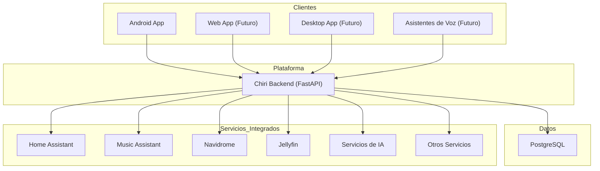

---

## 4.2 Descripción de las Capas

### Clientes

Corresponden a las aplicaciones que interactúan con la plataforma.

En la versión 1.0 el cliente oficial será la aplicación Android.

La arquitectura permite incorporar nuevos clientes sin modificar la lógica de negocio del sistema.

---

### Backend

El Backend de Chiri constituye el núcleo de la plataforma.

Sus principales responsabilidades son:

* Exponer la API.
* Implementar la lógica de negocio.
* Gestionar la autenticación y autorización.
* Coordinar la comunicación con los servicios integrados.
* Administrar la configuración de la plataforma.
* Centralizar el acceso a los datos.

---

### Base de Datos

PostgreSQL almacenará exclusivamente la información propia de Chiri.

Cada servicio integrado continuará utilizando su propio mecanismo de almacenamiento cuando corresponda.

---

### Servicios Integrados

Los servicios externos mantienen sus responsabilidades originales.

El Backend de Chiri actúa como una capa de integración que abstrae las particularidades de cada uno de ellos y proporciona una interfaz uniforme a los clientes.

---

## 4.3 Flujo General de Comunicación

Toda solicitud seguirá el siguiente flujo:

1. El cliente envía una solicitud al Backend de Chiri.
2. El Backend valida la autenticación y los permisos.
3. Se ejecuta la lógica de negocio correspondiente.
4. Si es necesario, el Backend interactúa con uno o varios servicios integrados.
5. El Backend procesa la información recibida.
6. Se genera una respuesta unificada para el cliente.

En ningún caso los clientes establecerán comunicación directa con los servicios integrados.

---

## 4.4 Beneficios de la Arquitectura

La arquitectura propuesta proporciona los siguientes beneficios:

* Punto único de acceso para todos los clientes.
* Independencia entre clientes y servicios integrados.
* Mayor seguridad mediante el control centralizado.
* Facilidad para incorporar nuevos módulos e integraciones.
* Reducción del acoplamiento entre componentes.
* Simplificación del mantenimiento y la evolución del sistema.
* Consistencia en la experiencia de usuario, independientemente del cliente utilizado.

# 5. Componentes del Sistema

Chiri Platform está compuesta por un conjunto de componentes especializados que trabajan de manera coordinada mediante interfaces definidas.

Cada componente posee una responsabilidad específica y debe mantenerse independiente de los demás componentes siempre que sea posible.

---

# 5.1 Cliente Android

## Responsabilidad

El cliente Android representa la interfaz principal de interacción del usuario con Chiri Platform.

Su función es presentar información, recibir acciones del usuario y comunicarse exclusivamente con la API de Chiri.

## Tecnologías

* Kotlin
* Jetpack Compose
* Arquitectura MVVM

## Responsabilidades

* Autenticación del usuario.
* Presentación de información.
* Envío de comandos.
* Gestión del estado de la interfaz.
* Manejo de preferencias locales.

## No es responsabilidad del cliente:

* Comunicarse directamente con servicios externos.
* Ejecutar lógica de negocio.
* Gestionar credenciales de servicios integrados.

---

# 5.2 Backend Chiri

## Responsabilidad

El Backend constituye el núcleo de la plataforma.

Es responsable de coordinar clientes, servicios integrados y datos propios de Chiri.

## Tecnologías

* Python
* FastAPI

## Responsabilidades

* Exposición de la API.
* Autenticación y autorización.
* Lógica de negocio.
* Gestión de usuarios.
* Integraciones externas.
* Gestión de configuraciones.
* Auditoría.
* Coordinación entre módulos.

## Principio fundamental

El Backend no sustituye los servicios integrados.

Actúa como una capa inteligente de integración y orquestación.

---

# 5.3 Base de Datos PostgreSQL

## Responsabilidad

PostgreSQL será la base de datos principal de información propia de Chiri.

## Almacenará

* Usuarios.
* Roles.
* Permisos.
* Configuraciones.
* Preferencias.
* Historial.
* Auditoría.
* Datos propios de la plataforma.

## No almacenará

Información que pertenece a servicios externos.

Ejemplos:

* Biblioteca musical de Navidrome.
* Dispositivos gestionados por Home Assistant.
* Biblioteca multimedia de Jellyfin.

---

# 5.4 Home Assistant

## Responsabilidad

Home Assistant continuará siendo el motor especializado de domótica.

## Funciones

* Gestión de dispositivos inteligentes.
* Automatizaciones.
* Sensores.
* Estados del hogar.
* Escenas.

## Integración con Chiri

Chiri consumirá sus capacidades mediante APIs o mecanismos oficiales de integración.

Chiri no reemplazará su lógica interna.

---

# 5.5 Music Assistant

## Responsabilidad

Music Assistant continuará siendo el motor especializado de gestión musical.

## Funciones

* Gestión de reproducción.
* Control de reproductores.
* Biblioteca musical.
* Integración con proveedores.

## Integración con Chiri

Chiri proporcionará una capa de acceso unificada sin replicar la lógica musical.

---

# 5.6 Navidrome

## Responsabilidad

Navidrome será responsable de la gestión del servidor musical y biblioteca compatible con OpenSubsonic.

## Funciones

* Almacenamiento y organización musical.
* Gestión de biblioteca.
* Acceso musical.

---

# 5.7 Jellyfin

## Responsabilidad

Jellyfin será responsable de la gestión multimedia.

## Funciones

* Películas.
* Series.
* Vídeos personales.
* Contenido multimedia.

---

# 5.8 Servicios de Inteligencia Artificial

## Responsabilidad

Los servicios de IA proporcionarán capacidades inteligentes a Chiri.

## Posibles funciones futuras

* Asistente conversacional.
* Automatizaciones inteligentes.
* Análisis de información.
* Interacción por voz.

La arquitectura permitirá integrar diferentes proveedores sin acoplar el núcleo de Chiri a uno específico.

---

# 5.9 Infraestructura Docker

## Responsabilidad

Docker será la capa encargada de ejecutar y administrar los servicios de la plataforma.

## Componentes

* Contenedores.
* Redes.
* Volúmenes.
* Configuración de despliegue.

## Objetivo

Garantizar un despliegue reproducible, organizado y mantenible.

# 6. Flujo de Comunicación

La comunicación dentro de Chiri Platform seguirá un modelo centralizado donde el Backend actúa como intermediario entre los clientes y los servicios integrados.

Este modelo garantiza seguridad, independencia tecnológica y control sobre todas las operaciones realizadas dentro de la plataforma.

---

# 6.1 Flujo General

El flujo principal de comunicación será:

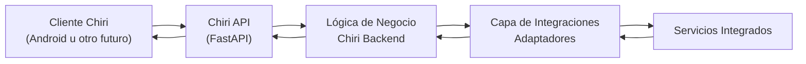

---

# 6.2 Solicitud de un Cliente

Cuando un cliente realiza una acción:

Ejemplo:

"Encender la luz del salón"

El flujo será:

1. El usuario ejecuta una acción desde la aplicación Android.
2. Android envía una solicitud a la API de Chiri.
3. La API valida:

   * identidad del usuario.
   * permisos.
   * formato de la solicitud.
4. El Backend procesa la lógica correspondiente.
5. El módulo de integración adecuado comunica la acción al servicio externo.
6. El servicio responde con el resultado.
7. Chiri procesa la respuesta.
8. La API devuelve una respuesta uniforme al cliente.

---

# 6.3 Comunicación con Servicios Externos

Cada servicio integrado tendrá un módulo responsable de la comunicación.

Ejemplo conceptual:

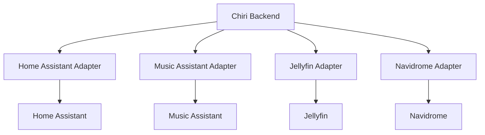

Los adaptadores tendrán como responsabilidad:

* conocer la API específica del servicio.
* transformar datos externos al modelo interno de Chiri.
* manejar errores de comunicación.
* ocultar detalles técnicos al resto del sistema.

---

# 6.4 Modelo de Abstracción

Los clientes nunca deberán conocer:

* direcciones IP internas.
* puertos de servicios.
* credenciales externas.
* tecnologías utilizadas internamente.
* estructura interna de cada servicio.

Ejemplo incorrecto:

```
Android
   |
   +--> Home Assistant API
   |
   +--> Jellyfin API
   |
   +--> Music Assistant API
```

Este modelo queda prohibido.

---

Modelo correcto:

```
Android
   |
   |
Chiri API
   |
   +--> Home Assistant
   +--> Jellyfin
   +--> Music Assistant
```

---

# 6.5 Flujo de Respuesta

Las respuestas hacia los clientes deberán utilizar modelos propios de Chiri.

Ejemplo:

Un reproductor puede devolver:

```json
{
  "service": "music",
  "status": "playing",
  "title": "Canción",
  "artist": "Artista"
}
```

El cliente no deberá depender del formato original utilizado por Music Assistant o cualquier otro servicio.

---

# 6.6 Manejo de Errores

Los errores deberán ser gestionados por la capa correspondiente.

Ejemplo:

Si Music Assistant no responde:

El cliente no recibirá un error técnico como:

```
Connection refused 192.168.1.88:8095
```

Recibirá una respuesta controlada por Chiri:

```json
{
  "error": "MUSIC_SERVICE_UNAVAILABLE",
  "message": "El servicio musical no está disponible"
}
```

---

# 6.7 Beneficios del Modelo

Este flujo proporciona:

* Seguridad centralizada.
* Independencia de servicios externos.
* Clientes más simples.
* Facilidad para cambiar tecnologías internas.
* Control de permisos.
* Mejor experiencia de usuario.
* Mayor facilidad de mantenimiento.

---

# 6.8 Regla Arquitectónica

Toda comunicación dentro de Chiri Platform deberá cumplir:

> Los clientes se comunican únicamente con la API de Chiri.
> La API de Chiri se comunica con los servicios internos y externos mediante módulos especializados.

# 7. Integraciones Externas

Chiri Platform está diseñada para integrarse con servicios especializados existentes, evitando duplicar funcionalidades que ya están resueltas por plataformas maduras.

Cada integración deberá realizarse mediante un módulo específico que permita comunicarse con el servicio externo sin exponer sus detalles internos al resto de la plataforma.

---

# 7.1 Principios de Integración

Toda integración externa deberá cumplir:

* Utilizar APIs o mecanismos oficiales cuando estén disponibles.
* Mantener aislada la lógica específica del servicio.
* Evitar dependencias directas desde los clientes.
* Transformar datos externos al modelo interno de Chiri.
* Gestionar errores y estados del servicio.
* Permitir sustituir el servicio con impacto mínimo.

---

# 7.2 Home Assistant

## Responsabilidad externa

Home Assistant continuará siendo el sistema especializado encargado de la domótica del hogar.

## Funciones principales

* Gestión de dispositivos inteligentes.
* Estados de sensores.
* Automatizaciones.
* Escenas.
* Entidades del hogar.

## Responsabilidad de Chiri

Chiri podrá:

* Consultar estados.
* Ejecutar acciones autorizadas.
* Presentar información al usuario.
* Integrar eventos relevantes.

Chiri no desarrollará:

* Motor propio de automatizaciones.
* Gestión propia de dispositivos.
* Sustitución de entidades de Home Assistant.

---

# 7.3 Music Assistant

## Responsabilidad externa

Music Assistant será el motor especializado para gestión musical.

## Funciones principales

* Biblioteca musical.
* Reproducción.
* Gestión de reproductores.
* Cola musical.
* Proveedores musicales.

## Responsabilidad de Chiri

Chiri podrá:

* Mostrar información musical.
* Solicitar reproducción.
* Gestionar acciones permitidas.
* Integrar controles musicales dentro de una experiencia unificada.

Chiri no desarrollará:

* Motor musical propio.
* Gestión independiente de bibliotecas.
* Sustitución del servidor musical.

---

# 7.4 Navidrome

## Responsabilidad externa

Navidrome será responsable de proporcionar el servicio musical compatible con OpenSubsonic.

## Funciones principales

* Organización de biblioteca musical.
* Gestión de archivos musicales.
* Exposición de contenido musical.

## Responsabilidad de Chiri

Chiri podrá:

* Consultar información musical.
* Integrar contenido disponible.
* Coordinar experiencias relacionadas con música.

Chiri no administrará directamente la biblioteca interna de Navidrome.

---

# 7.5 Jellyfin

## Responsabilidad externa

Jellyfin será el sistema especializado para contenido multimedia.

## Funciones principales

* Películas.
* Series.
* Vídeos personales.
* Biblioteca multimedia.

## Responsabilidad de Chiri

Chiri podrá:

* Mostrar información multimedia.
* Integrar accesos.
* Coordinar experiencias desde una interfaz común.

Chiri no reemplazará:

* Gestión multimedia.
* Transcodificación.
* Administración de bibliotecas.

---

# 7.6 Servicios de Inteligencia Artificial

## Responsabilidad externa

Los servicios de IA proporcionarán capacidades inteligentes a la plataforma.

## Posibles funciones

* Asistente conversacional.
* Interpretación de comandos.
* Automatizaciones inteligentes.
* Análisis de información.
* Procesamiento de lenguaje natural.

## Principio de diseño

Chiri no dependerá de un único proveedor de IA.

La integración deberá permitir cambiar o añadir proveedores mediante módulos independientes.

---

# 7.7 Futuras Integraciones

La arquitectura permitirá incorporar nuevos servicios como:

* Nuevos dispositivos inteligentes.
* Servicios de información.
* Plataformas externas.
* Nuevas capacidades de IA.
* Nuevos clientes.

Toda nueva integración deberá respetar:

* API de Chiri.
* Adaptadores independientes.
* Separación de responsabilidades.
* Principios arquitectónicos definidos.

---

# 7.8 Regla de Integración

Toda integración externa deberá responder a la siguiente pregunta:

> ¿Chiri agrega valor integrando este servicio o está duplicando una funcionalidad existente?

Si la integración solamente duplica una solución madura existente, no deberá desarrollarse.


# 8. Diagramas Arquitectónicos

## 8.1 Convenciones Generales

Todos los diagramas arquitectónicos deberán cumplir las siguientes reglas:

* Utilizar Mermaid como formato principal.
* Mantener una estructura simple y legible.
* Representar responsabilidades, no detalles innecesarios.
* Evitar diagramas excesivamente complejos.
* Separar diagramas de alto nivel y diagramas de detalle.
* Actualizar los diagramas cuando una decisión arquitectónica cambie.

---

# 8.2 Diagrama General de Plataforma

Este diagrama representa la vista principal de Chiri Platform.

Su objetivo es mostrar la relación entre clientes, backend, datos e integraciones.

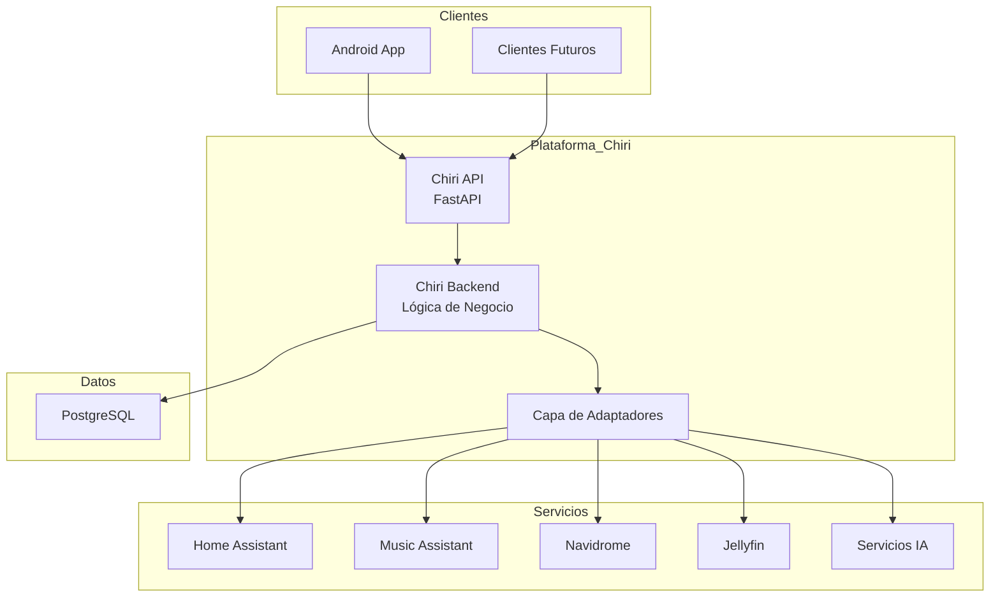

---

# 8.3 Diagrama de Despliegue

Representa cómo los componentes se ejecutarán físicamente dentro de la infraestructura.

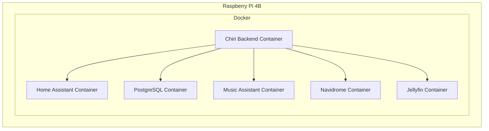

---

# 8.4 Diagrama de Comunicación

Representa el flujo de una solicitud dentro del sistema.

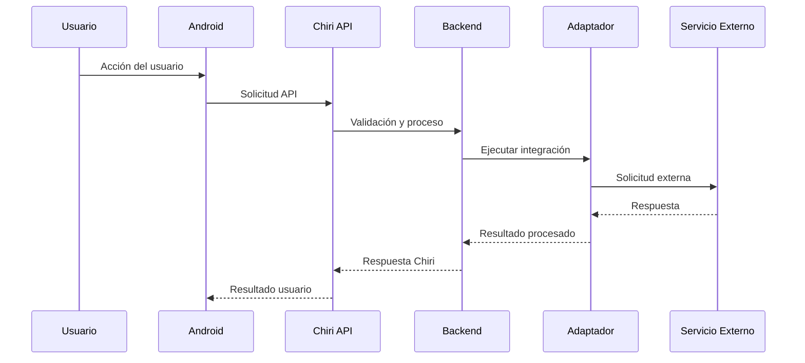

---

# 8.5 Diagrama de Evolución Futura

Representa la capacidad de crecimiento de la plataforma.

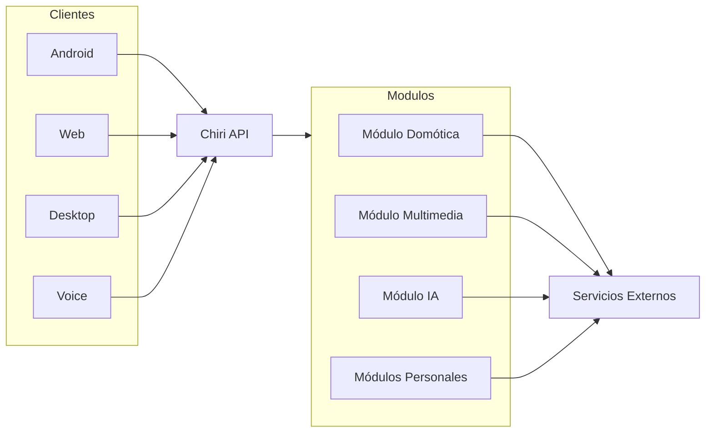

---

# 8.6 Mantenimiento de Diagramas

Los diagramas deberán actualizarse cuando:

* Se agregue un componente principal.
* Se elimine un componente.
* Cambie un flujo de comunicación.
* Se modifique una decisión arquitectónica.

Los cambios menores de implementación no requieren modificar los diagramas de arquitectura.

---

# 8.7 Principio Visual

Los diagramas de Chiri deberán responder rápidamente:

* ¿Qué componentes existen?
* ¿Cuál es la responsabilidad de cada uno?
* ¿Cómo se comunican?
* ¿Dónde se ejecutan?

Un diagrama correcto debe simplificar la comprensión, no sustituir la documentación técnica.

# 9. Decisiones Arquitectónicas

Las decisiones arquitectónicas de Chiri Platform deberán estar documentadas para mantener trazabilidad, facilitar el mantenimiento y evitar modificaciones basadas únicamente en preferencias personales.

Cada decisión relevante deberá registrar:

* El problema identificado.
* Las alternativas consideradas.
* La solución seleccionada.
* Los motivos técnicos de la decisión.
* Las consecuencias esperadas.

---

# 9.1 Architecture Decision Record (ADR)

Las decisiones importantes serán registradas mediante documentos ADR (Architecture Decision Record).

Los ADR estarán almacenados en:

```
docs/adr/
```

Cada ADR tendrá un identificador único.

Ejemplo:

```
ADR-001-fastapi-backend.md
ADR-002-postgresql-selection.md
ADR-003-authentication-model.md
```

---

# 9.2 Cuándo Crear un ADR

Se deberá crear un ADR cuando una decisión tenga impacto sobre:

* Arquitectura general.
* Tecnologías principales.
* Seguridad.
* Modelo de datos.
* Comunicación entre componentes.
* Infraestructura.
* Escalabilidad futura.

---

# 9.3 Cuándo No Crear un ADR

No será necesario crear un ADR para:

* Cambios internos de implementación.
* Correcciones de errores.
* Refactorizaciones sin impacto arquitectónico.
* Cambios menores de código.
* Ajustes de interfaz visual.

---

# 9.4 Formato de un ADR

Cada ADR deberá contener como mínimo:

```markdown
# ADR-XXX: Título

## Estado

Aceptado / Rechazado / Sustituido

## Contexto

Descripción del problema o necesidad.

## Alternativas consideradas

Opciones evaluadas.

## Decisión

Solución seleccionada.

## Justificación

Motivos técnicos.

## Consecuencias

Beneficios y posibles limitaciones.
```

---

# 9.5 Decisiones Iniciales Registradas

Como parte de la arquitectura inicial de Chiri Platform se reconocen las siguientes decisiones:

---

## ADR-001: Selección de FastAPI como Backend

### Estado

Aceptado.

### Decisión

Utilizar Python + FastAPI como tecnología principal del Backend.

### Justificación

* Afinidad con inteligencia artificial.
* Amplio ecosistema de automatización.
* Buen soporte para APIs modernas.
* Menor cantidad de tecnologías principales.
* Adecuado para ejecución en Raspberry Pi mediante Docker.

---

## ADR-002: Arquitectura API Centralizada

### Estado

Aceptado.

### Decisión

Todos los clientes deberán comunicarse exclusivamente mediante la API de Chiri.

### Justificación

* Seguridad centralizada.
* Separación de responsabilidades.
* Independencia de clientes.
* Facilidad de evolución.

---

## ADR-003: Integración sin Reemplazo

### Estado

Aceptado.

### Decisión

Chiri integrará servicios existentes sin sustituirlos.

### Justificación

* Evitar duplicación de funcionalidades.
* Aprovechar plataformas maduras.
* Reducir complejidad.
* Mejorar mantenibilidad.

---

# 9.6 Revisión de Decisiones

Las decisiones arquitectónicas aceptadas deberán mantenerse mientras continúen cumpliendo los objetivos del proyecto.

Una decisión podrá modificarse únicamente cuando exista una razón técnica importante:

* Problema de seguridad.
* Limitación de rendimiento.
* Problema de mantenimiento.
* Necesidad de escalabilidad.

Las modificaciones deberán generar un nuevo ADR explicando el cambio.

---

# 9.7 Principio de Trazabilidad

Toda decisión importante debe responder:

> ¿Por qué está construido Chiri de esta manera?

La respuesta deberá encontrarse en la documentación, no depender del conocimiento de una persona específica.

# 10. Escalabilidad

La arquitectura de Chiri Platform está diseñada para permitir su evolución progresiva sin requerir cambios estructurales importantes.

La escalabilidad del proyecto se basa principalmente en la modularidad, separación de responsabilidades y capacidad de extensión de componentes.

El objetivo no es agregar complejidad anticipadamente, sino mantener la posibilidad de crecimiento cuando exista una necesidad real.

---

# 10.1 Principio de Crecimiento Controlado

Chiri Platform deberá crecer mediante la incorporación de nuevos módulos, integraciones o clientes, evitando modificaciones innecesarias al núcleo del sistema.

La evolución deberá realizarse de forma incremental:

```
Funcionalidad nueva
        |
        v
Nuevo módulo o integración
        |
        v
API existente
        |
        v
Clientes existentes
```

---

# 10.2 Escalabilidad de Clientes

La arquitectura permite incorporar nuevos clientes sin modificar la lógica principal.

Clientes futuros posibles:

* Aplicación Web.
* Aplicación Desktop.
* Tablet.
* Interfaces de voz.
* Automatizaciones externas.

Todos deberán consumir la misma API de Chiri.

Ejemplo:

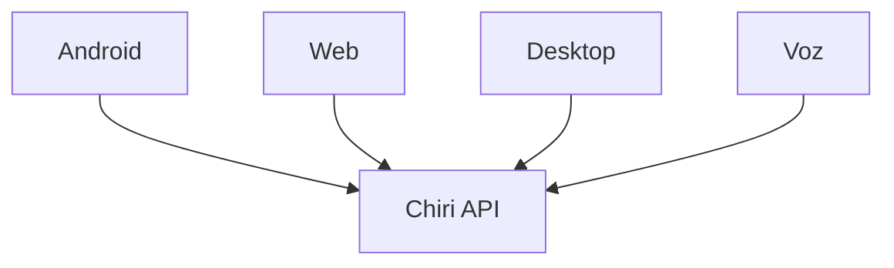

---

# 10.3 Escalabilidad de Servicios

La incorporación de nuevos servicios deberá realizarse mediante adaptadores independientes.

Ejemplo:

Actualmente:

```
Chiri Backend
       |
       +--- Home Assistant
       +--- Music Assistant
       +--- Jellyfin
```

Evolución futura:

```
Chiri Backend
       |
       +--- Home Assistant
       +--- Music Assistant
       +--- Jellyfin
       +--- Nuevo Servicio
```

La incorporación de un nuevo servicio no deberá modificar los módulos existentes.

---

# 10.4 Escalabilidad del Backend

El Backend deberá diseñarse para permitir una evolución progresiva.

La estructura permitirá separar responsabilidades cuando sea necesario:

Estado inicial:

```
Chiri Backend
 |
 +-- API
 +-- Servicios
 +-- Integraciones
```

Evolución futura:

```
Chiri Platform

 +-- API Gateway
 |
 +-- Servicio Usuarios
 |
 +-- Servicio Domótica
 |
 +-- Servicio Multimedia
 |
 +-- Servicio IA
```

Esta separación solo deberá realizarse cuando exista una necesidad real.

No se implementará complejidad distribuida antes de ser necesaria.

---

# 10.5 Escalabilidad de Infraestructura

La primera versión utilizará:

* Raspberry Pi 4B.
* Docker.
* Docker Compose.

Esta arquitectura permite evolucionar posteriormente hacia hardware superior sin modificar la lógica del sistema.

Ejemplos futuros:

* Raspberry Pi más potente.
* Mini PC.
* Servidor doméstico.
* Máquina virtual.
* Infraestructura híbrida.

---

# 10.6 Escalabilidad de Base de Datos

PostgreSQL será utilizado como base de datos principal de Chiri.

La arquitectura permitirá:

* crecimiento del modelo de datos.
* incorporación de nuevos módulos.
* optimización mediante índices.
* separación futura de bases de datos si fuera necesario.

No se crearán estructuras complejas hasta que exista una necesidad funcional.

---

# 10.7 Escalabilidad de Inteligencia Artificial

La arquitectura permitirá integrar diferentes proveedores o modelos de inteligencia artificial.

Chiri deberá evitar depender de un único proveedor.

La integración deberá realizarse mediante una capa abstracta.

Ejemplo:

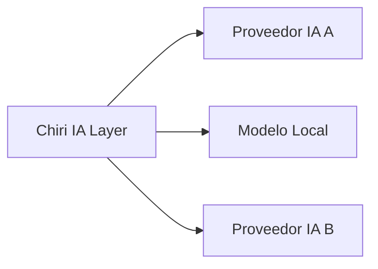

---

# 10.8 Principio de Escalabilidad

La escalabilidad de Chiri se basa en:

* Agregar capacidades, no complejidad.
* Extender, no reemplazar.
* Modularizar, no duplicar.
* Evolucionar cuando exista una necesidad real.

---

# 10.9 Regla Arquitectónica

La plataforma deberá responder siempre a la siguiente pregunta antes de crecer:

> ¿La nueva capacidad requiere modificar el núcleo de Chiri o puede incorporarse como un módulo independiente?

La segunda opción será siempre la preferida.

# 11. Seguridad Arquitectónica

La seguridad de Chiri Platform será considerada un requisito fundamental desde la etapa de diseño.

La arquitectura deberá proteger los datos, servicios y dispositivos administrados por la plataforma, aplicando controles adecuados sin comprometer la simplicidad y mantenibilidad del sistema.

El principio general será:

> La seguridad debe formar parte de la arquitectura, no ser una corrección posterior.

---

# 11.1 Principios Generales de Seguridad

Chiri Platform aplicará los siguientes principios:

* Seguridad por defecto.
* Mínimo privilegio.
* Separación de responsabilidades.
* Protección de credenciales.
* Validación de entradas.
* Comunicación segura.
* Auditoría de acciones relevantes.

---

# 11.2 Control de Acceso Centralizado

El control de acceso será responsabilidad del Backend de Chiri.

Los clientes no gestionarán permisos directamente sobre servicios externos.

El flujo será:

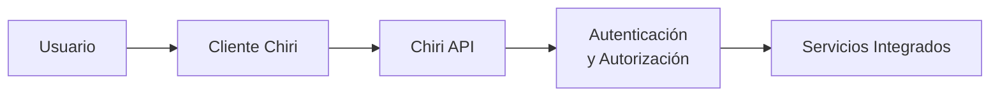

El Backend será responsable de determinar:

* quién realiza una acción.
* qué permisos posee.
* qué operaciones puede ejecutar.

---

# 11.3 Autenticación

La autenticación deberá permitir identificar de forma segura a los usuarios de la plataforma.

La arquitectura permitirá implementar mecanismos como:

* usuarios internos de Chiri.
* tokens de acceso.
* sesiones seguras.
* integración futura con proveedores externos.

La implementación específica se definirá en el documento:

`070_Seguridad.md`

---

# 11.4 Autorización

La autenticación identifica al usuario.

La autorización determina qué puede hacer.

Ejemplos:

Usuario:

* Puede controlar multimedia.
* Puede consultar sensores.

Administrador:

* Puede modificar configuraciones.
* Puede administrar integraciones.
* Puede gestionar usuarios.

Los permisos serán administrados por Chiri y no por cada servicio externo.

---

# 11.5 Gestión de Credenciales

Las credenciales de servicios externos nunca deberán almacenarse:

* en código fuente.
* dentro de aplicaciones cliente.
* en archivos públicos.
* en repositorios Git.

Las credenciales deberán gestionarse mediante mecanismos seguros.

Ejemplos:

* variables de entorno.
* archivos protegidos.
* gestores de secretos futuros.

---

# 11.6 Seguridad de Comunicaciones

Toda comunicación deberá utilizar mecanismos seguros cuando exista exposición fuera del entorno local.

Principios:

* Evitar conexiones sin protección.
* Proteger tokens y credenciales.
* Validar certificados cuando corresponda.
* Separar redes internas y externas.

---

# 11.7 Seguridad de Servicios Integrados

Chiri no deberá asumir que un servicio externo es completamente confiable.

Cada integración deberá:

* validar respuestas.
* controlar errores.
* limitar permisos.
* ocultar detalles internos.

Ejemplo:

Un fallo en Jellyfin no deberá comprometer el funcionamiento del módulo de domótica.

---

# 11.8 Protección de Datos

Los datos propios de Chiri deberán clasificarse y protegerse según su importancia.

Ejemplos:

Información sensible:

* credenciales.
* tokens.
* configuraciones privadas.
* información personal.

Información no sensible:

* preferencias generales.
* datos públicos del sistema.

---

# 11.9 Auditoría

La plataforma deberá permitir registrar acciones importantes.

Ejemplos:

* inicio de sesión.
* cambios de configuración.
* acciones administrativas.
* modificaciones de integraciones.

La auditoría permitirá:

* diagnóstico.
* seguridad.
* seguimiento de cambios.

---

# 11.10 Seguridad en Clientes

Los clientes deberán:

* almacenar únicamente información necesaria.
* evitar guardar secretos.
* utilizar comunicaciones seguras.
* respetar el modelo de permisos definido por Chiri.

La aplicación Android no tendrá acceso directo a servicios internos.

---

# 11.11 Principio de Mínimo Privilegio

Cada componente deberá tener únicamente los permisos necesarios para cumplir su función.

Ejemplos:

* Un módulo musical no necesita administrar usuarios.
* Un cliente móvil no necesita credenciales de Home Assistant.
* Un adaptador no debe acceder a datos que no utiliza.

---

# 11.12 Evolución de Seguridad

La seguridad deberá evolucionar junto con la plataforma.

Las mejoras futuras podrán incluir:

* autenticación multifactor.
* gestión avanzada de roles.
* certificados internos.
* monitoreo de seguridad.
* gestión profesional de secretos.

Estas mejoras deberán incorporarse sin romper la arquitectura existente.

---

# 11.13 Regla Arquitectónica

Toda nueva funcionalidad deberá responder:

> ¿Esta funcionalidad mantiene o mejora la seguridad de Chiri Platform?

Si una solución aumenta capacidades pero reduce la seguridad, deberá ser revisada antes de implementarse.

# 12. Conclusiones

La arquitectura definida para Chiri Platform v1.0 establece una base técnica orientada a la estabilidad, mantenibilidad y evolución controlada del proyecto.

La plataforma se construye bajo un modelo centralizado mediante una API propia, donde el Backend Chiri actúa como núcleo de integración entre los clientes y los servicios especializados.

---

# 12.1 Arquitectura Consolidada

La arquitectura final queda definida como:

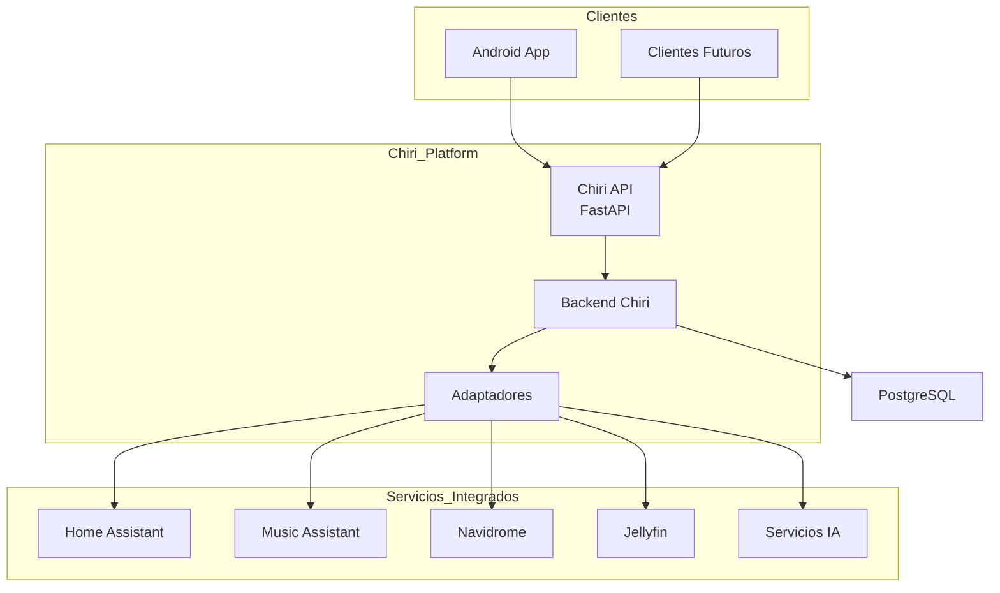

---

# 12.2 Principios Fundamentales Confirmados

La arquitectura de Chiri Platform se basa en:

* API como punto central de comunicación.
* Separación clara de responsabilidades.
* Integración antes que reemplazo.
* Modularidad.
* Bajo acoplamiento.
* Seguridad por diseño.
* Documentación como fuente de verdad.
* Evolución controlada.

---

# 12.3 Límites Arquitectónicos Confirmados

Chiri Platform no será:

* Un reemplazo de Home Assistant.
* Un reemplazo de Music Assistant.
* Un reemplazo de Navidrome.
* Un reemplazo de Jellyfin.
* Un sistema monolítico con múltiples responsabilidades mezcladas.

Chiri será:

* Una plataforma de integración.
* Una capa de inteligencia y coordinación.
* Un punto único de acceso.
* Una base para futuras capacidades personales.

---

# 12.4 Preparación para Implementación

Con la arquitectura definida, los siguientes documentos podrán desarrollar aspectos específicos:

## Backend

`030_Backend.md`

Definirá:

* estructura del código.
* organización interna.
* módulos.
* patrones de desarrollo.
* responsabilidades.

---

## Android

`040_Android.md`

Definirá:

* arquitectura MVVM.
* organización de paquetes.
* navegación.
* comunicación con API.

---

## Base de Datos

`050_BaseDatos.md`

Definirá:

* modelo de datos.
* entidades.
* relaciones.
* convenciones.

---

## API

`060_API.md`

Definirá:

* endpoints.
* contratos.
* modelos.
* respuestas.

---

## Seguridad

`070_Seguridad.md`

Desarrollará la implementación detallada de los principios definidos en esta arquitectura.

---

# 12.5 Estado de la Arquitectura

La arquitectura de Chiri Platform v1.0 queda definida y preparada para iniciar la fase de diseño detallado e implementación.

Cualquier modificación futura deberá seguir el proceso establecido mediante ADR.

La arquitectura será considerada estable mientras cumpla los objetivos definidos en:

`000_Principios.md`

y

`010_Proyecto.md`

---

# Declaración Final

Chiri Platform v1.0 cuenta con una arquitectura modular, segura y escalable que permite integrar servicios existentes y evolucionar hacia nuevas capacidades manteniendo control, simplicidad y sostenibilidad técnica.
