# Chiri Platform

**Documento:** 030_Backend.md

**Versión:** 1.0

**Estado:** Borrador

---

# 1. Introducción

El Backend de Chiri Platform constituye el núcleo central de la plataforma.

Su responsabilidad principal es proporcionar una capa de integración, coordinación y control entre los clientes de Chiri y los diferentes servicios que forman parte del ecosistema.

El Backend no reemplaza las funcionalidades propias de los servicios integrados.

Su función es:

* centralizar el acceso,
* aplicar reglas de negocio,
* gestionar seguridad,
* transformar información,
* coordinar servicios,
* proporcionar una experiencia uniforme a los clientes.

---

# 1.1 Objetivo del Backend

El objetivo del Backend es proporcionar una API estable y segura que permita a los diferentes clientes interactuar con la plataforma sin conocer la implementación interna de los servicios integrados.

El Backend deberá ocultar la complejidad del ecosistema y ofrecer una interfaz coherente para:

* domótica,
* multimedia,
* inteligencia artificial,
* servicios personales.

---

# 1.2 Responsabilidad Principal

El Backend será responsable de:

* Exponer la API de Chiri.
* Gestionar autenticación y autorización.
* Ejecutar lógica de negocio.
* Coordinar módulos internos.
* Integrar servicios externos.
* Gestionar los datos propios de la plataforma.
* Registrar eventos importantes.
* Mantener contratos estables con los clientes.

---

# 1.3 Lo que NO hará el Backend

El Backend no será responsable de:

* Reproducir música directamente.
* Administrar dispositivos físicos directamente.
* Gestionar bibliotecas multimedia propias.
* Sustituir servicios especializados.
* Ejecutar lógica que pertenezca a plataformas externas.

Ejemplos:

La reproducción musical pertenece a Music Assistant.

La gestión de dispositivos inteligentes pertenece a Home Assistant.

La gestión multimedia pertenece a Jellyfin.

Chiri coordina estas capacidades.

---

# 1.4 Tecnología Base

La tecnología definida para el Backend es:

* Lenguaje: Python.
* Framework API: FastAPI.
* Base de datos: PostgreSQL.
* Contenedores: Docker.
* Orquestación de servicios: Docker Compose.

El diseño deberá aprovechar las capacidades del ecosistema Python manteniendo una arquitectura limpia, segura y mantenible.

---

# 1.5 Principio Rector

El Backend deberá seguir el siguiente principio:

> El Backend de Chiri no debe ser un conjunto de integraciones conectadas; debe ser una plataforma organizada que utiliza integraciones como capacidades.

---

# 1.6 Relación con la Arquitectura General

El Backend implementa la capa central definida en:

`020_Arquitectura.md`

Su posición dentro del sistema es:

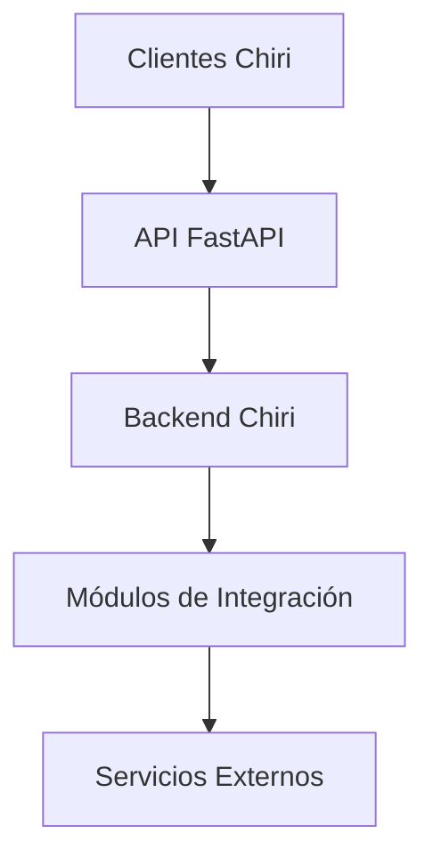

---

# 1.7 Estado del Documento

Este documento definirá las reglas internas del Backend y será la referencia arquitectónica para su implementación.

No contiene código.

Define diseño, responsabilidades y organización.

# 2. Arquitectura Interna del Backend

El Backend de Chiri Platform estará organizado mediante una arquitectura por capas, donde cada capa tendrá responsabilidades específicas y límites claramente definidos.

El objetivo es mantener:

* bajo acoplamiento,
* alta cohesión,
* facilidad de mantenimiento,
* posibilidad de evolución futura.

La estructura interna seguirá el principio:

> Cada capa conoce únicamente las capas necesarias para cumplir su responsabilidad.

---

# 2.1 Vista General de Capas

La arquitectura interna del Backend será:

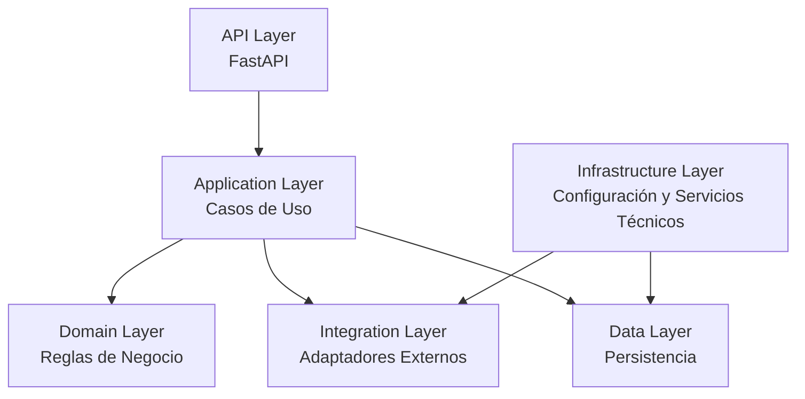

---

# 2.2 API Layer

## Responsabilidad

La capa API representa el punto de entrada del Backend.

Su función es recibir solicitudes externas y devolver respuestas mediante contratos definidos.

## Responsabilidades

* Definir endpoints.
* Validar solicitudes.
* Gestionar modelos de entrada y salida.
* Controlar códigos de respuesta.
* Gestionar dependencias de autenticación.

## No debe contener:

* Lógica de negocio.
* Consultas complejas a base de datos.
* Comunicación directa con servicios externos.

---

# 2.3 Application Layer

## Responsabilidad

La capa de aplicación coordina las operaciones principales de Chiri.

Representa los casos de uso del sistema.

Ejemplos:

* Encender dispositivo.
* Reproducir música.
* Consultar estado del hogar.
* Gestionar preferencias.

## Responsabilidades

* Coordinar procesos.
* Ejecutar casos de uso.
* Utilizar servicios internos.
* Coordinar integraciones.

## No debe contener:

* Detalles técnicos de APIs externas.
* Código específico de base de datos.

---

# 2.4 Domain Layer

## Responsabilidad

La capa de dominio contiene las reglas propias de Chiri.

Representa la lógica que pertenece a la plataforma y no a servicios externos.

Ejemplos:

* permisos.
* usuarios.
* preferencias.
* reglas internas.

## Principio

El dominio de Chiri debe ser independiente de tecnologías externas.

---

# 2.5 Integration Layer

## Responsabilidad

La capa de integración contiene los adaptadores hacia servicios externos.

Ejemplos:

* Home Assistant.
* Music Assistant.
* Navidrome.
* Jellyfin.
* Servicios IA.

## Responsabilidades

* Comunicación externa.
* Transformación de datos.
* Manejo de errores externos.
* Ocultar detalles del servicio.

## Ejemplo conceptual:

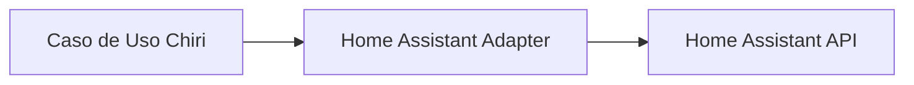

---

# 2.6 Data Layer

## Responsabilidad

La capa de datos administra la persistencia propia de Chiri.

## Responsabilidades

* Acceso a PostgreSQL.
* Modelos persistentes.
* Consultas.
* Migraciones.

## Principio

La capa de datos no debe contener reglas de negocio.

---

# 2.7 Infrastructure Layer

## Responsabilidad

Contiene elementos técnicos necesarios para ejecutar la plataforma.

Ejemplos:

* configuración.
* variables de entorno.
* logs.
* clientes HTTP.
* seguridad técnica.
* utilidades compartidas.

---

# 2.8 Regla de Dependencias

Las dependencias deberán seguir una dirección controlada:

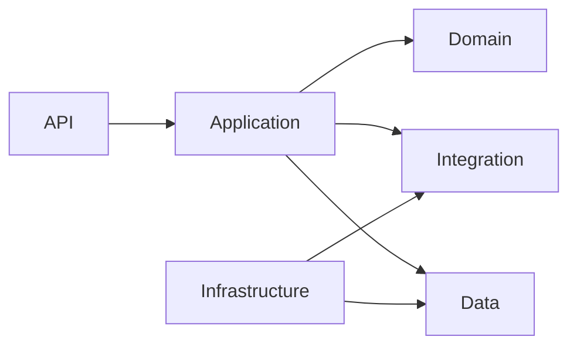

Las capas internas no deberán depender de detalles externos.

---

# 2.9 Beneficios de esta Organización

Esta arquitectura permite:

* cambiar una integración sin afectar el dominio.
* cambiar PostgreSQL sin modificar reglas de negocio.
* crear nuevos clientes sin modificar lógica interna.
* realizar pruebas más simples.
* mantener código organizado.

---

# 2.10 Principio Arquitectónico

La implementación del Backend deberá priorizar:

> La lógica de Chiri debe permanecer independiente de las tecnologías utilizadas para ejecutarla.

# 3. Estructura del Proyecto Backend

La estructura del Backend de Chiri Platform estará organizada para reflejar las responsabilidades definidas en la arquitectura interna.

La organización deberá favorecer:

* separación de responsabilidades,
* facilidad de navegación,
* mantenimiento a largo plazo,
* incorporación de nuevos módulos.

---

# 3.1 Estructura General

La carpeta del Backend será:

```text
server/
│
├── app/
│
├── tests/
│
├── migrations/
│
├── scripts/
│
├── Dockerfile
│
├── requirements.txt
│
├── docker-compose.yml
│
└── README.md
```

---

# 3.2 Carpeta Principal `app/`

Contendrá todo el código fuente de Chiri Backend.

Estructura:

```text
app/

├── api/
├── application/
├── domain/
├── integrations/
├── infrastructure/
├── database/
├── security/
├── config/
└── main.py
```

---

# 3.3 `api/`

## Responsabilidad

Contiene la capa de exposición HTTP mediante FastAPI.

Ejemplo:

```text
api/

├── routes/
├── schemas/
└── dependencies/
```

Contendrá:

* endpoints.
* modelos de entrada.
* modelos de salida.
* dependencias HTTP.

No contendrá:

* reglas de negocio.
* consultas directas.
* llamadas directas a servicios externos.

---

# 3.4 `application/`

## Responsabilidad

Contiene los casos de uso de Chiri.

Ejemplo:

```text
application/

├── services/
├── use_cases/
└── dto/
```

Contendrá:

* coordinación de operaciones.
* flujo de procesos.
* lógica de aplicación.

---

# 3.5 `domain/`

## Responsabilidad

Contiene las reglas propias de Chiri.

Ejemplo:

```text
domain/

├── models/
├── entities/
├── value_objects/
└── exceptions/
```

Contendrá:

* entidades.
* reglas de negocio.
* conceptos centrales.

No dependerá de:

* FastAPI.
* PostgreSQL.
* APIs externas.

---

# 3.6 `integrations/`

## Responsabilidad

Contiene adaptadores para servicios externos.

Ejemplo:

```text
integrations/

├── home_assistant/
├── music_assistant/
├── navidrome/
├── jellyfin/
└── ai/
```

Cada integración deberá ser independiente.

---

# 3.7 `database/`

## Responsabilidad

Gestiona la persistencia de Chiri.

Ejemplo:

```text
database/

├── models/
├── repositories/
└── migrations/
```

Contendrá:

* modelos ORM.
* repositorios.
* conexión a PostgreSQL.

---

# 3.8 `security/`

## Responsabilidad

Agrupa componentes relacionados con seguridad.

Ejemplo:

```text
security/

├── authentication/
├── authorization/
└── tokens/
```

---

# 3.9 `config/`

## Responsabilidad

Gestiona configuración del sistema.

Ejemplo:

```text
config/

├── settings.py
└── constants.py
```

---

# 3.10 `main.py`

Será el punto de entrada del Backend.

Responsabilidades:

* crear aplicación FastAPI.
* cargar configuración.
* registrar rutas.
* inicializar componentes necesarios.

No contendrá lógica de negocio.

---

# 3.11 Pruebas

La carpeta:

```text
tests/
```

contendrá pruebas organizadas según capas:

```text
tests/

├── api/
├── application/
├── domain/
└── integrations/
```

---

# 3.12 Principio de Organización

La estructura del código deberá reflejar la arquitectura.

No se crearán carpetas por comodidad temporal.

Cada nuevo componente deberá ubicarse según su responsabilidad.

---

# 3.13 Regla Arquitectónica

Antes de crear un nuevo archivo o módulo deberá responderse:

> ¿A qué responsabilidad pertenece este componente?

Si no existe una ubicación clara, primero deberá revisarse el diseño antes de programar.

# 4. Módulos Funcionales del Backend

El Backend de Chiri Platform estará organizado mediante módulos funcionales independientes.

Cada módulo representa una capacidad específica de la plataforma y deberá mantener una responsabilidad claramente definida.

Los módulos funcionales utilizarán las capas internas definidas anteriormente:

* API Layer.
* Application Layer.
* Domain Layer.
* Integration Layer.
* Data Layer.

---

# 4.1 Módulo de Usuarios

## Responsabilidad

Gestionar los usuarios que interactúan con Chiri Platform.

## Funciones principales

* Creación de usuarios.
* Gestión de perfiles.
* Administración de estados.
* Preferencias personales.
* Asociación de permisos.

## No será responsable de:

* Autenticación técnica.
* Comunicación con servicios externos.

---

# 4.2 Módulo de Autenticación y Autorización

## Responsabilidad

Controlar el acceso seguro a la plataforma.

## Funciones principales

* Inicio de sesión.
* Validación de identidad.
* Gestión de sesiones.
* Control de permisos.
* Protección de recursos.

## Integración

Este módulo estará relacionado con:

* Base de datos PostgreSQL.
* Sistema de seguridad.
* API de Chiri.

---

# 4.3 Módulo de Domótica

## Responsabilidad

Proporcionar una capa de integración con sistemas de automatización del hogar.

## Integración principal

* Home Assistant.

## Funciones posibles

* Consultar estados.
* Ejecutar acciones.
* Obtener información de dispositivos.
* Integrar eventos relevantes.

## No será responsable de:

* Administrar dispositivos directamente.
* Crear un motor propio de automatización.

---

# 4.4 Módulo Multimedia

## Responsabilidad

Centralizar las capacidades multimedia disponibles en Chiri.

## Integraciones previstas

* Music Assistant.
* Navidrome.
* Jellyfin.

## Funciones posibles

* Consultar contenido.
* Gestionar reproducción.
* Mostrar información multimedia.
* Coordinar experiencias entre servicios.

## No será responsable de:

* Servir contenido multimedia.
* Administrar bibliotecas externas.

---

# 4.5 Módulo de Inteligencia Artificial

## Responsabilidad

Proporcionar capacidades inteligentes a la plataforma.

## Funciones futuras posibles

* Asistente conversacional.
* Interpretación de lenguaje natural.
* Automatizaciones inteligentes.
* Análisis de información.
* Interacción por voz.

## Principio

El módulo deberá permitir integrar diferentes proveedores de IA sin acoplar el sistema a uno específico.

---

# 4.6 Módulo de Configuración

## Responsabilidad

Gestionar la configuración propia de Chiri.

## Funciones principales

* Preferencias del sistema.
* Configuración de módulos.
* Parámetros generales.
* Estado de componentes.

## Principio

La configuración de Chiri será independiente de la configuración interna de servicios externos.

---

# 4.7 Módulo de Auditoría

## Responsabilidad

Registrar eventos importantes de la plataforma.

## Funciones principales

* Registro de acciones.
* Seguimiento de cambios.
* Historial administrativo.
* Diagnóstico.

Ejemplos:

* Usuario inició sesión.
* Configuración modificada.
* Acción ejecutada sobre un dispositivo.

---

# 4.8 Módulo de Notificaciones

## Responsabilidad

Centralizar eventos relevantes para los usuarios.

## Funciones futuras posibles

* Alertas del hogar.
* Avisos del sistema.
* Eventos multimedia.
* Mensajes de servicios integrados.

---

# 4.9 Relación entre Módulos

Los módulos deberán comunicarse mediante interfaces internas definidas.

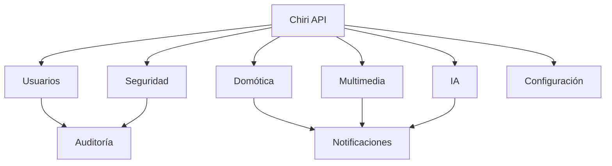

---

# 4.10 Regla de Creación de Módulos

Un nuevo módulo deberá crearse únicamente cuando:

* tenga una responsabilidad clara.
* represente una capacidad real de Chiri.
* tenga límites definidos.
* aporte valor a la plataforma.

No se crearán módulos solamente para agrupar código sin una responsabilidad funcional.

---

# 4.11 Principio Arquitectónico

Los módulos de Chiri deben representar capacidades del sistema, no tecnologías específicas.

Ejemplo:

Correcto:

```text
Módulo Multimedia
        |
        +-- Music Assistant
        +-- Jellyfin
```

Incorrecto:

```text
Módulo Music Assistant
Módulo Jellyfin
```

La primera opción representa una capacidad del usuario.

La segunda representa detalles internos de implementación.

# 5. Flujo Interno de una Solicitud

El Backend de Chiri Platform seguirá un flujo controlado para procesar cualquier solicitud recibida desde un cliente.

El objetivo es mantener una separación clara entre:

* entrada externa,
* lógica de aplicación,
* reglas de negocio,
* integraciones,
* persistencia,
* respuesta al cliente.

---

# 5.1 Flujo General

El flujo interno será:

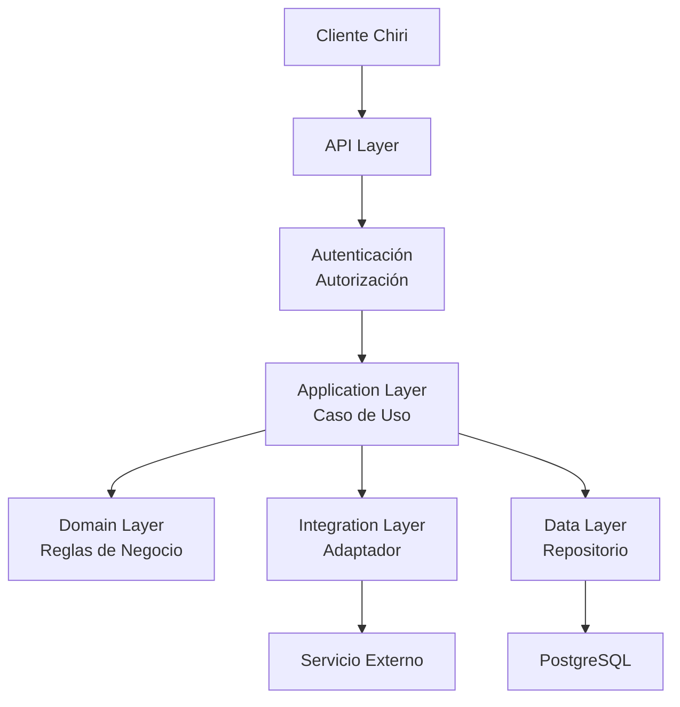

---

# 5.2 Recepción de Solicitud

La solicitud inicia desde un cliente autorizado.

Ejemplo:

Usuario solicita:

> "Apagar la luz del salón"

El cliente envía una petición a la API de Chiri.

La API recibe:

* endpoint solicitado.
* parámetros.
* información de autenticación.

---

# 5.3 Capa API

La API es responsable de:

* recibir la petición.
* validar formato.
* validar datos básicos.
* identificar usuario.
* enviar la operación al caso de uso correspondiente.

La API no decide:

* qué debe ocurrir.
* cómo ejecutar una acción.
* cómo comunicarse con servicios externos.

---

# 5.4 Capa de Seguridad

Antes de ejecutar una operación, Chiri deberá validar:

* identidad del usuario.
* permisos necesarios.
* disponibilidad del recurso.

Ejemplo:

Un usuario puede consultar temperatura, pero no necesariamente modificar configuraciones del hogar.

---

# 5.5 Capa Application

El caso de uso coordina la operación.

Ejemplo:

```text
Apagar luz salón

        |

        v

Caso de Uso Domótica

        |

        v

Validar operación

        |

        v

Solicitar acción a Home Assistant
```

Esta capa decide el flujo, pero no conoce detalles técnicos del servicio externo.

---

# 5.6 Capa Domain

El dominio contiene las reglas propias de Chiri.

Ejemplo:

Reglas:

* El usuario debe tener permiso.
* El dispositivo debe estar autorizado.
* La acción debe ser válida.

Estas reglas pertenecen a Chiri, no a Home Assistant.

---

# 5.7 Capa de Integración

El adaptador traduce la operación de Chiri al formato requerido por el servicio externo.

Ejemplo:

Chiri:

```json
{
  "action": "turn_off",
  "device": "living_room_light"
}
```

Adaptador:

```text
Convertir solicitud

        |

        v

Home Assistant API
```

---

# 5.8 Capa de Datos

Cuando una operación requiere información propia de Chiri, se utilizará la capa de datos.

Ejemplos:

* permisos.
* preferencias.
* configuraciones.
* auditoría.

La lógica de negocio no realizará consultas directas a PostgreSQL.

---

# 5.9 Procesamiento de Respuesta

La respuesta seguirá el camino inverso:

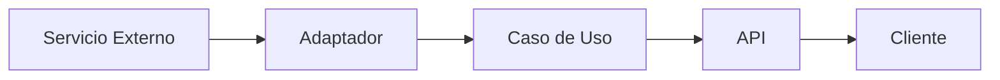

---

# 5.10 Manejo de Errores

Cada capa deberá manejar únicamente los errores correspondientes a su responsabilidad.

Ejemplo:

Error externo:

```text
Home Assistant no disponible
```

Será transformado en:

```json
{
  "error": "HOME_SERVICE_UNAVAILABLE",
  "message": "El servicio de hogar inteligente no está disponible"
}
```

El cliente no deberá conocer detalles internos.

---

# 5.11 Auditoría

Las operaciones relevantes podrán generar registros de auditoría.

Ejemplo:

```text
Usuario:

José

Acción:

Apagar luz salón

Resultado:

Correcto

Fecha:

2026-08-06
```

---

# 5.12 Principio Arquitectónico

Toda solicitud dentro de Chiri deberá respetar:

> La API recibe, la aplicación coordina, el dominio decide, las integraciones ejecutan y los datos persisten.

# 6. Integraciones del Backend

Las integraciones del Backend permiten que Chiri Platform utilice servicios externos manteniendo independencia respecto a sus implementaciones internas.

Cada integración deberá encapsular la comunicación con un servicio específico mediante un adaptador independiente.

---

# 6.1 Principio de Integración

El Backend no deberá comunicarse directamente con servicios externos desde los casos de uso.

Flujo correcto:

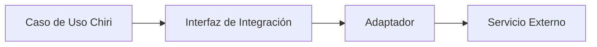

---

# 6.2 Adaptadores de Integración

Cada servicio externo tendrá un adaptador responsable de:

* autenticación contra el servicio.
* comunicación mediante API.
* transformación de datos.
* manejo de errores.
* control de disponibilidad.

Ejemplo:

```text
integrations/

├── home_assistant/
│
├── music_assistant/
│
├── navidrome/
│
├── jellyfin/
│
└── ai/
```

---

# 6.3 Integración Home Assistant

## Objetivo

Permitir que Chiri interactúe con la plataforma de automatización del hogar.

## Responsabilidad del adaptador

El adaptador Home Assistant será responsable de:

* consultar estados.
* enviar comandos.
* recibir información disponible.
* transformar entidades externas.

---

## Ejemplo conceptual

Home Assistant:

```json
{
 "entity_id": "light.salon",
 "state": "on"
}
```

Chiri:

```json
{
 "device": "salon",
 "type": "light",
 "status": "active"
}
```

Chiri no deberá depender del formato interno de Home Assistant.

---

# 6.4 Integración Music Assistant

## Objetivo

Integrar capacidades musicales dentro de Chiri.

## Responsabilidad del adaptador

Permitirá:

* consultar biblioteca.
* controlar reproducción.
* obtener estado del reproductor.
* gestionar información musical.

---

El adaptador ocultará:

* endpoints internos.
* estructura de datos.
* detalles del servidor musical.

---

# 6.5 Integración Navidrome

## Objetivo

Integrar la biblioteca musical personal.

## Responsabilidad del adaptador

Permitirá:

* consultar artistas.
* consultar álbumes.
* consultar canciones.
* obtener información multimedia.

---

Chiri no administrará:

* archivos musicales.
* organización física de biblioteca.
* indexación.

Estas responsabilidades pertenecen a Navidrome.

---

# 6.6 Integración Jellyfin

## Objetivo

Integrar contenido multimedia.

## Responsabilidad del adaptador

Permitirá:

* consultar películas.
* consultar series.
* obtener información multimedia.
* integrar estados cuando sea necesario.

---

Chiri no realizará:

* transcodificación.
* gestión de almacenamiento multimedia.
* administración del servidor Jellyfin.

---

# 6.7 Integración de Inteligencia Artificial

## Objetivo

Permitir capacidades inteligentes dentro de Chiri.

La arquitectura deberá permitir múltiples proveedores.

Ejemplo:

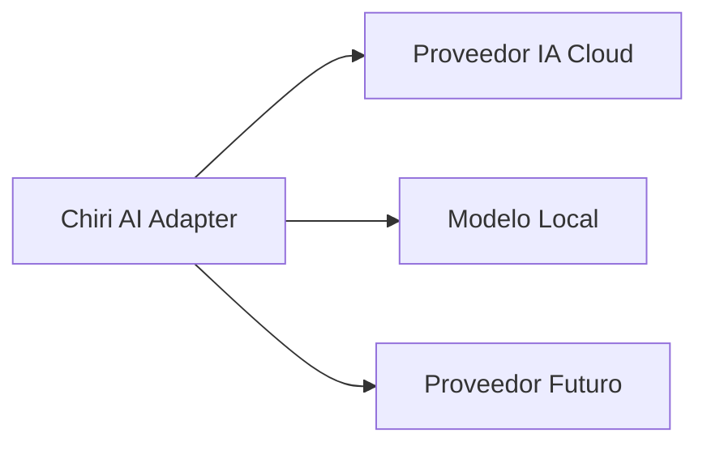

---

# 6.8 Manejo de Fallos de Integración

Una integración externa puede fallar.

Ejemplos:

* servicio apagado.
* red no disponible.
* credenciales inválidas.
* API modificada.

El adaptador deberá:

* detectar el error.
* registrar información técnica.
* devolver una respuesta controlada.

---

# 6.9 Disponibilidad de Servicios

Chiri deberá conocer el estado de sus integraciones.

Ejemplo:

```json
{
 "service": "music",
 "status": "available"
}
```

o:

```json
{
 "service": "home",
 "status": "unavailable"
}
```

Esto permitirá:

* diagnóstico.
* interfaz más inteligente.
* mantenimiento.

---

# 6.10 Regla de Aislamiento

Un fallo en una integración no deberá comprometer toda la plataforma.

Ejemplo:

Si Jellyfin está detenido:

* Domótica continúa funcionando.
* Usuarios continúan accediendo.
* Otros módulos permanecen disponibles.

---

# 6.11 Principio Arquitectónico

Toda integración externa deberá cumplir:

> Chiri debe conocer las capacidades del servicio, pero no depender de sus detalles internos.

# 7. Base de Datos del Backend

La base de datos del Backend de Chiri Platform será utilizada exclusivamente para almacenar información propia de la plataforma.

El Backend utilizará PostgreSQL como sistema principal de persistencia.

La base de datos deberá mantener independencia respecto a los servicios externos integrados.

---

# 7.1 Responsabilidad de PostgreSQL

PostgreSQL será responsable de almacenar información necesaria para el funcionamiento interno de Chiri.

Ejemplos:

* usuarios.
* permisos.
* configuraciones.
* preferencias.
* auditoría.
* relaciones internas.
* información propia de la plataforma.

---

# 7.2 Datos que NO pertenecen a Chiri

Chiri no almacenará información que ya sea responsabilidad de servicios especializados.

Ejemplos:

## Música

No almacenará:

* archivos musicales.
* biblioteca completa.
* metadatos musicales originales.

Responsabilidad:

* Navidrome.
* Music Assistant.

---

## Domótica

No almacenará:

* dispositivos físicos.
* estados en tiempo real.
* automatizaciones.

Responsabilidad:

* Home Assistant.

---

## Multimedia

No almacenará:

* películas.
* series.
* archivos multimedia.

Responsabilidad:

* Jellyfin.

---

# 7.3 Principio de Fuente Única de Verdad

Cada dato deberá tener un único sistema responsable.

Ejemplo:

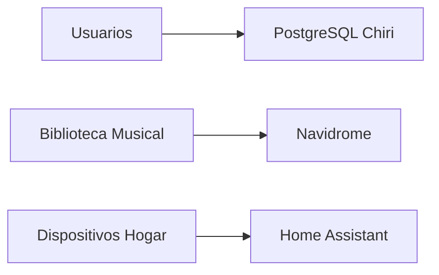

Chiri podrá consultar información externa, pero no duplicará responsabilidades.

---

# 7.4 Capa de Persistencia

El acceso a PostgreSQL estará encapsulado mediante la capa de datos.

Flujo:

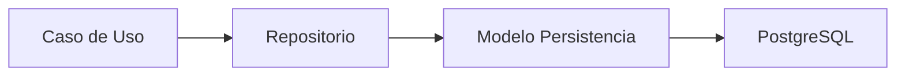

---

# 7.5 Repositorios

Los repositorios serán responsables de:

* consultar datos.
* guardar información.
* actualizar registros.
* eliminar información cuando corresponda.

No deberán contener:

* reglas de negocio.
* lógica de aplicación.

---

# 7.6 Modelos de Datos

Los modelos de base de datos deberán representar conceptos propios de Chiri.

## Actualmente implementados

* User.
* Session.
* RefreshToken.

## Entidades previstas

* Role.
* Permission.
* Setting.
* Integration.
* AuditEvent.

Los modelos de servicios externos no deberán incorporarse directamente al modelo de datos de Chiri.

Incorrecto:

```text
MusicAssistantSong
HomeAssistantLight
JellyfinMovie
```

Correcto:

```text
User
UserPreference
IntegrationStatus
AuditEvent
```

`UserPreference` e `IntegrationStatus` representan conceptos propios de Chiri, aunque todavía no estén implementados.

No se requiere modificar la arquitectura ni agregar nuevas tablas únicamente por esta definición. El diseño de base de datos deberá evolucionar conforme existan necesidades funcionales reales.

La separación actual mantiene:

```text
Chiri
 └── PostgreSQL
       ├── identity
       └── security
```

mientras que los datos propios de los servicios externos permanecen bajo responsabilidad de dichos servicios.

---

# 7.7 Migraciones

Todos los cambios estructurales de base de datos deberán gestionarse mediante migraciones.

Las migraciones permitirán:

* evolución controlada.
* reproducibilidad.
* recuperación.
* despliegues seguros.

No se realizarán cambios manuales directamente en producción.

---

# 7.8 Integridad de Datos

El Backend deberá garantizar:

* validación de información.
* relaciones consistentes.
* restricciones adecuadas.
* eliminación controlada.

---

# 7.9 Configuración de Base de Datos

La conexión a PostgreSQL deberá gestionarse mediante configuración externa.

Nunca deberá incluirse:

* usuario.
* contraseña.
* cadena de conexión.

dentro del código fuente.

---

# 7.10 Escalabilidad Futura

La arquitectura permitirá evolucionar hacia:

* separación de módulos.
* optimización de consultas.
* replicación.
* nuevas estrategias de almacenamiento.

Sin modificar la lógica principal de Chiri.

---

# 7.11 Regla Arquitectónica

Toda información almacenada en PostgreSQL deberá responder:

> ¿Este dato pertenece realmente a Chiri o pertenece a un servicio especializado?

Si pertenece a otro sistema, Chiri deberá integrarlo, no duplicarlo.

# 8. Configuración y Variables de Entorno

La configuración del Backend de Chiri Platform deberá estar separada del código fuente.

El objetivo es permitir ejecutar la misma aplicación en diferentes ambientes sin modificar archivos internos.

---

# 8.1 Principio de Configuración Externa

Los valores variables del sistema no deberán estar definidos directamente en el código.

Ejemplos:

* conexiones de base de datos.
* claves de servicios externos.
* puertos.
* URLs.
* parámetros del sistema.

Estos valores deberán administrarse mediante configuración externa.

---

# 8.2 Ambientes del Sistema

Chiri Platform tendrá inicialmente dos ambientes principales:

## Desarrollo

Ejecutado en:

* PC Windows 11.
* Docker Desktop.

Objetivo:

* programación.
* pruebas.
* validación.

---

## Producción

Ejecutado en:

* Raspberry Pi 4B.
* Docker Compose.

Objetivo:

* servicio real del hogar.
* integración con servicios existentes.

---

# 8.3 Estructura de Configuración

La configuración seguirá una estructura similar:

```text
server/

├── .env.example

├── config/

│   └── settings.py

└── docker-compose.yml
```

---

# 8.4 Variables de Entorno

Las variables de entorno podrán contener:

## Aplicación

Ejemplo:

```text
APP_NAME=Chiri
APP_ENV=production
APP_PORT=8000
```

---

## Base de Datos

Ejemplo:

```text
DATABASE_HOST=postgres
DATABASE_PORT=5432
DATABASE_NAME=chiri
```

---

## Servicios Externos

Ejemplo conceptual:

```text
HOME_ASSISTANT_URL=
MUSIC_ASSISTANT_URL=
JELLYFIN_URL=
```

---

# 8.5 Protección de Secretos

Nunca deberán almacenarse secretos dentro del código.

Ejemplos:

* contraseñas.
* tokens.
* claves API.
* credenciales.

No permitido:

```python
API_KEY="valor_secreto"
```

Permitido:

```python
API_KEY=os.getenv("API_KEY")
```

Los archivos que contengan secretos reales deberán permanecer fuera del control de versiones.

---

# 8.6 Clase de Configuración

La configuración será centralizada mediante un componente único.

Ejemplo conceptual:

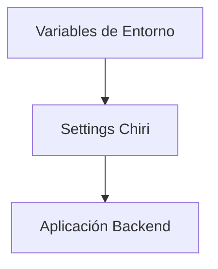

La aplicación deberá acceder a la configuración mediante este componente, evitando que cada módulo gestione directamente las variables de entorno.

---

# 8.7 Configuración por Ambiente

Cada ambiente podrá tener valores diferentes.

Ejemplo:

Desarrollo:

```text
APP_ENV=development
DATABASE_HOST=localhost
```

Producción:

```text
APP_ENV=production
DATABASE_HOST=postgres
```

El código será el mismo.

---

# 8.8 Configuración de Docker

Docker será responsable de inyectar configuración al contenedor.

Ejemplo conceptual:

```yaml
services:

  chiri-backend:
    environment:
      APP_ENV: production
      DATABASE_HOST: postgres
```

Los valores sensibles deberán proporcionarse mediante mecanismos de configuración y gestión de secretos adecuados al entorno, evitando incorporarlos directamente al archivo de Compose cuando este se encuentre bajo control de versiones.

---

# 8.9 Validación de Configuración

Al iniciar el Backend deberá validar:

* variables obligatorias existentes.
* formatos correctos.
* disponibilidad de servicios críticos cuando corresponda.

Si la configuración es incorrecta, el servicio deberá informar claramente el problema sin exponer secretos ni credenciales.

---

# 8.10 Registro de Configuración

La aplicación podrá mostrar información general del ambiente.

Permitido:

```text
Environment: production
Version: 1.0
```

No permitido:

```text
Database Password: xxxx
API Token: xxxx
```

Los logs tampoco deberán registrar contraseñas, tokens, claves API u otros secretos.

---

# 8.11 Principio Arquitectónico

La configuración pertenece al entorno de ejecución, no al código fuente.

El mismo Backend debe poder funcionar en diferentes ambientes únicamente cambiando su configuración.

# 9. Logging, Monitoreo y Diagnóstico

Chiri Platform deberá incorporar mecanismos de registro y diagnóstico que permitan conocer el estado interno de la plataforma y facilitar la resolución de problemas.

El sistema deberá proporcionar información suficiente para:

* detectar errores.
* analizar comportamientos.
* verificar integraciones.
* mantener estabilidad operacional.

---

# 9.1 Principio de Observabilidad

La observabilidad de Chiri estará basada en tres elementos:

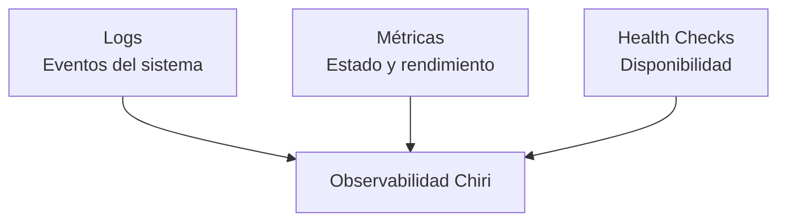

---

# 9.2 Sistema de Logs

El Backend deberá generar registros estructurados.

Los logs deberán permitir identificar:

* fecha y hora.
* componente.
* nivel del evento.
* operación realizada.
* resultado.

Ejemplo conceptual:

```text id="5m8r9p"
2026-08-06 10:30:15
INFO
MusicIntegration
Playback request completed
```

Los logs deberán evitar almacenar información sensible, incluyendo:

* contraseñas.
* tokens de autenticación.
* claves API.
* credenciales.
* información sensible de sesión.

---

# 9.3 Niveles de Log

Se utilizarán niveles estándar:

## DEBUG

Información detallada para desarrollo.

Ejemplo:

* solicitudes internas.
* datos técnicos no sensibles.

---

## INFO

Eventos normales del sistema.

Ejemplo:

* servicio iniciado.
* usuario autenticado.
* integración disponible.

---

## WARNING

Situaciones que requieren atención.

Ejemplo:

* servicio lento.
* reintento de conexión.
* comportamiento inesperado recuperable.

---

## ERROR

Fallos que afectan una operación.

Ejemplo:

* integración no disponible.
* error de comunicación.
* operación fallida.

---

## CRITICAL

Problemas graves del sistema.

Ejemplo:

* Backend no puede iniciar.
* pérdida de una dependencia crítica.
* condición que compromete el funcionamiento general de la plataforma.

---

# 9.4 Separación de Información

Los logs deberán diferenciar entre información técnica y la información que puede ser expuesta a los clientes.

## Información técnica

Orientada a:

* administración.
* desarrollo.
* diagnóstico.

Ejemplo:

```text id="w3nq2k"
Connection timeout Home Assistant API
```

---

## Información para el cliente

Orientada a comunicar el resultado de una operación sin exponer detalles internos.

Ejemplo:

```json id="a5c8x7"
{
  "error": "HOME_SERVICE_UNAVAILABLE",
  "message": "El servicio de hogar inteligente no está disponible"
}
```

Los detalles internos, excepciones, credenciales, tokens y otra información sensible nunca deberán exponerse al cliente.

---

# 9.5 Health Checks

El Backend deberá proporcionar mecanismos para conocer su estado.

Ejemplo:

```text id="6j9k0p"
GET /health
```

Respuesta:

```json id="4g8s2n"
{
  "status": "healthy"
}
```

El Health Check deberá permitir determinar si el Backend está operativo.

Cuando sea necesario, podrán existir comprobaciones adicionales para conocer el estado de sus dependencias.

---

# 9.6 Estado de Integraciones

Chiri deberá poder consultar el estado de sus servicios externos.

Ejemplo:

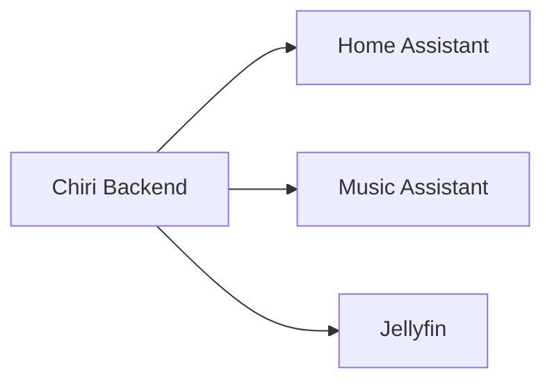

Resultado conceptual:

```json id="j2n7pv"
{
  "services": {
    "home_assistant": "online",
    "music": "online",
    "jellyfin": "offline"
  }
}
```

El estado de una integración deberá permitir distinguir, como mínimo, entre un servicio disponible y uno no disponible.

---

# 9.7 Diagnóstico de Errores

Cuando ocurre un problema, Chiri deberá permitir identificar:

* dónde ocurrió.
* qué componente falló.
* qué operación estaba ejecutándose.
* qué servicio estaba involucrado.

Ejemplo:

```text id="8o5n3j"
Solicitud:
Play Music

Componente:
Music Adapter

Error:
Servicio no disponible
```

La información técnica necesaria para diagnosticar el problema deberá permanecer en los logs y mecanismos internos de diagnóstico.

---

# 9.8 Auditoría vs Logs

Ambos conceptos son diferentes.

## Logs

Orientados a:

* técnicos.
* diagnóstico.
* funcionamiento interno.

Los logs describen eventos técnicos y operacionales del sistema.

---

## Auditoría

Orientada a:

* acciones importantes.
* usuarios.
* seguridad.
* trazabilidad.

Ejemplo:

Auditoría:

```text id="5g0s7h"
Usuario ejecutó:

Apagar luz salón

Resultado:

Correcto
```

La auditoría deberá registrar únicamente los eventos relevantes para la trazabilidad de la plataforma y no sustituirá al sistema de logs.

---

# 9.9 Monitoreo Futuro

La arquitectura permitirá incorporar herramientas externas de monitoreo.

Ejemplos futuros:

* métricas del sistema.
* paneles de estado.
* alertas.
* análisis histórico.

Estas capacidades podrán incorporarse sin modificar la arquitectura principal de Chiri.

---

# 9.10 Principio Arquitectónico

Toda funcionalidad crítica de Chiri deberá poder responder:

> ¿Qué ocurrió, dónde ocurrió y por qué ocurrió?

Si un componente no permite diagnóstico suficiente, deberá mejorarse antes de considerarse estable.

# 10. Pruebas y Calidad del Código

La calidad del Backend de Chiri Platform será garantizada mediante prácticas de desarrollo que permitan detectar errores antes de llegar al entorno de producción.

Las pruebas forman parte del proceso normal de desarrollo y no serán una actividad posterior.

El flujo definido será:

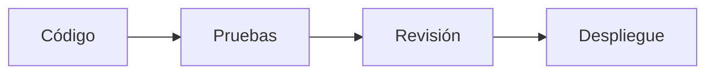

---

# 10.1 Principios de Calidad

El desarrollo del Backend deberá cumplir:

* Código legible.
* Código mantenible.
* Código documentado cuando sea necesario.
* Bajo acoplamiento.
* Responsabilidades claras.
* Pruebas antes de cambios importantes.

---

# 10.2 Tipos de Pruebas

Chiri utilizará diferentes niveles de pruebas:

* pruebas unitarias.
* pruebas de integración.
* pruebas de integraciones externas.
* pruebas de API.

Cada nivel tendrá un objetivo específico y deberá utilizarse de acuerdo con el tipo de cambio realizado.

---

# 10.3 Pruebas Unitarias

## Objetivo

Validar componentes individuales de forma aislada.

Ejemplos:

* reglas de dominio.
* validaciones.
* transformaciones.
* funciones internas.

No deberán depender de:

* servicios externos.
* base de datos real.

---

# 10.4 Pruebas de Integración

## Objetivo

Validar la comunicación entre componentes.

Ejemplos:

* Backend + PostgreSQL.
* Backend + adaptador.
* API + caso de uso.

Permitirán comprobar que las capas trabajan correctamente juntas.

---

# 10.5 Pruebas de Integraciones Externas

## Objetivo

Validar adaptadores contra servicios reales.

Ejemplos:

* Home Assistant.
* Music Assistant.
* Jellyfin.

Estas pruebas deberán considerar:

* disponibilidad del servicio.
* respuestas esperadas.
* manejo de errores.

Cuando una prueba dependa de un servicio externo real, deberá identificarse como tal y no confundirse con una prueba unitaria.

---

# 10.6 Pruebas de API

La API deberá validar:

* endpoints existentes.
* formatos de respuesta.
* autenticación.
* permisos.
* errores esperados.

Ejemplo:

Solicitud:

```http id="m4p8cz"
GET /api/user/profile
```

Respuesta esperada:

```json id="7k2n1m"
{
  "name": "Usuario",
  "status": "active"
}
```

Las pruebas de API deberán incluir tanto casos correctos como casos de error y acceso no autorizado.

---

# 10.7 Pruebas Antes de Producción

Antes de desplegar una versión en Raspberry Pi deberán validarse:

* pruebas automáticas.
* inicio correcto del contenedor.
* conexión con PostgreSQL.
* estado de integraciones necesarias.
* funcionamiento básico de API.

Una versión que no supere las validaciones necesarias no deberá considerarse lista para producción.

---

# 10.8 Calidad del Código

El código deberá seguir reglas claras.

## Nombres claros

Incorrecto:

```python id="u7w3ak"
def proc():
```

Correcto:

```python id="k8q1mp"
def validate_user_permissions():
```

---

## Funciones pequeñas

Una función deberá realizar una responsabilidad clara.

---

## Evitar duplicación

La lógica común deberá reutilizarse.

---

## Separación de responsabilidades

Cada componente deberá estar ubicado donde corresponde y no deberá asumir responsabilidades de otras capas.

---

# 10.9 Revisión de Cambios

Antes de incorporar cambios importantes deberá revisarse:

* impacto arquitectónico.
* compatibilidad.
* seguridad.
* pruebas realizadas.

Los cambios que afecten componentes críticos deberán verificarse antes de su despliegue.

---

# 10.10 Automatización Futura

La arquitectura permitirá incorporar herramientas como:

* ejecución automática de pruebas.
* validación de código.
* integración continua.

Estas herramientas se definirán posteriormente en:

`090_GuiaProgramacion.md`

---

# 10.11 Regla Arquitectónica

Un cambio no estará listo para producción solamente porque funciona.

Debe cumplir:

> Funciona correctamente, mantiene la arquitectura y puede ser mantenido en el futuro.

# 11. Despliegue del Backend

El despliegue del Backend de Chiri Platform estará basado en contenedores Docker, permitiendo mantener consistencia entre los ambientes de desarrollo y producción.

El objetivo es que el mismo componente pueda ejecutarse en diferentes infraestructuras mediante configuración externa.

---

# 11.1 Principio de Despliegue

El Backend deberá cumplir:

* instalación reproducible.
* configuración separada.
* actualización controlada.
* aislamiento mediante contenedores.
* facilidad de recuperación.

---

# 11.2 Modelo de Ejecución

La arquitectura de despliegue será:

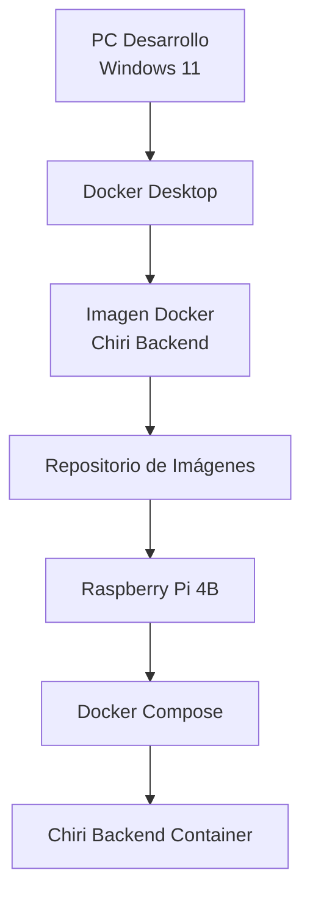

---

# 11.3 Contenedor Backend

El Backend será ejecutado dentro de un contenedor independiente.

Responsabilidades del contenedor:

* ejecutar la aplicación FastAPI.
* cargar la configuración.
* comunicarse con servicios internos.
* exponer la API de Chiri.

El contenedor no deberá contener:

* datos persistentes.
* secretos permanentes.
* configuraciones específicas del servidor.

---

# 11.4 Dockerfile

El proyecto deberá incluir un Dockerfile responsable de definir:

* imagen base.
* dependencias.
* instalación del proyecto.
* comando de inicio.

Ejemplo conceptual:

```text
Dockerfile

Imagen Python
        |
Dependencias
        |
Código Chiri
        |
Servidor FastAPI
```

---

# 11.5 Docker Compose

En producción, Chiri Backend será administrado mediante Docker Compose.

Responsabilidades:

* crear y administrar el contenedor.
* conectar redes.
* cargar variables de entorno.
* montar volúmenes necesarios.
* definir las dependencias entre servicios.

Ejemplo conceptual:

```yaml
services:

  chiri-backend:
    image: chiri/backend
    environment:
      APP_ENV: production
    depends_on:
      - postgres
```

---

# 11.6 Comunicación con Servicios Internos

Los contenedores deberán comunicarse mediante redes Docker cuando los servicios formen parte del mismo entorno de contenedores.

Ejemplo:

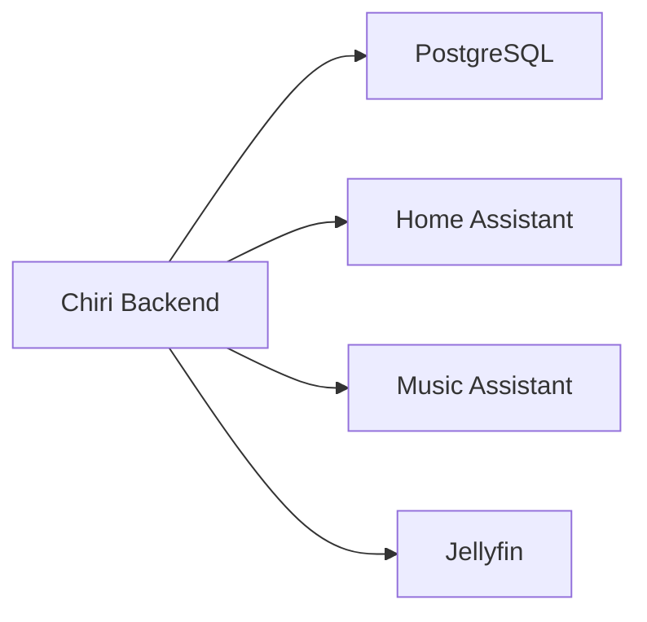

Los servicios externos que no formen parte de la misma red Docker deberán ser accesibles mediante sus URLs o mecanismos de comunicación configurados para cada ambiente.

---

# 11.7 Persistencia

Los datos persistentes deberán mantenerse fuera del ciclo de vida del contenedor.

Ejemplo correcto:

```text
Container
    |
    +--> Volume
            |
            +--> Data persistente
```

Ejemplo incorrecto:

```text
Container
    |
    +--> Datos importantes internos
```

La recreación o actualización del contenedor no deberá provocar pérdida de información persistente.

---

# 11.8 Actualización del Backend

Las actualizaciones deberán seguir un proceso controlado:

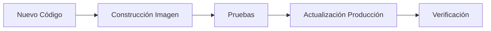

Una nueva versión no deberá desplegarse en producción mientras las pruebas definidas para dicha versión no hayan sido completadas satisfactoriamente.

---

# 11.9 Recuperación

El sistema deberá permitir:

* recrear contenedores.
* restaurar configuración.
* recuperar datos persistentes.
* volver a una versión anterior cuando sea necesario.

La recuperación deberá basarse en procedimientos conocidos y reproducibles.

---

# 11.10 Diferencia Desarrollo / Producción

La diferencia entre ambientes deberá estar limitada principalmente a:

* configuración.
* datos.
* servicios disponibles.
* infraestructura de ejecución.

No deberá existir:

* código diferente.
* lógica diferente.
* comportamiento diferente por ambiente.

El mismo código deberá poder ejecutarse en ambos ambientes mediante la configuración correspondiente.

---

# 11.11 Principio Arquitectónico

El despliegue de Chiri deberá responder:

> Si la Raspberry Pi falla, ¿podemos reconstruir el sistema siguiendo un proceso conocido?

Si la respuesta es no, el proceso de despliegue deberá mejorar antes de considerarse estable.


# 12. Evolución y Mantenimiento del Backend

El Backend de Chiri Platform deberá estar preparado para evolucionar de forma controlada durante toda la vida del proyecto.

Los cambios deberán realizarse respetando la arquitectura definida y evitando degradar la calidad, seguridad y mantenibilidad del sistema.

---

# 12.1 Principio de Evolución

La evolución del Backend deberá seguir el siguiente proceso:

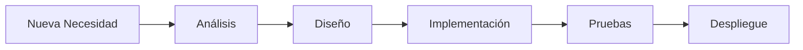

No se realizarán cambios directamente sobre producción sin pasar por el proceso definido.

---

# 12.2 Incorporación de Nuevas Funcionalidades

Antes de incorporar una nueva funcionalidad deberá determinarse:

* si pertenece a un módulo existente.
* si requiere un nuevo módulo.
* si requiere una nueva integración.
* si modifica la arquitectura.

La pregunta principal será:

> ¿Esta capacidad pertenece realmente al núcleo de Chiri?

---

# 12.3 Creación de Nuevos Módulos

Un nuevo módulo solamente deberá crearse cuando:

* tenga una responsabilidad propia.
* tenga reglas claramente definidas.
* pueda evolucionar independientemente.
* aporte una capacidad real a Chiri.

No se crearán módulos únicamente para:

* agrupar archivos.
* separar código temporal.
* seguir tendencias técnicas.
* ocultar problemas de organización existentes.

---

# 12.4 Compatibilidad

Las modificaciones deberán considerar:

* compatibilidad con clientes existentes.
* compatibilidad con datos existentes.
* compatibilidad con integraciones actuales.
* compatibilidad con contratos de API existentes.

Los cambios que puedan romper contratos existentes deberán planificarse antes de su implementación.

---

# 12.5 Versionado de API

La API de Chiri deberá considerar mecanismos de evolución mediante versiones.

Ejemplo conceptual:

```text
API v1

/api/v1/users
/api/v1/media
/api/v1/home
```

El versionado permitirá evolucionar los contratos de la API sin afectar innecesariamente a los clientes existentes.

---

# 12.6 Refactorización

La refactorización será una actividad normal del mantenimiento del Backend.

Sus objetivos podrán ser:

* mejorar la claridad.
* eliminar duplicación.
* simplificar código.
* mejorar rendimiento.
* mejorar mantenibilidad.

La refactorización no deberá modificar el comportamiento esperado sin las pruebas correspondientes.

---

# 12.7 Dependencias Externas

Las dependencias utilizadas por el Backend deberán revisarse periódicamente.

Se deberá evaluar:

* seguridad.
* compatibilidad.
* mantenimiento.
* estabilidad.
* necesidad real.

No se agregarán librerías únicamente por conveniencia temporal.

---

# 12.8 Documentación Continua

La documentación deberá mantenerse junto con la evolución del código.

Cuando exista un cambio importante deberá actualizarse, según corresponda:

* documentación técnica.
* diagramas.
* contratos.
* decisiones arquitectónicas.
* ADR correspondiente.

La documentación deberá permanecer alineada con la implementación real.

---

# 12.9 Regla de Cambios Arquitectónicos

Si un cambio afecta:

* estructura principal del sistema.
* tecnologías base.
* comunicación entre componentes.
* modelo de seguridad.
* responsabilidades de las capas.
* límites entre módulos.

deberá registrarse mediante un ADR.

---

# 12.10 Principio de Mantenimiento

El mantenimiento del Backend deberá priorizar:

* estabilidad antes que velocidad.
* claridad antes que complejidad.
* soluciones simples antes que soluciones sofisticadas.
* cambios controlados antes que modificaciones improvisadas.

---

# 12.11 Estado del Backend

La arquitectura del Backend queda definida como una base preparada para:

* integración de servicios.
* crecimiento modular.
* incorporación de nuevos clientes.
* evolución tecnológica controlada.
* mantenimiento a largo plazo.

---

# 12.12 Regla Final del Backend

Toda modificación futura deberá cumplir:

> Mejorar la plataforma sin comprometer la arquitectura, seguridad y mantenibilidad definidas.


# 13. Conclusión del Backend

El Backend de Chiri Platform v1.0 queda definido como el núcleo central de coordinación e integración de la plataforma.

Su diseño establece una arquitectura modular, segura y mantenible que permite conectar diferentes servicios manteniendo una clara separación de responsabilidades.

---

# 13.1 Arquitectura Definida

El Backend estará construido utilizando:

* Python.
* FastAPI.
* PostgreSQL.
* Docker.
* Docker Compose.

Su arquitectura interna estará basada en:

* API Layer.
* Application Layer.
* Domain Layer.
* Integration Layer.
* Data Layer.
* Infrastructure Layer.

---

# 13.2 Responsabilidad del Backend

El Backend será responsable de:

* Exponer la API de Chiri.
* Gestionar usuarios y permisos.
* Ejecutar lógica propia de la plataforma.
* Coordinar servicios externos.
* Mantener información propia de Chiri.
* Garantizar seguridad y trazabilidad.
* Proporcionar mecanismos de diagnóstico y observabilidad.

---

# 13.3 Límites Confirmados

El Backend no será responsable de reemplazar:

* Home Assistant.
* Music Assistant.
* Navidrome.
* Jellyfin.
* Servicios externos de IA.

Su función será integrarlos y proporcionar una experiencia unificada mediante adaptadores y módulos propios de Chiri.

---

# 13.4 Principios Confirmados

El desarrollo del Backend seguirá:

* Arquitectura antes que código.
* Separación de responsabilidades.
* Código mantenible.
* Seguridad por defecto.
* Configuración externa.
* Observabilidad y diagnóstico.
* Documentación como fuente de verdad.
* Integraciones mediante adaptadores.
* Evolución controlada.
* Pruebas antes de producción.

---

# 13.5 Estado del Documento

El documento:

```text
030_Backend.md
```

queda definido como la referencia arquitectónica para el desarrollo del Backend de Chiri Platform v1.0.

Cualquier implementación futura deberá respetar las decisiones aquí establecidas.

Los cambios que afecten la arquitectura deberán seguir el proceso ADR definido.

---

# Declaración Final

El Backend de Chiri Platform v1.0 está preparado para pasar de la fase de diseño a la fase de implementación cuando el proyecto lo determine.

La arquitectura proporciona una base estable para construir una plataforma personal modular, integrada, segura y preparada para evolucionar de forma controlada.
