# Chiri Platform

**Documento:** 040_Android.md

**Versión:** 1.0

**Estado:** APROBADO

---

# 1. Introducción

La aplicación Android de Chiri Platform será uno de los clientes de acceso a la plataforma.

Su función será proporcionar una interfaz moderna y segura para que los usuarios puedan interactuar con las capacidades disponibles en Chiri.

La aplicación Android no será responsable de implementar la lógica principal del sistema.

---

# 1.1 Objetivo de la Aplicación Android

El objetivo principal de la aplicación Android será:

* proporcionar una experiencia de usuario unificada.
* consumir las capacidades expuestas por la API de Chiri.
* presentar información de los diferentes módulos.
* permitir interacción con la plataforma desde dispositivos autorizados.

---

# 1.2 Rol dentro de la Arquitectura General

La aplicación Android ocupa la capa de cliente dentro de la arquitectura general.

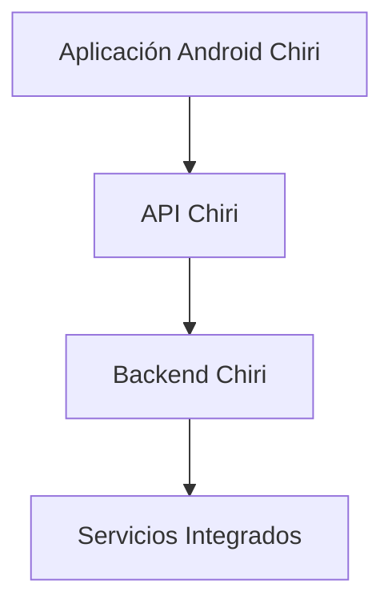

---

# 1.3 Responsabilidades del Cliente Android

La aplicación Android será responsable de:

* mostrar información al usuario.
* capturar acciones del usuario.
* gestionar navegación.
* administrar estados visuales.
* comunicarse con la API.
* almacenar información local necesaria.
* gestionar experiencia de usuario.

---

# 1.4 Lo que NO hará la Aplicación Android

La aplicación Android no será responsable de:

* conectarse directamente con Home Assistant.
* conectarse directamente con Music Assistant.
* administrar dispositivos físicos.
* ejecutar reglas de negocio principales.
* almacenar información crítica del sistema.
* reemplazar servicios del Backend.

Ejemplo:

Incorrecto:

```text
Android
   |
   +---- Home Assistant API
```

Correcto:

```text
Android
   |
   +---- API Chiri
            |
            +---- Home Assistant
```

---

# 1.5 Tecnología Definida

La aplicación Android utilizará:

## Lenguaje

* Kotlin.

## Interfaz

* Jetpack Compose.

## Arquitectura

* MVVM.

## Comunicación

* API REST mediante HTTPS.

## Gestión de dependencias

* Gradle.

---

# 1.6 Principio de Diseño

La aplicación Android deberá seguir el principio:

> El cliente consume capacidades de Chiri; no conoce la complejidad interna de la plataforma.

---

# 1.7 Experiencia de Usuario

La aplicación deberá proporcionar una experiencia consistente para diferentes capacidades:

Ejemplos:

* control del hogar.
* reproducción multimedia.
* interacción con IA.
* gestión personal.
* configuración.

La interfaz deberá evolucionar independientemente de los servicios internos.

---

# 1.8 Estado del Documento

Este documento definirá la arquitectura oficial de la aplicación Android Chiri Platform v1.0.

No contiene código.

Define:

* estructura.
* responsabilidades.
* comunicación.
* reglas de desarrollo.

# 2. Arquitectura Interna Android

La aplicación Android de Chiri Platform estará organizada mediante una arquitectura basada en capas utilizando el patrón MVVM (Model-View-ViewModel).

El objetivo será mantener:

* separación de responsabilidades.
* código mantenible.
* facilidad de pruebas.
* evolución independiente de componentes.
* bajo acoplamiento entre la interfaz y las fuentes de datos.

---

# 2.1 Arquitectura MVVM

La arquitectura principal será:

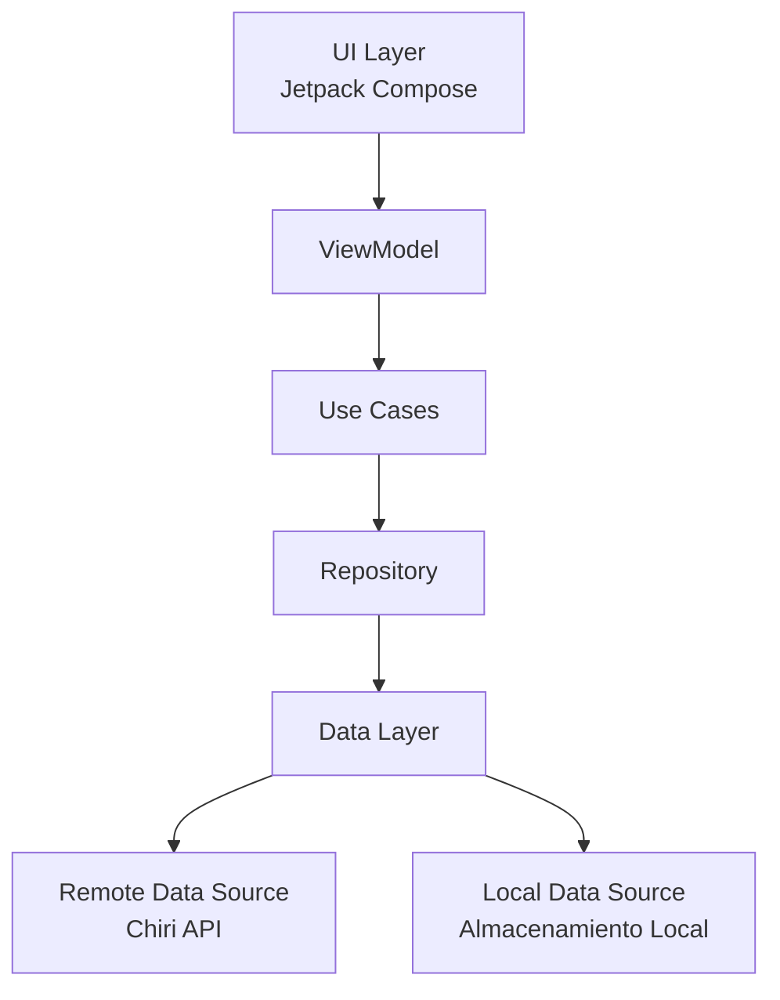

La aplicación utilizará MVVM como patrón principal de presentación y una separación por capas para evitar que la interfaz dependa directamente de detalles técnicos de comunicación o almacenamiento.

---

# 2.2 UI Layer

## Responsabilidad

La capa de interfaz será responsable de representar el estado de la aplicación y capturar las interacciones del usuario.

Utilizará:

* Jetpack Compose.
* Material Design.
* Componentes reutilizables.

---

## La UI será responsable de:

* mostrar pantallas.
* capturar eventos del usuario.
* observar estados.
* ejecutar navegación.
* representar estados de carga, éxito y error.

---

## La UI NO será responsable de:

* llamadas HTTP.
* lógica de negocio.
* acceso directo a almacenamiento.
* acceso directo a servicios externos.
* procesamiento complejo de datos.

---

# 2.3 ViewModel

## Responsabilidad

El ViewModel actuará como intermediario entre la interfaz y los casos de uso de la aplicación.

Funciones:

* mantener el estado de la pantalla.
* procesar eventos del usuario.
* ejecutar casos de uso.
* exponer estados observables para la UI.
* gestionar el ciclo de vida de las operaciones de la pantalla.

Ejemplo conceptual:

```text
Usuario pulsa botón

        |

Composable

        |

ViewModel

        |

Use Case

        |

Repository

        |

Chiri API
```

El ViewModel no deberá realizar directamente llamadas HTTP ni acceder directamente al almacenamiento.

---

# 2.4 Use Cases

## Responsabilidad

Los casos de uso representan acciones que la aplicación puede realizar.

Ejemplos:

* Obtener estado del hogar.
* Reproducir música.
* Consultar biblioteca.
* Enviar consulta a IA.
* Obtener información del usuario.

Los Use Cases permitirán:

* representar acciones de la aplicación.
* separar intención de implementación.
* reutilizar operaciones.
* facilitar pruebas.

Los Use Cases no deberán contener detalles específicos de Retrofit, HTTP, almacenamiento local o APIs externas.

---

# 2.5 Repository Pattern

Los repositorios proporcionarán una abstracción sobre el origen de los datos utilizados por la aplicación.

Un repositorio podrá obtener información desde:

* API de Chiri.
* almacenamiento local.
* caché.

El repositorio decidirá qué fuente utilizar según las necesidades de la operación.

Ejemplo:

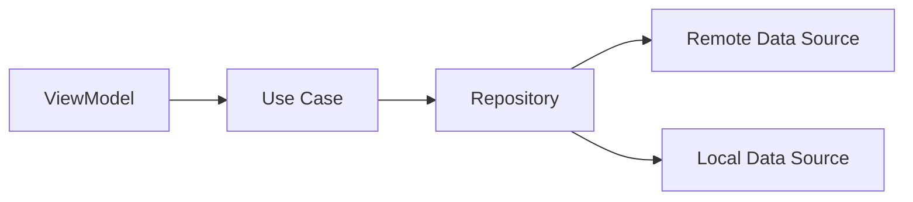

La interfaz del repositorio deberá ocultar los detalles técnicos de las fuentes de datos a las capas superiores.

---

# 2.6 Data Layer

La capa de datos será responsable de implementar el acceso a las diferentes fuentes de información utilizadas por la aplicación.

Podrá contener:

* Remote Data Sources.
* Local Data Sources.
* modelos de datos.
* conversión de modelos.
* almacenamiento local.
* caché.
* clientes de comunicación con la API.

La comunicación remota se realizará exclusivamente contra la API de Chiri.

La aplicación Android no deberá comunicarse directamente con:

* Home Assistant.
* Music Assistant.
* Navidrome.
* Jellyfin.
* otros servicios internos del ecosistema.

---

# 2.7 Flujo de Información

Ejemplo: consultar temperatura del hogar.

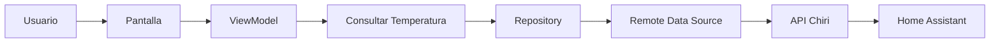

El cliente Android únicamente conoce la API de Chiri.

La integración con Home Assistant pertenece al Backend.

---

# 2.8 Manejo de Estado

La aplicación deberá utilizar un modelo de estado explícito para representar el estado de cada pantalla o flujo.

Ejemplo conceptual:

```kotlin
data class ScreenState(
    val loading: Boolean,
    val data: Data?,
    val error: String?
)
```

El estado podrá representar situaciones como:

* carga.
* información disponible.
* operación completada.
* error.
* ausencia de información.

La UI reaccionará al estado expuesto por el ViewModel.

---

# 2.9 Principio de Dependencias

Las dependencias deberán seguir una dirección controlada:

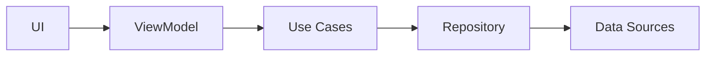

Las capas superiores no deberán conocer detalles internos de implementación de las capas inferiores.

Por ejemplo:

* UI no conocerá Retrofit.
* ViewModel no conocerá endpoints HTTP.
* Use Cases no conocerán detalles de almacenamiento.
* Repository ocultará las fuentes de datos.

---

# 2.10 Principio Arquitectónico

La aplicación Android deberá cumplir:

> La interfaz depende de la lógica de aplicación; la lógica de aplicación no depende de la interfaz.

Además:

> El cliente Android deberá depender de la API de Chiri y no de las implementaciones internas de los servicios integrados.

# 3. Estructura del Proyecto Android

La aplicación Android de Chiri Platform estará organizada para reflejar la arquitectura MVVM definida anteriormente.

La estructura deberá favorecer:

* separación de responsabilidades.
* navegación sencilla del código.
* reutilización de componentes.
* crecimiento modular.
* facilidad de mantenimiento.

---

# 3.1 Estructura General

La carpeta Android será:

```text
android/

├── app/

├── build.gradle

├── settings.gradle

├── gradle/

└── README.md
```

---

# 3.2 Módulo Principal `app/`

La aplicación principal estará organizada:

```text
app/

└── src/

    └── main/

        ├── java/com/chirihome/platform/

        ├── res/

        └── AndroidManifest.xml
```

---

# 3.3 Paquete Principal

El paquete base será:

```text
com.chirihome.platform
```

Dentro de él se organizarán las responsabilidades:

```text
com.chirihome.platform/

├── ui/

├── navigation/

├── viewmodel/

├── domain/

├── data/

├── di/

├── network/

├── storage/

└── utils/
```

La organización física deberá reflejar las responsabilidades definidas en la arquitectura interna.

---

# 3.4 Paquete `ui/`

## Responsabilidad

Contendrá todos los elementos visuales de la aplicación.

Estructura:

```text
ui/

├── screens/

├── components/

├── theme/

└── icons/
```

Contendrá:

* pantallas Compose.
* componentes reutilizables.
* estilos visuales.
* temas.
* elementos de presentación.

La UI no deberá contener lógica de negocio ni acceso directo a fuentes de datos.

---

# 3.5 Paquete `navigation/`

## Responsabilidad

Gestionará la navegación interna de la aplicación.

Ejemplo:

```text
navigation/

├── Routes.kt

└── NavGraph.kt
```

Será responsable de:

* definir destinos.
* controlar el flujo entre pantallas.
* gestionar la navegación.

No contendrá lógica de negocio.

---

# 3.6 Paquete `viewmodel/`

## Responsabilidad

Contendrá los ViewModels de la aplicación.

Ejemplo:

```text
viewmodel/

├── HomeViewModel.kt

├── MediaViewModel.kt

└── AiViewModel.kt
```

Cada ViewModel deberá estar asociado a una responsabilidad clara.

Los ViewModels no deberán realizar directamente:

* llamadas HTTP.
* acceso al almacenamiento.
* comunicación con servicios externos.

Deberán utilizar los casos de uso definidos para la aplicación.

---

# 3.7 Paquete `domain/`

## Responsabilidad

Contendrá los conceptos y contratos propios de la aplicación Android que deben permanecer independientes de los detalles técnicos de implementación.

Estructura:

```text
domain/

├── model/

├── repository/

└── usecase/
```

Contendrá:

* modelos de dominio.
* interfaces de repositorio.
* casos de uso.

Los contratos de repositorio pertenecerán a esta capa, mientras que sus implementaciones estarán en `data/`.

El dominio no deberá depender de:

* Jetpack Compose.
* Retrofit.
* almacenamiento local.
* implementaciones concretas de fuentes de datos.

---

# 3.8 Paquete `data/`

## Responsabilidad

Gestionará las fuentes de datos y las implementaciones de los repositorios.

Estructura:

```text
data/

├── local/

├── remote/

├── mapper/

└── repository/
```

Contendrá:

* fuentes de datos remotas.
* fuentes de datos locales.
* implementaciones de repositorios.
* conversión de modelos.
* acceso a almacenamiento.
* comunicación con la API de Chiri.

Las implementaciones concretas deberán cumplir los contratos definidos en `domain/`.

---

# 3.9 Paquete `network/`

## Responsabilidad

Gestionará los componentes técnicos necesarios para la comunicación con la API de Chiri.

Ejemplo:

```text
network/

├── ApiService.kt

├── ApiClient.kt

└── interceptor/
```

Responsabilidades:

* cliente HTTP.
* configuración de comunicación HTTPS.
* interceptores.
* autenticación técnica de solicitudes.
* manejo técnico de comunicación.

Este paquete no deberá contener lógica de negocio.

---

# 3.10 Paquete `storage/`

## Responsabilidad

Gestionará el almacenamiento local necesario para el funcionamiento de la aplicación.

Ejemplos:

* preferencias.
* sesión local.
* caché.
* información temporal.

El almacenamiento local deberá utilizarse únicamente para información que corresponda al cliente Android.

No deberá utilizarse como sustituto de la base de datos del Backend ni almacenar información crítica que pertenezca al servidor.

---

# 3.11 Paquete `di/`

## Responsabilidad

Gestionará la inyección de dependencias.

Permitirá:

* crear componentes.
* administrar instancias.
* configurar dependencias.
* desacoplar clases.

La configuración de dependencias deberá mantener separadas las interfaces de sus implementaciones cuando corresponda.

---

# 3.12 Modelos

Los modelos de la aplicación deberán ubicarse según su responsabilidad.

Los modelos propios de la lógica de aplicación estarán en:

```text
domain/model/
```

Los modelos específicos de fuentes externas estarán en las capas correspondientes de datos.

Ejemplos de conceptos de dominio:

* Usuario.
* Dispositivo.
* Contenido multimedia.
* Estado del sistema.

Los modelos utilizados para comunicación con la API no deberán mezclarse automáticamente con los modelos de dominio.

Cuando sea necesario, se utilizarán mappers para convertir entre ambos.

---

# 3.13 Recursos

La carpeta:

```text
res/
```

contendrá:

* imágenes.
* iconos.
* fuentes.
* configuraciones visuales.
* otros recursos necesarios para la aplicación.

Los recursos visuales no deberán contener lógica de negocio.

---

# 3.14 Paquete `utils/`

## Responsabilidad

Contendrá utilidades técnicas compartidas que no pertenezcan claramente a otra capa.

Las utilidades deberán mantenerse pequeñas y tener una responsabilidad concreta.

No deberá utilizarse `utils/` como un lugar genérico para código que no tenga una ubicación definida.

Si una utilidad pertenece claramente a una capa específica, deberá ubicarse dentro de esa capa.

---

# 3.15 Regla de Organización

Antes de crear una nueva clase deberá responderse:

> ¿Cuál es la responsabilidad de este componente y dónde pertenece?

Si no existe una ubicación clara, primero deberá revisarse el diseño.

No se crearán carpetas únicamente para agrupar archivos temporalmente.

---

# 3.16 Principio Arquitectónico

La estructura física del proyecto deberá reflejar la arquitectura lógica definida.

El código debe poder entenderse leyendo la organización de paquetes y carpetas.

La separación entre:

```text
domain/
data/
ui/
```

deberá mantenerse incluso cuando la aplicación crezca.

Las implementaciones técnicas no deberán filtrarse hacia las capas superiores.

# 4. Diseño de Pantallas y Navegación

La aplicación Android de Chiri Platform deberá organizar su navegación alrededor de las capacidades principales de la plataforma.

La navegación deberá ser simple, consistente y preparada para incorporar nuevas funcionalidades.

---

# 4.1 Principio de Navegación

La aplicación deberá mostrar al usuario las capacidades de Chiri, no la complejidad interna de los servicios.

Ejemplo:

Correcto:

```text id="j4w8qn"
Chiri

├── Hogar
├── Multimedia
├── Inteligencia Artificial
├── Personal
└── Configuración
```

Incorrecto:

```text id="p7n3vx"
Chiri

├── Home Assistant
├── Music Assistant
├── Navidrome
└── Jellyfin
```

El usuario interactúa con Chiri, no con la infraestructura interna.

---

# 4.2 Navegación Principal

La aplicación utilizará las cinco áreas principales:

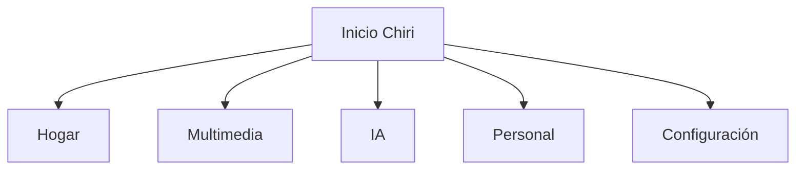

# 4.2.1 Flujo de Inicio y Sesión

Al iniciar la aplicación, Chiri deberá presentar una pantalla de inicio (Splash) mientras realiza las operaciones necesarias para determinar el estado de la sesión del usuario.

El Splash no utilizará un temporizador fijo. Su duración dependerá del tiempo necesario para completar la inicialización y comprobar el estado de la sesión.

El flujo será:

```text
Inicio de Chiri
      |
      v
    Splash
      |
      v
Inicialización
      |
      v
¿Sesión válida?
   /          \
 Sí            No
 |              |
 v              v
Inicio         Login
```

## Responsabilidades del Splash

El Splash será responsable únicamente de:

* presentar la identidad visual de Chiri.
* mostrar un estado de inicialización al usuario.
* esperar la finalización de las operaciones iniciales necesarias.
* permitir determinar el destino inicial de la aplicación.

El Splash no implementará lógica de negocio ni realizará directamente la autenticación contra servicios internos.

## Sesión válida

Cuando exista una sesión válida y vigente:

```text
Splash
   |
   v
Sesión válida
   |
   v
Inicio Chiri
```

El usuario será dirigido directamente a la pantalla de Inicio.

## Sesión no válida

Cuando no exista una sesión válida:

```text
Splash
   |
   v
Sesión no válida
   |
   v
Login
```

El usuario será dirigido a la pantalla de autenticación.

## Autenticación

La autenticación será realizada mediante la API de Chiri.

La aplicación Android no deberá conectarse directamente con la base de datos ni implementar mecanismos propios para validar credenciales.

La gestión de la sesión persistente seguirá las decisiones definidas en la arquitectura de Chiri Platform.

## Principio de navegación

El flujo inicial deberá ser transparente para el usuario:

> El usuario verá el Splash mientras Chiri determina su estado de sesión y será dirigido automáticamente al destino correspondiente.

La navegación deberá estar centralizada en el sistema de navegación de la aplicación y no deberá depender de temporizadores artificiales.

---

# 4.3 Pantalla Inicio

## Responsabilidad

Será el punto principal de entrada del usuario después de una sesión válida.

La pantalla Inicio proporcionará un resumen general del estado de Chiri y actuará como punto de entrada hacia las capacidades principales de la plataforma.

En la versión v1.0 mostrará:

* bienvenida al usuario.
* estado general del hogar.
* acciones rápidas.
* información básica de conectividad y servidor.

Las acciones rápidas iniciales serán:

* Música.
* Multimedia.

Las acciones rápidas representan puntos de entrada hacia sus respectivos módulos. La lógica funcional de cada módulo no pertenece a la pantalla Inicio.

## Obtención de información

La pantalla Inicio obtendrá la información mediante la API de Chiri.

Flujo:

```text
InicioScreen
    ↓
HomeViewModel
    ↓
HomeUseCase
    ↓
HomeRepository
    ↓
HomeApi
    ↓
API Chiri
```

La aplicación Android no deberá comunicarse directamente con los servicios internos utilizados por Chiri.

## Estados

La pantalla deberá contemplar como mínimo:

carga.
información disponible.
error.
Alcance v1.0

## La pantalla Inicio no implementará:

control directo de dispositivos.
lógica de Home Assistant.
reproducción directa de servicios multimedia.
configuración administrativa.
inteligencia artificial.
estadísticas históricas.
actividad reciente.

Estas capacidades pertenecen a sus respectivos módulos o a futuras versiones de la plataforma.

---

# 4.4 Módulo Hogar

## Objetivo

Permitir interacción con capacidades de domótica.

Ejemplos:

* consultar estados.
* ejecutar acciones.
* visualizar dispositivos.

Comunicación:

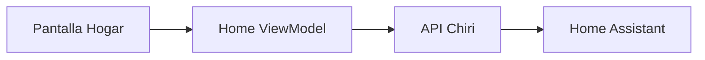

---

# 4.5 Módulo Multimedia

## Objetivo

Proporcionar acceso a capacidades multimedia.

Podrá integrar:

* música.
* video.
* biblioteca personal.

La aplicación no conocerá si la información proviene de:

* Music Assistant.
* Navidrome.
* Jellyfin.

---

# 4.6 Módulo Inteligencia Artificial

## Objetivo

Proporcionar interacción inteligente con Chiri.

Posibles capacidades futuras:

* conversación.
* comandos.
* asistencia.
* automatización inteligente.

La interfaz deberá permitir evolucionar desde texto hacia voz si se incorpora posteriormente.

---

# 4.7 Módulo Personal

## Objetivo

Gestionar información propia del usuario dentro de Chiri.

Ejemplos:

* preferencias.
* perfil.
* configuraciones personales.

---

# 4.8 Módulo Configuración

## Objetivo

Gestionar parámetros propios de la aplicación.

Ejemplos:

* cuenta.
* seguridad.
* preferencias visuales.
* conexión con Chiri Backend.

---

# 4.9 Navegación Interna

Las pantallas deberán comunicarse mediante navegación declarativa.

Ejemplo conceptual:

```text id="q3m7af"
Pantalla

    |

Evento Usuario

    |

ViewModel

    |

Nuevo Estado

    |

Nueva Pantalla
```

---

# 4.10 Estados de Pantalla

Cada pantalla deberá contemplar estados definidos:

Ejemplo:

```kotlin id="5v7r2m"
ScreenState

- Loading
- Success
- Empty
- Error
```

La interfaz deberá reaccionar a estos estados.

---

# 4.11 Diseño Evolutivo

La navegación deberá permitir agregar nuevas capacidades sin modificar la estructura principal.

Ejemplo futuro:

```text id="8f2k6q"
Chiri

├── Hogar

├── Multimedia

├── IA

├── Personal

├── Salud

├── Finanzas

└── Nuevas Capacidades
```

---

# 4.12 Regla Arquitectónica

La aplicación deberá organizarse alrededor de:

> Lo que el usuario puede hacer con Chiri, no de cómo Chiri lo implementa internamente.

# 5. Comunicación con la API Chiri

La aplicación Android se comunicará exclusivamente con la API del Backend Chiri.

La API será el único punto de acceso entre el cliente Android y la plataforma.

---

# 5.1 Principio de Comunicación

El flujo oficial será:

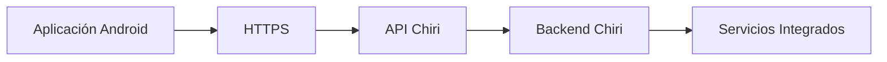

La aplicación Android no accederá directamente a los servicios internos de Chiri Platform.

---

# 5.2 Restricciones de Comunicación

La aplicación Android:

## Puede:

* consumir endpoints de Chiri.
* enviar acciones del usuario.
* recibir información procesada.
* administrar el estado de la sesión.
* almacenar información local permitida por la arquitectura.

## No puede:

* llamar Home Assistant directamente.
* llamar Music Assistant directamente.
* llamar Navidrome directamente.
* llamar Jellyfin directamente.
* acceder directamente a servicios de infraestructura.
* almacenar credenciales de servicios internos.
* implementar conexiones alternativas para evitar la API Chiri.

---

# 5.2.1 Regla de No Acceso Directo a Infraestructura

La aplicación Android no deberá acceder directamente a ningún servicio, servidor, contenedor, dispositivo o componente de infraestructura interna de Chiri Platform.

Todo acceso a capacidades de la plataforma deberá realizarse exclusivamente a través de la API Chiri.

La aplicación Android no deberá conocer ni utilizar directamente:

* direcciones IP internas.
* puertos internos.
* endpoints de servicios internos.
* APIs de Home Assistant.
* APIs de Music Assistant.
* APIs de Navidrome.
* APIs de Jellyfin.
* endpoints de contenedores Docker.
* servicios de infraestructura.
* credenciales de servicios internos.

Ejemplo incorrecto:

```text
Android
   |
   +---- http://192.168.x.x:8123
   |
   +---- Home Assistant
```

Ejemplo correcto:

```text
Android
   |
   +---- API Chiri
            |
            +---- Home Assistant
```

Esta regla garantiza que la infraestructura interna pueda evolucionar sin requerir cambios en el cliente Android.

---

# 5.3 Cliente de Red

La comunicación HTTP estará encapsulada dentro de una capa propia.

Estructura conceptual:

```text
network/

├── Cliente HTTP
├── Servicios API
├── Interceptores
└── Autenticación / renovación de sesión
```

La capa de red será responsable de:

* crear y configurar conexiones HTTP.
* enviar solicitudes.
* procesar respuestas.
* agregar información común a las solicitudes.
* gestionar aspectos técnicos de comunicación.
* participar en el flujo de autenticación y renovación de sesión según lo definido por la arquitectura de seguridad.

La capa de red no deberá contener lógica de negocio.

---

# 5.4 Protocolo de Comunicación

La comunicación entre Android y Chiri utilizará:

* HTTPS.
* API REST.
* JSON.

Ejemplo conceptual:

Solicitud:

```json
{
    "action": "turn_on",
    "device": "living_room"
}
```

Respuesta:

```json
{
    "success": true,
    "status": "active"
}
```

La estructura concreta de cada endpoint será definida por el contrato de la API correspondiente.

---

# 5.5 Modelos de Comunicación

Android no utilizará directamente modelos internos del Backend.

Existirá una separación entre:

* modelos de API.
* modelos de aplicación.
* modelos visuales.

Flujo:

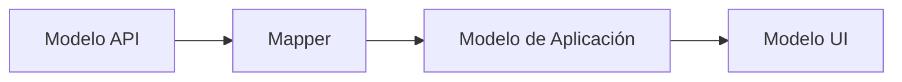

Esta separación permitirá modificar los contratos externos sin propagar directamente sus detalles hacia la interfaz de usuario.

Los modelos de API representarán exclusivamente los contratos de comunicación con el Backend.

Los modelos de aplicación representarán conceptos utilizados internamente por Android.

Los modelos UI estarán orientados a las necesidades de presentación de cada pantalla.

---

# 5.6 Autenticación

La aplicación deberá autenticarse contra Chiri Backend utilizando el mecanismo definido en:

```text
070_Seguridad.md
```

Android será responsable de:

* iniciar sesión mediante la API.
* mantener el estado local de la sesión.
* utilizar la información de sesión requerida por la API.
* solicitar la renovación de la sesión cuando corresponda.
* cerrar la sesión localmente al finalizarla.
* reaccionar ante una sesión inválida o revocada.

Las reglas de autenticación, emisión, renovación, revocación y seguridad de tokens pertenecen a `070_Seguridad.md`.

Android no implementará mecanismos alternativos de autenticación.

La aplicación tampoco accederá directamente a PostgreSQL ni a ningún sistema utilizado por el Backend para validar las credenciales.

---

# 5.7 Manejo de Errores

Los errores recibidos desde la API deberán transformarse en estados comprensibles para la aplicación y, cuando corresponda, en mensajes adecuados para el usuario.

Ejemplo:

Backend:

```json
{
    "error": "HOME_SERVICE_UNAVAILABLE"
}
```

Android:

```text
El sistema del hogar no está disponible
```

Los detalles técnicos internos no deberán exponerse innecesariamente al usuario.

La aplicación deberá diferenciar entre:

* errores de validación.
* errores de autenticación.
* errores de autorización.
* errores de disponibilidad.
* errores de red.
* errores internos del servidor.

---

# 5.8 Estados de Red

La aplicación deberá contemplar como mínimo:

* sin conexión.
* conexión lenta.
* servidor no disponible.
* error de autenticación.
* sesión expirada o revocada.
* error de autorización.
* error interno del servidor.
* respuesta no válida.

Estos estados deberán convertirse en estados de aplicación que permitan a la interfaz reaccionar de forma controlada.

---

# 5.9 Caché y Almacenamiento Local

La aplicación podrá almacenar información temporal para mejorar la experiencia de usuario.

Ejemplos:

* preferencias visuales.
* datos temporales.
* información de presentación que pueda reconstruirse.
* caché controlada de información obtenida desde la API.

La caché no deberá utilizarse como sustituto de la persistencia del Backend.

No deberán almacenarse localmente datos cuya fuente de verdad sea PostgreSQL, salvo cuando exista una estrategia explícita de caché definida por la arquitectura.

El almacenamiento de credenciales, tokens y demás información relacionada con la sesión deberá seguir exclusivamente las reglas establecidas en `070_Seguridad.md`.

No deberán almacenarse secretos de servicios internos.

---

# 5.10 Tiempo Real

La arquitectura deberá permitir incorporar comunicación en tiempo real en el futuro.

Posibles tecnologías:

* WebSocket.
* Server-Sent Events.
* notificaciones push.

La elección final dependerá de las necesidades de cada funcionalidad y será definida cuando exista un caso de uso que lo requiera.

La incorporación de comunicación en tiempo real no deberá romper la separación entre Android y los servicios internos.

---

# 5.11 Versionado de API

Android deberá comunicarse con versiones definidas de la API.

Ejemplo:

```text
/api/v1/
```

El versionado permitirá:

* evolución controlada del Backend.
* compatibilidad entre versiones.
* incorporación de nuevos contratos.
* migraciones controladas.
* reducción del impacto de cambios incompatibles.

La aplicación no deberá depender de endpoints internos o no versionados de los servicios que utiliza el Backend.

La API actualmente implementada no utiliza el prefijo /api/v1/.

El versionado mediante /api/v1/ corresponde a una estrategia futura
y no deberá utilizarse como referencia para las rutas actuales.

---

# 5.12 Disponibilidad del Backend

La aplicación deberá contemplar que el Backend pueda encontrarse temporalmente no disponible.

Cuando esto ocurra:

* no deberá intentar acceder directamente a los servicios internos.
* deberá informar el estado correspondiente.
* deberá permitir recuperar la operación cuando el servicio vuelva a estar disponible.
* no deberá interpretar la indisponibilidad de un servicio externo como una caída total de Android.

La aplicación deberá mantener una separación clara entre:

```text
Backend no disponible
```

y:

```text
Servicio integrado no disponible
```

Cuando el Backend esté disponible pero una integración concreta falle, será el Backend quien determine y comunique el estado correspondiente.

---

# 5.13 Principio de Aislamiento

El cliente Android deberá permanecer aislado de la infraestructura interna de Chiri.

El conocimiento de Android deberá limitarse a:

```text
Chiri API
    |
    +-- Contratos
    +-- Autenticación
    +-- Respuestas
    +-- Errores
```

Android no deberá conocer:

```text
Home Assistant
Music Assistant
Navidrome
Jellyfin
PostgreSQL
Docker
IPs internas
Puertos internos
```

salvo que alguno de estos elementos sea expuesto explícitamente como parte de un contrato público de la API, lo cual deberá estar justificado arquitectónicamente.

---

# 5.14 Principio Arquitectónico

La aplicación Android debe pensar:

> "Solicito capacidades a Chiri"

y nunca:

> "Controlo directamente los servicios internos".

La API Chiri será la frontera entre el cliente y la plataforma.

Toda nueva funcionalidad Android deberá comprobar primero si existe un contrato correspondiente en la API antes de implementar cualquier comunicación con el Backend.

# 6. Seguridad del Cliente Android

La aplicación Android de Chiri Platform deberá aplicar medidas de seguridad para proteger:

* identidad del usuario.
* comunicación con la plataforma.
* información local.
* credenciales de acceso.
* información relacionada con la sesión.

La aplicación Android respetará las decisiones de autorización proporcionadas por el Backend. La autorización granular mediante roles y permisos será incorporada cuando dicha capacidad sea implementada en el Backend.

La seguridad del cliente será complementaria a la seguridad implementada en el Backend.

Las reglas centrales de seguridad de autenticación, sesiones y tokens estarán definidas en:

```text
070_Seguridad.md
```

---

# 6.1 Principio de Seguridad

La aplicación Android deberá asumir que:

* el dispositivo puede perderse.
* el almacenamiento local puede ser inspeccionado.
* las comunicaciones pueden ser atacadas.
* la aplicación puede ser analizada.

Por lo tanto, ninguna información crítica ni ninguna decisión de seguridad deberá depender exclusivamente del cliente.

El Backend será siempre la autoridad para:

* validar identidad.
* validar sesiones.
* controlar permisos.
* autorizar operaciones.
* revocar acceso.

---

# 6.2 Comunicación Segura

Toda comunicación entre Android y Chiri Backend deberá realizarse mediante:

* HTTPS.
* certificados válidos.
* conexiones cifradas.

Flujo:

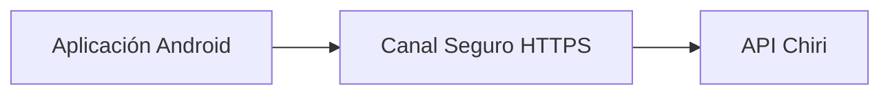

La aplicación no deberá utilizar conexiones HTTP no cifradas para comunicarse con el Backend en producción.

---

# 6.3 Gestión de Credenciales y Tokens

La aplicación no deberá almacenar:

* contraseñas en texto plano.
* contraseñas de servicios externos.
* claves privadas.
* claves API de servicios internos.
* tokens permanentes sin protección.

La contraseña proporcionada durante el inicio de sesión deberá utilizarse únicamente para realizar la autenticación contra la API y no deberá persistirse como credencial reutilizable.

Los tokens de sesión que deban persistir para mantener la sesión deberán almacenarse mediante mecanismos seguros del sistema Android, de acuerdo con las reglas establecidas en `070_Seguridad.md`.

Ejemplo incorrecto:

```text id="6r3p8v"
Código Android

API_KEY = "clave_secreta"
```

Ejemplo conceptual correcto:

```text id="5k7n2m"
Android
    |
    +-- Token de sesión protegido
    |
    v
API Chiri
    |
    v
Backend
    |
    v
Servicios internos
```

Android nunca deberá almacenar credenciales necesarias para acceder directamente a los servicios internos.

---

# 6.4 Almacenamiento Local Seguro

Los datos locales deberán clasificarse según su sensibilidad.

## Datos permitidos

Ejemplos:

* preferencias visuales.
* configuración de interfaz.
* datos temporales.
* información que pueda reconstruirse desde el Backend.

Estos datos podrán almacenarse mediante mecanismos apropiados para información no sensible.

---

## Datos protegidos

Ejemplos:

* tokens de sesión.
* información sensible del usuario.
* información necesaria para mantener una sesión autenticada.

Estos datos deberán almacenarse utilizando mecanismos seguros disponibles en Android.

La implementación concreta del almacenamiento de sesión deberá mantenerse encapsulada en la capa `storage`.

La UI y las demás capas de la aplicación no deberán acceder directamente al mecanismo físico utilizado para almacenar los datos sensibles.

---

# 6.5 Gestión de Sesión

La aplicación deberá contemplar:

* inicio de sesión.
* mantenimiento de sesión.
* expiración.
* renovación.
* cierre de sesión.
* invalidación de sesión.

La sesión estará controlada por el Backend.

El cliente Android podrá solicitar la renovación de una sesión cuando corresponda, pero no podrá determinar por sí mismo que una sesión continúa siendo válida.

Flujo conceptual:

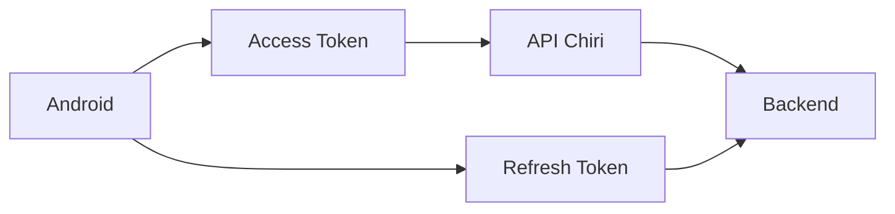

Las reglas concretas de emisión, rotación, expiración y revocación de tokens estarán definidas en `070_Seguridad.md`.

---

# 6.6 Respuesta ante `401 Unauthorized`

Cuando la API responda `401 Unauthorized`, Android deberá interpretar la respuesta de acuerdo con el estado de la sesión.

Cuando corresponda, el cliente deberá intentar renovar la sesión mediante el mecanismo definido por el Backend.

Flujo conceptual:

```text
Solicitud API
      |
      v
  ¿Respuesta 401?
    /       \
  No         Sí
  |           |
  v           v
Continuar   Renovar sesión
              |
          ¿Correcto?
           /     \
         Sí       No
         |         |
         v         v
    Reintentar    Logout
    solicitud     local
```

La renovación no deberá realizarse indefinidamente.

Si la renovación falla o el Backend determina que la sesión ya no es válida:

* deberán eliminarse los datos locales de sesión que correspondan.
* el usuario deberá ser considerado no autenticado.
* la aplicación deberá dirigirlo al flujo de inicio de sesión.

La aplicación no deberá intentar evitar una respuesta `401` accediendo directamente a otros servicios.

---

# 6.7 Manejo de Permisos

La aplicación deberá solicitar únicamente los permisos necesarios para sus funcionalidades.

Ejemplo:

Si Chiri incorpora interacción por voz:

Necesario:

* acceso al micrófono.

No necesario:

* acceso completo al almacenamiento.

Los permisos deberán solicitarse únicamente cuando exista una funcionalidad que los requiera.

La aplicación no deberá solicitar permisos por anticipado sin una necesidad funcional definida.

---

# 6.8 Protección de Información

La aplicación deberá evitar exponer:

* errores técnicos internos.
* URLs privadas.
* direcciones IP internas.
* puertos internos.
* credenciales.
* tokens.
* información de infraestructura.

Ejemplo incorrecto:

```text id="3m7q9x"
Error:
No se pudo conectar con 192.168.1.88:8095
```

Ejemplo correcto:

```text id="8q4n6m"
El servicio no está disponible actualmente
```

Los detalles técnicos deberán permanecer en los mecanismos de diagnóstico correspondientes y no deberán exponerse innecesariamente en la interfaz.

---

# 6.9 Seguridad del Código

El proyecto Android deberá considerar:

* evitar secretos en el código fuente.
* mantener dependencias actualizadas.
* revisar permisos.
* evitar librerías innecesarias.
* mantener separadas las responsabilidades de seguridad.
* evitar exponer información sensible mediante logs.
* no incluir credenciales de servicios externos.

Las credenciales y secretos no deberán incorporarse al repositorio.

---

# 6.10 Preparación para Biometría

La arquitectura deberá permitir incorporar posteriormente:

* huella digital.
* reconocimiento facial.
* bloqueo local.

Estas funcionalidades podrán utilizarse como mecanismo adicional de protección del acceso local a la aplicación.

La autenticación principal contra Chiri continuará perteneciendo al Backend.

La incorporación de biometría no deberá convertir al dispositivo en la autoridad de autenticación de la plataforma.

---

# 6.11 Pérdida del Dispositivo

Si un dispositivo autorizado se pierde, Chiri deberá permitir invalidar las sesiones asociadas al dispositivo.

El Backend será responsable de:

* revocar sesiones.
* retirar acceso.
* invalidar credenciales de sesión.
* mantener el control de acceso.

Android deberá reaccionar correctamente cuando una sesión haya sido revocada remotamente.

La seguridad no deberá depender de que el usuario tenga físicamente el dispositivo perdido para poder retirar su acceso.

---

# 6.12 Seguridad de Logs

La aplicación deberá evitar registrar información sensible.

No deberán aparecer en logs:

* contraseñas.
* tokens completos.
* claves API.
* credenciales.
* información sensible innecesaria.

Cuando sea necesario diagnosticar una operación autenticada, deberán utilizarse identificadores o información técnica que no permita recuperar las credenciales de sesión.

---

# 6.13 Principio de Defensa en Profundidad

La seguridad de Chiri deberá mantenerse mediante varias capas:

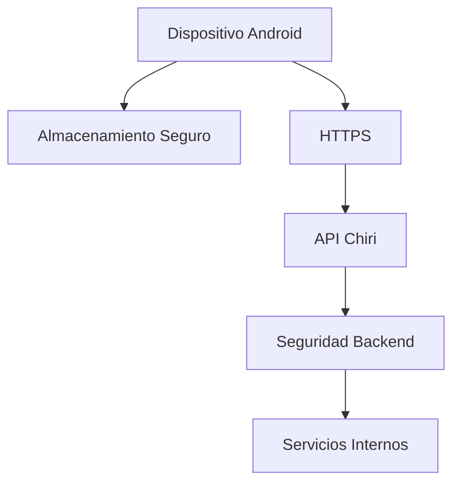

Ninguna medida individual deberá considerarse suficiente por sí sola.

---

# 6.14 Principio Arquitectónico

La seguridad del cliente Android deberá cumplir:

> El dispositivo puede acceder a Chiri, pero nunca debe poseer el control completo de Chiri.

El cliente Android es un consumidor de la plataforma.

La autoridad de seguridad permanece en el Backend.

# 7. Estado, Datos Locales y Caché

La aplicación Android de Chiri Platform deberá gestionar estados internos y almacenamiento local de forma controlada.

El almacenamiento local tendrá como objetivo mejorar la experiencia del usuario, no reemplazar al Backend.

Backend = fuente de verdad
Android = estado/caché local derivado

No utilizar caché local para sustituir validaciones de autenticación, autorización o seguridad.

---

# 7.1 Fuente Única de Verdad

La información principal de Chiri permanecerá en el Backend.

Ejemplo:

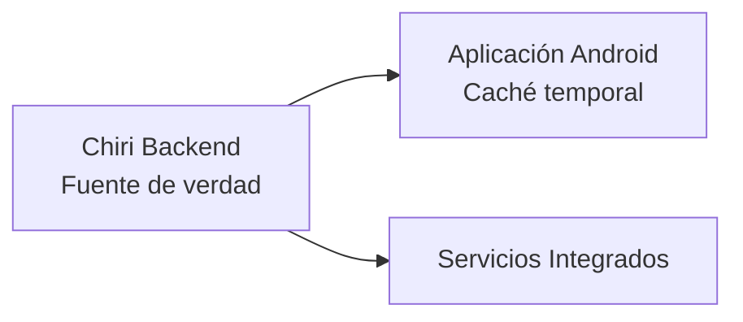

---

# 7.2 Tipos de Información Local

La información almacenada en Android se clasificará en:

---

## Configuración de Usuario

Información relacionada con la experiencia personal.

Ejemplos:

* tema visual.
* idioma.
* preferencias de interfaz.
* última pantalla utilizada.

---

## Datos Temporales

Información utilizada para mejorar rendimiento.

Ejemplos:

* últimas consultas.
* imágenes almacenadas temporalmente.
* información reciente.

---

## Datos de Sesión

Información necesaria para mantener comunicación con Chiri.

Ejemplos:

* sesión activa.
* tokens protegidos.
* estado de autenticación.

---

# 7.3 Información que NO debe almacenarse

Android no deberá almacenar como fuente principal:

* usuarios completos.
* permisos definitivos.
* dispositivos del hogar.
* biblioteca multimedia.
* configuraciones críticas.

Estos datos pertenecen a:

* Backend Chiri.
* servicios especializados.

---

# 7.4 Gestión de Estado con MVVM

Cada pantalla deberá manejar su propio estado.

Ejemplo conceptual:

```kotlin id="6n8q3p"
ScreenState

- Loading
- Success
- Empty
- Error
```

Flujo:

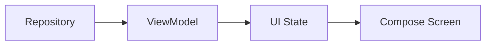

---

# 7.5 Caché

La caché deberá utilizarse para:

* mejorar velocidad.
* reducir solicitudes innecesarias.
* mejorar experiencia.

No deberá utilizarse para:

* almacenar lógica de negocio.
* duplicar servicios.
* evitar comunicación con Backend permanentemente.

---

# 7.6 Estrategia Offline

La aplicación deberá considerar escenarios sin conexión.

Ejemplos:

* mostrar información disponible localmente.
* informar pérdida de conexión.
* reintentar operaciones.

---

# 7.7 Operaciones Offline

No todas las operaciones podrán ejecutarse sin conexión.

Ejemplo:

Consulta de preferencias visuales:

Puede funcionar offline.

Ejemplo:

Encender una luz:

Requiere conexión con Backend.

---

# 7.8 Sincronización

Cuando la conexión vuelva, la aplicación podrá sincronizar información temporal.

Flujo:

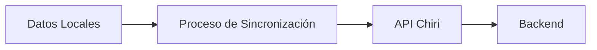

---

# 7.9 Manejo de Conflictos

Si existe información diferente entre Android y Backend:

La prioridad será:

```text
Backend Chiri
        |
        v
Estado local Android
```

El Backend será considerado la autoridad.

---

# 7.10 Limpieza de Datos

La aplicación deberá permitir:

* cerrar sesión limpiando información temporal.
* eliminar caché cuando corresponda.
* renovar datos almacenados.

---

# 7.11 Principio Arquitectónico

La aplicación Android deberá cumplir:

> La caché mejora la experiencia, pero nunca reemplaza la plataforma.

# 8. Pruebas y Calidad de la Aplicación Android

La aplicación Android de Chiri Platform deberá incorporar prácticas de calidad que permitan detectar errores antes de llegar a usuarios finales.

Las pruebas serán parte del proceso normal de desarrollo.

---

# 8.1 Principio de Calidad

El desarrollo Android deberá cumplir:

* código mantenible.
* componentes reutilizables.
* separación de responsabilidades.
* pruebas automatizadas cuando corresponda.
* revisión antes de integración.

---

# 8.2 Tipos de Pruebas

La estrategia de pruebas estará dividida en:

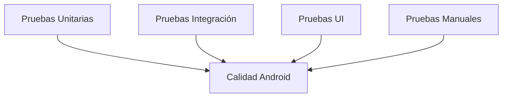

---

# 8.3 Pruebas Unitarias

## Objetivo

Validar componentes individuales sin depender de la interfaz.

Se aplicarán principalmente a:

* ViewModels.
* Use Cases.
* validaciones.
* transformaciones.
* lógica interna.

---

Ejemplo:

Validar:

```text
Estado de sesión válido

+

Datos válidos

=

Estado de pantalla correcto
```

---

# 8.4 Pruebas de ViewModel

Los ViewModels deberán poder probarse sin ejecutar pantallas completas.

Se validará:

* cambios de estado.
* manejo de errores.
* eventos del usuario.
* llamadas a casos de uso.

---

# 8.5 Pruebas de Repository

Validarán:

* comunicación con API.
* manejo de respuestas.
* errores de red.
* uso de caché.

Ejemplo:

```text
API responde correctamente

        |

Repository transforma datos

        |

ViewModel recibe información válida
```

---

# 8.6 Pruebas de Interfaz (UI)

Las pruebas UI validarán:

* carga de pantallas.
* navegación.
* interacción del usuario.
* estados visuales.

Ejemplos:

* botón visible.
* mensaje de error mostrado.
* navegación correcta.

---

# 8.7 Pruebas de Integración

Validarán comunicación entre componentes.

Ejemplos:

* App Android + API Chiri.
* Autenticación completa.
* Consulta de estado del hogar.
* Reproducción multimedia.

---

# 8.8 Pruebas Manuales

Algunas validaciones requerirán pruebas reales:

Ejemplos:

* experiencia de usuario.
* comportamiento en diferentes dispositivos.
* rendimiento.
* interacción táctil.

---

# 8.9 Calidad del Código Kotlin

El código deberá seguir:

* nombres claros.
* funciones pequeñas.
* evitar duplicación.
* arquitectura consistente.
* documentación cuando sea necesaria.

---

# 8.10 Revisión de Dependencias

Antes de incorporar librerías nuevas se deberá evaluar:

* mantenimiento activo.
* seguridad.
* compatibilidad.
* necesidad real.

No se agregarán dependencias por comodidad temporal.

---

# 8.11 Compatibilidad de Dispositivos

La aplicación deberá considerar:

* diferentes tamaños de pantalla.
* versiones Android soportadas.
* rendimiento del dispositivo.
* consumo de batería.

---

# 8.12 Validación Antes de Publicación

Antes de distribuir una versión deberán verificarse:

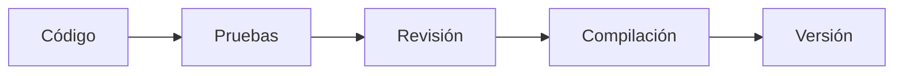

---

# 8.13 Principio Arquitectónico

Una versión de Chiri Android estará lista cuando:

> Funciona correctamente, mantiene la arquitectura definida y no compromete la estabilidad de la plataforma.

# 9. Despliegue y Distribución de la Aplicación Android

La aplicación Android de Chiri Platform deberá contar con un proceso definido para construcción, validación y distribución de versiones.

El objetivo será mantener control sobre las versiones instaladas y permitir evolución futura.

---

# 9.1 Ambientes de Ejecución

La aplicación deberá considerar diferentes ambientes:

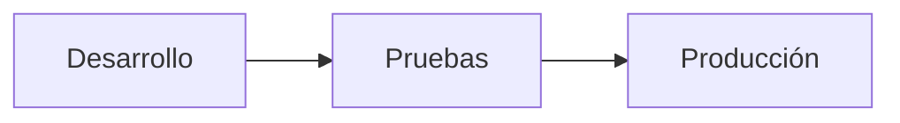

---

# 9.2 Ambiente Desarrollo

Utilizado durante la programación.

Características:

* conexión a servicios de prueba cuando corresponda.
* logs detallados.
* herramientas de depuración.
* cambios frecuentes.

---

# 9.3 Ambiente Producción

Utilizado por usuarios reales.

Características:

* conexión al Backend oficial.
* menor exposición de información técnica.
* configuraciones seguras.
* versión estable.

---

# 9.4 Configuración por Ambiente

La aplicación deberá separar:

* código.
* configuración.
* credenciales.

Ejemplo conceptual:

```text id="7k3m9q"
Android

├── Config Desarrollo

├── Config Pruebas

└── Config Producción
```

Las configuraciones de ambiente podrán variar, pero los secretos y credenciales no deberán incorporarse al código fuente ni distribuirse innecesariamente dentro de la aplicación.

---

# 9.5 Versionado de la Aplicación

Cada versión deberá estar identificada.

Ejemplo:

```text id="2p8m5x"
Chiri Android

Versión:
1.0.0

Código:
100
```

El versionado permitirá:

* identificar cambios.
* controlar actualizaciones.
* resolver problemas.

---

# 9.6 Firma de la Aplicación

Las versiones oficiales deberán estar firmadas.

La firma permitirá:

* validar autenticidad.
* controlar actualizaciones.
* evitar aplicaciones modificadas.

---

# 9.7 Generación del Paquete

La aplicación podrá generar:

* APK para pruebas internas.
* AAB para distribución oficial.

La estrategia final de distribución será definida según el uso de Chiri.

---

# 9.8 Distribución Inicial

Durante las primeras etapas del proyecto podrá utilizarse:

* instalación directa.
* distribución privada.
* pruebas internas.

No será necesario definir una tienda pública en la primera versión.

---

# 9.9 Actualizaciones

Las actualizaciones deberán considerar:

* compatibilidad con Backend.
* migraciones necesarias.
* cambios visuales.
* nuevas capacidades.

---

# 9.10 Compatibilidad Backend / Android

Las versiones deberán mantener compatibilidad.

Ejemplo:

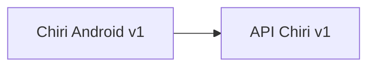

Los cambios importantes deberán planificarse.

El cliente Android deberá utilizar únicamente contratos de API compatibles y no depender de detalles internos del Backend.

---

# 9.11 Recuperación de Versiones

El proyecto deberá conservar:

* código fuente.
* versiones compiladas importantes.
* historial de cambios.

Esto permitirá volver a versiones anteriores si fuera necesario.

---

# 9.12 Principio Arquitectónico

El proceso de distribución deberá responder:

> ¿Podemos saber qué versión está instalada, cómo fue creada y cómo actualizarla de forma segura?

Si la respuesta es no, el proceso necesita mejorar.

# 10. Evolución y Mantenimiento de Android

La aplicación Android de Chiri Platform deberá estar preparada para evolucionar junto con la plataforma, incorporando nuevas capacidades sin comprometer la arquitectura inicial.

Los cambios deberán respetar los principios definidos en este documento.

---

# 10.1 Principio de Evolución

Toda nueva capacidad deberá seguir el flujo:

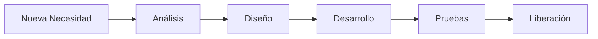

---

# 10.2 Incorporación de Nuevas Funcionalidades

Antes de agregar una funcionalidad deberá evaluarse:

* objetivo dentro de Chiri.
* impacto en arquitectura.
* necesidad real.
* dependencia con Backend.

No se agregarán funciones solamente por tendencia tecnológica.

---

# 10.3 Nuevos Módulos Android

Una nueva capacidad o área funcional deberá incorporarse cuando:

* tenga una responsabilidad propia.
* pueda evolucionar independientemente.
* tenga lógica claramente definida.

Ejemplo futuro:

```text id="4x7m9p"
com.chirihome.platform/

├── ui/
│   ├── home/
│   ├── media/
│   ├── ai/
│   └── personal/
│
├── viewmodel/
├── domain/
├── data/
├── navigation/
├── di/
├── network/
├── storage/
└── utils/
```

Las capacidades pueden crecer sin abandonar la arquitectura MVVM definida.

---

# 10.4 Evitar Crecimiento Desordenado

La aplicación deberá evitar:

* pantallas con demasiada lógica.
* ViewModels gigantes.
* clases con múltiples responsabilidades.
* duplicación de código.

---

# 10.5 Refactorización

La mejora del código será parte del mantenimiento normal.

Objetivos:

* simplificar.
* mejorar rendimiento.
* eliminar código innecesario.
* mantener claridad.

La refactorización deberá conservar comportamiento esperado.

---

# 10.6 Actualización de Dependencias

Las dependencias Android deberán revisarse periódicamente.

Se evaluará:

* seguridad.
* compatibilidad.
* estabilidad.
* beneficio real.

No se actualizará por moda tecnológica.

---

# 10.7 Compatibilidad a Largo Plazo

La aplicación deberá considerar:

* nuevas versiones de Android.
* nuevos dispositivos.
* nuevos tamaños de pantalla.
* cambios en API Chiri.

---

# 10.8 Documentación Continua

Los cambios importantes deberán actualizar:

* documentación técnica.
* diagramas.
* decisiones arquitectónicas.

La documentación será parte del desarrollo.

---

# 10.9 Cambios Arquitectónicos

Si un cambio afecta:

* estructura MVVM.
* comunicación con Backend.
* modelo de seguridad.
* organización principal.

deberá registrarse mediante ADR.

---

# 10.10 Principio de Mantenimiento

La evolución deberá priorizar:

* estabilidad.
* simplicidad.
* mantenibilidad.
* experiencia del usuario.

Antes que:

* complejidad.
* exceso de funcionalidades.
* tecnologías innecesarias.

---

# 10.11 Regla Final Android

Toda modificación futura deberá cumplir:

> La aplicación debe crecer agregando capacidades, no acumulando complejidad.

# 11. Conclusión de la Aplicación Android

La aplicación Android de Chiri Platform v1.0 queda definida como un cliente seguro y orientado a capacidades de la plataforma.

Su responsabilidad principal será proporcionar una experiencia de usuario unificada, consumiendo las capacidades expuestas por Chiri Backend mediante una comunicación controlada.

---

# 11.1 Arquitectura Definida

La aplicación Android utilizará:

* Kotlin como lenguaje principal.
* Jetpack Compose para interfaz.
* Arquitectura MVVM.
* Repository Pattern.
* Separación por capas.
* Comunicación exclusiva mediante API Chiri.

---

# 11.2 Responsabilidad del Cliente Android

La aplicación será responsable de:

* interacción con el usuario.
* presentación de información.
* navegación.
* gestión de estados visuales.
* comunicación con Backend.
* almacenamiento local temporal.

---

# 11.3 Límites Confirmados

La aplicación Android no será responsable de:

* lógica principal de la plataforma.
* control directo de servicios internos.
* almacenamiento de datos críticos.
* administración de infraestructura.

Los servicios como:

* Home Assistant.
* Music Assistant.
* Navidrome.
* Jellyfin.

permanecerán administrados por Chiri Backend mediante integraciones.

---

# 11.4 Principios Confirmados

El desarrollo Android seguirá:

* Arquitectura antes que código.
* Separación de responsabilidades.
* Seguridad por defecto.
* Estado controlado.
* Código mantenible.
* Componentes reutilizables.
* Evolución planificada.

---

# 11.5 Relación con la Plataforma

La arquitectura final queda:

```mermaid id="6p8m3q"
flowchart TB

    User["Usuario"]

    Android["Aplicación Android"]

    API["API Chiri"]

    Backend["Backend Chiri"]

    Services["Servicios Integrados"]


    User --> Android
    Android --> API
    API --> Backend
    Backend --> Services
```

---

# 11.6 Estado del Documento

El documento:

```text
040_Android.md
```

queda definido como la referencia oficial para el desarrollo de la aplicación Android Chiri Platform v1.0.

Cualquier implementación futura deberá respetar:

* arquitectura MVVM.
* comunicación mediante API.
* separación de responsabilidades.
* reglas de seguridad.
* estrategia de evolución.

---

# Declaración Final

La aplicación Android de Chiri Platform v1.0 está preparada para pasar de la fase de diseño a la fase de implementación cuando corresponda.

La arquitectura definida permite construir un cliente moderno, seguro y escalable, manteniendo la filosofía principal del proyecto:

> Chiri es una plataforma; Android es solamente una ventana de acceso a sus capacidades.
