# Chiri Platform

**Documento:** 040_Android.md

**Versión:** 1.0

**Estado:** Cerrado

---

# 1. Introducción

La aplicación Android de Chiri Platform será uno de los clientes de acceso a la plataforma.

Su función será proporcionar una interfaz moderna y segura para que los usuarios puedan interactuar con las capacidades disponibles en Chiri.

La aplicación Android no será responsable de implementar la lógica principal del sistema.

---

# 1.1 Objetivo de la Aplicación Android

El objetivo principal de la aplicación Android será:

* proporcionar una experiencia de usuario unificada.
* consumir las capacidades expuestas por la API de Chiri.
* presentar información de los diferentes módulos.
* permitir interacción con la plataforma desde dispositivos autorizados.

---

# 1.2 Rol dentro de la Arquitectura General

La aplicación Android ocupa la capa de cliente dentro de la arquitectura general.

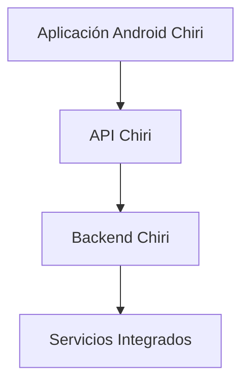

---

# 1.3 Responsabilidades del Cliente Android

La aplicación Android será responsable de:

* mostrar información al usuario.
* capturar acciones del usuario.
* gestionar navegación.
* administrar estados visuales.
* comunicarse con la API.
* almacenar información local necesaria.
* gestionar experiencia de usuario.

---

# 1.4 Lo que NO hará la Aplicación Android

La aplicación Android no será responsable de:

* conectarse directamente con Home Assistant.
* conectarse directamente con Music Assistant.
* administrar dispositivos físicos.
* ejecutar reglas de negocio principales.
* almacenar información crítica del sistema.
* reemplazar servicios del Backend.

Ejemplo:

Incorrecto:

```text
Android
   |
   +---- Home Assistant API
```

Correcto:

```text
Android
   |
   +---- API Chiri
            |
            +---- Home Assistant
```

---

# 1.5 Tecnología Definida

La aplicación Android utilizará:

## Lenguaje

* Kotlin.

## Interfaz

* Jetpack Compose.

## Arquitectura

* MVVM.

## Comunicación

* API REST mediante HTTPS.

## Gestión de dependencias

* Gradle.

---

# 1.6 Principio de Diseño

La aplicación Android deberá seguir el principio:

> El cliente consume capacidades de Chiri; no conoce la complejidad interna de la plataforma.

---

# 1.7 Experiencia de Usuario

La aplicación deberá proporcionar una experiencia consistente para diferentes capacidades:

Ejemplos:

* control del hogar.
* reproducción multimedia.
* interacción con IA.
* gestión personal.
* configuración.

La interfaz deberá evolucionar independientemente de los servicios internos.

---

# 1.8 Estado del Documento

Este documento definirá la arquitectura oficial de la aplicación Android Chiri Platform v1.0.

No contiene código.

Define:

* estructura.
* responsabilidades.
* comunicación.
* reglas de desarrollo.

# 2. Arquitectura Interna Android

La aplicación Android de Chiri Platform estará organizada mediante una arquitectura basada en capas utilizando el patrón MVVM (Model-View-ViewModel).

El objetivo será mantener:

* separación de responsabilidades.
* código mantenible.
* facilidad de pruebas.
* evolución independiente de componentes.

---

# 2.1 Arquitectura MVVM

La arquitectura principal será:

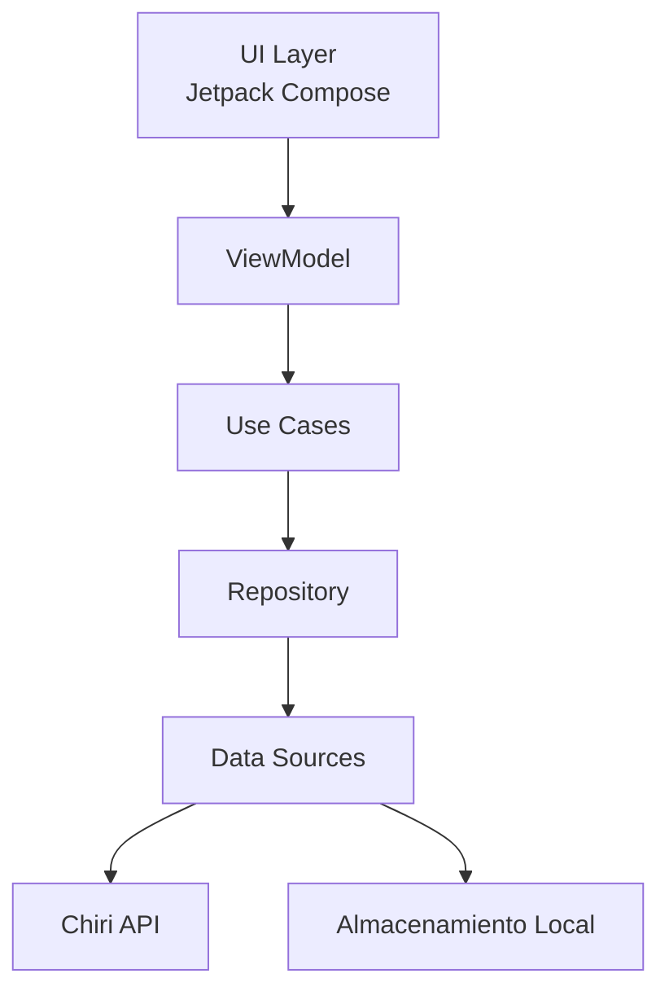

---

# 2.2 UI Layer

## Responsabilidad

La capa de interfaz será responsable de representar el estado de la aplicación.

Utilizará:

* Jetpack Compose.
* Material Design.
* Componentes reutilizables.

---

## La UI será responsable de:

* mostrar pantallas.
* capturar eventos del usuario.
* observar estados.
* ejecutar navegación.

---

## La UI NO será responsable de:

* llamadas HTTP.
* lógica de negocio.
* acceso a base de datos.
* procesamiento complejo.

---

# 2.3 ViewModel

## Responsabilidad

El ViewModel actuará como intermediario entre la interfaz y la lógica de aplicación.

Funciones:

* mantener estado de pantalla.
* procesar eventos del usuario.
* solicitar información.
* preparar datos para la UI.

Ejemplo conceptual:

```text id="9g2m7k"
Usuario pulsa botón

        |

Composable

        |

ViewModel

        |

Solicita acción a Chiri API
```

---

# 2.4 Use Cases

## Responsabilidad

Los casos de uso representan acciones que la aplicación puede realizar.

Ejemplos:

* Obtener estado del hogar.
* Reproducir música.
* Consultar biblioteca.
* Enviar consulta a IA.

---

Los Use Cases permitirán:

* separar intención de implementación.
* reutilizar lógica.
* facilitar pruebas.

---

# 2.5 Repository Pattern

Los repositorios serán la capa encargada de administrar el origen de los datos.

Un repositorio puede obtener información desde:

* API Chiri.
* almacenamiento local.
* caché.

Ejemplo:

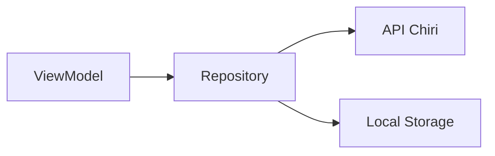

---

# 2.6 Data Layer

La capa de datos será responsable de:

* comunicación con API.
* conversión de modelos.
* almacenamiento local.
* gestión de caché.

---

# 2.7 Flujo de Información

Ejemplo: consultar temperatura del hogar.

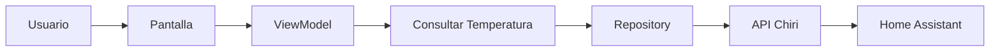

---

# 2.8 Manejo de Estado

La aplicación deberá utilizar un modelo de estado explícito.

Ejemplo conceptual:

```kotlin
data class ScreenState(
    val loading: Boolean,
    val data: Data?,
    val error: String?
)
```

La UI reaccionará al estado recibido.

---

# 2.9 Principio de Dependencias

Las dependencias deberán seguir una dirección controlada:

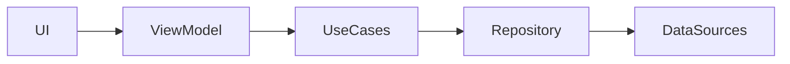

Las capas superiores no deberán conocer detalles internos de implementación.

---

# 2.10 Principio Arquitectónico

La aplicación Android deberá cumplir:

> La interfaz depende de la lógica; la lógica no depende de la interfaz.

# 3. Estructura del Proyecto Android

La aplicación Android de Chiri Platform estará organizada para reflejar la arquitectura MVVM definida anteriormente.

La estructura deberá favorecer:

* separación de responsabilidades.
* navegación sencilla del código.
* reutilización de componentes.
* crecimiento modular.

---

# 3.1 Estructura General

La carpeta Android será:

```text
android/

├── app/

├── build.gradle

├── settings.gradle

├── gradle/

└── README.md
```

---

# 3.2 Módulo Principal `app/`

La aplicación principal estará organizada:

```text
app/

└── src/

    └── main/

        ├── java/com/chirihome/platform/

        ├── res/

        └── AndroidManifest.xml
```

---

# 3.3 Paquete Principal

El paquete base será:

```text
com.chirihome.platform
```

Dentro de él se organizarán las responsabilidades:

```text
com.chirihome.platform/

├── ui/

├── navigation/

├── viewmodel/

├── domain/

├── data/

├── di/

├── network/

├── storage/

└── utils/
```

---

# 3.4 Paquete `ui/`

## Responsabilidad

Contendrá todos los elementos visuales.

Estructura:

```text
ui/

├── screens/

├── components/

├── theme/

└── icons/
```

Contendrá:

* pantallas Compose.
* componentes reutilizables.
* estilos visuales.
* temas.

---

# 3.5 Paquete `navigation/`

## Responsabilidad

Gestionará la navegación interna de la aplicación.

Ejemplo:

```text
navigation/

├── Routes.kt

└── NavGraph.kt
```

Será responsable de:

* definir destinos.
* controlar flujo entre pantallas.

No contendrá lógica de negocio.

---

# 3.6 Paquete `viewmodel/`

## Responsabilidad

Contendrá los ViewModels de la aplicación.

Ejemplo:

```text
viewmodel/

├── HomeViewModel.kt

├── MediaViewModel.kt

└── AiViewModel.kt
```

Cada ViewModel estará asociado a una responsabilidad clara.

---

# 3.7 Paquete `domain/`

## Responsabilidad

Contendrá la lógica propia de la aplicación Android.

Ejemplo:

```text
domain/

├── model/

└── repository/

└── contratos/
```

Contendrá:

* casos de uso.
* contratos internos.

No dependerá de Android UI.

---

# 3.8 Paquete `data/`

## Responsabilidad

Gestionará fuentes de datos.

Ejemplo:

```text
data/

├── local/

├── remote/

├── mapper/

└── repository/
```

Contendrá:

* implementaciones de repositorios.
* comunicación remota.
* almacenamiento local.

---

# 3.9 Paquete `network/`

## Responsabilidad

Gestionará comunicación con la API Chiri.

Ejemplo:

```text
network/

├── ApiService.kt

├── ApiClient.kt

└── interceptor/
```

Responsabilidades:

* cliente HTTP.
* configuración HTTPS.
* manejo técnico de comunicación.

---

# 3.10 Paquete `storage/`

## Responsabilidad

Gestionará almacenamiento local del dispositivo.

Ejemplos:

* preferencias.
* caché.
* información temporal.

No almacenará datos críticos de la plataforma.

---

# 3.11 Paquete `di/`

## Responsabilidad

Gestionará inyección de dependencias.

Permitirá:

* crear componentes.
* administrar instancias.
* desacoplar clases.

---

# 3.12 Paquete `model/`

## Responsabilidad

Contendrá modelos utilizados por la aplicación.

Ejemplos:

* Usuario.
* Dispositivo.
* Canción.
* Estado del sistema.

Los modelos deberán representar información consumida por Chiri.

---

# 3.13 Recursos

La carpeta:

```text
res/
```

contendrá:

* imágenes.
* iconos.
* fuentes.
* configuraciones visuales.

---

# 3.14 Regla de Organización

Antes de crear una nueva clase deberá responderse:

> ¿Cuál es la responsabilidad de este componente y dónde pertenece?

Si no existe una ubicación clara, primero deberá revisarse el diseño.

---

# 3.15 Principio Arquitectónico

La estructura física del proyecto deberá reflejar la arquitectura lógica definida.

El código debe poder entenderse leyendo la organización de carpetas.

# 4. Diseño de Pantallas y Navegación

La aplicación Android de Chiri Platform deberá organizar su navegación alrededor de las capacidades principales de la plataforma.

La navegación deberá ser simple, consistente y preparada para incorporar nuevas funcionalidades.

---

# 4.1 Principio de Navegación

La aplicación deberá mostrar al usuario las capacidades de Chiri, no la complejidad interna de los servicios.

Ejemplo:

Correcto:

```text id="j4w8qn"
Chiri

├── Hogar
├── Multimedia
├── Inteligencia Artificial
├── Personal
└── Configuración
```

Incorrecto:

```text id="p7n3vx"
Chiri

├── Home Assistant
├── Music Assistant
├── Navidrome
└── Jellyfin
```

El usuario interactúa con Chiri, no con la infraestructura interna.

---

# 4.2 Navegación Principal

La aplicación podrá organizarse mediante áreas funcionales principales.

Ejemplo conceptual:

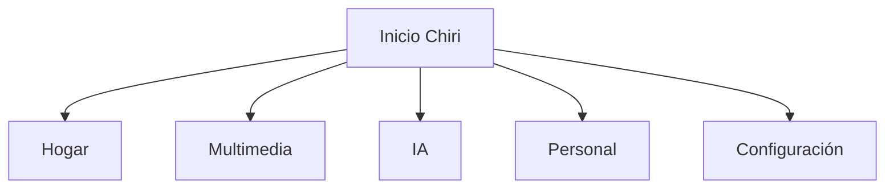

---

# 4.3 Pantalla Inicio

## Responsabilidad

Será el punto principal de entrada del usuario.

Podrá mostrar:

* estado general de Chiri.
* accesos rápidos.
* información relevante.
* eventos importantes.

No deberá contener lógica compleja.

---

# 4.4 Módulo Hogar

## Objetivo

Permitir interacción con capacidades de domótica.

Ejemplos:

* consultar estados.
* ejecutar acciones.
* visualizar dispositivos.

Comunicación:

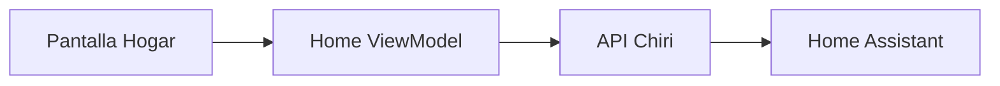

---

# 4.5 Módulo Multimedia

## Objetivo

Proporcionar acceso a capacidades multimedia.

Podrá integrar:

* música.
* video.
* biblioteca personal.

La aplicación no conocerá si la información proviene de:

* Music Assistant.
* Navidrome.
* Jellyfin.

---

# 4.6 Módulo Inteligencia Artificial

## Objetivo

Proporcionar interacción inteligente con Chiri.

Posibles capacidades futuras:

* conversación.
* comandos.
* asistencia.
* automatización inteligente.

La interfaz deberá permitir evolucionar desde texto hacia voz si se incorpora posteriormente.

---

# 4.7 Módulo Personal

## Objetivo

Gestionar información propia del usuario dentro de Chiri.

Ejemplos:

* preferencias.
* perfil.
* configuraciones personales.

---

# 4.8 Módulo Configuración

## Objetivo

Gestionar parámetros propios de la aplicación.

Ejemplos:

* cuenta.
* seguridad.
* preferencias visuales.
* conexión con Chiri Backend.

---

# 4.9 Navegación Interna

Las pantallas deberán comunicarse mediante navegación declarativa.

Ejemplo conceptual:

```text id="q3m7af"
Pantalla

    |

Evento Usuario

    |

ViewModel

    |

Nuevo Estado

    |

Nueva Pantalla
```

---

# 4.10 Estados de Pantalla

Cada pantalla deberá contemplar estados definidos:

Ejemplo:

```kotlin id="5v7r2m"
ScreenState

- Loading
- Success
- Empty
- Error
```

La interfaz deberá reaccionar a estos estados.

---

# 4.11 Diseño Evolutivo

La navegación deberá permitir agregar nuevas capacidades sin modificar la estructura principal.

Ejemplo futuro:

```text id="8f2k6q"
Chiri

├── Hogar

├── Multimedia

├── IA

├── Personal

├── Salud

├── Finanzas

└── Nuevas Capacidades
```

---

# 4.12 Regla Arquitectónica

La aplicación deberá organizarse alrededor de:

> Lo que el usuario puede hacer con Chiri, no de cómo Chiri lo implementa internamente.

# 5. Comunicación con la API Chiri

La aplicación Android se comunicará exclusivamente con la API del Backend Chiri.

La API será el único punto de acceso entre el cliente Android y la plataforma.

---

# 5.1 Principio de Comunicación

El flujo oficial será:

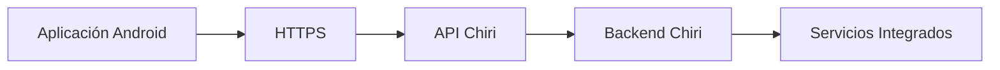

---

# 5.2 Restricciones de Comunicación

La aplicación Android:

## Puede:

* consumir endpoints de Chiri.
* enviar acciones del usuario.
* recibir información procesada.
* administrar sesión.

## No puede:

* llamar Home Assistant directamente.
* llamar Music Assistant directamente.
* llamar Navidrome directamente.
* llamar Jellyfin directamente.
* almacenar credenciales de servicios internos.

# 5.2.1 Regla de No Acceso Directo a Infraestructura

La aplicación Android no deberá acceder directamente a ningún servicio,
servidor, contenedor, dispositivo o componente de infraestructura interna
de Chiri Platform.

Todo acceso a capacidades de la plataforma deberá realizarse exclusivamente
a través de la API Chiri.

La aplicación Android no deberá conocer ni utilizar directamente:

* direcciones IP internas.
* puertos internos.
* endpoints de servicios internos.
* APIs de Home Assistant.
* APIs de Music Assistant.
* APIs de Navidrome.
* APIs de Jellyfin.
* endpoints de contenedores Docker.
* servicios de infraestructura.
* credenciales de servicios internos.

Ejemplo incorrecto:

```text
Android
   |
   +---- http://192.168.x.x:8123
   |
   +---- Home Assistant

---

# 5.3 Cliente de Red

La comunicación HTTP estará encapsulada dentro de una capa propia.

Ejemplo conceptual:

```text id="9z7m3q"
network/

├── ApiClient

├── ApiService

└── Interceptors
```

Responsabilidades:

* crear conexiones.
* enviar solicitudes.
* manejar respuestas.
* agregar información común.

---

# 5.4 Protocolo de Comunicación

La comunicación utilizará:

* HTTPS.
* API REST.
* JSON.

Ejemplo conceptual:

Solicitud:

```json id="3j6q9w"
{
 "action": "turn_on",
 "device": "living_room"
}
```

Respuesta:

```json id="5k8n2p"
{
 "success": true,
 "status": "active"
}
```

---

# 5.5 Modelos de Comunicación

Android no utilizará directamente modelos internos del Backend.

Existirá una separación entre:

* modelos API.
* modelos de aplicación.
* modelos visuales.

Ejemplo:

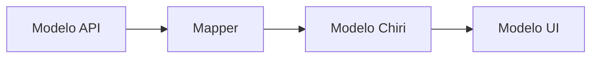

---

# 5.6 Autenticación

La aplicación deberá autenticarse contra Chiri Backend.

El mecanismo concreto de autenticación y almacenamiento de credenciales será definido exclusivamente en:

`070_Seguridad.md`

La arquitectura deberá permitir:

* inicio de sesión.
* renovación de sesión.
* cierre seguro.
* control de acceso.

---

# 5.7 Manejo de Errores

Los errores recibidos desde la API deberán transformarse a mensajes adecuados para el usuario.

Ejemplo:

Backend:

```json id="2c8m7x"
{
 "error": "HOME_SERVICE_UNAVAILABLE"
}
```

Android:

```text id="8p3k5v"
"El sistema del hogar no está disponible"
```

---

# 5.8 Estados de Red

La aplicación deberá contemplar:

* sin conexión.
* conexión lenta.
* servidor no disponible.
* error de autenticación.
* error interno.

---

# 5.9 Caché Local

La aplicación podrá almacenar información temporal para mejorar experiencia.

Ejemplos:

* últimas configuraciones.
* preferencias visuales.
* datos temporales.

No deberá almacenar:

* información crítica del sistema.
* secretos.
* datos que pertenezcan al Backend.

---

# 5.10 Tiempo Real

La arquitectura deberá permitir incorporar comunicación en tiempo real en el futuro.

Posibles tecnologías:

* WebSocket.
* Server Sent Events.
* notificaciones push.

La elección final será definida cuando exista la necesidad.

---

# 5.11 Versionado de API

Android deberá comunicarse con versiones definidas de API.

Ejemplo:

```text id="4v8n2s"
/api/v1/
```

Esto permitirá:

* evolución del Backend.
* compatibilidad con versiones anteriores.
* migraciones controladas.

---

# 5.12 Principio Arquitectónico

La aplicación Android debe pensar:

> "Solicito capacidades a Chiri"

y nunca:

> "Controlo directamente los servicios internos".

# 6. Seguridad del Cliente Android

La aplicación Android de Chiri Platform deberá aplicar medidas de seguridad para proteger:

* identidad del usuario.
* comunicación con la plataforma.
* información local.
* credenciales de acceso.

La seguridad del cliente será complementaria a la seguridad implementada en el Backend.

---

# 6.1 Principio de Seguridad

La aplicación Android deberá asumir:

* el dispositivo puede perderse.
* el almacenamiento local puede ser inspeccionado.
* las comunicaciones pueden ser atacadas.

Por lo tanto, ninguna información crítica deberá depender exclusivamente del cliente.

---

# 6.2 Comunicación Segura

Toda comunicación entre Android y Chiri Backend deberá realizarse mediante:

* HTTPS.
* certificados válidos.
* conexiones cifradas.

Flujo:

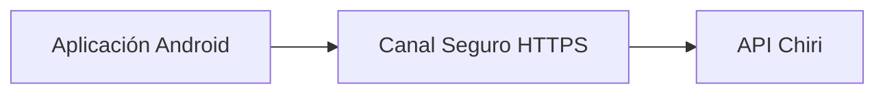

---

# 6.3 Gestión de Credenciales

La aplicación no deberá almacenar:

* contraseñas de servicios externos.
* tokens permanentes sin protección.
* claves privadas.

Ejemplo incorrecto:

```text id="6r3p8v"
Código Android

API_KEY = "clave_secreta"
```

---

Ejemplo correcto:

```text id="5k7n2m"
Android

Token temporal seguro

        |

API Chiri

        |

Servicios internos
```

---

# 6.4 Almacenamiento Local Seguro

Los datos locales deberán clasificarse:

## Datos permitidos

Ejemplos:

* preferencias visuales.
* configuración de interfaz.
* datos temporales.

---

## Datos protegidos

Ejemplos:

* tokens de sesión.
* información sensible del usuario.

Estos deberán almacenarse utilizando mecanismos seguros del sistema Android.

---

# 6.5 Gestión de Sesión

La aplicación deberá contemplar:

* inicio de sesión.
* mantenimiento de sesión.
* expiración.
* renovación.
* cierre de sesión.

La sesión deberá estar controlada por el Backend.

---

# 6.6 Manejo de Permisos

La aplicación deberá solicitar únicamente permisos necesarios.

Ejemplo:

Si Chiri incorpora voz:

Necesario:

* acceso al micrófono.

No necesario:

* acceso completo al almacenamiento.

---

# 6.7 Protección de Información

La aplicación deberá evitar exponer:

* errores técnicos internos.
* URLs privadas.
* credenciales.
* información de infraestructura.

Ejemplo:

Incorrecto:

```text id="3m7q9x"
Error:
No se pudo conectar con 192.168.1.88:8095
```

Correcto:

```text id="8q4n6m"
El servicio no está disponible actualmente
```

---

# 6.8 Seguridad de Código

El proyecto Android deberá considerar:

* evitar secretos en código fuente.
* mantener dependencias actualizadas.
* revisar permisos.
* evitar librerías innecesarias.

---

# 6.9 Preparación para Biometría

La arquitectura deberá permitir incorporar posteriormente:

* huella digital.
* reconocimiento facial.
* bloqueo local.

La autenticación principal seguirá perteneciendo al Backend.

---

# 6.10 Pérdida del Dispositivo

Si un dispositivo autorizado se pierde, Chiri deberá permitir:

* invalidar sesiones.
* retirar acceso.
* proteger información.

Estas capacidades serán coordinadas por Backend.

---

# 6.11 Principio Arquitectónico

La seguridad del cliente Android deberá cumplir:

> El dispositivo puede acceder a Chiri, pero nunca debe poseer el control completo de Chiri.


# 7. Estado, Datos Locales y Caché

La aplicación Android de Chiri Platform deberá gestionar estados internos y almacenamiento local de forma controlada.

El almacenamiento local tendrá como objetivo mejorar la experiencia del usuario, no reemplazar al Backend.

---

# 7.1 Fuente Única de Verdad

La información principal de Chiri permanecerá en el Backend.

Ejemplo:

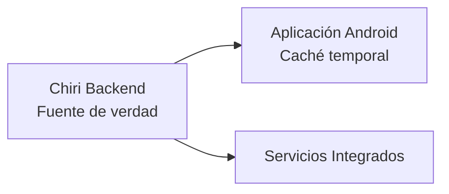

---

# 7.2 Tipos de Información Local

La información almacenada en Android se clasificará en:

---

## Configuración de Usuario

Información relacionada con la experiencia personal.

Ejemplos:

* tema visual.
* idioma.
* preferencias de interfaz.
* última pantalla utilizada.

---

## Datos Temporales

Información utilizada para mejorar rendimiento.

Ejemplos:

* últimas consultas.
* imágenes almacenadas temporalmente.
* información reciente.

---

## Datos de Sesión

Información necesaria para mantener comunicación con Chiri.

Ejemplos:

* sesión activa.
* tokens protegidos.
* estado de autenticación.

---

# 7.3 Información que NO debe almacenarse

Android no deberá almacenar como fuente principal:

* usuarios completos.
* permisos definitivos.
* dispositivos del hogar.
* biblioteca multimedia.
* configuraciones críticas.

Estos datos pertenecen a:

* Backend Chiri.
* servicios especializados.

---

# 7.4 Gestión de Estado con MVVM

Cada pantalla deberá manejar su propio estado.

Ejemplo conceptual:

```kotlin id="6n8q3p"
ScreenState

- Loading
- Success
- Empty
- Error
```

Flujo:

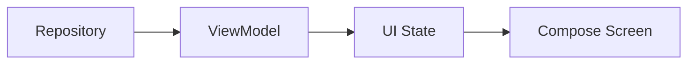

---

# 7.5 Caché

La caché deberá utilizarse para:

* mejorar velocidad.
* reducir solicitudes innecesarias.
* mejorar experiencia.

No deberá utilizarse para:

* almacenar lógica de negocio.
* duplicar servicios.
* evitar comunicación con Backend permanentemente.

---

# 7.6 Estrategia Offline

La aplicación deberá considerar escenarios sin conexión.

Ejemplos:

* mostrar información disponible localmente.
* informar pérdida de conexión.
* reintentar operaciones.

---

# 7.7 Operaciones Offline

No todas las operaciones podrán ejecutarse sin conexión.

Ejemplo:

Consulta de preferencias visuales:

Puede funcionar offline.

Ejemplo:

Encender una luz:

Requiere conexión con Backend.

---

# 7.8 Sincronización

Cuando la conexión vuelva, la aplicación podrá sincronizar información temporal.

Flujo:

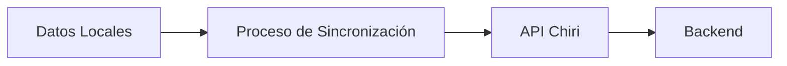

---

# 7.9 Manejo de Conflictos

Si existe información diferente entre Android y Backend:

La prioridad será:

```text
Backend Chiri
        |
        v
Estado local Android
```

El Backend será considerado la autoridad.

---

# 7.10 Limpieza de Datos

La aplicación deberá permitir:

* cerrar sesión limpiando información temporal.
* eliminar caché cuando corresponda.
* renovar datos almacenados.

---

# 7.11 Principio Arquitectónico

La aplicación Android deberá cumplir:

> La caché mejora la experiencia, pero nunca reemplaza la plataforma.

# 8. Pruebas y Calidad de la Aplicación Android

La aplicación Android de Chiri Platform deberá incorporar prácticas de calidad que permitan detectar errores antes de llegar a usuarios finales.

Las pruebas serán parte del proceso normal de desarrollo.

---

# 8.1 Principio de Calidad

El desarrollo Android deberá cumplir:

* código mantenible.
* componentes reutilizables.
* separación de responsabilidades.
* pruebas automatizadas cuando corresponda.
* revisión antes de integración.

---

# 8.2 Tipos de Pruebas

La estrategia de pruebas estará dividida en:

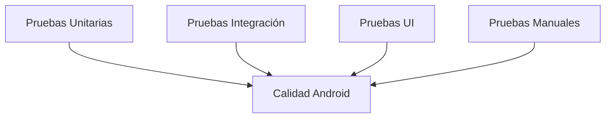

---

# 8.3 Pruebas Unitarias

## Objetivo

Validar componentes individuales sin depender de la interfaz.

Se aplicarán principalmente a:

* ViewModels.
* Use Cases.
* validaciones.
* transformaciones.
* lógica interna.

---

Ejemplo:

Validar:

```text
Usuario autenticado

+

Permiso correcto

=

Acceso permitido
```

---

# 8.4 Pruebas de ViewModel

Los ViewModels deberán poder probarse sin ejecutar pantallas completas.

Se validará:

* cambios de estado.
* manejo de errores.
* eventos del usuario.
* llamadas a casos de uso.

---

# 8.5 Pruebas de Repository

Validarán:

* comunicación con API.
* manejo de respuestas.
* errores de red.
* uso de caché.

Ejemplo:

```text
API responde correctamente

        |

Repository transforma datos

        |

ViewModel recibe información válida
```

---

# 8.6 Pruebas de Interfaz (UI)

Las pruebas UI validarán:

* carga de pantallas.
* navegación.
* interacción del usuario.
* estados visuales.

Ejemplos:

* botón visible.
* mensaje de error mostrado.
* navegación correcta.

---

# 8.7 Pruebas de Integración

Validarán comunicación entre componentes.

Ejemplos:

* App Android + API Chiri.
* Autenticación completa.
* Consulta de estado del hogar.
* Reproducción multimedia.

---

# 8.8 Pruebas Manuales

Algunas validaciones requerirán pruebas reales:

Ejemplos:

* experiencia de usuario.
* comportamiento en diferentes dispositivos.
* rendimiento.
* interacción táctil.

---

# 8.9 Calidad del Código Kotlin

El código deberá seguir:

* nombres claros.
* funciones pequeñas.
* evitar duplicación.
* arquitectura consistente.
* documentación cuando sea necesaria.

---

# 8.10 Revisión de Dependencias

Antes de incorporar librerías nuevas se deberá evaluar:

* mantenimiento activo.
* seguridad.
* compatibilidad.
* necesidad real.

No se agregarán dependencias por comodidad temporal.

---

# 8.11 Compatibilidad de Dispositivos

La aplicación deberá considerar:

* diferentes tamaños de pantalla.
* versiones Android soportadas.
* rendimiento del dispositivo.
* consumo de batería.

---

# 8.12 Validación Antes de Publicación

Antes de distribuir una versión deberán verificarse:

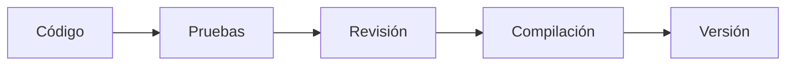

---

# 8.13 Principio Arquitectónico

Una versión de Chiri Android estará lista cuando:

> Funciona correctamente, mantiene la arquitectura definida y no compromete la estabilidad de la plataforma.

# 9. Despliegue y Distribución de la Aplicación Android

La aplicación Android de Chiri Platform deberá contar con un proceso definido para construcción, validación y distribución de versiones.

El objetivo será mantener control sobre las versiones instaladas y permitir evolución futura.

---

# 9.1 Ambientes de Ejecución

La aplicación deberá considerar diferentes ambientes:

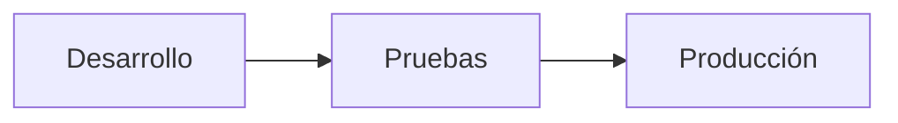

---

# 9.2 Ambiente Desarrollo

Utilizado durante la programación.

Características:

* conexión a servicios de prueba cuando corresponda.
* logs detallados.
* herramientas de depuración.
* cambios frecuentes.

---

# 9.3 Ambiente Producción

Utilizado por usuarios reales.

Características:

* conexión al Backend oficial.
* menor exposición de información técnica.
* configuraciones seguras.
* versión estable.

---

# 9.4 Configuración por Ambiente

La aplicación deberá separar:

* código.
* configuración.
* credenciales.

Ejemplo conceptual:

```text id="7k3m9q"
Android

├── Config Desarrollo

├── Config Pruebas

└── Config Producción
```

---

# 9.5 Versionado de la Aplicación

Cada versión deberá estar identificada.

Ejemplo:

```text id="2p8m5x"
Chiri Android

Versión:
1.0.0

Código:
100
```

El versionado permitirá:

* identificar cambios.
* controlar actualizaciones.
* resolver problemas.

---

# 9.6 Firma de la Aplicación

Las versiones oficiales deberán estar firmadas.

La firma permitirá:

* validar autenticidad.
* controlar actualizaciones.
* evitar aplicaciones modificadas.

---

# 9.7 Generación del Paquete

La aplicación podrá generar:

* APK para pruebas internas.
* AAB para distribución oficial.

La estrategia final de distribución será definida según el uso de Chiri.

---

# 9.8 Distribución Inicial

Durante las primeras etapas del proyecto podrá utilizarse:

* instalación directa.
* distribución privada.
* pruebas internas.

No será necesario definir una tienda pública en la primera versión.

---

# 9.9 Actualizaciones

Las actualizaciones deberán considerar:

* compatibilidad con Backend.
* migraciones necesarias.
* cambios visuales.
* nuevas capacidades.

---

# 9.10 Compatibilidad Backend / Android

Las versiones deberán mantener compatibilidad.

Ejemplo:

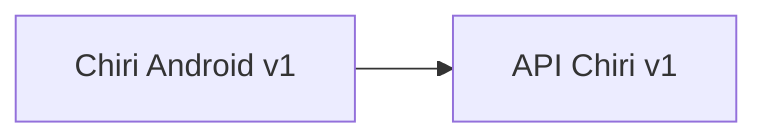

Los cambios importantes deberán planificarse.

---

# 9.11 Recuperación de Versiones

El proyecto deberá conservar:

* código fuente.
* versiones compiladas importantes.
* historial de cambios.

Esto permitirá volver a versiones anteriores si fuera necesario.

---

# 9.12 Principio Arquitectónico

El proceso de distribución deberá responder:

> ¿Podemos saber qué versión está instalada, cómo fue creada y cómo actualizarla de forma segura?

Si la respuesta es no, el proceso necesita mejorar.

# 10. Evolución y Mantenimiento de Android

La aplicación Android de Chiri Platform deberá estar preparada para evolucionar junto con la plataforma, incorporando nuevas capacidades sin comprometer la arquitectura inicial.

Los cambios deberán respetar los principios definidos en este documento.

---

# 10.1 Principio de Evolución

Toda nueva capacidad deberá seguir el flujo:

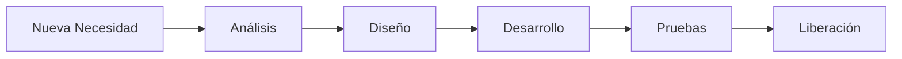

---

# 10.2 Incorporación de Nuevas Funcionalidades

Antes de agregar una funcionalidad deberá evaluarse:

* objetivo dentro de Chiri.
* impacto en arquitectura.
* necesidad real.
* dependencia con Backend.

No se agregarán funciones solamente por tendencia tecnológica.

---

# 10.3 Nuevos Módulos Android

Un nuevo módulo deberá crearse cuando:

* tenga una responsabilidad propia.
* pueda evolucionar independientemente.
* tenga lógica claramente definida.

Ejemplo futuro:

```text id="4x7m9p"
com.chirihome

├── home/

├── media/

├── ai/

├── personal/

└── finance/
```

---

# 10.4 Evitar Crecimiento Desordenado

La aplicación deberá evitar:

* pantallas con demasiada lógica.
* ViewModels gigantes.
* clases con múltiples responsabilidades.
* duplicación de código.

---

# 10.5 Refactorización

La mejora del código será parte del mantenimiento normal.

Objetivos:

* simplificar.
* mejorar rendimiento.
* eliminar código innecesario.
* mantener claridad.

La refactorización deberá conservar comportamiento esperado.

---

# 10.6 Actualización de Dependencias

Las dependencias Android deberán revisarse periódicamente.

Se evaluará:

* seguridad.
* compatibilidad.
* estabilidad.
* beneficio real.

No se actualizará por moda tecnológica.

---

# 10.7 Compatibilidad a Largo Plazo

La aplicación deberá considerar:

* nuevas versiones de Android.
* nuevos dispositivos.
* nuevos tamaños de pantalla.
* cambios en API Chiri.

---

# 10.8 Documentación Continua

Los cambios importantes deberán actualizar:

* documentación técnica.
* diagramas.
* decisiones arquitectónicas.

La documentación será parte del desarrollo.

---

# 10.9 Cambios Arquitectónicos

Si un cambio afecta:

* estructura MVVM.
* comunicación con Backend.
* modelo de seguridad.
* organización principal.

deberá registrarse mediante ADR.

---

# 10.10 Principio de Mantenimiento

La evolución deberá priorizar:

* estabilidad.
* simplicidad.
* mantenibilidad.
* experiencia del usuario.

Antes que:

* complejidad.
* exceso de funcionalidades.
* tecnologías innecesarias.

---

# 10.11 Regla Final Android

Toda modificación futura deberá cumplir:

> La aplicación debe crecer agregando capacidades, no acumulando complejidad.

# 11. Conclusión de la Aplicación Android

La aplicación Android de Chiri Platform v1.0 queda definida como un cliente seguro y orientado a capacidades de la plataforma.

Su responsabilidad principal será proporcionar una experiencia de usuario unificada, consumiendo las capacidades expuestas por Chiri Backend mediante una comunicación controlada.

---

# 11.1 Arquitectura Definida

La aplicación Android utilizará:

* Kotlin como lenguaje principal.
* Jetpack Compose para interfaz.
* Arquitectura MVVM.
* Repository Pattern.
* Separación por capas.
* Comunicación exclusiva mediante API Chiri.

---

# 11.2 Responsabilidad del Cliente Android

La aplicación será responsable de:

* interacción con el usuario.
* presentación de información.
* navegación.
* gestión de estados visuales.
* comunicación con Backend.
* almacenamiento local temporal.

---

# 11.3 Límites Confirmados

La aplicación Android no será responsable de:

* lógica principal de la plataforma.
* control directo de servicios internos.
* almacenamiento de datos críticos.
* administración de infraestructura.

Los servicios como:

* Home Assistant.
* Music Assistant.
* Navidrome.
* Jellyfin.

permanecerán administrados por Chiri Backend mediante integraciones.

---

# 11.4 Principios Confirmados

El desarrollo Android seguirá:

* Arquitectura antes que código.
* Separación de responsabilidades.
* Seguridad por defecto.
* Estado controlado.
* Código mantenible.
* Componentes reutilizables.
* Evolución planificada.

---

# 11.5 Relación con la Plataforma

La arquitectura final queda:

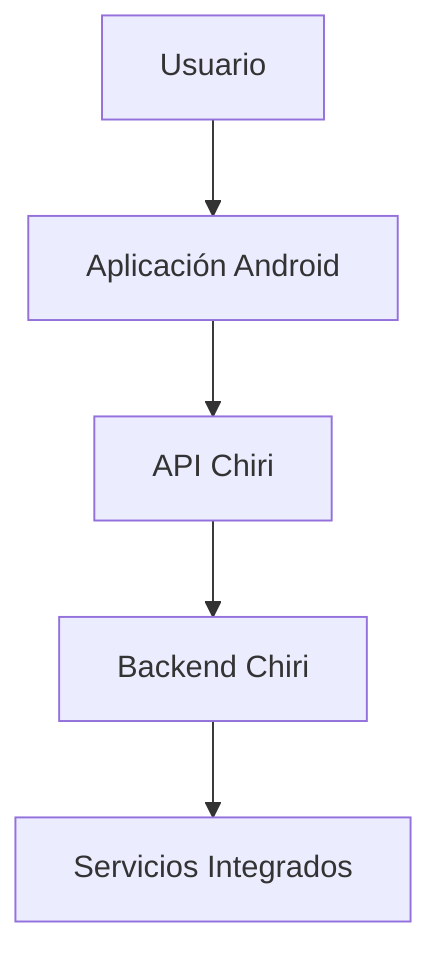

---

# 11.6 Estado del Documento

El documento:

```text
040_Android.md
```

queda definido como la referencia oficial para el desarrollo de la aplicación Android Chiri Platform v1.0.

Cualquier implementación futura deberá respetar:

* arquitectura MVVM.
* comunicación mediante API.
* separación de responsabilidades.
* reglas de seguridad.
* estrategia de evolución.

---

# Declaración Final

La aplicación Android de Chiri Platform v1.0 está preparada para pasar de la fase de diseño a la fase de implementación cuando corresponda.

La arquitectura definida permite construir un cliente moderno, seguro y escalable, manteniendo la filosofía principal del proyecto:

> Chiri es una plataforma; Android es solamente una ventana de acceso a sus capacidades.
