# Chiri Platform

**Documento:** 050_BaseDatos.md

**Versión:** 1.0

**Estado:** Cerrado

---

# 1. Introducción

La base de datos de Chiri Platform será el sistema encargado de almacenar la información propia de la plataforma.

Su diseño deberá permitir:

* crecimiento modular.
* integridad de información.
* seguridad.
* mantenimiento sencillo.
* evolución controlada.

---

# 1.1 Objetivo de la Base de Datos

PostgreSQL será utilizado para almacenar información que pertenece al dominio de Chiri.

Actualmente implementado:

* usuarios.
* sesiones.
* refresh tokens.

Para v1.0 se incorporarán las entidades necesarias para autorización y consulta de funcionalidades:

* roles.
* permisos.
* asignación de roles a usuarios.
* asignación de permisos a roles.
* módulos.
* funcionalidades.

En futuras etapas se incorporarán otras entidades propias del dominio, como:

* configuraciones propias.
* preferencias.
* historial.
* información de integración.

---

# 1.2 Responsabilidad

La base de datos será responsable de:

* persistir información propia de Chiri.
* mantener relaciones entre entidades.
* garantizar integridad de datos.
* soportar consultas del Backend.

---

# 1.3 Lo que NO almacenará Chiri

La base de datos de Chiri no será responsable de almacenar información que pertenece a otros servicios.

Ejemplos:

No almacenará:

* archivos multimedia.
* biblioteca musical completa.
* videos.
* estados internos de Home Assistant.
* datos internos de Jellyfin.

Estos servicios mantienen sus propios datos.

---

# 1.4 Relación dentro de la Arquitectura

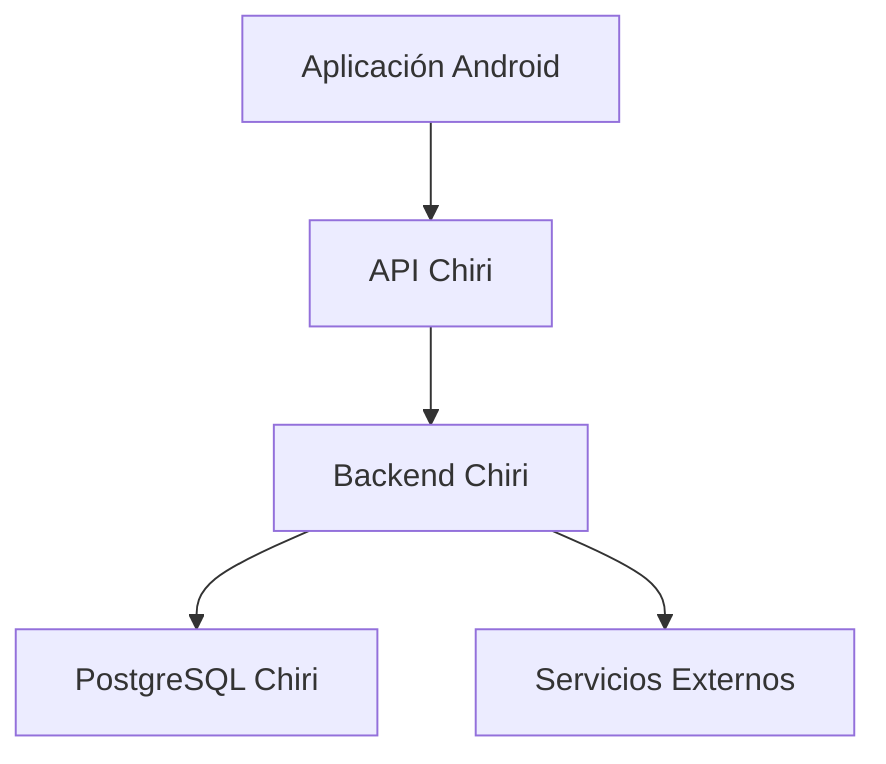

---

# 1.5 Principio de Fuente de Verdad

Cada dato deberá tener un único propietario.

Ejemplo:

Usuario:

```text
PostgreSQL Chiri
        |
        v
Fuente oficial
```

Música:

```text
Navidrome / Music Assistant
        |
        v
Fuente oficial
```

Domótica:

```text
Home Assistant
        |
        v
Fuente oficial
```

---

# 1.6 Tecnología Definida

La base de datos utilizará:

## Motor

* PostgreSQL.

## Acceso

* Backend FastAPI.

## Migraciones

* Alembic.

## Ejecución

* Docker.

---

# 1.7 Principios de Diseño

La base de datos seguirá:

* diseño relacional.
* integridad referencial.
* nombres consistentes.
* normalización cuando corresponda.
* migraciones controladas.
* respaldo periódico.

---

# 1.8 Seguridad

La base de datos deberá considerar:

* usuarios con permisos mínimos.
* acceso únicamente desde Backend.
* protección de credenciales.
* copias de seguridad.

---

# 1.9 Principio Arquitectónico

La base de datos deberá responder:

> ¿Esta información pertenece realmente a Chiri?

Si la respuesta es no, deberá permanecer en el servicio especializado correspondiente.

# 2. Arquitectura del Modelo de Datos

La base de datos de Chiri Platform estará organizada mediante un modelo relacional basado en PostgreSQL.

El diseño deberá permitir crecimiento modular, evitando mezclar información de diferentes dominios.

---

# 2.1 Principio de Organización

Los datos deberán organizarse por responsabilidad funcional.

Cada dominio de Chiri tendrá sus propias entidades relacionadas.

La organización inicial implementada comprende los dominios de:

* Usuarios.
* Seguridad.
* Autorización.
* Plataforma.

Otros dominios, como Configuración, Integraciones e Historial,
corresponden a futuras etapas y todavía no están implementados.

Ejemplo conceptual de la organización prevista:

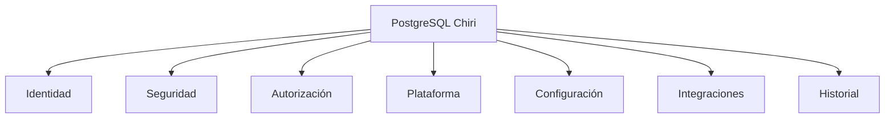

---

# 2.2 Separación por Esquemas

PostgreSQL permitirá organizar información mediante esquemas.

La estructura inicial será:

```text
PostgreSQL Chiri

├── identity
│   └── user
│
├── security
│   ├── session
│   └── refresh_token
│
├── authorization
│   ├── role
│   ├── permission
│   ├── user_role
│   └── role_permission
│
└── platform
    ├── module
    └── functionality
```

Los esquemas configuration, integration y audit
pertenecen a etapas futuras y todavía no están implementados.

---

# 2.3 Dominio Identity

Responsabilidad:

Gestionar la identidad dentro de Chiri.

Actualmente implementado:

* user

Futuro:

* perfiles.
* preferencias básicas.

No almacenará:

* información externa de autenticación que pertenezca a otros servicios.

---

# 2.4 Dominio Security

Responsabilidad:

Gestionar elementos relacionados con seguridad de sesión.

Actualmente implementado:

* sesiones.
* refresh tokens.

La autorización de usuarios se gestionará mediante el dominio Authorization.

---

# 2.5 Dominio Authorization

Responsabilidad:

Gestionar roles y permisos que determinan las capacidades de los usuarios dentro de Chiri.

Entidades:

* role.
* permission.
* user_role.
* role_permission.

Relaciones principales:

```text
user
  │
  ▼
user_role
  │
  ▼
role
  │
  ▼
role_permission
  │
  ▼
permission
```

El dominio Authorization será utilizado por el Backend para determinar si un usuario puede acceder a una funcionalidad.

---

# 2.6 Dominio Platform

**Estado: v1.0 — catálogo funcional.**

Responsabilidad:

Representar la organización funcional de Chiri.

Entidades:

* module.
* functionality.

Relación principal:

```text
module
   │
   ▼
functionality
```

Un módulo representa un área funcional de la plataforma.

Una funcionalidad representa una capacidad concreta perteneciente a un módulo.

El catálogo funcional permitirá al Backend determinar qué funcionalidades están disponibles para un usuario según sus permisos.

---

# 2.7 Dominio Configuration

**Estado: Futuro — no implementado actualmente.**

Responsabilidad:

Almacenar configuraciones propias de la plataforma.

Ejemplos:

* parámetros generales.
* preferencias del sistema.
* configuraciones de usuario.

---

# 2.8 Dominio Integration

**Estado: Futuro — no implementado actualmente.**

Responsabilidad:

Gestionar información necesaria para conectar servicios externos.

Ejemplos:

* identificadores externos.
* estado de integración.
* configuración de conexión.

No almacenará:

* la base completa del servicio externo.

---

# 2.9 Dominio Audit

**Estado: Futuro — no implementado actualmente.**

Responsabilidad:

Registrar eventos importantes de la plataforma.

Ejemplos:

* acciones del usuario.
* cambios relevantes.
* eventos de seguridad.

---

# 2.10 Modelo Relacional

Las relaciones deberán definirse mediante:

* claves primarias.
* claves foráneas.
* restricciones.
* índices cuando sean necesarios.

Relaciones principales:

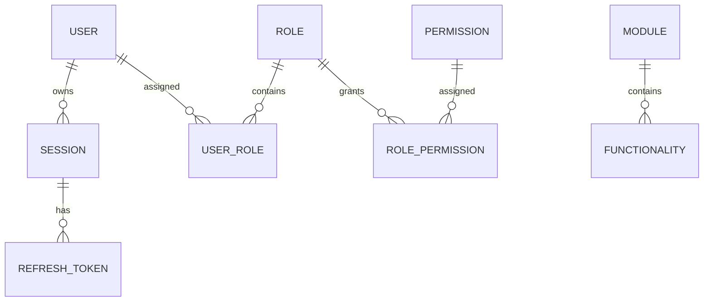

Las entidades de auditoría, configuración y otras relaciones
mostradas como futuras aún no están implementadas.

---

# 2.11 Normalización

El diseño deberá buscar equilibrio entre:

* evitar duplicación.
* mantener consultas eficientes.
* simplificar mantenimiento.

No se aplicará normalización extrema si perjudica la simplicidad.

---

# 2.12 Identificadores

Las entidades deberán utilizar identificadores consistentes.

Principios:

* únicos.
* estables.
* independientes de sistemas externos.

Ejemplo:

Correcto:

```text
chiri_user_id
```

Incorrecto:

```text
homeassistant_entity_id
```

como identificador principal.

---

# 2.13 Fechas y Auditoría

Las entidades importantes deberán considerar:

* fecha de creación.
* fecha de actualización.
* usuario responsable cuando corresponda.

Ejemplo conceptual:

```text
created_at
updated_at
created_by
```

---

# 2.14 Principio Arquitectónico

El modelo de datos deberá cumplir:

> Chiri almacena el conocimiento propio de la plataforma y referencia las capacidades de otros servicios sin apropiarse de ellas.

# 3. Convenciones de Diseño de Base de Datos

La base de datos PostgreSQL de Chiri Platform deberá seguir convenciones uniformes para facilitar:

* lectura del modelo.
* mantenimiento.
* evolución.
* integración con Backend.

---

# 3.1 Convención General de Nombres

Se utilizará:

* nombres descriptivos.
* formato snake_case.
* nombres en inglés para objetos técnicos.

Ejemplos:

Correcto:

```sql
user_account

created_at

integration_status
```

Incorrecto:

```sql
tablaUsuario

fechaCreacion

EstadoConexion
```

---

# 3.2 Convención de Tablas

Las tablas deberán:

* representar entidades.
* utilizar nombres en singular.
* ser descriptivas.

Ejemplos:

Correcto:

```text
user

role

permission

module

functionality

device

integration
```

Evitar:

```text
tbl_users

data_user

tmp_information
```

---

# 3.3 Convención de Columnas

Las columnas deberán utilizar:

```text
snake_case
```

Ejemplos:

```text
first_name

last_name

created_at

updated_at
```

---

# 3.4 Claves Primarias

Todas las entidades principales deberán tener una clave primaria.

Ejemplo:

```sql
id
```

Características:

* única.
* estable.
* generada por la aplicación.

La clave primaria no deberá depender de identificadores externos.

---

# 3.5 Claves Externas

Las relaciones deberán utilizar claves foráneas.

Ejemplo:

```sql
user_id

role_id

permission_id

module_id

functionality_id

integration_id

device_id
```

Esto permitirá:

* integridad referencial.
* relaciones claras.
* consultas consistentes.

Las claves foráneas deberán utilizarse para representar las relaciones entre entidades propias de Chiri.

Ejemplos:

```text
user_role.user_id
user_role.role_id

role_permission.role_id
role_permission.permission_id

functionality.module_id
```

---

# 3.6 Tipos de Datos

Se deberán utilizar tipos adecuados de PostgreSQL.

Ejemplos:

Texto:

```sql
varchar

text
```

Fechas:

```sql
timestamp with time zone
```

Estados:

```sql
text
```

Los estados deberán validarse mediante restricciones `CHECK`.

Ejemplo:

```sql
status IN ('ACTIVE', 'INACTIVE', 'DELETED')
```

Identificadores:

```sql
uuid
```

cuando corresponda.

---

# 3.7 Manejo de Fechas

Las entidades importantes deberán registrar tiempo.

Convención:

```sql
created_at

updated_at
```

Utilizando:

```text
UTC como referencia interna
```

La presentación en usuario será responsabilidad de la aplicación.

---

# 3.8 Campos de Estado

Los estados deberán ser claros.

Ejemplo:

Correcto:

```text
status = ACTIVE
```

Evitar:

```text
estado = 1
```

sin documentación.

---

# 3.9 Campos Eliminación Lógica

Cuando sea necesario conservar historial podrá utilizarse eliminación lógica.

Ejemplo:

```sql
deleted_at
```

No se aplicará automáticamente a todas las tablas.

Se evaluará según necesidad.

---

# 3.10 Índices

Los índices deberán crearse cuando exista una necesidad real.

Criterios:

* consultas frecuentes.
* relaciones importantes.
* búsquedas habituales.

No se crearán índices innecesarios.

---

# 3.11 Restricciones

La base de datos deberá proteger la integridad mediante:

* NOT NULL.
* UNIQUE.
* FOREIGN KEY.
* CHECK.

Ejemplo:

```sql
email TEXT UNIQUE NOT NULL
```

Las restricciones `CHECK` se utilizarán para validar valores permitidos,

como los estados de las entidades.

---

# 3.12 Comentarios de Base de Datos

Cuando una entidad tenga reglas complejas deberá documentarse.

Ejemplo:

```sql
COMMENT ON TABLE user_account

IS 'Usuarios registrados en Chiri Platform';
```

---

# 3.13 Migraciones

Los cambios de estructura deberán realizarse mediante migraciones, con Alembic.

No se modificarán tablas manualmente en producción.

Flujo:

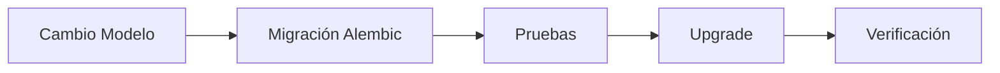

# 3.14 Principio Arquitectónico

El diseño de base de datos deberá cumplir:

> Una persona nueva en el proyecto debe poder entender la estructura leyendo los nombres y relaciones.

# 4. Entidades Principales de Chiri

Las entidades se dividen entre las actualmente implementadas,
las incorporadas al modelo de v1.0 y las previstas para futuras etapas.

## Entidades actualmente implementadas

* User
* Session
* RefreshToken

## Entidades incorporadas al modelo v1.0

* Role
* Permission
* UserRole
* RolePermission
* Module
* Functionality

## Entidades futuras

* Profile
* Configuration
* Integration
* Logical Device
* Audit

La base de datos de Chiri Platform deberá representar únicamente conceptos propios de la plataforma.

Las entidades iniciales estarán diseñadas para soportar:

* identidad de usuarios.
* seguridad.
* autorización.
* organización funcional de la plataforma.

Las siguientes capacidades corresponden a futuras etapas:

* configuración.
* integraciones.
* auditoría.
* perfiles.

El modelo podrá evolucionar cuando aparezcan nuevos módulos, respetando la arquitectura definida.

---

# 4.1 Entidad Usuario

La entidad Usuario representa una persona registrada dentro de Chiri.

Responsabilidades actualmente implementadas:

* identificar usuarios.

Responsabilidades previstas:

* relacionar preferencias.
* asociar roles.
* registrar actividad.

Modelo actual:

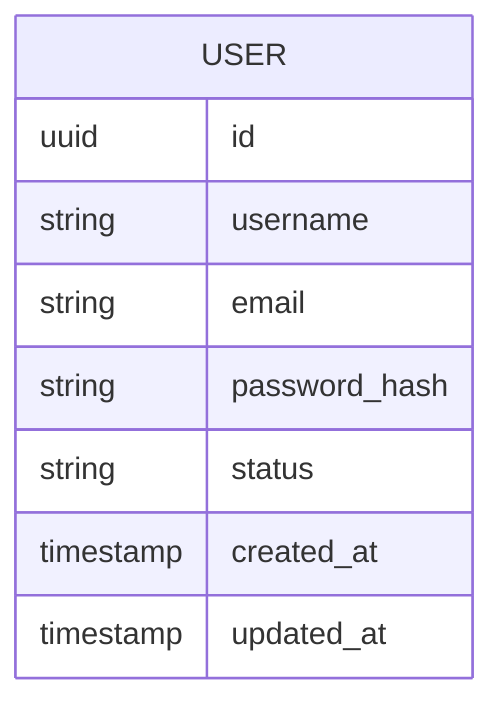

---

# 4.2 Entidad Perfil

El perfil representa información adicional asociada al usuario.

**Estado: Futuro — no implementado actualmente.**

Separar Usuario y Perfil permite:

* mantener identidad separada de información personal.
* ampliar información futura.
* evitar tablas demasiado grandes.

Ejemplos:

* nombre visible.
* imagen.
* preferencias generales.

Relación:

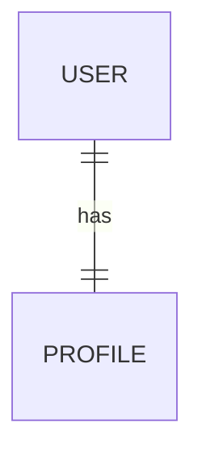

---

# 4.3 Entidad Rol

Los roles representan conjuntos de capacidades dentro de Chiri.

Un rol no representa una persona.

Representa un nivel de acceso.

Roles iniciales:

* ADMIN.
* USER.
* GUEST.

La asignación de roles a usuarios se realizará mediante la entidad `UserRole`.

---

# 4.4 Entidad Permiso

Los permisos representan acciones específicas que pueden ejecutarse dentro de Chiri.

Ejemplos conceptuales:

* administrar usuarios.
* controlar dispositivos.
* modificar configuraciones.

Los permisos serán asignados a roles mediante la entidad `RolePermission`.

---

# 4.5 Entidad UserRole

La entidad `UserRole` representa la asignación de uno o más roles a un usuario.

Relación conceptual:

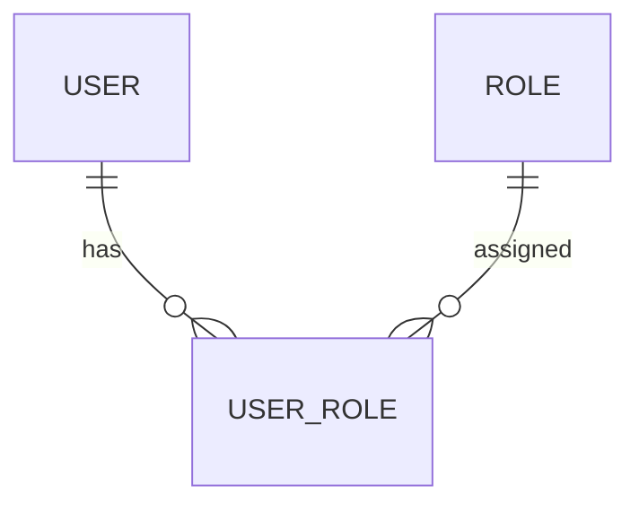

Esta entidad permite mantener separadas la identidad del usuario y la definición de sus roles.

---

# 4.6 Entidad RolePermission

La entidad `RolePermission` representa la asignación de permisos a roles.

Relación conceptual:

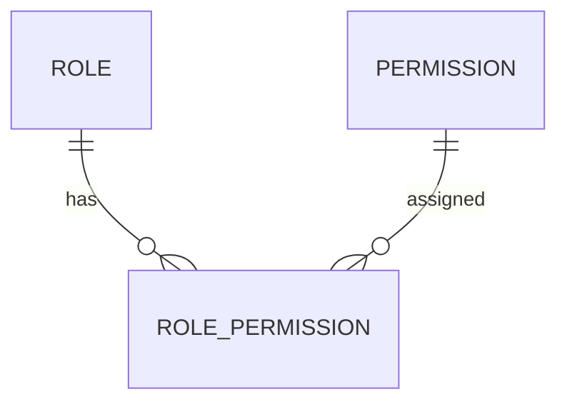

Esta entidad permite determinar qué capacidades están asociadas a cada rol.

---

# 4.7 Entidad Módulo

El módulo representa un área funcional principal de Chiri.

Ejemplos:

* Hogar.
* Multimedia.
* Inteligencia Artificial.
* Personal.
* Configuración.

Un módulo puede contener múltiples funcionalidades.

Relación conceptual:

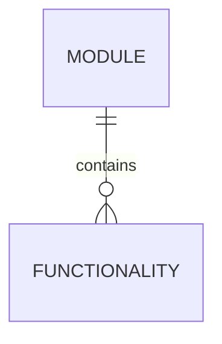

---

# 4.8 Entidad Funcionalidad

La funcionalidad representa una capacidad concreta perteneciente a un módulo.

Ejemplos conceptuales:

* consultar dispositivos.
* reproducir contenido.
* utilizar una capacidad de inteligencia artificial.
* consultar servicios personales.

Una funcionalidad pertenece a un módulo.

La relación entre funcionalidades y permisos se definirá de acuerdo con las necesidades de autorización de la plataforma.

---

# 4.9 Entidad Configuración

**Estado: Futuro — no implementado actualmente.**

Representa configuraciones propias de Chiri.

Puede incluir:

* configuración global.
* configuración por usuario.
* preferencias de funcionamiento.

No almacenará configuraciones internas de servicios externos.

---

# 4.10 Entidad Integración

**Estado: Futuro — no implementado actualmente.**

Representa la conexión entre Chiri y servicios externos.

Ejemplos:

* Home Assistant.
* Music Assistant.
* Jellyfin.

Su responsabilidad será almacenar información necesaria para integración.

No almacenará los datos completos del servicio.

---

# 4.11 Entidad Dispositivo Lógico

**Estado: Futuro — no implementado actualmente.**

Chiri podrá manejar referencias a dispositivos o recursos externos.

Ejemplo:

```text
Chiri

    |

Dispositivo lógico

    |

Home Assistant Entity
```

La entidad de Chiri no reemplazará al dispositivo real.

---

# 4.12 Entidad Auditoría

**Estado: Futuro — no implementado actualmente.**

La auditoría registrará eventos importantes.

Ejemplos:

* inicio de sesión.
* cambio de configuración.
* acciones administrativas.

Modelo conceptual:

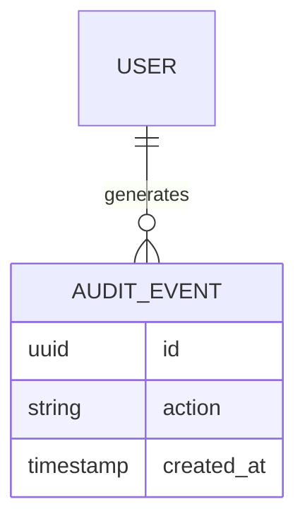

---

# 4.13 Entidad Sesión

La sesión representa una sesión autenticada de un usuario.

Campos actuales:

* id
* user_id
* created_at
* expires_at
* status

Estados permitidos:

* ACTIVE
* REVOKED
* EXPIRED

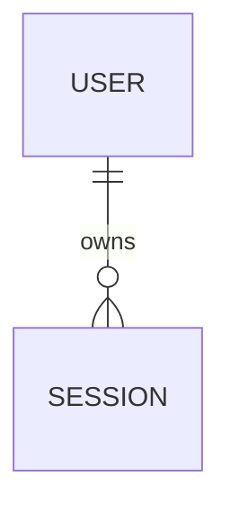

---

# 4.14 Entidad Refresh Token

El refresh token pertenece a una sesión.

Campos actuales:

* id
* session_id
* token_hash
* created_at
* expires_at
* status

Estados permitidos:

* ACTIVE
* REVOKED
* EXPIRED

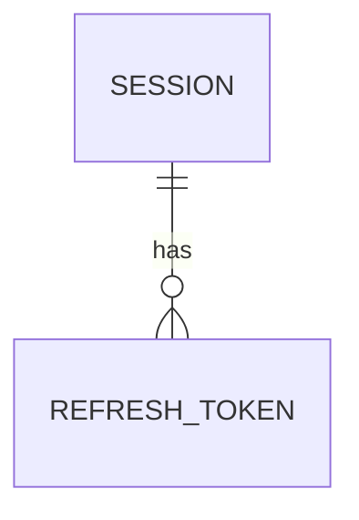

El valor original del refresh token no se almacena.

La base de datos almacena únicamente su hash.

---

# 4.15 Relación General del Dominio

Modelo conceptual de las entidades actuales y de v1.0:


Las entidades de configuración, integración, dispositivo lógico,
auditoría y perfil corresponden a futuras etapas.

---

# 4.16 Entidades Futuras

La arquitectura permitirá agregar posteriormente entidades como:

* automatizaciones propias.
* asistentes IA.
* rutinas personales.
* historial multimedia.
* preferencias avanzadas.

Estas entidades serán creadas solamente cuando exista una necesidad real.

---

# 4.17 Regla de Diseño

Una entidad nueva deberá responder:

> ¿Este concepto pertenece al dominio de Chiri o pertenece a un servicio externo?

Si pertenece a un servicio externo, Chiri deberá integrarlo, no replicarlo.

---

# 4.18 Principio Arquitectónico

El modelo de datos de Chiri deberá representar:

> El conocimiento y estado propio de la plataforma, manteniendo separados los dominios de los sistemas integrados.

# 5. Diseño Físico de Base de Datos

El diseño físico define la organización real de PostgreSQL para Chiri Platform.

Su objetivo es establecer:

* esquemas.
* tablas.
* relaciones.
* restricciones.
* estructura inicial.

El diseño físico distingue entre entidades actualmente implementadas,
entidades incorporadas al modelo v1.0 y entidades previstas para futuras etapas.

---

# 5.1 Organización Física Inicial

La base de datos utilizará esquemas PostgreSQL para separar responsabilidades.

Estructura física actual y prevista:

```text id="j4t8kp"
PostgreSQL

└── chiri

    ├── identity
    │
    ├── security
    │
    ├── configuration
    │
    ├── integration
    │
    └── audit
```

Los esquemas `configuration`, `integration` y `audit` corresponden a futuras etapas y todavía no contienen las entidades definidas en este documento.

---

# 5.2 Esquema Identity

Responsabilidad:

Gestionar la identidad de usuarios dentro de Chiri.

Estructura actual:

```text id="q6m2vx"
identity

└── user
```

Estructura futura:

```text id="r8k4zp"
identity

└── profile
```

`profile` será incorporado únicamente cuando exista una necesidad funcional real.

---

# 5.3 Tabla User

Responsabilidad:

Representar usuarios registrados dentro de Chiri.

Estructura actual:

```text id="w3n7mc"
user

id
username
email
password_hash
status
created_at
updated_at
```

Reglas:

* `id` identifica de forma única al usuario.
* `username` identifica el nombre de usuario.
* `email` identifica el correo asociado.
* `password_hash` almacena únicamente el hash de la contraseña.
* `status` representa el estado del usuario.
* `created_at` registra la creación.
* `updated_at` registra la última modificación cuando corresponda.
* `email` deberá ser único.

---

# 5.4 Tabla Profile

**Estado: Futuro — no implementado actualmente.**

Responsabilidad:

Almacenar información complementaria del usuario.

Estructura conceptual:

```text id="a5q9ns"
profile

id
user_id
display_name
avatar
created_at
updated_at
```

Relación:


La estructura será implementada mediante una migración cuando esta funcionalidad sea necesaria.

---

# 5.5 Esquema Security

Responsabilidad:

Gestionar sesiones, tokens y autorización dentro de Chiri.

Estructura actual:

```text id="n2x8qd"
security

├── session
└── refresh_token
```

Estructura incorporada al modelo v1.0:

```text id="p6m4zr"
security

├── session
├── refresh_token
├── role
├── permission
├── user_role
└── role_permission
```

---

# 5.6 Tabla Session

Responsabilidad:

Representar una sesión autenticada de un usuario.

Estructura actual:

```text id="f8k3tw"
session

id
user_id
created_at
expires_at
status
```

Estados permitidos:

```text id="y5c9mr"
ACTIVE
REVOKED
EXPIRED
```

Relación:


---

# 5.7 Tabla Refresh Token

Responsabilidad:

Representar los refresh tokens asociados a una sesión.

Estructura actual:

```text id="h4p8zk"
refresh_token

id
session_id
token_hash
created_at
expires_at
status
```

Estados permitidos:

```text id="m7q2vc"
ACTIVE
REVOKED
EXPIRED
```

Relación:


El valor original del refresh token no se almacena.

La base de datos almacena únicamente su hash.

---

# 5.8 Tabla Role

Responsabilidad:

Representar niveles de acceso dentro de Chiri.

Ejemplos conceptuales:

```text id="x6m3pt"
ADMIN
USER
GUEST
```

La estructura física definitiva será establecida mediante la migración correspondiente.

---

# 5.9 Tabla Permission

Responsabilidad:

Representar acciones específicas que pueden ejecutarse dentro de Chiri.

Ejemplos conceptuales:

```text id="k8q4vz"
MANAGE_USERS
CONTROL_DEVICES
MANAGE_CONFIGURATION
```

La estructura física definitiva será establecida mediante la migración correspondiente.

---

# 5.10 Tabla User Role

Responsabilidad:

Representar la asignación de roles a usuarios.

Relación:


Esta tabla representa la relación entre `user` y `role`.

---

# 5.11 Tabla Role Permission

Responsabilidad:

Representar la asignación de permisos a roles.

Relación:


Esta tabla representa la relación entre `role` y `permission`.

---

# 5.12 Tabla Module

Responsabilidad:

Representar un área funcional de Chiri.

Ejemplos conceptuales:

```text id="q7m4xn"
HOME
MEDIA
AI
PERSONAL
SETTINGS
```

Un módulo puede contener múltiples funcionalidades.

---

# 5.13 Tabla Functionality

Responsabilidad:

Representar una capacidad concreta perteneciente a un módulo.

Relación:


La relación entre `functionality` y `permission` no se establece todavía como relación física.

Será definida cuando se determine el modelo definitivo de autorización funcional.

---

# 5.14 Esquema Configuration

**Estado: Futuro — no implementado actualmente.**

Responsabilidad:

Gestionar configuraciones propias de Chiri.

Estructura prevista:

```text id="t4p8mc"
configuration

├── system_setting
└── user_setting
```

Estas tablas serán implementadas cuando exista una necesidad funcional concreta.

---

# 5.15 Esquema Integration

**Estado: Futuro — no implementado actualmente.**

Responsabilidad:

Gestionar información necesaria para conectar servicios externos.

Estructura prevista:

```text id="v8q3mz"
integration

├── service
└── connection
```

Chiri almacenará únicamente la información necesaria para administrar la integración.

No almacenará los datos completos de los servicios externos.

---

# 5.16 Esquema Audit

**Estado: Futuro — no implementado actualmente.**

Responsabilidad:

Registrar eventos importantes de la plataforma.

Estructura prevista:

```text id="b5n9rx"
audit

└── event
```

Ejemplos futuros:

```text id="c7m2kp"
user_login
configuration_change
permission_change
```

---

# 5.17 Modelo General de Seguridad y Autorización

El modelo físico previsto para seguridad y autorización será:

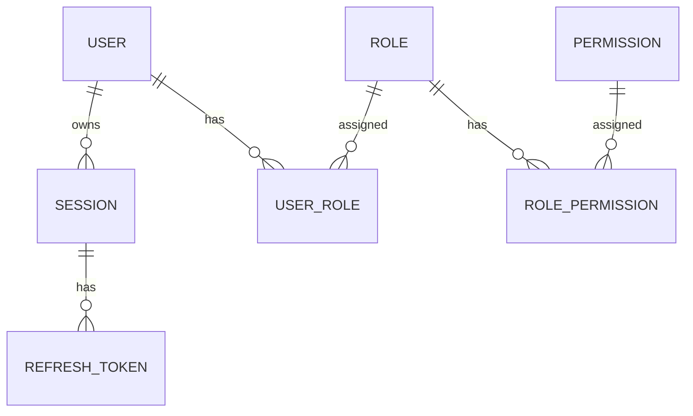

---

# 5.18 Modelo Funcional

La organización funcional será:

```mermaid id="m7q3vc"
erDiagram

    MODULE ||--o{ FUNCTIONALITY : contains
```

Los módulos agrupan funcionalidades.

Las funcionalidades representan capacidades concretas de la plataforma.

La relación entre autorización y funcionalidad será definida posteriormente.

---

# 5.19 Modelo General Inicial

Las entidades actualmente implementadas y las incorporadas al modelo v1.0 quedan organizadas conceptualmente de la siguiente manera:

```mermaid id="x9m4kt"
flowchart TB

    PostgreSQL["PostgreSQL Chiri"]

    Identity["identity"]
    Security["security"]

    User["user"]

    Session["session"]
    RefreshToken["refresh_token"]

    Role["role"]
    Permission["permission"]

    UserRole["user_role"]
    RolePermission["role_permission"]

    Module["module"]
    Functionality["functionality"]

    PostgreSQL --> Identity
    PostgreSQL --> Security

    Identity --> User

    Security --> Session
    Security --> RefreshToken
    Security --> Role
    Security --> Permission
    Security --> UserRole
    Security --> RolePermission

    PostgreSQL --> Module
    Module --> Functionality
```

Las entidades `profile`, `configuration`, `integration` y `audit`
pertenecen a futuras etapas.

---

# 5.20 Regla de Evolución

Las tablas iniciales no deberán crecer indefinidamente.

Cuando un módulo tenga suficiente complejidad deberá obtener su propio dominio.

Ejemplo:

```text id="p6v2mx"
media

automation

ai

assistant
```

podrán incorporarse posteriormente.

La creación de nuevas tablas deberá realizarse únicamente cuando exista una necesidad funcional y arquitectónica definida.

---

# 5.21 Migraciones

Todo cambio físico en la estructura de PostgreSQL deberá realizarse mediante migraciones de Alembic.

Flujo:

```mermaid id="z8q4nw"
flowchart LR

    Change["Cambio Modelo"]

    Migration["Migración Alembic"]

    Test["Pruebas"]

    Upgrade["Upgrade"]

    Verification["Verificación"]

    Change --> Migration
    Migration --> Test
    Test --> Upgrade
    Upgrade --> Verification
```

No se modificarán estructuras directamente en producción.

---

# 5.22 Principio Arquitectónico

El diseño físico deberá cumplir:

> Cada dato debe vivir en el esquema responsable de su dominio.


# 6. Migraciones, Versionado y Evolución del Esquema

La evolución de la base de datos de Chiri Platform deberá realizarse mediante migraciones controladas.

Los cambios de estructura deberán quedar registrados en el sistema de migraciones del Backend.

No se modificarán estructuras directamente en ambientes productivos.

---

# 6.1 Principio de Migración

Toda modificación de la estructura de la base de datos deberá quedar registrada mediante una migración.

Ejemplos:

* creación de tablas.
* modificación de columnas.
* creación de índices.
* cambios de restricciones.
* creación de relaciones.
* eliminación controlada de estructuras.

Cada migración deberá representar un cambio identificable y reproducible.

---

# 6.2 Herramienta de Migraciones

El Backend FastAPI utiliza **Alembic** para gestionar la evolución del esquema PostgreSQL.

Alembic permite:

* versionar cambios del esquema.
* aplicar migraciones de forma ordenada.
* mantener un historial de versiones.
* ejecutar actualizaciones mediante `upgrade`.
* revertir cambios mediante `downgrade` cuando la migración lo permita.

La versión actual del esquema deberá estar determinada por el historial de migraciones de Alembic.

---

# 6.3 Estructura de Migraciones

Las migraciones se mantienen dentro del proyecto Backend.

Estructura conceptual:

```text
server/

├── alembic.ini
│
└── alembic/
    │
    ├── env.py
    │
    ├── script.py.mako
    │
    └── versions/
        │
        ├── <revision_1>.py
        ├── <revision_2>.py
        ├── <revision_3>.py
        └── ...
```

Cada archivo dentro de `versions` representa una revisión del esquema.

Los identificadores de revisión son administrados por Alembic.

---

# 6.4 Identificación de Cambios

Cada migración deberá tener:

* identificador único.
* descripción clara.
* relación con la revisión anterior.
* operaciones de actualización.
* operaciones de reversión cuando sea posible.

Ejemplo conceptual:

```text
<revision_id>_create_security_tables.py
```

La descripción deberá permitir identificar el propósito principal del cambio.

---

# 6.5 Flujo de Cambio

Todo cambio deberá seguir:

```mermaid
flowchart LR

    Requirement["Nueva Necesidad"]

    Design["Diseño"]

    Migration["Crear Migración"]

    Test["Pruebas"]

    Deploy["Aplicar Cambio"]

    Verification["Verificación"]


    Requirement --> Design
    Design --> Migration
    Migration --> Test
    Test --> Deploy
    Deploy --> Verification
```

---

# 6.6 Ambientes

Los cambios deberán validarse antes de llegar a producción.

Flujo conceptual:

```mermaid
flowchart LR

    Development["Desarrollo"]

    Testing["Pruebas"]

    Production["Producción"]


    Development --> Testing
    Testing --> Production
```

Las migraciones deberán probarse antes de aplicarse sobre la base de datos de producción.

---

# 6.7 Producción

Antes de aplicar cambios importantes en producción se deberá:

* realizar respaldo.
* probar la migración.
* verificar compatibilidad.
* aplicar la migración mediante Alembic.
* verificar el estado de la base de datos.
* registrar el cambio.

No se realizarán modificaciones estructurales manuales como sustituto de una migración.

---

# 6.8 Rollback

Cuando sea técnicamente posible, las migraciones deberán implementar una operación de reversión mediante `downgrade`.

Ejemplo:

```text
Versión 2

    |

downgrade

    |

Versión 1
```

No todos los cambios permiten una reversión completa o segura.

Las migraciones deberán diseñarse considerando el impacto de una posible reversión.

---

# 6.9 Compatibilidad Backend / Base de Datos

Los cambios deberán mantener compatibilidad entre el Backend y la base de datos durante la evolución.

Ejemplo incorrecto:

```text
Eliminar columna utilizada por una API activa
```

Ejemplo recomendado:

```text
Agregar nueva estructura

        |

Actualizar Backend

        |

Migrar o adaptar datos

        |

Verificar funcionamiento

        |

Eliminar estructura antigua posteriormente
```

Los cambios destructivos deberán realizarse únicamente cuando ya no existan dependencias activas.

---

# 6.10 Respaldo Antes de Cambios

Antes de modificaciones importantes se deberá disponer de:

* copia de seguridad.
* procedimiento de recuperación conocido.
* verificación cuando corresponda.

El respaldo deberá realizarse antes de cambios que puedan afectar información existente.

---

# 6.11 Historial del Esquema

El historial de migraciones de Alembic será la referencia oficial para determinar la evolución del esquema.

No se confiará en:

* memoria del desarrollador.
* cambios manuales.
* documentos externos sin actualización.

La documentación deberá describir la arquitectura, mientras que las migraciones representan la evolución física real de la base de datos.

---

# 6.12 Estado Actual

Actualmente el Backend utiliza Alembic para administrar el esquema PostgreSQL.

El esquema actual incluye las estructuras correspondientes a:

* `identity.user`.
* `security.session`.
* `security.refresh_token`.

Las entidades adicionales de autorización y organización funcional definidas para v1.0 deberán incorporarse mediante migraciones cuando sean implementadas físicamente.

---

# 6.13 Regla de Evolución

Una modificación del modelo de datos deberá seguir el siguiente orden:

```text
Requerimiento

    ↓

Diseño conceptual

    ↓

Diseño físico

    ↓

Migración Alembic

    ↓

Pruebas

    ↓

Aplicación

    ↓

Verificación
```

No deberá modificarse directamente la estructura de producción para evitar el proceso de migración.

---

# 6.14 Principio Arquitectónico

La evolución de PostgreSQL deberá cumplir:

> El estado actual de la base de datos debe poder explicarse mediante la historia de sus migraciones.

# 7. Seguridad y Protección de Datos PostgreSQL

La base de datos PostgreSQL de Chiri Platform deberá implementarse aplicando principios de seguridad por defecto.

El objetivo será proteger:

* información de usuarios.
* información de sesiones.
* configuraciones.
* integridad del sistema.
* disponibilidad de datos.

---

# 7.1 Principio de Acceso Controlado

La base de datos no deberá ser accedida directamente por clientes externos.

El flujo oficial será:

```mermaid id="8m4q2x"
flowchart LR

    Android["Aplicación Android"]

    API["API Chiri"]

    Backend["Backend FastAPI"]

    PostgreSQL["PostgreSQL"]


    Android --> API
    API --> Backend
    Backend --> PostgreSQL
```

La aplicación Android se comunicará únicamente con la API de Chiri.

PostgreSQL será accesible únicamente por los componentes autorizados del Backend.

---

# 7.2 Usuarios de Base de Datos

PostgreSQL deberá utilizar usuarios separados según responsabilidad.

Ejemplo conceptual:

```text id="5x8m3q"
postgres_admin

    |

Administración

----------------

chiri_backend

    |

Operación normal de la aplicación
```

El usuario utilizado por el Backend no deberá utilizar credenciales administrativas.

---

# 7.3 Principio de Mínimos Privilegios

El usuario utilizado por Chiri Backend deberá tener únicamente los permisos necesarios para ejecutar las operaciones de la aplicación.

Debe poder, según corresponda:

* consultar datos.
* insertar información.
* actualizar información.
* ejecutar las operaciones necesarias para el funcionamiento del Backend.

No deberá utilizar:

* permisos administrativos completos.
* creación de usuarios del servidor.
* modificación global de PostgreSQL.
* operaciones administrativas innecesarias.

Las operaciones de administración de PostgreSQL deberán realizarse mediante un usuario administrativo separado.

---

# 7.4 Credenciales

Las credenciales de PostgreSQL deberán:

* mantenerse fuera del código fuente.
* utilizar variables de entorno.
* almacenarse de forma segura.
* no incluirse en repositorios Git.

Ejemplo:

```text id="4m7q2x"
DATABASE_URL

POSTGRES_USER

POSTGRES_PASSWORD
```

---

# 7.5 Conexiones Seguras

La comunicación con PostgreSQL deberá considerar:

* conexiones internas seguras.
* restricciones de red.
* usuarios autenticados.
* acceso limitado a los componentes autorizados.

En la arquitectura inicial:

```text id="7q2m8x"
Backend

   |

Red Docker interna

   |

PostgreSQL
```

PostgreSQL no deberá exponerse directamente a Internet.

---

# 7.6 Protección de Datos Sensibles

La base de datos deberá evitar almacenar información sensible innecesaria.

No se deberán almacenar:

* contraseñas en texto plano.
* secretos externos innecesarios.
* claves privadas.
* tokens en texto plano cuando puedan almacenarse de forma segura mediante mecanismos de protección apropiados.

La información sensible deberá gestionarse de acuerdo con las reglas definidas en `070_Seguridad.md`.

---

# 7.7 Contraseñas de Usuarios

Chiri administra credenciales propias de sus usuarios.

Las contraseñas no se almacenarán directamente.

Actualmente el Backend utiliza **Argon2** mediante `argon2-cffi` para generar y verificar los hashes de contraseña.

Modelo:

```text
Contraseña

    |

Argon2

    |

password_hash

    |

PostgreSQL
```

Nunca se deberá almacenar:

```text id="3m8q5x"
password = "123456"
```

La contraseña original no deberá persistirse en la base de datos.

---

# 7.8 Sesiones y Tokens

Las sesiones autenticadas deberán estar representadas mediante entidades propias de Chiri.

Actualmente se utilizan:

* `security.session`.
* `security.refresh_token`.

Los refresh tokens no deberán almacenarse en texto plano.

La base de datos almacenará únicamente su hash:

```text id="7x4m9q"
Refresh Token

    |

Hash

    |

security.refresh_token.token_hash
```

La gestión de JWT, sesiones, refresh tokens, rotación y revocación deberá seguir las reglas definidas en `070_Seguridad.md`.

---

# 7.9 Auditoría

Los eventos importantes deberán registrarse cuando el sistema de auditoría sea implementado.

Ejemplos:

* inicio de sesión.
* cambios de permisos.
* cambios administrativos.
* eventos relevantes de seguridad.

La auditoría permitirá:

* investigar problemas.
* conocer cambios realizados.
* mantener trazabilidad.

**Estado: Futuro — no implementado actualmente.**

---

# 7.10 Separación de Secretos

Los secretos de servicios externos deberán mantenerse separados de los datos normales de la aplicación.

Ejemplo incorrecto:

```text id="6q4m8x"
Tabla Integration

password_homeassistant
token_musicassistant
```

Ejemplo recomendado:

```text id="9m2q5x"
Referencia segura

+

gestión de secretos
```

La base de datos podrá almacenar referencias o información necesaria para una integración, pero no deberá convertirse en un repositorio general de secretos.

La estrategia específica de gestión de secretos será definida en `070_Seguridad.md`.

---

# 7.11 Copias de Seguridad

PostgreSQL deberá contar con respaldo periódico.

Se deberá definir:

* frecuencia.
* ubicación.
* retención.
* protección del respaldo.
* pruebas de restauración.

Los respaldos deberán protegerse con un nivel de seguridad equivalente al de la información original.

---

# 7.12 Recuperación

Un respaldo solo será válido si puede restaurarse correctamente.

Proceso:

```mermaid id="2x7m4q"
flowchart LR

    Backup["Copia Seguridad"]

    Storage["Almacenamiento"]

    Restore["Restauración"]

    Validation["Validación"]


    Backup --> Storage
    Storage --> Restore
    Restore --> Validation
```

Las pruebas de restauración deberán realizarse periódicamente según la estrategia de operación definida para Chiri.

---

# 7.13 Protección de Integridad

La seguridad de los datos no dependerá únicamente del Backend.

PostgreSQL deberá utilizar mecanismos de integridad como:

* `PRIMARY KEY`.
* `FOREIGN KEY`.
* `UNIQUE`.
* `NOT NULL`.
* `CHECK`.

Estos mecanismos deberán impedir estados de datos inválidos cuando sea posible.

---

# 7.14 Seguridad en Producción

Antes de utilizar PostgreSQL en producción se deberá verificar:

* credenciales seguras.
* permisos mínimos.
* acceso de red restringido.
* respaldo disponible.
* procedimiento de recuperación.
* ausencia de secretos en el código fuente.
* migraciones controladas.

---

# 7.15 Estado de Seguridad Actual

Actualmente Chiri cuenta con mecanismos de seguridad implementados en el Backend relacionados con:

* autenticación de usuarios.
* hash de contraseñas mediante Argon2.
* sesiones.
* refresh tokens.
* revocación de sesiones.
* JWT para acceso a la API.

La auditoría, gestión avanzada de secretos y estrategia completa de respaldo corresponden a etapas posteriores.

---

# 7.16 Principio Arquitectónico

La seguridad de PostgreSQL deberá cumplir:

> La base de datos debe proteger la información incluso si un componente superior tiene un problema.

# 8. Rendimiento y Optimización de PostgreSQL

La base de datos de Chiri Platform deberá diseñarse buscando equilibrio entre:

* rendimiento.
* simplicidad.
* mantenibilidad.
* consumo adecuado de recursos.

La optimización deberá estar basada en necesidades reales del sistema.

---

# 8.1 Principio de Rendimiento

La primera estrategia será un buen diseño.

Antes de optimizar se deberá revisar:

* modelo de datos.
* consultas.
* relaciones.
* índices existentes.

---

# 8.2 Índices

Los índices serán utilizados para mejorar consultas frecuentes.

Se crearán considerando:

* columnas utilizadas en búsquedas frecuentes.
* claves foráneas cuando mejoren consultas o relaciones frecuentes.
* ordenamientos frecuentes.
* filtros habituales.

Ejemplo:

```sql id="6m8q3x"
user_id

created_at

status
```

---

# 8.3 Evitar Índices Innecesarios

Cada índice tiene un costo.

Puede afectar:

* espacio utilizado.
* velocidad de escritura.
* mantenimiento.

Por ello:

> No se crearán índices sin una razón técnica.

---

# 8.4 Diseño de Consultas

Las consultas deberán:

* ser claras.
* evitar operaciones innecesarias.
* utilizar relaciones correctamente.

Se evitará:

* traer información que no se necesita.
* consultas repetitivas.
* duplicación de datos sin justificación.

---

# 8.5 Capa Backend

La optimización principal deberá realizarse correctamente en la capa de aplicación.

Ejemplo:

```text id="8q5m2x"
Android

   |

API Chiri

   |

Backend optimiza consulta

   |

PostgreSQL
```

Android no realizará consultas directas.

---

# 8.6 Crecimiento de Datos

Chiri deberá considerar crecimiento progresivo.

Posibles datos crecientes:

* auditoría.
* historial.
* eventos.
* registros de integración.

---

# 8.7 Control de Historial

Los datos históricos deberán gestionarse correctamente.

Cuando un volumen aumente podrá evaluarse:

* archivado.
* limpieza programada.
* particionamiento.

No se implementará antes de ser necesario.

---

# 8.8 Mantenimiento PostgreSQL

Se deberán considerar tareas periódicas:

* actualización de estadísticas.
* revisión de espacio.
* análisis de consultas.
* mantenimiento interno.

---

# 8.9 Monitoreo

La plataforma deberá permitir observar:

* consumo de recursos.
* tiempos de consulta.
* errores.
* crecimiento de almacenamiento.

---

# 8.10 Rendimiento en Raspberry Pi

La base de datos se ejecutará inicialmente en:

```text
Raspberry Pi 4B
```

Por ello se deberá considerar:

* consumo de memoria.
* uso de almacenamiento.
* cantidad de conexiones.
* carga de servicios simultáneos.

---

# 8.11 Límites Iniciales

En la primera versión no se aplicarán optimizaciones avanzadas como:

* replicación.
* clústeres.
* distribución geográfica.

Serán consideradas únicamente si el crecimiento del proyecto lo requiere.

---

# 8.12 Principio Arquitectónico

El rendimiento deberá cumplir:

> Primero un diseño correcto; después optimización basada en evidencia.

# 9. Respaldo, Recuperación y Continuidad Operativa

La base de datos PostgreSQL de Chiri Platform deberá contar con una estrategia de respaldo y recuperación que permita restaurar la información ante fallos.

El objetivo será proteger:

* datos de usuarios.
* configuraciones.
* permisos.
* historial.
* información propia de la plataforma.

---

# 9.1 Principio de Respaldo

Los respaldos deberán permitir:

* recuperar información perdida.
* reconstruir el sistema.
* reducir tiempo de recuperación.

---

# 9.2 Tipos de Respaldo

La estrategia de respaldo podrá considerar diferentes mecanismos
según las necesidades de recuperación y la capacidad del servidor.

## Respaldo Completo

Copia completa de la base de datos.

Ventajas:

* restauración sencilla.
* reconstrucción completa.

---

## Respaldo Incremental

Copia únicamente de los cambios posteriores a un respaldo anterior.

Ventajas:

* menor consumo de almacenamiento.
* menor tiempo de ejecución.

---

La estrategia inicial de Chiri priorizará simplicidad y confiabilidad.

El mecanismo concreto de respaldo será definido durante la etapa de despliegue y operación.

---

# 9.3 Frecuencia de Respaldo

La frecuencia deberá evaluarse según la importancia de los datos,
su ritmo de modificación y el nivel de pérdida aceptable.

Inicialmente se establecerán políticas diferenciadas según el tipo
de información.

Ejemplo conceptual:

```text
Datos críticos

    Backup frecuente

Datos históricos

    Backup programado
```

---

# 9.4 Ubicación de Respaldos

Los respaldos no deberán permanecer únicamente en el mismo almacenamiento del servidor.

Motivo:

Si falla el disco principal:

```text id="9m4q7x"
Servidor falla

+

Backup en mismo disco

=

No existe recuperación
```

---

# 9.5 Estrategia Inicial

La arquitectura podrá considerar:

```mermaid id="6x8m3q"
flowchart LR

    PostgreSQL["PostgreSQL"]

    Backup["Proceso Backup"]

    Storage["Almacenamiento Backup"]

    Restore["Restauración"]


    PostgreSQL --> Backup
    Backup --> Storage
    Storage --> Restore
```

---

# 9.6 Restauración

Un respaldo deberá ser probado.

Proceso:

```mermaid id="4q8m2x"
flowchart LR

    Backup["Archivo Backup"]

    PostgreSQL["Nueva Instancia"]

    Restore["Restaurar"]

    Verify["Verificar Datos"]


    Backup --> PostgreSQL
    PostgreSQL --> Restore
    Restore --> Verify
```

---

# 9.7 Objetivos de Recuperación

Se deberán considerar dos conceptos:

## RPO

Cantidad máxima de datos que podría perderse.

Ejemplo:

```text id="3m7q9x"
Último backup:
00:00

Falla:
06:00

Pérdida máxima:
6 horas
```

---

## RTO

Tiempo necesario para recuperar el servicio.

Ejemplo:

```text id="8q5m2x"
Falla

↓

Restauración

↓

Servicio disponible
```

---

# 9.8 Protección del Backup

Los respaldos deberán protegerse mediante:

* acceso restringido.
* almacenamiento seguro.
* identificación y control de copias.
* eliminación programada de copias antiguas.

---

# 9.9 Pruebas de Recuperación

Periódicamente deberá verificarse:

* que el backup sea válido.
* que pueda restaurarse.
* que los datos sean correctos.

Un backup no probado no garantiza recuperación.

---

# 9.10 Continuidad en Raspberry Pi

Debido a que Chiri funcionará inicialmente en Raspberry Pi 4B, deberán considerarse:

* protección del almacenamiento.
* disponibilidad eléctrica.
* recuperación ante reinicio.
* restauración de servicios Docker.

---

# 9.11 Principio Arquitectónico

La continuidad operativa deberá cumplir:

> Los datos importantes de Chiri deben sobrevivir a fallos del hardware o del software.

# 10. Conclusión y Reglas Finales de Base de Datos

La base de datos PostgreSQL de Chiri Platform v1.0 queda definida como el sistema de almacenamiento de información propia de la plataforma.

Su diseño está orientado a:

* estabilidad.
* seguridad.
* crecimiento controlado.
* mantenimiento a largo plazo.

---

# 10.1 Decisiones Confirmadas

La base de datos utilizará:

* PostgreSQL.
* modelo relacional.
* organización por dominios.
* esquemas PostgreSQL para separar responsabilidades.
* migraciones controladas mediante Alembic.
* acceso exclusivo mediante Backend.

---

# 10.2 Responsabilidad Confirmada

PostgreSQL será responsable de almacenar información propia de Chiri Platform.

Actualmente implementado:

* usuarios.
* sesiones.
* refresh tokens.

En futuras etapas podrá almacenar otras entidades propias de la plataforma, como:

* perfiles.
* permisos.
* configuraciones propias.
* información de integración.
* auditoría.

Estas entidades serán incorporadas mediante migraciones cuando corresponda a la evolución de la plataforma.

---

# 10.3 Límites Confirmados

PostgreSQL NO será utilizado para almacenar:

* archivos multimedia.
* bibliotecas musicales.
* videos.
* estados internos completos de Home Assistant.
* datos internos de servicios externos.

Cada servicio especializado mantiene su propia información.

---

# 10.4 Relación Final de Arquitectura

La siguiente representación muestra la arquitectura objetivo de integración de Chiri Platform v1.0.

No implica que todos los servicios representados estén actualmente implementados o integrados mediante el Backend.

La arquitectura queda:

```mermaid id="7m4q2x"
flowchart TB

    Android["Aplicación Android"]

    API["API Chiri"]

    Backend["Backend FastAPI"]

    PostgreSQL["PostgreSQL Chiri"]

    HA["Home Assistant"]

    MA["Music Assistant"]

    NAV["Navidrome"]

    JF["Jellyfin"]


    Android --> API

    API --> Backend

    Backend --> PostgreSQL

    Backend --> HA

    Backend --> MA

    Backend --> NAV

    Backend --> JF
```

# 10.5 Reglas que no deben romperse

## Regla 1

Los clientes nunca accederán directamente a PostgreSQL.

---

## Regla 2

Cada dato debe tener un propietario definido.

---

## Regla 3

No duplicar información que pertenece a otro servicio.

---

## Regla 4

Todo cambio estructural debe realizarse mediante migraciones.

---

## Regla 5

La seguridad debe estar integrada desde el diseño inicial.

---

## Regla 6

La optimización debe responder a necesidades reales.

---

# 10.6 Evolución Futura

La base de datos podrá crecer incorporando nuevos dominios:

Ejemplos:

```text
ai

automation

personal

notification

analytics
```

pero solamente cuando exista una necesidad real.

---

# 10.7 Estado del Documento

El documento:

```text
050_BaseDatos.md
```

queda definido como referencia oficial para el diseño y evolución de PostgreSQL de Chiri Platform v1.0.

Cualquier implementación futura deberá respetar:

* arquitectura definida.
* separación de dominios.
* seguridad.
* migraciones.
* reglas de mantenimiento.

---

# Declaración Final

La base de datos de Chiri Platform v1.0 será un componente estable y controlado de la plataforma.

No será el centro del sistema, sino una pieza especializada dentro de una arquitectura modular.

Principio final:

> Chiri almacena lo que conoce; integra lo que no necesita poseer.
