# Chiri Platform

**Documento:** 050_BaseDatos.md

**Versión:** 1.0

**Estado:** Cerrado

---

# 1. Introducción

La base de datos de Chiri Platform será el sistema encargado de almacenar la información propia de la plataforma.

Su diseño deberá permitir:

* crecimiento modular.
* integridad de información.
* seguridad.
* mantenimiento sencillo.
* evolución controlada.

---

# 1.1 Objetivo de la Base de Datos

PostgreSQL será utilizado para almacenar información que pertenece al dominio de Chiri.

Actualmente implementado físicamente:

* usuarios.
* sesiones.
* refresh tokens.

El modelo de datos de Chiri Platform v1.0 también define las estructuras necesarias para:

* roles.
* permisos.
* asignación de roles a usuarios.
* asignación de permisos a roles.
* módulos.
* funcionalidades.

Estas entidades forman parte del modelo previsto de v1.0, pero actualmente permanecen pendientes de implementación física mediante los correspondientes modelos, migraciones y pruebas del Backend.

En futuras etapas se incorporarán otras entidades propias del dominio, como:

* configuraciones propias.
* preferencias.
* historial.
* información de integración.

La autorización granular mediante roles y permisos será implementada cuando corresponda dentro de la evolución de v1.0, respetando el modelo de autorización definido para la plataforma.

---

# 1.2 Responsabilidad

La base de datos será responsable de:

* persistir información propia de Chiri.
* mantener relaciones entre entidades.
* garantizar integridad de datos.
* soportar consultas del Backend.

---

# 1.3 Lo que NO almacenará Chiri

La base de datos de Chiri no será responsable de almacenar información que pertenece a otros servicios.

Ejemplos:

No almacenará:

* archivos multimedia.
* biblioteca musical completa.
* videos.
* estados internos de Home Assistant.
* datos internos de Jellyfin.

Estos servicios mantienen sus propios datos.

---

# 1.4 Relación dentro de la Arquitectura

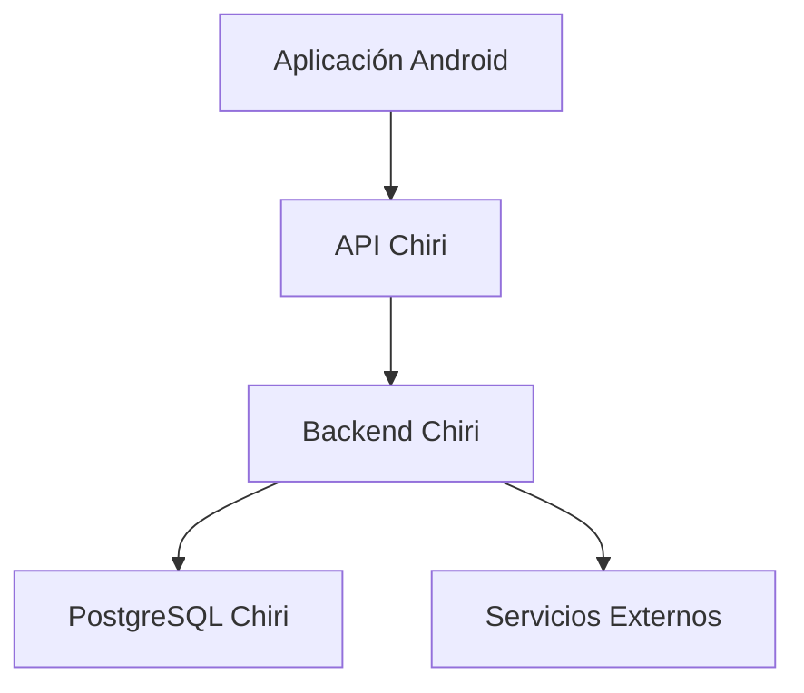

---

# 1.5 Principio de Fuente de Verdad

Cada dato deberá tener un único propietario.

Para los datos propios de Chiri:

```text
PostgreSQL Chiri
        |
        v
Fuente oficial
```

Ejemplo:

Usuario:

```text
PostgreSQL Chiri
        |
        v
Fuente oficial
```

Los datos pertenecientes a servicios externos deberán permanecer bajo la responsabilidad del servicio correspondiente.

Música:

```text
Navidrome / Music Assistant
        |
        v
Fuente oficial
```

Domótica:

```text
Home Assistant
        |
        v
Fuente oficial
```

Chiri podrá consultar o coordinar información de estos servicios sin convertirse en la fuente de verdad de sus datos internos.

---

# 1.6 Tecnología Definida

La base de datos utilizará:

## Motor

* PostgreSQL.

## Acceso

* Backend FastAPI.

## Migraciones

* Alembic.

## Ejecución

* Docker.

---

# 1.7 Principios de Diseño

La base de datos seguirá:

* diseño relacional.
* integridad referencial.
* nombres consistentes.
* normalización cuando corresponda.
* migraciones controladas.
* respaldo periódico.

---

# 1.8 Seguridad

La base de datos deberá considerar:

* cuentas de acceso con privilegios mínimos.
* acceso únicamente desde los componentes autorizados del Backend.
* protección de credenciales.
* copias de seguridad.
* separación entre credenciales de aplicación y otros accesos administrativos.

La Base de Datos no deberá utilizarse como mecanismo de autorización de clientes.

La autenticación y autorización de las operaciones de Chiri serán responsabilidad del Backend.

---

# 1.9 Principio Arquitectónico

La base de datos deberá responder:

> ¿Esta información pertenece realmente a Chiri?

Si la respuesta es no, deberá permanecer en el servicio especializado correspondiente.

# 2. Arquitectura del Modelo de Datos

La base de datos de Chiri Platform estará organizada mediante un modelo relacional basado en PostgreSQL.

El diseño deberá permitir crecimiento modular, evitando mezclar información de diferentes dominios.

---

# 2.1 Principio de Organización

Los datos deberán organizarse por responsabilidad funcional.

Cada dominio de Chiri tendrá sus propias entidades relacionadas.

El modelo de datos inicial de Chiri comprende los dominios de:

* Identidad.
* Seguridad.
* Autorización.
* Plataforma.

Actualmente, la implementación física comprende las entidades correspondientes a:

* Identidad: `user`.
* Seguridad: `session` y `refresh_token`.

Los dominios de Autorización y Plataforma forman parte del modelo definido para v1.0, pero sus entidades todavía no están implementadas físicamente.

Otros dominios, como Configuración, Integraciones e Historial, corresponden a futuras etapas y todavía no están implementados.

Ejemplo conceptual de la organización prevista:

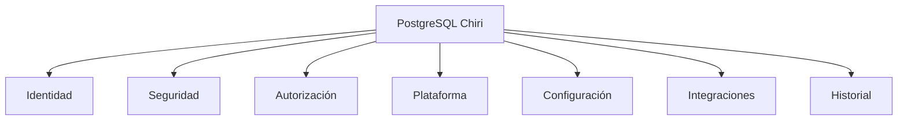

# 2.2 Separación por Esquemas

PostgreSQL permitirá organizar información mediante esquemas.

La estructura conceptual de dominios y esquemas definida para v1.0 es:

```text
PostgreSQL Chiri

├── identity
│   └── user
│
├── security
│   ├── session
│   └── refresh_token
│
├── authorization
│   ├── role
│   ├── permission
│   ├── user_role
│   └── role_permission
│
└── platform
    ├── module
    └── functionality
```

# 2.3 Dominio Identity

Responsabilidad:

Gestionar la identidad dentro de Chiri.

Actualmente implementado:

* user

Futuro:

* perfiles.
* preferencias básicas.

No almacenará:

* información externa de autenticación que pertenezca a otros servicios.

---

# 2.4 Dominio Security

Responsabilidad:

Gestionar elementos relacionados con la seguridad de las sesiones.

Actualmente implementado:

* sesiones.
* refresh tokens.

La autorización de usuarios se gestionará mediante el dominio Authorization.

---

# 2.5 Dominio Authorization

**Estado: Futuro — no implementado actualmente.**

Responsabilidad:

Gestionar roles y permisos que determinarán las capacidades de los usuarios dentro de Chiri.

Entidades previstas:

* role.
* permission.
* user_role.
* role_permission.

Relaciones principales:

```text
user
  │
  ▼
user_role
  │
  ▼
role
  │
  ▼
role_permission
  │
  ▼
permission
```

El dominio Authorization será utilizado por el Backend para determinar si un usuario puede acceder a una funcionalidad.

La implementación física de estas entidades se realizará mediante migraciones de Alembic cuando esta capacidad sea incorporada al sistema.

---

# 2.6 Dominio Platform

**Estado: Futuro — catálogo funcional.**

Responsabilidad:

Representar la organización funcional de Chiri.

Entidades previstas:

* module.
* functionality.

Relación principal:

```text
module
   │
   ▼
functionality
```

Un módulo representa un área funcional de la plataforma.

Una funcionalidad representa una capacidad concreta perteneciente a un módulo.

El catálogo funcional permitirá al Backend identificar las funcionalidades disponibles en Chiri y relacionarlas con el modelo de autorización cuando este sea aplicado.

La definición de qué usuario puede ejecutar una funcionalidad corresponderá al dominio **Authorization**.

La implementación física de estas entidades se realizará mediante migraciones de Alembic cuando el catálogo funcional sea incorporado al sistema.

---

# 2.7 Dominio Configuration

**Estado: Futuro — no implementado actualmente.**

Responsabilidad:

Almacenar configuraciones propias de la plataforma.

Ejemplos:

* parámetros generales.
* preferencias del sistema.
* configuraciones de usuario.

No almacenará configuraciones internas que pertenezcan exclusivamente a servicios externos.

---

# 2.8 Dominio Integration

**Estado: Futuro — no implementado actualmente.**

Responsabilidad:

Gestionar información necesaria para conectar Chiri con servicios externos.

Ejemplos:

* identificadores externos.
* estado de integración.
* configuración de conexión.

No almacenará:

* la base completa del servicio externo.
* información que sea propiedad del servicio integrado.

Chiri mantendrá únicamente las referencias y configuraciones necesarias para administrar la integración.

---

# 2.9 Dominio Audit

**Estado: Futuro — no implementado actualmente.**

Responsabilidad:

Registrar eventos importantes de la plataforma.

Ejemplos:

* acciones del usuario.
* cambios relevantes.
* eventos de seguridad.

La auditoría permitirá mantener trazabilidad de operaciones importantes cuando esta capacidad sea incorporada.

---

# 2.10 Modelo Relacional

Las relaciones deberán definirse mediante:

* claves primarias.
* claves foráneas.
* restricciones.
* índices cuando sean necesarios.

Relaciones principales actuales y previstas para v1.0:

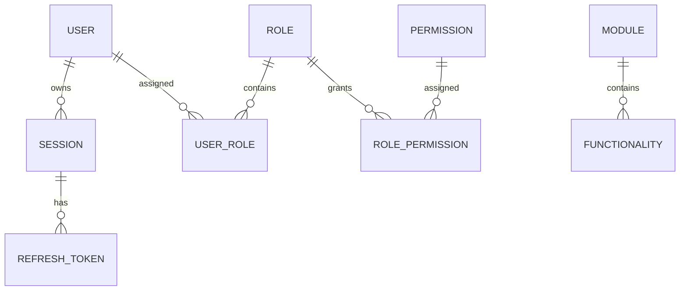

Las relaciones correspondientes a `user`, `session` y `refresh_token` representan estructuras actualmente implementadas.

Las relaciones correspondientes a `user_role`, `role`, `permission`, `role_permission`, `module` y `functionality` forman parte del modelo futuro de v1.0 y serán implementadas mediante migraciones cuando estas capacidades sean incorporadas físicamente.

Las entidades de auditoría, configuración, integración, perfil y otras relaciones futuras todavía no están implementadas.

# 2.11 Normalización

El diseño deberá buscar un equilibrio entre:

* evitar duplicación.
* mantener consultas eficientes.
* simplificar el mantenimiento.

La normalización se aplicará de acuerdo con las necesidades del dominio.

No se aplicará una normalización excesiva si esta perjudica la simplicidad, mantenibilidad o rendimiento del sistema.

---

# 2.12 Identificadores

Las entidades deberán utilizar identificadores consistentes.

Principios:

* únicos.
* estables.
* independientes de sistemas externos.

Los identificadores propios de Chiri deberán utilizarse como claves principales de las entidades correspondientes.

Los identificadores provenientes de servicios externos deberán almacenarse como referencias externas cuando sean necesarios, pero no deberán sustituir al identificador principal de Chiri.

Ejemplo correcto:

```text
id
```

como identificador principal de un usuario.

Ejemplo incorrecto:

```text
homeassistant_entity_id
```

como identificador principal de un usuario o entidad propia de Chiri.

Los identificadores externos podrán conservarse como datos de integración cuando corresponda.

---

# 2.13 Fechas y Auditoría

Las entidades importantes deberán considerar:

* fecha de creación.
* fecha de actualización.
* usuario responsable cuando corresponda.

Ejemplo conceptual:

```text
created_at
updated_at
created_by
```

Los campos de auditoría deberán utilizarse únicamente cuando aporten información relevante sobre el ciclo de vida o responsabilidad de la entidad.

No todas las entidades deberán incluir automáticamente todos los campos de auditoría.

---

# 2.14 Principio Arquitectónico

El modelo de datos deberá cumplir:

> Chiri almacena el conocimiento propio de la plataforma y referencia las capacidades de otros servicios sin apropiarse de ellas.

# 3. Convenciones de Diseño de Base de Datos

La base de datos PostgreSQL de Chiri Platform deberá seguir convenciones uniformes para facilitar:

* lectura del modelo.
* mantenimiento.
* evolución.
* integración con Backend.

---

# 3.1 Convención General de Nombres

Se utilizará:

* nombres descriptivos.
* formato `snake_case`.
* nombres en inglés para objetos técnicos.

Ejemplos:

Correcto:

```sql
user_account

created_at

integration_status
```

Incorrecto:

```text
tablaUsuario

fechaCreacion

EstadoConexion
```

---

# 3.2 Convención de Tablas

Las tablas deberán:

* representar entidades.
* utilizar nombres en singular.
* ser descriptivas.

Ejemplos:

Correcto:

```text
user

role

permission

module

functionality

logical_device

integration
```

Las entidades `role`, `permission`, `module` y `functionality` corresponden al modelo futuro de v1.0.

Las entidades `logical_device` e `integration` corresponden a futuras etapas y todavía no están implementadas.

Evitar:

```text
tbl_users

data_user

tmp_information
```

---

# 3.3 Convención de Columnas

Las columnas deberán utilizar:

```text
snake_case
```

Ejemplos:

```text
first_name

last_name

created_at

updated_at
```

---

# 3.4 Claves Primarias

Todas las entidades principales deberán tener una clave primaria.

Ejemplo:

```sql
id
```

Características:

* única.
* estable.
* propia de la entidad.

La clave primaria no deberá depender de identificadores externos.

Cuando corresponda, el identificador podrá ser generado por la aplicación o por el mecanismo definido para la persistencia.

---

# 3.5 Claves Externas

Las relaciones deberán utilizar claves foráneas.

Ejemplo:

```sql
user_id

role_id

permission_id

module_id

functionality_id

integration_id

device_id
```

Esto permitirá:

* integridad referencial.
* relaciones claras.
* consultas consistentes.

Las claves foráneas deberán utilizarse para representar las relaciones entre entidades propias de Chiri.

Relaciones actualmente implementadas:

```text
session.user_id

refresh_token.session_id
```

Relaciones previstas para el modelo futuro de v1.0:

```text
user_role.user_id

user_role.role_id

role_permission.role_id

role_permission.permission_id

functionality.module_id
```

Las referencias hacia entidades de dominios futuros, como `integration_id` o `device_id`, solo deberán incorporarse cuando dichas entidades formen parte del modelo implementado.

Las claves foráneas deberán apuntar únicamente a entidades existentes dentro del modelo físico de Chiri y no deberán utilizar identificadores externos como sustitutos de relaciones internas.

# 3.6 Tipos de Datos

Se deberán utilizar tipos de datos adecuados de PostgreSQL según la naturaleza de cada atributo.

Ejemplos:

Texto:

```sql
varchar

text
```

Fechas y tiempo:

```sql
timestamp with time zone
```

Estados:

```sql
text
```

Los estados deberán validarse mediante restricciones `CHECK`.

Ejemplo:

```sql
status IN ('ACTIVE', 'INACTIVE', 'DELETED')
```

Identificadores:

```sql
uuid
```

cuando corresponda.

La elección del tipo de dato deberá priorizar:

* representación correcta del valor.
* integridad de los datos.
* compatibilidad con el Backend.
* mantenimiento sencillo.

---

# 3.7 Manejo de Fechas

Las entidades importantes deberán registrar información temporal cuando corresponda.

Convención:

```sql
created_at

updated_at
```

Los valores de fecha y hora deberán utilizar:

```text
UTC como referencia interna
```

La persistencia deberá utilizar tipos compatibles con fecha y hora con zona horaria.

La conversión y presentación de fechas en la zona horaria del usuario será responsabilidad de la aplicación.

---

# 3.8 Campos de Estado

Los estados deberán ser claros, descriptivos y consistentes con el modelo de la entidad.

Ejemplo:

Correcto:

```text
status = ACTIVE
```

Evitar:

```text
estado = 1
```

sin documentación que defina su significado.

Cuando los estados formen parte de una lista cerrada, deberán validarse mediante restricciones apropiadas.

---

# 3.9 Campos de Eliminación Lógica

Cuando sea necesario conservar información histórica podrá utilizarse eliminación lógica.

Ejemplo:

```sql
deleted_at
```

La eliminación lógica no se aplicará automáticamente a todas las tablas.

Su utilización deberá evaluarse según:

* necesidad de conservar historial.
* requisitos de integridad.
* comportamiento de la entidad.
* necesidades de auditoría.

---

# 3.10 Índices

Los índices deberán crearse cuando exista una necesidad real.

Criterios:

* consultas frecuentes.
* relaciones importantes.
* búsquedas habituales.
* necesidades de rendimiento identificadas.

No se crearán índices innecesarios.

Las restricciones que generen índices, como `UNIQUE`, deberán considerarse antes de crear índices adicionales para evitar duplicidad.

La creación de índices deberá considerar el equilibrio entre:

* rendimiento de lectura.
* coste de escritura.
* almacenamiento.

---

# 3.11 Restricciones

La base de datos deberá proteger la integridad mediante:

* `NOT NULL`.
* `UNIQUE`.
* `FOREIGN KEY`.
* `CHECK`.

Ejemplo:

```sql
email TEXT UNIQUE NOT NULL
```

Las restricciones `CHECK` se utilizarán para validar valores permitidos, como los estados de las entidades.

Las restricciones deberán utilizarse como una segunda capa de protección de la integridad, sin sustituir las validaciones realizadas por el Backend.

---

# 3.12 Comentarios de Base de Datos

Cuando una entidad tenga reglas complejas o requiera contexto adicional, deberá documentarse mediante comentarios de base de datos cuando resulte útil.

Ejemplo:

```sql
COMMENT ON TABLE identity.user
IS 'Usuarios registrados en Chiri Platform';
```

Los comentarios deberán complementar la documentación arquitectónica y no sustituirla.

---

# 3.13 Migraciones

Los cambios de estructura deberán realizarse mediante migraciones gestionadas con Alembic.

No se modificarán tablas manualmente en producción.

Flujo:

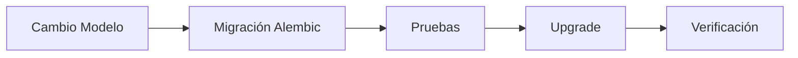

Las migraciones deberán:

* estar versionadas.
* mantener trazabilidad.
* probarse antes de aplicarse.
* conservar la compatibilidad necesaria con el Backend.
* evitar cambios manuales fuera del mecanismo de migración establecido.

# 3.14 Principio Arquitectónico

El diseño de base de datos deberá cumplir:

> Una persona nueva en el proyecto debe poder entender la estructura leyendo los nombres y relaciones.

---

# 4. Entidades Principales de Chiri

Las entidades se dividen entre las actualmente implementadas, las previstas para el modelo v1.0 y las previstas para futuras etapas.

## Entidades actualmente implementadas

* User
* Session
* RefreshToken

## Entidades previstas para v1.0

* Role
* Permission
* UserRole
* RolePermission
* Module
* Functionality

Estas entidades forman parte del modelo funcional previsto para Chiri Platform, pero todavía no están implementadas físicamente en la base de datos.

## Entidades futuras

* Profile
* Configuration
* Integration
* Logical Device
* Audit

La base de datos de Chiri Platform deberá representar únicamente conceptos propios de la plataforma.

Las entidades iniciales están diseñadas para soportar:

* identidad de usuarios.
* seguridad.
* autorización.
* organización funcional de la plataforma.

Las siguientes capacidades corresponden a etapas futuras:

* configuración.
* integraciones.
* auditoría.
* perfiles.

El modelo podrá evolucionar cuando aparezcan nuevos módulos, respetando la arquitectura definida.

---

# 4.1 Entidad Usuario

La entidad Usuario representa una persona registrada dentro de Chiri.

Responsabilidad actualmente implementada:

* identificar usuarios.

Capacidades previstas:

* asociar roles.
* relacionar preferencias mediante entidades futuras.
* participar en mecanismos de actividad y auditoría cuando estos sean implementados.

Modelo actualmente implementado:

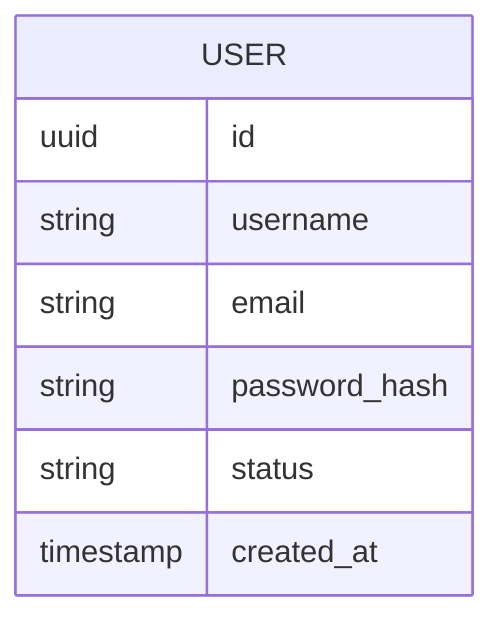

La estructura física actualmente implementada corresponde al esquema `identity` y a la tabla `user`.

---

# 4.2 Entidad Perfil

El perfil representa información adicional asociada al usuario.

**Estado: Futuro — no implementado actualmente.**

Separar Usuario y Perfil permite:

* mantener la identidad separada de información personal.
* ampliar información futura.
* evitar tablas demasiado grandes.

Ejemplos:

* nombre visible.
* imagen.
* preferencias generales.

Relación:

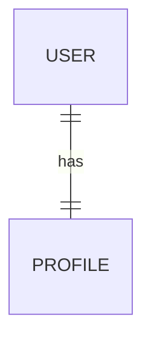

La entidad `profile` será implementada únicamente cuando exista una necesidad funcional definida.

---

# 4.3 Entidad Rol

**Estado: Futuro — no implementado actualmente.**

Los roles representan conjuntos de capacidades dentro de Chiri.

Un rol no representa una persona.

Representa un conjunto de capacidades que podrá asignarse a uno o más usuarios.

Los roles conceptuales considerados para el modelo son:

* ADMIN.
* USER.
* GUEST.

Estos roles representan una definición conceptual del modelo de autorización y no deberán considerarse actualmente implementados hasta que exista el modelo correspondiente en el Backend y haya sido validado mediante pruebas.

La asignación de roles a usuarios se realizará mediante la entidad `UserRole`.

La estructura física de `role` será definida mediante una migración de Alembic cuando el modelo de autorización sea implementado.

# 4.4 Entidad Permiso

Los permisos representan acciones específicas que pueden ejecutarse dentro de Chiri.

Ejemplos conceptuales:

* administrar usuarios.
* controlar dispositivos.
* modificar configuraciones.

Los permisos serán asignados a roles mediante la entidad `RolePermission`.

---

# 4.5 Entidad UserRole

La entidad `UserRole` representa la asignación de uno o más roles a un usuario.

Relación conceptual:

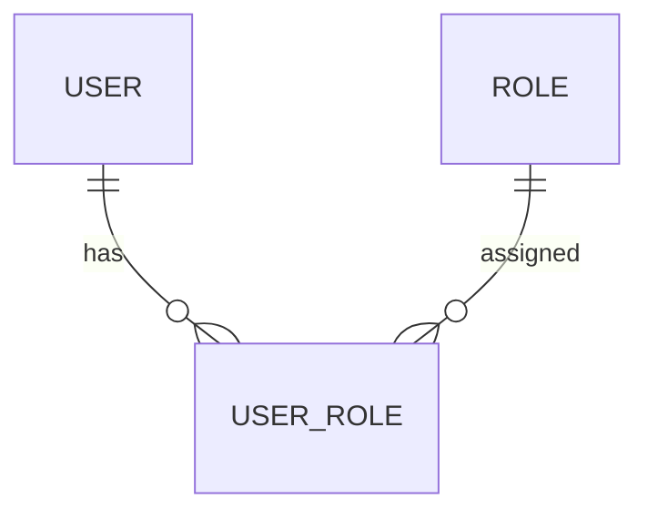

Esta entidad permite mantener separadas la identidad del usuario y la definición de sus roles.

---

# 4.6 Entidad RolePermission

La entidad `RolePermission` representa la asignación de permisos a roles.

Relación conceptual:

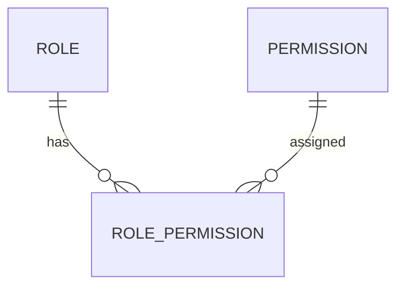

Esta entidad permite determinar qué capacidades están asociadas a cada rol.

---

# 4.7 Entidad Módulo

El módulo representa un área funcional principal de Chiri.

Ejemplos:

* Hogar.
* Multimedia.
* Inteligencia Artificial.
* Personal.

Un módulo puede contener múltiples funcionalidades.

Relación conceptual:

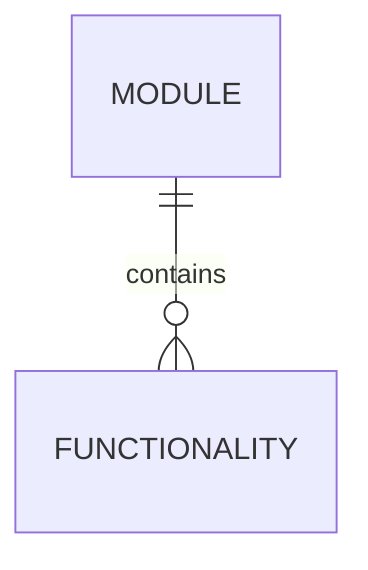

# 4.8 Entidad Funcionalidad

La funcionalidad representa una capacidad concreta perteneciente a un módulo.

Ejemplos conceptuales:

* consultar dispositivos.
* reproducir contenido.
* utilizar una capacidad de inteligencia artificial.
* consultar servicios personales.

Una funcionalidad pertenece a un módulo.

La relación entre funcionalidades y permisos se definirá de acuerdo con las
necesidades de autorización de la plataforma.

No deberá asumirse una relación adicional entre funcionalidades y permisos
hasta que dicha relación sea definida mediante una decisión arquitectónica
y el correspondiente contrato de implementación.

---

# 4.9 Entidad Configuración

**Estado: Futuro — no implementado actualmente.**

Representa configuraciones propias de Chiri.

Puede incluir:

* configuración global.
* configuración por usuario.
* preferencias de funcionamiento.

No almacenará configuraciones internas de servicios externos.

---

# 4.10 Entidad Integración

**Estado: Futuro — no implementado actualmente.**

Representa la conexión entre Chiri y servicios externos.

Ejemplos:

* Home Assistant.
* Music Assistant.
* Jellyfin.

Su responsabilidad será almacenar información necesaria para integración.

No almacenará los datos completos del servicio externo.

---

# 4.11 Entidad Dispositivo Lógico

**Estado: Futuro — no implementado actualmente.**

Chiri podrá manejar referencias a dispositivos o recursos externos.

Ejemplo:

```text
Chiri
    |
Dispositivo lógico
    |
Home Assistant Entity
```

La entidad de Chiri no reemplazará al dispositivo real.

---

# 4.12 Entidad Auditoría

**Estado: Futuro — no implementado actualmente.**

La auditoría registrará eventos importantes.

Ejemplos:

* inicio de sesión.
* cambio de configuración.
* acciones administrativas.

Modelo conceptual:

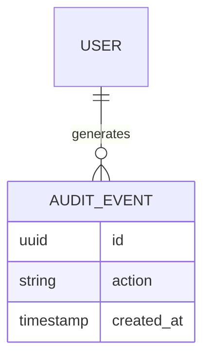

La implementación concreta de auditoría se definirá en una etapa posterior.

# 4.13 Entidad Sesión

La sesión representa una sesión autenticada de un usuario dentro de Chiri.

**Estado: Implementado actualmente.**

Campos actuales:

* `id`.
* `user_id`.
* `created_at`.
* `expires_at`.
* `status`.

Estados permitidos:

* `ACTIVE`.
* `REVOKED`.
* `EXPIRED`.

Relación:


La entidad `Session` forma parte de la implementación actual de seguridad del Backend.

---

# 4.14 Entidad Refresh Token

El refresh token pertenece a una sesión autenticada.

**Estado: Implementado actualmente.**

Campos actuales:

* `id`.
* `session_id`.
* `token_hash`.
* `created_at`.
* `expires_at`.
* `status`.

Estados permitidos:

* `ACTIVE`.
* `REVOKED`.
* `EXPIRED`.

Relación:

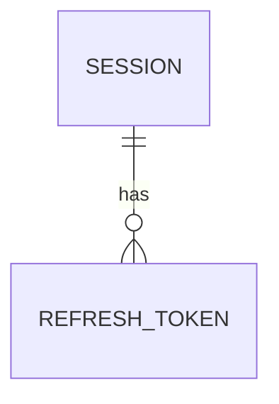

El valor original del refresh token no se almacena.

La base de datos almacena únicamente su hash.

La entidad `RefreshToken` forma parte de la implementación actual de seguridad del Backend.

---

# 4.15 Relación General del Dominio

Modelo conceptual de las entidades actualmente implementadas:

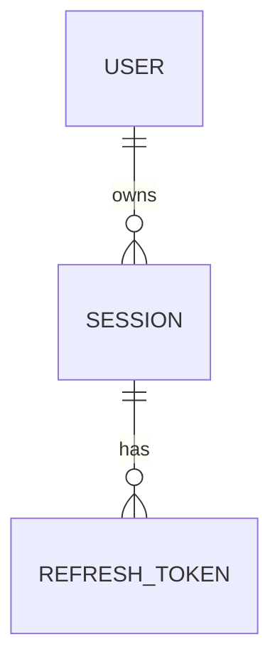

Las entidades `Role`, `Permission`, `UserRole`, `RolePermission`, `Module` y `Functionality` forman parte del modelo arquitectónico previsto para futuras capacidades de autorización y organización funcional.

Estas entidades no deberán considerarse implementadas hasta que exista su implementación correspondiente en el Backend y haya sido validada mediante pruebas.

Las entidades `Profile`, `Configuration`, `Integration`, `Logical Device` y `Audit` corresponden igualmente a futuras etapas.

---

# 4.16 Entidades Futuras

La arquitectura permitirá agregar posteriormente entidades como:

* roles y permisos.
* perfiles.
* configuraciones propias.
* integraciones.
* dispositivos lógicos.
* auditoría.
* automatizaciones propias.
* asistentes IA.
* rutinas personales.
* historial multimedia.
* preferencias avanzadas.

Estas entidades serán creadas solamente cuando exista una necesidad funcional y arquitectónica real.

La incorporación de nuevas entidades deberá respetar la arquitectura, el modelo de dominio y las reglas de fuente de verdad establecidas.

---

# 4.17 Regla de Diseño

Una entidad nueva deberá responder:

> ¿Este concepto pertenece al dominio de Chiri o pertenece a un servicio externo?

Si pertenece al dominio de Chiri, podrá formar parte del modelo de datos de la plataforma.

Si pertenece a un servicio externo, Chiri deberá integrarlo y referenciarlo cuando sea necesario, pero no deberá replicar su modelo interno ni apropiarse de sus datos.

---

# 4.18 Principio Arquitectónico

El modelo de datos de Chiri deberá representar:

> El conocimiento y estado propio de la plataforma, manteniendo separados los dominios de los sistemas integrados.

Cada entidad deberá tener un propósito claro dentro del dominio de Chiri y una responsabilidad definida dentro del modelo de datos.

---

# 5. Diseño Físico de Base de Datos

El diseño físico define la organización real de PostgreSQL para Chiri Platform.

Su objetivo es establecer:

* esquemas.
* tablas.
* relaciones.
* restricciones.
* estructura inicial.

El diseño físico distingue entre entidades actualmente implementadas, entidades previstas para futuras capacidades de v1.0 y entidades correspondientes a futuras etapas.

---

# 5.1 Organización Física Inicial

La base de datos utilizará esquemas PostgreSQL para separar responsabilidades y dominios.

La estructura física actual y prevista es:

```text
PostgreSQL Chiri
│
├── identity
│   └── user
│
├── security
│   ├── session
│   └── refresh_token
│
├── authorization
│   ├── role
│   ├── permission
│   ├── user_role
│   └── role_permission
│
├── platform
│   ├── module
│   └── functionality
│
├── configuration
│
├── integration
│
└── audit
```

Estado de los esquemas:

```text
identity
└── IMPLEMENTADO
    └── user

security
└── IMPLEMENTADO
    ├── session
    └── refresh_token

authorization
└── FUTURO
    ├── role
    ├── permission
    ├── user_role
    └── role_permission

platform
└── FUTURO
    ├── module
    └── functionality

configuration
└── FUTURO

integration
└── FUTURO

audit
└── FUTURO
```

Los esquemas `authorization`, `platform`, `configuration`, `integration` y `audit` representan estructura prevista de la arquitectura y no deberán considerarse implementados hasta que sus correspondientes migraciones y componentes del Backend hayan sido creados y validados.

La estructura física real de PostgreSQL deberá estar determinada por las migraciones de Alembic aplicadas en el entorno correspondiente.

# 5.2 Esquema Identity

Responsabilidad:

Gestionar la identidad de usuarios dentro de Chiri.

Estructura actualmente implementada:

```text
identity
└── user
```

Estructura futura:

```text
identity
└── profile
```

La entidad `profile` será incorporada únicamente cuando exista una necesidad funcional y arquitectónica real.

---

# 5.3 Tabla User

Responsabilidad:

Representar usuarios registrados dentro de Chiri.

Estructura actualmente implementada:

```text
user

id
username
email
password_hash
status
created_at
```

Campos previstos:

```text
updated_at
```

Reglas:

* `id` identifica de forma única al usuario.
* `username` identifica el nombre de usuario.
* `email` identifica el correo asociado.
* `password_hash` almacena únicamente el hash de la contraseña.
* `status` representa el estado del usuario.
* `created_at` registra la fecha y hora de creación.
* `updated_at` registrará la última modificación cuando sea incorporado.
* `email` deberá ser único.

La estructura física deberá mantenerse alineada con el modelo implementado y con las migraciones de Alembic aplicadas.

---

# 5.4 Tabla Profile

**Estado: Futuro — no implementado actualmente.**

Responsabilidad:

Almacenar información complementaria del usuario.

Estructura conceptual:

```text
profile

id
user_id
display_name
avatar
created_at
updated_at
```

Relación:


La estructura será implementada mediante una migración cuando esta funcionalidad sea necesaria.

---

# 5.5 Esquema Security

Responsabilidad:

Gestionar elementos relacionados con la seguridad de las sesiones.

Estructura actualmente implementada:

```text
security
├── session
└── refresh_token
```

El esquema `security` no será utilizado para almacenar las entidades propias de autorización.

Las entidades de autorización pertenecerán al esquema `authorization`.

---

# 5.6 Tabla Session

Responsabilidad:

Representar una sesión autenticada de un usuario.

Estructura actualmente implementada:

```text
session

id
user_id
created_at
expires_at
status
```

Estados permitidos:

```text
ACTIVE
REVOKED
EXPIRED
```

Relación:


La tabla `session` forma parte de la implementación actual de seguridad del Backend.

---

# 5.7 Tabla Refresh Token

Responsabilidad:

Representar los refresh tokens asociados a una sesión.

Estructura actualmente implementada:

```text
refresh_token

id
session_id
token_hash
created_at
expires_at
status
```

Estados permitidos:

```text
ACTIVE
REVOKED
EXPIRED
```

Relación:


El valor original del refresh token no se almacena.

La base de datos almacena únicamente su hash.

La tabla `refresh_token` forma parte de la implementación actual de seguridad del Backend.

---

# 5.8 Esquema Authorization

**Estado: Modelo v1.0 — implementación pendiente.**

Responsabilidad:

Gestionar roles y permisos utilizados por el Backend para determinar las capacidades autorizadas de los usuarios.

Estructura prevista:

```text
authorization
├── role
├── permission
├── user_role
└── role_permission
```

Estas entidades no deberán considerarse implementadas hasta que exista su correspondiente implementación mediante modelos, migraciones y pruebas del Backend.

---

# 5.9 Tabla Role

**Estado: Modelo v1.0 — implementación pendiente.**

Responsabilidad:

Representar niveles o conjuntos de capacidades que podrán asignarse a los usuarios dentro de Chiri.

Roles previstos inicialmente:

```text
ADMIN
USER
GUEST
```

La estructura física definitiva será establecida mediante la migración correspondiente.

Los roles no deberán considerarse implementados hasta que exista el modelo de autorización correspondiente y haya sido validado mediante pruebas.

---

# 5.10 Tabla Permission

**Estado: Modelo v1.0 — implementación pendiente.**

Responsabilidad:

Representar acciones específicas que pueden ejecutarse dentro de Chiri.

Ejemplos conceptuales:

```text
MANAGE_USERS
CONTROL_DEVICES
MANAGE_CONFIGURATION
```

La estructura física definitiva será establecida mediante la migración correspondiente.

Los permisos no deberán considerarse implementados hasta que exista el modelo correspondiente en el Backend y haya sido validado mediante pruebas.

---

# 5.11 Tabla User Role

**Estado: Modelo v1.0 — implementación pendiente.**

Responsabilidad:

Representar la asignación de uno o más roles a un usuario.

Relación:


Esta tabla representa la relación entre `user` y `role`.

La asignación deberá respetar las reglas de autorización definidas por el Backend.

La estructura física definitiva será establecida mediante la migración correspondiente.

# 5.12 Tabla Role Permission

**Estado: Modelo v1.0 — implementación pendiente.**

Responsabilidad:

Representar la asignación de permisos a roles.

Relación:


Esta tabla representa la relación entre `role` y `permission`.

---

# 5.13 Tabla Module

**Estado: Modelo v1.0 — implementación pendiente.**

Responsabilidad:

Representar un área funcional de Chiri.

Ejemplos conceptuales:

```text
HOME
MEDIA
AI
PERSONAL
SETTINGS
```

Un módulo puede contener múltiples funcionalidades.

La estructura física definitiva será establecida mediante la migración correspondiente.

---

# 5.14 Tabla Functionality

**Estado: Modelo v1.0 — implementación pendiente.**

Responsabilidad:

Representar una capacidad concreta perteneciente a un módulo.

Relación:


La relación entre `functionality` y `permission` no se establece todavía como relación física.

Será definida cuando se determine el modelo definitivo de autorización funcional.

La estructura física definitiva será establecida mediante la migración correspondiente.

---

# 5.15 Esquema Configuration

**Estado: Futuro — no implementado actualmente.**

Responsabilidad:

Gestionar configuraciones propias de Chiri.

Estructura prevista:

```text
configuration
├── system_setting
└── user_setting
```

Estas tablas serán implementadas cuando exista una necesidad funcional concreta.

---

# 5.16 Esquema Integration

**Estado: Futuro — no implementado actualmente.**

Responsabilidad:

Gestionar información necesaria para conectar servicios externos.

Estructura prevista:

```text
integration
├── service
└── connection
```

Chiri almacenará únicamente la información necesaria para administrar la integración.

No almacenará los datos completos de los servicios externos.

---

# 5.17 Esquema Audit

**Estado: Futuro — no implementado actualmente.**

Responsabilidad:

Registrar eventos importantes de la plataforma.

Estructura prevista:

```text
audit
└── event
```

Ejemplos futuros:

```text
user_login
configuration_change
permission_change
```

La estructura física de auditoría será definida cuando esta capacidad sea implementada.

---

# 5.18 Modelo General de Seguridad y Autorización

El modelo físico previsto para seguridad y autorización será:

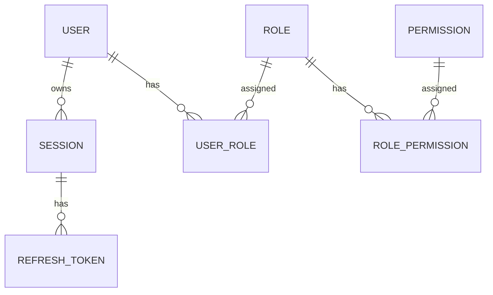

Las entidades `session` y `refresh_token` corresponden a la implementación actual de seguridad.

Las entidades `role`, `permission`, `user_role` y `role_permission` corresponden al modelo previsto de autorización v1.0 y permanecen pendientes de implementación.

---

# 5.19 Modelo Funcional

La organización funcional de Chiri Platform será:

```mermaid
erDiagram

    MODULE ||--o{ FUNCTIONALITY : contains
```
Los módulos agrupan funcionalidades.

Las funcionalidades representan capacidades concretas de la plataforma y pertenecen a un módulo.

La relación entre autorización y funcionalidad será definida posteriormente mediante una decisión arquitectónica y, cuando corresponda, mediante el contrato de API.

No se establece actualmente una relación física directa entre functionality y permission.

Las entidades module y functionality forman parte del modelo previsto de Chiri Platform v1.0 y permanecen pendientes de implementación mediante los correspondientes modelos, migraciones y pruebas del Backend.

# 5.20 Modelo General Inicial

La organización conceptual de la base de datos distingue entre las entidades actualmente implementadas y las entidades previstas para las futuras capacidades de Chiri Platform.

```mermaid
flowchart TB

    PostgreSQL["PostgreSQL Chiri"]

    Identity["identity"]
    Security["security"]
    Authorization["authorization"]
    Platform["platform"]

    User["user"]
    Session["session"]
    RefreshToken["refresh_token"]

    Role["role"]
    Permission["permission"]
    UserRole["user_role"]
    RolePermission["role_permission"]

    Module["module"]
    Functionality["functionality"]

    PostgreSQL --> Identity
    PostgreSQL --> Security
    PostgreSQL --> Authorization
    PostgreSQL --> Platform

    Identity --> User

    Security --> Session
    Security --> RefreshToken

    Authorization --> Role
    Authorization --> Permission
    Authorization --> UserRole
    Authorization --> RolePermission

    Platform --> Module
    Platform --> Functionality

    Module --> Functionality
```

La organización física inicial queda definida conceptualmente de la siguiente manera:

```text
PostgreSQL Chiri

├── identity
│   └── user
│
├── security
│   ├── session
│   └── refresh_token
│
├── authorization
│   ├── role
│   ├── permission
│   ├── user_role
│   └── role_permission
│
└── platform
    ├── module
    └── functionality
```

Estado de la estructura:

```text
IMPLEMENTADO

identity
└── user

security
├── session
└── refresh_token


MODELO PREVISTO — IMPLEMENTACIÓN PENDIENTE

authorization
├── role
├── permission
├── user_role
└── role_permission

platform
├── module
└── functionality
```

Las entidades `profile`, `configuration`, `integration` y `audit` pertenecen a futuras etapas y no forman parte de la estructura física inicial actualmente implementada.

La estructura física real de PostgreSQL deberá estar determinada por las migraciones de Alembic aplicadas en el entorno correspondiente.

---

# 5.21 Regla de Evolución

Las tablas iniciales no deberán crecer indefinidamente.

Cuando un módulo tenga suficiente complejidad deberá obtener su propio dominio y estructura dentro de la base de datos.

Ejemplos de dominios que podrán incorporarse posteriormente:

```text
media
automation
ai
assistant
```

La incorporación de nuevos dominios deberá realizarse únicamente cuando exista una necesidad funcional y arquitectónica definida.

Toda nueva entidad deberá:

* pertenecer claramente a un dominio.
* tener una responsabilidad definida.
* mantener relaciones explícitas.
* respetar las convenciones de la base de datos.
* contar con la migración correspondiente.
* actualizar la documentación relacionada.

No se crearán tablas únicamente para anticipar funcionalidades futuras sin una necesidad real.

---

# 5.22 Migraciones

Todo cambio físico en la estructura de PostgreSQL deberá realizarse mediante migraciones de Alembic.

Flujo:

```mermaid
flowchart LR

    Change["Cambio Modelo"]

    Migration["Migración Alembic"]

    Test["Pruebas"]

    Upgrade["Upgrade"]

    Verification["Verificación"]

    Change --> Migration
    Migration --> Test
    Test --> Upgrade
    Upgrade --> Verification
```

Las migraciones deberán:

* estar versionadas.
* ser trazables.
* mantener compatibilidad cuando corresponda.
* ser probadas antes de aplicarse.
* permitir verificar el resultado de los cambios.

No se modificarán estructuras directamente en producción.

Los cambios manuales sobre la estructura de la base de datos no deberán utilizarse como sustituto del mecanismo de migraciones. Los procedimientos excepcionales de recuperación deberán seguir procesos controlados y previamente definidos.

---

# 5.23 Principio Arquitectónico

El diseño físico de la base de datos deberá cumplir:

> Cada dato debe vivir en el esquema responsable de su dominio.

La estructura deberá mantener una separación clara entre:

```text
identity

security

authorization

platform
```

Cada dominio será responsable únicamente de los datos que pertenecen a su propia responsabilidad.

Los servicios externos mantendrán sus propios datos y Chiri almacenará únicamente la información que pertenezca al dominio de la plataforma o que sea necesaria para gestionar una integración.

La base de datos deberá evolucionar de forma controlada, manteniendo la integridad, trazabilidad y separación de responsabilidades definidas por la arquitectura de Chiri Platform.

# 6. Migraciones, Versionado y Evolución del Esquema

La evolución de la base de datos de Chiri Platform deberá realizarse mediante migraciones controladas.

Los cambios de estructura deberán quedar registrados en el sistema de migraciones del Backend.

No se modificarán estructuras directamente en ambientes productivos.

---

# 6.1 Principio de Migración

Toda modificación de la estructura de la base de datos deberá quedar registrada mediante una migración.

Ejemplos:

* creación de tablas.
* modificación de columnas.
* creación de índices.
* cambios de restricciones.
* creación de relaciones.
* eliminación controlada de estructuras.

Cada migración deberá representar un cambio identificable y reproducible.

---

# 6.2 Herramienta de Migraciones

El Backend FastAPI utiliza **Alembic** para gestionar la evolución del esquema PostgreSQL.

Alembic permite:

* versionar cambios del esquema.
* aplicar migraciones de forma ordenada.
* mantener un historial de versiones.
* ejecutar actualizaciones mediante `upgrade`.
* revertir cambios mediante `downgrade` cuando la migración lo permita.

La versión actual del esquema deberá estar determinada por el historial de migraciones de Alembic.

---

# 6.3 Estructura de Migraciones

Las migraciones se mantienen dentro del proyecto Backend.

Estructura conceptual:

```text
server/

├── alembic.ini
│
└── alembic/
    │
    ├── env.py
    │
    ├── script.py.mako
    │
    └── versions/
        │
        ├── <revision_1>.py
        ├── <revision_2>.py
        ├── <revision_3>.py
        └── ...
```

Cada archivo dentro de `versions` representa una revisión del esquema.

Los identificadores de revisión son administrados por Alembic.

---

# 6.4 Identificación de Cambios

Cada migración deberá tener:

* identificador único.
* descripción clara.
* relación con la revisión anterior.
* operaciones de actualización.
* operaciones de reversión cuando sea posible.

Ejemplo conceptual:

```text
<revision_id>_create_security_tables.py
```

La descripción deberá permitir identificar el propósito principal del cambio.

---

# 6.5 Flujo de Cambio

Todo cambio deberá seguir:

```mermaid
flowchart LR

    Requirement["Nueva Necesidad"]

    Design["Diseño"]

    Migration["Crear Migración"]

    Test["Pruebas"]

    Deploy["Aplicar Cambio"]

    Verification["Verificación"]

    Requirement --> Design
    Design --> Migration
    Migration --> Test
    Test --> Deploy
    Deploy --> Verification
```

---

# 6.6 Ambientes

Los cambios deberán validarse antes de llegar a producción.

Flujo conceptual:

```mermaid
flowchart LR

    Development["Desarrollo"]

    Testing["Pruebas"]

    Production["Producción"]

    Development --> Testing
    Testing --> Production
```

Las migraciones deberán probarse y verificarse antes de aplicarse sobre la base de datos de producción.

El proceso de pruebas deberá utilizar un entorno de validación apropiado y no deberá implicar modificaciones directas sobre la base de datos de producción.

---

# 6.7 Producción

Antes de aplicar cambios importantes en producción se deberá:

* realizar respaldo.
* probar la migración.
* verificar compatibilidad.
* aplicar la migración mediante Alembic.
* verificar el estado de la base de datos.
* registrar el cambio.

No se realizarán modificaciones estructurales manuales como sustituto de una migración.

Los cambios estructurales deberán formar parte del historial de migraciones de Alembic.

---

# 6.8 Rollback

Cuando sea técnicamente posible, las migraciones deberán implementar una operación de reversión mediante `downgrade`.

Ejemplo:

```text
Versión 2

    |

downgrade

    |

Versión 1
```

No todos los cambios permiten una reversión completa o segura.

Las migraciones deberán diseñarse considerando el impacto de una posible reversión.

La ejecución de un `downgrade` en producción deberá evaluarse cuidadosamente, especialmente cuando la migración haya modificado o eliminado datos.

Cuando una reversión directa pueda poner en riesgo la información existente, deberá utilizarse un procedimiento de recuperación apropiado.

---

# 6.9 Compatibilidad Backend / Base de Datos

Los cambios deberán mantener compatibilidad entre el Backend y la base de datos durante la evolución.

Ejemplo incorrecto:

```text
Eliminar columna utilizada por una API activa
```

Ejemplo recomendado:

```text
Agregar nueva estructura

        |

Actualizar Backend

        |

Migrar o adaptar datos

        |

Verificar funcionamiento

        |

Eliminar estructura antigua posteriormente
```

Los cambios destructivos deberán realizarse únicamente cuando ya no existan dependencias activas.

---

# 6.10 Respaldo Antes de Cambios

Antes de modificaciones importantes se deberá disponer de:

* copia de seguridad.
* procedimiento de recuperación conocido.
* verificación cuando corresponda.

El respaldo deberá realizarse antes de cambios que puedan afectar información existente.

---

# 6.11 Historial del Esquema

El historial de migraciones de Alembic será la referencia oficial para determinar la evolución del esquema.

No se confiará en:

* memoria del desarrollador.
* cambios manuales.
* documentos externos sin actualización.

La documentación deberá describir la arquitectura, mientras que las migraciones representan la evolución física real de la base de datos.

---

# 6.12 Estado Actual

Actualmente el Backend utiliza Alembic para administrar el esquema PostgreSQL.

El estado físico actualmente implementado incluye las estructuras correspondientes a:

* `identity.user`.
* `security.session`.
* `security.refresh_token`.

Las entidades adicionales de autorización y organización funcional definidas para v1.0 corresponden al modelo previsto y deberán incorporarse mediante migraciones cuando sean implementadas físicamente en el Backend.

Estas entidades no deberán considerarse parte del esquema físico actual hasta que exista su correspondiente implementación y haya sido validada mediante pruebas.

---

# 6.13 Regla de Evolución

Una modificación del modelo de datos deberá seguir el siguiente orden:

```text
Requerimiento

    ↓

Diseño conceptual

    ↓

Diseño físico

    ↓

Migración Alembic

    ↓

Pruebas

    ↓

Aplicación

    ↓

Verificación
```

No deberá modificarse directamente la estructura de producción para evitar el proceso de migración.

Toda modificación estructural deberá quedar registrada en el historial de Alembic.

---

# 6.14 Principio Arquitectónico

La evolución de PostgreSQL deberá cumplir:

> El estado actual de la base de datos debe poder explicarse mediante la historia de sus migraciones.

Las migraciones deberán permitir conocer qué cambios fueron realizados, en qué orden fueron aplicados y cuál es la versión correspondiente del esquema.

La evolución física de la base de datos deberá mantenerse alineada con el modelo de dominio y con la arquitectura definida para Chiri Platform.

# 7. Seguridad y Protección de Datos PostgreSQL

La base de datos PostgreSQL de Chiri Platform deberá implementarse aplicando principios de seguridad por defecto.

El objetivo será proteger:

* información de usuarios.
* información de sesiones.
* información relacionada con autenticación.
* integridad del sistema.
* disponibilidad de los datos.

La protección de la base de datos deberá complementar los mecanismos de seguridad implementados en el Backend.

---

# 7.1 Principio de Acceso Controlado

La base de datos no deberá ser accedida directamente por clientes externos.

El flujo oficial será:

```mermaid
flowchart LR

    Android["Aplicación Android"]

    Backend["Backend FastAPI"]

    PostgreSQL["PostgreSQL"]

    Android --> Backend
    Backend --> PostgreSQL
```

La aplicación Android se comunicará únicamente con la API de Chiri.

PostgreSQL será accesible únicamente por los componentes autorizados del Backend.

Los clientes externos no deberán conectarse directamente a PostgreSQL.

---

# 7.2 Usuarios de Base de Datos

PostgreSQL deberá utilizar usuarios separados según responsabilidad.

Modelo conceptual:

```text
postgres_admin

    |

Administración

----------------

chiri_backend

    |

Operación normal de la aplicación
```

El usuario utilizado por el Backend no deberá utilizar credenciales administrativas.

La administración de PostgreSQL deberá realizarse mediante un usuario con privilegios administrativos separado del usuario utilizado por la aplicación.

La existencia y configuración concreta de estos usuarios dependerá del entorno de despliegue.

---

# 7.3 Principio de Mínimos Privilegios

El usuario utilizado por Chiri Backend deberá tener únicamente los permisos necesarios para ejecutar las operaciones de la aplicación.

Debe poder, según corresponda:

* consultar datos.
* insertar información.
* actualizar información.
* ejecutar las operaciones necesarias para el funcionamiento del Backend.

No deberá utilizar:

* permisos administrativos completos.
* creación de usuarios del servidor.
* modificación global de PostgreSQL.
* operaciones administrativas innecesarias.

Las operaciones de administración de PostgreSQL deberán realizarse mediante un usuario administrativo separado.

Los privilegios deberán limitarse según las necesidades reales de cada componente.

---

# 7.4 Credenciales

Las credenciales de PostgreSQL deberán:

* mantenerse fuera del código fuente.
* utilizar mecanismos de configuración segura.
* almacenarse de forma segura.
* no incluirse en repositorios Git.

Ejemplos conceptuales:

```text
DATABASE_URL
POSTGRES_USER
POSTGRES_PASSWORD
```

Los valores reales de las credenciales no deberán formar parte de la documentación ni del código fuente.

---

# 7.5 Conexiones Seguras

La comunicación con PostgreSQL deberá considerar:

* conexiones internas seguras.
* restricciones de red.
* usuarios autenticados.
* acceso limitado a los componentes autorizados.

En el entorno de despliegue mediante Docker podrá utilizarse una red interna para la comunicación entre Backend y PostgreSQL:

```text
Backend

   |

Red Docker interna

   |

PostgreSQL
```

PostgreSQL no deberá exponerse directamente a Internet.

La configuración concreta de red deberá definirse según el entorno de despliegue establecido para Chiri.

---

# 7.6 Protección de Datos Sensibles

La base de datos deberá evitar almacenar información sensible innecesaria.

No se deberán almacenar:

* contraseñas en texto plano.
* claves privadas.
* secretos externos innecesarios.
* refresh tokens en texto plano.

La información sensible deberá gestionarse de acuerdo con las reglas definidas en `070_Seguridad.md`.

Cuando una información sensible deba persistirse, deberá utilizarse el mecanismo de protección definido para dicha información.

---

# 7.7 Contraseñas de Usuarios

Chiri administra credenciales propias de sus usuarios.

Las contraseñas no se almacenarán directamente.

Actualmente el Backend utiliza **Argon2** mediante `argon2-cffi` para generar y verificar los hashes de contraseña.

Modelo:

```text
Contraseña

    |

Argon2

    |

password_hash

    |

PostgreSQL
```

Nunca se deberá almacenar:

```text
password = "123456"
```

La contraseña original no deberá persistirse en la base de datos.

---

# 7.8 Sesiones y Tokens

Las sesiones autenticadas deberán estar representadas mediante entidades propias de Chiri.

Actualmente se utilizan:

* `security.session`.
* `security.refresh_token`.

Los refresh tokens no deberán almacenarse en texto plano.

La base de datos almacenará únicamente su hash:

```text
Refresh Token

    |

Hash

    |

security.refresh_token.token_hash
```

La gestión de JWT, sesiones, refresh tokens, rotación y revocación deberá seguir las reglas definidas en `070_Seguridad.md`.

Los JWT de acceso no deberán almacenarse innecesariamente en PostgreSQL.

---

# 7.9 Auditoría

Los eventos importantes deberán registrarse cuando el sistema de auditoría sea implementado.

Ejemplos:

* inicio de sesión.
* cambios de permisos.
* cambios administrativos.
* eventos relevantes de seguridad.

La auditoría permitirá:

* investigar problemas.
* conocer cambios realizados.
* mantener trazabilidad.

**Estado: Futuro — no implementado actualmente.**

---

# 7.10 Separación de Secretos

Los secretos de servicios externos deberán mantenerse separados de los datos normales de la aplicación.

Ejemplo que deberá evitarse:

```text
Tabla Integration

password_homeassistant

token_musicassistant
```

La base de datos no deberá convertirse en un repositorio general de secretos.

Cuando una integración requiera credenciales o secretos, Chiri deberá utilizar el mecanismo seguro de gestión de secretos definido para la plataforma.

La base de datos podrá almacenar referencias o metadatos necesarios para administrar una integración, sin almacenar innecesariamente los secretos correspondientes.

La estrategia específica de gestión de secretos será definida en `070_Seguridad.md`.

---

# 7.11 Copias de Seguridad

PostgreSQL deberá contar con respaldo periódico.

La estrategia de respaldo deberá definir:

* frecuencia.
* ubicación.
* retención.
* protección del respaldo.
* pruebas de restauración.

Los respaldos deberán protegerse con un nivel de seguridad equivalente al de la información original.

La estrategia completa de respaldo y retención será definida de acuerdo con las necesidades operativas de Chiri.

---

# 7.12 Recuperación

Un respaldo solo será válido si puede restaurarse correctamente.

Proceso:

```mermaid
flowchart LR

    Backup["Copia Seguridad"]

    Storage["Almacenamiento"]

    Restore["Restauración"]

    Validation["Validación"]

    Backup --> Storage
    Storage --> Restore
    Restore --> Validation
```

Las pruebas de restauración deberán realizarse periódicamente según la estrategia de operación definida para Chiri.

Los procedimientos de recuperación deberán considerar tanto la restauración de los datos como la recuperación del servicio.

---

# 7.13 Protección de Integridad

La seguridad de los datos no dependerá únicamente del Backend.

PostgreSQL deberá utilizar mecanismos de integridad como:

* `PRIMARY KEY`.
* `FOREIGN KEY`.
* `UNIQUE`.
* `NOT NULL`.
* `CHECK`.

Estos mecanismos deberán impedir estados de datos inválidos cuando sea posible.

Las restricciones de base de datos deberán complementar las validaciones realizadas por el Backend.

---

# 7.14 Seguridad en Producción

Antes de utilizar PostgreSQL en producción se deberá verificar:

* credenciales seguras.
* permisos mínimos.
* acceso de red restringido.
* respaldo disponible.
* procedimiento de recuperación.
* ausencia de secretos en el código fuente.
* migraciones controladas.
* configuración adecuada de acceso a PostgreSQL.

PostgreSQL no deberá estar expuesto directamente a Internet.

---

# 7.15 Estado de Seguridad Actual

Actualmente Chiri cuenta con mecanismos de seguridad implementados en el Backend relacionados con:

* autenticación de usuarios.
* hash de contraseñas mediante Argon2.
* sesiones.
* refresh tokens.
* revocación de sesiones.
* rotación de refresh tokens.
* JWT para acceso a la API.

La auditoría, gestión avanzada de secretos y estrategia operativa completa de respaldo y recuperación corresponden a etapas posteriores.

La protección de PostgreSQL mediante usuarios, privilegios, red y configuración de producción deberá mantenerse alineada con el entorno de despliegue.

---

# 7.16 Principio Arquitectónico

La seguridad de PostgreSQL deberá cumplir:

> La base de datos debe proteger la información incluso si un componente superior tiene un problema.

La seguridad deberá implementarse mediante capas complementarias:

```text
Cliente

   ↓

API / Backend

   ↓

Autenticación y autorización

   ↓

PostgreSQL

   ↓

Restricciones e integridad de datos
```

Cada capa deberá aplicar los controles correspondientes a su responsabilidad.

La protección de PostgreSQL no deberá depender exclusivamente de las validaciones realizadas por la aplicación.

# **8. Rendimiento y Optimización de PostgreSQL**

La base de datos de Chiri Platform deberá diseñarse buscando un equilibrio entre:

* rendimiento.
* simplicidad.
* mantenibilidad.
* consumo adecuado de recursos.

La optimización deberá responder a necesidades reales y medibles del sistema.

No se implementarán mecanismos de optimización avanzada únicamente como previsión de crecimiento futuro.

**---**

# **8.1 Principio de Rendimiento**

La primera estrategia de rendimiento será mantener un diseño correcto de datos y consultas.

Antes de realizar optimizaciones deberá revisarse:

* modelo de datos.
* consultas ejecutadas.
* relaciones.
* índices existentes.
* volumen de datos.
* frecuencia de las operaciones.

Las optimizaciones deberán basarse, cuando sea posible, en evidencia obtenida mediante mediciones y análisis de consultas.

**---**

# **8.2 Índices**

Los índices deberán utilizarse cuando exista una necesidad técnica que justifique su creación.

Podrán considerarse para:

* columnas utilizadas frecuentemente en búsquedas.
* columnas utilizadas en filtros habituales.
* columnas utilizadas en ordenamientos frecuentes.
* claves foráneas cuando mejoren consultas reales.
* combinaciones de columnas cuando las consultas lo requieran.
* restricciones que requieran soporte mediante índices.

Ejemplos de columnas que podrían requerir índices según el uso:

```text
user_id
created_at
status
```

La existencia de una columna o una relación no implica automáticamente que deba crearse un índice.

Los índices deberán definirse mediante migraciones de Alembic.

**---**

# **8.3 Evitar Índices Innecesarios**

Cada índice introduce costes adicionales.

Puede afectar:

* espacio de almacenamiento.
* operaciones de escritura.
* mantenimiento.
* tiempo necesario para actualizar estructuras indexadas.

Por ello:

> No se crearán índices sin una razón técnica identificable.

Los índices existentes deberán revisarse cuando el modelo o los patrones de consulta cambien.

**---**

# **8.4 Diseño de Consultas**

Las consultas deberán:

* solicitar únicamente los datos necesarios.
* utilizar correctamente las relaciones.
* evitar operaciones innecesarias.
* utilizar filtros adecuados.
* evitar duplicación innecesaria de consultas.

El Backend deberá evitar patrones ineficientes como:

* consultas repetitivas innecesarias.
* recuperación masiva de información que no será utilizada.
* consultas N+1 cuando puedan evitarse.
* operaciones costosas sin justificación funcional.

La optimización deberá realizarse respetando la responsabilidad de cada capa.

**---**

# **8.5 Capa Backend**

El acceso a PostgreSQL deberá estar controlado por el Backend.

Flujo:

```text
Android

   |

API Chiri

   |

Backend

   |

Consulta optimizada

   |

PostgreSQL
```

Android no realizará consultas directas a PostgreSQL.

El Backend será responsable de:

* construir las consultas.
* aplicar filtros.
* limitar resultados cuando corresponda.
* controlar paginación cuando sea necesaria.
* evitar consultas innecesarias.

**---**

# **8.6 Crecimiento de Datos**

Chiri deberá considerar un crecimiento progresivo de los datos.

Los dominios que potencialmente podrán generar mayor volumen incluyen:

* auditoría.
* historial.
* eventos.
* registros de integración.
* actividad de la plataforma.

Las estrategias de almacenamiento deberán revisarse cuando el volumen real de datos lo justifique.

**---**

# **8.7 Control de Historial**

Los datos históricos deberán gestionarse de acuerdo con su utilidad y requisitos de conservación.

Cuando un volumen de datos aumente significativamente podrán evaluarse mecanismos como:

* archivado.
* limpieza programada.
* retención limitada.
* particionamiento.

Estas estrategias no se implementarán anticipadamente.

Su incorporación deberá responder a una necesidad real de almacenamiento, rendimiento o mantenimiento.

**---**

# **8.8 Mantenimiento de PostgreSQL**

La operación de PostgreSQL deberá considerar tareas de mantenimiento y supervisión apropiadas.

Entre ellas:

* actualización de estadísticas.
* revisión del espacio utilizado.
* análisis de consultas.
* revisión de índices.
* mantenimiento interno de PostgreSQL.
* revisión de crecimiento de las tablas.

Las tareas concretas dependerán del volumen de datos y de las necesidades reales de operación.

**---**

# **8.9 Monitoreo**

La plataforma deberá permitir observar el comportamiento de PostgreSQL y detectar posibles problemas.

Se deberán considerar métricas como:

* consumo de CPU.
* consumo de memoria.
* uso de almacenamiento.
* conexiones activas.
* tiempos de consulta.
* consultas lentas.
* errores.
* crecimiento de datos.

El monitoreo permitirá identificar problemas antes de aplicar optimizaciones innecesarias.

**---**

# **8.10 Rendimiento en Raspberry Pi**

La base de datos se ejecutará inicialmente en:

```text
Raspberry Pi 4B
```

Por ello, durante la etapa inicial se deberá considerar especialmente:

* consumo de memoria.
* capacidad de almacenamiento.
* número de conexiones.
* carga simultánea de servicios.
* capacidad de procesamiento.
* crecimiento de la base de datos.

La ejecución inicial en Raspberry Pi no deberá introducir restricciones innecesarias en el diseño lógico del modelo.

Las decisiones de optimización deberán basarse en el comportamiento real del sistema.

**---**

# **8.11 Límites Iniciales**

En la primera versión no se implementarán mecanismos avanzados de escalabilidad que no sean necesarios para la carga prevista.

No se contemplan inicialmente:

* replicación.
* clústeres.
* distribución geográfica.
* particionamiento avanzado.
* arquitectura distribuida de PostgreSQL.

Estas capacidades podrán evaluarse posteriormente si el crecimiento de Chiri Platform las requiere.

**---**

# **8.12 Principio Arquitectónico**

El rendimiento de PostgreSQL deberá cumplir:

> Primero un diseño correcto; después optimización basada en evidencia.

La optimización no deberá utilizarse para compensar un modelo de datos incorrecto, consultas deficientes o una separación inadecuada de responsabilidades.

# **9. Respaldo, Recuperación y Continuidad Operativa**

La base de datos PostgreSQL de Chiri Platform deberá contar con una estrategia de respaldo y recuperación que permita restaurar la información ante fallos.

El objetivo será proteger:

* datos de usuarios.
* configuraciones.
* permisos.
* historial.
* información propia de la plataforma.

La estrategia concreta de respaldo y recuperación será definida de acuerdo con las necesidades reales de operación de Chiri.

**---**

# **9.1 Principio de Respaldo**

Los respaldos deberán permitir:

* recuperar información perdida.
* reconstruir la base de datos.
* reducir el tiempo necesario para recuperar el servicio.
* minimizar la pérdida de información ante un incidente.

Los respaldos deberán formar parte de la estrategia general de continuidad operativa.

**---**

# **9.2 Tipos de Respaldo**

La estrategia de respaldo podrá considerar diferentes mecanismos según:

* volumen de datos.
* frecuencia de modificación.
* capacidad de almacenamiento.
* necesidades de recuperación.
* recursos disponibles en el servidor.

### **Respaldo Completo**

Consiste en generar una copia que permita reconstruir la base de datos a partir de un respaldo completo.

Ventajas:

* restauración sencilla.
* recuperación integral.
* procedimiento fácil de verificar.

### **Respaldo Incremental**

Consiste en conservar únicamente los cambios producidos después de un respaldo de referencia.

Puede permitir:

* reducir consumo de almacenamiento.
* reducir el tiempo de ejecución de determinados respaldos.

La estrategia inicial de Chiri priorizará simplicidad, confiabilidad y facilidad de restauración.

El mecanismo concreto de respaldo será definido durante la etapa de despliegue y operación.

**---**

# **9.3 Frecuencia de Respaldo**

La frecuencia de respaldo deberá definirse considerando:

* importancia de los datos.
* frecuencia de modificación.
* capacidad de almacenamiento.
* RPO objetivo.
* impacto de una posible pérdida de información.

La frecuencia definitiva será establecida como parte de la estrategia operativa de Chiri.

Ejemplo conceptual:

```text id="q4m8vx"
Datos críticos
    ↓
Backup más frecuente

Datos de menor variación
    ↓
Backup programado
```

No se establecerán frecuencias definitivas hasta que sean definidas y validadas operacionalmente.

**---**

# **9.4 Ubicación de Respaldos**

Los respaldos no deberán permanecer únicamente en el mismo almacenamiento físico utilizado por el servidor principal.

Motivo:

```text id="m7q2kx"
Fallo del almacenamiento principal
+
Backup almacenado únicamente en el mismo almacenamiento
=
No existe una copia independiente para recuperación
```

La estrategia deberá mantener los respaldos en un medio o ubicación independiente cuando sea necesario para protegerlos frente a fallos del almacenamiento principal.

**---**

# **9.5 Estrategia Inicial**

La arquitectura podrá considerar el siguiente flujo:

```mermaid id="x6q3mz"
flowchart LR

    PostgreSQL["PostgreSQL"]

    Backup["Proceso de Backup"]

    Storage["Almacenamiento de Backup"]

    Restore["Restauración"]

    PostgreSQL --> Backup
    Backup --> Storage
    Storage --> Restore
```

El mecanismo concreto podrá variar según la estrategia de despliegue.

La implementación deberá garantizar que los respaldos puedan identificarse, conservarse y utilizarse posteriormente para recuperación.

**---**

# **9.6 Restauración**

Todo procedimiento de respaldo deberá contemplar un procedimiento de restauración.

Proceso conceptual:

```mermaid id="v8m4qx"
flowchart LR

    Backup["Archivo de Backup"]

    PostgreSQL["Nueva Instancia PostgreSQL"]

    Restore["Restaurar"]

    Verify["Verificar Datos"]

    Backup --> PostgreSQL
    PostgreSQL --> Restore
    Restore --> Verify
```

La restauración deberá verificarse para comprobar:

* disponibilidad de la base de datos.
* integridad de los datos.
* funcionamiento de las estructuras necesarias.
* compatibilidad con el Backend.

**---**

# **9.7 Objetivos de Recuperación**

La estrategia de continuidad deberá considerar dos objetivos principales:

### **RPO — Recovery Point Objective**

Representa la cantidad máxima de información que se considera aceptable perder ante un incidente.

Ejemplo conceptual:

```text id="n5q7mx"
Último backup:
00:00

Falla:
06:00

Pérdida potencial:
hasta 6 horas
```

El RPO definitivo de Chiri deberá establecerse según la importancia de los datos y la frecuencia de respaldo definida.

### **RTO — Recovery Time Objective**

Representa el tiempo objetivo necesario para recuperar el servicio después de una interrupción.

Proceso:

```text id="p3m8qx"
Falla

↓

Recuperación

↓

Restauración PostgreSQL

↓

Restauración de servicios

↓

Servicio disponible
```

El RTO definitivo deberá establecerse de acuerdo con las capacidades reales de recuperación de la plataforma.

**---**

# **9.8 Protección del Backup**

Los respaldos deberán protegerse mediante:

* acceso restringido.
* almacenamiento seguro.
* identificación de las copias.
* control de permisos.
* política de retención.
* eliminación controlada de copias antiguas.

Los respaldos deberán considerarse información sensible y recibir una protección acorde con los datos que contienen.

**---**

# **9.9 Pruebas de Recuperación**

Los procedimientos de recuperación deberán probarse periódicamente.

Las pruebas deberán verificar:

* que el backup pueda utilizarse.
* que pueda restaurarse correctamente.
* que la estructura de la base de datos sea válida.
* que los datos necesarios estén disponibles.
* que el Backend pueda operar nuevamente con la base restaurada.

> Un respaldo que nunca ha sido restaurado no garantiza por sí mismo la capacidad de recuperación.

**---**

# **9.10 Continuidad en Raspberry Pi**

Debido a que Chiri funcionará inicialmente sobre una Raspberry Pi 4B, la estrategia de continuidad deberá considerar:

* protección del almacenamiento.
* disponibilidad eléctrica.
* recuperación después de reinicios.
* recuperación ante fallos del sistema.
* restauración de PostgreSQL.
* restauración de los servicios Docker necesarios.
* disponibilidad de los respaldos fuera del almacenamiento principal cuando corresponda.

La recuperación de la base de datos y la recuperación de los servicios de la plataforma deberán considerarse como partes relacionadas de la continuidad operativa.

**---**

# **9.11 Principio Arquitectónico**

La continuidad operativa de Chiri deberá cumplir:

> Los datos importantes de Chiri deben poder recuperarse después de fallos del hardware, almacenamiento o software.

La estrategia de respaldo deberá ser verificable, restaurable y suficientemente independiente del sistema que protege.

# **10. Conclusión y Reglas Finales de Base de Datos**

La base de datos PostgreSQL de Chiri Platform v1.0 queda definida como el sistema encargado de almacenar la información propia de la plataforma.

Su diseño está orientado a:

* estabilidad.
* seguridad.
* crecimiento controlado.
* separación de responsabilidades.
* mantenimiento a largo plazo.
* evolución controlada.

**---**

# **10.1 Decisiones Confirmadas**

La base de datos utilizará:

* PostgreSQL.
* modelo relacional.
* organización por dominios.
* esquemas PostgreSQL para separar responsabilidades.
* migraciones controladas mediante Alembic.
* acceso mediante el Backend.
* mecanismos de integridad mediante restricciones de base de datos.

Los clientes de la plataforma no accederán directamente a PostgreSQL.

**---**

# **10.2 Responsabilidad Confirmada**

PostgreSQL será responsable de almacenar información propia de Chiri Platform.

Actualmente implementado:

* usuarios.
* sesiones.
* refresh tokens.

El modelo v1.0 contempla adicionalmente:

* roles.
* permisos.
* asignación de roles a usuarios.
* asignación de permisos a roles.
* módulos.
* funcionalidades.

Estas entidades deberán considerarse implementadas únicamente cuando exista su correspondiente implementación física mediante modelos, migraciones y pruebas del Backend.

En futuras etapas podrán incorporarse otras entidades propias de la plataforma, como:

* perfiles.
* configuraciones propias.
* información de integración.
* auditoría.
* otras entidades correspondientes a nuevos dominios.

**---**

# **10.3 Límites Confirmados**

PostgreSQL no será utilizado como almacenamiento principal de información que pertenezca internamente a servicios especializados.

No almacenará:

* archivos multimedia pertenecientes a otros servicios.
* bibliotecas musicales externas.
* archivos de video gestionados por servicios especializados.
* estados internos completos de Home Assistant.
* datos internos completos de servicios externos.

Chiri podrá almacenar metadatos, identificadores o referencias externas cuando estos pertenezcan a su propio dominio o sean necesarios para administrar una integración.

Cada servicio especializado mantendrá la información que corresponda a su propia responsabilidad.

**---**

# **10.4 Relación Final de Arquitectura**

La siguiente representación muestra la arquitectura objetivo de integración de Chiri Platform v1.0.

La representación no implica que todos los servicios mostrados estén actualmente implementados, conectados o utilizados por el Backend.

```mermaid id="h5q9mx"
flowchart TB

    Android["Aplicación Android"]

    API["API Chiri"]

    Backend["Backend FastAPI"]

    PostgreSQL["PostgreSQL Chiri"]

    HA["Home Assistant"]

    MA["Music Assistant"]

    NAV["Navidrome"]

    JF["Jellyfin"]

    Android --> API
    API --> Backend

    Backend --> PostgreSQL

    Backend --> HA
    Backend --> MA
    Backend --> NAV
    Backend --> JF
```

PostgreSQL constituye el almacenamiento de datos propio de Chiri.

Los servicios externos mantienen la información correspondiente a sus propios dominios.

**---**

# **10.5 Reglas que no deben romperse**

### **Regla 1 — Acceso a la Base de Datos**

Los clientes de Chiri nunca accederán directamente a PostgreSQL.

El acceso deberá realizarse mediante el Backend autorizado.

**---**

### **Regla 2 — Propiedad del Dato**

Cada dato deberá tener un propietario definido dentro de la arquitectura.

**---**

### **Regla 3 — No Duplicación de Dominios Externos**

Chiri no deberá replicar innecesariamente información que pertenece internamente a otro servicio.

Cuando sea necesario interactuar con un servicio externo, se almacenarán únicamente los datos propios de Chiri o las referencias necesarias para gestionar la integración.

**---**

### **Regla 4 — Migraciones**

Todo cambio estructural de PostgreSQL deberá realizarse mediante migraciones de Alembic.

No se utilizarán modificaciones manuales de producción como sustituto del sistema de migraciones.

**---**

### **Regla 5 — Seguridad**

La seguridad deberá formar parte del diseño de la base de datos y de su integración con el Backend.

Se deberán aplicar:

* mínimo privilegio.
* protección de credenciales.
* protección de información sensible.
* integridad referencial.
* acceso controlado.

**---**

### **Regla 6 — Optimización**

La optimización deberá responder a necesidades reales y medibles.

No se introducirán mecanismos de optimización avanzada sin una necesidad técnica que los justifique.

**---**

### **Regla 7 — Fuente de Verdad**

La estructura física real de PostgreSQL deberá estar respaldada por el historial de migraciones de Alembic.

La documentación arquitectónica define el modelo y las reglas, mientras que las migraciones representan la evolución física efectiva de la base de datos.

**---**

# **10.6 Evolución Futura**

La base de datos podrá crecer mediante nuevos dominios cuando la evolución funcional de Chiri lo requiera.

Ejemplos de posibles dominios futuros:

```text id="k7m3qx"
ai
automation
personal
notification
analytics
media
assistant
```

Estos nombres representan posibilidades arquitectónicas y no constituyen una obligación de implementación.

La creación de un nuevo dominio deberá justificarse mediante una necesidad funcional y arquitectónica real.

Toda nueva entidad deberá:

* pertenecer claramente a un dominio.
* tener una responsabilidad definida.
* mantener relaciones explícitas.
* respetar las convenciones de la base de datos.
* contar con migraciones correspondientes.
* actualizar la documentación relacionada.

**---**

# **10.7 Estado del Documento**

El documento:

```text id="m4q8zx"
050_BaseDatos.md
```

queda establecido como referencia oficial para el diseño arquitectónico y las reglas de evolución de PostgreSQL de Chiri Platform v1.0.

El documento se considera **Cerrado** para la definición actual de la arquitectura.

Cualquier cambio futuro deberá realizarse de forma controlada y deberá actualizar la documentación correspondiente cuando modifique las decisiones arquitectónicas establecidas.

La implementación física deberá mantenerse alineada con:

* arquitectura definida.
* separación de dominios.
* seguridad.
* migraciones.
* integridad de datos.
* reglas de mantenimiento.

**---**

# **Declaración Final**

La base de datos de Chiri Platform v1.0 será un componente estable, especializado y controlado dentro de la arquitectura de la plataforma.

No será el centro del sistema, sino una pieza especializada responsable de conservar el conocimiento y estado propios de Chiri.

Los servicios externos mantendrán sus propios datos y responsabilidades.

Principio final:

> **Chiri almacena lo que conoce; integra lo que no necesita poseer.**
