# Chiri Platform

**Documento:** 050_BaseDatos.md

**Versión:** 1.0

**Estado:** Cerrado

---

# 1. Introducción

La base de datos de Chiri Platform será el sistema encargado de almacenar la información propia de la plataforma.

Su diseño deberá permitir:

* crecimiento modular.
* integridad de información.
* seguridad.
* mantenimiento sencillo.
* evolución controlada.

---

# 1.1 Objetivo de la Base de Datos

PostgreSQL será utilizado para almacenar información que pertenece al dominio de Chiri.

Ejemplos:

* usuarios.
* configuraciones propias.
* permisos.
* preferencias.
* historial.
* información de integración.

---

# 1.2 Responsabilidad

La base de datos será responsable de:

* persistir información propia de Chiri.
* mantener relaciones entre entidades.
* garantizar integridad de datos.
* soportar consultas del Backend.

---

# 1.3 Lo que NO almacenará Chiri

La base de datos de Chiri no será responsable de almacenar información que pertenece a otros servicios.

Ejemplos:

No almacenará:

* archivos multimedia.
* biblioteca musical completa.
* videos.
* estados internos de Home Assistant.
* datos internos de Jellyfin.

Estos servicios mantienen sus propios datos.

---

# 1.4 Relación dentro de la Arquitectura

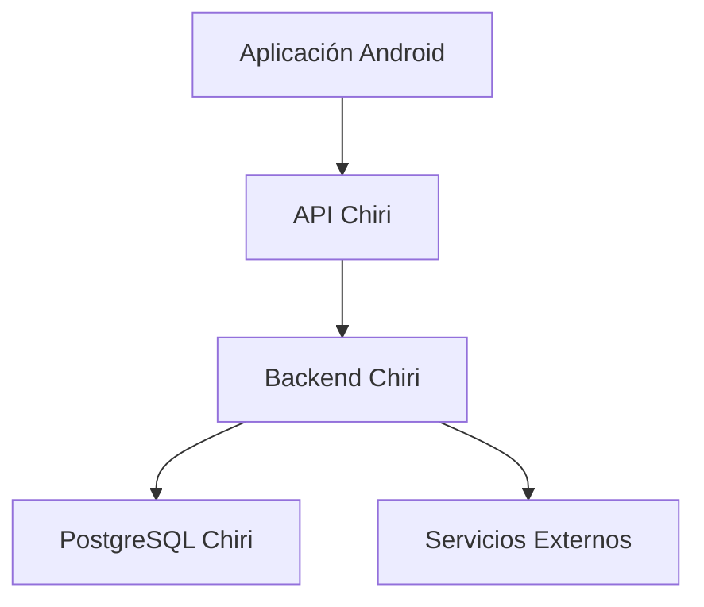

---

# 1.5 Principio de Fuente de Verdad

Cada dato deberá tener un único propietario.

Ejemplo:

Usuario:

```text
PostgreSQL Chiri
        |
        v
Fuente oficial
```

Música:

```text
Navidrome / Music Assistant
        |
        v
Fuente oficial
```

Domótica:

```text
Home Assistant
        |
        v
Fuente oficial
```

---

# 1.6 Tecnología Definida

La base de datos utilizará:

## Motor

* PostgreSQL.

## Acceso

* Backend FastAPI.

## Migraciones

* Herramienta de migración definida posteriormente.

## Ejecución

* Docker.

---

# 1.7 Principios de Diseño

La base de datos seguirá:

* diseño relacional.
* integridad referencial.
* nombres consistentes.
* normalización cuando corresponda.
* migraciones controladas.
* respaldo periódico.

---

# 1.8 Seguridad

La base de datos deberá considerar:

* usuarios con permisos mínimos.
* acceso únicamente desde Backend.
* protección de credenciales.
* copias de seguridad.

---

# 1.9 Principio Arquitectónico

La base de datos deberá responder:

> ¿Esta información pertenece realmente a Chiri?

Si la respuesta es no, deberá permanecer en el servicio especializado correspondiente.

# 2. Arquitectura del Modelo de Datos

La base de datos de Chiri Platform estará organizada mediante un modelo relacional basado en PostgreSQL.

El diseño deberá permitir crecimiento modular, evitando mezclar información de diferentes dominios.

---

# 2.1 Principio de Organización

Los datos deberán organizarse por responsabilidad funcional.

Cada módulo de Chiri tendrá sus propias entidades relacionadas.

Ejemplo conceptual:

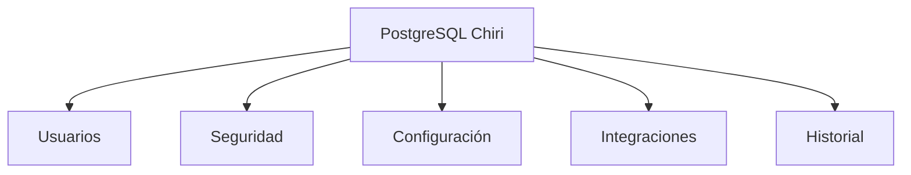

---

# 2.2 Separación por Esquemas

PostgreSQL permitirá organizar información mediante esquemas.

La estructura inicial será conceptual:

```text id="8k5p2m"
chiri

├── identity

├── security

├── configuration

├── integration

└── audit
```

La definición final de esquemas se realizará cuando se diseñen las entidades específicas.

---

# 2.3 Dominio Identity

Responsabilidad:

Gestionar la identidad dentro de Chiri.

Ejemplos futuros:

* usuarios.
* perfiles.
* preferencias básicas.

No almacenará:

* información externa de autenticación que pertenezca a otros servicios.

---

# 2.4 Dominio Security

Responsabilidad:

Gestionar elementos relacionados con seguridad.

Ejemplos:

* sesiones.
* permisos.
* roles.
* accesos.

Su objetivo será controlar qué puede hacer cada usuario dentro de Chiri.

---

# 2.5 Dominio Configuration

Responsabilidad:

Almacenar configuraciones propias de la plataforma.

Ejemplos:

* parámetros generales.
* preferencias del sistema.
* configuraciones de usuario.

---

# 2.6 Dominio Integration

Responsabilidad:

Gestionar información necesaria para conectar servicios externos.

Ejemplos:

* identificadores externos.
* estado de integración.
* configuración de conexión.

No almacenará:

* la base completa del servicio externo.

---

# 2.7 Dominio Audit

Responsabilidad:

Registrar eventos importantes de la plataforma.

Ejemplos:

* acciones del usuario.
* cambios relevantes.
* eventos de seguridad.

---

# 2.8 Modelo Relacional

Las relaciones deberán definirse mediante:

* claves primarias.
* claves foráneas.
* restricciones.
* índices cuando sean necesarios.

Ejemplo:

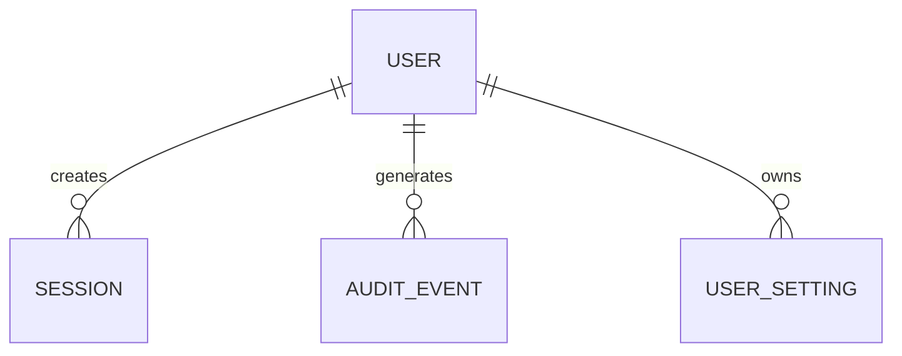

---

# 2.9 Normalización

El diseño deberá buscar equilibrio entre:

* evitar duplicación.
* mantener consultas eficientes.
* simplificar mantenimiento.

No se aplicará normalización extrema si perjudica la simplicidad.

---

# 2.10 Identificadores

Las entidades deberán utilizar identificadores consistentes.

Principios:

* únicos.
* estables.
* independientes de sistemas externos.

Ejemplo:

Correcto:

```text
chiri_user_id
```

Incorrecto:

```text
homeassistant_entity_id
```

como identificador principal.

---

# 2.11 Fechas y Auditoría

Las entidades importantes deberán considerar:

* fecha de creación.
* fecha de actualización.
* usuario responsable cuando corresponda.

Ejemplo conceptual:

```text
created_at
updated_at
created_by
```

---

# 2.12 Principio Arquitectónico

El modelo de datos deberá cumplir:

> Chiri almacena el conocimiento propio de la plataforma y referencia las capacidades de otros servicios sin apropiarse de ellas.

# 3. Convenciones de Diseño de Base de Datos

La base de datos PostgreSQL de Chiri Platform deberá seguir convenciones uniformes para facilitar:

* lectura del modelo.
* mantenimiento.
* evolución.
* integración con Backend.

---

# 3.1 Convención General de Nombres

Se utilizará:

* nombres descriptivos.
* formato snake_case.
* nombres en inglés para objetos técnicos.

Ejemplos:

Correcto:

```sql
user_account

created_at

integration_status
```

Incorrecto:

```sql
tablaUsuario

fechaCreacion

EstadoConexion
```

---

# 3.2 Convención de Tablas

Las tablas deberán:

* representar entidades.
* utilizar nombres en singular.
* ser descriptivas.

Ejemplos:

Correcto:

```text
user
role
device
integration
```

Evitar:

```text
tbl_users
data_user
tmp_information
```

---

# 3.3 Convención de Columnas

Las columnas deberán utilizar:

```text
snake_case
```

Ejemplos:

```text
first_name

last_name

created_at

updated_at
```

---

# 3.4 Claves Primarias

Todas las entidades principales deberán tener una clave primaria.

Ejemplo:

```sql
id
```

Características:

* única.
* estable.
* generada por el sistema.

La clave primaria no deberá depender de identificadores externos.

---

# 3.5 Claves Externas

Las relaciones deberán utilizar claves foráneas.

Ejemplo:

```sql
user_id
integration_id
device_id
```

Esto permitirá:

* integridad referencial.
* relaciones claras.
* consultas consistentes.

---

# 3.6 Tipos de Datos

Se deberán utilizar tipos adecuados de PostgreSQL.

Ejemplos:

Texto:

```sql
varchar
text
```

Fechas:

```sql
timestamp with time zone
```

Estados:

```sql
boolean
enum
```

Identificadores:

```sql
uuid
```

cuando corresponda.

---

# 3.7 Manejo de Fechas

Las entidades importantes deberán registrar tiempo.

Convención:

```sql
created_at
updated_at
```

Utilizando:

```text
UTC como referencia interna
```

La presentación en usuario será responsabilidad de la aplicación.

---

# 3.8 Campos de Estado

Los estados deberán ser claros.

Ejemplo:

Correcto:

```text
status = ACTIVE
```

Evitar:

```text
estado = 1
```

sin documentación.

---

# 3.9 Campos Eliminación Lógica

Cuando sea necesario conservar historial podrá utilizarse eliminación lógica.

Ejemplo:

```sql
deleted_at
```

No se aplicará automáticamente a todas las tablas.

Se evaluará según necesidad.

---

# 3.10 Índices

Los índices deberán crearse cuando exista una necesidad real.

Criterios:

* consultas frecuentes.
* relaciones importantes.
* búsquedas habituales.

No se crearán índices innecesarios.

---

# 3.11 Restricciones

La base de datos deberá proteger la integridad mediante:

* NOT NULL.
* UNIQUE.
* FOREIGN KEY.
* CHECK.

Ejemplo:

```sql
email varchar UNIQUE NOT NULL
```

---

# 3.12 Comentarios de Base de Datos

Cuando una entidad tenga reglas complejas deberá documentarse.

Ejemplo:

```sql
COMMENT ON TABLE user_account
IS 'Usuarios registrados en Chiri Platform';
```

---

# 3.13 Migraciones

Los cambios de estructura deberán realizarse mediante migraciones.

No se modificarán tablas manualmente en producción.

Flujo:

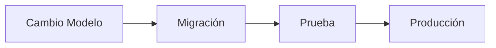

---

# 3.14 Principio Arquitectónico

El diseño de base de datos deberá cumplir:

> Una persona nueva en el proyecto debe poder entender la estructura leyendo los nombres y relaciones.

# 4. Entidades Principales de Chiri

La base de datos de Chiri Platform deberá representar únicamente conceptos propios de la plataforma.

Las entidades iniciales estarán diseñadas para soportar:

* identidad de usuarios.
* seguridad.
* configuración.
* integraciones.
* auditoría.

El modelo podrá evolucionar cuando aparezcan nuevos módulos, respetando la arquitectura definida.

---

# 4.1 Entidad Usuario

La entidad Usuario representa una persona registrada dentro de Chiri.

Responsabilidades:

* identificar usuarios.
* relacionar preferencias.
* asociar permisos.
* registrar actividad.

Ejemplo conceptual:

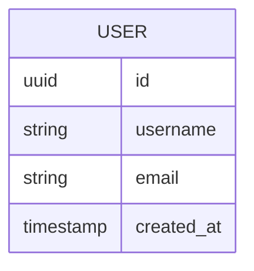

---

# 4.2 Entidad Perfil

El perfil representa información adicional asociada al usuario.

Separar Usuario y Perfil permite:

* mantener identidad separada de información personal.
* ampliar información futura.
* evitar tablas demasiado grandes.

Ejemplos:

* nombre visible.
* imagen.
* preferencias generales.

Relación:

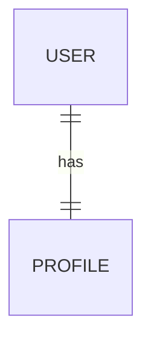

---

# 4.3 Entidad Rol

Los roles representan conjuntos de capacidades dentro de Chiri.

Ejemplos:

* administrador.
* usuario.
* invitado.

Un rol no representa una persona.

Representa un nivel de acceso.

---

# 4.4 Entidad Permiso

Los permisos representan acciones específicas que pueden ejecutarse.

Ejemplos:

* administrar usuarios.
* controlar dispositivos.
* modificar configuraciones.

Relación conceptual:

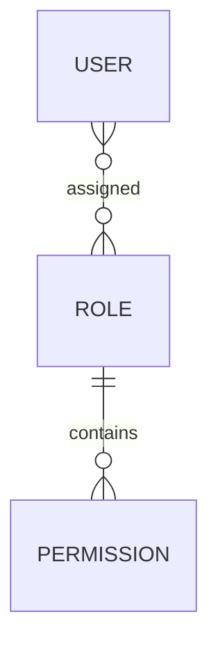

---

# 4.5 Entidad Configuración

Representa configuraciones propias de Chiri.

Puede incluir:

* configuración global.
* configuración por usuario.
* preferencias de funcionamiento.

No almacenará configuraciones internas de servicios externos.

---

# 4.6 Entidad Integración

Representa la conexión entre Chiri y servicios externos.

Ejemplos:

* Home Assistant.
* Music Assistant.
* Jellyfin.

Su responsabilidad será almacenar información necesaria para integración.

No almacenará los datos completos del servicio.

---

# 4.7 Entidad Dispositivo Lógico

Chiri podrá manejar referencias a dispositivos o recursos externos.

Ejemplo:

```text
Chiri

    |

Dispositivo lógico

    |

Home Assistant Entity
```

La entidad de Chiri no reemplazará al dispositivo real.

---

# 4.8 Entidad Auditoría

La auditoría registrará eventos importantes.

Ejemplos:

* inicio de sesión.
* cambio de configuración.
* acciones administrativas.

Modelo conceptual:

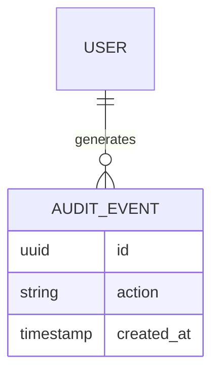

---

# 4.9 Relación General del Dominio

Modelo conceptual inicial:

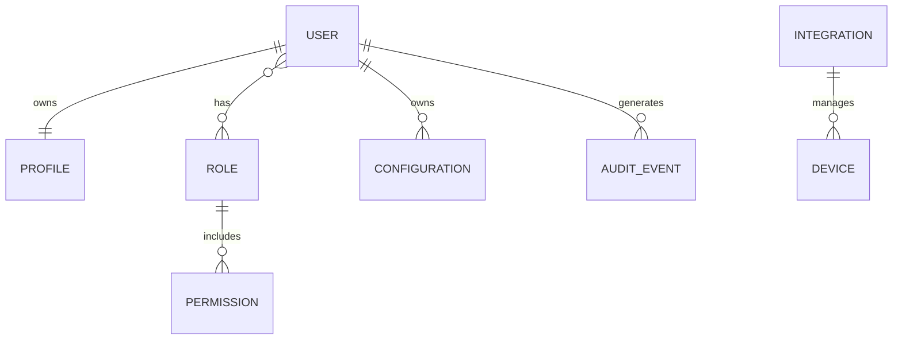

---

# 4.10 Entidades Futuras

La arquitectura permitirá agregar posteriormente entidades como:

* automatizaciones propias.
* asistentes IA.
* rutinas personales.
* historial multimedia.
* preferencias avanzadas.

Estas entidades serán creadas solamente cuando exista una necesidad real.

---

# 4.11 Regla de Diseño

Una entidad nueva deberá responder:

> ¿Este concepto pertenece al dominio de Chiri o pertenece a un servicio externo?

Si pertenece a un servicio externo, Chiri deberá integrarlo, no replicarlo.

---

# 4.12 Principio Arquitectónico

El modelo de datos de Chiri deberá representar:

> El conocimiento y estado propio de la plataforma, manteniendo separados los dominios de los sistemas integrados.

# 5. Diseño Físico de Base de Datos

El diseño físico define la organización real de PostgreSQL para Chiri Platform.

Su objetivo es establecer:

* esquemas.
* tablas.
* relaciones.
* restricciones.
* estructura inicial.

---

# 5.1 Organización Física Inicial

La base de datos utilizará esquemas PostgreSQL para separar responsabilidades.

Estructura inicial propuesta:

```text id="7r5k2p"
PostgreSQL

└── chiri

    ├── identity

    ├── security

    ├── configuration

    ├── integration

    └── audit
```

---

# 5.2 Esquema Identity

Responsabilidad:

Gestionar identidad de usuarios.

Entidades iniciales:

```text id="6m8q3x"
identity

├── user

└── profile
```

---

# 5.3 Tabla User

Responsabilidad:

Representar usuarios registrados dentro de Chiri.

Conceptualmente:

```text id="9n4k7m"
user

id
username
email
status
created_at
updated_at
```

Reglas:

* email único.
* usuario activo/inactivo.
* fechas controladas.

---

# 5.4 Tabla Profile

Responsabilidad:

Información complementaria del usuario.

Conceptualmente:

```text id="3x8m5q"
profile

id
user_id
display_name
avatar
created_at
updated_at
```

Relación:


---

# 5.5 Esquema Security

Responsabilidad:

Control de acceso.

Estructura:

```text id="2m6x9q"
security

├── role

├── permission

├── user_role

└── role_permission
```

---

# 5.6 Modelo de Seguridad

Relación:

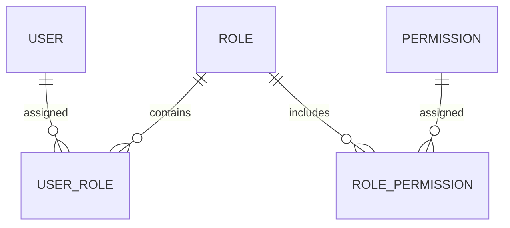

---

# 5.7 Esquema Configuration

Responsabilidad:

Configuraciones propias de Chiri.

Estructura inicial:

```text id="6q8m3x"
configuration

├── system_setting

└── user_setting
```

---

# 5.8 Tabla System Setting

Almacena configuraciones generales.

Ejemplos:

```text id="5p7m2x"
timezone

language

feature_flags
```

---

# 5.9 Tabla User Setting

Almacena preferencias personales.

Ejemplos:

```text id="4q8m5x"
theme

notifications

interface_preferences
```

---

# 5.10 Esquema Integration

Responsabilidad:

Administrar conexiones con servicios externos.

Estructura:

```text id="7m3q9x"
integration

├── service

└── connection
```

---

# 5.11 Tabla Service

Representa servicios conocidos por Chiri.

Ejemplos:

```text id="2x6m8q"
Home Assistant

Music Assistant

Jellyfin
```

---

# 5.12 Tabla Connection

Representa una conexión configurada.

Ejemplo conceptual:

```text id="9q5m4x"
service_id

status

last_check

created_at
```

---

# 5.13 Esquema Audit

Responsabilidad:

Registrar eventos importantes.

Estructura:

```text id="3m7q8x"
audit

└── event
```

---

# 5.14 Tabla Event

Ejemplos:

```text id="8q2m6x"
user_login

configuration_change

permission_change
```

Información:

```text id="5x9m2q"
id

user_id

event_type

data

created_at
```

---

# 5.15 Modelo General Inicial

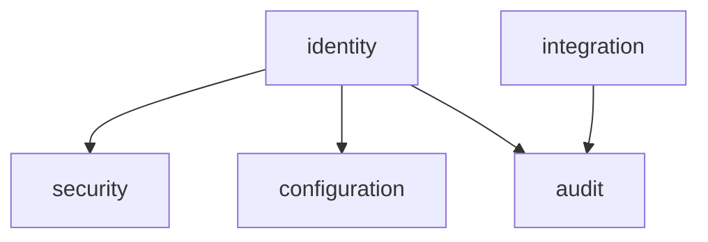

---

# 5.16 Regla de Evolución

Las tablas iniciales no deberán crecer indefinidamente.

Cuando un módulo tenga suficiente complejidad deberá obtener su propio dominio.

Ejemplo:

```text
media

automation

ai

assistant
```

podrán incorporarse posteriormente.

---

# 5.17 Principio Arquitectónico

El diseño físico deberá cumplir:

> Cada dato debe vivir en el esquema responsable de su dominio.


# 6. Migraciones, Versionado y Evolución del Esquema

La evolución de la base de datos de Chiri Platform deberá realizarse mediante migraciones controladas.

Nunca se modificarán estructuras directamente en ambientes productivos.

---

# 6.1 Principio de Migración

Toda modificación de base de datos deberá quedar registrada.

Ejemplos:

* creación de tablas.
* modificación de columnas.
* creación de índices.
* cambios de restricciones.
* eliminación controlada de estructuras.

---

# 6.2 Herramienta de Migraciones

El Backend FastAPI utilizará una herramienta especializada para gestionar cambios del esquema.

La herramienta será definida durante la implementación del Backend.

Requisitos:

* compatible con PostgreSQL.
* integración con Python.
* control de versiones.
* soporte para rollback cuando sea posible.

---

# 6.3 Estructura de Migraciones

Las migraciones deberán mantenerse dentro del proyecto Backend.

Ejemplo conceptual:

```text id="7m4q2x"
server/

└── migrations/

    ├── 001_initial_schema

    ├── 002_create_users

    ├── 003_add_permissions

    └── 004_create_integrations
```

---

# 6.4 Identificación de Cambios

Cada migración deberá tener:

* número o identificador único.
* descripción clara.
* fecha.
* responsable cuando corresponda.

Ejemplo:

```text id="5q8m3x"
004_create_integration_table
```

---

# 6.5 Flujo de Cambio

Todo cambio deberá seguir:

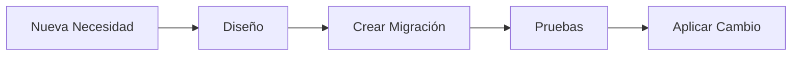

---

# 6.6 Ambientes

Los cambios deberán pasar por ambientes separados:

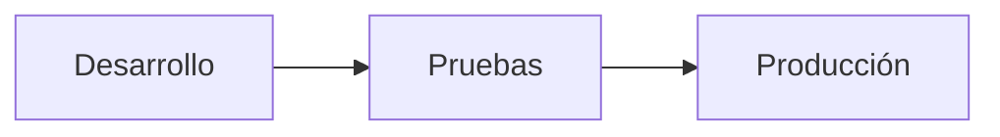

---

# 6.7 Producción

Antes de aplicar cambios en producción se deberá:

* realizar respaldo.
* probar migración.
* verificar compatibilidad.
* registrar el cambio.

---

# 6.8 Rollback

Cuando sea técnicamente posible, las migraciones deberán permitir reversión.

Ejemplo:

```text id="3q7m9x"
Versión 2

    |

Rollback

    |

Versión 1
```

No todos los cambios permiten rollback automático.

---

# 6.9 Compatibilidad Backend / Base de Datos

Los cambios deberán mantener compatibilidad con el Backend.

Ejemplo:

Incorrecto:

```text id="9k3m5x"
Eliminar columna usada por API activa
```

Correcto:

```text id="2m8q6x"
Agregar nueva columna

Migrar datos

Actualizar API

Eliminar columna antigua posteriormente
```

---

# 6.10 Respaldo Antes de Cambios

Antes de modificaciones importantes:

Se deberá generar:

* copia de seguridad.
* verificación de recuperación.

---

# 6.11 Historial del Esquema

El historial de migraciones será la referencia oficial de evolución.

No se confiará en:

* memoria del desarrollador.
* documentos externos sin actualización.
* cambios manuales.

---

# 6.12 Principio Arquitectónico

La evolución de PostgreSQL deberá cumplir:

> El estado actual de la base de datos debe poder explicarse mediante la historia de sus migraciones.


# 7. Seguridad y Protección de Datos PostgreSQL

La base de datos PostgreSQL de Chiri Platform deberá implementarse aplicando principios de seguridad por defecto.

El objetivo será proteger:

* información de usuarios.
* configuraciones.
* integridad del sistema.
* disponibilidad de datos.

---

# 7.1 Principio de Acceso Controlado

La base de datos no deberá ser accedida directamente por clientes externos.

El flujo oficial será:

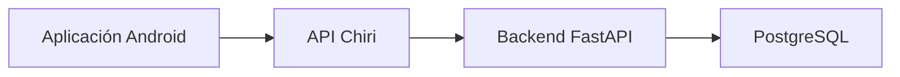

---

# 7.2 Usuarios de Base de Datos

PostgreSQL deberá utilizar usuarios separados según responsabilidad.

Ejemplo conceptual:

```text id="5x8m3q"
postgres_admin

    |

    Administración

----------------

chiri_backend

    |

    Operación normal de la aplicación
```

---

# 7.3 Principio de Mínimos Privilegios

El usuario utilizado por Chiri Backend deberá tener únicamente permisos necesarios.

Debe poder:

* consultar datos.
* insertar información.
* actualizar información.

No debería utilizar:

* permisos administrativos completos.
* creación de usuarios.
* modificación global del servidor.

---

# 7.4 Credenciales

Las credenciales de PostgreSQL deberán:

* mantenerse fuera del código fuente.
* utilizar variables de entorno.
* almacenarse de forma segura.

Ejemplo:

```text id="4m7q2x"
DATABASE_URL

POSTGRES_USER

POSTGRES_PASSWORD
```

---

# 7.5 Conexiones Seguras

La comunicación con PostgreSQL deberá considerar:

* conexiones internas seguras.
* restricciones de red.
* usuarios autenticados.

En la arquitectura inicial:

```text id="7q2m8x"
Backend

   |

Red Docker interna

   |

PostgreSQL
```

---

# 7.6 Protección de Datos Sensibles

La base de datos deberá evitar almacenar información sensible innecesaria.

Ejemplos:

No almacenar:

* contraseñas en texto plano.
* secretos externos.
* claves privadas.

---

# 7.7 Contraseñas de Usuarios

Si Chiri administra usuarios propios:

Las contraseñas deberán almacenarse mediante:

* algoritmos de hash seguros.
* salt individual.
* mecanismos actualizados.

Nunca:

```text id="3m8q5x"
password = "123456"
```

---

# 7.8 Auditoría

Los eventos importantes deberán registrarse.

Ejemplos:

* inicio de sesión.
* cambios de permisos.
* cambios administrativos.

Esto permitirá:

* investigar problemas.
* conocer cambios realizados.

---

# 7.9 Separación de Secretos

Los secretos de servicios externos deberán mantenerse separados.

Ejemplo:

Incorrecto:

```text id="6q4m8x"
Tabla Integration

password_homeassistant
token_musicassistant
```

Correcto:

```text id="9m2q5x"
Referencia segura

+

gestión de secretos
```

La estrategia final será definida en `070_Seguridad.md`.

---

# 7.10 Copias de Seguridad

PostgreSQL deberá contar con respaldo.

Se deberá definir:

* frecuencia.
* ubicación.
* retención.
* pruebas de restauración.

---

# 7.11 Recuperación

Un respaldo solo será válido si puede restaurarse.

Proceso:

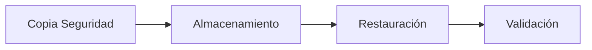

---

# 7.12 Principio Arquitectónico

La seguridad de PostgreSQL deberá cumplir:

> La base de datos debe proteger la información incluso si un componente superior tiene un problema.

# 8. Rendimiento y Optimización de PostgreSQL

La base de datos de Chiri Platform deberá diseñarse buscando equilibrio entre:

* rendimiento.
* simplicidad.
* mantenibilidad.
* consumo adecuado de recursos.

La optimización deberá estar basada en necesidades reales del sistema.

---

# 8.1 Principio de Rendimiento

La primera estrategia será un buen diseño.

Antes de optimizar se deberá revisar:

* modelo de datos.
* consultas.
* relaciones.
* índices existentes.

---

# 8.2 Índices

Los índices serán utilizados para mejorar consultas frecuentes.

Se crearán considerando:

* columnas utilizadas en búsquedas.
* claves foráneas.
* ordenamientos frecuentes.
* filtros habituales.

Ejemplo:

```sql id="6m8q3x"
user_id

created_at

status
```

---

# 8.3 Evitar Índices Innecesarios

Cada índice tiene un costo.

Puede afectar:

* espacio utilizado.
* velocidad de escritura.
* mantenimiento.

Por ello:

> No se crearán índices sin una razón técnica.

---

# 8.4 Diseño de Consultas

Las consultas deberán:

* ser claras.
* evitar operaciones innecesarias.
* utilizar relaciones correctamente.

Se evitará:

* traer información que no se necesita.
* consultas repetitivas.
* duplicación de datos sin justificación.

---

# 8.5 Capa Backend

La optimización principal deberá realizarse correctamente en la capa de aplicación.

Ejemplo:

```text id="8q5m2x"
Android

   |

API Chiri

   |

Backend optimiza consulta

   |

PostgreSQL
```

Android no realizará consultas directas.

---

# 8.6 Crecimiento de Datos

Chiri deberá considerar crecimiento progresivo.

Posibles datos crecientes:

* auditoría.
* historial.
* eventos.
* registros de integración.

---

# 8.7 Control de Historial

Los datos históricos deberán gestionarse correctamente.

Cuando un volumen aumente podrá evaluarse:

* archivado.
* limpieza programada.
* particionamiento.

No se implementará antes de ser necesario.

---

# 8.8 Mantenimiento PostgreSQL

Se deberán considerar tareas periódicas:

* actualización de estadísticas.
* revisión de espacio.
* análisis de consultas.
* mantenimiento interno.

---

# 8.9 Monitoreo

La plataforma deberá permitir observar:

* consumo de recursos.
* tiempos de consulta.
* errores.
* crecimiento de almacenamiento.

---

# 8.10 Rendimiento en Raspberry Pi

La base de datos se ejecutará inicialmente en:

```text
Raspberry Pi 4B
```

Por ello se deberá considerar:

* consumo de memoria.
* uso de almacenamiento.
* cantidad de conexiones.
* carga de servicios simultáneos.

---

# 8.11 Límites Iniciales

En la primera versión no se aplicarán optimizaciones avanzadas como:

* replicación.
* clústeres.
* distribución geográfica.

Serán consideradas únicamente si el crecimiento del proyecto lo requiere.

---

# 8.12 Principio Arquitectónico

El rendimiento deberá cumplir:

> Primero un diseño correcto; después optimización basada en evidencia.

# 9. Respaldo, Recuperación y Continuidad Operativa

La base de datos PostgreSQL de Chiri Platform deberá contar con una estrategia de respaldo y recuperación que permita restaurar la información ante fallos.

El objetivo será proteger:

* datos de usuarios.
* configuraciones.
* permisos.
* historial.
* información propia de la plataforma.

---

# 9.1 Principio de Respaldo

Los respaldos deberán permitir:

* recuperar información perdida.
* reconstruir el sistema.
* reducir tiempo de recuperación.

---

# 9.2 Tipos de Respaldo

La estrategia podrá considerar:

## Respaldo Completo

Copia completa de la base de datos.

Ventajas:

* restauración sencilla.
* reconstrucción completa.

---

## Respaldo Incremental

Copia únicamente de cambios posteriores.

Ventajas:

* menor consumo de almacenamiento.
* menor tiempo de ejecución.

---

La implementación inicial se definirá según capacidad del servidor.

---

# 9.3 Frecuencia de Respaldo

La frecuencia deberá evaluarse según importancia de los datos.

Ejemplo inicial:

```text id="7q3m5x"
Configuración crítica

    Backup frecuente


Historial

    Backup programado
```

La frecuencia definitiva se establecerá durante el despliegue.

---

# 9.4 Ubicación de Respaldos

Los respaldos no deberán permanecer únicamente en el mismo almacenamiento del servidor.

Motivo:

Si falla el disco principal:

```text id="9m4q7x"
Servidor falla

+

Backup en mismo disco

=

No existe recuperación
```

---

# 9.5 Estrategia Inicial

La arquitectura podrá considerar:

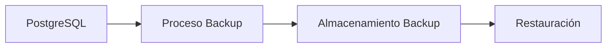

---

# 9.6 Restauración

Un respaldo deberá ser probado.

Proceso:

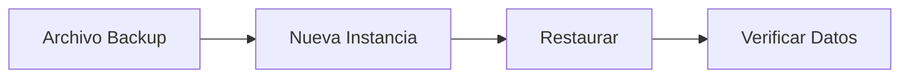

---

# 9.7 Objetivos de Recuperación

Se deberán considerar dos conceptos:

## RPO

Cantidad máxima de datos que podría perderse.

Ejemplo:

```text id="3m7q9x"
Último backup:
00:00

Falla:
06:00

Pérdida máxima:
6 horas
```

---

## RTO

Tiempo necesario para recuperar el servicio.

Ejemplo:

```text id="8q5m2x"
Falla

↓

Restauración

↓

Servicio disponible
```

---

# 9.8 Protección del Backup

Los respaldos deberán protegerse mediante:

* acceso restringido.
* almacenamiento seguro.
* control de versiones.
* eliminación programada de copias antiguas.

---

# 9.9 Pruebas de Recuperación

Periódicamente deberá verificarse:

* que el backup sea válido.
* que pueda restaurarse.
* que los datos sean correctos.

Un backup no probado no garantiza recuperación.

---

# 9.10 Continuidad en Raspberry Pi

Debido a que Chiri funcionará inicialmente en Raspberry Pi 4B, deberán considerarse:

* protección del almacenamiento.
* disponibilidad eléctrica.
* recuperación ante reinicio.
* restauración de servicios Docker.

---

# 9.11 Principio Arquitectónico

La continuidad operativa deberá cumplir:

> Los datos importantes de Chiri deben sobrevivir a fallos del hardware o del software.
# 10. Conclusión y Reglas Finales de Base de Datos

La base de datos PostgreSQL de Chiri Platform v1.0 queda definida como el sistema de almacenamiento de información propia de la plataforma.

Su diseño está orientado a:

* estabilidad.
* seguridad.
* crecimiento controlado.
* mantenimiento a largo plazo.

---

# 10.1 Decisiones Confirmadas

La base de datos utilizará:

* PostgreSQL.
* modelo relacional.
* organización por dominios.
* migraciones controladas.
* acceso exclusivo mediante Backend.

---

# 10.2 Responsabilidad Confirmada

PostgreSQL almacenará:

* usuarios.
* perfiles.
* permisos.
* configuraciones propias.
* información de integración.
* auditoría.

---

# 10.3 Límites Confirmados

PostgreSQL NO será utilizado para almacenar:

* archivos multimedia.
* bibliotecas musicales.
* videos.
* estados internos completos de Home Assistant.
* datos internos de servicios externos.

Cada servicio especializado mantiene su propia información.

---

# 10.4 Relación Final de Arquitectura

La arquitectura queda:

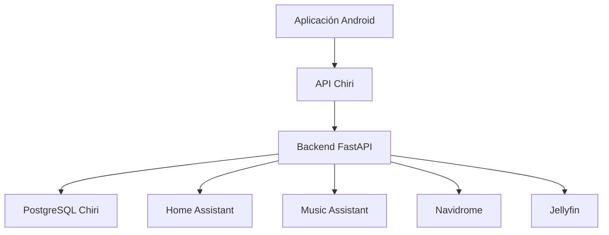

---

# 10.5 Reglas que no deben romperse

## Regla 1

Los clientes nunca accederán directamente a PostgreSQL.

---

## Regla 2

Cada dato debe tener un propietario definido.

---

## Regla 3

No duplicar información que pertenece a otro servicio.

---

## Regla 4

Todo cambio estructural debe realizarse mediante migraciones.

---

## Regla 5

La seguridad debe estar integrada desde el diseño inicial.

---

## Regla 6

La optimización debe responder a necesidades reales.

---

# 10.6 Evolución Futura

La base de datos podrá crecer incorporando nuevos dominios:

Ejemplos:

```text
ai

automation

personal

notification

analytics
```

pero solamente cuando exista una necesidad real.

---

# 10.7 Estado del Documento

El documento:

```text
050_BaseDatos.md
```

queda definido como referencia oficial para el diseño de PostgreSQL de Chiri Platform v1.0.

Cualquier implementación futura deberá respetar:

* arquitectura definida.
* separación de dominios.
* seguridad.
* migraciones.
* reglas de mantenimiento.

---

# Declaración Final

La base de datos de Chiri Platform v1.0 será un componente estable y controlado de la plataforma.

No será el centro del sistema, sino una pieza especializada dentro de una arquitectura modular.

Principio final:

> Chiri almacena lo que conoce; integra lo que no necesita poseer.
