# Chiri Platform

**Documento:** 060_API.md

**Versión:** 1.0

**Estado:** Cerrado

---

# 1. Introducción

La API de Chiri Platform será la interfaz oficial de comunicación entre los clientes, el Backend y los servicios integrados.

Su objetivo será proporcionar una capa estable, segura y organizada para acceder a las capacidades de la plataforma.

---

# 1.1 Objetivo de la API

La API deberá permitir:

* comunicación con clientes.
* ejecución de acciones.
* consulta de información.
* integración con servicios externos.
* evolución futura de la plataforma.

---

# 1.2 Principio Fundamental

La API será la única puerta de entrada a Chiri.

Arquitectura:

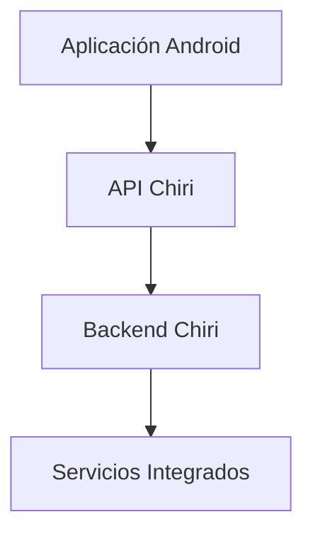

---

# 1.3 Responsabilidad de la API

La API será responsable de:

* recibir solicitudes.
* validar información.
* controlar autenticación.
* ejecutar casos de uso.
* devolver respuestas.
* ocultar detalles internos.

---

# 1.4 Lo que NO hará la API

La API no será responsable de:

* lógica propia de Home Assistant.
* reproducción multimedia directa.
* almacenamiento de archivos.
* reemplazar servicios especializados.

Ejemplo:

Incorrecto:

```text
API Chiri
     |
     └── Crear nuevo sistema multimedia
```

Correcto:

```text
API Chiri
     |
     └── Solicitar acción a Music Assistant/Jellyfin
```

---

# 1.5 Tecnología Definida

La API será desarrollada utilizando:

## Backend

* Python.
* FastAPI.

## Comunicación

* HTTPS.
* REST.
* JSON.

## Documentación

* OpenAPI / Swagger.

---

# 1.6 Clientes de la API

Los principales consumidores serán:

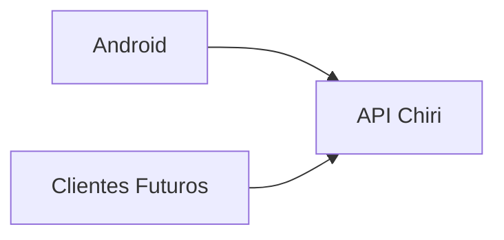

La arquitectura permitirá incorporar posteriormente:

* interfaz web.
* asistentes de voz.
* automatizaciones.
* otros dispositivos.

---

# 1.7 Principios de Diseño

La API deberá cumplir:

* contratos claros.
* respuestas consistentes.
* versionado.
* seguridad.
* documentación.
* compatibilidad futura.

---

# 1.8 Regla Principal

Toda nueva funcionalidad deberá responder:

> ¿Esta capacidad debe exponerse mediante API?

Si la respuesta es sí, deberá diseñarse primero el contrato antes del código.

---

# 1.9 Principio Arquitectónico

La API de Chiri será:

> La capa de abstracción que permite que la plataforma evolucione sin depender de clientes o servicios específicos.

# 2. Arquitectura Interna de la API

La API Chiri estará organizada mediante capas separadas para mantener:

* claridad.
* mantenibilidad.
* facilidad de pruebas.
* evolución controlada.

---

# 2.1 Arquitectura General

La estructura interna será:

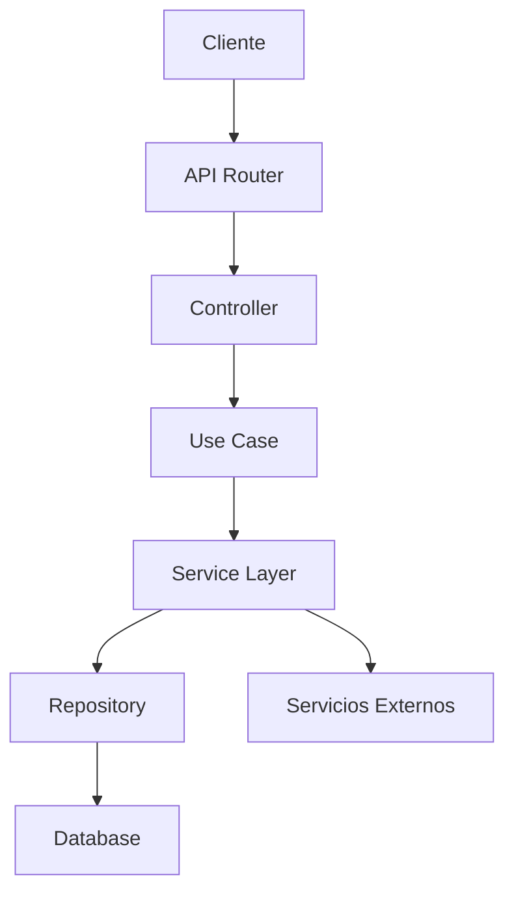

---

# 2.2 Capa Router

## Responsabilidad

Gestiona los puntos de entrada HTTP.

Funciones:

* definir endpoints.
* recibir solicitudes.
* validar parámetros básicos.
* enviar respuesta.

Ejemplo:

```text id="7m3q8x"
GET /api/v1/home/status

POST /api/v1/media/play
```

---

# 2.3 Capa Controller

## Responsabilidad

Actúa como intermediario entre HTTP y la lógica de aplicación.

Responsabilidades:

* recibir modelos de entrada.
* llamar casos de uso.
* transformar respuestas.

No deberá contener:

* lógica de negocio.
* consultas SQL.
* llamadas directas a servicios externos.

---

# 2.4 Capa Use Case

## Responsabilidad

Representa acciones que Chiri puede realizar.

Ejemplos:

```text id="3m8q5x"
GetHomeStatus

PlayMusic

GetUserProfile

ExecuteAutomation
```

Los casos de uso representan capacidades, no tablas.

---

# 2.5 Capa Service

## Responsabilidad

Contiene lógica específica de dominio.

Ejemplos:

* comunicación con Home Assistant.
* integración multimedia.
* procesamiento de datos.

---

# 2.6 Capa Repository

## Responsabilidad

Gestiona acceso a datos persistentes.

Puede comunicarse con:

* PostgreSQL.
* almacenamiento interno.

No deberá ser utilizado directamente por clientes.

---

# 2.7 Modelos de Datos

La API deberá separar:

* modelos de entrada.
* modelos internos.
* modelos de respuesta.

Ejemplo:

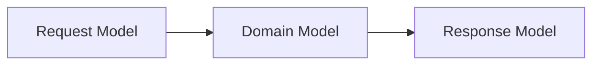

---

# 2.8 Flujo de una Solicitud

Ejemplo:

Usuario solicita encender una luz.

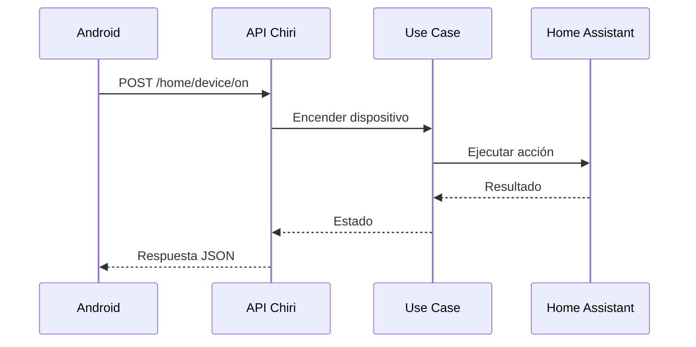

---

# 2.9 Manejo de Dependencias

Las dependencias deberán seguir:

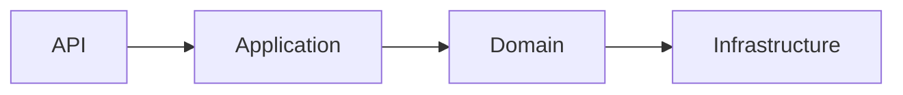

Las capas superiores no deberán conocer detalles internos innecesarios.

---

# 2.10 Ventajas de esta Arquitectura

Permite:

* cambiar servicios externos sin afectar Android.
* probar lógica sin servidor completo.
* mantener código organizado.
* agregar nuevas capacidades.

---

# 2.11 Regla Arquitectónica

La API deberá cumplir:

> Un endpoint no implementa una solución; expone una capacidad de la plataforma.

# 3. Diseño de Endpoints y Versionado de API

La API de Chiri Platform utilizará una estructura organizada de endpoints basada en recursos y capacidades.

El diseño deberá priorizar:

* claridad.
* estabilidad.
* compatibilidad futura.
* facilidad de uso.

---

# 3.1 Arquitectura de URL

La estructura base será:

```text id="7m2q5x"
https://servidor-chiri/api/v1/recurso
```

Ejemplo:

```text id="5q8m3x"
GET /api/v1/users
```

---

# 3.2 Versionado

La API utilizará versionado explícito.

Formato:

```text id="9x4m7q"
/api/v1/
```

Ejemplo:

```text id="3m8q2x"
GET /api/v1/profile
```

---

# 3.3 Motivo del Versionado

El versionado permite:

* evolución controlada.
* mantener compatibilidad.
* introducir cambios importantes.

Ejemplo:

```text
v1

    |

    v2
```

Ambas versiones pueden coexistir durante una transición.

---

# 3.4 Recursos vs Acciones

Los endpoints deberán representar recursos o capacidades claras.

Preferencia:

```text id="6q8m3x"
GET /api/v1/devices
```

Evitar:

```text id="8m2q5x"
GET /api/v1/getAllDevices
```

---

# 3.5 Métodos HTTP

Se utilizarán métodos estándar:

| Método | Uso                             |
| ------ | ------------------------------- |
| GET    | Consultar información           |
| POST   | Crear o ejecutar acciones       |
| PUT    | Actualizar información completa |
| PATCH  | Actualizar parcialmente         |
| DELETE | Eliminar información            |

---

# 3.6 Ejemplos Conceptuales

Usuarios:

```text id="4m7q2x"
GET

/api/v1/users
```

Crear usuario:

```text id="8q5m3x"
POST

/api/v1/users
```

Perfil:

```text id="2x6m9q"
GET

/api/v1/profile
```

---

# 3.7 Acciones Especiales

Algunas capacidades no representan un recurso físico.

Ejemplo:

Reproducir música:

```text id="9m4q8x"
POST

/api/v1/media/play
```

Encender dispositivo:

```text id="5x7m2q"
POST

/api/v1/devices/{id}/turn-on
```
---

# 3.8 Endpoints de Autenticación

La autenticación de usuarios será gestionada exclusivamente mediante la API de Chiri Platform.

Los clientes no deberán acceder directamente al sistema de autenticación interno, PostgreSQL ni otros servicios internos.

Los endpoints de autenticación deberán permitir:

* iniciar sesión.
* renovar la sesión.
* cerrar sesión.
* consultar el estado de la sesión.

El contrato definitivo de cada endpoint deberá definir:

* método HTTP.
* ruta.
* datos de entrada.
* validaciones.
* respuesta.
* códigos HTTP.
* códigos de error.

Los endpoints previstos son:

```text
Inicio de sesión
Renovación de sesión
Cierre de sesión
Consulta de sesión
```
---

# 3.9 Convención de Nombres

Los endpoints deberán utilizar:

* minúsculas.
* plural para colecciones.
* nombres descriptivos.
* separación con guiones cuando sea necesario.

Ejemplo:

Correcto:

```text id="3q8m5x"
user-settings
```

Evitar:

```text id="6m2q7x"
UserSettings
```
---

# 3.10 Respuestas Consistentes

Todas las respuestas deberán seguir una estructura uniforme.

Ejemplo conceptual:

```json id="4m8q2x"
{
  "success": true,
  "data": {},
  "message": null
}
```

---

# 3.11 Errores Consistentes

Los errores deberán tener formato común.

Ejemplo:

```json id="7q3m9x"
{
  "success": false,
  "error": {
    "code": "DEVICE_NOT_FOUND",
    "message": "Device does not exist"
  }
}
```

---

# 3.12 Cambios Incompatibles

No se deberán modificar endpoints existentes de forma que rompan clientes.

Ejemplo incorrecto:

Antes:

```json
{
 "name":"Juan"
}
```

Después:

```json
{
 "full_name":"Juan"
}
```

sin transición.

---

# 3.13 Documentación

Toda API deberá estar documentada mediante:

* OpenAPI.
* Swagger UI.
* modelos de solicitud.
* modelos de respuesta.

---

# 3.14 Regla Arquitectónica

El diseño de endpoints deberá cumplir:

> Una API estable permite que Chiri evolucione sin obligar a reconstruir sus clientes.

# 4. Autenticación y Autorización de API

La API de Chiri Platform deberá implementar mecanismos de autenticación y autorización para controlar el acceso a las capacidades de la plataforma.

---

# 4.1 Diferencia entre Autenticación y Autorización

## Autenticación

Responde:

> ¿Quién eres?

Ejemplo:

* usuario identificado.
* dispositivo autorizado.
* cliente válido.

---

## Autorización

Responde:

> ¿Qué puedes hacer?

Ejemplo:

* consultar información.
* ejecutar acciones.
* administrar configuración.

---

# 4.2 Flujo General de Seguridad

El acceso seguirá:

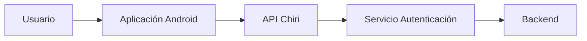

---

# 4.3 Principio de Acceso

La API no deberá confiar únicamente en que la solicitud viene de Android.

Toda solicitud deberá validar:

* identidad.
* permisos.
* estado de sesión.

---

# 4.4 Sesiones y Tokens

La autenticación de Chiri Platform utilizará una arquitectura basada en sesiones y tokens.

El flujo general será:

```text
Usuario inicia sesión
        |
Servidor valida identidad
        |
Servidor crea sesión
        |
Servidor entrega credenciales de sesión
        |
Cliente utiliza la sesión en solicitudes posteriores
```

# 4.5 Token de Acceso

El access token será utilizado por el cliente para autenticarse ante los endpoints protegidos de la API.

Las solicitudes autenticadas utilizarán el esquema:

```http
Authorization: Bearer TOKEN
```

# 4.6 Renovación de Sesión

La plataforma utilizará un mecanismo de renovación de sesión para evitar que el usuario tenga que introducir nuevamente sus credenciales cuando el access token haya expirado y la sesión continúe siendo válida.

La arquitectura contempla:

* access token.
* refresh token.

El refresh token será utilizado exclusivamente para solicitar una nueva sesión de acceso.

El Backend deberá validar:

* autenticidad del refresh token.
* vigencia del refresh token.
* estado de la sesión.
* estado del usuario.

Cuando la renovación sea válida, la API deberá entregar las nuevas credenciales de acceso definidas por el contrato de autenticación.

Un refresh token inválido, expirado o revocado deberá provocar el cierre de la sesión y requerir una nueva autenticación.

Las duraciones concretas de access token y refresh token deberán definirse en la configuración de seguridad de la plataforma.

---

# 4.7 Inicio de Sesión

El inicio de sesión permitirá autenticar a un usuario mediante la API de Chiri Platform.

La autenticación utilizará:

* usuario o correo electrónico.
* contraseña.

Flujo:

```text
Android
   |
   | Credenciales
   v
API Chiri
   |
   v
Servicio de Autenticación
   |
   v
Backend
   |
   v
Validación del usuario
   |
   v
Creación de sesión
   |
   v
Respuesta de autenticación
```
---

# 4.8 Endpoint de Renovación de Sesión

La renovación de sesión permitirá obtener nuevas credenciales de acceso utilizando un refresh token válido.

Flujo:

```text
Cliente
   |
   | Refresh Token
   v
API Chiri
   |
   v
Validación de sesión
   |
   v
Nueva credencial de acceso
```

# 4.9 Cierre de Sesión

El cierre de sesión permitirá finalizar una sesión autenticada.

El cierre de sesión deberá provocar la invalidación de la sesión correspondiente en el Backend cuando la arquitectura de sesión lo permita.

El cliente deberá eliminar de su almacenamiento local las credenciales asociadas a la sesión.

Flujo:

```text
Cliente
   |
   | Solicitud de cierre
   v
API Chiri
   |
   v
Invalidación de sesión
   |
   v
Respuesta
   |
   v
Cliente elimina credenciales locales
```

# 4.10 Consulta del Estado de Sesión

La API deberá permitir determinar si una sesión continúa siendo válida.

La validación definitiva deberá realizarse en el Backend.

El cliente no deberá considerar válida una sesión únicamente porque exista un access token almacenado localmente.

La validación deberá considerar como mínimo:

* existencia de la sesión.
* vigencia.
* autenticidad de las credenciales.
* estado del usuario.
* permisos correspondientes.

El endpoint definitivo para consultar el estado de sesión deberá establecerse como parte del contrato de autenticación.

# 4.11 Roles y Permisos

La autorización utilizará el modelo definido en Base de Datos.

Relación:

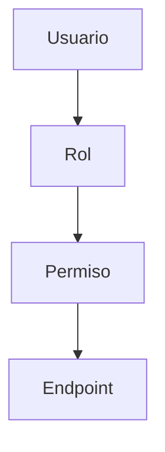

# 4.12 Ejemplo de Control

Usuario normal:

Puede:

* consultar estado.
* ejecutar acciones permitidas.

No puede:

* administrar usuarios.
* cambiar configuración global.

Administrador:

Puede:

* gestionar plataforma.
* modificar configuraciones críticas.

---

# 4.13 Protección de Endpoints

Cada endpoint deberá definir:

* si requiere autenticación.
* qué permisos necesita.

Ejemplo conceptual:

```text id="4x8m2q"
/users

Requiere:
ADMIN_USER
```

---

# 4.14 Comunicación Segura

La comunicación deberá utilizar:

* HTTPS.
* certificados válidos.
* protección contra acceso no autorizado.

---

# 4.15 Manejo de Sesiones

La plataforma deberá considerar:

* expiración.
* cierre remoto.
* invalidación de tokens.
* control de dispositivos autorizados.

---

# 4.16 Clientes Futuros

La autenticación deberá permitir agregar posteriormente:

* aplicación web.
* tablet.
* asistentes de voz.
* otros clientes.

Sin cambiar el núcleo de seguridad.

---

# 4.17 Principio Arquitectónico

La seguridad de la API deberá cumplir:

> Ningún cliente tiene privilegios por existir; todo acceso debe ser autenticado y autorizado.

# 5. Integración de API con Servicios Externos

La API de Chiri será la capa intermedia entre los clientes y los servicios externos.

Los clientes nunca deberán comunicarse directamente con estos servicios.

---

# 5.1 Arquitectura de Integración

Flujo general:

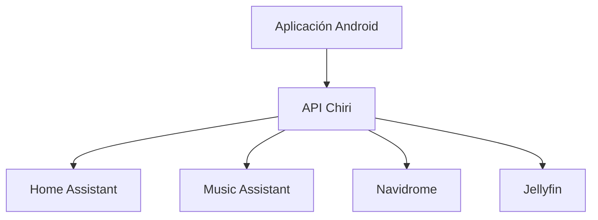

---

# 5.2 Responsabilidad del Backend

El Backend será responsable de:

* conocer cómo comunicarse con cada servicio.
* transformar respuestas externas.
* ocultar diferencias entre plataformas.
* manejar errores.

---

# 5.3 Principio de Abstracción

Android no deberá conocer detalles como:

* dirección interna de Home Assistant.
* puertos Docker.
* tokens internos.
* APIs específicas externas.

Ejemplo:

Incorrecto:

```text
Android
   |
   | REST Home Assistant
   |
Home Assistant
```

Correcto:

```text
Android
   |
   | API Chiri
   |
Backend
   |
Home Assistant
```

---

# 5.4 Integración con Home Assistant

Responsabilidad:

Controlar capacidades de domótica.

Ejemplos:

* estado de dispositivos.
* ejecución de acciones.
* lectura de sensores.

Chiri deberá consumir Home Assistant, no replicarlo.

---

# 5.5 Integración con Music Assistant

Responsabilidad:

Gestionar capacidades musicales.

Ejemplos:

* búsqueda.
* reproducción.
* selección de contenido.

Chiri no almacenará:

* biblioteca musical.
* archivos de audio.
* metadatos completos.

---

# 5.6 Integración con Navidrome

Responsabilidad:

Acceso a biblioteca musical personal.

Chiri podrá:

* solicitar información.
* mostrar contenido.
* coordinar acciones.

Navidrome seguirá siendo propietario de su biblioteca.

---

# 5.7 Integración con Jellyfin

Responsabilidad:

Gestionar contenido multimedia.

Chiri podrá:

* consultar contenido.
* iniciar acciones.
* presentar información.

Jellyfin mantiene:

* usuarios multimedia.
* biblioteca.
* reproducción.

---

# 5.8 Adaptadores de Integración

Cada servicio deberá tener una capa independiente.

Ejemplo:

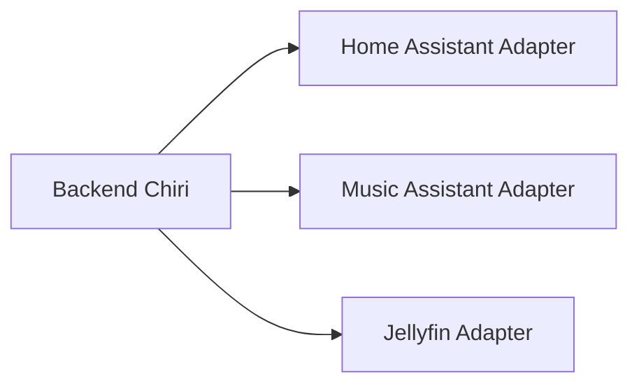

---

# 5.9 Ventaja de Adaptadores

Permiten:

* cambiar servicios.
* actualizar versiones.
* aislar problemas.
* realizar pruebas independientes.

---

# 5.10 Manejo de Errores Externos

Los errores externos deberán transformarse.

Ejemplo:

Servicio externo:

```text
Connection refused
```

Respuesta Chiri:

```json
{
 "error": {
   "code": "SERVICE_UNAVAILABLE"
 }
}
```

---

# 5.11 Estado de Integraciones

Chiri deberá poder conocer:

* servicio disponible.
* conexión activa.
* última comunicación.
* errores recientes.

---

# 5.12 Tiempo de Respuesta

Las integraciones deberán considerar:

* operaciones rápidas.
* límites de espera.
* manejo de fallos.
* evitar bloquear la API.

---

# 5.13 Principio Arquitectónico

La integración deberá cumplir:

> Los servicios externos pueden cambiar; Chiri debe mantener estable su contrato interno.

# 6. Modelos de Datos, Solicitudes y Respuestas API

La API de Chiri Platform deberá utilizar modelos de datos definidos para garantizar comunicación consistente entre clientes y Backend.

---

# 6.1 Principio de Contratos

Cada endpoint deberá definir:

* datos de entrada.
* validaciones.
* respuesta esperada.
* posibles errores.

El contrato deberá existir antes de implementar código.

---

# 6.2 Separación de Modelos

La API deberá separar:

* Request Models.
* Response Models.
* Domain Models.

Ejemplo:

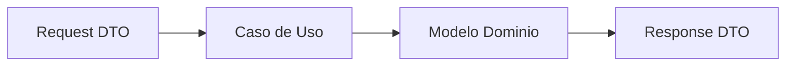

---

# 6.3 Request Models

Representan información enviada por el cliente.

Ejemplo:

Solicitud para cambiar configuración:

```json
{
  "theme": "dark"
}
```

Responsabilidad:

* recibir datos.
* validar formato.
* evitar datos incorrectos.
---

# 6.4 Modelos de Autenticación

Los endpoints de autenticación deberán utilizar modelos específicos para solicitudes y respuestas.

Los modelos deberán mantenerse separados de los modelos internos del dominio.

---

## 6.4.1 Login Request

El modelo de inicio de sesión deberá permitir proporcionar:

* usuario o correo electrónico.
* contraseña.

La estructura definitiva de campos deberá formar parte del contrato de autenticación.

---

## 6.4.2 Login Response

La respuesta de inicio de sesión deberá contener las credenciales de sesión definidas por la plataforma.

Como mínimo deberá contemplar:

* access token.
* refresh token.

Cuando corresponda, podrá incluir información del usuario autenticado y los datos necesarios para determinar sus permisos.

La estructura definitiva deberá establecerse antes de implementar los clientes.

---

## 6.4.3 Refresh Request

El modelo de renovación deberá contener el refresh token necesario para solicitar una nueva credencial de acceso.

---

## 6.4.4 Refresh Response

La respuesta de renovación deberá contener las nuevas credenciales de acceso definidas por la plataforma.

---

## 6.4.5 Logout Request

El modelo de cierre de sesión deberá contener la información necesaria para identificar la sesión que deberá ser invalidada.

---

## 6.4.6 Session Response

La respuesta de consulta de sesión deberá permitir determinar el estado de la sesión y, cuando corresponda, proporcionar la información básica del usuario autenticado.

---

# 6.5 Response Models

Representan información devuelta por Chiri.

Ejemplo:

```json
{
  "success": true,
  "data": {
    "theme": "dark"
  }
}
```

# 6.6 Modelo de Respuesta Estándar

Todas las respuestas deberán mantener una estructura común.

Éxito:

```json
{
  "success": true,
  "data": {},
  "message": null
}
```

Error:

```json
{
  "success": false,
  "data": null,
  "error": {
    "code": "ERROR_CODE",
    "message": "Description"
  }
}
```

---

# 6.7 Códigos de Error

Los errores deberán utilizar códigos estables.

Ejemplos:

```text id="6q8m2x"
AUTH_REQUIRED

PERMISSION_DENIED

RESOURCE_NOT_FOUND

SERVICE_UNAVAILABLE

VALIDATION_ERROR
```

# 6.8 Validación de Datos

La API deberá validar:

* campos obligatorios.
* formatos.
* tamaños.
* valores permitidos.

Ejemplo:

Email:

```text id="3m7q5x"
Formato válido requerido
```

# 6.9 Paginación

Los endpoints que devuelvan grandes cantidades de datos deberán soportar paginación.

Ejemplo:

```text id="9m4q2x"
/api/v1/media?page=1&limit=20
```

Respuesta conceptual:

```json
{
  "items": [],
  "page": 1,
  "total": 100
}
```

---

# 6.10 Filtros

Los filtros deberán ser claros.

Ejemplo:

```text id="5x8m3q"
/api/v1/devices?status=online
```

---

# 6.11 Ordenamiento

Cuando sea necesario:

Ejemplo:

```text id="7q2m5x"
/api/v1/events?sort=-created_at
```

---

# 6.12 Fechas

Las fechas deberán utilizar formato estándar.

Convención:

```text id="4m8q2x"
ISO 8601

UTC
```

Ejemplo:

```text
2026-08-06T20:00:00Z
```

---

# 6.13 Identificadores

Los identificadores expuestos por API deberán ser:

* estables.
* únicos.
* independientes de servicios externos.

---

# 6.14 Versionado de Modelos

Los cambios importantes en estructuras de datos deberán considerar:

* compatibilidad.
* transición.
* nueva versión si es necesario.

---

# 6.15 Principio Arquitectónico

Los modelos API deberán cumplir:

> El contrato de comunicación debe ser más estable que la implementación interna.

# 7. Documentación, Pruebas y Calidad de API

La API de Chiri Platform deberá mantenerse documentada y probada para garantizar estabilidad durante su evolución.

---

# 7.1 Documentación Oficial

La API deberá contar con documentación automática basada en OpenAPI.

La documentación deberá incluir:

* endpoints disponibles.
* parámetros.
* modelos de solicitud.
* modelos de respuesta.
* códigos de error.
* autenticación requerida.

---

# 7.2 OpenAPI

FastAPI permitirá generar documentación automática.

Interfaces esperadas:

```text id="6m2q8x"
OpenAPI Schema

Swagger UI

Documentación interactiva
```

---

# 7.3 Documentación como Parte del Código

La documentación no deberá mantenerse como información separada que pueda quedar desactualizada.

Regla:

```text id="4x7m2q"
Código

+

Contrato API

+

Documentación

=
Una sola fuente coherente
```

---

# 7.4 Pruebas de API

La API deberá contar con diferentes niveles de pruebas.

---

## Pruebas Unitarias

Validan componentes individuales.

Ejemplos:

* validadores.
* servicios.
* casos de uso.

---

## Pruebas de Integración

Validan comunicación entre componentes.

Ejemplos:

* API + PostgreSQL.
* API + Home Assistant.
* API + Music Assistant.

---

## Pruebas de Contrato

Validan que:

* las respuestas mantengan estructura.
* los modelos no cambien inesperadamente.
* los clientes continúen funcionando.

---

# 7.5 Flujo de Calidad

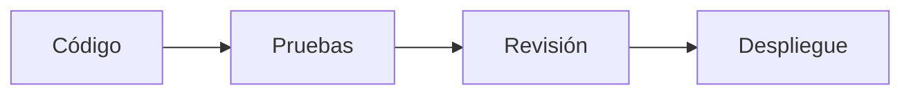

---

# 7.6 Entornos

La API deberá manejar ambientes separados:

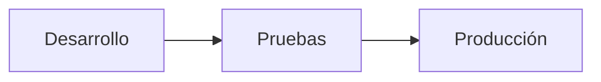

---

# 7.7 Cambios en API

Antes de modificar un endpoint existente deberá evaluarse:

* impacto en Android.
* impacto en futuros clientes.
* compatibilidad.

---

# 7.8 Deprecación

Cuando una API quede obsoleta:

No deberá eliminarse inmediatamente.

Proceso:

```text id="3m8q5x"
Versión antigua

↓

Aviso de cambio

↓

Nueva versión

↓

Retiro controlado
```

---

# 7.9 Registro de Cambios

Los cambios importantes deberán documentarse.

Ejemplos:

* nuevo endpoint.
* cambio de modelo.
* modificación de permisos.

---

# 7.10 Monitoreo

La API deberá permitir observar:

* errores.
* tiempos de respuesta.
* disponibilidad.
* uso de endpoints.

---

# 7.11 Principio Arquitectónico

La calidad de API deberá cumplir:

> Un cambio pequeño no debe convertirse en un problema grande para toda la plataforma.

# 8. Despliegue y Operación de la API

La API Chiri será desplegada como un servicio independiente dentro de la infraestructura Docker de la plataforma.

---

# 8.1 Ejecución mediante Docker

La API deberá ejecutarse dentro de un contenedor.

Arquitectura:

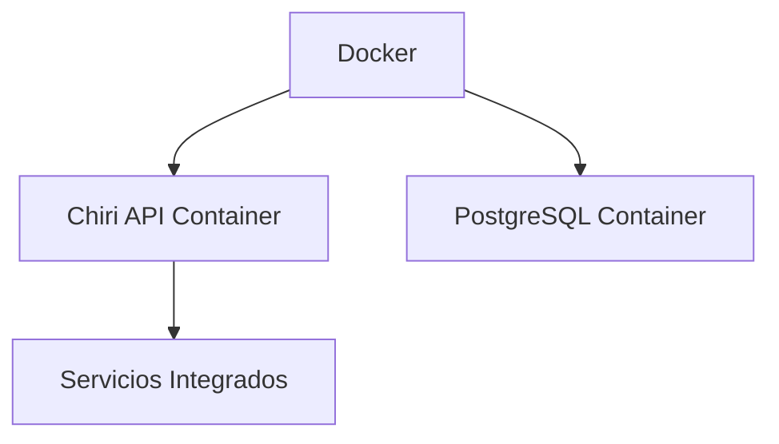

---

# 8.2 Independencia del Entorno

La API deberá funcionar de la misma forma en:

* desarrollo.
* pruebas.
* producción.

La diferencia entre ambientes deberá estar controlada por configuración.

---

# 8.3 Configuración mediante Variables de Entorno

La configuración no deberá estar escrita directamente en el código.

Ejemplos:

```text id="7q5m2x"
DATABASE_URL

SECRET_KEY

API_PORT

ENVIRONMENT
```

---

# 8.4 Separación de Configuración

Los ambientes deberán tener configuraciones independientes:

```text id="4m8q2x"
development.env

testing.env

production.env
```

---

# 8.5 Comunicación Interna Docker

Los servicios deberán comunicarse mediante redes Docker internas.

Ejemplo:

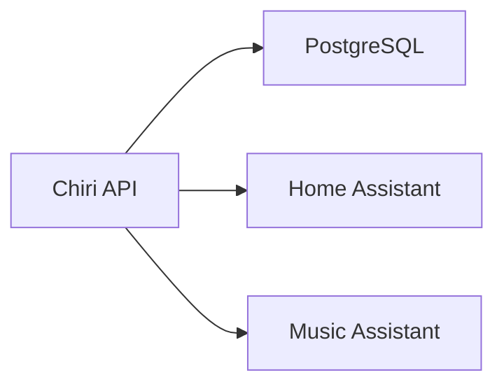

---

# 8.6 Exposición de Puertos

Solo deberán exponerse los servicios necesarios.

Principio:

```text id="2m7q5x"
Menor exposición

=

Mayor seguridad
```

---

# 8.7 Logs

La API deberá generar registros para:

* errores.
* solicitudes.
* eventos importantes.
* problemas de integración.

---

# 8.8 Niveles de Log

Se deberán considerar niveles:

```text id="6q8m3x"
DEBUG

INFO

WARNING

ERROR

CRITICAL
```

En producción deberá evitarse registrar información sensible.

---

# 8.9 Reinicio Automático

El contenedor deberá poder recuperarse automáticamente ante:

* reinicio del servidor.
* fallo temporal.
* actualización controlada.

---

# 8.10 Salud del Servicio

La API deberá implementar mecanismos de comprobación.

Ejemplo:

```text id="3m8q7x"
/health
```

Permitirá verificar:

* servicio activo.
* conexión básica.
* estado general.

---

# 8.11 Actualizaciones

Las actualizaciones deberán seguir:


---

# 8.12 Recuperación

Ante fallo:

Proceso esperado:

```text id="9q4m2x"
Servidor reinicia

↓

Docker inicia servicios

↓

API inicia

↓

Verifica dependencias

↓

Servicio disponible
```

---

# 8.13 Principio Arquitectónico

La operación de la API deberá cumplir:

> La plataforma debe poder reiniciarse y recuperarse sin intervención compleja.

# 9. Seguridad Avanzada de API

La API de Chiri Platform deberá incorporar medidas adicionales de seguridad para proteger la plataforma, sus usuarios y sus servicios integrados.

---

# 9.1 Seguridad por Capas

La protección de la API no dependerá de un único mecanismo.

Se aplicarán varias capas:

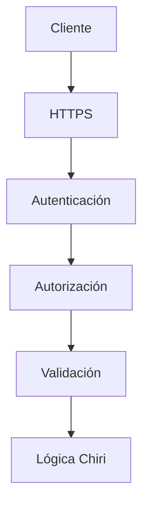

---

# 9.2 Validación de Entradas

Toda información recibida deberá ser validada.

Se deberá controlar:

* tipos de datos.
* formatos.
* valores permitidos.
* tamaño máximo.
* campos obligatorios.

Ejemplo:

Incorrecto:

```json
{
 "volume": "mucho"
}
```

Correcto:

```json
{
 "volume": 50
}
```

---

# 9.3 Protección contra Datos Maliciosos

La API deberá prevenir:

* inyección SQL.
* solicitudes inválidas.
* datos inesperados.
* ejecución no autorizada.

Las consultas deberán realizarse mediante mecanismos seguros del Backend.

---

# 9.4 Rate Limiting

La API deberá considerar límites de solicitudes.

Objetivo:

* evitar abuso.
* proteger recursos.
* mantener disponibilidad.

Ejemplo:

```text id="4m7q2x"
Cliente normal

↓

Solicitudes permitidas


Cliente abusivo

↓

Solicitudes limitadas
```

---

# 9.5 Protección de Endpoints Sensibles

Las operaciones críticas deberán tener controles adicionales.

Ejemplos:

* administración de usuarios.
* cambios de configuración.
* acciones críticas de dispositivos.

---

# 9.6 Gestión de Secretos

La API no deberá almacenar secretos directamente en código.

Ejemplos:

Incorrecto:

```python
PASSWORD = "clave123"
```

Correcto:

```text id="6q3m8x"
Variable de entorno

Secret Manager futuro
```

---

# 9.7 Información Sensible en Respuestas

Las respuestas deberán evitar exponer:

* contraseñas.
* tokens.
* claves internas.
* información innecesaria.

---

# 9.8 Auditoría de Seguridad

Las acciones importantes deberán registrarse.

Ejemplos:

* inicio de sesión.
* cambios de permisos.
* modificaciones administrativas.

---

# 9.9 Protección de Errores

Los errores enviados al cliente deberán ser controlados.

Incorrecto:

```text id="8m4q2x"
Error SQL:
password authentication failed for user postgres
```

Correcto:

```json id="3x7m5q"
{
 "error": {
   "code": "DATABASE_ERROR"
 }
}
```

---

# 9.10 Seguridad en Integraciones

Las conexiones con servicios externos deberán:

* utilizar credenciales protegidas.
* validar respuestas.
* controlar tiempos de espera.
* manejar fallos.

---

# 9.11 Preparación para Acceso Remoto

Si Chiri es accesible fuera de la red local deberá considerar:

* HTTPS obligatorio.
* autenticación fuerte.
* exposición mínima.
* monitoreo.

---

# 9.12 Principio Arquitectónico

La seguridad de la API deberá cumplir:

> La comodidad nunca debe eliminar el control sobre quién puede acceder y qué puede ejecutar.

# 10. Conclusión y Reglas Finales de API

La API de Chiri Platform v1.0 queda definida como la capa central de comunicación de la plataforma.

Su función será conectar clientes, lógica de negocio y servicios integrados mediante un contrato estable, seguro y mantenible.

---

# 10.1 Decisiones Confirmadas

La API utilizará:

* FastAPI.
* Python.
* REST.
* JSON.
* HTTPS.
* OpenAPI.
* Versionado mediante `/api/v1`.

---

# 10.2 Responsabilidad Confirmada

La API será responsable de:

* exponer capacidades de Chiri.
* validar solicitudes.
* controlar acceso.
* ejecutar casos de uso.
* comunicarse con servicios externos.
* devolver respuestas consistentes.

---

# 10.3 Límites Confirmados

La API NO será responsable de:

* reemplazar Home Assistant.
* reemplazar Music Assistant.
* reemplazar Navidrome.
* reemplazar Jellyfin.
* almacenar archivos multimedia.
* permitir acceso directo a servicios internos.

---

# 10.4 Arquitectura Final

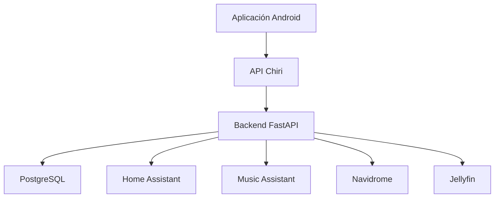

---

# 10.5 Reglas que no deben romperse

## Regla 1

Ningún cliente accederá directamente a servicios internos.

---

## Regla 2

Todo acceso deberá pasar por la API Chiri.

---

## Regla 3

Los endpoints representan capacidades, no implementaciones internas.

---

## Regla 4

Los contratos existentes no deben romperse sin una estrategia de migración.

---

## Regla 5

Toda nueva funcionalidad debe diseñarse primero como contrato API.

---

## Regla 6

La seguridad debe formar parte del diseño inicial.

---

# 10.6 Evolución Futura

La API permitirá agregar:

* nuevos clientes.
* nuevas integraciones.
* asistentes inteligentes.
* automatizaciones.
* servicios futuros.

Sin modificar la arquitectura principal.

---

# 10.7 Estado del Documento

El documento:

```text id="4m8q2x"
060_API.md
```

queda definido como referencia oficial para la arquitectura de comunicación de Chiri Platform v1.0.

Cualquier implementación futura deberá respetar:

* estructura REST.
* versionado.
* seguridad.
* contratos.
* separación de responsabilidades.

---

# Declaración Final

La API de Chiri Platform v1.0 será el punto de unión entre todos los componentes de la plataforma.

Su objetivo no es reemplazar servicios existentes, sino proporcionar una experiencia unificada y segura.

Principio final:

> Los clientes conocen Chiri; Chiri conoce las integraciones; las integraciones permanecen independientes.
