# Chiri Platform

**Documento:** 060_API.md

**Versión:** 1.0

**Estado:** Cerrado

---

# 1. Introducción

La API de Chiri Platform será la interfaz oficial de comunicación entre los clientes, el Backend y los servicios integrados.

Su objetivo será proporcionar una capa estable, segura y organizada para acceder a las capacidades de la plataforma.

---

# 1.1 Objetivo de la API

La API deberá permitir:

* comunicación con clientes.
* autenticación de usuarios.
* gestión de sesiones.
* renovación de sesiones mediante refresh tokens.

En futuras etapas permitirá además:

* ejecución de acciones.
* consulta de información.
* integración con servicios externos.
* evolución de las capacidades de la plataforma.
---

# 1.2 Principio Fundamental

La API será la única puerta de entrada a Chiri.

La arquitectura prevista permitirá que los clientes se comuniquen
con el Backend de Chiri mediante la API, manteniendo los servicios
internos y externos detrás de esta capa.

Arquitectura conceptual:

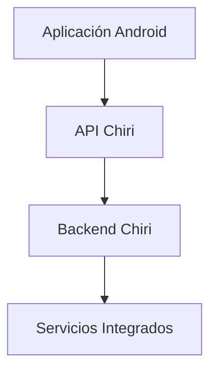

---

# 1.3 Responsabilidad de la API

La API será responsable de:

* recibir solicitudes HTTP.
* validar información de entrada.
* controlar autenticación.
* delegar operaciones a la lógica de aplicación.
* devolver respuestas HTTP.
* ocultar detalles internos de implementación.

---

# 1.4 Lo que NO hará la API

La API no será responsable de:

* lógica propia de Home Assistant.
* reproducción multimedia directa.
* almacenamiento de archivos.
* reemplazar servicios especializados.

Ejemplo:

Incorrecto:

```text
API Chiri
     |
     └── Crear nuevo sistema multimedia
```

Correcto:

```text
API Chiri
     |
     └── Solicitar acción a Music Assistant/Jellyfin
```

---

# 1.5 Tecnología Definida

La API será desarrollada utilizando:

## Backend

* Python.
* FastAPI.

## Comunicación

* REST.
* JSON.

El uso de HTTPS corresponde al despliegue de la plataforma y deberá
aplicarse cuando la API sea expuesta mediante una conexión segura.

## Documentación

* OpenAPI / Swagger.
---

# 1.6 Clientes de la API

Los principales consumidores serán:

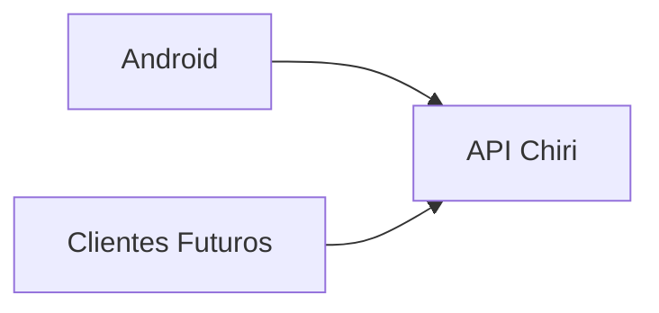

La arquitectura permitirá incorporar posteriormente:

* interfaz web.
* asistentes de voz.
* automatizaciones.
* otros dispositivos.

---

# 1.7 Principios de Diseño

La API deberá cumplir:

* contratos claros.
* respuestas consistentes.
* seguridad.
* documentación.
* compatibilidad futura.
* versionado cuando se introduzca una versión pública de la API.

---

# 1.8 Regla Principal

Toda nueva funcionalidad deberá responder:

> ¿Esta capacidad debe exponerse mediante API?

Si la respuesta es sí, deberá diseñarse primero el contrato antes del código.

---

# 1.9 Principio Arquitectónico

La API de Chiri será:

> La capa de abstracción que permite que la plataforma evolucione sin depender de clientes o servicios específicos.

# 2. Arquitectura Interna de la API

La API Chiri estará organizada mediante capas separadas para mantener:

* claridad.
* mantenibilidad.
* facilidad de pruebas.
* evolución controlada.

---

# 2.1 Arquitectura General

La arquitectura actualmente implementada utiliza FastAPI como punto
de entrada HTTP y separa las responsabilidades de la API, la lógica
de aplicación, la seguridad y el acceso a la base de datos.

Estructura actual:

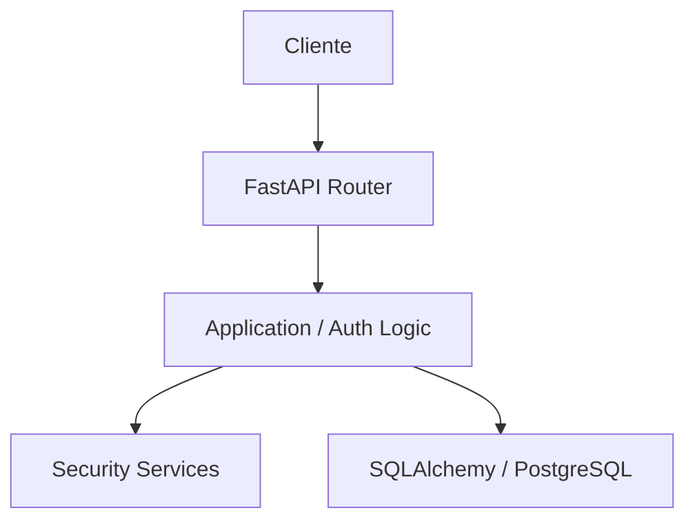


# 2.2 Capa Router

## Responsabilidad

Gestiona los puntos de entrada HTTP.

Funciones:

* definir endpoints.
* recibir solicitudes.
* validar parámetros básicos.
* enviar respuesta.

Ejemplo:

```text id="7m3q8x"
POST /auth/login
POST /auth/refresh
GET  /auth/me
POST /auth/logout
GET  /health
```

---

# 2.3 Capa Controller

Estado: Futuro

## Responsabilidad

Actúa como intermediario entre HTTP y la lógica de aplicación.

Responsabilidades:

* recibir modelos de entrada.
* llamar casos de uso.
* transformar respuestas.

No deberá contener:

* lógica de negocio.
* consultas SQL.
* llamadas directas a servicios externos.

---

# 2.4 Capa Use Case

Estado: Futuro

## Responsabilidad

Representa acciones que Chiri puede realizar.

Ejemplos:

```text id="3m8q5x"
GetHomeStatus

PlayMusic

GetUserProfile

ExecuteAutomation
```

Los casos de uso representan capacidades, no tablas.

---

# 2.5 Capa Service

## Responsabilidad

La capa Service contiene lógica de aplicación relacionada con las
operaciones que actualmente implementa Chiri.

En la etapa actual está orientada principalmente al dominio de
autenticación y seguridad.

Actualmente implementa lógica relacionada con:

* autenticación de usuarios.
* verificación de contraseñas.
* creación de sesiones.
* revocación de sesiones.
* creación de refresh tokens.
* rotación de refresh tokens.
* validación del estado y expiración de sesiones.
* validación del estado y expiración de refresh tokens.
* generación y validación de tokens de acceso JWT.

Los servicios de esta capa trabajan con los modelos y mecanismos de
persistencia definidos por el backend.

La capa Service no deberá contener código específico de los clientes,
como Android, ni implementar directamente la lógica propia de servicios
externos.

### Evolución futura

Cuando se incorporen nuevos dominios, esta capa podrá contener lógica
relacionada con:

* integraciones.
* multimedia.
* automatizaciones.
* dispositivos.
* otras capacidades propias de Chiri.

Estas capacidades serán implementadas únicamente cuando formen parte de
una etapa correspondiente del proyecto.

---

# 2.6 Capa Repository

Estado: Futuro

## Responsabilidad

Gestiona acceso a datos persistentes.

Puede comunicarse con:

* PostgreSQL.
* almacenamiento interno.

No deberá ser utilizado directamente por clientes.

---

# 2.7 Modelos de Datos

La API deberá separar:

* modelos de entrada.
* modelos internos.
* modelos de respuesta.

Ejemplo:

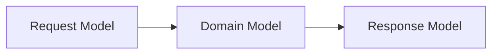

---

# 2.8 Flujo de una Solicitud

Ejemplo:

Usuario solicita encender una luz.

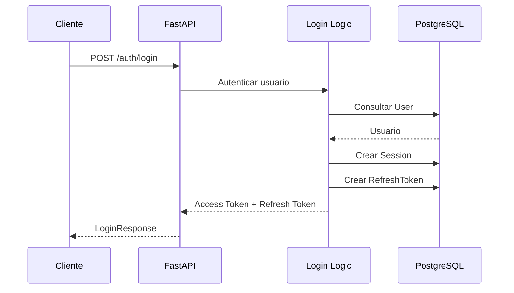

---

# 2.9 Manejo de Dependencias

Estado: Futuro

Las dependencias deberán seguir:

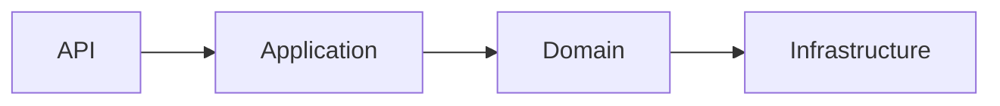

Las capas superiores no deberán conocer detalles internos innecesarios.

---

# 2.10 Ventajas de esta Arquitectura

Actualmente:

separación entre API y lógica de aplicación;
autenticación centralizada;
acceso a PostgreSQL mediante SQLAlchemy.

Futuro:

desacoplamiento de servicios externos;
Repository;
Use Cases formales;
integraciones.

---

# 2.11 Regla Arquitectónica

La API deberá cumplir:

> Un endpoint no implementa una solución; expone una capacidad de la plataforma.

# 3. Diseño de Endpoints y Versionado de API

La API de Chiri Platform utilizará una estructura organizada de endpoints basada en recursos y capacidades.

El diseño deberá priorizar:

* claridad.
* estabilidad.
* compatibilidad futura.
* facilidad de uso.

---

# 3.1 Arquitectura de URL

La API actualmente utiliza rutas HTTP directamente sobre el servidor de
Chiri.

Las rutas implementadas en esta etapa son:

```text
POST /auth/login
POST /auth/refresh
GET  /auth/me
POST /auth/logout
GET  /health
```

# 3.2 Versionado

La API contempla el versionado explícito como mecanismo para permitir la evolución controlada de sus contratos.

Actualmente, las rutas implementadas no utilizan un prefijo de versión.

La API actualmente implementada utiliza las rutas definidas por el Backend sin el prefijo `/api/v1/`.

El versionado mediante un prefijo como:

```text
/api/v1/
```

queda establecido como una decisión arquitectónica futura y deberá aplicarse de forma controlada cuando se realice la incorporación del versionado.

La incorporación de una versión no deberá modificar de forma incompatible los contratos existentes sin una estrategia de migración definida.

### Regla arquitectónica

> El versionado de la API deberá permitir evolucionar los contratos de forma controlada, evitando cambios incompatibles no planificados.


# 3.3 Motivo del Versionado

El versionado permite:

* evolución controlada.
* mantener compatibilidad.
* introducir cambios importantes.

Ejemplo:

```text
v1

    |

    v2
```

Ambas versiones pueden coexistir durante una transición.

---

# 3.4 Recursos vs Acciones

Los endpoints deberán representar recursos o capacidades claras.

La API deberá preferir rutas orientadas a recursos y utilizar los métodos HTTP para expresar la operación correspondiente.

Preferencia conceptual:

```text
GET /devices
```

Evitar:

```text
GET /getAllDevices
```

La estructura exacta de las rutas deberá corresponder a los endpoints realmente implementados por el Backend.

Los ejemplos de este documento deberán diferenciar claramente entre:

* rutas actualmente implementadas;
* rutas conceptuales;
* rutas futuras derivadas de decisiones arquitectónicas.

### Regla arquitectónica

> Los endpoints deben representar recursos o capacidades de la API y no exponer directamente nombres de funciones o implementaciones internas.

# 3.5 Métodos HTTP

Se utilizarán métodos estándar:

| Método | Uso                             |
| ------ | ------------------------------- |
| GET    | Consultar información           |
| POST   | Crear o ejecutar acciones       |
| PUT    | Actualizar información completa |
| PATCH  | Actualizar parcialmente         |
| DELETE | Eliminar información            |

---

# 3.6 Ejemplos Conceptuales

**Estado: Futuro**

Los siguientes ejemplos representan posibles recursos de la API y sirven únicamente como referencia para el diseño de futuras funcionalidades.

### Usuarios

```text
GET

/users
```

### Crear usuario

```text
POST

/users
```

### Perfil

```text
GET

/profile
```

Estos ejemplos son conceptuales y no representan necesariamente endpoints disponibles en la implementación actual.

Cuando estas funcionalidades sean implementadas, deberán incorporarse al contrato oficial de la API y respetar la estructura de rutas vigente en ese momento.

### Regla arquitectónica

> Los ejemplos conceptuales sirven para definir la orientación de diseño de la API y no deben interpretarse como funcionalidades actualmente disponibles.


# 3.7 Acciones Especiales

**Estado: Futuro**

Algunas capacidades de Chiri no representan directamente un recurso, sino una acción específica sobre un recurso o servicio.

Estas operaciones podrán utilizar endpoints orientados a acciones cuando dicha representación resulte más clara y adecuada para el contrato de la API.

### Reproducir música

```text
POST

/media/play
```

### Encender dispositivo

```text
POST

/devices/{id}/turn-on
```

Los ejemplos anteriores son conceptuales y no representan endpoints disponibles en la implementación actual.

Las rutas definitivas deberán establecerse cuando estas capacidades sean implementadas y deberán respetar la estructura de rutas vigente en ese momento.

### Regla arquitectónica

> Las acciones especiales podrán utilizar rutas orientadas a acciones cuando la operación no pueda representarse adecuadamente como una operación convencional sobre un recurso.

# 3.8 Endpoints de Autenticación

La autenticación de usuarios es gestionada exclusivamente mediante la
API de Chiri Platform.

Los clientes no deberán acceder directamente a PostgreSQL ni a otros
servicios internos.

Actualmente están implementados los siguientes endpoints:

| Método | Ruta | Responsabilidad |
|---|---|---|
| POST | `/auth/login` | Iniciar sesión |
| POST | `/auth/refresh` | Renovar el acceso mediante refresh token |
| GET | `/auth/me` | Consultar el usuario autenticado |
| POST | `/auth/logout` | Cerrar la sesión y revocarla |

El flujo de autenticación utiliza:

* usuario y contraseña.
* sesión persistente.
* access token JWT.
* refresh token.
* rotación de refresh tokens.
* expiración de access tokens.
* expiración de refresh tokens.
* expiración y revocación de sesiones.

Los contratos, validaciones y códigos HTTP de estos endpoints se
definen en las secciones correspondientes de esta documentación.

Las capacidades adicionales de autenticación o autorización, como
roles, permisos y autorización granular, corresponden a futuras etapas.

# 3.9 Convención de Nombres

Los endpoints deberán utilizar:

* minúsculas.
* plural para colecciones.
* nombres descriptivos.
* separación con guiones cuando sea necesario.

Ejemplo:

Correcto:

```text id="3q8m5x"
user-settings
```

Evitar:

```text id="6m2q7x"
UserSettings
```
---

# 3.10 Respuestas Consistentes

Las respuestas de la API deberán mantener contratos claros y
consistentes según la responsabilidad de cada endpoint.

Actualmente los endpoints de autenticación utilizan modelos de
respuesta definidos específicamente para cada operación.

El contrato de cada respuesta deberá especificar:

* campos.
* tipos de datos.
* valores permitidos.
* comportamiento ante errores.

La API no adopta actualmente una envoltura global obligatoria del tipo
`success`, `data` y `message`.

La definición de una estructura global de respuesta podrá evaluarse en
una futura etapa cuando aumente el número de módulos y endpoints.

---

# 3.11 Errores Consistentes

Los errores de la API deberán utilizar códigos HTTP apropiados y
respuestas consistentes con el contrato de cada endpoint.

Actualmente la API de autenticación utiliza principalmente:

* `401 Unauthorized` para solicitudes no autenticadas o credenciales,
  tokens o sesiones no válidos.
* `200 OK` para operaciones exitosas de consulta.
* `POST` exitoso para operaciones de autenticación y renovación.

Los detalles específicos de cada endpoint deberán documentarse junto
con su contrato.

La definición de un catálogo global de códigos de error de aplicación
queda prevista para una futura etapa.

---

# 3.12 Cambios Incompatibles

No se deberán modificar endpoints existentes de forma que rompan clientes.

Ejemplo incorrecto:

Antes:

```json
{
 "name":"Juan"
}
```

Después:

```json
{
 "full_name":"Juan"
}
```

sin transición.

---

# 3.13 Documentación

La API utiliza la documentación automática proporcionada por FastAPI
mediante OpenAPI.

Actualmente están disponibles:

* OpenAPI.
* Swagger UI.
* ReDoc.

Los endpoints deberán definir sus modelos de solicitud y respuesta para
que formen parte del contrato documentado de la API.

# 3.14 Regla Arquitectónica

El diseño de endpoints deberá cumplir:

> Una API estable permite que Chiri evolucione sin obligar a reconstruir sus clientes.

# 4. Autenticación y Autorización de API

La API de Chiri Platform deberá implementar mecanismos de autenticación y autorización para controlar el acceso a las capacidades de la plataforma.

# 4.1 Diferencia entre Autenticación y Autorización

## Autenticación

Responde:

> ¿Quién eres?

La autenticación permite determinar la identidad del usuario que realiza una solicitud.

En Chiri Platform, la autenticación podrá utilizar:

* credenciales de usuario;
* access token;
* sesión asociada al usuario.

La autenticación deberá ser realizada por el Backend.

El cliente no deberá considerarse autenticado únicamente por ser una aplicación oficial de Chiri Platform.

---

## Autorización

Responde:

> ¿Qué puedes hacer?

La autorización determina si el usuario autenticado posee los permisos necesarios para ejecutar una operación determinada.

Ejemplos:

* consultar información;
* ejecutar acciones;
* administrar usuarios;
* modificar configuración;
* ejecutar operaciones administrativas.

La autorización deberá realizarse en el Backend utilizando los roles y permisos definidos por la plataforma.

### Regla

```text
Solicitud
    |
    v
Autenticación
    |
    +-- ¿Quién es?
    |
    v
Usuario autenticado
    |
    v
Autorización
    |
    +-- ¿Qué puede hacer?
    |
    v
Operación permitida
```

La autenticación y la autorización son mecanismos independientes.

Un usuario puede estar correctamente autenticado y aun así no estar autorizado para ejecutar una determinada operación.

---

# 4.2 Flujo General de Seguridad

El acceso a los recursos protegidos de Chiri Platform seguirá un flujo basado en autenticación y autorización.

La arquitectura general será:

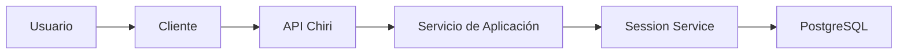

El cliente se comunicará exclusivamente con la API de Chiri Platform.

La API será responsable de recibir y validar las solicitudes HTTP y delegar las operaciones a los servicios de aplicación correspondientes.

El servicio de autenticación utilizará los componentes de aplicación responsables de:

* validar las credenciales;
* identificar al usuario;
* crear sesiones;
* emitir credenciales;
* validar las condiciones de autenticación.

El `Session Service` será responsable de las operaciones relacionadas con las sesiones.

PostgreSQL almacenará la información persistente de usuarios y sesiones.

Los clientes no deberán acceder directamente a PostgreSQL ni a los servicios internos.

### Flujo de una solicitud autenticada

```text
Cliente
   |
   | Authorization: Bearer ACCESS_TOKEN
   v
API Chiri
   |
   v
Validación del Access Token
   |
   v
Validación de Sesión
   |
   v
Identificación del Usuario
   |
   v
Autorización
   |
   v
Caso de Uso
   |
   v
Resultado
```

# 4.3 Principio de Acceso

La API no deberá confiar únicamente en que la solicitud proviene de un cliente oficial de Chiri Platform.

Los endpoints protegidos deberán validar como mínimo:

* autenticidad de las credenciales;
* identidad del usuario;
* estado de la sesión;
* autorización y permisos correspondientes.

Los endpoints públicos de autenticación tendrán sus propias validaciones y no requerirán un access token previo.

Ejemplo:

```text
POST /auth/login

No requiere:
    Access Token

Debe validar:
    identifier
    password
    estado del usuario
```

Para un endpoint protegido:

```text
GET /auth/me

Requiere:
    Access Token válido

Debe validar:
    identidad
    sesión
    autorización
```

La protección de los endpoints deberá realizarse exclusivamente en el Backend.

El cliente no deberá determinar por sí mismo si una solicitud está autorizada.

### Regla arquitectónica

> La procedencia de un cliente oficial no constituye una autorización. Toda solicitud protegida deberá ser autenticada y autorizada por el Backend.

El Backend será la autoridad definitiva para determinar si una solicitud está autenticada y autorizada.

El cliente no podrá otorgarse permisos a sí mismo ni determinar por sí solo si una operación está autorizada.

### Regla arquitectónica

> Ningún cliente obtiene acceso a una capacidad protegida simplemente por ser un cliente oficial; el Backend deberá autenticar y autorizar cada solicitud protegida.

# 4.4 Sesiones y Tokens

La autenticación de Chiri Platform utilizará una arquitectura basada en **sesiones persistentes y tokens de acceso**.

La sesión representa la relación lógica de autenticación entre un usuario y la plataforma. Los tokens representan las credenciales utilizadas por el cliente para realizar solicitudes autenticadas.

La arquitectura separará explícitamente:

* sesión;
* access token;
* refresh token.

El identificador de la sesión (`session_id`) **no será utilizado como credencial HTTP** y no deberá enviarse como sustituto del access token.

El flujo general será:

```text
Usuario inicia sesión
        |
        v
Servidor valida identidad
        |
        v
Servidor crea sesión
        |
        +-------------------+
        |                   |
        v                   v
Access Token        Refresh Token
        |                   |
        +---------+---------+
                  |
                  v
        Cliente almacena credenciales
                  |
                  v
        Cliente utiliza Access Token
        en solicitudes posteriores
```

## 4.4.1 Relación entre Sesión y Tokens

Una sesión podrá tener múltiples emisiones de tokens durante su ciclo de vida.

La relación conceptual será:

```text
security.session
        |
        +---- access token
        |
        +---- refresh token
        |
        +---- nuevas emisiones
```

Los tokens deberán estar asociados a una sesión existente.

La sesión continuará siendo la entidad utilizada para determinar:

* usuario propietario;
* estado de la sesión;
* vigencia de la sesión;
* revocación de la sesión.

Los tokens no reemplazarán a la entidad `security.session`.

## 4.4.2 Múltiples Sesiones

Un usuario podrá mantener múltiples sesiones simultáneas.

Por ejemplo:

```text
Usuario
   |
   +---- Sesión Android
   |
   +---- Sesión PC
   |
   +---- Sesión Web futura
```

Cada sesión podrá administrarse independientemente.

Esto permitirá posteriormente:

* cerrar una sesión específica;
* mantener otras sesiones activas;
* cerrar todas las sesiones del usuario;
* identificar sesiones por dispositivo;
* implementar controles adicionales de seguridad.

## 4.4.3 Almacenamiento de Tokens

Los access tokens y refresh tokens serán credenciales sensibles y deberán protegerse durante todo su ciclo de vida.

El access token será un JWT firmado mediante RS256 y no deberá almacenarse en PostgreSQL como mecanismo normal de validación.

La validación del access token se realizará mediante:

* validación de la estructura JWT;
* validación del algoritmo esperado;
* validación de la firma mediante la clave pública;
* validación de su vigencia;
* validación de la sesión asociada;
* validación del usuario asociado.

La Base de Datos continuará siendo la fuente de verdad para:

* usuarios;
* sesiones;
* estado de las sesiones;
* roles;
* permisos.

El refresh token deberá almacenarse de forma segura mediante una representación que no permita recuperar directamente el valor original.

Los tokens originales no deberán almacenarse en texto plano en PostgreSQL.

Los tokens tampoco deberán incluirse en:

* registros de aplicación;
* registros de auditoría;
* mensajes de error;
* métricas;
* trazas de depuración;
* respuestas distintas de aquellas definidas explícitamente por el contrato de autenticación.

## 4.4.4 Tipos de Token

Chiri Platform utilizará dos tipos principales de tokens:

```text
Access Token
      |
      +---- autenticación de solicitudes normales

Refresh Token
      |
      +---- renovación de credenciales de acceso
```

El access token tendrá una duración corta.

El refresh token tendrá una duración mayor y estará sujeto a rotación.

## 4.4.5 Principio de Seguridad

La sesión será la unidad lógica de autenticación y revocación.

Los tokens serán credenciales temporales asociadas a dicha sesión.

La revocación de una sesión deberá impedir el uso posterior de los tokens asociados a ella.

### Regla arquitectónica

> **La sesión representa la autenticación del usuario; los tokens representan las credenciales temporales utilizadas para acceder a la API.**

# 4.5 Token de Acceso

El **access token** será una credencial temporal utilizada por el cliente para autenticarse ante los endpoints protegidos de la API de Chiri Platform.

El access token utilizará el formato **JWT (JSON Web Token)** y será firmado digitalmente mediante el algoritmo:

```text
RS256
```

La firma utilizará una clave privada RSA de:

```text
3072 bits
```

La clave privada será utilizada exclusivamente por el Backend para generar las firmas.

La validación de la firma se realizará mediante la clave pública correspondiente.

El access token no deberá contener roles ni permisos de autorización.

La información de roles y permisos deberá obtenerse desde el Backend y la Base de Datos, que constituyen la fuente de verdad para la autorización.

## 4.5.1 Uso del Access Token

Las solicitudes autenticadas utilizarán el esquema estándar HTTP:

```http
Authorization: Bearer ACCESS_TOKEN
```

El cliente deberá enviar el access token en el encabezado `Authorization` de las solicitudes que requieran autenticación.

El `session_id` no deberá utilizarse como sustituto del access token.

El access token será utilizado exclusivamente como credencial para demostrar la autenticación de la solicitud.

## 4.5.2 Duración

El access token tendrá una duración máxima de:

```text
15 minutos
```

La duración corta limitará la ventana de exposición en caso de que el token sea comprometido.

Cuando el access token expire, el cliente deberá utilizar el refresh token para obtener nuevas credenciales, siempre que la sesión continúe siendo válida.

## 4.5.3 Firma y Validación Criptográfica

El Backend generará el access token mediante una firma asimétrica.

El proceso será:

```text
Clave privada RSA 3072
        |
        | firma RS256
        v
Access Token JWT
        |
        v
Cliente
        |
        | Authorization: Bearer
        v
API Chiri
        |
        | valida firma
        v
Clave pública RSA
```

La clave privada nunca deberá enviarse al cliente.

La clave privada tampoco deberá almacenarse dentro del código fuente del proyecto.

La clave pública podrá utilizarse para validar los access tokens emitidos por el Backend.

## 4.5.4 Claims del JWT

El Access Token JWT deberá contener los siguientes claims:

```json
{
  "jti": "TOKEN_UUID",
  "kid": "KEY_ID",
  "iss": "chiri-platform",
  "aud": "chiri-api",
  "iat": 1750000000,
  "exp": 1750000900,
  "user_id": "USER_UUID",
  "session_id": "SESSION_UUID"
}
```

Descripción:

| Claim        | Propósito                                                 |
| ------------ | --------------------------------------------------------- |
| `jti`        | Identificador único del token.                            |
| `kid`        | Identificador de la clave utilizada para firmar el token. |
| `iss`        | Emisor del token.                                         |
| `aud`        | Audiencia prevista del token.                             |
| `iat`        | Fecha y hora de emisión.                                  |
| `exp`        | Fecha y hora de expiración.                               |
| `user_id`    | Identificador del usuario autenticado.                    |
| `session_id` | Identificador de la sesión asociada.                      |

Los identificadores `user_id` y `session_id` deberán representar UUID válidos.

El Access Token será firmado mediante RSA utilizando el algoritmo:

```text
RS256
```

El token deberá contener un `kid` válido que permita identificar la clave esperada.

El Access Token tendrá una duración máxima de 15 minutos.

## 4.5.5 Roles y Permisos

El access token no deberá contener:

* roles;
* permisos;
* reglas de autorización;
* información administrativa sensible.

La autorización deberá determinarse en el Backend.

El flujo será:

```text
Access Token JWT
        |
        v
Identidad del usuario
        |
        v
Sesión
        |
        v
Roles
        |
        v
Permisos
        |
        v
Autorización
        |
        v
Endpoint
```

Esto permite que los cambios de roles o permisos tengan efecto sin depender de la expiración de un JWT que contenga información de autorización.

## 4.5.6 Validación del JWT

Antes de aceptar un Access Token, Chiri deberá validar su integridad y sus claims de seguridad.

La validación deberá comprobar:

* estructura válida del JWT.
* firma criptográfica válida.
* algoritmo `RS256`.
* `kid` válido.
* `iss` válido.
* `aud` válido.
* `iat` válido.
* `exp` válido.
* presencia de todos los claims requeridos.
* `user_id` con formato UUID válido.
* `session_id` con formato UUID válido.

Los claims obligatorios serán:

```text
jti
kid
iss
aud
iat
exp
user_id
session_id
```

Un token que no cumpla cualquiera de estas validaciones deberá ser rechazado.

La validación criptográfica del JWT no sustituye la validación de la sesión.

Después de validar el token, el backend deberá comprobar que la sesión asociada continúa siendo válida.

## 4.5.7 Relación entre JWT, usuario y sesión

Cada Access Token estará asociado a un usuario y a una sesión mediante:

```text
user_id
session_id
```

La relación conceptual será:

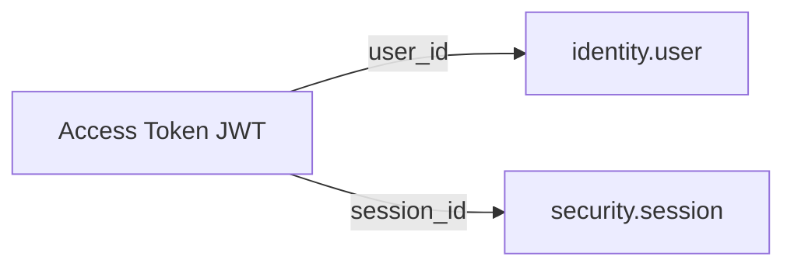

El `user_id` identifica al usuario autenticado.

El `session_id` identifica la sesión autenticada a la que pertenece el token.

La existencia de un JWT válido no implica por sí misma que el acceso deba ser permitido.

El backend deberá comprobar además que:

* el usuario existe.
* el usuario se encuentra en estado `ACTIVE`.
* la sesión existe.
* la sesión pertenece al usuario indicado por `user_id`.
* la sesión se encuentra en estado `ACTIVE`.
* la sesión no ha superado `expires_at`.

Si alguna de estas condiciones no se cumple, la solicitud deberá ser rechazada.

El tiempo de vida del Access Token no deberá extender la duración máxima de la sesión.

## 4.5.8 Almacenamiento

El access token JWT original no deberá almacenarse en PostgreSQL como mecanismo normal de validación.

La Base de Datos continuará siendo la fuente de verdad para:

* usuarios;
* sesiones;
* estado de las sesiones;
* roles;
* permisos.

El Backend deberá validar la firma y vigencia del JWT y posteriormente validar la sesión y el usuario asociados.

El access token tampoco deberá aparecer en:

* logs;
* mensajes de error;
* registros de auditoría;
* métricas;
* trazas de depuración.

Las claves criptográficas utilizadas para firmar los tokens deberán protegerse mediante los mecanismos seguros definidos por la infraestructura de Chiri Platform.

## 4.5.9 No Reutilización como Refresh Token

El access token tendrá como única finalidad autenticar solicitudes normales de la API.

No deberá utilizarse para:

* renovar credenciales;
* sustituir al refresh token;
* modificar directamente el estado de una sesión;
* modificar roles o permisos;
* otorgar autorización por sí mismo.

El refresh token será una credencial independiente y tendrá su propio ciclo de vida y mecanismo de rotación.

## 4.5.10 Seguridad

El access token deberá:

* utilizar firma asimétrica RS256;
* utilizar claves RSA de 3072 bits;
* tener una duración máxima de 15 minutos;
* transmitirse únicamente mediante HTTPS;
* utilizar el esquema `Authorization: Bearer`;
* permanecer fuera de logs;
* no contener roles ni permisos;
* estar asociado a una sesión;
* ser rechazado cuando la sesión asociada deje de ser válida.

### Regla arquitectónica

> **El access token es un JWT firmado mediante RS256, de corta duración, utilizado exclusivamente para autenticar solicitudes protegidas. La autorización continúa dependiendo del Backend y de los roles y permisos almacenados en la plataforma.**

# 4.6 Renovación de Sesión

Chiri Platform utilizará un mecanismo de renovación mediante **refresh token** para permitir que el cliente obtenga nuevas credenciales de acceso sin solicitar nuevamente las credenciales principales del usuario.

La renovación solamente será válida mientras la sesión y el usuario continúen en un estado permitido.

## 4.6.1 Refresh Token

El refresh token será una credencial opaca, generada por el Backend y asociada a una sesión existente.

Tendrá una duración máxima de:

```text
30 días
```

El refresh token no deberá utilizarse para acceder directamente a endpoints protegidos de la API.

Su única finalidad será solicitar una nueva emisión de credenciales de acceso.

## 4.6.2 Solicitud de Renovación

La renovación se realizará mediante un endpoint específico de autenticación:

```http
POST /auth/refresh
```

La solicitud deberá proporcionar el refresh token mediante el contrato definido para la API.

El Backend deberá:

1. recibir el refresh token;
2. calcular su representación hash;
3. localizar el refresh token almacenado;
4. validar su estado;
5. validar su vigencia;
6. localizar la sesión asociada;
7. validar el estado de la sesión;
8. validar la vigencia de la sesión;
9. localizar el usuario asociado;
10. validar el estado del usuario;
11. revocar el refresh token utilizado;
12. generar un nuevo refresh token;
13. generar un nuevo access token.

El Backend deberá validar como mínimo:

* existencia del refresh token;
* coincidencia con el hash almacenado;
* estado `ACTIVE` del refresh token;
* vigencia del refresh token;
* existencia de la sesión asociada;
* estado `ACTIVE` de la sesión;
* vigencia de la sesión;
* existencia del usuario asociado;
* estado `ACTIVE` del usuario.

La renovación deberá utilizar rotación de refresh tokens.

El refresh token utilizado deberá dejar de ser válido después de una renovación exitosa.

El nuevo refresh token deberá permanecer asociado a la misma sesión, salvo que el flujo de autenticación defina explícitamente la creación de una nueva sesión.

La renovación de un refresh token **no deberá extender `session.expires_at`**.

Por lo tanto, el tiempo de vida de la sesión seguirá siendo independiente de las renovaciones del refresh token.

Si cualquiera de las validaciones falla, la renovación deberá ser rechazada.

## 4.6.3 Rotación del Refresh Token

Chiri Platform utilizará **rotación de refresh tokens**.

Cada renovación válida deberá:

```text
Refresh Token actual
        |
        v
Validación
        |
        v
Revocar refresh token utilizado
        |
        v
Crear nuevo Access Token
        |
        v
Crear nuevo Refresh Token
```

El refresh token utilizado no podrá volver a utilizarse después de una renovación exitosa.

Esto evita que un refresh token obtenido ilícitamente pueda utilizarse indefinidamente.

## 4.6.4 Reutilización de un Refresh Token

Cuando se detecte la reutilización de un Refresh Token invalidado, el Backend deberá considerar el evento como una condición de seguridad.

La sesión asociada deberá ser revocada y no deberán emitirse nuevas credenciales para dicha sesión.

La reutilización de un Refresh Token invalidado deberá impedir cualquier renovación posterior de la sesión asociada.

Cuando la sesión sea revocada como consecuencia de este evento, el cliente deberá requerir una nueva autenticación.

### Regla arquitectónica

> **La reutilización de un Refresh Token invalidado deberá considerarse una condición de seguridad y deberá provocar la revocación de la sesión asociada.**

## 4.6.5 Nueva Emisión

Cuando la renovación sea válida, el Backend deberá emitir:

```text
Nuevo Access Token
Nuevo Refresh Token
```

El nuevo access token tendrá nuevamente una duración máxima de:

```text
15 minutos
```

El nuevo refresh token tendrá una duración máxima de:

```text
30 días
```

La renovación no deberá crear una nueva sesión lógica. Los nuevos tokens continuarán asociados a la sesión existente.

```text
security.session
       |
       +── Access Token anterior → revocado/expirado
       |
       +── Refresh Token anterior → revocado
       |
       +── Nuevo Access Token
       |
       └── Nuevo Refresh Token
```

## 4.6.6 Revocación y Expiración

La renovación no será posible cuando:

* la sesión esté `REVOKED`;
* la sesión esté `EXPIRED`;
* el refresh token esté revocado;
* el refresh token esté expirado;
* el usuario no esté `ACTIVE`.

Una sesión revocada no podrá recuperar su validez mediante un refresh token.

Será necesaria una nueva autenticación.

## 4.6.7 Seguridad del Refresh Token

El refresh token será considerado una credencial de alta sensibilidad.

El Backend deberá:

* almacenarlo únicamente mediante una representación criptográfica;
* evitar registrarlo en logs;
* evitar incluirlo en mensajes de error;
* impedir su reutilización después de una rotación;
* asociarlo siempre a una sesión;
* permitir su revocación.

El cliente deberá almacenar el refresh token utilizando el mecanismo seguro definido para cada plataforma.

### Regla arquitectónica

> **El refresh token permite renovar las credenciales de acceso de una sesión existente, pero no constituye una credencial para acceder directamente a los recursos protegidos de la API.**

---

# 4.7 Inicio de Sesión

El inicio de sesión permitirá autenticar a un usuario mediante la API de Chiri Platform.

La autenticación utilizará:

* usuario o correo electrónico;
* contraseña.

El cliente Android deberá comunicarse exclusivamente con la API de Chiri.

La autenticación no deberá realizarse directamente contra PostgreSQL ni contra servicios internos.

El endpoint de inicio de sesión será público y no requerirá un access token previo.

## 4.7.1 Endpoint

```http
POST /auth/login
```

El endpoint permitirá iniciar una nueva sesión de autenticación.

## 4.7.2 Request

La solicitud deberá utilizar:

```http
Content-Type: application/json
```

Modelo:

```json
{
  "identifier": "usuario_o_correo",
  "password": "contraseña"
}
```

### Campos

| Campo        | Tipo   | Requerido | Descripción                            |
| ------------ | ------ | --------: | -------------------------------------- |
| `identifier` | string |        Sí | Nombre de usuario o correo electrónico |
| `password`   | string |        Sí | Contraseña del usuario                 |

El campo `identifier` permitirá utilizar indistintamente el nombre de usuario o el correo electrónico registrado.

La contraseña deberá transmitirse únicamente mediante HTTPS en los entornos donde la API se exponga mediante red.

La contraseña no deberá almacenarse en texto plano.

## 4.7.3 Proceso de Autenticación

El flujo será:

```text
Cliente
   |
   | POST /auth/login
   | Credenciales
   v
API Chiri
   |
   v
Servicio de Autenticación
   |
   v
Búsqueda del usuario
   |
   v
Validación del estado del usuario
   |
   v
Verificación de contraseña
   |
   v
Creación de sesión
   |
   +----------------------+
   |                      |
   v                      v
Access Token        Refresh Token
   |                      |
   +----------+-----------+
              |
              v
      Respuesta de autenticación
              |
              v
           Cliente
```

El Backend deberá:

* localizar el usuario mediante `identifier`;
* aceptar nombre de usuario o correo electrónico;
* comprobar que el usuario existe;
* comprobar que el usuario se encuentra en estado `ACTIVE`;
* verificar la contraseña;
* crear una sesión;
* generar un access token;
* generar un refresh token;
* asociar las credenciales generadas con la sesión.

Cuando la autenticación sea correcta, el Backend deberá crear una nueva sesión asociada al usuario autenticado.

La sesión será una entidad independiente de los tokens.

## 4.7.4 Sesión Creada

La sesión creada durante el inicio de sesión deberá contener como mínimo:

```text
id
user_id
created_at
expires_at
status
```

La sesión deberá comenzar en estado:

```text
ACTIVE
```

La sesión tendrá una duración máxima definida por la política de seguridad de Chiri Platform.

Los tokens generados durante el inicio de sesión deberán quedar asociados a la sesión correspondiente.

La duración de la sesión será independiente de la duración individual del access token.

## 4.7.5 Access Token

El access token será un JWT firmado mediante:

```text
RS256
```

El token tendrá una duración máxima de:

```text
15 minutos
```

El JWT deberá contener los claims definidos en la sección de seguridad de la API:

```text
jti
kid
iss
aud
iat
exp
user_id
session_id
```

El access token deberá utilizarse posteriormente mediante:

```http
Authorization: Bearer ACCESS_TOKEN
```

El access token permitirá acceder a endpoints protegidos mientras:

* el token sea criptográficamente válido;
* el token no haya expirado;
* la sesión asociada continúe válida;
* el usuario asociado continúe activo.

## 4.7.6 Refresh Token

El inicio de sesión también generará un refresh token.

El refresh token estará asociado a la sesión creada.

El valor original del refresh token no deberá almacenarse en PostgreSQL.

La base de datos deberá almacenar únicamente su representación hash.

El refresh token se utilizará posteriormente mediante:

```http
POST /auth/refresh
```

La renovación utilizará rotación de refresh tokens.

La renovación no deberá extender la fecha de expiración de la sesión.

## 4.7.7 Response

Cuando la autenticación sea correcta, la API deberá devolver las credenciales y la información de sesión definida por el modelo de respuesta implementado por el Backend.

La respuesta actualmente implementada contiene:

```text
access_token
token_type
refresh_token
session_id
user_id
expires_at
```

Ejemplo conceptual:

```json
{
  "access_token": "ACCESS_TOKEN",
  "token_type": "Bearer",
  "refresh_token": "REFRESH_TOKEN",
  "session_id": "SESSION_ID",
  "user_id": "USER_ID",
  "expires_at": "EXPIRATION_DATE"
}
```

El `token_type` deberá indicar:

```text
Bearer
```

El `access_token` deberá utilizarse posteriormente mediante:

```http
Authorization: Bearer ACCESS_TOKEN
```

El `refresh_token` deberá utilizarse exclusivamente mediante el endpoint:

```http
POST /auth/refresh
```

El `session_id` identifica la sesión lógica asociada a las credenciales, pero no deberá utilizarse como credencial HTTP.

El `user_id` identifica al usuario asociado a la sesión.

El `expires_at` representa la fecha de expiración correspondiente definida por el modelo de respuesta implementado.

La estructura de esta respuesta deberá permanecer alineada con el modelo `LoginResponse` implementado en el Backend.

## 4.7.8 Credenciales Incorrectas

Cuando las credenciales no sean válidas, la autenticación deberá ser rechazada.

La API deberá responder mediante:

```text
HTTP 401 Unauthorized
```

El error de autenticación deberá ser suficientemente genérico para evitar revelar información innecesaria sobre la existencia o estado de una cuenta.

No deberá utilizarse el resultado de la autenticación para revelar:

* si el usuario existe;
* si el correo electrónico existe;
* si la contraseña es incorrecta.

Esto permite reducir el riesgo de enumeración de cuentas.

Una autenticación incorrecta no deberá crear una nueva sesión ni generar tokens válidos.

## 4.7.9 Usuario No Disponible

Si el usuario no puede autenticarse debido a su estado, la operación deberá ser rechazada.

Un usuario cuyo estado no sea:

```text
ACTIVE
```

no deberá recibir nuevas credenciales de autenticación.

No deberán generarse:

* nuevas sesiones;
* access tokens;
* refresh tokens.

cuando el usuario no cumpla las condiciones necesarias para autenticarse.

La respuesta deberá mantener un comportamiento que no exponga información sensible sobre el estado de la cuenta.

## 4.7.10 Validación de Entrada

La API deberá validar los datos recibidos antes de ejecutar el proceso de autenticación.

Como mínimo:

* `identifier` deberá estar presente;
* `password` deberá estar presente;
* los valores deberán cumplir las restricciones definidas por los modelos de entrada;
* los valores deberán tener un tamaño válido.

Las solicitudes que no cumplan las validaciones deberán ser rechazadas.

La validación de entrada no deberá utilizarse para revelar información sobre la existencia de usuarios.

## 4.7.11 Seguridad

El endpoint deberá:

* no requerir un access token previo;
* proteger la comunicación mediante HTTPS cuando se exponga mediante red;
* no registrar contraseñas;
* no devolver contraseñas;
* no almacenar contraseñas en texto plano;
* utilizar Argon2 para la verificación de contraseñas;
* proteger los tokens generados;
* no almacenar el refresh token original en PostgreSQL;
* almacenar únicamente el hash del refresh token;
* crear una sesión asociada al usuario autenticado;
* asociar los tokens generados con la sesión correspondiente.

El access token deberá estar firmado mediante RSA utilizando `RS256`.

El `session_id` deberá identificar la sesión asociada, pero nunca sustituirá al access token como credencial HTTP.

## 4.7.12 Resultado de la Operación

Una autenticación correcta deberá producir:

```text
Usuario autenticado
        |
        +-- Sesión creada
        |
        +-- Sesión ACTIVE
        |
        +-- Access Token generado
        |
        +-- Refresh Token generado
        |
        +-- Refresh Token asociado a la sesión
        |
        +-- Hash del Refresh Token almacenado
        |
        +-- Credenciales enviadas al cliente
```

Una autenticación incorrecta deberá producir:

```text
Autenticación rechazada
        |
        +-- Sesión no creada
        |
        +-- No se generan credenciales válidas
        |
        +-- HTTP 401 Unauthorized
```

### Regla arquitectónica

> El inicio de sesión crea una sesión lógica y emite las credenciales temporales necesarias para acceder y renovar el acceso a la API. El `session_id` identifica la sesión, pero nunca sustituye al access token como credencial HTTP.

# 4.8 Endpoint de Renovación de Sesión

La renovación de sesión permitirá obtener nuevas credenciales de acceso utilizando un refresh token válido asociado a una sesión activa.

La renovación no requerirá que el usuario introduzca nuevamente su contraseña.

El mecanismo utilizará **rotación de refresh tokens**.

La renovación no creará una nueva sesión lógica ni extenderá la fecha de expiración de la sesión existente.

## 4.8.1 Endpoint

```http
POST /auth/refresh
```

El endpoint no requerirá un access token previo.

La autenticación de la solicitud se realizará mediante el refresh token definido por el contrato de autenticación.

## 4.8.2 Request

La solicitud deberá utilizar:

```http
Content-Type: application/json
```

Modelo:

```json
{
  "refresh_token": "REFRESH_TOKEN"
}
```

### Campos

| Campo           | Tipo   | Requerido | Descripción                                                            |
| --------------- | ------ | --------: | ---------------------------------------------------------------------- |
| `refresh_token` | string |        Sí | Token utilizado exclusivamente para renovar las credenciales de acceso |

El refresh token deberá enviarse únicamente mediante HTTPS cuando la API se exponga mediante red.

El cliente no deberá enviar el refresh token como:

```http
Authorization: Bearer REFRESH_TOKEN
```

El refresh token deberá enviarse mediante el mecanismo definido por el contrato del endpoint.

## 4.8.3 Proceso de Renovación

El flujo será:

```text
Cliente
   |
   | POST /auth/refresh
   | Refresh Token
   v
API Chiri
   |
   v
Buscar y validar Refresh Token
   |
   v
Validar estado del token
   |
   v
Validar expiración del token
   |
   v
Validar sesión asociada
   |
   v
Validar estado y expiración de la sesión
   |
   v
Validar usuario asociado
   |
   v
Validar estado del usuario
   |
   v
Rotar Refresh Token
   |
   +----------------------+
   |                      |
   v                      v
Nuevo Access Token   Nuevo Refresh Token
   |                      |
   +----------+-----------+
              |
              v
      Respuesta de renovación
              |
              v
           Cliente
```

El Backend deberá validar:

* existencia del refresh token;
* correspondencia con la representación almacenada;
* vigencia del refresh token;
* estado del refresh token;
* existencia de la sesión asociada;
* estado `ACTIVE` de la sesión;
* vigencia de la sesión;
* existencia del usuario asociado;
* estado `ACTIVE` del usuario.

Si cualquiera de estas validaciones falla, la renovación deberá ser rechazada.

## 4.8.4 Rotación del Refresh Token

Cada renovación válida deberá realizar una rotación del refresh token.

El refresh token utilizado deberá quedar invalidado y no podrá utilizarse nuevamente.

El flujo será:

```text
Refresh Token actual
        |
        v
Validación
        |
        v
Invalidar Refresh Token actual
        |
        +----------------------+
        |                      |
        v                      v
Nuevo Access Token      Nuevo Refresh Token
        |                      |
        +----------+-----------+
                   |
                   v
                Cliente
```

La renovación no deberá crear una nueva sesión lógica.

Los nuevos tokens continuarán asociados a la sesión existente.

El refresh token anterior deberá permanecer inutilizable después de una rotación válida.

## 4.8.5 Reutilización de un Refresh Token Rotado

Un refresh token que ya haya sido utilizado en una renovación válida no podrá volver a utilizarse.

Si un refresh token rotado es reutilizado, el Backend deberá rechazar la operación y aplicar la política de seguridad definida para la reutilización de tokens.

En la implementación actual, la reutilización de un refresh token rotado provoca la revocación de la sesión asociada.

El flujo será:

```text
Refresh Token ya utilizado
        |
        v
Intento de reutilización
        |
        v
Detección de reuse
        |
        v
Revocar sesión asociada
        |
        v
Rechazar renovación
        |
        v
HTTP 401 Unauthorized
```

Esta medida permite detectar un posible compromiso del refresh token.

## 4.8.6 Duración de las Nuevas Credenciales

El nuevo access token tendrá una duración máxima de:

```text
15 minutos
```

Su tiempo de vida se expresará mediante:

```json
{
  "expires_in": 900
}
```

El nuevo refresh token deberá respetar la expiración de la sesión existente.

La generación de un nuevo refresh token **no deberá extender la expiración de la sesión**.

Por lo tanto:

```text
Sesión
  |
  +-- expires_at original
  |
  +-- Refresh Token nuevo
  |
  +-- Access Token nuevo
```

Si la sesión se encuentra próxima a expirar, el nuevo refresh token no podrá utilizarse más allá de la expiración de la sesión.

La duración efectiva del refresh token deberá quedar limitada por la sesión asociada.

## 4.8.7 Response

Cuando la renovación sea correcta, la API deberá devolver las nuevas credenciales necesarias para continuar accediendo a los recursos protegidos.

La respuesta deberá contener como mínimo:

```text
access_token
token_type
refresh_token
session_id
user_id
expires_at
```

El `token_type` será:

```text
Bearer
```

El `expires_in` del nuevo access token será:

```text
900
```

correspondiente a 15 minutos.

El nuevo access token deberá utilizarse mediante:

```http
Authorization: Bearer ACCESS_TOKEN
```

El nuevo refresh token deberá utilizarse exclusivamente para futuras renovaciones.

El refresh token anterior no deberá devolverse nuevamente.

El `session_id` no deberá utilizarse como credencial HTTP.

## 4.8.8 Refresh Token Expirado, Revocado o Inválido

Cuando el refresh token:

* haya expirado;
* haya sido revocado;
* no exista;
* no corresponda con la representación almacenada;
* no corresponda a una sesión válida;
* pertenezca a una sesión revocada;
* pertenezca a una sesión expirada;
* pertenezca a un usuario inexistente;
* pertenezca a un usuario cuyo estado no sea `ACTIVE`;

la API deberá rechazar la renovación.

La operación deberá responder:

```text
HTTP 401 Unauthorized
```

El error deberá utilizar el mecanismo de errores definido por la API.

La respuesta no deberá revelar información interna que permita determinar la causa específica de la invalidación cuando dicha información pueda representar un riesgo de seguridad.

No deberán generarse nuevos tokens cuando la renovación sea rechazada.

## 4.8.9 Seguridad

El endpoint deberá:

* utilizar HTTPS cuando se exponga mediante red;
* no registrar refresh tokens;
* no registrar access tokens;
* no devolver el refresh token anterior;
* invalidar el refresh token utilizado después de una renovación válida;
* generar un nuevo refresh token;
* asociar las nuevas credenciales a la sesión existente;
* validar el estado de la sesión;
* validar la expiración de la sesión;
* validar el estado del usuario;
* impedir la reutilización de refresh tokens rotados;
* revocar la sesión cuando se detecte reutilización de un refresh token rotado, de acuerdo con la política actual.

Los refresh tokens originales no deberán almacenarse en texto plano en PostgreSQL.

La base de datos deberá almacenar únicamente la representación hash del refresh token.

## 4.8.10 Independencia entre Sesión y Tokens

La renovación de credenciales no deberá confundirse con la creación o extensión de una sesión.

La relación será:

```text
Sesión
   |
   +-- Access Token actual
   |
   +-- Refresh Token actual
   |
   +-- Refresh Token anterior invalidado
   |
   +-- expires_at de la sesión
```

La rotación permite reemplazar las credenciales temporales sin crear una nueva sesión lógica.

La fecha `expires_at` de la sesión permanecerá sin cambios durante las renovaciones.

Por lo tanto:

```text
Refresh
   |
   +-- Nuevo Access Token
   |
   +-- Nuevo Refresh Token
   |
   +-- Misma sesión
   |
   +-- Misma expiración de sesión
```

## 4.8.11 Resultado de la Operación

Una renovación correcta deberá producir:

```text
Refresh Token válido
        |
        +-- Token anterior invalidado
        |
        +-- Nuevo Access Token generado
        |
        +-- Nuevo Refresh Token generado
        |
        +-- Tokens asociados a la sesión existente
        |
        +-- Expiración de sesión NO modificada
        |
        +-- Nuevas credenciales enviadas al cliente
```

Una renovación incorrecta deberá producir:

```text
Refresh Token inválido
        |
        +-- Nuevos tokens no generados
        |
        +-- Sesión no renovada
        |
        +-- HTTP 401 Unauthorized
```

En caso de reutilización de un refresh token previamente rotado:

```text
Refresh Token reutilizado
        |
        +-- Renovación rechazada
        |
        +-- Sesión asociada revocada
        |
        +-- HTTP 401 Unauthorized
```

### Regla arquitectónica

> La renovación permite continuar utilizando una sesión existente mediante la rotación de sus credenciales temporales. No crea una nueva sesión lógica, no utiliza el `session_id` como credencial HTTP y nunca extiende la expiración de la sesión existente.

# 4.9 Cierre de Sesión

El cierre de sesión permitirá finalizar una sesión autenticada de Chiri Platform.

El cierre de sesión deberá provocar la **revocación de la sesión correspondiente en el Backend**.

Una vez revocada la sesión, los tokens asociados a ella no podrán utilizarse posteriormente para acceder a recursos protegidos ni para renovar las credenciales.

El cliente deberá eliminar de su almacenamiento local las credenciales asociadas a la sesión después de completar el cierre de sesión.

## 4.9.1 Endpoint

```http
POST /auth/logout
```

El endpoint requerirá autenticación mediante un access token válido.

La solicitud deberá utilizar:

```http
Authorization: Bearer ACCESS_TOKEN
```

El `session_id` no será utilizado como credencial HTTP.

## 4.9.2 Request

El cierre de sesión no requerirá un cuerpo de solicitud.

Ejemplo:

```http
POST /auth/logout
Authorization: Bearer ACCESS_TOKEN
```

La identidad del usuario y de la sesión será determinada por el Backend a partir del access token autenticado.

## 4.9.3 Proceso de Cierre de Sesión

El flujo será:

```text
Cliente
   |
   | POST /auth/logout
   | Authorization: Bearer ACCESS_TOKEN
   v
API Chiri
   |
   v
Validación del Access Token
   |
   v
Identificación del usuario y sesión
   |
   v
Validación de la sesión
   |
   v
Revocación de la sesión
   |
   v
Respuesta de cierre
   |
   v
Cliente elimina credenciales locales
```

El Backend deberá:

* validar el access token;
* obtener el user_id;
* obtener el session_id;
* localizar la sesión asociada;
* revocar la sesión.

La revocación de la sesión deberá impedir posteriormente:

* el acceso mediante access tokens asociados a dicha sesión;
* la renovación mediante refresh tokens asociados a dicha sesión.

## 4.9.4 Revocación de la Sesión

Una sesión revocada no podrá volver a utilizarse mediante sus credenciales existentes.

El estado de la sesión deberá cambiar:

```text
ACTIVE
   |
   v
REVOKED
```

La sesión deberá conservarse en la base de datos.

El Backend no deberá eliminar físicamente la sesión como consecuencia del logout.

La validez posterior de las credenciales dependerá del estado de la sesión asociada.

Por lo tanto:

```text
Sesión ACTIVE
     |
     v
Logout
     |
     v
Sesión REVOKED
     |
     +-- Access Token rechazado
     |
     +-- Refresh Token rechazado
```

## 4.9.5 Response

Cuando el cierre de sesión sea correcto, la API deberá devolver una respuesta indicando que la operación fue procesada correctamente.

La respuesta actualmente implementada por el Backend será:

```json
{
  "message": "Logged out successfully"
}
```

El cierre de sesión no devolverá nuevos access tokens ni refresh tokens.

Después de recibir una respuesta exitosa, el cliente deberá eliminar de su almacenamiento seguro las credenciales asociadas a la sesión, incluyendo:

* access token;
* refresh token;
* cualquier otra credencial temporal asociada a la sesión.

La eliminación local de las credenciales no sustituye la revocación realizada por el Backend.

La revocación de la sesión en el Backend será la autoridad definitiva sobre la validez de las credenciales asociadas a dicha sesión.

## 4.9.6 Sesión Ya Revocada

Una sesión que ya se encuentre en estado:

```text
REVOKED
```

no deberá volver a establecerse como `ACTIVE`.

Una solicitud de cierre de sesión no deberá restaurar ni reactivar una sesión previamente revocada.

La sesión revocada deberá conservar su estado en el Backend y no podrá utilizarse para:

* acceder a endpoints protegidos mediante credenciales asociadas a ella;
* obtener nuevas credenciales mediante refresh;
* volver a establecerse como `ACTIVE`.

La revocación de la sesión no deberá eliminar físicamente el registro de la sesión de PostgreSQL.

### Regla

```text
REVOKED
   |
   +-- no vuelve a ACTIVE
   +-- Access Token rechazado
   +-- Refresh Token rechazado
   +-- Sesión conservada
```

## 4.9.7 Access Token Inválido

Cuando el access token:

* no exista;
* sea inválido;
* tenga una firma inválida;
* haya expirado;
* no cumpla los claims requeridos;
* pertenezca a una sesión revocada;
* no corresponda con un usuario válido;

la API deberá rechazar la solicitud conforme al mecanismo de autenticación definido para los recursos protegidos.

La solicitud deberá responder con:

```text
HTTP 401 Unauthorized
```

El mensaje de error no deberá revelar información interna innecesaria sobre la sesión o las credenciales.

## 4.9.8 Efecto sobre Refresh Tokens

La revocación de una sesión deberá impedir la utilización posterior de los refresh tokens asociados a dicha sesión.

El flujo será:

```text
Sesión ACTIVE
     |
     +-- Refresh Token ACTIVE
     |
     v
Logout
     |
     v
Sesión REVOKED
     |
     v
Intento de Refresh
     |
     v
HTTP 401 Unauthorized
```

El refresh token no podrá utilizarse para obtener nuevas credenciales mientras la sesión asociada permanezca revocada.

## 4.9.9 Seguridad

El endpoint deberá:

* requerir un access token válido;
* utilizar HTTPS cuando se exponga mediante red;
* no utilizar `session_id` como credencial HTTP;
* no registrar access tokens;
* no registrar refresh tokens;
* no devolver credenciales;
* revocar la sesión correspondiente;
* impedir el uso posterior de las credenciales asociadas a la sesión revocada;
* conservar la sesión en PostgreSQL.

El cliente deberá eliminar las credenciales locales después del cierre de sesión.

La revocación realizada por el Backend será la autoridad definitiva sobre el estado de la sesión.

## 4.9.10 Resultado de la Operación

Un cierre de sesión correcto deberá producir:

```text
Access Token válido
        |
        v
Identificación de sesión
        |
        v
Sesión ACTIVE
        |
        v
Logout
        |
        v
Sesión REVOKED
        |
        +-- Access Token rechazado posteriormente
        |
        +-- Refresh Token rechazado posteriormente
        |
        +-- Sesión conservada en PostgreSQL
        |
        v
Cliente elimina credenciales locales
```

Un cierre de sesión con un access token inválido deberá producir:

```text
Access Token inválido
        |
        v
HTTP 401 Unauthorized
        |
        v
No se crea ni reactiva ninguna sesión
```

### Regla arquitectónica

> El cierre de sesión revoca la sesión lógica en el Backend. Una sesión revocada no puede volver a utilizar sus credenciales para acceder o renovar la autenticación, y el `session_id` nunca sustituye al access token como credencial HTTP.


# 4.10 Consulta del Estado de Sesión

La API permite consultar el estado de autenticación del usuario mediante el access token.

La validación definitiva de la autenticación deberá realizarse siempre en el Backend.

El cliente no deberá considerar válida una sesión únicamente porque exista un access token almacenado localmente.

La existencia de un token local solamente indica que el cliente dispone de una credencial que puede intentar utilizar.

## 4.10.1 Endpoint

```http
GET /auth/me
```

El endpoint requiere un access token válido.

La solicitud deberá utilizar:

```http
Authorization: Bearer ACCESS_TOKEN
```

El `session_id` no deberá enviarse como mecanismo de autenticación.

El `session_id` utilizado para identificar la sesión se obtiene de los claims validados del access token.

## 4.10.2 Proceso de Validación

El flujo actual es:

```text
Cliente
   |
   | GET /auth/me
   | Authorization: Bearer ACCESS_TOKEN
   v
API Chiri
   |
   v
Validación del Access Token
   |
   v
Identificación de usuario y sesión
   |
   v
Validación de la sesión
   |
   v
Validación del usuario
   |
   v
Respuesta
   |
   v
Cliente
```

El Backend deberá validar:

* existencia del access token;
* estructura válida del JWT;
* firma válida;
* algoritmo `RS256`;
* `kid` válido;
* `iss` válido;
* `aud` válido;
* `iat` válido;
* `exp` válido;
* presencia de los claims requeridos;
* `user_id` válido;
* `session_id` válido;
* existencia de la sesión;
* estado de la sesión;
* vigencia de la sesión;
* existencia del usuario;
* estado del usuario.

La validación del JWT no sustituye la validación de la sesión almacenada en PostgreSQL.

## 4.10.3 Sesión Válida

Para que la solicitud autenticada pueda continuar, deberán cumplirse las condiciones correspondientes al access token, la sesión y el usuario.

Conceptualmente:

```text
Access Token válido
        +
Sesión ACTIVE
        +
Sesión no expirada
        +
Usuario ACTIVE
```

Si alguna de estas condiciones no se cumple, la solicitud deberá ser rechazada.

El Access Token no deberá extender la duración de la sesión.

## 4.10.4 Identidad de la Solicitud

El usuario y la sesión autenticados se obtienen de los claims validados del Access Token:

```text
user_id
session_id
```

El Backend deberá utilizar estos identificadores para realizar las comprobaciones correspondientes.

El cliente no deberá proporcionar un `user_id` o `session_id` alternativo para establecer la identidad de la solicitud.

La identidad utilizada por el Backend deberá proceder de una credencial autenticada y validada.

## 4.10.5 Respuesta

El endpoint `/auth/me` deberá devolver únicamente la información definida por el contrato actual de la API.

La respuesta deberá representar la identidad del usuario autenticado y no deberá incluir credenciales ni secretos de autenticación.

El endpoint no deberá devolver:

* access tokens;
* refresh tokens;
* contraseñas;
* hashes de contraseñas;
* hashes de refresh tokens;
* claves privadas;
* información sensible innecesaria.

La estructura exacta de la respuesta deberá mantenerse alineada con el modelo de respuesta implementado por el Backend.

## 4.10.6 Autenticación No Válida

Cuando el access token no sea válido, la API deberá rechazar la solicitud.

La respuesta deberá utilizar:

```text
HTTP 401 Unauthorized
```

Esto incluye, entre otros casos:

* token ausente;
* token malformado;
* firma inválida;
* `kid` inválido;
* issuer inválido;
* audience inválida;
* `iat` inválido;
* token expirado;
* claim obligatorio ausente;
* `user_id` inválido;
* `session_id` inválido.

Una sesión revocada o expirada tampoco podrá considerarse autenticada.

## 4.10.7 Seguridad

El endpoint deberá:

* requerir un access token;
* utilizar HTTPS en los entornos donde la API se exponga mediante red;
* no aceptar `session_id` como credencial independiente;
* no devolver tokens;
* no devolver hashes de tokens;
* validar criptográficamente el access token;
* validar el estado real de la sesión;
* validar el estado del usuario;
* impedir que el cliente determine unilateralmente el estado de autenticación.

La existencia de un access token almacenado localmente no deberá considerarse suficiente para declarar una sesión válida.

## 4.10.8 Relación con la Autorización

El endpoint `/auth/me` permite comprobar la identidad y el estado de autenticación de la solicitud.

No constituye por sí mismo un mecanismo de autorización para operaciones futuras.

Actualmente Chiri Platform implementa autenticación mediante usuario, sesión, access token y refresh token.

Los mecanismos de autorización mediante:

* roles;
* permisos;
* autorización granular;

pertenecen a etapas futuras y no forman parte del contrato actual de `/auth/me`.

### Regla arquitectónica

> El estado de autenticación siempre será determinado por el Backend. Un access token almacenado localmente nunca constituye por sí mismo una prueba suficiente de que la sesión continúa siendo válida.

# 4.11 Roles y Permisos

La autorización de Chiri Platform permitirá controlar qué operaciones puede ejecutar un usuario autenticado.

La autenticación y la autorización deberán mantenerse conceptualmente separadas:

* la autenticación determina la identidad del usuario y la validez de su sesión;
* la autorización determina si el usuario autenticado puede ejecutar una operación determinada.

## 4.11.1 Estado Actual

El modelo de roles y permisos **todavía no está implementado** en la API ni en la Base de Datos.

Las entidades relacionadas con autorización:

* `Role`;
* `Permission`;

pertenecen a una etapa futura de desarrollo.

Actualmente, la API implementa autenticación y validación de sesión mediante:

* access tokens;
* refresh tokens;
* sesiones;
* estado del usuario.

La autorización granular mediante roles y permisos será incorporada posteriormente cuando exista una necesidad funcional real.

## 4.11.2 Modelo de Autorización Futuro

La relación conceptual prevista será:

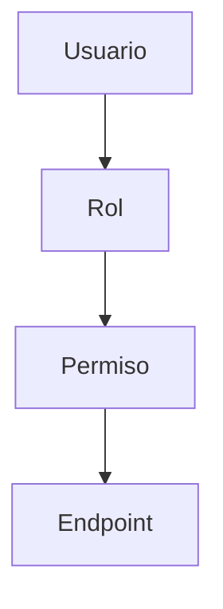

El modelo futuro permitirá:

* asignar uno o más roles a un usuario;
* asociar uno o más permisos a cada rol;
* determinar qué operaciones puede ejecutar un usuario;
* centralizar las reglas de autorización.

Este modelo es conceptual y **no representa entidades actualmente implementadas**.

## 4.11.3 Flujo de Autorización Futuro

Una solicitud protegida deberá seguir conceptualmente:

```text
Cliente

   |

   | Authorization: Bearer ACCESS_TOKEN

   v

API Chiri

   |

   v

Autenticación

   |

   +-- Access Token válido

   +-- Sesión válida

   +-- Usuario activo

   |

   v

Identidad autenticada

   |

   v

Autorización

   |

   +-- Roles

   |

   +-- Permisos

   |

   v

Endpoint solicitado
```

La existencia de una sesión válida no deberá implicar automáticamente autorización para todas las operaciones.

La comprobación de roles y permisos será incorporada cuando el sistema de autorización granular sea implementado.

## 4.11.4 Roles Futuros

Un usuario podrá tener uno o más roles.

Los roles representarán agrupaciones de permisos que permitan administrar la autorización de forma centralizada.

Ejemplo conceptual:

```text
Usuario

   |

   +-- Administrador
   |      |
   |      +-- users.read
   |      +-- users.write
   |      +-- sessions.revoke
   |
   +-- Usuario
          |
          +-- profile.read
          +-- profile.write
```

Los nombres anteriores son únicamente ejemplos conceptuales.

El catálogo definitivo de roles será definido cuando se implemente el sistema de autorización.

## 4.11.5 Permisos Futuros

Los permisos representarán acciones concretas que podrán realizar los usuarios autenticados.

Un permiso deberá corresponder a una operación definida por la API.

Los permisos deberán utilizar identificadores estables y no depender de textos de interfaz del cliente.

Ejemplos conceptuales:

```text
users.read

users.write

sessions.read

sessions.revoke

profile.read

profile.write
```

Los nombres anteriores no constituyen actualmente un catálogo implementado.

## 4.11.6 Validación de Autorización Futura

Cuando se implemente la autorización granular, el Backend deberá comprobar como mínimo:

* identidad del usuario;
* estado de la sesión;
* estado del usuario;
* roles aplicables;
* permisos requeridos por la operación.

El cliente Android no deberá decidir si una operación está autorizada.

La decisión definitiva de autorización deberá realizarse en el Backend.

## 4.11.7 Acceso No Autorizado

Cuando la autorización granular sea implementada, una solicitud realizada por un usuario autenticado que no posea el permiso necesario deberá ser rechazada.

El código HTTP previsto será:

```text
HTTP 403 Forbidden
```

Ejemplo conceptual:

```json
{
  "success": false,
  "error": {
    "code": "AUTH_FORBIDDEN",
    "message": "Insufficient permissions"
  }
}
```

Este comportamiento corresponde al diseño futuro de autorización y **no implica que actualmente exista un catálogo de permisos implementado**.

## 4.11.8 Diferencia entre Autenticación y Autorización

Chiri Platform deberá distinguir:

```text
Autenticación

     |

     +-- ¿Quién es el usuario?

     |

     v

Identidad válida

     |

     v

Autorización

     |

     +-- ¿Qué puede hacer?

     |

     v

Permiso concedido o rechazado
```

Un usuario puede estar correctamente autenticado y aun así no estar autorizado para ejecutar una determinada operación.

Por lo tanto:

```text
401 Unauthorized

    =

problema de autenticación


403 Forbidden

    =

usuario autenticado pero sin autorización
```

La implementación actual de Chiri se encuentra en la capa de autenticación. La autorización granular mediante roles y permisos pertenece a una etapa posterior.

## 4.11.9 Seguridad

Cuando se implemente el sistema de autorización, deberá ejecutarse exclusivamente en el Backend.

El cliente no deberá poder:

* modificar sus propios roles;
* modificar sus propios permisos;
* declarar que posee un permiso;
* omitir las comprobaciones de autorización;
* acceder directamente a PostgreSQL para modificar su autorización.

Los cambios de roles y permisos deberán realizarse mediante operaciones administrativas protegidas y auditables.

### Regla arquitectónica

> La autenticación determina quién es el usuario; la autorización determina qué puede hacer. En la implementación actual, la autenticación está implementada y la autorización granular mediante roles y permisos queda reservada para una etapa futura.

# 4.12 Ejemplo de Control

La autorización de los usuarios dependerá de los roles y permisos que serán implementados posteriormente en el Backend.

Actualmente, Chiri Platform **no dispone todavía de un sistema de autorización granular basado en roles y permisos**.

El siguiente comportamiento representa el modelo previsto para una etapa futura.

### Usuario normal

Un usuario autenticado podrá realizar únicamente las operaciones para las cuales posea los permisos correspondientes.

Ejemplos conceptuales:

* consultar el estado de los servicios permitidos;
* ejecutar acciones autorizadas;
* consultar y modificar recursos propios cuando corresponda.

No deberá poder:

* administrar usuarios;
* modificar roles;
* modificar permisos;
* cambiar configuraciones globales;
* ejecutar operaciones administrativas para las cuales no tenga autorización.

### Administrador

Un administrador podrá realizar operaciones administrativas de acuerdo con los permisos asignados a su rol.

Ejemplos conceptuales:

* gestionar usuarios;
* gestionar roles y permisos;
* gestionar configuraciones de la plataforma;
* ejecutar operaciones administrativas;
* modificar configuraciones críticas cuando posea el permiso correspondiente.

La condición de administrador no deberá sustituir las comprobaciones de autorización realizadas por el Backend.

### Regla

```text id="1qj8h2"
Usuario autenticado
        |
        v
Roles
        |
        v
Permisos
        |
        v
Operación autorizada
```

Este flujo corresponde al modelo futuro de autorización de Chiri Platform.

La autorización deberá determinarse siempre en el Backend.

### Estado de implementación

```text
Actual:

Usuario
   |
   v
Autenticación
   |
   v
Sesión válida


Futuro:

Usuario
   |
   v
Autenticación
   |
   v
Sesión válida
   |
   v
Roles
   |
   v
Permisos
   |
   v
Autorización
```

La implementación de roles y permisos deberá realizarse cuando exista una necesidad funcional real y deberá mantenerse alineada con el modelo de datos definido para Chiri Platform.

# 4.13 Protección de Endpoints

Cada endpoint de la API deberá definir explícitamente:

* si requiere autenticación;
* qué tipo de autenticación requiere;
* qué permisos necesita, cuando corresponda;
* qué roles o condiciones adicionales pueden aplicar;
* qué respuesta corresponde cuando la autenticación falla;
* qué respuesta corresponde cuando la autorización falla.

Actualmente, los mecanismos de autenticación implementados en Chiri Platform utilizan access tokens, sesiones y validación del usuario.

La autorización granular mediante roles y permisos pertenece a una etapa futura.

Un endpoint protegido deberá seguir como mínimo:

```text id="g9m8m3"
Request
   |
   v
Access Token
   |
   v
Autenticación
   |
   +-- válido
   |
   v
Usuario
   |
   v
Autorización
   |
   +-- permiso requerido
   |
   v
Endpoint
```

Cuando se implemente la autorización granular, el Backend deberá comprobar los permisos correspondientes antes de ejecutar las operaciones protegidas.

Ejemplo conceptual:

```text id="1d4x7p"
/users

Autenticación:
    Requerida

Permiso:
    users.read
```

Para una operación de modificación:

```text id="0v4j7e"
/users/{user_id}

Autenticación:
    Requerida

Permiso:
    users.write
```

Los ejemplos anteriores son ilustrativos y no constituyen todavía el catálogo definitivo de permisos de Chiri Platform.

Un endpoint que no requiera autenticación deberá declararse explícitamente como público.

La protección de un endpoint deberá implementarse en el Backend y nunca depender exclusivamente de controles realizados por el cliente.

### Estado actual

Los endpoints actualmente implementados deberán declarar y aplicar sus requisitos de autenticación de acuerdo con los mecanismos existentes.

Los requisitos de autorización mediante roles y permisos serán definidos cuando dicho sistema sea implementado.

### Regla arquitectónica

> Cada endpoint debe declarar sus requisitos de autenticación y autorización, y el Backend debe hacer cumplir dichos requisitos. La autorización mediante roles y permisos será incorporada cuando corresponda según la evolución de Chiri Platform.

# 4.14 Comunicación Segura

Toda comunicación entre clientes y la API de Chiri Platform deberá realizarse mediante HTTPS.

La comunicación segura deberá considerar como mínimo:

* HTTPS;
* certificados TLS válidos;
* validación de certificados por el cliente;
* protección de credenciales;
* protección de tokens;
* prevención de acceso no autorizado;
* protección de información sensible durante el transporte.

Las credenciales y tokens nunca deberán transmitirse mediante HTTP sin cifrado.

El Backend no deberá exponer directamente PostgreSQL ni servicios internos a los clientes.

La comunicación deberá seguir:

```text id="n9t7uo"
Cliente
   |
   | HTTPS / TLS
   v
API Chiri
   |
   +-- autenticación
   |
   +-- autorización
   |
   v
Servicios internos
```

La autenticación deberá ejecutarse mediante los mecanismos definidos por Chiri Platform.

La autorización mediante roles y permisos será incorporada cuando dicho sistema sea implementado.

Los certificados TLS deberán mantenerse válidos y administrados de acuerdo con la infraestructura de despliegue definida para Chiri Platform.

### Regla arquitectónica

> Todo acceso desde un cliente hacia la API deberá protegerse mediante un canal cifrado y autenticado. La seguridad del transporte no deberá depender de controles implementados exclusivamente por el cliente.

# 4.15 Manejo de Sesiones

Chiri Platform utilizará sesiones para representar la relación de autenticación entre un usuario y la plataforma.

Una sesión estará asociada a un único usuario.

La sesión será independiente de los tokens y permitirá determinar si las credenciales asociadas continúan siendo válidas.

La relación conceptual será:

```text
Usuario
   |
   v
Sesión
   |
   +-- Access Token
   |
   +-- Refresh Token
```

Los access tokens y refresh tokens serán credenciales temporales asociadas a la sesión.

La sesión será la unidad lógica utilizada por el Backend para determinar si las credenciales pueden continuar utilizándose.

## 4.15.1 Ciclo de Vida

El ciclo de vida actual de una sesión será:

```text
ACTIVE
   |
   +------------------+
   |                  |
   v                  v
EXPIRED            REVOKED
```

Una sesión `ACTIVE` podrá utilizar sus credenciales mientras se cumplan las condiciones de autenticación definidas por la API.

Una sesión `EXPIRED` o `REVOKED` no podrá utilizarse para acceder a recursos protegidos ni para obtener nuevas credenciales mediante refresh.

Una sesión `REVOKED` no podrá volver posteriormente a `ACTIVE`.

Los estados actualmente definidos son:

* `ACTIVE`;
* `REVOKED`;
* `EXPIRED`.

## 4.15.2 Creación de la Sesión

La sesión será creada como resultado de una autenticación exitosa.

El flujo será:

```text
Credenciales del usuario
        |
        v
Validación de identidad
        |
        v
Usuario válido
        |
        v
Crear sesión
        |
        v
Generar Access Token
        |
        v
Generar Refresh Token
```

La sesión deberá registrar como mínimo la información necesaria para:

* identificar al usuario;
* identificar la sesión;
* determinar su estado;
* determinar su vigencia;
* permitir su revocación.

La sesión deberá permanecer independiente de los tokens generados.

## 4.15.3 Duración de la Sesión

La sesión tendrá una duración máxima de:

```text
30 días
```

La duración de la sesión será independiente de la duración del access token.

La relación será:

```text
Sesión
|
+-- duración máxima: 30 días
|
+-- Access Token
|      |
|      +-- duración máxima: 15 minutos
|
+-- Refresh Token
       |
       +-- duración limitada por la sesión
       +-- rotación obligatoria
```

La expiración del access token no implica por sí misma la expiración de la sesión.

Mientras la sesión continúe `ACTIVE` y no haya expirado, el cliente podrá utilizar un refresh token válido para obtener nuevas credenciales conforme al mecanismo de renovación definido por la API.

La renovación no podrá extender la fecha máxima de expiración de la sesión.

Una vez alcanzada la expiración de la sesión, no podrán generarse nuevas credenciales mediante refresh.

## 4.15.4 Revocación

Una sesión podrá ser revocada por:

* cierre de sesión;
* reutilización confirmada de un refresh token ya rotado;
* otras condiciones de seguridad implementadas posteriormente.

La revocación deberá cambiar el estado de la sesión:

```text
ACTIVE
   |
   v
REVOKED
```

Una sesión revocada no podrá volver a `ACTIVE`.

La revocación de la sesión deberá impedir nuevas operaciones autenticadas mediante las credenciales asociadas a ella.

## 4.15.5 Invalidación de Credenciales

Cuando una sesión sea revocada o expire, las credenciales asociadas a ella dejarán de ser válidas.

Esto incluye:

* access tokens;
* refresh tokens.

En el caso del access token JWT, la firma criptográfica por sí sola no será suficiente para permitir el acceso.

El Backend deberá validar también la sesión asociada mediante el claim `sid`.

Por lo tanto:

```text
JWT válido
    +
Sesión REVOKED
    =
Acceso rechazado
```

De igual forma:

```text
JWT válido
    +
Sesión EXPIRED
    =
Acceso rechazado
```

No deberán generarse nuevas credenciales para una sesión `EXPIRED` o `REVOKED`.

## 4.15.6 Renovación de la Sesión

La renovación de credenciales no creará una nueva sesión lógica.

Cuando el refresh token sea válido:

```text
Sesión ACTIVE
      |
      v
Validar Refresh Token
      |
      v
Revocar Refresh Token utilizado
      |
      +----------------------+
      |                      |
      v                      v
Nuevo Access Token     Nuevo Refresh Token
      |                      |
      +----------+-----------+
                 |
                 v
        Misma sesión existente
```

Los nuevos tokens continuarán asociados a la sesión existente.

La rotación del refresh token no deberá modificar ni extender la fecha máxima de expiración de la sesión.

## 4.15.7 Reutilización de Refresh Token

Un refresh token utilizado correctamente mediante rotación no podrá volver a utilizarse.

Si el Backend detecta la reutilización de un refresh token que ya fue rotado, deberá considerar el evento como una condición de seguridad.

La sesión asociada deberá ser revocada.

El flujo será:

```text
Refresh Token ya utilizado
          |
          v
Intento de reutilización
          |
          v
Detección de reutilización
          |
          v
Revocar sesión
          |
          v
Rechazar solicitud
```

Esta medida evita continuar utilizando una sesión cuando se detecta una posible reutilización de credenciales.

## 4.15.8 Cierre de Sesión

El cierre de sesión permitirá revocar la sesión autenticada mediante:

```http
POST /auth/logout
```

La identidad de la sesión será determinada mediante el access token autenticado.

La solicitud deberá utilizar:

```http
Authorization: Bearer ACCESS_TOKEN
```

El Backend deberá:

* validar el access token;
* identificar la sesión asociada;
* verificar el estado de la sesión;
* revocar la sesión;
* impedir el uso posterior de las credenciales asociadas.

La sesión no deberá eliminarse físicamente como consecuencia del cierre de sesión.

El estado de la sesión deberá pasar de:

```text
ACTIVE
   |
   v
REVOKED
```

Una sesión revocada no podrá volver posteriormente a `ACTIVE`.

### Regla arquitectónica

> El cierre de sesión revoca la sesión lógica asociada al access token autenticado y las credenciales vinculadas a ella, conservando el registro de la sesión para trazabilidad y auditoría.

## 4.15.9 Administración Futura de Sesiones

La arquitectura podrá permitir posteriormente funcionalidades como:

* cierre remoto de una sesión;
* cierre de todas las sesiones;
* listado de sesiones activas;
* revocación individual de sesiones;
* identificación del dispositivo;
* control de sesiones concurrentes.

Estas funcionalidades **no forman parte de la implementación actual**.

Cuando se implementen, deberán realizarse exclusivamente mediante mecanismos protegidos del Backend.

## 4.15.10 Información del Dispositivo

La arquitectura podrá incorporar posteriormente información adicional para identificar el contexto desde el cual se creó una sesión.

Podrá incluir:

* tipo de cliente;
* dispositivo;
* fecha de creación;
* última actividad;
* información necesaria para administración o auditoría.

Los datos concretos de identificación de dispositivos se definirán cuando se implemente esta funcionalidad.

La información del dispositivo no deberá utilizarse por sí sola como mecanismo de autenticación.

## 4.15.11 Auditoría

Los cambios relevantes del ciclo de vida de una sesión podrán registrarse posteriormente mediante el sistema de auditoría de Chiri Platform.

Entre los eventos que podrán registrarse se encuentran:

* creación de sesión;
* renovación;
* revocación;
* expiración;
* cierre de sesión;
* detección de reutilización de refresh token;
* operaciones administrativas relacionadas con sesiones.

El dominio de auditoría todavía no forma parte del modelo de datos implementado.

Los registros de auditoría no deberán almacenar:

* contraseñas;
* access tokens;
* refresh tokens;
* claves privadas;
* otros secretos.

### Regla arquitectónica

> **La sesión es la unidad lógica de autenticación, vigencia y revocación del acceso de un usuario. Los tokens son credenciales temporales asociadas a la sesión y no sustituyen a la sesión como autoridad de seguridad. La renovación de tokens no crea ni extiende la duración máxima de la sesión.**

# 4.16 Clientes Futuros

La arquitectura de autenticación deberá permitir incorporar nuevos clientes sin modificar el núcleo de seguridad del Backend.

Entre los clientes futuros podrán encontrarse:

* aplicación web;
* tablet;
* asistentes de voz;
* otros clientes oficiales de Chiri Platform.

Cada cliente deberá utilizar la API como único punto de entrada hacia los recursos protegidos.

El modelo de autenticación se mantendrá basado en:

```text id="2g8u6q"
Cliente
   |
   v
API Chiri
   |
   +-- Sesión
   |
   +-- Access Token
   |
   +-- Refresh Token
   |
   +-- Autenticación
   |
   +-- Autorización futura
   |
   v
Recursos protegidos
```

La autenticación deberá mantenerse centralizada en el Backend.

La autorización granular mediante roles y permisos será incorporada posteriormente de acuerdo con la evolución de Chiri Platform.

Cada cliente podrá mantener sesiones independientes.

La incorporación de un nuevo cliente no deberá requerir:

* acceso directo a PostgreSQL;
* acceso directo a servicios internos;
* modificación del modelo fundamental de sesiones;
* modificación del mecanismo central de autenticación;
* modificación innecesaria del núcleo de seguridad.

Las particularidades de almacenamiento seguro de credenciales podrán variar según la plataforma cliente.

Cada cliente será responsable de proteger las credenciales almacenadas localmente de acuerdo con las capacidades de seguridad de su plataforma.

La API continuará siendo la única puerta de entrada hacia los recursos protegidos de Chiri Platform.

### Regla arquitectónica

> Los clientes son consumidores de la API y no forman parte del núcleo de confianza de Chiri Platform. La autenticación y las decisiones de seguridad deberán permanecer bajo control del Backend.

# 4.17 Principio Arquitectónico

La seguridad de la API deberá cumplir los siguientes principios:

* ningún cliente obtiene privilegios simplemente por existir;
* toda solicitud protegida deberá autenticarse;
* toda operación que requiera autorización deberá ser evaluada por el Backend;
* la identidad deberá ser validada por el Backend;
* los permisos deberán ser evaluados por el Backend cuando se implemente la autorización granular;
* los clientes no deberán acceder directamente a PostgreSQL;
* los clientes no deberán acceder directamente a servicios internos;
* las credenciales deberán protegerse durante el transporte y almacenamiento;
* las sesiones deberán poder expirar y ser revocadas.

La autenticación deberá permanecer bajo control del Backend y no deberá depender exclusivamente de decisiones tomadas por el cliente.

La autorización granular mediante roles y permisos será incorporada posteriormente de acuerdo con la evolución de Chiri Platform.

### Principio fundamental

> **Ningún cliente tiene privilegios por existir; todo acceso protegido debe ser autenticado y las decisiones de autorización deben ser determinadas por el Backend.**

---

# 5. Integración de API con Servicios Externos

La API de Chiri será la capa intermedia entre los clientes y los servicios externos que formen parte de la plataforma.

Los clientes no deberán comunicarse directamente con los servicios externos.

Las integraciones con servicios externos descritas en este capítulo corresponden a capacidades previstas para futuras etapas, salvo aquellas que sean implementadas explícitamente dentro del Backend.

La API deberá proporcionar una capa de abstracción que permita incorporar, reemplazar o actualizar servicios externos sin obligar a los clientes a conocer sus detalles internos.

---

# 5.1 Arquitectura de Integración

El flujo general previsto será:

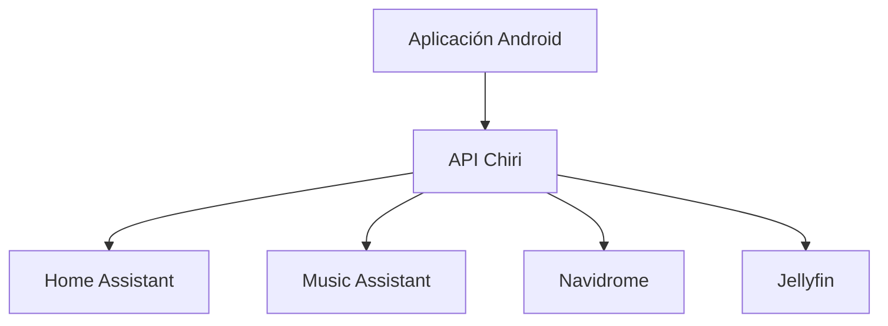

Las integraciones mostradas representan servicios externos que podrán incorporarse progresivamente a la plataforma.

No implican que todos estos servicios estén actualmente expuestos mediante endpoints de la API.

La API deberá actuar como único punto de entrada para los clientes oficiales de Chiri.

---

# 5.2 Responsabilidad del Backend

El Backend será responsable de gestionar la comunicación con los servicios externos que hayan sido integrados.

Entre sus responsabilidades estarán:

* conocer cómo comunicarse con cada servicio;
* gestionar las credenciales necesarias;
* transformar solicitudes internas en solicitudes externas;
* transformar respuestas externas en modelos propios de Chiri;
* ocultar detalles de implementación;
* manejar errores de comunicación;
* aplicar límites de tiempo;
* evitar que errores externos comprometan la estabilidad de la API.

El Backend no deberá trasladar directamente al cliente los contratos específicos de cada servicio externo.

---

# 5.3 Principio de Abstracción

Los clientes de Chiri no deberán conocer los detalles internos de los servicios externos.

Android no deberá depender directamente de:

* direcciones internas;
* puertos Docker;
* nombres de contenedores;
* tokens internos;
* credenciales de servicios;
* APIs específicas de terceros;
* estructuras internas de los servicios.

Ejemplo incorrecto:

```text
Android
   |
   | REST Home Assistant
   |
Home Assistant
```

Ejemplo correcto:

```text
Android
   |
   | API Chiri
   |
Backend
   |
   v
Home Assistant
```

La misma regla deberá aplicarse a los demás servicios externos.

---

# 5.4 Integración con Home Assistant

Home Assistant podrá utilizarse como servicio externo para gestionar capacidades de domótica.

La integración podrá permitir:

* consultar estados de dispositivos;
* ejecutar acciones;
* consultar sensores;
* interactuar con entidades;
* utilizar automatizaciones cuando corresponda.

Chiri no deberá replicar las capacidades internas de Home Assistant.

La responsabilidad de Chiri será proporcionar una interfaz propia para las capacidades que la plataforma decida exponer.

La integración con Home Assistant corresponde a una capacidad prevista para una etapa posterior y no deberá considerarse implementada en la API actual mientras no exista un módulo y contrato específico que la exponga.

---

# 5.5 Integración con Music Assistant

Music Assistant podrá utilizarse como servicio externo para gestionar capacidades relacionadas con reproducción y control musical.

La integración podrá permitir:

* búsqueda de contenido;
* selección de contenido;
* reproducción;
* control de reproducción;
* consulta de reproductores;
* gestión de capacidades musicales.

Chiri no deberá replicar la biblioteca musical administrada por Music Assistant.

Chiri no almacenará como responsabilidad propia:

* archivos de audio;
* biblioteca musical completa;
* metadatos completos administrados por el servicio externo.

Music Assistant permanecerá como propietario de sus propios datos y capacidades internas.

La integración con Music Assistant corresponde a una capacidad prevista para una etapa posterior y no deberá considerarse un endpoint de la API actual mientras no exista su implementación correspondiente.

---

# 5.6 Integración con Navidrome

Navidrome podrá utilizarse como servicio externo para proporcionar acceso a una biblioteca musical personal.

La integración podrá permitir:

* consultar información;
* consultar contenido disponible;
* presentar información al cliente;
* coordinar acciones relacionadas con la reproducción.

Navidrome continuará siendo responsable de su propia biblioteca y de los datos internos relacionados con ella.

Chiri no deberá convertirse en una copia de la base de datos de Navidrome.

La integración deberá limitarse a las capacidades que Chiri necesite exponer mediante su propia API.

La integración con Navidrome corresponde a una capacidad prevista para una etapa posterior.

---

# 5.7 Integración con Jellyfin

Jellyfin podrá utilizarse como servicio externo para gestionar contenido multimedia.

La integración podrá permitir:

* consultar contenido;
* consultar información multimedia;
* iniciar acciones;
* presentar información al cliente;
* coordinar operaciones relacionadas con reproducción.

Jellyfin continuará siendo responsable de:

* sus usuarios multimedia;
* su biblioteca;
* sus metadatos internos;
* sus mecanismos de reproducción;
* sus configuraciones propias.

Chiri no deberá replicar las funciones internas de Jellyfin.

La integración con Jellyfin corresponde a una capacidad prevista para una etapa posterior.

---

# 5.8 Adaptadores de Integración

Cada servicio externo deberá disponer, cuando corresponda, de una capa de integración independiente.

Ejemplo:

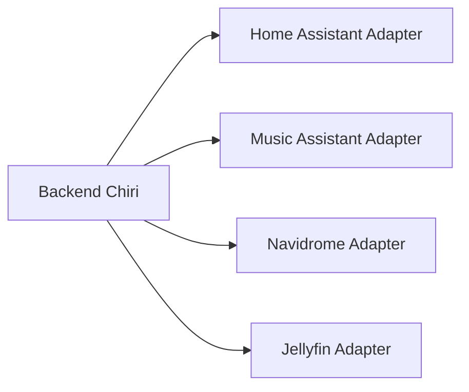

Los adaptadores deberán aislar los detalles específicos de cada servicio.

Un adaptador podrá ser responsable de:

* construir solicitudes externas;
* gestionar autenticación con el servicio;
* interpretar respuestas;
* transformar errores;
* convertir modelos externos a modelos internos de Chiri.

La implementación concreta de estos adaptadores se realizará cuando las integraciones correspondientes sean desarrolladas.

---

# 5.9 Ventaja de los Adaptadores

El uso de adaptadores permitirá:

* cambiar servicios externos;
* actualizar versiones;
* aislar diferencias entre proveedores;
* reducir dependencias directas;
* realizar pruebas independientes;
* mantener estable el contrato interno;
* facilitar futuras sustituciones de servicios.

Por ejemplo, si una capacidad musical cambia de proveedor, el cliente no debería necesitar conocer el cambio.

El cambio deberá quedar aislado principalmente dentro de la capa de integración correspondiente.

---

# 5.10 Manejo de Errores Externos

Los errores producidos por servicios externos deberán transformarse al modelo de errores definido por la API de Chiri.

El cliente no deberá recibir directamente mensajes internos del servicio externo.

Ejemplo de error externo:

```text
Connection refused
```

La API podrá transformarlo en:

```json
{
  "success": false,
  "error": {
    "code": "SERVICE_UNAVAILABLE",
    "message": "External service unavailable"
  }
}
```

La respuesta deberá utilizar los códigos HTTP correspondientes definidos por el contrato de la API.

Los detalles técnicos internos deberán registrarse únicamente de acuerdo con la política de logging y seguridad.

La API no deberá exponer:

* direcciones internas;
* puertos internos;
* credenciales;
* tokens;
* trazas internas;
* detalles innecesarios de infraestructura.

---

# 5.11 Estado de Integraciones

La arquitectura deberá permitir conocer el estado de las integraciones externas.

Cuando esta capacidad sea implementada, podrá contemplar información como:

* servicio disponible;
* conexión activa;
* estado de autenticación;
* última comunicación;
* errores recientes;
* estado de configuración.

Ejemplo conceptual:

```text
Integración
   |
   +-- Servicio
   |
   +-- Estado
   |
   +-- Conectividad
   |
   +-- Última comunicación
   |
   +-- Error reciente
```

Esta capacidad deberá implementarse mediante mecanismos propios de Chiri y no deberá exponer directamente los mecanismos internos del servicio externo.

Actualmente esta funcionalidad corresponde a una capacidad futura.

---

# 5.12 Tiempo de Respuesta

Las integraciones externas deberán considerar las características de cada servicio.

El Backend deberá contemplar:

* límites de espera;
* operaciones rápidas;
* operaciones potencialmente lentas;
* errores de conexión;
* servicios temporalmente no disponibles;
* prevención de bloqueos innecesarios;
* recuperación ante fallos cuando corresponda.

Una falla de un servicio externo no deberá provocar automáticamente la caída de toda la API.

Cuando una operación externa no pueda completarse, la API deberá devolver una respuesta controlada conforme al contrato definido.

Las operaciones que puedan requerir procesamiento prolongado deberán diseñarse posteriormente utilizando mecanismos adecuados para evitar bloquear solicitudes HTTP innecesariamente.

---

# 5.13 Seguridad de las Integraciones

Las credenciales utilizadas para comunicarse con servicios externos deberán permanecer bajo control del Backend.

Los clientes no deberán recibir:

* tokens internos;
* claves de API externas;
* contraseñas de servicios;
* credenciales administrativas;
* secretos de infraestructura.

Las credenciales de integración deberán almacenarse y gestionarse mediante los mecanismos de seguridad definidos para Chiri Platform.

Los servicios externos no deberán convertirse en un mecanismo para evitar la autenticación o autorización de la API de Chiri.

Una solicitud del cliente deberá seguir siendo validada por Chiri antes de ejecutar una operación contra un servicio externo.

El flujo será:

```text
Cliente
   |
   v
Autenticación
   |
   v
Autorización
   |
   v
API Chiri
   |
   v
Adaptador
   |
   v
Servicio Externo
```

---

# 5.14 Independencia de Servicios Externos

Cada servicio externo deberá considerarse una dependencia de Chiri y no parte del núcleo de seguridad de la plataforma.

La indisponibilidad de un servicio externo deberá afectar únicamente las capacidades que dependan de dicho servicio, cuando sea técnicamente posible.

Ejemplo:

```text
Music Assistant no disponible
        |
        +-- Funciones musicales afectadas
        |
        +-- Autenticación de Chiri continúa funcionando
        |
        +-- API de Chiri continúa funcionando
        |
        +-- Otras capacidades continúan funcionando
```

La arquitectura deberá evitar que una dependencia externa se convierta en un punto único de fallo para toda la plataforma.

---

# 5.15 Evolución de las Integraciones

Las integraciones deberán poder evolucionar independientemente del cliente.

Un cambio en un servicio externo no deberá obligar automáticamente a modificar la aplicación Android.

El cambio deberá aislarse mediante:

```text
Servicio Externo
       |
       v
Adaptador
       |
       v
Modelo interno Chiri
       |
       v
API Chiri
       |
       v
Cliente
```

La API deberá mantener contratos propios y estables.

---

# 5.16 Estado Actual y Futuro

Las integraciones descritas en este capítulo representan la arquitectura prevista de integración de Chiri Platform.

El estado actual de la API deberá considerarse únicamente según los endpoints y capacidades realmente implementados y probados en el Backend.

Por lo tanto:

```text
Implementado actualmente
        |
        +-- API FastAPI
        +-- Autenticación
        +-- Sesiones
        +-- Access Tokens
        +-- Refresh Tokens
        +-- Autorización base

Capacidades previstas
        |
        +-- Home Assistant
        +-- Music Assistant
        +-- Navidrome
        +-- Jellyfin
        +-- Adaptadores de integración
        +-- Estado de integraciones
```

La documentación de una integración futura no implica que dicha integración ya forme parte de la API disponible.

---

# 5.17 Principio Arquitectónico

La integración deberá cumplir:

> **Los servicios externos pueden cambiar; Chiri debe mantener estable su contrato interno y evitar que los clientes dependan directamente de dichos servicios.**

La API de Chiri deberá actuar como capa de abstracción entre los clientes y los servicios externos, manteniendo separadas las responsabilidades de cada sistema.

# 6. Modelos de Datos, Solicitudes y Respuestas API

La API de Chiri Platform utilizará modelos de datos definidos para garantizar una comunicación consistente entre los clientes y el Backend.

Los modelos de la API deberán formar parte del contrato de comunicación y deberán mantenerse independientes de los detalles internos de implementación.

Las estructuras descritas en este capítulo distinguen entre los modelos actualmente utilizados por la API y las capacidades previstas para futuras etapas.

---

# 6.1 Principio de Contratos

Cada endpoint deberá definir:

* datos de entrada;
* validaciones;
* respuesta esperada;
* posibles errores;
* códigos HTTP correspondientes.

El contrato deberá establecerse antes de implementar el código cuando se diseñe una nueva capacidad.

La implementación deberá respetar el contrato definido por la API.

---

# 6.2 Separación de Modelos

La API deberá separar conceptualmente:

* Request Models;
* Response Models;
* Domain Models.

Ejemplo:

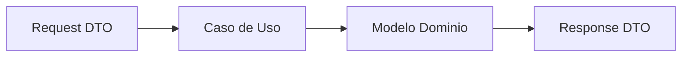

Los modelos expuestos al cliente no deberán depender directamente de las estructuras internas de PostgreSQL.

---

# 6.3 Request Models

Los Request Models representan la información enviada por el cliente.

Su responsabilidad será:

* recibir datos;
* validar formato;
* validar campos obligatorios;
* limitar valores cuando corresponda;
* evitar datos inválidos antes de ejecutar la lógica correspondiente.

Ejemplo conceptual:

```json
{
  "theme": "dark"
}
```

Los modelos de entrada deberán contener únicamente la información necesaria para ejecutar la operación solicitada.

---

# 6.4 Modelos de Autenticación

Los endpoints de autenticación utilizarán modelos específicos para solicitudes y respuestas.

Los modelos de autenticación deberán mantenerse separados de los modelos internos del dominio.

Actualmente la API implementa:

```text
/auth/login
/auth/refresh
/auth/me
/auth/logout
```

Los modelos deberán reflejar el contrato realmente implementado por estos endpoints.

---

## 6.4.1 Login Request

El modelo de inicio de sesión permitirá proporcionar:

* usuario o correo electrónico;
* contraseña.

La estructura actualmente definida será:

```json
{
  "identifier": "usuario_o_correo",
  "password": "contraseña"
}
```

Campos:

| Campo        | Tipo   | Requerido | Descripción                            |
| ------------ | ------ | --------: | -------------------------------------- |
| `identifier` | string |        Sí | Nombre de usuario o correo electrónico |
| `password`   | string |        Sí | Contraseña del usuario                 |

El campo `identifier` permitirá localizar al usuario mediante su nombre de usuario o correo electrónico.

La contraseña deberá transmitirse únicamente mediante HTTPS.

La contraseña no deberá almacenarse en texto plano.

---

## 6.4.2 Login Response

Cuando el inicio de sesión sea correcto, la API devolverá las credenciales necesarias para acceder a recursos protegidos y renovar el acceso.

La estructura será:

```json
{
  "success": true,
  "data": {
    "access_token": "ACCESS_TOKEN",
    "refresh_token": "REFRESH_TOKEN",
    "token_type": "Bearer",
    "expires_in": 900
  },
  "message": null
}
```

Campos:

| Campo           | Tipo        | Descripción                                             |
| --------------- | ----------- | ------------------------------------------------------- |
| `success`       | boolean     | Indica que la operación fue correcta                    |
| `data`          | object      | Datos de autenticación                                  |
| `access_token`  | string      | Credencial utilizada para acceder a recursos protegidos |
| `refresh_token` | string      | Credencial utilizada para renovar el acceso             |
| `token_type`    | string      | Tipo de autenticación                                   |
| `expires_in`    | integer     | Tiempo de vida del access token en segundos             |
| `message`       | string/null | Mensaje opcional                                        |

El valor de `token_type` será:

```text
Bearer
```

El valor actual de `expires_in` será:

```text
900
```

correspondiente a 15 minutos.

El access token deberá enviarse posteriormente mediante:

```http
Authorization: Bearer ACCESS_TOKEN
```

El refresh token deberá utilizarse únicamente mediante el endpoint de renovación.

El `session_id` no será utilizado como credencial HTTP.

---

## 6.4.3 Refresh Request

El modelo de renovación deberá contener el refresh token necesario para solicitar nuevas credenciales.

La estructura será:

```json
{
  "refresh_token": "REFRESH_TOKEN"
}
```

Campos:

| Campo           | Tipo   | Requerido | Descripción                                   |
| --------------- | ------ | --------: | --------------------------------------------- |
| `refresh_token` | string |        Sí | Token utilizado para renovar las credenciales |

El refresh token deberá enviarse únicamente mediante HTTPS.

No deberá enviarse como:

```http
Authorization: Bearer REFRESH_TOKEN
```

---

## 6.4.4 Refresh Response

Cuando la renovación sea correcta, la API devolverá nuevas credenciales.

La estructura será:

```json
{
  "success": true,
  "data": {
    "access_token": "NEW_ACCESS_TOKEN",
    "refresh_token": "NEW_REFRESH_TOKEN",
    "token_type": "Bearer",
    "expires_in": 900
  },
  "message": null
}
```

La renovación utilizará rotación de refresh tokens.

Por lo tanto:

```text
Refresh Token anterior
        |
        v
Invalidado
        |
        +-- Nuevo Access Token
        |
        +-- Nuevo Refresh Token
```

La renovación no deberá crear una nueva sesión lógica.

Los nuevos tokens continuarán asociados a la sesión existente.

---

## 6.4.5 Logout Request

El cierre de sesión actualmente no requiere un Request Body.

El endpoint será:

```http
POST /auth/logout
```

La autenticación se realizará mediante el access token:

```http
Authorization: Bearer ACCESS_TOKEN
```

La sesión será identificada por el Backend a partir del access token autenticado.

El cliente no deberá enviar `session_id` como mecanismo de autenticación.

Por lo tanto, el Request no tendrá un modelo de cuerpo obligatorio:

```text
Body: ninguno
```

---

## 6.4.6 Session / Authentication Response

La API actualmente dispone del endpoint:

```http
GET /auth/me
```

Este endpoint permite consultar la identidad del usuario autenticado.

La solicitud requiere:

```http
Authorization: Bearer ACCESS_TOKEN
```

La respuesta deberá contener únicamente la información necesaria para identificar al usuario autenticado y no deberá exponer credenciales ni secretos.

El modelo definitivo de información de perfil podrá ampliarse posteriormente conforme evolucionen las capacidades de la plataforma.

La existencia de un access token almacenado localmente no deberá considerarse suficiente para determinar que una sesión continúa siendo válida.

La validación definitiva deberá realizarse en el Backend.

---

# 6.5 Response Models

Los Response Models representan la información devuelta por Chiri.

Los modelos de respuesta deberán definir explícitamente la información que puede recibir el cliente.

Ejemplo conceptual:

```json
{
  "success": true,
  "data": {
    "theme": "dark"
  },
  "message": null
}
```

Los Response Models no deberán exponer:

* contraseñas;
* hashes de contraseñas;
* tokens internos;
* hashes de tokens;
* claves privadas;
* credenciales de servicios externos;
* información interna innecesaria.

---

# 6.6 Modelo de Respuesta Estándar

La API deberá utilizar una estructura consistente para sus respuestas cuando el contrato del endpoint utilice este modelo.

Respuesta de éxito:

```json
{
  "success": true,
  "data": {},
  "message": null
}
```

Respuesta de error:

```json
{
  "success": false,
  "data": null,
  "error": {
    "code": "ERROR_CODE",
    "message": "Description"
  }
}
```

La estructura deberá mantenerse estable para facilitar el consumo por parte de los clientes.

Los campos concretos de cada respuesta deberán corresponder al contrato del endpoint.

---

# 6.7 Códigos de Error

Los errores deberán utilizar códigos estables y descriptivos.

Ejemplos conceptuales:

```text
AUTH_REQUIRED

AUTH_INVALID_ACCESS_TOKEN

AUTH_INVALID_REFRESH_TOKEN

AUTH_INVALID_CREDENTIALS

AUTH_FORBIDDEN

VALIDATION_ERROR

RESOURCE_NOT_FOUND

SERVICE_UNAVAILABLE
```

Los códigos deberán permitir que el cliente identifique la categoría del error sin depender del texto descriptivo.

Los mensajes podrán cambiar cuando sea necesario, mientras que los códigos deberán mantenerse estables siempre que sea compatible con el contrato.

---

# 6.8 Validación de Datos

La API deberá validar los datos recibidos antes de ejecutar la operación correspondiente.

Las validaciones podrán incluir:

* campos obligatorios;
* formatos;
* tamaños;
* longitudes;
* valores permitidos;
* relaciones entre campos.

En autenticación, por ejemplo:

```text
identifier
    |
    +-- no vacío
    +-- longitud válida

password
    |
    +-- no vacío
    +-- longitud válida
```

La validación de entrada no deberá utilizarse para revelar información sensible sobre usuarios o credenciales.

---

# 6.9 Paginación

Los endpoints que posteriormente devuelvan grandes cantidades de datos deberán soportar mecanismos de paginación cuando corresponda.

La paginación deberá formar parte del contrato específico del endpoint cuando la cantidad de información lo justifique.

Ejemplo conceptual:

```text
/media?page=1&limit=20
```

Respuesta conceptual:

```json
{
  "items": [],
  "page": 1,
  "total": 100
}
```

La implementación de paginación dependerá de las capacidades y recursos que se incorporen posteriormente a la API.

Actualmente no constituye una capacidad general implementada en los endpoints de autenticación.

Los parámetros y la estructura definitiva de paginación deberán establecerse cuando se implementen los recursos que requieran este mecanismo.

### Regla arquitectónica

> La paginación deberá incorporarse cuando un recurso pueda generar cantidades significativas de información, manteniendo un contrato claro y consistente para el cliente.

# 6.10 Filtros

Los endpoints que posteriormente necesiten consultar colecciones podrán utilizar filtros mediante parámetros definidos por su contrato.

Ejemplo conceptual:

```text
/devices?status=online
```

Los filtros deberán:

* utilizar nombres claros;
* validar los valores recibidos;
* evitar ambigüedad;
* formar parte del contrato del endpoint.

Los filtros mostrados son ejemplos conceptuales y no constituyen endpoints actualmente implementados.

La estructura y los parámetros definitivos de filtrado deberán establecerse cuando se implementen los recursos que requieran este mecanismo.

### Regla arquitectónica

> Los filtros deberán formar parte explícita del contrato de cada endpoint y utilizar parámetros claros, validados y consistentes.

---

# 6.11 Ordenamiento

Los endpoints que posteriormente devuelvan colecciones podrán permitir ordenar los resultados.

Ejemplo conceptual:

```text
/events?sort=-created_at
```

La sintaxis de ordenamiento deberá definirse explícitamente dentro del contrato de cada endpoint.

No deberá asumirse que todos los recursos soportarán ordenamiento.

Esta capacidad corresponde a una etapa futura y no representa una funcionalidad actualmente implementada en la API.

### Regla arquitectónica

> El ordenamiento deberá definirse explícitamente por endpoint cuando sea necesario y deberá formar parte de su contrato.

# 6.12 Fechas

Las fechas expuestas por la API deberán utilizar un formato estándar.

La convención será:

```text
ISO 8601
UTC
```

Ejemplo:

```text
2026-08-06T20:00:00Z
```

Los valores de fecha y hora deberán ser interpretables de manera consistente por todos los clientes.

Cuando corresponda, las fechas deberán representar explícitamente información como:

* creación;
* expiración;
* actualización;
* última actividad.

---

# 6.13 Identificadores

Los identificadores expuestos por la API deberán ser:

* estables;
* únicos;
* independientes de servicios externos;
* adecuados para identificar la entidad correspondiente.

Cuando corresponda, Chiri utilizará UUID como identificador.

Los identificadores internos de servicios externos no deberán sustituir automáticamente a los identificadores propios de Chiri.

---

# 6.14 Versionado de Modelos

Los cambios importantes en las estructuras de datos deberán considerar:

* compatibilidad;
* transición;
* impacto sobre clientes existentes;
* necesidad de una nueva versión;
* mantenimiento temporal de modelos anteriores cuando sea necesario.

Los cambios incompatibles no deberán introducirse sin una estrategia de transición.

Ejemplo:

```text
Modelo actual
     |
     v
Periodo de compatibilidad
     |
     v
Nuevo modelo
```

La versión de la API deberá utilizarse cuando un cambio incompatible afecte el contrato público.

---

# 6.15 Seguridad de los Modelos

Los modelos API deberán evitar la exposición de información sensible.

Los Request Models no deberán aceptar datos que el cliente no tenga autorización para modificar.

Los Response Models no deberán devolver información interna innecesaria.

En particular, los modelos de autenticación no deberán exponer:

* contraseñas;
* hashes de contraseñas;
* claves privadas;
* hashes de refresh tokens;
* información interna de sesiones;
* secretos de infraestructura.

Los tokens que deban enviarse al cliente deberán hacerlo únicamente como parte del contrato de autenticación definido.

---

# 6.16 Relación entre Modelos y Capas

Los modelos de la API deberán mantener separación respecto de las capas internas.

El flujo conceptual será:

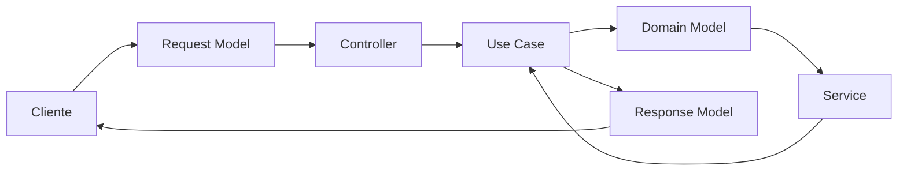

El cliente no deberá conocer los modelos internos utilizados por PostgreSQL ni por los servicios externos.

---

# 6.17 Estado Actual de los Modelos API

Los modelos actualmente relacionados con autenticación corresponden a las capacidades implementadas en el Backend.

Actualmente se dispone de:

```text
POST /auth/login
        |
        +-- Login Request
        +-- Login Response

POST /auth/refresh
        |
        +-- Refresh Request
        +-- Refresh Response

GET /auth/me
        |
        +-- Access Token
        +-- Información del usuario autenticado

POST /auth/logout
        |
        +-- Sin Request Body
        +-- Access Token
```

Las capacidades de paginación, filtros, ordenamiento y otros modelos de dominio serán incorporadas cuando se implementen los recursos correspondientes.

La documentación no deberá considerar implementada una capacidad únicamente por estar definida conceptualmente en este documento.

---

# 6.18 Principio Arquitectónico

Los modelos API deberán cumplir:

> **El contrato de comunicación debe ser más estable que la implementación interna.**

Los clientes deberán depender de contratos definidos por Chiri y no de:

* tablas PostgreSQL;
* modelos ORM;
* estructuras internas del Backend;
* APIs específicas de servicios externos;
* detalles de infraestructura.

De esta forma, el Backend podrá evolucionar internamente manteniendo estable la comunicación con los clientes.

# 7. Documentación, Pruebas y Calidad de API

La API de Chiri Platform deberá mantenerse documentada y probada para garantizar estabilidad durante su evolución.

---

# 7.1 Documentación Oficial

La API deberá contar con documentación automática basada en OpenAPI.

La documentación deberá incluir:

* endpoints disponibles.
* parámetros.
* modelos de solicitud.
* modelos de respuesta.
* códigos de error.
* autenticación requerida.

---

# 7.2 OpenAPI

FastAPI permitirá generar documentación automática.

Interfaces esperadas:

```text id="6m2q8x"
OpenAPI Schema

Swagger UI

Documentación interactiva
```

---

# 7.3 Documentación como Parte del Código

La documentación no deberá mantenerse como información separada que pueda quedar desactualizada.

Regla:

```text id="4x7m2q"
Código

+

Contrato API

+

Documentación

=
Una sola fuente coherente
```

---

# 7.4 Pruebas de API

La API deberá contar con diferentes niveles de pruebas.

---

## Pruebas Unitarias

Validan componentes individuales.

Ejemplos:

* validadores.
* servicios.
* casos de uso.

---

## Pruebas de Integración

Validan comunicación entre componentes.

Ejemplos:

* API + PostgreSQL.
* API + Home Assistant.
* API + Music Assistant.

---

## Pruebas de Contrato

Validan que:

* las respuestas mantengan estructura.
* los modelos no cambien inesperadamente.
* los clientes continúen funcionando.

---

# 7.5 Flujo de Calidad

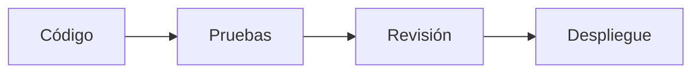

---

# 7.6 Entornos

La API deberá manejar ambientes separados:

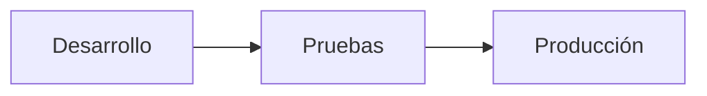

---

# 7.7 Cambios en API

Antes de modificar un endpoint existente deberá evaluarse:

* impacto en Android.
* impacto en futuros clientes.
* compatibilidad.

---

# 7.8 Deprecación

Cuando una API quede obsoleta:

No deberá eliminarse inmediatamente.

Proceso:

```text id="3m8q5x"
Versión antigua

↓

Aviso de cambio

↓

Nueva versión

↓

Retiro controlado
```

---

# 7.9 Registro de Cambios

Los cambios importantes deberán documentarse.

Ejemplos:

* nuevo endpoint.
* cambio de modelo.
* modificación de permisos.

---

# 7.10 Monitoreo

La API deberá permitir observar:

* errores.
* tiempos de respuesta.
* disponibilidad.
* uso de endpoints.

---

# 7.11 Principio Arquitectónico

La calidad de API deberá cumplir:

> Un cambio pequeño no debe convertirse en un problema grande para toda la plataforma.

# 8. Despliegue y Operación de la API

La API Chiri será desplegada como un servicio independiente dentro de la infraestructura Docker de la plataforma.

La configuración de despliegue deberá permitir mantener separados los ambientes de desarrollo, pruebas y producción, evitando que los detalles de infraestructura formen parte de la lógica de aplicación.

---

# 8.1 Ejecución mediante Docker

La API deberá ejecutarse dentro de un contenedor Docker.

Arquitectura:

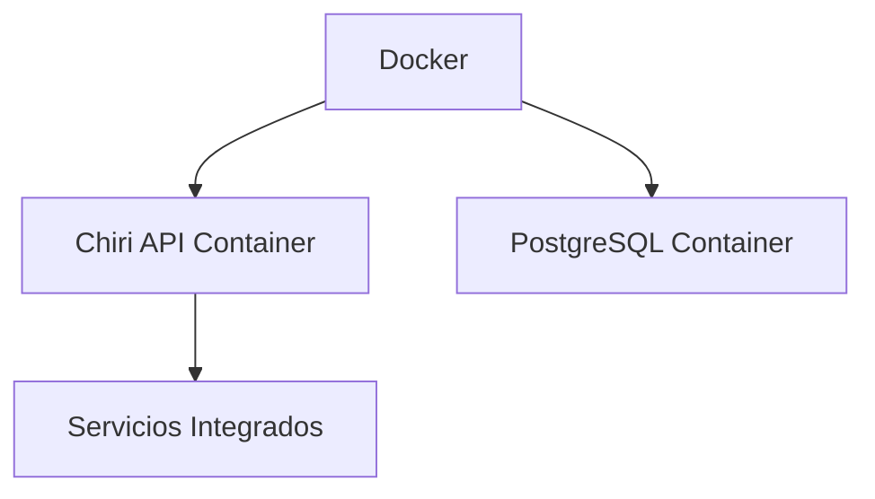

El contenedor de la API deberá contener únicamente los componentes necesarios para ejecutar el Backend.

PostgreSQL y los servicios externos deberán mantenerse como componentes independientes.

---

# 8.2 Independencia del Entorno

La API deberá poder ejecutarse en:

* desarrollo.
* pruebas.
* producción.

La lógica de aplicación deberá mantenerse independiente del ambiente de ejecución.

Las diferencias entre ambientes deberán controlarse mediante configuración.

El código de la aplicación no deberá modificarse únicamente para cambiar de ambiente.

---

# 8.3 Configuración mediante Variables de Entorno

La configuración de la API no deberá estar escrita directamente en el código fuente.

La aplicación deberá obtener mediante configuración externa los valores dependientes del entorno.

Entre estos valores podrán encontrarse:

```text
DATABASE_URL

MIGRATION_DATABASE_URL

JWT_PRIVATE_KEY_PATH

JWT_PUBLIC_KEY_PATH

JWT_ISSUER

JWT_AUDIENCE

ENVIRONMENT
```

Los nombres definitivos deberán corresponder a la configuración utilizada por la implementación del Backend.

Las claves privadas, credenciales y otros secretos no deberán almacenarse directamente en el código fuente ni publicarse en el repositorio.

---

# 8.4 Separación de Configuración

Los diferentes ambientes deberán utilizar configuraciones independientes.

Conceptualmente:

```text
development

testing

production
```

Cada ambiente deberá utilizar sus propios:

* datos de conexión.
* credenciales.
* claves.
* parámetros de ejecución.
* servicios externos.

La configuración de producción no deberá reutilizarse accidentalmente en desarrollo o pruebas.

---

# 8.5 Comunicación Interna

La comunicación entre la API, PostgreSQL y los servicios integrados deberá realizarse mediante los mecanismos de red definidos por la infraestructura de Chiri.

Cuando los componentes se ejecuten dentro de Docker, se deberán utilizar redes Docker apropiadas para permitir la comunicación entre servicios sin exponer innecesariamente dichos servicios hacia el exterior.

Ejemplo:

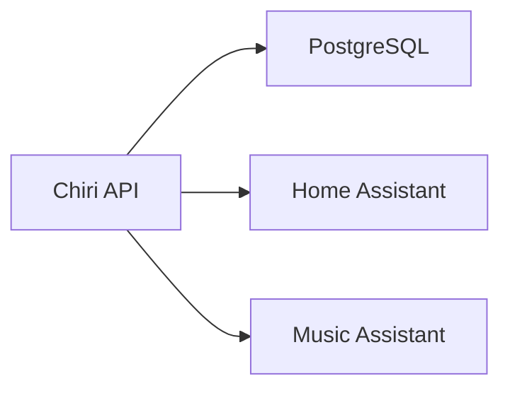

La API será responsable de comunicarse con los servicios internos mediante sus mecanismos de integración correspondientes.

Los clientes externos no deberán acceder directamente a PostgreSQL ni a los servicios internos.

---

# 8.6 Exposición de Puertos

Solo deberán exponerse los puertos estrictamente necesarios para la operación de la plataforma.

Los servicios internos no deberán exponerse públicamente cuando la comunicación pueda realizarse mediante redes internas.

Principio:

```text
Menor exposición

=

Mayor seguridad
```

La configuración de puertos deberá definirse según el ambiente de despliegue.

---

# 8.7 Logs

La API deberá generar registros suficientes para permitir diagnosticar problemas operativos.

Los registros podrán incluir:

* errores.
* eventos importantes.
* problemas de integración.
* información necesaria para diagnosticar fallos.
* información operacional no sensible.

Los logs deberán evitar almacenar información confidencial o secretos.

No deberán registrarse:

* contraseñas.
* access tokens.
* refresh tokens.
* claves privadas.
* otros secretos de autenticación.

---

# 8.8 Niveles de Log

La API deberá considerar niveles de registro adecuados para cada ambiente.

Niveles conceptuales:

```text
DEBUG

INFO

WARNING

ERROR

CRITICAL
```

Durante desarrollo podrán utilizarse niveles más detallados.

En producción deberá limitarse el nivel de detalle para evitar exposición innecesaria de información interna o sensible.

---

# 8.9 Reinicio Automático

El despliegue deberá permitir que el contenedor de la API pueda recuperarse automáticamente ante situaciones como:

* reinicio del servidor.
* reinicio del contenedor.
* fallo temporal del proceso.
* actualización controlada.

El mecanismo de reinicio deberá estar definido por la configuración Docker utilizada en cada ambiente.

El reinicio automático no deberá considerarse una solución para errores permanentes de aplicación.

---

# 8.10 Salud del Servicio

La API deberá disponer de un mecanismo para comprobar que el servicio HTTP se encuentra disponible.

El endpoint definido actualmente para esta finalidad es:

```http
GET /health
```

Este endpoint permitirá comprobar la disponibilidad básica de la API.

La existencia de una respuesta correcta de `/health` no deberá interpretarse automáticamente como garantía de disponibilidad de todos los servicios externos o dependencias.

Las comprobaciones de dependencias podrán ampliarse posteriormente mediante mecanismos de health checks más completos.

---

# 8.11 Actualizaciones

Las actualizaciones de la API deberán seguir un proceso controlado.

Flujo:


Antes de desplegar cambios importantes deberán ejecutarse las pruebas correspondientes.

Cuando el cambio afecte datos persistentes o migraciones de base de datos, deberá existir un mecanismo de respaldo y recuperación apropiado.

Las actualizaciones deberán evitar cambios incompatibles no evaluados previamente.

---

# 8.12 Recuperación

Ante un reinicio o recuperación del servidor, el proceso esperado será:

```text
Servidor reinicia

↓

Docker inicia servicios

↓

API inicia

↓

API queda disponible

↓

Se comprueban las dependencias
según los mecanismos configurados

↓

Servicio operativo
```

La recuperación deberá minimizar la intervención manual.

Los mecanismos concretos para comprobar dependencias deberán implementarse de acuerdo con las necesidades de cada servicio.

Un fallo de una dependencia externa no deberá provocar necesariamente la caída permanente del proceso de la API.

---

# 8.13 Principio Arquitectónico

La operación de la API deberá cumplir:

> **La plataforma debe poder reiniciarse y recuperarse de forma controlada, manteniendo la separación entre código, configuración e infraestructura y evitando una intervención manual innecesaria.**

# 9. Seguridad Avanzada de API

La API de Chiri Platform deberá incorporar medidas adicionales de seguridad para proteger la plataforma, sus usuarios y sus servicios integrados.

Estas medidas deberán complementar los mecanismos de autenticación, autorización, manejo de sesiones y comunicación segura definidos anteriormente.

Las funcionalidades que todavía no hayan sido implementadas deberán considerarse requisitos de evolución de la plataforma y no funcionalidades disponibles actualmente.

---

# 9.1 Seguridad por Capas

La protección de la API no dependerá de un único mecanismo.

Se aplicarán varias capas:

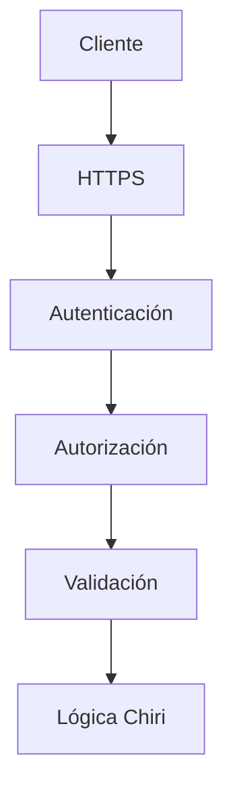

Cada capa deberá cumplir una responsabilidad específica.

El fallo de una capa deberá impedir que una solicitud pueda continuar hacia operaciones protegidas cuando corresponda.

---

# 9.2 Validación de Entradas

Toda información recibida por la API deberá ser validada antes de ser utilizada por la lógica de aplicación.

Se deberá controlar como mínimo:

* tipos de datos;
* formatos;
* valores permitidos;
* tamaño máximo;
* campos obligatorios;
* restricciones específicas del modelo.

Ejemplo:

Incorrecto:

```json
{
    "volume": "mucho"
}
```

Correcto:

```json
{
    "volume": 50
}
```

La validación deberá realizarse en el Backend.

El cliente podrá realizar validaciones para mejorar la experiencia de usuario, pero estas nunca sustituirán las validaciones del servidor.

---

# 9.3 Protección contra Datos Maliciosos

La API deberá prevenir el procesamiento inseguro de información proporcionada por clientes.

Se deberá considerar protección contra:

* inyección SQL;
* solicitudes inválidas;
* datos inesperados;
* parámetros manipulados;
* ejecución no autorizada;
* acceso a recursos fuera del alcance permitido.

Las consultas a PostgreSQL deberán realizarse mediante los mecanismos seguros proporcionados por la capa de acceso a datos.

Los datos recibidos desde clientes no deberán incorporarse directamente en consultas SQL sin los mecanismos apropiados de parametrización o abstracción.

---

# 9.4 Rate Limiting

La API deberá considerar mecanismos de limitación de solicitudes para proteger los recursos de la plataforma.

Los objetivos serán:

* evitar abuso;
* reducir ataques automatizados;
* proteger recursos;
* mantener disponibilidad;
* limitar intentos excesivos de autenticación.

Ejemplo conceptual:

```text
Cliente normal

    ↓

Solicitudes permitidas


Cliente abusivo

    ↓

Solicitudes limitadas
```

Los límites concretos deberán definirse según el tipo de endpoint, operación y riesgo.

Los endpoints de autenticación podrán requerir políticas de limitación más estrictas que otras operaciones.

La implementación de rate limiting se considerará una capacidad de seguridad adicional y deberá incorporarse cuando corresponda al despliegue de la API.

---

# 9.5 Protección de Endpoints Sensibles

Las operaciones críticas deberán contar con controles de seguridad apropiados.

Ejemplos:

* administración de usuarios;
* cambios de roles;
* cambios de permisos;
* modificaciones de configuración;
* acciones críticas de dispositivos;
* operaciones administrativas.

Como mínimo, estas operaciones deberán:

* requerir autenticación;
* validar la sesión;
* comprobar los permisos correspondientes;
* rechazar solicitudes no autorizadas;
* evitar revelar información interna.

Los controles concretos dependerán del catálogo definitivo de permisos de Chiri Platform.

---

# 9.6 Gestión de Secretos

La API no deberá almacenar secretos directamente en el código fuente.

Ejemplo incorrecto:

```python
PASSWORD = "clave123"
```

Los secretos deberán obtenerse mediante mecanismos externos de configuración.

Ejemplos:

```text
Variables de entorno

Configuración segura del entorno

Secret Manager futuro
```

Los secretos podrán incluir:

* contraseñas;
* credenciales de servicios;
* claves privadas;
* tokens internos;
* claves de integración;
* otros valores confidenciales.

Las claves privadas utilizadas para firmar credenciales deberán permanecer protegidas y no deberán formar parte del repositorio.

---

# 9.7 Información Sensible en Respuestas

Las respuestas de la API deberán devolver únicamente la información necesaria para que el cliente pueda realizar la operación solicitada.

No deberán exponerse:

* contraseñas;
* hashes de contraseñas;
* access tokens innecesarios;
* refresh tokens innecesarios;
* claves privadas;
* credenciales internas;
* secretos de servicios;
* información interna de infraestructura;
* información sensible que no sea necesaria para el cliente.

La información de PostgreSQL y de servicios internos deberá permanecer abstraída detrás de la API.

---

# 9.8 Auditoría de Seguridad

Las acciones relevantes de seguridad deberán poder registrarse para permitir trazabilidad y análisis posterior.

Entre los eventos que podrán requerir auditoría se encuentran:

* inicio de sesión;
* cierre de sesión;
* renovación de sesión;
* revocación de sesión;
* cambios de permisos;
* cambios de roles;
* modificaciones administrativas;
* eventos de seguridad;
* detección de reutilización de refresh tokens.

Los registros de auditoría no deberán almacenar:

* contraseñas;
* access tokens;
* refresh tokens;
* claves privadas;
* secretos.

La implementación y el nivel de detalle de la auditoría deberán definirse de acuerdo con la evolución de la plataforma.

---

# 9.9 Protección de Errores

Los errores enviados al cliente deberán utilizar mensajes controlados y no deberán revelar información interna innecesaria.

Incorrecto:

```text
Error SQL:

password authentication failed for user postgres
```

Correcto:

```json
{
    "success": false,
    "data": null,
    "error": {
        "code": "DATABASE_ERROR",
        "message": "Internal server error"
    }
}
```

Los errores internos deberán registrarse de acuerdo con la política de logs, mientras que el cliente deberá recibir únicamente la información necesaria.

La API no deberá revelar:

* consultas SQL;
* credenciales;
* rutas internas;
* nombres de infraestructura;
* claves;
* detalles internos de implementación;
* stack traces en producción.

---

# 9.10 Seguridad en Integraciones

Las conexiones con servicios externos deberán utilizar mecanismos de seguridad apropiados.

Las integraciones deberán:

* utilizar credenciales protegidas;
* validar las respuestas recibidas;
* controlar tiempos de espera;
* manejar errores;
* evitar exponer credenciales al cliente;
* evitar que los errores internos de un servicio sean expuestos directamente;
* limitar la comunicación a las operaciones necesarias.

El cliente Android no deberá recibir las credenciales utilizadas por Chiri para comunicarse con servicios internos.

La API será responsable de abstraer los detalles de las integraciones.

---

# 9.11 Protección ante Fallos de Servicios Externos

Un fallo de un servicio externo no deberá provocar necesariamente una exposición de información interna ni comprometer la seguridad de la API.

Cuando una integración no esté disponible, la API deberá:

* controlar el tiempo de espera;
* evitar bloqueos indefinidos;
* manejar la excepción;
* registrar el problema según la política de logs;
* devolver un error controlado al cliente.

Ejemplo conceptual:

```text
API Chiri
    |
    v
Music Assistant
    |
    X
Servicio no disponible
    |
    v
API Chiri
    |
    v
SERVICE_UNAVAILABLE
```

El cliente no deberá recibir detalles internos sobre la causa técnica del fallo.

---

# 9.12 Preparación para Acceso Remoto

Si Chiri Platform es accesible fuera de la red local, deberán aplicarse medidas adicionales de protección.

Como mínimo se deberá considerar:

* HTTPS obligatorio;
* certificados TLS válidos;
* autenticación;
* autorización;
* exposición mínima de servicios;
* protección de credenciales;
* protección contra abuso;
* monitoreo;
* registro de eventos relevantes.

Los servicios internos no deberán exponerse directamente a Internet únicamente para permitir el funcionamiento de los clientes.

El acceso externo deberá realizarse mediante la arquitectura de exposición definida para Chiri Platform.

---

# 9.13 Protección de Credenciales

Las credenciales deberán protegerse durante todo su ciclo de vida.

Esto incluye:

```text
Creación
   |
   v
Transmisión segura
   |
   v
Almacenamiento seguro
   |
   v
Uso controlado
   |
   v
Revocación / expiración
```

Las contraseñas deberán manejarse mediante mecanismos de hash seguros.

Los tokens deberán protegerse de acuerdo con el modelo de autenticación definido por Chiri Platform.

Las credenciales que ya no sean válidas no deberán continuar utilizándose.

---

# 9.14 Principio de Mínimo Privilegio

Los usuarios, servicios y componentes deberán disponer únicamente de los permisos necesarios para realizar sus funciones.

El principio será:

```text
Necesidad de acceso
       |
       v
Permiso mínimo necesario
       |
       v
Operación permitida
```

La API no deberá conceder permisos adicionales simplemente porque un usuario esté autenticado.

Los servicios internos también deberán utilizar credenciales con el menor nivel de privilegio razonablemente posible.

---

# 9.15 Defensa ante Enumeración de Usuarios

Los endpoints relacionados con autenticación deberán evitar revelar información que permita determinar si una cuenta existe.

Las respuestas de autenticación deberán utilizar mensajes suficientemente genéricos cuando corresponda.

Ejemplo:

```text
AUTH_INVALID_CREDENTIALS
```

La API no deberá responder de forma diferente únicamente para indicar:

```text
Usuario inexistente
```

frente a:

```text
Contraseña incorrecta
```

cuando dicha diferencia permita enumerar cuentas válidas.

---

# 9.16 Seguridad de Tokens

Los tokens deberán tratarse como credenciales sensibles.

La API deberá:

* proteger los tokens durante el transporte;
* evitar registrarlos en logs;
* evitar almacenarlos innecesariamente;
* validar su vigencia;
* validar la sesión asociada;
* impedir la reutilización de refresh tokens rotados;
* revocar las credenciales asociadas cuando corresponda.

La firma criptográfica del access token no deberá considerarse suficiente cuando la arquitectura requiera validar adicionalmente el estado de la sesión.

---

# 9.17 Resiliencia de Seguridad

Los mecanismos de seguridad deberán continuar funcionando ante fallos parciales de otros componentes.

Ejemplo:

```text
Servicio externo caído
        |
        v
API continúa funcionando
        |
        v
Solicitud controlada
        |
        v
Error seguro
```

Un fallo de un servicio externo no deberá provocar:

* exposición de secretos;
* bypass de autorización;
* acceso directo a recursos protegidos;
* revelación de información interna.

---

# 9.18 Evolución de la Seguridad

Las medidas de seguridad deberán poder ampliarse conforme Chiri Platform evolucione.

Podrán incorporarse posteriormente:

* rate limiting avanzado;
* auditoría completa;
* detección de abuso;
* administración avanzada de sesiones;
* controles adicionales para clientes;
* mecanismos de protección ante ataques automatizados;
* gestión centralizada de secretos;
* monitoreo de seguridad.

Estas capacidades deberán incorporarse sin romper el modelo fundamental de autenticación y autorización.

---

# 9.19 Principio Arquitectónico

La seguridad de la API deberá cumplir:

> **La comodidad nunca debe eliminar el control sobre quién puede acceder, qué puede ejecutar y qué información puede obtener.**

La seguridad deberá mantenerse como una responsabilidad transversal de la plataforma y no como una característica exclusiva del cliente.

# 10. Conclusión y Reglas Finales de API

La API de Chiri Platform v1.0 queda definida como la capa central de comunicación de la plataforma.

Su función será conectar clientes, lógica de negocio y servicios integrados mediante un contrato estable, seguro y mantenible.

---

# 10.1 Decisiones Confirmadas

La API utilizará:

* FastAPI.
* Python.
* REST.
* JSON.
* HTTPS.
* OpenAPI.
* Versionado mediante `/api/v1`.

---

# 10.2 Responsabilidad Confirmada

La API será responsable de:

* exponer capacidades de Chiri;
* validar solicitudes;
* controlar acceso;
* ejecutar casos de uso;
* comunicarse con servicios externos;
* devolver respuestas consistentes.

---

# 10.3 Límites Confirmados

La API NO será responsable de:

* reemplazar Home Assistant;
* reemplazar Music Assistant;
* reemplazar Navidrome;
* reemplazar Jellyfin;
* almacenar archivos multimedia;
* permitir acceso directo a servicios internos.

---

# 10.4 Arquitectura Final

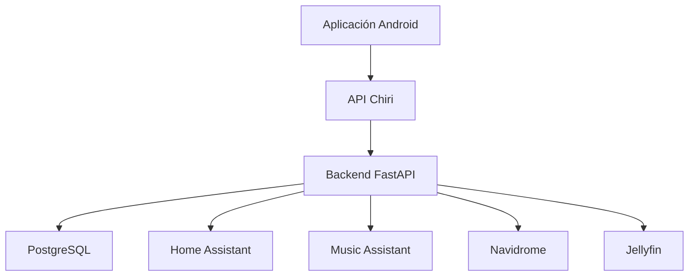

---

# 10.5 Reglas que no deben romperse

## Regla 1

Ningún cliente accederá directamente a servicios internos.

---

## Regla 2

Todo acceso deberá pasar por la API Chiri.

---

## Regla 3

Los endpoints representan capacidades, no implementaciones internas.

---

## Regla 4

Los contratos existentes no deben romperse sin una estrategia de migración.

---

## Regla 5

Toda nueva funcionalidad debe diseñarse primero como contrato API.

---

## Regla 6

La seguridad debe formar parte del diseño inicial.

---

# 10.6 Evolución Futura

La API permitirá agregar:

* nuevos clientes;
* nuevas integraciones;
* asistentes inteligentes;
* automatizaciones;
* servicios futuros.

Sin modificar la arquitectura principal.

---

# 10.7 Estado del Documento

El documento:

```text
060_API.md
```

queda definido como referencia oficial para la arquitectura de comunicación de Chiri Platform v1.0.

Cualquier implementación futura deberá respetar:

* estructura REST;
* versionado;
* seguridad;
* contratos;
* separación de responsabilidades.

---

# Declaración Final

La API de Chiri Platform v1.0 será el punto de unión entre todos los componentes de la plataforma.

Su objetivo no es reemplazar servicios existentes, sino proporcionar una experiencia unificada y segura.

### Principio final

> **Los clientes conocen Chiri; Chiri conoce las integraciones; las integraciones permanecen independientes.**

