# Chiri Platform

**Documento:** 060_API.md

**Versión:** 1.0

**Estado:** Cerrado

---

# 1. Introducción

La API de Chiri Platform será la interfaz oficial de comunicación entre los clientes, el Backend y los servicios integrados.

Su objetivo será proporcionar una capa estable, segura y organizada para acceder a las capacidades de la plataforma.

---

# 1.1 Objetivo de la API

La API deberá permitir:

* comunicación con clientes.
* ejecución de acciones.
* consulta de información.
* integración con servicios externos.
* evolución futura de la plataforma.

---

# 1.2 Principio Fundamental

La API será la única puerta de entrada a Chiri.

Arquitectura:

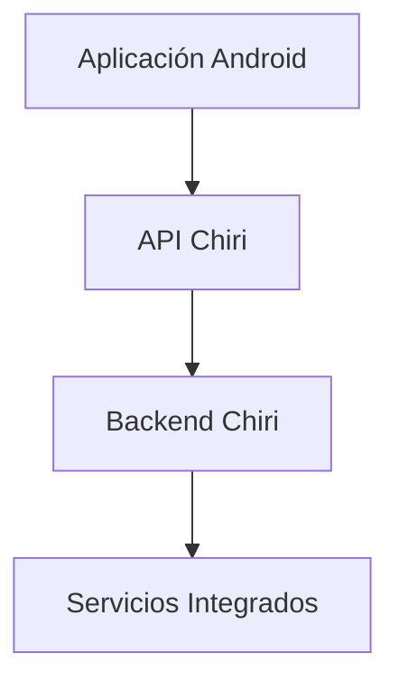

---

# 1.3 Responsabilidad de la API

La API será responsable de:

* recibir solicitudes.
* validar información.
* controlar autenticación.
* ejecutar casos de uso.
* devolver respuestas.
* ocultar detalles internos.

---

# 1.4 Lo que NO hará la API

La API no será responsable de:

* lógica propia de Home Assistant.
* reproducción multimedia directa.
* almacenamiento de archivos.
* reemplazar servicios especializados.

Ejemplo:

Incorrecto:

```text
API Chiri
     |
     └── Crear nuevo sistema multimedia
```

Correcto:

```text
API Chiri
     |
     └── Solicitar acción a Music Assistant/Jellyfin
```

---

# 1.5 Tecnología Definida

La API será desarrollada utilizando:

## Backend

* Python.
* FastAPI.

## Comunicación

* HTTPS.
* REST.
* JSON.

## Documentación

* OpenAPI / Swagger.

---

# 1.6 Clientes de la API

Los principales consumidores serán:

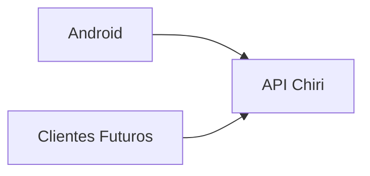

La arquitectura permitirá incorporar posteriormente:

* interfaz web.
* asistentes de voz.
* automatizaciones.
* otros dispositivos.

---

# 1.7 Principios de Diseño

La API deberá cumplir:

* contratos claros.
* respuestas consistentes.
* versionado.
* seguridad.
* documentación.
* compatibilidad futura.

---

# 1.8 Regla Principal

Toda nueva funcionalidad deberá responder:

> ¿Esta capacidad debe exponerse mediante API?

Si la respuesta es sí, deberá diseñarse primero el contrato antes del código.

---

# 1.9 Principio Arquitectónico

La API de Chiri será:

> La capa de abstracción que permite que la plataforma evolucione sin depender de clientes o servicios específicos.

# 2. Arquitectura Interna de la API

La API Chiri estará organizada mediante capas separadas para mantener:

* claridad.
* mantenibilidad.
* facilidad de pruebas.
* evolución controlada.

---

# 2.1 Arquitectura General

La estructura interna será:

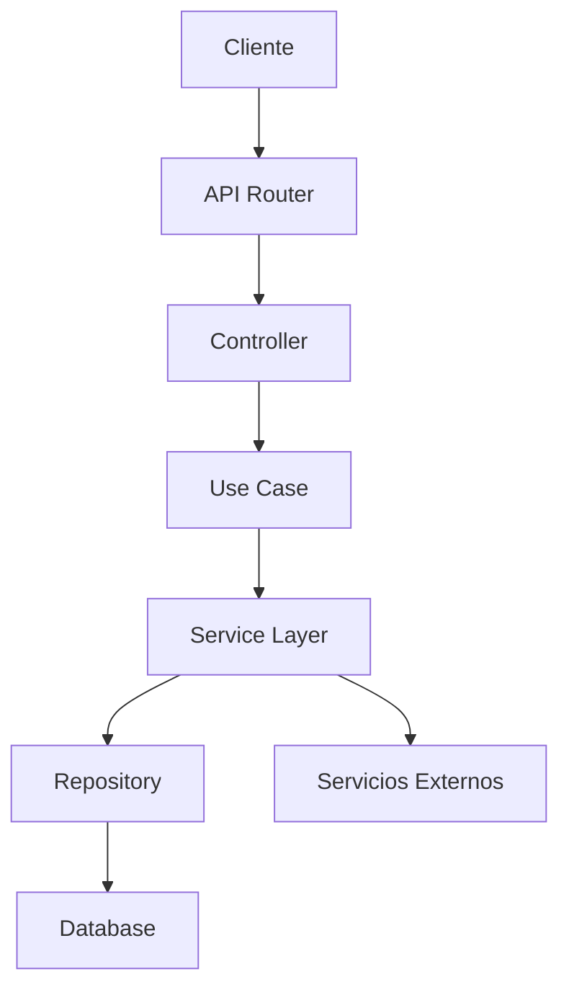

---

# 2.2 Capa Router

## Responsabilidad

Gestiona los puntos de entrada HTTP.

Funciones:

* definir endpoints.
* recibir solicitudes.
* validar parámetros básicos.
* enviar respuesta.

Ejemplo:

```text id="7m3q8x"
GET /api/v1/home/status

POST /api/v1/media/play
```

---

# 2.3 Capa Controller

## Responsabilidad

Actúa como intermediario entre HTTP y la lógica de aplicación.

Responsabilidades:

* recibir modelos de entrada.
* llamar casos de uso.
* transformar respuestas.

No deberá contener:

* lógica de negocio.
* consultas SQL.
* llamadas directas a servicios externos.

---

# 2.4 Capa Use Case

## Responsabilidad

Representa acciones que Chiri puede realizar.

Ejemplos:

```text id="3m8q5x"
GetHomeStatus

PlayMusic

GetUserProfile

ExecuteAutomation
```

Los casos de uso representan capacidades, no tablas.

---

# 2.5 Capa Service

## Responsabilidad

Contiene lógica específica de dominio.

Ejemplos:

* comunicación con Home Assistant.
* integración multimedia.
* procesamiento de datos.

---

# 2.6 Capa Repository

## Responsabilidad

Gestiona acceso a datos persistentes.

Puede comunicarse con:

* PostgreSQL.
* almacenamiento interno.

No deberá ser utilizado directamente por clientes.

---

# 2.7 Modelos de Datos

La API deberá separar:

* modelos de entrada.
* modelos internos.
* modelos de respuesta.

Ejemplo:

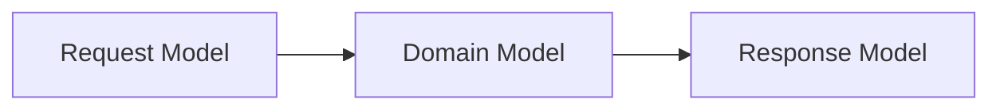

---

# 2.8 Flujo de una Solicitud

Ejemplo:

Usuario solicita encender una luz.

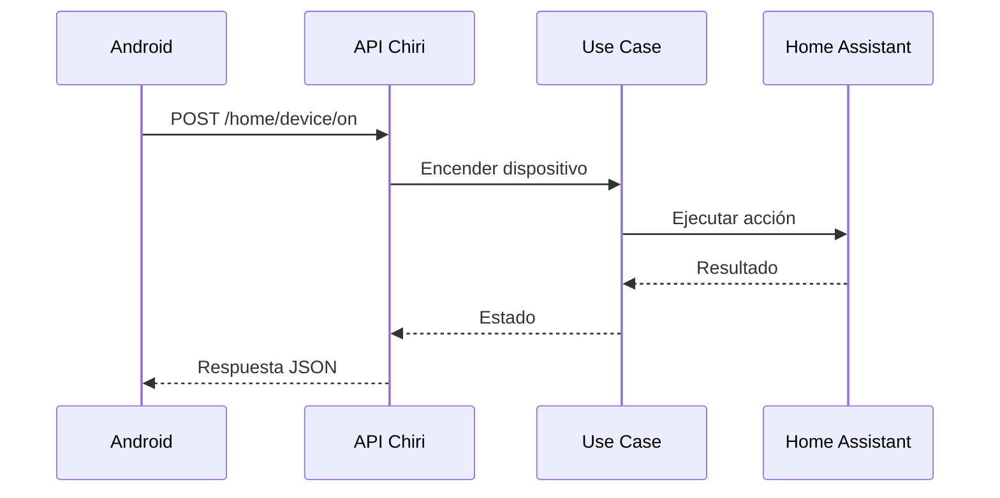

---

# 2.9 Manejo de Dependencias

Las dependencias deberán seguir:

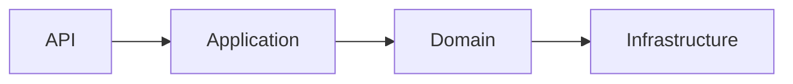

Las capas superiores no deberán conocer detalles internos innecesarios.

---

# 2.10 Ventajas de esta Arquitectura

Permite:

* cambiar servicios externos sin afectar Android.
* probar lógica sin servidor completo.
* mantener código organizado.
* agregar nuevas capacidades.

---

# 2.11 Regla Arquitectónica

La API deberá cumplir:

> Un endpoint no implementa una solución; expone una capacidad de la plataforma.

# 3. Diseño de Endpoints y Versionado de API

La API de Chiri Platform utilizará una estructura organizada de endpoints basada en recursos y capacidades.

El diseño deberá priorizar:

* claridad.
* estabilidad.
* compatibilidad futura.
* facilidad de uso.

---

# 3.1 Arquitectura de URL

La estructura base será:

```text id="7m2q5x"
https://servidor-chiri/api/v1/recurso
```

Ejemplo:

```text id="5q8m3x"
GET /api/v1/users
```

---

# 3.2 Versionado

La API utilizará versionado explícito.

Formato:

```text id="9x4m7q"
/api/v1/
```

Ejemplo:

```text id="3m8q2x"
GET /api/v1/profile
```

---

# 3.3 Motivo del Versionado

El versionado permite:

* evolución controlada.
* mantener compatibilidad.
* introducir cambios importantes.

Ejemplo:

```text
v1

    |

    v2
```

Ambas versiones pueden coexistir durante una transición.

---

# 3.4 Recursos vs Acciones

Los endpoints deberán representar recursos o capacidades claras.

Preferencia:

```text id="6q8m3x"
GET /api/v1/devices
```

Evitar:

```text id="8m2q5x"
GET /api/v1/getAllDevices
```

---

# 3.5 Métodos HTTP

Se utilizarán métodos estándar:

| Método | Uso                             |
| ------ | ------------------------------- |
| GET    | Consultar información           |
| POST   | Crear o ejecutar acciones       |
| PUT    | Actualizar información completa |
| PATCH  | Actualizar parcialmente         |
| DELETE | Eliminar información            |

---

# 3.6 Ejemplos Conceptuales

Usuarios:

```text id="4m7q2x"
GET

/api/v1/users
```

Crear usuario:

```text id="8q5m3x"
POST

/api/v1/users
```

Perfil:

```text id="2x6m9q"
GET

/api/v1/profile
```

---

# 3.7 Acciones Especiales

Algunas capacidades no representan un recurso físico.

Ejemplo:

Reproducir música:

```text id="9m4q8x"
POST

/api/v1/media/play
```

Encender dispositivo:

```text id="5x7m2q"
POST

/api/v1/devices/{id}/turn-on
```
---

# 3.8 Endpoints de Autenticación

La autenticación de usuarios será gestionada exclusivamente mediante la API de Chiri Platform.

Los clientes no deberán acceder directamente al sistema de autenticación interno, PostgreSQL ni otros servicios internos.

Los endpoints de autenticación deberán permitir:

* iniciar sesión.
* renovar la sesión.
* cerrar sesión.
* consultar el estado de la sesión.

El contrato definitivo de cada endpoint deberá definir:

* método HTTP.
* ruta.
* datos de entrada.
* validaciones.
* respuesta.
* códigos HTTP.
* códigos de error.

Los endpoints previstos son:

```text
Inicio de sesión
Renovación de sesión
Cierre de sesión
Consulta de sesión
```
---

# 3.9 Convención de Nombres

Los endpoints deberán utilizar:

* minúsculas.
* plural para colecciones.
* nombres descriptivos.
* separación con guiones cuando sea necesario.

Ejemplo:

Correcto:

```text id="3q8m5x"
user-settings
```

Evitar:

```text id="6m2q7x"
UserSettings
```
---

# 3.10 Respuestas Consistentes

Todas las respuestas deberán seguir una estructura uniforme.

Ejemplo conceptual:

```json id="4m8q2x"
{
  "success": true,
  "data": {},
  "message": null
}
```

---

# 3.11 Errores Consistentes

Los errores deberán tener formato común.

Ejemplo:

```json id="7q3m9x"
{
  "success": false,
  "error": {
    "code": "DEVICE_NOT_FOUND",
    "message": "Device does not exist"
  }
}
```

---

# 3.12 Cambios Incompatibles

No se deberán modificar endpoints existentes de forma que rompan clientes.

Ejemplo incorrecto:

Antes:

```json
{
 "name":"Juan"
}
```

Después:

```json
{
 "full_name":"Juan"
}
```

sin transición.

---

# 3.13 Documentación

Toda API deberá estar documentada mediante:

* OpenAPI.
* Swagger UI.
* modelos de solicitud.
* modelos de respuesta.

---

# 3.14 Regla Arquitectónica

El diseño de endpoints deberá cumplir:

> Una API estable permite que Chiri evolucione sin obligar a reconstruir sus clientes.

# 4. Autenticación y Autorización de API

La API de Chiri Platform deberá implementar mecanismos de autenticación y autorización para controlar el acceso a las capacidades de la plataforma.

---

# 4.1 Diferencia entre Autenticación y Autorización

## Autenticación

Responde:

> ¿Quién eres?

Ejemplo:

* usuario identificado.
* dispositivo autorizado.
* cliente válido.

---

## Autorización

Responde:

> ¿Qué puedes hacer?

Ejemplo:

* consultar información.
* ejecutar acciones.
* administrar configuración.

---

# 4.2 Flujo General de Seguridad

El acceso seguirá:

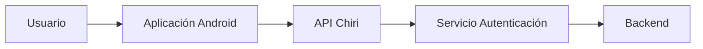

---

# 4.3 Principio de Acceso

La API no deberá confiar únicamente en que la solicitud viene de Android.

Toda solicitud deberá validar:

* identidad.
* permisos.
* estado de sesión.

# 4.4 Sesiones y Tokens

La autenticación de Chiri Platform utilizará una arquitectura basada en **sesiones persistentes y tokens de acceso**.

La sesión representa la relación lógica de autenticación entre un usuario y la plataforma. Los tokens representan las credenciales utilizadas por el cliente para realizar solicitudes autenticadas.

La arquitectura separará explícitamente:

* sesión;
* access token;
* refresh token.

El identificador de la sesión (`session_id`) **no será utilizado como credencial HTTP** y no deberá enviarse como sustituto del access token.

El flujo general será:

```text
Usuario inicia sesión
        |
        v
Servidor valida identidad
        |
        v
Servidor crea sesión
        |
        +-------------------+
        |                   |
        v                   v
Access Token        Refresh Token
        |                   |
        +---------+---------+
                  |
                  v
        Cliente almacena credenciales
                  |
                  v
        Cliente utiliza Access Token
        en solicitudes posteriores
```

## 4.4.1 Relación entre Sesión y Tokens

Una sesión podrá tener múltiples emisiones de tokens durante su ciclo de vida.

La relación conceptual será:

```text
security.session
        |
        +---- access token
        |
        +---- refresh token
        |
        +---- nuevas emisiones
```

Los tokens deberán estar asociados a una sesión existente.

La sesión continuará siendo la entidad utilizada para determinar:

* usuario propietario;
* estado de la sesión;
* vigencia de la sesión;
* revocación de la sesión.

Los tokens no reemplazarán a la entidad `security.session`.

## 4.4.2 Múltiples Sesiones

Un usuario podrá mantener múltiples sesiones simultáneas.

Por ejemplo:

```text
Usuario
   |
   +---- Sesión Android
   |
   +---- Sesión PC
   |
   +---- Sesión Web futura
```

Cada sesión podrá administrarse independientemente.

Esto permitirá posteriormente:

* cerrar una sesión específica;
* mantener otras sesiones activas;
* cerrar todas las sesiones del usuario;
* identificar sesiones por dispositivo;
* implementar controles adicionales de seguridad.

## 4.4.3 Almacenamiento de Tokens

Los access tokens y refresh tokens serán credenciales sensibles.

Los tokens originales no deberán almacenarse en texto plano en PostgreSQL.

La Base de Datos almacenará únicamente una representación criptográfica adecuada del token que permita realizar su validación.

Los tokens tampoco deberán incluirse en:

* registros de aplicación;
* registros de auditoría;
* mensajes de error;
* respuestas distintas de aquellas definidas explícitamente por el contrato de autenticación.

## 4.4.4 Tipos de Token

Chiri Platform utilizará dos tipos principales de tokens:

```text
Access Token
      |
      +---- autenticación de solicitudes normales

Refresh Token
      |
      +---- renovación de credenciales de acceso
```

El access token tendrá una duración corta.

El refresh token tendrá una duración mayor y estará sujeto a rotación.

## 4.4.5 Principio de Seguridad

La sesión será la unidad lógica de autenticación y revocación.

Los tokens serán credenciales temporales asociadas a dicha sesión.

La revocación de una sesión deberá impedir el uso posterior de los tokens asociados a ella.

### Regla arquitectónica

> **La sesión representa la autenticación del usuario; los tokens representan las credenciales temporales utilizadas para acceder a la API.**

# 4.5 Token de Acceso

El **access token** será una credencial temporal utilizada por el cliente para autenticarse ante los endpoints protegidos de la API de Chiri Platform.

El access token será un token opaco generado por el Backend y no deberá contener información de identidad o permisos que pueda ser interpretada directamente por el cliente.

## 4.5.1 Uso del Access Token

Las solicitudes autenticadas utilizarán el esquema estándar HTTP:

```http
Authorization: Bearer ACCESS_TOKEN
```

El cliente deberá enviar el access token en el encabezado `Authorization` de las solicitudes que requieran autenticación.

El `session_id` no deberá utilizarse como sustituto del access token.

## 4.5.2 Duración

El access token tendrá una duración máxima de:

```text
15 minutos
```

La duración corta limitará la ventana de exposición en caso de que el token sea comprometido.

Cuando el access token expire, el cliente deberá utilizar el refresh token para obtener nuevas credenciales, siempre que la sesión continúe siendo válida.

## 4.5.3 Almacenamiento

El access token original no deberá almacenarse en texto plano en PostgreSQL.

El Backend almacenará únicamente una representación criptográfica del token que permita realizar su validación.

El access token tampoco deberá aparecer en:

* logs;
* mensajes de error;
* registros de auditoría;
* métricas;
* trazas de depuración.

## 4.5.4 Validación

Para aceptar un access token, el Backend deberá comprobar como mínimo:

* existencia del token;
* integridad de la representación almacenada;
* vigencia del token;
* estado válido del token;
* estado `ACTIVE` de la sesión asociada;
* estado `ACTIVE` del usuario asociado.

Un access token:

* inexistente;
* inválido;
* expirado;
* revocado;
* asociado a una sesión revocada;
* asociado a un usuario que ya no esté activo;

deberá provocar el rechazo de la solicitud autenticada.

La API deberá responder con el código HTTP correspondiente al fallo de autenticación.

## 4.5.5 Asociación con la Sesión

Cada access token deberá estar asociado a una sesión existente.

El flujo será:

```text
Access Token
      |
      v
security.access_token
      |
      v
security.session
      |
      v
identity.user
```

La sesión será la autoridad para determinar si la autenticación continúa siendo válida.

## 4.5.6 No Reutilización como Refresh Token

El access token tendrá como única finalidad autenticar solicitudes normales de la API.

No deberá utilizarse para:

* renovar credenciales;
* generar directamente un refresh token;
* sustituir al refresh token;
* modificar el estado de una sesión sin autorización correspondiente.

### Regla arquitectónica

> **El access token es una credencial temporal de corta duración utilizada exclusivamente para autenticar solicitudes protegidas de la API.**

# 4.6 Renovación de Sesión

Chiri Platform utilizará un mecanismo de renovación mediante **refresh token** para permitir que el cliente obtenga nuevas credenciales de acceso sin solicitar nuevamente las credenciales principales del usuario.

La renovación solamente será válida mientras la sesión y el usuario continúen en un estado permitido.

## 4.6.1 Refresh Token

El refresh token será una credencial opaca, generada por el Backend y asociada a una sesión existente.

Tendrá una duración máxima de:

```text
30 días
````

El refresh token no deberá utilizarse para acceder directamente a endpoints protegidos de la API.

Su única finalidad será solicitar una nueva emisión de credenciales de acceso.

## 4.6.2 Solicitud de Renovación

La renovación se realizará mediante un endpoint específico de autenticación:

```http
POST /auth/refresh
```

La solicitud deberá proporcionar el refresh token mediante el contrato definido para la API.

El Backend deberá validar:

* existencia del refresh token;
* integridad de la representación almacenada;
* vigencia del refresh token;
* estado del refresh token;
* existencia de la sesión asociada;
* estado `ACTIVE` de la sesión;
* vigencia de la sesión;
* existencia del usuario asociado;
* estado `ACTIVE` del usuario.

Si cualquiera de estas validaciones falla, la renovación deberá ser rechazada.

## 4.6.3 Rotación del Refresh Token

Chiri Platform utilizará **rotación de refresh tokens**.

Cada renovación válida deberá:

```text
Refresh Token actual
        |
        v
Validación
        |
        v
Revocar refresh token utilizado
        |
        v
Crear nuevo Access Token
        |
        v
Crear nuevo Refresh Token
```

El refresh token utilizado no podrá volver a utilizarse después de una renovación exitosa.

Esto evita que un refresh token obtenido ilícitamente pueda utilizarse indefinidamente.

## 4.6.4 Reutilización de un Refresh Token

El Backend deberá detectar el intento de utilizar un refresh token que ya haya sido rotado o revocado.

La reutilización de un refresh token previamente utilizado será considerada un evento de seguridad.

Ante una reutilización confirmada, el Backend podrá revocar la sesión asociada y todas las credenciales pertenecientes a dicha sesión.

La aplicación deberá requerir una nueva autenticación cuando la sesión haya sido revocada como consecuencia de este evento.

## 4.6.5 Nueva Emisión

Cuando la renovación sea válida, el Backend deberá emitir:

```text
Nuevo Access Token
Nuevo Refresh Token
```

El nuevo access token tendrá nuevamente una duración máxima de:

```text
15 minutos
```

El nuevo refresh token tendrá una duración máxima de:

```text
30 días
```

La renovación no deberá crear una nueva sesión lógica. Los nuevos tokens continuarán asociados a la sesión existente.

```text
security.session
       |
       +── Access Token anterior → revocado/expirado
       |
       +── Refresh Token anterior → revocado
       |
       +── Nuevo Access Token
       |
       └── Nuevo Refresh Token
```

## 4.6.6 Revocación y Expiración

La renovación no será posible cuando:

* la sesión esté `REVOKED`;
* la sesión esté `EXPIRED`;
* el refresh token esté revocado;
* el refresh token esté expirado;
* el usuario no esté `ACTIVE`.

Una sesión revocada no podrá recuperar su validez mediante un refresh token.

Será necesaria una nueva autenticación.

## 4.6.7 Seguridad del Refresh Token

El refresh token será considerado una credencial de alta sensibilidad.

El Backend deberá:

* almacenarlo únicamente mediante una representación criptográfica;
* evitar registrarlo en logs;
* evitar incluirlo en mensajes de error;
* impedir su reutilización después de una rotación;
* asociarlo siempre a una sesión;
* permitir su revocación.

El cliente deberá almacenar el refresh token utilizando el mecanismo seguro definido para cada plataforma.

### Regla arquitectónica

> **El refresh token permite renovar las credenciales de acceso de una sesión existente, pero no constituye una credencial para acceder directamente a los recursos protegidos de la API.**

---

# 4.7 Inicio de Sesión

El inicio de sesión permitirá autenticar a un usuario mediante la API de Chiri Platform.

La autenticación utilizará:

* usuario o correo electrónico;
* contraseña.

El cliente Android deberá comunicarse exclusivamente con la API de Chiri.

La autenticación no deberá realizarse directamente contra PostgreSQL ni contra servicios internos.

El endpoint de inicio de sesión será público y no requerirá un access token previo.

## 4.7.1 Endpoint

```http
POST /api/v1/auth/login
````

El endpoint permitirá iniciar una nueva sesión de autenticación.

## 4.7.2 Request

Content-Type:

```http
application/json
```

Modelo:

```json
{
  "identifier": "usuario_o_correo",
  "password": "contraseña"
}
```

### Campos

| Campo        | Tipo   | Requerido | Descripción                            |
| ------------ | ------ | --------: | -------------------------------------- |
| `identifier` | string |        Sí | Nombre de usuario o correo electrónico |
| `password`   | string |        Sí | Contraseña del usuario                 |

El campo `identifier` permitirá utilizar indistintamente el nombre de usuario o el correo electrónico registrado.

La contraseña deberá transmitirse únicamente mediante HTTPS.

La contraseña no deberá almacenarse en texto plano.

## 4.7.3 Proceso de Autenticación

El flujo será:

```text
Android
   |
   | POST /api/v1/auth/login
   | Credenciales
   v
API Chiri
   |
   v
Servicio de Autenticación
   |
   v
Validación del usuario
   |
   v
Validación de contraseña
   |
   v
Creación de sesión
   |
   +----------------------+
   |                      |
   v                      v
Access Token        Refresh Token
   |                      |
   +----------+-----------+
              |
              v
      Respuesta de autenticación
              |
              v
           Android
```

El Backend deberá validar:

* existencia del usuario;
* estado del usuario;
* contraseña;
* condiciones de acceso aplicables;
* creación de una sesión válida;
* generación de las credenciales de acceso.

Cuando la autenticación sea correcta, el Backend deberá crear una nueva sesión asociada al usuario autenticado.

La sesión deberá permanecer independiente de los tokens generados.

## 4.7.4 Response

Cuando la autenticación sea correcta, la API deberá devolver una respuesta de éxito que contenga las credenciales necesarias para acceder a los recursos protegidos y renovar la sesión.

Ejemplo:

```json
{
  "success": true,
  "data": {
    "access_token": "ACCESS_TOKEN",
    "refresh_token": "REFRESH_TOKEN",
    "token_type": "Bearer",
    "expires_in": 900
  },
  "message": null
}
```

### Campos

| Campo           | Tipo        | Descripción                                                  |
| --------------- | ----------- | ------------------------------------------------------------ |
| `success`       | boolean     | Indica que la operación fue correcta                         |
| `data`          | object      | Datos de autenticación                                       |
| `access_token`  | string      | Token utilizado para acceder a recursos protegidos           |
| `refresh_token` | string      | Token utilizado exclusivamente para renovar las credenciales |
| `token_type`    | string      | Tipo de autenticación utilizado                              |
| `expires_in`    | integer     | Tiempo de vida del access token expresado en segundos        |
| `message`       | string/null | Mensaje opcional                                             |

El valor de `token_type` será:

```text
Bearer
```

El valor de `expires_in` será:

```text
900
```

correspondiente a 15 minutos.

El `access_token` deberá utilizarse posteriormente mediante:

```http
Authorization: Bearer ACCESS_TOKEN
```

El `refresh_token` deberá utilizarse únicamente mediante el mecanismo de renovación de sesión.

El `session_id` no será utilizado como credencial HTTP y no será necesario incluirlo en la respuesta de autenticación.

## 4.7.5 Credenciales Incorrectas

Cuando las credenciales no sean válidas, la API deberá rechazar la autenticación.

La respuesta utilizará el formato de errores definido por la API.

Ejemplo:

```json
{
  "success": false,
  "error": {
    "code": "AUTH_INVALID_CREDENTIALS",
    "message": "Invalid credentials"
  }
}
```

La operación deberá responder con:

```text
HTTP 401 Unauthorized
```

El mensaje de error deberá ser genérico y no deberá revelar si:

* el usuario existe;
* el correo electrónico existe;
* la contraseña es incorrecta;
* la cuenta se encuentra en un estado que permita inferir información sensible.

Esto evita facilitar la enumeración de cuentas.

## 4.7.6 Usuario Inactivo o No Disponible

Cuando el usuario no pueda iniciar sesión debido a su estado, la API deberá rechazar la autenticación.

La respuesta deberá utilizar el mismo mecanismo de error genérico definido para credenciales inválidas cuando revelar el estado de la cuenta pueda facilitar la enumeración de usuarios.

No deberán generarse:

* nuevas sesiones;
* access tokens;
* refresh tokens.

cuando el usuario no cumpla las condiciones necesarias para autenticarse.

## 4.7.7 Validación de Entrada

La API deberá validar:

* `identifier` no vacío;
* `password` no vacío;
* longitud máxima permitida;
* formato válido cuando corresponda.

Las solicitudes que no cumplan las validaciones deberán ser rechazadas antes de ejecutar el proceso de autenticación.

La validación de entrada no deberá revelar información sobre la existencia de usuarios.

## 4.7.8 Seguridad

El endpoint deberá:

* utilizar HTTPS;
* no registrar contraseñas;
* no devolver contraseñas;
* no almacenar contraseñas en texto plano;
* utilizar Argon2id para la verificación de contraseñas;
* proteger los tokens generados;
* no registrar access tokens ni refresh tokens;
* crear una sesión asociada al usuario autenticado;
* asociar los tokens generados a la sesión;
* utilizar respuestas de error que eviten la enumeración de cuentas.

El cliente Android deberá almacenar los tokens utilizando los mecanismos seguros definidos por la arquitectura de seguridad de Chiri Platform.

El Backend no deberá almacenar los tokens originales en texto plano en PostgreSQL.

## 4.7.9 Resultado de la Operación

Una autenticación correcta deberá producir:

```text
Usuario autenticado
        |
        +-- Sesión creada
        |
        +-- Access Token generado
        |
        +-- Refresh Token generado
        |
        +-- Tokens asociados a la sesión
        |
        +-- Tokens enviados al cliente
```

Una autenticación incorrecta deberá producir:

```text
Credenciales inválidas
        |
        +-- Sesión no creada
        |
        +-- Tokens no generados
        |
        +-- HTTP 401 Unauthorized
        |
        +-- Error genérico de autenticación
```

### Regla arquitectónica

> El inicio de sesión crea una sesión lógica y emite las credenciales temporales necesarias para acceder y renovar el acceso a la API. El `session_id` identifica la sesión, pero nunca sustituye al access token como credencial HTTP.

# 4.8 Endpoint de Renovación de Sesión

La renovación de sesión permitirá obtener nuevas credenciales de acceso utilizando un refresh token válido asociado a una sesión activa.

La renovación no requerirá que el usuario introduzca nuevamente su contraseña.

El mecanismo utilizará **rotación de refresh tokens**.

## 4.8.1 Endpoint

```http
POST /api/v1/auth/refresh
````

El endpoint no requerirá un access token previo.

La autenticación de la solicitud se realizará mediante el refresh token definido por el contrato de autenticación.

## 4.8.2 Request

Content-Type:

```http
application/json
```

Modelo:

```json
{
  "refresh_token": "REFRESH_TOKEN"
}
```

### Campos

| Campo           | Tipo   | Requerido | Descripción                                                            |
| --------------- | ------ | --------: | ---------------------------------------------------------------------- |
| `refresh_token` | string |        Sí | Token utilizado exclusivamente para renovar las credenciales de acceso |

El refresh token deberá enviarse únicamente mediante HTTPS.

El cliente no deberá enviar el refresh token como `Authorization: Bearer` para este endpoint.

## 4.8.3 Proceso de Renovación

El flujo será:

```text
Cliente
   |
   | POST /api/v1/auth/refresh
   | Refresh Token
   v
API Chiri
   |
   v
Buscar y validar Refresh Token
   |
   v
Validar estado del token
   |
   v
Validar sesión
   |
   v
Validar usuario
   |
   v
Revocar Refresh Token utilizado
   |
   +----------------------+
   |                      |
   v                      v
Nuevo Access Token   Nuevo Refresh Token
   |                      |
   +----------+-----------+
              |
              v
       Respuesta de renovación
              |
              v
           Cliente
```

El Backend deberá validar:

* existencia del refresh token;
* integridad de la representación almacenada;
* vigencia del refresh token;
* estado del refresh token;
* existencia de la sesión asociada;
* estado `ACTIVE` de la sesión;
* vigencia de la sesión;
* existencia del usuario asociado;
* estado `ACTIVE` del usuario.

Si cualquiera de estas validaciones falla, la renovación deberá ser rechazada.

## 4.8.4 Rotación del Refresh Token

Cada renovación válida deberá realizar una rotación del refresh token.

El refresh token utilizado deberá quedar invalidado y no podrá utilizarse nuevamente.

El flujo será:

```text
Refresh Token actual
        |
        v
Validación
        |
        v
Invalidar Refresh Token actual
        |
        +----------------------+
        |                      |
        v                      v
Nuevo Access Token      Nuevo Refresh Token
        |                      |
        +----------+-----------+
                   |
                   v
              Cliente
```

La renovación no deberá crear una nueva sesión lógica.

Los nuevos tokens continuarán asociados a la sesión existente.

## 4.8.5 Duración de las Nuevas Credenciales

El nuevo access token tendrá una duración máxima de:

```text
15 minutos
```

El nuevo refresh token tendrá una duración máxima de:

```text
30 días
```

El tiempo de vida del access token se expresará en segundos mediante:

```json
{
  "expires_in": 900
}
```

## 4.8.6 Response

Cuando la renovación sea correcta, la API deberá devolver:

```json
{
  "success": true,
  "data": {
    "access_token": "NEW_ACCESS_TOKEN",
    "refresh_token": "NEW_REFRESH_TOKEN",
    "token_type": "Bearer",
    "expires_in": 900
  },
  "message": null
}
```

### Campos

| Campo           | Tipo        | Descripción                                    |
| --------------- | ----------- | ---------------------------------------------- |
| `success`       | boolean     | Indica que la operación fue correcta           |
| `data`          | object      | Nuevas credenciales de acceso                  |
| `access_token`  | string      | Nuevo token para acceder a recursos protegidos |
| `refresh_token` | string      | Nuevo refresh token generado mediante rotación |
| `token_type`    | string      | Tipo de autenticación utilizado                |
| `expires_in`    | integer     | Tiempo de vida del access token en segundos    |
| `message`       | string/null | Mensaje opcional                               |

El nuevo access token deberá utilizarse mediante:

```http
Authorization: Bearer ACCESS_TOKEN
```

El nuevo refresh token deberá utilizarse exclusivamente para futuras renovaciones.

## 4.8.7 Refresh Token Expirado o Revocado

Cuando el refresh token:

* haya expirado;
* haya sido revocado;
* no exista;
* no corresponda a una sesión válida;
* pertenezca a una sesión revocada;
* pertenezca a un usuario no activo;

la API deberá rechazar la renovación.

La respuesta deberá utilizar el formato de errores definido por la API.

Ejemplo:

```json
{
  "success": false,
  "error": {
    "code": "AUTH_INVALID_REFRESH_TOKEN",
    "message": "Invalid refresh token"
  }
}
```

La respuesta deberá utilizar:

```text
HTTP 401 Unauthorized
```

El mensaje no deberá revelar información interna sobre la causa específica de la invalidación.

## 4.8.8 Reutilización de Refresh Token

El Backend deberá detectar el intento de utilizar un refresh token que ya haya sido utilizado y rotado.

La reutilización de un refresh token previamente invalidado será considerada un evento de seguridad.

Ante una reutilización confirmada, el Backend podrá revocar la sesión asociada y las credenciales restantes pertenecientes a dicha sesión.

Cuando la sesión sea revocada como consecuencia de este evento, será necesaria una nueva autenticación.

## 4.8.9 Seguridad

El endpoint deberá:

* utilizar HTTPS;
* no registrar refresh tokens;
* no registrar access tokens;
* no devolver el refresh token anterior;
* invalidar el refresh token utilizado después de una renovación válida;
* generar un nuevo refresh token;
* asociar las nuevas credenciales a la sesión existente;
* validar el estado de la sesión;
* validar el estado del usuario;
* impedir la reutilización de refresh tokens rotados.

Los refresh tokens originales no deberán almacenarse en texto plano en PostgreSQL.

## 4.8.10 Resultado de la Operación

Una renovación correcta deberá producir:

```text
Refresh Token válido
        |
        +-- Token anterior invalidado
        |
        +-- Nuevo Access Token generado
        |
        +-- Nuevo Refresh Token generado
        |
        +-- Tokens asociados a la sesión existente
        |
        +-- Nuevas credenciales enviadas al cliente
```

Una renovación incorrecta deberá producir:

```text
Refresh Token inválido
        |
        +-- Nuevos tokens no generados
        |
        +-- Sesión no renovada
        |
        +-- HTTP 401 Unauthorized
        |
        +-- Error de autenticación
```

### Regla arquitectónica

> La renovación extiende el acceso de una sesión existente mediante la rotación del refresh token. No crea una nueva sesión lógica y nunca utiliza el `session_id` como credencial HTTP.

Sí. La `4.9` actual también debe reemplazarse completamente porque ahora ya definimos que **logout revoca la sesión y, con ella, invalida las credenciales asociadas**.

Usaremos el access token para identificar la sesión autenticada. El `session_id` no se enviará como credencial.

Reemplaza toda tu `4.9` por:

````markdown
# 4.9 Cierre de Sesión

El cierre de sesión permitirá finalizar una sesión autenticada de Chiri Platform.

El cierre de sesión deberá provocar la **revocación de la sesión correspondiente en el Backend**.

La revocación de la sesión deberá impedir el uso posterior de los tokens asociados a dicha sesión.

El cliente deberá eliminar de su almacenamiento local las credenciales asociadas a la sesión después de recibir una respuesta de cierre de sesión.

## 4.9.1 Endpoint

```http
POST /api/v1/auth/logout
````

El endpoint requerirá autenticación mediante un access token válido.

La solicitud deberá utilizar:

```http
Authorization: Bearer ACCESS_TOKEN
```

El `session_id` no será utilizado como credencial HTTP.

## 4.9.2 Request

El cierre de sesión no requerirá un cuerpo de solicitud.

Ejemplo:

```http
POST /api/v1/auth/logout
Authorization: Bearer ACCESS_TOKEN
```

La identidad de la sesión será determinada por el Backend a partir del access token autenticado.

## 4.9.3 Proceso de Cierre de Sesión

El flujo será:

```text
Cliente
   |
   | POST /api/v1/auth/logout
   | Authorization: Bearer ACCESS_TOKEN
   v
API Chiri
   |
   v
Validación del Access Token
   |
   v
Identificación de la sesión
   |
   v
Revocación de la sesión
   |
   v
Invalidación de credenciales asociadas
   |
   v
Respuesta de cierre
   |
   v
Cliente elimina credenciales locales
```

El Backend deberá:

* validar el access token;
* identificar la sesión asociada;
* verificar que la sesión sea válida;
* cambiar el estado de la sesión a `REVOKED`;
* invalidar los tokens asociados a la sesión;
* registrar el evento cuando corresponda según la política de auditoría.

## 4.9.4 Revocación de la Sesión

Una sesión revocada no podrá volver a utilizarse mediante sus tokens existentes.

El estado de la sesión deberá cambiar:

```text
ACTIVE
   |
   v
REVOKED
```

La revocación deberá afectar a:

* access tokens asociados;
* refresh tokens asociados;
* futuras renovaciones de la sesión.

El Backend no deberá eliminar físicamente la sesión como consecuencia del logout.

Los registros deberán conservarse para permitir trazabilidad y auditoría.

## 4.9.5 Response

Cuando el cierre de sesión sea correcto, la API deberá devolver una respuesta de éxito.

Ejemplo:

```json
{
  "success": true,
  "data": null,
  "message": null
}
```

La operación deberá utilizar:

```text
HTTP 200 OK
```

El cliente deberá eliminar posteriormente de su almacenamiento seguro:

* access token;
* refresh token;
* cualquier otra credencial temporal asociada a la sesión.

## 4.9.6 Sesión Ya Revocada

Si la sesión ya se encuentra revocada, el Backend no deberá restaurarla ni modificarla a un estado activo.

La operación deberá mantener el estado:

```text
REVOKED
```

El endpoint podrá responder de forma idempotente para evitar exponer información innecesaria sobre el estado interno de la sesión.

## 4.9.7 Access Token Inválido

Cuando el access token:

* no exista;
* sea inválido;
* esté expirado;
* esté revocado;
* pertenezca a una sesión revocada;

la API deberá rechazar la solicitud conforme al mecanismo de autenticación definido para recursos protegidos.

Ejemplo:

```json
{
  "success": false,
  "error": {
    "code": "AUTH_INVALID_ACCESS_TOKEN",
    "message": "Invalid access token"
  }
}
```

La respuesta deberá utilizar:

```text
HTTP 401 Unauthorized
```

El mensaje no deberá revelar información interna sobre la sesión o los tokens.

## 4.9.8 Seguridad

El endpoint deberá:

* utilizar HTTPS;
* requerir autenticación;
* no registrar access tokens;
* no registrar refresh tokens;
* no devolver credenciales;
* revocar la sesión correspondiente;
* invalidar las credenciales asociadas;
* conservar el registro de la sesión para auditoría;
* impedir que una sesión revocada vuelva a utilizarse.

El cliente deberá eliminar las credenciales locales después de completar el proceso de cierre.

## 4.9.9 Resultado de la Operación

Un cierre de sesión correcto deberá producir:

```text
Sesión ACTIVE
      |
      v
Sesión REVOKED
      |
      +-- Access Tokens invalidados
      |
      +-- Refresh Tokens invalidados
      |
      +-- Sesión conservada para auditoría
      |
      v
Respuesta de cierre
      |
      v
Cliente elimina credenciales locales
```

### Regla arquitectónica

> El cierre de sesión revoca la sesión lógica y todas las credenciales asociadas a ella. La sesión no se elimina físicamente y el `session_id` nunca sustituye al access token como credencial HTTP.

# 4.10 Consulta del Estado de Sesión

La API permitirá consultar el estado de la sesión autenticada.

La validación definitiva de la sesión deberá realizarse siempre en el Backend.

El cliente no deberá considerar válida una sesión únicamente porque exista un access token almacenado localmente.

La existencia de un token local solamente indica que el cliente dispone de una credencial que puede intentar utilizar.

## 4.10.1 Endpoint

```http
GET /api/v1/auth/session
````

El endpoint requerirá un access token válido.

La solicitud deberá utilizar:

```http
Authorization: Bearer ACCESS_TOKEN
```

El `session_id` no deberá enviarse como mecanismo de autenticación.

## 4.10.2 Proceso de Validación

El flujo será:

```text
Cliente
   |
   | GET /api/v1/auth/session
   | Authorization: Bearer ACCESS_TOKEN
   v
API Chiri
   |
   v
Validación del Access Token
   |
   v
Identificación de la sesión
   |
   v
Validación de la sesión
   |
   v
Validación del usuario
   |
   v
Respuesta del estado de sesión
   |
   v
Cliente
```

El Backend deberá validar como mínimo:

* existencia del access token;
* autenticidad del access token;
* vigencia del access token;
* estado del access token;
* existencia de la sesión;
* estado de la sesión;
* vigencia de la sesión;
* existencia del usuario;
* estado del usuario.

La autorización y comprobación de permisos para operaciones concretas deberá realizarse posteriormente mediante los mecanismos de autorización definidos por la API.

## 4.10.3 Sesión Válida

Una sesión podrá considerarse válida cuando:

```text
Access Token válido
        +
Sesión ACTIVE
        +
Sesión no expirada
        +
Usuario ACTIVE
```

El Backend deberá considerar todos estos factores antes de confirmar el estado de autenticación.

## 4.10.4 Response

Cuando la sesión sea válida, la API deberá devolver:

```json
{
  "success": true,
  "data": {
    "authenticated": true,
    "session_status": "ACTIVE",
    "user_id": "USER_UUID",
    "expires_at": "SESSION_EXPIRATION"
  },
  "message": null
}
```

### Campos

| Campo            | Tipo        | Descripción                                                         |
| ---------------- | ----------- | ------------------------------------------------------------------- |
| `success`        | boolean     | Indica que la consulta fue procesada correctamente                  |
| `data`           | object      | Estado de la sesión autenticada                                     |
| `authenticated`  | boolean     | Indica que la solicitud corresponde a una sesión autenticada válida |
| `session_status` | string      | Estado actual de la sesión                                          |
| `user_id`        | UUID        | Identificador del usuario autenticado                               |
| `expires_at`     | datetime    | Fecha y hora de expiración de la sesión                             |
| `message`        | string/null | Mensaje opcional                                                    |

El endpoint no deberá devolver:

* access tokens;
* refresh tokens;
* contraseñas;
* hashes de tokens;
* información sensible innecesaria.

## 4.10.5 Sesión No Válida

Cuando el access token no sea válido, la API deberá rechazar la solicitud.

Ejemplo:

```json
{
  "success": false,
  "error": {
    "code": "AUTH_INVALID_ACCESS_TOKEN",
    "message": "Invalid access token"
  }
}
```

La respuesta deberá utilizar:

```text
HTTP 401 Unauthorized
```

Cuando la sesión haya sido revocada o haya expirado, tampoco podrá considerarse autenticada.

## 4.10.6 Seguridad

El endpoint deberá:

* utilizar HTTPS;
* requerir un access token;
* no aceptar `session_id` como credencial;
* no devolver tokens;
* no registrar tokens;
* validar el estado real de la sesión en PostgreSQL;
* validar el estado del usuario;
* no permitir que el cliente determine unilateralmente el estado de autenticación.

La existencia de un access token almacenado localmente no deberá considerarse suficiente para declarar una sesión válida.

## 4.10.7 Relación con la Autorización

La consulta del estado de sesión confirma la identidad y el estado de autenticación.

No deberá utilizarse como sustituto de la autorización.

El flujo será:

```text
Request
   |
   v
Autenticación
   |
   +-- ¿Token válido?
   |
   +-- ¿Sesión válida?
   |
   +-- ¿Usuario activo?
   |
   v
Identidad autenticada
   |
   v
Autorización
   |
   +-- ¿Tiene permiso?
   |
   v
Recurso protegido
```

Los permisos deberán evaluarse según el usuario, roles, permisos y contexto de la operación de acuerdo con la arquitectura de autorización de Chiri Platform.

### Regla arquitectónica

> El estado de una sesión siempre será determinado por el Backend. Un access token almacenado localmente nunca constituye por sí mismo una prueba suficiente de que la sesión continúa siendo válida.

# 4.11 Roles y Permisos

La autorización de Chiri Platform utilizará el modelo de roles y permisos definido en la Base de Datos.

La autenticación determinará la identidad del usuario y la validez de su sesión.

La autorización determinará si el usuario autenticado puede ejecutar una operación determinada.

Ambos procesos deberán mantenerse separados.

## 4.11.1 Modelo de Autorización

La relación conceptual será:

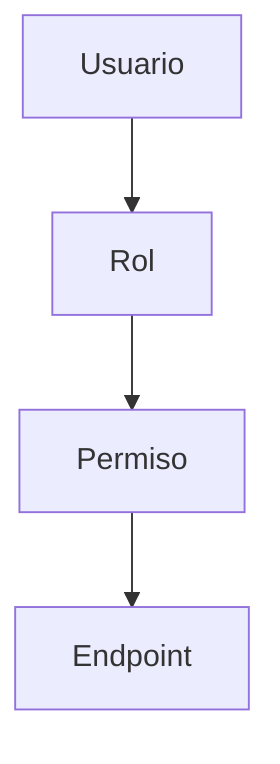

El modelo permitirá asignar uno o más roles a un usuario.

Cada rol podrá contener uno o más permisos.

Los permisos determinarán qué operaciones puede realizar un usuario autenticado.

## 4.11.2 Flujo de Autorización

Una solicitud protegida deberá seguir como mínimo:

```text id="w8mbp1"
Cliente
   |
   | Authorization: Bearer ACCESS_TOKEN
   v
API Chiri
   |
   v
Autenticación
   |
   +-- Access Token válido
   +-- Sesión válida
   +-- Usuario activo
   |
   v
Identidad autenticada
   |
   v
Autorización
   |
   +-- Roles
   |
   +-- Permisos
   |
   v
Endpoint solicitado
```

La existencia de una sesión válida no implica que el usuario tenga autorización para ejecutar cualquier operación.

## 4.11.3 Roles

Un usuario podrá tener uno o más roles.

Los roles representarán agrupaciones de permisos que permitan administrar la autorización de forma centralizada.

Ejemplo conceptual:

```text id="n6f9y2"
Usuario
   |
   +-- Administrador
   |      |
   |      +-- users.read
   |      +-- users.write
   |      +-- sessions.revoke
   |
   +-- Usuario
          |
          +-- profile.read
          +-- profile.write
```

Los roles deberán gestionarse mediante los mecanismos administrativos definidos por Chiri Platform.

## 4.11.4 Permisos

Los permisos representarán acciones concretas que pueden realizar los usuarios autenticados.

Un permiso deberá corresponder a una operación definida por la API.

Los permisos deberán utilizar identificadores estables y no depender de textos de interfaz del cliente.

Ejemplos conceptuales:

```text id="n8c2mj"
users.read
users.write
sessions.read
sessions.revoke
profile.read
profile.write
```

Los nombres anteriores son ejemplos conceptuales y no constituyen todavía el catálogo definitivo de permisos de Chiri Platform.

## 4.11.5 Validación de Permisos

Antes de ejecutar una operación protegida, el Backend deberá comprobar:

* identidad del usuario;
* estado de la sesión;
* estado del usuario;
* roles aplicables;
* permisos requeridos por el endpoint.

El cliente Android no deberá decidir si una operación está autorizada.

La decisión definitiva de autorización siempre deberá realizarse en el Backend.

## 4.11.6 Acceso No Autorizado

Cuando un usuario autenticado no tenga el permiso necesario para ejecutar una operación, la API deberá rechazar la solicitud.

La respuesta deberá utilizar el mecanismo de errores definido por la API.

Ejemplo:

```json id="xgq5l9"
{
  "success": false,
  "error": {
    "code": "AUTH_FORBIDDEN",
    "message": "Insufficient permissions"
  }
}
```

La respuesta deberá utilizar:

```text id="sv6h20"
HTTP 403 Forbidden
```

La respuesta no deberá revelar información interna sobre las reglas de autorización.

## 4.11.7 Diferencia entre Autenticación y Autorización

Chiri Platform deberá distinguir:

```text id="4plxzo"
Autenticación
     |
     +-- ¿Quién es el usuario?
     |
     v
Identidad válida
     |
     v
Autorización
     |
     +-- ¿Qué puede hacer?
     |
     v
Permiso concedido o rechazado
```

Un usuario puede estar correctamente autenticado y aun así no estar autorizado para ejecutar una determinada operación.

Por lo tanto:

```text id="m2c7u1"
401 Unauthorized
    =
problema de autenticación

403 Forbidden
    =
usuario autenticado pero sin autorización
```

## 4.11.8 Seguridad

La autorización deberá ejecutarse exclusivamente en el Backend.

El cliente no deberá poder:

* modificar sus propios roles;
* modificar sus propios permisos;
* declarar que posee un permiso;
* omitir las comprobaciones de autorización;
* acceder directamente a PostgreSQL para modificar su autorización.

Los cambios de roles y permisos deberán realizarse mediante operaciones administrativas protegidas y auditables.

### Regla arquitectónica

> La autenticación determina quién es el usuario; la autorización determina qué puede hacer. Una sesión válida no concede automáticamente acceso a todos los recursos de Chiri Platform.

# 4.12 Ejemplo de Control

La autorización de los usuarios dependerá de los roles y permisos asignados en el Backend.

Un usuario autenticado no tendrá automáticamente acceso a todas las operaciones de la plataforma.

### Usuario normal

Puede realizar únicamente las operaciones para las cuales posea los permisos correspondientes.

Ejemplos:

* consultar el estado de los servicios permitidos;
* ejecutar acciones autorizadas;
* consultar y modificar recursos propios cuando corresponda.

No puede:

* administrar usuarios;
* modificar roles;
* modificar permisos;
* cambiar configuraciones globales;
* ejecutar operaciones administrativas para las cuales no tenga autorización.

### Administrador

Un administrador podrá realizar operaciones administrativas de acuerdo con los permisos asignados a su rol.

Ejemplos:

* gestionar usuarios;
* gestionar roles y permisos;
* gestionar configuraciones de la plataforma;
* ejecutar operaciones administrativas;
* modificar configuraciones críticas cuando posea el permiso correspondiente.

La condición de administrador no deberá sustituir las comprobaciones de autorización del Backend.

### Regla

```text id="1qj8h2"
Usuario autenticado
        |
        v
Roles
        |
        v
Permisos
        |
        v
Operación autorizada
```

La autorización deberá determinarse siempre en el Backend.

# 4.13 Protección de Endpoints

Cada endpoint de la API deberá definir explícitamente:

* si requiere autenticación;
* qué tipo de autenticación requiere;
* qué permisos necesita;
* qué roles o condiciones adicionales pueden aplicar;
* qué respuesta corresponde cuando la autenticación falla;
* qué respuesta corresponde cuando la autorización falla.

Un endpoint protegido deberá seguir como mínimo:

```text id="g9m8m3"
Request
   |
   v
Access Token
   |
   v
Autenticación
   |
   +-- válido
   |
   v
Usuario
   |
   v
Autorización
   |
   +-- permiso requerido
   |
   v
Endpoint
```

Ejemplo conceptual:

```text id="1d4x7p"
/users

Autenticación:
    Requerida

Permiso:
    users.read

```

Para una operación de modificación:

```text id="0v4j7e"
/users/{user_id}

Autenticación:
    Requerida

Permiso:
    users.write
```

Los ejemplos anteriores son ilustrativos y no constituyen todavía el catálogo definitivo de permisos.

Un endpoint que no requiera autenticación deberá declararse explícitamente como público.

La protección de un endpoint deberá implementarse en el Backend y nunca depender exclusivamente de controles realizados por el cliente.

### Regla arquitectónica

> Cada endpoint debe declarar sus requisitos de autenticación y autorización, y el Backend debe hacer cumplir dichos requisitos.


# 4.14 Comunicación Segura

Esta sección está bien conceptualmente, pero podemos hacerla más precisa.

Reemplázala por:

```markdown id="w5m5hs"
# 4.14 Comunicación Segura

Toda comunicación entre clientes y la API de Chiri Platform deberá realizarse mediante HTTPS.

La comunicación segura deberá considerar como mínimo:

* HTTPS;
* certificados TLS válidos;
* validación de certificados por el cliente;
* protección de credenciales;
* protección de tokens;
* prevención de acceso no autorizado;
* protección de información sensible durante el transporte.

Las credenciales y tokens nunca deberán transmitirse mediante HTTP sin cifrado.

El Backend no deberá exponer directamente PostgreSQL ni servicios internos a los clientes.

La comunicación deberá seguir:

```text id="n9t7uo"
Cliente
   |
   | HTTPS / TLS
   v
API Chiri
   |
   +-- autenticación
   |
   +-- autorización
   |
   v
Servicios internos
````

Los certificados TLS deberán mantenerse válidos y administrados de acuerdo con la infraestructura de despliegue definida para Chiri Platform.

### Regla arquitectónica

> Todo acceso desde un cliente hacia la API deberá protegerse mediante un canal cifrado y autenticado.

```

# 4.15 Manejo de Sesiones

Esta es especialmente importante porque ahora tenemos una arquitectura concreta de sesiones.

Reemplaza completamente:

```markdown id="njh6x1"
# 4.15 Manejo de Sesiones

Chiri Platform utilizará sesiones persistentes para representar la relación de autenticación entre un usuario y la plataforma.

Una sesión estará asociada a un usuario y podrá contener múltiples emisiones de access tokens y refresh tokens.

## 4.15.1 Ciclo de Vida

El ciclo de vida de una sesión será:

```text id="p3z2f0"
CREATED
   |
   v
ACTIVE
   |
   +------------------+
   |                  |
   v                  v
EXPIRED            REVOKED
````

Una sesión `ACTIVE` podrá utilizar sus credenciales mientras se cumplan las condiciones de autenticación y autorización.

Una sesión `EXPIRED` o `REVOKED` no podrá utilizarse para obtener acceso a recursos protegidos.

## 4.15.2 Expiración

La sesión tendrá una duración máxima definida por la política de seguridad de Chiri Platform.

La implementación actual establece como duración máxima de sesión:

```text id="09o7is"
30 días
```

La expiración de la sesión deberá impedir nuevas renovaciones mediante refresh token.

La expiración del access token no implica por sí misma la expiración de la sesión.

```text id="7f3m0h"
Access Token
    |
    +-- expira cada 15 minutos
    |
    v
Refresh Token
    |
    +-- permite renovar mientras la sesión sea válida
    |
    v
Sesión
    |
    +-- duración máxima 30 días
```

## 4.15.3 Revocación

Una sesión podrá ser revocada por:

* cierre de sesión;
* operación administrativa;
* evento de seguridad;
* reutilización confirmada de un refresh token;
* otras condiciones definidas por la política de seguridad.

La revocación deberá cambiar el estado de la sesión:

```text id="k0g0m6"
ACTIVE
   |
   v
REVOKED
```

Una sesión revocada no podrá volver a `ACTIVE`.

## 4.15.4 Invalidación de Tokens

Cuando una sesión sea revocada, los tokens asociados a ella deberán dejar de ser válidos.

Esto incluye:

* access tokens;
* refresh tokens.

No deberán generarse nuevas credenciales para una sesión revocada.

## 4.15.5 Cierre Remoto

La arquitectura deberá permitir que una sesión sea revocada sin requerir acceso físico al dispositivo donde fue creada.

Esto permitirá posteriormente implementar:

* cierre remoto de una sesión;
* cierre de todas las sesiones;
* administración de sesiones activas;
* respuesta ante incidentes de seguridad.

## 4.15.6 Control de Dispositivos

La arquitectura deberá permitir asociar información adicional a una sesión para identificar posteriormente el contexto de acceso, por ejemplo:

* tipo de cliente;
* dispositivo;
* fecha de creación;
* última actividad;
* información necesaria para auditoría.

Los datos concretos de identificación de dispositivos se definirán cuando se implemente la administración de sesiones.

### Regla arquitectónica

> La sesión es la unidad lógica de autenticación, revocación y administración del acceso de un usuario.

# 4.16 Clientes Futuros

También la alineamos con tokens opacos y sesiones independientes:

```markdown id="x7p7wq"
# 4.16 Clientes Futuros

La arquitectura de autenticación deberá permitir incorporar nuevos clientes sin modificar el núcleo de seguridad del Backend.

Entre los clientes futuros podrán encontrarse:

* aplicación web;
* tablet;
* asistentes de voz;
* otros clientes oficiales de Chiri Platform.

Cada cliente deberá utilizar la API como único punto de entrada hacia los recursos protegidos.

El modelo de autenticación se mantendrá basado en:

```text id="2g8u6q"
Cliente
   |
   v
API Chiri
   |
   +-- Sesión
   |
   +-- Access Token
   |
   +-- Refresh Token
   |
   +-- Autenticación
   |
   +-- Autorización
   |
   v
Recursos protegidos
````

Cada cliente podrá mantener sesiones independientes.

La incorporación de un nuevo cliente no deberá requerir:

* acceso directo a PostgreSQL;
* acceso directo a servicios internos;
* modificación del modelo fundamental de sesiones;
* modificación del mecanismo central de autorización.

Las particularidades de almacenamiento seguro de credenciales podrán variar según la plataforma cliente.

### Regla arquitectónica

> Los clientes son consumidores de la API y no forman parte del núcleo de confianza de Chiri Platform.

---

# 4.17 Principio Arquitectónico

Esta la podemos mantener, pero recomiendo dejarla un poco más fuerte:

```markdown id="h3t4vz"
# 4.17 Principio Arquitectónico

La seguridad de la API deberá cumplir los siguientes principios:

* ningún cliente obtiene privilegios simplemente por existir;
* toda solicitud protegida deberá autenticarse;
* toda operación protegida deberá autorizarse;
* la identidad deberá ser validada por el Backend;
* los permisos deberán ser evaluados por el Backend;
* los clientes no deberán acceder directamente a PostgreSQL;
* los clientes no deberán acceder directamente a servicios internos;
* las credenciales deberán protegerse durante el transporte y almacenamiento;
* las sesiones deberán poder expirar y ser revocadas.

### Principio fundamental

> **Ningún cliente tiene privilegios por existir; todo acceso debe ser autenticado y autorizado por el Backend.**
---

# 5. Integración de API con Servicios Externos

La API de Chiri será la capa intermedia entre los clientes y los servicios externos.

Los clientes nunca deberán comunicarse directamente con estos servicios.

---

# 5.1 Arquitectura de Integración

Flujo general:

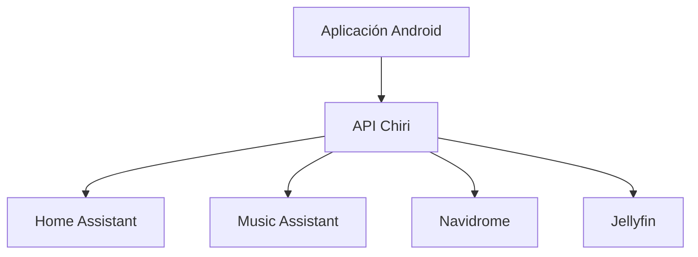

---

# 5.2 Responsabilidad del Backend

El Backend será responsable de:

* conocer cómo comunicarse con cada servicio.
* transformar respuestas externas.
* ocultar diferencias entre plataformas.
* manejar errores.

---

# 5.3 Principio de Abstracción

Android no deberá conocer detalles como:

* dirección interna de Home Assistant.
* puertos Docker.
* tokens internos.
* APIs específicas externas.

Ejemplo:

Incorrecto:

```text
Android
   |
   | REST Home Assistant
   |
Home Assistant
```

Correcto:

```text
Android
   |
   | API Chiri
   |
Backend
   |
Home Assistant
```

---

# 5.4 Integración con Home Assistant

Responsabilidad:

Controlar capacidades de domótica.

Ejemplos:

* estado de dispositivos.
* ejecución de acciones.
* lectura de sensores.

Chiri deberá consumir Home Assistant, no replicarlo.

---

# 5.5 Integración con Music Assistant

Responsabilidad:

Gestionar capacidades musicales.

Ejemplos:

* búsqueda.
* reproducción.
* selección de contenido.

Chiri no almacenará:

* biblioteca musical.
* archivos de audio.
* metadatos completos.

---

# 5.6 Integración con Navidrome

Responsabilidad:

Acceso a biblioteca musical personal.

Chiri podrá:

* solicitar información.
* mostrar contenido.
* coordinar acciones.

Navidrome seguirá siendo propietario de su biblioteca.

---

# 5.7 Integración con Jellyfin

Responsabilidad:

Gestionar contenido multimedia.

Chiri podrá:

* consultar contenido.
* iniciar acciones.
* presentar información.

Jellyfin mantiene:

* usuarios multimedia.
* biblioteca.
* reproducción.

---

# 5.8 Adaptadores de Integración

Cada servicio deberá tener una capa independiente.

Ejemplo:

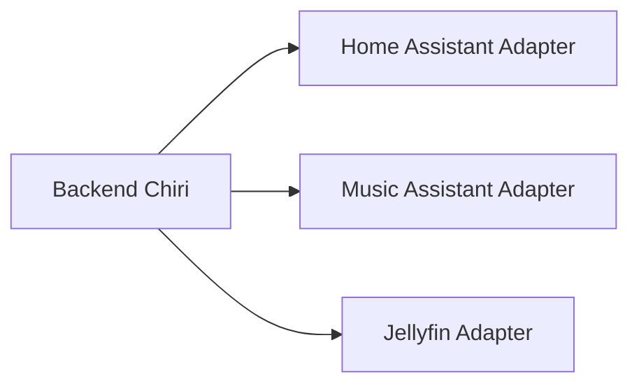

---

# 5.9 Ventaja de Adaptadores

Permiten:

* cambiar servicios.
* actualizar versiones.
* aislar problemas.
* realizar pruebas independientes.

---

# 5.10 Manejo de Errores Externos

Los errores externos deberán transformarse.

Ejemplo:

Servicio externo:

```text
Connection refused
```

Respuesta Chiri:

```json
{
 "error": {
   "code": "SERVICE_UNAVAILABLE"
 }
}
```

---

# 5.11 Estado de Integraciones

Chiri deberá poder conocer:

* servicio disponible.
* conexión activa.
* última comunicación.
* errores recientes.

---

# 5.12 Tiempo de Respuesta

Las integraciones deberán considerar:

* operaciones rápidas.
* límites de espera.
* manejo de fallos.
* evitar bloquear la API.

---

# 5.13 Principio Arquitectónico

La integración deberá cumplir:

> Los servicios externos pueden cambiar; Chiri debe mantener estable su contrato interno.

# 6. Modelos de Datos, Solicitudes y Respuestas API

La API de Chiri Platform deberá utilizar modelos de datos definidos para garantizar comunicación consistente entre clientes y Backend.

---

# 6.1 Principio de Contratos

Cada endpoint deberá definir:

* datos de entrada.
* validaciones.
* respuesta esperada.
* posibles errores.

El contrato deberá existir antes de implementar código.

---

# 6.2 Separación de Modelos

La API deberá separar:

* Request Models.
* Response Models.
* Domain Models.

Ejemplo:

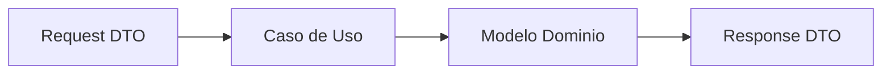

---

# 6.3 Request Models

Representan información enviada por el cliente.

Ejemplo:

Solicitud para cambiar configuración:

```json
{
  "theme": "dark"
}
```

Responsabilidad:

* recibir datos.
* validar formato.
* evitar datos incorrectos.
---

# 6.4 Modelos de Autenticación

Los endpoints de autenticación deberán utilizar modelos específicos para solicitudes y respuestas.

Los modelos deberán mantenerse separados de los modelos internos del dominio.

---

## 6.4.1 Login Request

El modelo de inicio de sesión deberá permitir proporcionar:

* usuario o correo electrónico.
* contraseña.

La estructura definitiva de campos deberá formar parte del contrato de autenticación.

---

## 6.4.2 Login Response

La respuesta de inicio de sesión deberá contener las credenciales de sesión definidas por la plataforma.

Como mínimo deberá contemplar:

* access token.
* refresh token.

Cuando corresponda, podrá incluir información del usuario autenticado y los datos necesarios para determinar sus permisos.

La estructura definitiva deberá establecerse antes de implementar los clientes.

---

## 6.4.3 Refresh Request

El modelo de renovación deberá contener el refresh token necesario para solicitar una nueva credencial de acceso.

---

## 6.4.4 Refresh Response

La respuesta de renovación deberá contener las nuevas credenciales de acceso definidas por la plataforma.

---

## 6.4.5 Logout Request

El modelo de cierre de sesión deberá contener la información necesaria para identificar la sesión que deberá ser invalidada.

---

## 6.4.6 Session Response

La respuesta de consulta de sesión deberá permitir determinar el estado de la sesión y, cuando corresponda, proporcionar la información básica del usuario autenticado.

---

# 6.5 Response Models

Representan información devuelta por Chiri.

Ejemplo:

```json
{
  "success": true,
  "data": {
    "theme": "dark"
  }
}
```

# 6.6 Modelo de Respuesta Estándar

Todas las respuestas deberán mantener una estructura común.

Éxito:

```json
{
  "success": true,
  "data": {},
  "message": null
}
```

Error:

```json
{
  "success": false,
  "data": null,
  "error": {
    "code": "ERROR_CODE",
    "message": "Description"
  }
}
```

---

# 6.7 Códigos de Error

Los errores deberán utilizar códigos estables.

Ejemplos:

```text id="6q8m2x"
AUTH_REQUIRED

PERMISSION_DENIED

RESOURCE_NOT_FOUND

SERVICE_UNAVAILABLE

VALIDATION_ERROR
```

# 6.8 Validación de Datos

La API deberá validar:

* campos obligatorios.
* formatos.
* tamaños.
* valores permitidos.

Ejemplo:

Email:

```text id="3m7q5x"
Formato válido requerido
```

# 6.9 Paginación

Los endpoints que devuelvan grandes cantidades de datos deberán soportar paginación.

Ejemplo:

```text id="9m4q2x"
/api/v1/media?page=1&limit=20
```

Respuesta conceptual:

```json
{
  "items": [],
  "page": 1,
  "total": 100
}
```

---

# 6.10 Filtros

Los filtros deberán ser claros.

Ejemplo:

```text id="5x8m3q"
/api/v1/devices?status=online
```

---

# 6.11 Ordenamiento

Cuando sea necesario:

Ejemplo:

```text id="7q2m5x"
/api/v1/events?sort=-created_at
```

---

# 6.12 Fechas

Las fechas deberán utilizar formato estándar.

Convención:

```text id="4m8q2x"
ISO 8601

UTC
```

Ejemplo:

```text
2026-08-06T20:00:00Z
```

---

# 6.13 Identificadores

Los identificadores expuestos por API deberán ser:

* estables.
* únicos.
* independientes de servicios externos.

---

# 6.14 Versionado de Modelos

Los cambios importantes en estructuras de datos deberán considerar:

* compatibilidad.
* transición.
* nueva versión si es necesario.

---

# 6.15 Principio Arquitectónico

Los modelos API deberán cumplir:

> El contrato de comunicación debe ser más estable que la implementación interna.

# 7. Documentación, Pruebas y Calidad de API

La API de Chiri Platform deberá mantenerse documentada y probada para garantizar estabilidad durante su evolución.

---

# 7.1 Documentación Oficial

La API deberá contar con documentación automática basada en OpenAPI.

La documentación deberá incluir:

* endpoints disponibles.
* parámetros.
* modelos de solicitud.
* modelos de respuesta.
* códigos de error.
* autenticación requerida.

---

# 7.2 OpenAPI

FastAPI permitirá generar documentación automática.

Interfaces esperadas:

```text id="6m2q8x"
OpenAPI Schema

Swagger UI

Documentación interactiva
```

---

# 7.3 Documentación como Parte del Código

La documentación no deberá mantenerse como información separada que pueda quedar desactualizada.

Regla:

```text id="4x7m2q"
Código

+

Contrato API

+

Documentación

=
Una sola fuente coherente
```

---

# 7.4 Pruebas de API

La API deberá contar con diferentes niveles de pruebas.

---

## Pruebas Unitarias

Validan componentes individuales.

Ejemplos:

* validadores.
* servicios.
* casos de uso.

---

## Pruebas de Integración

Validan comunicación entre componentes.

Ejemplos:

* API + PostgreSQL.
* API + Home Assistant.
* API + Music Assistant.

---

## Pruebas de Contrato

Validan que:

* las respuestas mantengan estructura.
* los modelos no cambien inesperadamente.
* los clientes continúen funcionando.

---

# 7.5 Flujo de Calidad

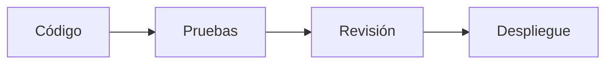

---

# 7.6 Entornos

La API deberá manejar ambientes separados:

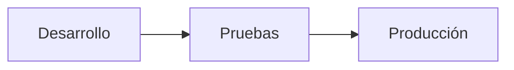

---

# 7.7 Cambios en API

Antes de modificar un endpoint existente deberá evaluarse:

* impacto en Android.
* impacto en futuros clientes.
* compatibilidad.

---

# 7.8 Deprecación

Cuando una API quede obsoleta:

No deberá eliminarse inmediatamente.

Proceso:

```text id="3m8q5x"
Versión antigua

↓

Aviso de cambio

↓

Nueva versión

↓

Retiro controlado
```

---

# 7.9 Registro de Cambios

Los cambios importantes deberán documentarse.

Ejemplos:

* nuevo endpoint.
* cambio de modelo.
* modificación de permisos.

---

# 7.10 Monitoreo

La API deberá permitir observar:

* errores.
* tiempos de respuesta.
* disponibilidad.
* uso de endpoints.

---

# 7.11 Principio Arquitectónico

La calidad de API deberá cumplir:

> Un cambio pequeño no debe convertirse en un problema grande para toda la plataforma.

# 8. Despliegue y Operación de la API

La API Chiri será desplegada como un servicio independiente dentro de la infraestructura Docker de la plataforma.

---

# 8.1 Ejecución mediante Docker

La API deberá ejecutarse dentro de un contenedor.

Arquitectura:

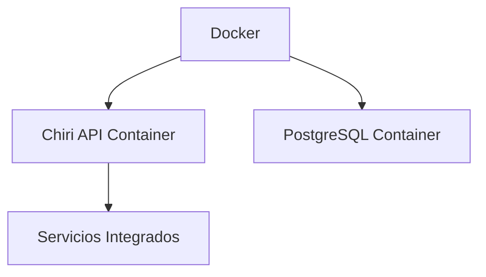

---

# 8.2 Independencia del Entorno

La API deberá funcionar de la misma forma en:

* desarrollo.
* pruebas.
* producción.

La diferencia entre ambientes deberá estar controlada por configuración.

---

# 8.3 Configuración mediante Variables de Entorno

La configuración no deberá estar escrita directamente en el código.

Ejemplos:

```text id="7q5m2x"
DATABASE_URL

SECRET_KEY

API_PORT

ENVIRONMENT
```

---

# 8.4 Separación de Configuración

Los ambientes deberán tener configuraciones independientes:

```text id="4m8q2x"
development.env

testing.env

production.env
```

---

# 8.5 Comunicación Interna Docker

Los servicios deberán comunicarse mediante redes Docker internas.

Ejemplo:

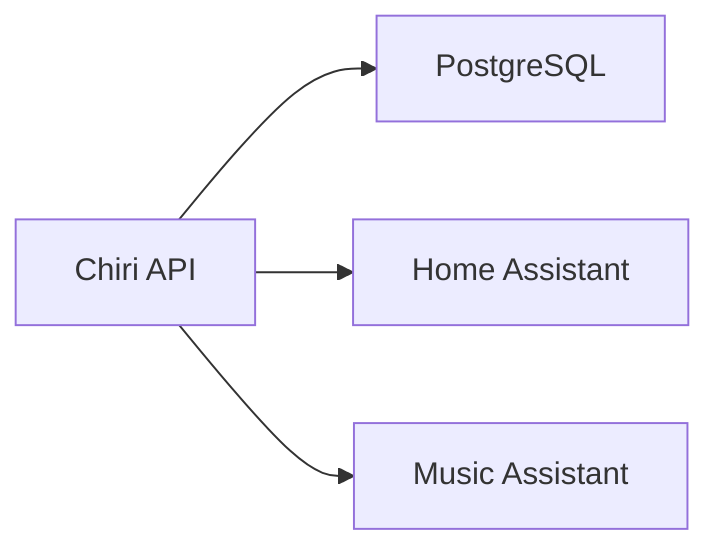

---

# 8.6 Exposición de Puertos

Solo deberán exponerse los servicios necesarios.

Principio:

```text id="2m7q5x"
Menor exposición

=

Mayor seguridad
```

---

# 8.7 Logs

La API deberá generar registros para:

* errores.
* solicitudes.
* eventos importantes.
* problemas de integración.

---

# 8.8 Niveles de Log

Se deberán considerar niveles:

```text id="6q8m3x"
DEBUG

INFO

WARNING

ERROR

CRITICAL
```

En producción deberá evitarse registrar información sensible.

---

# 8.9 Reinicio Automático

El contenedor deberá poder recuperarse automáticamente ante:

* reinicio del servidor.
* fallo temporal.
* actualización controlada.

---

# 8.10 Salud del Servicio

La API deberá implementar mecanismos de comprobación.

Ejemplo:

```text id="3m8q7x"
/health
```

Permitirá verificar:

* servicio activo.
* conexión básica.
* estado general.

---

# 8.11 Actualizaciones

Las actualizaciones deberán seguir:


---

# 8.12 Recuperación

Ante fallo:

Proceso esperado:

```text id="9q4m2x"
Servidor reinicia

↓

Docker inicia servicios

↓

API inicia

↓

Verifica dependencias

↓

Servicio disponible
```

---

# 8.13 Principio Arquitectónico

La operación de la API deberá cumplir:

> La plataforma debe poder reiniciarse y recuperarse sin intervención compleja.

# 9. Seguridad Avanzada de API

La API de Chiri Platform deberá incorporar medidas adicionales de seguridad para proteger la plataforma, sus usuarios y sus servicios integrados.

---

# 9.1 Seguridad por Capas

La protección de la API no dependerá de un único mecanismo.

Se aplicarán varias capas:

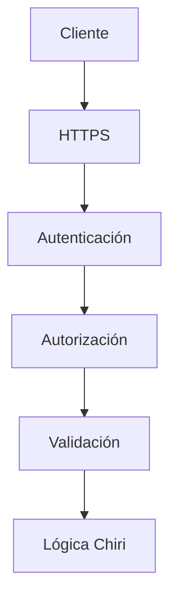

---

# 9.2 Validación de Entradas

Toda información recibida deberá ser validada.

Se deberá controlar:

* tipos de datos.
* formatos.
* valores permitidos.
* tamaño máximo.
* campos obligatorios.

Ejemplo:

Incorrecto:

```json
{
 "volume": "mucho"
}
```

Correcto:

```json
{
 "volume": 50
}
```

---

# 9.3 Protección contra Datos Maliciosos

La API deberá prevenir:

* inyección SQL.
* solicitudes inválidas.
* datos inesperados.
* ejecución no autorizada.

Las consultas deberán realizarse mediante mecanismos seguros del Backend.

---

# 9.4 Rate Limiting

La API deberá considerar límites de solicitudes.

Objetivo:

* evitar abuso.
* proteger recursos.
* mantener disponibilidad.

Ejemplo:

```text id="4m7q2x"
Cliente normal

↓

Solicitudes permitidas


Cliente abusivo

↓

Solicitudes limitadas
```

---

# 9.5 Protección de Endpoints Sensibles

Las operaciones críticas deberán tener controles adicionales.

Ejemplos:

* administración de usuarios.
* cambios de configuración.
* acciones críticas de dispositivos.

---

# 9.6 Gestión de Secretos

La API no deberá almacenar secretos directamente en código.

Ejemplos:

Incorrecto:

```python
PASSWORD = "clave123"
```

Correcto:

```text id="6q3m8x"
Variable de entorno

Secret Manager futuro
```

---

# 9.7 Información Sensible en Respuestas

Las respuestas deberán evitar exponer:

* contraseñas.
* tokens.
* claves internas.
* información innecesaria.

---

# 9.8 Auditoría de Seguridad

Las acciones importantes deberán registrarse.

Ejemplos:

* inicio de sesión.
* cambios de permisos.
* modificaciones administrativas.

---

# 9.9 Protección de Errores

Los errores enviados al cliente deberán ser controlados.

Incorrecto:

```text id="8m4q2x"
Error SQL:
password authentication failed for user postgres
```

Correcto:

```json id="3x7m5q"
{
 "error": {
   "code": "DATABASE_ERROR"
 }
}
```

---

# 9.10 Seguridad en Integraciones

Las conexiones con servicios externos deberán:

* utilizar credenciales protegidas.
* validar respuestas.
* controlar tiempos de espera.
* manejar fallos.

---

# 9.11 Preparación para Acceso Remoto

Si Chiri es accesible fuera de la red local deberá considerar:

* HTTPS obligatorio.
* autenticación fuerte.
* exposición mínima.
* monitoreo.

---

# 9.12 Principio Arquitectónico

La seguridad de la API deberá cumplir:

> La comodidad nunca debe eliminar el control sobre quién puede acceder y qué puede ejecutar.

# 10. Conclusión y Reglas Finales de API

La API de Chiri Platform v1.0 queda definida como la capa central de comunicación de la plataforma.

Su función será conectar clientes, lógica de negocio y servicios integrados mediante un contrato estable, seguro y mantenible.

---

# 10.1 Decisiones Confirmadas

La API utilizará:

* FastAPI.
* Python.
* REST.
* JSON.
* HTTPS.
* OpenAPI.
* Versionado mediante `/api/v1`.

---

# 10.2 Responsabilidad Confirmada

La API será responsable de:

* exponer capacidades de Chiri.
* validar solicitudes.
* controlar acceso.
* ejecutar casos de uso.
* comunicarse con servicios externos.
* devolver respuestas consistentes.

---

# 10.3 Límites Confirmados

La API NO será responsable de:

* reemplazar Home Assistant.
* reemplazar Music Assistant.
* reemplazar Navidrome.
* reemplazar Jellyfin.
* almacenar archivos multimedia.
* permitir acceso directo a servicios internos.

---

# 10.4 Arquitectura Final

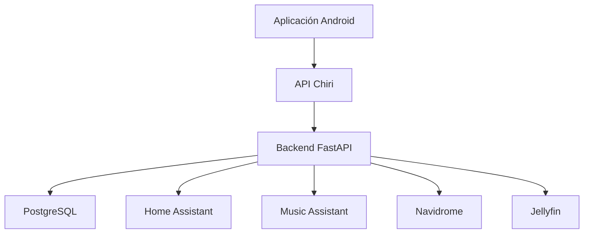

---

# 10.5 Reglas que no deben romperse

## Regla 1

Ningún cliente accederá directamente a servicios internos.

---

## Regla 2

Todo acceso deberá pasar por la API Chiri.

---

## Regla 3

Los endpoints representan capacidades, no implementaciones internas.

---

## Regla 4

Los contratos existentes no deben romperse sin una estrategia de migración.

---

## Regla 5

Toda nueva funcionalidad debe diseñarse primero como contrato API.

---

## Regla 6

La seguridad debe formar parte del diseño inicial.

---

# 10.6 Evolución Futura

La API permitirá agregar:

* nuevos clientes.
* nuevas integraciones.
* asistentes inteligentes.
* automatizaciones.
* servicios futuros.

Sin modificar la arquitectura principal.

---

# 10.7 Estado del Documento

El documento:

```text id="4m8q2x"
060_API.md
```

queda definido como referencia oficial para la arquitectura de comunicación de Chiri Platform v1.0.

Cualquier implementación futura deberá respetar:

* estructura REST.
* versionado.
* seguridad.
* contratos.
* separación de responsabilidades.

---

# Declaración Final

La API de Chiri Platform v1.0 será el punto de unión entre todos los componentes de la plataforma.

Su objetivo no es reemplazar servicios existentes, sino proporcionar una experiencia unificada y segura.

Principio final:

> Los clientes conocen Chiri; Chiri conoce las integraciones; las integraciones permanecen independientes.
