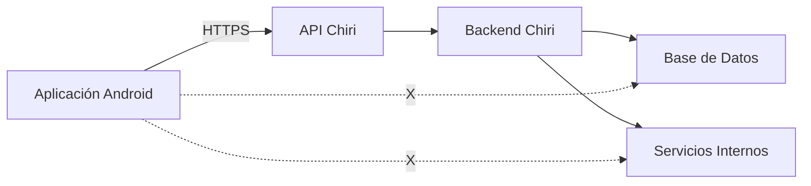
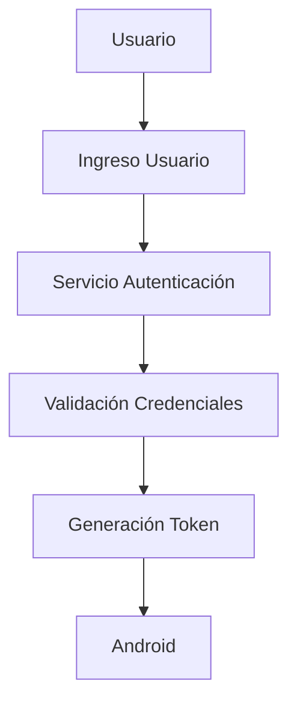
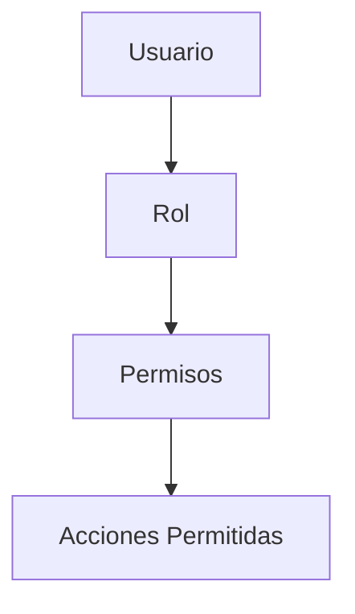
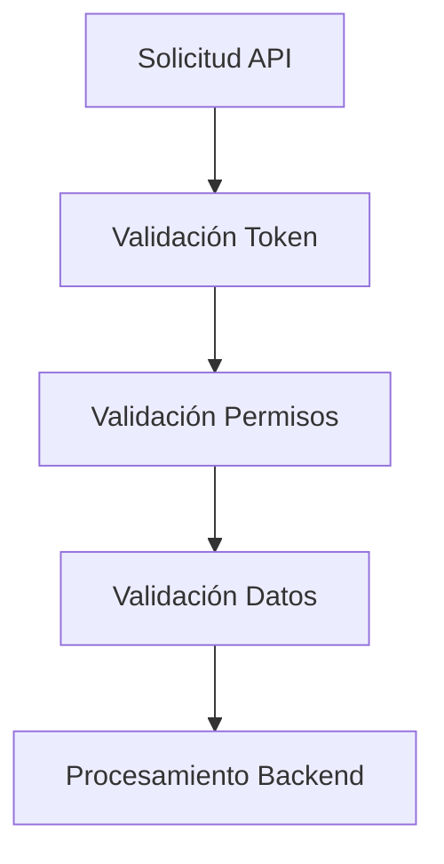
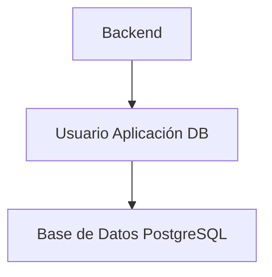
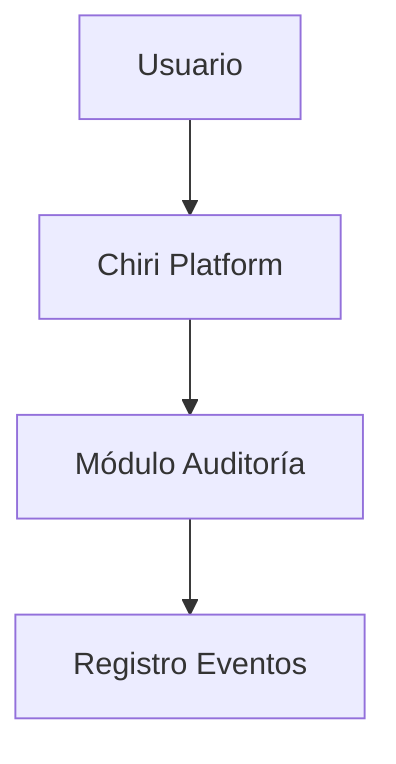

# 070_Seguridad.md

# Arquitectura de Seguridad Chiri Platform v1.0

## 1. Objetivo

Definir la arquitectura de seguridad transversal de Chiri Platform v1.0, estableciendo los mecanismos necesarios para proteger:

* Identidad de usuarios.
* Acceso a funcionalidades.
* Comunicación entre componentes.
* Información almacenada.
* Operaciones críticas del sistema.

La seguridad forma parte de la arquitectura base y aplica a:

* Aplicación Android.
* API.
* Backend.
* Base de Datos.
* Servicios internos.

---

# 2. Principios de Seguridad

## 2.1 Seguridad por diseño

Chiri Platform incorpora seguridad desde la definición arquitectónica.

Principios:

* Mínimo privilegio.
* Validación en todos los niveles.
* Separación de responsabilidades.
* Protección de información sensible.
* Auditoría de operaciones importantes.

---

## 2.2 No confianza en clientes externos

La aplicación Android es un cliente del sistema.

El Backend siempre debe validar:

* Identidad.
* Permisos.
* Datos recibidos.
* Reglas de negocio.

Nunca se debe asumir que la información enviada desde un cliente es confiable.

---

# 3. Límites de Confianza y Acceso a Infraestructura

Chiri Platform deberá aplicar una separación clara entre:

* Clientes externos.
* API Chiri.
* Backend.
* Base de Datos.
* Servicios internos.
* Infraestructura.

Los clientes externos no deberán acceder directamente a servicios internos.

La única entrada autorizada desde clientes hacia la plataforma será la API
Chiri mediante HTTPS.

Los servicios internos deberán permanecer aislados de los clientes.

Ejemplo:



---

## 3.1 Regla de No Acceso Directo

Ningún cliente externo deberá acceder directamente a:

* Base de Datos.
* Servicios internos.
* Contenedores Docker.
* APIs administrativas.
* Puertos internos.
* Interfaces de administración.
* Dispositivos de infraestructura.

El acceso deberá realizarse mediante las interfaces autorizadas de Chiri.

---

## 3.2 Separación de Redes

La infraestructura interna deberá mantenerse separada de los
clientes externos.

La exposición de un servicio interno no deberá considerarse un
mecanismo válido de integración con Android.

---

## 3.3 Principio de Mínima Exposición

Todo servicio deberá exponer únicamente los puertos, interfaces y
funcionalidades estrictamente necesarios.

Los servicios que no requieran acceso externo no deberán exponerse
directamente a Internet.

---

# 4. Modelo General de Seguridad

La seguridad de Chiri Platform deberá establecer un conjunto coherente de principios, controles y reglas arquitectónicas destinados a proteger la plataforma, sus componentes, sus comunicaciones, sus datos y los servicios integrados.

El modelo de seguridad deberá aplicarse de forma transversal a los componentes de la plataforma y deberá mantenerse alineado con la arquitectura definida en los documentos anteriores.

La seguridad deberá considerar especialmente:

* identidad y acceso;
* comunicaciones;
* protección de datos;
* aplicaciones y APIs;
* servicios internos;
* infraestructura;
* auditoría y monitoreo;
* gestión de vulnerabilidades;
* respuesta ante incidentes.

Las medidas de seguridad deberán seguir el principio de **defensa en profundidad**, evitando depender de un único mecanismo de protección.

La seguridad deberá integrarse desde el diseño de la plataforma y mantenerse durante todo su ciclo de vida.

---

# 4.1 Zonas de Confianza y Fronteras de Seguridad

Chiri Platform deberá considerar diferentes zonas de confianza según el nivel de exposición y responsabilidad de cada componente.

Las principales zonas de confianza serán:

* **Cliente:** dispositivos utilizados para acceder a la plataforma.
* **API:** punto de entrada a los servicios de Chiri Platform.
* **Backend:** componentes que ejecutan la lógica de negocio.
* **Datos:** Base de Datos y sistemas que almacenan información de la plataforma.
* **Servicios internos:** servicios integrados que proporcionan funcionalidades a Chiri Platform.
* **Administración e infraestructura:** componentes utilizados para administrar y mantener la plataforma.

La comunicación entre zonas deberá considerarse una **frontera de seguridad**.

Ninguna zona deberá considerarse automáticamente confiable únicamente por pertenecer a la infraestructura interna.

El acceso entre zonas deberá estar sujeto a los mecanismos de autenticación, autorización, validación y protección de comunicaciones que correspondan.

Los servicios internos deberán utilizar permisos mínimos y únicamente deberán acceder a los recursos necesarios para cumplir su función.

Los componentes expuestos a redes externas deberán disponer de controles adicionales respecto de los componentes que no estén directamente expuestos.

### Regla arquitectónica

> **Toda comunicación entre zonas de confianza deberá considerarse una frontera de seguridad y deberá estar protegida mediante los controles correspondientes al nivel de riesgo y exposición.**

---

Perfecto. Seguimos con **4.2**, manteniendo el mismo criterio: claro, compacto y arquitectónico.

---

# 4.2 Principio de Mínimo Privilegio

Chiri Platform deberá aplicar el principio de **mínimo privilegio** a usuarios, aplicaciones, servicios, procesos y componentes de infraestructura.

Cada identidad deberá disponer únicamente de los permisos necesarios para realizar las funciones que le correspondan.

Los permisos deberán definirse de acuerdo con:

* función;
* responsabilidad;
* recurso;
* operación;
* contexto de acceso.

Los usuarios no deberán disponer de permisos administrativos salvo cuando sean necesarios para realizar funciones específicas de administración.

Los servicios internos deberán utilizar identidades independientes y permisos limitados a los recursos que necesiten.

El Backend no deberá utilizar credenciales con privilegios superiores a los necesarios para ejecutar sus funciones.

El acceso a la Base de Datos deberá limitarse a las operaciones requeridas por cada componente.

Las cuentas y credenciales utilizadas para administración deberán mantenerse separadas de las utilizadas por los servicios de ejecución normal.

Los permisos deberán revisarse cuando cambien las responsabilidades, componentes o necesidades de acceso.

Los privilegios que ya no sean necesarios deberán eliminarse.

### Regla arquitectónica

> **Todo usuario, servicio o componente de Chiri Platform deberá disponer únicamente de los privilegios necesarios para cumplir su función.**

---

# 4.3 Autenticación

Chiri Platform deberá disponer de mecanismos de autenticación que permitan verificar de forma segura la identidad de los usuarios y componentes que soliciten acceso a recursos protegidos.

La autenticación deberá aplicarse antes de permitir el acceso a recursos que requieran identidad.

Los mecanismos de autenticación deberán:

* proteger las credenciales durante su transmisión;
* evitar el almacenamiento de credenciales en texto plano;
* limitar los intentos de autenticación cuando exista riesgo de abuso;
* permitir la invalidación de credenciales comprometidas;
* utilizar mecanismos adecuados al tipo de cliente y servicio;
* mantener separadas las funciones de autenticación y autorización.

Las credenciales de los usuarios deberán almacenarse utilizando mecanismos seguros de protección y nunca deberán almacenarse directamente en texto plano.

La autenticación de servicios internos deberá utilizar identidades y credenciales independientes de las cuentas de usuario.

Las credenciales utilizadas por servicios deberán disponer únicamente de los privilegios necesarios para su función.

Los mecanismos de autenticación deberán considerar la protección contra:

* fuerza bruta;
* reutilización indebida de credenciales;
* robo de credenciales;
* uso de credenciales comprometidas;
* ataques automatizados.

Las credenciales o mecanismos de autenticación que se consideren comprometidos deberán poder ser invalidados o reemplazados.

### Regla arquitectónica

> **Todo acceso autenticado a recursos protegidos de Chiri Platform deberá verificar la identidad mediante mecanismos seguros y deberá impedir el uso indebido de credenciales comprometidas.**

---

Continuamos con **4.4 Autorización**.

---

# 4.4 Autorización

Chiri Platform deberá controlar el acceso a recursos y operaciones mediante mecanismos de autorización.

La autorización deberá determinar qué acciones puede realizar una identidad autenticada sobre un recurso determinado.

La autorización deberá considerar, según corresponda:

* identidad;
* rol;
* permisos;
* recurso;
* operación;
* contexto de acceso.

La autenticación no deberá implicar automáticamente autorización para acceder a todos los recursos de la plataforma.

Los permisos deberán asignarse mediante el principio de mínimo privilegio.

Las operaciones administrativas deberán disponer de controles adicionales respecto de las operaciones normales de usuario.

El Backend deberá validar los permisos antes de ejecutar operaciones que requieran autorización.

La API no deberá confiar únicamente en controles realizados por el cliente.

Los controles de autorización deberán aplicarse en el servidor y deberán mantenerse independientes de la interfaz utilizada para acceder a la plataforma.

Los cambios de privilegios deberán quedar sujetos a controles adecuados y no deberán permitir escalada de privilegios no autorizada.

Los accesos que ya no estén autorizados deberán ser rechazados aunque la identidad continúe autenticada.

### Regla arquitectónica

> **Toda operación protegida de Chiri Platform deberá ser autorizada en el servidor antes de ejecutarse, independientemente del cliente que origine la solicitud.**

---

Continuamos con **4.5 Protección de Comunicaciones**.

---

# 4.5 Protección de Comunicaciones

Las comunicaciones de Chiri Platform deberán protegerse contra interceptación, modificación, suplantación y acceso no autorizado.

Las comunicaciones que transporten información sensible, credenciales, tokens o información de autenticación deberán utilizar mecanismos de protección adecuados.

Las comunicaciones externas deberán utilizar **HTTPS mediante TLS**.

Los certificados utilizados para proteger las comunicaciones deberán mantenerse válidos y gestionarse de forma adecuada.

Las comunicaciones entre componentes internos deberán protegerse de acuerdo con el nivel de confianza y riesgo existente.

El hecho de que dos componentes pertenezcan a la misma red no deberá considerarse suficiente para establecer confianza automática.

Las comunicaciones entre:

* Cliente y API;
* API y Backend;
* Backend y Base de Datos;
* Backend y servicios internos;
* componentes administrativos;

deberán utilizar mecanismos de autenticación y protección adecuados cuando el riesgo lo requiera.

Los servicios publicados hacia redes externas deberán disponer de controles adicionales de protección y no deberán exponerse directamente más allá de lo necesario.

Los mecanismos utilizados para publicar servicios externamente, incluidos proxies o túneles, deberán considerarse parte de la frontera de seguridad y no deberán sustituir los mecanismos propios de autenticación y autorización de Chiri Platform.

Las comunicaciones deberán limitarse a los puertos, protocolos y destinos necesarios para el funcionamiento de cada componente.

### Regla arquitectónica

> **Toda comunicación que atraviese una frontera de seguridad deberá utilizar mecanismos adecuados de protección, autenticación y control de acceso según su nivel de riesgo.**

---

Continuamos con **4.6 Protección de Datos**.

---

# 4.6 Protección de Datos

Chiri Platform deberá proteger la información almacenada, procesada y transmitida por sus componentes durante todo su ciclo de vida.

La protección de los datos deberá considerar:

* confidencialidad;
* integridad;
* disponibilidad;
* control de acceso;
* almacenamiento;
* transmisión;
* respaldo;
* eliminación.

La información deberá clasificarse de acuerdo con su nivel de sensibilidad y los controles deberán aplicarse proporcionalmente al riesgo.

Los datos sensibles o confidenciales deberán disponer de controles de acceso adecuados y no deberán exponerse a componentes que no los necesiten.

La Base de Datos deberá estar protegida mediante autenticación, autorización y mínimo privilegio.

Las credenciales, tokens, claves y secretos no deberán almacenarse como datos ordinarios de la aplicación ni incluirse en código fuente, repositorios o registros de aplicación.

Los datos sensibles transmitidos entre componentes deberán utilizar canales protegidos.

Los registros de aplicación y auditoría no deberán contener información sensible innecesaria, credenciales, tokens completos ni secretos.

Los respaldos deberán protegerse mediante controles de acceso adecuados y deberán considerarse parte de la superficie de seguridad de la plataforma.

Los datos que ya no sean necesarios deberán eliminarse o gestionarse de acuerdo con las políticas definidas para la plataforma.

La eliminación de información sensible deberá realizarse de manera que evite su exposición posterior cuando sea técnicamente posible.

### Regla arquitectónica

> **Los datos de Chiri Platform deberán protegerse durante su almacenamiento, procesamiento, transmisión, respaldo y eliminación, aplicando controles proporcionales a su sensibilidad y riesgo.**

---

Continuamos con **4.7 Gestión de Sesiones y Tokens**.

---

# 4.7 Gestión de Sesiones y Tokens

Chiri Platform deberá gestionar de forma segura las sesiones y los mecanismos utilizados para mantener el estado de autenticación de los usuarios y servicios.

Los tokens y demás identificadores de sesión deberán considerarse información sensible.

Su gestión deberá contemplar:

* generación segura;
* almacenamiento protegido;
* transmisión segura;
* expiración;
* renovación;
* invalidación;
* revocación cuando corresponda.

Los tokens no deberán incluirse en:

* código fuente;
* registros de aplicación;
* mensajes de error;
* URLs cuando exista una alternativa segura;
* repositorios públicos.

El cliente deberá almacenar los tokens utilizando mecanismos apropiados para protegerlos frente al acceso no autorizado.

Los tokens deberán tener una duración limitada y deberán poder invalidarse cuando exista sospecha de compromiso.

La renovación de sesiones deberá realizarse mediante mecanismos controlados y no deberá permitir extender indefinidamente una sesión comprometida.

El servidor deberá validar la vigencia y autenticidad del mecanismo de sesión antes de permitir el acceso a recursos protegidos.

El cierre de sesión deberá invalidar la sesión o los mecanismos de acceso correspondientes cuando la arquitectura utilizada lo permita.

Las sesiones administrativas deberán disponer de controles de seguridad adicionales cuando el nivel de riesgo lo requiera.

### Regla arquitectónica

> **Los mecanismos de sesión y tokens deberán gestionarse como información sensible, con duración limitada, almacenamiento protegido y capacidad de invalidación cuando corresponda.**

---

Continuamos con **4.8 Gestión de Secretos y Credenciales**.

---

# 4.8 Gestión de Secretos y Credenciales

Chiri Platform deberá proteger las credenciales, claves, tokens, certificados y demás secretos utilizados por sus componentes.

Los secretos deberán mantenerse separados del código fuente y de la configuración que pueda ser distribuida públicamente.

No deberán incluirse secretos reales en:

* repositorios de código;
* archivos de documentación;
* código fuente;
* imágenes de contenedores;
* registros de aplicación;
* archivos compartidos sin protección.

Los servicios deberán utilizar únicamente las credenciales necesarias para realizar sus funciones.

Las credenciales deberán poder ser reemplazadas cuando exista sospecha de compromiso o cuando sea necesario por razones de seguridad.

Los secretos utilizados por diferentes componentes deberán mantenerse separados cuando sus funciones y niveles de privilegio sean diferentes.

Las claves, certificados y credenciales deberán protegerse mediante mecanismos adecuados al entorno de ejecución.

Los valores utilizados durante el desarrollo deberán mantenerse separados de los utilizados en entornos de ejecución reales.

Cuando un secreto deje de ser necesario, deberá retirarse de los mecanismos activos de configuración y acceso.

La exposición accidental de un secreto deberá considerarse un evento de seguridad y deberá evaluarse su posible reemplazo o revocación.

### Regla arquitectónica

> **Los secretos y credenciales de Chiri Platform deberán mantenerse protegidos, separados del código fuente y gestionados de forma que puedan ser reemplazados o revocados cuando sea necesario.**

---

Continuamos con **4.9 Validación y Protección de Entradas**.

---

# 4.9 Validación y Protección de Entradas

Chiri Platform deberá validar toda información recibida desde clientes, servicios internos, integraciones externas y cualquier otra fuente que pueda influir en el comportamiento de la plataforma.

La validación deberá realizarse en el servidor y no deberá depender exclusivamente de los controles implementados en el cliente.

Las entradas deberán validarse de acuerdo con:

* tipo de dato;
* formato;
* longitud;
* rango permitido;
* valores admitidos;
* estructura esperada;
* contexto de la operación.

Los datos que no cumplan las reglas esperadas deberán rechazarse de forma controlada.

La plataforma deberá protegerse contra entradas diseñadas para provocar:

* inyección de código;
* inyección SQL;
* ejecución de comandos;
* manipulación de consultas;
* acceso no autorizado;
* corrupción de datos;
* consumo excesivo de recursos.

Las consultas a la Base de Datos deberán utilizar mecanismos que separen los datos de las instrucciones de consulta.

Los datos proporcionados por el usuario no deberán utilizarse directamente para construir consultas, comandos o instrucciones ejecutables sin la validación y protección correspondientes.

Las entradas recibidas desde servicios internos o integraciones externas tampoco deberán considerarse confiables automáticamente.

Los mensajes de error generados como consecuencia de entradas inválidas no deberán revelar información interna innecesaria.

### Regla arquitectónica

> **Toda entrada que pueda afectar el comportamiento de Chiri Platform deberá validarse y controlarse en el servidor antes de ser procesada.**

---

Continuamos con **4.10 Seguridad de la API**.

---

# 4.10 Seguridad de la API

La API de Chiri Platform deberá aplicar controles de seguridad a todas las operaciones que expongan recursos o funcionalidades de la plataforma.

La API deberá:

* autenticar las solicitudes que requieran identidad;
* autorizar cada operación protegida;
* validar las entradas recibidas;
* limitar el acceso a los recursos permitidos;
* proteger las comunicaciones;
* controlar el uso excesivo o abusivo;
* generar respuestas de error controladas.

Los endpoints públicos deberán limitarse a las funcionalidades que realmente necesiten exposición.

Los endpoints administrativos deberán disponer de controles de autorización específicos y no deberán quedar disponibles para usuarios sin los privilegios correspondientes.

La API no deberá confiar en información de autorización enviada por el cliente.

Los identificadores, parámetros y datos recibidos mediante solicitudes deberán validarse antes de procesarse.

Las respuestas de la API no deberán incluir información sensible que no sea necesaria para completar la operación solicitada.

Los errores de la API deberán proporcionar información suficiente para identificar el problema sin revelar detalles internos innecesarios, credenciales, secretos o información sensible.

Las operaciones que puedan modificar información deberán aplicar controles adecuados de autenticación, autorización, validación y, cuando corresponda, protección contra repetición o abuso.

La API deberá mantener una separación clara entre:

* autenticación;
* autorización;
* validación;
* lógica de negocio;
* acceso a datos.

### Regla arquitectónica

> **Toda operación protegida expuesta mediante la API deberá validar la solicitud, autenticar y autorizar al solicitante cuando corresponda y ejecutar únicamente la operación permitida.**

---

Continuamos con **4.11 Seguridad del Backend**.

---

# 4.11 Seguridad del Backend

El Backend de Chiri Platform deberá aplicar los controles necesarios para proteger la lógica de negocio, los recursos internos y la información procesada por la plataforma.

El Backend deberá:

* validar las solicitudes recibidas;
* aplicar las reglas de autorización;
* proteger la lógica de negocio;
* utilizar únicamente los privilegios necesarios;
* proteger las credenciales y secretos;
* controlar el acceso a recursos internos;
* gestionar los errores de forma segura;
* registrar los eventos de seguridad relevantes.

La lógica de seguridad no deberá depender exclusivamente del cliente.

Las reglas de negocio que impliquen restricciones de acceso deberán validarse en el Backend antes de ejecutar las operaciones correspondientes.

El Backend deberá utilizar cuentas y credenciales con los privilegios mínimos necesarios para acceder a otros componentes.

Los servicios internos utilizados por el Backend deberán autenticarse cuando corresponda y deberán limitar sus permisos al ámbito necesario.

Las excepciones y errores internos no deberán exponer:

* credenciales;
* tokens;
* claves;
* consultas internas;
* rutas sensibles;
* información de infraestructura;
* detalles innecesarios de implementación.

Los componentes del Backend deberán mantenerse actualizados y sus dependencias deberán gestionarse de acuerdo con las políticas de seguridad de la plataforma.

El Backend deberá evitar la ejecución de operaciones con privilegios elevados cuando no sean estrictamente necesarias.

### Regla arquitectónica

> **El Backend deberá aplicar las reglas de seguridad en el servidor y deberá ejecutar cada operación utilizando únicamente los recursos y privilegios necesarios para cumplir su función.**

---

Continuamos con **4.12 Seguridad de la Base de Datos**.

---

# 4.12 Seguridad de la Base de Datos

La Base de Datos de Chiri Platform deberá protegerse contra acceso no autorizado, modificación indebida, pérdida de información y exposición de datos.

El acceso a la Base de Datos deberá estar limitado a los componentes que realmente lo necesiten.

Las cuentas utilizadas para acceder a la Base de Datos deberán disponer únicamente de los permisos necesarios para sus funciones.

Las credenciales de la Base de Datos deberán mantenerse protegidas y separadas del código fuente.

La Base de Datos no deberá exponerse directamente a redes externas cuando no sea necesario.

El acceso deberá realizarse preferentemente a través de los componentes autorizados de Chiri Platform.

Las operaciones realizadas sobre la Base de Datos deberán respetar las reglas de autorización y seguridad definidas por la plataforma.

Las consultas deberán utilizar mecanismos seguros para evitar inyección y manipulación de instrucciones.

Los datos sensibles deberán protegerse de acuerdo con su nivel de clasificación.

Los respaldos de la Base de Datos deberán considerarse información sensible y deberán disponer de controles de acceso y protección adecuados.

Las operaciones administrativas sobre la Base de Datos deberán mantenerse separadas de las operaciones normales de la aplicación.

Los cambios estructurales o administrativos que puedan afectar la integridad de los datos deberán realizarse mediante procedimientos controlados.

### Regla arquitectónica

> **La Base de Datos deberá permanecer protegida de accesos no autorizados y únicamente los componentes e identidades que necesiten acceso podrán disponer de los privilegios mínimos requeridos.**

Continuamos con **4.13 Seguridad de Servicios Internos**.

---

# 4.13 Seguridad de Servicios Internos

Los servicios internos integrados con Chiri Platform deberán considerarse componentes independientes y no deberán recibir confianza automática por encontrarse dentro de la infraestructura de la plataforma.

Cada servicio deberá disponer únicamente de los accesos necesarios para cumplir su función.

Cuando corresponda, las comunicaciones entre Chiri Platform y los servicios internos deberán utilizar mecanismos de autenticación y protección adecuados.

Los servicios internos deberán:

* limitar los puertos y protocolos utilizados;
* restringir los accesos innecesarios;
* utilizar credenciales independientes;
* proteger sus secretos;
* mantener sus componentes actualizados;
* registrar los eventos de seguridad relevantes.

El acceso desde un servicio interno hacia otro servicio deberá estar limitado al mínimo necesario.

Un compromiso de un servicio interno no deberá proporcionar automáticamente acceso completo al resto de Chiri Platform.

Los servicios integrados que puedan acceder a información sensible deberán recibir permisos proporcionales a la información y operaciones que necesiten.

Los servicios internos no deberán exponer interfaces administrativas o de gestión cuando no sean necesarias para su funcionamiento.

Las integraciones externas deberán considerarse fronteras adicionales de seguridad y deberán validarse las respuestas y datos recibidos antes de utilizarlos.

### Regla arquitectónica

> **Ningún servicio interno deberá considerarse confiable por defecto; cada integración deberá utilizar únicamente los permisos, comunicaciones y recursos necesarios para cumplir su función.**

---

Continuamos con **4.14 Seguridad de Android**.

---

# 4.14 Seguridad de Android

La aplicación Android de Chiri Platform deberá proteger las credenciales, sesiones, comunicaciones y datos que gestione en el dispositivo.

La aplicación deberá:

* utilizar comunicaciones protegidas con la API;
* proteger los mecanismos de autenticación;
* almacenar de forma segura los tokens y credenciales necesarios;
* validar las respuestas recibidas;
* evitar almacenar información sensible innecesaria;
* evitar exponer información sensible mediante registros;
* mantener sus dependencias actualizadas.

La aplicación no deberá contener secretos permanentes que permitan acceder directamente a recursos protegidos de Chiri Platform.

Las credenciales o tokens utilizados por la aplicación deberán almacenarse mediante mecanismos apropiados de seguridad proporcionados por Android.

La aplicación no deberá confiar exclusivamente en las validaciones realizadas localmente para proteger recursos o permisos.

Las decisiones de autorización deberán ser realizadas y verificadas por los componentes del servidor correspondientes.

Las comunicaciones entre Android y la API deberán utilizar los mecanismos de protección definidos por Chiri Platform.

Los errores mostrados al usuario deberán evitar revelar información interna de la plataforma.

Los datos almacenados localmente deberán limitarse a los necesarios para el funcionamiento de la aplicación y deberán protegerse de acuerdo con su sensibilidad.

### Regla arquitectónica

> **La aplicación Android deberá proteger las credenciales, sesiones y datos locales, pero nunca deberá considerarse la autoridad final para autenticación o autorización de los recursos de Chiri Platform.**

---

Continuamos con **4.15 Auditoría y Registro de Seguridad**.

---

# 4.15 Auditoría y Registro de Seguridad

Chiri Platform deberá mantener mecanismos de registro que permitan identificar y analizar eventos relevantes para la seguridad de la plataforma.

Los registros deberán facilitar:

* detección de actividades anómalas;
* investigación de incidentes;
* seguimiento de accesos;
* análisis de errores de seguridad;
* trazabilidad de operaciones relevantes.

Cuando corresponda, deberán registrarse eventos relacionados con:

* autenticación;
* intentos de autenticación fallidos;
* autorización denegada;
* cambios de permisos;
* operaciones administrativas;
* cambios de configuración relevantes;
* eventos de seguridad;
* errores relacionados con controles de seguridad.

Los registros deberán contener únicamente la información necesaria para cumplir su finalidad.

No deberán registrarse directamente:

* contraseñas;
* tokens completos;
* claves privadas;
* secretos;
* credenciales;
* información sensible innecesaria.

Los registros deberán protegerse contra modificación o eliminación no autorizada.

El acceso a los registros deberá estar limitado a las identidades que necesiten consultarlos.

Los registros deberán disponer, cuando sea necesario, de información temporal suficiente para establecer la secuencia de los eventos.

La conservación de registros deberá ser proporcional a las necesidades de seguridad, operación y auditoría de la plataforma.

### Regla arquitectónica

> **Los eventos relevantes para la seguridad deberán mantener trazabilidad suficiente para permitir su detección, análisis e investigación sin exponer información sensible innecesaria.**

---

Continuamos con **4.16 Monitorización y Detección de Seguridad**.

---

# 4.16 Monitorización y Detección de Seguridad

Chiri Platform deberá disponer de mecanismos de monitorización que permitan identificar condiciones anómalas, fallos de seguridad y comportamientos que puedan representar un riesgo para la plataforma.

La monitorización deberá considerar, según corresponda:

* disponibilidad de servicios;
* errores de autenticación;
* accesos rechazados;
* cambios administrativos;
* comportamiento anómalo;
* errores críticos;
* consumo anormal de recursos;
* eventos relacionados con seguridad.

Los eventos detectados deberán poder relacionarse con los registros de seguridad cuando sea necesario para su investigación.

La plataforma deberá permitir identificar patrones que puedan indicar:

* intentos de fuerza bruta;
* abuso de recursos;
* accesos no autorizados;
* compromiso de credenciales;
* comportamiento anómalo de servicios;
* fallos repetidos de componentes críticos.

Los mecanismos de monitorización no deberán convertirse en una fuente innecesaria de información sensible.

Las alertas deberán priorizarse de acuerdo con su impacto y riesgo.

Los eventos críticos de seguridad deberán poder generar una alerta o iniciar el procedimiento de respuesta correspondiente.

La monitorización deberá complementar, y no sustituir, los mecanismos de autenticación, autorización y protección de la plataforma.

### Regla arquitectónica

> **Chiri Platform deberá disponer de mecanismos suficientes para detectar eventos y comportamientos que puedan representar un riesgo de seguridad y permitir su posterior análisis y respuesta.**

---

Continuamos con **4.17 Gestión de Errores y Excepciones**.

---

# 4.17 Gestión de Errores y Excepciones

Chiri Platform deberá gestionar los errores y excepciones de forma que no comprometan la seguridad de la plataforma ni expongan información interna innecesaria.

Los errores deberán tratarse de forma controlada en cada componente.

Las respuestas mostradas a usuarios o clientes deberán proporcionar únicamente la información necesaria para identificar el resultado de la operación.

Los mensajes de error no deberán revelar:

* credenciales;
* tokens;
* secretos;
* claves;
* información sensible;
* consultas internas;
* rutas del sistema;
* configuraciones internas;
* detalles innecesarios de infraestructura.

Los errores internos deberán registrarse de forma suficiente para permitir su diagnóstico cuando corresponda, sin almacenar información sensible innecesaria.

Los errores de autenticación y autorización deberán evitar proporcionar información que facilite la enumeración de usuarios, recursos o mecanismos internos.

Una excepción no controlada no deberá permitir que el sistema continúe una operación en un estado inseguro.

Las operaciones que fallen parcialmente deberán mantener la integridad de los datos y evitar estados inconsistentes cuando sea técnicamente posible.

Los errores relacionados con servicios externos o internos deberán gestionarse de forma que un fallo de un componente no provoque automáticamente una pérdida de control de seguridad en otros componentes.

### Regla arquitectónica

> **Los errores y excepciones deberán gestionarse de forma controlada, evitando la exposición de información sensible y evitando que un fallo coloque a Chiri Platform en un estado inseguro.**

---

Continuamos con **4.18 Protección contra Abuso y Uso Indebido**.

---

# 4.18 Protección contra Abuso y Uso Indebido

Chiri Platform deberá disponer de mecanismos destinados a reducir el riesgo de abuso, uso automatizado indebido y consumo excesivo de recursos.

Las medidas de protección deberán aplicarse de acuerdo con el riesgo de cada operación y componente.

Deberán considerarse especialmente:

* intentos repetidos de autenticación;
* solicitudes excesivas a la API;
* operaciones costosas;
* accesos automatizados;
* creación masiva de recursos;
* uso anómalo de servicios;
* consumo excesivo de recursos.

Cuando corresponda, la plataforma podrá aplicar mecanismos como:

* limitación de solicitudes;
* bloqueo temporal;
* restricciones por identidad;
* restricciones por origen;
* límites de recursos;
* controles de concurrencia.

Las medidas de protección no deberán utilizarse para sustituir la autenticación o autorización.

Los límites deberán configurarse de forma que reduzcan el abuso sin impedir innecesariamente el funcionamiento normal de la plataforma.

Los eventos que indiquen un posible abuso deberán poder registrarse y, cuando corresponda, generar alertas para su análisis.

Las operaciones administrativas y las operaciones especialmente sensibles podrán requerir controles adicionales.

### Regla arquitectónica

> **Las operaciones de Chiri Platform deberán disponer de controles proporcionales al riesgo para reducir el abuso, automatización indebida y consumo excesivo de recursos.**

---

Continuamos con **4.19 Seguridad de Infraestructura**.

---

# 4.19 Seguridad de Infraestructura

La infraestructura que soporte Chiri Platform deberá mantenerse protegida frente a accesos no autorizados, configuraciones inseguras y exposición innecesaria.

La infraestructura deberá aplicar, según corresponda:

* mínimo privilegio;
* control de acceso;
* segmentación de servicios;
* actualización de componentes;
* protección de credenciales;
* monitorización;
* registro de eventos relevantes.

Los servicios y puertos que no sean necesarios deberán permanecer deshabilitados o no expuestos.

Los componentes administrativos deberán estar restringidos a las identidades y redes que necesiten utilizarlos.

El acceso administrativo deberá utilizar mecanismos de autenticación adecuados y deberá mantenerse separado del acceso normal de los usuarios.

Los componentes de infraestructura deberán mantenerse actualizados y deberán gestionarse las vulnerabilidades conocidas.

Los contenedores y demás componentes utilizados para ejecutar servicios deberán disponer únicamente de los privilegios y recursos necesarios.

La configuración de infraestructura no deberá contener secretos directamente cuando existan mecanismos adecuados para gestionarlos de forma segura.

Los cambios relevantes de infraestructura deberán realizarse de forma controlada y deberán mantener trazabilidad cuando corresponda.

La exposición externa de servicios deberá limitarse estrictamente a los componentes que necesiten estar disponibles desde redes externas.

### Regla arquitectónica

> **La infraestructura de Chiri Platform deberá aplicar mínimo privilegio, limitar la exposición de servicios y mantener protegidos sus componentes administrativos y de ejecución.**

---

Continuamos con **4.20 Copias de Seguridad y Recuperación**.

---

# 4.20 Copias de Seguridad y Recuperación

Chiri Platform deberá disponer de mecanismos de respaldo y recuperación destinados a proteger la disponibilidad e integridad de la información y los componentes críticos.

Los respaldos deberán considerar, según corresponda:

* Base de Datos;
* configuraciones;
* información necesaria para la recuperación de servicios;
* componentes críticos;
* documentación necesaria para reconstruir la plataforma.

Los respaldos deberán protegerse mediante controles de acceso adecuados y deberán considerarse información sensible cuando contengan datos protegidos.

Las copias de seguridad deberán mantenerse separadas de los sistemas principales cuando sea técnicamente posible, reduciendo el riesgo de que un incidente afecte simultáneamente al sistema y sus respaldos.

Deberá verificarse periódicamente que los respaldos puedan utilizarse para recuperar la información y los servicios correspondientes.

Los procedimientos de recuperación deberán considerar:

* integridad de los datos;
* dependencias entre componentes;
* configuración;
* credenciales y secretos necesarios;
* orden de recuperación;
* continuidad de los servicios críticos.

La recuperación no deberá considerarse completada hasta comprobar que los componentes restaurados funcionan correctamente y que los controles de seguridad continúan activos.

Los respaldos que ya no sean necesarios deberán eliminarse de forma controlada.

### Regla arquitectónica

> **Los componentes e información críticos de Chiri Platform deberán disponer de mecanismos de respaldo y recuperación verificables, protegidos mediante controles de seguridad adecuados.**

---

Continuamos con **4.21 Gestión de Vulnerabilidades**.

---

# 4.21 Gestión de Vulnerabilidades

Chiri Platform deberá disponer de un proceso para identificar, evaluar, priorizar y gestionar vulnerabilidades que puedan afectar sus componentes.

La gestión deberá considerar, según corresponda:

* Sistema Operativo;
* Docker;
* imágenes de contenedores;
* Backend;
* API;
* aplicación Android;
* Base de Datos;
* dependencias;
* librerías;
* servicios internos;
* integraciones externas.

Las vulnerabilidades deberán evaluarse considerando, entre otros factores:

* criticidad del componente;
* posibilidad de explotación;
* exposición a redes externas;
* información afectada;
* privilegios requeridos;
* impacto potencial;
* existencia de mitigaciones.

Las vulnerabilidades críticas o que afecten componentes expuestos deberán recibir prioridad.

Cuando exista una actualización segura y compatible, deberá evaluarse su aplicación de acuerdo con el riesgo y el impacto del cambio.

Cuando no exista una corrección disponible o no pueda aplicarse inmediatamente, deberá evaluarse una mitigación temporal.

Las actualizaciones que puedan afectar componentes críticos deberán realizarse de forma controlada y deberán considerar, cuando sea técnicamente posible:

* compatibilidad;
* respaldo;
* posibilidad de reversión;
* dependencias;
* verificación posterior.

Después de una actualización relevante deberá verificarse el funcionamiento del componente y la continuidad de los controles de seguridad.

Las vulnerabilidades pendientes deberán permanecer identificadas y gestionadas hasta su corrección, mitigación o aceptación formal del riesgo.

### Regla arquitectónica

> **Toda vulnerabilidad relevante de Chiri Platform deberá ser identificada, evaluada y gestionada hasta su corrección, mitigación o aceptación formal del riesgo.**

---

Continuamos con **4.22 Gestión de Incidentes de Seguridad**.

---

# 4.22 Gestión de Incidentes de Seguridad

Chiri Platform deberá disponer de un proceso para detectar, evaluar, contener y resolver incidentes que puedan afectar la seguridad de la plataforma.

Un incidente de seguridad podrá incluir, entre otros:

* acceso no autorizado;
* compromiso de credenciales;
* exposición de información sensible;
* modificación no autorizada de datos;
* compromiso de un servicio;
* actividad maliciosa;
* vulnerabilidad explotada;
* pérdida de disponibilidad causada por un evento de seguridad.

Los incidentes deberán gestionarse de forma ordenada y deberán considerar, según corresponda:

1. detección;
2. identificación;
3. evaluación;
4. contención;
5. erradicación;
6. recuperación;
7. verificación;
8. registro y revisión.

Ante un incidente deberán priorizarse la protección de la información, la contención del impacto y la recuperación segura de los servicios.

Cuando exista sospecha de compromiso de credenciales o secretos, deberán evaluarse su revocación, reemplazo o invalidación.

Los componentes afectados podrán aislarse o limitarse temporalmente cuando sea necesario para evitar la propagación del incidente.

La recuperación de un componente comprometido deberá realizarse únicamente después de evaluar su estado y aplicar las medidas de seguridad necesarias.

Los incidentes relevantes deberán mantener trazabilidad suficiente para permitir su análisis posterior.

Después de un incidente significativo deberá realizarse una revisión para identificar causas, impacto y posibles medidas preventivas.

### Regla arquitectónica

> **Todo incidente de seguridad relevante deberá ser detectado, contenido, analizado y resuelto mediante un proceso controlado que permita recuperar la plataforma de forma segura y reducir la posibilidad de recurrencia.**

---

Continuamos con **4.23 Continuidad y Recuperación de la Plataforma**.

---

# 4.23 Continuidad y Recuperación de la Plataforma

Chiri Platform deberá considerar mecanismos que permitan mantener o recuperar sus funciones críticas ante fallos, incidentes de seguridad, pérdida de datos o indisponibilidad de componentes.

La continuidad deberá considerar las dependencias entre:

* aplicación Android;
* API;
* Backend;
* Base de Datos;
* servicios internos;
* infraestructura;
* comunicaciones.

Los componentes críticos deberán disponer de mecanismos de recuperación adecuados a su importancia.

La recuperación deberá realizarse de forma ordenada, considerando las dependencias necesarias para restablecer el funcionamiento de la plataforma.

Después de una recuperación deberá verificarse:

* integridad de los datos;
* disponibilidad de los servicios;
* funcionamiento de las comunicaciones;
* autenticación;
* autorización;
* controles de seguridad.

Los procedimientos de recuperación deberán evitar restaurar componentes o configuraciones que puedan encontrarse comprometidos.

Cuando un incidente de seguridad haya afectado la infraestructura, la recuperación deberá incluir una evaluación previa de las condiciones de seguridad.

La estrategia de continuidad deberá revisarse cuando cambien componentes críticos, dependencias o características relevantes de la plataforma.

### Regla arquitectónica

> **La recuperación de Chiri Platform deberá restablecer los servicios y datos críticos manteniendo su integridad y los controles de seguridad definidos por la arquitectura.**

---

Continuamos con **4.24 Revisión de Seguridad**.

---

# 4.24 Revisión de Seguridad

La seguridad de Chiri Platform deberá revisarse periódicamente y cuando se produzcan cambios relevantes en la arquitectura, componentes, integraciones o exposición de la plataforma.

Las revisiones deberán considerar, según corresponda:

* autenticación;
* autorización;
* permisos;
* comunicaciones;
* protección de datos;
* sesiones y tokens;
* secretos y credenciales;
* API;
* Backend;
* Base de Datos;
* aplicación Android;
* servicios internos;
* infraestructura;
* vulnerabilidades;
* registros y monitorización;
* respaldos y recuperación.

Las revisiones deberán permitir identificar:

* controles faltantes;
* configuraciones inseguras;
* privilegios innecesarios;
* componentes obsoletos;
* vulnerabilidades;
* desviaciones respecto de la arquitectura definida.

Los cambios relevantes deberán evaluarse desde el punto de vista de seguridad antes de incorporarse cuando el riesgo lo requiera.

Las conclusiones y decisiones relevantes de seguridad deberán mantener trazabilidad mediante la documentación correspondiente.

Las decisiones que modifiquen aspectos fundamentales de la arquitectura deberán registrarse en el documento de decisiones arquitectónicas correspondiente.

La revisión de seguridad deberá formar parte del ciclo de evolución de Chiri Platform.

### Regla arquitectónica

> **La seguridad de Chiri Platform deberá revisarse de forma continua durante la evolución de la plataforma, verificando que los controles definidos sigan siendo adecuados para los riesgos existentes.**

---


Continuamos con la última sección del modelo: **4.25 Regla General de Seguridad**.

---

# 4.25 Regla General de Seguridad

La seguridad de Chiri Platform deberá aplicarse de forma transversal a todos sus componentes y durante todo su ciclo de vida.

Ningún componente deberá considerarse seguro únicamente por pertenecer a la infraestructura interna o por estar protegido por otro componente.

Los controles de seguridad deberán aplicarse en profundidad y deberán complementarse entre sí.

Toda identidad, servicio, comunicación, dato y recurso deberá disponer de controles de protección adecuados a su función y nivel de riesgo.

Las decisiones de seguridad deberán priorizar:

* confidencialidad;
* integridad;
* disponibilidad;
* mínimo privilegio;
* defensa en profundidad;
* trazabilidad;
* capacidad de recuperación.

Las medidas de seguridad deberán mantenerse alineadas con la arquitectura general de Chiri Platform.

Los cambios que introduzcan nuevos componentes, servicios, integraciones, datos o formas de acceso deberán considerar sus implicaciones de seguridad.

La seguridad no deberá depender exclusivamente de un único mecanismo, componente o proveedor externo.

### Regla arquitectónica

> **Chiri Platform deberá aplicar una estrategia de defensa en profundidad basada en mínimo privilegio, autenticación, autorización, protección de comunicaciones, protección de datos, monitorización, recuperación y revisión continua de seguridad.**

---

# 5. Autenticación

## 5.1 Objetivo

Permitir identificar de forma segura a un usuario antes de acceder al sistema.

---

## 5.2 Método Chiri Platform v1.0

La autenticación estará basada en:

* Usuario.
* Contraseña.
* Token de sesión.
* Expiración de sesión.

Flujo:



---

# 6. Gestión de Sesiones y Tokens

Los tokens deben cumplir:

* Ser únicos.
* Tener fecha de expiración.
* Poder ser invalidados.
* Estar asociados al usuario autenticado.

Reglas:

* No almacenar contraseñas.
* No exponer tokens en logs.
* No enviar información sensible sin HTTPS.

---

# 7. Autorización y Permisos

La autenticación identifica al usuario.

La autorización determina qué acciones puede ejecutar.

Modelo:



Ejemplo:

| Rol           | Alcance                |
| ------------- | ---------------------- |
| Administrador | Gestión completa       |
| Operador      | Operaciones permitidas |
| Consulta      | Solo lectura           |

---

# 8. Seguridad API

La API será responsable de:

* Validar autenticación.
* Validar autorización.
* Validar estructura de solicitudes.
* Controlar respuestas.
* Registrar eventos.

Flujo:



---

# 9. Seguridad Backend

El Backend será la capa responsable de aplicar:

* Reglas de negocio.
* Seguridad de acceso.
* Validación final.
* Control de operaciones.

Responsabilidades:

* Nunca confiar directamente en Android.
* Controlar acceso a información.
* Evitar exposición de errores internos.

---

# 10. Seguridad Base de Datos

La Base de Datos debe cumplir:

* Usuarios técnicos con permisos mínimos.
* Separación entre usuario administrador y aplicación.
* Protección de credenciales.
* Respaldos controlados.

Arquitectura:



---

# 11. Auditoría y Trazabilidad

El sistema debe registrar eventos relevantes:

Ejemplos:

* Inicio de sesión correcto.
* Intentos fallidos.
* Cambios de permisos.
* Modificaciones importantes.
* Errores de seguridad.

Modelo:



Información mínima:

* Usuario.
* Fecha y hora.
* Acción.
* Resultado.
* Origen.

---

# 12. Manejo Seguro de Errores

Los errores mostrados al usuario no deben revelar:

* Información interna.
* Consultas SQL.
* Estructura del servidor.
* Datos sensibles.

Ejemplo:

Incorrecto:

```
Error SQL tabla USUARIO no encontrada
```

Correcto:

```
Error procesando solicitud
Código: ERR_INTERNAL_001
```

---

# 13. Seguridad Android

La aplicación Android debe:

* Utilizar comunicación HTTPS.
* Proteger almacenamiento local.
* Gestionar expiración de sesión.
* Evitar información sensible en logs.
* Manejar cierre seguro de sesión.

---

# 14. Seguridad Operacional

Consideraciones:

* Actualización periódica de componentes.
* Respaldos.
* Control de accesos administrativos.
* Monitoreo de servicios.
* Revisión de registros.

---

# 15. Preparación para Futuras Versiones

La arquitectura permite incorporar:

* MFA.
* Autenticación biométrica.
* Gestión avanzada de identidades.
* Integración con proveedores externos.
* Cifrado avanzado.

---

# 16. Estado del Documento

Documento:

```
070_Seguridad.md
```

Versión:

```
Chiri Platform v1.0
```

Estado:

```
EN REVISIÓN
```
