# 070_Seguridad.md

# Arquitectura de Seguridad Chiri Platform v1.0

## 1. Objetivo

Definir la arquitectura de seguridad transversal de Chiri Platform v1.0, estableciendo los mecanismos necesarios para proteger:

* Identidad de usuarios.
* Acceso a funcionalidades.
* Comunicación entre componentes.
* Información almacenada.
* Operaciones críticas del sistema.

La seguridad forma parte de la arquitectura base y aplica a:

* Aplicación Android.
* API.
* Backend.
* Base de Datos.
* Servicios internos.

---

# 2. Principios de Seguridad

## 2.1 Seguridad por diseño

Chiri Platform incorpora seguridad desde la definición arquitectónica.

Principios:

* Mínimo privilegio.
* Validación en todos los niveles.
* Separación de responsabilidades.
* Protección de información sensible.
* Auditoría de operaciones importantes.

---

## 2.2 No confianza en clientes externos

La aplicación Android es un cliente del sistema.

El Backend siempre debe validar:

* Identidad.
* Permisos.
* Datos recibidos.
* Reglas de negocio.

Nunca se debe asumir que la información enviada desde un cliente es confiable.

---

# 3. Límites de Confianza y Acceso a Infraestructura

Chiri Platform deberá aplicar una separación clara entre:

* Clientes externos.
* API Chiri.
* Backend.
* Base de Datos.
* Servicios internos.
* Infraestructura.

Los clientes externos no deberán acceder directamente a servicios internos.

La única entrada autorizada desde clientes hacia la plataforma será la API
Chiri mediante HTTPS.

Los servicios internos deberán permanecer aislados de los clientes.

Ejemplo:

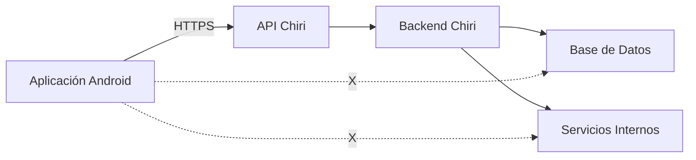

---

## 3.1 Regla de No Acceso Directo

Ningún cliente externo deberá acceder directamente a:

* Base de Datos.
* Servicios internos.
* Contenedores Docker.
* APIs administrativas.
* Puertos internos.
* Interfaces de administración.
* Dispositivos de infraestructura.

El acceso deberá realizarse mediante las interfaces autorizadas de Chiri.

---

## 3.2 Separación de Redes

La infraestructura interna deberá mantenerse separada de los
clientes externos.

La exposición de un servicio interno no deberá considerarse un
mecanismo válido de integración con Android.

---

## 3.3 Principio de Mínima Exposición

Todo servicio deberá exponer únicamente los puertos, interfaces y
funcionalidades estrictamente necesarios.

Los servicios que no requieran acceso externo no deberán exponerse
directamente a Internet.

---

# 4. Modelo General de Seguridad

La arquitectura de seguridad se integra sobre las capas principales:

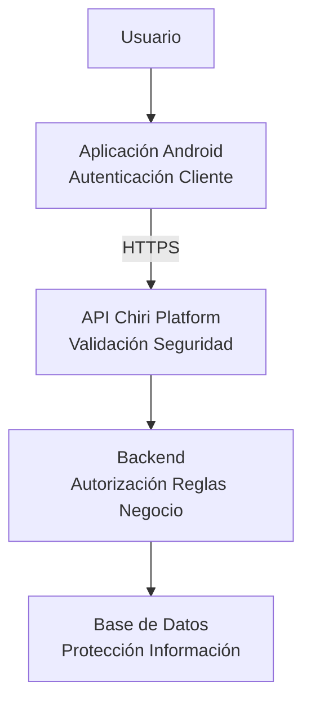

---

## 4.1 Zonas de Confianza y Fronteras de Seguridad

Chiri Platform deberá separar sus componentes en diferentes zonas de
confianza.

Cada zona deberá aplicar controles de acceso apropiados y no deberá
considerar confiable automáticamente a los componentes pertenecientes
a otra zona.

Las principales zonas serán:

* Cliente.
* API.
* Backend.
* Datos.
* Servicios internos.
* Administración e infraestructura.

Arquitectura:

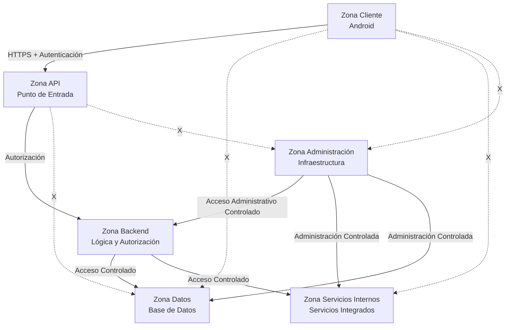

## 4.1.1 Zona Cliente

La zona cliente comprende las aplicaciones que interactúan con Chiri.

Ejemplo:

Aplicación Android.

Los clientes deberán considerarse no confiables.

La identidad y los permisos deberán validarse en el Backend.

## 4.1.2 Zona API

La API constituye la frontera de entrada a Chiri Platform.

Será responsable de:

* recibir solicitudes.
* validar autenticación.
* validar autorización.
* validar datos.
* aplicar controles de seguridad.
* limitar el acceso a funcionalidades autorizadas.

La API no deberá permitir acceso directo a componentes internos que
no formen parte de sus interfaces públicas autorizadas.

## 4.1.3 Zona Backend

El Backend contiene la lógica principal de Chiri Platform.

Será responsable de:

* ejecutar reglas de negocio.
* aplicar autorización.
* controlar acceso a datos.
* comunicarse con servicios internos.
* proteger información sensible.

El Backend no deberá asumir que una solicitud proveniente de la API es
válida sin realizar las validaciones correspondientes.

## 4.1.4 Zona Datos

La zona de datos contiene la información persistente de Chiri.

Incluye:

* Base de Datos.
* información de usuarios.
* configuraciones.
* datos de módulos.

El acceso deberá limitarse a componentes autorizados.

Los clientes externos no deberán acceder directamente a esta zona.

## 4.1.5 Zona Servicios Internos

Esta zona contiene servicios utilizados por Chiri para proporcionar
capacidades específicas.

Ejemplos:

* Home Assistant.
* Music Assistant.
* Navidrome.
* Jellyfin.
* Otros servicios integrados.

Estos servicios no deberán exponerse directamente a los clientes
externos.

El Backend será responsable de gestionar las integraciones necesarias.

## 4.1.6 Zona de Administración e Infraestructura

Esta zona comprende los componentes utilizados para administrar la
plataforma.

Ejemplos:

* Docker.
* Sistema operativo.
* herramientas de administración.
* interfaces administrativas.
* configuración de infraestructura.

El acceso administrativo deberá estar restringido y separado del
acceso normal de los usuarios.

## 4.1.7 Fronteras de Seguridad

Cada comunicación entre zonas deberá atravesar una frontera de
seguridad definida.

Las fronteras deberán aplicar, según corresponda:

* autenticación.
* autorización.
* validación.
* cifrado.
* control de acceso.
* registro de eventos.

La comunicación directa entre zonas no autorizadas deberá estar
prohibida.

---

## 4.2 Principio de Mínimo Privilegio

Chiri Platform deberá aplicar el principio de **mínimo privilegio** a todos los componentes, usuarios, servicios y procesos que participen en la plataforma.

Cada componente deberá disponer únicamente de los permisos necesarios para cumplir su función, evitando privilegios adicionales que puedan aumentar el impacto de un compromiso de seguridad.

El principio deberá aplicarse tanto a usuarios como a componentes técnicos.

### 4.2.1 Acceso de Usuarios

Los usuarios deberán disponer únicamente de las funcionalidades y recursos que correspondan a sus permisos.

La autenticación de un usuario no deberá implicar automáticamente acceso a todas las funcionalidades de Chiri Platform.

El Backend deberá determinar si el usuario autenticado está autorizado para ejecutar cada operación solicitada.

```mermaid
flowchart LR

    User["Usuario Autenticado"]

    API["API"]

    Auth["Autorización"]

    Resource["Recurso / Funcionalidad"]

    User -->|Solicitud| API
    API --> Auth
    Auth -->|Permitido| Resource
    Auth -.X.->|Denegado| Resource
```

### 4.2.2 Acceso entre Componentes

Los componentes internos deberán utilizar credenciales, permisos y canales de comunicación específicos para cada función.

Un componente no deberá utilizar privilegios administrativos cuando únicamente necesite realizar una operación limitada.

Por ejemplo:

* Un servicio que solamente necesite consultar información no deberá disponer de permisos de escritura.
* Un componente que solamente necesite acceder a una funcionalidad específica no deberá disponer de acceso completo al servicio.
* Un proceso que no necesite acceso al sistema de archivos no deberá disponer de permisos sobre archivos fuera de su ámbito.
* Un servicio que no necesite acceso a la Base de Datos no deberá disponer de credenciales para acceder directamente a ella.

### 4.2.3 Acceso a la Base de Datos

El acceso a la Base de Datos deberá estar restringido al Backend y a los componentes expresamente autorizados por la arquitectura.

Las credenciales utilizadas por cada componente deberán disponer únicamente de los permisos necesarios.

Cuando sea posible, deberán utilizarse permisos diferenciados para operaciones de:

* lectura.
* escritura.
* administración.

Los clientes Android y otros clientes externos no deberán disponer de credenciales directas de acceso a la Base de Datos.

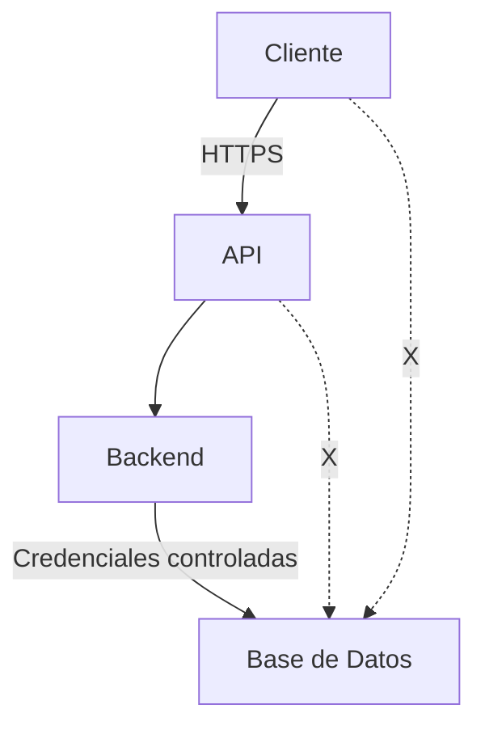

### 4.2.4 Servicios Internos

Los servicios internos deberán ejecutarse con el nivel mínimo de privilegios necesario para proporcionar sus funcionalidades.

El acceso entre servicios deberá estar limitado según las necesidades reales de integración.

Por ejemplo:

* Home Assistant no deberá obtener acceso general a la Base de Datos de Chiri.
* Music Assistant no deberá disponer de permisos administrativos sobre el sistema operativo.
* Un servicio multimedia no deberá acceder a información de usuarios que no necesite para su funcionamiento.
* Un servicio integrado no deberá utilizar credenciales pertenecientes a otro servicio.

Las integraciones deberán utilizar interfaces y credenciales específicas cuando estas estén disponibles.

### 4.2.5 Administración e Infraestructura

Las operaciones administrativas deberán utilizar privilegios elevados únicamente cuando sean necesarios.

El acceso a:

* sistema operativo.
* Docker.
* configuración de infraestructura.
* almacenamiento.
* redes.
* servicios administrativos.

deberá estar restringido a usuarios o procesos autorizados.

Las credenciales administrativas no deberán utilizarse para operaciones normales de la plataforma.

### 4.2.6 Separación de Credenciales

Las credenciales deberán mantenerse separadas según el componente, servicio o función a la que correspondan.

No deberá utilizarse una única credencial privilegiada para múltiples componentes cuando pueda evitarse.

La exposición o compromiso de una credencial deberá limitarse, en la medida de lo posible, al componente o recurso asociado.

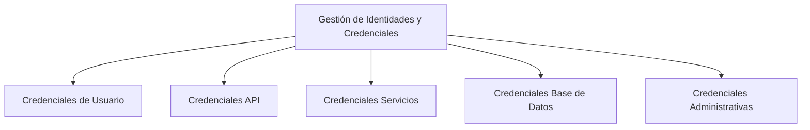

### 4.2.7 Principio de Denegación por Defecto

Los accesos deberán considerarse **denegados por defecto**.

Un usuario, servicio o componente solamente deberá obtener acceso cuando exista una autorización explícita que permita la operación solicitada.

La ausencia de una regla de autorización no deberá interpretarse como permiso.

Este principio deberá aplicarse a:

* funcionalidades.
* recursos.
* APIs.
* servicios internos.
* Base de Datos.
* operaciones administrativas.

### 4.2.8 Reducción del Impacto de un Compromiso

La aplicación del mínimo privilegio deberá reducir el impacto potencial de un componente comprometido.

Si un componente fuera comprometido, sus permisos deberán limitar el acceso que el atacante pueda obtener sobre otros componentes o información de la plataforma.

Por tanto, la arquitectura deberá evitar dependencias innecesarias basadas en privilegios compartidos o acceso administrativo generalizado.

### 4.2.9 Regla Arquitectónica

Chiri Platform deberá cumplir la siguiente regla:

> **Todo componente deberá disponer únicamente de los privilegios estrictamente necesarios para cumplir su función, y todo acceso no autorizado deberá ser denegado por defecto.**

El principio de mínimo privilegio será obligatorio para:

* usuarios.
* API.
* Backend.
* Base de Datos.
* servicios internos.
* procesos.
* contenedores.
* administración e infraestructura.

Este principio deberá mantenerse durante la evolución de Chiri Platform y deberá considerarse en cualquier nueva integración o componente que sea incorporado a la plataforma.

---

## 4.3 Autenticación

Chiri Platform deberá implementar mecanismos de autenticación que permitan verificar de forma segura la identidad de los usuarios y clientes que soliciten acceso a la plataforma.

La autenticación deberá realizarse antes de permitir el acceso a funcionalidades que requieran identidad.

La autenticación deberá ser independiente de la autorización.

La autenticación determina **quién es el usuario o cliente**.

La autorización determina **qué puede hacer** ese usuario o cliente.

El Backend deberá mantener la autoridad final sobre la identidad autenticada y no deberá confiar únicamente en información proporcionada por el cliente.

### 4.3.1 Identificación

Todo usuario que requiera acceso autenticado deberá disponer de una identidad reconocible dentro de Chiri Platform.

La identidad deberá estar asociada a un identificador único dentro de la plataforma.

La identificación por sí sola no deberá otorgar acceso a recursos protegidos.

El sistema deberá diferenciar claramente entre:

* Identidad.
* Autenticación.
* Autorización.

```mermaid
flowchart LR

    Client["Cliente Android"]

    Identity["Identificación"]

    Authentication["Autenticación"]

    Authorization["Autorización"]

    Resource["Recurso Protegido"]

    Client --> Identity
    Identity --> Authentication
    Authentication --> Authorization
    Authorization -->|Permitido| Resource
    Authorization -.X.->|Denegado| Resource
```

### 4.3.2 Credenciales

Las credenciales utilizadas para autenticar usuarios deberán mantenerse protegidas.

Las credenciales no deberán almacenarse en texto plano cuando puedan utilizarse mecanismos seguros de almacenamiento.

El Backend deberá evitar registrar credenciales, contraseñas, tokens u otros secretos en logs de aplicación.

Las credenciales deberán transmitirse únicamente mediante canales protegidos.

Las credenciales administrativas y las credenciales utilizadas por servicios internos deberán mantenerse separadas de las credenciales de usuarios.

### 4.3.3 Autenticación mediante la API

Las solicitudes hacia recursos protegidos de la API deberán incluir un mecanismo de autenticación válido.

La API deberá verificar:

* presencia de las credenciales o token requeridos.
* validez de las credenciales o token.
* vigencia.
* integridad.
* identidad asociada.
* condiciones de seguridad aplicables.

Una solicitud que no pueda ser autenticada correctamente deberá ser rechazada.

La API no deberá aceptar como válida una identidad proporcionada únicamente mediante parámetros enviados por el cliente.

Por ejemplo, el cliente no deberá poder determinar su identidad mediante valores arbitrarios como:

```text
userId=123
```

sin que dicho valor esté respaldado por una identidad autenticada.

### 4.3.4 Autenticación y HTTPS

La autenticación de clientes externos deberá realizarse sobre comunicaciones protegidas mediante HTTPS.

El cliente Android no deberá enviar credenciales mediante conexiones HTTP sin cifrado.

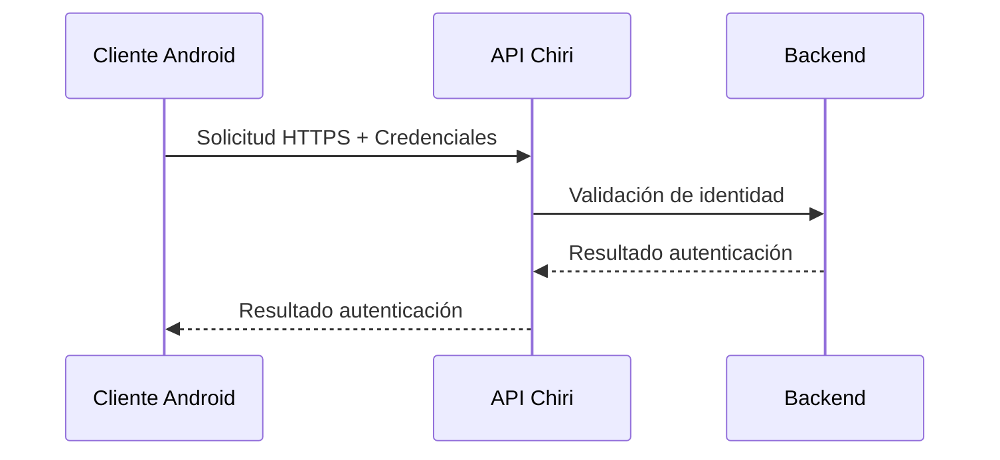

Las comunicaciones sin protección criptográfica no deberán utilizarse para transportar credenciales o información de autenticación.

### 4.3.5 Tokens de Autenticación

Cuando Chiri Platform utilice tokens para mantener la autenticación de un cliente, estos deberán:

* estar asociados a una identidad.
* disponer de una vigencia definida.
* poder invalidarse cuando corresponda.
* transmitirse únicamente mediante canales protegidos.
* mantenerse protegidos frente a accesos no autorizados.

El Backend deberá validar el token antes de permitir operaciones protegidas.

La posesión de un token válido deberá representar únicamente la identidad y sesión autorizadas por el sistema.

El cliente no deberá poder modificar la identidad contenida en un token sin invalidar su autenticidad.

### 4.3.6 Almacenamiento de Tokens en Android

La aplicación Android deberá proteger los tokens y credenciales utilizados para acceder a Chiri Platform.

Los secretos de autenticación no deberán almacenarse en texto plano en archivos de configuración accesibles por la aplicación.

La aplicación deberá utilizar mecanismos seguros proporcionados por la plataforma Android para proteger información sensible.

Los tokens no deberán incluirse:

* en URLs.
* en parámetros visibles.
* en logs.
* en mensajes de depuración.
* en repositorios Git.
* en código fuente cuando representen secretos reales.

### 4.3.7 Expiración e Invalidación

Las credenciales o tokens de autenticación deberán disponer de mecanismos de expiración e invalidación.

La expiración deberá limitar el tiempo durante el cual una credencial comprometida pueda ser utilizada.

La invalidación deberá permitir retirar el acceso cuando corresponda.

Entre las situaciones que podrán requerir invalidación se incluyen:

* cierre de sesión.
* cambio de credenciales.
* revocación administrativa.
* sospecha de compromiso.
* eliminación de una identidad.
* finalización de una sesión.

### 4.3.8 Protección contra Intentos de Autenticación

Chiri Platform deberá implementar mecanismos destinados a reducir ataques de fuerza bruta y abuso de los mecanismos de autenticación.

Según el mecanismo utilizado, podrán aplicarse controles como:

* limitación de intentos.
* retraso progresivo.
* bloqueo temporal.
* registro de intentos fallidos.
* detección de patrones anómalos.
* límites de frecuencia.

Estos controles deberán aplicarse sin revelar información innecesaria sobre la existencia o estado de una identidad.

### 4.3.9 Mensajes de Error

Los errores de autenticación no deberán revelar información sensible.

Los mensajes no deberán permitir determinar innecesariamente si:

* un usuario existe.
* una contraseña es correcta.
* un token pertenece a una identidad concreta.
* un recurso protegido existe.

Los detalles técnicos deberán registrarse internamente cuando sea necesario, mientras que la respuesta enviada al cliente deberá contener únicamente la información necesaria.

### 4.3.10 Separación entre Autenticación y Autorización

La autenticación y la autorización deberán mantenerse como responsabilidades diferenciadas.

La autenticación deberá establecer la identidad del solicitante.

La autorización deberá determinar si dicha identidad puede ejecutar una operación determinada.

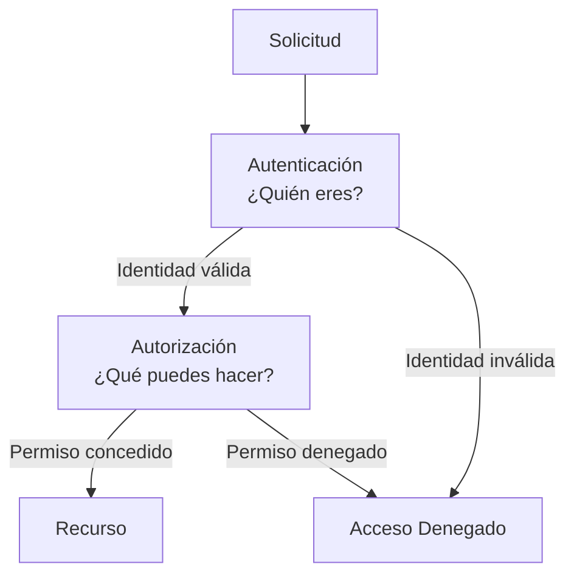

Una autenticación exitosa no deberá implicar acceso automático a todas las funcionalidades de Chiri Platform.

### 4.3.11 Responsabilidad del Backend

El Backend será la autoridad final para determinar la identidad autenticada dentro de las operaciones de Chiri Platform.

La API podrá realizar validaciones iniciales, pero el Backend deberá realizar las comprobaciones necesarias antes de ejecutar operaciones protegidas.

El Backend no deberá confiar en:

* identificadores enviados directamente por el cliente.
* información de identidad modificable por el cliente.
* permisos declarados por el cliente.
* datos de sesión que no puedan validarse.
* información proveniente de fuentes no autenticadas.

### 4.3.12 Regla Arquitectónica

Chiri Platform deberá cumplir las siguientes reglas:

> **Toda operación protegida deberá estar asociada a una identidad autenticada y verificable.**

> **La autenticación deberá preceder a la autorización.**

> **El cliente no deberá ser considerado una autoridad para determinar su propia identidad o sus permisos.**

> **Las credenciales y tokens deberán protegerse durante su transmisión, almacenamiento y utilización.**

> **La autenticación deberá implementarse mediante mecanismos que permitan expiración, invalidación y control de abuso.**

Estas reglas deberán aplicarse a la aplicación Android, API, Backend y cualquier otro cliente o componente que requiera acceso autenticado a Chiri Platform.

---

## 4.4 Autorización

Chiri Platform deberá implementar mecanismos de autorización que permitan determinar qué operaciones, funcionalidades y recursos puede utilizar una identidad autenticada.

La autorización deberá ejecutarse después de la autenticación.

Una identidad autenticada no deberá obtener automáticamente acceso a todos los recursos o funcionalidades de la plataforma.

El Backend será responsable de aplicar las reglas de autorización asociadas a las operaciones de negocio.

### 4.4.1 Principio de Denegación por Defecto

Todo acceso deberá considerarse **denegado por defecto**.

Una operación solamente podrá ejecutarse cuando exista una regla de autorización que permita explícitamente la acción solicitada.

La ausencia de una regla de autorización no deberá interpretarse como permiso.

```mermaid id="h7p8ks"
flowchart LR

    User["Identidad Autenticada"]

    Request["Solicitud"]

    Authorization["Motor de Autorización"]

    Resource["Recurso / Operación"]

    Denied["Acceso Denegado"]

    User --> Request
    Request --> Authorization

    Authorization -->|Permiso concedido| Resource
    Authorization -.X.->|Sin permiso| Denied
```

### 4.4.2 Roles y Permisos

Chiri Platform podrá utilizar roles y permisos para representar las capacidades asignadas a una identidad.

Un rol podrá agrupar un conjunto de permisos relacionados.

Un permiso deberá representar una capacidad específica sobre un recurso u operación.

La arquitectura deberá evitar asignaciones excesivamente amplias cuando una autorización más específica sea suficiente.

Ejemplo conceptual:

```text
Rol
 ├── Permiso A
 ├── Permiso B
 └── Permiso C
```

Los roles y permisos deberán ser administrados por mecanismos controlados del Backend.

El cliente Android no deberá poder modificar sus propios roles o permisos.

### 4.4.3 Autorización por Recurso

La autorización deberá considerar el recurso sobre el cual se intenta realizar una operación.

No será suficiente determinar que un usuario está autenticado.

El Backend deberá comprobar que la identidad tiene permiso para acceder al recurso solicitado.

Por ejemplo:

```text
Usuario autenticado
        │
        ▼
¿Puede acceder al recurso?
        │
   ┌────┴────┐
   ▼         ▼
  Sí         No
   │         │
   ▼         ▼
Permitir   Denegar
```

Cuando los recursos pertenezcan específicamente a un usuario, el Backend deberá verificar que la identidad autenticada tenga relación válida con dicho recurso.

### 4.4.4 Autorización por Operación

La autorización deberá considerar también la operación solicitada.

El acceso a un recurso para lectura no deberá implicar automáticamente permisos para modificarlo o eliminarlo.

Las operaciones deberán diferenciarse según corresponda:

* consultar.
* crear.
* modificar.
* eliminar.
* ejecutar.
* administrar.

Por ejemplo:

```text
Recurso
 ├── lectura
 ├── creación
 ├── modificación
 ├── eliminación
 └── administración
```

Cada operación deberá requerir el permiso correspondiente.

### 4.4.5 Autorización en el Backend

El Backend deberá aplicar las reglas de autorización antes de ejecutar operaciones protegidas.

La API podrá realizar controles iniciales, pero el Backend deberá mantener la autoridad final sobre las reglas de negocio.

El Backend no deberá confiar en permisos enviados directamente por el cliente.

Por ejemplo, valores como:

```text
role=admin
```

o:

```text
isAdmin=true
```

provenientes del cliente no deberán considerarse evidencia válida de autorización.

La autorización deberá derivarse de información confiable mantenida y validada por el sistema.

### 4.4.6 Autorización de Servicios Internos

Los servicios internos deberán disponer únicamente de las autorizaciones necesarias para las integraciones que realicen.

El hecho de que un servicio se encuentre dentro de la red interna no deberá otorgarle confianza automática.

Las comunicaciones entre Backend y servicios internos deberán estar controladas.

Cuando un servicio necesite ejecutar una operación protegida, deberá utilizar mecanismos de autenticación y autorización apropiados.

```mermaid id="q2f5ta"
flowchart LR

    Backend["Backend"]

    Auth["Autenticación + Autorización"]

    Service["Servicio Interno"]

    Resource["Recurso"]

    Backend --> Auth
    Auth -->|Permitido| Service
    Service --> Resource
    Auth -.X.->|Denegado| Service
```

### 4.4.7 Autorización Administrativa

Las operaciones administrativas deberán disponer de permisos específicos y separados de los permisos normales de usuario.

El acceso administrativo no deberá concederse únicamente por el hecho de que una identidad se encuentre autenticada.

Las operaciones administrativas podrán incluir:

* administración de usuarios.
* modificación de configuraciones críticas.
* gestión de permisos.
* administración de servicios.
* operaciones sobre infraestructura.
* mantenimiento de la plataforma.

Estas operaciones deberán estar protegidas mediante controles adicionales cuando su criticidad lo requiera.

### 4.4.8 Separación de Privilegios

Las funciones críticas deberán evitar depender de un único permiso excesivamente amplio cuando puedan dividirse en permisos más específicos.

Los permisos deberán diseñarse de forma que una identidad solamente pueda ejecutar las operaciones necesarias para su función.

La separación de privilegios deberá reducir el impacto de una cuenta comprometida o de una autorización incorrectamente asignada.

### 4.4.9 Cambios de Permisos

Los cambios en roles o permisos deberán realizarse mediante mecanismos controlados.

El cliente no deberá poder elevar sus propios privilegios.

Cuando se modifique la autorización de una identidad, los cambios deberán aplicarse de forma consistente en las siguientes solicitudes autenticadas.

Los mecanismos de sesión o tokens deberán considerar la actualización o invalidación de información de autorización cuando sea necesario.

### 4.4.10 Protección contra Escalada de Privilegios

Chiri Platform deberá prevenir la escalada de privilegios.

Una identidad no deberá poder:

* asignarse permisos adicionales.
* modificar su propio rol.
* acceder a recursos pertenecientes a otra identidad sin autorización.
* ejecutar operaciones administrativas sin el permiso correspondiente.
* modificar parámetros de autorización enviados al servidor.
* utilizar una operación autorizada para obtener acceso no autorizado a otra funcionalidad.

El Backend deberá validar estas condiciones antes de ejecutar las operaciones correspondientes.

### 4.4.11 Autorización y API

La API deberá aplicar controles de autorización sobre los endpoints protegidos.

No deberán existir endpoints que permitan acceder a funcionalidades internas sin las comprobaciones correspondientes.

Los endpoints administrativos deberán estar separados conceptualmente de las operaciones normales cuando la arquitectura lo requiera.

```mermaid id="z7x0qb"
flowchart TB

    Client["Cliente"]

    API["API"]

    Auth["Autenticación"]

    Authorization["Autorización"]

    Backend["Backend"]

    Resource["Recurso"]

    Client --> API
    API --> Auth
    Auth -->|Identidad válida| Authorization
    Auth -.X.->|Identidad inválida| Denied["Denegado"]

    Authorization -->|Permiso válido| Backend
    Authorization -.X.->|Sin permiso| Denied

    Backend --> Resource
```

### 4.4.12 Registro de Operaciones de Autorización

Las operaciones de autorización relevantes deberán poder registrarse para permitir auditoría y análisis de seguridad.

Los registros podrán incluir información como:

* identidad involucrada.
* operación solicitada.
* recurso afectado.
* resultado de la autorización.
* fecha y hora.
* origen de la solicitud.
* motivo de denegación cuando corresponda.

Los registros no deberán contener credenciales, tokens completos u otros secretos.

### 4.4.13 Regla Arquitectónica

Chiri Platform deberá cumplir las siguientes reglas:

> **Toda operación protegida deberá estar sujeta a una decisión explícita de autorización.**

> **La autenticación no deberá implicar autorización automática.**

> **El Backend será la autoridad final para las decisiones de autorización de las reglas de negocio.**

> **El cliente nunca deberá poder asignarse o elevar sus propios privilegios.**

> **El acceso a recursos deberá validarse considerando identidad, recurso y operación.**

> **Todo acceso no autorizado deberá ser denegado por defecto.**

> **Los servicios internos y administrativos deberán estar sujetos a controles de autorización y no deberán considerarse confiables únicamente por pertenecer a la infraestructura interna.**

---

## 4.5 Protección de Comunicaciones

Chiri Platform deberá proteger las comunicaciones entre sus componentes para evitar la exposición, modificación, interceptación o utilización no autorizada de la información transmitida.

Las comunicaciones deberán protegerse de acuerdo con el nivel de confianza y sensibilidad de la información involucrada.

La arquitectura deberá considerar que una red interna no constituye por sí misma una zona de confianza absoluta.

### 4.5.1 Comunicaciones Externas

Las comunicaciones entre clientes externos y Chiri Platform deberán utilizar HTTPS mediante TLS.

La aplicación Android deberá comunicarse con la API utilizando canales cifrados.

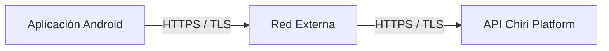

No deberán utilizarse conexiones HTTP sin cifrado para transportar:

* credenciales.
* tokens.
* información personal.
* información sensible.
* operaciones protegidas.

### 4.5.2 Comunicaciones Internas

Las comunicaciones entre API, Backend, Base de Datos y servicios internos deberán estar controladas.

El hecho de que dos componentes se encuentren dentro de la misma red no deberá implicar confianza automática.

Cuando la naturaleza de la comunicación lo requiera, deberán utilizarse mecanismos de autenticación, autorización y cifrado.

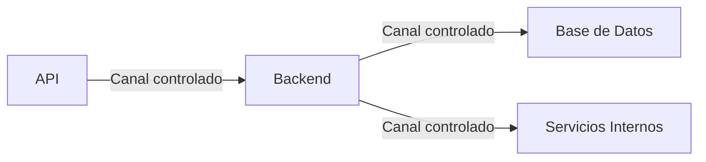

### 4.5.3 Cifrado en Tránsito

La información sensible deberá protegerse mediante cifrado durante su transmisión.

Como mínimo, deberán protegerse mediante canales cifrados:

* credenciales.
* tokens.
* información de autenticación.
* información personal.
* información sensible.
* operaciones administrativas.

El cifrado deberá utilizar protocolos y configuraciones considerados seguros para la versión tecnológica utilizada por Chiri Platform.

### 4.5.4 Validación de Certificados

Los clientes y componentes que utilicen TLS deberán validar correctamente los certificados del servidor.

La aplicación Android no deberá deshabilitar la validación de certificados en entornos de producción.

No deberán implementarse mecanismos que acepten certificados inválidos únicamente para evitar errores de conexión.

Las configuraciones destinadas exclusivamente a desarrollo deberán mantenerse separadas de las configuraciones de producción.

### 4.5.5 Comunicación entre API y Backend

La comunicación entre la API y el Backend deberá considerarse una frontera de seguridad.

La API deberá enviar únicamente solicitudes que correspondan a las interfaces autorizadas del Backend.

El Backend deberá validar nuevamente la información necesaria antes de ejecutar una operación.

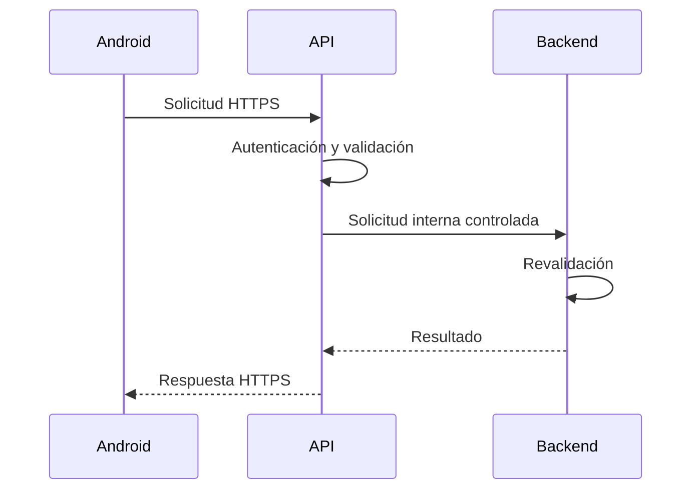

### 4.5.6 Comunicación con la Base de Datos

La Base de Datos no deberá exponerse directamente a clientes externos.

El acceso deberá realizarse mediante los componentes autorizados de la plataforma.

Cuando la configuración tecnológica y de red lo permita, las conexiones a la Base de Datos deberán utilizar mecanismos de protección adecuados para evitar la interceptación de credenciales y datos.

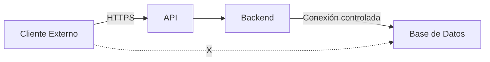

### 4.5.7 Comunicación con Servicios Internos

Los servicios internos integrados con Chiri Platform deberán comunicarse mediante interfaces definidas y controladas.

El Backend no deberá asumir que un servicio interno es confiable únicamente porque pertenece a la infraestructura de Chiri.

Cuando el servicio lo permita, deberán utilizarse mecanismos de autenticación y credenciales específicas.

El acceso deberá limitarse a las funciones necesarias para la integración.

### 4.5.8 Comunicación Administrativa

Las operaciones administrativas deberán utilizar canales protegidos.

El acceso administrativo al sistema operativo, Docker, servicios y componentes de infraestructura deberá realizarse mediante mecanismos de administración seguros.

Las interfaces administrativas no deberán exponerse públicamente sin controles de seguridad apropiados.

Las credenciales administrativas no deberán transmitirse mediante canales sin cifrado.

### 4.5.9 Segmentación de Red

La infraestructura deberá aplicar segmentación lógica de red cuando sea necesario para reducir la exposición entre componentes.

Los servicios que no necesiten comunicación directa no deberán disponer de acceso de red innecesario entre sí.

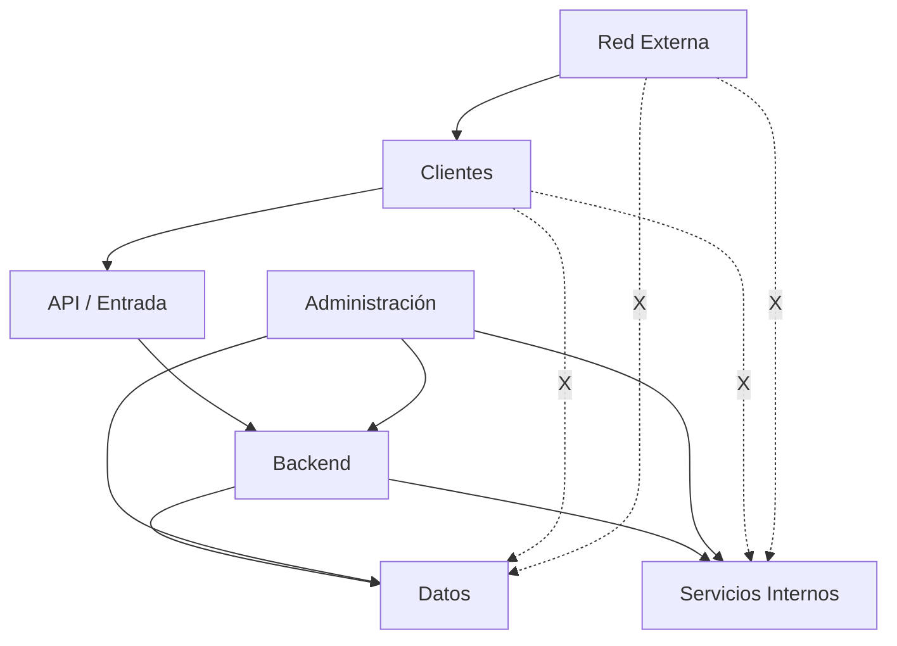

La segmentación deberá utilizarse como una capa adicional de seguridad y no deberá sustituir la autenticación o autorización.

### 4.5.10 Exposición de Servicios

Los servicios internos no deberán exponerse directamente a Internet salvo que exista una razón arquitectónica explícita y se hayan definido controles de seguridad adecuados.

Cuando sea necesario publicar un servicio, deberá utilizarse una frontera controlada.

La exposición pública deberá considerar:

* autenticación.
* autorización.
* cifrado.
* control de acceso.
* limitación de tráfico.
* registro de eventos.
* protección contra abuso.

### 4.5.11 Cloudflare y Acceso Externo

Cuando Chiri Platform utilice servicios de publicación o túneles externos, estos deberán considerarse parte de la frontera de seguridad y no deberán sustituir los mecanismos de seguridad de Chiri Platform.

La utilización de un túnel o proxy externo no deberá implicar que el Backend confíe automáticamente en cualquier solicitud que llegue desde dicho componente.

La autenticación y autorización de Chiri deberán continuar aplicándose en las capas correspondientes.

### 4.5.12 Protección contra Interceptación y Manipulación

La arquitectura deberá reducir el riesgo de:

* interceptación.
* modificación de mensajes.
* reproducción de solicitudes.
* suplantación de componentes.
* acceso no autorizado a canales internos.

Los mecanismos concretos deberán seleccionarse de acuerdo con el protocolo utilizado y la criticidad de la comunicación.

Cuando sea necesario, deberán incorporarse mecanismos adicionales de integridad, autenticación de servicio o protección contra repetición.

### 4.5.13 Registros de Comunicaciones

Los eventos de comunicación relevantes para la seguridad deberán poder registrarse.

Los registros podrán incluir:

* componente origen.
* componente destino.
* operación.
* fecha y hora.
* resultado.
* errores de comunicación.
* eventos de autenticación relacionados.

Los registros no deberán almacenar:

* contraseñas.
* tokens completos.
* claves privadas.
* secretos.
* información sensible innecesaria.

### 4.5.14 Regla Arquitectónica

Chiri Platform deberá cumplir las siguientes reglas:

> **Toda comunicación que transporte información sensible deberá utilizar mecanismos de protección adecuados.**

> **HTTPS/TLS será obligatorio para las comunicaciones externas protegidas.**

> **La red interna no deberá considerarse confiable por defecto.**

> **Las comunicaciones entre componentes deberán estar limitadas a las necesidades reales de cada integración.**

> **Los servicios internos no deberán exponerse directamente a Internet salvo autorización arquitectónica explícita.**

> **Los mecanismos externos de publicación, proxy o túnel no sustituirán la autenticación y autorización propias de Chiri Platform.**

> **La segmentación de red será una capa adicional de seguridad y no sustituirá los controles de identidad y acceso.**

---

## 4.6 Protección de Datos

Chiri Platform deberá proteger la información almacenada, procesada y transmitida por la plataforma de acuerdo con su nivel de sensibilidad y criticidad.

La protección de datos deberá contemplar todo el ciclo de vida de la información:

* creación.
* recepción.
* procesamiento.
* almacenamiento.
* transmisión.
* modificación.
* eliminación.

La información deberá protegerse aplicando controles técnicos y arquitectónicos adecuados.

### 4.6.1 Clasificación de la Información

La información de Chiri Platform deberá clasificarse según su nivel de sensibilidad.

Como mínimo, deberán considerarse las siguientes categorías:

* **Pública:** información que puede ser expuesta sin impacto significativo.
* **Interna:** información destinada al funcionamiento interno de la plataforma.
* **Confidencial:** información cuyo acceso debe limitarse a usuarios o componentes autorizados.
* **Crítica:** información cuya exposición, modificación o pérdida podría afectar significativamente la seguridad o funcionamiento de Chiri Platform.

La clasificación deberá determinar los controles de protección aplicables.

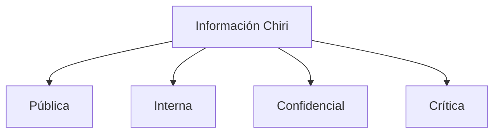

### 4.6.2 Protección de Información Sensible

La información sensible deberá estar protegida contra:

* acceso no autorizado.
* modificación no autorizada.
* eliminación no autorizada.
* divulgación.
* pérdida.
* corrupción.

El acceso deberá limitarse mediante autenticación, autorización y controles de acceso apropiados.

### 4.6.3 Protección de Datos en Reposo

La información almacenada deberá protegerse de acuerdo con su sensibilidad.

Cuando corresponda, deberán utilizarse mecanismos de cifrado para proteger información sensible almacenada en:

* Base de Datos.
* archivos.
* copias de seguridad.
* dispositivos de almacenamiento.
* configuraciones.
* otros medios persistentes.

Las credenciales y secretos no deberán almacenarse en texto plano cuando exista un mecanismo seguro apropiado para protegerlos.

### 4.6.4 Protección de Contraseñas

Las contraseñas de usuarios no deberán almacenarse en texto plano.

Cuando Chiri Platform almacene contraseñas, deberán utilizarse mecanismos de derivación y almacenamiento diseñados específicamente para proteger contraseñas.

Las contraseñas no deberán ser recuperables en su forma original.

La autenticación deberá realizarse mediante una comparación segura utilizando el mecanismo de almacenamiento correspondiente.

### 4.6.5 Protección de Secretos

Los secretos utilizados por Chiri Platform deberán mantenerse separados del código fuente y de los archivos públicos del proyecto.

Podrán considerarse secretos:

* contraseñas.
* claves API.
* tokens.
* claves privadas.
* credenciales de servicios.
* credenciales de Base de Datos.
* secretos utilizados por integraciones.

Los secretos reales no deberán almacenarse en el repositorio Git.

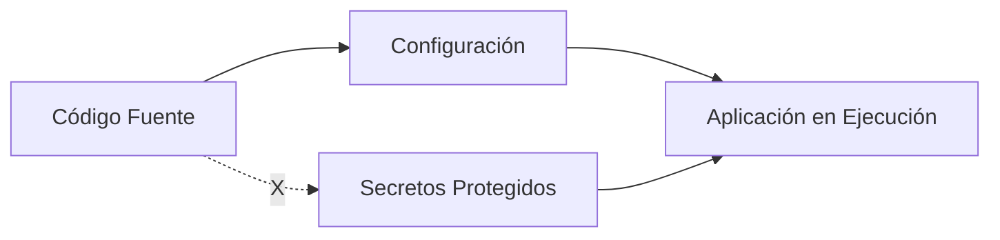

### 4.6.6 Gestión de Secretos

Los secretos deberán gestionarse mediante mecanismos apropiados para cada entorno.

Deberán diferenciarse como mínimo:

* desarrollo.
* pruebas.
* producción.

Los secretos de un entorno no deberán reutilizarse innecesariamente en otro entorno.

Cuando sea posible, deberán utilizarse mecanismos de gestión de secretos o variables de entorno protegidas.

Los archivos que contengan secretos deberán disponer de permisos de acceso restrictivos.

### 4.6.7 Datos en la Base de Datos

La Base de Datos deberá aplicar controles para proteger la información almacenada.

El acceso deberá limitarse a los componentes autorizados.

Las operaciones sobre información sensible deberán ejecutarse mediante mecanismos controlados por el Backend.

El cliente Android no deberá acceder directamente a las tablas de la Base de Datos.

La estructura interna de la Base de Datos no deberá exponerse a clientes externos.

### 4.6.8 Integridad de la Información

Chiri Platform deberá proteger la integridad de los datos.

Las operaciones de modificación deberán estar sujetas a:

* autenticación.
* autorización.
* validación.
* reglas de negocio.
* controles de integridad.

Las modificaciones no autorizadas deberán ser rechazadas.

Cuando una operación afecte múltiples datos relacionados, deberán utilizarse mecanismos transaccionales apropiados para evitar estados inconsistentes.

### 4.6.9 Validación de Datos

Los datos recibidos desde clientes o servicios externos deberán considerarse no confiables hasta ser validados.

El Backend deberá validar:

* formato.
* tipo.
* longitud.
* rango.
* estructura.
* relaciones entre datos.
* restricciones de negocio.

La validación deberá realizarse en el servidor aunque el cliente Android realice validaciones previamente.

La validación del cliente deberá considerarse una ayuda para la experiencia de usuario y no un mecanismo de seguridad suficiente.

### 4.6.10 Minimización de Datos

Chiri Platform deberá almacenar y procesar únicamente la información necesaria para proporcionar las funcionalidades definidas.

No deberán recopilarse o conservarse datos innecesarios cuando no exista una razón funcional, técnica o de seguridad para hacerlo.

La minimización deberá aplicarse especialmente a información sensible.

### 4.6.11 Retención de Información

Los datos deberán conservarse durante el tiempo necesario para cumplir su finalidad.

La plataforma deberá definir políticas de retención para información que pueda generar riesgos innecesarios si permanece almacenada indefinidamente.

Cuando los datos dejen de ser necesarios, deberán eliminarse o anonimizarse cuando corresponda.

### 4.6.12 Eliminación Segura

La eliminación de información deberá realizarse mediante mecanismos controlados.

Las operaciones de eliminación deberán estar sujetas a autorización y validaciones apropiadas.

Las operaciones críticas de eliminación deberán considerar mecanismos adicionales de protección cuando exista riesgo significativo de pérdida accidental.

La eliminación de datos deberá considerar también:

* copias temporales.
* archivos generados.
* registros.
* copias de seguridad.
* réplicas.

La eliminación definitiva deberá realizarse de acuerdo con las capacidades y características del medio de almacenamiento utilizado.

### 4.6.13 Copias de Seguridad

Las copias de seguridad deberán protegerse con controles equivalentes a la importancia de la información que contienen.

Las copias de seguridad deberán considerar:

* acceso restringido.
* protección frente a modificación no autorizada.
* protección frente a eliminación accidental.
* cifrado cuando corresponda.
* verificación de integridad.
* pruebas periódicas de restauración.

Una copia de seguridad no deberá considerarse segura únicamente por encontrarse en un almacenamiento diferente al sistema principal.

### 4.6.14 Protección de Información en Logs

Los registros de la plataforma deberán evitar la exposición innecesaria de información sensible.

No deberán registrarse directamente:

* contraseñas.
* tokens completos.
* claves privadas.
* secretos.
* credenciales.
* información sensible que no sea necesaria para diagnóstico o auditoría.

Cuando sea necesario registrar identificadores sensibles, deberán utilizarse mecanismos de ocultación o anonimización apropiados.

### 4.6.15 Datos en Memoria

La aplicación deberá evitar mantener información sensible en memoria durante períodos superiores a los necesarios.

Los componentes deberán liberar o invalidar información sensible cuando ya no sea necesaria, de acuerdo con las capacidades del lenguaje, plataforma y tecnología utilizada.

Las credenciales y secretos no deberán permanecer disponibles innecesariamente en procesos o componentes que no los necesiten.

### 4.6.16 Protección durante Integraciones

Cuando Chiri Platform intercambie información con servicios internos o externos, solamente deberá compartir los datos necesarios para ejecutar la operación correspondiente.

Las integraciones deberán considerar:

* autenticación.
* autorización.
* cifrado.
* validación.
* minimización de datos.
* protección de secretos.

Un servicio integrado no deberá recibir información que no necesite para cumplir su función.

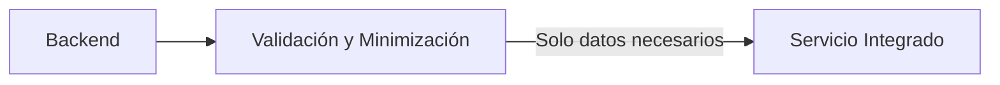

### 4.6.17 Protección frente a Exposición Accidental

La arquitectura deberá reducir el riesgo de exposición accidental de información.

Los datos sensibles no deberán aparecer innecesariamente en:

* respuestas de API.
* mensajes de error.
* URLs.
* logs.
* repositorios.
* archivos públicos.
* configuraciones visibles.
* interfaces administrativas.

La información deberá exponerse únicamente cuando sea necesaria para la funcionalidad correspondiente.

### 4.6.18 Regla Arquitectónica

Chiri Platform deberá cumplir las siguientes reglas:

> **La información deberá protegerse durante todo su ciclo de vida.**

> **Las contraseñas nunca deberán almacenarse en texto plano.**

> **Los secretos reales no deberán almacenarse en el repositorio Git.**

> **Los datos recibidos desde clientes o servicios externos deberán considerarse no confiables hasta ser validados.**

> **El cliente Android no deberá acceder directamente a la Base de Datos.**

> **La información deberá minimizarse y conservarse únicamente durante el tiempo necesario.**

> **Las copias de seguridad deberán protegerse con controles adecuados a la sensibilidad de la información que contienen.**

> **Los logs no deberán convertirse en una fuente secundaria de exposición de información sensible.**

> **Las integraciones deberán recibir únicamente la información necesaria para cumplir su función.**

---

## 4.6 Protección de Datos

Chiri Platform deberá proteger la información almacenada, procesada y transmitida por la plataforma de acuerdo con su nivel de sensibilidad y criticidad.

La protección de datos deberá contemplar todo el ciclo de vida de la información:

* creación.
* recepción.
* procesamiento.
* almacenamiento.
* transmisión.
* modificación.
* eliminación.

La información deberá protegerse aplicando controles técnicos y arquitectónicos adecuados.

### 4.6.1 Clasificación de la Información

La información de Chiri Platform deberá clasificarse según su nivel de sensibilidad.

Como mínimo, deberán considerarse las siguientes categorías:

* **Pública:** información que puede ser expuesta sin impacto significativo.
* **Interna:** información destinada al funcionamiento interno de la plataforma.
* **Confidencial:** información cuyo acceso debe limitarse a usuarios o componentes autorizados.
* **Crítica:** información cuya exposición, modificación o pérdida podría afectar significativamente la seguridad o funcionamiento de Chiri Platform.

La clasificación deberá determinar los controles de protección aplicables.

```mermaid id="g4v6qy"
flowchart TB

    Data["Información Chiri"]

    Public["Pública"]
    Internal["Interna"]
    Confidential["Confidencial"]
    Critical["Crítica"]

    Data --> Public
    Data --> Internal
    Data --> Confidential
    Data --> Critical
```

### 4.6.2 Protección de Información Sensible

La información sensible deberá estar protegida contra:

* acceso no autorizado.
* modificación no autorizada.
* eliminación no autorizada.
* divulgación.
* pérdida.
* corrupción.

El acceso deberá limitarse mediante autenticación, autorización y controles de acceso apropiados.

### 4.6.3 Protección de Datos en Reposo

La información almacenada deberá protegerse de acuerdo con su sensibilidad.

Cuando corresponda, deberán utilizarse mecanismos de cifrado para proteger información sensible almacenada en:

* Base de Datos.
* archivos.
* copias de seguridad.
* dispositivos de almacenamiento.
* configuraciones.
* otros medios persistentes.

Las credenciales y secretos no deberán almacenarse en texto plano cuando exista un mecanismo seguro apropiado para protegerlos.

### 4.6.4 Protección de Contraseñas

Las contraseñas de usuarios no deberán almacenarse en texto plano.

Cuando Chiri Platform almacene contraseñas, deberán utilizarse mecanismos de derivación y almacenamiento diseñados específicamente para proteger contraseñas.

Las contraseñas no deberán ser recuperables en su forma original.

La autenticación deberá realizarse mediante una comparación segura utilizando el mecanismo de almacenamiento correspondiente.

### 4.6.5 Protección de Secretos

Los secretos utilizados por Chiri Platform deberán mantenerse separados del código fuente y de los archivos públicos del proyecto.

Podrán considerarse secretos:

* contraseñas.
* claves API.
* tokens.
* claves privadas.
* credenciales de servicios.
* credenciales de Base de Datos.
* secretos utilizados por integraciones.

Los secretos reales no deberán almacenarse en el repositorio Git.

```mermaid id="m5d2ko"
flowchart LR

    Source["Código Fuente"]

    Config["Configuración"]

    Secrets["Secretos Protegidos"]

    Runtime["Aplicación en Ejecución"]

    Source --> Config
    Config --> Runtime
    Secrets --> Runtime

    Source -.X.-> Secrets
```

### 4.6.6 Gestión de Secretos

Los secretos deberán gestionarse mediante mecanismos apropiados para cada entorno.

Deberán diferenciarse como mínimo:

* desarrollo.
* pruebas.
* producción.

Los secretos de un entorno no deberán reutilizarse innecesariamente en otro entorno.

Cuando sea posible, deberán utilizarse mecanismos de gestión de secretos o variables de entorno protegidas.

Los archivos que contengan secretos deberán disponer de permisos de acceso restrictivos.

### 4.6.7 Datos en la Base de Datos

La Base de Datos deberá aplicar controles para proteger la información almacenada.

El acceso deberá limitarse a los componentes autorizados.

Las operaciones sobre información sensible deberán ejecutarse mediante mecanismos controlados por el Backend.

El cliente Android no deberá acceder directamente a las tablas de la Base de Datos.

La estructura interna de la Base de Datos no deberá exponerse a clientes externos.

### 4.6.8 Integridad de la Información

Chiri Platform deberá proteger la integridad de los datos.

Las operaciones de modificación deberán estar sujetas a:

* autenticación.
* autorización.
* validación.
* reglas de negocio.
* controles de integridad.

Las modificaciones no autorizadas deberán ser rechazadas.

Cuando una operación afecte múltiples datos relacionados, deberán utilizarse mecanismos transaccionales apropiados para evitar estados inconsistentes.

### 4.6.9 Validación de Datos

Los datos recibidos desde clientes o servicios externos deberán considerarse no confiables hasta ser validados.

El Backend deberá validar:

* formato.
* tipo.
* longitud.
* rango.
* estructura.
* relaciones entre datos.
* restricciones de negocio.

La validación deberá realizarse en el servidor aunque el cliente Android realice validaciones previamente.

La validación del cliente deberá considerarse una ayuda para la experiencia de usuario y no un mecanismo de seguridad suficiente.

### 4.6.10 Minimización de Datos

Chiri Platform deberá almacenar y procesar únicamente la información necesaria para proporcionar las funcionalidades definidas.

No deberán recopilarse o conservarse datos innecesarios cuando no exista una razón funcional, técnica o de seguridad para hacerlo.

La minimización deberá aplicarse especialmente a información sensible.

### 4.6.11 Retención de Información

Los datos deberán conservarse durante el tiempo necesario para cumplir su finalidad.

La plataforma deberá definir políticas de retención para información que pueda generar riesgos innecesarios si permanece almacenada indefinidamente.

Cuando los datos dejen de ser necesarios, deberán eliminarse o anonimizarse cuando corresponda.

### 4.6.12 Eliminación Segura

La eliminación de información deberá realizarse mediante mecanismos controlados.

Las operaciones de eliminación deberán estar sujetas a autorización y validaciones apropiadas.

Las operaciones críticas de eliminación deberán considerar mecanismos adicionales de protección cuando exista riesgo significativo de pérdida accidental.

La eliminación de datos deberá considerar también:

* copias temporales.
* archivos generados.
* registros.
* copias de seguridad.
* réplicas.

La eliminación definitiva deberá realizarse de acuerdo con las capacidades y características del medio de almacenamiento utilizado.

### 4.6.13 Copias de Seguridad

Las copias de seguridad deberán protegerse con controles equivalentes a la importancia de la información que contienen.

Las copias de seguridad deberán considerar:

* acceso restringido.
* protección frente a modificación no autorizada.
* protección frente a eliminación accidental.
* cifrado cuando corresponda.
* verificación de integridad.
* pruebas periódicas de restauración.

Una copia de seguridad no deberá considerarse segura únicamente por encontrarse en un almacenamiento diferente al sistema principal.

### 4.6.14 Protección de Información en Logs

Los registros de la plataforma deberán evitar la exposición innecesaria de información sensible.

No deberán registrarse directamente:

* contraseñas.
* tokens completos.
* claves privadas.
* secretos.
* credenciales.
* información sensible que no sea necesaria para diagnóstico o auditoría.

Cuando sea necesario registrar identificadores sensibles, deberán utilizarse mecanismos de ocultación o anonimización apropiados.

### 4.6.15 Datos en Memoria

La aplicación deberá evitar mantener información sensible en memoria durante períodos superiores a los necesarios.

Los componentes deberán liberar o invalidar información sensible cuando ya no sea necesaria, de acuerdo con las capacidades del lenguaje, plataforma y tecnología utilizada.

Las credenciales y secretos no deberán permanecer disponibles innecesariamente en procesos o componentes que no los necesiten.

### 4.6.16 Protección durante Integraciones

Cuando Chiri Platform intercambie información con servicios internos o externos, solamente deberá compartir los datos necesarios para ejecutar la operación correspondiente.

Las integraciones deberán considerar:

* autenticación.
* autorización.
* cifrado.
* validación.
* minimización de datos.
* protección de secretos.

Un servicio integrado no deberá recibir información que no necesite para cumplir su función.

```mermaid id="r4s1zc"
flowchart LR

    Backend["Backend"]

    Filter["Validación y Minimización"]

    Service["Servicio Integrado"]

    Backend --> Filter
    Filter -->|Solo datos necesarios| Service
```

### 4.6.17 Protección frente a Exposición Accidental

La arquitectura deberá reducir el riesgo de exposición accidental de información.

Los datos sensibles no deberán aparecer innecesariamente en:

* respuestas de API.
* mensajes de error.
* URLs.
* logs.
* repositorios.
* archivos públicos.
* configuraciones visibles.
* interfaces administrativas.

La información deberá exponerse únicamente cuando sea necesaria para la funcionalidad correspondiente.

### 4.6.18 Regla Arquitectónica

Chiri Platform deberá cumplir las siguientes reglas:

> **La información deberá protegerse durante todo su ciclo de vida.**

> **Las contraseñas nunca deberán almacenarse en texto plano.**

> **Los secretos reales no deberán almacenarse en el repositorio Git.**

> **Los datos recibidos desde clientes o servicios externos deberán considerarse no confiables hasta ser validados.**

> **El cliente Android no deberá acceder directamente a la Base de Datos.**

> **La información deberá minimizarse y conservarse únicamente durante el tiempo necesario.**

> **Las copias de seguridad deberán protegerse con controles adecuados a la sensibilidad de la información que contienen.**

> **Los logs no deberán convertirse en una fuente secundaria de exposición de información sensible.**

> **Las integraciones deberán recibir únicamente la información necesaria para cumplir su función.**

---

## 4.7 Gestión de Sesiones y Tokens

Chiri Platform deberá gestionar de forma segura las sesiones y tokens utilizados para mantener el estado de autenticación de los clientes.

La gestión de sesiones y tokens deberá limitar el riesgo asociado al robo, reutilización, exposición o manipulación de credenciales de autenticación.

Los mecanismos concretos deberán seleccionarse de acuerdo con la arquitectura tecnológica definida para Chiri Platform y deberán mantener separadas las responsabilidades de autenticación y autorización.

### 4.7.1 Creación de Sesiones

Una sesión autenticada solamente deberá crearse después de completar correctamente el proceso de autenticación.

La sesión deberá estar asociada a una identidad autenticada y a los atributos de seguridad necesarios para determinar su validez.

La creación de una sesión no deberá conceder privilegios adicionales a los que correspondan a la identidad autenticada.

```mermaid
sequenceDiagram

    participant Android as Cliente Android
    participant API as API
    participant Backend as Backend

    Android->>API: Credenciales
    API->>Backend: Solicitud de autenticación
    Backend->>Backend: Validar identidad
    Backend-->>API: Autenticación válida
    API-->>Android: Sesión / Token
```

### 4.7.2 Identificación de la Sesión

Cada sesión o token deberá disponer de un identificador que permita asociarlo con la identidad correspondiente.

La identidad asociada deberá determinarse mediante información validada por el servidor.

El cliente no deberá poder modificar el identificador de usuario asociado a una sesión válida.

La sesión deberá considerarse inválida si no puede establecerse correctamente la identidad asociada.

### 4.7.3 Tokens de Acceso

Los tokens utilizados para acceder a recursos protegidos deberán:

* estar vinculados a una identidad.
* tener un período de validez definido.
* estar protegidos durante su transmisión.
* almacenarse de forma segura en el cliente.
* validarse en el servidor.
* poder invalidarse cuando sea necesario.

La posesión de un token válido no deberá permitir modificar sus atributos de seguridad.

### 4.7.4 Expiración

Las sesiones y tokens deberán disponer de mecanismos de expiración.

La duración deberá establecerse de acuerdo con el nivel de riesgo de las operaciones protegidas.

Las sesiones asociadas a operaciones administrativas o críticas podrán requerir tiempos de expiración más restrictivos.

Una sesión o token expirado deberá ser rechazado por el Backend.

### 4.7.5 Renovación de Sesiones

Cuando Chiri Platform implemente mecanismos de renovación de sesión, la renovación deberá estar sujeta a controles de seguridad.

La renovación deberá comprobar que:

* la sesión original es válida.
* la identidad continúa activa.
* la sesión no ha sido revocada.
* las condiciones de seguridad continúan siendo válidas.

Los mecanismos de renovación no deberán permitir prolongar indefinidamente una sesión comprometida.

### 4.7.6 Invalidación

Las sesiones y tokens deberán poder invalidarse antes de su expiración cuando sea necesario.

La invalidación podrá producirse por:

* cierre de sesión.
* cambio de credenciales.
* revocación administrativa.
* detección de compromiso.
* eliminación de la identidad.
* cambio de permisos críticos.
* otras condiciones de seguridad.

Una sesión invalidada no deberá volver a considerarse válida.

### 4.7.7 Cierre de Sesión

La aplicación Android deberá proporcionar un mecanismo para finalizar una sesión autenticada.

El cierre de sesión deberá provocar la eliminación o invalidación de los elementos necesarios para impedir el uso posterior de la sesión.

Cuando exista un mecanismo de revocación en el servidor, este deberá utilizarse cuando corresponda.

El cliente deberá eliminar los tokens almacenados localmente cuando ya no sean necesarios.

### 4.7.8 Protección de Tokens en Android

Los tokens y otros datos utilizados para mantener sesiones deberán almacenarse mediante mecanismos seguros disponibles en Android.

No deberán almacenarse directamente en:

* archivos de texto sin protección.
* preferencias sin protección adecuada.
* bases de datos locales sin protección cuando contengan secretos.
* logs.
* código fuente.
* URLs.

La implementación deberá reducir la posibilidad de extracción de tokens mediante accesos no autorizados al almacenamiento de la aplicación.

### 4.7.9 Transporte de Tokens

Los tokens deberán transmitirse únicamente mediante canales protegidos.

Para las comunicaciones externas de Chiri Platform deberá utilizarse HTTPS/TLS.

Los tokens no deberán enviarse como parámetros de URL cuando pueda utilizarse un mecanismo de autenticación apropiado en las cabeceras de la solicitud.

```mermaid
flowchart LR

    Android["Android"]

    TLS["HTTPS / TLS"]

    API["API"]

    Backend["Backend"]

    Android -->|Token protegido| TLS
    TLS --> API
    API --> Backend
```

### 4.7.10 Validación de Tokens

El Backend deberá validar los tokens antes de permitir operaciones protegidas.

La validación deberá considerar, según el mecanismo utilizado:

* autenticidad.
* integridad.
* vigencia.
* identidad.
* emisor.
* audiencia.
* alcance.
* estado de revocación.

Los atributos de seguridad no deberán aceptarse únicamente porque hayan sido enviados por el cliente.

### 4.7.11 Alcance de los Tokens

Cuando sea necesario, los tokens deberán disponer de un alcance limitado.

Un token utilizado para una funcionalidad específica no debería conceder acceso innecesario a otras funcionalidades.

El alcance deberá limitarse de acuerdo con:

* identidad.
* recurso.
* operación.
* servicio.
* duración.

Esto permitirá reducir el impacto potencial de un token comprometido.

### 4.7.12 Protección contra Reutilización

Chiri Platform deberá considerar mecanismos para reducir el riesgo de reutilización indebida de tokens.

Dependiendo del tipo de token y del nivel de riesgo, podrán utilizarse:

* expiración.
* rotación.
* revocación.
* vinculación a una sesión.
* identificación del cliente.
* controles de frecuencia.
* detección de comportamiento anómalo.

Los mecanismos concretos deberán definirse de acuerdo con la implementación tecnológica adoptada.

### 4.7.13 Protección contra Fijación de Sesión

La plataforma deberá impedir que un identificador de sesión proporcionado por un atacante pueda convertirse en la sesión autenticada de un usuario.

Después de una autenticación exitosa, el mecanismo de sesión deberá establecer un identificador o token válido asociado a la nueva sesión autenticada.

Los identificadores de sesión no deberán ser predecibles.

### 4.7.14 Sesiones de Administración

Las sesiones utilizadas para operaciones administrativas deberán disponer de controles más estrictos cuando la criticidad de las operaciones lo requiera.

Podrán incluir:

* expiración más corta.
* reautenticación.
* permisos específicos.
* registro detallado.
* revocación inmediata.
* controles adicionales para operaciones críticas.

Las sesiones administrativas deberán mantenerse separadas conceptualmente de las sesiones normales de usuario.

### 4.7.15 Cambios de Privilegios

Los cambios importantes en la autorización de una identidad deberán tenerse en cuenta en las sesiones existentes.

Si una sesión contiene información de autorización que pueda quedar desactualizada, el Backend deberá actualizarla, invalidarla o volver a validarla según corresponda.

Una sesión previamente autorizada no deberá conservar privilegios que hayan sido revocados.

### 4.7.16 Registro de Sesiones

Los eventos relevantes relacionados con sesiones deberán poder registrarse para fines de seguridad y auditoría.

Podrán registrarse:

* inicio de sesión.
* cierre de sesión.
* expiración.
* renovación.
* revocación.
* intentos fallidos.
* cambios relevantes de sesión.

Los registros no deberán contener tokens completos, contraseñas u otros secretos.

### 4.7.17 Regla Arquitectónica

Chiri Platform deberá cumplir las siguientes reglas:

> **Toda sesión deberá estar asociada a una identidad autenticada y verificable.**

> **Los tokens deberán disponer de vigencia y mecanismos de invalidación apropiados.**

> **Los tokens deberán protegerse durante su almacenamiento y transmisión.**

> **El Backend deberá validar los tokens antes de ejecutar operaciones protegidas.**

> **Los tokens deberán disponer únicamente del alcance necesario para cumplir su función.**

> **El cierre de sesión deberá impedir el uso posterior de credenciales de sesión cuando corresponda.**

> **Los cambios de privilegios deberán reflejarse correctamente en las sesiones existentes.**

> **Las sesiones administrativas deberán disponer de controles adicionales cuando el nivel de riesgo lo requiera.**

---

## 4.8 Gestión de Credenciales y Secretos

Chiri Platform deberá establecer mecanismos para proteger las credenciales, claves, tokens, contraseñas y demás secretos utilizados por usuarios, servicios y componentes de infraestructura.

Las credenciales y secretos deberán considerarse información crítica y deberán protegerse durante todo su ciclo de vida.

La gestión deberá contemplar:

* creación.
* almacenamiento.
* distribución.
* utilización.
* rotación.
* revocación.
* eliminación.

### 4.8.1 Tipos de Credenciales y Secretos

Chiri Platform podrá utilizar diferentes tipos de credenciales y secretos.

Entre ellos:

* contraseñas de usuarios.
* tokens de autenticación.
* claves API.
* credenciales de Base de Datos.
* credenciales de servicios internos.
* claves privadas.
* certificados.
* secretos de integración.
* credenciales administrativas.

Cada tipo deberá gestionarse de acuerdo con su nivel de riesgo y finalidad.

### 4.8.2 Separación de Credenciales

Las credenciales deberán mantenerse separadas según el componente, servicio, usuario y entorno al que correspondan.

No deberá utilizarse una única credencial privilegiada para múltiples componentes cuando pueda evitarse.

```mermaid id="q8v5la"
flowchart TB

    Secrets["Gestión de Secretos"]

    User["Credenciales de Usuarios"]
    API["Credenciales API"]
    DB["Credenciales Base de Datos"]
    Services["Credenciales Servicios"]
    Admin["Credenciales Administrativas"]

    Secrets --> User
    Secrets --> API
    Secrets --> DB
    Secrets --> Services
    Secrets --> Admin
```

La separación deberá limitar el impacto producido por la exposición o compromiso de una credencial.

### 4.8.3 Credenciales por Entorno

Los entornos de desarrollo, pruebas y producción deberán utilizar credenciales independientes.

No deberán reutilizarse credenciales reales de producción en entornos de desarrollo o pruebas.

Cuando sea necesario utilizar datos de prueba, deberán utilizarse credenciales y secretos específicamente creados para dicho entorno.

```mermaid id="3w7l2p"
flowchart LR

    Development["Desarrollo"]
    Testing["Pruebas"]
    Production["Producción"]

    Development -.X.-> Production
    Testing -.X.-> Production

    Development --> DevSecrets["Secretos Desarrollo"]
    Testing --> TestSecrets["Secretos Pruebas"]
    Production --> ProdSecrets["Secretos Producción"]
```

### 4.8.4 Almacenamiento Seguro

Las credenciales y secretos deberán almacenarse mediante mecanismos que limiten el acceso únicamente a los componentes autorizados.

No deberán almacenarse en texto plano cuando exista un mecanismo seguro apropiado.

Los archivos que contengan secretos deberán disponer de permisos restrictivos.

Los secretos utilizados por la infraestructura deberán permanecer fuera de los repositorios públicos y privados de código cuando sea posible.

### 4.8.5 Git y Control de Versiones

Los secretos reales no deberán almacenarse en Git.

No deberán incluirse en el repositorio:

* contraseñas.
* tokens reales.
* claves API reales.
* claves privadas.
* credenciales de Base de Datos.
* certificados privados.
* secretos de servicios.

Los archivos de configuración que requieran secretos deberán utilizar mecanismos externos o variables de entorno apropiadas.

Los archivos de ejemplo deberán utilizar valores ficticios.

### 4.8.6 Variables de Entorno

Las variables de entorno podrán utilizarse para proporcionar secretos a los servicios cuando resulte apropiado.

Las variables que contengan secretos deberán protegerse mediante permisos adecuados sobre el entorno de ejecución.

Los valores sensibles no deberán mostrarse innecesariamente en:

* logs.
* interfaces.
* diagnósticos.
* comandos registrados.
* sistemas de monitoreo.

El uso de variables de entorno no deberá considerarse por sí mismo una solución completa de gestión de secretos.

### 4.8.7 Contenedores Docker

Los contenedores utilizados por Chiri Platform deberán recibir únicamente los secretos que realmente necesiten.

Un contenedor no deberá disponer de acceso general a todos los secretos de la plataforma.

Las credenciales utilizadas por un servicio deberán estar limitadas al servicio correspondiente.

```mermaid id="f4s9mn"
flowchart TB

    SecretStore["Secretos Protegidos"]

    Backend["Contenedor Backend"]
    Database["Contenedor Base de Datos"]
    Service["Contenedor Servicio"]

    SecretStore -->|Solo secretos necesarios| Backend
    SecretStore -->|Solo credenciales necesarias| Database
    SecretStore -->|Solo secretos necesarios| Service
```

### 4.8.8 Credenciales de Base de Datos

Las credenciales de Base de Datos deberán mantenerse separadas de las credenciales de usuarios.

El Backend deberá utilizar credenciales específicas para acceder a la Base de Datos.

Cuando sea posible, deberán utilizarse cuentas con permisos limitados.

No deberá utilizarse una cuenta administrativa de Base de Datos para las operaciones normales de la aplicación cuando una cuenta con privilegios inferiores sea suficiente.

### 4.8.9 Credenciales de Servicios Internos

Cada integración con un servicio interno deberá utilizar credenciales específicas cuando el servicio lo permita.

Por ejemplo, las credenciales utilizadas para integrar un servicio multimedia no deberán reutilizarse automáticamente para administrar otros servicios.

La exposición de una credencial deberá limitarse al servicio asociado.

### 4.8.10 Credenciales Administrativas

Las credenciales administrativas deberán mantenerse separadas de las credenciales utilizadas para operaciones normales.

El acceso administrativo deberá requerir privilegios específicos.

Las credenciales administrativas no deberán utilizarse dentro de aplicaciones o servicios que no necesiten privilegios administrativos.

### 4.8.11 Rotación

Las credenciales y secretos deberán poder ser reemplazados cuando sea necesario.

La rotación deberá realizarse especialmente cuando:

* exista sospecha de compromiso.
* una credencial haya sido expuesta.
* un usuario o servicio deje de estar autorizado.
* se produzca un cambio de infraestructura.
* una política de seguridad lo requiera.

La arquitectura deberá evitar dependencias que impidan cambiar una credencial sin reconstruir innecesariamente toda la plataforma.

### 4.8.12 Revocación

Las credenciales deberán poder revocarse cuando dejen de ser necesarias o cuando exista riesgo de compromiso.

La revocación deberá impedir que la credencial continúe proporcionando acceso.

Las credenciales pertenecientes a servicios eliminados o usuarios deshabilitados deberán retirarse.

### 4.8.13 Exposición Accidental

Si un secreto fuera expuesto accidentalmente, no deberá considerarse suficiente eliminarlo únicamente del archivo donde fue encontrado.

Deberán evaluarse las acciones necesarias para invalidarlo y reemplazarlo.

Como mínimo, deberá considerarse:

1. identificar el secreto expuesto.
2. determinar dónde pudo haberse expuesto.
3. revocarlo cuando corresponda.
4. generar un nuevo secreto.
5. actualizar los componentes dependientes.
6. revisar los registros y repositorios afectados.

### 4.8.14 Logs y Diagnóstico

Los mecanismos de diagnóstico no deberán revelar secretos.

No deberán registrarse directamente:

* contraseñas.
* tokens completos.
* claves API.
* claves privadas.
* credenciales.
* valores sensibles de configuración.

Cuando sea necesario identificar una credencial durante una investigación, deberán utilizarse identificadores parciales o mecanismos de ocultación.

### 4.8.15 Acceso a Secretos

El acceso a secretos deberá estar limitado por el principio de mínimo privilegio.

Un componente solamente deberá poder obtener los secretos necesarios para ejecutar sus funciones.

Los usuarios administrativos deberán acceder a secretos únicamente cuando sea necesario para una operación autorizada.

### 4.8.16 Ciclo de Vida de los Secretos

El ciclo de vida de cada secreto deberá contemplar:

```mermaid id="l0y8ek"
flowchart LR

    Create["Creación"]
    Store["Almacenamiento"]
    Use["Utilización"]
    Rotate["Rotación"]
    Revoke["Revocación"]
    Delete["Eliminación"]

    Create --> Store
    Store --> Use
    Use --> Rotate
    Rotate --> Use
    Use --> Revoke
    Revoke --> Delete
```

Los secretos que ya no sean necesarios deberán eliminarse de los lugares donde puedan continuar siendo utilizados.

### 4.8.17 Regla Arquitectónica

Chiri Platform deberá cumplir las siguientes reglas:

> **Los secretos deberán mantenerse fuera del código fuente y del control de versiones.**

> **Cada componente deberá recibir únicamente los secretos necesarios para cumplir su función.**

> **Los entornos de desarrollo, pruebas y producción deberán utilizar credenciales independientes.**

> **Las credenciales administrativas deberán mantenerse separadas de las credenciales normales.**

> **Las credenciales de Base de Datos y servicios internos deberán utilizarse con el mínimo privilegio necesario.**

> **Los secretos deberán poder rotarse y revocarse cuando sea necesario.**

> **Una credencial expuesta deberá considerarse potencialmente comprometida y deberá evaluarse su revocación y reemplazo.**

> **Los logs y mecanismos de diagnóstico no deberán revelar secretos.**

---

## 4.9 Validación y Protección de Entradas

Chiri Platform deberá validar toda información recibida desde clientes, servicios internos, integraciones externas y otros componentes antes de utilizarla en operaciones de negocio o seguridad.

Toda entrada externa deberá considerarse **no confiable por defecto**.

La validación deberá realizarse principalmente en el Backend, independientemente de las validaciones que puedan ejecutarse en el cliente Android.

### 4.9.1 Principio de Validación en el Servidor

Las validaciones realizadas en el cliente Android deberán considerarse controles de experiencia de usuario y no controles de seguridad suficientes.

El Backend deberá repetir las validaciones necesarias antes de procesar una solicitud.

```mermaid id="b4k7qx"
flowchart LR

    Client["Cliente Android"]

    ClientValidation["Validación Cliente"]

    API["API"]

    BackendValidation["Validación Backend"]

    Backend["Backend"]

    Client --> ClientValidation
    ClientValidation --> API
    API --> BackendValidation
    BackendValidation --> Backend
```

El cliente no deberá poder omitir las reglas de validación simplemente modificando la solicitud antes de enviarla.

### 4.9.2 Validación de Tipo

Los datos recibidos deberán comprobar que correspondan al tipo esperado.

Deberán validarse, según corresponda:

* texto.
* número.
* booleano.
* fecha.
* identificador.
* objeto.
* lista.
* archivo.

Los valores con tipos inesperados deberán rechazarse.

### 4.9.3 Validación de Formato

Los datos deberán cumplir el formato definido por la API.

Podrán validarse:

* estructura JSON.
* formatos de fecha.
* identificadores.
* direcciones de correo electrónico.
* nombres.
* códigos.
* parámetros de consulta.
* otros formatos definidos por cada operación.

La validación deberá realizarse antes de utilizar el valor en procesos posteriores.

### 4.9.4 Validación de Longitud

Los campos de entrada deberán disponer de límites de longitud adecuados.

Deberán establecerse límites máximos y, cuando corresponda, mínimos.

Esto deberá aplicarse especialmente a:

* nombres.
* descripciones.
* textos.
* identificadores.
* parámetros de búsqueda.
* archivos.
* campos enviados a servicios internos.

Los límites deberán evitar consumo innecesario de recursos.

### 4.9.5 Validación de Rangos

Los valores numéricos deberán validarse dentro de los rangos permitidos.

Por ejemplo:

```text id="x2q1rf"
cantidad >= 0
cantidad <= límite permitido
```

Los valores fuera de los límites establecidos deberán rechazarse.

### 4.9.6 Validación de Identificadores

Los identificadores recibidos desde el cliente deberán validarse antes de utilizarse.

El Backend deberá verificar:

* formato.
* existencia cuando corresponda.
* pertenencia al recurso.
* autorización de acceso.

Un identificador válido no deberá implicar automáticamente que el usuario tenga permiso para acceder al recurso identificado.

### 4.9.7 Validación de Reglas de Negocio

La validación deberá incluir las reglas necesarias para garantizar que una operación sea válida dentro del contexto de Chiri Platform.

Por ejemplo:

* estados permitidos.
* relaciones entre entidades.
* restricciones de usuario.
* límites operativos.
* dependencias entre recursos.
* condiciones necesarias para ejecutar una operación.

La validación técnica de formato no deberá sustituir la validación de las reglas de negocio.

### 4.9.8 Control de Acceso a Recursos

La existencia de un identificador válido no deberá permitir acceso automático al recurso.

El Backend deberá verificar que la identidad autenticada esté autorizada para acceder al recurso.

```mermaid id="y6g0vz"
flowchart TB

    Request["Solicitud con Identificador"]

    Validate["Validar Identificador"]

    Authenticate["Identidad Autenticada"]

    Authorize["Verificar Autorización"]

    Resource["Recurso"]

    Denied["Denegado"]

    Request --> Validate
    Validate --> Authenticate
    Authenticate --> Authorize

    Authorize -->|Permitido| Resource
    Authorize -.X.->|No permitido| Denied
```

Esto deberá prevenir accesos indebidos mediante manipulación de identificadores.

### 4.9.9 Protección contra Inyección

Las entradas externas no deberán incorporarse directamente en consultas, comandos o expresiones ejecutadas por otros componentes.

Deberán utilizarse mecanismos seguros proporcionados por la tecnología correspondiente.

Cuando se utilice una Base de Datos, deberán emplearse consultas parametrizadas u otros mecanismos equivalentes.

Las entradas no deberán interpretarse como código ejecutable sin una validación y mecanismo de seguridad apropiados.

### 4.9.10 Consultas a Base de Datos

El Backend deberá evitar la construcción insegura de consultas mediante concatenación directa de entradas externas.

Los valores proporcionados por el cliente deberán tratarse como datos y no como parte de la estructura de la consulta.

```mermaid id="j3h8py"
flowchart LR

    Input["Entrada Externa"]

    Validation["Validación"]

    Parameter["Parámetros"]

    Database["Base de Datos"]

    Input --> Validation
    Validation --> Parameter
    Parameter --> Database
```

### 4.9.11 Comandos del Sistema Operativo

Los datos recibidos desde clientes o servicios no deberán incorporarse directamente a comandos del sistema operativo.

Cuando una funcionalidad requiera ejecutar una operación del sistema, deberá utilizarse una interfaz controlada y una lista de valores permitidos cuando sea posible.

Las operaciones administrativas no deberán depender de parámetros arbitrarios proporcionados por un cliente.

### 4.9.12 Archivos y Subidas

Si Chiri Platform incorpora funcionalidades de carga de archivos, los archivos recibidos deberán validarse antes de ser procesados o almacenados.

Deberán considerarse, según corresponda:

* tamaño.
* tipo.
* extensión.
* contenido.
* nombre.
* ubicación de almacenamiento.
* permisos.
* origen.

Los archivos no deberán almacenarse directamente en ubicaciones críticas sin controles adecuados.

### 4.9.13 URLs y Recursos Externos

Las URLs proporcionadas por usuarios o clientes deberán validarse antes de utilizarse para realizar conexiones externas.

Cuando una funcionalidad permita acceder a recursos externos, deberán establecerse restricciones para evitar que una entrada arbitraria permita acceder a recursos internos no autorizados.

La validación deberá considerar los riesgos asociados a servicios internos, redes privadas y recursos administrativos.

### 4.9.14 JSON y Payloads de API

Los payloads recibidos por la API deberán cumplir el esquema esperado por cada endpoint.

Los campos inesperados deberán ignorarse o rechazarse según la política definida para la API.

Los campos utilizados para autorización o seguridad no deberán aceptarse desde el cliente cuando deban ser determinados por el servidor.

Por ejemplo, un payload como:

```json id="w8c4nm"
{
  "userId": 123,
  "role": "admin",
  "isAdmin": true
}
```

no deberá permitir que el cliente determine sus propios privilegios.

### 4.9.15 Codificación y Normalización

Los datos recibidos deberán normalizarse cuando sea necesario antes de aplicar validaciones o comparaciones.

La normalización deberá evitar que diferentes representaciones de un mismo dato permitan evadir controles de seguridad.

La aplicación deberá utilizar mecanismos de codificación y decodificación compatibles con las tecnologías utilizadas por Chiri Platform.

### 4.9.16 Manejo de Errores

Los errores producidos durante la validación no deberán revelar información técnica innecesaria.

La API deberá devolver respuestas controladas.

Los detalles técnicos podrán registrarse internamente cuando sean necesarios para diagnóstico, pero no deberán exponerse directamente al cliente.

### 4.9.17 Límites de Solicitudes

Las entradas deberán estar sujetas a límites razonables para evitar abuso de recursos.

Podrán establecerse límites sobre:

* tamaño de solicitudes.
* cantidad de elementos.
* longitud de parámetros.
* cantidad de solicitudes.
* tamaño de archivos.
* tiempo de procesamiento.

Los límites deberán adaptarse a la funcionalidad correspondiente.

### 4.9.18 Validación de Servicios Internos

La información recibida desde servicios internos también deberá considerarse no confiable hasta ser validada.

El Backend deberá validar las respuestas recibidas cuando puedan afectar:

* reglas de negocio.
* permisos.
* información persistente.
* operaciones críticas.

La confianza de red no deberá sustituir la validación de datos.

### 4.9.19 Regla Arquitectónica

Chiri Platform deberá cumplir las siguientes reglas:

> **Toda entrada externa deberá considerarse no confiable hasta ser validada.**

> **Las validaciones realizadas en el cliente no deberán sustituir las validaciones del Backend.**

> **Toda operación deberá validar tipo, formato, tamaño, rango y reglas de negocio cuando corresponda.**

> **Un identificador válido no deberá implicar autorización automática sobre el recurso identificado.**

> **Las entradas externas no deberán utilizarse directamente como código, consultas o comandos.**

> **Las consultas a Base de Datos deberán utilizar mecanismos seguros de parametrización.**

> **Los servicios internos también deberán validar la información recibida.**

> **Los errores de validación no deberán revelar información técnica o sensible innecesaria.**

---

## 4.10 Protección de API y Endpoints

Chiri Platform deberá proteger todos los endpoints de la API contra accesos no autorizados, abuso, manipulación de solicitudes y exposición innecesaria de información.

La API constituye una frontera de seguridad entre los clientes externos y los componentes internos de Chiri Platform.

Cada endpoint deberá disponer de controles de seguridad adecuados a la operación que expone.

### 4.10.1 Principio de Denegación por Defecto

Los endpoints deberán considerarse protegidos por defecto.

Un endpoint solamente deberá permitir acceso cuando exista una definición explícita de:

* autenticación requerida.
* autorización requerida.
* método permitido.
* parámetros aceptados.
* recursos accesibles.
* operaciones permitidas.

Los endpoints que no requieran autenticación deberán estar identificados explícitamente como públicos.

```mermaid id="m3k9qw"
flowchart LR

    Client["Cliente"]

    API["API"]

    Auth["Autenticación"]

    Authorization["Autorización"]

    Endpoint["Endpoint"]

    Denied["Acceso Denegado"]

    Client --> API
    API --> Auth
    Auth -->|Válido| Authorization
    Auth -.X.->|Inválido| Denied
    Authorization -->|Permitido| Endpoint
    Authorization -.X.->|No permitido| Denied
```

### 4.10.2 Métodos HTTP

Cada endpoint deberá aceptar únicamente los métodos HTTP necesarios para su función.

Los métodos no permitidos deberán ser rechazados.

La API deberá evitar habilitar métodos adicionales únicamente por conveniencia de implementación.

La operación ejecutada deberá corresponder al método definido por la interfaz.

### 4.10.3 Autenticación de Endpoints

Los endpoints que accedan a información o funcionalidades protegidas deberán requerir autenticación.

La API deberá validar las credenciales o tokens antes de procesar la operación.

Los endpoints públicos deberán limitarse a funcionalidades que no requieran identidad autenticada.

### 4.10.4 Autorización de Endpoints

La autenticación no deberá ser suficiente para acceder a todos los endpoints.

Cada endpoint protegido deberá determinar si la identidad autenticada tiene permiso para ejecutar la operación solicitada.

La autorización deberá considerar, según corresponda:

* identidad.
* rol.
* permiso.
* recurso.
* operación.
* contexto.

### 4.10.5 Validación de Parámetros

Los parámetros recibidos mediante:

* URL.
* query string.
* headers.
* body.
* formularios.
* archivos.

deberán validarse antes de ser utilizados.

Los parámetros inesperados o inválidos deberán rechazarse o ignorarse de acuerdo con la política definida para la API.

### 4.10.6 Protección de Recursos por Identidad

Cuando un endpoint permita acceder a recursos asociados a una identidad, el Backend deberá verificar la relación entre el usuario autenticado y el recurso solicitado.

Por ejemplo:

```text id="f7q2px"
GET /usuarios/123/datos
```

no deberá permitir que un usuario autenticado consulte automáticamente los datos de otro usuario únicamente porque conoce el identificador `123`.

La autorización deberá comprobarse en el servidor.

### 4.10.7 Protección contra Enumeración

La API deberá evitar proporcionar información innecesaria que permita enumerar:

* usuarios.
* identificadores.
* recursos.
* endpoints internos.
* configuraciones.
* servicios.

Las respuestas deberán revelar únicamente la información necesaria para ejecutar la operación.

### 4.10.8 Protección de Respuestas

Las respuestas de la API deberán contener únicamente la información necesaria para el cliente.

No deberán exponerse directamente:

* credenciales.
* secretos.
* hashes de contraseñas.
* información interna de infraestructura.
* rutas internas innecesarias.
* información de otros usuarios.
* detalles técnicos sensibles.

Los DTO de respuesta deberán definir explícitamente los campos que pueden exponerse.

### 4.10.9 Códigos de Estado

La API deberá utilizar códigos HTTP coherentes con el resultado de las operaciones.

Como referencia:

```text id="e8z6cw"
200 → Operación exitosa
201 → Recurso creado
204 → Operación exitosa sin contenido
400 → Solicitud inválida
401 → No autenticado
403 → No autorizado
404 → Recurso no encontrado
409 → Conflicto
429 → Demasiadas solicitudes
500 → Error interno
```

Los códigos deberán utilizarse de manera consistente en toda la plataforma.

### 4.10.10 Diferencia entre 401 y 403

La API deberá diferenciar conceptualmente:

**401 — No autenticado**

La solicitud no contiene una autenticación válida.

**403 — No autorizado**

La identidad fue autenticada, pero no dispone del permiso necesario para realizar la operación.

La implementación deberá evitar revelar información sensible mediante estas respuestas.

### 4.10.11 Limitación de Solicitudes

Los endpoints deberán disponer de mecanismos de limitación de frecuencia cuando exista riesgo de abuso.

El control podrá aplicarse por:

* identidad.
* cliente.
* dirección de red.
* endpoint.
* operación.
* combinación de factores.

Los endpoints de autenticación y operaciones críticas deberán disponer de controles especialmente estrictos cuando corresponda.

```mermaid id="9t4h8m"
flowchart LR

    Client["Cliente"]

    RateLimit["Control de Frecuencia"]

    API["Endpoint"]

    Backend["Backend"]

    Denied["Solicitud Limitada"]

    Client --> RateLimit

    RateLimit -->|Dentro del límite| API
    RateLimit -.X.->|Exceso| Denied

    API --> Backend
```

### 4.10.12 Protección contra Repetición de Solicitudes

Las operaciones sensibles deberán considerar protección contra la repetición indebida de solicitudes cuando corresponda.

Esto será especialmente importante para operaciones:

* financieras.
* administrativas.
* críticas.
* irreversibles.
* que generen efectos externos.

Los mecanismos concretos dependerán de la naturaleza de cada operación.

### 4.10.13 Endpoints Administrativos

Los endpoints administrativos deberán mantenerse separados conceptualmente de los endpoints normales de usuario.

Deberán requerir permisos administrativos explícitos.

Cuando la criticidad de la operación lo requiera, deberán aplicarse controles adicionales como:

* reautenticación.
* sesiones de corta duración.
* registro detallado.
* confirmación adicional.
* limitación de acceso por red.

### 4.10.14 Endpoints Internos

Los endpoints destinados exclusivamente a comunicación interna no deberán exponerse públicamente.

El acceso deberá limitarse a los componentes que necesiten utilizarlos.

La ubicación dentro de una red interna no deberá considerarse suficiente como mecanismo de seguridad.

### 4.10.15 Documentación de Endpoints

Cada endpoint deberá disponer de una definición clara de:

* propósito.
* método HTTP.
* ruta.
* autenticación.
* autorización.
* parámetros.
* datos de entrada.
* datos de salida.
* errores.
* límites.
* comportamiento esperado.

Esta definición deberá mantenerse alineada con la documentación de API de Chiri Platform.

### 4.10.16 Versionado

Los cambios incompatibles en la API deberán gestionarse mediante mecanismos de versionado definidos por la arquitectura.

Una nueva versión no deberá eliminar controles de seguridad existentes sin una decisión arquitectónica explícita.

Los endpoints obsoletos deberán retirarse de forma controlada.

### 4.10.17 CORS y Acceso desde Clientes

Cuando corresponda, la API deberá limitar los orígenes autorizados para acceder a sus recursos.

No deberán utilizarse configuraciones excesivamente permisivas cuando no sean necesarias.

Las políticas de acceso deberán adaptarse a los clientes oficialmente soportados por Chiri Platform.

### 4.10.18 Protección de Información en URLs

La API deberá evitar colocar información sensible en URLs.

No deberán utilizarse URLs para transportar:

* contraseñas.
* tokens.
* claves privadas.
* secretos.
* información sensible innecesaria.

Los identificadores incluidos en URLs deberán considerarse información potencialmente visible y deberán estar protegidos mediante autorización.

### 4.10.19 Registro y Auditoría de Endpoints

Las operaciones relevantes deberán poder registrarse para permitir auditoría y análisis de seguridad.

Los registros podrán incluir:

* endpoint.
* método.
* identidad.
* resultado.
* fecha y hora.
* origen.
* código de respuesta.
* motivo de rechazo cuando corresponda.

No deberán registrarse secretos ni credenciales completas.

### 4.10.20 Regla Arquitectónica

Chiri Platform deberá cumplir las siguientes reglas:

> **Todos los endpoints deberán estar protegidos por defecto.**

> **Los endpoints públicos deberán definirse explícitamente.**

> **Toda operación protegida deberá requerir autenticación y autorización según corresponda.**

> **Los parámetros recibidos por la API deberán validarse antes de utilizarse.**

> **El acceso a recursos deberá comprobarse en el servidor.**

> **Las respuestas deberán exponer únicamente la información necesaria.**

> **Los endpoints administrativos e internos deberán disponer de controles adicionales y no deberán exponerse públicamente sin una razón arquitectónica explícita.**

> **Los endpoints sensibles deberán disponer de mecanismos de limitación y protección contra abuso cuando corresponda.**

> **Los controles de seguridad de la API deberán mantenerse consistentes durante la evolución y versionado de Chiri Platform.**

---

## 4.11 Seguridad de Servicios Internos

Los servicios internos utilizados por Chiri Platform deberán considerarse componentes independientes dentro de la arquitectura de seguridad.

La ubicación de un servicio dentro de la infraestructura de Chiri no deberá otorgarle confianza automática.

Cada servicio deberá disponer únicamente del acceso necesario para cumplir su función y deberá estar protegido frente a accesos no autorizados.

Entre los servicios que podrán integrarse con Chiri Platform se encuentran:

* Home Assistant.
* Music Assistant.
* Navidrome.
* Jellyfin.
* Otros servicios que sean incorporados posteriormente.

### 4.11.1 Principio de Confianza Mínima

Los servicios internos deberán operar bajo un principio de confianza mínima.

El Backend no deberá asumir que un servicio interno es seguro únicamente porque:

* pertenece a la red local.
* se ejecuta en la misma Raspberry Pi.
* utiliza Docker.
* se encuentra dentro de una red privada.
* fue instalado por el administrador.

Cada comunicación deberá estar limitada al propósito de la integración.

```mermaid id="c7m4xp"
flowchart LR

    Backend["Backend Chiri"]

    Auth["Autenticación / Control"]

    HA["Home Assistant"]
    MA["Music Assistant"]
    Nav["Navidrome"]
    Jelly["Jellyfin"]

    Backend --> Auth

    Auth -->|Acceso permitido| HA
    Auth -->|Acceso permitido| MA
    Auth -->|Acceso permitido| Nav
    Auth -->|Acceso permitido| Jelly
```

### 4.11.2 Interfaces de Integración

Chiri Platform deberá utilizar interfaces definidas para comunicarse con servicios internos.

Las integraciones deberán evitar acceder directamente a estructuras internas de un servicio cuando exista una API o interfaz oficial apropiada.

El Backend deberá actuar como capa de integración entre Chiri Platform y los servicios internos cuando corresponda.

### 4.11.3 Autenticación de Servicios

Cuando un servicio interno requiera autenticación, Chiri Platform deberá utilizar las credenciales correspondientes.

Las credenciales deberán ser específicas para la integración siempre que el servicio lo permita.

No deberán compartirse credenciales administrativas entre servicios cuando puedan utilizarse credenciales con privilegios limitados.

### 4.11.4 Autorización de Servicios

La autenticación de un servicio no deberá implicar acceso completo a todas sus funcionalidades.

El acceso deberá limitarse a las operaciones necesarias.

Por ejemplo, una integración que solamente necesite consultar información no deberá recibir permisos administrativos o de modificación si estos no son necesarios.

### 4.11.5 Comunicación Backend → Servicios

Las comunicaciones entre el Backend y los servicios internos deberán utilizar canales controlados.

El Backend deberá validar:

* destino.
* servicio esperado.
* credenciales.
* respuesta recibida.
* datos utilizados en reglas de negocio.

```mermaid id="a1p9sd"
sequenceDiagram

    participant Backend as Backend
    participant Service as Servicio Interno

    Backend->>Service: Solicitud autenticada
    Service->>Service: Validar acceso
    Service-->>Backend: Respuesta
    Backend->>Backend: Validar respuesta
```

El Backend no deberá considerar válida una respuesta únicamente porque provenga de una dirección de red interna.

### 4.11.6 Exposición de Servicios

Los servicios internos no deberán exponerse directamente a Internet salvo que exista una razón arquitectónica explícita.

Cuando un servicio deba ser accesible externamente, deberá utilizarse una frontera de seguridad apropiada.

La publicación externa deberá considerar:

* HTTPS/TLS.
* autenticación.
* autorización.
* limitación de acceso.
* control de tráfico.
* registro.
* protección contra abuso.

### 4.11.7 Redes Docker

Los contenedores Docker deberán utilizar redes apropiadas para limitar la comunicación entre servicios.

Un contenedor no deberá conectarse a redes que no necesite.

Cuando sea posible, deberán separarse las redes correspondientes a:

* entrada externa.
* Backend.
* Base de Datos.
* servicios internos.
* administración.

```mermaid id="z5c8rn"
flowchart TB

    External["Entrada Externa"]

    Gateway["API / Gateway"]

    Backend["Backend"]

    DB["Base de Datos"]

    Services["Servicios Internos"]

    Admin["Administración"]

    External --> Gateway
    Gateway --> Backend
    Backend --> DB
    Backend --> Services
    Admin --> Backend
    Admin --> Services
    Admin --> DB

    External -.X.-> DB
    External -.X.-> Services
```

La segmentación de redes deberá complementar, y no sustituir, la autenticación y autorización.

### 4.11.8 Privilegios de Contenedores

Los contenedores deberán ejecutarse con el mínimo nivel de privilegio necesario.

Cuando sea técnicamente posible, deberán evitarse:

* contenedores privilegiados.
* acceso innecesario al dispositivo host.
* acceso innecesario al sistema de archivos.
* capacidades Linux innecesarias.
* acceso a sockets administrativos.

El acceso al sistema operativo host deberá limitarse estrictamente.

### 4.11.9 Docker Socket

El acceso a Docker Engine y especialmente al socket de Docker deberá considerarse un privilegio crítico.

Los servicios no deberán disponer de acceso al socket de Docker salvo que exista una necesidad arquitectónica explícita.

El acceso al Docker Socket podrá permitir operaciones con privilegios elevados sobre el host y, por tanto, deberá estar estrictamente controlado.

### 4.11.10 Volúmenes y Almacenamiento

Los servicios deberán disponer únicamente de los volúmenes necesarios.

No deberá montarse el sistema de archivos completo del host dentro de un contenedor cuando solamente sea necesaria una parte específica.

Los volúmenes que contengan información sensible deberán disponer de permisos adecuados.

### 4.11.11 Credenciales de Servicios

Las credenciales utilizadas por cada servicio deberán mantenerse separadas.

Por ejemplo:

```text id="c2r6mw"
Home Assistant
    └── Credencial propia

Music Assistant
    └── Credencial propia

Navidrome
    └── Credencial propia

Jellyfin
    └── Credencial propia
```

Una credencial comprometida no debería permitir automáticamente administrar los demás servicios.

### 4.11.12 Actualización de Servicios

Los servicios internos deberán mantenerse actualizados dentro de las políticas de mantenimiento definidas para Chiri Platform.

Las actualizaciones deberán considerar:

* correcciones de seguridad.
* compatibilidad.
* dependencias.
* cambios de configuración.
* impacto sobre integraciones.

Las actualizaciones críticas deberán priorizarse cuando solucionen vulnerabilidades relevantes.

### 4.11.13 Servicios No Necesarios

Los servicios que no sean necesarios para el funcionamiento de Chiri Platform deberán permanecer deshabilitados o no expuestos.

Los puertos y endpoints innecesarios deberán cerrarse.

La reducción de servicios expuestos deberá utilizarse como mecanismo de reducción de superficie de ataque.

### 4.11.14 Respuestas de Servicios Internos

Las respuestas recibidas desde servicios internos deberán validarse antes de ser utilizadas por el Backend.

El Backend deberá considerar posibles:

* respuestas incompletas.
* errores.
* valores inesperados.
* formatos incorrectos.
* cambios de versión.
* indisponibilidad.

Una respuesta inesperada no deberá provocar automáticamente una operación insegura.

### 4.11.15 Fallos de Integración

Cuando un servicio interno no esté disponible, el Backend deberá manejar el fallo de forma controlada.

La indisponibilidad de un servicio no deberá:

* desactivar controles de seguridad.
* permitir acceso no autorizado.
* conceder privilegios adicionales.
* utilizar credenciales alternativas inseguras.
* exponer información interna innecesaria.

Los errores deberán registrarse de forma controlada.

### 4.11.16 Registro y Auditoría

Las integraciones relevantes deberán generar registros suficientes para detectar problemas y eventos de seguridad.

Podrán registrarse:

* servicio utilizado.
* operación.
* identidad que originó la operación.
* resultado.
* fecha y hora.
* errores.
* eventos de autenticación.

No deberán registrarse secretos ni credenciales completas.

### 4.11.17 Regla Arquitectónica

Chiri Platform deberá cumplir las siguientes reglas:

> **Los servicios internos no deberán considerarse confiables automáticamente por pertenecer a la red local o ejecutarse en Docker.**

> **Cada integración deberá utilizar únicamente las interfaces y permisos necesarios.**

> **Las credenciales de los servicios deberán mantenerse separadas.**

> **Los servicios deberán ejecutarse con el mínimo privilegio posible.**

> **El acceso al sistema operativo host y al Docker Socket deberá considerarse crítico y estar estrictamente limitado.**

> **Los servicios internos no deberán exponerse directamente a Internet salvo decisión arquitectónica explícita.**

> **Las respuestas de los servicios internos deberán validarse antes de ser utilizadas por el Backend.**

> **Los fallos de servicios internos nunca deberán provocar la desactivación de controles de seguridad.**

---

## 4.12 Seguridad de Administración e Infraestructura

La administración de Chiri Platform deberá considerarse una zona de alta confianza y alto impacto.

El acceso a la infraestructura deberá estar separado del acceso normal de los usuarios y deberá protegerse mediante controles específicos.

La seguridad deberá abarcar:

* sistema operativo.
* Docker.
* contenedores.
* redes.
* almacenamiento.
* configuración.
* servicios.
* herramientas administrativas.
* mecanismos de acceso remoto.

### 4.12.1 Separación del Acceso Administrativo

Las operaciones administrativas deberán mantenerse separadas de las operaciones normales de los usuarios.

Un usuario de Chiri Platform no deberá obtener automáticamente acceso administrativo al sistema operativo, Docker o infraestructura.

```mermaid id="x7k2pq"
flowchart TB

    User["Usuario Chiri"]

    Admin["Administrador"]

    Platform["Chiri Platform"]

    Infrastructure["Infraestructura"]

    User -->|Acceso normal| Platform
    Admin -->|Acceso administrativo controlado| Infrastructure
    Admin -->|Administración| Platform

    User -.X.->|Sin acceso administrativo| Infrastructure
```

### 4.12.2 Acceso al Sistema Operativo

El acceso al sistema operativo que aloja Chiri Platform deberá estar restringido a usuarios administrativos autorizados.

Las cuentas administrativas deberán disponer únicamente de los privilegios necesarios.

Cuando sea posible, las operaciones que requieran privilegios elevados deberán ejecutarse mediante mecanismos controlados de elevación de privilegios.

No deberá utilizarse una cuenta administrativa para operaciones normales que no requieran dichos privilegios.

### 4.12.3 Acceso Remoto

El acceso remoto a la infraestructura deberá utilizar mecanismos seguros.

Los servicios administrativos no deberán exponerse directamente a Internet sin controles de seguridad adecuados.

Cuando se utilicen mecanismos de acceso remoto, deberán aplicarse:

* autenticación.
* autorización.
* cifrado.
* restricción de origen cuando sea posible.
* registro de accesos.
* controles contra intentos de acceso no autorizados.

### 4.12.4 Administración mediante SSH

Cuando se utilice SSH para administrar la Raspberry Pi u otros sistemas de Chiri Platform, deberá configurarse de acuerdo con las prácticas de seguridad aplicables.

Cuando sea posible, deberán utilizarse mecanismos de autenticación mediante claves en lugar de depender exclusivamente de contraseñas.

El acceso SSH deberá estar restringido a los usuarios autorizados.

La configuración deberá evitar permitir acceso administrativo innecesario.

### 4.12.5 Administración de Docker

El acceso a Docker Engine deberá considerarse equivalente a un privilegio elevado sobre el host.

Solamente usuarios o procesos autorizados deberán poder administrar:

* contenedores.
* imágenes.
* redes.
* volúmenes.
* configuraciones.
* servicios Docker.

El acceso al Docker Socket deberá estar estrictamente controlado.

### 4.12.6 Contenedores Privilegiados

Los contenedores deberán evitar ejecutarse con privilegios elevados cuando no sean necesarios.

Deberán limitarse, cuando sea posible:

* capacidades Linux.
* acceso a dispositivos.
* acceso al host.
* montajes de directorios.
* permisos de escritura.
* interfaces administrativas.

Un contenedor comprometido no debería obtener automáticamente control completo sobre el sistema anfitrión.

### 4.12.7 Configuración de Infraestructura

La configuración de infraestructura deberá mantenerse de forma controlada.

Esto incluye:

* Docker Compose.
* redes.
* puertos.
* volúmenes.
* variables de entorno.
* servicios.
* reglas de acceso.
* configuración del sistema operativo.

Los cambios importantes deberán poder identificarse y revisarse.

Los secretos no deberán almacenarse directamente en archivos versionados del proyecto.

### 4.12.8 Exposición de Puertos

Solamente deberán exponerse los puertos necesarios para el funcionamiento de Chiri Platform.

Los puertos administrativos o internos no deberán publicarse innecesariamente.

La exposición de un puerto deberá tener una finalidad definida y deberá existir un componente responsable de procesar el tráfico recibido.

```mermaid id="r6h4tx"
flowchart LR

    Internet["Internet"]

    Gateway["Entrada Controlada"]

    Internal["Servicios Internos"]

    Admin["Servicios Administrativos"]

    Internet --> Gateway
    Gateway --> Internal

    Internet -.X.-> Admin
```

### 4.12.9 Firewall y Control de Red

La infraestructura deberá utilizar controles de red adecuados para limitar las conexiones no necesarias.

Las reglas de red deberán seguir, cuando sea posible, el principio de:

> **Denegar por defecto y permitir únicamente lo necesario.**

Los controles deberán aplicarse de acuerdo con la arquitectura de red de Chiri Platform.

### 4.12.10 Administración de Servicios

La administración de servicios deberá realizarse mediante interfaces o mecanismos controlados.

Las acciones administrativas deberán estar restringidas a usuarios autorizados.

Las interfaces administrativas no deberán exponerse públicamente cuando no exista una necesidad explícita.

### 4.12.11 Actualizaciones de Seguridad

El sistema operativo, Docker y los componentes de infraestructura deberán mantenerse actualizados dentro de una política de mantenimiento controlada.

Las actualizaciones de seguridad deberán evaluarse y aplicarse oportunamente.

Antes de realizar cambios importantes, deberá considerarse:

* compatibilidad.
* impacto.
* dependencias.
* posibilidad de recuperación.
* disponibilidad de copias de seguridad.

### 4.12.12 Gestión de Vulnerabilidades

Las vulnerabilidades identificadas en componentes de infraestructura deberán evaluarse según:

* severidad.
* exposición.
* posibilidad de explotación.
* impacto.
* existencia de mitigaciones.

Las vulnerabilidades críticas o de alta prioridad deberán recibir tratamiento prioritario.

### 4.12.13 Configuración Segura

La infraestructura deberá configurarse siguiendo un enfoque de reducción de superficie de ataque.

Deberán evitarse:

* servicios innecesarios.
* puertos innecesarios.
* cuentas innecesarias.
* privilegios excesivos.
* configuraciones predeterminadas inseguras.
* credenciales predeterminadas.

### 4.12.14 Registro de Actividad Administrativa

Las operaciones administrativas relevantes deberán poder registrarse.

Los registros podrán incluir:

* identidad administrativa.
* operación.
* componente afectado.
* fecha y hora.
* resultado.
* origen del acceso.
* errores.

Los registros deberán protegerse contra modificación o eliminación no autorizada cuando sean necesarios para auditoría.

### 4.12.15 Protección de Configuraciones

Las configuraciones críticas deberán protegerse contra modificaciones no autorizadas.

Los archivos de configuración que puedan afectar la seguridad deberán disponer de permisos restrictivos.

Las modificaciones deberán realizarse mediante procedimientos controlados.

Cuando corresponda, las configuraciones importantes deberán mantenerse versionadas, excluyendo los secretos.

### 4.12.16 Administración mediante Cloudflare

Cuando se utilicen servicios de Cloudflare para publicar o proteger componentes de Chiri Platform, la configuración de Cloudflare deberá considerarse parte de la infraestructura de seguridad.

Los cambios en:

* túneles.
* dominios.
* rutas.
* políticas.
* reglas de acceso.
* configuraciones de publicación.

deberán realizarse únicamente por administradores autorizados.

El túnel o proxy no deberá considerarse sustituto de la autenticación y autorización de Chiri Platform.

### 4.12.17 Protección ante Compromiso del Host

La arquitectura deberá considerar que un compromiso del sistema anfitrión representa un evento crítico.

Si el host Raspberry Pi fuera comprometido, deberán considerarse afectados potencialmente:

* contenedores.
* secretos.
* archivos.
* servicios.
* Base de Datos.
* configuraciones.

Por ello, los controles de seguridad deberán buscar reducir la cantidad de información y privilegios disponibles para cada proceso.

```mermaid id="n8v3yk"
flowchart TB

    Host["Sistema Host"]

    Docker["Docker"]

    Backend["Backend"]
    Services["Servicios"]
    Data["Datos"]
    Secrets["Secretos"]

    Host --> Docker
    Docker --> Backend
    Docker --> Services
    Docker --> Data
    Docker --> Secrets
```

### 4.12.18 Recuperación Administrativa

La infraestructura deberá disponer de mecanismos que permitan recuperar el control administrativo después de un incidente.

Deberán considerarse:

* copias de seguridad.
* procedimientos de recuperación.
* credenciales de emergencia protegidas.
* documentación de configuración.
* reinstalación de componentes.
* restauración de datos.

Los mecanismos de recuperación deberán protegerse para evitar que se conviertan en una vía alternativa de acceso no autorizado.

### 4.12.19 Regla Arquitectónica

Chiri Platform deberá cumplir las siguientes reglas:

> **El acceso administrativo deberá estar separado del acceso normal de los usuarios.**

> **El acceso al sistema operativo y Docker deberá considerarse privilegiado y estar estrictamente controlado.**

> **Los servicios y puertos innecesarios no deberán exponerse.**

> **Los contenedores deberán ejecutarse con el mínimo privilegio posible.**

> **Las configuraciones críticas deberán protegerse contra modificaciones no autorizadas.**

> **Los servicios administrativos no deberán exponerse directamente a Internet sin controles adecuados.**

> **La infraestructura deberá mantenerse actualizada y deberá gestionarse de forma controlada.**

> **Los cambios administrativos relevantes deberán poder registrarse y auditarse.**

> **Cloudflare, túneles y proxies externos deberán considerarse componentes de la frontera de seguridad y no sustitutos de los controles de Chiri Platform.**

> **La arquitectura deberá contemplar mecanismos de recuperación ante un compromiso de la infraestructura.**

---

## 4.13 Seguridad de la Información y Protección de Datos

Chiri Platform deberá proteger la información almacenada, procesada y transmitida por sus componentes durante todo su ciclo de vida.

La protección deberá considerar la confidencialidad, integridad y disponibilidad de la información.

La información deberá clasificarse de acuerdo con su nivel de sensibilidad y deberá recibir controles proporcionales al riesgo.

### 4.13.1 Principio de Mínima Información

Chiri Platform deberá almacenar y procesar únicamente la información necesaria para proporcionar las funcionalidades definidas.

No deberán recopilarse, almacenarse ni transmitirse datos que no sean necesarios para una funcionalidad.

La reducción de información almacenada deberá disminuir el impacto potencial de una exposición.

### 4.13.2 Clasificación de Información

La información podrá clasificarse, como mínimo, en las siguientes categorías:

* Pública.
* Interna.
* Confidencial.
* Crítica.

La clasificación deberá determinar los controles de protección aplicables.

```mermaid id="n8v3yk"
flowchart TB

    Information["Información Chiri"]

    Public["Pública"]
    Internal["Interna"]
    Confidential["Confidencial"]
    Critical["Crítica"]

    Information --> Public
    Information --> Internal
    Information --> Confidential
    Information --> Critical

    Public --> C1["Controles básicos"]
    Internal --> C2["Acceso controlado"]
    Confidential --> C3["Protección reforzada"]
    Critical --> C4["Controles máximos"]
```    

### 4.13.3 Información Pública

La información pública podrá ser accesible sin autenticación cuando la funcionalidad lo requiera.

Su publicación deberá ser intencional.

La información interna o confidencial no deberá exponerse accidentalmente mediante endpoints, logs, interfaces o mensajes de error.

### 4.13.4 Información Interna

La información interna estará destinada al funcionamiento de Chiri Platform y no deberá exponerse públicamente sin autorización.

El acceso deberá limitarse a los componentes y usuarios que lo necesiten.

Ejemplos podrán incluir:

* configuraciones no sensibles.
* identificadores internos.
* información operacional.
* estados de servicios.

### 4.13.5 Información Confidencial

La información confidencial deberá disponer de controles adicionales de acceso y protección.

Podrá incluir:

* información personal.
* configuraciones privadas.
* información de usuarios.
* datos de módulos.
* información relacionada con operaciones internas.

El acceso deberá limitarse estrictamente a las funciones autorizadas.

### 4.13.6 Información Crítica

La información crítica deberá recibir los controles de seguridad más estrictos.

Podrá incluir:

* contraseñas.
* tokens.
* claves privadas.
* credenciales administrativas.
* secretos de infraestructura.
* credenciales de Base de Datos.

La información crítica no deberá exponerse mediante mecanismos normales de consulta, logs o interfaces de usuario.

### 4.13.7 Protección en Tránsito

La información sensible deberá protegerse durante su transmisión.

Las comunicaciones externas de Chiri Platform deberán utilizar HTTPS/TLS.

Cuando exista comunicación entre componentes internos que transporte información sensible, deberán aplicarse mecanismos de protección adecuados al nivel de riesgo.

```mermaid id="n8v3yk"
flowchart LR

    Client["Cliente"]

    TLS["Canal Protegido"]

    API["API"]

    Backend["Backend"]

    Data["Datos"]

    Client -->|HTTPS/TLS| TLS
    TLS --> API
    API --> Backend
    Backend --> Data
```    

### 4.13.8 Protección en Reposo

La información sensible almacenada deberá protegerse mediante controles adecuados.

La protección podrá incluir:

* permisos de archivos.
* controles de acceso.
* cifrado cuando corresponda.
* separación de datos.
* protección de credenciales.
* copias de seguridad protegidas.

El nivel de protección deberá corresponder a la sensibilidad de la información.

### 4.13.9 Protección de Base de Datos

La Base de Datos deberá estar protegida contra acceso directo no autorizado.

Los clientes externos no deberán conectarse directamente a la Base de Datos.

El acceso deberá realizarse mediante los componentes autorizados de Chiri Platform.

```mermaid id="n8v3yk"
flowchart LR

    Android["Android"]

    API["API"]

    Backend["Backend"]

    Database["Base de Datos"]

    Android --> API
    API --> Backend
    Backend --> Database

    Android -.X.-> Database
    API -.X.-> Database
```

### 4.13.10 Integridad de Información

Los componentes responsables de almacenar información deberán impedir modificaciones no autorizadas.

Las operaciones de modificación deberán comprobar:

* identidad.
* autorización.
* estado del recurso.
* reglas de negocio.
* integridad de los datos.

Los clientes no deberán poder modificar directamente información persistente.

### 4.13.11 Eliminación de Información

La eliminación de información deberá realizarse mediante operaciones autorizadas.

Las operaciones de eliminación críticas deberán considerar controles adicionales cuando corresponda.

Cuando existan requisitos de recuperación, la información eliminada deberá poder recuperarse desde mecanismos de respaldo durante el período definido.

### 4.13.12 Copias de Seguridad

Las copias de seguridad deberán protegerse con controles equivalentes al nivel de sensibilidad de la información respaldada.

Una copia de seguridad que contenga información confidencial o crítica deberá considerarse igualmente confidencial o crítica.

Las copias deberán protegerse contra:

* acceso no autorizado.
* modificación.
* eliminación accidental.
* pérdida.
* exposición.

### 4.13.13 Restauración

Los procedimientos de restauración deberán comprobar la integridad de la información recuperada.

La restauración deberá ejecutarse mediante procedimientos controlados.

Cuando sea posible, deberán realizarse pruebas periódicas de restauración para comprobar que las copias de seguridad sean realmente utilizables.

### 4.13.14 Retención de Información

La información deberá conservarse durante el tiempo necesario para cumplir su finalidad.

Los datos que ya no sean necesarios deberán eliminarse o anonimizarse cuando corresponda.

Los períodos de retención deberán definirse de acuerdo con la finalidad de cada tipo de información.

### 4.13.15 Datos en Logs

Los logs deberán evitar almacenar información sensible innecesaria.

No deberán registrarse directamente:

* contraseñas.
* tokens completos.
* claves privadas.
* credenciales.
* secretos.
* información personal innecesaria.

Cuando sea necesario registrar información para auditoría, deberá utilizarse la cantidad mínima necesaria.

### 4.13.16 Datos en Respuestas de API

Las respuestas de API deberán limitarse a la información necesaria para completar la operación.

Los DTO deberán evitar exponer campos internos o sensibles.

La información almacenada en una entidad no deberá considerarse automáticamente apta para ser devuelta al cliente.

### 4.13.17 Datos en Android

La aplicación Android deberá minimizar el almacenamiento local de información sensible.

Cuando sea necesario almacenar información sensible, deberá utilizar mecanismos de almacenamiento seguros disponibles en Android.

Los datos sensibles no deberán almacenarse en:

* logs.
* archivos sin protección.
* código fuente.
* URLs.
* almacenamiento compartido sin controles adecuados.

### 4.13.18 Transferencia entre Componentes

Cuando información sensible sea transferida entre componentes, deberán aplicarse controles para garantizar:

* destino correcto.
* autenticación.
* autorización.
* integridad.
* confidencialidad cuando corresponda.

La confianza de la red no deberá considerarse suficiente para proteger la información.

### 4.13.19 Exposición Accidental

La arquitectura deberá considerar mecanismos para detectar y reducir exposiciones accidentales de información.

Deberán revisarse especialmente:

* respuestas de API.
* mensajes de error.
* logs.
* configuraciones.
* repositorios Git.
* copias de seguridad.
* interfaces administrativas.
* archivos temporales.

### 4.13.20 Regla Arquitectónica

Chiri Platform deberá cumplir las siguientes reglas:

> **La plataforma deberá almacenar y procesar únicamente la información necesaria.**

> **La información deberá clasificarse según su nivel de sensibilidad.**

> **La información confidencial y crítica deberá recibir controles reforzados.**

> **Los clientes externos nunca deberán acceder directamente a la Base de Datos.**

> **La información sensible deberá protegerse durante su transmisión y almacenamiento cuando corresponda.**

> **Las copias de seguridad deberán recibir una protección equivalente a la información que contienen.**

> **Los logs, respuestas de API y mensajes de error no deberán revelar información sensible innecesaria.**

> **Las operaciones de modificación y eliminación deberán estar autorizadas y controladas.**

> **La información que ya no sea necesaria deberá eliminarse o tratarse de acuerdo con su ciclo de vida definido.**

---

# 4.14 Protección de Comunicaciones

Chiri Platform deberá proteger las comunicaciones entre sus componentes para garantizar la confidencialidad, integridad y autenticidad de la información transmitida.

Las comunicaciones deberán utilizar canales y mecanismos de seguridad adecuados al nivel de riesgo de cada interacción.

## 4.14.1 Principio de Comunicación Segura

Toda comunicación que transporte información sensible deberá utilizar un canal protegido.

Las comunicaciones deberán considerar:

* autenticación.
* autorización.
* confidencialidad.
* integridad.
* autenticidad.
* protección contra manipulación.
* control del origen y destino.

La seguridad del canal de comunicación no deberá sustituir los controles de autenticación y autorización de la aplicación.

## 4.14.2 Comunicación Cliente → API

La comunicación entre la aplicación Android y la API de Chiri Platform deberá realizarse mediante HTTPS/TLS.

El cliente deberá validar correctamente la identidad del servidor.

La API deberá validar la autenticación y autorización de cada solicitud protegida.

```mermaid
sequenceDiagram

    participant Android as Android
    participant API as API Chiri
    participant Backend as Backend

    Android->>API: HTTPS/TLS
    API->>API: Autenticar y validar solicitud
    API->>Backend: Solicitud autorizada
    Backend-->>API: Respuesta
    API-->>Android: HTTPS/TLS
```

## 4.14.3 Comunicación API → Backend

La comunicación entre API y Backend deberá estar controlada.

El Backend no deberá confiar automáticamente en cualquier solicitud recibida desde la API.

Cuando sea necesario, deberán utilizarse mecanismos que permitan verificar:

* origen.
* autenticidad.
* integridad.
* autorización.
* contexto de la solicitud.

## 4.14.4 Comunicación Backend → Base de Datos

El acceso del Backend a la Base de Datos deberá realizarse mediante canales y credenciales controlados.

Los clientes externos no deberán comunicarse directamente con la Base de Datos.

La Base de Datos deberá aceptar conexiones únicamente desde componentes autorizados.

```mermaid
flowchart LR

    Android["Android"]

    API["API"]

    Backend["Backend"]

    DB["Base de Datos"]

    Android -->|HTTPS/TLS| API
    API -->|Acceso controlado| Backend
    Backend -->|Credenciales controladas| DB

    Android -.X.-> DB
```

## 4.14.5 Comunicación Backend → Servicios Internos

Las comunicaciones con Home Assistant, Music Assistant, Navidrome, Jellyfin y otros servicios integrados deberán realizarse mediante interfaces controladas.

Cuando el servicio disponga de autenticación, deberá utilizarse.

Las respuestas deberán validarse antes de ser utilizadas por el Backend.

La confianza basada únicamente en la red local no será suficiente.

## 4.14.6 Comunicación con Servicios Externos

Cuando Chiri Platform se comunique con servicios externos, deberá utilizar canales seguros.

Las integraciones deberán considerar:

* autenticación.
* autorización.
* HTTPS/TLS.
* validación de certificados.
* protección de credenciales.
* límites de solicitudes.
* manejo de errores.
* disponibilidad del servicio.

Las credenciales utilizadas para servicios externos deberán mantenerse protegidas.

## 4.14.7 HTTPS y TLS

Las comunicaciones externas de Chiri Platform deberán utilizar HTTPS/TLS cuando transporten información de la plataforma.

No deberán utilizarse protocolos sin cifrado para transportar credenciales, tokens o información sensible.

Las configuraciones criptográficas deberán mantenerse dentro de las capacidades seguras y soportadas por los componentes utilizados.

## 4.14.8 Certificados

Los certificados utilizados para proteger comunicaciones deberán gestionarse de forma controlada.

La plataforma deberá validar la identidad del servidor mediante los mecanismos correspondientes.

Los certificados privados y claves privadas deberán considerarse secretos críticos.

No deberán almacenarse en el repositorio Git.

## 4.14.9 Validación de Certificados

Los clientes y servicios deberán validar los certificados de los servidores cuando corresponda.

No deberá deshabilitarse la validación de certificados como solución permanente ante problemas de conexión.

Las excepciones deberán estar justificadas y controladas.

## 4.14.10 Comunicación Interna

La comunicación dentro de la infraestructura deberá limitarse a los componentes que necesiten comunicarse.

Una red interna o una red Docker no deberá considerarse una frontera de seguridad suficiente.

Las aplicaciones deberán continuar aplicando autenticación, autorización y validación cuando corresponda.

```mermaid
flowchart TB

    Network["Red Interna"]

    Backend["Backend"]
    Database["Base de Datos"]
    Services["Servicios Internos"]

    Network --> Backend
    Network --> Database
    Network --> Services

    Backend -->|Autenticación / Control| Database
    Backend -->|Autenticación / Control| Services
```

## 4.14.11 Protección contra Intermediarios

La arquitectura deberá reducir el riesgo de ataques de intermediario mediante:

* HTTPS/TLS.
* validación de certificados.
* autenticación.
* protección de credenciales.
* validación de integridad.

Los componentes no deberán aceptar conexiones no autenticadas cuando la operación requiera identidad confiable.

## 4.14.12 URLs y Dominios

Los dominios utilizados por Chiri Platform deberán gestionarse de forma controlada.

Las URLs no deberán contener secretos ni tokens sensibles.

Los dominios utilizados para servicios públicos deberán apuntar únicamente a componentes autorizados.

Los cambios de DNS, túneles y publicación deberán considerarse cambios de infraestructura de seguridad.

## 4.14.13 Cloudflare y Túneles

Cuando Chiri Platform utilice Cloudflare Tunnel u otros mecanismos equivalentes, estos deberán considerarse parte de la infraestructura de comunicación.

El túnel podrá proporcionar una capa de transporte y publicación, pero no deberá sustituir:

* autenticación.
* autorización.
* validación de solicitudes.
* protección de información.
* controles del Backend.

```mermaid
flowchart LR

    Internet["Internet"]

    Cloudflare["Cloudflare / Tunnel"]

    API["API / Entrada"]

    Backend["Backend"]

    Data["Datos"]

    Internet -->|HTTPS| Cloudflare
    Cloudflare -->|Canal controlado| API
    API --> Backend
    Backend --> Data

    Internet -.X.-> Data
```

## 4.14.14 Protección de Cabeceras

Las cabeceras HTTP utilizadas para autenticación y seguridad deberán manejarse de forma controlada.

No deberán registrarse tokens completos ni credenciales contenidas en cabeceras.

Las cabeceras proporcionadas por clientes no deberán considerarse confiables para determinar atributos de seguridad sin validación.

## 4.14.15 Protección contra Repetición

Las comunicaciones que ejecuten operaciones críticas deberán considerar mecanismos para evitar que una solicitud válida pueda reutilizarse de forma indebida.

Cuando corresponda, podrán utilizarse:

* tokens de corta duración.
* identificadores únicos.
* marcas de tiempo.
* expiración.
* mecanismos de idempotencia.

El mecanismo deberá seleccionarse de acuerdo con el riesgo de la operación.

## 4.14.16 Manejo de Fallos de Comunicación

Los fallos de comunicación deberán manejarse de forma segura.

Un error de red no deberá provocar:

* concesión de privilegios.
* bypass de autenticación.
* acceso no autorizado.
* utilización de credenciales inseguras.
* exposición de información sensible.

Cuando un componente no pueda verificar una condición de seguridad, deberá adoptar una posición segura.

## 4.14.17 Timeouts

Las comunicaciones entre componentes deberán disponer de tiempos máximos de espera adecuados.

Los timeouts deberán evitar que una conexión bloqueada consuma indefinidamente recursos de Chiri Platform.

Los valores deberán ajustarse según el tipo de operación y servicio.

## 4.14.18 Reintentos

Los mecanismos de reintento deberán utilizar límites definidos.

Las operaciones que produzcan efectos secundarios deberán considerar idempotencia antes de realizar reintentos automáticos.

Los reintentos no deberán utilizarse para evadir controles de frecuencia o autorización.

## 4.14.19 Registro de Comunicaciones

Los eventos relevantes de comunicación deberán poder registrarse para fines de diagnóstico y seguridad.

Podrán registrarse:

* origen.
* destino.
* servicio.
* operación.
* resultado.
* fecha y hora.
* error.

No deberán registrarse:

* contraseñas.
* tokens completos.
* claves privadas.
* secretos.
* información sensible innecesaria.

## 4.14.20 Regla Arquitectónica

Chiri Platform deberá cumplir las siguientes reglas:

> **Las comunicaciones externas que transporten información sensible deberán utilizar HTTPS/TLS.**

> **Los clientes deberán validar la identidad de los servidores cuando corresponda.**

> **Las redes internas y Docker no deberán considerarse fronteras de seguridad suficientes.**

> **Las comunicaciones entre componentes deberán estar limitadas al mínimo necesario.**

> **Las credenciales y secretos utilizados durante las comunicaciones deberán protegerse.**

> **Cloudflare Tunnel y otros mecanismos de publicación no deberán sustituir los controles de autenticación y autorización de Chiri Platform.**

> **Los fallos de comunicación deberán resolverse adoptando una posición segura.**

> **Las operaciones críticas deberán considerar protección contra repetición e idempotencia cuando corresponda.**

> **Los registros de comunicación no deberán revelar credenciales, tokens ni otros secretos.**

---

# 4.15 Registro, Monitoreo y Auditoría de Seguridad

Chiri Platform deberá implementar mecanismos de registro, monitoreo y auditoría que permitan detectar, investigar y responder ante eventos relevantes de seguridad.

Los registros deberán proporcionar información suficiente para conocer qué ocurrió, cuándo ocurrió, qué componente estuvo involucrado y, cuando corresponda, qué identidad originó la operación.

El registro y monitoreo no deberá utilizarse para almacenar información sensible innecesaria.

## 4.15.1 Objetivo del Registro de Seguridad

Los registros de seguridad deberán permitir:

* detectar actividades anómalas.
* identificar intentos de acceso no autorizado.
* investigar incidentes.
* comprobar operaciones administrativas.
* analizar errores de seguridad.
* determinar el origen de eventos relevantes.
* apoyar procesos de recuperación.

Los registros deberán ser proporcionales a la criticidad del componente y de las operaciones realizadas.

## 4.15.2 Eventos de Seguridad

Chiri Platform deberá registrar los eventos de seguridad relevantes.

Podrán incluir:

* inicio de sesión exitoso.
* intento de inicio de sesión fallido.
* cierre de sesión.
* expiración de sesión.
* revocación de sesión.
* cambios de permisos.
* cambios de credenciales.
* accesos administrativos.
* operaciones críticas.
* accesos rechazados.
* errores de autorización.
* errores de autenticación.
* cambios importantes de configuración.
* eventos relacionados con servicios internos.

## 4.15.3 Registro de Autenticación

Los eventos relacionados con autenticación deberán permitir identificar patrones de acceso y posibles intentos de ataque.

Podrán registrarse:

* fecha y hora.
* identidad involucrada cuando pueda determinarse.
* resultado.
* origen de la solicitud.
* componente.
* motivo general del rechazo.

No deberán registrarse contraseñas, tokens completos ni otros secretos.

```mermaid
flowchart LR

    Client["Cliente"]

    API["API"]

    Auth["Autenticación"]

    Audit["Registro de Seguridad"]

    Monitoring["Monitoreo"]

    Client --> API
    API --> Auth
    Auth --> Audit
    Audit --> Monitoring
```

## 4.15.4 Registro de Autorización

Los rechazos de autorización relevantes deberán poder registrarse.

El registro deberá permitir determinar que una operación fue rechazada por falta de permisos sin revelar información sensible.

Cuando sea necesario, deberá registrarse:

* identidad.
* recurso.
* operación.
* resultado.
* fecha y hora.
* componente.

## 4.15.5 Registro de Operaciones Críticas

Las operaciones críticas deberán generar registros de auditoría.

Podrán considerarse operaciones críticas:

* modificación de permisos.
* creación o eliminación de administradores.
* cambios de configuración de seguridad.
* eliminación de información importante.
* cambios de credenciales.
* operaciones administrativas sobre infraestructura.
* acciones que afecten múltiples recursos.

El nivel de registro deberá corresponder al impacto potencial de la operación.

## 4.15.6 Registro Administrativo

Las actividades administrativas deberán quedar registradas cuando sean relevantes para la seguridad.

El registro deberá permitir determinar:

```text
Quién
Qué hizo
Cuándo
Sobre qué componente
Resultado
```

Los registros administrativos deberán protegerse contra modificación o eliminación no autorizada.

## 4.15.7 Protección de Logs

Los logs deberán considerarse información que requiere protección.

Deberán protegerse contra:

* acceso no autorizado.
* modificación.
* eliminación.
* exposición.
* pérdida.

Los permisos de acceso deberán limitarse a los componentes y administradores que los necesiten.

## 4.15.8 Prohibición de Secretos en Logs

Los mecanismos de registro no deberán almacenar secretos completos.

No deberán registrarse:

* contraseñas.
* tokens completos.
* claves privadas.
* claves API.
* credenciales.
* secretos de infraestructura.

Cuando sea necesario identificar un elemento durante una investigación, deberá utilizarse un identificador seguro o un valor parcialmente oculto.

## 4.15.9 Información Personal en Logs

Los logs deberán evitar almacenar información personal que no sea necesaria para la seguridad o diagnóstico.

Cuando sea suficiente utilizar un identificador interno, deberá evitarse registrar información personal completa.

La cantidad de información almacenada deberá mantenerse en el mínimo necesario.

## 4.15.10 Sincronización de Tiempo

Los componentes de Chiri Platform deberán utilizar una referencia de tiempo coherente.

La correcta sincronización temporal será necesaria para:

* correlacionar eventos.
* investigar incidentes.
* validar expiraciones.
* analizar secuencias de operaciones.

Los registros deberán utilizar marcas de tiempo consistentes.

## 4.15.11 Correlación de Eventos

Cuando una operación atraviese varios componentes, deberá ser posible relacionar los eventos correspondientes.

Cuando resulte apropiado, Chiri Platform podrá utilizar un identificador de correlación para seguir una solicitud.

```mermaid
sequenceDiagram

    participant Android as Android
    participant API as API
    participant Backend as Backend
    participant DB as Base de Datos
    participant Audit as Auditoría

    Android->>API: Solicitud + Correlation ID
    API->>Audit: Registrar evento
    API->>Backend: Solicitud
    Backend->>Audit: Registrar evento
    Backend->>DB: Operación
    DB-->>Backend: Resultado
    Backend->>Audit: Registrar resultado
    Backend-->>API: Respuesta
    API-->>Android: Respuesta
```

El identificador de correlación no deberá contener secretos ni información sensible innecesaria.

## 4.15.12 Monitoreo

Los componentes críticos deberán disponer de mecanismos de monitoreo adecuados.

El monitoreo podrá considerar:

* disponibilidad.
* errores.
* consumo de recursos.
* conexiones.
* intentos de autenticación.
* fallos de autorización.
* comportamiento anómalo.
* estado de servicios internos.

El monitoreo deberá permitir detectar condiciones que puedan afectar la seguridad o disponibilidad.

## 4.15.13 Alertas

Cuando un evento indique un posible problema de seguridad, deberán poder generarse alertas.

Podrán considerarse eventos de alerta:

* múltiples intentos fallidos de autenticación.
* acceso administrativo inesperado.
* cambios críticos de configuración.
* comportamiento anómalo.
* fallos repetitivos de autorización.
* modificación inesperada de componentes.
* indisponibilidad de servicios críticos.

Las alertas deberán configurarse de manera que resulten útiles y no generen un volumen excesivo de falsos positivos.

## 4.15.14 Monitoreo de Servicios Internos

Los servicios internos utilizados por Chiri Platform deberán poder supervisarse según su criticidad.

El monitoreo podrá incluir:

* disponibilidad.
* estado del contenedor.
* errores.
* reinicios.
* consumo de recursos.
* conectividad.
* errores de autenticación.

Un fallo de monitoreo no deberá desactivar los controles de seguridad del servicio.

## 4.15.15 Monitoreo de Infraestructura

La infraestructura deberá disponer de mecanismos para detectar condiciones relevantes del sistema.

Podrán supervisarse:

* estado del sistema operativo.
* Docker.
* almacenamiento.
* memoria.
* CPU.
* red.
* servicios.
* espacio disponible.
* eventos administrativos.

Los mecanismos de monitoreo deberán utilizar privilegios mínimos.

## 4.15.16 Retención de Logs

Los logs deberán conservarse durante un período adecuado para las necesidades de operación, auditoría y seguridad.

El período de retención deberá considerar:

* criticidad.
* capacidad de almacenamiento.
* utilidad para investigación.
* sensibilidad de la información.
* requisitos operativos.

Los logs que ya no sean necesarios deberán eliminarse de forma controlada.

## 4.15.17 Integridad de Logs

Los registros de seguridad deberán protegerse contra modificaciones no autorizadas.

Cuando la criticidad lo requiera, deberán utilizarse mecanismos que permitan detectar alteraciones.

Los administradores no deberán poder modificar silenciosamente registros necesarios para una investigación de seguridad.

## 4.15.18 Acceso a Logs

El acceso a los registros deberá estar limitado mediante controles de autorización.

Los usuarios normales no deberán tener acceso a logs administrativos o de seguridad.

El acceso deberá quedar registrado cuando el nivel de riesgo lo justifique.

## 4.15.19 Auditoría

Chiri Platform deberá permitir realizar revisiones periódicas de los eventos relevantes de seguridad.

Las auditorías podrán utilizarse para comprobar:

* accesos administrativos.
* cambios de permisos.
* modificaciones de configuración.
* eventos de autenticación.
* operaciones críticas.
* incidentes.
* comportamiento anómalo.

Los resultados relevantes deberán poder utilizarse para mejorar los controles de seguridad.

## 4.15.20 Regla Arquitectónica

Chiri Platform deberá cumplir las siguientes reglas:

> **Los eventos relevantes de seguridad deberán poder registrarse y auditarse.**

> **Los registros deberán contener información suficiente para investigar eventos sin almacenar secretos innecesarios.**

> **Las contraseñas, tokens completos, claves privadas y otros secretos nunca deberán registrarse.**

> **Los logs deberán protegerse contra acceso, modificación y eliminación no autorizados.**

> **Las operaciones administrativas y críticas deberán generar registros de auditoría cuando corresponda.**

> **Los eventos producidos por diferentes componentes deberán poder correlacionarse cuando sea necesario.**

> **Los componentes críticos deberán disponer de mecanismos de monitoreo adecuados.**

> **Los eventos relevantes de seguridad deberán poder generar alertas.**

> **La retención de logs deberá definirse de acuerdo con su utilidad, sensibilidad y criticidad.**

> **El monitoreo y registro nunca deberán convertirse en una vía para exponer información sensible.**

---

# 4.16 Gestión de Vulnerabilidades y Actualizaciones de Seguridad

Chiri Platform deberá mantener un proceso controlado para identificar, evaluar, corregir y monitorear vulnerabilidades de seguridad en sus componentes.

La gestión deberá abarcar tanto el software desarrollado específicamente para Chiri Platform como las dependencias, servicios, contenedores, sistema operativo y demás componentes utilizados por la plataforma.

## 4.16.1 Alcance

La gestión de vulnerabilidades deberá considerar, como mínimo:

* Aplicación Android.
* API.
* Backend.
* Base de Datos.
* Dependencias de software.
* Imágenes Docker.
* Contenedores.
* Sistema operativo.
* Servicios internos.
* Herramientas de infraestructura.
* Componentes de red.
* Integraciones externas.

## 4.16.2 Identificación de Vulnerabilidades

Las vulnerabilidades podrán identificarse mediante:

* actualizaciones de fabricantes.
* avisos de seguridad.
* análisis de dependencias.
* herramientas de seguridad.
* registros de vulnerabilidades.
* auditorías.
* monitoreo de componentes.
* incidentes detectados.

La identificación deberá permitir determinar qué componentes podrían estar afectados.

```mermaid
flowchart TB

    Sources["Fuentes de Información"]

    Detect["Identificación"]

    Evaluate["Evaluación"]

    Prioritize["Priorización"]

    Fix["Corrección"]

    Verify["Verificación"]

    Monitor["Monitoreo"]

    Sources --> Detect
    Detect --> Evaluate
    Evaluate --> Prioritize
    Prioritize --> Fix
    Fix --> Verify
    Verify --> Monitor
    Monitor --> Detect
```

## 4.16.3 Evaluación de Riesgo

Cada vulnerabilidad deberá evaluarse considerando, según corresponda:

* severidad.
* posibilidad de explotación.
* exposición.
* componente afectado.
* información comprometida.
* impacto potencial.
* existencia de mitigaciones.
* disponibilidad de actualización.

La severidad técnica no deberá ser el único criterio para determinar la prioridad.

## 4.16.4 Priorización

Las vulnerabilidades deberán clasificarse según su riesgo para Chiri Platform.

Como referencia:

* Crítica.
* Alta.
* Media.
* Baja.

Las vulnerabilidades críticas y altas deberán recibir atención prioritaria, especialmente cuando afecten componentes expuestos a Internet o permitan acceso no autorizado.

## 4.16.5 Actualizaciones de Seguridad

Las actualizaciones que solucionen vulnerabilidades deberán evaluarse y aplicarse de forma controlada.

Antes de actualizar componentes críticos deberá considerarse:

* compatibilidad.
* dependencias.
* cambios de configuración.
* impacto en integraciones.
* posibilidad de recuperación.
* disponibilidad de copias de seguridad.

## 4.16.6 Dependencias de Software

Las dependencias utilizadas por Chiri Platform deberán mantenerse identificadas y actualizadas.

Deberán evitarse dependencias:

* abandonadas.
* innecesarias.
* con vulnerabilidades conocidas.
* sin mantenimiento cuando exista una alternativa razonable.

La actualización de una dependencia deberá evaluarse para evitar introducir incompatibilidades.

## 4.16.7 Imágenes Docker

Las imágenes Docker utilizadas por Chiri Platform deberán mantenerse actualizadas dentro de una política controlada.

Deberá evitarse mantener indefinidamente imágenes con vulnerabilidades conocidas cuando exista una actualización compatible.

Antes de actualizar una imagen deberán comprobarse:

* compatibilidad.
* configuración.
* volúmenes.
* redes.
* dependencias.
* comportamiento del servicio.

## 4.16.8 Sistema Operativo

El sistema operativo que aloja Chiri Platform deberá recibir actualizaciones de seguridad de manera periódica.

Las actualizaciones críticas deberán priorizarse.

La actualización del sistema operativo deberá considerar la disponibilidad de los servicios que se ejecutan sobre él.

## 4.16.9 Servicios Internos

Los servicios integrados con Chiri Platform deberán mantenerse dentro de versiones soportadas y razonablemente actualizadas.

Esto incluye, según corresponda:

* Home Assistant.
* Music Assistant.
* Navidrome.
* Jellyfin.
* otros servicios incorporados posteriormente.

Las actualizaciones deberán validarse considerando las integraciones existentes.

## 4.16.10 Componentes Expuestos a Internet

Los componentes accesibles desde Internet deberán recibir prioridad en la gestión de vulnerabilidades.

Esto incluye especialmente:

* API.
* endpoints públicos.
* Cloudflare.
* túneles.
* servidores web.
* servicios publicados.

La exposición externa deberá aumentar el nivel de atención requerido para las vulnerabilidades de estos componentes.

## 4.16.11 Mitigaciones Temporales

Cuando una actualización no pueda aplicarse inmediatamente, deberán considerarse medidas temporales de mitigación.

Podrán incluir:

* limitar exposición.
* bloquear puertos.
* deshabilitar funcionalidades.
* restringir acceso.
* aplicar reglas adicionales.
* aislar un servicio.

Las mitigaciones deberán considerarse temporales y deberán revisarse hasta que pueda aplicarse una corrección definitiva.

## 4.16.12 Componentes Obsoletos

Los componentes que hayan alcanzado el final de su vida útil deberán evaluarse.

Cuando un componente ya no reciba actualizaciones de seguridad, deberá considerarse su reemplazo, actualización o aislamiento.

No deberá mantenerse un componente obsoleto expuesto innecesariamente a redes no confiables.

## 4.16.13 Verificación Posterior

Después de aplicar una actualización o corrección de seguridad deberá comprobarse:

* funcionamiento del componente.
* disponibilidad.
* integraciones.
* configuración.
* controles de seguridad.
* ausencia de errores críticos.

La corrección deberá considerarse completa solamente después de verificar su resultado.

## 4.16.14 Cambios de Seguridad

Las actualizaciones que puedan afectar la arquitectura de seguridad deberán realizarse de forma controlada.

Los cambios importantes deberán poder identificarse y, cuando corresponda, registrarse en Git o en la documentación de decisiones arquitectónicas.

No deberán modificarse decisiones arquitectónicas fundamentales únicamente para resolver temporalmente una vulnerabilidad.

## 4.16.15 Inventario de Componentes

Chiri Platform deberá mantener una identificación de los principales componentes utilizados.

El inventario deberá permitir conocer, cuando sea necesario:

* componente.
* versión.
* función.
* dependencia.
* exposición.
* estado de actualización.

El inventario deberá facilitar la evaluación del impacto cuando aparezca una vulnerabilidad.

## 4.16.16 Dependencias de Terceros

Las dependencias externas deberán considerarse parte de la superficie de seguridad de Chiri Platform.

La seguridad de una aplicación no deberá evaluarse únicamente sobre el código desarrollado internamente.

Cuando una vulnerabilidad afecte una dependencia utilizada por Chiri Platform, deberá evaluarse su impacto.

## 4.16.17 Pruebas Antes de Producción

Las actualizaciones importantes deberán probarse antes de aplicarse a un entorno operativo crítico cuando la infraestructura disponible lo permita.

Las pruebas deberán comprobar principalmente:

* autenticación.
* autorización.
* API.
* Base de Datos.
* integraciones.
* servicios internos.
* disponibilidad.

## 4.16.18 Recuperación ante Actualizaciones

Antes de realizar cambios importantes deberá existir un mecanismo razonable de recuperación.

Según el componente, podrá incluir:

* copia de seguridad.
* versión anterior.
* imagen anterior.
* configuración respaldada.
* procedimiento de restauración.

La posibilidad de recuperación deberá considerarse especialmente para actualizaciones de componentes críticos.

## 4.16.19 Registro de Actualizaciones

Las actualizaciones relevantes deberán poder registrarse.

El registro podrá incluir:

* componente actualizado.
* versión anterior.
* nueva versión.
* fecha.
* motivo.
* resultado.
* problemas detectados.

Esto permitirá mantener trazabilidad sobre la evolución de la plataforma.

## 4.16.20 Regla Arquitectónica

Chiri Platform deberá cumplir las siguientes reglas:

> **Las vulnerabilidades deberán identificarse, evaluarse, priorizarse y corregirse de forma controlada.**

> **Las vulnerabilidades críticas y altas deberán recibir atención prioritaria.**

> **Los componentes expuestos a Internet deberán recibir especial prioridad en materia de seguridad.**

> **Las dependencias, imágenes Docker, sistema operativo y servicios internos forman parte de la superficie de seguridad de Chiri Platform.**

> **Los componentes obsoletos deberán actualizarse, reemplazarse o aislarse cuando ya no reciban soporte de seguridad.**

> **Las mitigaciones temporales no deberán considerarse sustitutos permanentes de las correcciones.**

> **Las actualizaciones importantes deberán verificarse después de su aplicación.**

> **Los cambios relevantes de seguridad deberán mantener trazabilidad y no deberán modificar arbitrariamente la arquitectura aprobada.**

---

# 4.17 Gestión de Incidentes de Seguridad

Chiri Platform deberá disponer de un proceso definido para detectar, analizar, contener, recuperar y aprender de los incidentes de seguridad.

Un incidente de seguridad será cualquier evento que pueda comprometer la confidencialidad, integridad o disponibilidad de la plataforma, de su información o de sus componentes.

## 4.17.1 Objetivo

La gestión de incidentes deberá permitir:

* detectar incidentes.
* evaluar su impacto.
* contener el problema.
* eliminar la causa.
* recuperar los servicios.
* preservar información relevante.
* documentar lo ocurrido.
* aplicar medidas preventivas.

## 4.17.2 Tipos de Incidentes

Los incidentes podrán incluir:

* acceso no autorizado.
* compromiso de credenciales.
* exposición de secretos.
* modificación no autorizada de información.
* compromiso de un contenedor.
* compromiso del sistema operativo.
* malware.
* explotación de vulnerabilidades.
* exposición accidental de información.
* indisponibilidad causada por un ataque.
* actividad administrativa no autorizada.

La clasificación deberá adaptarse a la evolución de Chiri Platform.

## 4.17.3 Ciclo de Gestión

La respuesta a incidentes deberá seguir un proceso estructurado:

```mermaid
flowchart LR

    Detect["Detección"]

    Analyze["Análisis"]

    Contain["Contención"]

    Eradicate["Erradicación"]

    Recover["Recuperación"]

    Review["Revisión"]

    Detect --> Analyze
    Analyze --> Contain
    Contain --> Eradicate
    Eradicate --> Recover
    Recover --> Review
    Review --> Detect
```

## 4.17.4 Detección

Los incidentes podrán detectarse mediante:

* logs.
* alertas.
* monitoreo.
* reportes de usuarios.
* herramientas de seguridad.
* análisis de comportamiento.
* fallos inesperados.
* notificaciones de terceros.

La detección deberá generar información suficiente para iniciar una evaluación.

## 4.17.5 Análisis Inicial

Ante un posible incidente deberá determinarse:

* qué ocurrió.
* cuándo ocurrió.
* qué componente está afectado.
* cuál fue el origen conocido o probable.
* qué información podría estar comprometida.
* qué usuarios podrían estar afectados.
* cuál es el impacto actual.
* si el incidente continúa activo.

## 4.17.6 Clasificación

Los incidentes deberán clasificarse según su impacto.

Podrán utilizarse niveles:

* Crítico.
* Alto.
* Medio.
* Bajo.

Los incidentes críticos deberán recibir atención prioritaria.

## 4.17.7 Contención

La contención deberá buscar limitar el impacto del incidente.

Según el caso, podrán aplicarse medidas como:

* bloquear accesos.
* revocar sesiones.
* cambiar credenciales.
* aislar un contenedor.
* detener un servicio.
* bloquear un puerto.
* retirar temporalmente un servicio de Internet.
* limitar comunicaciones.

La contención deberá procurar preservar la información necesaria para investigar el incidente.

## 4.17.8 Protección de Credenciales Comprometidas

Si una credencial pudiera estar comprometida, deberá considerarse no confiable.

Según corresponda, deberá:

* revocarse.
* reemplazarse.
* rotarse.
* invalidarse.
* revisar su utilización previa.

La sustitución de una credencial comprometida deberá realizarse de forma controlada.

## 4.17.9 Contención de Servicios

Cuando un servicio presente indicios de compromiso, podrá aislarse temporalmente.

El aislamiento deberá limitar:

* acceso externo.
* acceso interno.
* comunicación con otros servicios.
* acceso a información sensible.

La decisión deberá considerar el impacto sobre la disponibilidad de la plataforma.

## 4.17.10 Preservación de Evidencia

Cuando el incidente requiera investigación, deberán preservarse los datos relevantes disponibles.

Podrán incluir:

* logs.
* configuraciones.
* registros de autenticación.
* eventos de infraestructura.
* información temporal.
* estado de servicios.

La información preservada deberá protegerse contra modificación accidental o intencional.

## 4.17.11 Erradicación

Después de contener el incidente deberá eliminarse la causa identificada.

Esto podrá incluir:

* eliminar software malicioso.
* corregir vulnerabilidades.
* retirar componentes comprometidos.
* eliminar credenciales comprometidas.
* corregir configuraciones.
* actualizar software.
* reconstruir contenedores.

Cuando exista duda razonable sobre la integridad de un componente, deberá considerarse su reconstrucción desde una fuente confiable.

## 4.17.12 Recuperación

La recuperación deberá devolver la plataforma a un estado operativo y confiable.

Deberá comprobarse:

* integridad.
* autenticación.
* autorización.
* configuración.
* servicios.
* Base de Datos.
* conectividad.
* disponibilidad.

No deberá considerarse recuperado un componente únicamente porque vuelva a responder.

## 4.17.13 Restauración desde Copias de Seguridad

Cuando sea necesario restaurar información, deberá utilizarse una copia de seguridad cuya integridad y procedencia sean razonablemente confiables.

Las copias deberán evaluarse antes de restaurarse después de un incidente.

La restauración no deberá reintroducir deliberadamente una vulnerabilidad o configuración comprometida.

## 4.17.14 Recuperación del Host

Si se sospecha compromiso del sistema anfitrión, deberá considerarse que los servicios ejecutados sobre él podrían estar afectados.

En un escenario de compromiso grave podrá ser necesario:

* aislar el host.
* preservar información relevante.
* revisar credenciales.
* reconstruir servicios.
* reinstalar componentes.
* restaurar datos desde copias confiables.
* revisar configuraciones.

## 4.17.15 Comunicación durante Incidentes

La información relacionada con un incidente deberá comunicarse únicamente a las personas o componentes que necesiten conocerla.

Los mensajes de error o comunicación externa no deberán revelar detalles que faciliten ataques adicionales.

La comunicación interna deberá ser clara y basada en información verificada.

## 4.17.16 Registro del Incidente

Los incidentes relevantes deberán documentarse.

La documentación podrá incluir:

* fecha y hora.
* descripción.
* componente afectado.
* impacto.
* causa conocida o probable.
* acciones realizadas.
* resultado.
* medidas preventivas.

La documentación deberá evitar almacenar secretos innecesarios.

## 4.17.17 Revisión Posterior

Después de un incidente relevante deberá realizarse una revisión para determinar:

* causa raíz.
* controles que fallaron.
* controles que funcionaron.
* tiempo de detección.
* tiempo de recuperación.
* información afectada.
* acciones preventivas.

El objetivo deberá ser mejorar la arquitectura y reducir la posibilidad de repetición.

## 4.17.18 Cambios Posteriores al Incidente

Cuando un incidente revele una debilidad arquitectónica, deberán evaluarse cambios en:

* configuración.
* código.
* controles de acceso.
* infraestructura.
* monitoreo.
* documentación.
* procedimientos.

Los cambios arquitectónicos importantes deberán documentarse conforme al proceso de decisiones de Chiri Platform.

## 4.17.19 Pruebas de Recuperación

Cuando sea posible, deberán realizarse pruebas periódicas de los procedimientos de recuperación.

Las pruebas podrán incluir:

* restauración de Base de Datos.
* recuperación de servicios.
* recuperación de configuraciones.
* reconstrucción de contenedores.
* recuperación del acceso administrativo.

Las pruebas deberán permitir detectar procedimientos incompletos antes de que ocurra un incidente real.

## 4.17.20 Regla Arquitectónica

Chiri Platform deberá cumplir las siguientes reglas:

> **Todo incidente de seguridad deberá ser detectado, analizado, contenido, erradicado y recuperado mediante un proceso controlado.**

> **Las credenciales que puedan estar comprometidas deberán considerarse no confiables hasta su sustitución o validación.**

> **Los componentes comprometidos deberán aislarse cuando sea necesario para limitar el impacto.**

> **La información relevante para investigar un incidente deberá preservarse y protegerse.**

> **La recuperación deberá comprobar la integridad de los componentes y no únicamente su disponibilidad.**

> **Las copias de seguridad utilizadas después de un incidente deberán considerarse confiables únicamente después de una evaluación adecuada.**

> **Un compromiso del sistema anfitrión deberá considerarse potencialmente capaz de afectar los servicios y datos alojados en él.**

> **Los incidentes relevantes deberán documentarse y utilizarse para mejorar los controles de seguridad.**

> **Los cambios arquitectónicos derivados de incidentes deberán mantener la trazabilidad correspondiente.**

---

# 4.18 Seguridad del Desarrollo de Software

Chiri Platform deberá incorporar controles de seguridad durante todo el ciclo de desarrollo del software.

La seguridad deberá considerarse desde el diseño y no únicamente después de implementar una funcionalidad.

Los controles deberán aplicarse al código fuente, dependencias, configuración, pruebas, compilación, distribución y mantenimiento.

## 4.18.1 Principio de Desarrollo Seguro

El desarrollo deberá seguir los principios de:

* mínimo privilegio.
* validación de entradas.
* separación de responsabilidades.
* defensa en profundidad.
* manejo seguro de errores.
* protección de secretos.
* reducción de superficie de ataque.
* seguridad por diseño.

Las funcionalidades nuevas no deberán introducir mecanismos que contradigan la arquitectura de seguridad aprobada.

## 4.18.2 Separación de Responsabilidades

El desarrollo deberá mantener separadas las responsabilidades definidas por la arquitectura.

La aplicación Android, API, Backend, Base de Datos y servicios internos deberán mantener sus responsabilidades correspondientes.

Una capa no deberá asumir responsabilidades de seguridad que pertenezcan a otra capa.

```mermaid id="8bq4jh"
flowchart LR

    Android["Android"]

    API["API"]

    Backend["Backend"]

    Data["Base de Datos"]

    Android -->|Solicitud| API
    API -->|Validación| Backend
    Backend -->|Reglas de negocio| Data

    Android -.X.-> Data
```

## 4.18.3 Validación de Entradas

Toda entrada proveniente de un cliente, servicio externo o componente no confiable deberá considerarse potencialmente maliciosa.

Las entradas deberán validarse antes de ser utilizadas.

La validación deberá considerar:

* tipo.
* formato.
* longitud.
* rango.
* valores permitidos.
* obligatoriedad.
* relaciones entre campos.

La validación del cliente Android no deberá considerarse suficiente.

## 4.18.4 Validación en Backend

Las reglas de seguridad deberán validarse en el Backend.

El Backend no deberá confiar exclusivamente en:

* validaciones Android.
* datos enviados por el cliente.
* encabezados proporcionados por el cliente.
* identificadores recibidos.
* permisos declarados por el cliente.

Las validaciones críticas deberán ejecutarse en el servidor.

## 4.18.5 Protección contra Inyección

El software deberá evitar la construcción insegura de consultas, comandos o expresiones utilizando datos externos.

Deberán utilizarse mecanismos seguros proporcionados por las tecnologías utilizadas.

La construcción dinámica de consultas deberá controlarse estrictamente.

La información recibida desde clientes no deberá interpretarse directamente como comandos.

## 4.18.6 Protección de Secretos

Los secretos no deberán almacenarse directamente en el código fuente.

Esto incluye:

* contraseñas.
* tokens.
* claves API.
* claves privadas.
* credenciales.
* secretos de servicios.

Los secretos deberán gestionarse mediante mecanismos de configuración y almacenamiento adecuados.

## 4.18.7 Repositorio Git

El repositorio Git de Chiri Platform deberá contener código y configuración versionable, pero no secretos operativos.

No deberán incorporarse al repositorio:

* contraseñas reales.
* tokens reales.
* claves privadas.
* archivos `.env` con secretos reales.
* credenciales de producción.
* certificados privados.

Los archivos que contengan información sensible deberán excluirse mediante mecanismos apropiados.

## 4.18.8 Revisión de Código

Los cambios relevantes deberán revisarse antes de incorporarse al código principal cuando el flujo de desarrollo lo permita.

La revisión deberá considerar:

* funcionalidad.
* seguridad.
* validación.
* autorización.
* manejo de errores.
* exposición de información.
* uso de secretos.
* dependencias.

## 4.18.9 Control de Dependencias

Las dependencias deberán seleccionarse de fuentes confiables.

Antes de incorporar una dependencia deberá evaluarse, cuando sea razonable:

* propósito.
* mantenimiento.
* reputación.
* versión.
* vulnerabilidades conocidas.
* necesidad real.

Las dependencias innecesarias deberán evitarse.

## 4.18.10 Manejo Seguro de Errores

Los errores deberán manejarse de forma que no expongan información interna innecesaria.

Las respuestas externas no deberán revelar:

* rutas internas.
* credenciales.
* consultas.
* stack traces.
* configuración.
* información de infraestructura.

Los detalles técnicos podrán registrarse internamente cuando sean necesarios para diagnóstico.

## 4.18.11 Control de Acceso en Código

Las funcionalidades protegidas deberán verificar autorización antes de ejecutar operaciones sensibles.

No deberá dependerse únicamente de ocultar botones o funcionalidades en Android.

La autorización deberá ejecutarse en el servidor.

## 4.18.12 Seguridad de DTO

Los DTO utilizados para comunicación entre capas deberán exponer únicamente los campos necesarios.

No deberán utilizarse automáticamente modelos internos como respuesta pública de API cuando puedan contener información sensible.

Los DTO deberán ayudar a controlar la información que atraviesa las fronteras de seguridad.

## 4.18.13 Seguridad de Android

La aplicación Android deberá considerar que el dispositivo cliente puede encontrarse comprometido.

Por ello:

* no deberá confiar en el cliente para autorización.
* no deberá contener secretos permanentes.
* no deberá almacenar información sensible innecesariamente.
* deberá utilizar comunicaciones seguras.
* deberá validar correctamente las respuestas del servidor.

## 4.18.14 Seguridad de API

Los endpoints deberán aplicar controles adecuados según su nivel de protección.

Cada endpoint deberá definir, según corresponda:

* autenticación requerida.
* autorización.
* validación de entrada.
* validación de salida.
* límites de solicitudes.
* tratamiento de errores.
* registro de eventos.

Los endpoints administrativos deberán disponer de controles adicionales.

## 4.18.15 Pruebas de Seguridad

Las funcionalidades deberán someterse a pruebas de seguridad apropiadas.

Las pruebas podrán incluir:

* autenticación.
* autorización.
* validación de entradas.
* acceso a recursos ajenos.
* manejo de errores.
* exposición de información.
* límites de solicitudes.
* sesiones.
* integraciones.

Las pruebas deberán realizarse antes de considerar estable una funcionalidad crítica.

## 4.18.16 Pruebas Negativas

Las pruebas deberán comprobar también comportamientos incorrectos o maliciosos.

Deberá comprobarse, cuando corresponda:

* solicitud sin autenticación.
* solicitud con permisos insuficientes.
* datos inválidos.
* datos incompletos.
* identificadores inexistentes.
* acceso a recursos de otro usuario.
* solicitudes repetidas.
* valores fuera de rango.

El sistema deberá rechazar correctamente las operaciones no autorizadas.

## 4.18.17 Compilación y Distribución

Los procesos de compilación y distribución deberán protegerse contra modificaciones no autorizadas.

Los artefactos generados deberán proceder de código controlado.

Las credenciales utilizadas durante compilación o distribución deberán protegerse.

## 4.18.18 Configuración por Entorno

La configuración deberá separarse según el entorno correspondiente.

Deberán evitarse valores de producción dentro del código fuente cuando puedan gestionarse mediante configuración.

Los secretos deberán mantenerse separados del código versionado.

## 4.18.19 Cambios de Seguridad

Los cambios que modifiquen controles de seguridad deberán revisarse cuidadosamente.

Cuando un cambio afecte una decisión arquitectónica previamente aprobada, deberá documentarse conforme al proceso definido por Chiri Platform.

La seguridad no deberá degradarse para simplificar temporalmente una implementación.

## 4.18.20 Regla Arquitectónica

Chiri Platform deberá cumplir las siguientes reglas:

> **La seguridad deberá incorporarse desde el diseño y durante todo el ciclo de desarrollo.**

> **Las entradas externas deberán considerarse no confiables y deberán validarse en el servidor.**

> **La autorización deberá ejecutarse en el Backend y no depender exclusivamente del cliente Android.**

> **Los secretos nunca deberán almacenarse directamente en el código fuente o repositorio Git.**

> **Las dependencias deberán mantenerse controladas y evaluarse frente a vulnerabilidades conocidas.**

> **Los errores no deberán exponer información interna o sensible.**

> **Los DTO deberán limitar la información que atraviesa las fronteras de seguridad.**

> **Las funcionalidades críticas deberán disponer de pruebas de seguridad y pruebas negativas.**

> **Los cambios que afecten la arquitectura de seguridad deberán mantener trazabilidad y respetar las decisiones arquitectónicas aprobadas.**

---

# 4.19 Gestión de Identidad, Sesiones y Credenciales

Chiri Platform deberá implementar mecanismos de gestión de identidad, autenticación, sesiones y credenciales que permitan controlar de forma segura el acceso a los recursos y funcionalidades de la plataforma.

La gestión de identidad deberá aplicar los principios de mínimo privilegio, necesidad de conocer y separación de responsabilidades.

## 4.19.1 Identidad del Usuario

Cada usuario deberá disponer de una identidad única dentro de Chiri Platform.

La identidad deberá permitir asociar de forma controlada:

* autenticación.
* permisos.
* sesiones.
* operaciones.
* registros de auditoría.
* información propia del usuario.

No deberán utilizarse identidades compartidas para operaciones que requieran trazabilidad individual.

## 4.19.2 Autenticación

Las funcionalidades protegidas deberán requerir autenticación antes de conceder acceso.

La autenticación deberá comprobar que la identidad presentada corresponde a una identidad válida de Chiri Platform.

La autenticación deberá realizarse en el Backend.

El cliente Android no deberá determinar por sí mismo si un usuario está autenticado.

```mermaid
flowchart LR

    User["Usuario"]

    Android["Android"]

    API["API"]

    Auth["Autenticación"]

    Backend["Backend"]

    User --> Android
    Android -->|Credenciales / Token| API
    API --> Auth
    Auth --> Backend
    Backend -->|Identidad autenticada| API
    API --> Android
```

## 4.19.3 Credenciales

Las credenciales deberán protegerse durante todo su ciclo de vida.

Las contraseñas no deberán almacenarse en texto plano.

Las credenciales deberán utilizar mecanismos de protección adecuados para impedir su recuperación directa en caso de acceso no autorizado a la información almacenada.

## 4.19.4 Contraseñas

Cuando Chiri Platform utilice autenticación mediante contraseña, las contraseñas deberán cumplir requisitos de seguridad adecuados.

Deberán evitarse:

* contraseñas almacenadas en texto plano.
* contraseñas incluidas en logs.
* contraseñas incluidas en URLs.
* contraseñas almacenadas en código fuente.
* contraseñas compartidas entre usuarios.

El mecanismo de almacenamiento deberá utilizar funciones de derivación o hash diseñadas específicamente para proteger contraseñas.

## 4.19.5 Política de Credenciales

La política de credenciales deberá considerar:

* longitud.
* protección contra reutilización cuando corresponda.
* bloqueo o limitación ante intentos repetidos.
* recuperación segura.
* cambio de credenciales.
* revocación.

Las reglas deberán establecerse de acuerdo con el nivel de riesgo de Chiri Platform.

## 4.19.6 Protección contra Fuerza Bruta

Los mecanismos de autenticación deberán limitar intentos repetidos de acceso.

Podrán utilizarse:

* rate limiting.
* retrasos progresivos.
* bloqueo temporal.
* detección de comportamiento anómalo.
* controles adicionales de autenticación.

Las medidas deberán evitar que un atacante pueda realizar intentos ilimitados.

## 4.19.7 Tokens de Acceso

Cuando Chiri Platform utilice tokens para representar una sesión autenticada, los tokens deberán:

* tener un propósito definido.
* disponer de una duración controlada.
* protegerse contra exposición.
* poder invalidarse cuando corresponda.
* no contener información sensible innecesaria.

Los tokens no deberán almacenarse en lugares inseguros.

## 4.19.8 Expiración de Sesiones

Las sesiones deberán disponer de mecanismos de expiración.

La duración deberá establecerse según:

* sensibilidad de la operación.
* nivel de riesgo.
* tipo de cliente.
* contexto de uso.

Las sesiones que hayan expirado deberán dejar de permitir acceso a recursos protegidos.

## 4.19.9 Revocación de Sesiones

Chiri Platform deberá permitir invalidar sesiones cuando sea necesario.

La revocación podrá producirse por:

* cierre de sesión.
* cambio de credenciales.
* sospecha de compromiso.
* bloqueo del usuario.
* acción administrativa.
* incidente de seguridad.

Una sesión revocada no deberá continuar proporcionando acceso autorizado.

## 4.19.10 Cierre de Sesión

El cierre de sesión deberá invalidar o eliminar de forma segura los mecanismos de sesión disponibles en el cliente.

El cliente no deberá conservar innecesariamente credenciales o tokens que permitan continuar utilizando una sesión que el usuario haya cerrado.

## 4.19.11 Almacenamiento de Credenciales en Android

La aplicación Android deberá utilizar mecanismos seguros para almacenar cualquier credencial o token que sea necesario conservar localmente.

No deberán almacenarse credenciales sensibles en:

* preferencias sin protección.
* archivos de texto.
* logs.
* bases de datos locales sin protección.
* código fuente.
* almacenamiento compartido.

## 4.19.12 Recuperación de Cuenta

Los mecanismos de recuperación de cuenta deberán verificar adecuadamente la identidad del usuario.

La recuperación no deberá permitir que un atacante obtenga acceso únicamente mediante información fácilmente obtenible.

Los mecanismos de recuperación deberán considerar:

* expiración.
* uso único.
* protección contra repetición.
* revocación.
* registro de eventos.

## 4.19.13 Cambio de Credenciales

Los cambios de credenciales deberán requerir autenticación y autorización adecuadas.

Cuando una credencial principal sea modificada, deberán revisarse las sesiones existentes y revocarse cuando corresponda.

## 4.19.14 Bloqueo de Cuenta

Chiri Platform podrá aplicar mecanismos de bloqueo o suspensión cuando exista evidencia suficiente de comportamiento malicioso o cuando un administrador lo determine.

El bloqueo deberá registrarse.

La recuperación de una cuenta bloqueada deberá requerir un procedimiento autorizado.

## 4.19.15 Cuentas Administrativas

Las cuentas administrativas deberán mantenerse separadas de las cuentas normales cuando sea posible.

Las cuentas administrativas deberán utilizar controles de seguridad reforzados.

Las operaciones realizadas con privilegios administrativos deberán quedar sujetas a auditoría.

## 4.19.16 Cuentas de Servicio

Los servicios internos que necesiten autenticarse deberán utilizar identidades específicas para sus funciones.

No deberán utilizarse cuentas personales para procesos automáticos cuando pueda utilizarse una identidad de servicio.

Las cuentas de servicio deberán disponer únicamente de los permisos necesarios.

## 4.19.17 Mínimo Privilegio

Cada identidad deberá disponer únicamente de los permisos necesarios para realizar sus funciones.

Los permisos innecesarios deberán eliminarse.

Los privilegios administrativos no deberán concederse como mecanismo predeterminado para resolver problemas de acceso.

## 4.19.18 Identidad y Auditoría

Las operaciones relevantes deberán poder asociarse con la identidad que las ejecutó.

Esto permitirá mantener trazabilidad sobre:

* autenticaciones.
* cambios de permisos.
* operaciones críticas.
* acciones administrativas.
* modificaciones de información.

Las operaciones realizadas mediante cuentas compartidas deberán evitarse cuando se requiera trazabilidad individual.

## 4.19.19 Compromiso de Identidad

Cuando exista sospecha de compromiso de una identidad, deberán poder ejecutarse medidas de respuesta.

Podrán incluir:

* bloqueo.
* revocación de sesiones.
* cambio de credenciales.
* invalidación de tokens.
* revisión de actividad.
* auditoría de operaciones.
* recuperación controlada.

## 4.19.20 Regla Arquitectónica

Chiri Platform deberá cumplir las siguientes reglas:

> **Cada usuario deberá disponer de una identidad única y trazable.**

> **La autenticación deberá validarse en el Backend y no deberá depender exclusivamente del cliente Android.**

> **Las contraseñas nunca deberán almacenarse en texto plano.**

> **Las sesiones y tokens deberán disponer de mecanismos de expiración y revocación.**

> **Los mecanismos de autenticación deberán protegerse contra intentos repetidos y ataques de fuerza bruta.**

> **Las credenciales y tokens almacenados en Android deberán utilizar mecanismos de almacenamiento seguro.**

> **Las cuentas administrativas deberán mantenerse separadas y disponer de controles reforzados.**

> **Las cuentas de servicio deberán utilizar únicamente los privilegios necesarios.**

> **Las identidades comprometidas deberán poder bloquearse, revocarse y recuperarse mediante procedimientos controlados.**

> **Las operaciones relevantes deberán poder asociarse con una identidad para mantener trazabilidad y auditoría.**

---

# 4.20 Autorización y Control de Acceso

Chiri Platform deberá implementar un modelo de autorización que determine qué usuarios, servicios y componentes pueden acceder a cada recurso o ejecutar cada operación.

La autenticación deberá determinar **quién es el solicitante**, mientras que la autorización deberá determinar **qué puede hacer**.

La autorización deberá aplicarse en el Backend y no deberá depender exclusivamente del cliente Android.

## 4.20.1 Principio de Mínimo Privilegio

Cada identidad deberá disponer únicamente de los permisos necesarios para realizar sus funciones.

Los permisos deberán limitarse tanto como sea posible en:

* recursos.
* operaciones.
* módulos.
* servicios.
* datos.
* funciones administrativas.

Los permisos excesivos deberán evitarse.

## 4.20.2 Denegación por Defecto

Las funcionalidades protegidas deberán denegar el acceso cuando no exista una autorización explícita.

La ausencia de una regla de autorización no deberá interpretarse como permiso.

```mermaid id="v7j3qa"
flowchart TB

    Request["Solicitud"]

    Auth["Autenticación"]

    Permission["Evaluación de Permisos"]

    Allow["Acceso Permitido"]

    Deny["Acceso Denegado"]

    Request --> Auth
    Auth --> Permission

    Permission -->|Permiso válido| Allow
    Permission -->|Sin permiso| Deny
```

## 4.20.3 Autorización en Backend

El Backend deberá realizar las comprobaciones de autorización antes de ejecutar operaciones protegidas.

El cliente Android podrá ocultar o mostrar funcionalidades según los permisos conocidos, pero esto no deberá considerarse un mecanismo de seguridad.

Un atacante podrá modificar el cliente y enviar solicitudes directamente a la API, por lo que el servidor deberá validar siempre los permisos.

## 4.20.4 Control de Acceso a Recursos

La autorización deberá comprobar no solamente la funcionalidad solicitada, sino también el recurso específico sobre el que se intenta operar.

Por ejemplo, un usuario autorizado a consultar sus propios datos no deberá poder consultar automáticamente los datos pertenecientes a otro usuario.

## 4.20.5 Control de Acceso por Operación

Cada operación deberá disponer del nivel de autorización correspondiente.

Podrán existir operaciones como:

* consultar.
* crear.
* modificar.
* eliminar.
* administrar.
* ejecutar.
* configurar.

El permiso para una operación no deberá implicar automáticamente permiso para todas las demás.

## 4.20.6 Roles

Chiri Platform podrá utilizar roles para agrupar permisos relacionados.

Un rol podrá representar un conjunto de capacidades asociadas a una función determinada.

Ejemplos:

* Usuario.
* Usuario avanzado.
* Administrador.

Los roles deberán definirse de acuerdo con las necesidades reales de la plataforma.

## 4.20.7 Permisos

Los permisos deberán representar capacidades específicas.

Un permiso podrá definir:

```text
Recurso + Operación
```

Por ejemplo:

```text
usuarios:consultar
usuarios:modificar
configuracion:consultar
configuracion:modificar
```

Los nombres concretos deberán definirse posteriormente en el diseño detallado del sistema.

## 4.20.8 Relación Rol → Permisos

Cuando se utilicen roles, la asignación deberá seguir un modelo controlado.

```mermaid id="7m5x4b"
flowchart LR

    User["Usuario"]

    Role["Rol"]

    Permission["Permisos"]

    Resource["Recursos"]

    User --> Role
    Role --> Permission
    Permission --> Resource
```

La asignación de un rol no deberá permitir privilegios que no formen parte de su definición.

## 4.20.9 Acceso Basado en Propiedad

Cuando corresponda, el acceso podrá depender de la propiedad del recurso.

Por ejemplo:

```text
Usuario A → recurso A → permitido
Usuario A → recurso B → denegado
```

La propiedad deberá comprobarse en el Backend.

No deberá confiarse en un identificador enviado por el cliente para determinar automáticamente quién es el propietario.

## 4.20.10 Acceso Administrativo

Las operaciones administrativas deberán disponer de permisos específicos.

Un usuario normal no deberá poder ejecutar operaciones administrativas simplemente modificando una solicitud enviada desde Android.

Las funciones administrativas deberán estar protegidas mediante autorización reforzada.

## 4.20.11 Separación de Privilegios

Las operaciones especialmente sensibles deberán poder requerir privilegios adicionales.

Cuando corresponda, podrá aplicarse separación de funciones para evitar que una única identidad pueda realizar todas las acciones críticas.

La separación deberá establecerse según el riesgo real de cada funcionalidad.

## 4.20.12 Autorización de Servicios

Los servicios internos deberán disponer únicamente de los permisos necesarios para comunicarse con otros componentes.

Un servicio no deberá disponer automáticamente de acceso completo a:

* Base de Datos.
* Backend.
* otros servicios.
* información de usuarios.
* infraestructura.

## 4.20.13 Autorización entre Servicios

Las comunicaciones entre servicios deberán poder identificar al componente solicitante cuando la operación requiera confianza.

El Backend no deberá asumir que cualquier servicio interno tiene autorización para ejecutar cualquier operación.

```mermaid id="g9z1kp"
flowchart LR

    Backend["Backend"]

    ServiceA["Servicio A"]

    ServiceB["Servicio B"]

    Data["Datos"]

    Backend -->|Acceso autorizado| ServiceA
    Backend -->|Acceso autorizado| ServiceB

    ServiceA -.X.->|Sin permiso automático| Data
    ServiceB -.X.->|Sin permiso automático| Data
```

## 4.20.14 Validación de Identidad y Permisos

La autorización deberá utilizar una identidad autenticada y confiable.

Los datos proporcionados por el cliente no deberán utilizarse para elevar privilegios.

No deberán aceptarse como autoridad:

* rol enviado por Android.
* permiso enviado por Android.
* identificador de usuario arbitrario.
* cabeceras no verificadas.
* parámetros que indiquen privilegios.

## 4.20.15 Escalamiento de Privilegios

Chiri Platform deberá impedir que una identidad pueda obtener privilegios superiores sin autorización.

Las operaciones que puedan modificar roles o permisos deberán estar especialmente protegidas.

Los cambios de privilegios deberán quedar registrados para auditoría.

## 4.20.16 Revocación de Permisos

Los permisos deberán poder revocarse cuando:

* cambie el rol.
* el usuario sea bloqueado.
* exista un incidente.
* cambien las responsabilidades.
* se detecte abuso.

La revocación deberá aplicarse de forma consistente en las siguientes operaciones protegidas.

## 4.20.17 Cambios de Roles

Los cambios de roles deberán requerir autorización administrativa.

Cada modificación deberá poder registrar:

* identidad que realizó el cambio.
* usuario afectado.
* rol anterior.
* rol nuevo.
* fecha y hora.
* resultado.

## 4.20.18 Autorización en Endpoints

Cada endpoint protegido deberá definir explícitamente sus requisitos de autorización.

Como mínimo deberá determinarse:

* si requiere autenticación.
* qué rol o permiso necesita.
* qué recurso puede utilizarse.
* qué operaciones están permitidas.

Un endpoint nuevo no deberá quedar protegido únicamente por ocultarlo de la interfaz Android.

## 4.20.19 Fallo de Autorización

Cuando una solicitud no cumpla los requisitos de autorización, deberá rechazarse.

El rechazo no deberá revelar información interna innecesaria.

El sistema deberá adoptar una posición segura ante cualquier error durante la evaluación de permisos.

## 4.20.20 Regla Arquitectónica

Chiri Platform deberá cumplir las siguientes reglas:

> **La autenticación deberá determinar la identidad y la autorización deberá determinar las acciones permitidas.**

> **La autorización deberá ejecutarse en el Backend.**

> **El acceso deberá denegarse por defecto cuando no exista una autorización válida.**

> **Los permisos deberán limitarse al mínimo necesario.**

> **La autorización deberá considerar tanto la operación como el recurso afectado.**

> **Los roles deberán representar conjuntos controlados de permisos.**

> **Los usuarios no deberán poder elevar sus privilegios mediante información enviada desde el cliente.**

> **Los servicios internos no deberán obtener automáticamente acceso completo a otros servicios o datos.**

> **Los cambios de roles y permisos deberán estar protegidos y registrados.**

> **Ante cualquier fallo en la evaluación de autorización, el sistema deberá adoptar una posición segura.**

---

# 4.21 Protección de la API y Endpoints

La API de Chiri Platform constituye una frontera crítica de seguridad entre los clientes externos y los componentes internos.

Todos los endpoints deberán aplicar controles de seguridad adecuados a la información y operación que proporcionen.

La existencia de un endpoint no deberá implicar automáticamente que pueda ser utilizado por cualquier cliente o usuario.

## 4.21.1 Principio de API Segura

Cada endpoint deberá definirse considerando:

* autenticación.
* autorización.
* validación de entrada.
* validación de salida.
* control de errores.
* protección contra abuso.
* registro de eventos.
* límites de acceso.

La seguridad deberá formar parte del diseño del endpoint desde su creación.

## 4.21.2 Clasificación de Endpoints

Los endpoints podrán clasificarse, como mínimo, en:

* Públicos.
* Autenticados.
* Autorizados.
* Administrativos.
* Internos.

La clasificación deberá determinar los controles que deberán aplicarse.

```mermaid id="4x0q5s"
flowchart TB

    API["API Chiri Platform"]

    Public["Endpoints Públicos"]
    Auth["Endpoints Autenticados"]
    Protected["Endpoints Autorizados"]
    Admin["Endpoints Administrativos"]
    Internal["Endpoints Internos"]

    API --> Public
    API --> Auth
    API --> Protected
    API --> Admin
    API --> Internal
```

## 4.21.3 Endpoints Públicos

Los endpoints públicos podrán utilizarse sin autenticación únicamente cuando exista una necesidad funcional definida.

Los endpoints públicos deberán limitar estrictamente la información que exponen.

No deberán proporcionar:

* información confidencial.
* información administrativa.
* credenciales.
* configuraciones internas.
* datos privados de usuarios.

## 4.21.4 Endpoints Autenticados

Los endpoints autenticados deberán comprobar que existe una identidad válida.

La autenticación deberá verificarse en cada solicitud protegida.

No deberá asumirse que una solicitud es válida únicamente porque provenga de una aplicación Android oficial.

## 4.21.5 Endpoints Autorizados

Los endpoints que permitan acceder o modificar recursos protegidos deberán comprobar los permisos correspondientes.

La autorización deberá considerar:

* identidad.
* rol.
* permiso.
* recurso.
* operación.

## 4.21.6 Endpoints Administrativos

Los endpoints administrativos deberán disponer de controles reforzados.

Deberán estar restringidos a identidades autorizadas.

Cuando corresponda, podrán requerir:

* privilegios administrativos.
* autenticación adicional.
* restricciones de red.
* auditoría reforzada.

Los endpoints administrativos no deberán exponerse públicamente sin una necesidad explícita y controles adecuados.

## 4.21.7 Endpoints Internos

Los endpoints utilizados exclusivamente entre componentes internos deberán mantenerse fuera del acceso público cuando la arquitectura lo permita.

Su existencia no deberá considerarse una autorización implícita.

Los servicios internos deberán autenticarse o utilizar otros mecanismos de confianza cuando el riesgo lo requiera.

## 4.21.8 Validación de Entrada

Todos los parámetros recibidos por un endpoint deberán validarse.

Esto incluye:

* parámetros de ruta.
* parámetros de consulta.
* encabezados relevantes.
* cuerpo de la solicitud.
* archivos.
* identificadores.
* valores enumerados.

Los datos inválidos deberán rechazarse antes de ejecutar operaciones sensibles.

## 4.21.9 Validación de Tamaño

La API deberá establecer límites razonables para el tamaño de las solicitudes.

Deberán limitarse, según corresponda:

* tamaño del cuerpo.
* número de elementos.
* longitud de campos.
* tamaño de archivos.
* cantidad de parámetros.

Esto ayudará a reducir ataques de consumo excesivo de recursos.

## 4.21.10 Validación de Respuestas

Las respuestas de API deberán contener únicamente la información necesaria.

Los campos internos o sensibles deberán excluirse cuando no sean necesarios para el cliente.

Los DTO deberán utilizarse para controlar la estructura de las respuestas.

## 4.21.11 Códigos HTTP

La API deberá utilizar códigos HTTP coherentes con el resultado de las operaciones.

Los códigos deberán permitir diferenciar adecuadamente situaciones como:

* solicitud válida.
* autenticación requerida.
* acceso no autorizado.
* recurso inexistente.
* datos inválidos.
* conflicto.
* error interno.

La información devuelta no deberá revelar detalles internos innecesarios.

## 4.21.12 Manejo de Errores

Los errores de API deberán proporcionar información suficiente para que el cliente pueda manejar correctamente la situación.

No deberán incluir:

* stack traces.
* consultas SQL.
* rutas internas.
* nombres de archivos sensibles.
* credenciales.
* secretos.
* información de infraestructura innecesaria.

Los detalles técnicos deberán permanecer en los mecanismos internos de diagnóstico.

## 4.21.13 Rate Limiting

Los endpoints expuestos deberán disponer de límites de frecuencia adecuados a su función.

El control deberá ser especialmente importante para:

* autenticación.
* recuperación de cuentas.
* operaciones costosas.
* endpoints públicos.
* operaciones administrativas.

Los límites deberán evitar abusos sin impedir el funcionamiento normal de la plataforma.

## 4.21.14 Protección contra Automatización Abusiva

La API deberá considerar la posibilidad de solicitudes automatizadas maliciosas.

Cuando corresponda, deberán utilizarse:

* rate limiting.
* bloqueo temporal.
* límites por identidad.
* límites por origen.
* validaciones adicionales.

Las medidas deberán aplicarse proporcionalmente al riesgo.

## 4.21.15 Protección contra Repetición

Los endpoints que ejecuten operaciones críticas deberán considerar mecanismos de protección contra solicitudes repetidas.

Cuando corresponda, podrán utilizarse identificadores únicos o mecanismos de idempotencia.

Una solicitud repetida no deberá producir efectos duplicados cuando la operación no lo permita.

## 4.21.16 Protección de Métodos HTTP

Cada endpoint deberá aceptar únicamente los métodos HTTP necesarios.

Los métodos no utilizados deberán rechazarse.

No deberá habilitarse un método simplemente por conveniencia de implementación.

## 4.21.17 CORS

Cuando se utilicen mecanismos de CORS, deberán configurarse de forma restrictiva.

No deberán permitirse orígenes arbitrarios cuando la funcionalidad no lo requiera.

Las políticas deberán corresponder a los clientes legítimos de Chiri Platform.

## 4.21.18 Protección de Cabeceras

Las cabeceras de seguridad deberán configurarse cuando correspondan a la tecnología y arquitectura utilizada.

Las cabeceras recibidas desde el cliente no deberán considerarse confiables para determinar:

* identidad.
* permisos.
* origen real.
* privilegios.

Los valores relevantes deberán ser establecidos o validados por componentes confiables.

## 4.21.19 Versionado de API

Los cambios incompatibles de API deberán gestionarse mediante un mecanismo de versionado definido.

Las versiones antiguas no deberán mantenerse indefinidamente si contienen vulnerabilidades o controles de seguridad obsoletos.

La eliminación de una versión deberá realizarse de forma planificada.

## 4.21.20 Regla Arquitectónica

Chiri Platform deberá cumplir las siguientes reglas:

> **Cada endpoint deberá tener definidos sus requisitos de autenticación y autorización.**

> **Los endpoints públicos deberán exponer únicamente la información estrictamente necesaria.**

> **Los endpoints administrativos deberán disponer de controles reforzados.**

> **Todos los datos recibidos por la API deberán validarse antes de utilizarse.**

> **Las respuestas deberán limitarse a la información necesaria para el cliente.**

> **Los errores no deberán revelar información interna, credenciales o secretos.**

> **Los endpoints expuestos deberán disponer de mecanismos adecuados contra abuso y exceso de solicitudes.**

> **Las operaciones críticas deberán considerar protección contra repetición e idempotencia cuando corresponda.**

> **Los métodos HTTP y orígenes permitidos deberán limitarse a los estrictamente necesarios.**

> **Las versiones de API deberán mantenerse bajo un ciclo de vida controlado y seguro.**

---

# 4.22 Seguridad de las Comunicaciones

Chiri Platform deberá proteger las comunicaciones entre usuarios, clientes, API, Backend, Base de Datos, servicios internos y componentes de infraestructura.

Las comunicaciones deberán aplicar cifrado y controles de autenticación adecuados según la naturaleza y criticidad de cada conexión.

## 4.22.1 Principio de Comunicación Segura

Toda comunicación que atraviese una red no confiable deberá considerarse potencialmente interceptable.

Cuando la información transmitida sea sensible o la operación requiera protección de integridad, deberá utilizarse un canal seguro.

La seguridad del canal no deberá sustituir los controles de autenticación y autorización de la aplicación.

## 4.22.2 Comunicación Cliente → API

La comunicación entre Android y la API de Chiri Platform deberá utilizar:

```text
HTTPS
```

La aplicación no deberá utilizar HTTP sin cifrado para operaciones que transporten:

* credenciales.
* tokens.
* información personal.
* información sensible.
* operaciones protegidas.

```mermaid id="n6h2t4"
flowchart LR

    Android["Aplicación Android"]

    TLS["Canal TLS / HTTPS"]

    API["API Chiri Platform"]

    Backend["Backend"]

    Android -->|HTTPS| TLS
    TLS --> API
    API --> Backend
```

## 4.22.3 Certificados TLS

Los servicios publicados mediante HTTPS deberán utilizar certificados válidos y confiables.

Los certificados deberán:

* corresponder al dominio utilizado.
* encontrarse vigentes.
* utilizar algoritmos seguros.
* renovarse antes de su expiración.

No deberán deshabilitarse las validaciones de certificados para solucionar problemas de conectividad.

## 4.22.4 Validación TLS en Android

La aplicación Android deberá validar correctamente los certificados del servidor.

No deberá aceptarse cualquier certificado mediante configuraciones inseguras.

Los mecanismos de desarrollo que permitan certificados no confiables deberán mantenerse separados de la configuración de producción.

## 4.22.5 Comunicación API → Backend

La comunicación entre API y Backend deberá protegerse según el modelo de despliegue.

Cuando ambos componentes se ejecuten dentro de una red interna controlada, deberán mantenerse controles de acceso y segmentación adecuados.

La red interna no deberá considerarse automáticamente confiable.

## 4.22.6 Comunicación Backend → Base de Datos

El acceso del Backend a la Base de Datos deberá limitarse al mínimo necesario.

Cuando la tecnología y arquitectura lo permitan, deberá utilizarse cifrado de transporte.

Las credenciales de Base de Datos no deberán transmitirse ni almacenarse de forma insegura.

El Backend deberá utilizar una identidad con únicamente los permisos necesarios.

## 4.22.7 Comunicación Backend → Servicios Internos

Las comunicaciones con servicios internos deberán estar restringidas.

Ejemplos:

* Home Assistant.
* Music Assistant.
* Navidrome.
* Jellyfin.
* otros servicios integrados.

El Backend deberá utilizar únicamente los endpoints necesarios de cada servicio.

No deberá concederse acceso generalizado simplemente porque ambos componentes pertenezcan a la misma infraestructura.

## 4.22.8 Redes Internas

Las redes internas deberán segmentarse cuando sea necesario para reducir la superficie de ataque.

Los servicios no deberán exponerse a redes donde no exista una necesidad funcional.

La conectividad deberá seguir el principio:

```text
Necesidad explícita
        ↓
Acceso permitido
        ↓
Resto de accesos
        ↓
Denegados
```

## 4.22.9 Exposición a Internet

Los servicios internos no deberán exponerse directamente a Internet salvo que exista una necesidad arquitectónica explícita.

Cuando un servicio deba publicarse, deberá existir una frontera de seguridad adecuada.

La exposición deberá considerar:

* autenticación.
* autorización.
* cifrado.
* control de tráfico.
* monitoreo.
* registro.
* protección contra abuso.

## 4.22.10 Cloudflare y Túneles

Cuando Chiri Platform utilice Cloudflare u otros mecanismos de túnel para publicar servicios, el túnel deberá considerarse parte de la frontera de seguridad.

La existencia de un túnel no deberá sustituir:

* autenticación.
* autorización.
* validación.
* controles del Backend.

Los servicios publicados deberán continuar aplicando sus propios controles de seguridad.

## 4.22.11 Comunicación entre Contenedores

Los contenedores Docker deberán comunicarse únicamente mediante las redes y puertos necesarios.

No deberán utilizarse exposiciones de puertos innecesarias.

Los puertos publicados hacia el host deberán limitarse a los requeridos por la arquitectura.

## 4.22.12 Puertos de Red

Cada servicio deberá utilizar únicamente los puertos necesarios.

Los puertos que no sean necesarios deberán permanecer cerrados o no publicados.

La exposición de un puerto no deberá considerarse equivalente a autorización.

## 4.22.13 Protocolos Seguros

Deberán utilizarse protocolos seguros cuando existan alternativas adecuadas.

Deberán evitarse protocolos inseguros para transmitir información sensible.

La selección del protocolo deberá considerar:

* cifrado.
* autenticación.
* integridad.
* soporte.
* compatibilidad.
* criticidad.

## 4.22.14 Protección contra Intercepción

Las comunicaciones sensibles deberán protegerse contra interceptación y modificación.

TLS deberá utilizarse para proteger las comunicaciones externas y aquellas comunicaciones internas donde el riesgo lo justifique.

La seguridad del transporte deberá complementarse con autenticación de los extremos.

## 4.22.15 Autenticación entre Servicios

Cuando un servicio necesite acceso autenticado a otro servicio, deberá utilizar una identidad o credencial específica.

Las credenciales deberán:

* almacenarse de forma segura.
* limitarse al servicio correspondiente.
* poder revocarse.
* poder rotarse.

No deberán compartirse credenciales entre múltiples servicios cuando pueda evitarse.

## 4.22.16 Integridad de Comunicaciones

Las operaciones críticas deberán garantizar que los datos no sean modificados durante el transporte.

Los mecanismos criptográficos utilizados deberán proporcionar protección de integridad además de confidencialidad cuando corresponda.

## 4.22.17 Información Sensible en URLs

No deberán colocarse secretos o información sensible en URLs.

Esto incluye:

* contraseñas.
* tokens.
* claves API.
* credenciales.
* información privada innecesaria.

Los mecanismos de autenticación deberán utilizar canales apropiados.

## 4.22.18 Información Sensible en Logs de Red

Los mecanismos de diagnóstico no deberán registrar innecesariamente:

* tokens.
* contraseñas.
* claves.
* cookies sensibles.
* contenido privado.

Cuando sea necesario registrar tráfico para diagnóstico, deberá limitarse la información registrada.

## 4.22.19 Disponibilidad de las Comunicaciones

Los componentes críticos deberán disponer de mecanismos adecuados para detectar fallos de comunicación.

Los errores de red deberán manejarse de forma segura.

Un fallo de comunicación no deberá provocar automáticamente:

* elevación de privilegios.
* acceso sin autenticación.
* omisión de autorización.
* uso de credenciales inseguras.

## 4.22.20 Regla Arquitectónica

Chiri Platform deberá cumplir las siguientes reglas:

> **Las comunicaciones externas que transporten información sensible deberán utilizar canales cifrados.**

> **La comunicación Android → API deberá utilizar HTTPS.**

> **Los certificados TLS deberán validarse correctamente y mantenerse vigentes.**

> **La red interna no deberá considerarse automáticamente confiable.**

> **Los servicios internos deberán comunicarse únicamente con los componentes y puertos necesarios.**

> **Los servicios no deberán exponerse directamente a Internet sin una necesidad arquitectónica explícita.**

> **Los túneles y proxies no deberán sustituir la autenticación ni la autorización del servicio publicado.**

> **Las credenciales utilizadas entre servicios deberán ser específicas, protegidas, revocables y rotables.**

> **Los secretos nunca deberán incluirse en URLs ni registrarse innecesariamente en logs.**

> **Los fallos de comunicación deberán producir un comportamiento seguro y nunca deberán provocar una omisión de controles de seguridad.**

--

# 4.23 Protección de Datos y de la Información

Chiri Platform deberá proteger la información que almacene, procese o transmita, aplicando controles adecuados según su sensibilidad, criticidad y finalidad.

La protección deberá abarcar todo el ciclo de vida de la información, desde su creación hasta su eliminación.

## 4.23.1 Clasificación de la Información

La información deberá clasificarse según el nivel de protección requerido.

Como referencia, podrán utilizarse las siguientes categorías:

* Pública.
* Interna.
* Confidencial.
* Sensible.

La clasificación deberá determinar los controles de acceso, almacenamiento, transmisión y eliminación aplicables.

## 4.23.2 Principio de Mínima Información

Chiri Platform deberá almacenar y procesar únicamente la información necesaria para proporcionar las funcionalidades definidas.

No deberán recopilarse datos únicamente porque puedan resultar útiles en el futuro.

La información que deje de ser necesaria deberá eliminarse de forma controlada.

## 4.23.3 Propiedad y Responsabilidad

Cada conjunto de información deberá tener un componente o proceso responsable de su gestión.

La responsabilidad deberá incluir:

* acceso.
* modificación.
* conservación.
* protección.
* eliminación.
* auditoría.

La Base de Datos no deberá considerarse responsable por sí sola de todas las decisiones de protección de la información.

## 4.23.4 Acceso a la Información

El acceso deberá limitarse según:

* identidad.
* rol.
* permiso.
* recurso.
* operación.

Los componentes deberán acceder únicamente a la información necesaria para cumplir su función.

```mermaid
flowchart TB

    User["Identidad"]

    Permission["Permiso"]

    Resource["Recurso"]

    Operation["Operación"]

    Decision{"¿Acceso autorizado?"}

    Allow["Acceso permitido"]

    Deny["Acceso denegado"]

    User --> Permission
    Permission --> Resource
    Resource --> Operation
    Operation --> Decision

    Decision -->|Sí| Allow
    Decision -->|No| Deny
```

## 4.23.5 Protección de Datos Personales

La información relacionada con personas deberá recibir protección adecuada.

Deberá evitarse:

* almacenamiento innecesario.
* exposición innecesaria.
* duplicación innecesaria.
* acceso sin autorización.
* inclusión en logs sin necesidad.

Los datos personales deberán utilizarse únicamente para las funcionalidades que los requieran.

## 4.23.6 Datos Sensibles

La información especialmente sensible deberá recibir controles adicionales.

Podrá incluir:

* credenciales.
* tokens.
* claves.
* configuraciones de seguridad.
* información privada.
* información que permita controlar dispositivos o servicios.

Los datos sensibles no deberán exponerse a componentes que no los necesiten.

## 4.23.7 Cifrado en Reposo

Cuando el riesgo lo justifique, la información sensible almacenada deberá protegerse mediante mecanismos de cifrado.

El cifrado deberá considerar:

* datos.
* copias de seguridad.
* almacenamiento local.
* dispositivos removibles.
* archivos de configuración sensibles.

Las claves utilizadas para cifrado deberán protegerse separadamente de los datos cifrados cuando sea técnicamente posible.

## 4.23.8 Cifrado de Copias de Seguridad

Las copias de seguridad que contengan información sensible deberán protegerse contra acceso no autorizado.

Cuando corresponda, deberán utilizar cifrado.

Una copia de seguridad deberá considerarse parte de la superficie de información protegida de Chiri Platform.

## 4.23.9 Integridad de la Información

Los mecanismos de almacenamiento deberán proteger la integridad de la información.

Las operaciones que modifiquen datos críticos deberán realizarse mediante mecanismos controlados.

Cuando corresponda, deberán utilizarse:

* restricciones.
* transacciones.
* validaciones.
* controles de concurrencia.
* auditoría.

## 4.23.10 Consistencia

Las operaciones que involucren múltiples datos relacionados deberán preservar la consistencia.

Cuando una operación crítica falle parcialmente, el sistema deberá evitar dejar información en un estado inconsistente cuando la tecnología permita realizar una operación transaccional.

## 4.23.11 Datos en Memoria

La información sensible utilizada temporalmente en memoria deberá mantenerse únicamente durante el tiempo necesario.

Los componentes no deberán conservar innecesariamente:

* credenciales.
* tokens.
* información privada.
* datos de autenticación.

Cuando sea técnicamente posible, deberán eliminarse las referencias a información sensible una vez que deje de ser necesaria.

## 4.23.12 Datos en Android

La aplicación Android deberá minimizar la información sensible almacenada localmente.

Cuando sea necesario conservar información, deberá utilizar mecanismos de almacenamiento adecuados al nivel de sensibilidad.

Los datos no deberán almacenarse en ubicaciones accesibles por otras aplicaciones sin autorización.

## 4.23.13 Datos en la API

La API deberá procesar únicamente los datos necesarios para atender cada solicitud.

Los datos recibidos no deberán almacenarse automáticamente si no existe una necesidad funcional.

Las respuestas deberán limitarse a la información requerida por el cliente.

## 4.23.14 Datos en el Backend

El Backend deberá aplicar las reglas de autorización antes de acceder a información protegida.

No deberá devolver información únicamente porque el recurso exista en la Base de Datos.

La lógica de negocio deberá determinar qué información puede ser consultada o modificada.

## 4.23.15 Datos en la Base de Datos

La Base de Datos deberá permanecer protegida frente al acceso directo de clientes externos.

El acceso deberá realizarse mediante componentes autorizados.

Las credenciales de acceso a la Base de Datos deberán mantenerse fuera del código fuente.

## 4.23.16 Datos en Servicios Internos

Los servicios internos deberán recibir únicamente la información necesaria para realizar una operación.

Por ejemplo, una integración con un servicio multimedia no deberá recibir información de usuarios que no sea necesaria para ejecutar la funcionalidad solicitada.

## 4.23.17 Exportación de Información

Las funcionalidades que permitan exportar información deberán aplicar controles de autorización.

La exportación deberá considerar:

* identidad.
* permisos.
* alcance.
* formato.
* volumen.
* sensibilidad.

Las exportaciones no deberán permitir obtener información de otros usuarios sin autorización.

## 4.23.18 Eliminación de Información

La eliminación de información deberá realizarse de acuerdo con las reglas definidas para cada tipo de dato.

Las operaciones de eliminación críticas deberán:

* requerir autorización.
* validarse.
* registrarse cuando corresponda.
* evitar eliminaciones accidentales.

Cuando sea necesario conservar información por motivos de auditoría, deberá aplicarse un mecanismo separado.

## 4.23.19 Información en Logs

Los logs deberán contener únicamente la información necesaria para operación, diagnóstico y seguridad.

No deberán almacenar innecesariamente:

* contraseñas.
* tokens.
* claves privadas.
* datos personales completos.
* información sensible.

La información utilizada para diagnóstico deberá minimizarse.

## 4.23.20 Regla Arquitectónica

Chiri Platform deberá cumplir las siguientes reglas:

> **La información deberá clasificarse según su nivel de sensibilidad y criticidad.**

> **Chiri Platform deberá almacenar únicamente la información necesaria para sus funcionalidades.**

> **El acceso a la información deberá estar limitado por identidad, permisos, recurso y operación.**

> **Los datos sensibles deberán recibir controles de protección adicionales.**

> **Las copias de seguridad deberán considerarse parte de la información protegida de la plataforma.**

> **Los clientes externos nunca deberán acceder directamente a la Base de Datos.**

> **Los servicios internos deberán recibir únicamente la información necesaria para realizar sus funciones.**

> **Las operaciones críticas de modificación o eliminación deberán disponer de controles adecuados.**

> **Los datos sensibles no deberán almacenarse ni registrarse innecesariamente.**

> **La información que deje de ser necesaria deberá eliminarse de forma controlada.**

---

# 4.24 Seguridad de la Infraestructura y del Entorno de Ejecución

Chiri Platform deberá proteger la infraestructura sobre la cual se ejecutan sus componentes, incluyendo el sistema operativo, Docker, redes, almacenamiento y servicios de infraestructura.

La seguridad de la infraestructura deberá considerarse una capa independiente y complementaria a la seguridad de la aplicación.

## 4.24.1 Principio de Infraestructura Segura

La infraestructura deberá configurarse aplicando:

* mínimo privilegio.
* reducción de superficie de ataque.
* segmentación.
* actualización.
* control de acceso.
* monitoreo.
* protección de configuraciones.
* capacidad de recuperación.

Los componentes que no sean necesarios deberán permanecer deshabilitados o no expuestos.

## 4.24.2 Sistema Operativo

El sistema operativo que aloje Chiri Platform deberá mantenerse actualizado y protegido.

Deberá controlarse:

* usuarios.
* grupos.
* permisos.
* servicios.
* procesos.
* puertos.
* actualizaciones.
* almacenamiento.
* registros.

No deberán ejecutarse servicios innecesarios con privilegios elevados.

## 4.24.3 Acceso Administrativo al Host

El acceso administrativo al sistema operativo deberá estar restringido.

Los mecanismos de administración deberán utilizar autenticación adecuada y, cuando corresponda, cifrado.

El acceso administrativo deberá quedar registrado cuando sea necesario para auditoría.

## 4.24.4 Privilegios del Sistema

Los procesos y servicios deberán ejecutarse con los privilegios mínimos necesarios.

No deberá utilizarse una cuenta privilegiada como mecanismo predeterminado para ejecutar aplicaciones.

Los privilegios elevados deberán utilizarse únicamente cuando sean necesarios.

## 4.24.5 Docker

Docker deberá considerarse parte de la superficie crítica de seguridad de Chiri Platform.

Los contenedores deberán configurarse siguiendo el principio de mínimo privilegio.

Deberá evitarse otorgar capacidades innecesarias al contenedor.

## 4.24.6 Contenedores

Los contenedores deberán:

* utilizar imágenes confiables.
* mantenerse actualizados.
* exponer únicamente los puertos necesarios.
* utilizar únicamente los volúmenes necesarios.
* limitar privilegios.
* utilizar redes apropiadas.
* evitar configuraciones innecesariamente permisivas.

Un contenedor no deberá considerarse automáticamente confiable por encontrarse dentro de la misma infraestructura.

```mermaid id="z8f7cx"
flowchart TB

    Host["Raspberry Pi<br/>Sistema Operativo"]

    Docker["Docker"]

    API["Contenedor API"]

    Backend["Contenedor Backend"]

    DB["Contenedor Base de Datos"]

    Services["Contenedores<br/>Servicios Internos"]

    Host --> Docker

    Docker --> API
    Docker --> Backend
    Docker --> DB
    Docker --> Services

    API --> Backend
    Backend --> DB
    Backend --> Services
```

## 4.24.7 Imágenes de Contenedores

Las imágenes deberán proceder de fuentes confiables.

Antes de utilizar una imagen deberá evaluarse, cuando corresponda:

* origen.
* mantenimiento.
* versión.
* vulnerabilidades.
* dependencias.
* configuración.

No deberán utilizarse imágenes desconocidas o innecesarias.

## 4.24.8 Redes Docker

Las redes Docker deberán configurarse de acuerdo con las necesidades de comunicación.

Los contenedores deberán comunicarse únicamente con los componentes necesarios.

No deberá utilizarse una única red compartida para todos los servicios cuando una segmentación adicional reduzca el riesgo.

## 4.24.9 Publicación de Puertos

Los puertos de los contenedores deberán publicarse únicamente cuando exista una necesidad.

Un servicio que únicamente necesita comunicación interna no deberá publicar su puerto hacia el host.

La publicación de un puerto deberá considerarse una ampliación de la superficie de ataque.

## 4.24.10 Volúmenes

Los contenedores deberán disponer únicamente de acceso a los volúmenes necesarios.

Los volúmenes que contengan información sensible deberán protegerse mediante permisos adecuados.

No deberá montarse innecesariamente el sistema de archivos completo del host dentro de un contenedor.

## 4.24.11 Sistema de Archivos del Host

El acceso de los servicios al sistema de archivos del host deberá limitarse.

Los directorios críticos del sistema no deberán exponerse a contenedores que no los necesiten.

Las configuraciones sensibles deberán mantenerse separadas de los datos públicos.

## 4.24.12 Configuración de Infraestructura

La configuración de infraestructura deberá mantenerse controlada.

Cuando sea posible, la configuración deberá:

* documentarse.
* versionarse cuando corresponda.
* protegerse.
* revisarse.
* mantenerse separada de los secretos.

Los cambios relevantes deberán mantener trazabilidad.

## 4.24.13 Secretos de Infraestructura

Los secretos utilizados por infraestructura no deberán almacenarse directamente en repositorios públicos o código fuente.

Esto incluye:

* credenciales.
* tokens.
* claves privadas.
* secretos de túneles.
* credenciales de servicios.
* claves de API.

Los secretos deberán utilizar mecanismos adecuados de protección.

## 4.24.14 Servicios de Infraestructura

Los servicios de infraestructura deberán limitarse a los necesarios.

Ejemplos:

* Docker.
* Cloudflare Tunnel.
* servidor web.
* SSH.
* servicios de red.
* herramientas de administración.

Los servicios que no sean necesarios deberán deshabilitarse o eliminarse.

## 4.24.15 Firewall y Filtrado de Red

La infraestructura deberá utilizar controles de filtrado de red cuando corresponda.

Deberán permitirse únicamente las comunicaciones necesarias.

El firewall no deberá utilizarse como sustituto de la autenticación o autorización de las aplicaciones.

## 4.24.16 Administración Remota

Los mecanismos de administración remota deberán estar restringidos.

Cuando se utilice SSH u otro mecanismo administrativo:

* deberá utilizar autenticación segura.
* deberá limitarse el acceso.
* deberán protegerse las credenciales.
* deberán evitarse configuraciones innecesariamente permisivas.

## 4.24.17 Actualizaciones

El sistema operativo, Docker y los componentes de infraestructura deberán mantenerse actualizados.

Las actualizaciones deberán seguir el proceso definido en la gestión de vulnerabilidades.

Las actualizaciones críticas deberán recibir prioridad.

## 4.24.18 Monitoreo de Infraestructura

La infraestructura deberá supervisarse para detectar condiciones anómalas.

Podrán monitorearse:

* CPU.
* memoria.
* almacenamiento.
* red.
* procesos.
* contenedores.
* reinicios.
* puertos.
* servicios.

Los eventos relevantes deberán integrarse con los mecanismos de registro y monitoreo definidos por Chiri Platform.

## 4.24.19 Recuperación de Infraestructura

La infraestructura deberá poder recuperarse después de una falla o incidente cuando sea técnicamente posible.

Deberán considerarse mecanismos para recuperar:

* configuración.
* contenedores.
* volúmenes.
* Base de Datos.
* servicios.
* credenciales y secretos mediante procedimientos seguros.

La recuperación deberá validarse antes de considerar restaurada la plataforma.

## 4.24.20 Regla Arquitectónica

Chiri Platform deberá cumplir las siguientes reglas:

> **La infraestructura deberá aplicar mínimo privilegio y reducción de superficie de ataque.**

> **El sistema operativo deberá mantenerse actualizado y protegido.**

> **Docker deberá considerarse parte de la superficie crítica de seguridad.**

> **Los contenedores deberán ejecutarse con los privilegios mínimos necesarios.**

> **Los puertos, redes y volúmenes deberán limitarse a las necesidades reales de cada servicio.**

> **Los servicios internos no deberán publicarse hacia redes externas sin una necesidad explícita.**

> **Los secretos de infraestructura deberán mantenerse separados del código y de los repositorios.**

> **Los servicios de infraestructura innecesarios deberán deshabilitarse o eliminarse.**

> **Los accesos administrativos deberán estar restringidos y protegidos.**

> **La infraestructura deberá disponer de mecanismos de monitoreo y recuperación adecuados a su criticidad.**

---

# 4.25 Seguridad de Copias de Seguridad y Recuperación

Chiri Platform deberá implementar mecanismos para proteger las copias de seguridad y permitir la recuperación de información y servicios después de fallos, errores humanos o incidentes de seguridad.

Las copias de seguridad deberán considerarse parte de la arquitectura de seguridad y no únicamente un mecanismo operativo.

## 4.25.1 Objetivo

Las copias de seguridad deberán permitir recuperar, según corresponda:

* información.
* configuraciones.
* Base de Datos.
* servicios.
* infraestructura.
* componentes críticos.

La estrategia deberá considerar tanto fallos accidentales como incidentes de seguridad.

## 4.25.2 Información a Respaldar

Deberán identificarse los componentes que requieran respaldo.

Podrán incluir:

* Base de Datos.
* configuraciones del Backend.
* configuraciones de infraestructura.
* configuraciones de servicios.
* información de usuarios.
* datos de módulos.
* volúmenes persistentes.
* configuraciones necesarias para reconstruir servicios.

No deberá asumirse que todos los archivos del sistema necesitan ser respaldados.

## 4.25.3 Clasificación de Backups

Las copias podrán clasificarse según su finalidad:

* Backup de datos.
* Backup de configuración.
* Backup de infraestructura.
* Backup de recuperación completa.

Cada tipo deberá disponer de una estrategia adecuada.

```mermaid id="j7r4me"
flowchart TB

    Source["Chiri Platform"]

    Data["Datos"]
    Config["Configuración"]
    Infra["Infraestructura"]

    Backup["Copias de Seguridad"]

    Storage["Almacenamiento de Backup"]

    Recovery["Recuperación"]

    Source --> Data
    Source --> Config
    Source --> Infra

    Data --> Backup
    Config --> Backup
    Infra --> Backup

    Backup --> Storage
    Storage --> Recovery
    Recovery --> Source
```

## 4.25.4 Frecuencia

La frecuencia de las copias de seguridad deberá establecerse según la importancia y frecuencia de modificación de la información.

Los datos críticos deberán respaldarse con una frecuencia que permita limitar la pérdida aceptable de información.

La frecuencia deberá revisarse cuando cambien las necesidades de la plataforma.

## 4.25.5 Copias Automáticas

Cuando sea posible, las copias de seguridad críticas deberán ejecutarse automáticamente.

La automatización deberá reducir la dependencia de acciones manuales.

Los procesos automáticos deberán:

* registrar resultados.
* detectar errores.
* informar fallos.
* proteger las credenciales utilizadas.
* evitar sobrescribir accidentalmente copias válidas.

## 4.25.6 Protección de Backups

Las copias deberán protegerse contra:

* acceso no autorizado.
* modificación.
* eliminación.
* corrupción.
* ransomware.
* pérdida del dispositivo principal.

El acceso a los backups deberá limitarse a las identidades y procesos autorizados.

## 4.25.7 Separación del Sistema Principal

Las copias de seguridad críticas no deberán depender exclusivamente del mismo almacenamiento que contiene los datos originales.

Una falla del almacenamiento principal no deberá provocar automáticamente la pérdida de todas las copias.

Cuando sea posible, deberán mantenerse copias en un medio o ubicación diferente.

## 4.25.8 Cifrado

Las copias que contengan información sensible deberán protegerse mediante cifrado cuando el riesgo lo justifique.

Las claves utilizadas para cifrar los backups deberán protegerse adecuadamente.

La pérdida de una clave de cifrado no deberá dejar inutilizable una copia necesaria para recuperación.

## 4.25.9 Integridad

Deberá existir un mecanismo para comprobar que las copias de seguridad son utilizables e íntegras.

Las comprobaciones podrán incluir:

* validación del archivo.
* comprobación de integridad.
* tamaño esperado.
* lectura.
* restauración de prueba.

Una copia que nunca ha sido validada no deberá considerarse plenamente confiable.

## 4.25.10 Pruebas de Restauración

Las copias deberán probarse periódicamente mediante restauraciones controladas.

Las pruebas deberán verificar:

* existencia.
* integridad.
* legibilidad.
* restauración.
* funcionamiento de los datos.
* compatibilidad con la versión correspondiente.

```mermaid id="w0y5tv"
flowchart LR

    Backup["Backup"]

    Verify["Verificación"]

    Restore["Restauración de Prueba"]

    Validate["Validación"]

    Ready["Backup Confiable"]

    Backup --> Verify
    Verify --> Restore
    Restore --> Validate
    Validate --> Ready
```

## 4.25.11 Retención

Deberá definirse una política de retención de copias.

La retención deberá considerar:

* importancia de los datos.
* capacidad disponible.
* frecuencia de cambios.
* necesidad de recuperación histórica.
* riesgo de incidentes.

Las copias que ya no sean necesarias deberán eliminarse de forma controlada.

## 4.25.12 Protección contra Eliminación Accidental

Cuando la criticidad lo justifique, deberán existir mecanismos que dificulten la eliminación accidental o inmediata de todas las copias.

La eliminación de copias críticas deberá requerir controles adecuados.

## 4.25.13 Copias ante Cambios Críticos

Antes de cambios importantes sobre componentes críticos deberá evaluarse la necesidad de realizar una copia de seguridad.

Podrá ser necesario respaldar antes de:

* actualizar la Base de Datos.
* actualizar componentes críticos.
* modificar infraestructura.
* realizar migraciones.
* modificar configuraciones importantes.

## 4.25.14 Copias de la Base de Datos

La Base de Datos deberá disponer de un mecanismo de respaldo adecuado.

Las copias deberán considerar:

* consistencia.
* integridad.
* recuperación.
* protección de credenciales.
* compatibilidad de versiones.

No deberá considerarse suficiente copiar archivos de una Base de Datos si la tecnología requiere procedimientos específicos para obtener una copia consistente.

## 4.25.15 Copias de Configuración

Las configuraciones necesarias para reconstruir Chiri Platform deberán respaldarse.

Esto podrá incluir:

* configuraciones del Backend.
* configuraciones Docker.
* configuraciones de servicios.
* configuraciones de red.
* parámetros necesarios para recuperación.

Los secretos deberán gestionarse separadamente y de forma segura.

## 4.25.16 Copias de Secretos

Los secretos necesarios para recuperar la plataforma deberán disponer de un mecanismo seguro de recuperación.

No deberán almacenarse de forma desprotegida dentro de los backups.

La copia de un secreto deberá mantener como mínimo el mismo nivel de protección que el secreto original.

## 4.25.17 Recuperación Parcial

La arquitectura deberá permitir, cuando sea posible, recuperar componentes individuales sin tener que restaurar toda la plataforma.

Podrán recuperarse independientemente:

* Base de Datos.
* configuración.
* servicio.
* módulo.
* volumen.

Esto permitirá reducir el impacto de fallos específicos.

## 4.25.18 Recuperación Completa

Cuando un incidente afecte gravemente la infraestructura, deberá existir la posibilidad de reconstruir los componentes críticos utilizando:

* infraestructura disponible.
* código versionado.
* configuraciones respaldadas.
* imágenes o versiones necesarias.
* copias de datos.
* procedimientos documentados.

La recuperación deberá ejecutarse en un orden controlado.

## 4.25.19 Recuperación después de un Incidente de Seguridad

Después de un incidente de seguridad, las copias deberán evaluarse antes de restaurarse.

Deberá determinarse que:

* no están comprometidas.
* corresponden a un estado confiable.
* no contienen deliberadamente el componente vulnerable.
* pueden utilizarse para recuperar la plataforma.

No deberá restaurarse automáticamente la copia más reciente si existe evidencia de que podría contener el estado comprometido.

## 4.25.20 Regla Arquitectónica

Chiri Platform deberá cumplir las siguientes reglas:

> **Las copias de seguridad forman parte de la arquitectura de seguridad de Chiri Platform.**

> **Los datos y configuraciones críticos deberán disponer de mecanismos de respaldo adecuados.**

> **Las copias críticas no deberán depender exclusivamente del mismo almacenamiento que contiene los datos originales.**

> **Los backups que contengan información sensible deberán protegerse adecuadamente y cifrarse cuando corresponda.**

> **Las copias deberán comprobarse y probarse mediante procedimientos de restauración.**

> **Una copia que nunca ha sido restaurada o validada no deberá considerarse plenamente confiable.**

> **Los backups deberán disponer de una política de retención adecuada.**

> **Los secretos incluidos en mecanismos de recuperación deberán mantenerse protegidos.**

> **Después de un incidente de seguridad, las copias deberán evaluarse antes de ser restauradas.**

> **La plataforma deberá procurar disponer de mecanismos de recuperación tanto parcial como completa.**

---

# 4.26 Seguridad de Integraciones y Servicios Externos

Chiri Platform deberá proteger las integraciones con servicios internos, servicios externos, APIs de terceros y plataformas utilizadas para proporcionar funcionalidades adicionales.

Cada integración deberá considerarse una frontera de seguridad y no deberá recibir confianza implícita por formar parte del ecosistema de Chiri.

## 4.26.1 Principio de Integración Segura

Toda integración deberá evaluarse considerando:

* identidad del servicio.
* autenticación.
* autorización.
* información intercambiada.
* cifrado.
* disponibilidad.
* dependencia externa.
* manejo de errores.
* exposición.

Las integraciones deberán utilizar únicamente las capacidades necesarias.

## 4.26.2 Clasificación de Integraciones

Las integraciones podrán clasificarse como:

* Servicios internos.
* Servicios externos.
* APIs de terceros.
* Servicios de infraestructura.
* Servicios de autenticación.
* Servicios multimedia.
* Servicios de automatización.

La clasificación deberá determinar los controles aplicables.

```mermaid
flowchart TB

    Backend["Backend Chiri"]

    Internal["Servicios Internos"]
    External["Servicios Externos"]
    Infrastructure["Infraestructura"]

    Backend -->|Acceso controlado| Internal
    Backend -->|API segura| External
    Backend -->|Administración controlada| Infrastructure
```

## 4.26.3 Confianza entre Servicios

Un servicio no deberá considerarse confiable únicamente porque se encuentre dentro de la red local.

La comunicación deberá validarse de acuerdo con el riesgo.

Cuando corresponda deberán utilizarse:

* autenticación.
* tokens.
* credenciales de servicio.
* certificados.
* restricciones de red.
* autorización específica.

## 4.26.4 Identidad de Servicios

Los servicios que necesiten autenticarse deberán utilizar identidades específicas.

No deberán utilizarse credenciales personales para procesos automáticos cuando exista una alternativa de identidad de servicio.

Cada identidad deberá disponer únicamente de los permisos necesarios.

## 4.26.5 Credenciales de Integraciones

Las credenciales utilizadas por integraciones deberán:

* almacenarse de forma segura.
* mantenerse fuera del código fuente.
* limitarse al servicio correspondiente.
* poder revocarse.
* poder rotarse.

Las credenciales no deberán compartirse innecesariamente entre integraciones.

## 4.26.6 APIs de Terceros

Las APIs externas deberán considerarse no confiables desde el punto de vista de la aplicación.

Las respuestas recibidas deberán validarse antes de ser utilizadas.

El Backend no deberá asumir que una API externa siempre devuelve datos correctos o seguros.

## 4.26.7 Validación de Respuestas Externas

Las respuestas de servicios externos deberán validarse.

Deberá comprobarse, según corresponda:

* estructura.
* tipo.
* contenido.
* valores.
* tamaño.
* estado.
* integridad.

Los datos externos no deberán utilizarse directamente para ejecutar operaciones críticas sin validación.

## 4.26.8 Protección de Datos Compartidos

Chiri Platform deberá compartir únicamente la información necesaria con cada integración.

No deberá enviarse información de usuarios o configuración que no sea necesaria para la funcionalidad.

La información sensible deberá protegerse durante la transmisión.

## 4.26.9 Servicios Internos Integrados

Los servicios internos como:

* Home Assistant.
* Music Assistant.
* Navidrome.
* Jellyfin.

deberán considerarse componentes independientes.

El Backend deberá utilizar únicamente las interfaces necesarias.

Los servicios no deberán recibir automáticamente acceso a la Base de Datos de Chiri.

## 4.26.10 Integraciones de Automatización

Las integraciones capaces de ejecutar acciones sobre dispositivos o servicios deberán recibir permisos específicos.

Una integración que pueda ejecutar una acción no deberá obtener automáticamente capacidad administrativa completa.

Las operaciones críticas deberán estar sujetas a autorización.

## 4.26.11 Integraciones Multimedia

Las integraciones relacionadas con reproducción multimedia deberán limitarse a las funciones necesarias.

El acceso a bibliotecas, configuraciones o información de usuarios deberá restringirse según la funcionalidad requerida.

## 4.26.12 Dependencia de Servicios Externos

Cuando una funcionalidad dependa de un servicio externo, deberá considerarse el impacto de su indisponibilidad.

El fallo del servicio externo no deberá provocar:

* elevación de privilegios.
* acceso no autorizado.
* pérdida de controles.
* comportamiento inseguro.

## 4.26.13 Timeouts

Las comunicaciones externas deberán disponer de tiempos máximos de espera razonables.

Una integración que no responda no deberá mantener indefinidamente recursos del Backend ocupados.

## 4.26.14 Reintentos

Los reintentos deberán utilizarse de forma controlada.

No deberán generar:

* solicitudes ilimitadas.
* duplicación de operaciones.
* saturación de servicios.
* efectos secundarios inesperados.

Las operaciones críticas deberán considerar idempotencia cuando corresponda.

## 4.26.15 Fallos de Integración

Cuando una integración falle, el sistema deberá adoptar un comportamiento seguro.

Los errores externos no deberán provocar que se omitan controles de autenticación o autorización.

El Backend deberá poder identificar cuando una operación no pudo completarse debido a una dependencia externa.

## 4.26.16 Cambios de APIs Externas

Las APIs de terceros podrán cambiar sin control directo de Chiri Platform.

Las integraciones deberán:

* controlar versiones cuando sea posible.
* validar respuestas.
* detectar cambios incompatibles.
* registrar errores relevantes.
* permitir actualizar la integración.

## 4.26.17 Servicios Externos Expuestos

Cuando Chiri Platform utilice servicios externos publicados mediante Internet o túneles, deberán protegerse las comunicaciones y credenciales.

La exposición externa deberá evaluarse como parte de la superficie de ataque.

## 4.26.18 Monitoreo de Integraciones

Las integraciones críticas deberán supervisarse.

El monitoreo podrá detectar:

* fallos.
* tiempos de respuesta anormales.
* errores de autenticación.
* cambios inesperados.
* indisponibilidad.
* respuestas inválidas.

Los eventos relevantes deberán registrarse.

## 4.26.19 Revocación de Integraciones

Cuando una integración deje de ser necesaria o pueda estar comprometida, deberán poder revocarse sus credenciales o permisos.

La revocación deberá evitar que la integración continúe accediendo a recursos protegidos.

## 4.26.20 Regla Arquitectónica

Chiri Platform deberá cumplir las siguientes reglas:

> **Toda integración deberá considerarse una frontera de seguridad.**

> **Los servicios internos no deberán recibir confianza implícita únicamente por pertenecer a la red local.**

> **Las integraciones deberán utilizar identidades y permisos específicos.**

> **Las credenciales de integración deberán protegerse, poder revocarse y poder rotarse.**

> **Las respuestas de APIs externas deberán validarse antes de utilizarse.**

> **Las integraciones deberán recibir únicamente la información y permisos necesarios.**

> **El fallo de un servicio externo nunca deberá provocar la omisión de controles de seguridad.**

> **Las comunicaciones externas deberán utilizar mecanismos seguros y límites adecuados de tiempo y reintentos.**

> **Las integraciones críticas deberán disponer de monitoreo y registro de eventos relevantes.**

> **Las integraciones que dejen de ser necesarias deberán poder deshabilitarse o revocarse de forma controlada.**

---

# 4.27 Gestión de Secretos y Credenciales

Chiri Platform deberá proteger todas las credenciales, claves, tokens y demás secretos utilizados por sus componentes.

Los secretos deberán gestionarse de forma separada del código fuente y deberán estar sujetos a controles de acceso, almacenamiento, distribución, rotación y revocación.

## 4.27.1 Clasificación de Secretos

Se considerarán secretos, entre otros:

* Contraseñas.
* Tokens de autenticación.
* Claves API.
* Claves privadas.
* Certificados privados.
* Credenciales de Base de Datos.
* Credenciales de servicios internos.
* Credenciales de servicios externos.
* Tokens de Cloudflare.
* Secretos utilizados por Docker.
* Claves criptográficas.

Todo secreto deberá considerarse información sensible.

## 4.27.2 Principio de No Inclusión en Código

Los secretos no deberán incluirse directamente en:

* código fuente.
* archivos `.md`.
* documentación pública.
* repositorios Git.
* imágenes Docker.
* scripts compartidos.
* archivos de configuración versionados.

El repositorio Git deberá contener únicamente referencias o plantillas necesarias para configurar los secretos.

## 4.27.3 Separación entre Código y Secretos

La configuración de una aplicación deberá separar los parámetros normales de los secretos.

Ejemplo conceptual:

```text
Configuración
      │
      ├── Parámetros públicos
      │
      └── Secretos
              │
              ▼
        Almacenamiento seguro
```

Los cambios de código no deberán requerir modificar directamente los secretos almacenados.

## 4.27.4 Almacenamiento

Los secretos deberán almacenarse mediante mecanismos apropiados para el entorno de ejecución.

Podrán utilizarse mecanismos como:

* variables de entorno protegidas.
* archivos de secretos con permisos restringidos.
* gestores de secretos.
* almacenes seguros proporcionados por la plataforma.

La solución concreta podrá evolucionar posteriormente sin modificar este principio arquitectónico.

## 4.27.5 Permisos de Archivos

Cuando los secretos se almacenen en archivos, estos deberán disponer de permisos restrictivos.

Únicamente los usuarios o procesos que necesiten utilizar el secreto deberán poder leerlo.

## 4.27.6 Distribución

Los secretos deberán distribuirse únicamente a los componentes que los necesiten.

Un secreto utilizado por un servicio no deberá estar disponible automáticamente para todos los contenedores o aplicaciones.

```mermaid id="4p3kq8"
flowchart TB

    SecretStore["Almacenamiento de Secretos"]

    Backend["Backend"]

    ServiceA["Servicio A"]

    ServiceB["Servicio B"]

    SecretStore -->|Secreto autorizado| Backend
    SecretStore -->|Secreto específico| ServiceA

    SecretStore -.X.->|Sin autorización| ServiceB
```

## 4.27.7 Variables de Entorno

Las variables de entorno podrán utilizarse para proporcionar secretos a procesos cuando el entorno de ejecución lo permita.

Deberá evitarse:

* imprimirlas en logs.
* incluirlas en diagnósticos.
* mostrarlas en interfaces.
* incorporarlas en mensajes de error.

El método de almacenamiento deberá evaluarse según el nivel de sensibilidad.

## 4.27.8 Docker y Secretos

Los secretos utilizados por contenedores Docker deberán proporcionarse mediante mecanismos controlados.

No deberán incorporarse directamente en:

* `Dockerfile`.
* imágenes.
* comandos persistentes.
* archivos Compose versionados que contengan valores reales.

Los archivos locales que contengan secretos deberán mantenerse fuera del repositorio cuando corresponda.

## 4.27.9 Git

Git no deberá utilizarse como almacén de secretos.

Antes de realizar un `commit` deberá evitarse incluir accidentalmente:

* contraseñas.
* tokens.
* claves privadas.
* archivos `.env` con valores reales.
* certificados privados.

Los archivos sensibles deberán excluirse mediante mecanismos como `.gitignore` cuando corresponda.

## 4.27.10 Secretos Comprometidos

Si un secreto es incluido accidentalmente en un repositorio o expuesto, deberá considerarse comprometido.

La acción principal deberá ser:

```text
Revocar
   ↓
Generar nuevo secreto
   ↓
Actualizar componentes
   ↓
Verificar
```

No deberá considerarse suficiente eliminar el secreto de una versión posterior del archivo.

## 4.27.11 Rotación

Los secretos deberán poder rotarse.

La rotación podrá realizarse:

* periódicamente.
* después de un incidente.
* cuando cambie el personal autorizado.
* cuando exista sospecha de exposición.
* cuando el proveedor lo requiera.

La rotación deberá minimizar interrupciones del servicio.

## 4.27.12 Revocación

Los secretos deberán poder invalidarse cuando dejen de ser confiables.

La revocación deberá aplicarse especialmente ante:

* compromiso.
* pérdida.
* exposición accidental.
* cambio de servicio.
* eliminación de integración.

## 4.27.13 Credenciales de Servicios

Cada servicio deberá utilizar credenciales independientes cuando sea posible.

No deberá utilizarse una única credencial compartida por múltiples servicios si puede evitarse.

Esto permitirá limitar el impacto cuando una credencial sea comprometida.

## 4.27.14 Credenciales Administrativas

Las credenciales administrativas deberán recibir protección reforzada.

No deberán utilizarse credenciales administrativas para operaciones normales de aplicaciones o servicios.

Las funciones administrativas deberán utilizar identidades específicas.

## 4.27.15 Claves Criptográficas

Las claves criptográficas deberán protegerse de forma equivalente o superior a los datos que protegen.

No deberán almacenarse junto con los datos cifrados de forma que un acceso al almacenamiento permita obtener simultáneamente la clave y la información protegida.

## 4.27.16 Certificados y Claves Privadas

Los certificados públicos podrán formar parte de configuraciones cuando sea necesario.

Las claves privadas asociadas deberán permanecer protegidas.

Las claves privadas nunca deberán almacenarse en repositorios públicos.

## 4.27.17 Secretos en Logs

Los sistemas de Chiri Platform deberán impedir que los secretos aparezcan en logs.

Deberá evitarse registrar directamente:

* `Authorization`.
* tokens.
* contraseñas.
* claves API.
* cookies sensibles.
* claves privadas.

Cuando sea necesario diagnosticar una solicitud, los valores sensibles deberán ocultarse o eliminarse.

## 4.27.18 Secretos en Errores

Los mensajes de error no deberán revelar secretos.

Los errores generados por aplicaciones o servicios deberán evitar incluir valores de configuración sensibles.

Los detalles internos deberán mantenerse en mecanismos de diagnóstico protegidos.

## 4.27.19 Acceso a Secretos

El acceso a un secreto deberá estar sujeto al principio de mínimo privilegio.

Deberá poder determinarse qué componente necesita cada secreto y por qué.

El acceso innecesario deberá eliminarse.

## 4.27.20 Regla Arquitectónica

Chiri Platform deberá cumplir las siguientes reglas:

> **Los secretos deberán mantenerse separados del código fuente.**

> **Git nunca deberá utilizarse como almacén de secretos.**

> **Los secretos deberán proporcionarse únicamente a los componentes que los necesiten.**

> **Los archivos que contengan secretos deberán disponer de permisos restrictivos.**

> **Los secretos no deberán incorporarse directamente en imágenes Docker ni archivos versionados con valores reales.**

> **Los secretos no deberán aparecer en logs, errores ni mecanismos de diagnóstico.**

> **Las credenciales deberán poder rotarse y revocarse.**

> **Una credencial expuesta deberá considerarse comprometida y deberá ser reemplazada.**

> **Las credenciales administrativas deberán mantenerse separadas de las utilizadas por aplicaciones y servicios.**

> **Las claves privadas y claves criptográficas deberán recibir protección reforzada.**

---

# 4.28 Registro, Auditoría y Trazabilidad de Seguridad

Chiri Platform deberá disponer de mecanismos de registro y auditoría que permitan detectar, investigar y reconstruir eventos relevantes relacionados con la seguridad.

Los registros deberán proporcionar trazabilidad suficiente sin almacenar información sensible innecesaria.

## 4.28.1 Objetivo

El registro de seguridad deberá permitir:

* detectar actividades anómalas.
* investigar incidentes.
* identificar accesos no autorizados.
* conocer cambios administrativos.
* analizar fallos de autenticación.
* reconstruir operaciones críticas.
* verificar acciones relevantes.

## 4.28.2 Eventos de Seguridad

Deberán registrarse, según corresponda, eventos como:

* intentos de autenticación.
* autenticaciones exitosas.
* autenticaciones fallidas.
* cierre de sesión.
* bloqueo de cuentas.
* cambios de permisos.
* cambios de roles.
* operaciones administrativas.
* accesos rechazados.
* modificaciones críticas.
* errores de seguridad.
* cambios relevantes de configuración.

## 4.28.3 Información Mínima del Evento

Un evento de seguridad deberá contener información suficiente para identificarlo y analizarlo.

Cuando corresponda podrá incluir:

* fecha y hora.
* tipo de evento.
* resultado.
* identidad involucrada.
* recurso afectado.
* operación.
* componente que generó el evento.
* identificador de solicitud.
* origen técnico disponible.

No deberá incluir información sensible innecesaria.

## 4.28.4 Identificador de Solicitud

Las solicitudes procesadas por la API podrán disponer de un identificador único de correlación.

Este identificador permitirá relacionar eventos generados por diferentes componentes.

```mermaid id="4p5h1e"
flowchart LR

    Android["Android"]

    API["API"]

    Backend["Backend"]

    Service["Servicio"]

    Log["Registro"]

    Android -->|Request ID| API
    API -->|Request ID| Backend
    Backend -->|Request ID| Service

    API --> Log
    Backend --> Log
    Service --> Log
```

## 4.28.5 Trazabilidad

Las operaciones críticas deberán poder relacionarse con:

* identidad.
* operación.
* recurso.
* fecha y hora.
* resultado.

La trazabilidad deberá permitir determinar qué componente realizó una acción y bajo qué contexto.

## 4.28.6 Autenticación

Los eventos relacionados con autenticación deberán registrarse de forma suficiente para detectar:

* intentos repetidos.
* credenciales inválidas.
* accesos exitosos.
* accesos bloqueados.
* comportamiento anómalo.

Las credenciales utilizadas para autenticarse nunca deberán almacenarse en los logs.

## 4.28.7 Autorización

Los accesos rechazados por falta de permisos deberán poder registrarse.

Los registros deberán permitir identificar:

* identidad.
* recurso solicitado.
* operación.
* resultado.
* fecha y hora.

No deberá registrarse información sensible innecesaria del recurso.

## 4.28.8 Operaciones Administrativas

Las operaciones administrativas críticas deberán generar registros de auditoría.

Podrán incluir:

* creación de usuarios.
* modificación de roles.
* modificación de permisos.
* cambios de configuración.
* eliminación de información crítica.
* cambios de infraestructura.
* gestión de integraciones.

## 4.28.9 Cambios de Configuración

Los cambios relevantes de configuración deberán mantener trazabilidad cuando puedan afectar la seguridad o disponibilidad.

El registro deberá permitir determinar:

* qué cambió.
* quién realizó el cambio.
* cuándo ocurrió.
* resultado de la operación.

## 4.28.10 Protección de Logs

Los registros deberán protegerse contra:

* modificación no autorizada.
* eliminación accidental.
* acceso no autorizado.
* exposición de información sensible.

Los permisos de acceso deberán limitarse a los componentes y usuarios autorizados.

## 4.28.11 Integridad

Cuando el nivel de riesgo lo justifique, deberán utilizarse mecanismos que permitan detectar modificaciones no autorizadas de los registros.

La plataforma deberá poder determinar cuándo un registro dejó de ser confiable.

## 4.28.12 Retención

Los registros deberán mantenerse durante un período adecuado a su finalidad.

La retención deberá considerar:

* seguridad.
* capacidad de almacenamiento.
* requisitos operativos.
* necesidad de investigación.
* sensibilidad de la información.

Los registros que ya no sean necesarios deberán eliminarse de forma controlada.

## 4.28.13 Minimización

Los logs deberán registrar únicamente la información necesaria.

No deberán utilizarse como almacén general de datos.

Deberá evitarse registrar:

* contraseñas.
* tokens.
* claves privadas.
* secretos.
* información personal innecesaria.
* contenido completo de solicitudes sensibles.

## 4.28.14 Acceso a Auditoría

El acceso a registros de auditoría deberá estar restringido.

Los usuarios normales no deberán poder modificar ni eliminar sus propios registros de auditoría.

Las funciones administrativas deberán disponer de permisos específicos.

## 4.28.15 Monitoreo

Los registros deberán poder utilizarse para detectar eventos anómalos.

Podrán generarse alertas ante situaciones como:

* múltiples autenticaciones fallidas.
* accesos administrativos inusuales.
* modificaciones repetidas de permisos.
* actividad anormal.
* errores de autenticación entre servicios.
* cambios inesperados de configuración.

## 4.28.16 Correlación de Eventos

Los eventos relacionados deberán poder correlacionarse cuando sea necesario.

Por ejemplo:

```text
Solicitud
   ↓
Autenticación
   ↓
Autorización
   ↓
Operación
   ↓
Servicio
   ↓
Resultado
```

La correlación deberá facilitar la investigación de incidentes.

## 4.28.17 Auditoría de Datos Críticos

Las modificaciones de información especialmente crítica deberán poder auditarse.

Dependiendo del módulo, podrá registrarse:

* creación.
* modificación.
* eliminación.
* identidad responsable.
* fecha y hora.
* resultado.

## 4.28.18 Fallos del Sistema de Registro

La indisponibilidad del mecanismo de logging no deberá provocar automáticamente una desactivación de los controles de seguridad.

Cuando un evento crítico no pueda registrarse, el sistema deberá adoptar el comportamiento definido según la criticidad de la operación.

## 4.28.19 Sincronización de Tiempo

Los componentes deberán mantener una referencia temporal coherente cuando sea posible.

La sincronización de tiempo es importante para:

* correlación.
* auditoría.
* investigación.
* autenticación.
* análisis de incidentes.

## 4.28.20 Regla Arquitectónica

Chiri Platform deberá cumplir las siguientes reglas:

> **Los eventos relevantes de seguridad deberán registrarse y mantenerse trazables.**

> **Las operaciones críticas deberán poder asociarse con una identidad, recurso, operación, fecha y resultado.**

> **Los logs deberán protegerse contra acceso, modificación y eliminación no autorizados.**

> **Los secretos y credenciales nunca deberán registrarse en logs.**

> **Los registros deberán contener únicamente la información necesaria para seguridad y operación.**

> **Los cambios administrativos y de permisos deberán mantener trazabilidad.**

> **Los eventos relacionados deberán poder correlacionarse cuando sea necesario investigar una operación o incidente.**

> **Los registros deberán disponer de una política de retención adecuada.**

> **Los componentes deberán mantener una referencia temporal coherente para permitir una auditoría fiable.**

> **Los mecanismos de registro deberán complementar los controles de seguridad y nunca sustituir la autenticación o autorización.**

# 4.29 Monitoreo, Detección y Respuesta ante Eventos de Seguridad

Chiri Platform deberá disponer de mecanismos para detectar eventos que puedan indicar fallos de seguridad, comportamiento anómalo, abuso o compromiso de alguno de sus componentes.

El monitoreo deberá complementar los mecanismos de autenticación, autorización, protección de datos y auditoría definidos anteriormente.

## 4.29.1 Objetivo

El monitoreo de seguridad deberá permitir:

* detectar comportamientos anómalos.
* identificar intentos de acceso no autorizado.
* detectar fallos repetitivos.
* identificar posibles compromisos.
* generar alertas.
* facilitar la investigación.
* iniciar procedimientos de respuesta.

## 4.29.2 Fuentes de Monitoreo

El monitoreo podrá obtener información de:

* API.
* Backend.
* Base de Datos.
* sistema operativo.
* Docker.
* servicios internos.
* autenticación.
* autorización.
* infraestructura de red.
* registros de auditoría.

```mermaid id="0z6l2e"
flowchart TB

    API["API"]
    Backend["Backend"]
    DB["Base de Datos"]
    Docker["Docker"]
    OS["Sistema Operativo"]
    Services["Servicios Internos"]

    Monitor["Monitoreo de Seguridad"]

    Alert["Alertas"]

    API --> Monitor
    Backend --> Monitor
    DB --> Monitor
    Docker --> Monitor
    OS --> Monitor
    Services --> Monitor

    Monitor --> Alert
```

## 4.29.3 Eventos Sospechosos

Deberán considerarse potencialmente sospechosos, según el contexto:

* múltiples autenticaciones fallidas.
* intentos repetidos de acceso no autorizado.
* actividad administrativa inusual.
* cambios inesperados de configuración.
* ejecución inesperada de servicios.
* modificaciones de permisos.
* conexiones no habituales.
* errores repetitivos de integración.
* comportamiento anómalo de recursos.

## 4.29.4 Detección de Fuerza Bruta

Los mecanismos de autenticación deberán poder detectar patrones compatibles con ataques de fuerza bruta.

Cuando corresponda podrán utilizarse:

* rate limiting.
* bloqueo temporal.
* retrasos progresivos.
* alertas.
* límites por identidad.
* límites por origen.

Las medidas deberán evitar afectar innecesariamente a usuarios legítimos.

## 4.29.5 Detección de Escalamiento de Privilegios

Deberán monitorearse las operaciones relacionadas con cambios de:

* roles.
* permisos.
* identidades administrativas.
* configuraciones de seguridad.

Los cambios inesperados deberán poder generar eventos de seguridad.

## 4.29.6 Monitoreo de Infraestructura

La infraestructura deberá monitorearse para detectar situaciones anómalas.

Podrán observarse:

* consumo excesivo de CPU.
* consumo excesivo de memoria.
* falta de almacenamiento.
* procesos inesperados.
* contenedores reiniciándose.
* servicios detenidos.
* puertos inesperados.
* cambios de conectividad.

## 4.29.7 Monitoreo de Contenedores

Los contenedores críticos deberán supervisarse.

Deberá poder detectarse, según corresponda:

* reinicios inesperados.
* fallos.
* cambios de estado.
* consumo anormal.
* pérdida de conectividad.
* exposición inesperada de servicios.

## 4.29.8 Monitoreo de Servicios Internos

Los servicios integrados deberán supervisarse según su criticidad.

Por ejemplo:

* Home Assistant.
* Music Assistant.
* Navidrome.
* Jellyfin.

El monitoreo deberá permitir diferenciar entre una falla funcional y un evento potencialmente relacionado con seguridad.

## 4.29.9 Monitoreo de Integraciones

Las integraciones externas deberán supervisarse para detectar:

* errores de autenticación.
* credenciales inválidas.
* cambios inesperados.
* aumento anormal de solicitudes.
* respuestas inválidas.
* indisponibilidad.

## 4.29.10 Alertas

Los eventos que requieran intervención deberán generar alertas.

Las alertas deberán priorizarse según su criticidad.

Podrán clasificarse como:

* Informativa.
* Baja.
* Media.
* Alta.
* Crítica.

La clasificación definitiva podrá establecerse posteriormente en el diseño operativo.

## 4.29.11 Alertas Críticas

Las alertas críticas deberán recibir atención prioritaria.

Podrán incluir:

* compromiso de credenciales.
* acceso administrativo no autorizado.
* modificación sospechosa de permisos.
* pérdida de integridad.
* comportamiento compatible con un ataque.
* compromiso de infraestructura.

## 4.29.12 Reducción de Falsos Positivos

Las reglas de detección deberán diseñarse procurando evitar un exceso de alertas innecesarias.

Las reglas podrán ajustarse mediante análisis de eventos históricos.

El objetivo será mantener alertas útiles y accionables.

## 4.29.13 Correlación

Cuando sea posible, los eventos procedentes de diferentes componentes deberán correlacionarse.

Por ejemplo:

```text id="1p3t3j"
Múltiples fallos de autenticación
          +
Acceso administrativo
          +
Cambio de permisos
          ↓
   Evento de alta prioridad
```

La correlación permitirá detectar patrones que no serían evidentes observando un único componente.

## 4.29.14 Respuesta Inicial

Cuando se detecte un evento de seguridad, deberá existir una respuesta definida según su criticidad.

La respuesta podrá incluir:

* registrar el evento.
* generar una alerta.
* bloquear temporalmente.
* revocar credenciales.
* aislar un componente.
* detener un servicio comprometido.
* iniciar recuperación.

Las acciones automáticas deberán utilizarse únicamente cuando sean apropiadas.

## 4.29.15 Aislamiento

Cuando exista evidencia suficiente de compromiso de un componente, podrá ser necesario aislarlo.

El aislamiento podrá consistir en:

* retirar conectividad.
* detener un contenedor.
* bloquear una identidad.
* revocar una credencial.
* limitar el acceso a recursos.

El aislamiento deberá evitar, cuando sea posible, afectar innecesariamente a componentes no comprometidos.

## 4.29.16 Revocación ante Incidentes

Las credenciales potencialmente comprometidas deberán poder revocarse.

Después de la revocación deberán generarse nuevas credenciales antes de restablecer la integración afectada.

## 4.29.17 Preservación de Evidencia

Cuando un evento pueda constituir un incidente de seguridad, deberán conservarse los registros necesarios para su investigación.

La información deberá protegerse contra modificaciones o eliminación accidental.

## 4.29.18 Comunicación del Incidente

Los incidentes relevantes deberán poder comunicarse a los responsables de la plataforma.

El mecanismo concreto de notificación podrá definirse posteriormente en la arquitectura operativa.

## 4.29.19 Recuperación

Después de controlar un incidente, deberá verificarse que los componentes recuperados se encuentran en un estado confiable.

La recuperación deberá incluir, cuando corresponda:

* restauración.
* actualización.
* cambio de credenciales.
* revisión de configuración.
* validación.
* monitoreo reforzado.

## 4.29.20 Regla Arquitectónica

Chiri Platform deberá cumplir las siguientes reglas:

> **Los componentes críticos deberán disponer de mecanismos de monitoreo adecuados a su nivel de riesgo.**

> **Los eventos potencialmente relacionados con seguridad deberán poder detectarse y registrarse.**

> **Las actividades administrativas y los cambios de privilegios deberán disponer de monitoreo reforzado.**

> **Los eventos relevantes deberán poder generar alertas según su criticidad.**

> **Cuando sea necesario, los eventos procedentes de diferentes componentes deberán correlacionarse.**

> **Las credenciales comprometidas deberán poder revocarse rápidamente.**

> **Los componentes comprometidos deberán poder aislarse cuando sea necesario.**

> **Los incidentes deberán conservar información suficiente para permitir su investigación.**

> **La recuperación después de un incidente deberá realizarse únicamente después de validar el estado de los componentes afectados.**

> **El monitoreo deberá complementar, y nunca sustituir, los controles de seguridad de la plataforma.**

---

# 4.30 Gestión de Vulnerabilidades y Actualizaciones de Seguridad

Chiri Platform deberá disponer de un proceso para identificar, evaluar, corregir y controlar vulnerabilidades que puedan afectar sus componentes de software, infraestructura, dependencias e integraciones.

La gestión de vulnerabilidades deberá formar parte del ciclo de vida de la plataforma.

## 4.30.1 Objetivo

La gestión de vulnerabilidades deberá permitir:

* identificar componentes vulnerables.
* evaluar el riesgo.
* priorizar correcciones.
* aplicar actualizaciones.
* verificar las correcciones.
* reducir la superficie de ataque.
* mantener la plataforma en un estado seguro.

## 4.30.2 Componentes Incluidos

La gestión deberá considerar, según corresponda:

* Sistema Operativo.
* Docker.
* Imágenes de contenedores.
* Backend.
* API.
* Aplicación Android.
* Dependencias.
* Base de Datos.
* Servicios internos.
* Librerías.
* Herramientas de infraestructura.
* Integraciones externas.

## 4.30.3 Identificación de Vulnerabilidades

Las vulnerabilidades podrán identificarse mediante:

* avisos de seguridad.
* actualizaciones de proveedores.
* análisis de dependencias.
* análisis de imágenes.
* herramientas de seguridad.
* monitoreo.
* auditorías.
* incidentes.
* revisión técnica.

La plataforma deberá procurar mantener inventariados los componentes críticos para facilitar su seguimiento.

## 4.30.4 Evaluación de Riesgo

No todas las vulnerabilidades deberán tratarse con la misma prioridad.

La evaluación deberá considerar:

* criticidad del componente.
* posibilidad de explotación.
* exposición a Internet.
* información afectada.
* privilegios requeridos.
* impacto potencial.
* existencia de mitigaciones.

```mermaid
flowchart TB

    Vulnerability["Vulnerabilidad Detectada"]

    Identify["Identificación"]

    Evaluate["Evaluación de Riesgo"]

    Priority["Priorización"]

    Fix["Corrección o Mitigación"]

    Verify["Verificación"]

    Close["Cierre"]

    Vulnerability --> Identify
    Identify --> Evaluate
    Evaluate --> Priority
    Priority --> Fix
    Fix --> Verify
    Verify --> Close
```

## 4.30.5 Priorización

Las vulnerabilidades deberán priorizarse según su riesgo.

Como referencia podrán clasificarse como:

* Crítica.
* Alta.
* Media.
* Baja.

Una vulnerabilidad crítica en un componente expuesto a Internet deberá recibir mayor prioridad que una vulnerabilidad de bajo impacto en un componente aislado.

## 4.30.6 Actualizaciones de Seguridad

Las actualizaciones de seguridad deberán aplicarse de manera controlada.

Deberá evitarse mantener componentes vulnerables cuando exista una actualización segura y compatible.

Las actualizaciones críticas deberán recibir prioridad.

## 4.30.7 Actualización del Sistema Operativo

El sistema operativo que aloje Chiri Platform deberá mantenerse actualizado.

Las actualizaciones deberán considerar:

* seguridad.
* compatibilidad.
* estabilidad.
* dependencias.
* necesidad de reinicio.

## 4.30.8 Actualización de Docker

Docker y sus componentes asociados deberán mantenerse actualizados cuando corresponda.

Las actualizaciones deberán evaluarse antes de aplicarse en componentes críticos.

Deberán evitarse versiones conocidas por contener vulnerabilidades críticas sin mitigación.

## 4.30.9 Actualización de Imágenes

Las imágenes Docker deberán actualizarse periódicamente.

Antes de utilizar una nueva versión deberá evaluarse:

* origen.
* versión.
* cambios.
* vulnerabilidades conocidas.
* compatibilidad.
* impacto.

No deberá actualizarse una imagen crítica de forma indiscriminada sin considerar su impacto.

## 4.30.10 Dependencias de Software

Las dependencias utilizadas por Backend, API y Android deberán mantenerse controladas.

Deberá conocerse, cuando sea posible:

* versión.
* origen.
* dependencia directa o indirecta.
* vulnerabilidades conocidas.

Las dependencias abandonadas o innecesarias deberán evaluarse para su sustitución o eliminación.

## 4.30.11 Dependencias de Android

Las librerías utilizadas por la aplicación Android deberán mantenerse actualizadas de acuerdo con su compatibilidad.

Las actualizaciones deberán probar:

* compilación.
* autenticación.
* comunicación con API.
* funcionalidades críticas.
* comportamiento de seguridad.

## 4.30.12 Dependencias del Backend

Las dependencias del Backend deberán mantenerse actualizadas.

Las actualizaciones deberán validarse mediante pruebas antes de incorporarse al entorno de ejecución.

No deberán ignorarse vulnerabilidades conocidas únicamente porque una dependencia funcione actualmente.

## 4.30.13 Componentes Expuestos a Internet

Los componentes accesibles desde Internet deberán recibir una atención prioritaria.

Deberán revisarse especialmente:

* API.
* endpoints públicos.
* servidor web.
* túneles.
* proxies.
* servicios publicados.

Una vulnerabilidad en un componente expuesto podrá aumentar significativamente el riesgo de toda la plataforma.

## 4.30.14 Mitigaciones Temporales

Cuando una actualización no pueda aplicarse inmediatamente, deberá evaluarse una mitigación temporal.

Podrá incluir:

* deshabilitar una funcionalidad.
* restringir acceso.
* cerrar un puerto.
* aislar un servicio.
* limitar una integración.
* aplicar una regla de red.

Las mitigaciones temporales deberán revisarse hasta que pueda aplicarse una corrección definitiva.

## 4.30.15 Cambios Críticos

Las actualizaciones que puedan afectar componentes críticos deberán realizarse mediante un procedimiento controlado.

Antes del cambio deberá evaluarse:

* impacto.
* compatibilidad.
* respaldo.
* posibilidad de reversión.
* dependencia con otros componentes.

## 4.30.16 Reversión

Cuando una actualización produzca un problema grave, deberá existir una estrategia de reversión cuando sea técnicamente posible.

La reversión deberá considerar:

* versión anterior.
* configuración.
* datos.
* Base de Datos.
* compatibilidad.

La posibilidad de reversión deberá evaluarse antes de realizar cambios críticos.

## 4.30.17 Verificación

Después de aplicar una actualización deberá verificarse que:

* el componente funciona.
* los controles de seguridad continúan activos.
* las comunicaciones funcionan.
* la autenticación funciona.
* la autorización funciona.
* no existen errores críticos.

Una actualización no deberá considerarse completada hasta verificar su funcionamiento.

## 4.30.18 Registro de Actualizaciones

Las actualizaciones relevantes deberán mantener trazabilidad.

Cuando corresponda deberá registrarse:

* componente.
* versión anterior.
* versión nueva.
* fecha.
* responsable.
* resultado.
* incidencias detectadas.

## 4.30.19 Vulnerabilidades sin Corrección Disponible

Cuando exista una vulnerabilidad para la cual no exista una corrección disponible, deberá evaluarse el riesgo y aplicarse una mitigación adecuada.

La vulnerabilidad deberá permanecer identificada hasta que exista una solución definitiva o el riesgo sea aceptado formalmente.

## 4.30.20 Regla Arquitectónica

Chiri Platform deberá cumplir las siguientes reglas:

> **Todos los componentes críticos deberán estar sujetos a un proceso de gestión de vulnerabilidades.**

> **Las vulnerabilidades deberán evaluarse y priorizarse según su riesgo real.**

> **Los componentes expuestos a Internet deberán recibir atención prioritaria.**

> **El sistema operativo, Docker, imágenes y dependencias deberán mantenerse actualizados.**

> **Las actualizaciones críticas deberán aplicarse con prioridad y de forma controlada.**

> **Cuando una corrección no pueda aplicarse inmediatamente, deberá evaluarse una mitigación temporal.**

> **Los cambios críticos deberán disponer, cuando sea posible, de una estrategia de reversión.**

> **Después de cada actualización relevante deberán verificarse la funcionalidad y los controles de seguridad.**

> **Las vulnerabilidades sin corrección disponible deberán permanecer identificadas y gestionadas hasta su resolución.**

> **La gestión de vulnerabilidades deberá formar parte permanente del ciclo de vida de Chiri Platform.**

---

# 4.31 Seguridad del Desarrollo de Software

Chiri Platform deberá incorporar la seguridad durante todo el ciclo de desarrollo de software.

La seguridad no deberá considerarse únicamente una actividad posterior a la implementación, sino una característica transversal que deberá estar presente desde el diseño hasta el mantenimiento de cada componente.

## 4.31.1 Principio de Desarrollo Seguro

Todo desarrollo deberá considerar:

* seguridad desde el diseño.
* validación de entradas.
* control de acceso.
* protección de datos.
* manejo seguro de errores.
* gestión de secretos.
* dependencias seguras.
* pruebas.
* revisión de código.
* trazabilidad de cambios.

Las nuevas funcionalidades no deberán introducir controles de seguridad inferiores a los establecidos por la arquitectura.

## 4.31.2 Cumplimiento de la Arquitectura

Todo desarrollo deberá respetar las decisiones arquitectónicas aprobadas para Chiri Platform.

Los desarrolladores no deberán introducir mecanismos que contradigan:

* separación de capas.
* zonas de confianza.
* controles de autenticación.
* autorización.
* protección de datos.
* separación entre cliente y servidor.
* reglas de comunicación.

Cualquier modificación arquitectónica deberá seguir el proceso de decisiones definido por la plataforma.

## 4.31.3 Seguridad desde el Diseño

Las nuevas funcionalidades deberán analizar sus requisitos de seguridad antes de implementarse.

Como mínimo deberán determinarse:

* quién puede utilizar la funcionalidad.
* qué información procesa.
* qué componentes intervienen.
* qué permisos requiere.
* qué riesgos introduce.
* qué datos deben protegerse.
* qué eventos deben registrarse.

## 4.31.4 Separación de Responsabilidades

El desarrollo deberá respetar la separación de responsabilidades definida en la arquitectura.

El cliente Android no deberá asumir responsabilidades exclusivas del Backend.

El Backend deberá mantener:

* reglas de negocio.
* autorización.
* acceso a datos.
* controles de seguridad.

La API deberá mantener su responsabilidad como frontera de entrada.

## 4.31.5 Validación de Entradas

Toda información recibida desde fuentes externas deberá considerarse no confiable.

Deberá validarse antes de utilizarse.

Esto incluye información proveniente de:

* Android.
* APIs externas.
* servicios internos.
* archivos.
* parámetros HTTP.
* Base de Datos cuando corresponda.
* configuraciones externas.

## 4.31.6 Codificación Segura

El código deberá evitar prácticas que puedan introducir vulnerabilidades.

Deberá prestarse especial atención a:

* inyección.
* acceso no autorizado.
* exposición de información.
* manejo incorrecto de errores.
* validación insuficiente.
* operaciones inseguras sobre archivos.
* ejecución de comandos.
* procesamiento de entradas externas.

## 4.31.7 Acceso a Base de Datos

El acceso a la Base de Datos deberá realizarse mediante mecanismos seguros.

Deberán evitarse consultas construidas directamente a partir de datos proporcionados por usuarios.

Cuando corresponda deberán utilizarse:

* consultas parametrizadas.
* mecanismos de acceso seguros.
* validación.
* transacciones.
* permisos mínimos.

## 4.31.8 Gestión de Errores en Código

Las excepciones y errores deberán manejarse de forma controlada.

El código no deberá devolver directamente al usuario información interna como:

* stack traces.
* consultas.
* rutas.
* nombres de archivos.
* credenciales.
* configuraciones internas.

Los detalles técnicos deberán permanecer en mecanismos de diagnóstico protegidos.

## 4.31.9 Gestión de Dependencias

Las dependencias deberán seleccionarse considerando:

* seguridad.
* mantenimiento.
* reputación.
* compatibilidad.
* soporte.
* vulnerabilidades conocidas.

Las dependencias innecesarias deberán evitarse.

## 4.31.10 Revisión de Código

Los cambios relevantes deberán poder revisarse antes de incorporarse al código principal.

La revisión deberá considerar tanto:

* funcionalidad.
* seguridad.

Deberán revisarse especialmente los cambios relacionados con:

* autenticación.
* autorización.
* Base de Datos.
* secretos.
* APIs.
* comunicaciones.
* infraestructura.
* operaciones administrativas.

## 4.31.11 Control de Versiones

El código fuente deberá mantenerse bajo control de versiones.

Los cambios deberán conservar trazabilidad mediante:

* commits.
* ramas cuando corresponda.
* mensajes descriptivos.
* historial de cambios.

Los secretos no deberán formar parte del repositorio.

## 4.31.12 Commits

Los commits deberán representar cambios identificables.

Los mensajes deberán permitir comprender el propósito del cambio.

No deberán utilizarse commits para almacenar:

* contraseñas.
* tokens.
* claves.
* certificados privados.
* configuraciones secretas.

## 4.31.13 Ramas y Cambios

Cuando el tamaño o riesgo del desarrollo lo justifique, podrán utilizarse ramas independientes para nuevas funcionalidades o correcciones.

Los cambios de seguridad crítica deberán revisarse antes de integrarse a la rama principal.

## 4.31.14 Pruebas de Seguridad

Las funcionalidades críticas deberán disponer de pruebas que permitan verificar sus controles de seguridad.

Deberán considerarse pruebas de:

* autenticación.
* autorización.
* validación.
* acceso a recursos.
* manejo de errores.
* protección de datos.
* comportamiento ante solicitudes inválidas.

```mermaid id="8q6n3v"
flowchart TB

    Design["Diseño"]

    Code["Implementación"]

    Review["Revisión"]

    Test["Pruebas"]

    Deploy["Despliegue"]

    Monitor["Monitoreo"]

    Design --> Code
    Code --> Review
    Review --> Test
    Test --> Deploy
    Deploy --> Monitor
    Monitor --> Design
```

## 4.31.15 Pruebas de Autorización

Las pruebas deberán verificar que un usuario no pueda acceder a recursos para los cuales no dispone de permisos.

Deberán probarse tanto:

* acceso permitido.
* acceso denegado.

No deberá considerarse suficiente probar únicamente el funcionamiento de usuarios autorizados.

## 4.31.16 Pruebas de Entrada

Las funcionalidades que reciban datos externos deberán probar:

* datos válidos.
* datos incompletos.
* datos incorrectos.
* valores extremos.
* valores inesperados.
* entradas malformadas.

El sistema deberá rechazar entradas que no cumplan las reglas definidas.

## 4.31.17 Análisis de Dependencias

Las dependencias deberán revisarse periódicamente para identificar vulnerabilidades conocidas.

Cuando se detecte una vulnerabilidad deberá aplicarse el proceso definido en la gestión de vulnerabilidades.

## 4.31.18 Análisis de Código

Cuando las herramientas disponibles lo permitan, podrán utilizarse mecanismos automatizados para detectar problemas de seguridad.

Podrán incluir:

* análisis estático.
* análisis de dependencias.
* análisis de imágenes Docker.
* detección de secretos.
* validaciones automatizadas.

Las herramientas deberán complementar, y no sustituir, la revisión técnica.

## 4.31.19 Código de Desarrollo y Producción

Las configuraciones utilizadas durante desarrollo deberán mantenerse separadas de las utilizadas en producción.

No deberán trasladarse automáticamente:

* credenciales de desarrollo.
* certificados de prueba.
* configuraciones inseguras.
* endpoints de prueba.
* mecanismos de depuración.

La configuración de producción deberá aplicar controles adecuados al entorno real.

## 4.31.20 Regla Arquitectónica

Chiri Platform deberá cumplir las siguientes reglas:

> **La seguridad deberá incorporarse desde el diseño de cada funcionalidad.**

> **Todo dato proveniente de una fuente externa deberá considerarse no confiable hasta ser validado.**

> **La lógica de autorización deberá permanecer en el Backend y no depender del cliente Android.**

> **El código deberá evitar prácticas conocidas que puedan introducir vulnerabilidades.**

> **Los cambios relevantes deberán poder revisarse antes de incorporarse al código principal.**

> **Los secretos nunca deberán formar parte del código fuente ni del historial Git.**

> **Las funcionalidades críticas deberán disponer de pruebas de seguridad adecuadas.**

> **Las dependencias deberán mantenerse controladas y sujetas a revisión de vulnerabilidades.**

> **Las configuraciones de desarrollo y producción deberán mantenerse separadas.**

> **La seguridad deberá mantenerse durante todo el ciclo de vida del software, desde el diseño hasta el mantenimiento.**

---

# 4.32 Seguridad de la Aplicación Android

La aplicación Android de Chiri Platform deberá considerarse un cliente no confiable y deberá aplicar controles destinados a proteger las credenciales, las comunicaciones, la información local y la interacción con la API.

La aplicación no deberá contener responsabilidades de seguridad que correspondan exclusivamente al Backend.

## 4.32.1 Principio de Cliente No Confiable

La aplicación Android deberá considerarse potencialmente comprometible.

Por lo tanto:

* no deberá almacenar secretos permanentes del sistema.
* no deberá contener credenciales administrativas.
* no deberá asumir que sus propias validaciones son suficientes.
* no deberá decidir por sí sola los permisos de acceso.
* no deberá acceder directamente a la Base de Datos.
* no deberá acceder directamente a servicios internos protegidos.

La seguridad efectiva deberá aplicarse también en el servidor.

## 4.32.2 Autenticación

La aplicación deberá utilizar mecanismos seguros para autenticar al usuario frente a Chiri Platform.

Las credenciales deberán transmitirse únicamente mediante canales protegidos.

La aplicación deberá gestionar correctamente:

* inicio de sesión.
* cierre de sesión.
* expiración de sesión.
* renovación de credenciales.
* errores de autenticación.

## 4.32.3 Almacenamiento de Credenciales

Las credenciales y tokens necesarios para mantener una sesión deberán almacenarse utilizando mecanismos seguros proporcionados por Android.

No deberán almacenarse en:

* archivos de texto sin protección.
* SharedPreferences sin protección cuando contengan secretos.
* bases de datos locales sin protección.
* logs.
* código fuente.

## 4.32.4 Tokens

Cuando la arquitectura utilice tokens de autenticación, estos deberán protegerse durante todo su ciclo de vida.

La aplicación deberá evitar:

* exponerlos en logs.
* enviarlos a destinos no autorizados.
* almacenarlos innecesariamente.
* mantenerlos después de cerrar sesión cuando ya no sean válidos.

## 4.32.5 Comunicaciones

La comunicación entre Android y Chiri Platform deberá utilizar HTTPS.

```mermaid id="8f6z2k"
flowchart LR

    Android["Aplicación Android"]

    HTTPS["Canal HTTPS"]

    API["API Chiri Platform"]

    Backend["Backend"]

    Android -->|HTTPS| HTTPS
    HTTPS --> API
    API --> Backend
```

No deberá utilizarse HTTP sin protección para transmitir información sensible en producción.

## 4.32.6 Validación del Certificado

La aplicación deberá validar correctamente la identidad del servidor mediante los mecanismos de seguridad de TLS.

No deberán deshabilitarse las comprobaciones de certificados para solucionar problemas de conectividad en producción.

## 4.32.7 Protección de Datos Locales

La información almacenada localmente deberá limitarse a la necesaria para el funcionamiento de la aplicación.

Cuando se almacene información sensible deberá utilizarse protección adecuada.

La aplicación deberá evitar almacenar innecesariamente:

* información personal sensible.
* tokens antiguos.
* credenciales.
* datos confidenciales.
* información de sesión innecesaria.

## 4.32.8 Capturas de Pantalla

Las pantallas que contengan información especialmente sensible deberán evaluar la necesidad de impedir capturas de pantalla o visualización en aplicaciones externas.

Esta medida deberá aplicarse según la criticidad de la información y no de forma indiscriminada.

## 4.32.9 Logs de Android

La aplicación no deberá registrar información sensible en los logs del dispositivo.

Deberán evitarse especialmente:

* contraseñas.
* tokens.
* claves.
* información personal innecesaria.
* respuestas sensibles completas.

Los mecanismos de diagnóstico deberán diferenciarse entre desarrollo y producción.

## 4.32.10 Modo Desarrollo

Las configuraciones de desarrollo no deberán utilizarse automáticamente en producción.

Deberán evitarse en producción:

* logs excesivos.
* endpoints de prueba.
* certificados de desarrollo.
* credenciales de prueba.
* funciones de depuración.
* información técnica innecesaria.

## 4.32.11 Validación de Respuestas

La aplicación deberá validar las respuestas recibidas de la API antes de utilizarlas.

No deberá asumir que una respuesta recibida es correcta únicamente porque proviene de una conexión HTTPS.

Deberán validarse, según corresponda:

* estructura.
* tipos.
* valores.
* estado.
* contenido.

## 4.32.12 Manejo de Errores

Los errores mostrados al usuario deberán ser controlados.

La aplicación no deberá mostrar información interna del Backend como:

* stack traces.
* rutas internas.
* consultas.
* nombres de servidores.
* configuraciones.
* secretos.

Los mensajes técnicos deberán manejarse internamente.

## 4.32.13 Control de Sesión

La aplicación deberá controlar el ciclo de vida de la sesión.

Deberá considerar:

* expiración.
* cierre de sesión.
* invalidación.
* renovación.
* pérdida de credenciales.
* cambio de credenciales del usuario.

Cuando una sesión deje de ser válida, la aplicación deberá solicitar nuevamente la autenticación según corresponda.

## 4.32.14 Cierre de Sesión

El cierre de sesión deberá eliminar o invalidar las credenciales locales que ya no deban mantenerse.

Cuando corresponda, también deberá solicitarse al Backend la invalidación de la sesión o token.

## 4.32.15 Protección contra Manipulación

La aplicación deberá considerar que un dispositivo puede estar modificado o comprometido.

Por este motivo, los controles implementados exclusivamente en Android nunca deberán utilizarse como sustituto de la autorización del Backend.

## 4.32.16 Integridad de la Aplicación

Cuando el nivel de riesgo lo justifique, podrán utilizarse mecanismos adicionales para verificar la integridad de la aplicación y del entorno de ejecución.

Estos mecanismos deberán considerarse complementarios.

La seguridad principal deberá continuar residiendo en el Backend.

## 4.32.17 Permisos Android

La aplicación deberá solicitar únicamente los permisos Android necesarios para sus funcionalidades.

Los permisos innecesarios deberán evitarse.

Los permisos sensibles deberán solicitarse únicamente cuando sean requeridos y deberán explicarse al usuario cuando corresponda.

## 4.32.18 Actualizaciones

La aplicación deberá mantenerse actualizada.

Las versiones vulnerables deberán sustituirse cuando existan correcciones de seguridad disponibles.

Las actualizaciones deberán mantener compatibilidad con la API y los mecanismos de seguridad de Chiri Platform.

## 4.32.19 Distribución

Las versiones de producción deberán distribuirse mediante mecanismos controlados.

Las versiones de desarrollo y prueba deberán mantenerse diferenciadas de las versiones destinadas a producción.

Las credenciales y configuraciones de producción no deberán incluirse en versiones de desarrollo.

## 4.32.20 Regla Arquitectónica

Chiri Platform deberá cumplir las siguientes reglas:

> **La aplicación Android deberá considerarse un cliente no confiable.**

> **La autorización efectiva deberá realizarse en el Backend y nunca depender exclusivamente del cliente.**

> **Las comunicaciones entre Android y la API deberán utilizar HTTPS en producción.**

> **Las credenciales y tokens deberán almacenarse mediante mecanismos seguros de Android.**

> **Los secretos nunca deberán almacenarse directamente en el código de la aplicación.**

> **Los logs de producción no deberán contener credenciales, tokens ni información sensible innecesaria.**

> **Las configuraciones de desarrollo, prueba y producción deberán mantenerse separadas.**

> **La aplicación deberá solicitar únicamente los permisos Android necesarios.**

> **La aplicación deberá controlar correctamente el ciclo de vida de las sesiones y credenciales.**

> **Los mecanismos de seguridad del cliente deberán complementar, pero nunca sustituir, los controles de seguridad implementados en el Backend.**

---

# 4.33 Seguridad de la API

La API de Chiri Platform deberá constituir una frontera de seguridad entre los clientes externos y los componentes internos de la plataforma.

Toda solicitud recibida deberá ser considerada no confiable hasta completar las validaciones de seguridad correspondientes.

## 4.33.1 Principio de API Segura

La API deberá aplicar controles destinados a proteger:

* autenticación.
* autorización.
* validación de solicitudes.
* protección de datos.
* límites de uso.
* manejo de errores.
* trazabilidad.
* disponibilidad.

La API no deberá exponer directamente componentes internos que no formen parte de sus interfaces públicas autorizadas.

## 4.33.2 Autenticación

Los endpoints que requieran identidad deberán exigir autenticación válida.

La API deberá verificar:

* existencia de credenciales.
* validez.
* vigencia.
* integridad.
* identidad asociada.

Una solicitud sin autenticación válida deberá ser rechazada cuando el recurso lo requiera.

## 4.33.3 Autorización

La autenticación no deberá considerarse equivalente a autorización.

Después de identificar al usuario, la API deberá verificar que dispone de permisos suficientes para realizar la operación solicitada.

```mermaid
flowchart LR

    Client["Cliente Android"]

    API["API"]

    Auth["Autenticación"]

    Authorization["Autorización"]

    Resource["Recurso"]

    Client --> API
    API --> Auth
    Auth --> Authorization
    Authorization -->|Permitido| Resource
    Authorization -->|Denegado| Reject["Acceso Rechazado"]
```

## 4.33.4 Validación de Solicitudes

Toda solicitud deberá validarse antes de ser procesada.

La validación podrá incluir:

* método HTTP.
* parámetros.
* encabezados.
* cuerpo.
* tipos de datos.
* tamaños.
* formatos.
* valores permitidos.
* relaciones entre campos.

Las solicitudes inválidas deberán rechazarse.

## 4.33.5 Límites de Tamaño

La API deberá establecer límites razonables para:

* cuerpos de solicitudes.
* parámetros.
* archivos.
* campos.
* encabezados.

Esto permitirá reducir riesgos asociados con solicitudes excesivamente grandes.

## 4.33.6 Rate Limiting

Los endpoints sensibles deberán disponer de mecanismos para limitar solicitudes cuando sea necesario.

El control podrá aplicarse especialmente a:

* autenticación.
* recuperación de credenciales.
* operaciones administrativas.
* endpoints costosos.
* APIs expuestas públicamente.

El objetivo será reducir abuso, automatización maliciosa y ataques de denegación de servicio.

## 4.33.7 Protección contra Repetición

Las operaciones sensibles deberán considerar el riesgo de solicitudes repetidas.

Cuando corresponda deberán utilizarse mecanismos como:

* identificadores únicos.
* expiración.
* control de estado.
* idempotencia.

Una misma solicitud crítica no deberá provocar accidentalmente múltiples operaciones.

## 4.33.8 Métodos HTTP

La API deberá utilizar los métodos HTTP de acuerdo con la operación definida.

Los métodos no permitidos deberán rechazarse.

No deberá habilitarse funcionalidad innecesaria en endpoints públicos.

## 4.33.9 Endpoints Públicos

Los endpoints que no requieran autenticación deberán identificarse explícitamente.

La ausencia de autenticación deberá ser una decisión arquitectónica y no una configuración accidental.

Los endpoints públicos deberán exponer únicamente la información necesaria.

## 4.33.10 Endpoints Administrativos

Los endpoints administrativos deberán disponer de controles reforzados.

Deberán requerir:

* autenticación.
* autorización específica.
* permisos administrativos.
* validación.
* auditoría.

No deberán estar disponibles para usuarios normales.

## 4.33.11 Acceso a Recursos

La API deberá verificar que el usuario tenga permiso para acceder al recurso solicitado.

No deberá confiar únicamente en identificadores enviados por el cliente.

Por ejemplo, conocer un identificador de otro recurso no deberá permitir automáticamente acceder a él.

## 4.33.12 Protección contra Enumeración

La API deberá evitar proporcionar información innecesaria que permita enumerar:

* usuarios.
* recursos.
* identificadores.
* configuraciones.
* estados internos.

Las respuestas deberán revelar únicamente la información necesaria para completar la operación.

## 4.33.13 Manejo de Errores HTTP

La API deberá utilizar respuestas HTTP coherentes con el resultado de las operaciones.

Los errores no deberán revelar información interna innecesaria.

Las respuestas de error deberán evitar incluir:

* stack traces.
* consultas.
* rutas internas.
* credenciales.
* secretos.
* información de infraestructura.

## 4.33.14 HTTPS

Las comunicaciones externas con la API deberán utilizar HTTPS.

El acceso HTTP sin protección deberá evitarse en producción para operaciones que transmitan información protegida.

```mermaid
flowchart LR

    Android["Android"]

    HTTPS["HTTPS<br/>TLS"]

    API["API Chiri"]

    Backend["Backend"]

    Android -->|Canal cifrado| HTTPS
    HTTPS --> API
    API --> Backend
```

## 4.33.15 Encabezados de Seguridad

La API deberá utilizar encabezados de seguridad apropiados cuando correspondan al mecanismo de exposición utilizado.

Estos podrán contribuir a:

* proteger sesiones.
* controlar contenido.
* reducir determinados ataques.
* limitar exposición de información.

La configuración concreta deberá definirse en la implementación.

## 4.33.16 CORS

Cuando la API utilice mecanismos compatibles con navegadores, las políticas CORS deberán limitarse a los orígenes autorizados.

No deberá utilizarse una política abierta sin una razón arquitectónica explícita.

La aplicación Android nativa no deberá depender de CORS como mecanismo principal de seguridad.

## 4.33.17 Serialización y Deserialización

Los datos recibidos y enviados deberán procesarse mediante mecanismos controlados.

La API deberá evitar aceptar estructuras arbitrarias que permitan modificar propiedades no autorizadas.

Los modelos de entrada deberán definir explícitamente los campos permitidos.

## 4.33.18 Control de Campos

Los clientes no deberán poder modificar campos que sean responsabilidad exclusiva del servidor.

Por ejemplo:

* identificador interno.
* propietario.
* rol.
* permisos.
* fecha de creación.
* estado administrativo.

Estos valores deberán determinarse en el Backend.

## 4.33.19 Registro de Solicitudes

Las solicitudes relevantes deberán poder relacionarse con los registros de seguridad definidos en la sección correspondiente.

Cuando sea necesario deberán registrarse:

* identificador de solicitud.
* identidad.
* endpoint.
* operación.
* resultado.
* fecha y hora.

Los datos sensibles deberán excluirse o anonimizarse.

## 4.33.20 Regla Arquitectónica

Chiri Platform deberá cumplir las siguientes reglas:

> **La API deberá constituir una frontera de seguridad entre los clientes y los componentes internos.**

> **Toda solicitud deberá considerarse no confiable hasta completar las validaciones correspondientes.**

> **La autenticación deberá estar separada de la autorización.**

> **Los endpoints deberán exponer únicamente las funcionalidades necesarias.**

> **Los endpoints administrativos deberán disponer de controles reforzados y auditoría.**

> **Las solicitudes deberán validarse antes de ser procesadas.**

> **Los endpoints sensibles deberán disponer de mecanismos de limitación de solicitudes cuando corresponda.**

> **La API no deberá confiar en identificadores o permisos proporcionados directamente por el cliente.**

> **Los errores de API no deberán revelar información interna o secretos.**

> **Las comunicaciones externas con la API deberán utilizar HTTPS en producción.**

> **La API deberá mantener trazabilidad suficiente para investigar operaciones relevantes de seguridad.**

---

# 4.34 Seguridad del Backend

El Backend de Chiri Platform deberá constituir el núcleo de ejecución de las reglas de negocio y de los controles de seguridad asociados a los recursos y operaciones de la plataforma.

El Backend no deberá confiar implícitamente en solicitudes provenientes de la API, clientes, servicios internos o integraciones externas.

## 4.34.1 Principio de Backend Seguro

El Backend deberá aplicar controles de seguridad independientemente de las validaciones realizadas por otros componentes.

Deberá proteger:

* reglas de negocio.
* autorización.
* acceso a datos.
* operaciones críticas.
* integraciones.
* información sensible.
* configuración interna.

## 4.34.2 Validación Independiente

El Backend deberá validar nuevamente la información necesaria para ejecutar una operación.

No deberá asumir que:

* la API ya validó todos los datos.
* Android envió información confiable.
* un servicio interno es confiable.
* una integración externa devolvió información segura.

La validación deberá realizarse en el nivel donde se ejecuta la operación.

## 4.34.3 Autorización en Backend

La autorización efectiva deberá permanecer en el Backend.

El cliente podrá ocultar funcionalidades que el usuario no puede utilizar, pero dicha ocultación no deberá considerarse un mecanismo de seguridad.

El Backend deberá rechazar cualquier operación para la cual la identidad no disponga de permisos suficientes.

## 4.34.4 Reglas de Negocio

Las reglas de negocio relacionadas con seguridad deberán ejecutarse en el Backend.

Esto incluye, cuando corresponda:

* propiedad de recursos.
* permisos.
* límites.
* estados.
* operaciones críticas.
* restricciones de usuarios.

```mermaid id="4u9q2r"
flowchart TB

    Client["Cliente Android"]

    API["API"]

    Backend["Backend"]

    Auth["Autorización"]

    Business["Reglas de Negocio"]

    Data["Datos"]

    Client --> API
    API --> Backend
    Backend --> Auth
    Auth --> Business
    Business --> Data

    Auth -.X.->|Sin permisos| Reject["Operación Rechazada"]
```

## 4.34.5 Principio de Mínimo Privilegio

El Backend deberá ejecutar cada operación con los privilegios mínimos necesarios.

Los procesos y componentes no deberán disponer de permisos administrativos cuando no sean necesarios.

El acceso a recursos deberá limitarse según la función del componente.

## 4.34.6 Acceso a Datos

El Backend deberá controlar el acceso a la Base de Datos.

Los clientes externos no deberán acceder directamente a ella.

Las operaciones sobre datos deberán realizarse mediante las interfaces definidas por la arquitectura.

## 4.34.7 Transacciones

Las operaciones que modifiquen información crítica deberán utilizar mecanismos que permitan mantener la consistencia de los datos.

Cuando corresponda deberán utilizarse transacciones.

Los errores durante una operación no deberán dejar información en estados inconsistentes.

## 4.34.8 Protección contra Inyección

El Backend deberá utilizar mecanismos seguros para construir consultas y operaciones sobre recursos.

Deberán prevenirse, según corresponda:

* SQL Injection.
* command injection.
* path traversal.
* inyección de contenido.
* otras formas de interpretación no controlada.

## 4.34.9 Gestión de Errores

Los errores internos deberán manejarse de forma controlada.

El Backend no deberá exponer al cliente:

* stack traces.
* credenciales.
* rutas internas.
* consultas.
* nombres de archivos.
* configuraciones.
* información de infraestructura.

Los detalles técnicos deberán mantenerse en registros protegidos.

## 4.34.10 Operaciones Críticas

Las operaciones que puedan producir consecuencias importantes deberán disponer de controles adicionales.

Podrán incluir:

* eliminación de información.
* modificación de permisos.
* cambios administrativos.
* modificación de configuraciones críticas.
* operaciones sobre infraestructura.

Estas operaciones deberán estar sujetas a autorización específica y auditoría.

## 4.34.11 Protección contra Repetición

Las operaciones críticas deberán considerar la posibilidad de que una solicitud sea recibida más de una vez.

Cuando corresponda deberán utilizarse mecanismos de idempotencia o control de estado.

Esto permitirá evitar duplicaciones accidentales o maliciosas.

## 4.34.12 Integraciones

El Backend deberá controlar las comunicaciones con los servicios internos y externos.

No deberá proporcionar a una integración más información o permisos de los necesarios.

Las respuestas de las integraciones deberán validarse antes de utilizarse.

## 4.34.13 Secretos

Los secretos utilizados por el Backend deberán gestionarse mediante los mecanismos definidos en la arquitectura de gestión de secretos.

No deberán:

* almacenarse en código.
* registrarse en logs.
* devolverse mediante API.
* incluirse en respuestas de error.

## 4.34.14 Configuración

La configuración del Backend deberá separar:

* parámetros operativos.
* parámetros de seguridad.
* secretos.

Los cambios de configuración que puedan afectar la seguridad deberán mantener trazabilidad.

## 4.34.15 Logs

El Backend deberá generar registros suficientes para permitir:

* diagnóstico.
* auditoría.
* detección.
* investigación de incidentes.

Los registros deberán cumplir las reglas de minimización y protección definidas anteriormente.

## 4.34.16 Disponibilidad

El Backend deberá aplicar controles que reduzcan el impacto de solicitudes excesivas o comportamientos anómalos.

Podrán utilizarse:

* límites.
* timeouts.
* control de concurrencia.
* circuit breakers.
* reintentos controlados.

Estos mecanismos deberán configurarse según la necesidad de cada componente.

## 4.34.17 Separación de Entornos

El Backend deberá diferenciar los entornos de:

* desarrollo.
* prueba.
* producción.

Las credenciales y configuraciones de producción no deberán utilizarse innecesariamente en desarrollo o pruebas.

## 4.34.18 Actualizaciones

El Backend deberá mantenerse actualizado respecto a vulnerabilidades conocidas.

Las dependencias deberán gestionarse según la política de vulnerabilidades y actualizaciones de seguridad.

## 4.34.19 Pruebas de Seguridad

Las funcionalidades críticas del Backend deberán disponer de pruebas adecuadas.

Las pruebas deberán verificar especialmente:

* autenticación.
* autorización.
* validación.
* acceso a recursos.
* manejo de errores.
* operaciones críticas.
* protección de datos.

## 4.34.20 Regla Arquitectónica

Chiri Platform deberá cumplir las siguientes reglas:

> **El Backend deberá aplicar controles de seguridad independientemente de las validaciones realizadas por otros componentes.**

> **La autorización efectiva deberá ejecutarse en el Backend.**

> **El Backend deberá validar la información necesaria antes de ejecutar operaciones.**

> **Los clientes externos nunca deberán acceder directamente a la Base de Datos.**

> **Las operaciones deberán ejecutarse utilizando el mínimo privilegio necesario.**

> **Las operaciones críticas deberán disponer de autorización específica y trazabilidad.**

> **El Backend deberá protegerse contra mecanismos de inyección y manipulación de entradas.**

> **Los errores internos no deberán revelar información sensible o técnica innecesaria.**

> **Las integraciones deberán utilizar únicamente los permisos y datos necesarios.**

> **El Backend deberá mantenerse actualizado y sujeto a pruebas de seguridad durante todo su ciclo de vida.**

---

# 4.35 Seguridad de la Base de Datos

La Base de Datos de Chiri Platform deberá proteger la información persistente contra acceso no autorizado, modificación indebida, pérdida, corrupción y exposición.

El acceso a los datos deberá realizarse mediante controles definidos por la arquitectura y bajo el principio de mínimo privilegio.

## 4.35.1 Principio de Protección de Datos

La Base de Datos deberá considerarse una zona protegida.

Los clientes externos no deberán acceder directamente a ella.

El acceso deberá realizarse mediante los componentes autorizados del Backend.

## 4.35.2 Acceso Controlado

El acceso a la Base de Datos deberá limitarse a los procesos que realmente lo necesiten.

La aplicación Android y otros clientes externos no deberán disponer de credenciales de Base de Datos.

```mermaid
flowchart LR

    Android["Android"]

    API["API"]

    Backend["Backend"]

    DB["Base de Datos"]

    Android -->|HTTPS| API
    API --> Backend
    Backend -->|Acceso autorizado| DB

    Android -.X.-> DB
    API -.X.-> DB
```

## 4.35.3 Credenciales de Base de Datos

Las credenciales utilizadas para acceder a la Base de Datos deberán:

* mantenerse protegidas.
* estar separadas del código.
* disponer de permisos mínimos.
* poder rotarse.
* poder revocarse.

Las credenciales no deberán almacenarse en repositorios Git.

## 4.35.4 Usuarios de Base de Datos

Cuando sea posible, deberán utilizarse identidades de Base de Datos específicas para cada función.

No deberá utilizarse una cuenta administrativa para las operaciones normales del Backend.

Las cuentas deberán recibir únicamente los permisos necesarios.

## 4.35.5 Principio de Mínimo Privilegio

El usuario utilizado por el Backend deberá disponer únicamente de los permisos necesarios para ejecutar las operaciones de Chiri Platform.

No deberá disponer de permisos administrativos si no son necesarios.

## 4.35.6 Separación de Ambientes

Las Bases de Datos utilizadas para:

* desarrollo.
* pruebas.
* producción.

deberán mantenerse separadas cuando corresponda.

Las credenciales y datos de producción no deberán utilizarse innecesariamente en ambientes de desarrollo o prueba.

## 4.35.7 Protección de Datos Sensibles

La información sensible almacenada deberá recibir protección adecuada.

Dependiendo del tipo de información podrán utilizarse:

* cifrado.
* hash.
* tokenización.
* controles de acceso.
* minimización.

Las contraseñas de usuarios nunca deberán almacenarse en texto plano.

## 4.35.8 Contraseñas

Las contraseñas deberán almacenarse mediante algoritmos de hash diseñados específicamente para contraseñas.

No deberán utilizarse mecanismos criptográficos reversibles para almacenar contraseñas.

El Backend deberá verificar las contraseñas mediante el mecanismo seguro correspondiente.

## 4.35.9 Cifrado de Datos

Cuando el riesgo lo justifique, la información sensible deberá protegerse mediante cifrado.

Deberá distinguirse entre:

* cifrado de datos almacenados.
* cifrado de comunicaciones.
* protección de claves.

El cifrado no deberá considerarse completo si las claves se encuentran expuestas junto con los datos protegidos.

## 4.35.10 Comunicaciones con la Base de Datos

Las comunicaciones entre el Backend y la Base de Datos deberán protegerse según las capacidades y riesgos del entorno.

Cuando la Base de Datos se encuentre en un entorno diferente o atraviese redes no confiables, deberá utilizarse un canal protegido.

## 4.35.11 Consultas Seguras

Las consultas deberán construirse utilizando mecanismos que reduzcan el riesgo de inyección.

Deberán utilizarse, cuando corresponda:

* consultas parametrizadas.
* ORM seguro.
* procedimientos controlados.
* validación de entradas.

Los datos proporcionados por usuarios no deberán incorporarse directamente a consultas.

## 4.35.12 Integridad

La Base de Datos deberá mantener mecanismos destinados a proteger la integridad de la información.

Podrán utilizarse:

* restricciones.
* claves primarias.
* claves foráneas.
* tipos de datos.
* validaciones.
* transacciones.

Las reglas de integridad deberán aplicarse en el nivel apropiado de la arquitectura.

## 4.35.13 Transacciones

Las operaciones que modifiquen múltiples datos relacionados deberán utilizar transacciones cuando sea necesario.

Una operación incompleta no deberá dejar información en un estado inconsistente.

## 4.35.14 Eliminación de Información

Las operaciones de eliminación deberán estar controladas.

Las funcionalidades que permitan eliminar información crítica deberán requerir autorización adecuada.

Cuando corresponda deberá evaluarse el uso de mecanismos como:

* eliminación lógica.
* confirmación.
* auditoría.
* respaldo previo.

## 4.35.15 Auditoría de Datos

Las modificaciones de información crítica deberán poder mantener trazabilidad cuando corresponda.

La auditoría podrá registrar:

* identidad.
* operación.
* recurso.
* fecha y hora.
* resultado.

No deberán registrarse datos sensibles innecesarios.

## 4.35.16 Exposición de Datos

El Backend no deberá devolver automáticamente todos los campos almacenados en la Base de Datos.

Las respuestas deberán contener únicamente los datos necesarios para la operación solicitada.

Los campos internos o sensibles deberán excluirse cuando no sean necesarios.

## 4.35.17 Migraciones

Los cambios estructurales de la Base de Datos deberán realizarse mediante mecanismos controlados.

Las migraciones deberán:

* mantener trazabilidad.
* poder probarse.
* considerar compatibilidad.
* evaluarse antes de producción.
* disponer de respaldo cuando corresponda.

## 4.35.18 Copias de Seguridad

La Base de Datos deberá disponer de mecanismos de respaldo adecuados.

Las copias deberán:

* protegerse.
* mantenerse íntegras.
* disponer de retención.
* poder restaurarse.
* evaluarse periódicamente.

Los detalles generales de seguridad de backups se encuentran definidos en la sección correspondiente.

## 4.35.19 Disponibilidad

La Base de Datos deberá protegerse frente a condiciones que puedan comprometer su disponibilidad.

Deberán considerarse:

* almacenamiento.
* capacidad.
* conexiones.
* bloqueos.
* errores.
* respaldos.
* recuperación.

## 4.35.20 Regla Arquitectónica

Chiri Platform deberá cumplir las siguientes reglas:

> **La Base de Datos deberá permanecer dentro de una zona protegida y no deberá ser accesible directamente desde clientes externos.**

> **El acceso a la Base de Datos deberá realizarse mediante componentes autorizados.**

> **Las credenciales de Base de Datos deberán mantenerse protegidas y fuera del código fuente.**

> **Las cuentas utilizadas por aplicaciones deberán disponer únicamente de los permisos necesarios.**

> **Las contraseñas nunca deberán almacenarse en texto plano.**

> **Las consultas deberán utilizar mecanismos seguros que reduzcan el riesgo de inyección.**

> **La integridad de los datos deberá protegerse mediante controles apropiados.**

> **Las modificaciones de información crítica deberán mantener trazabilidad cuando corresponda.**

> **Las migraciones deberán realizarse mediante procedimientos controlados.**

> **La Base de Datos deberá disponer de mecanismos de respaldo, recuperación y protección adecuados a su criticidad.**

---

# 4.36 Seguridad de Servicios Internos

Los servicios internos utilizados por Chiri Platform deberán operar bajo controles de seguridad que limiten su exposición, acceso y capacidad de interacción con otros componentes.

La ubicación de un servicio dentro de la red local no deberá considerarse suficiente para otorgarle confianza.

## 4.36.1 Principio de Servicios Internos

Los servicios internos deberán considerarse componentes independientes de Chiri Platform.

Cada servicio deberá disponer únicamente de:

* acceso necesario.
* permisos necesarios.
* conectividad necesaria.
* información necesaria.

No deberá existir confianza implícita entre servicios.

## 4.36.2 Servicios Integrados

La arquitectura podrá integrar servicios como:

* Home Assistant.
* Music Assistant.
* Navidrome.
* Jellyfin.
* Otros servicios que se incorporen posteriormente.

Cada integración deberá estar sujeta a controles de seguridad adecuados.

## 4.36.3 Acceso desde el Backend

Cuando el Backend necesite comunicarse con un servicio interno, deberá utilizar la interfaz definida para dicha integración.

```mermaid id="v3h6j1"
flowchart TB

    Backend["Backend Chiri"]

    HA["Home Assistant"]
    MA["Music Assistant"]
    Navi["Navidrome"]
    Jelly["Jellyfin"]

    Backend -->|Acceso controlado| HA
    Backend -->|Acceso controlado| MA
    Backend -->|Acceso controlado| Navi
    Backend -->|Acceso controlado| Jelly

    Android["Android"]

    Android -.X.-> HA
    Android -.X.-> MA
    Android -.X.-> Navi
    Android -.X.-> Jelly
```

La exposición directa al cliente deberá evitarse cuando la funcionalidad pueda gestionarse mediante el Backend.

## 4.36.4 Autenticación entre Servicios

Los servicios internos deberán autenticarse cuando el nivel de riesgo lo requiera.

Podrán utilizarse:

* tokens.
* API keys.
* credenciales de servicio.
* certificados.
* mecanismos específicos proporcionados por el servicio.

Las credenciales deberán mantenerse protegidas.

## 4.36.5 Autorización entre Servicios

La autenticación de un servicio no deberá implicar acceso ilimitado.

Cada servicio deberá recibir únicamente los permisos necesarios para la integración.

## 4.36.6 Segmentación

Cuando sea técnicamente posible, los servicios deberán separarse mediante:

* redes Docker.
* reglas de firewall.
* restricciones de puertos.
* segmentación lógica.
* políticas de acceso.

La segmentación deberá reducir el impacto potencial de un compromiso.

## 4.36.7 Exposición de Puertos

Los servicios internos no deberán publicar puertos innecesariamente.

Los puertos expuestos deberán corresponder únicamente a las funcionalidades requeridas.

La exposición deberá revisarse periódicamente.

## 4.36.8 Servicios Administrativos

Las interfaces administrativas de los servicios internos deberán permanecer restringidas.

No deberán exponerse públicamente sin una necesidad explícita y controles adicionales.

## 4.36.9 Docker

Los servicios ejecutados mediante Docker deberán utilizar configuraciones seguras.

Cuando corresponda deberán considerarse:

* redes independientes.
* volúmenes necesarios.
* permisos mínimos.
* usuarios no privilegiados.
* exposición mínima de puertos.
* gestión segura de secretos.

## 4.36.10 Contenedores Privilegiados

Los contenedores no deberán ejecutarse con privilegios elevados si no son necesarios.

Las capacidades adicionales deberán habilitarse únicamente cuando exista una necesidad técnica documentada.

## 4.36.11 Acceso al Sistema de Archivos

Los servicios internos deberán disponer únicamente de acceso a los directorios y volúmenes que necesiten.

No deberán montarse directorios completos del sistema operativo sin una razón justificada.

## 4.36.12 Integración con Home Assistant

La integración con Home Assistant deberá limitarse a las funciones necesarias.

Las credenciales de acceso deberán mantenerse protegidas.

Una integración con Home Assistant no deberá obtener automáticamente acceso administrativo al sistema operativo o a Docker.

## 4.36.13 Integración Multimedia

Las integraciones con Music Assistant, Navidrome y Jellyfin deberán limitarse a los recursos necesarios para proporcionar sus funcionalidades.

El acceso a bibliotecas o configuraciones deberá restringirse según la función requerida.

## 4.36.14 Servicios Comprometidos

Si un servicio interno presenta indicios de compromiso, deberá poder:

* aislarse.
* detenerse.
* desconectarse de redes.
* revocarse sus credenciales.
* restaurarse.
* actualizarse.

El compromiso de un servicio no deberá implicar automáticamente el compromiso de toda la plataforma.

## 4.36.15 Monitoreo

Los servicios internos críticos deberán disponer de monitoreo adecuado.

Deberán observarse, según corresponda:

* estado.
* reinicios.
* errores.
* consumo.
* conectividad.
* autenticaciones.
* accesos administrativos.

## 4.36.16 Actualizaciones

Los servicios internos deberán mantenerse actualizados.

Las vulnerabilidades conocidas deberán evaluarse y corregirse según el proceso definido en la gestión de vulnerabilidades.

## 4.36.17 Configuración

Las configuraciones de servicios deberán mantenerse separadas de los secretos.

Los archivos de configuración que contengan información sensible deberán protegerse adecuadamente.

## 4.36.18 Logs

Los servicios internos deberán mantener registros suficientes para facilitar:

* diagnóstico.
* auditoría.
* detección.
* investigación.

Los logs deberán protegerse y no deberán contener secretos innecesarios.

## 4.36.19 Dependencias

Chiri Platform deberá evitar depender innecesariamente de servicios internos para funciones críticas cuando exista una alternativa razonable.

Las dependencias deberán documentarse y considerarse en los procedimientos de recuperación.

## 4.36.20 Regla Arquitectónica

Chiri Platform deberá cumplir las siguientes reglas:

> **Los servicios internos no deberán considerarse confiables únicamente por pertenecer a la red local.**

> **Cada servicio deberá recibir únicamente los permisos, datos y conectividad necesarios.**

> **La comunicación entre el Backend y los servicios internos deberá estar controlada.**

> **Los servicios internos no deberán exponerse directamente a clientes externos salvo que exista una necesidad arquitectónica explícita.**

> **Los puertos y interfaces administrativas deberán mantenerse restringidos.**

> **Los contenedores Docker deberán utilizar el mínimo nivel de privilegio necesario.**

> **Los servicios comprometidos deberán poder aislarse sin comprometer automáticamente toda la plataforma.**

> **Las credenciales de los servicios internos deberán protegerse, poder rotarse y poder revocarse.**

> **Los servicios internos críticos deberán mantenerse actualizados y sujetos a monitoreo.**

> **La seguridad de cada servicio deberá considerarse parte de la seguridad global de Chiri Platform.**

---

# 4.37 Seguridad de Red e Infraestructura

Chiri Platform deberá proteger la infraestructura de red y los componentes que proporcionan conectividad a la plataforma.

La seguridad de red deberá complementar los controles de autenticación, autorización y protección de aplicaciones definidos anteriormente.

## 4.37.1 Principio de Red Segura

La infraestructura de red deberá aplicar el principio de mínimo acceso.

Los componentes deberán comunicarse únicamente con los servicios y puertos necesarios para cumplir sus funciones.

La conectividad disponible no deberá considerarse equivalente a autorización.

## 4.37.2 Segmentación de Red

Cuando sea técnicamente posible, los componentes deberán separarse mediante mecanismos de segmentación.

Podrán utilizarse:

* redes Docker.
* VLAN.
* firewall.
* reglas de acceso.
* subredes.
* restricciones de puertos.

La segmentación deberá reducir el impacto de un posible compromiso.

```mermaid
flowchart TB

    Internet["Internet"]

    Edge["Frontera de Red<br/>Firewall / Túnel"]

    App["Zona Aplicaciones<br/>API / Backend"]

    Data["Zona Datos<br/>Base de Datos"]

    Services["Zona Servicios Internos"]

    Admin["Zona Administración"]

    Internet --> Edge
    Edge --> App

    App -->|Acceso Controlado| Data
    App -->|Acceso Controlado| Services

    Admin -->|Administración Controlada| App
    Admin -->|Administración Controlada| Data
    Admin -->|Administración Controlada| Services

    Internet -.X.-> Data
    Internet -.X.-> Services
    Internet -.X.-> Admin
```

## 4.37.3 Exposición de Servicios

Los servicios deberán exponerse únicamente cuando exista una necesidad funcional.

No deberán publicarse puertos o interfaces que no sean necesarios.

La exposición deberá revisarse periódicamente.

## 4.37.4 Servicios Públicos

Los servicios accesibles desde Internet deberán identificarse explícitamente.

Cada servicio público deberá disponer de:

* propósito definido.
* mecanismo de autenticación cuando corresponda.
* cifrado.
* controles de acceso.
* monitoreo.
* procedimiento de actualización.

## 4.37.5 Firewall

La infraestructura deberá utilizar mecanismos de filtrado de tráfico cuando corresponda.

Las reglas deberán permitir únicamente las comunicaciones necesarias.

Deberá evitarse mantener reglas excesivamente amplias sin una justificación.

## 4.37.6 Puertos

Los puertos abiertos deberán corresponder a servicios autorizados.

Los puertos que ya no sean necesarios deberán cerrarse.

La exposición de puertos administrativos deberá restringirse especialmente.

## 4.37.7 Comunicación Interna

Las comunicaciones entre componentes deberán limitarse a las rutas necesarias.

El hecho de que dos servicios compartan una red no deberá permitirles comunicarse libremente si la arquitectura no lo requiere.

## 4.37.8 Comunicación Externa

Las comunicaciones hacia servicios externos deberán realizarse mediante canales seguros cuando transporten información protegida.

Deberán validarse:

* destino.
* certificado.
* protocolo.
* autenticación.
* respuesta.

## 4.37.9 DNS

Los mecanismos DNS utilizados por Chiri Platform deberán configurarse de forma controlada.

Los componentes críticos no deberán depender de resoluciones DNS no confiables cuando exista una alternativa segura.

Los cambios de DNS que afecten servicios públicos deberán mantenerse bajo control.

## 4.37.10 Túneles y Proxies

Los túneles y proxies utilizados para publicar servicios deberán considerarse componentes de seguridad.

Su configuración deberá:

* limitar los servicios publicados.
* proteger las credenciales.
* evitar exposiciones innecesarias.
* mantenerse actualizada.
* disponer de monitoreo.

## 4.37.11 Cloudflare

Cuando Chiri Platform utilice servicios de Cloudflare u otros mecanismos equivalentes para publicar servicios, deberán aplicarse controles de seguridad apropiados.

Las credenciales y tokens utilizados deberán mantenerse protegidos.

Los túneles no deberán utilizarse para publicar automáticamente servicios internos que no estén destinados a exposición externa.

## 4.37.12 Administración Remota

El acceso administrativo remoto deberá estar restringido.

Deberá utilizar mecanismos de autenticación adecuados y canales cifrados.

No deberán exponerse interfaces administrativas directamente a Internet sin controles específicos.

## 4.37.13 SSH

Cuando se utilice SSH para administración, deberá configurarse de acuerdo con las necesidades de seguridad del entorno.

Deberá considerarse:

* autenticación segura.
* restricción de usuarios.
* protección de claves.
* limitación de acceso.
* registro de accesos.

## 4.37.14 Raspberry Pi

La Raspberry Pi que aloje componentes de Chiri Platform deberá considerarse infraestructura crítica.

Deberá protegerse:

* sistema operativo.
* acceso administrativo.
* almacenamiento.
* red.
* Docker.
* servicios.
* credenciales.

La seguridad de la plataforma dependerá también de la seguridad del sistema anfitrión.

## 4.37.15 Sistema Operativo

El sistema operativo deberá:

* mantenerse actualizado.
* utilizar cuentas controladas.
* limitar privilegios.
* proteger archivos sensibles.
* registrar eventos relevantes.
* mantener únicamente servicios necesarios.

Los servicios innecesarios deberán deshabilitarse cuando sea seguro hacerlo.

## 4.37.16 Docker y Redes

Las redes Docker deberán diseñarse de acuerdo con las necesidades de comunicación entre servicios.

Los contenedores no deberán compartir redes innecesariamente.

La publicación de puertos deberá realizarse únicamente cuando sea requerida.

## 4.37.17 Almacenamiento

El almacenamiento de la infraestructura deberá protegerse contra:

* acceso no autorizado.
* modificación.
* pérdida.
* saturación.
* corrupción.

Deberá mantenerse suficiente capacidad para evitar fallos derivados de agotamiento de almacenamiento.

## 4.37.18 Administración de Infraestructura

Las operaciones administrativas deberán separarse de las operaciones normales de usuario.

Las herramientas administrativas deberán permanecer restringidas.

Los cambios críticos de infraestructura deberán mantener trazabilidad.

## 4.37.19 Monitoreo de Red

La infraestructura deberá disponer de mecanismos que permitan detectar situaciones anómalas cuando el nivel de riesgo lo requiera.

Podrán monitorearse:

* puertos.
* conexiones.
* tráfico.
* disponibilidad.
* cambios de configuración.
* servicios expuestos.
* accesos administrativos.

## 4.37.20 Regla Arquitectónica

Chiri Platform deberá cumplir las siguientes reglas:

> **La conectividad de red no deberá considerarse equivalente a autorización.**

> **Los servicios deberán comunicarse únicamente con los componentes y puertos necesarios.**

> **Los servicios públicos deberán identificarse y protegerse explícitamente.**

> **Los puertos innecesarios deberán permanecer cerrados.**

> **Las interfaces administrativas deberán mantenerse restringidas y no deberán exponerse directamente a Internet sin controles adecuados.**

> **Los túneles y proxies deberán publicar únicamente los servicios autorizados.**

> **La Raspberry Pi deberá considerarse infraestructura crítica y mantenerse protegida y actualizada.**

> **Las redes Docker deberán limitar la comunicación entre contenedores según las necesidades de la arquitectura.**

> **Los cambios relevantes de red e infraestructura deberán mantener trazabilidad.**

> **La seguridad de la infraestructura de red deberá considerarse parte integral de la seguridad de Chiri Platform.**

---

# 4.38 Gestión de Secretos y Credenciales

Chiri Platform deberá disponer de mecanismos para proteger los secretos y credenciales utilizados por sus componentes.

Los secretos deberán mantenerse separados del código fuente y de la información que pueda ser distribuida o almacenada de forma pública.

## 4.38.1 Principio de Protección de Secretos

Los secretos deberán considerarse información altamente sensible.

Se deberán proteger, según corresponda:

* contraseñas.
* tokens.
* API Keys.
* claves criptográficas.
* certificados privados.
* credenciales de servicios.
* credenciales de Base de Datos.
* credenciales de administración.
* secretos utilizados por túneles.
* cualquier otro valor que permita autenticación o acceso privilegiado.

## 4.38.2 Separación del Código

Los secretos nunca deberán incluirse directamente en:

* código fuente.
* archivos públicos.
* documentación pública.
* repositorios Git.
* imágenes Docker.
* aplicaciones Android.
* commits.

Las configuraciones deberán separar los valores sensibles de la lógica de aplicación.

## 4.38.3 Variables de Entorno

Cuando corresponda, los secretos podrán proporcionarse mediante variables de entorno o mecanismos equivalentes.

Los archivos que contengan secretos deberán disponer de permisos restrictivos y no deberán incorporarse al repositorio.

```mermaid
flowchart TB

    Secret["Secreto"]

    Storage["Almacenamiento Seguro"]

    Runtime["Entorno de Ejecución"]

    Backend["Backend"]

    API["API"]

    Git["Repositorio Git"]

    Secret --> Storage
    Storage --> Runtime
    Runtime --> Backend
    Runtime --> API

    Secret -.X.-> Git
```

## 4.38.4 Archivos de Configuración

Los archivos de configuración que contengan secretos deberán mantenerse separados de los archivos de configuración que puedan distribuirse.

Cuando sea necesario utilizar archivos locales de secretos, estos deberán:

* tener permisos restrictivos.
* estar excluidos de Git.
* mantenerse únicamente en los entornos que los necesiten.
* poder reemplazarse sin modificar el código.

## 4.38.5 Git

Los secretos no deberán almacenarse en el repositorio Git de Chiri Platform.

El archivo `.gitignore` deberá utilizarse para excluir archivos locales que contengan información sensible.

La exclusión de un archivo mediante `.gitignore` no deberá considerarse una solución suficiente si el secreto ya fue incorporado al historial Git.

## 4.38.6 Exposición Accidental

Si un secreto es expuesto accidentalmente, deberá considerarse comprometido.

La respuesta deberá incluir, según corresponda:

* revocación.
* rotación.
* sustitución.
* revisión de accesos.
* investigación.
* eliminación de futuras exposiciones.

No deberá asumirse que eliminar el secreto del archivo actual elimina su exposición histórica.

## 4.38.7 Rotación

Los secretos críticos deberán poder rotarse.

La arquitectura deberá evitar dependencias innecesarias que hagan imposible reemplazar una credencial sin modificar múltiples componentes.

La rotación deberá realizarse cuando:

* exista sospecha de compromiso.
* una persona con acceso deje de requerirlo.
* un proveedor lo recomiende.
* exista una política de rotación.
* cambie la arquitectura.

## 4.38.8 Revocación

Los secretos deberán poder revocarse cuando dejen de ser necesarios o cuando exista sospecha de compromiso.

Las credenciales obsoletas deberán eliminarse o deshabilitarse.

## 4.38.9 Mínimo Privilegio

Cada credencial deberá disponer únicamente de los permisos necesarios.

No deberá utilizarse una credencial administrativa para operaciones que puedan ejecutarse mediante una credencial limitada.

## 4.38.10 Credenciales por Servicio

Cuando sea posible, cada servicio deberá disponer de credenciales independientes.

No deberá utilizarse una única credencial compartida por múltiples servicios si esto puede evitarse.

La separación permitirá revocar una credencial sin afectar innecesariamente a toda la plataforma.

## 4.38.11 Credenciales de Base de Datos

Las credenciales utilizadas para acceder a la Base de Datos deberán mantenerse protegidas.

No deberán aparecer en:

* código.
* commits.
* logs.
* respuestas API.
* documentación pública.

## 4.38.12 Credenciales de Servicios Internos

Las credenciales utilizadas para servicios como Home Assistant, Music Assistant, Navidrome, Jellyfin u otros servicios integrados deberán mantenerse separadas de las credenciales de usuarios.

Deberán utilizarse únicamente para las operaciones requeridas por cada integración.

## 4.38.13 Credenciales de Cloudflare

Las credenciales, tokens y certificados utilizados para túneles o servicios de publicación deberán tratarse como secretos de infraestructura.

No deberán incorporarse al repositorio Git de Chiri Platform.

Su acceso deberá restringirse al componente que realmente los necesite.

## 4.38.14 Aplicación Android

La aplicación Android no deberá contener secretos permanentes que proporcionen acceso privilegiado a Chiri Platform.

Cualquier información incluida dentro de la aplicación deberá considerarse potencialmente recuperable por un atacante.

Los secretos de infraestructura deberán permanecer en el lado servidor.

## 4.38.15 Logs

Los secretos nunca deberán registrarse en logs.

Deberán evitarse también registros que permitan reconstruir credenciales o tokens a partir de información parcial.

Los mecanismos de diagnóstico deberán aplicar técnicas de ocultación cuando sea necesario.

## 4.38.16 Copias de Seguridad

Las copias de seguridad que contengan secretos deberán protegerse con el mismo nivel de seguridad requerido para los datos originales.

Los backups no deberán convertirse en una vía alternativa para obtener credenciales.

## 4.38.17 Acceso Administrativo

El acceso a secretos administrativos deberá estar restringido.

No todos los usuarios o procesos que administren Chiri Platform deberán disponer automáticamente de acceso a todos los secretos.

## 4.38.18 Eliminación

Los secretos que ya no sean necesarios deberán eliminarse de los sistemas donde estén almacenados.

Cuando un secreto haya sido reemplazado, deberá verificarse que la versión anterior ya no pueda utilizarse.

## 4.38.19 Auditoría

Los accesos administrativos a secretos críticos deberán poder mantenerse bajo control y trazabilidad cuando las capacidades del entorno lo permitan.

No deberá registrarse el contenido del secreto; deberá registrarse únicamente la operación necesaria para auditoría.

## 4.38.20 Regla Arquitectónica

Chiri Platform deberá cumplir las siguientes reglas:

> **Los secretos nunca deberán almacenarse directamente en el código fuente.**

> **Los secretos nunca deberán incorporarse al repositorio Git ni a sus commits.**

> **La aplicación Android no deberá contener secretos permanentes con privilegios de infraestructura.**

> **Las credenciales deberán utilizar el principio de mínimo privilegio.**

> **Cuando sea posible, cada servicio deberá utilizar credenciales independientes.**

> **Los secretos críticos deberán poder rotarse y revocarse.**

> **Un secreto expuesto accidentalmente deberá considerarse comprometido y deberá ser reemplazado.**

> **Los secretos nunca deberán registrarse en logs ni exponerse mediante respuestas de API.**

> **Las credenciales de infraestructura deberán mantenerse separadas de las credenciales de usuario.**

> **La gestión de secretos deberá formar parte integral de la arquitectura de seguridad de Chiri Platform.**

---

# 4.38 Gestión de Secretos y Credenciales

Chiri Platform deberá disponer de mecanismos para proteger los secretos y credenciales utilizados por sus componentes.

Los secretos deberán mantenerse separados del código fuente y de la información que pueda ser distribuida o almacenada de forma pública.

## 4.38.1 Principio de Protección de Secretos

Los secretos deberán considerarse información altamente sensible.

Se deberán proteger, según corresponda:

* contraseñas.
* tokens.
* API Keys.
* claves criptográficas.
* certificados privados.
* credenciales de servicios.
* credenciales de Base de Datos.
* credenciales de administración.
* secretos utilizados por túneles.
* cualquier otro valor que permita autenticación o acceso privilegiado.

## 4.38.2 Separación del Código

Los secretos nunca deberán incluirse directamente en:

* código fuente.
* archivos públicos.
* documentación pública.
* repositorios Git.
* imágenes Docker.
* aplicaciones Android.
* commits.

Las configuraciones deberán separar los valores sensibles de la lógica de aplicación.

## 4.38.3 Variables de Entorno

Cuando corresponda, los secretos podrán proporcionarse mediante variables de entorno o mecanismos equivalentes.

Los archivos que contengan secretos deberán disponer de permisos restrictivos y no deberán incorporarse al repositorio.

```mermaid
flowchart TB

    Secret["Secreto"]

    Storage["Almacenamiento Seguro"]

    Runtime["Entorno de Ejecución"]

    Backend["Backend"]

    API["API"]

    Git["Repositorio Git"]

    Secret --> Storage
    Storage --> Runtime
    Runtime --> Backend
    Runtime --> API

    Secret -.X.-> Git
```

## 4.38.4 Archivos de Configuración

Los archivos de configuración que contengan secretos deberán mantenerse separados de los archivos de configuración que puedan distribuirse.

Cuando sea necesario utilizar archivos locales de secretos, estos deberán:

* tener permisos restrictivos.
* estar excluidos de Git.
* mantenerse únicamente en los entornos que los necesiten.
* poder reemplazarse sin modificar el código.

## 4.38.5 Git

Los secretos no deberán almacenarse en el repositorio Git de Chiri Platform.

El archivo `.gitignore` deberá utilizarse para excluir archivos locales que contengan información sensible.

La exclusión de un archivo mediante `.gitignore` no deberá considerarse una solución suficiente si el secreto ya fue incorporado al historial Git.

## 4.38.6 Exposición Accidental

Si un secreto es expuesto accidentalmente, deberá considerarse comprometido.

La respuesta deberá incluir, según corresponda:

* revocación.
* rotación.
* sustitución.
* revisión de accesos.
* investigación.
* eliminación de futuras exposiciones.

No deberá asumirse que eliminar el secreto del archivo actual elimina su exposición histórica.

## 4.38.7 Rotación

Los secretos críticos deberán poder rotarse.

La arquitectura deberá evitar dependencias innecesarias que hagan imposible reemplazar una credencial sin modificar múltiples componentes.

La rotación deberá realizarse cuando:

* exista sospecha de compromiso.
* una persona con acceso deje de requerirlo.
* un proveedor lo recomiende.
* exista una política de rotación.
* cambie la arquitectura.

## 4.38.8 Revocación

Los secretos deberán poder revocarse cuando dejen de ser necesarios o cuando exista sospecha de compromiso.

Las credenciales obsoletas deberán eliminarse o deshabilitarse.

## 4.38.9 Mínimo Privilegio

Cada credencial deberá disponer únicamente de los permisos necesarios.

No deberá utilizarse una credencial administrativa para operaciones que puedan ejecutarse mediante una credencial limitada.

## 4.38.10 Credenciales por Servicio

Cuando sea posible, cada servicio deberá disponer de credenciales independientes.

No deberá utilizarse una única credencial compartida por múltiples servicios si esto puede evitarse.

La separación permitirá revocar una credencial sin afectar innecesariamente a toda la plataforma.

## 4.38.11 Credenciales de Base de Datos

Las credenciales utilizadas para acceder a la Base de Datos deberán mantenerse protegidas.

No deberán aparecer en:

* código.
* commits.
* logs.
* respuestas API.
* documentación pública.

## 4.38.12 Credenciales de Servicios Internos

Las credenciales utilizadas para servicios como Home Assistant, Music Assistant, Navidrome, Jellyfin u otros servicios integrados deberán mantenerse separadas de las credenciales de usuarios.

Deberán utilizarse únicamente para las operaciones requeridas por cada integración.

## 4.38.13 Credenciales de Cloudflare

Las credenciales, tokens y certificados utilizados para túneles o servicios de publicación deberán tratarse como secretos de infraestructura.

No deberán incorporarse al repositorio Git de Chiri Platform.

Su acceso deberá restringirse al componente que realmente los necesite.

## 4.38.14 Aplicación Android

La aplicación Android no deberá contener secretos permanentes que proporcionen acceso privilegiado a Chiri Platform.

Cualquier información incluida dentro de la aplicación deberá considerarse potencialmente recuperable por un atacante.

Los secretos de infraestructura deberán permanecer en el lado servidor.

## 4.38.15 Logs

Los secretos nunca deberán registrarse en logs.

Deberán evitarse también registros que permitan reconstruir credenciales o tokens a partir de información parcial.

Los mecanismos de diagnóstico deberán aplicar técnicas de ocultación cuando sea necesario.

## 4.38.16 Copias de Seguridad

Las copias de seguridad que contengan secretos deberán protegerse con el mismo nivel de seguridad requerido para los datos originales.

Los backups no deberán convertirse en una vía alternativa para obtener credenciales.

## 4.38.17 Acceso Administrativo

El acceso a secretos administrativos deberá estar restringido.

No todos los usuarios o procesos que administren Chiri Platform deberán disponer automáticamente de acceso a todos los secretos.

## 4.38.18 Eliminación

Los secretos que ya no sean necesarios deberán eliminarse de los sistemas donde estén almacenados.

Cuando un secreto haya sido reemplazado, deberá verificarse que la versión anterior ya no pueda utilizarse.

## 4.38.19 Auditoría

Los accesos administrativos a secretos críticos deberán poder mantenerse bajo control y trazabilidad cuando las capacidades del entorno lo permitan.

No deberá registrarse el contenido del secreto; deberá registrarse únicamente la operación necesaria para auditoría.

## 4.38.20 Regla Arquitectónica

Chiri Platform deberá cumplir las siguientes reglas:

> **Los secretos nunca deberán almacenarse directamente en el código fuente.**

> **Los secretos nunca deberán incorporarse al repositorio Git ni a sus commits.**

> **La aplicación Android no deberá contener secretos permanentes con privilegios de infraestructura.**

> **Las credenciales deberán utilizar el principio de mínimo privilegio.**

> **Cuando sea posible, cada servicio deberá utilizar credenciales independientes.**

> **Los secretos críticos deberán poder rotarse y revocarse.**

> **Un secreto expuesto accidentalmente deberá considerarse comprometido y deberá ser reemplazado.**

> **Los secretos nunca deberán registrarse en logs ni exponerse mediante respuestas de API.**

> **Las credenciales de infraestructura deberán mantenerse separadas de las credenciales de usuario.**

> **La gestión de secretos deberá formar parte integral de la arquitectura de seguridad de Chiri Platform.**

---

# 4.39 Cifrado y Protección Criptográfica

Chiri Platform deberá utilizar mecanismos criptográficos adecuados para proteger información sensible durante su transmisión y almacenamiento.

La criptografía deberá utilizar algoritmos, protocolos y mecanismos de gestión de claves apropiados para el nivel de riesgo de cada componente.

## 4.39.1 Principio de Uso de Criptografía

La criptografía deberá utilizarse cuando sea necesaria para proteger:

* confidencialidad.
* integridad.
* autenticidad.
* credenciales.
* información sensible.
* comunicaciones.

No deberá implementarse criptografía propia cuando exista una implementación estándar y probada disponible.

## 4.39.2 Cifrado en Tránsito

Las comunicaciones que transporten información protegida deberán utilizar canales cifrados.

En las comunicaciones HTTP deberá utilizarse HTTPS mediante TLS en producción.

Esto deberá aplicarse especialmente entre:

* Android y API.
* API y servicios externos.
* Backend y servicios remotos.
* componentes que atraviesen redes no confiables.

```mermaid id="c7r2wp"
flowchart LR

    Android["Android"]

    API["API Chiri"]

    Backend["Backend"]

    External["Servicios Externos"]

    Android -->|HTTPS / TLS| API
    API --> Backend
    Backend -->|HTTPS / TLS cuando corresponda| External
```

## 4.39.3 TLS

Las comunicaciones protegidas mediante TLS deberán utilizar configuraciones seguras.

No deberán habilitarse protocolos o configuraciones obsoletas cuando puedan evitarse.

La validación de certificados deberá permanecer activa.

## 4.39.4 Certificados

Los certificados utilizados para servicios HTTPS deberán gestionarse adecuadamente.

Deberá considerarse:

* vigencia.
* renovación.
* almacenamiento.
* permisos.
* revocación.
* protección de claves privadas.

Las claves privadas nunca deberán almacenarse en el repositorio Git.

## 4.39.5 Cifrado en Reposo

La información sensible almacenada podrá requerir cifrado en reposo según su criticidad y las capacidades del componente.

Deberá evaluarse la protección de:

* Base de Datos.
* backups.
* almacenamiento local.
* archivos sensibles.
* configuraciones protegidas.

## 4.39.6 Contraseñas

Las contraseñas no deberán cifrarse para almacenamiento.

Deberán almacenarse mediante funciones de hash diseñadas específicamente para contraseñas y utilizando mecanismos de protección adecuados.

El sistema deberá verificar las contraseñas mediante comparación segura.

## 4.39.7 Hash

Las funciones hash deberán utilizarse para los casos en los que se requiera verificar integridad o almacenar valores que no deban ser recuperables.

No deberá utilizarse un hash simple como sustituto de un mecanismo adecuado de almacenamiento de contraseñas.

## 4.39.8 Integridad

Cuando sea necesario verificar que una información no fue modificada, deberán utilizarse mecanismos de integridad apropiados.

Podrán utilizarse:

* hashes.
* HMAC.
* firmas digitales.
* mecanismos proporcionados por protocolos seguros.

La elección deberá depender del caso de uso.

## 4.39.9 Claves Criptográficas

Las claves criptográficas deberán considerarse secretos.

Deberán:

* almacenarse de forma segura.
* limitarse a los componentes necesarios.
* poder rotarse.
* poder revocarse.
* mantenerse fuera del código fuente.

## 4.39.10 Gestión de Claves

La seguridad de un sistema criptográfico dependerá tanto del algoritmo como de la protección de sus claves.

No deberá considerarse suficiente utilizar cifrado si las claves se almacenan de manera insegura.

Cuando el entorno lo permita, deberán utilizarse mecanismos especializados para proteger claves críticas.

## 4.39.11 Rotación de Claves

Las claves utilizadas para operaciones criptográficas críticas deberán poder reemplazarse.

La arquitectura deberá evitar dependencias que impidan la rotación de claves sin interrupciones innecesarias.

## 4.39.12 Cifrado Android

Cuando Android necesite almacenar información sensible localmente, deberá utilizar mecanismos de protección proporcionados por la plataforma.

Las claves no deberán almacenarse junto con los datos que protegen.

## 4.39.13 Tokens y Sesiones

Los tokens de autenticación deberán transmitirse y almacenarse utilizando mecanismos seguros.

No deberán incluir información sensible innecesaria.

Cuando un token deje de ser válido, deberá poder invalidarse o dejar de aceptarse según el mecanismo utilizado.

## 4.39.14 Datos de Backups

Las copias de seguridad que contengan información sensible deberán protegerse adecuadamente.

Cuando corresponda deberán utilizar cifrado y controles de acceso.

El nivel de protección deberá ser equivalente al riesgo de la información respaldada.

## 4.39.15 Criptografía Propia

No deberá implementarse un algoritmo criptográfico propio.

Tampoco deberán modificarse algoritmos estándar de forma que reduzcan sus propiedades de seguridad.

Deberán utilizarse bibliotecas y mecanismos criptográficos ampliamente revisados.

## 4.39.16 Algoritmos Obsoletos

No deberán utilizarse mecanismos criptográficos considerados obsoletos o inseguros.

La selección concreta de algoritmos deberá mantenerse alineada con las recomendaciones actuales y con las capacidades de las plataformas utilizadas.

## 4.39.17 Protección de Claves Privadas

Las claves privadas utilizadas por certificados o firmas deberán tener permisos restrictivos.

Su acceso deberá limitarse al proceso que realmente las necesita.

## 4.39.18 Exposición Criptográfica

Los mecanismos criptográficos no deberán revelar:

* claves.
* material secreto.
* tokens.
* datos sensibles.
* información interna.

Los errores relacionados con criptografía deberán manejarse de forma controlada.

## 4.39.19 Revisión

Los mecanismos criptográficos utilizados por Chiri Platform deberán revisarse cuando:

* cambien los requisitos.
* aparezcan vulnerabilidades.
* un algoritmo quede obsoleto.
* cambie una dependencia.
* se introduzca un nuevo componente.

## 4.39.20 Regla Arquitectónica

Chiri Platform deberá cumplir las siguientes reglas:

> **La información sensible deberá protegerse mediante mecanismos criptográficos adecuados cuando el riesgo lo requiera.**

> **Las comunicaciones protegidas deberán utilizar protocolos cifrados como HTTPS/TLS en producción.**

> **Las claves criptográficas deberán considerarse secretos y mantenerse protegidas.**

> **Las claves privadas nunca deberán almacenarse en el repositorio Git.**

> **Las contraseñas deberán almacenarse mediante mecanismos de hash diseñados específicamente para contraseñas.**

> **No deberá implementarse criptografía propia cuando exista una implementación estándar y confiable.**

> **Los algoritmos y protocolos obsoletos deberán evitarse.**

> **Las claves críticas deberán poder rotarse y revocarse cuando corresponda.**

> **La protección criptográfica deberá incluir tanto los datos como las claves utilizadas para protegerlos.**

> **Los mecanismos criptográficos deberán revisarse periódicamente y mantenerse alineados con las prácticas de seguridad vigentes.**

---

# 4.40 Gestión de Identidad y Acceso

Chiri Platform deberá disponer de un modelo centralizado de gestión de identidad y acceso que permita identificar a los usuarios, controlar sus permisos y restringir el acceso a recursos según las responsabilidades asignadas.

La identidad deberá estar separada de los mecanismos de autorización y de las reglas de negocio.

## 4.40.1 Principio de Identidad

Cada usuario deberá disponer de una identidad única dentro de Chiri Platform.

Las identidades no deberán compartirse entre usuarios cuando exista una alternativa razonable.

La identidad deberá permitir relacionar las operaciones realizadas con el usuario correspondiente.

## 4.40.2 Autenticación

La autenticación deberá verificar que una persona o componente posee una identidad válida.

Deberá considerar:

* credenciales.
* tokens.
* sesiones.
* mecanismos adicionales de autenticación cuando correspondan.

Una autenticación exitosa no deberá conceder automáticamente acceso a todos los recursos.

## 4.40.3 Autorización

La autorización deberá determinar qué recursos y operaciones puede utilizar una identidad autenticada.

Deberá evaluarse:

* identidad.
* rol.
* permisos.
* recurso.
* operación.
* contexto.

```mermaid id="f7x2kd"
flowchart TB

    User["Usuario"]

    Identity["Identidad"]

    Authentication["Autenticación"]

    Authorization["Autorización"]

    Resource["Recurso"]

    User --> Identity
    Identity --> Authentication
    Authentication --> Authorization

    Authorization -->|Permitido| Resource
    Authorization -->|Denegado| Reject["Acceso Rechazado"]
```

## 4.40.4 Roles

Cuando sea necesario, Chiri Platform podrá utilizar roles para agrupar permisos.

Los roles deberán representar responsabilidades funcionales y no deberán conceder privilegios innecesarios.

Los roles deberán mantenerse controlados y documentados.

## 4.40.5 Permisos

Los permisos deberán representar acciones específicas que una identidad pueda realizar.

Deberá evitarse conceder permisos excesivamente amplios cuando una operación pueda limitarse a una capacidad concreta.

## 4.40.6 Mínimo Privilegio

Cada identidad deberá disponer únicamente de los permisos necesarios para realizar sus funciones.

Los permisos adicionales deberán evitarse.

Este principio deberá aplicarse a:

* usuarios.
* administradores.
* servicios.
* procesos.
* integraciones.

## 4.40.7 Separación de Funciones

Cuando el nivel de riesgo lo requiera, las funciones críticas deberán separarse entre diferentes roles o identidades.

Una única identidad no debería disponer de todos los privilegios administrativos si la separación puede reducir el riesgo.

## 4.40.8 Cuentas Administrativas

Las cuentas administrativas deberán mantenerse separadas de las cuentas utilizadas para operaciones normales.

Las cuentas administrativas deberán utilizarse únicamente cuando sea necesario realizar una operación privilegiada.

## 4.40.9 Ciclo de Vida de Identidades

Las identidades deberán gestionarse durante todo su ciclo de vida:

* creación.
* activación.
* modificación.
* suspensión.
* recuperación.
* desactivación.
* eliminación.

Una identidad que ya no sea necesaria deberá desactivarse.

## 4.40.10 Creación de Usuarios

La creación de usuarios deberá validar la información requerida y establecer únicamente los permisos correspondientes.

No deberán concederse privilegios administrativos por defecto.

## 4.40.11 Modificación de Permisos

Los cambios de roles o permisos deberán estar controlados.

Las modificaciones de privilegios elevados deberán mantener trazabilidad cuando corresponda.

## 4.40.12 Suspensión

Una identidad podrá suspenderse cuando:

* exista sospecha de compromiso.
* se detecte actividad anómala.
* el usuario deje temporalmente de requerir acceso.
* exista una condición administrativa que lo requiera.

La suspensión deberá impedir nuevas operaciones según el mecanismo de autenticación utilizado.

## 4.40.13 Eliminación

Cuando una identidad deje de ser necesaria, deberá desactivarse o eliminarse según las necesidades de conservación de información y auditoría.

Las credenciales asociadas deberán dejar de ser utilizables.

## 4.40.14 Recuperación de Acceso

Los mecanismos de recuperación deberán protegerse contra abuso.

La recuperación no deberá permitir que una persona no autorizada obtenga acceso simplemente conociendo información básica del usuario.

## 4.40.15 Sesiones

Las sesiones autenticadas deberán disponer de controles de ciclo de vida.

Deberán considerarse:

* expiración.
* renovación.
* invalidación.
* cierre de sesión.
* revocación.

## 4.40.16 Identidades de Servicios

Los servicios internos que necesiten autenticarse deberán utilizar identidades de servicio cuando sea posible.

Estas identidades deberán ser independientes de las cuentas personales.

Cada identidad de servicio deberá disponer únicamente de los permisos requeridos.

## 4.40.17 Credenciales Compartidas

Deberá evitarse el uso de credenciales compartidas.

Cuando técnicamente sea inevitable utilizar una credencial común, deberá documentarse y establecerse un mecanismo adecuado de protección y rotación.

## 4.40.18 Acceso a Recursos

La identidad autenticada no deberá implicar acceso automático a todos los recursos.

El Backend deberá comprobar que la identidad tenga autorización para el recurso específico.

## 4.40.19 Auditoría

Las operaciones relevantes de identidad y acceso deberán poder mantener trazabilidad.

Cuando corresponda deberán registrarse:

* creación de identidad.
* autenticación.
* cambios de permisos.
* accesos administrativos.
* suspensión.
* revocación.
* operaciones críticas.

No deberán registrarse contraseñas ni secretos.

## 4.40.20 Regla Arquitectónica

Chiri Platform deberá cumplir las siguientes reglas:

> **Cada usuario deberá disponer de una identidad única cuando sea posible.**

> **La autenticación deberá estar separada de la autorización.**

> **Una identidad autenticada no deberá recibir automáticamente acceso a todos los recursos.**

> **Los usuarios y servicios deberán utilizar el mínimo privilegio necesario.**

> **Las cuentas administrativas deberán mantenerse separadas de las cuentas de uso normal.**

> **Los cambios de permisos deberán estar controlados y mantener trazabilidad cuando corresponda.**

> **Las identidades deberán gestionarse durante todo su ciclo de vida.**

> **Las identidades de servicio deberán mantenerse separadas de las identidades personales.**

> **Las credenciales compartidas deberán evitarse.**

> **El Backend deberá verificar la autorización para cada recurso y operación protegida.**

---

# 4.41 Auditoría y Registro de Eventos de Seguridad

Chiri Platform deberá mantener mecanismos de registro y auditoría que permitan detectar, investigar y analizar eventos relevantes de seguridad.

Los registros deberán proporcionar trazabilidad suficiente sin almacenar información sensible innecesaria.

## 4.41.1 Objetivo

La auditoría deberá permitir:

* detectar actividades anómalas.
* investigar incidentes.
* identificar accesos no autorizados.
* reconstruir operaciones relevantes.
* verificar cambios administrativos.
* apoyar la recuperación ante incidentes.
* mantener trazabilidad.

## 4.41.2 Eventos de Seguridad

Deberán considerarse especialmente los siguientes eventos:

* autenticaciones exitosas.
* autenticaciones fallidas.
* cierre de sesión.
* accesos rechazados.
* cambios de permisos.
* operaciones administrativas.
* modificaciones de configuración.
* operaciones críticas.
* errores de seguridad.
* cambios relevantes de infraestructura.

## 4.41.3 Registro de Autenticación

Los eventos de autenticación deberán poder registrarse cuando corresponda.

El registro podrá incluir:

* identidad.
* fecha y hora.
* resultado.
* origen.
* identificador de solicitud.
* motivo general del rechazo.

No deberán registrarse contraseñas ni tokens completos.

## 4.41.4 Registro de Autorización

Los accesos rechazados por falta de permisos deberán poder registrarse.

Esto permitirá identificar intentos de acceso indebido o comportamientos anómalos.

El registro deberá evitar revelar información sensible del recurso protegido.

## 4.41.5 Operaciones Administrativas

Las operaciones administrativas relevantes deberán mantener trazabilidad.

Podrán incluir:

* creación de usuarios.
* modificación de permisos.
* eliminación de usuarios.
* cambios de configuración.
* cambios de infraestructura.
* gestión de servicios.
* modificaciones de seguridad.

## 4.41.6 Operaciones Críticas

Las operaciones que puedan producir consecuencias importantes deberán registrarse cuando corresponda.

El registro deberá permitir determinar:

* quién realizó la operación.
* qué operación se realizó.
* sobre qué recurso.
* cuándo ocurrió.
* cuál fue el resultado.

## 4.41.7 Identificador de Solicitud

Las solicitudes procesadas por la API y Backend deberán poder asociarse mediante un identificador de solicitud cuando sea técnicamente viable.

Esto permitirá relacionar eventos producidos por diferentes componentes.

```mermaid id="5s3m8n"
flowchart LR

    Android["Android"]

    API["API"]

    Backend["Backend"]

    Service["Servicio Interno"]

    Log["Registro de Seguridad"]

    Android -->|Solicitud| API
    API --> Backend
    Backend --> Service

    API -->|Request ID| Log
    Backend -->|Request ID| Log
    Service -->|Eventos relevantes| Log
```

## 4.41.8 Fecha y Hora

Los eventos deberán registrar fecha y hora de forma consistente.

Los componentes críticos deberán mantener una configuración temporal coherente para facilitar la correlación de eventos.

## 4.41.9 Protección de Logs

Los registros de seguridad deberán protegerse contra:

* modificación no autorizada.
* eliminación no autorizada.
* acceso indebido.
* exposición innecesaria.

Los procesos que generan logs no deberán disponer automáticamente de permisos administrativos sobre todo el almacenamiento de registros.

## 4.41.10 Integridad

Cuando el nivel de riesgo lo requiera, deberán utilizarse mecanismos que permitan detectar modificaciones no autorizadas de los registros.

La integridad de los logs será especialmente importante para eventos relacionados con administración e incidentes.

## 4.41.11 Retención

Los registros deberán conservarse durante un periodo adecuado a las necesidades de Chiri Platform.

La retención deberá considerar:

* utilidad para investigación.
* capacidad de almacenamiento.
* sensibilidad.
* requisitos operativos.
* necesidad de auditoría.

No deberán conservarse indefinidamente datos que ya no sean necesarios.

## 4.41.12 Minimización

Los registros deberán contener únicamente la información necesaria para cumplir su finalidad.

No deberán almacenarse innecesariamente:

* contraseñas.
* tokens completos.
* claves privadas.
* secretos.
* información personal excesiva.
* contenido completo de solicitudes sensibles.

## 4.41.13 Enmascaramiento

Cuando sea necesario registrar información que pueda contener datos sensibles, deberá aplicarse enmascaramiento o eliminación de los valores protegidos.

Por ejemplo:

* tokens parcialmente ocultos.
* identificadores limitados.
* información personal minimizada.

## 4.41.14 Logs de Aplicación

Los logs de Android, API y Backend deberán diferenciarse de los registros de auditoría de seguridad cuando sea necesario.

Los logs de diagnóstico no deberán convertirse en una fuente de exposición de secretos.

## 4.41.15 Monitoreo

Los eventos de seguridad relevantes deberán poder utilizarse para detectar comportamientos anómalos.

Podrán considerarse indicadores como:

* múltiples autenticaciones fallidas.
* accesos rechazados repetidos.
* actividad administrativa inusual.
* cambios inesperados.
* errores repetitivos.
* comportamiento anómalo de servicios.

## 4.41.16 Alertas

Cuando el riesgo lo justifique, determinados eventos deberán generar alertas.

Las alertas deberán priorizar eventos que puedan indicar:

* compromiso.
* abuso.
* acceso no autorizado.
* modificación crítica.
* indisponibilidad.

## 4.41.17 Acceso a Registros

El acceso a los registros de seguridad deberá estar restringido.

Los usuarios normales no deberán poder consultar registros administrativos o de seguridad salvo que exista una funcionalidad explícitamente autorizada.

## 4.41.18 Auditoría de Infraestructura

Los cambios relevantes realizados sobre la infraestructura deberán mantener trazabilidad cuando sea posible.

Esto podrá incluir:

* cambios de Docker.
* modificaciones de configuración.
* cambios de red.
* cambios de firewall.
* modificaciones del sistema operativo.
* cambios de túneles.
* operaciones administrativas.

## 4.41.19 Investigación de Incidentes

Los registros deberán conservar información suficiente para apoyar la investigación de incidentes.

La información deberá permitir establecer, cuando sea posible:

```text
Qué ocurrió
Quién lo realizó
Cuándo ocurrió
Desde dónde se originó
Qué recurso fue afectado
Cuál fue el resultado
```

## 4.41.20 Regla Arquitectónica

Chiri Platform deberá cumplir las siguientes reglas:

> **Los eventos relevantes de seguridad deberán mantener trazabilidad suficiente para permitir su investigación.**

> **Las autenticaciones, accesos rechazados y operaciones administrativas deberán poder registrarse cuando corresponda.**

> **Los registros deberán protegerse contra acceso y modificación no autorizados.**

> **Los logs nunca deberán contener contraseñas, claves privadas, tokens completos ni secretos.**

> **Los registros deberán aplicar principios de minimización y retención adecuada.**

> **Los componentes deberán utilizar identificadores de solicitud cuando sea necesario para correlacionar eventos.**

> **Los eventos críticos deberán poder generar mecanismos de alerta cuando el riesgo lo justifique.**

> **El acceso a los registros de seguridad deberá estar restringido.**

> **La auditoría deberá permitir reconstruir las operaciones relevantes de seguridad sin exponer información innecesaria.**

> **Los registros de seguridad deberán formar parte integral de la capacidad de detección e investigación de Chiri Platform.**

---

# 4.42 Monitoreo y Detección de Seguridad

Chiri Platform deberá disponer de mecanismos de monitoreo que permitan conocer el estado de seguridad de sus componentes y detectar comportamientos anómalos.

El monitoreo deberá complementar los registros de auditoría y permitir una respuesta temprana ante eventos potencialmente relacionados con seguridad.

## 4.42.1 Objetivo

El monitoreo de seguridad deberá permitir:

* detectar comportamientos anómalos.
* identificar intentos de acceso no autorizado.
* detectar fallos repetitivos.
* identificar cambios inesperados.
* detectar problemas de disponibilidad relacionados con seguridad.
* apoyar la investigación de incidentes.

## 4.42.2 Componentes Monitorizados

El monitoreo deberá considerar, según corresponda:

* API.
* Backend.
* Base de Datos.
* servicios internos.
* contenedores Docker.
* sistema operativo.
* red.
* almacenamiento.
* mecanismos de publicación.
* infraestructura administrativa.

## 4.42.3 Eventos Monitorizados

Deberán considerarse especialmente:

* múltiples autenticaciones fallidas.
* accesos rechazados.
* cambios de privilegios.
* operaciones administrativas.
* reinicios inesperados.
* cambios de configuración.
* servicios detenidos.
* errores repetitivos.
* consumo anómalo de recursos.
* cambios inesperados de conectividad.

## 4.42.4 Detección de Anomalías

Cuando sea técnicamente posible, deberán identificarse patrones que se aparten del comportamiento esperado.

Podrán considerarse:

* aumento repentino de solicitudes.
* múltiples intentos de autenticación.
* acceso repetitivo a recursos no autorizados.
* comportamiento inusual de servicios.
* cambios inesperados en infraestructura.

La detección no deberá considerarse una prueba definitiva de compromiso, sino un mecanismo para iniciar una evaluación.

## 4.42.5 Disponibilidad

El monitoreo deberá permitir identificar cuando componentes críticos dejan de estar disponibles.

Deberá prestarse atención a:

* API.
* Backend.
* Base de Datos.
* servicios internos críticos.
* almacenamiento.
* conectividad.

## 4.42.6 Estado de Contenedores

Los contenedores Docker críticos deberán poder monitorizarse.

Deberán observarse, cuando corresponda:

* estado.
* reinicios.
* errores.
* consumo de recursos.
* disponibilidad.
* cambios inesperados.

## 4.42.7 Sistema Operativo

El sistema operativo que aloje Chiri Platform deberá monitorizarse para identificar condiciones que puedan afectar la seguridad.

Podrán observarse:

* servicios activos.
* consumo de CPU.
* memoria.
* almacenamiento.
* procesos.
* errores.
* accesos administrativos.

## 4.42.8 Red

El monitoreo de red deberá permitir identificar situaciones anómalas cuando el riesgo lo requiera.

Podrán observarse:

* puertos.
* conexiones.
* tráfico.
* errores.
* disponibilidad.
* cambios de configuración.

```mermaid id="j7n4px"
flowchart TB

    API["API"]
    Backend["Backend"]
    Data["Base de Datos"]
    Services["Servicios Internos"]
    Docker["Docker"]
    OS["Sistema Operativo"]
    Network["Red"]

    Monitor["Monitoreo de Seguridad"]

    API --> Monitor
    Backend --> Monitor
    Data --> Monitor
    Services --> Monitor
    Docker --> Monitor
    OS --> Monitor
    Network --> Monitor

    Monitor --> Detection["Detección"]
    Detection --> Alert["Alerta"]
    Detection --> Investigation["Investigación"]
```

## 4.42.9 Alertas

Los eventos que representen un riesgo significativo deberán poder generar alertas.

Las alertas deberán proporcionar información suficiente para determinar:

* qué ocurrió.
* cuándo ocurrió.
* componente afectado.
* nivel de importancia.
* acción recomendada cuando corresponda.

## 4.42.10 Priorización de Alertas

Las alertas deberán priorizarse para evitar que eventos de bajo impacto oculten eventos críticos.

Podrán utilizarse niveles como:

* Crítico.
* Alto.
* Medio.
* Bajo.

## 4.42.11 Reducción de Falsos Positivos

Las reglas de monitoreo deberán revisarse para reducir alertas innecesarias.

Un exceso de alertas puede reducir la capacidad de detectar eventos importantes.

Las reglas deberán ajustarse según el comportamiento real de la plataforma.

## 4.42.12 Integración con Logs

El monitoreo deberá utilizar los registros de seguridad definidos en la sección anterior cuando corresponda.

La correlación entre métricas, eventos y logs permitirá mejorar la capacidad de investigación.

## 4.42.13 Monitoreo de Cambios

Los cambios relevantes de infraestructura deberán poder detectarse.

Podrán considerarse:

* nuevos servicios.
* nuevos puertos.
* cambios de configuración.
* cambios de permisos.
* nuevas imágenes Docker.
* cambios de red.
* modificaciones de acceso.

## 4.42.14 Monitoreo de Vulnerabilidades

El monitoreo podrá complementarse con mecanismos de identificación de vulnerabilidades.

Deberán considerarse especialmente:

* sistema operativo.
* imágenes Docker.
* dependencias.
* servicios expuestos.
* componentes críticos.

Las vulnerabilidades detectadas deberán gestionarse según el proceso definido anteriormente.

## 4.42.15 Monitoreo de Integraciones

Las integraciones externas e internas críticas deberán monitorizarse.

Deberá poder identificarse cuando una integración:

* deje de responder.
* presente errores repetitivos.
* cambie su comportamiento.
* pierda autenticación.
* genere respuestas inesperadas.

## 4.42.16 Protección del Monitoreo

Los mecanismos de monitoreo deberán protegerse contra manipulación.

Un componente comprometido no debería poder deshabilitar fácilmente todos los mecanismos de observación de la plataforma.

## 4.42.17 Retención

Los datos de monitoreo deberán conservarse durante un periodo adecuado para su finalidad.

La retención deberá considerar:

* utilidad.
* almacenamiento.
* sensibilidad.
* frecuencia de eventos.
* capacidad de investigación.

## 4.42.18 Respuesta a Alertas

Una alerta relevante deberá poder iniciar una evaluación.

Dependiendo de la gravedad, las acciones podrán incluir:

* revisión.
* aislamiento.
* bloqueo.
* revocación.
* actualización.
* restauración.

La respuesta deberá seguir el procedimiento de gestión de incidentes.

## 4.42.19 Disponibilidad del Monitoreo

Los componentes de monitoreo críticos deberán mantenerse disponibles cuando sea necesario.

La pérdida del monitoreo deberá identificarse como una condición relevante de seguridad cuando impida detectar eventos importantes.

## 4.42.20 Regla Arquitectónica

Chiri Platform deberá cumplir las siguientes reglas:

> **Los componentes críticos deberán disponer de monitoreo adecuado a su nivel de riesgo.**

> **El monitoreo deberá complementar los registros de auditoría y no sustituirlos.**

> **Los eventos de seguridad relevantes deberán poder generar alertas cuando corresponda.**

> **Las alertas deberán priorizarse según su importancia.**

> **El monitoreo deberá permitir detectar comportamientos anómalos y cambios inesperados.**

> **Los mecanismos de monitoreo deberán protegerse contra manipulación o desactivación no autorizada.**

> **Las integraciones y servicios críticos deberán monitorizarse para detectar fallos y comportamientos anómalos.**

> **La pérdida de capacidad de monitoreo deberá identificarse cuando afecte la capacidad de detectar incidentes.**

> **Las alertas relevantes deberán poder iniciar acciones de investigación o respuesta.**

> **El monitoreo de seguridad deberá formar parte permanente de la operación de Chiri Platform.**

---

# 4.43 Gestión de Incidentes de Seguridad

Chiri Platform deberá disponer de un proceso para detectar, analizar, contener, corregir y documentar incidentes de seguridad.

La gestión de incidentes deberá permitir reducir el impacto sobre la confidencialidad, integridad y disponibilidad de la plataforma.

## 4.43.1 Objetivo

La gestión de incidentes deberá permitir:

* identificar incidentes.
* evaluar su gravedad.
* contener el impacto.
* proteger la información.
* recuperar los servicios.
* determinar la causa.
* aplicar medidas correctivas.
* evitar recurrencias.

## 4.43.2 Definición de Incidente

Se considerará incidente de seguridad cualquier evento que pueda comprometer:

* identidad.
* autenticación.
* autorización.
* confidencialidad.
* integridad.
* disponibilidad.
* infraestructura.
* información.
* servicios.

Ejemplos:

* acceso no autorizado.
* exposición de credenciales.
* compromiso de un servicio.
* modificación no autorizada de datos.
* malware.
* pérdida de información.
* publicación accidental de secretos.
* actividad administrativa sospechosa.

## 4.43.3 Detección

Los incidentes podrán detectarse mediante:

* monitoreo.
* alertas.
* logs.
* análisis de vulnerabilidades.
* usuarios.
* servicios.
* revisiones administrativas.
* comportamiento anómalo.

Toda señal relevante deberá evaluarse antes de descartarse.

## 4.43.4 Clasificación

Los incidentes deberán clasificarse según su impacto y alcance.

Podrán utilizarse niveles:

* Crítico.
* Alto.
* Medio.
* Bajo.

La clasificación deberá considerar:

* información afectada.
* número de componentes afectados.
* exposición.
* duración.
* privilegios involucrados.
* impacto operativo.

## 4.43.5 Ciclo de Gestión

La gestión de incidentes deberá seguir un proceso controlado.

```mermaid
flowchart TB

    Detection["Detección"]

    Classification["Clasificación"]

    Containment["Contención"]

    Investigation["Investigación"]

    Eradication["Eliminación de la Causa"]

    Recovery["Recuperación"]

    Review["Revisión Posterior"]

    Detection --> Classification
    Classification --> Containment
    Containment --> Investigation
    Investigation --> Eradication
    Eradication --> Recovery
    Recovery --> Review
    Review --> Detection
```

## 4.43.6 Contención

Ante un incidente deberá priorizarse la contención del impacto.

Según el caso podrá ser necesario:

* aislar un contenedor.
* detener un servicio.
* bloquear una conexión.
* revocar credenciales.
* suspender una cuenta.
* cerrar temporalmente un endpoint.
* desconectar un componente.

La contención deberá evitar, cuando sea posible, destruir información necesaria para la investigación.

## 4.43.7 Protección de Evidencia

Cuando un incidente requiera investigación, deberán conservarse los registros y datos necesarios para determinar qué ocurrió.

Deberá evitarse modificar innecesariamente:

* logs.
* configuraciones.
* archivos.
* registros de auditoría.
* información relacionada con el incidente.

## 4.43.8 Investigación

La investigación deberá intentar determinar:

* qué ocurrió.
* cuándo ocurrió.
* cómo ocurrió.
* qué componentes fueron afectados.
* qué información pudo verse comprometida.
* qué identidades estuvieron involucradas.
* cuál fue la causa.

La investigación deberá utilizar los registros disponibles.

## 4.43.9 Compromiso de Credenciales

Cuando exista sospecha de compromiso de una credencial deberá considerarse inválida hasta determinar su estado.

Podrán aplicarse:

* revocación.
* rotación.
* cambio de contraseña.
* invalidación de sesiones.
* revisión de accesos.

## 4.43.10 Compromiso de Servicios

Si un servicio interno presenta indicios de compromiso, deberá aislarse cuando sea necesario.

Después de contener el incidente deberá evaluarse:

* origen.
* versión.
* configuración.
* credenciales.
* datos.
* conexiones.
* persistencia.

## 4.43.11 Compromiso de la Raspberry Pi

Si se sospecha un compromiso del sistema anfitrión, deberá considerarse que los componentes alojados en él podrían estar afectados.

La respuesta deberá priorizar:

* aislamiento.
* protección de credenciales.
* conservación de evidencia.
* evaluación de integridad.
* recuperación segura.

No deberá asumirse que reiniciar el sistema elimina el incidente.

## 4.43.12 Recuperación

La recuperación deberá realizarse después de controlar la causa del incidente.

Podrá incluir:

* restauración desde backup.
* reinstalación.
* actualización.
* sustitución de credenciales.
* corrección de configuración.
* reconstrucción de contenedores.
* recuperación de servicios.

Los componentes recuperados deberán verificarse antes de considerarlos confiables.

## 4.43.13 Validación Posterior

Después de recuperar un componente deberá comprobarse:

* autenticación.
* autorización.
* integridad.
* comunicaciones.
* configuración.
* disponibilidad.
* registros.
* controles de seguridad.

## 4.43.14 Comunicación

Los incidentes relevantes deberán documentarse y comunicarse a las personas responsables de administrar Chiri Platform.

La información compartida deberá limitarse a lo necesario y deberá evitarse divulgar información sensible innecesariamente.

## 4.43.15 Documentación

Cada incidente relevante deberá mantener un registro que incluya, cuando corresponda:

* fecha.
* descripción.
* clasificación.
* componentes afectados.
* acciones realizadas.
* causa identificada.
* recuperación.
* medidas correctivas.

## 4.43.16 Lecciones Aprendidas

Después de un incidente deberá realizarse una revisión para determinar qué controles pueden mejorarse.

La revisión deberá considerar:

* causa raíz.
* controles que fallaron.
* controles que funcionaron.
* mejoras necesarias.
* nuevas medidas preventivas.

## 4.43.17 Prevención de Recurrencia

Las causas identificadas deberán traducirse, cuando corresponda, en acciones preventivas.

Podrán incluir:

* actualización.
* cambio de configuración.
* modificación de código.
* mejora de permisos.
* segmentación.
* nuevas reglas de monitoreo.
* nuevas pruebas.
* rotación de credenciales.

## 4.43.18 Incidentes No Confirmados

Una alerta que finalmente no resulte ser un incidente podrá conservarse como evento de análisis cuando aporte información útil para mejorar los mecanismos de detección.

No deberán ignorarse sistemáticamente las alertas repetitivas.

## 4.43.19 Pruebas del Proceso

El proceso de gestión de incidentes deberá revisarse y probarse periódicamente.

Cuando sea posible deberán realizarse ejercicios controlados para verificar:

* detección.
* contención.
* recuperación.
* restauración.
* comunicación.
* disponibilidad de backups.

## 4.43.20 Regla Arquitectónica

Chiri Platform deberá cumplir las siguientes reglas:

> **Todo incidente de seguridad relevante deberá seguir un proceso controlado de detección, contención, investigación, recuperación y revisión.**

> **La gravedad de un incidente deberá determinarse según su impacto y alcance.**

> **Las credenciales sospechosas de estar comprometidas deberán poder revocarse o rotarse.**

> **Los componentes comprometidos deberán poder aislarse para limitar el impacto.**

> **Los registros y evidencias relevantes deberán protegerse durante la investigación.**

> **La recuperación deberá realizarse únicamente después de controlar la causa del incidente.**

> **Los componentes recuperados deberán verificarse antes de volver a considerarse confiables.**

> **Los incidentes relevantes deberán documentarse.**

> **Las lecciones aprendidas deberán utilizarse para mejorar los controles de seguridad.**

> **La capacidad de respuesta ante incidentes deberá formar parte integral de la arquitectura de seguridad de Chiri Platform.**

---

# 4.44 Continuidad, Respaldo y Recuperación de Seguridad

Chiri Platform deberá disponer de mecanismos que permitan recuperar la plataforma y su información después de fallos, pérdida de datos, corrupción, errores administrativos o incidentes de seguridad.

Los mecanismos de respaldo y recuperación deberán formar parte integral de la arquitectura de seguridad.

## 4.44.1 Objetivo

La estrategia de continuidad y recuperación deberá permitir:

* reducir la pérdida de información.
* recuperar componentes críticos.
* restaurar configuraciones.
* recuperar servicios.
* reducir el tiempo de indisponibilidad.
* responder ante incidentes de seguridad.
* mantener la continuidad de las funciones prioritarias.

## 4.44.2 Componentes Respaldados

Deberán considerarse para respaldo, según su importancia:

* Base de Datos.
* configuraciones.
* información de usuarios.
* datos de módulos.
* configuraciones de servicios.
* archivos necesarios para reconstrucción.
* información necesaria para restaurar Chiri Platform.

No deberán respaldarse indiscriminadamente datos temporales que puedan reconstruirse.

## 4.44.3 Clasificación de Información

La frecuencia y protección de los respaldos deberá depender de la importancia de la información.

Podrán clasificarse como:

* Crítica.
* Importante.
* Recuperable.
* Temporal.

La información crítica deberá disponer de mecanismos de recuperación prioritarios.

## 4.44.4 Principio de Recuperabilidad

Un respaldo no deberá considerarse válido únicamente porque haya sido creado correctamente.

Deberá comprobarse que pueda utilizarse realmente para restaurar la información.

La recuperación deberá probarse periódicamente.

## 4.44.5 Estrategia de Respaldo

Chiri Platform deberá utilizar una estrategia de respaldo que permita disponer de copias independientes de los datos originales.

Cuando sea posible, deberán mantenerse diferentes versiones de los respaldos para permitir recuperar estados anteriores.

```mermaid
flowchart TB

    Platform["Chiri Platform"]

    Backup["Proceso de Respaldo"]

    Local["Respaldo Local"]

    External["Respaldo Independiente"]

    Verify["Verificación"]

    Restore["Proceso de Recuperación"]

    Platform --> Backup
    Backup --> Local
    Backup --> External

    Local --> Verify
    External --> Verify

    Verify --> Restore
    Restore --> Platform
```

## 4.44.6 Separación de Respaldos

Los respaldos deberán mantenerse separados del sistema principal tanto como sea razonablemente posible.

Una falla o compromiso de la infraestructura principal no deberá permitir automáticamente la destrucción de todas las copias disponibles.

## 4.44.7 Protección de Respaldos

Los respaldos deberán protegerse contra:

* acceso no autorizado.
* modificación.
* eliminación accidental.
* eliminación maliciosa.
* exposición de información.
* corrupción.

Cuando corresponda deberán utilizarse cifrado y controles de acceso.

## 4.44.8 Credenciales de Respaldo

Los mecanismos utilizados para realizar respaldos deberán utilizar credenciales con el mínimo privilegio necesario.

No deberán utilizarse credenciales administrativas generales cuando pueda utilizarse una identidad específica para respaldos.

## 4.44.9 Información Sensible

Los respaldos que contengan información sensible deberán recibir una protección equivalente o superior a la información original.

La existencia de un respaldo no deberá convertirse en una vía alternativa de acceso a información protegida.

## 4.44.10 Frecuencia

La frecuencia de respaldo deberá determinarse según:

* importancia de la información.
* frecuencia de modificación.
* impacto de pérdida.
* capacidad de almacenamiento.
* capacidad de recuperación.

La información crítica deberá respaldarse con mayor frecuencia que la información que pueda reconstruirse fácilmente.

## 4.44.11 Retención

Los respaldos deberán disponer de una política de retención adecuada.

Deberá evitarse conservar indefinidamente copias que ya no sean necesarias.

La retención deberá considerar la posibilidad de recuperar información anterior a un incidente.

## 4.44.12 Versionado

Cuando sea posible, deberán mantenerse diferentes versiones de los respaldos.

Esto permitirá recuperar información anterior a:

* corrupción.
* eliminación accidental.
* modificación incorrecta.
* compromiso de seguridad.
* errores administrativos.

## 4.44.13 Verificación Automática

Los procesos de respaldo deberán verificar, cuando sea técnicamente posible:

* existencia del respaldo.
* integridad.
* tamaño esperado.
* accesibilidad.
* fecha de creación.
* resultado de la operación.

Un respaldo que falle en estas verificaciones deberá considerarse potencialmente no disponible.

## 4.44.14 Pruebas de Restauración

Las restauraciones deberán probarse periódicamente.

La prueba deberá comprobar que los datos respaldados pueden utilizarse para reconstruir el componente correspondiente.

Las pruebas deberán realizarse de manera que no comprometan los datos de producción.

## 4.44.15 Recuperación ante Incidentes

Los respaldos deberán formar parte del proceso de recuperación ante incidentes de seguridad.

Antes de restaurar información deberá evaluarse si el respaldo puede contener:

* información comprometida.
* configuraciones vulnerables.
* credenciales antiguas.
* datos modificados maliciosamente.

## 4.44.16 Recuperación de la Base de Datos

La Base de Datos deberá disponer de mecanismos de respaldo y recuperación adecuados a su importancia.

La recuperación deberá preservar, cuando sea posible:

* integridad.
* consistencia.
* relaciones.
* configuraciones necesarias.

## 4.44.17 Recuperación de Configuración

Las configuraciones necesarias para reconstruir Chiri Platform deberán poder recuperarse.

Las configuraciones que contengan secretos deberán mantenerse protegidas y separadas de los archivos que puedan almacenarse en el repositorio.

## 4.44.18 Recuperación de Servicios

Los servicios internos críticos deberán disponer de información suficiente para permitir su reconstrucción.

Deberá considerarse:

* imagen utilizada.
* versión.
* configuración.
* volúmenes.
* redes.
* dependencias.
* credenciales necesarias.

Los secretos deberán recuperarse mediante mecanismos seguros y no mediante almacenamiento directo en el código.

## 4.44.19 Prioridad de Recuperación

En una situación de recuperación, los componentes deberán restaurarse según su importancia.

La prioridad deberá considerar las dependencias arquitectónicas.

Un componente que sea requisito para múltiples funcionalidades deberá tener una prioridad superior.

## 4.44.20 Regla Arquitectónica

Chiri Platform deberá cumplir las siguientes reglas:

> **La información crítica deberá disponer de mecanismos de respaldo y recuperación adecuados a su importancia.**

> **Los respaldos deberán mantenerse separados del sistema principal cuando sea razonablemente posible.**

> **Los respaldos deberán protegerse contra acceso, modificación y eliminación no autorizados.**

> **Los respaldos que contengan información sensible deberán protegerse adecuadamente.**

> **Las credenciales utilizadas para respaldos deberán aplicar el principio de mínimo privilegio.**

> **Deberán mantenerse versiones de respaldo cuando sea necesario recuperar estados anteriores.**

> **La existencia de un respaldo no deberá considerarse suficiente; deberá comprobarse periódicamente su capacidad de restauración.**

> **Los respaldos deberán formar parte de la estrategia de recuperación ante incidentes de seguridad.**

> **La recuperación deberá considerar las dependencias entre componentes de Chiri Platform.**

> **La continuidad, el respaldo y la recuperación deberán formar parte integral de la arquitectura de seguridad de Chiri Platform.**

---

# 4.45 Seguridad de Dependencias y Componentes de Terceros

Chiri Platform deberá controlar los riesgos de seguridad asociados a las dependencias de software, bibliotecas, imágenes, frameworks, servicios y demás componentes desarrollados por terceros.

La utilización de un componente externo no deberá implicar que dicho componente sea considerado automáticamente confiable.

## 4.45.1 Objetivo

La gestión de dependencias deberá permitir:

* reducir vulnerabilidades.
* controlar versiones.
* identificar componentes utilizados.
* detectar componentes obsoletos.
* gestionar actualizaciones.
* reducir riesgos de la cadena de suministro.

## 4.45.2 Componentes Considerados

Deberán considerarse, según corresponda:

* bibliotecas.
* frameworks.
* paquetes.
* imágenes Docker.
* plugins.
* SDK.
* dependencias Android.
* dependencias Backend.
* herramientas de infraestructura.
* servicios externos.

## 4.45.3 Identificación

Chiri Platform deberá mantener identificables las dependencias relevantes utilizadas por cada componente.

Deberá ser posible determinar, cuando sea necesario:

* nombre.
* versión.
* origen.
* componente que la utiliza.
* propósito.

## 4.45.4 Versiones

Las dependencias deberán utilizar versiones controladas.

Cuando sea posible deberá evitarse depender de versiones completamente flotantes que puedan cambiar sin control.

Las actualizaciones deberán evaluarse antes de incorporarse a producción.

## 4.45.5 Vulnerabilidades

Las dependencias deberán revisarse periódicamente para identificar vulnerabilidades conocidas.

La evaluación deberá considerar:

* gravedad.
* exposición.
* componente afectado.
* disponibilidad de actualización.
* posibilidad de explotación.
* impacto sobre Chiri Platform.

## 4.45.6 Actualizaciones

Las dependencias vulnerables deberán actualizarse cuando exista una solución compatible y el riesgo lo justifique.

Las actualizaciones deberán probarse antes de incorporarse al entorno de producción.

## 4.45.7 Dependencias Obsoletas

Las dependencias que hayan quedado sin mantenimiento deberán evaluarse.

Cuando una dependencia represente un riesgo significativo, deberá considerarse:

* actualización.
* sustitución.
* aislamiento.
* eliminación.

## 4.45.8 Fuentes de Software

Las dependencias deberán obtenerse de fuentes confiables.

Deberá evitarse incorporar paquetes o componentes cuyo origen no pueda verificarse.

Cuando existan repositorios oficiales o fuentes reconocidas, deberán priorizarse.

## 4.45.9 Integridad

Cuando el mecanismo utilizado lo permita, deberá verificarse la integridad de los componentes descargados.

Podrán utilizarse:

* hashes.
* firmas.
* mecanismos de verificación proporcionados por el repositorio.

## 4.45.10 Imágenes Docker

Las imágenes Docker utilizadas por Chiri Platform deberán tratarse como dependencias de software.

Deberá controlarse:

* origen.
* versión.
* actualización.
* vulnerabilidades.
* configuración.
* permisos.

No deberán utilizarse imágenes de origen desconocido.

## 4.45.11 Dependencias Android

Las dependencias utilizadas por la aplicación Android deberán mantenerse bajo control.

Deberán evaluarse:

* compatibilidad.
* mantenimiento.
* vulnerabilidades.
* permisos.
* comportamiento.

Las bibliotecas innecesarias deberán evitarse.

## 4.45.12 Dependencias Backend

Las dependencias del Backend deberán gestionarse mediante mecanismos que permitan reproducir las versiones utilizadas.

Los entornos de desarrollo y producción deberán utilizar conjuntos de dependencias controlados.

## 4.45.13 Plugins

Los plugins deberán considerarse componentes potencialmente privilegiados.

Antes de incorporarlos deberá evaluarse:

* origen.
* mantenimiento.
* permisos.
* vulnerabilidades.
* necesidad funcional.

## 4.45.14 Servicios de Terceros

Los servicios externos utilizados por Chiri Platform deberán evaluarse según la información y privilegios que reciban.

Deberá evitarse proporcionar información que no sea necesaria para la funcionalidad requerida.

## 4.45.15 Secretos de Terceros

Las credenciales utilizadas para servicios externos deberán gestionarse de acuerdo con la política de secretos.

No deberán almacenarse directamente en el código fuente.

## 4.45.16 Cambios de Dependencias

Los cambios relevantes de dependencias deberán mantener trazabilidad mediante el sistema de control de versiones.

Deberá ser posible determinar cuándo y por qué se incorporó o actualizó una dependencia.

```mermaid id="q1m4ce"
flowchart TB

    Developer["Desarrollo"]

    Repository["Repositorio de Dependencias"]

    Review["Revisión de Seguridad"]

    Test["Pruebas"]

    Git["Git / Control de Versiones"]

    Production["Producción"]

    Developer --> Repository
    Repository --> Review
    Review --> Test
    Test --> Git
    Git --> Production

    Review -.->|Vulnerabilidad| Reject["Rechazar / Sustituir"]
```

## 4.45.17 Evaluación de Riesgo

No todas las vulnerabilidades tendrán el mismo impacto.

La decisión sobre actualizar, sustituir o aceptar temporalmente un riesgo deberá considerar el contexto de Chiri Platform.

Los riesgos aceptados deberán quedar documentados cuando sean relevantes.

## 4.45.18 Componentes Sin Mantenimiento

Los componentes que hayan dejado de recibir mantenimiento deberán considerarse de mayor riesgo.

Deberá evitarse mantener dependencias críticas sin soporte cuando exista una alternativa razonable.

## 4.45.19 Inventario

Chiri Platform deberá mantener suficiente información para conocer los componentes externos relevantes utilizados por la plataforma.

Este inventario deberá facilitar:

* identificación de vulnerabilidades.
* actualizaciones.
* sustituciones.
* auditorías.
* recuperación.

## 4.45.20 Regla Arquitectónica

Chiri Platform deberá cumplir las siguientes reglas:

> **Las dependencias de terceros deberán considerarse componentes potencialmente no confiables hasta ser evaluadas.**

> **Las dependencias relevantes deberán mantenerse identificadas y versionadas.**

> **Las vulnerabilidades conocidas deberán evaluarse y gestionarse según su riesgo.**

> **Las dependencias deberán obtenerse de fuentes confiables y verificables.**

> **Las imágenes Docker deberán tratarse como dependencias de software y mantenerse bajo control.**

> **Las dependencias obsoletas o sin mantenimiento deberán evaluarse y sustituirse cuando representen un riesgo significativo.**

> **Los cambios relevantes de dependencias deberán mantener trazabilidad mediante Git.**

> **Los componentes externos deberán recibir únicamente los datos y permisos necesarios.**

> **Las credenciales utilizadas por servicios de terceros deberán gestionarse como secretos.**

> **La seguridad de la cadena de suministro de software deberá formar parte integral de la arquitectura de seguridad de Chiri Platform.**

---

# 4.46 Seguridad de la Aplicación Android

La aplicación Android de Chiri Platform deberá considerarse un cliente no confiable y deberá aplicar controles de seguridad adecuados para proteger las comunicaciones, credenciales, sesiones y datos almacenados localmente.

La aplicación no deberá asumir responsabilidades de seguridad que correspondan al Backend.

## 4.46.1 Principio de Cliente No Confiable

La aplicación Android deberá considerarse potencialmente manipulable.

Un usuario con control sobre el dispositivo podrá:

* inspeccionar la aplicación.
* modificar su ejecución.
* acceder a información almacenada localmente.
* interceptar comunicaciones en determinadas condiciones.
* intentar alterar solicitudes.

Por este motivo, las validaciones realizadas únicamente en Android no deberán considerarse controles de seguridad suficientes.

## 4.46.2 Comunicación con la API

La aplicación deberá comunicarse con la API mediante canales seguros.

En producción deberá utilizarse:

```text
HTTPS
```

Las comunicaciones deberán validar adecuadamente el certificado y la identidad del servidor.

## 4.46.3 Autenticación

Android deberá utilizar el mecanismo de autenticación definido por Chiri Platform.

Las credenciales no deberán exponerse innecesariamente durante las operaciones normales.

La aplicación deberá manejar de forma segura:

* inicio de sesión.
* cierre de sesión.
* expiración.
* renovación.
* invalidación de sesiones.

## 4.46.4 Tokens

Los tokens de autenticación deberán almacenarse mediante mecanismos seguros proporcionados por Android.

No deberán almacenarse en:

* archivos de texto plano.
* logs.
* preferencias sin protección.
* código fuente.
* bases de datos sin protección adecuada.

## 4.46.5 Almacenamiento Local

La aplicación deberá minimizar la información sensible almacenada localmente.

Cuando sea necesario conservar información sensible, deberá utilizar mecanismos de protección proporcionados por Android.

Los datos que puedan recuperarse nuevamente desde el Backend no deberán almacenarse permanentemente sin una necesidad funcional.

## 4.46.6 Secretos

La aplicación Android no deberá contener secretos permanentes que otorguen acceso privilegiado a Chiri Platform.

Cualquier valor incluido dentro del APK deberá considerarse potencialmente recuperable.

Por lo tanto:

* API Keys privadas no deberán incorporarse.
* contraseñas administrativas no deberán incorporarse.
* tokens de infraestructura no deberán incorporarse.
* credenciales de servicios internos no deberán incorporarse.

## 4.46.7 Validación en Android

Android podrá realizar validaciones para mejorar la experiencia de usuario y reducir solicitudes inválidas.

Sin embargo, dichas validaciones no deberán sustituir las validaciones del Backend.

El Backend deberá volver a validar los datos recibidos.

## 4.46.8 Autorización

La aplicación podrá ocultar o deshabilitar funcionalidades según los permisos del usuario.

Sin embargo, esta restricción será únicamente de interfaz.

El Backend deberá comprobar nuevamente la autorización antes de ejecutar una operación protegida.

```mermaid id="6x9m2k"
flowchart LR

    Android["Aplicación Android"]

    API["API Chiri"]

    Backend["Backend"]

    Resource["Recurso Protegido"]

    Android -->|HTTPS + Token| API
    API -->|Validación| Backend
    Backend -->|Autorización| Resource

    Android -.->|No sustituye| Backend
```

## 4.46.9 Logs

La aplicación no deberá registrar información sensible.

Deberán evitarse especialmente:

* contraseñas.
* tokens.
* claves.
* información personal innecesaria.
* respuestas sensibles.
* credenciales de servicios.

Los logs utilizados durante desarrollo deberán revisarse antes de una versión de producción.

## 4.46.10 Manejo de Errores

Los errores mostrados al usuario deberán proporcionar información suficiente para comprender el problema sin revelar información interna.

No deberán mostrarse:

* stack traces.
* credenciales.
* rutas internas.
* información de Base de Datos.
* detalles de infraestructura.
* secretos.

## 4.46.11 Permisos Android

La aplicación deberá solicitar únicamente los permisos Android necesarios para sus funcionalidades.

Los permisos innecesarios deberán evitarse.

Cuando sea posible, los permisos deberán solicitarse en el momento en que sean necesarios.

## 4.46.12 Integridad de Comunicaciones

La aplicación deberá evitar aceptar conexiones hacia endpoints no autorizados.

Las URLs de servicios deberán mantenerse bajo control de configuración.

No deberá permitirse que información no confiable determine arbitrariamente el destino de comunicaciones privilegiadas.

## 4.46.13 Protección contra Manipulación

La aplicación deberá considerar la posibilidad de modificación o ingeniería inversa.

Los mecanismos de seguridad críticos no deberán depender exclusivamente de:

* ofuscación.
* ocultamiento de código.
* variables privadas.
* validaciones de interfaz.

La seguridad deberá mantenerse en el Backend.

## 4.46.14 Datos en Caché

Los datos almacenados temporalmente deberán evaluarse según su sensibilidad.

La información sensible deberá evitar permanecer en caché más tiempo del necesario.

## 4.46.15 Cierre de Sesión

El cierre de sesión deberá eliminar o invalidar los elementos locales necesarios para impedir el uso posterior de la sesión.

Cuando el mecanismo de autenticación lo permita, también deberá invalidarse la sesión en el servidor.

## 4.46.16 Sesiones Expiradas

Cuando el Backend determine que una sesión ya no es válida, Android deberá:

* eliminar el estado de sesión correspondiente.
* solicitar nuevamente autenticación cuando sea necesario.
* evitar continuar utilizando credenciales inválidas.

## 4.46.17 Actualizaciones

La aplicación deberá mantenerse actualizada.

Las versiones obsoletas deberán evaluarse especialmente cuando contengan vulnerabilidades de seguridad.

## 4.46.18 Integridad de la Aplicación

Cuando el nivel de riesgo lo requiera, podrán incorporarse mecanismos adicionales para detectar entornos comprometidos o modificaciones de la aplicación.

Estos mecanismos deberán considerarse controles complementarios y no sustituir la seguridad del Backend.

## 4.46.19 Seguridad del Ciclo de Desarrollo

El código Android deberá mantenerse bajo control de versiones.

Los cambios de seguridad relevantes deberán quedar registrados mediante Git.

Las dependencias deberán mantenerse actualizadas y evaluadas según la sección de seguridad de dependencias.

## 4.46.20 Regla Arquitectónica

Chiri Platform deberá cumplir las siguientes reglas:

> **La aplicación Android deberá considerarse un cliente no confiable.**

> **Toda comunicación de producción con la API deberá utilizar HTTPS/TLS.**

> **Los tokens y credenciales deberán almacenarse mediante mecanismos seguros de Android.**

> **La aplicación Android nunca deberá contener secretos permanentes con privilegios de infraestructura.**

> **Las validaciones realizadas en Android no deberán sustituir las validaciones del Backend.**

> **La autorización deberá verificarse en el Backend antes de ejecutar operaciones protegidas.**

> **Los logs de Android no deberán contener contraseñas, tokens, claves ni información sensible innecesaria.**

> **La aplicación deberá solicitar únicamente los permisos Android necesarios.**

> **Los errores mostrados al usuario no deberán revelar información interna de la plataforma.**

> **La seguridad efectiva de Chiri Platform no deberá depender de que la aplicación Android permanezca sin modificaciones.**

---

# 4.47 Seguridad de la API

La API de Chiri Platform deberá constituir una frontera de seguridad entre los clientes y los componentes internos de la plataforma.

Toda solicitud recibida deberá ser tratada como potencialmente no confiable y deberá someterse a los controles de seguridad correspondientes antes de acceder a recursos o ejecutar operaciones.

## 4.47.1 Principio de Seguridad de la API

La API deberá aplicar controles de seguridad de forma consistente.

Deberá proteger:

* autenticación.
* autorización.
* validación de datos.
* control de acceso.
* integridad de solicitudes.
* protección contra abuso.
* manejo de errores.
* registro de eventos.

## 4.47.2 Punto de Entrada Controlado

La API deberá constituir el punto de entrada autorizado para las funcionalidades expuestas por Chiri Platform.

Los clientes externos no deberán acceder directamente a:

* Base de Datos.
* servicios internos.
* archivos del servidor.
* interfaces administrativas.
* componentes internos no publicados.

```mermaid
flowchart LR

    Client["Cliente Android"]

    API["API Chiri<br/>Frontera de Seguridad"]

    Backend["Backend"]

    Data["Base de Datos"]

    Services["Servicios Internos"]

    Client -->|HTTPS| API
    API -->|Solicitud Validada| Backend

    Backend -->|Acceso Controlado| Data
    Backend -->|Acceso Controlado| Services

    Client -.X.-> Data
    Client -.X.-> Services
```

## 4.47.3 Autenticación

Las operaciones protegidas deberán requerir autenticación.

La API deberá verificar que las credenciales o tokens recibidos:

* estén presentes cuando sean necesarios.
* tengan un formato válido.
* sean auténticos.
* no hayan expirado.
* no hayan sido revocados.

## 4.47.4 Autorización

La autenticación no deberá considerarse suficiente para permitir una operación.

La API y el Backend deberán comprobar que la identidad autenticada dispone de los permisos necesarios.

## 4.47.5 Validación de Entrada

Toda información recibida desde un cliente deberá considerarse no confiable.

La API deberá validar:

* tipos.
* formatos.
* tamaños.
* valores permitidos.
* campos obligatorios.
* relaciones entre datos.
* límites establecidos.

## 4.47.6 Rechazo de Datos Inválidos

Las solicitudes que no cumplan las reglas definidas deberán rechazarse.

El rechazo deberá producir una respuesta controlada sin revelar información interna.

## 4.47.7 Protección contra Inyección

La API y el Backend deberán utilizar mecanismos que reduzcan el riesgo de:

* SQL Injection.
* Command Injection.
* Path Traversal.
* inyección de expresiones.
* inyección de contenido.
* otras formas de interpretación no autorizada de datos.

Los datos proporcionados por el cliente nunca deberán incorporarse directamente a operaciones sensibles sin validación y mecanismos seguros.

## 4.47.8 Protección de Métodos

Cada endpoint deberá definir explícitamente las operaciones permitidas.

No deberá aceptarse un método HTTP únicamente porque el servidor sea técnicamente capaz de procesarlo.

Los métodos no autorizados deberán rechazarse.

## 4.47.9 Control de Recursos

Los recursos solicitados mediante identificadores deberán verificarse contra la identidad y permisos del usuario.

No deberá ser posible acceder a un recurso simplemente modificando un identificador en la solicitud.

## 4.47.10 Rate Limiting

Los endpoints sensibles deberán disponer de mecanismos de limitación de solicitudes cuando el riesgo lo requiera.

Deberán considerarse especialmente:

* autenticación.
* recuperación de acceso.
* operaciones costosas.
* operaciones administrativas.
* endpoints susceptibles de abuso.

## 4.47.11 Protección contra Abuso

La API deberá disponer de controles para reducir:

* solicitudes excesivas.
* automatización maliciosa.
* enumeración de recursos.
* intentos repetitivos de autenticación.
* consumo abusivo de recursos.

## 4.47.12 HTTPS

En producción, la API deberá utilizar HTTPS/TLS.

No deberán transmitirse credenciales o tokens mediante conexiones HTTP sin protección.

## 4.47.13 Gestión de Tokens

Los tokens deberán:

* validarse.
* expirar cuando corresponda.
* poder invalidarse.
* mantenerse fuera de logs.
* transmitirse únicamente mediante canales seguros.

La API no deberá aceptar tokens inválidos o expirados.

## 4.47.14 Respuestas de Error

Las respuestas de error deberán ser controladas.

No deberán revelar:

* stack traces.
* consultas SQL.
* rutas internas.
* nombres de tablas.
* credenciales.
* secretos.
* configuración interna.
* información innecesaria sobre componentes.

## 4.47.15 Códigos HTTP

La API deberá utilizar códigos HTTP coherentes con el resultado de la operación.

Los códigos deberán permitir diferenciar, según corresponda:

* solicitud inválida.
* falta de autenticación.
* falta de autorización.
* recurso inexistente.
* conflicto.
* error interno.

## 4.47.16 CORS

Si la API utiliza mecanismos de control de origen, deberán configurarse de forma restrictiva.

No deberán permitirse orígenes arbitrarios cuando no sean necesarios.

## 4.47.17 Documentación de Endpoints

Cada endpoint deberá tener definido, como mínimo:

* propósito.
* método.
* ruta.
* autenticación requerida.
* autorización requerida.
* datos de entrada.
* respuesta.
* errores esperados.

La documentación no deberá exponer secretos ni información interna innecesaria.

## 4.47.18 Registro de Solicitudes

Las solicitudes relevantes deberán poder asociarse con registros de seguridad mediante identificadores de solicitud.

Los registros deberán evitar almacenar:

* contraseñas.
* tokens completos.
* secretos.
* información sensible innecesaria.

## 4.47.19 Disponibilidad

La API deberá incorporar controles que reduzcan el impacto de solicitudes excesivas o maliciosas.

Los mecanismos deberán proteger los recursos críticos del Backend y evitar que una funcionalidad aislada pueda comprometer la disponibilidad general.

## 4.47.20 Regla Arquitectónica

Chiri Platform deberá cumplir las siguientes reglas:

> **La API deberá constituir una frontera de seguridad entre los clientes y los componentes internos.**

> **Toda solicitud deberá considerarse no confiable hasta completar las validaciones correspondientes.**

> **Las operaciones protegidas deberán requerir autenticación y autorización.**

> **Todos los datos recibidos desde clientes deberán validarse antes de ser procesados.**

> **Los clientes externos no deberán acceder directamente a la Base de Datos ni a los servicios internos.**

> **Los endpoints sensibles deberán disponer de mecanismos de protección contra abuso cuando corresponda.**

> **La API deberá protegerse contra mecanismos de inyección y manipulación de solicitudes.**

> **Los errores no deberán revelar información interna de la plataforma.**

> **Los tokens, credenciales y secretos nunca deberán aparecer en los logs.**

> **La seguridad de la API deberá mantenerse como una responsabilidad transversal entre la capa API y el Backend.**

---

# 4.48 Seguridad del Backend

El Backend de Chiri Platform deberá constituir el núcleo de procesamiento y aplicación de las reglas de negocio y seguridad de la plataforma.

El Backend no deberá confiar automáticamente en las solicitudes recibidas desde la API y deberá aplicar las validaciones necesarias antes de ejecutar operaciones.

## 4.48.1 Principio de Backend Seguro

El Backend deberá aplicar controles de seguridad independientemente de que una solicitud haya atravesado previamente la API.

Deberá proteger:

* reglas de negocio.
* autorización.
* acceso a datos.
* servicios internos.
* operaciones críticas.
* información sensible.
* integridad de las operaciones.

## 4.48.2 Validación Independiente

El Backend deberá validar nuevamente la información recibida.

No deberá asumir que:

* la solicitud es válida.
* el usuario está autorizado.
* los datos son confiables.
* el recurso solicitado pertenece al usuario.
* la operación puede ejecutarse.

```mermaid id="x8j4pm"
flowchart TB

    Client["Android"]

    API["API<br/>Autenticación y Validación"]

    Backend["Backend<br/>Validación + Autorización"]

    Data["Base de Datos"]

    Services["Servicios Internos"]

    Client -->|HTTPS| API
    API -->|Solicitud| Backend

    Backend -->|Validar| Backend

    Backend -->|Acceso Autorizado| Data
    Backend -->|Acceso Autorizado| Services

    Client -.X.-> Data
    Client -.X.-> Services
```

## 4.48.3 Reglas de Negocio

Las reglas de negocio deberán ejecutarse en el Backend.

La aplicación Android no deberá ser responsable de garantizar por sí sola:

* límites.
* permisos.
* estados válidos.
* relaciones entre recursos.
* operaciones críticas.

## 4.48.4 Autorización

El Backend deberá verificar la autorización antes de ejecutar cualquier operación protegida.

La autorización deberá considerar:

* identidad.
* permisos.
* recurso.
* operación.
* contexto.

## 4.48.5 Acceso a Datos

El Backend deberá controlar todo acceso a la Base de Datos.

Las solicitudes de clientes no deberán generar acceso directo a la Base de Datos.

El Backend deberá limitar las operaciones a las necesarias para cumplir la funcionalidad solicitada.

## 4.48.6 Consultas a Base de Datos

Las consultas deberán utilizar mecanismos seguros para evitar inyección.

Los valores proporcionados por usuarios no deberán incorporarse directamente a consultas SQL sin los mecanismos adecuados.

## 4.48.7 Acceso a Servicios Internos

El Backend deberá controlar las comunicaciones con los servicios internos.

Cada integración deberá utilizar únicamente:

* endpoints necesarios.
* credenciales necesarias.
* permisos necesarios.
* datos necesarios.

## 4.48.8 Operaciones Críticas

Las operaciones que puedan afectar significativamente a la plataforma deberán disponer de controles adicionales cuando corresponda.

Podrán incluir:

* confirmación.
* autorización elevada.
* registro de auditoría.
* validación adicional.
* protección contra repetición.

## 4.48.9 Protección contra Repetición

Las operaciones sensibles deberán considerar el riesgo de ejecución repetida.

Cuando corresponda deberán utilizarse mecanismos de idempotencia, identificadores únicos u otros controles adecuados.

## 4.48.10 Transacciones

Las operaciones que modifiquen múltiples datos relacionados deberán utilizar mecanismos transaccionales adecuados.

El Backend deberá evitar estados parcialmente modificados cuando una operación deba ejecutarse de forma atómica.

## 4.48.11 Manejo de Errores

Los errores internos deberán manejarse de forma controlada.

El Backend deberá evitar exponer al cliente:

* stack traces.
* consultas SQL.
* rutas internas.
* credenciales.
* configuración.
* información de infraestructura.

Los detalles técnicos deberán mantenerse en los registros internos cuando sean necesarios para diagnóstico.

## 4.48.12 Excepciones

Las excepciones deberán controlarse en los límites apropiados de la aplicación.

Una excepción no controlada no deberá provocar la exposición de información sensible ni comprometer la integridad de la operación.

## 4.48.13 Secretos

El Backend deberá obtener los secretos mediante mecanismos seguros de configuración.

No deberán estar incluidos directamente en el código fuente.

Los secretos deberán utilizar el mínimo alcance necesario.

## 4.48.14 Privilegios

El proceso del Backend deberá ejecutarse con los privilegios mínimos necesarios.

No deberá utilizar cuentas administrativas del sistema operativo o de la Base de Datos cuando una cuenta limitada sea suficiente.

## 4.48.15 Procesos en Segundo Plano

Los procesos automáticos del Backend deberán ejecutarse con identidades y permisos limitados.

Los procesos programados no deberán heredar privilegios innecesarios.

## 4.48.16 Integridad de Operaciones

El Backend deberá garantizar que una operación no pueda producir estados inconsistentes debido a solicitudes manipuladas o datos inválidos.

Las comprobaciones críticas deberán realizarse en el servidor.

## 4.48.17 Auditoría

Las operaciones de seguridad y las operaciones críticas deberán registrarse cuando corresponda.

Los registros deberán incluir información suficiente para permitir la trazabilidad sin almacenar secretos.

## 4.48.18 Dependencias

Las dependencias utilizadas por el Backend deberán gestionarse conforme a las reglas de seguridad de dependencias y componentes de terceros.

Las vulnerabilidades conocidas deberán evaluarse y corregirse según su riesgo.

## 4.48.19 Disponibilidad

El Backend deberá protegerse contra operaciones que puedan consumir recursos excesivos.

Deberán considerarse límites apropiados para:

* tamaño de solicitudes.
* operaciones costosas.
* consultas.
* concurrencia.
* procesamiento.
* almacenamiento.

## 4.48.20 Regla Arquitectónica

Chiri Platform deberá cumplir las siguientes reglas:

> **El Backend deberá considerarse una frontera de seguridad adicional y no deberá confiar automáticamente en la API ni en el cliente.**

> **Las reglas de negocio y las decisiones de autorización deberán ejecutarse en el Backend.**

> **El acceso a la Base de Datos deberá realizarse exclusivamente mediante componentes autorizados del Backend.**

> **El acceso a servicios internos deberá estar controlado y limitado al mínimo necesario.**

> **Las operaciones críticas deberán disponer de controles adicionales cuando corresponda.**

> **Los errores del Backend no deberán revelar información interna o secretos.**

> **El proceso del Backend deberá utilizar el mínimo privilegio necesario.**

> **Las operaciones relevantes deberán mantener trazabilidad mediante los mecanismos de auditoría establecidos.**

> **Los datos proporcionados por clientes nunca deberán considerarse confiables sin validación en el Backend.**

> **La seguridad del Backend deberá constituir un control central de protección de la plataforma.**

---

# 4.49 Seguridad de la Base de Datos

La Base de Datos de Chiri Platform deberá considerarse una zona de alta confianza y deberá estar protegida frente a accesos no autorizados, modificaciones indebidas, pérdida de información y exposición de datos.

El acceso deberá realizarse exclusivamente mediante componentes autorizados.

## 4.49.1 Principio de Acceso Controlado

La Base de Datos no deberá exponerse directamente a los clientes externos.

El acceso normal deberá seguir el flujo:

```text
Android
   ↓
API
   ↓
Backend
   ↓
Base de Datos
```

El cliente Android no deberá disponer de credenciales de acceso directo a la Base de Datos.

## 4.49.2 Aislamiento

La Base de Datos deberá mantenerse aislada de las redes o componentes que no necesiten acceder directamente a ella.

Cuando sea técnicamente posible, deberá configurarse para aceptar conexiones únicamente desde los componentes autorizados.

```mermaid id="6g8p2v"
flowchart TB

    Android["Android"]

    API["API"]

    Backend["Backend"]

    DB["Base de Datos"]

    Admin["Administración Controlada"]

    Android -->|HTTPS| API
    API --> Backend
    Backend -->|Acceso Autorizado| DB

    Admin -->|Acceso Administrativo Controlado| DB

    Android -.X.-> DB
    API -.X.-> DB
```

## 4.49.3 Credenciales

Las credenciales de la Base de Datos deberán mantenerse protegidas.

No deberán almacenarse:

* en código fuente.
* en la aplicación Android.
* en repositorios Git.
* en logs.
* en documentación pública.

## 4.49.4 Mínimo Privilegio

Las cuentas utilizadas por el Backend deberán disponer únicamente de los permisos necesarios.

No deberá utilizarse una cuenta administrativa de Base de Datos para las operaciones normales de la aplicación cuando una cuenta limitada sea suficiente.

## 4.49.5 Separación de Cuentas

Cuando sea necesario, deberán utilizarse cuentas diferentes para:

* aplicación.
* administración.
* mantenimiento.
* respaldo.

Esto permitirá limitar el impacto de una credencial comprometida.

## 4.49.6 Consultas Seguras

El Backend deberá utilizar mecanismos seguros para ejecutar consultas.

Deberán utilizarse consultas parametrizadas, mecanismos equivalentes o herramientas que eviten la incorporación insegura de datos externos en instrucciones SQL.

## 4.49.7 Validación

Los datos deberán validarse antes de ser almacenados.

La Base de Datos deberá utilizar, cuando corresponda:

* tipos adecuados.
* restricciones.
* claves.
* relaciones.
* valores permitidos.
* restricciones de integridad.

## 4.49.8 Integridad Referencial

Las relaciones entre entidades deberán protegerse mediante mecanismos apropiados.

La Base de Datos no deberá permitir fácilmente estados que contradigan las reglas estructurales definidas.

## 4.49.9 Transacciones

Las operaciones que requieran consistencia deberán utilizar transacciones.

Una operación que afecte múltiples registros relacionados deberá poder completarse de forma consistente o revertirse cuando corresponda.

## 4.49.10 Información Sensible

La información sensible almacenada deberá protegerse de acuerdo con su clasificación.

Cuando sea necesario, deberán utilizarse mecanismos como:

* cifrado.
* minimización.
* separación lógica.
* controles de acceso.

## 4.49.11 Contraseñas

Las contraseñas de usuarios no deberán almacenarse en texto plano.

Deberán almacenarse utilizando mecanismos de hash diseñados específicamente para contraseñas, con parámetros adecuados.

La aplicación nunca deberá poder recuperar la contraseña original desde el almacenamiento.

## 4.49.12 Datos de Sesión

Los datos relacionados con sesiones deberán almacenarse únicamente cuando exista una necesidad arquitectónica.

Los identificadores o tokens persistentes deberán protegerse y deberán poder invalidarse cuando corresponda.

## 4.49.13 Logs de Base de Datos

Los mecanismos de registro de la Base de Datos no deberán exponer información sensible innecesariamente.

Deberán evitarse especialmente:

* contraseñas.
* secretos.
* tokens completos.
* información personal innecesaria.

## 4.49.14 Auditoría

Las operaciones administrativas relevantes sobre la Base de Datos deberán mantener trazabilidad cuando sea posible.

Deberán considerarse especialmente:

* cambios de estructura.
* cambios de permisos.
* restauraciones.
* modificaciones administrativas.
* operaciones de mantenimiento.

## 4.49.15 Respaldo

La Base de Datos deberá disponer de respaldos adecuados a su importancia.

Los respaldos deberán protegerse contra:

* acceso no autorizado.
* modificación.
* eliminación.
* corrupción.
* exposición.

## 4.49.16 Recuperación

Deberá existir un procedimiento para restaurar la Base de Datos a partir de respaldos válidos.

La recuperación deberá probarse periódicamente.

## 4.49.17 Disponibilidad

La Base de Datos deberá protegerse frente a operaciones que puedan provocar consumo excesivo de recursos.

El Backend deberá limitar las consultas y operaciones innecesariamente costosas.

## 4.49.18 Actualizaciones

El motor de Base de Datos deberá mantenerse actualizado dentro de las versiones compatibles con Chiri Platform.

Las actualizaciones deberán evaluarse y probarse antes de aplicarse al entorno de producción.

## 4.49.19 Administración

El acceso administrativo deberá mantenerse separado del acceso normal de la aplicación.

Las herramientas administrativas no deberán exponerse a clientes externos.

Las operaciones administrativas deberán utilizar mecanismos de autenticación y autorización adecuados.

## 4.49.20 Regla Arquitectónica

Chiri Platform deberá cumplir las siguientes reglas:

> **La Base de Datos no deberá ser accesible directamente desde clientes externos.**

> **El acceso normal a la Base de Datos deberá realizarse mediante el Backend autorizado.**

> **Las credenciales de Base de Datos deberán mantenerse fuera del código fuente y de la aplicación Android.**

> **Las cuentas utilizadas por la aplicación deberán aplicar el principio de mínimo privilegio.**

> **Las contraseñas nunca deberán almacenarse en texto plano.**

> **Las consultas deberán ejecutarse mediante mecanismos que reduzcan el riesgo de inyección SQL.**

> **La integridad de los datos deberá protegerse mediante validaciones, restricciones y transacciones adecuadas.**

> **Los datos sensibles deberán recibir protección proporcional a su nivel de riesgo.**

> **Los respaldos de la Base de Datos deberán protegerse y probarse periódicamente.**

> **La Base de Datos deberá mantenerse como una zona de alta confianza, aislada de accesos no autorizados.**

---

# 4.50 Seguridad de Servicios Internos

Los servicios internos utilizados por Chiri Platform deberán mantenerse aislados de los clientes externos y deberán estar protegidos mediante controles de acceso adecuados.

Los servicios internos deberán considerarse componentes independientes y no deberán confiar automáticamente en cualquier otro componente de la infraestructura.

## 4.50.1 Principio de Aislamiento

Los servicios internos deberán permanecer dentro de la infraestructura protegida de Chiri Platform.

Entre ellos podrán encontrarse:

* Home Assistant.
* Music Assistant.
* Navidrome.
* Jellyfin.
* otros servicios integrados.

Estos servicios no deberán exponerse directamente a clientes externos cuando la funcionalidad pueda proporcionarse mediante el Backend.

## 4.50.2 Acceso mediante Backend

Cuando una funcionalidad requiera utilizar un servicio interno, el Backend deberá actuar como intermediario.

```mermaid id="5x2c7q"
flowchart LR

    Android["Android"]

    API["API"]

    Backend["Backend"]

    HA["Home Assistant"]
    MA["Music Assistant"]
    NAV["Navidrome"]
    JF["Jellyfin"]

    Android -->|HTTPS| API
    API --> Backend

    Backend -->|Acceso Controlado| HA
    Backend -->|Acceso Controlado| MA
    Backend -->|Acceso Controlado| NAV
    Backend -->|Acceso Controlado| JF

    Android -.X.-> HA
    Android -.X.-> MA
    Android -.X.-> NAV
    Android -.X.-> JF
```

## 4.50.3 Autenticación entre Servicios

Cuando un servicio interno requiera autenticación, deberán utilizarse credenciales específicas para la integración.

No deberá compartirse una única credencial administrativa entre todos los servicios cuando pueda utilizarse una credencial limitada.

## 4.50.4 Mínimo Privilegio

Cada integración deberá disponer únicamente de los permisos necesarios.

Por ejemplo, una integración que únicamente necesite consultar información no deberá disponer automáticamente de permisos de modificación o administración.

## 4.50.5 Redes

Los servicios internos deberán utilizar redes controladas.

Cuando sea posible, deberán limitarse las comunicaciones únicamente a los componentes que las necesiten.

No deberán habilitarse puertos internos innecesarios.

## 4.50.6 Puertos

Los puertos utilizados por servicios internos deberán documentarse y mantenerse controlados.

Los puertos que no sean necesarios deberán permanecer cerrados o inaccesibles desde redes externas.

## 4.50.7 Exposición Externa

Un servicio interno no deberá exponerse directamente a Internet únicamente para facilitar una integración.

Cuando sea necesario publicar una funcionalidad, deberá evaluarse una arquitectura controlada mediante:

* API.
* proxy.
* gateway.
* túnel seguro.
* mecanismo equivalente.

La solución deberá aplicar los controles de seguridad correspondientes.

## 4.50.8 Integraciones

Cada integración deberá definir claramente:

* servicio origen.
* servicio destino.
* protocolo.
* puerto.
* autenticación.
* permisos.
* información intercambiada.

Esto permitirá mantener una superficie de ataque controlada.

## 4.50.9 Secretos

Las credenciales de servicios internos deberán mantenerse fuera del código fuente.

No deberán almacenarse directamente en:

* repositorios Git.
* código Android.
* logs.
* documentación pública.

## 4.50.10 Configuración

Las configuraciones de servicios internos deberán mantenerse bajo control.

Los cambios relevantes deberán poder identificarse y rastrearse.

Las configuraciones que contengan secretos deberán protegerse adecuadamente.

## 4.50.11 Actualizaciones

Los servicios internos deberán mantenerse en versiones soportadas y razonablemente actualizadas.

Las actualizaciones deberán evaluarse considerando:

* vulnerabilidades.
* compatibilidad.
* dependencias.
* impacto operativo.

## 4.50.12 Contenedores

Cuando los servicios internos se ejecuten mediante Docker, los contenedores deberán utilizar únicamente los privilegios necesarios.

Deberá evitarse el uso innecesario de:

* modo privilegiado.
* acceso completo al host.
* dispositivos del sistema.
* montajes sensibles.
* capacidades adicionales.

## 4.50.13 Volúmenes

Los volúmenes montados en contenedores deberán limitarse a la información que el servicio necesite.

Un servicio no deberá disponer de acceso a todo el sistema de archivos del host cuando únicamente necesite un directorio específico.

## 4.50.14 Comunicación entre Servicios

Las comunicaciones entre servicios deberán utilizar protocolos adecuados al nivel de riesgo.

Cuando una comunicación pueda atravesar una red no confiable, deberá utilizar mecanismos de protección apropiados.

## 4.50.15 Validación de Respuestas

El Backend no deberá asumir que las respuestas de un servicio interno son siempre válidas.

Las respuestas deberán validarse antes de utilizarlas para ejecutar operaciones posteriores.

## 4.50.16 Disponibilidad

El Backend deberá manejar adecuadamente la indisponibilidad de un servicio interno.

Un servicio detenido no deberá provocar automáticamente:

* caída completa del Backend.
* pérdida de datos.
* bloqueo permanente.
* exposición de errores internos.

## 4.50.17 Registro

Los accesos e integraciones relevantes deberán poder registrarse.

Los registros deberán permitir determinar, cuando sea necesario:

* servicio origen.
* servicio destino.
* operación.
* fecha y hora.
* resultado.

Los logs no deberán contener credenciales ni secretos.

## 4.50.18 Servicios Administrativos

Las interfaces administrativas de los servicios internos deberán mantenerse separadas de las interfaces funcionales.

No deberán exponerse a usuarios normales.

El acceso administrativo deberá estar restringido.

## 4.50.19 Dependencias

Los servicios internos deberán considerarse dependencias de Chiri Platform y deberán gestionarse conforme a las reglas de seguridad de dependencias y componentes de terceros.

## 4.50.20 Regla Arquitectónica

Chiri Platform deberá cumplir las siguientes reglas:

> **Los servicios internos no deberán exponerse directamente a clientes externos cuando la funcionalidad pueda proporcionarse mediante el Backend.**

> **Cada integración deberá utilizar autenticación y autorización adecuadas cuando sean necesarias.**

> **Los servicios internos deberán aplicar el principio de mínimo privilegio.**

> **Las redes y puertos internos deberán mantenerse controlados.**

> **Las credenciales de servicios internos deberán mantenerse protegidas y fuera del código fuente.**

> **Los contenedores deberán ejecutarse con el mínimo nivel de privilegio necesario.**

> **Los volúmenes y accesos al sistema operativo deberán limitarse a los recursos requeridos.**

> **Las respuestas de servicios internos deberán validarse antes de ser utilizadas por el Backend.**

> **Las interfaces administrativas deberán mantenerse separadas del acceso funcional normal.**

> **La seguridad de los servicios internos deberá formar parte integral de la seguridad general de Chiri Platform.**

---

# 4.51 Seguridad de Administración e Infraestructura

La administración de Chiri Platform deberá mantenerse separada del acceso funcional normal de los usuarios.

Los componentes de infraestructura deberán considerarse recursos de alta confianza y deberán protegerse contra accesos, modificaciones y operaciones administrativas no autorizadas.

## 4.51.1 Principio de Separación

Las funciones administrativas deberán estar separadas de las funciones utilizadas normalmente por los usuarios.

El acceso a:

* sistema operativo.
* Docker.
* Base de Datos.
* configuración.
* servicios internos.
* red.
* almacenamiento.

no deberá estar disponible mediante las funcionalidades normales de la aplicación Android.

## 4.51.2 Componentes de Infraestructura

La zona de administración podrá incluir:

* Raspberry Pi.
* sistema operativo.
* Docker.
* redes.
* almacenamiento.
* Base de Datos.
* servicios internos.
* herramientas administrativas.
* mecanismos de publicación.
* configuración de Chiri Platform.

## 4.51.3 Acceso Administrativo

El acceso administrativo deberá requerir autenticación adecuada.

Las credenciales administrativas deberán mantenerse protegidas y no deberán compartirse innecesariamente.

Cuando sea posible, deberán utilizarse mecanismos de autenticación fuertes.

## 4.51.4 Separación de Identidades

Las identidades utilizadas para administración deberán mantenerse separadas de las identidades normales de usuario.

Un usuario funcional no deberá obtener privilegios administrativos simplemente por utilizar Chiri Platform.

## 4.51.5 Mínimo Privilegio

Las cuentas administrativas deberán utilizar únicamente los privilegios necesarios para realizar cada tarea.

Cuando una operación no requiera privilegios elevados, deberá realizarse con una cuenta sin dichos privilegios.

## 4.51.6 Administración del Sistema Operativo

El sistema operativo que aloje Chiri Platform deberá mantenerse protegido.

Deberán controlarse:

* usuarios.
* grupos.
* servicios.
* procesos.
* permisos.
* puertos.
* actualizaciones.
* almacenamiento.

## 4.51.7 Administración Docker

El acceso al daemon o socket de Docker deberá considerarse altamente privilegiado.

No deberá otorgarse acceso al Docker Engine a usuarios o servicios que no lo necesiten.

El acceso al socket Docker deberá restringirse estrictamente.

## 4.51.8 Contenedores Privilegiados

Los contenedores no deberán ejecutarse en modo privilegiado salvo que exista una necesidad técnica explícita.

Cuando se requiera una capacidad elevada, deberá justificarse y limitarse al mínimo necesario.

## 4.51.9 Sistema de Archivos

Los archivos de infraestructura deberán protegerse mediante permisos adecuados.

Deberá prestarse especial atención a:

* claves privadas.
* credenciales.
* archivos `.env`.
* configuraciones.
* respaldos.
* archivos de Base de Datos.

## 4.51.10 Gestión de Secretos

Los secretos utilizados por la infraestructura deberán mantenerse fuera del repositorio de código.

Podrán incluir:

* contraseñas.
* tokens.
* claves API.
* certificados privados.
* claves privadas.
* credenciales de servicios.

Los archivos que contengan secretos deberán disponer de permisos restrictivos.

## 4.51.11 Actualizaciones

El sistema operativo, Docker y los componentes de infraestructura deberán mantenerse actualizados.

Las actualizaciones deberán evaluarse considerando:

* seguridad.
* compatibilidad.
* impacto.
* disponibilidad.

## 4.51.12 Administración Remota

El acceso remoto a la infraestructura deberá estar restringido.

No deberán exponerse servicios administrativos directamente a Internet cuando exista una alternativa segura.

Cuando sea necesario el acceso remoto, deberá utilizarse un mecanismo protegido y autenticado.

## 4.51.13 Red Administrativa

Cuando sea técnicamente posible, el tráfico administrativo deberá mantenerse separado del tráfico funcional.

Los puertos administrativos deberán ser accesibles únicamente desde redes o identidades autorizadas.

## 4.51.14 Herramientas Administrativas

Las herramientas administrativas deberán utilizarse únicamente por personas autorizadas.

Su acceso deberá protegerse especialmente cuando permitan:

* modificar configuración.
* administrar contenedores.
* acceder a datos.
* modificar redes.
* gestionar usuarios.

## 4.51.15 Registro de Administración

Las operaciones administrativas relevantes deberán mantener trazabilidad.

Deberá poder determinarse, cuando sea posible:

* quién realizó la operación.
* qué operación realizó.
* cuándo.
* sobre qué componente.
* resultado.

```mermaid id="c9f1va"
flowchart TB

    Admin["Administrador"]

    Auth["Autenticación Administrativa"]

    Host["Sistema Operativo"]

    Docker["Docker"]

    Data["Datos"]

    Services["Servicios"]

    Audit["Auditoría"]

    Admin --> Auth
    Auth --> Host
    Auth --> Docker
    Auth --> Data
    Auth --> Services

    Host --> Audit
    Docker --> Audit
    Data --> Audit
    Services --> Audit
```

## 4.51.16 Cambios de Configuración

Los cambios relevantes de infraestructura deberán realizarse de manera controlada.

Cuando corresponda deberán:

* documentarse.
* mantener trazabilidad.
* probarse.
* poder revertirse.

## 4.51.17 Administración de Servicios

Las operaciones de iniciar, detener, actualizar o eliminar servicios deberán restringirse a identidades autorizadas.

Los servicios críticos no deberán poder ser modificados por usuarios funcionales.

## 4.51.18 Administración de la Base de Datos

Las herramientas de administración de Base de Datos deberán mantenerse separadas del acceso normal de la aplicación.

Las operaciones administrativas deberán utilizar credenciales específicas y protegidas.

## 4.51.19 Administración de Respaldos

Las operaciones que permitan eliminar o modificar respaldos deberán restringirse.

Cuando sea posible, las copias críticas deberán mantenerse protegidas contra la eliminación accidental o maliciosa.

## 4.51.20 Regla Arquitectónica

Chiri Platform deberá cumplir las siguientes reglas:

> **El acceso administrativo deberá mantenerse separado del acceso funcional normal.**

> **Las identidades administrativas deberán mantenerse separadas de las identidades de usuarios normales.**

> **Las cuentas administrativas deberán aplicar el principio de mínimo privilegio.**

> **El acceso al Docker Engine y a recursos equivalentes deberá considerarse altamente privilegiado.**

> **Los contenedores no deberán utilizar privilegios elevados salvo necesidad técnica explícita y justificada.**

> **Los secretos y archivos sensibles de infraestructura deberán mantenerse protegidos y fuera del repositorio de código.**

> **Los servicios administrativos no deberán exponerse directamente a Internet cuando exista una alternativa segura.**

> **Los cambios administrativos relevantes deberán mantener trazabilidad.**

> **Las operaciones críticas de infraestructura deberán poder revertirse cuando sea técnicamente posible.**

> **La seguridad de administración e infraestructura deberá constituir una zona independiente y de alta protección dentro de Chiri Platform.**

---

# 4.52 Seguridad de Comunicaciones y Red

Chiri Platform deberá proteger las comunicaciones entre sus componentes para evitar interceptación, manipulación, acceso no autorizado y exposición innecesaria de información.

La arquitectura de red deberá aplicar segmentación y controles de acceso de acuerdo con las relaciones de confianza definidas anteriormente.

## 4.52.1 Principio de Comunicaciones Seguras

Toda comunicación deberá utilizar el nivel de protección adecuado a la sensibilidad de la información y al nivel de confianza de la red utilizada.

Las comunicaciones que atraviesen redes no confiables deberán utilizar mecanismos de protección criptográfica.

## 4.52.2 Comunicación Cliente-API

La comunicación entre Android y la API deberá realizarse mediante HTTPS/TLS en producción.

No deberán transmitirse mediante canales sin protección:

* contraseñas.
* tokens.
* credenciales.
* información sensible.

## 4.52.3 Comunicación API-Backend

La comunicación entre API y Backend deberá estar controlada.

Cuando ambos componentes se encuentren dentro de una infraestructura protegida, deberá mantenerse igualmente una política de acceso explícita.

La confianza de red no deberá sustituir los controles de autenticación y autorización cuando sean necesarios.

## 4.52.4 Comunicación Backend-Base de Datos

El acceso a la Base de Datos deberá limitarse al Backend y a los componentes administrativos autorizados.

La Base de Datos no deberá aceptar conexiones arbitrarias desde otras redes.

## 4.52.5 Comunicación Backend-Servicios

Las comunicaciones entre el Backend y los servicios internos deberán limitarse a los servicios y puertos necesarios.

Cada integración deberá definir explícitamente sus dependencias de red.

```mermaid id="6m3wqf"
flowchart TB

    Internet["Red Externa"]

    Android["Android"]

    API["API"]

    Backend["Backend"]

    Data["Base de Datos"]

    Services["Servicios Internos"]

    Admin["Administración"]

    Internet -->|HTTPS/TLS| Android
    Android -->|HTTPS/TLS| API
    API --> Backend

    Backend -->|Acceso Controlado| Data
    Backend -->|Acceso Controlado| Services

    Admin -->|Acceso Administrativo| Backend
    Admin -->|Acceso Administrativo| Data
    Admin -->|Acceso Administrativo| Services

    Internet -.X.-> Data
    Internet -.X.-> Services
```

## 4.52.6 Segmentación

La infraestructura deberá aplicar separación lógica entre componentes cuando sea necesario.

La segmentación deberá reducir la posibilidad de que el compromiso de un componente permita acceder automáticamente a todos los demás.

## 4.52.7 Puertos

Los puertos de red deberán abrirse únicamente cuando exista una necesidad funcional.

Los puertos innecesarios deberán permanecer cerrados.

Los servicios administrativos deberán utilizar puertos restringidos.

## 4.52.8 Interfaces de Escucha

Los servicios deberán escuchar únicamente en las interfaces de red necesarias.

Cuando un servicio sea exclusivamente interno, deberá evitarse exponerlo innecesariamente en interfaces accesibles desde redes externas.

## 4.52.9 Firewall

Cuando corresponda, deberán utilizarse reglas de firewall para limitar:

* conexiones entrantes.
* conexiones salientes.
* puertos.
* redes.
* servicios.

Las reglas deberán aplicar el principio de mínimo acceso.

## 4.52.10 DNS

Los mecanismos de resolución de nombres utilizados por Chiri Platform deberán considerarse parte de la infraestructura de comunicación.

Los componentes críticos deberán evitar depender de resoluciones arbitrarias o no controladas.

## 4.52.11 TLS

Las comunicaciones que requieran confidencialidad o integridad deberán utilizar protocolos criptográficos adecuados.

Las configuraciones de TLS deberán mantenerse actualizadas y deberán evitar protocolos o algoritmos obsoletos cuando sea posible.

## 4.52.12 Certificados

Los certificados utilizados para comunicaciones seguras deberán gestionarse adecuadamente.

Deberá controlarse:

* fecha de expiración.
* origen.
* validez.
* renovación.
* protección de claves privadas.

## 4.52.13 Claves Privadas

Las claves privadas utilizadas por HTTPS, túneles u otros mecanismos criptográficos deberán protegerse mediante permisos restrictivos.

No deberán almacenarse en:

* repositorios Git.
* código fuente.
* logs.
* documentación pública.

## 4.52.14 Túneles y Publicación Externa

Cuando Chiri Platform utilice mecanismos de túnel o publicación externa, estos deberán considerarse fronteras de seguridad.

Deberán controlarse:

* identidad del servicio.
* destino.
* rutas publicadas.
* autenticación.
* autorización.
* certificados.
* exposición.

La existencia de un túnel no deberá implicar que todos los servicios internos sean públicamente accesibles.

## 4.52.15 Proxies y Gateways

Los proxies o gateways utilizados para publicar servicios deberán limitar las rutas y servicios expuestos.

No deberán utilizarse como mecanismo para publicar accidentalmente interfaces administrativas o servicios internos.

## 4.52.16 Comunicaciones Salientes

Las conexiones salientes también deberán controlarse cuando exista riesgo.

Los servicios internos no deberán comunicarse arbitrariamente con Internet si su funcionalidad no lo requiere.

## 4.52.17 Protección contra Interceptación

Las comunicaciones que transporten información sensible deberán utilizar mecanismos que permitan garantizar:

* confidencialidad.
* integridad.
* autenticidad del destino.

## 4.52.18 Registro de Red

Los eventos de red relevantes deberán poder registrarse cuando sea necesario para detectar o investigar incidentes.

Los registros deberán evitar almacenar información sensible innecesaria.

## 4.52.19 Disponibilidad de Red

La arquitectura deberá considerar mecanismos para reducir el impacto de:

* saturación.
* conexiones excesivas.
* servicios inaccesibles.
* fallos de red.
* errores de configuración.

Los componentes críticos deberán manejar adecuadamente la pérdida temporal de conectividad.

## 4.52.20 Regla Arquitectónica

Chiri Platform deberá cumplir las siguientes reglas:

> **Las comunicaciones externas deberán utilizar HTTPS/TLS cuando transporten información protegida.**

> **Los puertos de red deberán abrirse únicamente cuando exista una necesidad funcional.**

> **Los servicios internos deberán permanecer aislados de redes externas cuando no necesiten exposición pública.**

> **La segmentación deberá utilizarse para limitar el impacto de un posible compromiso.**

> **Las reglas de firewall deberán aplicar el principio de mínimo acceso.**

> **Las claves privadas y certificados deberán mantenerse protegidos y fuera del repositorio de código.**

> **Los túneles, proxies y gateways deberán considerarse fronteras de seguridad y deberán limitar explícitamente los servicios publicados.**

> **Las comunicaciones entre componentes deberán validarse según el nivel de confianza y riesgo correspondiente.**

> **La red no deberá considerarse un mecanismo suficiente de autenticación o autorización.**

> **La seguridad de las comunicaciones deberá proteger confidencialidad, integridad y autenticidad de los datos cuando corresponda.**

---

# 4.53 Seguridad de Configuración

Chiri Platform deberá mantener configuraciones seguras y controladas para reducir el riesgo de exposición, modificación no autorizada, errores operativos y comportamiento inesperado de los componentes.

La configuración deberá considerarse parte de la superficie de seguridad de la plataforma.

## 4.53.1 Principio de Configuración Segura

Los componentes deberán utilizar configuraciones que reduzcan la superficie de ataque y mantengan únicamente las funcionalidades necesarias.

Deberán evitarse configuraciones predeterminadas inseguras cuando exista una alternativa razonable.

## 4.53.2 Configuración de Producción

El entorno de producción deberá utilizar configuraciones específicas y controladas.

Las configuraciones utilizadas durante desarrollo no deberán trasladarse automáticamente a producción cuando puedan introducir riesgos.

## 4.53.3 Separación de Entornos

Cuando existan diferentes entornos, deberán mantenerse separados:

* desarrollo.
* pruebas.
* producción.

Las credenciales y secretos de un entorno no deberán reutilizarse innecesariamente en otro.

## 4.53.4 Valores Predeterminados

Las credenciales, contraseñas y configuraciones predeterminadas deberán modificarse cuando representen un riesgo.

No deberán mantenerse:

* contraseñas por defecto.
* usuarios administrativos predeterminados innecesarios.
* puertos innecesarios.
* interfaces administrativas expuestas.

## 4.53.5 Gestión de Secretos

Los secretos deberán mantenerse separados de la configuración pública y del código fuente.

Podrán incluir:

* contraseñas.
* tokens.
* claves API.
* certificados privados.
* claves criptográficas.
* credenciales de servicios.

Los secretos deberán almacenarse utilizando mecanismos adecuados a la infraestructura disponible.

## 4.53.6 Archivos de Configuración

Los archivos de configuración deberán clasificarse según la sensibilidad de la información que contienen.

Los archivos que contengan secretos deberán disponer de permisos restrictivos.

No deberán incluirse en Git cuando contengan credenciales reales.

## 4.53.7 Variables de Entorno

Las variables de entorno podrán utilizarse para proporcionar configuración sensible cuando resulte adecuado.

Sin embargo, deberán considerarse igualmente información sensible cuando contengan secretos.

No deberán exponerse mediante:

* logs.
* interfaces públicas.
* respuestas de API.
* repositorios.

## 4.53.8 Configuración Docker

Las configuraciones Docker deberán limitar:

* puertos publicados.
* volúmenes.
* capacidades.
* privilegios.
* acceso al host.
* redes.

Cada contenedor deberá disponer únicamente de los recursos necesarios.

## 4.53.9 Configuración de Servicios

Cada servicio interno deberá configurarse de acuerdo con su función.

Deberán deshabilitarse funcionalidades que no sean necesarias cuando hacerlo sea seguro y compatible.

## 4.53.10 Configuración de Red

La configuración de red deberá mantener controlados:

* interfaces.
* puertos.
* rutas.
* DNS.
* firewall.
* accesos externos.
* servicios publicados.

## 4.53.11 Configuración de Base de Datos

La configuración del motor de Base de Datos deberá restringir:

* interfaces de escucha.
* conexiones.
* usuarios.
* privilegios.
* acceso administrativo.

La configuración deberá impedir accesos directos innecesarios desde redes externas.

## 4.53.12 Configuración de API

La API deberá mantener controlados:

* endpoints.
* métodos.
* autenticación.
* autorización.
* límites.
* orígenes permitidos.
* timeouts.
* tamaño máximo de solicitudes.

## 4.53.13 Configuración del Backend

El Backend deberá mantener separadas las configuraciones funcionales de los secretos.

Los valores sensibles no deberán estar incluidos directamente en el código.

## 4.53.14 Configuración Android

La aplicación Android deberá evitar incluir configuraciones que permitan obtener acceso privilegiado a infraestructura interna.

Las URLs y parámetros públicos podrán formar parte de la aplicación cuando corresponda, pero no deberán contener secretos.

## 4.53.15 Cambios de Configuración

Los cambios relevantes deberán mantener trazabilidad.

Cuando corresponda deberán:

* documentarse.
* revisarse.
* probarse.
* registrarse.
* poder revertirse.

```mermaid id="z4m6kd"
flowchart TB

    Change["Cambio de Configuración"]

    Review["Revisión"]

    Test["Pruebas"]

    Deploy["Aplicación"]

    Verify["Verificación"]

    Rollback["Reversión"]

    Change --> Review
    Review --> Test
    Test --> Deploy
    Deploy --> Verify

    Verify -->|Correcto| Active["Configuración Activa"]
    Verify -->|Incorrecto| Rollback
    Rollback --> Active
```

## 4.53.16 Configuración y Git

Las configuraciones que formen parte del código o de la infraestructura reproducible deberán mantenerse bajo control de versiones cuando no contengan secretos.

Los secretos deberán mantenerse fuera del repositorio.

## 4.53.17 Configuración Temporal

Las configuraciones utilizadas temporalmente para pruebas o diagnóstico deberán eliminarse o revertirse cuando ya no sean necesarias.

No deberán permanecer habilitados mecanismos temporales de depuración en producción.

## 4.53.18 Modo Debug

Los modos de depuración deberán estar deshabilitados en producción cuando puedan revelar información interna o proporcionar capacidades adicionales.

Los logs de diagnóstico deberán controlarse según las reglas de auditoría.

## 4.53.19 Configuración de Acceso

Las configuraciones que controlen autenticación, autorización o permisos deberán recibir un nivel elevado de protección.

Una modificación no autorizada de estos parámetros podría comprometer múltiples componentes.

## 4.53.20 Regla Arquitectónica

Chiri Platform deberá cumplir las siguientes reglas:

> **La configuración deberá considerarse parte de la superficie de seguridad de la plataforma.**

> **Los entornos deberán mantener configuraciones y secretos separados según corresponda.**

> **Las credenciales y secretos nunca deberán almacenarse directamente en el código fuente.**

> **Los archivos de configuración que contengan secretos deberán mantenerse protegidos y fuera del repositorio Git.**

> **Los valores predeterminados inseguros deberán modificarse o deshabilitarse cuando representen un riesgo.**

> **Docker, API, Backend, Base de Datos y servicios internos deberán utilizar configuraciones de mínimo privilegio.**

> **Los modos de depuración y configuraciones temporales deberán deshabilitarse o eliminarse en producción cuando puedan representar un riesgo.**

> **Los cambios relevantes de configuración deberán mantener trazabilidad y, cuando sea posible, capacidad de reversión.**

> **Las configuraciones de autenticación, autorización y permisos deberán recibir protección reforzada.**

> **La configuración segura deberá formar parte permanente del ciclo de vida operativo de Chiri Platform.**

---

# 4.54 Seguridad del Código y Ciclo de Desarrollo

Chiri Platform deberá aplicar controles de seguridad durante todo el ciclo de desarrollo del software, desde el diseño y programación hasta las pruebas, integración, publicación y mantenimiento.

La seguridad no deberá incorporarse únicamente al final del desarrollo, sino formar parte del proceso normal de construcción de la plataforma.

## 4.54.1 Principio de Desarrollo Seguro

El código deberá desarrollarse considerando desde el inicio:

* autenticación.
* autorización.
* validación.
* protección de datos.
* manejo de errores.
* gestión de secretos.
* dependencias.
* auditoría.
* pruebas de seguridad.

## 4.54.2 Control de Versiones

Todo el código fuente de Chiri Platform deberá mantenerse bajo control de versiones mediante Git.

Los cambios deberán mantener trazabilidad.

El repositorio GitHub:

```text
chirijose79-ui/Chiri
```

será la fuente central del código de Chiri Platform.

## 4.54.3 Cambios Controlados

Los cambios deberán realizarse de forma controlada.

Antes de integrar modificaciones importantes deberán revisarse:

* funcionalidad.
* compatibilidad.
* seguridad.
* impacto sobre componentes existentes.

## 4.54.4 Revisión de Código

Los cambios relevantes deberán poder someterse a revisión antes de incorporarse a una versión estable.

La revisión deberá considerar especialmente:

* autenticación.
* autorización.
* acceso a datos.
* validación de entradas.
* manejo de secretos.
* comunicaciones.
* permisos.

## 4.54.5 Secretos en Código

Nunca deberán incorporarse secretos reales al código fuente.

No deberán incluirse:

* contraseñas.
* tokens.
* claves API privadas.
* claves privadas.
* credenciales de Base de Datos.
* credenciales administrativas.

Los secretos deberán gestionarse mediante mecanismos externos al código.

## 4.54.6 Validación de Entradas

El código deberá considerar toda entrada externa como no confiable.

Las entradas deberán validarse antes de utilizarse en:

* consultas.
* comandos.
* rutas.
* archivos.
* comunicaciones.
* operaciones críticas.

## 4.54.7 Codificación de Salidas

Cuando una salida pueda ser interpretada por otro componente, deberá utilizarse el mecanismo de codificación apropiado.

Esto deberá reducir riesgos como:

* inyección.
* interpretación inesperada.
* ejecución de contenido no confiable.

## 4.54.8 Manejo de Errores

Los errores deberán manejarse de manera controlada.

El código no deberá exponer accidentalmente:

* secretos.
* stack traces.
* consultas.
* rutas internas.
* información de infraestructura.

Los detalles necesarios para diagnóstico deberán mantenerse en los mecanismos internos de registro.

## 4.54.9 Dependencias

Las dependencias deberán gestionarse de acuerdo con la política de seguridad de componentes de terceros.

Deberán mantenerse:

* identificadas.
* versionadas.
* evaluadas.
* actualizadas.

## 4.54.10 Código de Terceros

El código obtenido de terceros deberá evaluarse antes de incorporarse a componentes críticos.

No deberá incorporarse código cuyo origen o propósito no pueda determinarse razonablemente.

## 4.54.11 Pruebas de Seguridad

El ciclo de desarrollo deberá incluir pruebas de seguridad cuando corresponda.

Podrán incluir:

* pruebas de autenticación.
* pruebas de autorización.
* validación de entradas.
* pruebas de acceso indebido.
* pruebas de API.
* pruebas de recuperación.
* pruebas de errores.

## 4.54.12 Pruebas Negativas

Las pruebas no deberán limitarse a escenarios correctos.

También deberán verificarse:

* credenciales inválidas.
* tokens expirados.
* permisos insuficientes.
* datos incorrectos.
* recursos inexistentes.
* solicitudes manipuladas.
* operaciones no autorizadas.

## 4.54.13 Seguridad Android

La aplicación Android deberá seguir las reglas definidas para la seguridad del cliente.

En particular:

* no deberá contener secretos permanentes.
* deberá utilizar HTTPS.
* deberá proteger tokens.
* deberá limitar permisos.
* no deberá confiar exclusivamente en validaciones locales.

## 4.54.14 Seguridad Backend

El Backend deberá aplicar:

* validación.
* autorización.
* mínimo privilegio.
* acceso controlado a datos.
* manejo seguro de errores.
* protección de secretos.

## 4.54.15 Seguridad API

Los endpoints deberán evaluarse respecto de:

* autenticación.
* autorización.
* validación.
* límites.
* exposición.
* manejo de errores.

Ningún endpoint nuevo deberá considerarse seguro simplemente por estar dentro de la red interna.

## 4.54.16 Automatización

Cuando sea posible, deberán automatizarse controles que reduzcan errores humanos.

Podrán incluir:

* análisis estático.
* comprobación de dependencias.
* pruebas automatizadas.
* validación de configuración.
* comprobación de secretos.

## 4.54.17 Integración con Git

Los controles de seguridad deberán integrarse progresivamente en el flujo de trabajo Git.

```mermaid id="p8k3vz"
flowchart LR

    Developer["Desarrollo"]

    Git["Git"]

    Review["Revisión"]

    Security["Controles de Seguridad"]

    Test["Pruebas"]

    Merge["Integración"]

    Deploy["Despliegue"]

    Developer --> Git
    Git --> Review
    Review --> Security
    Security --> Test
    Test --> Merge
    Merge --> Deploy
```

## 4.54.18 Código de Diagnóstico

El código utilizado temporalmente para diagnóstico deberá identificarse y controlarse.

No deberá permanecer en producción si:

* expone información sensible.
* deshabilita controles.
* modifica validaciones.
* proporciona acceso administrativo.
* genera información excesiva.

## 4.54.19 Eliminación de Código Inseguro

Cuando se identifique código vulnerable, deberá corregirse o eliminarse.

Las correcciones deberán mantener trazabilidad mediante Git.

Cuando una vulnerabilidad pueda afectar versiones existentes, deberá evaluarse la necesidad de actualizar dichas versiones.

## 4.54.20 Regla Arquitectónica

Chiri Platform deberá cumplir las siguientes reglas:

> **La seguridad deberá formar parte de todo el ciclo de desarrollo y no únicamente de la fase final.**

> **Todo el código fuente deberá mantenerse bajo control de versiones mediante Git.**

> **Los cambios relevantes deberán mantener trazabilidad y podrán requerir revisión antes de integrarse.**

> **Nunca deberán almacenarse secretos reales en el código fuente.**

> **Toda entrada externa deberá considerarse no confiable y deberá validarse.**

> **Las pruebas deberán incluir escenarios de uso incorrecto y acceso no autorizado.**

> **Las dependencias deberán gestionarse conforme a la política de seguridad de componentes de terceros.**

> **El código de diagnóstico no deberá permanecer habilitado en producción cuando represente un riesgo.**

> **Las vulnerabilidades identificadas deberán corregirse, mitigarse o documentarse según su riesgo.**

> **El desarrollo seguro deberá constituir una práctica permanente del ciclo de vida de Chiri Platform.**

---

# 4.55 Seguridad de Despliegue y Publicación

El despliegue de Chiri Platform deberá realizarse mediante procedimientos controlados que reduzcan el riesgo de introducir vulnerabilidades, configuraciones inseguras o cambios no autorizados en los entornos de ejecución.

La publicación de nuevos componentes o versiones deberá preservar los controles de seguridad definidos en la arquitectura.

## 4.55.1 Principio de Despliegue Seguro

Todo componente que pase a un entorno de ejecución deberá haber sido construido, configurado y verificado de acuerdo con los controles de seguridad aplicables.

No deberán desplegarse componentes únicamente por encontrarse disponibles técnicamente.

## 4.55.2 Separación de Entornos

Cuando existan diferentes entornos, deberán mantenerse separados:

* desarrollo.
* pruebas.
* producción.

Los datos y credenciales de producción no deberán utilizarse innecesariamente en desarrollo o pruebas.

## 4.55.3 Origen del Software

Los componentes desplegados deberán proceder de fuentes controladas.

El código de Chiri Platform deberá proceder del repositorio oficial:

```text
chirijose79-ui/Chiri
```

Los componentes externos deberán proceder de fuentes confiables y verificables.

## 4.55.4 Control de Versiones

Todo despliegue deberá poder asociarse con una versión concreta del software.

Deberá ser posible determinar:

* qué versión se desplegó.
* cuándo se desplegó.
* qué cambios contiene.
* quién realizó la operación.

## 4.55.5 Revisión Antes del Despliegue

Los cambios relevantes deberán revisarse antes de ser desplegados.

La revisión deberá considerar:

* seguridad.
* configuración.
* dependencias.
* compatibilidad.
* impacto.
* posibilidad de recuperación.

## 4.55.6 Configuración de Producción

El entorno de producción deberá utilizar configuraciones específicas.

Deberán evitarse:

* modo debug.
* credenciales de desarrollo.
* endpoints de prueba.
* configuraciones temporales.
* servicios innecesarios.
* puertos innecesarios.

## 4.55.7 Gestión de Secretos

Los secretos necesarios para producción deberán proporcionarse mediante mecanismos externos al código fuente.

Los secretos no deberán formar parte de:

* imágenes Docker.
* APK.
* repositorio Git.
* archivos públicos.
* logs.

## 4.55.8 Imágenes Docker

Las imágenes Docker utilizadas en producción deberán:

* proceder de fuentes confiables.
* utilizar versiones controladas.
* evaluarse respecto de vulnerabilidades.
* ejecutarse con privilegios mínimos.

Cuando sea posible deberá evitarse depender de etiquetas completamente flotantes para componentes críticos.

## 4.55.9 Contenedores

Los contenedores deberán utilizar únicamente:

* volúmenes necesarios.
* puertos necesarios.
* capacidades necesarias.
* redes necesarias.

Deberá evitarse el acceso innecesario al sistema anfitrión.

## 4.55.10 Despliegue de Base de Datos

Los cambios de estructura de Base de Datos deberán ejecutarse mediante mecanismos controlados.

Las migraciones deberán:

* mantener trazabilidad.
* poder identificarse.
* probarse previamente.
* considerar reversión cuando sea posible.

## 4.55.11 Despliegue de API y Backend

Las nuevas versiones de API y Backend deberán verificarse antes de considerarse operativas.

Deberá comprobarse:

* autenticación.
* autorización.
* conectividad.
* acceso a datos.
* integraciones.
* logs.
* disponibilidad.

## 4.55.12 Despliegue Android

Las versiones de Android deberán generarse desde código controlado.

Las versiones publicadas deberán corresponder a una versión identificable del repositorio.

Las credenciales utilizadas para firmar la aplicación deberán mantenerse protegidas.

## 4.55.13 Firma de Aplicación

Las claves de firma de Android deberán protegerse especialmente.

No deberán almacenarse en:

* repositorios públicos.
* código fuente.
* sistemas compartidos sin protección.

La pérdida o exposición de una clave de firma deberá considerarse un incidente potencialmente crítico.

## 4.55.14 Verificación Posterior

Después de cada despliegue relevante deberá verificarse el funcionamiento de los controles de seguridad.

Deberá comprobarse, cuando corresponda:

* autenticación.
* autorización.
* endpoints.
* comunicaciones.
* Base de Datos.
* servicios internos.
* logs.
* permisos.

```mermaid id="v6f0rx"
flowchart TB

    Source["Código Versionado"]

    Review["Revisión"]

    Build["Construcción"]

    Security["Controles de Seguridad"]

    Test["Pruebas"]

    Deploy["Despliegue"]

    Verify["Verificación"]

    Rollback["Reversión"]

    Source --> Review
    Review --> Build
    Build --> Security
    Security --> Test
    Test --> Deploy
    Deploy --> Verify

    Verify -->|Correcto| Active["Versión Activa"]
    Verify -->|Fallo| Rollback
    Rollback --> Active
```

## 4.55.15 Reversión

Todo despliegue relevante deberá considerar un mecanismo de reversión cuando sea técnicamente posible.

La reversión deberá permitir recuperar una versión conocida y funcional.

## 4.55.16 Cambios Urgentes

Los cambios necesarios para corregir vulnerabilidades críticas podrán requerir un procedimiento acelerado.

Aun en estos casos deberá mantenerse:

* trazabilidad.
* identificación del cambio.
* validación posterior.
* documentación.

## 4.55.17 Publicación Externa

Los servicios publicados externamente deberán revisarse antes de exponerse.

Deberá verificarse:

* dominio.
* certificado.
* rutas.
* autenticación.
* autorización.
* puertos.
* servicios expuestos.

## 4.55.18 Cloudflare y Túneles

Los mecanismos de publicación mediante túneles o servicios equivalentes deberán publicar únicamente los componentes autorizados.

La configuración de publicación deberá mantenerse separada de las configuraciones internas que no deban ser accesibles desde Internet.

## 4.55.19 Registro de Despliegues

Los despliegues relevantes deberán mantener información suficiente para auditoría.

Deberá poder determinarse:

* versión.
* fecha.
* componente.
* resultado.
* responsable.
* cambios relevantes.

## 4.55.20 Regla Arquitectónica

Chiri Platform deberá cumplir las siguientes reglas:

> **Todo despliegue deberá realizarse desde una versión controlada y verificable del software.**

> **Los entornos de desarrollo, pruebas y producción deberán mantenerse separados cuando existan.**

> **Los secretos de producción nunca deberán formar parte del código, imágenes Docker ni APK.**

> **Las imágenes y componentes desplegados deberán proceder de fuentes confiables y mantenerse bajo control de versiones.**

> **Los despliegues deberán verificarse después de su ejecución.**

> **Los cambios relevantes deberán disponer de mecanismos de reversión cuando sea técnicamente posible.**

> **Las claves de firma y credenciales utilizadas durante el despliegue deberán protegerse especialmente.**

> **Los servicios publicados externamente deberán revisarse antes de su exposición.**

> **Los despliegues relevantes deberán mantener trazabilidad suficiente para permitir auditoría y recuperación.**

> **La seguridad del proceso de despliegue deberá formar parte integral de la seguridad de Chiri Platform.**

---

# 4.56 Gestión de Identidad y Acceso

Chiri Platform deberá implementar un modelo centralizado de gestión de identidad y acceso que permita determinar de forma confiable quién realiza una operación y qué acciones tiene autorizadas.

La gestión de identidad deberá aplicarse de manera transversal a los componentes que requieran autenticación o autorización.

## 4.56.1 Principio de Identidad

Cada usuario deberá disponer de una identidad identificable dentro de Chiri Platform.

Las identidades no deberán compartirse entre usuarios.

Las operaciones relevantes deberán poder asociarse con la identidad que las ejecutó.

## 4.56.2 Autenticación

La autenticación deberá permitir verificar la identidad del usuario antes de conceder acceso a funcionalidades protegidas.

Los mecanismos de autenticación deberán:

* verificar las credenciales.
* proteger las credenciales.
* controlar sesiones.
* permitir invalidación.
* detectar credenciales inválidas.

## 4.56.3 Autorización

La autorización deberá determinar qué acciones puede realizar una identidad autenticada.

La autenticación no deberá implicar automáticamente autorización completa.

```mermaid
flowchart TB

    User["Usuario"]

    Identity["Identidad"]

    Auth["Autenticación"]

    Authorization["Autorización"]

    Resource["Recurso"]

    User --> Identity
    Identity --> Auth
    Auth -->|Identidad Verificada| Authorization
    Authorization -->|Permiso Concedido| Resource
    Authorization -->|Permiso Denegado| Denied["Acceso Rechazado"]
```

## 4.56.4 Identificador de Usuario

Cada usuario deberá disponer de un identificador único.

El identificador deberá utilizarse para relacionar:

* identidad.
* permisos.
* sesiones.
* recursos.
* operaciones auditables.

## 4.56.5 Credenciales

Las credenciales deberán protegerse durante todo su ciclo de vida.

No deberán almacenarse ni transmitirse de forma insegura.

Las credenciales comprometidas deberán poder invalidarse o reemplazarse.

## 4.56.6 Contraseñas

Cuando Chiri Platform utilice autenticación mediante contraseña:

* deberán almacenarse mediante mecanismos de hash seguros.
* nunca deberán almacenarse en texto plano.
* no deberán aparecer en logs.
* deberán protegerse contra intentos excesivos.
* deberán poder cambiarse.

## 4.56.7 Sesiones

Las sesiones autenticadas deberán disponer de mecanismos para:

* creación.
* validación.
* expiración.
* renovación cuando corresponda.
* invalidación.

Una sesión inválida o expirada no deberá permitir acceso a recursos protegidos.

## 4.56.8 Tokens

Cuando se utilicen tokens de acceso, estos deberán:

* tener un propósito definido.
* disponer de una duración apropiada.
* poder invalidarse cuando corresponda.
* transmitirse mediante canales seguros.
* mantenerse fuera de logs.

## 4.56.9 Almacenamiento en Android

La aplicación Android deberá proteger las credenciales, tokens y demás material sensible utilizando mecanismos seguros disponibles en la plataforma.

Los secretos de autenticación no deberán almacenarse en texto plano en almacenamiento común de la aplicación.

## 4.56.10 Permisos

Los permisos deberán representar las capacidades que una identidad puede utilizar.

Deberán evitarse permisos excesivamente amplios.

Una funcionalidad no deberá conceder automáticamente acceso a otras funcionalidades no relacionadas.

## 4.56.11 Roles

Cuando resulte necesario, Chiri Platform podrá utilizar roles para simplificar la administración de permisos.

Los roles deberán definirse de acuerdo con las responsabilidades reales de la plataforma.

Un rol no deberá conceder privilegios innecesarios.

## 4.56.12 Mínimo Privilegio

Cada identidad deberá disponer únicamente de los permisos necesarios para realizar sus funciones.

Los permisos adicionales deberán evitarse.

## 4.56.13 Separación de Funciones

Las operaciones especialmente sensibles podrán requerir privilegios diferentes a los utilizados para operaciones normales.

Cuando corresponda, deberán separarse:

* usuario normal.
* usuario con privilegios elevados.
* administración de infraestructura.

## 4.56.14 Administración de Usuarios

La creación, modificación, suspensión y eliminación de identidades deberá estar controlada.

Las operaciones administrativas sobre usuarios deberán requerir autorización suficiente.

## 4.56.15 Suspensión

Una identidad deberá poder quedar temporalmente suspendida cuando exista una razón de seguridad u operación.

Una identidad suspendida no deberá poder acceder a funcionalidades protegidas mientras la suspensión permanezca activa.

## 4.56.16 Revocación

Los mecanismos de autenticación deberán permitir revocar:

* sesiones.
* tokens.
* credenciales comprometidas.
* accesos administrativos.

La revocación deberá tener efecto dentro del alcance definido por la arquitectura.

## 4.56.17 Recuperación de Acceso

Los mecanismos de recuperación de acceso deberán protegerse contra la apropiación de cuentas.

La recuperación no deberá permitir establecer una nueva autenticación únicamente mediante información fácilmente obtenible.

## 4.56.18 Operaciones Sensibles

Las operaciones críticas podrán requerir una verificación adicional de identidad.

Esto podrá incluir:

* reautenticación.
* confirmación explícita.
* credenciales adicionales.
* mecanismos equivalentes.

## 4.56.19 Auditoría de Identidad

Los eventos relevantes relacionados con identidad deberán poder registrarse.

Podrán incluir:

* inicio de sesión.
* cierre de sesión.
* autenticación fallida.
* cambio de credenciales.
* modificación de permisos.
* suspensión.
* revocación.
* operaciones administrativas.

Los registros no deberán almacenar credenciales ni tokens completos.

## 4.56.20 Regla Arquitectónica

Chiri Platform deberá cumplir las siguientes reglas:

> **Cada usuario deberá disponer de una identidad individual y no compartida.**

> **Las funcionalidades protegidas deberán requerir autenticación cuando corresponda.**

> **La autenticación y la autorización deberán considerarse controles independientes.**

> **Los permisos deberán aplicar el principio de mínimo privilegio.**

> **Las credenciales, sesiones y tokens deberán protegerse durante todo su ciclo de vida.**

> **Las contraseñas nunca deberán almacenarse en texto plano.**

> **Android deberá utilizar mecanismos seguros para proteger las credenciales y tokens almacenados localmente.**

> **Las identidades suspendidas o revocadas no deberán conservar acceso a recursos protegidos.**

> **Las operaciones sensibles podrán requerir mecanismos adicionales de verificación.**

> **Los eventos relevantes de identidad y acceso deberán mantener trazabilidad sin registrar secretos.**

> **La gestión de identidad y acceso deberá constituir un control central de seguridad de Chiri Platform.**

# 4.57 Protección de Información Sensible

Chiri Platform deberá proteger la información sensible durante todo su ciclo de vida, desde su recepción y procesamiento hasta su almacenamiento, transmisión, respaldo y eliminación.

La protección deberá ser proporcional al nivel de sensibilidad y riesgo asociado a cada tipo de información.

## 4.57.1 Principio de Protección de Información

La información deberá considerarse un recurso protegido.

Los componentes de Chiri Platform deberán acceder únicamente a la información necesaria para cumplir su función.

Deberán aplicarse los principios de:

* mínimo acceso.
* minimización de datos.
* confidencialidad.
* integridad.
* disponibilidad.
* trazabilidad.

## 4.57.2 Clasificación

La información deberá clasificarse según su nivel de sensibilidad.

Como referencia, Chiri Platform podrá utilizar las siguientes categorías:

* Pública.
* Interna.
* Sensible.
* Crítica.

La clasificación deberá determinar los controles de protección aplicables.

## 4.57.3 Información Pública

La información pública podrá ser accesible sin controles especiales de confidencialidad.

Sin embargo, deberá mantenerse protegida contra modificaciones no autorizadas cuando su integridad sea relevante.

## 4.57.4 Información Interna

La información interna deberá estar disponible únicamente para los componentes, usuarios o procesos autorizados.

No deberá publicarse innecesariamente fuera de la infraestructura de Chiri Platform.

## 4.57.5 Información Sensible

La información sensible deberá recibir controles adicionales.

Podrá incluir:

* información personal.
* preferencias.
* configuraciones privadas.
* credenciales.
* tokens.
* información relacionada con dispositivos.
* datos de actividad.

## 4.57.6 Información Crítica

La información cuya pérdida, exposición o modificación pueda comprometer significativamente la plataforma deberá recibir el nivel máximo de protección disponible.

Podrá incluir:

* claves privadas.
* secretos de infraestructura.
* credenciales administrativas.
* claves criptográficas.
* información necesaria para recuperar la plataforma.

## 4.57.7 Minimización

Chiri Platform no deberá recopilar, almacenar o procesar información que no sea necesaria para cumplir una funcionalidad definida.

La minimización deberá reducir el impacto potencial de una exposición.

## 4.57.8 Acceso a Información

El acceso a información deberá estar controlado mediante identidad y autorización.

Un componente no deberá obtener acceso a información únicamente porque técnicamente pueda acceder al almacenamiento donde se encuentra.

## 4.57.9 Transmisión

La información sensible deberá transmitirse mediante canales protegidos.

Deberán evitarse comunicaciones sin protección cuando puedan exponer información confidencial.

```mermaid
flowchart LR

    Source["Origen de Información"]

    Protection1["Control de Acceso"]

    Transport["Transporte Protegido"]

    Backend["Backend"]

    Storage["Almacenamiento Protegido"]

    Access["Acceso Autorizado"]

    Source --> Protection1
    Protection1 --> Transport
    Transport --> Backend
    Backend --> Storage
    Storage --> Access
```

## 4.57.10 Almacenamiento

La información sensible deberá almacenarse únicamente en componentes autorizados.

Los mecanismos de almacenamiento deberán utilizar controles adecuados de:

* permisos.
* acceso.
* integridad.
* respaldo.
* cifrado cuando corresponda.

## 4.57.11 Cifrado

Cuando el nivel de riesgo lo requiera, la información sensible deberá protegerse mediante cifrado.

El cifrado deberá considerar tanto:

* datos en tránsito.
* datos almacenados.

Las claves utilizadas para cifrado deberán protegerse de forma independiente de los datos que protegen.

## 4.57.12 Claves Criptográficas

Las claves criptográficas deberán:

* mantenerse protegidas.
* disponer de acceso restringido.
* no almacenarse en código fuente.
* no registrarse en logs.
* poder reemplazarse cuando sea necesario.

## 4.57.13 Logs

Los registros operativos y de seguridad deberán evitar almacenar información sensible innecesariamente.

No deberán registrarse directamente:

* contraseñas.
* tokens completos.
* claves privadas.
* secretos.
* credenciales.

Cuando sea necesario registrar un identificador sensible, deberá utilizarse una representación que reduzca su exposición.

## 4.57.14 Información en Memoria

Los componentes deberán evitar mantener información sensible en memoria durante períodos innecesariamente prolongados.

Cuando sea técnicamente posible, deberá liberarse la información sensible una vez finalizada la operación que la requiere.

## 4.57.15 Información en Android

La aplicación Android deberá minimizar la información sensible almacenada localmente.

Cuando sea necesario conservar información sensible, deberá utilizar mecanismos seguros proporcionados por Android.

La aplicación no deberá almacenar información sensible en ubicaciones accesibles innecesariamente por otros componentes.

## 4.57.16 Información en Respaldos

Los respaldos deberán recibir un nivel de protección equivalente al de la información que contienen.

Los respaldos que contengan información sensible deberán protegerse contra:

* acceso no autorizado.
* modificación.
* eliminación.
* exposición.

## 4.57.17 Exportación

Las operaciones que permitan exportar información deberán estar controladas.

La exportación de información sensible deberá requerir autorización adecuada.

## 4.57.18 Eliminación

La información que ya no sea necesaria deberá eliminarse de acuerdo con las reglas de conservación definidas para la plataforma.

Cuando la información sea especialmente sensible, deberán considerarse mecanismos de eliminación apropiados para reducir su recuperación posterior.

## 4.57.19 Incidentes

Cuando se detecte una posible exposición, modificación o pérdida de información sensible, deberá activarse el procedimiento de gestión de incidentes correspondiente.

Deberá determinarse, cuando sea posible:

* información afectada.
* alcance.
* origen.
* componentes involucrados.
* acciones de contención.
* acciones de recuperación.

## 4.57.20 Regla Arquitectónica

Chiri Platform deberá cumplir las siguientes reglas:

> **La información deberá protegerse durante todo su ciclo de vida.**

> **Los componentes deberán acceder únicamente a la información necesaria para cumplir su función.**

> **La información sensible deberá clasificarse y recibir controles proporcionales a su riesgo.**

> **La plataforma deberá aplicar el principio de minimización de datos.**

> **La información sensible deberá transmitirse mediante canales protegidos.**

> **Los datos sensibles deberán almacenarse únicamente en componentes autorizados.**

> **Las claves criptográficas deberán mantenerse protegidas y separadas de los datos que protegen.**

> **Los logs nunca deberán contener contraseñas, tokens completos, claves privadas ni secretos.**

> **Los respaldos deberán protegerse con un nivel equivalente al de la información que contienen.**

> **La información que deje de ser necesaria deberá eliminarse conforme a las reglas de conservación establecidas.**

> **La protección de la información deberá constituir un control transversal de seguridad en todos los componentes de Chiri Platform.**

---

# 4.58 Registro, Auditoría y Trazabilidad

Chiri Platform deberá mantener mecanismos de registro y auditoría que permitan detectar, investigar y comprender eventos relevantes de seguridad y operaciones críticas.

Los registros deberán proporcionar trazabilidad suficiente sin almacenar información sensible innecesaria.

## 4.58.1 Principio de Auditoría

Los eventos relevantes deberán poder asociarse con:

* identidad.
* operación.
* componente.
* fecha y hora.
* resultado.

La auditoría deberá permitir reconstruir, dentro de los límites definidos por la plataforma, las operaciones relevantes realizadas sobre Chiri.

## 4.58.2 Eventos de Seguridad

Deberán considerarse especialmente relevantes los eventos relacionados con:

* autenticación.
* autorización.
* acceso rechazado.
* modificación de permisos.
* cambios de configuración.
* operaciones administrativas.
* errores de seguridad.
* creación o revocación de sesiones.
* cambios sobre información crítica.

## 4.58.3 Eventos Operativos

También podrán registrarse eventos operativos necesarios para mantener la disponibilidad y confiabilidad de la plataforma.

Podrán incluir:

* inicio de servicios.
* detención de servicios.
* errores de integración.
* fallos de comunicación.
* operaciones de respaldo.
* restauraciones.
* despliegues.
* actualizaciones.

## 4.58.4 Identificador de Solicitud

Las solicitudes procesadas por la API deberán poder asociarse con un identificador de solicitud cuando sea necesario.

Este identificador permitirá relacionar eventos producidos en diferentes componentes.

```mermaid
sequenceDiagram
    participant C as Cliente Android
    participant A as API
    participant B as Backend
    participant D as Base de Datos
    participant L as Auditoría

    C->>A: Solicitud
    A->>A: Generar Request ID
    A->>B: Solicitud + Request ID
    B->>D: Operación
    D-->>B: Resultado
    B->>L: Evento + Request ID
    B-->>A: Respuesta
    A->>L: Resultado + Request ID
    A-->>C: Respuesta
```

## 4.58.5 Correlación

Cuando una operación atraviese varios componentes, los registros deberán poder correlacionarse mediante identificadores comunes cuando corresponda.

Esto permitirá relacionar:

* solicitud.
* autenticación.
* autorización.
* operación de Backend.
* acceso a datos.
* comunicación con servicios internos.
* resultado.

## 4.58.6 Información Registrada

Los registros deberán contener únicamente la información necesaria para cumplir su finalidad.

Cuando corresponda podrán incluir:

* fecha y hora.
* identificador de solicitud.
* componente.
* operación.
* resultado.
* identidad o identificador de usuario.
* código de error.
* información técnica necesaria para diagnóstico.

## 4.58.7 Información que No Debe Registrarse

Los logs no deberán almacenar directamente:

* contraseñas.
* tokens completos.
* claves privadas.
* secretos.
* credenciales.
* datos sensibles innecesarios.

## 4.58.8 Protección de Logs

Los registros deberán protegerse contra:

* acceso no autorizado.
* modificación.
* eliminación.
* exposición.

El acceso a los logs deberá estar restringido a las identidades que necesiten consultarlos.

## 4.58.9 Integridad

Cuando el nivel de riesgo lo requiera, deberán utilizarse mecanismos que permitan detectar modificaciones no autorizadas de los registros.

Los registros de auditoría críticos deberán mantenerse con controles de integridad apropiados.

## 4.58.10 Retención

Los registros deberán conservarse durante un período apropiado a su finalidad.

La retención deberá considerar:

* utilidad operativa.
* investigación de incidentes.
* capacidad de almacenamiento.
* sensibilidad de la información.
* necesidades de auditoría.

## 4.58.11 Eliminación

Los registros que hayan superado su período de conservación deberán eliminarse de manera controlada.

La eliminación no deberá afectar innecesariamente la capacidad de investigar incidentes recientes.

## 4.58.12 Acceso a Auditoría

El acceso a los registros de auditoría deberá estar restringido.

Los usuarios normales no deberán poder modificar ni eliminar sus propios registros de auditoría.

## 4.58.13 Administración

Las operaciones administrativas relevantes deberán registrarse.

Deberá poder determinarse, cuando sea posible:

* administrador.
* operación realizada.
* componente afectado.
* fecha y hora.
* resultado.

## 4.58.14 Autenticación

Los eventos de autenticación relevantes deberán registrarse.

Podrán incluir:

* inicio de sesión exitoso.
* intento fallido.
* cierre de sesión.
* sesión revocada.
* cambio de credenciales.
* recuperación de acceso.

Los registros no deberán contener las credenciales utilizadas.

## 4.58.15 Autorización

Los accesos rechazados por falta de permisos deberán poder registrarse cuando sean relevantes para la seguridad.

Los eventos deberán permitir identificar el recurso y operación involucrados sin revelar información sensible innecesaria.

## 4.58.16 Cambios de Configuración

Los cambios relevantes de configuración deberán poder asociarse con:

* identidad responsable.
* componente.
* modificación.
* fecha y hora.
* resultado.

## 4.58.17 Despliegues

Los despliegues relevantes deberán mantener trazabilidad.

Deberá poder determinarse:

* versión desplegada.
* componente.
* fecha.
* resultado.
* responsable.

## 4.58.18 Detección de Anomalías

Los registros deberán poder utilizarse para identificar comportamientos anómalos cuando sea técnicamente posible.

Podrán considerarse indicadores:

* múltiples autenticaciones fallidas.
* solicitudes excesivas.
* accesos rechazados repetitivos.
* cambios administrativos inesperados.
* errores repetitivos de servicios.
* modificaciones inusuales de configuración.

## 4.58.19 Uso para Incidentes

Los registros deberán constituir una fuente principal para la investigación de incidentes de seguridad.

Cuando se detecte un incidente, deberán utilizarse los registros disponibles para determinar:

* origen.
* alcance.
* componentes afectados.
* operaciones realizadas.
* período afectado.

## 4.58.20 Regla Arquitectónica

Chiri Platform deberá cumplir las siguientes reglas:

> **Los eventos relevantes de seguridad y operaciones críticas deberán mantener trazabilidad suficiente para su investigación.**

> **Las solicitudes podrán utilizar identificadores de correlación para relacionar eventos entre componentes.**

> **Los registros deberán contener únicamente la información necesaria para su finalidad.**

> **Los logs nunca deberán almacenar contraseñas, tokens completos, claves privadas ni secretos.**

> **Los registros de auditoría deberán protegerse contra acceso, modificación o eliminación no autorizados.**

> **Los accesos administrativos y cambios de configuración relevantes deberán mantener trazabilidad.**

> **Los eventos de autenticación y autorización relevantes deberán poder auditarse.**

> **Los registros deberán conservarse durante un período adecuado a su finalidad y nivel de riesgo.**

> **Los registros deberán estar disponibles para la investigación de incidentes dentro de las capacidades de la plataforma.**

> **La auditoría deberá proporcionar trazabilidad sin convertirse en una fuente adicional de exposición de información sensible.**

---

# 4.59 Gestión de Vulnerabilidades y Dependencias

Chiri Platform deberá mantener un proceso continuo para identificar, evaluar, corregir y controlar vulnerabilidades presentes en el código, dependencias, imágenes, servicios y componentes de infraestructura.

La gestión deberá considerar el riesgo y el impacto de cada vulnerabilidad sobre la plataforma.

## 4.59.1 Principio de Gestión de Vulnerabilidades

Las vulnerabilidades deberán gestionarse durante todo el ciclo de vida de Chiri Platform.

La identificación de una vulnerabilidad no deberá limitarse al código propio, sino incluir también:

* dependencias.
* librerías.
* imágenes Docker.
* sistema operativo.
* servicios internos.
* herramientas.
* componentes de terceros.

## 4.59.2 Inventario de Componentes

Los componentes utilizados por Chiri Platform deberán poder identificarse.

El inventario deberá considerar, cuando corresponda:

* componente.
* versión.
* origen.
* función.
* dependencias.
* entorno donde se utiliza.

## 4.59.3 Dependencias de Software

Las dependencias deberán mantenerse identificadas y versionadas.

Deberán evitarse dependencias innecesarias que aumenten la superficie de ataque sin aportar una funcionalidad requerida.

## 4.59.4 Evaluación de Vulnerabilidades

Las vulnerabilidades identificadas deberán evaluarse según:

* severidad.
* exposición.
* explotabilidad.
* componente afectado.
* información protegida.
* impacto operativo.
* disponibilidad de mitigación.

## 4.59.5 Priorización

Las vulnerabilidades críticas o de alto riesgo deberán recibir prioridad superior.

La corrección deberá considerar tanto la severidad técnica como el contexto real de Chiri Platform.

## 4.59.6 Actualizaciones

Cuando exista una actualización de seguridad disponible, deberá evaluarse su aplicación.

Las actualizaciones deberán probarse cuando puedan afectar la compatibilidad de la plataforma.

## 4.59.7 Versiones Obsoletas

Los componentes que hayan dejado de recibir soporte deberán evaluarse.

Cuando representen un riesgo significativo, deberán actualizarse, sustituirse o aislarse.

## 4.59.8 Imágenes Docker

Las imágenes Docker utilizadas por Chiri Platform deberán mantenerse controladas.

Deberá evitarse utilizar versiones desconocidas o no verificables en componentes críticos.

Cuando sea posible, deberá utilizarse una versión identificable y reproducible.

## 4.59.9 Sistema Operativo

El sistema operativo que aloje Chiri Platform deberá mantenerse actualizado dentro de las versiones compatibles.

Deberán aplicarse las actualizaciones de seguridad relevantes.

## 4.59.10 Servicios Internos

Los servicios integrados deberán evaluarse periódicamente respecto de vulnerabilidades conocidas.

Esto incluye, cuando formen parte de Chiri:

* Home Assistant.
* Music Assistant.
* Navidrome.
* Jellyfin.
* otros servicios integrados.

## 4.59.11 Código Propio

El código desarrollado específicamente para Chiri deberá revisarse para detectar vulnerabilidades relacionadas con:

* autenticación.
* autorización.
* inyección.
* validación.
* acceso a datos.
* manejo de errores.
* gestión de secretos.

## 4.59.12 Detección Automatizada

Cuando sea técnicamente viable, deberán utilizarse herramientas automatizadas para detectar:

* dependencias vulnerables.
* secretos expuestos.
* problemas de configuración.
* vulnerabilidades conocidas.

## 4.59.13 Evaluación Manual

Los mecanismos automatizados no deberán considerarse suficientes para garantizar la seguridad.

Las modificaciones relevantes deberán poder someterse también a revisión manual.

## 4.59.14 Mitigaciones

Cuando una vulnerabilidad no pueda corregirse inmediatamente, deberá aplicarse una mitigación cuando sea posible.

Podrá incluir:

* aislamiento.
* restricción de acceso.
* deshabilitación de una funcionalidad.
* firewall.
* actualización parcial.
* cambio de configuración.

La mitigación deberá documentarse cuando sea relevante.

## 4.59.15 Vulnerabilidades Críticas

Una vulnerabilidad crítica deberá evaluarse inmediatamente.

Deberán considerarse medidas como:

* actualización urgente.
* aislamiento.
* deshabilitación temporal.
* restricción de exposición.
* sustitución del componente.

## 4.59.16 Seguimiento

Las vulnerabilidades identificadas deberán poder clasificarse y seguirse hasta su resolución, mitigación o aceptación documentada del riesgo.

## 4.59.17 Cambios de Dependencias

La actualización de una dependencia deberá comprobar:

* compatibilidad.
* funcionamiento.
* seguridad.
* impacto.
* cambios incompatibles.

## 4.59.18 Dependencias No Utilizadas

Las dependencias que ya no sean necesarias deberán eliminarse.

Reducir componentes innecesarios permite reducir la superficie de ataque y simplificar el mantenimiento.

```mermaid id="h6j3wp"
flowchart LR

    Detect["Detección"]

    Assess["Evaluación de Riesgo"]

    Prioritize["Priorización"]

    Fix["Corrección"]

    Verify["Verificación"]

    Monitor["Seguimiento"]

    Detect --> Assess
    Assess --> Prioritize
    Prioritize --> Fix
    Fix --> Verify
    Verify --> Monitor
    Monitor --> Detect
```

## 4.59.19 Verificación

Después de corregir una vulnerabilidad deberá verificarse que:

* la vulnerabilidad haya sido corregida.
* el componente continúe funcionando.
* no se hayan introducido nuevos problemas.
* los controles de seguridad permanezcan activos.

## 4.59.20 Regla Arquitectónica

Chiri Platform deberá cumplir las siguientes reglas:

> **Las vulnerabilidades deberán gestionarse durante todo el ciclo de vida de la plataforma.**

> **El inventario de componentes deberá mantenerse suficientemente identificado para permitir su evaluación.**

> **Las dependencias deberán mantenerse identificadas, versionadas y evaluadas.**

> **Las vulnerabilidades deberán priorizarse según riesgo e impacto sobre Chiri Platform.**

> **Las vulnerabilidades críticas y de alto riesgo deberán recibir atención prioritaria.**

> **Las imágenes Docker, sistema operativo y servicios internos deberán mantenerse dentro de versiones razonablemente soportadas y actualizadas.**

> **Las dependencias innecesarias deberán eliminarse.**

> **Cuando una vulnerabilidad no pueda corregirse inmediatamente, deberá evaluarse una mitigación adecuada.**

> **Toda corrección deberá verificarse para confirmar que el riesgo ha sido reducido sin introducir problemas adicionales.**

> **La gestión de vulnerabilidades deberá constituir un proceso continuo y no una actividad puntual.**

---

# 4.60 Gestión de Incidentes de Seguridad

Chiri Platform deberá disponer de un proceso para identificar, contener, analizar, recuperar y documentar incidentes de seguridad.

El proceso deberá permitir responder de forma ordenada ante situaciones que puedan comprometer la confidencialidad, integridad o disponibilidad de la plataforma.

## 4.60.1 Principio de Gestión de Incidentes

Todo evento que pueda representar una amenaza para la seguridad deberá poder ser evaluado y, cuando corresponda, tratado como incidente.

La respuesta deberá priorizar:

* protección de usuarios.
* protección de información.
* contención del incidente.
* continuidad de los servicios.
* recuperación segura.
* preservación de evidencias.
* aprendizaje posterior.

## 4.60.2 Eventos de Seguridad

Podrán considerarse eventos potencialmente relacionados con incidentes:

* intentos repetitivos de autenticación.
* acceso no autorizado.
* exposición de credenciales.
* modificación no autorizada de configuración.
* ejecución inesperada de procesos.
* comportamiento anómalo de servicios.
* acceso inesperado a datos.
* vulnerabilidades explotadas.
* pérdida o corrupción de información.
* compromiso de un componente.

## 4.60.3 Clasificación

Los incidentes deberán clasificarse según su impacto y alcance.

Podrán utilizarse categorías como:

* Bajo.
* Medio.
* Alto.
* Crítico.

La clasificación podrá considerar:

* información afectada.
* usuarios afectados.
* componentes comprometidos.
* exposición externa.
* duración.
* impacto sobre disponibilidad.
* posibilidad de propagación.

## 4.60.4 Detección

Los incidentes podrán detectarse mediante:

* logs.
* auditoría.
* alertas.
* monitoreo.
* reportes de usuarios.
* análisis de vulnerabilidades.
* comportamiento anómalo.

La detección deberá activar una evaluación inicial.

## 4.60.5 Notificación

Cuando se identifique un posible incidente, deberá notificarse a la persona responsable de administrar Chiri Platform.

La notificación deberá incluir, cuando sea posible:

* fecha y hora.
* componente afectado.
* descripción.
* síntomas observados.
* información disponible sobre el impacto.

## 4.60.6 Evaluación Inicial

La primera evaluación deberá determinar:

* qué ocurrió.
* qué componentes podrían estar afectados.
* si el incidente continúa activo.
* qué información podría estar comprometida.
* qué acciones inmediatas son necesarias.

## 4.60.7 Contención

Cuando el incidente permanezca activo, deberán aplicarse medidas para limitar su propagación.

Podrán incluir:

* aislamiento de un contenedor.
* bloqueo de una conexión.
* revocación de credenciales.
* deshabilitación temporal de un servicio.
* restricción de acceso.
* desconexión de un componente comprometido.

## 4.60.8 Protección de Evidencias

Antes de realizar acciones destructivas, deberá considerarse la preservación de información útil para investigar el incidente.

Podrá incluir:

* logs.
* configuraciones.
* identificadores.
* registros de acceso.
* estado de servicios.
* información temporal relevante.

## 4.60.9 Credenciales Comprometidas

Si se sospecha que una credencial ha sido comprometida, deberá considerarse su revocación o reemplazo.

Deberán evaluarse especialmente:

* contraseñas.
* tokens.
* claves API.
* claves privadas.
* credenciales administrativas.
* credenciales de servicios internos.

## 4.60.10 Aislamiento

Un componente comprometido deberá aislarse cuando exista riesgo de propagación.

El aislamiento deberá limitar el acceso del componente al resto de la plataforma sin destruir innecesariamente información útil para la investigación.

## 4.60.11 Comunicación

La comunicación durante un incidente deberá realizarse de manera controlada.

No deberán divulgarse innecesariamente:

* credenciales.
* secretos.
* información sensible.
* detalles de vulnerabilidades aún explotables.

## 4.60.12 Recuperación

Después de contener el incidente deberá procederse a la recuperación.

La recuperación deberá considerar:

* eliminación de la causa.
* actualización del componente.
* corrección de configuración.
* restauración de datos.
* cambio de credenciales.
* verificación de integridad.

## 4.60.13 Restauración

Cuando sea necesario restaurar información desde respaldos, deberán utilizarse respaldos cuya integridad y procedencia puedan verificarse razonablemente.

No deberá restaurarse automáticamente información potencialmente comprometida sin evaluación previa.

## 4.60.14 Verificación Posterior

Después de la recuperación deberá verificarse:

* autenticación.
* autorización.
* comunicaciones.
* integridad de datos.
* funcionamiento de servicios.
* configuración.
* registros.
* controles de seguridad.

```mermaid id="7h4k2n"
flowchart TB

    Detect["Detección"]

    Assess["Evaluación"]

    Classify["Clasificación"]

    Contain["Contención"]

    Investigate["Investigación"]

    Recover["Recuperación"]

    Verify["Verificación"]

    Review["Revisión Posterior"]

    Detect --> Assess
    Assess --> Classify
    Classify --> Contain
    Contain --> Investigate
    Investigate --> Recover
    Recover --> Verify
    Verify --> Review

    Review -->|Mejoras| Detect
```

## 4.60.15 Análisis de Causa

Una vez controlado el incidente deberá determinarse, cuando sea posible, su causa principal.

El análisis podrá considerar:

* vulnerabilidad explotada.
* configuración incorrecta.
* credencial comprometida.
* error de implementación.
* error operativo.
* componente externo comprometido.

## 4.60.16 Lecciones Aprendidas

Los incidentes deberán utilizarse para mejorar la seguridad de Chiri Platform.

Podrán generar cambios en:

* arquitectura.
* configuración.
* código.
* procedimientos.
* controles.
* monitoreo.
* documentación.

## 4.60.17 Documentación

Los incidentes relevantes deberán documentarse.

La documentación deberá conservar, cuando sea posible:

* descripción.
* impacto.
* cronología.
* causa.
* acciones realizadas.
* componentes afectados.
* recuperación.
* medidas preventivas.

## 4.60.18 Pruebas del Procedimiento

El procedimiento de respuesta deberá revisarse periódicamente.

Cuando sea posible deberán realizarse ejercicios o pruebas controladas para verificar que las acciones de recuperación sean conocidas y aplicables.

## 4.60.19 Responsabilidad

La administración de Chiri Platform deberá definir quién es responsable de:

* evaluar incidentes.
* ejecutar medidas de contención.
* gestionar credenciales.
* recuperar servicios.
* revisar el incidente.

Las responsabilidades deberán ser claras para evitar retrasos durante una situación crítica.

## 4.60.20 Regla Arquitectónica

Chiri Platform deberá cumplir las siguientes reglas:

> **Todo evento que pueda comprometer la seguridad deberá poder evaluarse y clasificarse.**

> **Los incidentes deberán gestionarse mediante un proceso ordenado de detección, evaluación, contención, investigación, recuperación y revisión.**

> **Los incidentes activos deberán contenerse para limitar su propagación.**

> **Las credenciales potencialmente comprometidas deberán poder revocarse o reemplazarse.**

> **La información relevante para la investigación deberá preservarse cuando sea técnicamente posible.**

> **La recuperación deberá realizarse únicamente después de evaluar la integridad de los componentes y datos involucrados.**

> **Después de un incidente deberá verificarse nuevamente la seguridad de los componentes recuperados.**

> **Los incidentes relevantes deberán documentarse y utilizarse para mejorar los controles de seguridad.**

> **El procedimiento de respuesta deberá mantenerse actualizado y probarse periódicamente.**

> **La gestión de incidentes deberá formar parte permanente de la arquitectura operativa de seguridad de Chiri Platform.**

---

# 4.61 Continuidad y Recuperación de Seguridad

Chiri Platform deberá disponer de mecanismos que permitan mantener o recuperar las capacidades esenciales de la plataforma después de fallos, incidentes de seguridad, pérdida de información o indisponibilidad de componentes críticos.

La continuidad deberá considerar tanto la disponibilidad de los servicios como la preservación de la seguridad durante el proceso de recuperación.

## 4.61.1 Principio de Continuidad

La recuperación de Chiri Platform no deberá realizarse únicamente buscando restablecer el funcionamiento.

Deberá garantizarse también que los componentes recuperados mantengan:

* autenticación.
* autorización.
* integridad.
* protección de información.
* configuración segura.

## 4.61.2 Identificación de Componentes Críticos

Deberán identificarse los componentes cuya indisponibilidad pueda afectar significativamente a Chiri Platform.

Podrán incluir:

* Backend.
* API.
* Base de Datos.
* almacenamiento.
* servicios de autenticación.
* configuraciones de infraestructura.
* componentes necesarios para recuperar la plataforma.

## 4.61.3 Dependencias de Recuperación

Las dependencias necesarias para recuperar la plataforma deberán estar identificadas.

Deberá conocerse, cuando corresponda, el orden aproximado de recuperación entre:

* infraestructura.
* almacenamiento.
* Base de Datos.
* Backend.
* API.
* servicios internos.
* clientes.

## 4.61.4 Respaldos

Los componentes críticos deberán disponer de respaldos adecuados a su importancia.

Los respaldos deberán considerar, cuando corresponda:

* Base de Datos.
* configuraciones.
* archivos necesarios.
* información de módulos.
* configuraciones de infraestructura.

## 4.61.5 Protección de Respaldos

Los respaldos deberán protegerse contra:

* acceso no autorizado.
* modificación.
* eliminación accidental.
* corrupción.
* pérdida.

Los respaldos que contengan información sensible deberán recibir controles equivalentes a los datos originales.

## 4.61.6 Separación

Cuando sea técnicamente viable, los respaldos críticos deberán mantenerse separados del componente que protegen.

Esto deberá reducir el riesgo de que un incidente que afecte al sistema principal destruya simultáneamente sus respaldos.

## 4.61.7 Integridad de Respaldos

Los respaldos deberán verificarse periódicamente para determinar que puedan utilizarse durante una recuperación.

La existencia de un archivo de respaldo no deberá considerarse suficiente para garantizar su utilidad.

## 4.61.8 Restauración

Los procedimientos de restauración deberán estar definidos para los componentes críticos.

La restauración deberá considerar:

* procedencia del respaldo.
* integridad.
* versión.
* compatibilidad.
* dependencias.
* configuración.
* credenciales.

## 4.61.9 Pruebas de Recuperación

Los mecanismos de recuperación deberán probarse periódicamente cuando sea técnicamente viable.

Las pruebas deberán verificar que los respaldos permitan recuperar realmente los componentes necesarios.

```mermaid id="q2d7fs"
flowchart TB

    Failure["Fallo o Incidente"]

    Assess["Evaluación"]

    Infrastructure["Recuperar Infraestructura"]

    Storage["Recuperar Almacenamiento"]

    Database["Recuperar Base de Datos"]

    Backend["Recuperar Backend"]

    API["Recuperar API"]

    Services["Recuperar Servicios"]

    Verify["Verificación de Seguridad"]

    Active["Operación Recuperada"]

    Failure --> Assess
    Assess --> Infrastructure
    Infrastructure --> Storage
    Storage --> Database
    Database --> Backend
    Backend --> API
    API --> Services
    Services --> Verify
    Verify --> Active
```

## 4.61.10 Integridad Posterior

Después de una restauración deberá verificarse la integridad de:

* datos.
* configuraciones.
* permisos.
* identidades.
* servicios.
* comunicaciones.

## 4.61.11 Credenciales Posteriores a Incidentes

Cuando la recuperación sea consecuencia de un incidente de seguridad, deberá evaluarse la necesidad de:

* cambiar contraseñas.
* revocar tokens.
* reemplazar claves.
* regenerar credenciales.
* revisar permisos.

## 4.61.12 Recuperación de Configuración

Las configuraciones necesarias para recuperar la plataforma deberán mantenerse disponibles mediante mecanismos controlados.

Las configuraciones que contengan secretos deberán mantenerse protegidas y separadas de la información pública.

## 4.61.13 Recuperación de Docker

Los componentes Docker necesarios para Chiri Platform deberán poder reconstruirse utilizando configuraciones y versiones controladas.

No deberá dependerse exclusivamente de modificaciones manuales no documentadas realizadas dentro de contenedores.

## 4.61.14 Recuperación de Base de Datos

La recuperación de la Base de Datos deberá considerar:

* respaldo disponible.
* integridad.
* compatibilidad de versión.
* estructura.
* migraciones.
* permisos.
* credenciales.

## 4.61.15 Recuperación del Backend y API

Después de restaurar Backend y API deberán verificarse:

* autenticación.
* autorización.
* conectividad con Base de Datos.
* endpoints.
* configuración.
* secretos.
* logs.

## 4.61.16 Recuperación de Servicios Internos

Los servicios integrados deberán recuperarse únicamente después de comprobar que sus configuraciones y credenciales sean válidas.

Las integraciones no deberán reactivarse automáticamente si existe evidencia de compromiso.

## 4.61.17 Prioridad

La recuperación deberá priorizar los componentes necesarios para restablecer la operación fundamental de Chiri Platform.

Los componentes secundarios podrán recuperarse posteriormente.

## 4.61.18 Documentación de Recuperación

Los procedimientos de recuperación deberán mantenerse documentados.

La documentación deberá incluir, cuando corresponda:

* dependencias.
* orden de recuperación.
* respaldos requeridos.
* configuraciones.
* verificaciones.
* acciones posteriores.

## 4.61.19 Mejora Continua

Los resultados de las pruebas de recuperación y de los incidentes reales deberán utilizarse para mejorar los mecanismos de continuidad.

Los procedimientos deberán actualizarse cuando cambien:

* arquitectura.
* infraestructura.
* componentes.
* dependencias.
* mecanismos de almacenamiento.

## 4.61.20 Regla Arquitectónica

Chiri Platform deberá cumplir las siguientes reglas:

> **Los componentes críticos deberán disponer de mecanismos de respaldo y recuperación adecuados a su importancia.**

> **Los respaldos deberán protegerse contra acceso, modificación, eliminación y pérdida no autorizados.**

> **Los respaldos críticos deberán mantenerse separados del sistema principal cuando sea técnicamente viable.**

> **Los respaldos deberán verificarse periódicamente para garantizar que puedan utilizarse durante una recuperación.**

> **La recuperación deberá preservar los controles de autenticación, autorización, integridad y protección de información.**

> **Después de una recuperación deberá verificarse la seguridad e integridad de los componentes restaurados.**

> **Después de un incidente de seguridad deberá evaluarse la necesidad de reemplazar credenciales, tokens y claves.**

> **La infraestructura necesaria para reconstruir Chiri Platform deberá mantenerse identificable y reproducible.**

> **Los procedimientos de recuperación deberán documentarse y probarse periódicamente.**

> **La continuidad y recuperación deberán formar parte integral de la arquitectura de seguridad de Chiri Platform.**

---

# 4.62 Seguridad de Comunicaciones y Redes

Chiri Platform deberá proteger las comunicaciones entre sus componentes mediante controles que permitan preservar la confidencialidad, integridad y autenticidad de la información transmitida.

Las comunicaciones deberán limitarse a los flujos necesarios y autorizados por la arquitectura.

## 4.62.1 Principio de Comunicación Segura

Toda comunicación deberá considerarse no confiable hasta que se hayan aplicado los controles correspondientes.

La existencia de una comunicación dentro de la red local no deberá considerarse suficiente para confiar automáticamente en el componente remoto.

## 4.62.2 Cifrado en Tránsito

Las comunicaciones que transporten información sensible deberán utilizar canales cifrados.

Las comunicaciones externas de Chiri Platform deberán utilizar HTTPS cuando corresponda.

## 4.62.3 TLS

Los servicios que utilicen TLS deberán configurarse de forma segura.

Deberán evitarse protocolos y configuraciones criptográficas obsoletas cuando exista una alternativa compatible.

## 4.62.4 Certificados

Los certificados utilizados para proteger comunicaciones deberán:

* mantenerse vigentes.
* corresponder al servicio utilizado.
* proteger sus claves privadas.
* renovarse antes de su expiración.

Las claves privadas de certificados nunca deberán almacenarse en el código fuente.

## 4.62.5 Comunicación Android → API

La comunicación entre la aplicación Android y la API deberá realizarse mediante un canal seguro.

El cliente no deberá conectarse directamente a la Base de Datos ni a servicios internos que no formen parte de las interfaces públicas autorizadas.

```mermaid
flowchart LR

    Android["Aplicación Android"]

    API["API Chiri Platform"]

    Backend["Backend"]

    Data["Base de Datos"]

    Services["Servicios Internos"]

    Android -->|HTTPS| API
    API -->|Comunicación Controlada| Backend
    Backend -->|Acceso Controlado| Data
    Backend -->|Integración Controlada| Services

    Android -.X.-> Data
    Android -.X.-> Services
```

## 4.62.6 Comunicación API → Backend

La comunicación entre API y Backend deberá estar limitada a las interfaces necesarias.

El Backend deberá validar las solicitudes recibidas y no deberá confiar únicamente en que proceden de la API.

## 4.62.7 Comunicación Backend → Base de Datos

El acceso del Backend a la Base de Datos deberá estar restringido.

Deberán controlarse:

* origen de conexión.
* usuario.
* permisos.
* puerto.
* credenciales.
* operaciones permitidas.

## 4.62.8 Comunicación Backend → Servicios Internos

El Backend deberá acceder únicamente a los servicios internos necesarios.

Cada integración deberá utilizar las credenciales y permisos mínimos requeridos.

## 4.62.9 Redes Docker

Las redes Docker deberán diseñarse para limitar la comunicación entre contenedores.

Los contenedores no deberán comunicarse entre sí únicamente porque compartan el mismo host.

Cuando sea posible, deberán utilizarse redes separadas según la función de los servicios.

## 4.62.10 Puertos

Los puertos publicados deberán limitarse a los estrictamente necesarios.

Los servicios internos no deberán publicar puertos hacia redes externas cuando no sea necesario.

## 4.62.11 Exposición Externa

Todo servicio expuesto a Internet deberá considerarse parte de la superficie de ataque.

Antes de publicar un servicio deberán evaluarse:

* necesidad.
* autenticación.
* autorización.
* cifrado.
* puertos.
* rutas.
* logs.
* controles de acceso.

## 4.62.12 Cloudflare y Publicación

Cuando Chiri Platform utilice Cloudflare u otro mecanismo de publicación externa, únicamente deberán exponerse los servicios expresamente autorizados.

Los túneles no deberán utilizarse como mecanismo para evitar los controles de autenticación y autorización del Backend.

## 4.62.13 Firewall

El sistema anfitrión deberá utilizar reglas de firewall apropiadas para limitar conexiones entrantes y salientes cuando corresponda.

Deberá aplicarse el principio de mínimo acceso.

## 4.62.14 DNS

La resolución DNS utilizada por los componentes deberá configurarse de manera controlada.

Los cambios de DNS que afecten servicios críticos deberán verificarse antes de considerarse operativos.

## 4.62.15 Red Local

La red local deberá considerarse un entorno de riesgo controlado, no una frontera de confianza absoluta.

Un dispositivo conectado a la misma red no deberá obtener acceso automático a componentes protegidos de Chiri.

## 4.62.16 Comunicaciones Administrativas

Las comunicaciones utilizadas para administrar la infraestructura deberán mantenerse separadas de las comunicaciones normales de los usuarios cuando sea técnicamente viable.

Los mecanismos administrativos deberán requerir autenticación adecuada.

## 4.62.17 Servicios Internos

Los servicios internos deberán evitar exposición directa cuando puedan ser accedidos mediante el Backend.

Esto incluye, cuando corresponda:

* Home Assistant.
* Music Assistant.
* Navidrome.
* Jellyfin.
* otros servicios integrados.

## 4.62.18 Validación de Destino

Los componentes que establezcan conexiones hacia otros servicios deberán utilizar destinos conocidos y configurados.

No deberán aceptarse destinos arbitrarios proporcionados directamente por usuarios cuando esto pueda generar conexiones no autorizadas.

## 4.62.19 Monitoreo de Comunicaciones

Los eventos relevantes de comunicación deberán poder registrarse y analizarse cuando sea necesario.

Podrán considerarse:

* conexiones rechazadas.
* errores TLS.
* cambios de endpoint.
* accesos inesperados.
* fallos repetitivos.

Los registros no deberán exponer credenciales ni secretos.

## 4.62.20 Regla Arquitectónica

Chiri Platform deberá cumplir las siguientes reglas:

> **Las comunicaciones deberán protegerse de acuerdo con la sensibilidad de la información transmitida.**

> **Las comunicaciones externas deberán utilizar canales cifrados cuando transporten información protegida.**

> **La red local y las redes Docker no deberán considerarse zonas de confianza absoluta.**

> **Los puertos publicados deberán limitarse a los estrictamente necesarios.**

> **Los servicios internos no deberán exponerse directamente a clientes externos cuando puedan ser protegidos mediante el Backend.**

> **La comunicación entre componentes deberá estar limitada a los flujos autorizados por la arquitectura.**

> **Las credenciales y claves utilizadas para establecer comunicaciones deberán mantenerse protegidas.**

> **Los mecanismos de publicación externa, incluidos túneles, no deberán sustituir los controles de autenticación y autorización.**

> **Las comunicaciones administrativas deberán recibir controles de acceso reforzados.**

> **La seguridad de las comunicaciones deberá formar parte integral de la protección de todas las zonas de confianza de Chiri Platform.**

---

# 4.63 Seguridad de Servicios Integrados

Chiri Platform deberá aplicar controles de seguridad a los servicios internos y externos que sean integrados para proporcionar funcionalidades adicionales a la plataforma.

Las integraciones deberán mantener las fronteras de seguridad definidas y no deberán ampliar innecesariamente la superficie de exposición de Chiri Platform.

## 4.63.1 Principio de Integración Segura

Todo servicio integrado deberá considerarse un componente independiente con sus propios requisitos de seguridad.

La integración no deberá asumir que un servicio es confiable únicamente por encontrarse dentro de la infraestructura de Chiri.

## 4.63.2 Identificación de Servicios

Cada servicio integrado deberá poder identificarse mediante:

* nombre.
* función.
* ubicación.
* interfaz utilizada.
* mecanismo de autenticación.
* información intercambiada.
* componente responsable de la integración.

## 4.63.3 Servicios Internos

Los servicios internos deberán permanecer dentro de las zonas de confianza correspondientes.

Podrán incluir:

* Home Assistant.
* Music Assistant.
* Navidrome.
* Jellyfin.
* otros servicios incorporados posteriormente.

El acceso deberá limitarse a los componentes que realmente necesiten utilizar cada servicio.

## 4.63.4 Acceso mediante Backend

Cuando corresponda, el Backend deberá actuar como intermediario entre los clientes y los servicios internos.

Los clientes no deberán acceder directamente a servicios internos protegidos.

```mermaid
flowchart LR

    Client["Cliente Android"]

    API["API Chiri Platform"]

    Backend["Backend"]

    HA["Home Assistant"]
    MA["Music Assistant"]
    NAV["Navidrome"]
    JEL["Jellyfin"]

    Client -->|HTTPS| API
    API --> Backend

    Backend -->|Acceso Controlado| HA
    Backend -->|Acceso Controlado| MA
    Backend -->|Acceso Controlado| NAV
    Backend -->|Acceso Controlado| JEL

    Client -.X.-> HA
    Client -.X.-> MA
    Client -.X.-> NAV
    Client -.X.-> JEL
```

## 4.63.5 Credenciales de Integración

Cada integración que requiera autenticación deberá utilizar credenciales específicas cuando sea técnicamente posible.

No deberán reutilizarse credenciales administrativas si el servicio permite crear credenciales con permisos limitados.

## 4.63.6 Mínimo Privilegio

Las credenciales utilizadas para acceder a servicios integrados deberán disponer únicamente de los permisos necesarios.

Una integración de reproducción multimedia, por ejemplo, no deberá disponer automáticamente de permisos administrativos sobre el servicio.

## 4.63.7 Secretos

Las credenciales y secretos utilizados por integraciones deberán mantenerse fuera del código fuente.

No deberán almacenarse en:

* repositorios Git.
* código Android.
* logs.
* documentación pública.
* imágenes Docker.

## 4.63.8 APIs de Servicios

Las APIs de servicios integrados deberán utilizarse únicamente mediante las interfaces necesarias.

El Backend deberá controlar:

* endpoint.
* método.
* autenticación.
* parámetros.
* respuesta.
* errores.

## 4.63.9 Validación de Respuestas

Las respuestas obtenidas desde servicios integrados no deberán considerarse automáticamente confiables.

El Backend deberá validar las respuestas antes de utilizarlas en operaciones posteriores o devolver información al cliente.

## 4.63.10 Timeouts

Las comunicaciones con servicios integrados deberán utilizar límites de tiempo apropiados.

Un servicio externo o interno que no responda no deberá bloquear indefinidamente al Backend.

## 4.63.11 Manejo de Fallos

Los errores de una integración deberán manejarse de forma controlada.

El fallo de un servicio integrado no deberá comprometer innecesariamente:

* autenticación.
* autorización.
* Base de Datos.
* otros servicios.
* información sensible.

## 4.63.12 Aislamiento

Cuando sea técnicamente posible, los servicios integrados deberán mantenerse aislados mediante:

* redes.
* permisos.
* usuarios.
* contenedores.
* credenciales independientes.

## 4.63.13 Servicios Externos

Los servicios externos utilizados por Chiri Platform deberán evaluarse antes de integrarse.

Deberá considerarse:

* seguridad.
* autenticación.
* información compartida.
* disponibilidad.
* dependencia.
* exposición.
* posibilidad de sustitución.

## 4.63.14 Datos Compartidos

Una integración deberá compartir únicamente la información necesaria para proporcionar la funcionalidad requerida.

No deberán enviarse datos adicionales sin una justificación funcional.

## 4.63.15 Información Sensible

Cuando una integración requiera información sensible, deberá evaluarse previamente:

* qué información se comparte.
* con quién.
* durante cuánto tiempo.
* dónde se almacena.
* cómo se protege.

## 4.63.16 Dependencia de Servicios

Los servicios integrados deberán considerarse dependencias de Chiri Platform.

Cuando una funcionalidad dependa de un servicio externo, deberá considerarse su posible indisponibilidad.

La arquitectura no deberá asumir disponibilidad permanente de servicios externos.

## 4.63.17 Cambios en Integraciones

Los cambios realizados por un proveedor externo podrán modificar:

* APIs.
* autenticación.
* permisos.
* formatos de datos.
* comportamiento.

Las integraciones críticas deberán verificarse después de cambios relevantes.

## 4.63.18 Revocación

Cuando una integración deje de utilizarse, deberán revocarse las credenciales y accesos asociados cuando corresponda.

No deberán permanecer activos accesos de servicios que ya no sean necesarios.

## 4.63.19 Auditoría

Las operaciones relevantes realizadas mediante integraciones deberán poder registrarse.

Los registros deberán permitir determinar, cuando sea necesario:

* servicio utilizado.
* operación.
* componente solicitante.
* resultado.
* fecha y hora.

Los registros no deberán contener secretos.

## 4.63.20 Regla Arquitectónica

Chiri Platform deberá cumplir las siguientes reglas:

> **Todo servicio integrado deberá considerarse un componente independiente y deberá someterse a controles de seguridad apropiados.**

> **Los clientes externos no deberán acceder directamente a servicios internos protegidos.**

> **El Backend deberá controlar las integraciones necesarias con servicios internos y externos.**

> **Las credenciales de integración deberán aplicar el principio de mínimo privilegio.**

> **Los secretos de las integraciones nunca deberán almacenarse en el código fuente ni exponerse mediante logs.**

> **Las respuestas de servicios integrados deberán validarse antes de ser utilizadas.**

> **Los fallos de un servicio integrado no deberán comprometer innecesariamente la seguridad del resto de Chiri Platform.**

> **Las integraciones deberán compartir únicamente la información necesaria para cumplir su función.**

> **Los accesos y credenciales de integraciones que dejen de utilizarse deberán revocarse.**

> **La seguridad de los servicios integrados deberá mantenerse durante todo su ciclo de vida.**

---

# 4.64 Seguridad de Dispositivos y Clientes

Chiri Platform deberá considerar los dispositivos utilizados para acceder a la plataforma como elementos potencialmente no confiables.

La seguridad del dispositivo cliente deberá complementar, pero no sustituir, los controles implementados en la API y Backend.

## 4.64.1 Principio de Cliente No Confiable

La aplicación cliente no deberá considerarse una autoridad de seguridad.

Las validaciones realizadas exclusivamente en el cliente deberán considerarse controles complementarios.

La API y el Backend deberán realizar las validaciones necesarias antes de permitir operaciones protegidas.

## 4.64.2 Aplicación Android

La aplicación Android deberá aplicar las medidas de seguridad correspondientes a su función.

Deberá:

* utilizar comunicaciones seguras.
* proteger credenciales y tokens.
* solicitar únicamente permisos necesarios.
* evitar almacenar información sensible innecesariamente.
* controlar las sesiones.
* manejar los errores de forma segura.

## 4.64.3 Integridad del Cliente

La plataforma no deberá asumir que el código ejecutado en un dispositivo cliente permanece sin modificaciones.

Las decisiones críticas de seguridad no deberán depender exclusivamente de:

* validaciones locales.
* ocultamiento de funcionalidades.
* variables internas de la aplicación.
* lógica ejecutada únicamente en Android.

## 4.64.4 Credenciales Locales

Las credenciales y tokens almacenados en el dispositivo deberán protegerse mediante mecanismos seguros disponibles en Android.

No deberán almacenarse en texto plano en archivos accesibles directamente por la aplicación o por otros componentes.

## 4.64.5 Datos Locales

La aplicación deberá minimizar la información almacenada localmente.

Los datos que no sean necesarios para el funcionamiento del cliente no deberán conservarse innecesariamente.

## 4.64.6 Permisos Android

La aplicación deberá solicitar únicamente los permisos Android necesarios para las funcionalidades implementadas.

Los permisos no utilizados deberán evitarse.

Los permisos sensibles deberán justificarse por una funcionalidad concreta.

## 4.64.7 Comunicación con API

El cliente deberá comunicarse con la API mediante los mecanismos definidos por la arquitectura.

La aplicación no deberá conectarse directamente a:

* Base de Datos.
* servicios internos.
* interfaces administrativas.
* componentes de infraestructura.

salvo que exista una decisión arquitectónica explícita y documentada.

## 4.64.8 Validación en Cliente

La aplicación podrá realizar validaciones para mejorar la experiencia de usuario y reducir solicitudes incorrectas.

Sin embargo, dichas validaciones no deberán sustituir las validaciones realizadas por la API y el Backend.

## 4.64.9 Manipulación de Solicitudes

La API deberá asumir que las solicitudes provenientes del cliente pueden haber sido modificadas.

Por lo tanto, deberá validar nuevamente:

* identidad.
* permisos.
* parámetros.
* recursos.
* operaciones solicitadas.

## 4.64.10 Almacenamiento Temporal

Los archivos temporales, cachés y datos intermedios deberán controlarse para evitar la exposición innecesaria de información sensible.

Cuando una información sensible deje de ser necesaria, deberá eliminarse cuando sea técnicamente viable.

## 4.64.11 Logs del Cliente

La aplicación Android no deberá registrar información sensible en logs de producción.

No deberán registrarse:

* contraseñas.
* tokens completos.
* claves.
* credenciales.
* información sensible innecesaria.

## 4.64.12 Modo Desarrollo

Las configuraciones específicas de desarrollo deberán mantenerse separadas de las utilizadas en producción.

No deberán habilitarse en producción mecanismos de depuración que puedan revelar información interna.

## 4.64.13 Actualizaciones

La aplicación cliente deberá mantenerse actualizada cuando existan versiones que corrijan vulnerabilidades relevantes.

Las versiones obsoletas podrán requerir restricciones de acceso cuando representen un riesgo significativo.

## 4.64.14 Dispositivo Comprometido

Chiri Platform deberá considerar que un dispositivo puede encontrarse comprometido.

Cuando corresponda, deberán evaluarse mecanismos adicionales para reducir el impacto de:

* aplicaciones maliciosas.
* extracción de credenciales.
* modificación del cliente.
* acceso físico no autorizado.

## 4.64.15 Pérdida del Dispositivo

La pérdida o robo de un dispositivo que contenga una sesión activa deberá considerarse un posible riesgo de seguridad.

La arquitectura deberá permitir, cuando corresponda:

* invalidar sesiones.
* revocar tokens.
* cambiar credenciales.
* impedir nuevos accesos.

## 4.64.16 Sesiones Múltiples

Cuando un usuario utilice varios dispositivos, cada sesión deberá poder gestionarse de forma independiente cuando la arquitectura lo requiera.

La revocación de una sesión no deberá depender necesariamente de eliminar la identidad completa del usuario.

## 4.64.17 Identificación de Cliente

Cuando sea necesario, la plataforma podrá identificar el tipo o versión del cliente para facilitar:

* compatibilidad.
* mantenimiento.
* detección de versiones obsoletas.
* controles de seguridad.

Esta identificación no deberá considerarse por sí sola una prueba de confianza del dispositivo.

## 4.64.18 Integridad de la Comunicación

La aplicación deberá utilizar los mecanismos de seguridad definidos para garantizar que las comunicaciones con la API no puedan ser manipuladas fácilmente durante el transporte.

## 4.64.19 Responsabilidad del Cliente

La seguridad del dispositivo cliente deberá considerarse una responsabilidad compartida entre:

* sistema operativo.
* aplicación.
* API.
* Backend.
* usuario.
* infraestructura.

Ningún componente deberá asumir que los demás proporcionan automáticamente todos los controles necesarios.

## 4.64.20 Regla Arquitectónica

Chiri Platform deberá cumplir las siguientes reglas:

> **Los dispositivos cliente deberán considerarse no confiables por defecto.**

> **La aplicación Android no deberá constituir una autoridad de seguridad para decisiones críticas.**

> **Las validaciones realizadas en el cliente deberán repetirse en la API o Backend cuando sean relevantes para la seguridad.**

> **Las credenciales, tokens y datos sensibles almacenados en Android deberán protegerse mediante mecanismos seguros de la plataforma.**

> **La aplicación deberá solicitar únicamente los permisos necesarios para sus funcionalidades.**

> **El cliente no deberá acceder directamente a la Base de Datos ni a servicios internos protegidos.**

> **Las configuraciones de desarrollo y depuración deberán mantenerse separadas de producción.**

> **Las sesiones y credenciales deberán poder revocarse cuando un dispositivo se pierda, sea comprometido o deje de estar autorizado.**

> **Las versiones obsoletas o comprometidas del cliente podrán ser restringidas cuando representen un riesgo de seguridad.**

> **La seguridad del cliente deberá complementar los controles del servidor y nunca sustituirlos.**

---

# 4.66 Seguridad de Secretos y Credenciales

Chiri Platform deberá proteger de forma específica todos los secretos y credenciales utilizados por sus componentes, usuarios, servicios e infraestructura.

Los secretos deberán mantenerse separados del código fuente y deberán gestionarse durante todo su ciclo de vida.

## 4.66.1 Principio de Protección de Secretos

Todo secreto deberá considerarse información crítica.

Ningún componente deberá exponer innecesariamente:

* contraseñas.
* tokens.
* claves API.
* claves privadas.
* credenciales de Base de Datos.
* credenciales de servicios.
* secretos de infraestructura.

## 4.66.2 Identificación de Secretos

Los secretos utilizados por Chiri Platform deberán poder identificarse y asociarse con:

* componente.
* finalidad.
* entorno.
* responsable.
* mecanismo de almacenamiento.
* período de utilización.

## 4.66.3 Separación del Código

Los secretos nunca deberán almacenarse directamente en el código fuente.

No deberán incluirse en:

* archivos fuente.
* código Android.
* scripts.
* configuraciones públicas.
* documentación.
* repositorios Git.

## 4.66.4 Repositorio Git

Los secretos reales no deberán almacenarse en el repositorio:

```text
chirijose79-ui/Chiri
```

Los archivos de configuración que puedan contener secretos deberán excluirse del control de versiones cuando corresponda.

Podrán utilizarse archivos de ejemplo que contengan únicamente valores ficticios o marcadores.

## 4.66.5 Variables de Entorno

Las variables de entorno podrán utilizarse para proporcionar secretos a los servicios cuando sea apropiado.

Sin embargo, las variables que contengan secretos deberán considerarse información sensible y deberán protegerse contra exposición.

## 4.66.6 Archivos de Secretos

Cuando se utilicen archivos para almacenar secretos, deberán aplicarse permisos restrictivos.

Los archivos deberán ser accesibles únicamente por los procesos o usuarios que realmente los necesiten.

## 4.66.7 Credenciales de Servicios

Cada servicio integrado deberá utilizar credenciales específicas cuando sea técnicamente posible.

No deberán utilizarse credenciales administrativas globales para operaciones que puedan realizarse con permisos limitados.

## 4.66.8 Mínimo Privilegio

Los secretos deberán proporcionar únicamente los privilegios necesarios para la función que los utiliza.

Una credencial utilizada por un servicio no deberá disponer automáticamente de privilegios administrativos sobre toda la plataforma.

## 4.66.9 Rotación

Los secretos deberán poder reemplazarse cuando:

* exista sospecha de compromiso.
* haya ocurrido una exposición.
* cambie el responsable.
* deje de ser necesario el acceso.
* exista una política de rotación aplicable.

## 4.66.10 Revocación

Los secretos y credenciales que dejen de ser necesarios deberán revocarse o eliminarse cuando el servicio utilizado lo permita.

No deberán permanecer activos accesos que ya no tengan una finalidad válida.

## 4.66.11 Exposición Accidental

Cuando un secreto sea expuesto accidentalmente, deberá considerarse potencialmente comprometido.

La respuesta deberá incluir, según corresponda:

* revocación.
* reemplazo.
* revisión de accesos.
* análisis de logs.
* eliminación de la exposición.

## 4.66.12 Logs

Los secretos nunca deberán aparecer directamente en logs.

Los componentes deberán evitar registrar:

* contraseñas.
* tokens completos.
* claves API.
* claves privadas.
* credenciales.

Cuando sea necesario identificar un secreto durante un diagnóstico, deberá utilizarse una representación parcial o identificador no sensible.

## 4.66.13 Mensajes de Error

Los mensajes de error no deberán revelar secretos ni información que permita obtenerlos.

Los errores deberán proporcionar únicamente la información necesaria para el diagnóstico.

## 4.66.14 Android

La aplicación Android no deberá contener secretos permanentes que permitan obtener acceso privilegiado a Chiri Platform.

Los elementos incluidos dentro del APK deberán considerarse potencialmente extraíbles.

Los tokens de sesión deberán protegerse mediante los mecanismos seguros disponibles en Android.

## 4.66.15 Backend

El Backend deberá obtener los secretos necesarios mediante mecanismos de configuración segura.

Los secretos no deberán estar codificados directamente en las clases, controladores o servicios.

## 4.66.16 Docker

Los secretos utilizados por contenedores deberán proporcionarse mediante mecanismos apropiados.

No deberán incorporarse secretos permanentes dentro de las imágenes Docker.

Las imágenes deberán poder distribuirse sin revelar credenciales privadas.

## 4.66.17 Base de Datos

Las credenciales utilizadas para acceder a la Base de Datos deberán mantenerse protegidas.

Las aplicaciones no deberán utilizar innecesariamente credenciales administrativas del motor de Base de Datos.

## 4.66.18 Certificados y Claves Privadas

Las claves privadas utilizadas por HTTPS, certificados u otros mecanismos criptográficos deberán protegerse especialmente.

No deberán:

* almacenarse en Git.
* incluirse en APK.
* aparecer en logs.
* compartirse innecesariamente.

## 4.66.19 Auditoría de Credenciales

Las operaciones relevantes relacionadas con credenciales deberán poder registrarse sin registrar el secreto propiamente dicho.

Podrán auditarse:

* creación.
* modificación.
* rotación.
* revocación.
* cambio de permisos.
* utilización administrativa.

## 4.66.20 Regla Arquitectónica

Chiri Platform deberá cumplir las siguientes reglas:

> **Todo secreto deberá considerarse información crítica y deberá recibir protección adecuada durante todo su ciclo de vida.**

> **Los secretos reales nunca deberán almacenarse directamente en el código fuente ni en el repositorio Git.**

> **Los archivos y mecanismos utilizados para almacenar secretos deberán disponer de controles de acceso restrictivos.**

> **Las credenciales deberán aplicar el principio de mínimo privilegio.**

> **Cada servicio deberá utilizar credenciales específicas cuando sea técnicamente posible.**

> **Los secretos deberán poder revocarse o reemplazarse cuando exista compromiso o cuando dejen de ser necesarios.**

> **Los secretos nunca deberán aparecer en logs, mensajes de error ni documentación pública.**

> **Las aplicaciones Android y las imágenes Docker no deberán contener secretos permanentes que permitan obtener acceso privilegiado.**

> **Las claves privadas y credenciales de infraestructura deberán recibir protección reforzada.**

> **La gestión segura de secretos y credenciales deberá constituir un control transversal de toda la arquitectura de seguridad de Chiri Platform.**

---

# 4.67 Seguridad de Privacidad y Datos Personales

Chiri Platform deberá proteger la información relacionada con las personas que utilicen la plataforma y aplicar medidas destinadas a reducir la exposición, uso indebido y acceso no autorizado a dichos datos.

La protección deberá aplicarse desde el diseño de las funcionalidades y durante todo el ciclo de vida de la información.

## 4.67.1 Principio de Privacidad

La privacidad deberá considerarse un requisito transversal de Chiri Platform.

Las funcionalidades que procesen información personal deberán diseñarse aplicando:

* minimización.
* finalidad definida.
* acceso restringido.
* protección.
* trazabilidad.
* conservación limitada.

## 4.67.2 Identificación de Datos Personales

Los componentes deberán identificar cuando procesen información que pueda estar asociada con una persona.

Podrá incluir:

* identificadores de usuario.
* información de perfil.
* preferencias.
* configuraciones personales.
* actividad.
* información generada por módulos.

## 4.67.3 Minimización de Datos

Chiri Platform deberá recopilar y conservar únicamente la información necesaria para proporcionar las funcionalidades definidas.

No deberán recopilarse datos personales únicamente porque técnicamente sea posible hacerlo.

## 4.67.4 Finalidad

La información personal deberá utilizarse para una finalidad funcional definida.

Un componente no deberá utilizar información personal para una finalidad diferente sin una justificación arquitectónica y funcional adecuada.

## 4.67.5 Acceso

El acceso a información personal deberá estar restringido mediante autenticación y autorización.

Los componentes deberán acceder únicamente a los datos necesarios para realizar sus funciones.

## 4.67.6 Separación de Datos

Cuando sea necesario, la información personal deberá mantenerse separada de información técnica o administrativa para reducir su exposición.

La separación podrá implementarse mediante:

* tablas.
* entidades.
* permisos.
* servicios.
* módulos.
* controles de acceso.

## 4.67.7 Datos en Android

La aplicación Android deberá minimizar la información personal almacenada localmente.

Cuando sea necesario almacenar información personal, deberá utilizar mecanismos apropiados de protección.

La aplicación no deberá exponer información personal mediante:

* logs.
* archivos temporales.
* almacenamiento público.
* mensajes de error.

## 4.67.8 Datos en API

La API deberá devolver únicamente la información necesaria para cada operación.

Las respuestas no deberán incluir campos personales que el cliente no necesite.

## 4.67.9 Datos en Backend

El Backend deberá controlar el acceso a información personal de acuerdo con la identidad y permisos de la solicitud.

No deberá confiar exclusivamente en identificadores proporcionados por el cliente para determinar qué información puede consultar.

## 4.67.10 Datos en Base de Datos

La Base de Datos deberá proteger la información personal mediante:

* permisos.
* autenticación.
* acceso restringido.
* respaldos protegidos.
* controles de integridad.

El acceso directo desde clientes externos deberá permanecer prohibido.

## 4.67.11 Información en Logs

Los logs deberán evitar registrar información personal innecesaria.

Cuando una operación requiera identificación para auditoría, deberá utilizarse el identificador mínimo necesario.

## 4.67.12 Información en Respaldos

Los respaldos que contengan información personal deberán protegerse de manera equivalente a los datos originales.

El acceso a los respaldos deberá estar restringido.

## 4.67.13 Exportación

Las funcionalidades que permitan exportar información personal deberán estar protegidas.

La exportación deberá requerir autorización suficiente y deberá limitarse a la información permitida por la funcionalidad correspondiente.

## 4.67.14 Eliminación

Cuando una información personal deje de ser necesaria para la finalidad definida, deberá evaluarse su eliminación conforme a las reglas de conservación de Chiri Platform.

La eliminación deberá considerar también las copias y respaldos cuando corresponda.

## 4.67.15 Integraciones Externas

Antes de enviar información personal a un servicio externo deberá determinarse:

* qué información será enviada.
* qué componente la envía.
* cuál es la finalidad.
* qué mecanismo de protección se utiliza.
* dónde será procesada o almacenada.

Deberá evitarse compartir información personal innecesaria.

## 4.67.16 Servicios Internos

Los servicios internos tampoco deberán recibir información personal que no necesiten para cumplir su función.

El Backend deberá controlar la información transferida a cada integración.

## 4.67.17 Privacidad por Diseño

Las nuevas funcionalidades deberán considerar los requisitos de privacidad durante su diseño.

```mermaid
flowchart TB

    Requirement["Requisito Funcional"]

    Privacy["Evaluación de Privacidad"]

    Minimize["Minimización de Datos"]

    Access["Control de Acceso"]

    Protect["Protección"]

    Audit["Trazabilidad"]

    Review["Revisión"]

    Requirement --> Privacy
    Privacy --> Minimize
    Minimize --> Access
    Access --> Protect
    Protect --> Audit
    Audit --> Review
```

## 4.67.18 Cambios Arquitectónicos

Los cambios que introduzcan nuevos tipos de información personal deberán evaluarse antes de incorporarse a la arquitectura.

La evaluación deberá considerar:

* finalidad.
* sensibilidad.
* almacenamiento.
* acceso.
* transmisión.
* conservación.
* eliminación.

## 4.67.19 Incidentes de Privacidad

Una exposición, pérdida o acceso no autorizado a información personal deberá considerarse potencialmente un incidente de seguridad.

Deberá aplicarse el procedimiento definido en la sección de gestión de incidentes.

## 4.67.20 Regla Arquitectónica

Chiri Platform deberá cumplir las siguientes reglas:

> **La privacidad deberá considerarse un requisito transversal de la arquitectura de Chiri Platform.**

> **La plataforma deberá recopilar y conservar únicamente la información personal necesaria para sus funcionalidades.**

> **Los datos personales deberán utilizarse para finalidades definidas y controladas.**

> **El acceso a información personal deberá estar protegido mediante autenticación y autorización.**

> **La API deberá devolver únicamente los datos necesarios para cada operación.**

> **Los clientes no deberán acceder directamente a la información almacenada en la Base de Datos.**

> **Los logs deberán evitar almacenar información personal innecesaria.**

> **Los respaldos que contengan información personal deberán recibir protección equivalente a los datos originales.**

> **Las integraciones externas e internas deberán recibir únicamente la información personal necesaria para cumplir su función.**

> **Las nuevas funcionalidades deberán incorporar privacidad desde la fase de diseño.**

> **La protección de la privacidad deberá formar parte integral de la seguridad de Chiri Platform durante todo el ciclo de vida de los datos.**

---


# 5. Autenticación

## 5.1 Objetivo

Permitir identificar de forma segura a un usuario antes de acceder al sistema.

---

## 5.2 Método Chiri Platform v1.0

La autenticación estará basada en:

* Usuario.
* Contraseña.
* Token de sesión.
* Expiración de sesión.

Flujo:

```mermaid
flowchart TD
    Usuario --> Login
    Login --> APIAuth
    APIAuth --> Validacion
    Validacion --> Token
    Token --> Android

    Login["Ingreso Usuario"]
    APIAuth["Servicio Autenticación"]
    Validacion["Validación Credenciales"]
    Token["Generación Token"]
```

---

# 6. Gestión de Sesiones y Tokens

Los tokens deben cumplir:

* Ser únicos.
* Tener fecha de expiración.
* Poder ser invalidados.
* Estar asociados al usuario autenticado.

Reglas:

* No almacenar contraseñas.
* No exponer tokens en logs.
* No enviar información sensible sin HTTPS.

---

# 7. Autorización y Permisos

La autenticación identifica al usuario.

La autorización determina qué acciones puede ejecutar.

Modelo:

```mermaid
flowchart TD
    Usuario --> Rol
    Rol --> Permisos
    Permisos --> Acciones

    Usuario["Usuario"]
    Rol["Rol"]
    Permisos["Permisos"]
    Acciones["Acciones Permitidas"]
```

Ejemplo:

| Rol           | Alcance                |
| ------------- | ---------------------- |
| Administrador | Gestión completa       |
| Operador      | Operaciones permitidas |
| Consulta      | Solo lectura           |

---

# 8. Seguridad API

La API será responsable de:

* Validar autenticación.
* Validar autorización.
* Validar estructura de solicitudes.
* Controlar respuestas.
* Registrar eventos.

Flujo:

```mermaid
flowchart TD
    Request --> Token
    Token --> Permiso
    Permiso --> ValidacionDatos
    ValidacionDatos --> Backend

    Request["Solicitud API"]
    Token["Validación Token"]
    Permiso["Validación Permisos"]
    ValidacionDatos["Validación Datos"]
    Backend["Procesamiento Backend"]
```

---

# 9. Seguridad Backend

El Backend será la capa responsable de aplicar:

* Reglas de negocio.
* Seguridad de acceso.
* Validación final.
* Control de operaciones.

Responsabilidades:

* Nunca confiar directamente en Android.
* Controlar acceso a información.
* Evitar exposición de errores internos.

---

# 10. Seguridad Base de Datos

La Base de Datos debe cumplir:

* Usuarios técnicos con permisos mínimos.
* Separación entre usuario administrador y aplicación.
* Protección de credenciales.
* Respaldos controlados.

Arquitectura:

```mermaid
flowchart TD
    Backend --> UsuarioDB
    UsuarioDB --> PostgreSQL

    UsuarioDB["Usuario Aplicación DB"]
    PostgreSQL["Base de Datos PostgreSQL"]
```

---

# 11. Auditoría y Trazabilidad

El sistema debe registrar eventos relevantes:

Ejemplos:

* Inicio de sesión correcto.
* Intentos fallidos.
* Cambios de permisos.
* Modificaciones importantes.
* Errores de seguridad.

Modelo:

```mermaid
flowchart TD
    Usuario --> Sistema
    Sistema --> Auditoria
    Auditoria --> Registro

    Sistema["Chiri Platform"]
    Auditoria["Módulo Auditoría"]
    Registro["Registro Eventos"]
```

Información mínima:

* Usuario.
* Fecha y hora.
* Acción.
* Resultado.
* Origen.

---

# 12. Manejo Seguro de Errores

Los errores mostrados al usuario no deben revelar:

* Información interna.
* Consultas SQL.
* Estructura del servidor.
* Datos sensibles.

Ejemplo:

Incorrecto:

```
Error SQL tabla USUARIO no encontrada
```

Correcto:

```
Error procesando solicitud
Código: ERR_INTERNAL_001
```

---

# 13. Seguridad Android

La aplicación Android debe:

* Utilizar comunicación HTTPS.
* Proteger almacenamiento local.
* Gestionar expiración de sesión.
* Evitar información sensible en logs.
* Manejar cierre seguro de sesión.

---

# 14. Seguridad Operacional

Consideraciones:

* Actualización periódica de componentes.
* Respaldos.
* Control de accesos administrativos.
* Monitoreo de servicios.
* Revisión de registros.

---

# 15. Preparación para Futuras Versiones

La arquitectura permite incorporar:

* MFA.
* Autenticación biométrica.
* Gestión avanzada de identidades.
* Integración con proveedores externos.
* Cifrado avanzado.

---

# 16. Estado del Documento

Documento:

```
070_Seguridad.md
```

Versión:

```
Chiri Platform v1.0
```

Estado:

```
EN REVISIÓN
```
