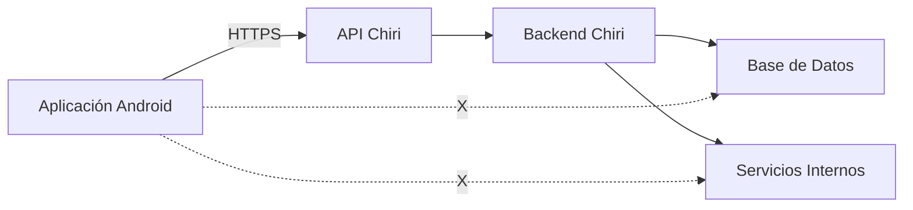
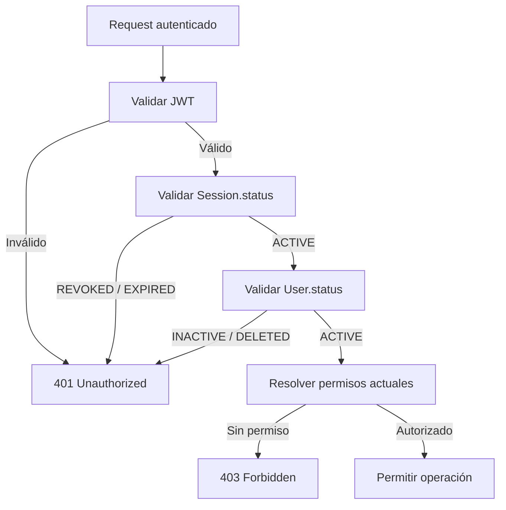

# 070_Seguridad.md

# Arquitectura de Seguridad Chiri Platform v1.0

## 1. Objetivo

Definir la arquitectura de seguridad transversal de Chiri Platform v1.0, estableciendo los mecanismos necesarios para proteger:

* Identidad de usuarios.
* Acceso a funcionalidades.
* Comunicación entre componentes.
* Información almacenada.
* Operaciones críticas del sistema.

La seguridad forma parte de la arquitectura base y aplica a:

* Aplicación Android.
* API.
* Backend.
* Base de Datos.
* Servicios internos.

---

# 2. Principios de Seguridad

## 2.1 Seguridad por diseño

Chiri Platform incorpora seguridad desde la definición arquitectónica.

Principios:

* Mínimo privilegio.
* Validación en todos los niveles.
* Separación de responsabilidades.
* Protección de información sensible.
* Auditoría de operaciones importantes.

---

## 2.2 No confianza en clientes externos

La aplicación Android es un cliente del sistema.

El Backend siempre debe validar:

* Identidad.
* Permisos.
* Datos recibidos.
* Reglas de negocio.

Nunca se debe asumir que la información enviada desde un cliente es confiable.

---

# 3. Límites de Confianza y Acceso a Infraestructura

Chiri Platform deberá aplicar una separación clara entre:

* Clientes externos.
* API Chiri.
* Backend.
* Base de Datos.
* Servicios internos.
* Infraestructura.

Los clientes externos no deberán acceder directamente a servicios internos.

La única entrada autorizada desde clientes hacia la plataforma será la API
Chiri mediante HTTPS.

Los servicios internos deberán permanecer aislados de los clientes.

Ejemplo:



---

## 3.1 Regla de No Acceso Directo

Ningún cliente externo deberá acceder directamente a:

* Base de Datos.
* Servicios internos.
* Contenedores Docker.
* APIs administrativas.
* Puertos internos.
* Interfaces de administración.
* Dispositivos de infraestructura.

El acceso deberá realizarse mediante las interfaces autorizadas de Chiri.

---

## 3.2 Separación de Redes

La infraestructura interna deberá mantenerse separada de los
clientes externos.

La exposición de un servicio interno no deberá considerarse un
mecanismo válido de integración con Android.

---

## 3.3 Principio de Mínima Exposición

Todo servicio deberá exponer únicamente los puertos, interfaces y
funcionalidades estrictamente necesarios.

Los servicios que no requieran acceso externo no deberán exponerse
directamente a Internet.

---

# 4. Modelo General de Seguridad

La seguridad de Chiri Platform deberá establecer un conjunto coherente de principios, controles y reglas arquitectónicas destinados a proteger la plataforma, sus componentes, sus comunicaciones, sus datos y los servicios integrados.

El modelo de seguridad deberá aplicarse de forma transversal a los componentes de la plataforma y deberá mantenerse alineado con la arquitectura definida en los documentos anteriores.

La seguridad deberá considerar especialmente:

* identidad y acceso;
* comunicaciones;
* protección de datos;
* aplicaciones y APIs;
* servicios internos;
* infraestructura;
* auditoría y monitoreo;
* gestión de vulnerabilidades;
* respuesta ante incidentes.

Las medidas de seguridad deberán seguir el principio de **defensa en profundidad**, evitando depender de un único mecanismo de protección.

La seguridad deberá integrarse desde el diseño de la plataforma y mantenerse durante todo su ciclo de vida.

---

# 4.1 Zonas de Confianza y Fronteras de Seguridad

Chiri Platform deberá considerar diferentes zonas de confianza según el nivel de exposición y responsabilidad de cada componente.

Las principales zonas de confianza serán:

* **Cliente:** dispositivos utilizados para acceder a la plataforma.
* **API:** punto de entrada a los servicios de Chiri Platform.
* **Backend:** componentes que ejecutan la lógica de negocio.
* **Datos:** Base de Datos y sistemas que almacenan información de la plataforma.
* **Servicios internos:** servicios integrados que proporcionan funcionalidades a Chiri Platform.
* **Administración e infraestructura:** componentes utilizados para administrar y mantener la plataforma.

La comunicación entre zonas deberá considerarse una **frontera de seguridad**.

Ninguna zona deberá considerarse automáticamente confiable únicamente por pertenecer a la infraestructura interna.

El acceso entre zonas deberá estar sujeto a los mecanismos de autenticación, autorización, validación y protección de comunicaciones que correspondan.

Los servicios internos deberán utilizar permisos mínimos y únicamente deberán acceder a los recursos necesarios para cumplir su función.

Los componentes expuestos a redes externas deberán disponer de controles adicionales respecto de los componentes que no estén directamente expuestos.

### Regla arquitectónica

> **Toda comunicación entre zonas de confianza deberá considerarse una frontera de seguridad y deberá estar protegida mediante los controles correspondientes al nivel de riesgo y exposición.**

---

# 4.2 Principio de Mínimo Privilegio

Chiri Platform deberá aplicar el principio de **mínimo privilegio** a usuarios, aplicaciones, servicios, procesos y componentes de infraestructura.

Cada identidad deberá disponer únicamente de los permisos necesarios para realizar las funciones que le correspondan.

Los permisos deberán definirse de acuerdo con:

* función;
* responsabilidad;
* recurso;
* operación;
* contexto de acceso.

Los usuarios no deberán disponer de permisos administrativos salvo cuando sean necesarios para realizar funciones específicas de administración.

Los servicios internos deberán utilizar identidades independientes y permisos limitados a los recursos que necesiten.

El Backend no deberá utilizar credenciales con privilegios superiores a los necesarios para ejecutar sus funciones.

El acceso a la Base de Datos deberá limitarse a las operaciones requeridas por cada componente.

Las cuentas y credenciales utilizadas para administración deberán mantenerse separadas de las utilizadas por los servicios de ejecución normal.

Los permisos deberán revisarse cuando cambien las responsabilidades, componentes o necesidades de acceso.

Los privilegios que ya no sean necesarios deberán eliminarse.

### Regla arquitectónica

> **Todo usuario, servicio o componente de Chiri Platform deberá disponer únicamente de los privilegios necesarios para cumplir su función.**

---

# 4.3 Autenticación

Chiri Platform deberá disponer de mecanismos de autenticación que permitan verificar de forma segura la identidad de los usuarios y componentes que soliciten acceso a recursos protegidos.

La autenticación deberá aplicarse antes de permitir el acceso a recursos que requieran identidad.

Los mecanismos de autenticación deberán:

* proteger las credenciales durante su transmisión;
* evitar el almacenamiento de credenciales en texto plano;
* limitar los intentos de autenticación cuando exista riesgo de abuso;
* permitir la invalidación de credenciales comprometidas;
* utilizar mecanismos adecuados al tipo de cliente y servicio;
* mantener separadas las funciones de autenticación y autorización.

Las contraseñas de los usuarios deberán almacenarse utilizando **Argon2id**.

Las contraseñas nunca deberán almacenarse en texto plano ni deberán incluirse en tokens, registros de aplicación, registros de auditoría o mensajes de error.

La autenticación de servicios internos deberá utilizar identidades y credenciales independientes de las cuentas de usuario.

Las credenciales utilizadas por servicios deberán disponer únicamente de los privilegios necesarios para su función.

Los mecanismos de autenticación deberán considerar la protección contra:

* fuerza bruta;
* reutilización indebida de credenciales;
* robo de credenciales;
* uso de credenciales comprometidas;
* ataques automatizados.

Las credenciales o mecanismos de autenticación que se consideren comprometidos deberán poder ser invalidados o reemplazados.

## 4.3.1 Activación de Cuenta

Los usuarios registrados mediante correo electrónico deberán permanecer en estado **INACTIVE** hasta completar correctamente el proceso de activación.

La activación deberá realizarse mediante un enlace enviado al correo electrónico registrado.

El enlace de activación deberá utilizar un token de un solo uso con una duración máxima de **48 horas**.

Durante la activación, el usuario deberá establecer su contraseña inicial.

La activación exitosa deberá:

* verificar el token;
* establecer la contraseña;
* cambiar el estado del usuario de `INACTIVE` a `ACTIVE`;
* invalidar el token de activación.

La activación de la cuenta **no deberá crear automáticamente una sesión**.

Después de activar correctamente la cuenta, el usuario deberá realizar el proceso normal de inicio de sesión.

### Regla arquitectónica

> **Una cuenta nueva no podrá utilizar recursos protegidos hasta completar correctamente la activación mediante el correo electrónico registrado.**

# 4.4 Autorización

Chiri Platform deberá controlar el acceso a recursos y operaciones mediante mecanismos de autorización.

La autorización deberá determinar qué acciones puede realizar una identidad autenticada sobre un recurso determinado.

La autorización deberá considerar, según corresponda:

* identidad;
* rol;
* permisos;
* recurso;
* operación;
* contexto de acceso.

La autenticación no deberá implicar automáticamente autorización para acceder a todos los recursos de la plataforma.

Los permisos deberán asignarse mediante el principio de mínimo privilegio.

Las operaciones administrativas deberán disponer de controles adicionales respecto de las operaciones normales de usuario.

El Backend deberá validar los permisos antes de ejecutar operaciones que requieran autorización.

La API no deberá confiar únicamente en controles realizados por el cliente.

Los controles de autorización deberán aplicarse en el servidor y deberán mantenerse independientes de la interfaz utilizada para acceder a la plataforma.

Los cambios de privilegios deberán quedar sujetos a controles adecuados y no deberán permitir escalada de privilegios no autorizada.

Los accesos que ya no estén autorizados deberán ser rechazados aunque la identidad continúe autenticada.

Los **roles y permisos no deberán formar parte del Access Token**.

Los permisos deberán resolverse utilizando el estado actual de la identidad y sus relaciones de autorización.

Los cambios de roles o permisos deberán tener efecto inmediato sobre las sesiones existentes.

La primera implementación de Chiri Platform no utilizará una caché de permisos.

**PostgreSQL será la fuente de verdad para los permisos.**

La incorporación futura de mecanismos de caché deberá disponer de mecanismos explícitos de invalidación y no deberá permitir que permisos revocados continúen activos más allá del período definido por la arquitectura.

## 4.4.1 Códigos de Autenticación y Autorización

Chiri Platform utilizará los códigos HTTP `401 Unauthorized` y `403 Forbidden` de acuerdo con la naturaleza del rechazo.

### HTTP 401 Unauthorized

Se utilizará `401 Unauthorized` cuando la autenticación no sea válida o no exista una sesión válida.

Entre las condiciones que deberán producir `401` se encuentran:

* token ausente;
* token inválido;
* token expirado;
* firma inválida;
* `kid` desconocido o inválido;
* `iss` inválido;
* `aud` inválido;
* sesión revocada;
* sesión expirada;
* usuario `INACTIVE`;
* usuario `DELETED`.

La respuesta no deberá revelar información interna que permita determinar innecesariamente la causa específica del fallo de autenticación.

### HTTP 403 Forbidden

Se utilizará `403 Forbidden` cuando la identidad esté correctamente autenticada y la sesión sea válida, pero la operación solicitada no esté autorizada.

La respuesta deberá utilizar un mensaje genérico.

Ejemplo:

```json
{
  "success": false,
  "error": {
    "code": "ERR_AUTH_003",
    "message": "Permisos insuficientes"
  }
}
```

La respuesta no deberá revelar:

* el permiso específico que falta;
* los roles del usuario;
* los permisos disponibles;
* la estructura interna del sistema de autorización.

La información detallada necesaria para auditoría podrá registrarse internamente sin exponerse al cliente.

### Regla arquitectónica

> **Toda operación protegida de Chiri Platform deberá ser autorizada en el servidor antes de ejecutarse, utilizando los permisos vigentes de la identidad independientemente del cliente que origine la solicitud.**

---

# 4.5 Protección de Comunicaciones

Las comunicaciones de Chiri Platform deberán protegerse contra interceptación, modificación, suplantación y acceso no autorizado.

Las comunicaciones que transporten información sensible, credenciales, tokens o información de autenticación deberán utilizar mecanismos de protección adecuados.

Las comunicaciones externas deberán utilizar **HTTPS mediante TLS**.

Los certificados utilizados para proteger las comunicaciones deberán mantenerse válidos y gestionarse de forma adecuada.

Las comunicaciones entre componentes internos deberán protegerse de acuerdo con el nivel de confianza y riesgo existente.

El hecho de que dos componentes pertenezcan a la misma red no deberá considerarse suficiente para establecer confianza automática.

Cuando la API y el Backend se ejecuten como componentes independientes, la comunicación entre ambos deberá utilizar los mecanismos de protección correspondientes al nivel de riesgo.

Los servicios publicados hacia redes externas deberán disponer de controles adicionales de protección y no deberán exponerse directamente más allá de lo necesario.

Los mecanismos utilizados para publicar servicios externamente, incluidos proxies o túneles, deberán considerarse parte de la frontera de seguridad y no deberán sustituir los mecanismos propios de autenticación y autorización de Chiri Platform.

Las comunicaciones deberán limitarse a los puertos, protocolos y destinos necesarios para el funcionamiento de cada componente.

### Regla arquitectónica

> **Toda comunicación que atraviese una frontera de seguridad deberá utilizar mecanismos adecuados de protección, autenticación y control de acceso según su nivel de riesgo.**

---

# 4.6 Protección de Datos

Chiri Platform deberá proteger la información almacenada, procesada y transmitida por sus componentes durante todo su ciclo de vida.

La protección de los datos deberá considerar:

* confidencialidad;
* integridad;
* disponibilidad;
* control de acceso;
* almacenamiento;
* transmisión;
* respaldo;
* eliminación.

La información deberá clasificarse de acuerdo con su nivel de sensibilidad y los controles deberán aplicarse proporcionalmente al riesgo.

Los datos sensibles o confidenciales deberán disponer de controles de acceso adecuados y no deberán exponerse a componentes que no los necesiten.

La Base de Datos deberá estar protegida mediante autenticación, autorización y mínimo privilegio.

Las credenciales, tokens, claves y secretos no deberán almacenarse como datos ordinarios de la aplicación ni incluirse en código fuente, repositorios o registros de aplicación.

Los datos sensibles transmitidos entre componentes deberán utilizar canales protegidos.

## 4.6.1 Protección de Credenciales y Tokens

Las contraseñas de usuario deberán almacenarse únicamente mediante mecanismos de hash seguros definidos por la arquitectura, utilizando **Argon2id**.

Las contraseñas nunca deberán almacenarse en texto plano.

No deberán almacenarse en registros de aplicación o auditoría:

* contraseñas;
* `password_hash`;
* Access Tokens completos;
* Refresh Tokens completos;
* claves privadas;
* secretos;
* credenciales;
* valores de autenticación completos.

Los tokens deberán considerarse información sensible durante todo su ciclo de vida.

Los Access Tokens y Refresh Tokens no deberán incluirse en:

* logs;
* mensajes de error;
* URLs;
* parámetros de consulta;
* documentación;
* código fuente;
* repositorios.

Los datos de autenticación deberán limitarse a los componentes que realmente necesiten procesarlos.

## 4.6.2 Protección de Datos de Auditoría

Los registros de aplicación y auditoría deberán contener únicamente la información necesaria para cumplir su finalidad operativa, de seguridad y trazabilidad.

Los eventos de auditoría no deberán almacenar información sensible innecesaria.

Los intentos fallidos de autenticación no deberán almacenar el username en texto plano.

Cuando sea necesario correlacionar intentos de autenticación, se utilizará un identificador derivado mediante HMAC-SHA-256:

```text
username_hash = HMAC-SHA-256(key=audit_secret, message=username)
```

El secreto utilizado para generar `username_hash` deberá mantenerse protegido y separado del código fuente y de los registros.

Los registros relacionados con cambios de correo electrónico no deberán almacenar directamente:

* correo electrónico anterior;
* correo electrónico nuevo;
* tokens completos de verificación;
* tokens completos de cambio de correo;
* secretos.

La información necesaria para establecer trazabilidad deberá registrarse mediante identificadores y metadatos adecuados, evitando almacenar valores sensibles innecesarios.

## 4.6.3 Protección de Datos de Sesión

Las sesiones deberán considerarse información sensible.

Los identificadores de sesión podrán almacenarse en la Base de Datos cuando sean necesarios para administrar su ciclo de vida.

Los Refresh Tokens no deberán almacenarse en texto plano cuando la implementación permita utilizar una representación protegida o derivada.

La información de sesión deberá estar protegida mediante controles de acceso y mínimo privilegio.

Los cambios de estado de una sesión deberán mantener trazabilidad suficiente para permitir la investigación de eventos de seguridad relevantes.

## 4.6.4 Protección de Datos Locales

Los datos sensibles almacenados localmente en dispositivos cliente deberán limitarse a los estrictamente necesarios para el funcionamiento de la aplicación.

La aplicación Android deberá utilizar mecanismos de almacenamiento seguro proporcionados por la plataforma para proteger credenciales, tokens y demás información sensible.

Los datos sensibles no deberán almacenarse mediante mecanismos destinados a información no protegida.

La eliminación de una sesión deberá eliminar o invalidar los datos locales asociados que ya no sean necesarios.

## 4.6.5 Protección de Respaldos

Los respaldos deberán considerarse parte de la superficie de seguridad de Chiri Platform.

Los respaldos que contengan información sensible deberán disponer de:

* control de acceso;
* protección durante la transferencia;
* protección durante el almacenamiento;
* mecanismos de recuperación controlados.

El acceso a los respaldos deberá limitarse a las identidades que realmente necesiten realizar operaciones de respaldo o recuperación.

Los respaldos no deberán exponerse directamente a redes externas sin mecanismos adecuados de protección.

Los procedimientos de restauración deberán mantener los controles de seguridad aplicables a los datos originales.

## 4.6.6 Eliminación de Datos

Los datos que ya no sean necesarios deberán eliminarse o gestionarse de acuerdo con las políticas definidas para la plataforma.

La eliminación de información sensible deberá realizarse de manera que evite su exposición posterior cuando sea técnicamente posible.

Cuando una cuenta o recurso sea eliminado, deberán considerarse también los datos relacionados que ya no sean necesarios, incluyendo:

* información de sesiones;
* tokens;
* datos temporales;
* información sensible asociada.

Los registros de auditoría necesarios para seguridad, trazabilidad o cumplimiento deberán conservarse de acuerdo con la política de retención definida para la plataforma.

### Regla arquitectónica

> **Los datos de Chiri Platform deberán protegerse durante su almacenamiento, procesamiento, transmisión, respaldo y eliminación, aplicando controles proporcionales a su sensibilidad y riesgo y evitando almacenar información sensible innecesaria.**

# 4.7 Gestión de Sesiones y Tokens

Chiri Platform deberá gestionar de forma segura las sesiones y los mecanismos utilizados para mantener el estado de autenticación de los usuarios.

La arquitectura de autenticación utilizará un modelo basado en:

* sesión persistente en el Backend;
* Access Token de corta duración;
* Refresh Token asociado a la sesión.

Los tokens y demás identificadores de sesión deberán considerarse información sensible.

Su gestión deberá contemplar:

* generación segura;
* almacenamiento protegido;
* transmisión segura;
* expiración;
* renovación;
* invalidación;
* revocación cuando corresponda.

Los tokens no deberán incluirse en:

* código fuente;
* registros de aplicación;
* registros de auditoría;
* mensajes de error;
* URLs cuando exista una alternativa segura;
* repositorios públicos.

El cliente deberá almacenar los tokens utilizando mecanismos apropiados para protegerlos frente al acceso no autorizado.

La autoridad final sobre la validez de una sesión será el Backend.

La arquitectura de sesiones y tokens deberá mantenerse independiente de la interfaz cliente utilizada para acceder a Chiri Platform.

## 4.7.1 Modelo de Sesión

Cada inicio de sesión válido deberá crear una sesión independiente asociada a un usuario.

La sesión deberá disponer de un identificador único.

La sesión deberá estar asociada como mínimo a:

* usuario;
* fecha de creación;
* fecha de expiración;
* estado;
* información necesaria para auditoría;
* mecanismos de renovación correspondientes.

Los estados mínimos de una sesión serán:

```text
ACTIVE
REVOKED
EXPIRED
```

Una sesión `REVOKED` no podrá utilizarse nuevamente.

Una sesión `EXPIRED` no podrá utilizarse para acceder a recursos protegidos ni para renovar la autenticación.

La sesión deberá estar asociada al usuario mediante su identificador UUID definido en el modelo de identidad.

La entidad `Session` se encuentra actualmente implementada en el Backend mediante el modelo persistente correspondiente y su migración de Base de Datos.

La implementación actual permite crear y revocar sesiones como parte del flujo de autenticación.

### Regla arquitectónica

> **La sesión será la entidad persistente que permitirá controlar el ciclo de vida de la autenticación independientemente de la duración individual de los Access Tokens.**

## 4.7.2 Access Token

El Access Token de usuario será un **JWT** firmado mediante **RS256**.

La clave privada utilizada para firmar los JWT deberá utilizar RSA de **3072 bits**.

El Access Token tendrá una duración máxima de **15 minutos**.

El JWT deberá contener como mínimo los claims necesarios para identificar y validar la sesión, incluyendo:

* `jti`;
* `kid`;
* `iss`;
* `aud`;
* `iat`;
* `exp`;
* identificador del usuario;
* identificador de la sesión.

El servidor deberá validar como mínimo:

* firma criptográfica;
* `kid`;
* `iss`;
* `aud`;
* `iat`;
* `exp`.

Los valores oficiales serán:

```text
iss = chiri-platform
aud = chiri-api
```

El identificador del usuario utilizado en el token deberá corresponder al UUID de la identidad de Chiri.

Los roles y permisos **no deberán formar parte del Access Token**.

El Access Token no deberá utilizarse como fuente de verdad para determinar los permisos actuales del usuario.

### Regla arquitectónica

> **El Access Token será una credencial de autenticación de corta duración y no deberá contener información de autorización que pueda quedar obsoleta durante la vida de la sesión.**

## 4.7.3 Identificador del Access Token

Cada Access Token deberá disponer de un identificador único mediante el claim:

```text
jti
```

El `jti` permitirá identificar individualmente un token cuando sea necesario para:

* trazabilidad;
* auditoría;
* investigación de incidentes.

El `jti` no deberá utilizarse como mecanismo permanente de almacenamiento del Access Token.

Chiri Platform no utilizará inicialmente una blacklist permanente de Access Tokens.

## 4.7.4 Identificador de Clave

Cada Access Token deberá incluir el identificador:

```text
kid
```

El `kid` permitirá identificar la clave pública correspondiente a la clave utilizada para firmar el token.

Las claves privadas y públicas deberán administrarse como pares correspondientes.

La clave privada utilizada para firmar tokens deberá mantenerse protegida.

La clave privada nunca deberá exponerse a:

* aplicación Android;
* clientes externos;
* servicios que únicamente necesiten validar tokens;
* endpoints HTTP;
* endpoint JWKS.

## 4.7.5 Distribución de Claves Públicas

Las claves públicas utilizadas para validar Access Tokens **podrán publicarse mediante un endpoint JWKS como capacidad futura** de Chiri Platform.

El endpoint previsto será:

```text
GET /.well-known/jwks.json
```

Actualmente, esta capacidad **no forma parte de la implementación vigente del Backend**. La validación actual de los Access Tokens utiliza la clave pública configurada directamente en el Backend.

Cuando JWKS sea implementado, el endpoint deberá publicar únicamente información correspondiente a claves públicas.

Nunca deberá exponer:

* claves privadas;
* secretos;
* credenciales;
* Refresh Tokens.

El `kid` incluido en un JWT deberá permitir seleccionar la clave pública correspondiente.

Durante una futura rotación de claves, el endpoint JWKS podrá publicar temporalmente más de una clave pública cuando sea necesario para validar tokens legítimos que todavía se encuentren dentro de su período de vigencia.

### Estado actual

```text
Access Token
     |
     v
kid
     |
     v
Clave pública configurada en Backend
     |
     v
Validación de firma
```

### Capacidad futura

```text
Access Token
     |
     v
kid
     |
     v
JWKS
     |
     +-- Clave pública actual
     |
     +-- Clave pública anterior
            |
            v
      Período de transición
```

La incorporación de JWKS deberá realizarse de forma controlada y no deberá exponer información privada o secreta.

### Regla arquitectónica

> **La distribución de claves públicas mediante JWKS será una capacidad futura destinada a facilitar la validación y rotación controlada de claves, sin exponer claves privadas ni otros secretos.**

## 4.7.6 Rotación de Claves JWT

Las claves utilizadas para firmar Access Tokens deberán rotarse periódicamente como una **capacidad futura de Chiri Platform**.

La política arquitectónica prevista será:

```text
Rotación programada: cada 90 días
```

Actualmente, la rotación automática de claves JWT **no forma parte de la implementación vigente del Backend**.

Cuando esta capacidad sea implementada, durante una rotación podrán existir simultáneamente:

```text
clave anterior → validación temporal
clave actual   → firma de nuevos tokens
```

La clave anterior deberá mantenerse disponible durante un período de gracia suficiente para validar tokens legítimos que todavía se encuentren dentro de su período de vigencia.

La distribución de las claves durante este período deberá realizarse mediante el mecanismo JWKS definido para esta capacidad futura.

Una vez finalizado el período de gracia, la clave anterior podrá retirarse del conjunto JWKS y deberá dejar de utilizarse para la firma de nuevos tokens.

La rotación no deberá provocar la invalidación innecesaria de Access Tokens legítimos que todavía se encuentren dentro de su período de vigencia.

La clave privada anterior deberá retirarse de los mecanismos activos de firma cuando finalice su período de uso.

### Estado actual

```text
Clave JWT configurada
        |
        v
Backend
        |
        v
Firma RS256
        |
        v
Access Token
```

Actualmente no existe un proceso automático de:

```text
Rotación periódica
        ↓
Nueva clave
        ↓
Publicación mediante JWKS
        ↓
Período de gracia
        ↓
Retiro de clave anterior
```

Estos mecanismos quedan establecidos como parte de la evolución futura de la arquitectura de seguridad.

### Regla arquitectónica

> **La futura rotación de claves deberá permitir continuar validando tokens legítimos durante el período de transición sin permitir que una clave retirada continúe utilizándose indefinidamente.**

## 4.7.7 Refresh Token

El Refresh Token será utilizado exclusivamente para renovar el acceso mientras la sesión continúe siendo válida.

El Refresh Token tendrá una duración máxima de **30 días**.

El Refresh Token deberá estar asociado a una sesión concreta.

El servidor deberá validar:

* autenticidad;
* vigencia;
* sesión asociada;
* usuario asociado;
* estado de la sesión;
* estado del usuario.

Un Refresh Token no deberá utilizarse directamente para acceder a recursos protegidos de la API.

Los Refresh Tokens deberán poder ser revocados inmediatamente.

El cierre de sesión deberá provocar la invalidación de la sesión y del mecanismo de renovación correspondiente.

Los Refresh Tokens no deberán registrarse completos en logs o auditorías.

El servidor deberá almacenar una representación protegida o derivada del Refresh Token y no el valor utilizable directamente.

## 4.7.8 Rotación de Refresh Token

La implementación deberá utilizar rotación del Refresh Token durante la renovación de sesión.

Cuando un Refresh Token válido sea utilizado para renovar una sesión, el servidor deberá emitir un nuevo Refresh Token y dejar inválido el anterior.

La rotación deberá impedir que un Refresh Token utilizado anteriormente pueda reutilizarse.

Un intento de reutilización de un Refresh Token ya invalidado deberá considerarse un evento de seguridad.

Cuando se detecte la reutilización de un Refresh Token invalidado, la sesión asociada deberá ser revocada y no deberá permitirse la emisión de nuevas credenciales para dicha sesión.

La rotación y detección de reutilización deberán implementarse junto con la entidad `Session`.

### Regla arquitectónica

> **Cada renovación válida deberá producir un nuevo Refresh Token e invalidar el anterior. La reutilización de un Refresh Token invalidado deberá considerarse una condición de seguridad y deberá provocar la revocación de la sesión asociada.**

## 4.7.9 Revocación de Access Tokens

Chiri Platform **no utilizará inicialmente una blacklist permanente de Access Tokens**.

Los Access Tokens tendrán una duración máxima de 15 minutos.

La validez criptográfica del JWT no será suficiente para autorizar una solicitud.

El Backend deberá comprobar además:

* estado actual de la sesión;
* estado actual del usuario;
* permisos actuales cuando la operación requiera autorización.

De esta forma, una sesión revocada podrá impedir el acceso aunque exista un Access Token que todavía no haya alcanzado su fecha de expiración.

La revocación de un Access Token individual no requerirá inicialmente almacenar una blacklist permanente.

### Regla arquitectónica

> **Chiri Platform utilizará Access Tokens de corta duración y controlará la revocación mediante el estado persistente de la sesión y del usuario, evitando inicialmente una blacklist permanente de JWT.**

## 4.7.10 Validación de Sesión

En cada solicitud autenticada, el Backend deberá validar:

* estructura del JWT;
* firma;
* `kid`;
* `iss`;
* `aud`;
* `iat`;
* `exp`;
* identificador del usuario;
* identificador de sesión;
* estado actual de la sesión;
* estado actual del usuario.

Una sesión con estado:

```text
REVOKED
EXPIRED
```

no podrá utilizarse para acceder a recursos protegidos.

Un usuario con estado:

```text
INACTIVE
DELETED
```

no podrá utilizar una sesión para acceder a recursos protegidos.

Un usuario con estado `ACTIVE` podrá utilizar una sesión `ACTIVE` siempre que la autenticación y autorización de la operación sean válidas.

Los cambios de estado de sesión o usuario deberán tener efecto sobre las solicitudes posteriores.

### Flujo conceptual



## 4.7.11 Cierre de Sesión

El cierre de sesión deberá invalidar la sesión correspondiente.

Como consecuencia:

```text
Session.status
    ↓
REVOKED
    ↓
Refresh Token
    ↓
INVÁLIDO
```

El Access Token que ya haya sido emitido no será añadido inicialmente a una blacklist.

Las solicitudes posteriores deberán ser rechazadas mediante la validación del estado de la sesión.

El cliente deberá eliminar los tokens locales asociados a la sesión después de completar el cierre de sesión.

La eliminación local de los tokens no sustituye la revocación de la sesión en el servidor.

## 4.7.12 Revocación Global de Sesiones

La plataforma deberá permitir revocar todas las sesiones activas asociadas a un usuario.

La revocación global deberá poder utilizarse, como mínimo, cuando corresponda a:

* compromiso de credenciales;
* cambio de contraseña cuando la política de seguridad lo requiera;
* acción administrativa explícita;
* recuperación de cuenta;
* incidente de seguridad.

El proceso será conceptualmente:

```text
User
 ↓
evento de seguridad
 ↓
buscar sesiones activas
 ↓
revocar sesiones
 ↓
Session.status = REVOKED
 ↓
Refresh Tokens inválidos
 ↓
siguientes solicitudes → 401
```

La revocación global deberá afectar a todas las sesiones activas del usuario.

## 4.7.13 Estado del Usuario y Sesiones

La validez de una sesión dependerá también del estado actual del usuario.

Los estados actualmente definidos para `User.status` son:

```text
ACTIVE
INACTIVE
DELETED
```

Un usuario `INACTIVE` no podrá acceder a recursos protegidos.

Un usuario `DELETED` no podrá acceder a recursos protegidos.

La activación de una cuenta deberá cambiar:

```text
INACTIVE → ACTIVE
```

La activación no deberá crear automáticamente una sesión.

El inicio de sesión posterior a la activación será el encargado de crear la sesión.

No se utilizará `BLOCKED` como valor de `User.status` en esta versión de la arquitectura.

Las restricciones temporales derivadas de mecanismos contra abuso deberán gestionarse mediante los controles específicos definidos en `4.18` y no deberán confundirse con el estado persistente de la identidad.

## 4.7.14 Autorización y Permisos

Los roles y permisos no deberán almacenarse dentro del Access Token.

Los permisos deberán resolverse utilizando el estado actual del usuario y sus relaciones de autorización.

Los cambios de roles o permisos deberán tener efecto inmediato sobre las sesiones existentes.

La primera implementación no utilizará una caché de permisos.

**PostgreSQL será la fuente de verdad para los permisos.**

La introducción futura de una caché deberá disponer de mecanismos explícitos de invalidación.

### Regla arquitectónica

> **La autorización deberá utilizar los permisos vigentes en el momento de la solicitud y no deberá depender de información de permisos almacenada previamente dentro del JWT.**

## 4.7.15 Relación entre Usuario, Sesión y Tokens

La relación conceptual será:

```text
User
  │
  ├── Session 1
  │      ├── Access Token
  │      └── Refresh Token
  │
  ├── Session 2
  │      ├── Access Token
  │      └── Refresh Token
  │
  └── Session N
         ├── Access Token
         └── Refresh Token
```

Cada sesión será independiente.

Revocar una sesión deberá invalidar únicamente los mecanismos de autenticación asociados a dicha sesión.

La revocación global deberá invalidar todas las sesiones activas del usuario.

## 4.7.16 Implementación Progresiva

La arquitectura de sesiones y tokens definida en esta sección será implementada progresivamente.

La implementación deberá respetar el siguiente orden conceptual:

```text
User
  ↓
Session
  ↓
Login
  ↓
Access Token
  ↓
Refresh Token
  ↓
Logout
  ↓
Revocación
  ↓
Revocación global
```

La entidad `Session`, los mecanismos de tokens y los endpoints correspondientes deberán implementarse mediante cambios controlados de código y migraciones.

La implementación no deberá introducir cambios directos en la Base de Datos de producción fuera del sistema de migraciones definido por Chiri Platform.

### Regla arquitectónica general

> **La sesión persistente será la fuente de verdad del ciclo de vida de la autenticación, mientras que los Access Tokens proporcionarán autenticación de corta duración y los Refresh Tokens permitirán renovar una sesión válida bajo controles explícitos de seguridad.**

# 4.8 Gestión de Secretos y Credenciales

Chiri Platform deberá proteger las credenciales, claves, tokens, certificados y demás secretos utilizados por sus componentes.

Los secretos deberán mantenerse separados del código fuente y de cualquier configuración que pueda ser distribuida públicamente.

No deberán incluirse secretos reales en:

* repositorios de código;
* código fuente;
* documentación;
* imágenes de contenedores;
* registros de aplicación;
* archivos de configuración destinados a distribución pública;
* respuestas de API.

Los servicios deberán utilizar únicamente las credenciales necesarias para realizar sus funciones.

Las credenciales utilizadas por diferentes componentes deberán mantenerse separadas cuando sus funciones o niveles de privilegio sean diferentes.

Los secretos deberán poder ser reemplazados cuando exista sospecha de compromiso o cuando sea necesario por razones de seguridad.

La exposición accidental de un secreto deberá considerarse un evento de seguridad y deberá evaluarse su posible revocación o reemplazo.

## 4.8.1 Separación de Secretos

Cada secreto deberá tener una finalidad específica.

No deberá reutilizarse una misma clave o secreto para diferentes funciones de seguridad cuando dichas funciones tengan objetivos o niveles de privilegio diferentes.

Como mínimo deberán mantenerse separados:

* credenciales de Base de Datos;
* credenciales utilizadas para migraciones;
* clave privada utilizada para firmar JWT;
* secreto HMAC utilizado para auditoría;
* credenciales utilizadas para correo electrónico;
* credenciales de servicios internos;
* secretos utilizados por integraciones externas;
* otros secretos específicos de cada componente.

La separación deberá limitar el impacto de un posible compromiso de una credencial.

### Regla arquitectónica

> **Un secreto comprometido no deberá proporcionar automáticamente acceso a funciones o componentes independientes.**

## 4.8.2 Configuración de Desarrollo

Durante el desarrollo, los secretos locales podrán gestionarse mediante archivos `.env`.

Los archivos `.env` reales deberán permanecer fuera del control de versiones.

El repositorio podrá incluir:

```text
.env.example
```

Este archivo deberá contener únicamente:

* nombres de variables;
* valores de ejemplo;
* placeholders;
* documentación de configuración no sensible.

Nunca deberá contener secretos reales.

Ejemplo:

```text
DATABASE_URL=CHANGE_ME
MIGRATION_DATABASE_URL=CHANGE_ME
JWT_PRIVATE_KEY_PATH=CHANGE_ME
AUDIT_HMAC_SECRET=CHANGE_ME
MAIL_PASSWORD=CHANGE_ME
```

Los archivos `.env` reales deberán estar incluidos en las reglas de exclusión correspondientes de Git.

Los secretos de un equipo de desarrollo no deberán copiarse al repositorio ni compartirse mediante commits.

### Regla arquitectónica

> **Los secretos utilizados durante el desarrollo deberán permanecer fuera del repositorio y cada entorno de desarrollo deberá disponer de su propia configuración local.**

## 4.8.3 Clave Privada JWT

La clave privada utilizada para firmar los Access Tokens deberá mantenerse protegida.

La clave deberá:

* utilizar RSA de 3072 bits;
* utilizarse con RS256;
* mantenerse fuera del código fuente;
* mantenerse fuera del repositorio;
* mantenerse fuera de las imágenes Docker;
* mantenerse fuera de los logs;
* mantenerse fuera de respuestas API.

Durante el desarrollo, la clave privada JWT podrá almacenarse como un archivo PEM local protegido.

Ejemplo de ubicación:

```text
secrets/
└── jwt/
    └── private.pem
```

El archivo deberá permanecer fuera del control de versiones.

La aplicación deberá cargar la clave mediante configuración segura.

La clave privada nunca deberá exponerse a:

* aplicación Android;
* clientes externos;
* servicios que únicamente necesiten validar tokens;
* endpoints HTTP;
* endpoint JWKS.

La clave pública correspondiente podrá distribuirse mediante el endpoint JWKS definido en `4.7`.

## 4.8.4 Gestión de Claves JWT en Producción

En producción, la clave privada JWT no deberá formar parte de:

* imagen Docker;
* repositorio;
* documentación;
* archivos públicos de configuración.

La clave privada deberá obtenerse mediante un mecanismo de gestión de secretos apropiado para el entorno de ejecución.

El servicio encargado de firmar los Access Tokens deberá disponer únicamente del acceso necesario para utilizar la clave privada.

Los componentes que únicamente necesiten validar Access Tokens deberán utilizar las claves públicas correspondientes.

La clave privada deberá permanecer aislada de los componentes que no necesiten firmar tokens.

La rotación de claves deberá seguir la política definida en `4.7.6`.

## 4.8.5 Secreto HMAC de Auditoría

El mecanismo utilizado para generar identificadores derivados de auditoría deberá utilizar un secreto independiente.

Para los valores `username_hash` se utilizará:

```text
HMAC-SHA-256(username, audit_secret)
```

El `audit_secret`:

* deberá mantenerse fuera del código fuente;
* no deberá almacenarse en logs;
* no deberá incluirse en auditorías;
* no deberá compartirse con clientes;
* no deberá reutilizarse como clave JWT;
* no deberá reutilizarse como credencial de Base de Datos;
* deberá poder reemplazarse cuando exista sospecha de compromiso.

El secreto HMAC deberá ser independiente de las claves utilizadas para firmar JWT.

## 4.8.6 Credenciales de Base de Datos

Las credenciales utilizadas para acceder a PostgreSQL deberán mantenerse fuera del código fuente.

Las credenciales de ejecución de la aplicación deberán mantenerse separadas de las credenciales utilizadas para realizar migraciones estructurales.

La aplicación deberá utilizar únicamente los privilegios necesarios para sus operaciones normales.

Las credenciales de migración deberán disponer de privilegios superiores únicamente cuando sean necesarios para ejecutar cambios estructurales controlados.

Las credenciales de Base de Datos no deberán:

* aparecer en logs;
* incluirse en mensajes de error;
* incluirse en repositorios;
* incluirse en imágenes Docker;
* exponerse mediante API.

Las credenciales deberán poder rotarse sin modificar el código fuente de la aplicación.

### Regla arquitectónica

> **Las credenciales de ejecución y migración de Base de Datos deberán mantenerse separadas y deberán disponer únicamente de los privilegios necesarios para sus respectivas funciones.**

## 4.8.7 Credenciales de Correo Electrónico

Las credenciales utilizadas para enviar correos electrónicos deberán mantenerse como secretos de configuración.

No deberán incluirse en:

* código fuente;
* repositorios;
* imágenes Docker;
* logs;
* respuestas API;
* documentación pública.

El servicio encargado del envío de correo deberá disponer únicamente de los permisos necesarios para realizar dicha función.

Las credenciales de correo deberán poder ser reemplazadas sin modificar el código fuente.

## 4.8.8 Secretos de Integraciones y Servicios Internos

Cada integración externa o servicio interno que requiera autenticación deberá utilizar credenciales independientes cuando sea técnicamente posible.

Las credenciales deberán disponer únicamente de los permisos necesarios para la integración correspondiente.

Un secreto utilizado por un servicio no deberá reutilizarse automáticamente para otro servicio.

Las credenciales de servicios internos deberán tratarse como secretos incluso cuando los servicios se encuentren dentro de la red local.

La pertenencia a una red interna no deberá considerarse suficiente para justificar el almacenamiento o distribución insegura de credenciales.

## 4.8.9 Refresh Tokens

Los Refresh Tokens deberán tratarse como credenciales sensibles.

No deberán almacenarse:

* en código fuente;
* en repositorios;
* en logs;
* en respuestas de diagnóstico;
* en documentación;
* en imágenes Docker.

Los Refresh Tokens almacenados por el Backend deberán utilizar una representación protegida o derivada cuando sea técnicamente posible.

El valor utilizable del Refresh Token deberá entregarse únicamente al cliente autenticado mediante el flujo correspondiente.

Los Refresh Tokens deberán poder ser invalidados mediante la revocación de la sesión asociada.

La gestión del ciclo de vida de los Refresh Tokens deberá seguir las reglas establecidas en `4.7`.

## 4.8.10 Producción y Secret Manager

Los secretos utilizados en producción deberán gestionarse mediante un **Secret Manager** o mecanismo equivalente apropiado para el entorno.

El mecanismo deberá permitir, según sus capacidades:

* almacenamiento seguro;
* control de acceso;
* separación de secretos;
* rotación;
* revocación;
* auditoría de acceso;
* distribución controlada.

Los secretos de producción no deberán depender de archivos incluidos en el repositorio.

Los secretos tampoco deberán incorporarse permanentemente a imágenes de contenedores.

El proceso de despliegue deberá proporcionar los secretos al componente únicamente durante su ejecución y mediante mecanismos seguros.

### Regla arquitectónica

> **Los secretos de producción deberán permanecer fuera del código, repositorio e imágenes de ejecución y deberán ser proporcionados al servicio mediante mecanismos seguros de gestión de secretos.**

## 4.8.11 Rotación y Revocación

Los secretos deberán poder reemplazarse cuando:

* exista sospecha de compromiso;
* un usuario, empleado o servicio deje de necesitarlos;
* cambie el entorno;
* se produzca una migración;
* expire una credencial;
* una política de seguridad lo requiera.

La rotación de un secreto deberá realizarse de forma controlada para evitar interrupciones innecesarias de los servicios.

Las claves JWT deberán seguir además la política específica de rotación definida en `4.7`.

Los Refresh Tokens deberán poder invalidarse mediante la revocación de la sesión correspondiente.

La revocación o sustitución de un secreto comprometido deberá considerarse una acción de respuesta ante incidentes cuando corresponda.

## 4.8.12 Exposición Accidental

La exposición accidental de un secreto deberá considerarse un evento de seguridad.

Ante una exposición deberán evaluarse inmediatamente:

* qué secreto fue expuesto;
* qué componentes podían utilizarlo;
* qué privilegios proporcionaba;
* durante cuánto tiempo estuvo expuesto;
* si pudo ser utilizado;
* si debe revocarse;
* si debe reemplazarse;
* qué registros deben revisarse.

Un secreto que haya sido incluido accidentalmente en un repositorio deberá considerarse comprometido aunque posteriormente sea eliminado del archivo.

La eliminación del secreto del código fuente no deberá considerarse suficiente.

Deberá evaluarse su rotación o revocación.

## 4.8.13 Registros y Diagnóstico

Los logs y mecanismos de diagnóstico deberán evitar la exposición de secretos.

No deberán registrarse directamente:

* passwords;
* password hashes;
* Access Tokens;
* Refresh Tokens;
* claves privadas;
* secretos HMAC;
* credenciales;
* cadenas de conexión completas;
* encabezados `Authorization`;
* cookies de autenticación.

Cuando sea necesario diagnosticar una operación relacionada con un secreto, deberá utilizarse información no sensible o valores truncados/anonimizados que no permitan reconstruir el secreto original.

Los mecanismos de diagnóstico no deberán registrar automáticamente el contenido completo de las solicitudes HTTP cuando estas puedan contener credenciales o tokens.

### Regla arquitectónica

> **Los mecanismos de diagnóstico y registro nunca deberán convertirse en un medio alternativo de exposición de secretos o credenciales.**

### Regla arquitectónica general

> **Los secretos y credenciales de Chiri Platform deberán mantenerse protegidos, separados del código fuente, aislados según su función y gestionados de forma que puedan ser reemplazados o revocados cuando sea necesario.**

# 4.9 Validación y Protección de Entradas

Chiri Platform deberá validar toda información recibida desde clientes, servicios internos, integraciones externas y cualquier otra fuente que pueda influir en el comportamiento de la plataforma.

La validación deberá realizarse en el servidor y no deberá depender exclusivamente de los controles implementados en el cliente.

Las entradas deberán validarse de acuerdo con:

* tipo de dato;
* formato;
* longitud;
* rango permitido;
* valores admitidos;
* estructura esperada;
* contexto de la operación.

La validación de la estructura y los datos recibidos deberá realizarse antes de ejecutar la operación correspondiente.

Las reglas de negocio deberán evaluarse posteriormente de acuerdo con el contexto y la autorización de la operación.

Los datos que no cumplan las reglas esperadas deberán rechazarse de forma controlada.

La plataforma deberá protegerse contra entradas diseñadas para provocar:

* inyección de código;
* inyección SQL;
* ejecución de comandos;
* manipulación de consultas;
* acceso no autorizado;
* corrupción de datos;
* consumo excesivo de recursos.

Las consultas a la Base de Datos deberán utilizar mecanismos que separen los datos de las instrucciones de consulta.

Los datos proporcionados por el usuario no deberán utilizarse directamente para construir consultas, comandos o instrucciones ejecutables sin la validación y protección correspondientes.

Las entradas recibidas desde servicios internos o integraciones externas tampoco deberán considerarse confiables automáticamente.

Los mensajes de error generados como consecuencia de entradas inválidas no deberán revelar información interna innecesaria.

# Regla arquitectónica

> **Toda entrada que pueda afectar el comportamiento de Chiri Platform deberá validarse y controlarse en el servidor antes de ser procesada.**

# 4.10 Seguridad de la API

La API de Chiri Platform deberá implementar controles de seguridad destinados a proteger las solicitudes, recursos y operaciones expuestas a los clientes.

La seguridad de la API deberá aplicar los principios definidos en las secciones anteriores y deberá mantenerse independiente del cliente utilizado.

La API deberá validar, según corresponda:

* autenticación;
* autorización;
* estructura de la solicitud;
* tipos de datos;
* formato de datos;
* parámetros;
* contenido recibido;
* reglas de negocio;
* límites de uso.

Ningún cliente deberá considerarse confiable por defecto.

La validación realizada en Android no sustituirá la validación realizada por el Backend.

## 4.10.1 Autenticación de Solicitudes

Los endpoints que requieran identidad deberán exigir una sesión autenticada válida.

La autenticación de las solicitudes deberá utilizar el Access Token definido en `4.7`.

El servidor deberá validar:

* presencia del token;
* estructura del JWT;
* firma;
* `kid`;
* `iss`;
* `aud`;
* `iat`;
* `exp`;
* identificador del usuario;
* identificador de sesión;
* estado de la sesión;
* estado del usuario.

Un token criptográficamente válido no será suficiente si la sesión o el usuario ya no se encuentran en un estado válido.

Las solicitudes sin una autenticación válida deberán rechazarse con:

```text
401 Unauthorized
```

## 4.10.2 Autorización de Solicitudes

Después de validar la autenticación, el Backend deberá comprobar que la identidad tiene permiso para realizar la operación solicitada.

La autorización deberá realizarse en el servidor.

La aplicación cliente no podrá conceder permisos mediante:

* parámetros;
* encabezados;
* valores enviados por el cliente;
* información almacenada localmente;
* roles declarados por el cliente.

Los roles y permisos deberán resolverse utilizando la información vigente de autorización.

PostgreSQL será la fuente de verdad para los permisos en la primera implementación.

Una identidad correctamente autenticada pero sin autorización suficiente deberá recibir:

```text
403 Forbidden
```

## 4.10.3 Validación de Entrada

Toda información recibida desde un cliente deberá considerarse no confiable hasta ser validada.

La API deberá validar:

* tipos;
* formatos;
* longitudes;
* rangos;
* valores permitidos;
* campos obligatorios;
* relaciones entre campos;
* identificadores;
* parámetros de consulta;
* contenido de solicitudes.

La validación deberá realizarse antes de ejecutar operaciones de negocio.

La API no deberá confiar en validaciones realizadas exclusivamente por Android.

Los identificadores UUID recibidos deberán validarse como UUID antes de utilizarse.

Los valores que correspondan a enumeraciones deberán limitarse a los valores definidos por el modelo de datos y la arquitectura.

## 4.10.4 Validación de Parámetros

Los parámetros enviados mediante:

```text
path
query
header
body
```

deberán validarse según el contexto de la operación.

Los parámetros no esperados no deberán modificar el comportamiento de una operación protegida.

La API deberá evitar que un cliente pueda controlar directamente atributos internos que no formen parte de la operación permitida.

Los campos de entidades que no sean modificables por el cliente deberán ignorarse o rechazarse según la política definida para el endpoint.

## 4.10.5 Mass Assignment

Los endpoints de escritura deberán utilizar modelos de entrada explícitos.

La API no deberá permitir que un cliente modifique automáticamente todos los campos de una entidad mediante el envío de un objeto arbitrario.

Los campos sensibles deberán controlarse explícitamente.

Entre los campos que no deberán ser modificables directamente por un usuario se encuentran, según corresponda:

* `id`;
* `status`;
* `password_hash`;
* `created_at`;
* `updated_at`;
* roles;
* permisos;
* identificadores internos;
* información de auditoría.

Las modificaciones administrativas deberán utilizar endpoints y controles de autorización específicos.

## 4.10.6 Protección de Consultas a Base de Datos

Las consultas a PostgreSQL deberán utilizar mecanismos parametrizados proporcionados por el ORM o por el sistema de acceso a datos.

La API no deberá construir consultas SQL concatenando directamente valores proporcionados por clientes.

Los valores recibidos desde clientes deberán mantenerse separados de las instrucciones SQL.

Las operaciones que permitan filtros, ordenamientos o búsquedas deberán utilizar listas explícitas de campos y operadores permitidos.

Los nombres de columnas, tablas u operaciones internas no deberán poder ser definidos arbitrariamente por el cliente.

## 4.10.7 Protección contra Inyección

La API deberá protegerse contra diferentes formas de inyección, incluyendo:

* SQL Injection;
* Command Injection;
* Path Traversal;
* Header Injection;
* inyección en plantillas;
* otras formas de inyección aplicables a los componentes utilizados.

Los datos proporcionados por clientes deberán validarse antes de ser utilizados por otros componentes.

Las funciones del sistema operativo no deberán recibir directamente valores no validados provenientes de clientes.

Los servicios externos deberán recibir únicamente los parámetros necesarios y validados.

## 4.10.8 Manejo de Errores

La API deberá utilizar respuestas de error estructuradas y consistentes.

Los errores devueltos al cliente no deberán revelar información interna innecesaria.

No deberán exponerse:

* stack traces;
* rutas internas;
* consultas SQL;
* nombres internos de tablas;
* credenciales;
* secretos;
* claves;
* información de infraestructura;
* detalles de configuración;
* información interna de seguridad.

En producción, los errores internos deberán utilizar mensajes genéricos.

La información técnica necesaria para diagnóstico deberá registrarse mediante mecanismos de logging y auditoría apropiados.

## 4.10.9 Códigos HTTP de Seguridad

La API deberá utilizar códigos HTTP coherentes con el resultado de la operación.

Como mínimo, se considerarán:

```text
200 OK
201 Created
204 No Content
400 Bad Request
401 Unauthorized
403 Forbidden
404 Not Found
409 Conflict
429 Too Many Requests
500 Internal Server Error
```

La utilización de cada código deberá corresponder a la naturaleza real del resultado y mantenerse alineada con el contrato definido por la API.

### `400 Bad Request`

Se utilizará cuando la solicitud no pueda procesarse debido a una estructura, formato o datos de entrada inválidos.

Los errores de validación definidos por el contrato de Chiri Platform utilizarán inicialmente:

```text
VALIDATION_ERROR
→ 400 Bad Request
```

### `401 Unauthorized`

Se utilizará cuando:

* no exista autenticación válida;
* el Access Token sea inválido;
* el Access Token haya expirado;
* la sesión haya sido revocada;
* la sesión haya expirado;
* el usuario no se encuentre en un estado que permita autenticación.

### `403 Forbidden`

Se utilizará cuando:

* la identidad esté autenticada;
* la sesión sea válida;
* pero la operación no esté autorizada.

El código conceptual asociado será:

```text
AUTH_FORBIDDEN
```

### `404 Not Found`

Podrá utilizarse cuando el recurso solicitado no exista.

Cuando sea necesario evitar la enumeración de recursos, la API podrá utilizar respuestas que no permitan determinar si un recurso existe.

### `409 Conflict`

Se utilizará cuando la operación sea válida sintácticamente pero entre en conflicto con el estado actual del recurso.

### `429 Too Many Requests`

Se utilizará cuando una identidad u origen supere los límites de uso definidos por los mecanismos de protección contra abuso.

Este código será aplicable especialmente a mecanismos como:

* protección contra fuerza bruta;
* rate limiting;
* protección de endpoints sensibles.

### `500 Internal Server Error`

Se utilizará cuando ocurra un error interno inesperado del servidor que impida completar correctamente la operación.

Los errores internos no deberán exponer información sensible ni detalles de implementación al cliente.

### `422 Unprocessable Entity`

No forma parte inicialmente del catálogo de códigos de error definido para el contrato de Chiri Platform.

Su utilización futura deberá evaluarse explícitamente y, si se incorpora, deberá formar parte del contrato correspondiente y mantener consistencia con el modelo de errores definido por la API.

### Regla arquitectónica

> **Los códigos HTTP y los códigos internos de error deberán utilizarse de forma consistente y deberán corresponder a la naturaleza real del resultado de la operación.**

## 4.10.10 Rate Limiting

Los endpoints de la API deberán disponer de mecanismos de rate limiting cuando exista riesgo de abuso.

La política deberá adaptarse al nivel de riesgo de cada operación.

Como mínimo deberán considerarse:

* autenticación;
* activación;
* verificación de correo;
* recuperación de contraseña;
* cambio de contraseña;
* cambio de correo;
* renovación de sesión;
* endpoints públicos;
* operaciones administrativas.

La implementación podrá utilizar Redis como almacenamiento temporal de contadores y ventanas de rate limiting.

Los datos utilizados para rate limiting deberán disponer de expiración.

La pérdida de Redis no deberá provocar la pérdida de información permanente de identidad o autorización.

## 4.10.11 Protección contra Fuerza Bruta

El inicio de sesión deberá estar protegido contra intentos repetidos de autenticación.

La política inicial será:

```text
5 intentos fallidos
15 minutos de ventana
```

El mecanismo podrá considerar:

* usuario;
* IP;
* frecuencia de solicitudes;
* otros identificadores apropiados.

Los intentos que superen los límites establecidos podrán responder:

```text
429 Too Many Requests
```

La respuesta no deberá revelar si el usuario existe.

Los mecanismos de protección contra fuerza bruta deberán complementarse con los controles definidos en `4.18`.

## 4.10.12 Protección de Endpoints Sensibles

Los endpoints relacionados con autenticación, identidad y seguridad deberán recibir controles adicionales.

Se consideran especialmente sensibles:

```text
login
activation
email verification
password reset
password change
email change
token refresh
logout
session management
administration
```

Estos endpoints deberán disponer de:

* autenticación cuando corresponda;
* autorización cuando corresponda;
* rate limiting;
* validación de entrada;
* auditoría;
* protección contra enumeración;
* manejo seguro de errores.

## 4.10.13 Refresh Token Endpoint

El endpoint de renovación de sesión deberá aceptar únicamente un Refresh Token válido.

El servidor deberá validar:

* Refresh Token;
* sesión asociada;
* usuario;
* estado de sesión;
* estado del usuario;
* vigencia.

Un Refresh Token inválido, expirado o revocado deberá provocar:

```text
401 Unauthorized
```

El endpoint no deberá permitir utilizar el Refresh Token como credencial para acceder directamente a otros recursos.

La renovación deberá seguir las reglas establecidas en `4.7`.

## 4.10.14 Logout

El endpoint de cierre de sesión deberá invalidar la sesión asociada.

Después del cierre de sesión:

```text
Session.status = REVOKED
```

El Refresh Token asociado deberá dejar de ser válido.

El Access Token no se añadirá inicialmente a una blacklist permanente.

Las solicitudes posteriores deberán rechazarse mediante la validación del estado de la sesión.

La operación deberá poder quedar registrada mediante los mecanismos de auditoría.

## 4.10.15 Revocación Global

La API deberá disponer de un mecanismo para revocar todas las sesiones activas de un usuario cuando la arquitectura lo requiera.

La operación podrá ejecutarse debido a:

* compromiso de credenciales;
* cambio de contraseña;
* recuperación de cuenta;
* acción administrativa;
* incidente de seguridad.

La revocación deberá afectar a todas las sesiones activas del usuario.

Las sesiones revocadas deberán rechazar solicitudes posteriores con:

```text
401 Unauthorized
```

## 4.10.16 Protección de Recursos

Los endpoints deberán limitar el acceso únicamente a los recursos que correspondan a la identidad autenticada y autorizada.

La API deberá comprobar que el recurso solicitado pertenece al ámbito de acceso de la identidad.

No deberá ser posible acceder a un recurso modificando únicamente un UUID o identificador recibido mediante la URL.

Ejemplo:

```text
GET /users/{user_id}
```

no deberá permitir que un usuario autenticado consulte información privada de otro usuario simplemente cambiando:

```text
{user_id}
```

La autorización deberá ejecutarse después de identificar el recurso y antes de devolver información protegida.

## 4.10.17 Protección de Información Personal

Los endpoints deberán devolver únicamente los campos necesarios para cumplir la finalidad de la operación.

La API no deberá devolver automáticamente todos los campos internos de las entidades.

No deberán exponerse mediante respuestas normales:

* `password_hash`;
* secretos;
* tokens internos;
* información de auditoría;
* credenciales;
* información interna de infraestructura.

La información personal deberá limitarse al mínimo necesario.

## 4.10.18 Protección de Tokens en HTTP

Los Access Tokens deberán transmitirse únicamente mediante mecanismos de autenticación definidos por la API.

La API deberá evitar aceptar tokens mediante mecanismos ambiguos cuando exista un mecanismo estándar definido.

No deberán aceptarse tokens desde parámetros de consulta si existe una alternativa segura.

Los tokens no deberán aparecer en URLs debido a riesgos asociados con:

* logs;
* historial del navegador;
* proxies;
* herramientas de monitorización;
* encabezados `Referer`.

Los encabezados de autenticación no deberán registrarse completos.

## 4.10.19 CORS

La API deberá utilizar una política CORS restrictiva cuando sea aplicable.

No deberá utilizarse:

```text
Access-Control-Allow-Origin: *
```

para endpoints que requieran credenciales o autenticación.

Los orígenes permitidos deberán definirse explícitamente según los clientes autorizados.

La configuración CORS deberá diferenciar entre:

* desarrollo;
* pruebas;
* producción.

La política de producción deberá permitir únicamente los orígenes necesarios.

## 4.10.20 Seguridad de Documentación y OpenAPI

La documentación OpenAPI deberá reflejar los mecanismos de autenticación y autorización definidos para la API.

Los endpoints protegidos deberán indicar claramente el mecanismo de autenticación requerido.

La documentación no deberá contener:

* credenciales reales;
* tokens reales;
* secretos;
* claves privadas;
* datos personales reales.

Los ejemplos deberán utilizar valores ficticios.

El acceso a documentación administrativa o información sensible de la API podrá restringirse en entornos de producción.

## 4.10.21 Versionado de API

Los cambios de seguridad que puedan afectar el comportamiento de clientes deberán gestionarse mediante mecanismos de versionado compatibles con la arquitectura definida.

Los cambios incompatibles no deberán introducirse sin considerar:

* clientes existentes;
* sesiones activas;
* tokens emitidos;
* compatibilidad;
* migración;
* revocación cuando corresponda.

La eliminación de un mecanismo de autenticación deberá planificarse para evitar dejar clientes utilizando mecanismos obsoletos.

## 4.10.22 Auditoría de Seguridad de la API

Los eventos relevantes de seguridad deberán poder registrarse mediante los mecanismos definidos en `4.15`.

Podrán registrarse:

```text
LOGIN_SUCCESS
LOGIN_FAILED
SESSION_CREATED
SESSION_REVOKED
SESSION_EXPIRED
AUTHENTICATION_FAILED
AUTHORIZATION_DENIED
RATE_LIMITED
PASSWORD_CHANGED
PASSWORD_RESET_COMPLETED
EMAIL_CHANGED
```

Los registros deberán contener únicamente la información necesaria para investigación y trazabilidad.

No deberán registrarse:

* contraseñas;
* Access Tokens completos;
* Refresh Tokens completos;
* claves privadas;
* secretos;
* credenciales.

## 4.10.23 Seguridad de Servicios Internos

La API y el Backend deberán mantener separados los servicios internos de los clientes externos.

Los clientes no deberán acceder directamente a servicios internos.

Cuando el Backend necesite utilizar un servicio interno, deberá utilizar mecanismos de autenticación y autorización apropiados.

Las credenciales de servicios internos deberán mantenerse separadas de las credenciales de usuarios.

Un servicio interno no deberá asumir que otra identidad es confiable únicamente por pertenecer a la red interna.

## 4.10.24 Seguridad de Administración

Las operaciones administrativas deberán estar protegidas mediante autorización específica.

Las operaciones administrativas no deberán depender únicamente de que el usuario esté autenticado.

El Backend deberá validar que la identidad dispone de los privilegios administrativos necesarios.

Las operaciones administrativas sensibles deberán generar eventos de auditoría.

Entre ellas:

* modificación de roles;
* modificación de permisos;
* bloqueo o desactivación de cuentas;
* revocación de sesiones;
* revocación global;
* cambios de configuración de seguridad.

## 4.10.25 Protección contra Enumeración

Las respuestas de la API deberán evitar revelar información que permita determinar innecesariamente:

* existencia de usuarios;
* existencia de correos;
* existencia de recursos privados;
* permisos internos;
* roles;
* estados internos.

Las operaciones de autenticación y recuperación deberán utilizar mensajes genéricos cuando corresponda.

La protección deberá considerar no solamente el contenido de la respuesta, sino también diferencias observables de comportamiento.

## 4.10.26 Seguridad del Transporte

Toda API expuesta a clientes externos deberá utilizar:

```text
HTTPS
TLS
```

Las comunicaciones HTTP sin protección no deberán utilizarse para transportar:

* contraseñas;
* Access Tokens;
* Refresh Tokens;
* información personal sensible;
* credenciales;
* secretos.

Las terminaciones TLS realizadas mediante proxies o túneles deberán formar parte de la arquitectura de seguridad y deberán proteger adecuadamente el tráfico hasta el componente correspondiente.

## 4.10.27 Configuración de Producción

En producción deberán deshabilitarse o restringirse mecanismos de desarrollo que puedan revelar información interna.

No deberán habilitarse:

* debug innecesario;
* stack traces públicos;
* credenciales de prueba;
* endpoints de diagnóstico sin protección;
* documentación interna sin control;
* configuraciones inseguras.

Las configuraciones de producción deberán mantenerse separadas de las de desarrollo.

Los secretos deberán gestionarse según `4.8`.

## 4.10.28 Regla de Defensa en Profundidad

La seguridad de la API no deberá depender de un único control.

Una solicitud deberá atravesar, según corresponda:

```text
Cliente
   ↓
HTTPS / TLS
   ↓
API
   ↓
Validación de solicitud
   ↓
Autenticación
   ↓
Validación de sesión
   ↓
Autorización
   ↓
Reglas de negocio
   ↓
Acceso a recursos
   ↓
Auditoría
```

El fallo de cualquiera de los controles de seguridad deberá impedir la ejecución de la operación cuando dicho control sea obligatorio.

### Regla arquitectónica general

> **La API de Chiri Platform deberá validar toda solicitud en el servidor, aplicando defensa en profundidad mediante transporte seguro, autenticación, validación de sesión, autorización, validación de datos, protección contra abuso y auditoría, sin confiar en controles realizados exclusivamente por el cliente.**

# 4.11 Seguridad del Backend

El Backend de Chiri Platform deberá implementar las reglas de seguridad necesarias para proteger la lógica de negocio, los datos, las sesiones, las integraciones y los servicios internos.

El Backend será responsable de aplicar los controles de seguridad independientemente del cliente utilizado para acceder a la plataforma.

La seguridad del Backend deberá considerar:

* autenticación;
* autorización;
* validación de entradas;
* protección de datos;
* gestión de sesiones;
* gestión de secretos;
* acceso a Base de Datos;
* comunicación con servicios internos;
* manejo de errores;
* auditoría;
* protección contra abuso;
* configuración segura.

El Backend no deberá confiar en que las solicitudes recibidas desde Android u otros clientes sean legítimas únicamente porque hayan sido generadas por una aplicación oficial.

## 4.11.1 Separación de Responsabilidades

El Backend deberá mantener separadas las responsabilidades de:

```text
API
 ↓
Autenticación
 ↓
Autorización
 ↓
Lógica de negocio
 ↓
Persistencia
 ↓
Integraciones
```

Cada componente deberá realizar únicamente las funciones necesarias para su responsabilidad.

La lógica de seguridad no deberá depender exclusivamente de la capa de presentación.

Las decisiones de autenticación y autorización deberán permanecer bajo control del Backend.

Las operaciones de Base de Datos deberán realizarse mediante la capa de persistencia definida por la arquitectura.

Las integraciones externas deberán mantenerse separadas de la lógica principal cuando sea técnicamente apropiado.

### Regla arquitectónica

> **Ninguna capa del Backend deberá asumir responsabilidades de seguridad que correspondan exclusivamente a otra capa, y los controles críticos deberán validarse en el servidor.**

## 4.11.2 Autenticación

El Backend deberá ser la autoridad encargada de validar la autenticación de los clientes.

Las solicitudes protegidas deberán validar el Access Token según las reglas definidas en `4.7` y `4.10`.

El Backend deberá comprobar como mínimo:

* firma;
* `kid`;
* `iss`;
* `aud`;
* `iat`;
* `exp`;
* `user_id`;
* `session_id`;
* estado de la sesión;
* estado del usuario.

La aplicación cliente no podrá determinar por sí misma que una sesión continúa siendo válida.

Un Access Token válido criptográficamente no deberá considerarse suficiente cuando:

* la sesión haya sido revocada;
* la sesión haya expirado;
* el usuario se encuentre `INACTIVE`;
* el usuario se encuentre `DELETED`.

En dichos casos la solicitud deberá rechazarse.

## 4.11.3 Autorización

El Backend deberá validar la autorización antes de ejecutar cualquier operación protegida.

La autorización deberá utilizar los permisos vigentes de la identidad.

Los roles y permisos no deberán confiarse a valores enviados por el cliente.

Los roles y permisos no deberán utilizarse desde información obsoleta almacenada en el JWT.

PostgreSQL será la fuente de verdad para la autorización en la primera implementación.

Los cambios de permisos deberán tener efecto sobre las solicitudes posteriores sin requerir la emisión de un nuevo Access Token.

Una identidad autenticada pero sin autorización suficiente deberá recibir:

```text
403 Forbidden
```

## 4.11.4 Lógica de Negocio

Las reglas de negocio deberán validarse en el Backend.

La aplicación Android podrá proporcionar validaciones de interfaz, pero estas no sustituirán las validaciones del servidor.

El Backend deberá comprobar:

* reglas de negocio;
* relaciones entre entidades;
* estados válidos;
* permisos;
* restricciones;
* condiciones necesarias para realizar una operación.

Los clientes no deberán poder modificar directamente estados internos que deban ser controlados por el Backend.

Ejemplos de información que deberá permanecer bajo control del servidor:

* estado del usuario;
* estado de sesión;
* permisos;
* roles;
* identificadores internos;
* timestamps de creación;
* timestamps de modificación;
* información de auditoría.

## 4.11.5 Protección contra Mass Assignment

El Backend deberá utilizar modelos explícitos para las operaciones de entrada.

Los modelos recibidos desde el cliente no deberán mapearse automáticamente sobre todas las propiedades de una entidad.

Los campos protegidos deberán ser controlados explícitamente.

Como mínimo deberán protegerse:

```text
id
status
password_hash
created_at
updated_at
roles
permissions
```

cuando correspondan a la entidad.

Las operaciones administrativas deberán utilizar mecanismos explícitos de autorización.

El cliente no deberá poder enviar un campo protegido para modificarlo indirectamente.

## 4.11.6 Acceso a PostgreSQL

El Backend deberá acceder a PostgreSQL utilizando credenciales específicas del entorno de ejecución.

La aplicación deberá utilizar únicamente los privilegios necesarios para sus operaciones normales.

Las credenciales utilizadas por la aplicación deberán mantenerse separadas de las credenciales utilizadas para migraciones.

Las credenciales de migración deberán utilizarse únicamente durante operaciones controladas de migración.

El Backend no deberá utilizar una cuenta PostgreSQL con privilegios administrativos innecesarios para ejecutar operaciones normales.

Las credenciales de Base de Datos deberán gestionarse de acuerdo con `4.8`.

## 4.11.7 SQLAlchemy y Persistencia

Las operaciones de persistencia deberán utilizar el mecanismo ORM definido por el proyecto.

Cuando se utilice SQLAlchemy, las consultas deberán utilizar parámetros y mecanismos seguros proporcionados por SQLAlchemy.

No deberán construirse consultas SQL mediante concatenación directa de valores recibidos del cliente.

Las operaciones que requieran SQL explícito deberán utilizar consultas parametrizadas.

Los identificadores y valores recibidos desde clientes deberán validarse antes de utilizarse en operaciones de persistencia.

## 4.11.8 Migraciones de Base de Datos

Los cambios estructurales de PostgreSQL deberán realizarse mediante Alembic.

El Backend no deberá modificar directamente la estructura de la Base de Datos durante la ejecución normal de la aplicación.

Las migraciones deberán:

* estar versionadas;
* formar parte del repositorio;
* poder reproducirse;
* revisarse antes de aplicarse;
* ejecutarse de forma controlada.

Las credenciales utilizadas para ejecutar migraciones deberán disponer de privilegios suficientes para realizar los cambios estructurales necesarios.

Las credenciales de migración no deberán utilizarse como credenciales normales de ejecución.

### Regla arquitectónica

> **La estructura de la Base de Datos deberá evolucionar mediante migraciones Alembic controladas y no mediante modificaciones manuales realizadas por la aplicación en tiempo de ejecución.**

## 4.11.9 Manejo de Excepciones

El Backend deberá manejar las excepciones de forma controlada.

Las excepciones internas no deberán exponerse directamente al cliente.

No deberán devolverse al cliente:

* stack traces;
* rutas del sistema;
* consultas SQL;
* credenciales;
* secretos;
* información interna de infraestructura;
* detalles de configuración;
* información sensible.

Las excepciones deberán convertirse en respuestas API consistentes.

La información técnica necesaria para diagnosticar el error podrá registrarse internamente, respetando las reglas de `4.15`.

## 4.11.10 Errores Internos

Los errores inesperados deberán generar una respuesta controlada.

Cuando una operación falle debido a un error interno, la API deberá responder:

```text
500 Internal Server Error
```

La respuesta pública deberá contener un mensaje genérico.

Ejemplo:

```json
{
  "success": false,
  "error": {
    "code": "ERR_INTERNAL",
    "message": "Error interno del servidor"
  }
}
```

No deberá incluirse en la respuesta información técnica sobre la causa interna.

Cuando sea necesario investigar el incidente, el Backend deberá generar un registro asociado mediante un identificador de correlación.

## 4.11.11 Identificador de Correlación

Las solicitudes deberán poder asociarse a un identificador de correlación cuando sea necesario para trazabilidad.

Podrá utilizarse un identificador como:

```text
request_id
```

El identificador deberá permitir relacionar:

```text
Request
 ↓
Backend
 ↓
Base de Datos
 ↓
Servicio interno
 ↓
Log / Auditoría
```

El identificador no deberá contener:

* contraseñas;
* tokens;
* secretos;
* información personal innecesaria.

Cuando sea apropiado, el `request_id` podrá devolverse al cliente para facilitar soporte y diagnóstico.

## 4.11.12 Gestión de Secretos

El Backend deberá obtener sus secretos mediante mecanismos de configuración seguros.

Los secretos no deberán almacenarse en:

* código fuente;
* repositorios;
* imágenes Docker;
* logs;
* respuestas API.

Los secretos deberán gestionarse de acuerdo con `4.8`.

Entre los secretos que deberán protegerse se encuentran:

* clave privada JWT;
* secreto HMAC de auditoría;
* credenciales PostgreSQL;
* credenciales de correo;
* credenciales de servicios internos;
* credenciales de integraciones externas.

## 4.11.13 Configuración

La configuración del Backend deberá mantenerse separada del código fuente cuando corresponda.

Deberán diferenciarse como mínimo:

```text
development
testing
production
```

Los valores sensibles deberán proporcionarse mediante variables de entorno o mecanismos de gestión de secretos adecuados.

Los valores predeterminados no deberán contener credenciales reales.

Las configuraciones de desarrollo no deberán utilizarse automáticamente en producción.

La configuración de producción deberá minimizar:

* debug;
* información de diagnóstico pública;
* endpoints internos expuestos;
* credenciales de prueba;
* configuraciones inseguras.

## 4.11.14 Modo Debug

El modo debug no deberá estar habilitado en producción.

La aplicación no deberá exponer públicamente:

* stack traces;
* consola interactiva;
* información de configuración;
* variables de entorno;
* información interna del proceso.

Las herramientas de diagnóstico deberán estar restringidas a los entornos y usuarios autorizados.

## 4.11.15 Servicios Internos

El Backend podrá comunicarse con servicios internos cuando la funcionalidad lo requiera.

La comunicación deberá utilizar:

* autenticación apropiada;
* autorización;
* canales protegidos cuando corresponda;
* credenciales específicas;
* mínimo privilegio.

Los servicios internos no deberán considerarse confiables únicamente por encontrarse en la misma red.

El Backend deberá validar las respuestas recibidas de servicios internos antes de utilizarlas en operaciones sensibles.

Un servicio interno comprometido no deberá proporcionar automáticamente acceso a todos los recursos de Chiri Platform.

## 4.11.16 Integraciones Externas

Las integraciones externas deberán mantenerse aisladas de las credenciales y recursos internos que no necesiten.

Cada integración deberá utilizar sus propias credenciales cuando sea técnicamente posible.

Las respuestas de servicios externos deberán considerarse datos no confiables.

El Backend deberá validar:

* formato;
* contenido;
* estado;
* códigos de respuesta;
* datos recibidos.

Los errores de un servicio externo no deberán provocar automáticamente la exposición de información interna al cliente.

## 4.11.17 Timeouts

Las comunicaciones con servicios externos o internos deberán utilizar timeouts apropiados.

Una solicitud no deberá permanecer indefinidamente esperando una respuesta externa.

Los timeouts deberán configurarse de acuerdo con la naturaleza de cada servicio.

Las operaciones que puedan tardar más tiempo deberán utilizar mecanismos apropiados para procesamiento asíncrono cuando corresponda.

## 4.11.18 Protección contra Abuso

El Backend deberá aplicar las medidas de protección contra abuso definidas en `4.18`.

Entre ellas:

* rate limiting;
* protección contra fuerza bruta;
* límites de solicitudes;
* protección de endpoints sensibles;
* restricciones temporales;
* auditoría.

El Backend no deberá depender exclusivamente de controles implementados por proxies o clientes.

Los controles externos podrán complementar los controles del Backend.

## 4.11.19 Auditoría

Las operaciones relevantes para seguridad deberán generar eventos de auditoría según las reglas definidas en `4.15`.

Podrán registrarse:

```text
LOGIN_SUCCESS
LOGIN_FAILED
SESSION_CREATED
SESSION_REVOKED
SESSION_EXPIRED
AUTHORIZATION_DENIED
PASSWORD_CHANGED
PASSWORD_RESET_COMPLETED
EMAIL_CHANGED
RATE_LIMITED
```

Los registros deberán contener únicamente la información necesaria.

Nunca deberán registrarse:

* contraseñas;
* Access Tokens completos;
* Refresh Tokens completos;
* claves privadas;
* secretos;
* credenciales.

## 4.11.20 Protección de Información Sensible

El Backend deberá evitar que información sensible llegue a componentes que no la necesiten.

Las respuestas de API deberán utilizar modelos explícitos de salida.

Las entidades internas no deberán serializarse automáticamente cuando puedan contener:

* `password_hash`;
* secretos;
* tokens;
* información de auditoría;
* credenciales;
* información interna.

Los campos sensibles deberán excluirse explícitamente de las respuestas.

## 4.11.21 Seguridad de Procesos

El proceso del Backend deberá ejecutarse con los privilegios mínimos necesarios.

El usuario del sistema utilizado para ejecutar la aplicación no deberá disponer de privilegios administrativos innecesarios.

El proceso no deberá ejecutarse como `root` salvo que exista una necesidad explícita y justificada.

Los archivos utilizados por el Backend deberán disponer de permisos adecuados.

Las claves privadas y secretos deberán ser accesibles únicamente por los procesos que los necesiten.

## 4.11.22 Seguridad de Contenedores

Cuando el Backend se ejecute mediante Docker, el contenedor deberá utilizar una configuración de mínimo privilegio.

Deberá evitarse:

* ejecución como `root` cuando no sea necesaria;
* privilegios adicionales innecesarios;
* acceso directo a dispositivos del host;
* montaje de directorios del host que no sean necesarios;
* exposición innecesaria de puertos.

Los secretos no deberán incorporarse permanentemente a la imagen Docker.

Las imágenes deberán construirse sin incluir:

* `.env` reales;
* claves privadas;
* credenciales;
* tokens;
* certificados privados.

## 4.11.23 Dependencias

Las dependencias del Backend deberán mantenerse actualizadas y deberán revisarse ante vulnerabilidades conocidas.

Las dependencias deberán limitarse a las necesarias para el funcionamiento de la plataforma.

No deberán incorporarse dependencias innecesarias que aumenten la superficie de ataque.

Los cambios importantes de dependencias deberán validarse mediante pruebas antes de desplegarse en producción.

## 4.11.24 Logs de Aplicación

Los logs deberán utilizar niveles apropiados y deberán evitar información sensible.

Los logs podrán contener:

* errores;
* eventos operativos;
* identificadores de correlación;
* identificadores internos;
* información necesaria para diagnóstico.

No deberán contener:

* contraseñas;
* Access Tokens;
* Refresh Tokens;
* claves privadas;
* secretos;
* credenciales;
* encabezados `Authorization` completos.

Los logs deberán seguir las reglas de protección y retención definidas en `4.15`.

## 4.11.25 Acceso Administrativo

Las funciones administrativas deberán estar protegidas mediante autenticación y autorización específicas.

El Backend deberá verificar explícitamente los permisos administrativos antes de ejecutar:

* cambios de roles;
* cambios de permisos;
* modificación de estados de usuarios;
* revocación de sesiones;
* revocación global;
* cambios de configuración de seguridad.

Las operaciones administrativas sensibles deberán quedar registradas en auditoría.

## 4.11.26 Principio de Fail Secure

Cuando un componente de seguridad no pueda determinar de forma confiable si una operación está autorizada, deberá denegar la operación.

Ante condiciones como:

* sesión desconocida;
* permiso no determinado;
* identidad no válida;
* error de validación;
* configuración de seguridad incompleta;

el Backend no deberá asumir autorización.

La operación deberá rechazarse de forma segura.

### Regla arquitectónica

> **Ante una condición de seguridad desconocida o no verificable, Chiri Platform deberá adoptar una postura de denegación y nunca conceder acceso por defecto.**

## 4.11.27 Disponibilidad y Degradación

Los mecanismos de seguridad no deberán eliminarse automáticamente para mantener disponible una funcionalidad.

Si un componente necesario para validar una autorización no está disponible, el Backend deberá adoptar una estrategia segura.

Por ejemplo, si la información necesaria para determinar permisos no puede obtenerse de PostgreSQL, la operación protegida deberá rechazarse en lugar de concederse por defecto.

Los mecanismos de caché no deberán utilizarse para mantener indefinidamente permisos que hayan podido ser revocados.

## 4.11.28 Regla de Defensa en Profundidad

Una solicitud protegida deberá atravesar los controles correspondientes antes de alcanzar la lógica de negocio y los recursos.

El flujo conceptual será:

```text
Request
   ↓
HTTPS
   ↓
Validación de entrada
   ↓
Autenticación
   ↓
Validación de Session
   ↓
Validación de User
   ↓
Autorización
   ↓
Reglas de negocio
   ↓
Persistencia / Servicio
   ↓
Auditoría
```

El fallo de un control obligatorio deberá impedir la ejecución de la operación.

### Regla arquitectónica general

> **El Backend de Chiri Platform será la autoridad de seguridad para las operaciones protegidas y deberá validar autenticación, sesión, autorización, datos, reglas de negocio y acceso a recursos antes de ejecutar operaciones sensibles, aplicando el principio de mínimo privilegio y una estrategia de defensa en profundidad.**

# 4.12 Seguridad de la Base de Datos

La Base de Datos de Chiri Platform deberá proteger la información almacenada frente a acceso, modificación, eliminación o exposición no autorizados.

La Base de Datos deberá aplicar los principios de:

* mínimo privilegio;
* separación de responsabilidades;
* autenticación;
* autorización;
* protección de datos;
* integridad;
* disponibilidad;
* auditoría;
* respaldo;
* recuperación.

La Base de Datos será un componente interno de Chiri Platform y no deberá estar directamente expuesta a clientes externos.

La aplicación Android nunca deberá conectarse directamente a PostgreSQL.

El acceso normal a los datos deberá realizarse mediante el Backend y las interfaces definidas por la arquitectura.

## 4.12.1 Acceso a PostgreSQL

El acceso a PostgreSQL deberá limitarse a los componentes que realmente necesiten utilizarlo.

El Backend deberá ser el componente principal encargado de acceder a los datos de la aplicación.

Los clientes externos no deberán acceder directamente a PostgreSQL.

No deberán exponerse públicamente:

* puerto PostgreSQL;
* credenciales PostgreSQL;
* interfaces administrativas;
* conexiones directas a la Base de Datos.

La Base de Datos deberá permanecer dentro de la infraestructura protegida de Chiri Platform.

### Regla arquitectónica

> **PostgreSQL no será un punto de acceso directo para clientes externos; el acceso a los datos deberá realizarse mediante el Backend autorizado.**

## 4.12.2 Credenciales de Base de Datos

Las credenciales utilizadas para acceder a PostgreSQL deberán mantenerse como secretos.

Las credenciales no deberán almacenarse en:

* código fuente;
* repositorios;
* imágenes Docker;
* documentación pública;
* logs;
* respuestas API.

Las credenciales deberán gestionarse mediante los mecanismos definidos en `4.8`.

Las credenciales deberán poder ser reemplazadas sin modificar el código fuente del Backend.

## 4.12.3 Separación de Credenciales

Las credenciales utilizadas por la aplicación durante su ejecución deberán mantenerse separadas de las credenciales utilizadas para ejecutar migraciones.

La aplicación deberá utilizar únicamente los privilegios necesarios para sus operaciones normales.

Las migraciones Alembic podrán utilizar una identidad con privilegios adicionales únicamente cuando sean necesarios para modificar la estructura de la Base de Datos.

Las credenciales administrativas no deberán utilizarse para las operaciones normales de la aplicación.

### Regla arquitectónica

> **Las credenciales de ejecución y las credenciales de migración deberán mantenerse separadas y deberán disponer únicamente de los privilegios necesarios para sus respectivas funciones.**

## 4.12.4 Principio de Mínimo Privilegio

Los usuarios, servicios y procesos que accedan a PostgreSQL deberán disponer únicamente de los permisos necesarios.

El usuario utilizado por el Backend no deberá disponer de privilegios administrativos innecesarios.

Los permisos deberán limitarse según:

* Base de Datos;
* esquema;
* tabla;
* operación;
* función.

Cuando sea posible, deberán evitarse privilegios globales.

Los permisos que ya no sean necesarios deberán eliminarse.

## 4.12.5 Esquemas de PostgreSQL

La Base de Datos podrá utilizar esquemas para separar responsabilidades y dominios de información.

Los permisos deberán limitarse al esquema y objetos necesarios para cada componente.

En particular, los componentes que no necesiten acceder a determinados esquemas no deberán disponer de permisos sobre ellos.

La separación lógica de esquemas no deberá considerarse por sí sola una frontera de seguridad suficiente; deberá complementarse con autenticación y autorización de PostgreSQL.

## 4.12.6 Integridad de Datos

La integridad de la información deberá protegerse mediante restricciones de Base de Datos cuando corresponda.

Podrán utilizarse:

* `PRIMARY KEY`;
* `FOREIGN KEY`;
* `UNIQUE`;
* `NOT NULL`;
* `CHECK`;
* restricciones de integridad referencial.

Las reglas críticas de integridad no deberán depender exclusivamente de validaciones realizadas por el cliente.

Las validaciones del Backend deberán complementar las restricciones de PostgreSQL.

### Regla arquitectónica

> **Las reglas críticas de integridad de datos deberán protegerse en la Base de Datos cuando puedan expresarse mediante restricciones del modelo.**

## 4.12.7 UUID

Los identificadores principales definidos como UUID deberán mantenerse como UUID en PostgreSQL.

Los UUID deberán generarse mediante los mecanismos definidos por la arquitectura.

La Base de Datos deberá mantener la integridad de los identificadores mediante sus restricciones correspondientes.

Los clientes no deberán poder modificar arbitrariamente identificadores de entidades existentes.

Los UUID utilizados en solicitudes deberán validarse en el Backend antes de realizar operaciones sobre PostgreSQL.

## 4.12.8 Contraseñas

Las contraseñas de usuario no deberán almacenarse directamente en PostgreSQL.

Únicamente deberá almacenarse el resultado derivado mediante **Argon2id**.

La Base de Datos no deberá contener:

* contraseña en texto plano;
* contraseña recuperable;
* contraseña temporal en texto plano.

El `password_hash` deberá considerarse información sensible.

El Backend será responsable de realizar las operaciones de hash y verificación de contraseñas.

## 4.12.9 Tokens y Datos de Autenticación

Los tokens utilizados por los mecanismos de autenticación deberán protegerse de acuerdo con `4.7` y `4.8`.

Los valores sensibles de tokens no deberán almacenarse en texto plano cuando pueda utilizarse una representación protegida o derivada.

Los tokens de activación, recuperación o renovación deberán disponer de:

* duración limitada;
* uso controlado;
* invalidación;
* asociación con la identidad correspondiente.

La Base de Datos no deberá utilizarse como mecanismo para exponer tokens mediante consultas administrativas o endpoints.

## 4.12.10 Acceso desde el Backend

El Backend deberá acceder a PostgreSQL mediante la capa de persistencia definida por la arquitectura.

Las operaciones deberán utilizar consultas parametrizadas.

No deberán construirse consultas concatenando directamente datos recibidos desde clientes.

El Backend deberá validar los datos antes de enviarlos a PostgreSQL.

Las operaciones que modifiquen datos deberán respetar:

* autorización;
* reglas de negocio;
* integridad;
* transacciones.

## 4.12.11 SQL Injection

La arquitectura deberá proteger PostgreSQL contra SQL Injection.

Las consultas deberán utilizar:

* SQLAlchemy ORM;
* parámetros;
* consultas parametrizadas;
* mecanismos seguros de composición de consultas.

Los valores proporcionados por clientes nunca deberán concatenarse directamente dentro de instrucciones SQL.

Los filtros dinámicos deberán utilizar listas explícitas de campos permitidos.

Los nombres de tablas, columnas y operadores no deberán poder ser definidos arbitrariamente por un cliente.

## 4.12.12 Transacciones

Las operaciones que modifiquen múltiples recursos relacionados deberán utilizar transacciones cuando sea necesario mantener la consistencia.

Una operación deberá confirmarse únicamente cuando todas las modificaciones necesarias se hayan completado correctamente.

Ante un error, la transacción deberá revertirse cuando corresponda.

Las operaciones parciales no deberán dejar la Base de Datos en un estado inconsistente.

El Backend deberá definir explícitamente los límites de las transacciones para las operaciones críticas.

## 4.12.13 Migraciones Alembic

Los cambios estructurales de PostgreSQL deberán gestionarse mediante **Alembic**.

Las migraciones deberán:

* estar versionadas;
* almacenarse en Git;
* poder reproducirse;
* ser revisadas;
* ejecutarse de forma controlada.

No deberán realizarse modificaciones estructurales manuales como parte del funcionamiento normal del Backend.

Las migraciones deberán ejecutarse utilizando las credenciales correspondientes al proceso de migración.

Las migraciones deberán ser compatibles con el estado real de la Base de Datos antes de aplicarse.

### Regla arquitectónica

> **Toda modificación estructural de PostgreSQL deberá realizarse mediante migraciones Alembic versionadas y controladas.**

## 4.12.14 Auditoría de Acceso

Los accesos y operaciones relevantes sobre información sensible deberán poder relacionarse con los mecanismos de auditoría definidos en `4.15`.

La auditoría deberá permitir identificar, cuando corresponda:

* identidad;
* operación;
* recurso;
* timestamp;
* resultado;
* `request_id`.

Los registros no deberán contener:

* contraseñas;
* tokens completos;
* credenciales;
* secretos;
* claves privadas.

## 4.12.15 Logs de PostgreSQL

Los logs de PostgreSQL deberán configurarse de forma que proporcionen información útil para operación y seguridad sin exponer credenciales o información sensible innecesaria.

No deberán registrarse credenciales.

Los mecanismos de logging deberán evitar la exposición innecesaria de:

* datos personales;
* tokens;
* secretos;
* información de autenticación.

Los logs deberán protegerse mediante controles de acceso adecuados.

## 4.12.16 Protección de Conexiones

Las conexiones a PostgreSQL deberán limitarse a los componentes autorizados.

El puerto de PostgreSQL no deberá exponerse públicamente.

Cuando la arquitectura requiera conexiones a través de redes no confiables, deberá utilizarse protección criptográfica apropiada.

Las conexiones deberán utilizar credenciales válidas y permisos mínimos.

El Backend no deberá aceptar conexiones arbitrarias desde clientes externos hacia PostgreSQL.

## 4.12.17 Pool de Conexiones

El Backend deberá utilizar un pool de conexiones configurado de acuerdo con la capacidad de PostgreSQL y las necesidades de la aplicación.

El número máximo de conexiones deberá limitarse para evitar consumo excesivo de recursos.

Las conexiones deberán liberarse correctamente después de su utilización.

Una conexión fallida no deberá mantenerse indefinidamente en el pool.

La configuración deberá evitar que un aumento de solicitudes produzca agotamiento de las conexiones disponibles.

## 4.12.18 Protección contra Agotamiento de Recursos

La Base de Datos deberá protegerse contra consumo excesivo de recursos.

Deberán considerarse:

* número máximo de conexiones;
* consultas excesivamente costosas;
* operaciones masivas;
* tamaño de solicitudes;
* consultas sin límites;
* operaciones repetitivas.

El Backend deberá aplicar paginación cuando una consulta pueda devolver grandes cantidades de información.

Las operaciones costosas deberán disponer de límites apropiados.

## 4.12.19 Paginación y Límites

Las consultas que devuelvan colecciones deberán utilizar límites y paginación cuando corresponda.

El cliente no deberá poder solicitar cantidades arbitrariamente grandes de registros.

Los límites máximos deberán definirse en el Backend.

Los parámetros de paginación deberán validarse.

Una solicitud que supere el límite permitido deberá ser rechazada o ajustada de acuerdo con la política definida para el endpoint.

## 4.12.20 Eliminación de Datos

Las operaciones de eliminación deberán estar protegidas mediante autorización.

La eliminación de datos críticos deberá aplicar las reglas de negocio correspondientes.

Cuando la arquitectura utilice eliminación lógica, el estado deberá mantenerse consistente con las reglas de identidad y autorización.

En particular, un usuario con estado:

```text
DELETED
```

no deberá poder acceder a recursos protegidos.

Los datos necesarios para auditoría deberán conservarse de acuerdo con la política de retención definida.

## 4.12.21 Respaldos

La Base de Datos deberá disponer de mecanismos de respaldo adecuados a las necesidades de disponibilidad y recuperación de Chiri Platform.

Los respaldos deberán protegerse contra:

* acceso no autorizado;
* modificación;
* eliminación accidental;
* pérdida;
* exposición.

Los respaldos que contengan información sensible deberán tratarse con el mismo nivel de protección que los datos originales.

Los respaldos no deberán almacenarse en ubicaciones públicamente accesibles.

## 4.12.22 Recuperación

Los procedimientos de recuperación deberán estar documentados y deberán poder probarse.

La restauración de un respaldo deberá considerar:

* integridad;
* disponibilidad;
* credenciales;
* configuración;
* migraciones;
* compatibilidad de versiones.

Después de una restauración deberá verificarse que los controles de seguridad continúan funcionando correctamente.

## 4.12.23 Docker y PostgreSQL

Cuando PostgreSQL se ejecute mediante Docker, el contenedor deberá utilizar una configuración de mínimo privilegio.

No deberán incluirse credenciales directamente dentro de la imagen.

Los datos de PostgreSQL deberán mantenerse en almacenamiento persistente apropiado.

El puerto de PostgreSQL no deberá publicarse hacia Internet.

El acceso deberá limitarse a las redes y servicios que realmente lo necesiten.

Los volúmenes de datos deberán protegerse mediante permisos adecuados del sistema operativo y Docker.

## 4.12.24 Entorno de Producción

En producción deberán utilizarse:

* credenciales propias del entorno;
* configuración propia del entorno;
* permisos mínimos;
* respaldos;
* monitoreo;
* mecanismos de recuperación.

Las credenciales de desarrollo no deberán utilizarse en producción.

Los datos reales de producción no deberán utilizarse en entornos de desarrollo sin controles y anonimización apropiados cuando corresponda.

## 4.12.25 Desarrollo y Pruebas

Los entornos de desarrollo y pruebas deberán utilizar Bases de Datos independientes de producción.

No deberán utilizarse credenciales de producción durante el desarrollo.

Los datos de producción no deberán copiarse directamente a entornos de desarrollo sin medidas de protección adecuadas.

Las pruebas deberán utilizar datos ficticios o adecuadamente protegidos.

## 4.12.26 Principio de Fail Secure

Cuando el Backend no pueda determinar de forma confiable si una operación sobre PostgreSQL está autorizada, deberá rechazar la operación.

La indisponibilidad de un mecanismo de autorización no deberá provocar acceso automático a los datos.

Los errores de Base de Datos deberán manejarse de forma controlada.

No deberán exponerse al cliente detalles internos de PostgreSQL.

### Regla arquitectónica

> **Ante cualquier condición en la que no pueda verificarse de forma confiable la autorización o integridad de una operación de datos, Chiri Platform deberá rechazar la operación y mantener la Base de Datos en un estado seguro.**

## 4.12.27 Defensa en Profundidad

La protección de PostgreSQL deberá aplicar varias capas:

```text
Cliente
   ↓
HTTPS
   ↓
API
   ↓
Autenticación
   ↓
Autorización
   ↓
Backend
   ↓
Credenciales DB
   ↓
PostgreSQL
   ↓
Restricciones de integridad
   ↓
Auditoría / Backup
```

La Base de Datos no deberá depender de una única capa de seguridad.

Los controles de aplicación deberán complementarse con controles propios de PostgreSQL y de la infraestructura.

### Regla arquitectónica general

> **PostgreSQL será un componente interno protegido por múltiples capas de seguridad, accesible únicamente mediante identidades autorizadas y con privilegios mínimos, manteniendo la integridad, confidencialidad, disponibilidad y trazabilidad de los datos.**

# 4.13 Seguridad de Servicios Internos

Los servicios internos utilizados por Chiri Platform deberán considerarse componentes independientes y deberán disponer de controles de seguridad adecuados a su función.

La pertenencia de un servicio a la red interna no deberá considerarse suficiente para establecer confianza automática.

Los servicios internos deberán utilizar el principio de mínimo privilegio y deberán acceder únicamente a los recursos necesarios para cumplir su función.

El Backend deberá controlar las comunicaciones con servicios internos cuando dichas comunicaciones puedan afectar recursos protegidos o información sensible.

## 4.13.1 Identidad de Servicios

Cada servicio interno que requiera autenticación deberá utilizar una identidad propia.

Las identidades de servicios deberán mantenerse separadas de las cuentas de usuarios.

No deberá utilizarse una cuenta de usuario para autenticar permanentemente un servicio.

Cada identidad de servicio deberá disponer únicamente de los permisos necesarios.

Las credenciales de servicios deberán poder ser revocadas o reemplazadas independientemente de las credenciales de otros servicios.

### Regla arquitectónica

> **Cada servicio deberá disponer de una identidad independiente y únicamente de los privilegios necesarios para cumplir su función.**

## 4.13.2 Credenciales de Servicios

Las credenciales utilizadas entre servicios deberán considerarse secretos.

No deberán almacenarse en:

* código fuente;
* repositorios;
* imágenes Docker;
* logs;
* documentación pública;
* respuestas API.

Las credenciales deberán gestionarse mediante los mecanismos definidos en `4.8`.

Las credenciales de servicios diferentes deberán mantenerse separadas cuando sea técnicamente posible.

Un secreto utilizado por un servicio no deberá reutilizarse automáticamente para todos los servicios internos.

## 4.13.3 Autenticación entre Servicios

Cuando un servicio interno requiera autenticación, deberá utilizar un mecanismo explícito de identificación.

El mecanismo deberá permitir determinar:

* servicio origen;
* servicio destino;
* identidad utilizada;
* operación solicitada.

La autenticación entre servicios no deberá depender únicamente de:

* dirección IP;
* red local;
* nombre DNS;
* pertenencia al mismo contenedor;
* pertenencia al mismo Docker network.

La red podrá actuar como una capa adicional de protección, pero no deberá considerarse el único mecanismo de confianza cuando el riesgo lo requiera.

## 4.13.4 Autorización entre Servicios

Un servicio autenticado no deberá tener acceso automáticamente a todos los recursos de otro servicio.

El servicio destino deberá validar que la identidad de origen está autorizada para realizar la operación solicitada.

Los permisos deberán limitarse según:

```text
servicio origen
        ↓
operación
        ↓
recurso
        ↓
servicio destino
```

Una identidad de servicio comprometida no deberá proporcionar automáticamente acceso a todos los servicios internos.

## 4.13.5 Comunicación entre Servicios

Las comunicaciones entre servicios deberán utilizar mecanismos adecuados al nivel de riesgo.

Cuando una comunicación atraviese una frontera de seguridad o transporte información sensible, deberá utilizar protección criptográfica apropiada.

Las comunicaciones internas no deberán exponerse directamente a clientes externos salvo que exista una decisión arquitectónica explícita.

Los servicios deberán comunicarse únicamente mediante los puertos y protocolos necesarios.

Los puertos internos que no necesiten exposición externa no deberán publicarse hacia Internet.

## 4.13.6 Red Docker

Los servicios ejecutados mediante Docker deberán utilizar redes apropiadas para limitar la comunicación entre componentes.

Un servicio no deberá conectarse a todas las redes disponibles sin necesidad.

Los contenedores deberán utilizar únicamente las redes requeridas por su función.

Cuando sea posible, deberán separarse:

```text
Red pública / entrada
        ↓
API
        ↓
Backend
        ↓
Servicios internos
        ↓
Base de Datos
```

La configuración exacta de redes podrá variar según el despliegue, pero deberá mantener el principio de mínima exposición.

## 4.13.7 Exposición de Puertos

Los servicios internos no deberán publicar puertos hacia interfaces externas cuando no sea necesario.

Los puertos publicados deberán limitarse a los estrictamente necesarios.

No deberán exponerse directamente hacia Internet:

* PostgreSQL;
* Redis;
* servicios internos;
* APIs administrativas;
* interfaces de administración;
* servicios de soporte interno.

Cuando un servicio requiera acceso externo, deberá utilizar la arquitectura de exposición definida para Chiri Platform.

## 4.13.8 Backend y Servicios Internos

El Backend será responsable de controlar las solicitudes que realice hacia servicios internos cuando estas formen parte de operaciones protegidas.

El Backend deberá validar las respuestas recibidas antes de utilizarlas.

Los datos recibidos de un servicio interno no deberán considerarse automáticamente confiables.

El Backend deberá validar:

* formato;
* estructura;
* tipos;
* valores;
* estado;
* errores.

Una respuesta inesperada no deberá provocar automáticamente la ejecución de operaciones privilegiadas.

## 4.13.9 Servicios Externos

Las integraciones con servicios externos deberán mantenerse separadas de las credenciales y recursos internos que no necesiten.

Cada integración deberá disponer de credenciales específicas.

Las credenciales deberán disponer únicamente de los permisos requeridos.

Las respuestas de servicios externos deberán considerarse no confiables y deberán validarse antes de ser utilizadas.

Los errores externos no deberán provocar la exposición de:

* credenciales;
* secretos;
* stack traces;
* información interna;
* datos de otros usuarios.

## 4.13.10 Timeouts y Disponibilidad

Las comunicaciones entre servicios deberán utilizar timeouts apropiados.

Ningún servicio deberá esperar indefinidamente una respuesta de otro componente.

Cuando un servicio interno no esté disponible, el Backend deberá manejar la condición de forma controlada.

La indisponibilidad de un servicio no deberá provocar automáticamente:

* concesión de permisos;
* omisión de autenticación;
* exposición de información;
* ejecución de operaciones no autorizadas.

Cuando una dependencia sea necesaria para determinar si una operación es segura, la operación deberá rechazarse si no puede realizarse una validación confiable.

## 4.13.11 Reintentos

Los mecanismos de reintento deberán utilizar límites apropiados.

Los servicios no deberán realizar reintentos indefinidos.

Los reintentos deberán considerar:

* cantidad máxima;
* intervalo;
* timeout;
* tipo de error;
* idempotencia de la operación.

Las operaciones no idempotentes deberán disponer de controles adicionales para evitar ejecuciones duplicadas.

## 4.13.12 Protección contra Abuso

Los servicios internos deberán disponer de límites adecuados cuando exista riesgo de:

* solicitudes excesivas;
* consumo excesivo de recursos;
* automatización;
* llamadas recursivas;
* ciclos entre servicios.

Un servicio interno comprometido no deberá poder generar solicitudes ilimitadas hacia otros componentes.

Los mecanismos de protección contra abuso deberán complementar los definidos en `4.18`.

## 4.13.13 Gestión de Secretos

Los secretos utilizados para comunicación entre servicios deberán gestionarse según `4.8`.

Los secretos deberán:

* mantenerse fuera del código;
* mantenerse fuera de Git;
* mantenerse fuera de las imágenes;
* no aparecer en logs;
* poder ser reemplazados;
* disponer de privilegios mínimos.

Cuando un secreto sea comprometido, deberá poder revocarse sin necesidad de reemplazar automáticamente las credenciales de todos los servicios.

## 4.13.14 Logs y Auditoría

Las comunicaciones relevantes entre servicios deberán poder registrarse cuando sean necesarias para seguridad o diagnóstico.

Los registros podrán contener:

* servicio origen;
* servicio destino;
* operación;
* timestamp;
* `request_id`;
* resultado;
* error controlado.

No deberán registrarse:

* credenciales;
* tokens completos;
* secretos;
* claves privadas;
* información sensible innecesaria.

Los eventos relevantes de seguridad deberán seguir las reglas de auditoría definidas en `4.15`.

## 4.13.15 Identificadores de Correlación

Las operaciones que atraviesen varios servicios deberán poder correlacionarse mediante un identificador de solicitud cuando sea necesario.

Ejemplo:

```text
Cliente
   ↓
API
   ↓ request_id
Backend
   ↓ request_id
Servicio interno
   ↓ request_id
Auditoría
```

El `request_id` no deberá contener información sensible.

La correlación deberá permitir investigar una operación sin necesidad de registrar credenciales o tokens.

## 4.13.16 Mínimo Privilegio

Cada servicio deberá disponer únicamente de los accesos necesarios.

Por ejemplo:

```text
Servicio A
 ├── acceso → recurso A
 └── acceso → recurso B

Servicio B
 └── acceso → recurso C
```

No deberá concederse acceso global por comodidad de configuración.

Los permisos deberán revisarse cuando cambie la función del servicio.

Los permisos que ya no sean necesarios deberán eliminarse.

## 4.13.17 Acceso a Base de Datos

Los servicios internos no deberán acceder directamente a PostgreSQL salvo que exista una necesidad arquitectónica explícita.

Cuando un servicio necesite acceso directo a la Base de Datos, deberá utilizar una identidad y credenciales específicas.

El servicio deberá disponer únicamente de los permisos necesarios.

Las credenciales deberán mantenerse separadas de las utilizadas por otros servicios.

La Base de Datos deberá continuar protegida mediante los mecanismos definidos para PostgreSQL y no deberá exponerse directamente a clientes externos.

## 4.13.18 Administración

Las interfaces administrativas de los servicios internos deberán mantenerse separadas de las interfaces destinadas a operaciones normales.

Las interfaces administrativas no deberán exponerse públicamente sin mecanismos de protección adecuados.

Cuando una operación administrativa afecte seguridad o infraestructura deberá:

* requerir autenticación;
* requerir autorización;
* limitarse a identidades autorizadas;
* generar auditoría cuando corresponda.

## 4.13.19 Contenedores

Los servicios internos ejecutados mediante Docker deberán seguir el principio de mínimo privilegio.

Los contenedores deberán evitar:

* ejecución como `root` cuando no sea necesaria;
* privilegios adicionales;
* acceso innecesario al host;
* montajes innecesarios;
* publicación innecesaria de puertos;
* acceso a dispositivos del host sin necesidad.

Los contenedores no deberán incluir secretos permanentes dentro de sus imágenes.

## 4.13.20 Fallo Seguro

Si un servicio interno no puede verificar correctamente una solicitud protegida, deberá rechazarla.

No deberá concederse acceso debido a:

* indisponibilidad de un servicio de autorización;
* error de red;
* timeout;
* error de autenticación;
* respuesta inválida;
* configuración incompleta.

La plataforma deberá preferir una operación rechazada antes que una operación ejecutada sin validación suficiente.

### Regla arquitectónica

> **La indisponibilidad o fallo de un mecanismo de seguridad no deberá convertirse en una autorización implícita.**

## 4.13.21 Aislamiento

Los servicios internos deberán mantenerse aislados según su nivel de riesgo.

La arquitectura deberá evitar que el compromiso de un servicio permita automáticamente:

* acceder a PostgreSQL;
* acceder a otros servicios;
* obtener credenciales;
* modificar permisos;
* acceder a información de otros componentes.

El aislamiento deberá combinar:

* redes;
* autenticación;
* autorización;
* credenciales independientes;
* mínimo privilegio;
* controles de infraestructura.

## 4.13.22 Defensa en Profundidad

La seguridad de los servicios internos deberá aplicar múltiples capas de protección.

El flujo conceptual será:

```text
Servicio origen
      ↓
Red / Firewall
      ↓
Autenticación
      ↓
Autorización
      ↓
Validación
      ↓
Servicio destino
      ↓
Reglas de negocio
      ↓
Recurso
      ↓
Auditoría
```

Ninguna capa deberá considerarse suficiente por sí sola.

### Regla arquitectónica general

> **Los servicios internos de Chiri Platform no deberán considerarse confiables por defecto y deberán utilizar identidad, autenticación, autorización, mínimo privilegio, aislamiento de red y protección de secretos de acuerdo con su función y nivel de riesgo.**

# 4.14 Seguridad del Cliente Android

La aplicación Android de Chiri Platform deberá implementar controles de seguridad destinados a proteger las credenciales, tokens, información local y comunicaciones utilizadas por el usuario.

El cliente Android deberá considerarse un componente no confiable desde el punto de vista de la autoridad de seguridad.

Las decisiones definitivas de autenticación, autorización y acceso a recursos deberán permanecer en el Backend.

La aplicación Android deberá:

* proteger las credenciales y tokens almacenados localmente;
* utilizar comunicaciones seguras;
* validar las respuestas recibidas del Backend;
* evitar almacenar información sensible innecesaria;
* eliminar las credenciales locales cuando corresponda;
* evitar exponer secretos del Backend;
* mantener separadas las responsabilidades de presentación y seguridad.

### Regla arquitectónica

> **Android es un cliente de Chiri Platform y nunca será la autoridad final para autenticación, autorización o permisos.**

## 4.14.1 Comunicación con el Backend

La aplicación Android deberá comunicarse con la API de Chiri Platform mediante:

```text
HTTPS
TLS
```

No deberán enviarse credenciales, tokens o información sensible mediante conexiones HTTP sin protección.

La aplicación no deberá aceptar conexiones inseguras hacia endpoints de producción.

Los certificados TLS deberán validarse mediante los mecanismos estándar de Android.

La aplicación no deberá deshabilitar la validación de certificados para facilitar conexiones.

No deberán utilizarse configuraciones como:

```text
Trust all certificates
HostnameVerifier que acepte cualquier host
cleartextTrafficPermitted=true
```

en producción.

## 4.14.2 Access Token

El Access Token deberá utilizarse únicamente para acceder a los recursos protegidos de la API durante su período de vigencia.

La aplicación deberá tratar el Access Token como información sensible.

El Access Token no deberá almacenarse:

* en texto plano;
* en archivos públicos;
* en SharedPreferences sin protección;
* en bases de datos locales sin protección;
* en logs;
* en URLs;
* en parámetros de consulta;
* en mensajes de diagnóstico.

El cliente deberá utilizar mecanismos de almacenamiento seguro proporcionados por Android.

El Access Token tendrá una duración máxima definida por la arquitectura de:

```text
15 minutos
```

La aplicación no deberá intentar modificar ni prolongar artificialmente su duración.

Cuando el Access Token expire, la aplicación deberá utilizar el mecanismo de renovación definido para la sesión.

## 4.14.3 Refresh Token

El Refresh Token deberá considerarse una credencial sensible.

La aplicación deberá almacenarlo utilizando mecanismos de almacenamiento seguro disponibles en Android.

No deberá almacenarse en:

* código fuente;
* logs;
* archivos de texto;
* SharedPreferences sin protección;
* bases de datos locales sin protección;
* URLs;
* parámetros de consulta.

El Refresh Token tendrá una duración máxima de:

```text
30 días
```

La aplicación no deberá intentar determinar por sí misma que un Refresh Token continúa siendo válido.

La validez final será determinada por el Backend.

Cuando el Backend rechace un Refresh Token, la aplicación deberá considerar inválida la sesión local y solicitar nuevamente autenticación cuando corresponda.

## 4.14.4 Almacenamiento Seguro

Los datos sensibles almacenados localmente deberán utilizar mecanismos de almacenamiento seguro de Android.

La aplicación deberá utilizar **Android Keystore** para proteger las claves utilizadas para proteger información sensible.

Cuando se utilice una biblioteca de almacenamiento seguro, esta deberá utilizar mecanismos respaldados por Android Keystore cuando corresponda.

Los datos que deberán considerarse sensibles incluyen:

* Access Token;
* Refresh Token;
* identificadores de sesión;
* claves criptográficas locales;
* información de autenticación;
* información personal sensible.

No deberán almacenarse localmente más datos sensibles de los necesarios.

### Regla arquitectónica

> **Las credenciales y tokens de Chiri Platform deberán almacenarse utilizando mecanismos de protección proporcionados por Android y nunca mediante almacenamiento plano destinado a datos no sensibles.**

## 4.14.5 Contraseñas

La aplicación Android no deberá almacenar permanentemente la contraseña del usuario.

La contraseña deberá utilizarse únicamente durante las operaciones que requieran autenticación mediante contraseña.

Después de completar la operación, la contraseña no deberá permanecer almacenada en:

* archivos;
* bases de datos;
* preferencias;
* logs;
* cachés;
* memoria persistente.

La aplicación no deberá enviar la contraseña a ningún componente distinto del endpoint de autenticación autorizado.

La aplicación nunca deberá realizar el hash de contraseña con el objetivo de sustituir el mecanismo de almacenamiento seguro del Backend.

El almacenamiento definitivo de contraseñas y sus hashes será responsabilidad del Backend.

## 4.14.6 Credenciales y Secretos del Backend

La aplicación Android no deberá contener secretos utilizados exclusivamente por el Backend.

No deberán incluirse dentro de la APK:

* claves privadas JWT;
* secretos HMAC;
* credenciales PostgreSQL;
* credenciales de migración;
* contraseñas de servicios internos;
* secretos administrativos;
* Refresh Tokens de otros usuarios;
* credenciales de servicios.

Una clave incluida dentro de la aplicación deberá considerarse potencialmente recuperable por un atacante.

Las credenciales que permitan acceso privilegiado deberán mantenerse exclusivamente en el Backend o en los mecanismos de gestión de secretos correspondientes.

### Regla arquitectónica

> **La APK no deberá utilizar secretos que concedan privilegios de Backend o acceso directo a infraestructura protegida.**

## 4.14.7 Autenticación

El inicio de sesión deberá realizarse mediante los endpoints definidos por la API.

La aplicación deberá enviar las credenciales únicamente mediante HTTPS.

Después de una autenticación exitosa, la aplicación recibirá los mecanismos de sesión definidos por el Backend.

La aplicación no deberá asumir que el usuario está autenticado únicamente porque exista información local.

La aplicación deberá considerar la sesión válida únicamente cuando el Backend confirme la autenticación.

## 4.14.8 Activación de Cuenta

Las cuentas nuevas deberán permanecer:

```text
INACTIVE
```

hasta que el usuario complete la activación mediante el mecanismo enviado por correo electrónico.

La aplicación Android no deberá activar localmente una cuenta.

La transición:

```text
INACTIVE → ACTIVE
```

deberá ser realizada por el Backend después de validar correctamente el mecanismo de activación.

La activación de la cuenta no deberá crear automáticamente una sesión.

Después de la activación, el usuario deberá iniciar sesión mediante el flujo normal.

## 4.14.9 Estado de la Sesión

La aplicación podrá mantener información local sobre el estado de la sesión para mejorar la experiencia de usuario, pero dicha información no será la autoridad final.

El Backend será la fuente de verdad sobre la validez de la sesión.

La aplicación deberá manejar correctamente:

```text
ACTIVE
REVOKED
EXPIRED
```

Una sesión revocada o expirada deberá provocar la eliminación de las credenciales locales asociadas cuando corresponda.

La aplicación no deberá intentar reactivar localmente una sesión revocada.

## 4.14.10 Renovación de Sesión

Cuando el Access Token expire, la aplicación podrá solicitar una renovación mediante el Refresh Token.

El flujo será:

```text
Access Token
      ↓
expirado
      ↓
Refresh Token
      ↓
Backend
      ↓
validación de Session
      ↓
nuevo Access Token
      ↓
continuar sesión
```

Si el Backend rechaza la renovación, la aplicación deberá:

1. eliminar las credenciales locales asociadas;
2. considerar la sesión local inválida;
3. regresar al estado de autenticación;
4. solicitar nuevamente las credenciales cuando corresponda.

La aplicación no deberá realizar reintentos infinitos de renovación.

## 4.14.11 Cierre de Sesión

Cuando el usuario cierre sesión, la aplicación deberá solicitar al Backend el cierre de la sesión correspondiente cuando la API lo permita.

Después del cierre:

* deberán eliminarse los tokens locales;
* deberán eliminarse las credenciales de sesión;
* deberán limpiarse los datos temporales asociados;
* la aplicación deberá regresar al estado no autenticado.

La eliminación local de tokens no sustituye la revocación realizada por el Backend.

La aplicación deberá poder recuperarse correctamente si el Backend ya había revocado la sesión.

## 4.14.12 Revocación Global

Cuando el Backend revoque todas las sesiones de un usuario, las credenciales locales de la aplicación deberán dejar de considerarse válidas.

La siguiente solicitud autenticada deberá detectar el rechazo del Backend.

Ante una respuesta que indique que la sesión ya no es válida, la aplicación deberá eliminar las credenciales locales y regresar al estado de autenticación.

La aplicación no deberá continuar utilizando una sesión que el Backend haya revocado.

## 4.14.13 Manejo de `401 Unauthorized`

Cuando la API responda:

```text
401 Unauthorized
```

la aplicación deberá determinar si corresponde intentar una renovación mediante Refresh Token.

La aplicación podrá realizar un único intento controlado de renovación cuando corresponda.

Si la renovación falla, deberá:

```text
eliminar sesión local
        ↓
eliminar tokens
        ↓
estado no autenticado
```

La aplicación no deberá ejecutar ciclos infinitos de:

```text
401
 ↓
refresh
 ↓
401
 ↓
refresh
```

## 4.14.14 Manejo de `403 Forbidden`

Una respuesta:

```text
403 Forbidden
```

indica que la identidad está autenticada pero no dispone de autorización suficiente para la operación solicitada.

La aplicación deberá:

* impedir la ejecución de la operación;
* mostrar un mensaje apropiado;
* no intentar renovar automáticamente la sesión;
* no modificar localmente los permisos.

La aplicación no deberá interpretar `403` como una indicación para solicitar nuevamente la contraseña.

## 4.14.15 Validación de Respuestas

Las respuestas del Backend deberán considerarse datos externos.

La aplicación deberá validar:

* código HTTP;
* estructura;
* tipos;
* campos obligatorios;
* valores esperados.

La aplicación no deberá ejecutar directamente contenido recibido desde la API como código.

Las respuestas inesperadas deberán manejarse de forma segura.

Los errores del Backend no deberán provocar el acceso automático a información protegida.

## 4.14.16 Protección de Información Personal

La aplicación deberá almacenar únicamente la información personal necesaria para proporcionar la funcionalidad correspondiente.

Los datos personales almacenados localmente deberán protegerse mediante mecanismos apropiados.

La aplicación no deberá almacenar innecesariamente:

* contraseñas;
* tokens históricos;
* información de autenticación;
* datos sensibles del usuario;
* respuestas completas de API.

Los datos que ya no sean necesarios deberán eliminarse.

## 4.14.17 Logs de Android

La aplicación no deberá registrar información sensible en logs.

No deberán registrarse:

* contraseñas;
* Access Tokens;
* Refresh Tokens;
* claves criptográficas;
* secretos;
* encabezados `Authorization`;
* credenciales;
* información personal sensible innecesaria.

Los logs de desarrollo deberán eliminarse o restringirse en las compilaciones de producción.

Los mensajes de diagnóstico deberán utilizar identificadores no sensibles cuando sea necesario correlacionar operaciones.

## 4.14.18 Capturas de Pantalla

Las pantallas que muestren información altamente sensible deberán aplicar las protecciones disponibles en Android cuando corresponda.

La aplicación podrá impedir capturas de pantalla para pantallas que contengan:

* tokens;
* credenciales;
* información altamente sensible;
* información administrativa sensible.

La protección deberá aplicarse únicamente cuando exista una necesidad real para la información presentada.

## 4.14.19 Portapapeles

La aplicación deberá evitar copiar automáticamente información sensible al portapapeles.

No deberán copiarse automáticamente:

* Access Tokens;
* Refresh Tokens;
* contraseñas;
* claves;
* secretos.

Cuando una función permita copiar información sensible por una acción explícita del usuario, deberá advertirse del riesgo cuando corresponda.

## 4.14.20 Datos en Memoria

La aplicación deberá minimizar el tiempo durante el cual mantiene información sensible en memoria.

Los tokens deberán mantenerse únicamente durante el tiempo necesario para realizar las operaciones correspondientes.

Las referencias a datos sensibles deberán liberarse cuando ya no sean necesarias.

La aplicación no deberá mantener credenciales innecesariamente en objetos globales o componentes de larga duración.

## 4.14.21 Protección contra Ingeniería Inversa

La aplicación deberá asumir que un atacante con acceso al APK puede inspeccionar su contenido.

Por tanto, la seguridad no deberá depender de mantener secretos dentro de la aplicación.

Podrán utilizarse mecanismos de ofuscación y endurecimiento cuando sean necesarios, pero estos no deberán considerarse sustitutos de la seguridad del Backend.

La información incluida en la aplicación deberá considerarse potencialmente recuperable.

## 4.14.22 Integridad de la Aplicación

La aplicación podrá utilizar mecanismos disponibles en Android para evaluar la integridad del entorno cuando el nivel de riesgo lo justifique.

Estos mecanismos podrán utilizarse como controles adicionales.

La integridad del cliente no deberá sustituir:

* autenticación;
* autorización;
* validación de sesión;
* protección de tokens;
* validación del Backend.

El Backend continuará siendo la autoridad final.

## 4.14.23 Actualizaciones

La aplicación deberá mantenerse actualizada con versiones compatibles y soportadas de Android y sus dependencias.

Las actualizaciones de seguridad deberán incorporarse de acuerdo con la política de mantenimiento del proyecto.

Las dependencias deberán revisarse ante vulnerabilidades conocidas.

Las versiones obsoletas que presenten riesgos de seguridad podrán dejar de ser compatibles cuando exista una justificación técnica.

## 4.14.24 Protección de Dependencias

Las dependencias utilizadas por Android deberán revisarse y mantenerse actualizadas.

No deberán incluirse bibliotecas innecesarias que aumenten la superficie de ataque.

Las dependencias que procesen:

* autenticación;
* almacenamiento seguro;
* comunicaciones;
* criptografía;

deberán recibir especial atención durante las actualizaciones.

No deberán implementarse primitivas criptográficas propias cuando existan mecanismos seguros y mantenidos por Android o bibliotecas reconocidas.

## 4.14.25 Seguridad del Almacenamiento Local

Los archivos locales deberán protegerse de acuerdo con su sensibilidad.

Los datos sensibles no deberán almacenarse en ubicaciones accesibles públicamente.

La aplicación deberá evitar almacenar información de autenticación en:

* almacenamiento externo;
* archivos públicos;
* bases de datos sin protección;
* preferencias no protegidas.

Los archivos temporales que contengan información sensible deberán eliminarse después de su utilización.

## 4.14.26 Datos de Desarrollo

Las compilaciones de desarrollo podrán disponer de herramientas adicionales de diagnóstico, pero estas deberán permanecer separadas de las configuraciones de producción.

No deberán incluirse secretos reales de producción en:

* builds de desarrollo;
* código fuente;
* recursos;
* archivos de configuración;
* repositorios.

Los endpoints de desarrollo no deberán utilizarse automáticamente en producción.

## 4.14.27 Separación de Entornos

La aplicación deberá distinguir las configuraciones correspondientes a:

```text
development
testing
production
```

Cada entorno deberá utilizar sus propios endpoints y credenciales.

Las credenciales de producción no deberán almacenarse en el entorno de desarrollo.

Los valores sensibles deberán proporcionarse mediante mecanismos adecuados al proceso de construcción y despliegue.

## 4.14.28 Fallo Seguro

Cuando la aplicación no pueda determinar de forma confiable el estado de autenticación, deberá asumir que la sesión no es válida.

La aplicación no deberá permitir acceso local a recursos protegidos únicamente porque existan datos almacenados previamente.

Ante errores críticos de seguridad deberá preferirse:

```text
denegar acceso
```

antes que:

```text
permitir acceso sin validación
```

La indisponibilidad del Backend no deberá convertirse en una autorización local.

## 4.14.29 Defensa en Profundidad

La seguridad del cliente Android deberá aplicar múltiples capas:

```text
Android
   ↓
Almacenamiento seguro
   ↓
HTTPS / TLS
   ↓
Access Token
   ↓
Session
   ↓
Backend
   ↓
Autenticación
   ↓
Autorización
   ↓
PostgreSQL
```

Ninguna de estas capas deberá considerarse suficiente por sí sola.

La aplicación deberá asumir que el dispositivo puede estar comprometido y que cualquier información almacenada localmente podría potencialmente ser recuperada por un atacante con privilegios suficientes.

### Regla arquitectónica general

> **La aplicación Android deberá proteger las credenciales, tokens, comunicaciones y datos locales, pero nunca deberá sustituir los controles de seguridad del Backend. La autoridad final sobre identidad, sesiones, autorización y acceso a recursos permanecerá en Chiri Platform Backend.**

# 4.15 Auditoría y Registro de Seguridad


asdasdas
Perfecto. Entonces seguimos con **4.15 Auditoría y Registro de Seguridad**.

Reemplaza **completamente la sección 4.15 actual** por esta:

````markdown
# 4.15 Auditoría y Registro de Seguridad

Chiri Platform deberá disponer de mecanismos de auditoría y registro destinados a proporcionar trazabilidad sobre eventos relevantes de seguridad, autenticación, autorización, administración y operaciones sensibles.

Los mecanismos de auditoría deberán permitir investigar eventos de seguridad sin almacenar innecesariamente información sensible.

La auditoría deberá distinguirse de los logs operativos:

* los **logs operativos** estarán destinados principalmente a diagnóstico y operación;
* los **registros de auditoría** estarán destinados principalmente a trazabilidad y seguridad.

Ambos mecanismos deberán aplicar controles apropiados de protección y acceso.

## 4.15.1 Objetivos de Auditoría

La auditoría deberá permitir, cuando corresponda:

* identificar quién realizó una operación;
* determinar qué operación se realizó;
* identificar sobre qué recurso se realizó;
* determinar cuándo ocurrió;
* conocer el resultado;
* relacionar la operación con una solicitud;
* detectar actividades anómalas;
* investigar incidentes;
* demostrar cambios relevantes de seguridad.

La auditoría no deberá utilizarse para almacenar información que no sea necesaria para estos objetivos.

## 4.15.2 Eventos de Seguridad

Como mínimo, deberán poder registrarse los siguientes eventos cuando ocurran:

```text
LOGIN_SUCCESS
LOGIN_FAILED
ACCOUNT_ACTIVATED
PASSWORD_CHANGED
PASSWORD_RESET_REQUESTED
PASSWORD_RESET_COMPLETED
EMAIL_CHANGED
SESSION_CREATED
SESSION_REVOKED
SESSION_EXPIRED
SESSION_REFRESHED
AUTHENTICATION_FAILED
AUTHORIZATION_DENIED
RATE_LIMITED
SECURITY_CONFIGURATION_CHANGED
ROLE_CHANGED
PERMISSION_CHANGED
ACCOUNT_DEACTIVATED
ACCOUNT_DELETED
GLOBAL_SESSION_REVOCATION
```

La lista podrá ampliarse conforme evolucionen los requisitos de seguridad de Chiri Platform.

Los eventos deberán registrarse únicamente cuando sean relevantes para la operación, la seguridad, la trazabilidad o la investigación de incidentes.

Cada evento deberá utilizar la información de auditoría definida en `4.15.3`, incorporando únicamente los campos que correspondan a la naturaleza del evento.

Los eventos de autenticación, autorización, sesiones, cambios de identidad y configuración de seguridad deberán poder relacionarse con un `request_id` cuando corresponda.

Los eventos no deberán registrar información sensible innecesaria. En particular, no deberán contener:

* contraseñas;
* Access Tokens completos;
* Refresh Tokens completos;
* claves privadas;
* secretos;
* credenciales.

Los eventos deberán permitir distinguir, cuando corresponda, entre operaciones exitosas, rechazadas, fallidas o revocadas.

### Regla arquitectónica

> **Chiri Platform deberá registrar los eventos relevantes de seguridad de forma estructurada y trazable, utilizando únicamente la información necesaria para detectar, investigar y auditar operaciones de seguridad sin almacenar credenciales, tokens o secretos.**

## 4.15.3 Información de Auditoría

Un evento de auditoría deberá contener, cuando corresponda, la información necesaria para identificar y reconstruir la operación:

```text
event_id
event_type
timestamp
request_id
user_id
username_hash
session_id
resource_type
resource_id
action
result
source
```

Los campos deberán utilizarse de acuerdo con la naturaleza del evento y no todos serán obligatorios para todas las operaciones.

Como mínimo, cuando corresponda, deberá poder determinarse:

* qué evento ocurrió;
* cuándo ocurrió;
* qué identidad estuvo involucrada;
* qué sesión estuvo asociada;
* qué recurso fue afectado;
* qué acción se intentó realizar;
* cuál fue el resultado;
* desde qué origen se produjo la operación;
* qué solicitud permitió relacionar el evento con otros registros.

Los eventos realizados antes de una autenticación válida podrán no disponer de:

```text
user_id
session_id
```

En estos casos deberá registrarse únicamente la información disponible y necesaria para investigación y trazabilidad.

El campo:

```text
username_hash
```

podrá utilizarse cuando sea necesario relacionar un evento con una identidad sin almacenar directamente el nombre de usuario como parte del registro de auditoría.

El campo:

```text
request_id
```

deberá permitir relacionar el evento de auditoría con los logs de aplicación y, cuando corresponda, con operaciones realizadas por servicios internos.

Los identificadores de recursos deberán registrarse únicamente cuando sean necesarios para comprender la operación y no deberán utilizarse para almacenar información sensible innecesaria.

Los registros de auditoría no deberán contener:

* contraseñas;
* Access Tokens completos;
* Refresh Tokens completos;
* claves privadas;
* secretos;
* credenciales;
* información sensible que no sea necesaria para la trazabilidad del evento.

La información de auditoría deberá mantener un equilibrio entre trazabilidad, investigación de incidentes y minimización de datos.

### Regla arquitectónica

> **Los eventos de auditoría deberán contener únicamente la información necesaria para identificar, relacionar e investigar una operación de seguridad, evitando almacenar credenciales, tokens, secretos o información sensible innecesaria.**

## 4.15.4 Identificación del Usuario

Cuando un evento pueda asociarse a un usuario autenticado, deberá registrarse el identificador correspondiente cuando sea necesario para trazabilidad.

Para eventos en los que no sea apropiado almacenar directamente información identificable, podrá utilizarse:

```text
username_hash
```

El valor deberá generarse mediante:

```text
HMAC-SHA-256(username, audit_secret)
```

El `audit_secret` deberá ser independiente de:

* claves JWT;
* credenciales PostgreSQL;
* credenciales de servicios;
* otros secretos de autenticación.

La gestión del secreto deberá seguir las reglas definidas en `4.8`.

## 4.15.5 Identificador de Correlación

Las solicitudes deberán poder relacionarse mediante un identificador de correlación:

```text
request_id
```

El `request_id` deberá permitir relacionar, cuando corresponda:

```text
Request
   ↓
API
   ↓
Backend
   ↓
Servicio interno
   ↓
Auditoría
```

El `request_id` no deberá contener:

* contraseñas;
* tokens;
* secretos;
* información personal innecesaria.

Cuando sea apropiado, el mismo `request_id` podrá aparecer tanto en logs operativos como en eventos de auditoría.

## 4.15.6 Identificador del Evento

Cada evento de auditoría deberá disponer de un identificador único:

```text
event_id
```

El identificador deberá permitir distinguir eventos individuales incluso cuando ocurran simultáneamente.

El `event_id` no deberá utilizarse como secreto ni deberá contener información sensible.

## 4.15.7 Timestamp

Los eventos de auditoría deberán registrar la fecha y hora del evento.

Los timestamps deberán utilizar una representación consistente y deberán permitir ordenar cronológicamente los eventos.

La plataforma deberá utilizar una referencia temporal consistente entre sus componentes.

Cuando los servicios se encuentren distribuidos, deberá procurarse una sincronización adecuada del reloj del sistema.

## 4.15.8 Resultado de la Operación

Los eventos deberán indicar el resultado cuando sea relevante.

Podrán utilizarse valores como:

```text
SUCCESS
FAILURE
DENIED
```

El resultado deberá describir el resultado real de la operación.

Un intento de acceso rechazado deberá poder distinguirse de una operación ejecutada correctamente.

## 4.15.9 Auditoría de Autenticación

Los eventos relacionados con autenticación deberán registrar información suficiente para detectar y analizar intentos de acceso.

Podrán registrarse:

```text
LOGIN_SUCCESS
LOGIN_FAILED
AUTHENTICATION_FAILED
ACCOUNT_ACTIVATED
PASSWORD_CHANGED
PASSWORD_RESET_COMPLETED
```

Los registros no deberán contener:

* contraseña;
* password hash;
* Access Token;
* Refresh Token;
* secreto;
* clave privada.

Los eventos de autenticación fallida deberán evitar revelar innecesariamente si una cuenta específica existe.

## 4.15.10 Auditoría de Sesiones

Los eventos relacionados con sesiones deberán permitir determinar el ciclo de vida de una sesión.

Podrán registrarse:

```text
SESSION_CREATED
SESSION_REFRESHED
SESSION_REVOKED
SESSION_EXPIRED
GLOBAL_SESSION_REVOCATION
```

Cuando sea necesario, el evento podrá incluir:

```text
session_id
user_id
request_id
timestamp
result
```

Nunca deberá registrarse el Refresh Token completo.

## 4.15.11 Auditoría de Autorización

Los rechazos de autorización deberán poder registrarse cuando sean relevantes:

```text
AUTHORIZATION_DENIED
```

El evento podrá incluir:

* usuario;
* recurso;
* operación;
* resultado;
* `request_id`;
* timestamp.

No deberá registrarse información sensible innecesaria.

La auditoría deberá permitir investigar intentos repetidos de acceso no autorizado.

## 4.15.12 Auditoría Administrativa

Las operaciones administrativas sensibles deberán generar eventos de auditoría.

Como mínimo deberán considerarse:

* cambios de roles;
* cambios de permisos;
* cambios de estado de usuarios;
* revocación de sesiones;
* revocación global;
* cambios de configuración de seguridad.

Los eventos administrativos deberán identificar la identidad que realizó la operación cuando sea posible.

Los eventos administrativos deberán conservar suficiente información para reconstruir qué cambio se realizó.

## 4.15.13 Auditoría de Cambios de Identidad

Los cambios relevantes de identidad deberán quedar registrados.

Podrán incluir:

```text
EMAIL_CHANGED
PASSWORD_CHANGED
ACCOUNT_ACTIVATED
ACCOUNT_DEACTIVATED
ACCOUNT_DELETED
```

Los registros deberán identificar la identidad afectada y la operación realizada.

Nunca deberá registrarse la contraseña nueva o anterior.

En el caso de cambio de correo, no deberá almacenarse información adicional que no sea necesaria para la trazabilidad.

## 4.15.14 Auditoría de Rate Limiting

Cuando una solicitud sea rechazada debido a límites de uso, podrá registrarse:

```text
RATE_LIMITED
```

El evento podrá contener:

* endpoint;
* operación;
* `request_id`;
* usuario cuando exista;
* origen cuando corresponda;
* timestamp.

No deberán almacenarse datos sensibles innecesarios.

La auditoría deberá permitir detectar patrones de abuso sin convertirse en una fuente adicional de exposición de información.

## 4.15.15 Datos que Nunca Deberán Registrarse

Los mecanismos de auditoría y logging de Chiri Platform no deberán registrar directamente:

```text
password
password_hash
Access Token completo
Refresh Token completo
JWT completo
clave privada JWT
audit_secret
credenciales PostgreSQL
credenciales de servicios
Authorization header completo
cookies de autenticación
secretos de integraciones
```

Cuando una operación requiera identificar un elemento sensible, deberá utilizarse una representación segura o identificador no reversible cuando corresponda.

## 4.15.16 Protección contra Exposición de Tokens

Los tokens no deberán aparecer accidentalmente en:

* logs;
* auditoría;
* excepciones;
* stack traces;
* URLs;
* mensajes de diagnóstico.

Los mecanismos de logging deberán configurarse para evitar registrar automáticamente encabezados sensibles.

En particular, no deberá registrarse directamente:

```text
Authorization: Bearer <token>
```

## 4.15.17 Protección de Logs

Los logs y registros de auditoría deberán protegerse contra:

* acceso no autorizado;
* modificación;
* eliminación;
* exposición;
* manipulación.

El acceso deberá limitarse a las identidades y procesos que realmente lo necesiten.

Los mecanismos de auditoría no deberán ser accesibles directamente desde la aplicación Android.

## 4.15.18 Integridad de Auditoría

Los registros de auditoría deberán protegerse contra modificaciones no autorizadas.

Cuando la arquitectura lo requiera, podrán utilizarse mecanismos adicionales para detectar modificaciones posteriores.

La aplicación no deberá permitir que un usuario común modifique o elimine directamente sus propios registros de auditoría.

Las operaciones administrativas sobre los mecanismos de auditoría deberán estar restringidas.

## 4.15.19 Separación de Auditoría

Los registros de auditoría deberán mantenerse conceptualmente separados de los datos operativos de la aplicación.

La eliminación o modificación de un recurso operativo no deberá eliminar automáticamente los registros de auditoría que sean necesarios para mantener la trazabilidad.

La arquitectura podrá utilizar tablas, almacenamiento o sistemas de logging separados según las necesidades de implementación.

## 4.15.20 Auditoría y PostgreSQL

Cuando los eventos de auditoría se almacenen en PostgreSQL, deberán utilizar una estructura definida para ese propósito.

El acceso a los registros de auditoría deberá limitarse a los componentes autorizados.

Los usuarios de la aplicación no deberán disponer de acceso directo a las tablas de auditoría.

La aplicación no deberá permitir que un cliente modifique directamente eventos históricos.

Los registros deberán insertarse mediante el Backend y los mecanismos de persistencia autorizados.

## 4.15.21 Retención

Los registros de auditoría deberán conservarse durante un período definido por las necesidades operativas, de seguridad y legales aplicables.

La política de retención deberá considerar:

* investigación de incidentes;
* capacidad de almacenamiento;
* requisitos legales;
* necesidad operativa;
* sensibilidad de la información.

Los registros que hayan superado su período de retención deberán eliminarse o anonimizarse de acuerdo con la política correspondiente.

La retención no deberá utilizarse como justificación para almacenar información sensible innecesaria indefinidamente.

## 4.15.22 Eliminación de Auditoría

La eliminación de registros de auditoría deberá estar restringida.

No deberá permitirse que:

* un usuario;
* una aplicación cliente;
* un servicio sin privilegios;
* una operación normal de negocio

elimine registros históricos de auditoría.

Las operaciones administrativas de eliminación o mantenimiento deberán estar controladas y registradas cuando corresponda.

La eliminación de registros deberá respetar la política de retención definida para Chiri Platform.

## 4.15.23 Auditoría de Seguridad

Los eventos relacionados con seguridad deberán poder utilizarse para detectar:

* fuerza bruta;
* intentos de acceso no autorizado;
* abuso de API;
* reutilización de credenciales;
* revocaciones;
* cambios administrativos;
* comportamiento anómalo.

La auditoría deberá complementar los mecanismos de protección definidos en `4.10` y `4.18`.

La auditoría no sustituirá los mecanismos preventivos de seguridad.

## 4.15.24 Auditoría y Privacidad

Los registros deberán aplicar el principio de minimización.

Solo deberá almacenarse información necesaria para:

* seguridad;
* trazabilidad;
* operación;
* investigación de incidentes.

Los registros no deberán convertirse en una copia completa de las solicitudes de los usuarios.

En particular, no deberá almacenarse automáticamente el cuerpo completo de solicitudes que puedan contener:

* contraseñas;
* tokens;
* información personal sensible;
* secretos.

## 4.15.25 Auditoría de Servicios Internos

Las operaciones relevantes entre servicios internos podrán registrarse cuando sean necesarias para trazabilidad.

Los registros podrán incluir:

```text
service_source
service_target
operation
request_id
timestamp
result
```

No deberán registrarse las credenciales utilizadas para realizar la comunicación.

La auditoría deberá permitir investigar operaciones entre servicios sin exponer los secretos utilizados para autenticarlos.

## 4.15.26 Auditoría del Cliente Android

La aplicación Android no deberá mantener registros permanentes de eventos de seguridad del servidor.

Los eventos de seguridad relevantes deberán registrarse en el Backend.

Android podrá generar logs locales de diagnóstico durante el desarrollo, pero no deberá almacenar permanentemente:

* contraseñas;
* Access Tokens;
* Refresh Tokens;
* secretos;
* credenciales.

Los logs de producción deberán limitarse a la información necesaria para diagnóstico y operación.

## 4.15.27 Acceso a los Registros

El acceso a los registros de auditoría deberá estar restringido.

Deberán distinguirse, cuando corresponda:

```text
lectura
administración
eliminación
```

No todos los usuarios o servicios que puedan leer logs operativos deberán disponer automáticamente de acceso a los registros de auditoría.

El acceso administrativo deberá seguir el principio de mínimo privilegio.

Las operaciones de administración sobre los registros deberán quedar registradas cuando corresponda.

## 4.15.28 Monitoreo

Los registros de auditoría podrán utilizarse como fuente para mecanismos de monitoreo y detección.

Podrán identificarse patrones como:

```text
múltiples LOGIN_FAILED
múltiples AUTHORIZATION_DENIED
múltiples RATE_LIMITED
múltiples SESSION_REVOKED
```

Los mecanismos de monitoreo deberán evitar generar alertas excesivas que impidan detectar eventos realmente importantes.

El monitoreo no deberá modificar los registros originales de auditoría.

## 4.15.29 Investigación de Incidentes

Los registros deberán proporcionar información suficiente para investigar incidentes de seguridad.

Una investigación deberá poder correlacionar, cuando sea posible:

```text
event_id
   ↓
request_id
   ↓
user_id / username_hash
   ↓
session_id
   ↓
operación
   ↓
recurso
   ↓
resultado
   ↓
timestamp
```

Los registros deberán permitir reconstruir la secuencia de eventos sin necesidad de almacenar secretos.

## 4.15.30 Disponibilidad del Mecanismo de Auditoría

La indisponibilidad temporal del mecanismo de auditoría no deberá provocar automáticamente la concesión de permisos ni modificar las decisiones de autenticación o autorización.

Las decisiones de autenticación y autorización deberán permanecer independientes del resultado del registro de auditoría.

Las operaciones críticas de seguridad deberán seguir una política explícita de manejo ante fallos del mecanismo de auditoría.

Cuando un evento de auditoría no pueda persistirse, el Backend deberá:

* evitar la exposición de información sensible;
* registrar la condición mediante los mecanismos operativos disponibles;
* mantener independientes las decisiones de autenticación y autorización del registro de auditoría;
* evitar que el fallo del mecanismo de auditoría pueda utilizarse para obtener acceso no autorizado.

La política concreta podrá diferenciar entre:

```text
eventos críticos de seguridad
eventos operativos
eventos informativos
```

Para eventos críticos, la arquitectura podrá requerir el rechazo de la operación cuando la imposibilidad de registrar el evento impida cumplir requisitos mínimos de trazabilidad o seguridad.

Para eventos no críticos, podrán utilizarse mecanismos controlados de recuperación, almacenamiento temporal o registro diferido cuando sean compatibles con los requisitos de seguridad.

En ningún caso el fallo del mecanismo de auditoría deberá provocar una autorización implícita.

### Regla arquitectónica

> **La auditoría no deberá controlar directamente la autorización de una operación, pero la indisponibilidad de los mecanismos de auditoría deberá gestionarse mediante una política explícita basada en la criticidad del evento, sin permitir que un fallo de auditoría pueda utilizarse para obtener acceso no autorizado.**

## 4.15.31 Defensa en Profundidad

La auditoría deberá complementar los mecanismos preventivos y de detección de Chiri Platform.

El modelo conceptual será:

```text
Solicitud
   ↓
Autenticación
   ↓
Autorización
   ↓
Reglas de negocio
   ↓
Operación
   ↓
Auditoría
   ↓
Monitoreo / Investigación
```

La auditoría no sustituirá:

* autenticación;
* autorización;
* validación;
* rate limiting;
* protección de secretos;
* controles de Base de Datos.

### Regla arquitectónica general

> **Chiri Platform deberá mantener registros de auditoría suficientes para proporcionar trazabilidad y permitir la investigación de eventos de seguridad, evitando almacenar contraseñas, tokens, secretos o información sensible innecesaria y protegiendo los registros contra acceso, modificación o eliminación no autorizados.**

# 4.16 Monitorización y Detección de Seguridad

Chiri Platform deberá disponer de mecanismos de monitorización que permitan identificar condiciones anómalas, fallos de seguridad y comportamientos que puedan representar un riesgo para la plataforma.

La monitorización deberá considerar, según corresponda:

* disponibilidad de servicios;
* errores de autenticación;
* accesos rechazados;
* cambios administrativos;
* comportamiento anómalo;
* errores críticos;
* consumo anormal de recursos;
* eventos relacionados con seguridad.

Los eventos detectados deberán poder relacionarse con los registros de seguridad cuando sea necesario para su investigación.

La plataforma deberá permitir identificar patrones que puedan indicar:

* intentos de fuerza bruta;
* abuso de recursos;
* accesos no autorizados;
* compromiso de credenciales;
* comportamiento anómalo de servicios;
* fallos repetidos de componentes críticos.

Los mecanismos de monitorización no deberán convertirse en una fuente innecesaria de información sensible.

Las alertas deberán priorizarse de acuerdo con su impacto y riesgo.

Los eventos críticos de seguridad deberán poder generar una alerta o iniciar el procedimiento de respuesta correspondiente.

La monitorización deberá complementar, y no sustituir, los mecanismos de autenticación, autorización y protección de la plataforma.

### Regla arquitectónica

> **Chiri Platform deberá disponer de mecanismos suficientes para detectar eventos y comportamientos que puedan representar un riesgo de seguridad y permitir su posterior análisis y respuesta.**

---

# 4.17 Gestión de Errores y Excepciones

Chiri Platform deberá gestionar los errores y excepciones de forma que no comprometan la seguridad de la plataforma ni expongan información interna innecesaria.

Los errores deberán tratarse de forma controlada en cada componente.

Las respuestas mostradas a usuarios o clientes deberán proporcionar únicamente la información necesaria para identificar el resultado de la operación.

Los mensajes de error no deberán revelar:

* credenciales;
* tokens;
* secretos;
* claves;
* información sensible;
* consultas internas;
* rutas del sistema;
* configuraciones internas;
* detalles innecesarios de infraestructura.

Los errores internos deberán registrarse de forma suficiente para permitir su diagnóstico cuando corresponda, sin almacenar información sensible innecesaria.

Los errores de autenticación y autorización deberán evitar proporcionar información que facilite la enumeración de usuarios, recursos o mecanismos internos.

Una excepción no controlada no deberá permitir que el sistema continúe una operación en un estado inseguro.

Las operaciones que fallen parcialmente deberán mantener la integridad de los datos y evitar estados inconsistentes cuando sea técnicamente posible.

Los errores relacionados con servicios externos o internos deberán gestionarse de forma que un fallo de un componente no provoque automáticamente una pérdida de control de seguridad en otros componentes.

### Regla arquitectónica

> **Los errores y excepciones deberán gestionarse de forma controlada, evitando la exposición de información sensible y evitando que un fallo coloque a Chiri Platform en un estado inseguro.**

# 4.18 Protección contra Abuso y Uso Indebido

Chiri Platform deberá implementar mecanismos destinados a prevenir, detectar y limitar el uso abusivo de sus recursos y funcionalidades.

Las medidas de protección deberán considerar, según el riesgo de cada operación:

* fuerza bruta;
* automatización maliciosa;
* exceso de solicitudes;
* enumeración de usuarios;
* abuso de endpoints públicos;
* consumo excesivo de recursos;
* intentos repetidos de autenticación;
* abuso de mecanismos de recuperación;
* abuso de mecanismos de activación;
* abuso de mecanismos de renovación de sesión;
* operaciones administrativas no autorizadas.

Las medidas contra abuso deberán complementar los mecanismos de autenticación, autorización y validación.

El rate limiting no deberá utilizarse como sustituto de los controles de seguridad fundamentales.

Los límites deberán definirse de acuerdo con la naturaleza y riesgo de cada operación.

## 4.18.1 Protección contra Fuerza Bruta

Los mecanismos de autenticación deberán disponer de protección contra intentos repetidos de contraseña.

La política inicial para el inicio de sesión será:

```text
Máximo de intentos fallidos: 5
Ventana de evaluación: 15 minutos
```

El mecanismo deberá poder considerar como mínimo:

* identidad intentada;
* dirección IP u origen de la solicitud;
* frecuencia de solicitudes.

La protección deberá impedir que un atacante pueda realizar intentos ilimitados sobre una misma identidad dentro de una ventana de tiempo.

El sistema podrá aplicar restricciones adicionales cuando detecte patrones de abuso.

Los mecanismos de protección deberán evitar que un atacante pueda eludir fácilmente los límites modificando únicamente el origen de las solicitudes.

La respuesta ante un intento bloqueado no deberá revelar información innecesaria sobre la existencia o estado de una cuenta.

La protección contra fuerza bruta deberá complementar el rate limiting y los demás mecanismos de protección contra abuso definidos en esta sección.

## 4.18.2 Rate Limiting

Chiri Platform podrá utilizar mecanismos de rate limiting para limitar la cantidad de solicitudes procesadas por una identidad, dirección IP, dispositivo, sesión u otro identificador apropiado.

La implementación podrá utilizar **Redis** cuando dicho componente forme parte de la infraestructura correspondiente.

Los límites deberán definirse según el riesgo de cada endpoint.

No deberá establecerse un único límite global para todas las operaciones de la API cuando las características de riesgo sean diferentes.

Como mínimo deberán considerarse límites específicos para:

* inicio de sesión;
* activación de cuenta;
* verificación de correo;
* recuperación de contraseña;
* cambio de contraseña;
* cambio de correo electrónico;
* renovación de sesión;
* endpoints públicos;
* operaciones administrativas.

Los límites concretos de operaciones distintas del inicio de sesión deberán definirse antes de implementar cada funcionalidad.

## 4.18.3 Inicio de Sesión

El endpoint de inicio de sesión deberá disponer de protección contra:

* fuerza bruta;
* automatización;
* intentos masivos;
* enumeración de usuarios;
* abuso por dirección IP.

La política inicial será:

```text
5 intentos fallidos
dentro de una ventana de 15 minutos
```

El contador y las restricciones deberán diseñarse de forma que un atacante no pueda eludir fácilmente el mecanismo modificando únicamente la dirección IP.

Cuando se aplique una restricción, la API deberá devolver una respuesta controlada.

Cuando corresponda podrá utilizarse:

```text
429 Too Many Requests
```

La respuesta no deberá indicar información innecesaria sobre la existencia de la cuenta.

## 4.18.4 Endpoints Públicos

Los endpoints que no requieran autenticación deberán disponer de controles específicos contra abuso.

Entre ellos:

* registro de usuario;
* inicio de sesión;
* activación de cuenta;
* verificación de correo;
* recuperación de contraseña;
* renovación de mecanismos de activación;
* otras operaciones públicas definidas por la API.

Los endpoints públicos deberán limitar la cantidad de información que devuelven.

No deberán permitir enumerar usuarios o cuentas mediante diferencias innecesarias en:

* mensajes;
* códigos de error;
* tiempos de respuesta;
* estructuras de respuesta.

Las operaciones públicas deberán disponer de límites de frecuencia apropiados.

## 4.18.5 Protección de Activación de Cuenta

Los mecanismos de activación deberán protegerse contra:

* uso repetido;
* automatización;
* enumeración;
* reutilización de tokens;
* intentos masivos.

Los tokens de activación deberán:

* tener duración limitada;
* ser de un solo uso;
* invalidarse después de una activación exitosa;
* invalidarse cuando corresponda por seguridad.

La duración inicial del token de activación será:

```text
48 horas
```

Las solicitudes repetidas de activación deberán estar sujetas a rate limiting.

El sistema no deberá revelar información innecesaria sobre si una cuenta específica existe.

## 4.18.6 Protección de Verificación de Correo

Los mecanismos de verificación de correo deberán disponer de:

* tokens de duración limitada;
* uso único;
* invalidación después del uso;
* protección contra solicitudes automatizadas.

Los tokens completos no deberán registrarse en logs ni auditorías.

Las solicitudes repetidas deberán estar sujetas a límites de frecuencia.

Las respuestas deberán evitar revelar información innecesaria sobre la existencia de cuentas o direcciones de correo.

## 4.18.7 Recuperación de Contraseña

Los mecanismos de recuperación de contraseña deberán disponer de controles contra abuso y automatización.

El token de recuperación tendrá una duración máxima de:

```text
30 minutos
```

El token deberá:

* ser de un solo uso;
* invalidarse después de utilizarse;
* invalidarse cuando corresponda por seguridad;
* no almacenarse en logs;
* no aparecer en respuestas de diagnóstico.

Las solicitudes de recuperación deberán estar sujetas a rate limiting.

La API deberá utilizar respuestas que no permitan determinar innecesariamente si una dirección de correo está registrada.

Una recuperación de contraseña completada podrá provocar la revocación global de las sesiones existentes de acuerdo con la política de seguridad definida para la cuenta.

## 4.18.8 Cambio de Contraseña

Las operaciones de cambio de contraseña deberán estar protegidas contra:

* automatización;
* repetición;
* abuso;
* uso no autorizado.

El cambio de contraseña deberá requerir una sesión autenticada válida o un mecanismo de recuperación autorizado.

La nueva contraseña deberá almacenarse utilizando **Argon2id**.

Las contraseñas anteriores no deberán almacenarse en texto plano.

Cuando la política de seguridad lo determine, un cambio de contraseña deberá provocar la revocación de las sesiones existentes.

Los eventos de seguridad correspondientes deberán registrarse mediante los mecanismos de auditoría.

## 4.18.9 Cambio de Correo Electrónico

Las operaciones de cambio de correo electrónico deberán estar sujetas a controles adicionales debido a su impacto sobre la identidad de la cuenta.

Deberán contemplarse:

* autenticación de la sesión;
* validación del usuario;
* verificación del nuevo correo;
* token de un solo uso;
* duración limitada del mecanismo de verificación;
* rate limiting;
* auditoría.

El mecanismo de cambio no deberá permitir que una solicitud automatizada modifique repetidamente la dirección asociada a una cuenta.

Los tokens utilizados para verificar el cambio de correo no deberán aparecer en logs ni auditorías.

La auditoría deberá registrar el evento sin almacenar directamente el correo anterior ni el nuevo en texto plano.

Cuando sea necesario para trazabilidad, podrá utilizarse una representación protegida o derivada de la información de identidad, de acuerdo con las reglas definidas en `4.15`.

## 4.18.10 Renovación de Sesión

El endpoint de renovación de sesión deberá estar protegido contra:

* automatización;
* abuso;
* reutilización indebida de Refresh Tokens;
* solicitudes masivas.

El servidor deberá comprobar:

* Refresh Token;
* sesión;
* usuario;
* estado de la sesión;
* estado del usuario;
* vigencia del mecanismo de renovación.

Un Refresh Token revocado o expirado deberá ser rechazado.

Una sesión revocada no podrá generar nuevos Access Tokens.

Los intentos anómalos de renovación deberán poder registrarse para análisis de seguridad.

## 4.18.11 Protección contra Enumeración

Las funcionalidades relacionadas con identidad deberán evitar revelar información innecesaria sobre la existencia de usuarios.

Esto deberá aplicarse especialmente a:

* inicio de sesión;
* registro;
* recuperación de contraseña;
* activación;
* verificación de correo;
* cambio de correo.

Los mensajes de error deberán utilizar respuestas genéricas cuando la revelación del estado de una cuenta pueda facilitar ataques.

Ejemplo:

```text
No utilizar:
"El usuario no existe"

Preferir:
"Las credenciales o datos proporcionados no son válidos"
```

La implementación deberá considerar también diferencias de comportamiento que puedan permitir enumeración mediante tiempos de respuesta u otras características observables.

## 4.18.12 Protección contra Automatización

Las operaciones sensibles podrán requerir mecanismos adicionales para detectar y limitar automatización.

Los mecanismos podrán incluir:

* rate limiting;
* límites por identidad;
* límites por IP;
* límites por dispositivo;
* restricciones temporales;
* análisis de patrones;
* mecanismos adicionales definidos según el riesgo.

Las medidas deberán aplicarse de forma proporcional y no deberán impedir innecesariamente el uso legítimo de la plataforma.

## 4.18.13 Protección de Recursos

Los endpoints que puedan consumir cantidades significativas de:

* CPU;
* memoria;
* conexiones;
* almacenamiento;
* consultas de Base de Datos;
* ancho de banda;

deberán disponer de límites apropiados.

Las operaciones costosas no deberán poder ejecutarse indefinidamente mediante solicitudes repetidas.

Las operaciones administrativas deberán disponer de límites y controles adecuados a su nivel de privilegio.

## 4.18.14 Respuesta ante Rate Limiting

Cuando una solicitud supere el límite establecido, la API podrá responder:

```text
429 Too Many Requests
```

La respuesta podrá incluir información apropiada para indicar cuándo puede realizarse un nuevo intento.

La respuesta no deberá revelar información interna sobre los mecanismos de protección.

Los mecanismos de rate limiting no deberán exponer:

* credenciales;
* secretos;
* información de usuarios;
* reglas internas sensibles;
* claves utilizadas por los mecanismos de protección.

## 4.18.15 Redis

Redis podrá utilizarse como componente de soporte para:

* rate limiting;
* contadores temporales;
* protección contra fuerza bruta;
* ventanas temporales de solicitudes;
* mecanismos temporales relacionados con abuso.

Redis no será la fuente de verdad para:

* usuarios;
* sesiones persistentes;
* roles;
* permisos;
* credenciales;
* auditoría permanente.

Los datos temporales utilizados para protección contra abuso deberán disponer de expiración apropiada.

La pérdida de Redis no deberá provocar automáticamente una pérdida de la información permanente de identidad o autorización.

Cuando Redis no esté disponible, los endpoints protegidos por mecanismos de abuso deberán aplicar una política de fail secure apropiada al nivel de riesgo. La indisponibilidad de Redis no deberá permitir superar indefinidamente los límites de seguridad establecidos.

## 4.18.16 Bloqueos Temporales


Los mecanismos de protección podrán aplicar restricciones temporales cuando se detecten patrones de abuso.

Las restricciones deberán:

* tener duración limitada;
* poder registrarse para auditoría;
* evitar restricciones permanentes accidentales;
* poder ser revisadas por mecanismos administrativos cuando corresponda.

Las restricciones temporales derivadas de rate limiting no deberán modificar permanentemente el estado del usuario.

Estas restricciones deberán mantenerse separadas del estado de identidad definido para el usuario.

El estado de usuario continuará utilizando únicamente los valores definidos por el modelo de identidad:

```text
ACTIVE
INACTIVE
DELETED
```

Una restricción temporal contra abuso no deberá crear un nuevo estado de usuario.

Cuando una restricción afecte una sesión existente, el Backend deberá aplicar las medidas correspondientes sobre la sesión según la política de seguridad definida.

## 4.18.17 Auditoría de Abuso

Los eventos relevantes de protección contra abuso deberán registrarse cuando sea necesario.

Podrán incluir:

```text
RATE_LIMITED
BRUTE_FORCE_DETECTED
ACCOUNT_TEMPORARILY_RESTRICTED
SUSPICIOUS_ACTIVITY
```

Los eventos podrán contener:

* timestamp;
* identificador de usuario cuando esté disponible;
* identificador de sesión cuando corresponda;
* IP;
* user_agent;
* endpoint;
* resultado;
* motivo interno.

No deberán registrarse:

* contraseñas;
* Access Tokens completos;
* Refresh Tokens completos;
* secretos;
* claves privadas;
* credenciales.

## 4.18.18 Seguridad por Capas

La protección contra abuso deberá implementarse en varias capas cuando el riesgo lo requiera.

Podrán combinarse:

```text
Cliente
   ↓
API Gateway / Reverse Proxy
   ↓
Rate Limiting
   ↓
Autenticación
   ↓
Autorización
   ↓
Validación
   ↓
Lógica de negocio
   ↓
Base de Datos
```

Ninguna capa individual deberá considerarse suficiente para proteger por sí sola una operación sensible.

## 4.18.19 Valores Iniciales

Los valores aprobados inicialmente para Chiri Platform son:

| Mecanismo              | Valor                     |
| ---------------------- | ------------------------- |
| Login fallido          | 5 intentos                |
| Ventana de login       | 15 minutos                |
| Activation Token       | 48 horas                  |
| Password Reset Token   | 30 minutos                |
| Access Token           | 15 minutos                |
| Refresh Token          | 30 días                   |
| Rate limiting          | Redis cuando corresponda  |
| Blacklist Access Token | No utilizada inicialmente |

Los límites adicionales de otros endpoints deberán definirse antes de implementar cada funcionalidad y deberán basarse en el riesgo correspondiente.

### Regla arquitectónica

> **Chiri Platform deberá limitar el abuso de sus recursos mediante controles proporcionales al riesgo, combinando rate limiting, protección contra fuerza bruta, límites temporales, controles de identidad y auditoría, sin utilizar estos mecanismos como sustituto de la autenticación o autorización.**

# 4.19 Seguridad de Infraestructura

La infraestructura que soporte Chiri Platform deberá mantenerse protegida frente a accesos no autorizados, configuraciones inseguras y exposición innecesaria.

La infraestructura deberá aplicar, según corresponda:

* mínimo privilegio;
* control de acceso;
* segmentación de servicios;
* actualización de componentes;
* protección de credenciales;
* monitorización;
* registro de eventos relevantes.

Los servicios y puertos que no sean necesarios deberán permanecer deshabilitados o no expuestos.

Los componentes administrativos deberán estar restringidos a las identidades y redes que necesiten utilizarlos.

El acceso administrativo deberá utilizar mecanismos de autenticación adecuados y deberá mantenerse separado del acceso normal de los usuarios.

Los componentes de infraestructura deberán mantenerse actualizados y deberán gestionarse las vulnerabilidades conocidas.

Los contenedores y demás componentes utilizados para ejecutar servicios deberán disponer únicamente de los privilegios y recursos necesarios.

La configuración de infraestructura no deberá contener secretos directamente cuando existan mecanismos adecuados para gestionarlos de forma segura.

Los cambios relevantes de infraestructura deberán realizarse de forma controlada y deberán mantener trazabilidad cuando corresponda.

La exposición externa de servicios deberá limitarse estrictamente a los componentes que necesiten estar disponibles desde redes externas.

### Regla arquitectónica

> **La infraestructura de Chiri Platform deberá aplicar mínimo privilegio, limitar la exposición de servicios y mantener protegidos sus componentes administrativos y de ejecución.**

---

# 4.20 Copias de Seguridad y Recuperación

Chiri Platform deberá disponer de mecanismos de respaldo y recuperación destinados a proteger la disponibilidad e integridad de la información y los componentes críticos.

Los respaldos deberán considerar, según corresponda:

* Base de Datos;
* configuraciones;
* información necesaria para la recuperación de servicios;
* componentes críticos;
* documentación necesaria para reconstruir la plataforma.

Los respaldos deberán protegerse mediante controles de acceso adecuados y deberán considerarse información sensible cuando contengan datos protegidos.

Las copias de seguridad deberán mantenerse separadas de los sistemas principales cuando sea técnicamente posible, reduciendo el riesgo de que un incidente afecte simultáneamente al sistema y sus respaldos.

Deberá verificarse periódicamente que los respaldos puedan utilizarse para recuperar la información y los servicios correspondientes.

Los procedimientos de recuperación deberán considerar:

* integridad de los datos;
* dependencias entre componentes;
* configuración;
* credenciales y secretos necesarios;
* orden de recuperación;
* continuidad de los servicios críticos.

La recuperación no deberá considerarse completada hasta comprobar que los componentes restaurados funcionan correctamente y que los controles de seguridad continúan activos.

Los respaldos que ya no sean necesarios deberán eliminarse de forma controlada.

### Regla arquitectónica

> **Los componentes e información críticos de Chiri Platform deberán disponer de mecanismos de respaldo y recuperación verificables, protegidos mediante controles de seguridad adecuados.**

---

# 4.21 Gestión de Vulnerabilidades

Chiri Platform deberá disponer de un proceso para identificar, evaluar, priorizar y gestionar vulnerabilidades que puedan afectar sus componentes.

La gestión deberá considerar, según corresponda:

* Sistema Operativo;
* Docker;
* imágenes de contenedores;
* Backend;
* API;
* aplicación Android;
* Base de Datos;
* dependencias;
* librerías;
* servicios internos;
* integraciones externas.

Las vulnerabilidades deberán evaluarse considerando, entre otros factores:

* criticidad del componente;
* posibilidad de explotación;
* exposición a redes externas;
* información afectada;
* privilegios requeridos;
* impacto potencial;
* existencia de mitigaciones.

Las vulnerabilidades críticas o que afecten componentes expuestos deberán recibir prioridad.

Cuando exista una actualización segura y compatible, deberá evaluarse su aplicación de acuerdo con el riesgo y el impacto del cambio.

Cuando no exista una corrección disponible o no pueda aplicarse inmediatamente, deberá evaluarse una mitigación temporal.

Las actualizaciones que puedan afectar componentes críticos deberán realizarse de forma controlada y deberán considerar, cuando sea técnicamente posible:

* compatibilidad;
* respaldo;
* posibilidad de reversión;
* dependencias;
* verificación posterior.

Después de una actualización relevante deberá verificarse el funcionamiento del componente y la continuidad de los controles de seguridad.

Las vulnerabilidades pendientes deberán permanecer identificadas y gestionadas hasta su corrección, mitigación o aceptación formal del riesgo.

### Regla arquitectónica

> **Toda vulnerabilidad relevante de Chiri Platform deberá ser identificada, evaluada y gestionada hasta su corrección, mitigación o aceptación formal del riesgo.**

---

# 4.22 Gestión de Incidentes de Seguridad

Chiri Platform deberá disponer de un proceso para detectar, evaluar, contener y resolver incidentes que puedan afectar la seguridad de la plataforma.

Un incidente de seguridad podrá incluir, entre otros:

* acceso no autorizado;
* compromiso de credenciales;
* exposición de información sensible;
* modificación no autorizada de datos;
* compromiso de un servicio;
* actividad maliciosa;
* vulnerabilidad explotada;
* pérdida de disponibilidad causada por un evento de seguridad.

Los incidentes deberán gestionarse de forma ordenada y deberán considerar, según corresponda:

1. detección;
2. identificación;
3. evaluación;
4. contención;
5. erradicación;
6. recuperación;
7. verificación;
8. registro y revisión.

Ante un incidente deberán priorizarse la protección de la información, la contención del impacto y la recuperación segura de los servicios.

Cuando exista sospecha de compromiso de credenciales o secretos, deberán evaluarse su revocación, reemplazo o invalidación.

Los componentes afectados podrán aislarse o limitarse temporalmente cuando sea necesario para evitar la propagación del incidente.

La recuperación de un componente comprometido deberá realizarse únicamente después de evaluar su estado y aplicar las medidas de seguridad necesarias.

Los incidentes relevantes deberán mantener trazabilidad suficiente para permitir su análisis posterior.

Después de un incidente significativo deberá realizarse una revisión para identificar causas, impacto y posibles medidas preventivas.

### Regla arquitectónica

> **Todo incidente de seguridad relevante deberá ser detectado, contenido, analizado y resuelto mediante un proceso controlado que permita recuperar la plataforma de forma segura y reducir la posibilidad de recurrencia.**

---

# 4.23 Continuidad y Recuperación de la Plataforma

Chiri Platform deberá considerar mecanismos que permitan mantener o recuperar sus funciones críticas ante fallos, incidentes de seguridad, pérdida de datos o indisponibilidad de componentes.

La continuidad deberá considerar las dependencias entre:

* aplicación Android;
* API;
* Backend;
* Base de Datos;
* servicios internos;
* infraestructura;
* comunicaciones.

Los componentes críticos deberán disponer de mecanismos de recuperación adecuados a su importancia.

La recuperación deberá realizarse de forma ordenada, considerando las dependencias necesarias para restablecer el funcionamiento de la plataforma.

Después de una recuperación deberá verificarse:

* integridad de los datos;
* disponibilidad de los servicios;
* funcionamiento de las comunicaciones;
* autenticación;
* autorización;
* controles de seguridad.

Los procedimientos de recuperación deberán evitar restaurar componentes o configuraciones que puedan encontrarse comprometidos.

Cuando un incidente de seguridad haya afectado la infraestructura, la recuperación deberá incluir una evaluación previa de las condiciones de seguridad.

La estrategia de continuidad deberá revisarse cuando cambien componentes críticos, dependencias o características relevantes de la plataforma.

### Regla arquitectónica

> **La recuperación de Chiri Platform deberá restablecer los servicios y datos críticos manteniendo su integridad y los controles de seguridad definidos por la arquitectura.**

---

# 4.24 Revisión de Seguridad

La seguridad de Chiri Platform deberá revisarse periódicamente y cuando se produzcan cambios relevantes en la arquitectura, componentes, integraciones o exposición de la plataforma.

Las revisiones deberán considerar, según corresponda:

* autenticación;
* autorización;
* permisos;
* comunicaciones;
* protección de datos;
* sesiones y tokens;
* secretos y credenciales;
* API;
* Backend;
* Base de Datos;
* aplicación Android;
* servicios internos;
* infraestructura;
* vulnerabilidades;
* registros y monitorización;
* respaldos y recuperación.

Las revisiones deberán permitir identificar:

* controles faltantes;
* configuraciones inseguras;
* privilegios innecesarios;
* componentes obsoletos;
* vulnerabilidades;
* desviaciones respecto de la arquitectura definida.

Los cambios relevantes deberán evaluarse desde el punto de vista de seguridad antes de incorporarse cuando el riesgo lo requiera.

Las conclusiones y decisiones relevantes de seguridad deberán mantener trazabilidad mediante la documentación correspondiente.

Las decisiones que modifiquen aspectos fundamentales de la arquitectura deberán registrarse en el documento de decisiones arquitectónicas correspondiente.

La revisión de seguridad deberá formar parte del ciclo de evolución de Chiri Platform.

### Regla arquitectónica

> **La seguridad de Chiri Platform deberá revisarse de forma continua durante la evolución de la plataforma, verificando que los controles definidos sigan siendo adecuados para los riesgos existentes.**

---

# 4.25 Regla General de Seguridad

La seguridad de Chiri Platform deberá aplicarse de forma transversal a todos sus componentes y durante todo su ciclo de vida.

Ningún componente deberá considerarse seguro únicamente por pertenecer a la infraestructura interna o por estar protegido por otro componente.

Los controles de seguridad deberán aplicarse en profundidad y deberán complementarse entre sí.

Toda identidad, servicio, comunicación, dato y recurso deberá disponer de controles de protección adecuados a su función y nivel de riesgo.

Las decisiones de seguridad deberán priorizar:

* confidencialidad;
* integridad;
* disponibilidad;
* mínimo privilegio;
* defensa en profundidad;
* trazabilidad;
* capacidad de recuperación.

Las medidas de seguridad deberán mantenerse alineadas con la arquitectura general de Chiri Platform.

Los cambios que introduzcan nuevos componentes, servicios, integraciones, datos o formas de acceso deberán considerar sus implicaciones de seguridad.

La seguridad no deberá depender exclusivamente de un único mecanismo, componente o proveedor externo.

### Regla arquitectónica

> **Chiri Platform deberá aplicar una estrategia de defensa en profundidad basada en mínimo privilegio, autenticación, autorización, protección de comunicaciones, protección de datos, monitorización, recuperación y revisión continua de seguridad.**

---
