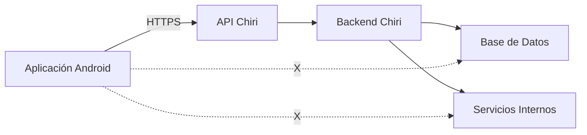
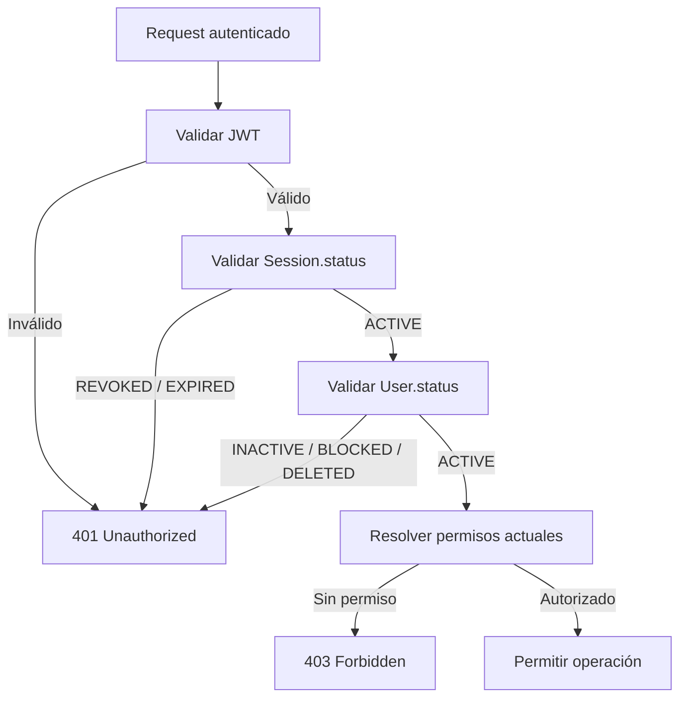

# 070_Seguridad.md

# Arquitectura de Seguridad Chiri Platform v1.0

## 1. Objetivo

Definir la arquitectura de seguridad transversal de Chiri Platform v1.0, estableciendo los mecanismos necesarios para proteger:

* Identidad de usuarios.
* Acceso a funcionalidades.
* Comunicación entre componentes.
* Información almacenada.
* Operaciones críticas del sistema.

La seguridad forma parte de la arquitectura base y aplica a:

* Aplicación Android.
* API.
* Backend.
* Base de Datos.
* Servicios internos.

---

# 2. Principios de Seguridad

## 2.1 Seguridad por diseño

Chiri Platform incorpora seguridad desde la definición arquitectónica.

Principios:

* Mínimo privilegio.
* Validación en todos los niveles.
* Separación de responsabilidades.
* Protección de información sensible.
* Auditoría de operaciones importantes.

---

## 2.2 No confianza en clientes externos

La aplicación Android es un cliente del sistema.

El Backend siempre debe validar:

* Identidad.
* Permisos.
* Datos recibidos.
* Reglas de negocio.

Nunca se debe asumir que la información enviada desde un cliente es confiable.

---

# 3. Límites de Confianza y Acceso a Infraestructura

Chiri Platform deberá aplicar una separación clara entre:

* Clientes externos.
* API Chiri.
* Backend.
* Base de Datos.
* Servicios internos.
* Infraestructura.

Los clientes externos no deberán acceder directamente a servicios internos.

La única entrada autorizada desde clientes hacia la plataforma será la API
Chiri mediante HTTPS.

Los servicios internos deberán permanecer aislados de los clientes.

Ejemplo:



---

## 3.1 Regla de No Acceso Directo

Ningún cliente externo deberá acceder directamente a:

* Base de Datos.
* Servicios internos.
* Contenedores Docker.
* APIs administrativas.
* Puertos internos.
* Interfaces de administración.
* Dispositivos de infraestructura.

El acceso deberá realizarse mediante las interfaces autorizadas de Chiri.

---

## 3.2 Separación de Redes

La infraestructura interna deberá mantenerse separada de los
clientes externos.

La exposición de un servicio interno no deberá considerarse un
mecanismo válido de integración con Android.

---

## 3.3 Principio de Mínima Exposición

Todo servicio deberá exponer únicamente los puertos, interfaces y
funcionalidades estrictamente necesarios.

Los servicios que no requieran acceso externo no deberán exponerse
directamente a Internet.

---

# 4. Modelo General de Seguridad

La seguridad de Chiri Platform deberá establecer un conjunto coherente de principios, controles y reglas arquitectónicas destinados a proteger la plataforma, sus componentes, sus comunicaciones, sus datos y los servicios integrados.

El modelo de seguridad deberá aplicarse de forma transversal a los componentes de la plataforma y deberá mantenerse alineado con la arquitectura definida en los documentos anteriores.

La seguridad deberá considerar especialmente:

* identidad y acceso;
* comunicaciones;
* protección de datos;
* aplicaciones y APIs;
* servicios internos;
* infraestructura;
* auditoría y monitoreo;
* gestión de vulnerabilidades;
* respuesta ante incidentes.

Las medidas de seguridad deberán seguir el principio de **defensa en profundidad**, evitando depender de un único mecanismo de protección.

La seguridad deberá integrarse desde el diseño de la plataforma y mantenerse durante todo su ciclo de vida.

---

# 4.1 Zonas de Confianza y Fronteras de Seguridad

Chiri Platform deberá considerar diferentes zonas de confianza según el nivel de exposición y responsabilidad de cada componente.

Las principales zonas de confianza serán:

* **Cliente:** dispositivos utilizados para acceder a la plataforma.
* **API:** punto de entrada a los servicios de Chiri Platform.
* **Backend:** componentes que ejecutan la lógica de negocio.
* **Datos:** Base de Datos y sistemas que almacenan información de la plataforma.
* **Servicios internos:** servicios integrados que proporcionan funcionalidades a Chiri Platform.
* **Administración e infraestructura:** componentes utilizados para administrar y mantener la plataforma.

La comunicación entre zonas deberá considerarse una **frontera de seguridad**.

Ninguna zona deberá considerarse automáticamente confiable únicamente por pertenecer a la infraestructura interna.

El acceso entre zonas deberá estar sujeto a los mecanismos de autenticación, autorización, validación y protección de comunicaciones que correspondan.

Los servicios internos deberán utilizar permisos mínimos y únicamente deberán acceder a los recursos necesarios para cumplir su función.

Los componentes expuestos a redes externas deberán disponer de controles adicionales respecto de los componentes que no estén directamente expuestos.

### Regla arquitectónica

> **Toda comunicación entre zonas de confianza deberá considerarse una frontera de seguridad y deberá estar protegida mediante los controles correspondientes al nivel de riesgo y exposición.**

---

# 4.2 Principio de Mínimo Privilegio

Chiri Platform deberá aplicar el principio de **mínimo privilegio** a usuarios, aplicaciones, servicios, procesos y componentes de infraestructura.

Cada identidad deberá disponer únicamente de los permisos necesarios para realizar las funciones que le correspondan.

Los permisos deberán definirse de acuerdo con:

* función;
* responsabilidad;
* recurso;
* operación;
* contexto de acceso.

Los usuarios no deberán disponer de permisos administrativos salvo cuando sean necesarios para realizar funciones específicas de administración.

Los servicios internos deberán utilizar identidades independientes y permisos limitados a los recursos que necesiten.

El Backend no deberá utilizar credenciales con privilegios superiores a los necesarios para ejecutar sus funciones.

El acceso a la Base de Datos deberá limitarse a las operaciones requeridas por cada componente.

Las cuentas y credenciales utilizadas para administración deberán mantenerse separadas de las utilizadas por los servicios de ejecución normal.

Los permisos deberán revisarse cuando cambien las responsabilidades, componentes o necesidades de acceso.

Los privilegios que ya no sean necesarios deberán eliminarse.

### Regla arquitectónica

> **Todo usuario, servicio o componente de Chiri Platform deberá disponer únicamente de los privilegios necesarios para cumplir su función.**

---

# 4.3 Autenticación

Chiri Platform deberá disponer de mecanismos de autenticación que permitan verificar de forma segura la identidad de los usuarios y componentes que soliciten acceso a recursos protegidos.

La autenticación deberá aplicarse antes de permitir el acceso a recursos que requieran identidad.

Los mecanismos de autenticación deberán:

* proteger las credenciales durante su transmisión;
* evitar el almacenamiento de credenciales en texto plano;
* limitar los intentos de autenticación cuando exista riesgo de abuso;
* permitir la invalidación de credenciales comprometidas;
* utilizar mecanismos adecuados al tipo de cliente y servicio;
* mantener separadas las funciones de autenticación y autorización.

Las contraseñas de los usuarios deberán almacenarse utilizando **Argon2id**.

Las contraseñas nunca deberán almacenarse en texto plano ni deberán incluirse en tokens, registros de aplicación, registros de auditoría o mensajes de error.

La autenticación de servicios internos deberá utilizar identidades y credenciales independientes de las cuentas de usuario.

Las credenciales utilizadas por servicios deberán disponer únicamente de los privilegios necesarios para su función.

Los mecanismos de autenticación deberán considerar la protección contra:

* fuerza bruta;
* reutilización indebida de credenciales;
* robo de credenciales;
* uso de credenciales comprometidas;
* ataques automatizados.

Las credenciales o mecanismos de autenticación que se consideren comprometidos deberán poder ser invalidados o reemplazados.

## 4.3.1 Activación de Cuenta

Los usuarios registrados mediante correo electrónico deberán permanecer en estado **INACTIVE** hasta completar correctamente el proceso de activación.

La activación deberá realizarse mediante un enlace enviado al correo electrónico registrado.

El enlace de activación deberá utilizar un token de un solo uso con una duración máxima de **48 horas**.

Durante la activación, el usuario deberá establecer su contraseña inicial.

La activación exitosa deberá:

* verificar el token;
* establecer la contraseña;
* cambiar el estado del usuario de `INACTIVE` a `ACTIVE`;
* invalidar el token de activación.

La activación de la cuenta **no deberá crear automáticamente una sesión**.

Después de activar correctamente la cuenta, el usuario deberá realizar el proceso normal de inicio de sesión.

### Regla arquitectónica

> **Una cuenta nueva no podrá utilizar recursos protegidos hasta completar correctamente la activación mediante el correo electrónico registrado.**

# 4.4 Autorización

Chiri Platform deberá controlar el acceso a recursos y operaciones mediante mecanismos de autorización.

La autorización deberá determinar qué acciones puede realizar una identidad autenticada sobre un recurso determinado.

La autorización deberá considerar, según corresponda:

* identidad;
* rol;
* permisos;
* recurso;
* operación;
* contexto de acceso.

La autenticación no deberá implicar automáticamente autorización para acceder a todos los recursos de la plataforma.

Los permisos deberán asignarse mediante el principio de mínimo privilegio.

Las operaciones administrativas deberán disponer de controles adicionales respecto de las operaciones normales de usuario.

El Backend deberá validar los permisos antes de ejecutar operaciones que requieran autorización.

La API no deberá confiar únicamente en controles realizados por el cliente.

Los controles de autorización deberán aplicarse en el servidor y deberán mantenerse independientes de la interfaz utilizada para acceder a la plataforma.

Los cambios de privilegios deberán quedar sujetos a controles adecuados y no deberán permitir escalada de privilegios no autorizada.

Los accesos que ya no estén autorizados deberán ser rechazados aunque la identidad continúe autenticada.

Los **roles y permisos no deberán formar parte del Access Token**.

Los permisos deberán resolverse utilizando el estado actual de la identidad y sus relaciones de autorización.

Los cambios de roles o permisos deberán tener efecto inmediato sobre las sesiones existentes.

La primera implementación de Chiri Platform no utilizará una caché de permisos.

**PostgreSQL será la fuente de verdad para los permisos.**

La incorporación futura de mecanismos de caché deberá disponer de mecanismos explícitos de invalidación y no deberá permitir que permisos revocados continúen activos más allá del período definido por la arquitectura.

## 4.4.1 Códigos de Autenticación y Autorización

Chiri Platform utilizará los códigos HTTP `401 Unauthorized` y `403 Forbidden` de acuerdo con la naturaleza del rechazo.

### HTTP 401 Unauthorized

Se utilizará `401 Unauthorized` cuando la autenticación no sea válida o no exista una sesión válida.

Entre las condiciones que deberán producir `401` se encuentran:

* token ausente;
* token inválido;
* token expirado;
* firma inválida;
* `kid` desconocido o inválido;
* `iss` inválido;
* `aud` inválido;
* sesión revocada;
* sesión expirada;
* usuario `INACTIVE`;
* usuario `BLOCKED`;
* usuario `DELETED`.

La respuesta no deberá revelar información interna que permita determinar innecesariamente la causa específica del fallo de autenticación.

### HTTP 403 Forbidden

Se utilizará `403 Forbidden` cuando la identidad esté correctamente autenticada y la sesión sea válida, pero la operación solicitada no esté autorizada.

La respuesta deberá utilizar un mensaje genérico.

Ejemplo:

```json
{
  "success": false,
  "error": {
    "code": "ERR_AUTH_003",
    "message": "Permisos insuficientes"
  }
}
````

La respuesta no deberá revelar:

* el permiso específico que falta;
* los roles del usuario;
* los permisos disponibles;
* la estructura interna del sistema de autorización.

La información detallada necesaria para auditoría podrá registrarse internamente sin exponerse al cliente.

### Regla arquitectónica

> **Toda operación protegida de Chiri Platform deberá ser autorizada en el servidor antes de ejecutarse, utilizando los permisos vigentes de la identidad independientemente del cliente que origine la solicitud.**

````

### Importante

Hay una cosa que **no debemos cambiar todavía**: los estados:

```text
INACTIVE
BLOCKED
DELETED
````

y:

```text
REVOKED
EXPIRED
```

Los estamos usando de forma coherente con las decisiones tomadas, pero antes de cerrar `070` los voy a contrastar con **`050_BaseDatos.md` + modelo SQLAlchemy + migraciones**, para asegurarnos de que los nombres coinciden exactamente con la implementación.

Y mantenemos la decisión ya aprobada:

```text
JWT
 ├── identidad
 ├── jti
 ├── kid
 ├── iss
 ├── aud
 └── sesión

JWT
 └── ❌ NO roles
 └── ❌ NO permisos

PostgreSQL
 └── fuente de verdad de autorización
```

# 4.5 Protección de Comunicaciones

Las comunicaciones de Chiri Platform deberán protegerse contra interceptación, modificación, suplantación y acceso no autorizado.

Las comunicaciones que transporten información sensible, credenciales, tokens o información de autenticación deberán utilizar mecanismos de protección adecuados.

Las comunicaciones externas deberán utilizar **HTTPS mediante TLS**.

Los certificados utilizados para proteger las comunicaciones deberán mantenerse válidos y gestionarse de forma adecuada.

Las comunicaciones entre componentes internos deberán protegerse de acuerdo con el nivel de confianza y riesgo existente.

El hecho de que dos componentes pertenezcan a la misma red no deberá considerarse suficiente para establecer confianza automática.

Las comunicaciones entre:

* Cliente y API;
* API y Backend;
* Backend y Base de Datos;
* Backend y servicios internos;
* componentes administrativos;

deberán utilizar mecanismos de autenticación y protección adecuados cuando el riesgo lo requiera.

Los servicios publicados hacia redes externas deberán disponer de controles adicionales de protección y no deberán exponerse directamente más allá de lo necesario.

Los mecanismos utilizados para publicar servicios externamente, incluidos proxies o túneles, deberán considerarse parte de la frontera de seguridad y no deberán sustituir los mecanismos propios de autenticación y autorización de Chiri Platform.

Las comunicaciones deberán limitarse a los puertos, protocolos y destinos necesarios para el funcionamiento de cada componente.

### Regla arquitectónica

> **Toda comunicación que atraviese una frontera de seguridad deberá utilizar mecanismos adecuados de protección, autenticación y control de acceso según su nivel de riesgo.**

---

# 4.6 Protección de Datos

Chiri Platform deberá proteger la información almacenada, procesada y transmitida por sus componentes durante todo su ciclo de vida.

La protección de los datos deberá considerar:

* confidencialidad;
* integridad;
* disponibilidad;
* control de acceso;
* almacenamiento;
* transmisión;
* respaldo;
* eliminación.

La información deberá clasificarse de acuerdo con su nivel de sensibilidad y los controles deberán aplicarse proporcionalmente al riesgo.

Los datos sensibles o confidenciales deberán disponer de controles de acceso adecuados y no deberán exponerse a componentes que no los necesiten.

La Base de Datos deberá estar protegida mediante autenticación, autorización y mínimo privilegio.

Las credenciales, tokens, claves y secretos no deberán almacenarse como datos ordinarios de la aplicación ni incluirse en código fuente, repositorios o registros de aplicación.

Los datos sensibles transmitidos entre componentes deberán utilizar canales protegidos.

## 4.6.1 Protección de Credenciales y Tokens

Las contraseñas de usuario deberán almacenarse únicamente mediante mecanismos de hash seguros definidos por la arquitectura, utilizando **Argon2id**.

Las contraseñas nunca deberán almacenarse en texto plano.

No deberán almacenarse en registros de aplicación o auditoría:

* contraseñas;
* `password_hash`;
* Access Tokens completos;
* Refresh Tokens completos;
* claves privadas;
* secretos;
* credenciales;
* valores de autenticación completos.

Los tokens deberán considerarse información sensible durante todo su ciclo de vida.

Los Access Tokens y Refresh Tokens no deberán incluirse en:

* logs;
* mensajes de error;
* URLs;
* parámetros de consulta;
* documentación;
* código fuente;
* repositorios.

Los datos de autenticación deberán limitarse a los componentes que realmente necesiten procesarlos.

## 4.6.2 Protección de Datos de Auditoría

Los registros de aplicación y auditoría deberán contener únicamente la información necesaria para cumplir su finalidad operativa, de seguridad y trazabilidad.

Los eventos de auditoría no deberán almacenar información sensible innecesaria.

Los intentos fallidos de autenticación no deberán almacenar el username en texto plano.

Cuando sea necesario correlacionar intentos de autenticación, se utilizará un identificador derivado mediante HMAC-SHA-256:

```text
username_hash = HMAC-SHA-256(username, audit_secret)
````

El secreto utilizado para generar `username_hash` deberá mantenerse protegido y separado del código fuente y de los registros.

Los registros relacionados con cambios de correo electrónico no deberán almacenar directamente:

* correo electrónico anterior;
* correo electrónico nuevo;
* tokens completos de verificación;
* tokens completos de cambio de correo;
* secretos.

La información necesaria para establecer trazabilidad deberá registrarse mediante identificadores y metadatos adecuados, evitando almacenar valores sensibles innecesarios.

## 4.6.3 Protección de Datos de Sesión

Las sesiones deberán considerarse información sensible.

Los identificadores de sesión podrán almacenarse en la Base de Datos cuando sean necesarios para administrar su ciclo de vida.

Los Refresh Tokens no deberán almacenarse en texto plano cuando la implementación permita utilizar una representación protegida o derivada.

La información de sesión deberá estar protegida mediante controles de acceso y mínimo privilegio.

Los cambios de estado de una sesión deberán mantener trazabilidad suficiente para permitir la investigación de eventos de seguridad relevantes.

## 4.6.4 Protección de Datos Locales

Los datos sensibles almacenados localmente en dispositivos cliente deberán limitarse a los estrictamente necesarios para el funcionamiento de la aplicación.

La aplicación Android deberá utilizar mecanismos de almacenamiento seguro proporcionados por la plataforma para proteger credenciales, tokens y demás información sensible.

Los datos sensibles no deberán almacenarse mediante mecanismos destinados a información no protegida.

La eliminación de una sesión deberá eliminar o invalidar los datos locales asociados que ya no sean necesarios.

## 4.6.5 Protección de Respaldos

Los respaldos deberán considerarse parte de la superficie de seguridad de Chiri Platform.

Los respaldos que contengan información sensible deberán disponer de:

* control de acceso;
* protección durante la transferencia;
* protección durante el almacenamiento;
* mecanismos de recuperación controlados.

El acceso a los respaldos deberá limitarse a las identidades que realmente necesiten realizar operaciones de respaldo o recuperación.

Los respaldos no deberán exponerse directamente a redes externas sin mecanismos adecuados de protección.

Los procedimientos de restauración deberán mantener los controles de seguridad aplicables a los datos originales.

## 4.6.6 Eliminación de Datos

Los datos que ya no sean necesarios deberán eliminarse o gestionarse de acuerdo con las políticas definidas para la plataforma.

La eliminación de información sensible deberá realizarse de manera que evite su exposición posterior cuando sea técnicamente posible.

Cuando una cuenta o recurso sea eliminado, deberán considerarse también los datos relacionados que ya no sean necesarios, incluyendo:

* información de sesiones;
* tokens;
* datos temporales;
* información sensible asociada.

Los registros de auditoría necesarios para seguridad, trazabilidad o cumplimiento deberán conservarse de acuerdo con la política de retención definida para la plataforma.

### Regla arquitectónica

> **Los datos de Chiri Platform deberán protegerse durante su almacenamiento, procesamiento, transmisión, respaldo y eliminación, aplicando controles proporcionales a su sensibilidad y riesgo y evitando almacenar información sensible innecesaria.**

# 4.7 Gestión de Sesiones y Tokens

Chiri Platform deberá gestionar de forma segura las sesiones y los mecanismos utilizados para mantener el estado de autenticación de los usuarios.

Los tokens y demás identificadores de sesión deberán considerarse información sensible.

Su gestión deberá contemplar:

* generación segura;
* almacenamiento protegido;
* transmisión segura;
* expiración;
* renovación;
* invalidación;
* revocación cuando corresponda.

Los tokens no deberán incluirse en:

* código fuente;
* registros de aplicación;
* registros de auditoría;
* mensajes de error;
* URLs cuando exista una alternativa segura;
* repositorios públicos.

El cliente deberá almacenar los tokens utilizando mecanismos apropiados para protegerlos frente al acceso no autorizado.

Los tokens deberán tener una duración limitada y deberán poder invalidarse cuando exista sospecha de compromiso.

La renovación de sesiones deberá realizarse mediante mecanismos controlados y no deberá permitir extender indefinidamente una sesión comprometida.

El servidor deberá validar la vigencia y autenticidad del mecanismo de sesión antes de permitir el acceso a recursos protegidos.

El cierre de sesión deberá invalidar la sesión y los mecanismos de renovación asociados.

Las sesiones administrativas deberán disponer de controles de seguridad adicionales cuando el nivel de riesgo lo requiera.

## 4.7.1 Modelo de Sesión

Cada sesión de usuario deberá mantenerse como una entidad independiente y deberá disponer de un identificador único.

La sesión deberá estar asociada a:

* usuario;
* fecha de creación;
* fecha de expiración;
* estado;
* información necesaria para auditoría;
* mecanismos de renovación correspondientes.

Los estados mínimos de una sesión serán:

```text
ACTIVE
REVOKED
EXPIRED
```

Una sesión `REVOKED` no podrá utilizarse nuevamente.

Una sesión `EXPIRED` no podrá utilizarse para acceder a recursos protegidos.

La revocación de una sesión deberá invalidar inmediatamente los mecanismos de renovación asociados.

## 4.7.2 Access Token

El Access Token de usuario será un **JWT** firmado mediante **RS256**.

La clave privada utilizada para firmar los JWT deberá utilizar RSA de **3072 bits**.

El Access Token tendrá una duración máxima de **15 minutos**.

El JWT deberá contener como mínimo los claims necesarios para identificar y validar la sesión, incluyendo:

* `jti`;
* `kid`;
* `iss`;
* `aud`;
* `iat`;
* `exp`;
* identificador del usuario;
* identificador de la sesión.

El servidor deberá validar como mínimo:

* firma criptográfica;
* `kid`;
* `iss`;
* `aud`;
* `iat`;
* `exp`.

Los valores oficiales serán:

```text
iss = chiri-platform
aud = chiri-api
```

Los roles y permisos **no deberán formar parte del Access Token**.

El Access Token no deberá utilizarse como fuente de verdad para determinar los permisos actuales del usuario.

### Regla arquitectónica

> **El Access Token será un mecanismo de autenticación de corta duración y no deberá contener información de autorización que pueda quedar obsoleta durante la vida de la sesión.**

## 4.7.3 Identificador de Token

Cada Access Token deberá disponer de un identificador único mediante el claim:

```text
jti
```

El `jti` permitirá identificar individualmente un token cuando sea necesario para trazabilidad, auditoría o investigación de incidentes.

El `jti` no deberá utilizarse como mecanismo permanente de almacenamiento de Access Tokens.

Chiri Platform no utilizará una blacklist permanente de `jti` para Access Tokens en la versión inicial.

## 4.7.4 Identificador de Clave

Cada Access Token deberá incluir el identificador:

```text
kid
```

El `kid` permitirá determinar qué clave pública corresponde a la clave utilizada para firmar el token.

Las claves privadas y públicas deberán administrarse como pares de claves correspondientes.

La clave privada utilizada para firmar tokens deberá mantenerse protegida y nunca deberá exponerse a clientes.

## 4.7.5 Distribución de Claves Públicas

Las claves públicas utilizadas para validar Access Tokens deberán publicarse mediante un endpoint JWKS.

Endpoint:

```text
GET /.well-known/jwks.json
```

El endpoint JWKS podrá publicar únicamente información correspondiente a claves públicas.

Nunca deberá exponer:

* claves privadas;
* secretos;
* credenciales;
* Refresh Tokens.

El conjunto JWKS deberá contener las claves públicas necesarias para validar los tokens actualmente válidos y, durante las rotaciones, las claves anteriores que todavía deban utilizarse para validación.

## 4.7.6 Rotación de Claves JWT

Las claves utilizadas para firmar Access Tokens deberán rotarse periódicamente.

La política inicial será:

```text
Rotación programada: cada 90 días
```

Durante una rotación podrán existir simultáneamente:

```text
clave anterior → validación temporal
clave actual   → firma de nuevos tokens
```

La clave anterior deberá mantenerse disponible durante un período de gracia suficiente para validar tokens legítimos que todavía se encuentren dentro de su período de vigencia.

Una vez finalizado el período de gracia, la clave anterior podrá retirarse del conjunto JWKS.

La rotación no deberá provocar la invalidación innecesaria de tokens legítimos que todavía se encuentren dentro de su período de vigencia.

La clave privada anterior deberá retirarse de los mecanismos activos de firma cuando finalice su período de uso.

### Regla arquitectónica

> **La rotación de claves deberá permitir continuar validando tokens legítimos durante el período de transición sin permitir que una clave retirada continúe utilizándose indefinidamente.**

## 4.7.7 Refresh Token

El Refresh Token tendrá una duración máxima de **30 días**.

El Refresh Token deberá estar asociado a una sesión concreta.

El servidor deberá validar:

* autenticidad;
* vigencia;
* sesión asociada;
* usuario asociado;
* estado de la sesión;
* estado del usuario.

Los Refresh Tokens deberán poder ser revocados inmediatamente.

El cierre de sesión deberá provocar:

```text
Session
    ↓
REVOKED
    ↓
Refresh Token
    ↓
INVÁLIDO
```

Los Refresh Tokens no deberán registrarse completos en logs o auditorías.

Cuando sea técnicamente posible, el servidor deberá almacenar una representación protegida del Refresh Token en lugar del valor utilizable directamente.

## 4.7.8 Revocación de Access Tokens

Chiri Platform **no utilizará una blacklist de Access Tokens** en la versión inicial.

Los Access Tokens tendrán una duración máxima de 15 minutos.

La validez criptográfica del JWT no será suficiente para autorizar una solicitud.

El Backend deberá comprobar además:

* estado de la sesión;
* estado del usuario;
* permisos actuales cuando la operación requiera autorización.

De esta forma, una sesión revocada o un usuario bloqueado podrán impedir inmediatamente el acceso aunque exista un Access Token que todavía no haya alcanzado su fecha de expiración.

La revocación de un Access Token individual no requerirá almacenar permanentemente una blacklist.

### Regla arquitectónica

> **Chiri Platform utilizará Access Tokens de corta duración y no mantendrá una blacklist permanente de JWT; la revocación efectiva se realizará mediante el estado de la sesión y del usuario.**

## 4.7.9 Validación de Sesión

En cada solicitud autenticada, el Backend deberá validar:

* autenticidad del JWT;
* firma;
* `kid`;
* `iss`;
* `aud`;
* `iat`;
* `exp`;
* `Session.status`;
* `User.status`.

Una sesión con estado:

```text
REVOKED
EXPIRED
```

no podrá utilizarse para acceder a recursos protegidos.

Un usuario con estado:

```text
INACTIVE
BLOCKED
DELETED
```

no podrá utilizar una sesión para acceder a recursos protegidos.

Los cambios de estado de sesión o usuario deberán tener efecto inmediato sobre las solicitudes posteriores.

### Flujo conceptual



## 4.7.10 Cierre de Sesión

El cierre de sesión deberá invalidar la sesión correspondiente.

Como consecuencia:

```text
Session.status
    ↓
REVOKED
```

y el Refresh Token asociado deberá dejar de ser utilizable.

El Access Token que ya haya sido emitido no será añadido a una blacklist.

Las solicitudes posteriores deberán ser rechazadas mediante la validación del estado de la sesión.

## 4.7.11 Revocación Global de Sesiones

Las operaciones que requieran revocación global de acceso deberán poder invalidar todas las sesiones activas de un usuario.

Esto deberá aplicarse, como mínimo, cuando corresponda a:

* bloqueo de usuario;
* desactivación de usuario;
* eliminación de usuario;
* compromiso de credenciales;
* cambio de contraseña cuando la política de seguridad lo requiera;
* acción administrativa explícita de revocación global.

El proceso será conceptualmente:

```text
User
 ↓
cambio de estado / evento de seguridad
 ↓
revocar sesiones activas
 ↓
Session.status = REVOKED
 ↓
Refresh Tokens inválidos
 ↓
siguientes solicitudes → 401
```

## 4.7.12 Autorización y Permisos

Los roles y permisos no deberán almacenarse dentro del Access Token.

Los permisos deberán resolverse utilizando el estado actual del usuario y sus relaciones de autorización.

Los cambios de roles o permisos deberán tener efecto inmediato sobre las sesiones existentes.

La primera implementación no utilizará una caché de permisos.

**PostgreSQL será la fuente de verdad para los permisos.**

La introducción futura de una caché deberá disponer de mecanismos explícitos de invalidación.

### Regla arquitectónica

> **La autorización deberá utilizar los permisos vigentes en el momento de la solicitud y no deberá depender de información de permisos almacenada previamente dentro del JWT.**

# 4.8 Gestión de Secretos y Credenciales

Chiri Platform deberá proteger las credenciales, claves, tokens, certificados y demás secretos utilizados por sus componentes.

Los secretos deberán mantenerse separados del código fuente y de cualquier configuración que pueda ser distribuida públicamente.

No deberán incluirse secretos reales en:

* repositorios de código;
* archivos de documentación;
* código fuente;
* imágenes de contenedores;
* registros de aplicación;
* archivos compartidos sin protección;
* archivos de configuración destinados a distribución pública.

Los servicios deberán utilizar únicamente las credenciales necesarias para realizar sus funciones.

Las credenciales deberán poder ser reemplazadas cuando exista sospecha de compromiso o cuando sea necesario por razones de seguridad.

Los secretos utilizados por diferentes componentes deberán mantenerse separados cuando sus funciones y niveles de privilegio sean diferentes.

Las claves, certificados y credenciales deberán protegerse mediante mecanismos adecuados al entorno de ejecución.

Los valores utilizados durante el desarrollo deberán mantenerse separados de los utilizados en entornos de ejecución reales.

Cuando un secreto deje de ser necesario, deberá retirarse de los mecanismos activos de configuración y acceso.

La exposición accidental de un secreto deberá considerarse un evento de seguridad y deberá evaluarse su posible reemplazo o revocación.

## 4.8.1 Separación de Secretos

Cada secreto deberá tener una finalidad específica.

No deberá reutilizarse una misma clave o secreto para diferentes funciones de seguridad cuando dichas funciones tengan objetivos o niveles de privilegio diferentes.

Como mínimo, deberán mantenerse separados:

* credenciales de Base de Datos;
* credenciales utilizadas para migraciones;
* clave privada utilizada para firmar JWT;
* secreto HMAC utilizado para auditoría;
* credenciales utilizadas para correo electrónico;
* credenciales de servicios internos;
* otros secretos específicos de cada integración.

La separación deberá limitar el impacto de un posible compromiso de una credencial.

### Regla arquitectónica

> **Un secreto comprometido no deberá proporcionar automáticamente acceso a funciones o componentes independientes.**

## 4.8.2 Configuración de Desarrollo

Durante el desarrollo, los secretos locales podrán gestionarse mediante archivos `.env`.

Los archivos `.env` deberán permanecer fuera del control de versiones.

El repositorio podrá incluir un archivo:

```text
.env.example
````

Este archivo deberá contener únicamente:

* nombres de variables;
* valores de ejemplo;
* placeholders;
* documentación de configuración no sensible.

Nunca deberá contener secretos reales.

Ejemplo:

```text
DATABASE_URL=CHANGE_ME
MIGRATION_DATABASE_URL=CHANGE_ME
AUDIT_HMAC_SECRET=CHANGE_ME
```

Los archivos `.env` reales deberán estar incluidos en las reglas de exclusión correspondientes de Git.

Los secretos de un equipo de desarrollo no deberán copiarse automáticamente al repositorio ni compartirse mediante commits.

### Regla arquitectónica

> **Los secretos utilizados durante el desarrollo deberán permanecer fuera del repositorio y cada entorno de desarrollo deberá disponer de su propia configuración local.**

## 4.8.3 Clave Privada JWT

La clave privada utilizada para firmar los Access Tokens deberá mantenerse protegida y nunca deberá incluirse directamente en:

* código fuente;
* repositorios;
* imágenes Docker;
* documentación;
* logs;
* respuestas de API.

Durante el desarrollo, la clave privada JWT podrá almacenarse como un archivo PEM local protegido.

La ubicación prevista será:

```text
secrets/
└── jwt/
    └── private.pem
```

El archivo deberá permanecer fuera del control de versiones.

La clave deberá utilizar RSA de **3072 bits** y utilizarse con el algoritmo **RS256**.

La aplicación deberá cargar la clave mediante configuración segura y no deberá contener la clave privada embebida en el código fuente.

La clave privada nunca deberá exponerse a:

* aplicación Android;
* clientes externos;
* servicios que únicamente necesiten validar tokens;
* endpoints HTTP;
* JWKS.

La clave pública correspondiente podrá distribuirse mediante los mecanismos definidos en la sección de gestión de JWKS.

## 4.8.4 Gestión de Claves JWT en Producción

En producción, la clave privada JWT no deberá formar parte de la imagen Docker ni del repositorio.

La clave privada deberá obtenerse mediante un mecanismo de gestión de secretos apropiado para el entorno de ejecución.

El mecanismo definitivo de producción será un **Secret Manager**.

El servicio de autenticación deberá disponer únicamente del acceso necesario para utilizar la clave privada.

Los demás servicios que únicamente necesiten validar Access Tokens deberán utilizar las claves públicas correspondientes.

La clave privada deberá permanecer aislada de los componentes que no necesiten firmar tokens.

## 4.8.5 Secreto HMAC de Auditoría

El mecanismo utilizado para generar identificadores derivados de auditoría deberá utilizar un secreto independiente.

Para los valores `username_hash` se utilizará:

```text
HMAC-SHA-256(username, audit_secret)
```

El `audit_secret`:

* deberá mantenerse fuera del código fuente;
* no deberá almacenarse en logs;
* no deberá incluirse en auditorías;
* no deberá compartirse con clientes;
* no deberá reutilizarse como clave JWT;
* no deberá reutilizarse como credencial de Base de Datos;
* deberá poder reemplazarse cuando exista sospecha de compromiso.

El secreto HMAC deberá ser independiente de las claves utilizadas para firmar JWT.

## 4.8.6 Credenciales de Base de Datos

Las credenciales utilizadas para acceder a PostgreSQL deberán mantenerse fuera del código fuente.

Las credenciales de ejecución de la aplicación deberán mantenerse separadas de las credenciales utilizadas para realizar migraciones estructurales.

La aplicación deberá utilizar únicamente los privilegios necesarios para sus operaciones normales.

Las credenciales de migración deberán disponer de privilegios superiores únicamente cuando sean necesarios para ejecutar cambios estructurales controlados.

Las credenciales de Base de Datos no deberán:

* aparecer en logs;
* incluirse en mensajes de error;
* incluirse en repositorios;
* incluirse en imágenes Docker;
* exponerse mediante API.

Las credenciales deberán poder rotarse sin modificar el código fuente de la aplicación.

### Regla arquitectónica

> **Las credenciales de ejecución y migración de Base de Datos deberán mantenerse separadas y deberán disponer únicamente de los privilegios necesarios para sus respectivas funciones.**

## 4.8.7 Credenciales de Correo Electrónico

Las credenciales utilizadas para enviar correos electrónicos deberán mantenerse como secretos de configuración.

No deberán incluirse en:

* código fuente;
* repositorios;
* imágenes Docker;
* logs;
* respuestas API.

El servicio encargado del envío de correo deberá disponer únicamente de los permisos necesarios para realizar dicha función.

Las credenciales de correo deberán poder ser reemplazadas sin modificar el código fuente.

## 4.8.8 Secretos de Integraciones y Servicios Internos

Cada integración externa o servicio interno que requiera autenticación deberá utilizar credenciales independientes cuando sea técnicamente posible.

Las credenciales deberán disponer únicamente de los permisos necesarios para la integración correspondiente.

Un secreto utilizado por un servicio no deberá reutilizarse automáticamente para otro servicio.

Las credenciales de servicios internos deberán tratarse como secretos incluso cuando los servicios se encuentren dentro de la red local.

La pertenencia a una red interna no deberá considerarse suficiente para justificar el almacenamiento o distribución insegura de credenciales.

## 4.8.9 Producción y Secret Manager

Los secretos utilizados en producción deberán gestionarse mediante un **Secret Manager** o mecanismo equivalente apropiado para el entorno.

El Secret Manager deberá permitir, según sus capacidades:

* almacenamiento seguro;
* control de acceso;
* separación de secretos;
* rotación;
* revocación;
* auditoría de acceso;
* distribución controlada.

Los secretos de producción no deberán depender de archivos incluidos en el repositorio.

Los secretos tampoco deberán incorporarse permanentemente a imágenes de contenedores.

El proceso de despliegue deberá proporcionar los secretos al componente únicamente durante su ejecución y mediante mecanismos seguros.

### Regla arquitectónica

> **Los secretos de producción deberán permanecer fuera del código, repositorio e imágenes de ejecución y deberán ser proporcionados al servicio mediante mecanismos seguros de gestión de secretos.**

## 4.8.10 Rotación y Revocación

Los secretos deberán poder reemplazarse cuando:

* exista sospecha de compromiso;
* un empleado o servicio deje de necesitarlos;
* cambie el entorno;
* se produzca una migración;
* expire una credencial;
* una política de seguridad lo requiera.

La rotación de un secreto deberá realizarse de forma controlada para evitar interrupciones innecesarias de los servicios.

Las claves JWT deberán seguir además la política específica de rotación definida en la sección `4.7`.

La revocación o sustitución de un secreto comprometido deberá considerarse una acción de respuesta ante incidentes cuando corresponda.

## 4.8.11 Exposición Accidental

La exposición accidental de un secreto deberá considerarse un evento de seguridad.

Ante una exposición deberán evaluarse inmediatamente:

* qué secreto fue expuesto;
* qué componentes podían utilizarlo;
* qué privilegios proporcionaba;
* durante cuánto tiempo estuvo expuesto;
* si pudo ser utilizado;
* si debe revocarse;
* si debe reemplazarse;
* qué registros deben revisarse.

Un secreto que haya sido incluido accidentalmente en un repositorio deberá considerarse comprometido aunque posteriormente sea eliminado del archivo.

La eliminación del secreto del código fuente no deberá considerarse suficiente.

Deberá evaluarse su rotación o revocación.

## 4.8.12 Registros y Diagnóstico

Los logs y mecanismos de diagnóstico deberán evitar la exposición de secretos.

No deberán registrarse directamente:

* passwords;
* password hashes;
* Access Tokens;
* Refresh Tokens;
* claves privadas;
* secretos HMAC;
* credenciales;
* cadenas de conexión completas;
* encabezados `Authorization`;
* cookies de autenticación.

Cuando sea necesario diagnosticar una operación relacionada con un secreto, deberá utilizarse información no sensible o valores truncados/anonimizados que no permitan reconstruir el secreto original.

### Regla arquitectónica

> **Los mecanismos de diagnóstico y registro nunca deberán convertirse en un medio alternativo de exposición de secretos o credenciales.**

### Regla arquitectónica general

> **Los secretos y credenciales de Chiri Platform deberán mantenerse protegidos, separados del código fuente, aislados según su función y gestionados de forma que puedan ser reemplazados o revocados cuando sea necesario.**

# 4.9 Validación y Protección de Entradas

Chiri Platform deberá validar toda información recibida desde clientes, servicios internos, integraciones externas y cualquier otra fuente que pueda influir en el comportamiento de la plataforma.

La validación deberá realizarse en el servidor y no deberá depender exclusivamente de los controles implementados en el cliente.

Las entradas deberán validarse de acuerdo con:

* tipo de dato;
* formato;
* longitud;
* rango permitido;
* valores admitidos;
* estructura esperada;
* contexto de la operación.

Los datos que no cumplan las reglas esperadas deberán rechazarse de forma controlada.

La plataforma deberá protegerse contra entradas diseñadas para provocar:

* inyección de código;
* inyección SQL;
* ejecución de comandos;
* manipulación de consultas;
* acceso no autorizado;
* corrupción de datos;
* consumo excesivo de recursos.

Las consultas a la Base de Datos deberán utilizar mecanismos que separen los datos de las instrucciones de consulta.

Los datos proporcionados por el usuario no deberán utilizarse directamente para construir consultas, comandos o instrucciones ejecutables sin la validación y protección correspondientes.

Las entradas recibidas desde servicios internos o integraciones externas tampoco deberán considerarse confiables automáticamente.

Los mensajes de error generados como consecuencia de entradas inválidas no deberán revelar información interna innecesaria.

### Regla arquitectónica

> **Toda entrada que pueda afectar el comportamiento de Chiri Platform deberá validarse y controlarse en el servidor antes de ser procesada.**

# 4.10 Seguridad de la API

La API de Chiri Platform deberá aplicar controles de seguridad a todas las operaciones que expongan recursos o funcionalidades de la plataforma.

La API deberá:

* autenticar las solicitudes que requieran identidad;
* autorizar cada operación protegida;
* validar las entradas recibidas;
* limitar el acceso a los recursos permitidos;
* proteger las comunicaciones;
* controlar el uso excesivo o abusivo;
* generar respuestas de error controladas;
* evitar la exposición de información sensible.

Los endpoints públicos deberán limitarse a las funcionalidades que realmente necesiten exposición.

Los endpoints administrativos deberán disponer de controles de autorización específicos y no deberán quedar disponibles para usuarios sin los privilegios correspondientes.

La API no deberá confiar en información de autenticación o autorización enviada directamente por el cliente.

Los identificadores, parámetros y datos recibidos mediante solicitudes deberán validarse antes de procesarse.

Las respuestas de la API no deberán incluir información sensible que no sea necesaria para completar la operación solicitada.

Los errores de la API deberán proporcionar información suficiente para identificar el resultado de la operación sin revelar detalles internos innecesarios, credenciales, secretos o información sensible.

Las operaciones que puedan modificar información deberán aplicar controles adecuados de autenticación, autorización, validación y, cuando corresponda, protección contra repetición o abuso.

La API deberá mantener una separación clara entre:

* autenticación;
* autorización;
* validación;
* lógica de negocio;
* acceso a datos.

## 4.10.1 Autenticación de Solicitudes

Las operaciones protegidas deberán requerir un Access Token válido.

El servidor deberá validar como mínimo:

* existencia del token cuando sea requerido;
* estructura del JWT;
* firma RS256;
* `kid`;
* `iss`;
* `aud`;
* `iat`;
* `exp`;
* identificador de usuario;
* identificador de sesión;
* estado actual de la sesión;
* estado actual del usuario.

La validación criptográfica del JWT no será suficiente para autorizar una solicitud.

La sesión y el estado actual del usuario deberán considerarse parte de la decisión efectiva de autenticación.

Una solicitud asociada a una sesión:

```text
REVOKED
EXPIRED
````

deberá rechazarse.

Una solicitud asociada a un usuario:

```text
INACTIVE
BLOCKED
DELETED
```

deberá rechazarse.

## 4.10.2 Autorización de Solicitudes

Las operaciones protegidas deberán comprobar los permisos actuales de la identidad antes de ejecutar la operación.

Los roles y permisos no deberán obtenerse del Access Token.

Los permisos deberán resolverse utilizando el estado actual del usuario y sus relaciones de autorización.

Los cambios de roles o permisos deberán tener efecto inmediato sobre las solicitudes posteriores.

La primera implementación no utilizará una caché de permisos.

PostgreSQL será la fuente de verdad para los permisos.

La API deberá rechazar cualquier operación para la cual la identidad no disponga de autorización suficiente.

## 4.10.3 HTTP 401 Unauthorized

La API deberá utilizar:

```text
401 Unauthorized
```

cuando la solicitud no disponga de una autenticación válida.

Las condiciones que deberán producir `401` incluyen:

* token ausente cuando sea obligatorio;
* token inválido;
* token expirado;
* firma inválida;
* `kid` desconocido o inválido;
* `iss` inválido;
* `aud` inválido;
* `iat` inválido;
* sesión revocada;
* sesión expirada;
* usuario `INACTIVE`;
* usuario `BLOCKED`;
* usuario `DELETED`.

La respuesta deberá evitar revelar información innecesaria sobre la causa específica del fallo.

Ejemplo conceptual:

```json
{
  "success": false,
  "error": {
    "code": "ERR_AUTH_001",
    "message": "Autenticación requerida"
  }
}
```

El mensaje podrá utilizarse para distintos escenarios de autenticación inválida sin revelar información sensible.

## 4.10.4 HTTP 403 Forbidden

La API deberá utilizar:

```text
403 Forbidden
```

cuando la identidad esté correctamente autenticada y la sesión sea válida, pero la operación solicitada no esté autorizada.

Ejemplo:

```json
{
  "success": false,
  "error": {
    "code": "ERR_AUTH_003",
    "message": "Permisos insuficientes"
  }
}
```

La respuesta `403` no deberá revelar:

* el permiso específico que falta;
* los roles del usuario;
* los permisos disponibles;
* la estructura interna del sistema de autorización.

La información detallada necesaria para auditoría podrá registrarse internamente sin exponerse al cliente.

## 4.10.5 Access Token y Refresh Token

La API deberá distinguir claramente entre Access Token y Refresh Token.

El Access Token:

* será un JWT;
* utilizará RS256;
* tendrá una duración máxima de 15 minutos;
* incluirá `kid`;
* incluirá `jti`;
* incluirá `iss`;
* incluirá `aud`;
* estará asociado a una sesión.

El Refresh Token:

* tendrá una duración máxima de 30 días;
* estará asociado a una sesión;
* podrá ser revocado inmediatamente;
* no deberá utilizarse como credencial para acceder directamente a recursos protegidos de la API.

El Refresh Token solamente deberá utilizarse en los mecanismos definidos para renovación de sesión.

Los tokens completos no deberán registrarse en logs ni auditorías.

## 4.10.6 Endpoint de JWKS

La API deberá publicar las claves públicas necesarias para validar Access Tokens mediante:

```text
GET /.well-known/jwks.json
```

El endpoint deberá publicar únicamente claves públicas.

Nunca deberá exponer:

* claves privadas;
* secretos;
* credenciales;
* Refresh Tokens.

El valor `kid` incluido en un JWT deberá permitir seleccionar la clave pública correspondiente.

Durante la rotación de claves, el endpoint JWKS podrá publicar temporalmente más de una clave pública cuando sea necesario para validar tokens legítimos todavía vigentes.

## 4.10.7 Endpoints Públicos

Los endpoints públicos deberán estar explícitamente identificados y deberán limitarse a las operaciones que realmente necesiten estar disponibles sin autenticación.

Los endpoints relacionados con:

* activación de cuenta;
* verificación de correo;
* recuperación de contraseña;
* inicio de sesión;
* renovación de sesión;

deberán aplicar controles específicos contra abuso y automatización.

Los endpoints públicos no deberán proporcionar información que permita enumerar usuarios, cuentas, sesiones u otros recursos protegidos.

## 4.10.8 Protección de Credenciales

La API nunca deberá devolver:

* `password_hash`;
* contraseñas;
* secretos;
* claves privadas;
* credenciales internas;
* Refresh Tokens almacenados;
* información interna innecesaria.

Las respuestas relacionadas con autenticación deberán proporcionar únicamente la información necesaria para que el cliente pueda continuar el flujo correspondiente.

Los mensajes de error deberán evitar revelar si una cuenta específica existe cuando dicha información pueda facilitar enumeración de usuarios.

## 4.10.9 Protección contra Repetición y Abuso

Las operaciones sensibles deberán considerar mecanismos de protección contra repetición, automatización y abuso.

Entre las operaciones que podrán requerir controles adicionales se encuentran:

* inicio de sesión;
* activación de cuenta;
* recuperación de contraseña;
* cambio de contraseña;
* cambio de correo electrónico;
* renovación de sesión;
* operaciones administrativas.

Los tokens de activación, verificación y recuperación deberán ser de un solo uso cuando la operación así lo requiera.

Los límites de solicitudes deberán definirse de acuerdo con el riesgo de cada endpoint.

La API podrá utilizar Redis para implementar mecanismos de rate limiting y protección contra abuso cuando dicho componente forme parte de la infraestructura correspondiente.

## 4.10.10 Auditoría de Operaciones de Seguridad

Las operaciones relevantes de autenticación y seguridad deberán generar eventos de auditoría cuando corresponda.

Entre ellas:

* inicio de sesión exitoso;
* inicio de sesión fallido;
* activación de cuenta;
* verificación de correo;
* cambio de correo;
* recuperación de contraseña;
* cambio de contraseña;
* revocación de sesión;
* revocación global de sesiones;
* cambios de permisos;
* operaciones administrativas relacionadas con seguridad.

Los eventos de auditoría no deberán contener contraseñas, tokens completos, secretos o claves privadas.

## 4.10.11 Errores de la API

Los errores de la API deberán utilizar códigos HTTP coherentes con la naturaleza del problema.

Como mínimo:

```text
400 → solicitud inválida
401 → autenticación inválida o ausente
403 → autenticado pero no autorizado
404 → recurso no encontrado
409 → conflicto de estado o recurso
422 → datos semánticamente inválidos, cuando corresponda
429 → límite de solicitudes excedido
500 → error interno
```

Los códigos concretos podrán ampliarse según las necesidades de cada módulo.

Las respuestas de error deberán mantener un formato consistente con el contrato definido por la API.

Los errores internos no deberán exponer:

* stack traces;
* consultas SQL;
* rutas internas;
* nombres de archivos;
* credenciales;
* secretos;
* configuración interna;
* información de infraestructura.

Los detalles técnicos deberán permanecer en los mecanismos internos de diagnóstico y registro.

## 4.10.12 Separación de Responsabilidades

La API deberá mantener una separación clara entre:

```text
Autenticación
    ↓
Validación de sesión
    ↓
Autorización
    ↓
Validación de entrada
    ↓
Caso de uso
    ↓
Acceso a datos
```

La capa API no deberá convertirse en la autoridad exclusiva de seguridad.

Las reglas de autenticación y autorización deberán mantenerse en las capas correspondientes del Backend y deberán protegerse contra accesos alternativos que intenten omitir la API.

### Regla arquitectónica

> **Toda operación protegida expuesta mediante la API deberá validar la solicitud, autenticar y autorizar al solicitante cuando corresponda, verificar el estado actual de la sesión y del usuario y ejecutar únicamente la operación permitida.**

# 4.11 Seguridad del Backend

El Backend de Chiri Platform deberá aplicar los controles necesarios para proteger la lógica de negocio, los recursos internos y la información procesada por la plataforma.

El Backend deberá:

* validar las solicitudes recibidas;
* aplicar las reglas de autorización;
* proteger la lógica de negocio;
* utilizar únicamente los privilegios necesarios;
* proteger las credenciales y secretos;
* controlar el acceso a recursos internos;
* gestionar los errores de forma segura;
* registrar los eventos de seguridad relevantes.

La lógica de seguridad no deberá depender exclusivamente del cliente.

Las reglas de negocio que impliquen restricciones de acceso deberán validarse en el Backend antes de ejecutar las operaciones correspondientes.

El Backend deberá utilizar cuentas y credenciales con los privilegios mínimos necesarios para acceder a otros componentes.

Los servicios internos utilizados por el Backend deberán autenticarse cuando corresponda y deberán limitar sus permisos al ámbito necesario.

Las excepciones y errores internos no deberán exponer:

* credenciales;
* tokens;
* claves;
* consultas internas;
* rutas sensibles;
* información de infraestructura;
* detalles innecesarios de implementación.

Los componentes del Backend deberán mantenerse actualizados y sus dependencias deberán gestionarse de acuerdo con las políticas de seguridad de la plataforma.

El Backend deberá evitar la ejecución de operaciones con privilegios elevados cuando no sean estrictamente necesarias.

### Regla arquitectónica

> **El Backend deberá aplicar las reglas de seguridad en el servidor y deberá ejecutar cada operación utilizando únicamente los recursos y privilegios necesarios para cumplir su función.**

---

# 4.12 Seguridad de la Base de Datos

La Base de Datos de Chiri Platform deberá protegerse contra acceso no autorizado, modificación indebida, pérdida de información y exposición de datos.

El acceso a la Base de Datos deberá estar limitado a los componentes que realmente lo necesiten.

Las cuentas utilizadas para acceder a la Base de Datos deberán disponer únicamente de los permisos necesarios para sus funciones.

Las credenciales de la Base de Datos deberán mantenerse protegidas y separadas del código fuente.

La Base de Datos no deberá exponerse directamente a redes externas cuando no sea necesario.

El acceso deberá realizarse preferentemente a través de los componentes autorizados de Chiri Platform.

Las operaciones realizadas sobre la Base de Datos deberán respetar las reglas de autorización y seguridad definidas por la plataforma.

Las consultas deberán utilizar mecanismos seguros para evitar inyección y manipulación de instrucciones.

Los datos sensibles deberán protegerse de acuerdo con su nivel de clasificación.

Los respaldos de la Base de Datos deberán considerarse información sensible y deberán disponer de controles de acceso y protección adecuados.

Las operaciones administrativas sobre la Base de Datos deberán mantenerse separadas de las operaciones normales de la aplicación.

Los cambios estructurales o administrativos que puedan afectar la integridad de los datos deberán realizarse mediante procedimientos controlados.

### Regla arquitectónica

> **La Base de Datos deberá permanecer protegida de accesos no autorizados y únicamente los componentes e identidades que necesiten acceso podrán disponer de los privilegios mínimos requeridos.**

---

# 4.13 Seguridad de Servicios Internos

Los servicios internos integrados con Chiri Platform deberán considerarse componentes independientes y no deberán recibir confianza automática por encontrarse dentro de la infraestructura de la plataforma.

Cada servicio deberá disponer únicamente de los accesos necesarios para cumplir su función.

Cuando corresponda, las comunicaciones entre Chiri Platform y los servicios internos deberán utilizar mecanismos de autenticación y protección adecuados.

Los servicios internos deberán:

* limitar los puertos y protocolos utilizados;
* restringir los accesos innecesarios;
* utilizar credenciales independientes;
* proteger sus secretos;
* mantener sus componentes actualizados;
* registrar los eventos de seguridad relevantes.

El acceso desde un servicio interno hacia otro servicio deberá estar limitado al mínimo necesario.

Un compromiso de un servicio interno no deberá proporcionar automáticamente acceso completo al resto de Chiri Platform.

Los servicios integrados que puedan acceder a información sensible deberán recibir permisos proporcionales a la información y operaciones que necesiten.

Los servicios internos no deberán exponer interfaces administrativas o de gestión cuando no sean necesarias para su funcionamiento.

Las integraciones externas deberán considerarse fronteras adicionales de seguridad y deberán validarse las respuestas y datos recibidos antes de utilizarlos.

### Regla arquitectónica

> **Ningún servicio interno deberá considerarse confiable por defecto; cada integración deberá utilizar únicamente los permisos, comunicaciones y recursos necesarios para cumplir su función.**

# 4.14 Seguridad de Android

La aplicación Android de Chiri Platform deberá proteger las credenciales, sesiones, comunicaciones y datos que gestione en el dispositivo.

La aplicación deberá:

* utilizar comunicaciones protegidas con la API;
* proteger los mecanismos de autenticación;
* almacenar de forma segura los tokens y credenciales necesarios;
* validar las respuestas recibidas;
* evitar almacenar información sensible innecesaria;
* evitar exponer información sensible mediante registros;
* mantener sus dependencias actualizadas;
* responder adecuadamente ante la expiración o revocación de sesiones.

La aplicación no deberá contener secretos permanentes que permitan acceder directamente a recursos protegidos de Chiri Platform.

La aplicación no deberá contener:

* claves privadas JWT;
* secretos HMAC;
* credenciales de Base de Datos;
* credenciales de servicios internos;
* credenciales permanentes de backend;
* secretos utilizados por servicios de Chiri Platform.

## 4.14.1 Almacenamiento de Tokens

Los Access Tokens y Refresh Tokens deberán almacenarse utilizando mecanismos seguros proporcionados por Android.

Los tokens no deberán almacenarse mediante mecanismos destinados a información no sensible.

La aplicación no deberá almacenar tokens de autenticación en texto plano mediante:

* archivos de configuración;
* archivos de preferencias no protegidos;
* bases de datos locales sin protección;
* archivos temporales;
* logs.

Los tokens deberán mantenerse únicamente durante el tiempo necesario para cumplir su función.

El Access Token deberá tratarse como una credencial de corta duración.

El Refresh Token deberá considerarse una credencial sensible de mayor duración y deberá recibir protección equivalente o superior.

Los tokens no deberán aparecer en:

* logs;
* URLs;
* parámetros de consulta;
* mensajes de diagnóstico;
* archivos de configuración;
* capturas o mecanismos de depuración no protegidos.

## 4.14.2 Comunicación con la API

Las comunicaciones entre Android y la API deberán utilizar los mecanismos de protección definidos por Chiri Platform.

Las comunicaciones externas deberán utilizar:

```text
HTTPS
TLS
````

La aplicación no deberá enviar credenciales o tokens mediante canales no protegidos.

Los Access Tokens deberán enviarse únicamente mediante los mecanismos de autenticación definidos por la API.

La aplicación no deberá incluir tokens en URLs cuando exista un mecanismo seguro alternativo.

La aplicación deberá validar las respuestas de la API antes de utilizarlas.

Los datos recibidos desde la API no deberán considerarse automáticamente confiables para operaciones sensibles.

## 4.14.3 Autenticación

La aplicación Android deberá utilizar los mecanismos de autenticación definidos por Chiri Platform.

El cliente no deberá implementar mecanismos alternativos que permitan obtener acceso directo a recursos protegidos.

La aplicación no deberá considerar una operación local como evidencia suficiente de que el usuario está autenticado.

La autoridad final para determinar la autenticación será el Backend.

La autoridad final para determinar la autorización será el Backend.

La aplicación podrá mantener un estado local de la sesión únicamente como información de interfaz y funcionamiento, pero dicho estado no deberá sustituir la validación realizada por el servidor.

## 4.14.4 Expiración y Revocación de Sesiones

La aplicación deberá responder correctamente cuando la API indique que una sesión ya no es válida.

Cuando la API responda:

```text
401 Unauthorized
```

por una sesión inválida, expirada o revocada, la aplicación deberá considerar que la sesión local ya no es válida.

Cuando corresponda, la aplicación deberá:

* descartar el Access Token;
* utilizar el Refresh Token únicamente mediante el flujo de renovación autorizado;
* si la renovación falla, descartar el Refresh Token;
* limpiar el estado local de autenticación;
* solicitar nuevamente autenticación al usuario.

La aplicación no deberá intentar reutilizar indefinidamente un token rechazado por el servidor.

La aplicación no deberá ignorar una respuesta `401`.

## 4.14.5 Refresh Token

El Refresh Token deberá utilizarse únicamente para obtener un nuevo Access Token mediante el endpoint de renovación definido por la API.

El Refresh Token no deberá utilizarse para acceder directamente a recursos protegidos.

La aplicación deberá proteger el Refresh Token con mecanismos de almacenamiento seguro proporcionados por Android.

Si el servidor determina que el Refresh Token ya no es válido, la aplicación deberá eliminarlo del almacenamiento local.

El Refresh Token no deberá incluirse en logs, URLs, mensajes de error ni información de diagnóstico.

## 4.14.6 Logout

Cuando el usuario cierre sesión, la aplicación deberá ejecutar el flujo de cierre de sesión definido por la API cuando corresponda.

Después del cierre de sesión, la aplicación deberá:

* eliminar el Access Token local;
* eliminar el Refresh Token local;
* eliminar o invalidar el estado local de autenticación;
* regresar al estado no autenticado.

La aplicación no deberá mantener credenciales de sesión activas después de un cierre de sesión exitoso.

La eliminación local de tokens no sustituye la revocación de la sesión en el servidor.

## 4.14.7 Seguridad de Datos Locales

La aplicación deberá almacenar localmente únicamente los datos necesarios para su funcionamiento.

Los datos sensibles almacenados localmente deberán protegerse de acuerdo con su nivel de sensibilidad.

La aplicación deberá evitar almacenar innecesariamente:

* información de autenticación;
* datos personales sensibles;
* información de sesiones;
* credenciales;
* información de seguridad;
* datos que puedan utilizarse para obtener acceso a recursos protegidos.

Los datos locales que ya no sean necesarios deberán eliminarse.

La información sensible no deberá escribirse en almacenamiento temporal sin protección.

## 4.14.8 Logs y Diagnóstico

La aplicación no deberá registrar información sensible en logs.

No deberán registrarse:

* contraseñas;
* Access Tokens;
* Refresh Tokens;
* encabezados `Authorization`;
* cookies de autenticación;
* claves privadas;
* secretos;
* credenciales;
* información personal sensible innecesaria.

Los logs utilizados durante desarrollo deberán aplicar las mismas reglas de protección y no deberán convertirse en una fuente de exposición de credenciales.

Los mecanismos de depuración deberán deshabilitarse o restringirse adecuadamente en versiones destinadas a producción.

## 4.14.9 Validación de Autorización

La aplicación podrá ocultar o mostrar funcionalidades según el estado conocido del usuario, pero dichas decisiones tendrán únicamente finalidad de interfaz.

La aplicación Android nunca deberá considerarse la autoridad final para determinar si una operación está permitida.

La autorización deberá ser realizada y verificada por el Backend.

Aunque una operación aparezca disponible en la interfaz, el servidor deberá validar nuevamente:

* identidad;
* sesión;
* estado del usuario;
* permisos;
* recurso;
* operación.

Una modificación de permisos en el servidor deberá tener efecto sobre las solicitudes posteriores de la aplicación.

## 4.14.10 Protección de Información Sensible

La aplicación deberá evitar exponer información sensible mediante:

* capturas de pantalla cuando sea técnicamente posible;
* notificaciones;
* logs;
* mensajes de error;
* URLs;
* intents;
* almacenamiento compartido;
* mecanismos de depuración.

Las interfaces que presenten información sensible deberán aplicar las medidas de protección correspondientes al nivel de riesgo.

La aplicación no deberá mostrar al usuario información interna innecesaria sobre:

* Base de Datos;
* Backend;
* infraestructura;
* credenciales;
* secretos;
* mecanismos internos de seguridad.

## 4.14.11 Dependencias y Plataforma

Las dependencias utilizadas por la aplicación Android deberán mantenerse actualizadas de acuerdo con las políticas de seguridad de Chiri Platform.

Las dependencias deberán revisarse ante vulnerabilidades conocidas.

La aplicación deberá utilizar mecanismos de seguridad proporcionados por Android siempre que sean adecuados para la protección de:

* credenciales;
* claves;
* tokens;
* datos locales;
* comunicaciones.

Las configuraciones de desarrollo y producción deberán mantenerse separadas.

### Regla arquitectónica

> **La aplicación Android deberá proteger las credenciales, sesiones y datos locales, pero nunca deberá considerarse la autoridad final para autenticación o autorización de los recursos de Chiri Platform.**

# 4.15 Auditoría y Registro de Seguridad

Chiri Platform deberá mantener mecanismos de registro que permitan identificar y analizar eventos relevantes para la seguridad de la plataforma.

Los registros deberán facilitar:

* detección de actividades anómalas;
* investigación de incidentes;
* seguimiento de accesos;
* análisis de errores de seguridad;
* trazabilidad de operaciones relevantes;
* identificación de cambios relacionados con seguridad;
* correlación de eventos durante una investigación.

Los registros deberán contener únicamente la información necesaria para cumplir su finalidad.

Los registros de seguridad deberán protegerse contra modificación o eliminación no autorizada.

El acceso a los registros deberá estar limitado a las identidades que necesiten consultarlos.

Los registros deberán disponer, cuando sea necesario, de información temporal suficiente para establecer la secuencia de los eventos.

La conservación de registros deberá ser proporcional a las necesidades de seguridad, operación y auditoría de la plataforma.

## 4.15.1 Principios de Auditoría

Los eventos de seguridad deberán registrarse de forma estructurada y consistente.

Cuando corresponda, los eventos deberán permitir identificar:

* qué ocurrió;
* cuándo ocurrió;
* qué identidad estuvo involucrada;
* qué sesión estuvo involucrada;
* desde dónde se originó la operación;
* cuál fue el resultado;
* qué recurso u operación estuvo involucrado.

Los registros deberán utilizar timestamps consistentes y deberán permitir ordenar correctamente los eventos.

Los registros deberán distinguir entre:

* operación exitosa;
* operación rechazada;
* operación fallida;
* operación revocada;
* operación bloqueada.

La auditoría no deberá convertirse en una fuente innecesaria de información sensible.

## 4.15.2 Eventos de Autenticación

Deberán registrarse, cuando corresponda, los eventos relacionados con autenticación.

Como mínimo deberán contemplarse:

```text
LOGIN_SUCCESS
LOGIN_FAILED
````

Los eventos de autenticación deberán permitir detectar:

* accesos exitosos;
* intentos fallidos;
* patrones de fuerza bruta;
* actividad automatizada;
* posibles compromisos de credenciales;
* actividad anómala.

## 4.15.3 LOGIN_SUCCESS

El evento `LOGIN_SUCCESS` podrá contener como mínimo:

```text
timestamp
actor_user_id
target_user_id
session_id
device_id
platform
ip
user_agent
result
```

Cuando un campo no sea aplicable deberá omitirse o utilizarse un valor apropiado definido por el modelo de auditoría.

El evento no deberá contener:

* contraseña;
* `password_hash`;
* Access Token;
* Refresh Token;
* encabezado `Authorization`;
* claves privadas;
* secretos;
* credenciales.

Ejemplo conceptual:

```json
{
  "event": "LOGIN_SUCCESS",
  "timestamp": "2026-08-23T12:00:00Z",
  "actor_user_id": "uuid",
  "target_user_id": "uuid",
  "session_id": "uuid",
  "device_id": "device-id",
  "platform": "android",
  "ip": "192.0.2.10",
  "user_agent": "Chiri/1.0",
  "result": "SUCCESS"
}
```

Los identificadores exactos y el formato definitivo del evento serán establecidos por el modelo de auditoría durante la implementación.

## 4.15.4 LOGIN_FAILED

Los intentos fallidos de autenticación deberán registrarse cuando corresponda.

El evento `LOGIN_FAILED` deberá evitar almacenar el username en texto plano.

Para permitir la correlación de intentos relacionados con el mismo identificador se utilizará:

```text
username_hash = HMAC-SHA-256(username, audit_secret)
```

El `audit_secret` deberá mantenerse protegido y separado del código fuente y de los registros.

El evento podrá contener:

```text
timestamp
username_hash
reason_internal
ip
user_agent
result
```

El campo `reason_internal` podrá utilizar valores internos controlados, por ejemplo:

```text
INVALID_PASSWORD
USER_NOT_FOUND
USER_INACTIVE
USER_BLOCKED
RATE_LIMITED
```

Estos valores internos no deberán exponerse directamente al cliente cuando puedan facilitar enumeración de usuarios o información sobre el estado de las cuentas.

La respuesta de la API deberá utilizar mensajes genéricos para errores de autenticación.

## 4.15.5 Auditoría de Sesiones

Deberán registrarse, cuando corresponda, los eventos relevantes relacionados con el ciclo de vida de las sesiones.

Entre ellos:

```text
SESSION_CREATED
SESSION_REVOKED
SESSION_EXPIRED
SESSION_LOGOUT
SESSION_REVOKED_ALL
```

Los eventos podrán contener:

```text
timestamp
user_id
session_id
device_id
platform
ip
user_agent
result
```

La auditoría deberá permitir determinar cuándo una sesión fue creada, revocada, expirada o cerrada.

Los eventos de revocación global deberán permitir identificar la acción que provocó la invalidación de las sesiones.

## 4.15.6 Auditoría de Activación y Verificación

Deberán registrarse, cuando corresponda, los eventos relacionados con la activación y verificación de cuentas.

Como mínimo podrán contemplarse:

```text
ACCOUNT_ACTIVATION_REQUESTED
ACCOUNT_ACTIVATED
EMAIL_VERIFICATION_REQUESTED
EMAIL_VERIFIED
```

Los eventos deberán permitir establecer la trazabilidad del proceso sin almacenar tokens completos.

No deberán registrarse:

* tokens de activación completos;
* tokens de verificación completos;
* contraseñas;
* secretos.

El evento deberá registrar únicamente identificadores y metadatos necesarios para establecer la trazabilidad.

## 4.15.7 Auditoría de Cambio de Correo

Los cambios de correo electrónico deberán generar eventos de auditoría cuando corresponda.

Como mínimo:

```text
EMAIL_CHANGE_REQUESTED
EMAIL_VERIFIED
EMAIL_CHANGED
```

Los eventos deberán permitir determinar:

* quién inició la operación;
* cuándo se inició;
* cuándo fue verificada;
* cuándo se completó;
* resultado de la operación.

Los registros de auditoría **no deberán almacenar directamente**:

```text
email anterior
email nuevo
```

Tampoco deberán almacenar:

* tokens completos;
* códigos de verificación completos;
* credenciales;
* secretos.

Si fuera necesario correlacionar el proceso, deberán utilizarse identificadores internos o valores derivados mediante mecanismos de protección apropiados.

## 4.15.8 Auditoría de Contraseñas

Deberán registrarse los eventos de seguridad relevantes relacionados con contraseñas sin registrar nunca la contraseña ni su representación utilizable.

Podrán contemplarse:

```text
PASSWORD_SET
PASSWORD_CHANGED
PASSWORD_RESET_REQUESTED
PASSWORD_RESET_COMPLETED
```

Los eventos no deberán contener:

* contraseña;
* `password_hash`;
* tokens completos de recuperación;
* códigos completos de recuperación;
* secretos.

Cuando se produzca una operación que requiera revocación de sesiones, el evento deberá permitir relacionar la operación con la revocación correspondiente.

## 4.15.9 Auditoría de Autorización

Deberán registrarse, cuando corresponda, los eventos relevantes relacionados con autorización.

Podrán contemplarse:

```text
AUTHORIZATION_DENIED
ROLE_ASSIGNED
ROLE_REMOVED
PERMISSION_GRANTED
PERMISSION_REVOKED
```

Los eventos deberán permitir investigar cambios de privilegios y accesos rechazados.

Cuando una operación sea rechazada por falta de permisos, la auditoría interna podrá registrar el permiso o recurso requerido.

Esta información **no deberá exponerse al cliente** cuando pueda facilitar la enumeración de permisos o información interna del sistema.

## 4.15.10 Auditoría Administrativa

Las operaciones administrativas relacionadas con seguridad deberán quedar registradas cuando corresponda.

Podrán incluir:

```text
USER_BLOCKED
USER_UNBLOCKED
USER_DISABLED
USER_ENABLED
USER_DELETED
SESSION_REVOKED
SESSION_REVOKED_ALL
ROLE_ASSIGNED
ROLE_REMOVED
PERMISSION_GRANTED
PERMISSION_REVOKED
```

Los eventos deberán permitir identificar:

* actor administrativo;
* usuario afectado;
* operación realizada;
* fecha y hora;
* resultado;
* información de contexto necesaria.

Las operaciones administrativas no deberán registrar credenciales ni secretos.

## 4.15.11 Auditoría de Seguridad de la API

Los eventos de seguridad relevantes de la API podrán incluir:

```text
AUTHENTICATION_FAILED
AUTHORIZATION_DENIED
RATE_LIMITED
INVALID_TOKEN
SESSION_REVOKED
SECURITY_POLICY_VIOLATION
```

Los registros deberán permitir correlacionar los eventos cuando sea necesario para investigación.

Los errores de seguridad no deberán provocar el almacenamiento automático de:

* tokens completos;
* headers de autenticación completos;
* cookies;
* credenciales;
* secretos.

Cuando sea necesario registrar información de una solicitud, deberán utilizarse identificadores y metadatos limitados.

## 4.15.12 Información de Red y Cliente

Cuando sea necesario para seguridad y auditoría, los eventos podrán contener:

```text
ip
user_agent
platform
device_id
```

El almacenamiento de esta información deberá limitarse a lo necesario para:

* trazabilidad;
* detección de abuso;
* investigación de incidentes;
* correlación de eventos.

La información de red y dispositivo deberá tratarse de acuerdo con las políticas de protección de datos aplicables.

## 4.15.13 Protección de Registros

Los registros de auditoría deberán protegerse contra:

* modificación no autorizada;
* eliminación no autorizada;
* acceso no autorizado;
* exposición innecesaria;
* manipulación de timestamps;
* pérdida de integridad.

El acceso a los registros deberá estar limitado a los componentes e identidades que necesiten utilizarlos.

Los componentes que generen eventos no deberán disponer automáticamente de privilegios administrativos sobre todos los registros históricos.

Cuando sea técnicamente posible, los registros deberán almacenarse de forma que una modificación posterior pueda detectarse.

## 4.15.14 Información que Nunca deberá Registrarse

Chiri Platform no deberá registrar directamente:

* contraseñas;
* `password_hash`;
* Access Tokens completos;
* Refresh Tokens completos;
* claves privadas;
* secretos;
* credenciales;
* encabezados `Authorization` completos;
* cookies de autenticación;
* tokens de activación completos;
* tokens de verificación completos;
* tokens de recuperación completos;
* códigos de recuperación completos;
* cadenas de conexión que contengan credenciales.

La información sensible deberá eliminarse, anonimizarse, derivarse o reemplazarse por identificadores seguros antes de generar el evento de auditoría.

## 4.15.15 Retención de Auditoría

La conservación de registros deberá definirse de acuerdo con:

* necesidades de seguridad;
* investigación de incidentes;
* operación;
* capacidad de almacenamiento;
* requisitos legales aplicables;
* necesidades de trazabilidad.

Los registros deberán conservarse durante el período necesario para cumplir su finalidad.

Los registros que ya no sean necesarios deberán eliminarse de forma controlada.

La eliminación de registros deberá respetar las políticas de seguridad y retención definidas para la plataforma.

## 4.15.16 Correlación de Eventos

Los eventos de seguridad deberán poder correlacionarse mediante identificadores apropiados.

Cuando corresponda, podrán utilizarse:

```text
user_id
session_id
event_id
request_id
device_id
```

Los identificadores de correlación no deberán contener información sensible innecesaria.

La correlación deberá permitir reconstruir una secuencia de eventos sin requerir el almacenamiento de credenciales o tokens completos.

### Ejemplo conceptual

```text
LOGIN_SUCCESS
      ↓
SESSION_CREATED
      ↓
API_REQUEST
      ↓
AUTHORIZATION_DENIED
      ↓
SESSION_REVOKED
```

La implementación deberá permitir relacionar estos eventos cuando formen parte de una misma secuencia de seguridad.

## 4.15.17 Auditoría y Monitorización

Los registros de auditoría deberán poder utilizarse como fuente para mecanismos de monitorización y detección de seguridad.

Los eventos podrán utilizarse para identificar:

* fuerza bruta;
* intentos repetidos de autenticación;
* actividad anómala;
* abuso de recursos;
* cambios inesperados de permisos;
* revocaciones masivas;
* posibles compromisos de credenciales.

La monitorización deberá complementar los registros de auditoría y no deberá sustituirlos.

## 4.15.18 Regla de Minimización

La auditoría deberá registrar suficiente información para permitir trazabilidad e investigación, pero no deberá convertirse en un mecanismo de almacenamiento innecesario de datos personales, credenciales o secretos.

La información registrada deberá ser proporcional al riesgo y finalidad del evento.

### Regla arquitectónica

> **Los eventos relevantes para la seguridad deberán mantener trazabilidad suficiente para permitir su detección, análisis e investigación sin registrar credenciales, tokens completos, secretos ni información sensible innecesaria.**

# 4.16 Monitorización y Detección de Seguridad

Chiri Platform deberá disponer de mecanismos de monitorización que permitan identificar condiciones anómalas, fallos de seguridad y comportamientos que puedan representar un riesgo para la plataforma.

La monitorización deberá considerar, según corresponda:

* disponibilidad de servicios;
* errores de autenticación;
* accesos rechazados;
* cambios administrativos;
* comportamiento anómalo;
* errores críticos;
* consumo anormal de recursos;
* eventos relacionados con seguridad.

Los eventos detectados deberán poder relacionarse con los registros de seguridad cuando sea necesario para su investigación.

La plataforma deberá permitir identificar patrones que puedan indicar:

* intentos de fuerza bruta;
* abuso de recursos;
* accesos no autorizados;
* compromiso de credenciales;
* comportamiento anómalo de servicios;
* fallos repetidos de componentes críticos.

Los mecanismos de monitorización no deberán convertirse en una fuente innecesaria de información sensible.

Las alertas deberán priorizarse de acuerdo con su impacto y riesgo.

Los eventos críticos de seguridad deberán poder generar una alerta o iniciar el procedimiento de respuesta correspondiente.

La monitorización deberá complementar, y no sustituir, los mecanismos de autenticación, autorización y protección de la plataforma.

### Regla arquitectónica

> **Chiri Platform deberá disponer de mecanismos suficientes para detectar eventos y comportamientos que puedan representar un riesgo de seguridad y permitir su posterior análisis y respuesta.**

---

# 4.17 Gestión de Errores y Excepciones

Chiri Platform deberá gestionar los errores y excepciones de forma que no comprometan la seguridad de la plataforma ni expongan información interna innecesaria.

Los errores deberán tratarse de forma controlada en cada componente.

Las respuestas mostradas a usuarios o clientes deberán proporcionar únicamente la información necesaria para identificar el resultado de la operación.

Los mensajes de error no deberán revelar:

* credenciales;
* tokens;
* secretos;
* claves;
* información sensible;
* consultas internas;
* rutas del sistema;
* configuraciones internas;
* detalles innecesarios de infraestructura.

Los errores internos deberán registrarse de forma suficiente para permitir su diagnóstico cuando corresponda, sin almacenar información sensible innecesaria.

Los errores de autenticación y autorización deberán evitar proporcionar información que facilite la enumeración de usuarios, recursos o mecanismos internos.

Una excepción no controlada no deberá permitir que el sistema continúe una operación en un estado inseguro.

Las operaciones que fallen parcialmente deberán mantener la integridad de los datos y evitar estados inconsistentes cuando sea técnicamente posible.

Los errores relacionados con servicios externos o internos deberán gestionarse de forma que un fallo de un componente no provoque automáticamente una pérdida de control de seguridad en otros componentes.

### Regla arquitectónica

> **Los errores y excepciones deberán gestionarse de forma controlada, evitando la exposición de información sensible y evitando que un fallo coloque a Chiri Platform en un estado inseguro.**

# 4.18 Protección contra Abuso y Uso Indebido

Chiri Platform deberá implementar mecanismos destinados a prevenir, detectar y limitar el uso abusivo de sus recursos y funcionalidades.

Las medidas de protección deberán considerar, según el riesgo de cada operación:

* fuerza bruta;
* automatización maliciosa;
* exceso de solicitudes;
* enumeración de usuarios;
* abuso de endpoints públicos;
* consumo excesivo de recursos;
* intentos repetidos de autenticación;
* abuso de mecanismos de recuperación;
* abuso de mecanismos de activación;
* abuso de mecanismos de renovación de sesión;
* operaciones administrativas no autorizadas.

Las medidas contra abuso deberán complementar los mecanismos de autenticación, autorización y validación.

El rate limiting no deberá utilizarse como sustituto de los controles de seguridad fundamentales.

Los límites deberán definirse de acuerdo con la naturaleza y riesgo de cada operación.

## 4.18.1 Protección contra Fuerza Bruta

Los mecanismos de autenticación deberán disponer de protección contra intentos repetidos de contraseña.

La política inicial para el inicio de sesión será:

```text
Máximo de intentos fallidos: 5
Ventana de evaluación: 15 minutos
````

El mecanismo deberá poder considerar como mínimo:

* identidad intentada;
* dirección IP;
* frecuencia de solicitudes.

La protección deberá impedir que un atacante pueda realizar intentos ilimitados sobre una misma cuenta dentro de una ventana de tiempo.

El sistema podrá aplicar restricciones adicionales cuando detecte patrones de abuso.

Los límites deberán aplicarse de forma que no permitan eludir fácilmente la protección cambiando únicamente el origen de las solicitudes.

La respuesta ante un intento bloqueado no deberá revelar información innecesaria sobre la existencia o estado de una cuenta.

## 4.18.2 Rate Limiting

Chiri Platform podrá utilizar mecanismos de rate limiting para limitar la cantidad de solicitudes procesadas por una identidad, dirección IP, dispositivo, sesión u otro identificador apropiado.

La implementación podrá utilizar **Redis** cuando dicho componente forme parte de la infraestructura correspondiente.

Los límites deberán definirse según el riesgo de cada endpoint.

No deberá establecerse un único límite global para todas las operaciones de la API cuando las características de riesgo sean diferentes.

Como mínimo deberán considerarse límites específicos para:

* inicio de sesión;
* activación de cuenta;
* verificación de correo;
* recuperación de contraseña;
* cambio de contraseña;
* cambio de correo electrónico;
* renovación de sesión;
* endpoints públicos;
* operaciones administrativas.

Los límites concretos de operaciones distintas del inicio de sesión deberán definirse antes de implementar cada funcionalidad.

## 4.18.3 Inicio de Sesión

El endpoint de inicio de sesión deberá disponer de protección contra:

* fuerza bruta;
* automatización;
* intentos masivos;
* enumeración de usuarios;
* abuso por dirección IP.

La política inicial será:

```text
5 intentos fallidos
dentro de una ventana de 15 minutos
```

El contador y las restricciones deberán diseñarse de forma que un atacante no pueda eludir fácilmente el mecanismo modificando únicamente la dirección IP.

Cuando se aplique una restricción, la API deberá devolver una respuesta controlada.

Cuando corresponda podrá utilizarse:

```text
429 Too Many Requests
```

La respuesta no deberá indicar información innecesaria sobre la existencia de la cuenta.

## 4.18.4 Endpoints Públicos

Los endpoints que no requieran autenticación deberán disponer de controles específicos contra abuso.

Entre ellos:

* registro de usuario;
* inicio de sesión;
* activación de cuenta;
* verificación de correo;
* recuperación de contraseña;
* renovación de mecanismos de activación;
* otras operaciones públicas definidas por la API.

Los endpoints públicos deberán limitar la cantidad de información que devuelven.

No deberán permitir enumerar usuarios o cuentas mediante diferencias innecesarias en:

* mensajes;
* códigos de error;
* tiempos de respuesta;
* estructuras de respuesta.

Las operaciones públicas deberán disponer de límites de frecuencia apropiados.

## 4.18.5 Protección de Activación de Cuenta

Los mecanismos de activación deberán protegerse contra:

* uso repetido;
* automatización;
* enumeración;
* reutilización de tokens;
* intentos masivos.

Los tokens de activación deberán:

* tener duración limitada;
* ser de un solo uso;
* invalidarse después de una activación exitosa;
* invalidarse cuando corresponda por seguridad.

La duración inicial del token de activación será:

```text
48 horas
```

Las solicitudes repetidas de activación deberán estar sujetas a rate limiting.

El sistema no deberá revelar información innecesaria sobre si una cuenta específica existe.

## 4.18.6 Protección de Verificación de Correo

Los mecanismos de verificación de correo deberán disponer de:

* tokens de duración limitada;
* uso único;
* invalidación después del uso;
* protección contra solicitudes automatizadas.

Los tokens completos no deberán registrarse en logs ni auditorías.

Las solicitudes repetidas deberán estar sujetas a límites de frecuencia.

Las respuestas deberán evitar revelar información innecesaria sobre la existencia de cuentas o direcciones de correo.

## 4.18.7 Recuperación de Contraseña

Los mecanismos de recuperación de contraseña deberán disponer de controles contra abuso y automatización.

El token de recuperación tendrá una duración máxima de:

```text
30 minutos
```

El token deberá:

* ser de un solo uso;
* invalidarse después de utilizarse;
* invalidarse cuando corresponda por seguridad;
* no almacenarse en logs;
* no aparecer en respuestas de diagnóstico.

Las solicitudes de recuperación deberán estar sujetas a rate limiting.

La API deberá utilizar respuestas que no permitan determinar innecesariamente si una dirección de correo está registrada.

Una recuperación de contraseña completada podrá provocar la revocación global de las sesiones existentes de acuerdo con la política de seguridad definida para la cuenta.

## 4.18.8 Cambio de Contraseña

Las operaciones de cambio de contraseña deberán estar protegidas contra:

* automatización;
* repetición;
* abuso;
* uso no autorizado.

El cambio de contraseña deberá requerir una sesión autenticada válida o un mecanismo de recuperación autorizado.

La nueva contraseña deberá almacenarse utilizando **Argon2id**.

Las contraseñas anteriores no deberán almacenarse en texto plano.

Cuando la política de seguridad lo determine, un cambio de contraseña deberá provocar la revocación de las sesiones existentes.

Los eventos de seguridad correspondientes deberán registrarse mediante los mecanismos de auditoría.

## 4.18.9 Cambio de Correo Electrónico

Las operaciones de cambio de correo electrónico deberán estar sujetas a controles adicionales debido a su impacto sobre la identidad de la cuenta.

Deberán contemplarse:

* autenticación de la sesión;
* validación del usuario;
* verificación del nuevo correo;
* token de un solo uso;
* duración limitada del mecanismo de verificación;
* rate limiting;
* auditoría.

El mecanismo de cambio no deberá permitir que una solicitud automatizada modifique repetidamente la dirección asociada a una cuenta.

Los tokens utilizados para verificar el cambio de correo no deberán aparecer en logs.

La política de auditoría deberá registrar el evento sin almacenar directamente el correo anterior ni el nuevo.

## 4.18.10 Renovación de Sesión

El endpoint de renovación de sesión deberá estar protegido contra:

* automatización;
* abuso;
* reutilización indebida de Refresh Tokens;
* solicitudes masivas.

El servidor deberá comprobar:

* Refresh Token;
* sesión;
* usuario;
* estado de la sesión;
* estado del usuario;
* vigencia del mecanismo de renovación.

Un Refresh Token revocado o expirado deberá ser rechazado.

Una sesión revocada no podrá generar nuevos Access Tokens.

Los intentos anómalos de renovación deberán poder registrarse para análisis de seguridad.

## 4.18.11 Protección contra Enumeración

Las funcionalidades relacionadas con identidad deberán evitar revelar información innecesaria sobre la existencia de usuarios.

Esto deberá aplicarse especialmente a:

* inicio de sesión;
* registro;
* recuperación de contraseña;
* activación;
* verificación de correo;
* cambio de correo.

Los mensajes de error deberán utilizar respuestas genéricas cuando la revelación del estado de una cuenta pueda facilitar ataques.

Ejemplo:

```text
No utilizar:
"El usuario no existe"

Preferir:
"Las credenciales o datos proporcionados no son válidos"
```

La implementación deberá considerar también diferencias de comportamiento que puedan permitir enumeración mediante tiempos de respuesta u otras características observables.

## 4.18.12 Protección contra Automatización

Las operaciones sensibles podrán requerir mecanismos adicionales para detectar y limitar automatización.

Los mecanismos podrán incluir:

* rate limiting;
* límites por identidad;
* límites por IP;
* límites por dispositivo;
* restricciones temporales;
* análisis de patrones;
* mecanismos adicionales definidos según el riesgo.

Las medidas deberán aplicarse de forma proporcional y no deberán impedir innecesariamente el uso legítimo de la plataforma.

## 4.18.13 Protección de Recursos

Los endpoints que puedan consumir cantidades significativas de:

* CPU;
* memoria;
* conexiones;
* almacenamiento;
* consultas de Base de Datos;
* ancho de banda;

deberán disponer de límites apropiados.

Las operaciones costosas no deberán poder ejecutarse indefinidamente mediante solicitudes repetidas.

Las operaciones administrativas deberán disponer de límites y controles adecuados a su nivel de privilegio.

## 4.18.14 Respuesta ante Rate Limiting

Cuando una solicitud supere el límite establecido, la API podrá responder:

```text
429 Too Many Requests
```

La respuesta podrá incluir información apropiada para indicar cuándo puede realizarse un nuevo intento.

La respuesta no deberá revelar información interna sobre los mecanismos de protección.

Los mecanismos de rate limiting no deberán exponer:

* credenciales;
* secretos;
* información de usuarios;
* reglas internas sensibles;
* claves utilizadas por los mecanismos de protección.

## 4.18.15 Redis

Redis podrá utilizarse como componente de soporte para:

* rate limiting;
* contadores temporales;
* protección contra fuerza bruta;
* ventanas temporales de solicitudes;
* mecanismos temporales relacionados con abuso.

Redis no será la fuente de verdad para:

* usuarios;
* sesiones persistentes;
* roles;
* permisos;
* credenciales;
* auditoría permanente.

Los datos temporales utilizados para protección contra abuso deberán disponer de expiración apropiada.

La pérdida de Redis no deberá provocar automáticamente una pérdida de la información permanente de identidad o autorización.

Los mecanismos de seguridad deberán definir un comportamiento controlado cuando Redis no esté disponible.

## 4.18.16 Bloqueos Temporales

Los mecanismos de protección podrán aplicar bloqueos temporales cuando se detecten patrones de abuso.

Los bloqueos deberán:

* tener duración limitada;
* poder registrarse para auditoría;
* evitar bloqueos permanentes accidentales;
* poder ser revisados por mecanismos administrativos cuando corresponda.

Los bloqueos temporales derivados de rate limiting no deberán modificar permanentemente el estado del usuario salvo que una política explícita determine lo contrario.

Deberá distinguirse entre:

```text
Rate limit / bloqueo temporal
```

y:

```text
User.status = BLOCKED
```

El primero constituye una medida temporal contra abuso.

El segundo constituye un estado de seguridad de la cuenta y requiere los controles de autorización y revocación definidos para usuarios bloqueados.

## 4.18.17 Auditoría de Abuso

Los eventos relevantes de protección contra abuso deberán registrarse cuando sea necesario.

Podrán incluir:

```text
RATE_LIMITED
BRUTE_FORCE_DETECTED
ACCOUNT_TEMPORARILY_RESTRICTED
SUSPICIOUS_ACTIVITY
```

Los eventos podrán contener:

* timestamp;
* identificador de usuario cuando esté disponible;
* identificador de sesión cuando corresponda;
* IP;
* user_agent;
* endpoint;
* resultado;
* motivo interno.

No deberán registrarse:

* contraseñas;
* Access Tokens completos;
* Refresh Tokens completos;
* secretos;
* claves privadas;
* credenciales.

## 4.18.18 Seguridad por Capas

La protección contra abuso deberá implementarse en varias capas cuando el riesgo lo requiera.

Podrán combinarse:

```text
Cliente
   ↓
API Gateway / Reverse Proxy
   ↓
Rate Limiting
   ↓
Autenticación
   ↓
Autorización
   ↓
Validación
   ↓
Lógica de negocio
   ↓
Base de Datos
```

Ninguna capa individual deberá considerarse suficiente para proteger por sí sola una operación sensible.

## 4.18.19 Valores Iniciales

Los valores aprobados inicialmente para Chiri Platform son:

| Mecanismo              | Valor                    |
| ---------------------- | ------------------------ |
| Login fallido          | 5 intentos               |
| Ventana de login       | 15 minutos               |
| Activation Token       | 48 horas                 |
| Password Reset Token   | 30 minutos               |
| Access Token           | 15 minutos               |
| Refresh Token          | 30 días                  |
| Rate limiting          | Redis cuando corresponda |
| Blacklist Access Token | No                       |

Los límites adicionales de otros endpoints deberán definirse antes de implementar cada funcionalidad y deberán basarse en el riesgo correspondiente.

### Regla arquitectónica

> **Chiri Platform deberá limitar el abuso de sus recursos mediante controles proporcionales al riesgo, combinando rate limiting, protección contra fuerza bruta, límites temporales, controles de identidad y auditoría, sin utilizar estos mecanismos como sustituto de la autenticación o autorización.**

# 4.19 Seguridad de Infraestructura

La infraestructura que soporte Chiri Platform deberá mantenerse protegida frente a accesos no autorizados, configuraciones inseguras y exposición innecesaria.

La infraestructura deberá aplicar, según corresponda:

* mínimo privilegio;
* control de acceso;
* segmentación de servicios;
* actualización de componentes;
* protección de credenciales;
* monitorización;
* registro de eventos relevantes.

Los servicios y puertos que no sean necesarios deberán permanecer deshabilitados o no expuestos.

Los componentes administrativos deberán estar restringidos a las identidades y redes que necesiten utilizarlos.

El acceso administrativo deberá utilizar mecanismos de autenticación adecuados y deberá mantenerse separado del acceso normal de los usuarios.

Los componentes de infraestructura deberán mantenerse actualizados y deberán gestionarse las vulnerabilidades conocidas.

Los contenedores y demás componentes utilizados para ejecutar servicios deberán disponer únicamente de los privilegios y recursos necesarios.

La configuración de infraestructura no deberá contener secretos directamente cuando existan mecanismos adecuados para gestionarlos de forma segura.

Los cambios relevantes de infraestructura deberán realizarse de forma controlada y deberán mantener trazabilidad cuando corresponda.

La exposición externa de servicios deberá limitarse estrictamente a los componentes que necesiten estar disponibles desde redes externas.

### Regla arquitectónica

> **La infraestructura de Chiri Platform deberá aplicar mínimo privilegio, limitar la exposición de servicios y mantener protegidos sus componentes administrativos y de ejecución.**

---

# 4.20 Copias de Seguridad y Recuperación

Chiri Platform deberá disponer de mecanismos de respaldo y recuperación destinados a proteger la disponibilidad e integridad de la información y los componentes críticos.

Los respaldos deberán considerar, según corresponda:

* Base de Datos;
* configuraciones;
* información necesaria para la recuperación de servicios;
* componentes críticos;
* documentación necesaria para reconstruir la plataforma.

Los respaldos deberán protegerse mediante controles de acceso adecuados y deberán considerarse información sensible cuando contengan datos protegidos.

Las copias de seguridad deberán mantenerse separadas de los sistemas principales cuando sea técnicamente posible, reduciendo el riesgo de que un incidente afecte simultáneamente al sistema y sus respaldos.

Deberá verificarse periódicamente que los respaldos puedan utilizarse para recuperar la información y los servicios correspondientes.

Los procedimientos de recuperación deberán considerar:

* integridad de los datos;
* dependencias entre componentes;
* configuración;
* credenciales y secretos necesarios;
* orden de recuperación;
* continuidad de los servicios críticos.

La recuperación no deberá considerarse completada hasta comprobar que los componentes restaurados funcionan correctamente y que los controles de seguridad continúan activos.

Los respaldos que ya no sean necesarios deberán eliminarse de forma controlada.

### Regla arquitectónica

> **Los componentes e información críticos de Chiri Platform deberán disponer de mecanismos de respaldo y recuperación verificables, protegidos mediante controles de seguridad adecuados.**

---

# 4.21 Gestión de Vulnerabilidades

Chiri Platform deberá disponer de un proceso para identificar, evaluar, priorizar y gestionar vulnerabilidades que puedan afectar sus componentes.

La gestión deberá considerar, según corresponda:

* Sistema Operativo;
* Docker;
* imágenes de contenedores;
* Backend;
* API;
* aplicación Android;
* Base de Datos;
* dependencias;
* librerías;
* servicios internos;
* integraciones externas.

Las vulnerabilidades deberán evaluarse considerando, entre otros factores:

* criticidad del componente;
* posibilidad de explotación;
* exposición a redes externas;
* información afectada;
* privilegios requeridos;
* impacto potencial;
* existencia de mitigaciones.

Las vulnerabilidades críticas o que afecten componentes expuestos deberán recibir prioridad.

Cuando exista una actualización segura y compatible, deberá evaluarse su aplicación de acuerdo con el riesgo y el impacto del cambio.

Cuando no exista una corrección disponible o no pueda aplicarse inmediatamente, deberá evaluarse una mitigación temporal.

Las actualizaciones que puedan afectar componentes críticos deberán realizarse de forma controlada y deberán considerar, cuando sea técnicamente posible:

* compatibilidad;
* respaldo;
* posibilidad de reversión;
* dependencias;
* verificación posterior.

Después de una actualización relevante deberá verificarse el funcionamiento del componente y la continuidad de los controles de seguridad.

Las vulnerabilidades pendientes deberán permanecer identificadas y gestionadas hasta su corrección, mitigación o aceptación formal del riesgo.

### Regla arquitectónica

> **Toda vulnerabilidad relevante de Chiri Platform deberá ser identificada, evaluada y gestionada hasta su corrección, mitigación o aceptación formal del riesgo.**

---

# 4.22 Gestión de Incidentes de Seguridad

Chiri Platform deberá disponer de un proceso para detectar, evaluar, contener y resolver incidentes que puedan afectar la seguridad de la plataforma.

Un incidente de seguridad podrá incluir, entre otros:

* acceso no autorizado;
* compromiso de credenciales;
* exposición de información sensible;
* modificación no autorizada de datos;
* compromiso de un servicio;
* actividad maliciosa;
* vulnerabilidad explotada;
* pérdida de disponibilidad causada por un evento de seguridad.

Los incidentes deberán gestionarse de forma ordenada y deberán considerar, según corresponda:

1. detección;
2. identificación;
3. evaluación;
4. contención;
5. erradicación;
6. recuperación;
7. verificación;
8. registro y revisión.

Ante un incidente deberán priorizarse la protección de la información, la contención del impacto y la recuperación segura de los servicios.

Cuando exista sospecha de compromiso de credenciales o secretos, deberán evaluarse su revocación, reemplazo o invalidación.

Los componentes afectados podrán aislarse o limitarse temporalmente cuando sea necesario para evitar la propagación del incidente.

La recuperación de un componente comprometido deberá realizarse únicamente después de evaluar su estado y aplicar las medidas de seguridad necesarias.

Los incidentes relevantes deberán mantener trazabilidad suficiente para permitir su análisis posterior.

Después de un incidente significativo deberá realizarse una revisión para identificar causas, impacto y posibles medidas preventivas.

### Regla arquitectónica

> **Todo incidente de seguridad relevante deberá ser detectado, contenido, analizado y resuelto mediante un proceso controlado que permita recuperar la plataforma de forma segura y reducir la posibilidad de recurrencia.**

---

# 4.23 Continuidad y Recuperación de la Plataforma

Chiri Platform deberá considerar mecanismos que permitan mantener o recuperar sus funciones críticas ante fallos, incidentes de seguridad, pérdida de datos o indisponibilidad de componentes.

La continuidad deberá considerar las dependencias entre:

* aplicación Android;
* API;
* Backend;
* Base de Datos;
* servicios internos;
* infraestructura;
* comunicaciones.

Los componentes críticos deberán disponer de mecanismos de recuperación adecuados a su importancia.

La recuperación deberá realizarse de forma ordenada, considerando las dependencias necesarias para restablecer el funcionamiento de la plataforma.

Después de una recuperación deberá verificarse:

* integridad de los datos;
* disponibilidad de los servicios;
* funcionamiento de las comunicaciones;
* autenticación;
* autorización;
* controles de seguridad.

Los procedimientos de recuperación deberán evitar restaurar componentes o configuraciones que puedan encontrarse comprometidos.

Cuando un incidente de seguridad haya afectado la infraestructura, la recuperación deberá incluir una evaluación previa de las condiciones de seguridad.

La estrategia de continuidad deberá revisarse cuando cambien componentes críticos, dependencias o características relevantes de la plataforma.

### Regla arquitectónica

> **La recuperación de Chiri Platform deberá restablecer los servicios y datos críticos manteniendo su integridad y los controles de seguridad definidos por la arquitectura.**

---

# 4.24 Revisión de Seguridad

La seguridad de Chiri Platform deberá revisarse periódicamente y cuando se produzcan cambios relevantes en la arquitectura, componentes, integraciones o exposición de la plataforma.

Las revisiones deberán considerar, según corresponda:

* autenticación;
* autorización;
* permisos;
* comunicaciones;
* protección de datos;
* sesiones y tokens;
* secretos y credenciales;
* API;
* Backend;
* Base de Datos;
* aplicación Android;
* servicios internos;
* infraestructura;
* vulnerabilidades;
* registros y monitorización;
* respaldos y recuperación.

Las revisiones deberán permitir identificar:

* controles faltantes;
* configuraciones inseguras;
* privilegios innecesarios;
* componentes obsoletos;
* vulnerabilidades;
* desviaciones respecto de la arquitectura definida.

Los cambios relevantes deberán evaluarse desde el punto de vista de seguridad antes de incorporarse cuando el riesgo lo requiera.

Las conclusiones y decisiones relevantes de seguridad deberán mantener trazabilidad mediante la documentación correspondiente.

Las decisiones que modifiquen aspectos fundamentales de la arquitectura deberán registrarse en el documento de decisiones arquitectónicas correspondiente.

La revisión de seguridad deberá formar parte del ciclo de evolución de Chiri Platform.

### Regla arquitectónica

> **La seguridad de Chiri Platform deberá revisarse de forma continua durante la evolución de la plataforma, verificando que los controles definidos sigan siendo adecuados para los riesgos existentes.**

---

# 4.25 Regla General de Seguridad

La seguridad de Chiri Platform deberá aplicarse de forma transversal a todos sus componentes y durante todo su ciclo de vida.

Ningún componente deberá considerarse seguro únicamente por pertenecer a la infraestructura interna o por estar protegido por otro componente.

Los controles de seguridad deberán aplicarse en profundidad y deberán complementarse entre sí.

Toda identidad, servicio, comunicación, dato y recurso deberá disponer de controles de protección adecuados a su función y nivel de riesgo.

Las decisiones de seguridad deberán priorizar:

* confidencialidad;
* integridad;
* disponibilidad;
* mínimo privilegio;
* defensa en profundidad;
* trazabilidad;
* capacidad de recuperación.

Las medidas de seguridad deberán mantenerse alineadas con la arquitectura general de Chiri Platform.

Los cambios que introduzcan nuevos componentes, servicios, integraciones, datos o formas de acceso deberán considerar sus implicaciones de seguridad.

La seguridad no deberá depender exclusivamente de un único mecanismo, componente o proveedor externo.

### Regla arquitectónica

> **Chiri Platform deberá aplicar una estrategia de defensa en profundidad basada en mínimo privilegio, autenticación, autorización, protección de comunicaciones, protección de datos, monitorización, recuperación y revisión continua de seguridad.**

---
