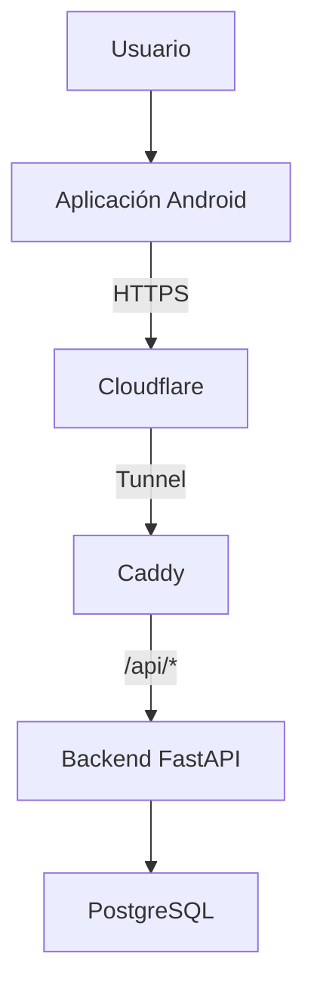
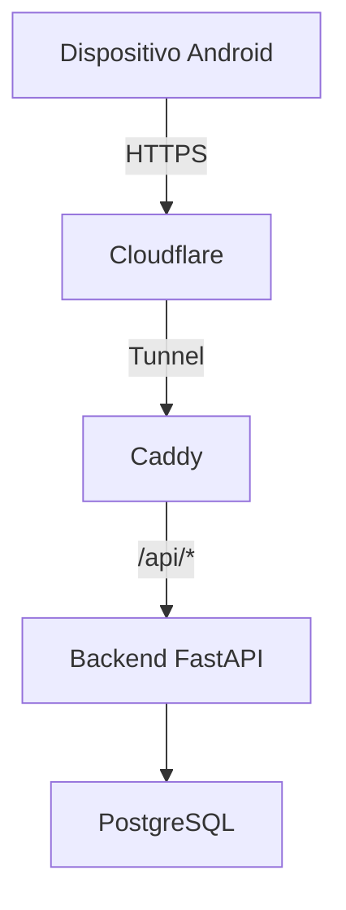
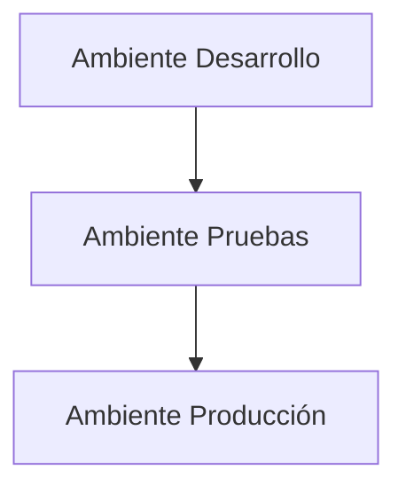
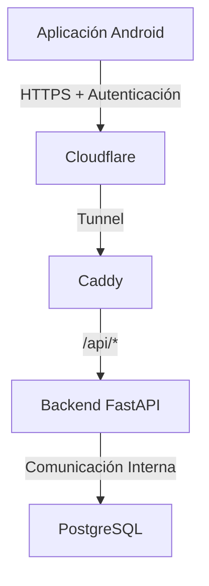
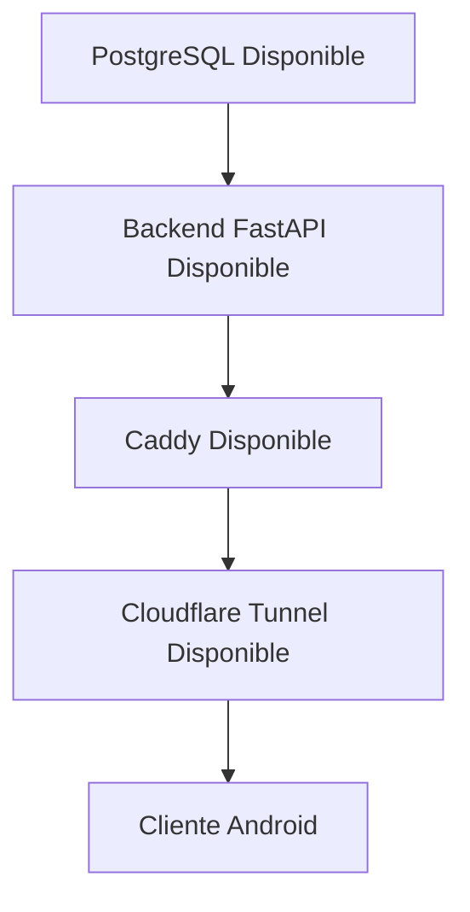

# 080_Despliegue.md

# Arquitectura de Despliegue Chiri Platform v1.0

## 1. Objetivo

Definir la arquitectura de despliegue de Chiri Platform v1.0, estableciendo cómo serán instalados, ejecutados, configurados y comunicados sus componentes principales.

Este documento define:

* Distribución de componentes.
* Infraestructura de ejecución.
* Ambientes de despliegue.
* Dependencias entre componentes.
* Comunicación entre capas.
* Persistencia de información.
* Consideraciones operativas de despliegue.

---

# 2. Alcance

La arquitectura de despliegue comprende:

* Aplicación Android.
* API Chiri Platform.
* Backend.
* Base de Datos PostgreSQL.
* Servicios auxiliares.
* Contenedores.
* Infraestructura de ejecución.

No incluye:

* Diseño de pantallas.
* Experiencia de usuario.
* Implementación detallada del código.
* Procedimientos específicos de administración de infraestructura.

---

# 3. Modelo General de Despliegue

Chiri Platform v1.0 se despliega bajo una arquitectura distribuida donde:

* Android funciona como cliente.
* Cloudflare Tunnel proporciona el acceso externo seguro.
* Caddy constituye el punto de entrada HTTP del servidor y enruta las solicitudes de la API.
* El Backend procesa las reglas de negocio.
* PostgreSQL proporciona la persistencia de información.
* Los servicios auxiliares se integran a través de los mecanismos definidos por la arquitectura.



# 4. Componentes de Despliegue

## 4.1 Aplicación Android

Responsabilidad:

* Interfaz cliente.
* Captura de información.
* Consumo de servicios de la API.
* Gestión de la sesión del usuario.

Características:

* Ejecuta en dispositivos Android.
* No contiene la lógica crítica del negocio.
* No accede directamente a la Base de Datos.
* Requiere comunicación con la API para las operaciones de la plataforma.

---

## 4.2 API Chiri Platform

Responsabilidad:

* Punto de entrada de los clientes.
* Recepción y validación de solicitudes.
* Autenticación.
* Autorización.
* Enrutamiento de solicitudes hacia el Backend.

Características:

* Se expone externamente mediante HTTPS a través de Cloudflare.
* Caddy recibe las solicitudes `/api/*` y las enruta hacia el Backend.
* El Backend implementa los endpoints y la lógica de negocio.
* No deberá contener lógica de negocio que corresponda al Backend.

## 4.3 Backend

Responsabilidad:

* Ejecución de reglas de negocio.
* Procesamiento de información.
* Orquestación de operaciones.
* Comunicación con PostgreSQL.
* Integración con servicios internos.

Características:

* Se ejecuta como un servicio independiente mediante systemd.
* Ejecuta FastAPI/Uvicorn.
* No se expone directamente a Internet.
* Recibe las solicitudes de la API a través de Caddy.
* El Backend deberá ejecutarse como un componente independiente de la aplicación Android.

## 4.4 Base de Datos PostgreSQL

Responsabilidad:

* Persistencia de información.
* Integridad de datos.
* Consultas y operaciones de almacenamiento.
* Soporte de las operaciones del Backend.

La Base de Datos no deberá exponerse directamente a los clientes.

El acceso deberá realizarse mediante los componentes autorizados de la plataforma.

---

## 4.5 Contenedores

Los componentes de servidor de Chiri Platform podrán ejecutarse mediante contenedores.

La contenerización deberá permitir:

* Separación de componentes.
* Reproducibilidad del entorno.
* Control de versiones de las imágenes.
* Administración independiente de servicios cuando corresponda.
* Facilitar actualizaciones y recuperación.

La utilización de contenedores no deberá modificar las reglas de seguridad ni las responsabilidades definidas para cada componente.

# 5. Arquitectura Física de Despliegue

La distribución física de Chiri Platform representa la infraestructura utilizada para ejecutar los componentes de la plataforma.

En la implementación actual, los componentes principales se distribuyen de la siguiente manera:



Los componentes de la plataforma se ejecutan en el servidor Chiri Platform, mientras que el acceso externo se realiza mediante Cloudflare Tunnel.

La distribución física no deberá modificar las responsabilidades lógicas establecidas en la arquitectura.

Cuando sea necesario, PostgreSQL podrá ejecutarse en una infraestructura independiente del API y Backend.

# 6. Ambientes de Despliegue

Chiri Platform considera tres ambientes lógicos:



## Desarrollo

Uso:

* Implementación.
* Pruebas iniciales.
* Validación técnica.
* Desarrollo de nuevas funcionalidades.

No deberá utilizar datos reales de producción salvo que exista una justificación y protección adecuada.

---

## Pruebas

Uso:

* Validación funcional.
* Pruebas de integración.
* Validación de seguridad.
* Verificación previa al despliegue en producción.

El ambiente de pruebas deberá mantenerse separado de producción.

---

## Producción

Uso:

* Operación real.
* Datos reales.
* Usuarios finales.
* Servicios oficiales de Chiri Platform.

Los cambios en producción deberán realizarse mediante procedimientos controlados.

---

# 7. Comunicación entre Componentes

Las comunicaciones entre los componentes deberán respetar las reglas de seguridad definidas en `070_Seguridad.md`.

Las comunicaciones externas deberán utilizar:

* HTTPS.
* Autenticación.
* Autorización.
* Validación de solicitudes.

El acceso externo a la plataforma se realizará mediante Cloudflare Tunnel.

Caddy actuará como punto de entrada del servidor y enrutará las solicitudes `/api/*` hacia el Backend.

La comunicación entre servicios internos deberá limitarse a los componentes que necesiten comunicarse entre sí.

La Base de Datos PostgreSQL no deberá estar expuesta directamente a Internet.



# 8. Configuración de Despliegue

Cada ambiente deberá mantener su propia configuración.

Deberá existir separación entre:

* Configuración.
* Variables de entorno.
* Credenciales.
* Parámetros de ejecución.
* Información específica de cada ambiente.

Los secretos y credenciales no deberán almacenarse directamente en el código fuente.

No deberán compartirse entre ambientes:

* Claves.
* Tokens.
* Credenciales administrativas.
* Secretos de servicios.

---

# 9. Dependencias de Ejecución

Los componentes deberán iniciar y operar respetando sus dependencias.

El orden lógico es:



La disponibilidad de un componente no deberá considerarse suficiente si sus dependencias críticas no están disponibles.

---

# 10. Persistencia y Recuperación

La información persistente de Chiri Platform deberá almacenarse en PostgreSQL.

El despliegue deberá considerar:

* Persistencia de los datos.
* Protección de la información.
* Copias de seguridad.
* Recuperación ante fallos.
* Integridad de los datos.

Las copias de seguridad deberán mantenerse separadas de los componentes que contienen los datos originales cuando sea técnicamente posible.

La recuperación deberá verificarse antes de considerarse completada.

Los mecanismos específicos de respaldo y recuperación podrán definirse en documentación operativa posterior.

---

# 11. Actualización y Cambios de Despliegue

Los cambios de despliegue deberán realizarse de forma controlada.

Antes de actualizar componentes críticos deberá considerarse:

* Compatibilidad.
* Dependencias.
* Impacto.
* Respaldo.
* Posibilidad de reversión.
* Verificación posterior.

Las actualizaciones deberán mantener la configuración y los controles de seguridad definidos para la plataforma.

---

# 12. Disponibilidad y Recuperación

El despliegue deberá permitir:

* Reinicio de servicios cuando sea necesario.
* Actualizaciones controladas.
* Recuperación ante fallos.
* Monitoreo básico.
* Verificación posterior a los cambios.

La arquitectura deberá evitar dependencias innecesarias que puedan provocar la indisponibilidad completa de la plataforma ante el fallo de un único componente.

Los mecanismos de alta disponibilidad podrán incorporarse cuando los requisitos de la plataforma lo justifiquen.

---

# 13. Preparación para Futuras Versiones

La arquitectura podrá evolucionar para incorporar:

* Balanceadores.
* Escalamiento horizontal.
* Automatización CI/CD.
* Alta disponibilidad.
* Separación física de componentes.
* Infraestructura adicional para crecimiento.

Estas capacidades no forman parte obligatoria del despliegue inicial de Chiri Platform v1.0.

---

# 14. Reglas Arquitectónicas

Chiri Platform deberá cumplir las siguientes reglas:

> **Los clientes deberán acceder a la plataforma mediante la API definida por la arquitectura.**

> **El Backend deberá mantener la lógica crítica del negocio fuera de la aplicación Android.**

> **PostgreSQL no deberá exponerse directamente a los clientes ni a Internet.**

> **Los componentes de servidor deberán mantener responsabilidades separadas.**

> **Los ambientes de Desarrollo, Pruebas y Producción deberán mantenerse separados lógicamente.**

> **Las configuraciones, credenciales y secretos deberán mantenerse separados por ambiente.**

> **Los cambios de despliegue deberán realizarse de forma controlada.**

> **Los datos persistentes deberán disponer de mecanismos de respaldo y recuperación.**

> **La arquitectura de despliegue deberá mantener los controles de seguridad definidos en `070_Seguridad.md`.**

---

# 15. Estado del Documento

Documento:

```text
080_Despliegue.md
```

Versión:

```text
Chiri Platform v1.0
```

Estado:

```text
EN REVISIÓN
```

````