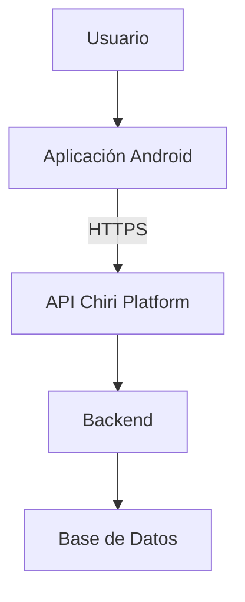
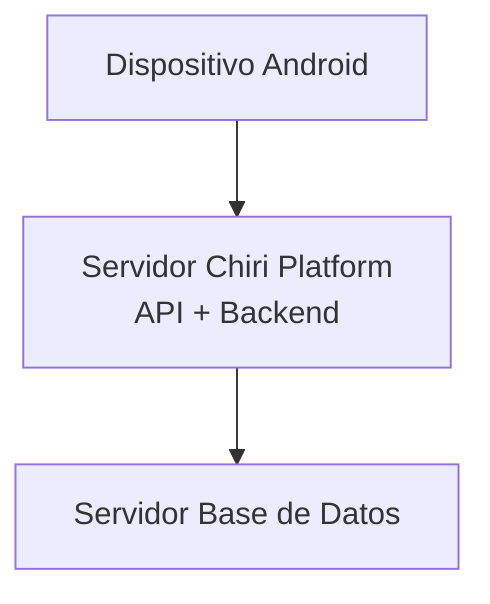
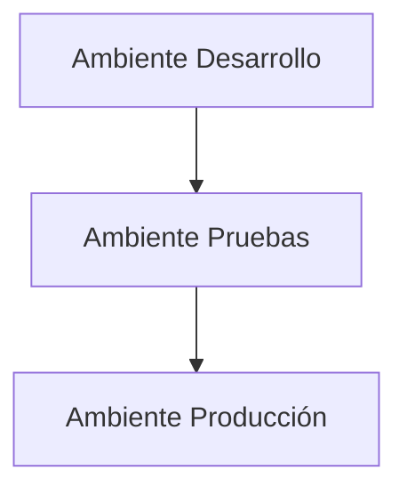
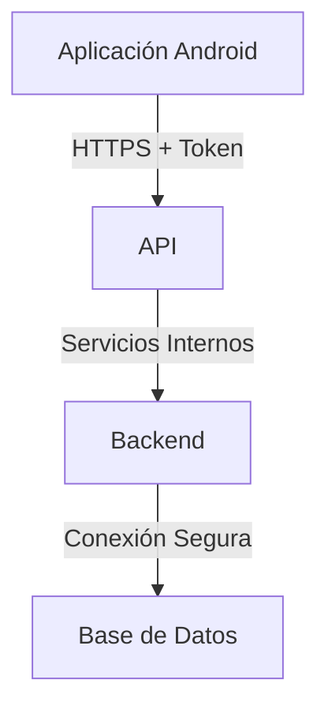
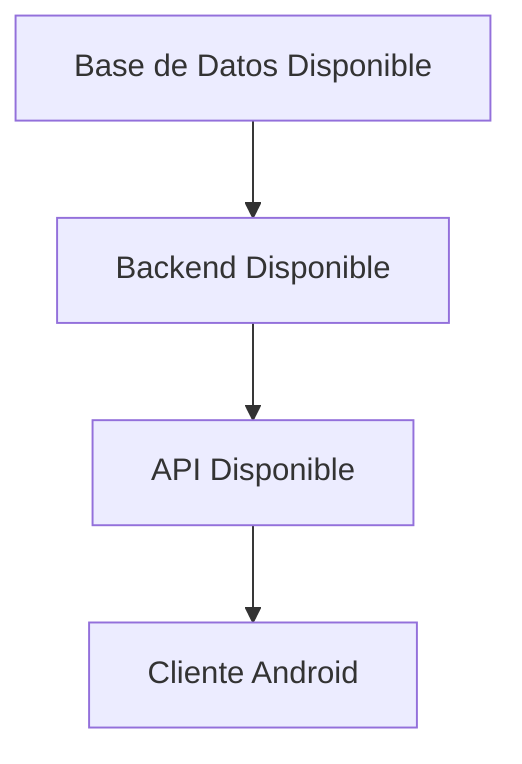

# 080_Despliegue.md

# Arquitectura de Despliegue Chiri Platform v1.0

## 1. Objetivo

Definir la arquitectura de despliegue de Chiri Platform v1.0, estableciendo cómo serán instalados, ejecutados y comunicados los componentes principales del sistema.

Este documento define:

* Distribución de componentes.
* Infraestructura requerida.
* Ambientes de ejecución.
* Dependencias entre servicios.
* Comunicación entre capas.
* Consideraciones operativas de despliegue.

---

# 2. Alcance

La arquitectura de despliegue comprende:

* Aplicación Android.
* API Chiri Platform.
* Backend.
* Base de Datos.
* Servicios auxiliares.
* Infraestructura de ejecución.

No incluye:

* Diseño de pantallas.
* Experiencia de usuario.
* Proceso interno de desarrollo.

---

# 3. Modelo General de Despliegue

Chiri Platform v1.0 se despliega bajo una arquitectura distribuida donde:

* Android funciona como cliente.
* La API expone servicios.
* El Backend procesa reglas de negocio.
* La Base de Datos almacena información persistente.



---

# 4. Componentes de Despliegue

## 4.1 Aplicación Android

Responsabilidad:

* Interfaz cliente.
* Captura de información.
* Consumo de servicios API.
* Gestión de sesión del usuario.

Características:

* Ejecuta en dispositivos Android.
* No contiene lógica crítica del negocio.
* Requiere conexión con la API.

---

## 4.2 API Chiri Platform

Responsabilidad:

* Punto de entrada del sistema.
* Comunicación con clientes.
* Validación de solicitudes.
* Control de seguridad.

Características:

* Expone endpoints.
* Gestiona autenticación.
* Controla autorización.

---

## 4.3 Backend

Responsabilidad:

* Reglas de negocio.
* Procesamiento de información.
* Orquestación de operaciones.
* Comunicación con Base de Datos.

---

## 4.4 Base de Datos

Responsabilidad:

* Persistencia de información.
* Integridad de datos.
* Consultas del sistema.

---

# 5. Arquitectura Física de Despliegue

La distribución física conceptual es:



---

# 6. Ambientes de Despliegue

Chiri Platform considera tres ambientes:



## Desarrollo

Uso:

* Implementación.
* Pruebas iniciales.
* Validación técnica.

---

## Pruebas

Uso:

* Validación funcional.
* Integración.
* Certificación previa.

---

## Producción

Uso:

* Operación real.
* Datos reales.
* Usuarios finales.

---

# 7. Comunicación entre Componentes

Todas las comunicaciones externas deben utilizar:

* HTTPS.
* Autenticación.
* Validación de permisos.



---

# 8. Configuración de Despliegue

Cada ambiente debe mantener:

* Configuración independiente.
* Variables de entorno propias.
* Credenciales separadas.
* Parámetros controlados.

Nunca compartir:

* Claves.
* Tokens.
* Usuarios administrativos.

---

# 9. Dependencias de Ejecución

Orden lógico de disponibilidad:



---

# 10. Consideraciones de Disponibilidad

El despliegue debe permitir:

* Reinicio independiente de componentes.
* Actualización controlada.
* Recuperación ante fallos.
* Monitoreo básico.

---

# 11. Preparación para Futuras Versiones

La arquitectura permitirá incorporar:

* Contenedores.
* Balanceadores.
* Escalamiento horizontal.
* Automatización CI/CD.
* Alta disponibilidad.

---

# 12. Estado del Documento

Documento:

```text
080_Despliegue.md
```

Versión:

```text
Chiri Platform v1.0
```

Estado:

```text
EN REVISIÓN
```
