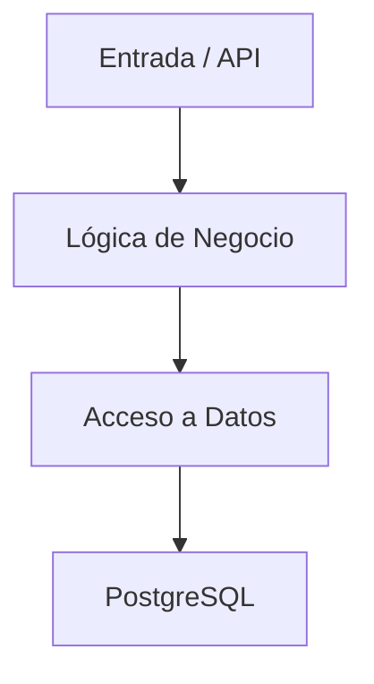
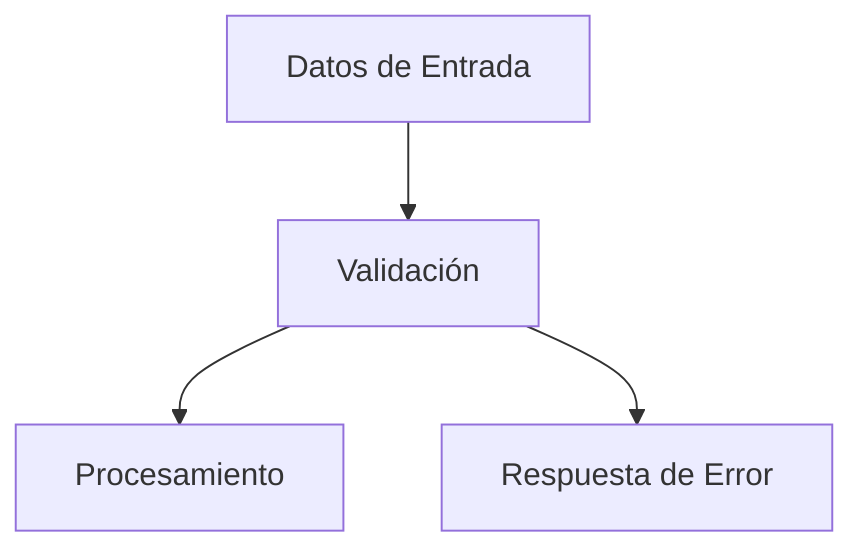

# 090_GuiaProgramacion.md

# Guía de Programación Chiri Platform v1.0

## 1. Objetivo

Definir los estándares y reglas de programación que deben seguir los desarrollos de Chiri Platform v1.0.

El objetivo es garantizar:

* Código mantenible.
* Consistencia entre módulos.
* Facilidad de evolución.
* Menor cantidad de errores.
* Uniformidad entre desarrolladores.

---

# 2. Principios de Programación

## 2.1 Código simple y mantenible

El código debe priorizar:

* Claridad.
* Legibilidad.
* Separación de responsabilidades.
* Bajo acoplamiento.
* Alta cohesión.

Debe evitarse:

* Código duplicado.
* Métodos o funciones demasiado extensos.
* Lógica mezclada entre capas.
* Complejidad innecesaria.

---

## 2.2 Responsabilidad única

Cada componente debe tener una función clara.

La implementación podrá utilizar diferentes patrones según la tecnología, siempre que mantenga la separación de responsabilidades.

Como referencia:

```text
Entrada
   ↓
Lógica de negocio
   ↓
Acceso a datos
   ↓
Base de Datos
````

---

# 3. Convenciones de Código

Las convenciones deberán respetar las prácticas recomendadas por cada tecnología utilizada en Chiri Platform.

La consistencia dentro de cada módulo tendrá prioridad sobre imponer una única convención para todas las tecnologías.

## 3.1 Variables y funciones

Deberán utilizarse nombres claros y descriptivos.

Las convenciones específicas deberán respetar el lenguaje utilizado.

---

## 3.2 Clases

Las clases deberán utilizar nombres descriptivos y seguir las convenciones oficiales del lenguaje correspondiente.

---

## 3.3 Constantes

Las constantes deberán utilizar nombres descriptivos y seguir las convenciones oficiales de cada lenguaje.

Ejemplo conceptual:

```text
MAX_INTENTOS_LOGIN
TOKEN_EXPIRATION_TIME
```

---

# 4. Organización del Código

La estructura del código deberá respetar la separación de responsabilidades definida por la arquitectura de Chiri Platform.

Como referencia:



Responsabilidades:

| Componente | Responsabilidad                      |
| ---------- | ------------------------------------ |
| Entrada    | Recepción y respuesta de solicitudes |
| Negocio    | Reglas y procesamiento de negocio    |
| Datos      | Acceso y persistencia                |
| PostgreSQL | Almacenamiento de información        |

La implementación podrá utilizar estructuras como Controller, Service, Repository u otras equivalentes cuando sean apropiadas para la tecnología utilizada.

---

# 5. Estructura de Módulos

Los módulos deberán organizarse de forma clara e independiente.

La estructura deberá adaptarse a la tecnología utilizada.

Como referencia:

```text
Modulo
├── Model
├── DTO
├── Service
├── Repository
└── Test
```

No todos los módulos deberán contener necesariamente todos estos componentes.

---

# 6. Manejo de Errores

Los errores deben:

* Ser controlados.
* Tener mensajes claros.
* Mantener códigos internos cuando corresponda.
* Evitar exposición de información sensible.
* Permitir su registro y diagnóstico.

Ejemplo:

Incorrecto:

```text
Error de conexión con la Base de Datos: [detalles internos]
```

Correcto:

```text
ERR_DATABASE_CONNECTION
```

Los detalles técnicos deberán registrarse de forma segura en los logs cuando sean necesarios para diagnóstico.

---

# 7. Validación de Datos

Toda entrada externa deberá validarse antes de ser procesada.

Fuentes:

* Aplicación Android.
* API.
* Servicios externos.

La validación deberá realizarse en el servidor independientemente de las validaciones realizadas por el cliente.



---

# 8. Comentarios en Código

Los comentarios deberán explicar:

* Motivo de una decisión.
* Regla compleja.
* Consideración importante.
* Comportamiento que no sea evidente.

Deberán evitarse comentarios que simplemente describan código evidente.

Ejemplo incorrecto:

```text
// Suma uno al contador
contador++;
```

---

# 9. Logs

Los registros deberán ser:

* Claros.
* Clasificados por nivel.
* Útiles para diagnóstico.
* Sin información sensible.

Niveles de referencia:

```text
DEBUG
INFO
WARN
ERROR
```

Nunca deberán registrarse:

* Contraseñas.
* Tokens.
* Secretos.
* Credenciales.
* Datos privados completos.

---

# 10. Control de Versiones

Chiri Platform utilizará Git para el control de versiones.

Reglas:

* Commits pequeños y coherentes.
* Mensajes descriptivos.
* No subir credenciales ni secretos.
* Revisar los cambios antes de integrarlos.
* Mantener el repositorio en un estado coherente.

Los mensajes de commit deberán seguir una convención consistente con el repositorio.

Formato:

```text
tipo: descripción
```

Ejemplos:

```text
feat: agregar autenticación de usuario
fix: corregir validación de permisos
docs: actualizar arquitectura de API
chore: actualizar configuración
```

---

# 11. Pruebas

Los desarrollos deberán considerar, según corresponda:

* Pruebas unitarias.
* Pruebas funcionales.
* Pruebas de integración.
* Validación de errores.
* Validación de seguridad.

Las funcionalidades críticas deberán verificarse antes de incorporarse a producción.

---

# 12. Seguridad en Desarrollo

El desarrollo deberá cumplir las reglas de seguridad definidas en `070_Seguridad.md`.

Como mínimo:

* No almacenar secretos en el código.
* Validar entradas.
* Aplicar mínimo privilegio.
* Proteger información sensible.
* Mantener dependencias actualizadas.
* Evitar exposición de información interna mediante errores o logs.

---

# 13. Compatibilidad con Arquitectura Chiri Platform

Todo desarrollo deberá respetar:

* Arquitectura definida.
* Separación entre Android, API y Backend.
* Contratos establecidos.
* Modelos de datos aprobados.
* Reglas de seguridad.
* Arquitectura de despliegue.
* Responsabilidades definidas para cada componente.

Los cambios de implementación no deberán modificar unilateralmente las decisiones arquitectónicas establecidas.

---

# 14. Decisiones Arquitectónicas

Cuando un cambio de desarrollo modifique una decisión arquitectónica, deberá registrarse en:

```text
100_DecisionesArquitectura.md
```

Las decisiones deberán mantenerse alineadas con la versión vigente de la arquitectura de Chiri Platform.

---

# 15. Estado del Documento

Documento:

```text
090_GuiaProgramacion.md
```

Versión:

```text
Chiri Platform v1.0
```

Estado:

```text
EN REVISIÓN
```