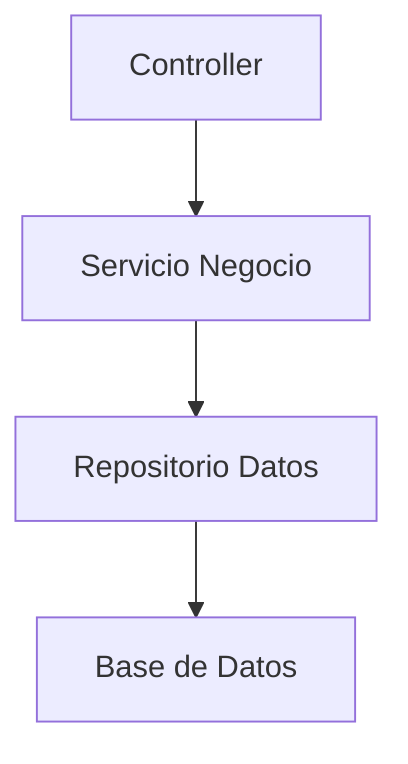
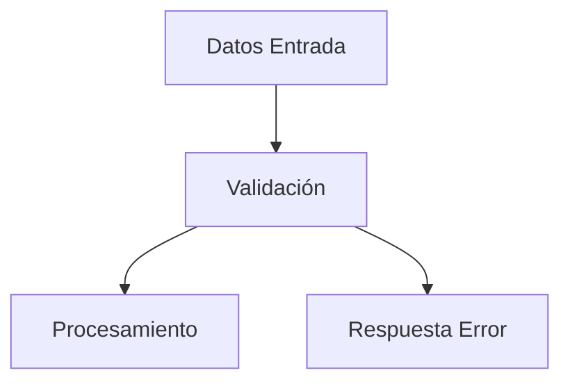

# 090_GuiaProgramacion.md

# Guía de Programación Chiri Platform v1.0

## 1. Objetivo

Definir los estándares y reglas de programación que deben seguir todos los desarrollos de Chiri Platform v1.0.

El objetivo es garantizar:

* Código mantenible.
* Consistencia entre módulos.
* Facilidad de evolución.
* Menor cantidad de errores.
* Uniformidad entre desarrolladores.

---

# 2. Principios de Programación

## 2.1 Código simple y mantenible

El código debe priorizar:

* Claridad.
* Legibilidad.
* Separación de responsabilidades.
* Bajo acoplamiento.
* Alta cohesión.

Debe evitarse:

* Código duplicado.
* Métodos demasiado extensos.
* Lógica mezclada entre capas.

---

## 2.2 Responsabilidad única

Cada componente debe tener una función clara.

Ejemplo:

```text
Controller
    ↓
Recibe solicitudes

Service
    ↓
Reglas de negocio

Repository
    ↓
Acceso a datos
```

---

# 3. Convenciones de Nombres

## 3.1 Variables y métodos

Se utilizará:

```text
camelCase
```

Ejemplo:

```text
usuarioActual
obtenerUsuarios()
validarPermiso()
```

---

## 3.2 Clases

Se utilizará:

```text
PascalCase
```

Ejemplo:

```text
UsuarioController
UsuarioService
UsuarioRepository
```

---

## 3.3 Constantes

Se utilizará:

```text
MAYUSCULAS_CON_GUION_BAJO
```

Ejemplo:

```text
MAX_INTENTOS_LOGIN
TOKEN_EXPIRATION_TIME
```

---

# 4. Organización del Código

La estructura debe respetar separación por capas:



Responsabilidades:

| Capa       | Responsabilidad                 |
| ---------- | ------------------------------- |
| Controller | Entrada y salida de solicitudes |
| Service    | Reglas de negocio               |
| Repository | Persistencia de datos           |
| Base Datos | Almacenamiento                  |

---

# 5. Estructura de Módulos

Cada módulo debe organizarse de forma independiente.

Ejemplo:

```text
ModuloUsuario

├── Controller
├── Service
├── Repository
├── Model
├── DTO
└── Test
```

---

# 6. Manejo de Errores

Los errores deben:

* Ser controlados.
* Tener mensajes claros.
* Mantener códigos internos.
* Evitar exposición de información sensible.

Ejemplo:

Incorrecto:

```text
Error SQL Firebird conexión perdida
```

Correcto:

```text
ERR_DATABASE_CONNECTION
```

---

# 7. Validación de Datos

Toda entrada externa debe validarse.

Fuentes:

* Aplicación Android.
* API.
* Servicios externos.

Regla:



---

# 8. Comentarios en Código

Los comentarios deben explicar:

* Motivo de una decisión.
* Regla compleja.
* Consideración importante.

Evitar comentarios que describen código evidente.

Ejemplo incorrecto:

```text
// Suma uno al contador
contador++;
```

---

# 9. Logs

Los registros deben ser:

* Claros.
* Clasificados por nivel.
* Sin información sensible.

Niveles:

```text
INFO
WARN
ERROR
DEBUG
```

Nunca registrar:

* Contraseñas.
* Tokens.
* Datos privados completos.

---

# 10. Control de Versiones

Reglas:

* Commits pequeños.
* Mensajes descriptivos.
* No subir credenciales.
* Revisar cambios antes de integrar.

Formato recomendado:

```text
TIPO: descripción

Ejemplo:

FEAT: agregar autenticación usuario
FIX: corregir validación permisos
DOC: actualizar arquitectura API
```

---

# 11. Pruebas

Todo módulo debe considerar:

* Pruebas unitarias.
* Validación funcional.
* Pruebas de integración cuando aplique.

---

# 12. Seguridad en Desarrollo

Reglas:

* No almacenar secretos en código.
* Validar entradas.
* Aplicar mínimo privilegio.
* Mantener dependencias actualizadas.

---

# 13. Compatibilidad con Arquitectura Chiri Platform

Todo desarrollo debe respetar:

* Arquitectura definida.
* Separación Backend/API/Android.
* Contratos establecidos.
* Modelos de datos aprobados.

---

# 14. Estado del Documento

Documento:

```text
090_GuiaProgramacion.md
```

Versión:

```text
Chiri Platform v1.0
```

Estado:

```text
EN REVISIÓN
```
