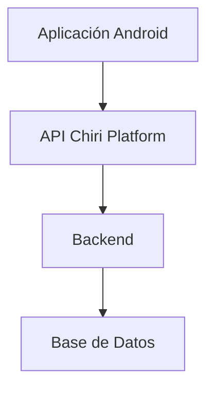
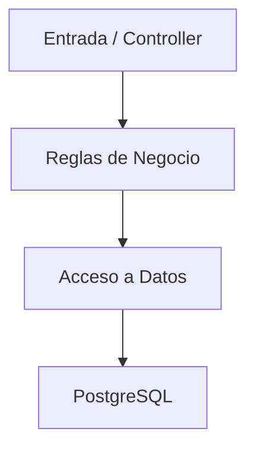
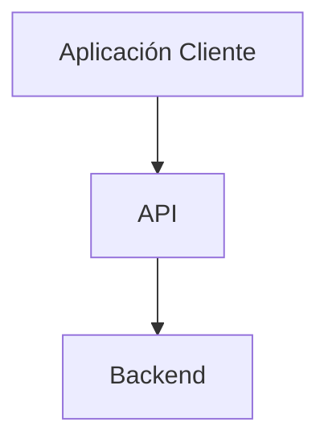
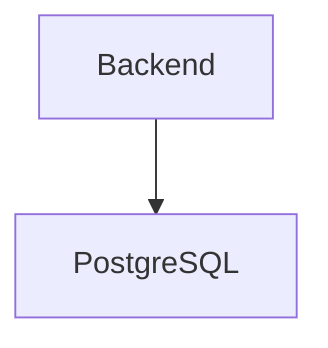
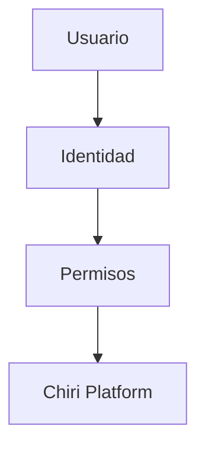

# 100_DecisionesArquitectura.md

# Decisiones Arquitectónicas Chiri Platform v1.0

## 1. Objetivo

Registrar las decisiones arquitectónicas importantes tomadas durante el diseño de Chiri Platform v1.0.

Este documento permite:

* Conocer el motivo detrás de cada decisión.
* Mantener consistencia durante la implementación.
* Evitar cambios arquitectónicos no evaluados.
* Facilitar la evolución futura de la plataforma.

---

# 2. Formato de Decisiones

Cada decisión contiene:

* Identificador.
* Descripción.
* Contexto.
* Decisión tomada.
* Justificación.
* Impacto.

---

# ADR-001

## Separación por Capas de la Arquitectura

### Contexto

El sistema requiere mantener separación clara entre:

* Aplicación Android.
* API.
* Backend.
* Base de Datos.

### Decisión

Se adopta una arquitectura por capas:



### Justificación

Permite:

* Independencia entre componentes.
* Mantenimiento simplificado.
* Evolución tecnológica.
* Mejor control de responsabilidades.

### Impacto

Positivo:

* Mayor escalabilidad.
* Código organizado.

---

# ADR-002

## Separación de Responsabilidades Backend

### Contexto

El Backend deberá mantener separadas las responsabilidades de entrada, lógica de negocio y acceso a datos.

La implementación podrá utilizar patrones como Controller, Service y Repository cuando sean apropiados.

### Decisión

Se establece la separación de responsabilidades:



La utilización de Controller, Service y Repository será una decisión de implementación y no una obligación estructural para todos los módulos.

### Justificación

Cada componente mantiene una responsabilidad definida.

La separación permite evolucionar la implementación sin modificar las responsabilidades principales del Backend.

### Impacto

Facilita:

* Pruebas.
* Mantenimiento.
* Reutilización.
* Evolución del sistema.
* Separación de responsabilidades.

---

# ADR-003

## API como Punto Único de Comunicación

### Contexto

Los clientes externos no deben acceder directamente a la lógica interna.

### Decisión

Toda comunicación externa pasa por la API.



### Justificación

Permite:

* Seguridad.
* Control de acceso.
* Validación centralizada.

### Impacto

Mayor control sobre integraciones futuras.

---

# ADR-004

## Base de Datos como Capa Persistente Independiente

### Contexto

La información debe mantenerse independiente de los componentes consumidores.

### Decisión

La persistencia de Chiri Platform v1.0 utilizará PostgreSQL.

El acceso a PostgreSQL se realizará exclusivamente desde el Backend.



### Justificación

Evita el acceso directo desde los clientes y mantiene la persistencia bajo el control del Backend.

### Impacto

* Mayor seguridad.
* Mayor integridad de los datos.
* Separación de responsabilidades.
* Facilita la evolución de la Base de Datos.

---

# ADR-005

## Seguridad Integrada desde Arquitectura

### Contexto

La seguridad debe formar parte del diseño inicial.

### Decisión

Se incorporan:

* Autenticación.
* Autorización.
* Tokens.
* Auditoría.
* Validaciones.



### Justificación

Evita implementar seguridad como una capa posterior.

### Impacto

Mayor protección del sistema.

---

# ADR-006

## Mermaid como Estándar de Diagramación Arquitectónica

### Contexto

La documentación necesita diagramas versionables y mantenibles.

### Decisión

Todos los diagramas arquitectónicos utilizarán Mermaid.

Ejemplo:


### Justificación

Permite:

* Versionamiento junto al Markdown.
* Fácil mantenimiento.
* Visualización independiente del editor.

### Impacto

Toda documentación arquitectónica seguirá un estándar único.

---

# ADR-007

## Separación entre Arquitectura y Diseño UX/UI

### Contexto

La arquitectura debe permanecer independiente de decisiones visuales.

### Decisión

Los documentos arquitectónicos no incluyen:

* Pantallas.
* Mockups.
* Diseños visuales.

### Justificación

Permite evolucionar la experiencia de usuario sin modificar la arquitectura base.

### Impacto

Mayor flexibilidad del proyecto.

---

# ADR-008

## Guía de Programación como Estándar de Desarrollo

### Contexto

El crecimiento del proyecto requiere consistencia técnica.

### Decisión

Se establece:

`090_GuiaProgramacion.md`

como referencia obligatoria para desarrollo.

### Justificación

Mantiene:

* Convenciones.
* Organización.
* Calidad del código.

### Impacto

Mayor mantenibilidad.

---

# ADR-009

## Arquitectura de Despliegue Flexible

### Contexto

La plataforma debe permitir diferentes ambientes.

### Decisión

El despliegue se mantiene independiente de infraestructura específica.

### Justificación

Permite evolucionar hacia:

* Servidores tradicionales.
* Contenedores.
* Cloud.
* Alta disponibilidad.

### Impacto

Mayor capacidad de adaptación.

---

## ADR-010 — Autenticación de usuarios

### Contexto

Chiri Platform requiere identificar y autenticar a los usuarios que acceden a la aplicación Android.

### Decisión

La autenticación inicial de Chiri Platform utilizará:

- Usuario o correo electrónico.
- Contraseña.

La aplicación Android realizará la autenticación mediante la API oficial de Chiri Platform.

Android no realizará autenticación directamente contra la Base de Datos ni contra servicios internos.

### Flujo

Android → API → Backend → Autenticación

### Consecuencias

- La autenticación queda centralizada en el Backend.
- Android no contiene lógica de autenticación del servidor.
- Se permite utilizar usuario o correo electrónico como identificador.
- La arquitectura permite incorporar posteriormente otros mecanismos de autenticación.

---

## ADR-011 — Roles y autorización

### Contexto

Chiri Platform requiere controlar las capacidades disponibles para cada usuario.

### Decisión

La versión inicial definirá los siguientes perfiles:

- Administrador.
- Usuario.
- Invitado.

La autorización será determinada por el Backend y comunicada mediante la API.

Android no deberá utilizar reglas locales como fuente principal de autorización.

### Flujo

Usuario → Backend → Roles/Permisos → API → Android

### Consecuencias

- La autorización permanece centralizada.
- Los permisos pueden evolucionar sin modificar la arquitectura Android.
- Android utilizará los permisos recibidos para habilitar o restringir funcionalidades.
- Los cinco módulos principales de Chiri forman parte de la navegación general, mientras que las operaciones disponibles dependerán de los permisos.

---

## ADR-012 — Gestión de sesión Android

### Contexto

La aplicación Android debe mantener la sesión del usuario entre aperturas de la aplicación.

### Decisión

Chiri Android utilizará una sesión persistente mientras la sesión proporcionada por el Backend continúe siendo válida.

Al iniciar la aplicación se ejecutará un proceso inicial de comprobación de sesión.

### Flujo

Splash
↓
¿Sesión válida?

Sí → Dashboard

No → Login

### Consecuencias

- El usuario no deberá introducir sus credenciales cada vez que abra la aplicación.
- La sesión deberá almacenarse utilizando mecanismos seguros.
- El cierre de sesión invalidará la sesión local.
- La aplicación podrá incorporar posteriormente mecanismos adicionales como biometría o PIN.
- La validación definitiva de la sesión corresponde al Backend/API.

---

## ADR-013 — Navegación principal Android

### Contexto

Chiri Platform requiere una navegación común para las capacidades principales de la plataforma.

### Decisión

La aplicación Android utilizará cinco áreas principales:

- Hogar.
- Multimedia.
- Inteligencia Artificial.
- Personal.
- Configuración.

Estas áreas formarán parte de la navegación principal de Chiri.

El acceso a funcionalidades específicas dentro de cada área estará condicionado por los permisos del usuario.

### Consecuencias

- La navegación mantiene una estructura estable.
- Las capacidades disponibles pueden variar según el perfil y permisos.
- La navegación Android no dependerá directamente de servicios internos.
- Las funcionalidades serán implementadas progresivamente.

---

Versión:

```text
Chiri Platform v1.0
```

Estado:

```text
APROBADO
```
