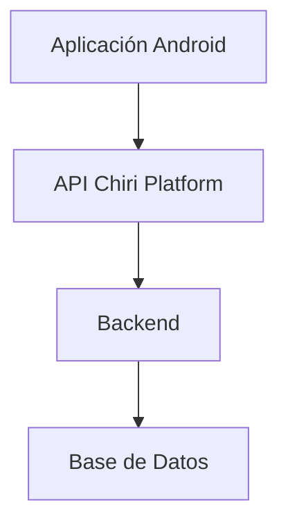
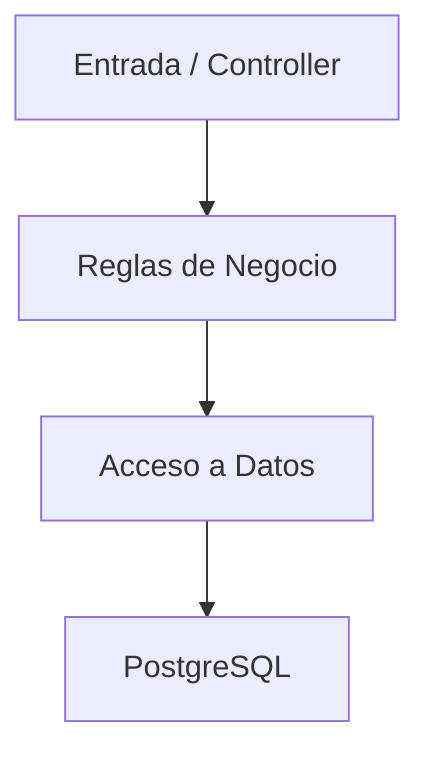
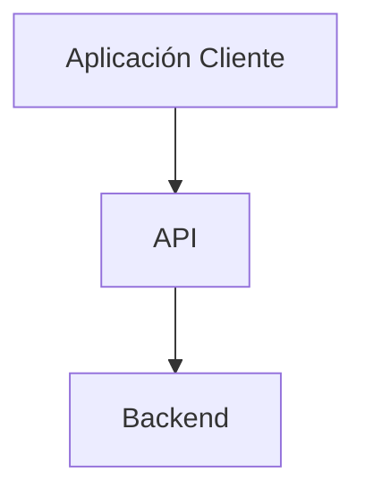
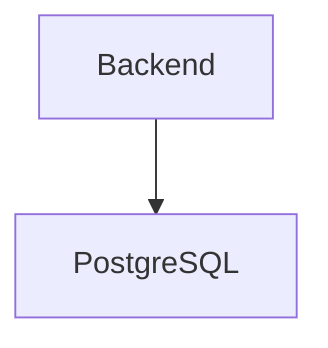
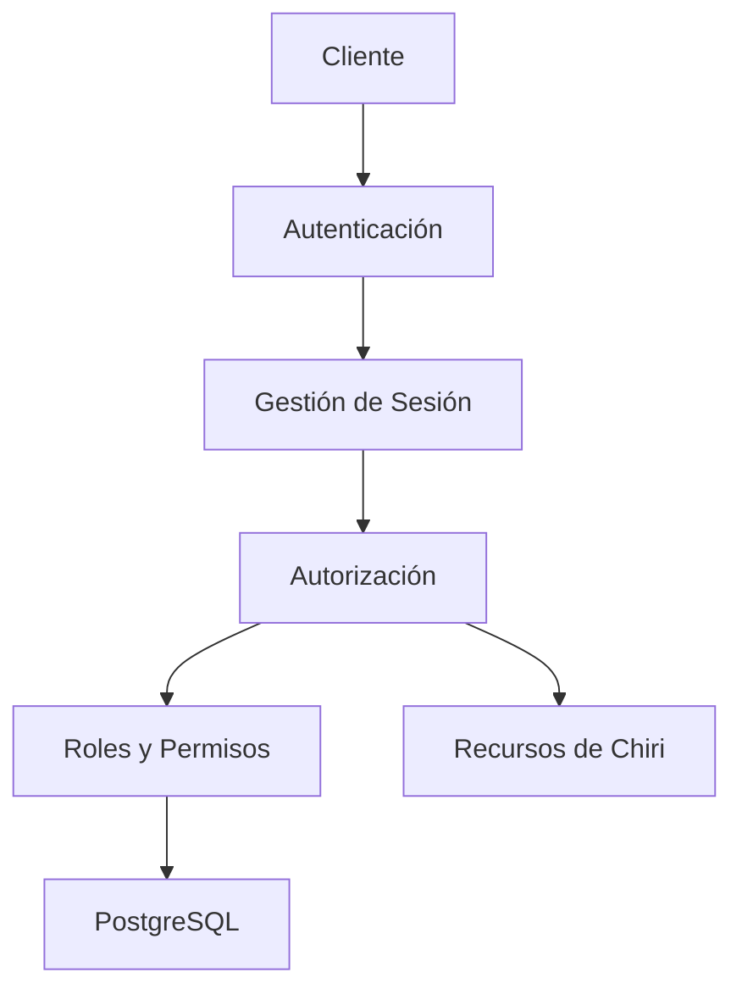

# 100_DecisionesArquitectura.md

# Decisiones Arquitectónicas Chiri Platform v1.0

## 1. Objetivo

Registrar las decisiones arquitectónicas importantes tomadas durante el diseño de Chiri Platform v1.0.

Este documento permite:

* Conocer el motivo detrás de cada decisión.
* Mantener consistencia durante la implementación.
* Evitar cambios arquitectónicos no evaluados.
* Facilitar la evolución futura de la plataforma.

---

# 2. Formato de Decisiones

Cada decisión contiene:

* Identificador.
* Descripción.
* Contexto.
* Decisión tomada.
* Justificación.
* Impacto.

---

# ADR-001

## Separación por Capas de la Arquitectura

### Contexto

El sistema requiere mantener separación clara entre:

* Aplicación Android.
* API.
* Backend.
* Base de Datos.

### Decisión

Se adopta una arquitectura por capas:



### Justificación

Permite:

* Independencia entre componentes.
* Mantenimiento simplificado.
* Evolución tecnológica.
* Mejor control de responsabilidades.

### Impacto

Positivo:

* Mayor escalabilidad.
* Código organizado.

---

# ADR-002

## Separación de Responsabilidades Backend

### Contexto

El Backend deberá mantener separadas las responsabilidades de entrada, lógica de negocio y acceso a datos.

La implementación podrá utilizar patrones como Controller, Service y Repository cuando sean apropiados.

### Decisión

Se establece la separación de responsabilidades:



La utilización de Controller, Service y Repository será una decisión de implementación y no una obligación estructural para todos los módulos.

### Justificación

Cada componente mantiene una responsabilidad definida.

La separación permite evolucionar la implementación sin modificar las responsabilidades principales del Backend.

### Impacto

Facilita:

* Pruebas.
* Mantenimiento.
* Reutilización.
* Evolución del sistema.
* Separación de responsabilidades.

---

# ADR-003

## API como Punto Único de Comunicación

### Contexto

Los clientes externos no deben acceder directamente a la lógica interna.

### Decisión

Toda comunicación externa pasa por la API.



### Justificación

Permite:

* Seguridad.
* Control de acceso.
* Validación centralizada.

### Impacto

Mayor control sobre integraciones futuras.

---

# ADR-004

## Base de Datos como Capa Persistente Independiente

### Contexto

La información debe mantenerse independiente de los componentes consumidores.

### Decisión

La persistencia de Chiri Platform v1.0 utilizará PostgreSQL.

El acceso a PostgreSQL se realizará exclusivamente desde el Backend.



### Justificación

Evita el acceso directo desde los clientes y mantiene la persistencia bajo el control del Backend.

### Impacto

* Mayor seguridad.
* Mayor integridad de los datos.
* Separación de responsabilidades.
* Facilita la evolución de la Base de Datos.

---

## ADR-005

# Seguridad Integrada desde Arquitectura

### Contexto

La seguridad debe formar parte del diseño inicial de Chiri Platform y mantenerse como una responsabilidad transversal de la arquitectura.

### Decisión

La arquitectura establece como principios de seguridad:

* Autenticación.
* Autorización.
* Gestión de sesiones.
* Tokens.
* Validaciones.
* Auditoría.

La implementación de cada mecanismo se realizará de acuerdo con las capacidades incorporadas en cada etapa del proyecto.

Actualmente, la autenticación y la gestión de sesiones forman parte de la implementación del Backend.

La autorización será responsabilidad del Backend y deberá utilizar los roles y permisos vigentes de la identidad.

PostgreSQL será la fuente de verdad para la autorización en la primera implementación.

Los roles y permisos no deberán confiarse a valores enviados por el cliente ni a información obsoleta almacenada en el JWT.

La implementación concreta del modelo de roles y permisos se realizará durante la fase correspondiente del Backend.



### Estado de implementación

```text
Autenticación              → Implementada
Gestión de sesiones        → Implementada
Autorización               → Arquitectura definida
Roles y permisos           → Implementación pendiente
```

---

# ADR-006

## Mermaid como Estándar de Diagramación Arquitectónica

### Contexto

La documentación necesita diagramas versionables y mantenibles.

### Decisión

Todos los diagramas arquitectónicos utilizarán Mermaid.

Ejemplo:


### Justificación

Permite:

* Versionamiento junto al Markdown.
* Fácil mantenimiento.
* Visualización independiente del editor.

### Impacto

Toda documentación arquitectónica seguirá un estándar único.

---

# ADR-007

## Separación entre Arquitectura y Diseño UX/UI

### Contexto

La arquitectura debe permanecer independiente de decisiones visuales.

### Decisión

Los documentos arquitectónicos no incluyen:

* Pantallas.
* Mockups.
* Diseños visuales.

### Justificación

Permite evolucionar la experiencia de usuario sin modificar la arquitectura base.

### Impacto

Mayor flexibilidad del proyecto.

---

# ADR-008

## Guía de Programación como Estándar de Desarrollo

### Contexto

El crecimiento del proyecto requiere consistencia técnica.

### Decisión

Se establece:

`090_GuiaProgramacion.md`

como referencia obligatoria para desarrollo.

### Justificación

Mantiene:

* Convenciones.
* Organización.
* Calidad del código.

### Impacto

Mayor mantenibilidad.

---

# ADR-009

## Arquitectura de Despliegue Flexible

### Contexto

La plataforma debe permitir diferentes ambientes.

### Decisión

El despliegue se mantiene independiente de infraestructura específica.

### Justificación

Permite evolucionar hacia:

* Servidores tradicionales.
* Contenedores.
* Cloud.
* Alta disponibilidad.

### Impacto

Mayor capacidad de adaptación.

---

## ADR-010 — Autenticación de usuarios

### Contexto

Chiri Platform requiere identificar y autenticar a los usuarios que acceden a la aplicación Android.

### Decisión

La autenticación inicial de Chiri Platform utilizará:

- Usuario o correo electrónico.
- Contraseña.

La aplicación Android realizará la autenticación mediante la API oficial de Chiri Platform.

Android no realizará autenticación directamente contra la Base de Datos ni contra servicios internos.

### Flujo

Android → API → Backend → Autenticación

### Consecuencias

- La autenticación queda centralizada en el Backend.
- Android no contiene lógica de autenticación del servidor.
- Se permite utilizar usuario o correo electrónico como identificador.
- La arquitectura permite incorporar posteriormente otros mecanismos de autenticación.

---

## ADR-011 — Roles y autorización

### Contexto

Chiri Platform deberá permitir controlar las capacidades disponibles para cada usuario conforme evolucione la plataforma.

La autorización granular mediante roles y permisos todavía no está implementada en Chiri Platform v1.0, aunque la autorización permanece definida como responsabilidad del Backend.

### Decisión

La autorización será responsabilidad del Backend.

Los clientes no deberán determinar por sí mismos si un usuario posee autorización para ejecutar una operación protegida.

La arquitectura permitirá incorporar posteriormente un modelo basado en:

* Roles.
* Permisos.
* Políticas de autorización.

Los perfiles concretos y sus permisos deberán definirse mediante una decisión arquitectónica y un contrato de API cuando esta capacidad vaya a implementarse.

Android no deberá utilizar reglas locales como fuente principal de autorización.

### Flujo futuro


### Estado actual

Actualmente:

* la autenticación está implementada;
* la gestión de sesiones está implementada;
* la validación de la sesión está bajo control del Backend;
* la autorización granular mediante roles y permisos todavía no está implementada.

Por lo tanto, los perfiles:

* Administrador.
* Usuario.
* Invitado.

no deberán considerarse perfiles actualmente implementados hasta que exista el modelo correspondiente en el Backend y haya sido validado mediante pruebas.

### Consecuencias

* La autorización permanecerá centralizada en el Backend.
* Los clientes no podrán concederse privilegios por decisión local.
* Los permisos podrán evolucionar sin modificar el núcleo de autenticación.
* La incorporación futura de roles y permisos deberá respetar el contrato de la API.
* La implementación futura podrá introducir `AUTH_FORBIDDEN` para representar operaciones autenticadas pero no autorizadas.

---

## ADR-012 — Gestión de sesión Android

### Contexto

La aplicación Android debe mantener la sesión del usuario entre aperturas de la aplicación.

### Decisión

Chiri Android utilizará una sesión persistente mientras la sesión proporcionada por el Backend continúe siendo válida.

Al iniciar la aplicación se ejecutará un proceso inicial de comprobación de sesión.

### Flujo

Splash
↓
¿Sesión válida?

Sí → Dashboard

No → Login

### Consecuencias

- El usuario no deberá introducir sus credenciales cada vez que abra la aplicación.
- La sesión deberá almacenarse utilizando mecanismos seguros.
- El cierre de sesión invalidará la sesión local.
- La aplicación podrá incorporar posteriormente mecanismos adicionales como biometría o PIN.
- La validación definitiva de la sesión corresponde al Backend/API.

---

## ADR-013 — Navegación principal Android

### Contexto

Chiri Platform requiere una navegación común para las capacidades principales de la plataforma.

### Decisión

La aplicación Android utilizará cinco áreas principales:

- Hogar.
- Multimedia.
- Inteligencia Artificial.
- Personal.
- Configuración.

Estas áreas formarán parte de la navegación principal de Chiri.

El acceso a funcionalidades específicas dentro de cada área podrá estar condicionado por los permisos del usuario cuando la autorización granular sea implementada.

### Consecuencias

- La navegación mantiene una estructura estable.
- Las capacidades disponibles pueden variar según el perfil y permisos.
- La navegación Android no dependerá directamente de servicios internos.
- Las funcionalidades serán implementadas progresivamente.

---

Versión:

```text
Chiri Platform v1.0
```

Estado:

```text
APROBADO
```

# ADR-014 — Gestión automática del Access Token en Android

### Estado

**APROBADO**

### Contexto

Las peticiones autenticadas realizadas desde Android requieren un `Access Token` válido para acceder a los endpoints protegidos del Backend.

No es conveniente que cada `Repository`, `UseCase` o componente de UI sea responsable de obtener el token y construir manualmente el header HTTP:

```text
Authorization: Bearer <access_token>
```

Esto produciría duplicación de lógica y aumentaría el riesgo de que diferentes componentes implementen la autenticación de forma inconsistente.

### Decisión

La aplicación Android centralizará la incorporación del `Access Token` mediante `AuthInterceptor`, implementado como interceptor de OkHttp.

El interceptor:

1. Obtiene el `Access Token` actual desde `SessionStorage`.
2. Si existe un token almacenado, agrega automáticamente:

```text
Authorization: Bearer <access_token>
```

3. Si no existe un `Access Token`, permite continuar la petición sin dicho header.
4. Las capas superiores de la aplicación no deberán construir manualmente el header `Authorization`.

### Flujo

```text
UI
 ↓
ViewModel
 ↓
UseCase / Repository
 ↓
Retrofit / AuthApi
 ↓
OkHttp
 ↓
AuthInterceptor
 ↓
SessionStorage
 ↓
Authorization: Bearer <access_token>
 ↓
Backend
```

### Justificación

La responsabilidad de autenticación HTTP queda centralizada en la capa de red.

Esto permite:

* Evitar duplicación de código.
* Mantener los `UseCase` y `Repository` independientes de detalles HTTP.
* Garantizar un comportamiento uniforme para las peticiones autenticadas.
* Mantener `SessionStorage` como fuente local del estado de sesión.
* Facilitar la renovación automática del token mediante `AuthAuthenticator`.

### Consecuencias

**Positivas:**

* La autenticación HTTP queda centralizada.
* Los componentes de dominio no necesitan conocer cómo se envía el token.
* Se reduce la posibilidad de errores al construir headers.
* El mecanismo es transparente para las APIs Retrofit.
* Se establece un único punto para incorporar el Access Token.

**Negativas:**

* El cliente HTTP depende de `SessionStorage`.
* El interceptor debe distinguir correctamente las peticiones que requieren autenticación.
* Las pruebas de autenticación deben contemplar el comportamiento automático del interceptor.

### Regla arquitectónica

> **Las capas superiores de Android no deberán agregar manualmente el header `Authorization` para las peticiones autenticadas. La incorporación del Access Token será responsabilidad de `AuthInterceptor`.**

# ADR-015 — Renovación automática de sesión ante HTTP 401

### Estado

**APROBADO**

### Contexto

El `Access Token` utilizado por Android puede expirar o dejar de ser válido mientras la sesión del usuario continúa vigente.

El Backend proporciona un `Refresh Token` para permitir la renovación de la sesión.

Además, el sistema utiliza rotación del `Refresh Token`, por lo que varias peticiones que reciban `HTTP 401 Unauthorized` simultáneamente deben coordinarse para evitar múltiples renovaciones concurrentes.

### Decisión

La aplicación Android utilizará `AuthAuthenticator`, implementado mediante `okhttp3.Authenticator`, para gestionar automáticamente las respuestas `HTTP 401` de las peticiones autenticadas.

Ante un `401`, el flujo será:

```text
Petición autenticada
        ↓
Backend
        ↓
HTTP 401
        ↓
AuthAuthenticator
        ↓
Obtener Refresh Token
        ↓
POST /auth/refresh
        ↓
Nuevo Access Token
+
Nuevo Refresh Token
        ↓
Actualizar SessionStorage
        ↓
Reintentar petición original
```

La renovación utilizará exclusivamente el endpoint oficial:

```text
POST /auth/refresh
```

El `Refresh Token` no será agregado por `AuthInterceptor`. La renovación se realizará explícitamente mediante `AuthApi`.

### Control de concurrencia

Cuando varias peticiones reciban `401` simultáneamente, `AuthAuthenticator` deberá impedir renovaciones innecesarias.

La sección crítica de renovación se sincronizará mediante:

```kotlin
synchronized(this)
```

Antes de ejecutar un nuevo refresh se comparará:

```text
Access Token actualmente almacenado
vs.
Access Token utilizado por la petición que recibió 401
```

Si el token almacenado ya cambió, significa que otra petición realizó exitosamente la renovación.

En ese caso:

```text
NO se ejecutará otro /auth/refresh
```

La petición utilizará directamente el nuevo `Access Token`.

El comportamiento esperado será:

```text
Request A ───── 401 ─────┐
                         │
                         ▼
                     refresh
                         │
                         ▼
                nuevo Access Token
                         │
                         ▼
                  SessionStorage
                         │
Request B ───── 401 ─────┘
                         │
                  detecta token cambiado
                         │
                         ▼
                 reutiliza token nuevo
```

Por tanto:

```text
2 requests
    ↓
2 respuestas 401
    ↓
1 refresh efectivo
    ↓
2 retries
    ↓
2 respuestas 200
```

### Límite de reintentos

Para evitar ciclos infinitos de autenticación, `AuthAuthenticator` limitará la cadena de respuestas mediante `responseCount`.

La implementación establece:

```kotlin
if (responseCount(response) >= 2) {
    return null
}
```

El flujo máximo será:

```text
Request
  ↓
401
  ↓
Refresh
  ↓
Retry
  ↓
401
  ↓
STOP
```

### Fallo de renovación

Si el `Refresh Token` no está disponible o la operación `/auth/refresh` falla, `AuthAuthenticator` no continuará intentando renovar la sesión.

En este caso se limpiará la sesión local mediante:

```kotlin
sessionStorage.clearSession()
```

y se devolverá:

```text
null
```

permitiendo que la aplicación trate la sesión como inválida.

### Justificación

Centralizar la renovación en `AuthAuthenticator` permite que la expiración del `Access Token` sea transparente para las capas superiores.

Esto evita:

* Duplicar lógica de refresh.
* Implementar renovación en cada `Repository`.
* Ejecutar múltiples refresh simultáneos innecesarios.
* Generar ciclos infinitos de autenticación.

La sincronización es especialmente importante debido a la rotación del `Refresh Token`.

Una renovación exitosa actualiza los tokens almacenados y las peticiones concurrentes deben reutilizar el nuevo valor.

### Consecuencias

**Positivas:**

* Renovación automática del `Access Token`.
* Transparencia para `Repository`, `UseCase` y UI.
* Control explícito de concurrencia.
* Compatibilidad con rotación del `Refresh Token`.
* Protección contra ciclos infinitos.
* Limpieza de sesión cuando la renovación deja de ser posible.

**Negativas:**

* `AuthAuthenticator` depende de `SessionStorage`.
* La renovación genera una petición adicional cuando el Access Token deja de ser válido.
* La sincronización debe mantenerse correctamente para evitar carreras.

### Validación

La implementación fue validada mediante una prueba controlada de concurrencia en Android.

Se enviaron simultáneamente dos peticiones a:

```text
GET /auth/me
```

utilizando deliberadamente un `Access Token` inválido.

El Backend respondió correctamente:

```text
HTTP 401 Unauthorized
```

Posteriormente:

1. Ambas peticiones activaron `AuthAuthenticator`.
2. Una petición ejecutó `/auth/refresh`.
3. El Backend entregó nuevos tokens.
4. Los nuevos tokens fueron almacenados en `SessionStorage`.
5. La segunda petición detectó que el `Access Token` ya había cambiado.
6. La segunda petición no ejecutó un segundo refresh.
7. Ambas peticiones fueron reintentadas utilizando el nuevo Access Token.
8. Ambas finalizaron correctamente con:

```text
HTTP 200
```

El resultado confirma el comportamiento esperado:

```text
2 × HTTP 401
        ↓
1 × /auth/refresh
        ↓
2 × retry
        ↓
2 × HTTP 200
```

### Regla arquitectónica

> **Todo HTTP 401 producido por una petición autenticada deberá ser gestionado centralizadamente por `AuthAuthenticator`. Cuando varias peticiones fallen simultáneamente, solamente una deberá ejecutar la renovación efectiva; las demás deberán reutilizar el Access Token actualizado.**
