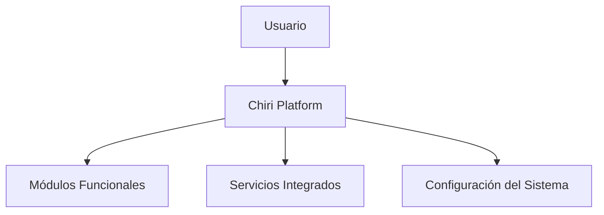
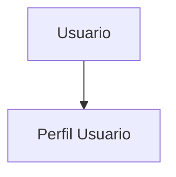
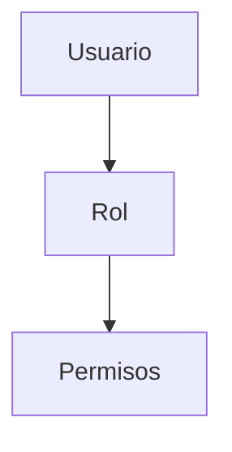
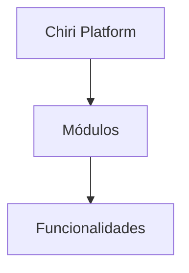
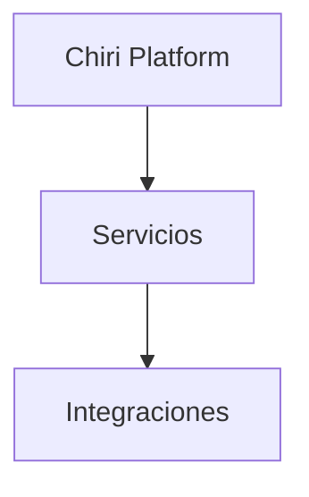
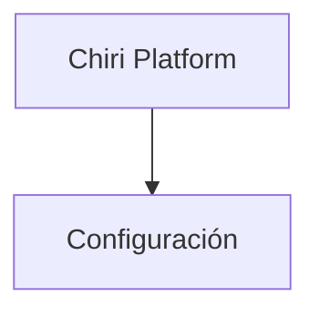
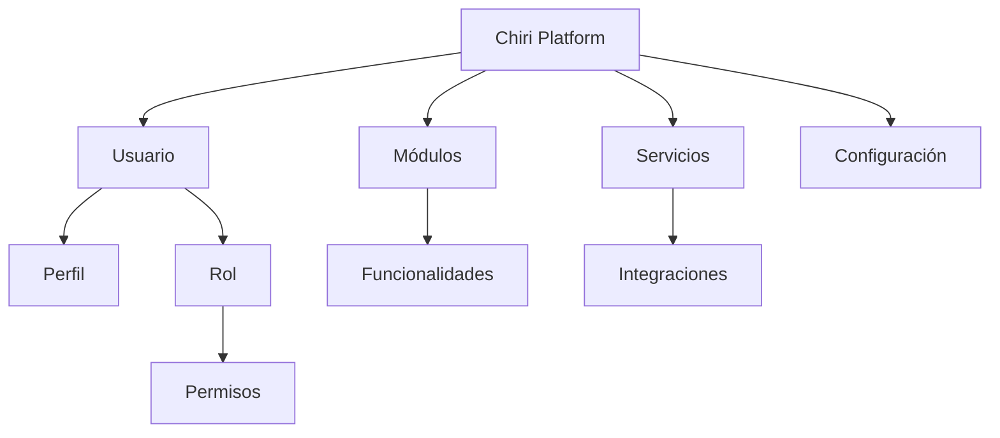

# 110_ModeloDominio.md

# Modelo de Dominio Chiri Platform v1.0

## 1. Objetivo

Definir el modelo conceptual del dominio de Chiri Platform v1.0, identificando las entidades principales, sus responsabilidades y relaciones.

Este documento establece la base para:

* Diseño del Backend.
* Diseño de Base de Datos.
* Definición de APIs.
* Desarrollo de funcionalidades futuras.

---

# 2. Alcance

El modelo de dominio representa los conceptos principales de la plataforma.

Incluye:

* Usuarios.
* Seguridad e identidad.
* Servicios.
* Módulos funcionales.
* Configuración.
* Información operativa.

No incluye:

* Diseño visual.
* Implementación de código.
* Estructura física de tablas.

---

# 3. Concepto General del Dominio

Chiri Platform es una plataforma personal modular orientada a integrar servicios digitales mediante una arquitectura centralizada.

El dominio principal está compuesto por:



---

# 4. Entidades Principales

## 4.1 Usuario

Representa la identidad de una persona dentro del sistema.

Responsabilidades:

* Autenticación.
* Acceso a módulos.
* Gestión de preferencias.
* Asociación con permisos.

---

## 4.2 Perfil

Define características del usuario.

Ejemplos:

* Preferencias.
* Configuración personal.
* Información complementaria.

Relación:



---

## 4.3 Rol

Define el nivel de acceso del usuario.

Responsabilidades:

* Agrupar permisos.
* Controlar capacidades del usuario.

Relación:



---

## 4.4 Módulo

Representa una capacidad funcional de la plataforma.

Ejemplos:

* Automatización.
* Multimedia.
* Gestión personal.
* Integraciones.

Relación:



---

## 4.5 Servicio

Representa componentes externos o internos integrados.

Ejemplos:

* Servicios multimedia.
* Servicios inteligentes.
* Automatización.
* Sistemas externos.

Relación:



---

## 4.6 Configuración

Representa parámetros que permiten adaptar el comportamiento del sistema.

Ejemplos:

* Preferencias.
* Parámetros de servicios.
* Configuración general.

Relación:



---

# 5. Modelo General del Dominio



---

# 6. Relaciones Principales

| Entidad    | Relación                 |
| ---------- | ------------------------ |
| Usuario    | Tiene un Perfil          |
| Usuario    | Tiene Roles              |
| Rol        | Tiene Permisos           |
| Plataforma | Contiene Módulos         |
| Módulo     | Contiene Funcionalidades |
| Plataforma | Integra Servicios        |
| Plataforma | Administra Configuración |

---

# 7. Reglas Generales del Modelo

## Regla 1

Toda funcionalidad debe pertenecer a un módulo.

---

## Regla 2

El acceso a funcionalidades debe estar controlado mediante permisos.

---

## Regla 3

Los servicios externos deben estar desacoplados del núcleo de la plataforma.

---

## Regla 4

La configuración debe mantenerse separada de la lógica funcional.

---

# 8. Evolución del Modelo

El modelo debe permitir futuras incorporaciones:

* Nuevos módulos.
* Nuevos servicios.
* Nuevos perfiles.
* Nuevos tipos de integración.

La evolución debe mantener compatibilidad con la arquitectura definida.

---

# 9. Estado del Documento

Documento:

```text
110_ModeloDominio.md
```

Versión:

```text
Chiri Platform v1.0
```

Estado:

```text
EN REVISIÓN
```
