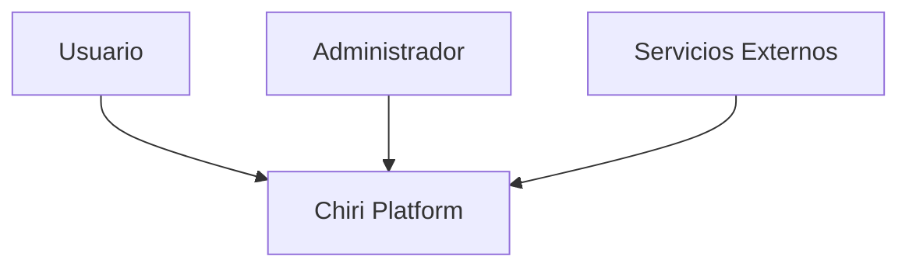
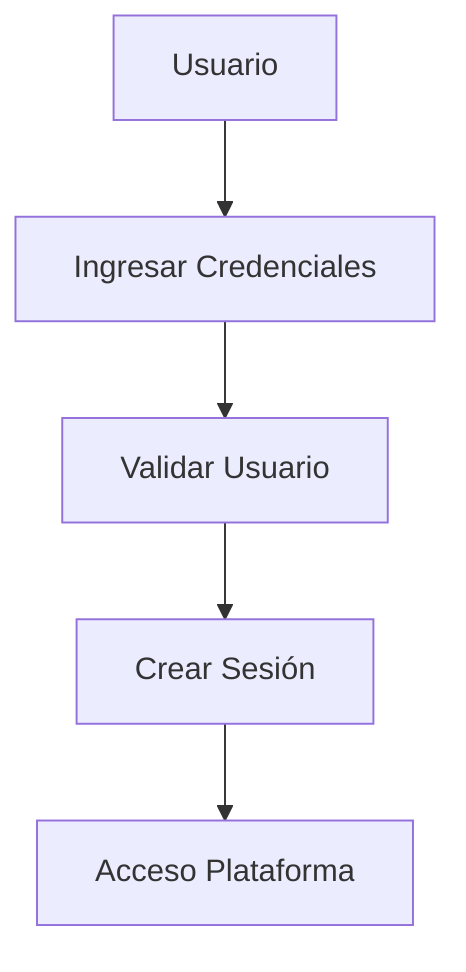
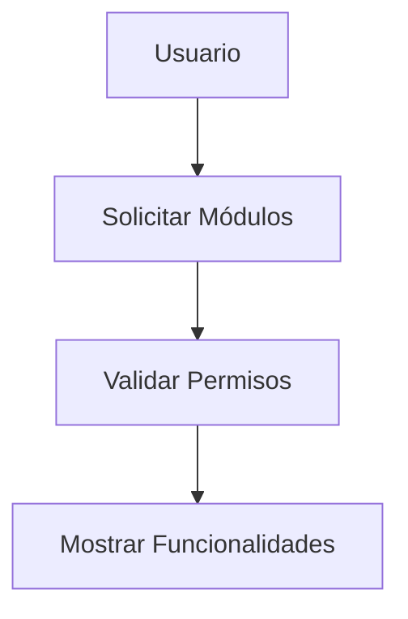
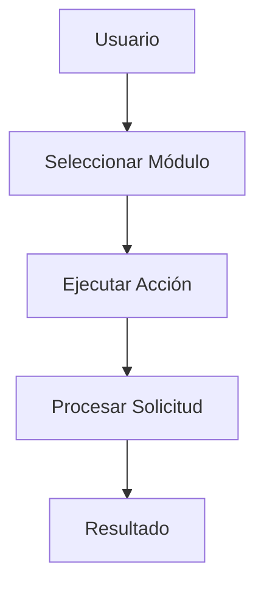
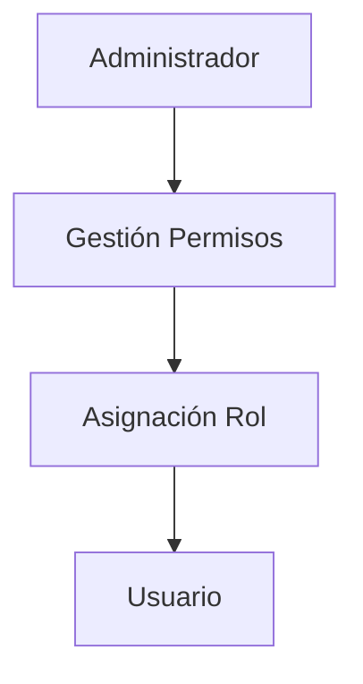
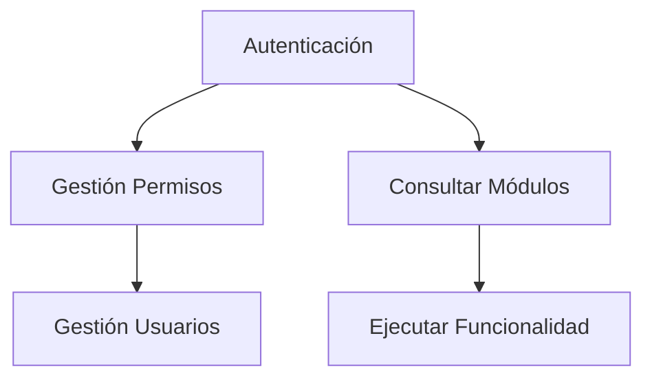

# 120_CasosUso.md

# Casos de Uso Chiri Platform v1.0

## 1. Objetivo

Definir los casos de uso principales de Chiri Platform v1.0, identificando la interacción entre los actores y las capacidades funcionales del sistema.

Este documento establece la base para:

* Diseño funcional.
* Desarrollo Backend.
* Definición de APIs.
* Validación de requerimientos.

---

# 2. Alcance

Los casos de uso representan las operaciones principales de la plataforma.

Incluye:

* Gestión de identidad.
* Acceso al sistema.
* Gestión de módulos.
* Uso de servicios integrados.
* Administración de configuración.

No incluye:

* Diseño de pantallas.
* Detalles de implementación.
* Código fuente.

---

# 3. Actores del Sistema

## 3.1 Usuario

Actor principal.

Responsabilidades:

* Acceder a la plataforma.
* Utilizar funcionalidades disponibles.
* Gestionar preferencias.

---

## 3.2 Administrador

Actor con capacidades administrativas.

Responsabilidades:

* Gestionar usuarios.
* Gestionar permisos.
* Configurar servicios.

---

## 3.3 Servicios Externos

Representan sistemas externos conectados con Chiri Platform.

Ejemplos:

* Servicios multimedia.
* Servicios inteligentes.
* Integraciones externas.

---

# 4. Modelo General de Actores



---

# 5. Casos de Uso Principales

## UC-001 Autenticarse en el Sistema

### Actor

Usuario.

### Objetivo

Permitir acceso seguro a la plataforma.

### Flujo general



---

## UC-002 Consultar Funcionalidades Disponibles

### Actor

Usuario.

### Objetivo

Permitir visualizar los módulos disponibles según permisos.

Flujo:



---

## UC-003 Ejecutar Funcionalidad de un Módulo

### Actor

Usuario.

### Objetivo

Permitir utilizar capacidades de la plataforma.

Flujo:



---

## UC-004 Gestionar Usuarios

### Actor

Administrador.

### Objetivo

Administrar usuarios del sistema.

Operaciones:

* Crear usuario.
* Modificar usuario.
* Desactivar usuario.
* Consultar usuarios.

---

## UC-005 Gestionar Permisos

### Actor

Administrador.

### Objetivo

Controlar acceso a funcionalidades.

Flujo:



---

## UC-006 Administrar Configuración

### Actor

Administrador.

### Objetivo

Modificar parámetros del sistema.

Incluye:

* Configuración general.
* Parámetros de servicios.
* Preferencias.

---

# 6. Relación entre Casos de Uso



---

# 7. Reglas Generales

## Regla 1

Todo acceso funcional requiere autenticación previa.

---

## Regla 2

Toda funcionalidad debe validar permisos.

---

## Regla 3

Los servicios externos deben integrarse mediante interfaces definidas.

---

## Regla 4

Las operaciones administrativas deben tener trazabilidad.

---

# 8. Evolución Futura

Los casos de uso podrán ampliarse con nuevos módulos:

* Automatización del hogar.
* Multimedia.
* Inteligencia artificial.
* Servicios personales.
* Nuevas integraciones.

---

# 9. Estado del Documento

Documento:

```text
120_CasosUso.md
```

Versión:

```text
Chiri Platform v1.0
```

Estado:

```text
EN REVISIÓN
```
