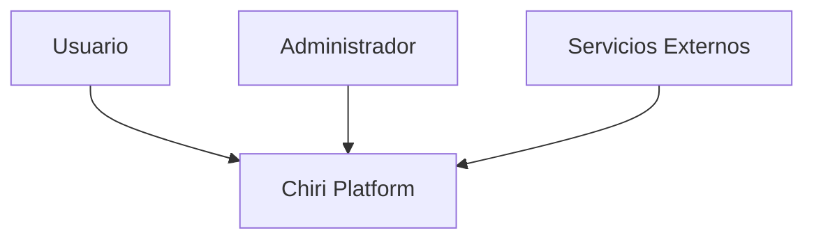
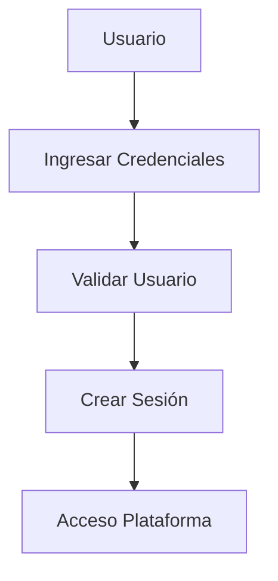
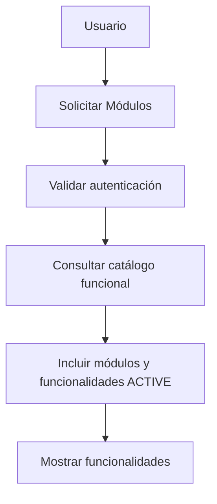
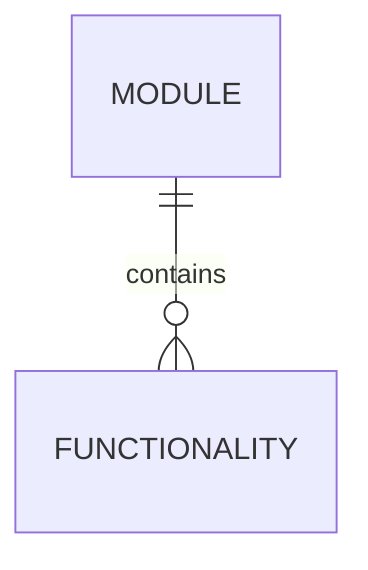
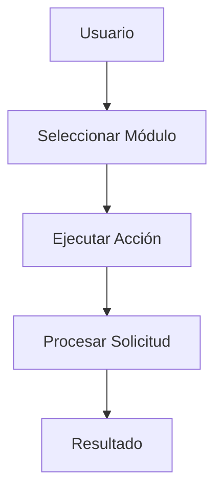
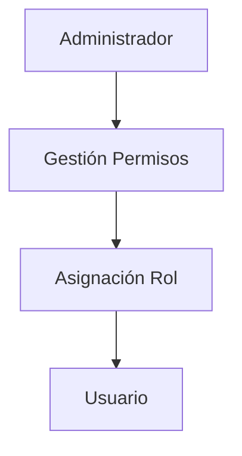
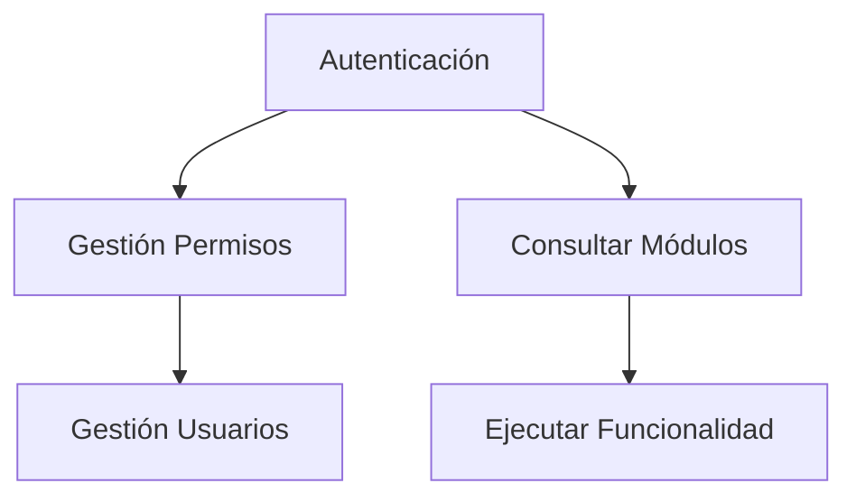

# 120_CasosUso.md

# Casos de Uso Chiri Platform v1.0

## 1. Objetivo

Definir los casos de uso principales de Chiri Platform v1.0, identificando la interacción entre los actores y las capacidades funcionales del sistema.

Este documento establece la base para:

* Diseño funcional.
* Desarrollo Backend.
* Definición de APIs.
* Validación de requerimientos.

---

# 2. Alcance

Los casos de uso representan las operaciones principales de la plataforma.

Incluye:

* Gestión de identidad.
* Acceso al sistema.
* Gestión de módulos.
* Uso de servicios integrados.
* Administración de configuración.

No incluye:

* Diseño de pantallas.
* Detalles de implementación.
* Código fuente.

---

# 3. Actores del Sistema

## 3.1 Usuario

Actor principal.

Responsabilidades:

* Acceder a la plataforma.
* Utilizar funcionalidades disponibles.
* Gestionar preferencias.

---

## 3.2 Administrador

Actor con capacidades administrativas.

Responsabilidades:

* Gestionar usuarios.
* Gestionar permisos.
* Configurar servicios.

---

## 3.3 Servicios Externos

Representan sistemas externos conectados con Chiri Platform.

Ejemplos:

* Servicios multimedia.
* Servicios inteligentes.
* Integraciones externas.

---

# 4. Modelo General de Actores



---

# 5. Casos de Uso Principales

## UC-001 Autenticarse en el Sistema

### Actor

Usuario.

### Objetivo

Permitir acceso seguro a la plataforma.

### Flujo general



---

## UC-002 Consultar Funcionalidades Disponibles

### Actor

Usuario.

### Objetivo

Permitir visualizar el catálogo funcional disponible para el usuario autenticado.

El catálogo se organiza mediante módulos y funcionalidades:

```text
Módulo
   └── Funcionalidades
```

### Flujo general



### Catálogo inicial v1.0

Los módulos iniciales son:

```text
Hogar

Multimedia
├── Música
├── Videos
└── Fotos

Inteligencia Artificial

Personal

Configuración
```

Las categorías `Música`, `Videos` y `Fotos` forman parte de la organización funcional de `Multimedia`.

### Funcionalidades iniciales

#### Hogar

```text
Hogar
├── Dispositivos
├── Estado del hogar
└── Automatizaciones
```

#### Multimedia

```text
Multimedia
├── Música
├── Videos
└── Fotos
```

Las acciones concretas de estas áreas, como buscar, reproducir, controlar o visualizar contenido, se definirán posteriormente dentro de UC-003.

#### Inteligencia Artificial

```text
Inteligencia Artificial
├── Asistente IA
└── Consultas IA
```

#### Personal

```text
Personal
├── Perfil
└── Servicios personales
```

#### Configuración

```text
Configuración
├── Cuenta
├── Preferencias
└── Seguridad
```

### Reglas de UC-002

* El usuario debe estar autenticado.
* El catálogo se consulta mediante el Backend.
* Solo se devuelven módulos `ACTIVE`.
* Solo se devuelven funcionalidades `ACTIVE`.
* Las funcionalidades se presentan agrupadas por módulo.
* Los módulos se ordenan mediante `sort_order` ascendente.
* Las funcionalidades se ordenan mediante `sort_order` ascendente.
* Un módulo `INACTIVE` no se devuelve ni incluye sus funcionalidades.
* Una funcionalidad `INACTIVE` no se devuelve.
* Un catálogo vacío se representa como una colección vacía y no como un error de recurso inexistente.

### Autorización granular

El filtrado por roles y permisos no forma parte de la implementación actual de UC-002 porque el dominio de autorización todavía no está implementado.

En esta etapa, el acceso al catálogo requiere autenticación válida y devuelve el catálogo funcional activo.

La autorización granular será incorporada posteriormente mediante UC-005, sin crear relaciones temporales o artificiales entre `functionality` y `permission`.

El cliente Android no determina por sí mismo qué capacidades están autorizadas.

### Contrato API de UC-002

Endpoint:

```http
GET /modules
```

Autenticación:

```http
Authorization: Bearer ACCESS_TOKEN
```

Respuesta exitosa:

```http
200 OK
```

Modelo conceptual de respuesta:

```json
{
  "modules": [
    {
      "id": "MODULE_UUID",
      "code": "home",
      "name": "Hogar",
      "description": "Funciones relacionadas con el hogar",
      "functionalities": [
        {
          "id": "FUNCTIONALITY_UUID",
          "code": "home.devices",
          "name": "Dispositivos",
          "description": "Consultar y utilizar capacidades relacionadas con dispositivos"
        }
      ]
    }
  ]
}
```

El contrato público no expone campos internos de persistencia como `status`, `sort_order`, `created_at` o `updated_at`.

Si no existen módulos activos, la respuesta será:

```json
{
  "modules": []
}
```

Las solicitudes sin autenticación válida deberán responder con `401 Unauthorized` conforme al contrato general de autenticación de la API.

### Modelo funcional de UC-002



`Module` representa un área funcional principal de Chiri.

`Functionality` representa una capacidad concreta perteneciente a un módulo.

La relación física será:

```text
functionality.module_id → module.id
```

Los identificadores serán UUID.

Los códigos serán identificadores estables y no deberán depender del texto mostrado al usuario.

Los estados iniciales serán:

```text
ACTIVE
INACTIVE
```

Las entidades utilizarán `created_at` y `updated_at` con referencia UTC.

La definición física definitiva de las tablas se realizará mediante migración Alembic antes de su implementación.

---

## UC-003 Ejecutar Funcionalidad de un Módulo

### Actor

Usuario.

### Objetivo

Permitir utilizar capacidades de la plataforma.

### Flujo general



---

## UC-004 Gestionar Usuarios

### Actor

Administrador.

### Objetivo

Administrar usuarios del sistema.

Operaciones:

* Crear usuario.
* Modificar usuario.
* Desactivar usuario.
* Consultar usuarios.

---

## UC-005 Gestionar Permisos

### Actor

Administrador.

### Objetivo

Controlar acceso a funcionalidades.

Flujo:



---

## UC-006 Administrar Configuración

### Actor

Administrador.

### Objetivo

Modificar parámetros del sistema.

Incluye:

* Configuración general.
* Parámetros de servicios.
* Preferencias.

---

# 6. Relación entre Casos de Uso



---

# 7. Reglas Generales

## Regla 1

Todo acceso funcional requiere autenticación previa.

---

## Regla 2

Toda funcionalidad debe validar permisos.

---

## Regla 3

Los servicios externos deben integrarse mediante interfaces definidas.

---

## Regla 4

Las operaciones administrativas deben tener trazabilidad.

---

# 8. Evolución Futura

Los casos de uso podrán ampliarse con nuevos módulos:

* Automatización del hogar.
* Multimedia.
* Inteligencia artificial.
* Servicios personales.
* Nuevas integraciones.

---

# 9. Estado del Documento

Documento:

```text
120_CasosUso.md
```

Versión:

```text
Chiri Platform v1.0
```

Estado:

```text
EN REVISIÓN
```
