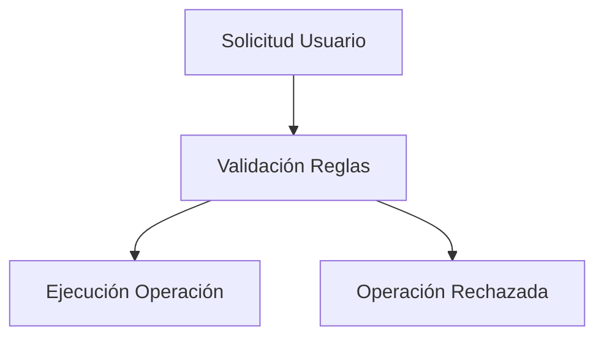
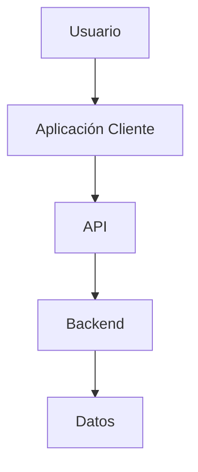
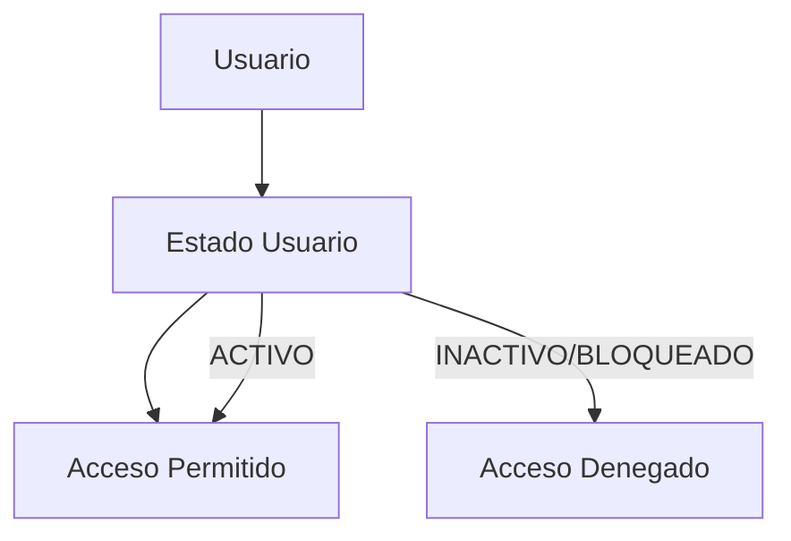
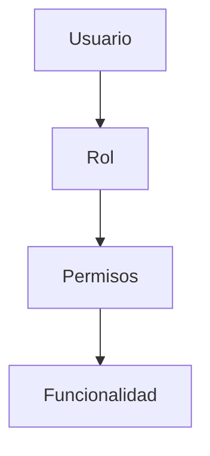
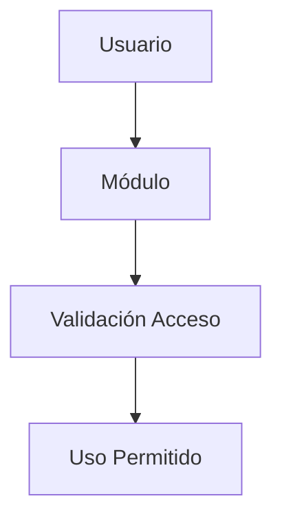
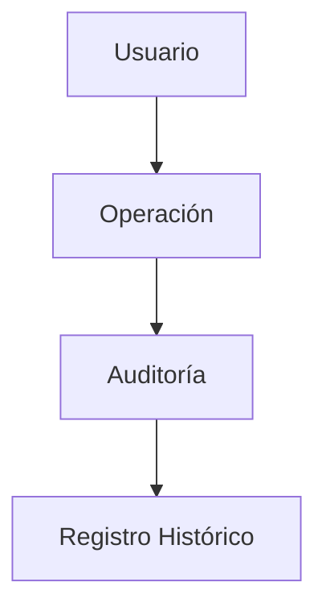

# 130_ReglasNegocio.md

# Reglas de Negocio Chiri Platform v1.0

## 1. Objetivo

Definir las reglas que gobiernan el comportamiento funcional de Chiri Platform v1.0.

Las reglas de negocio representan las condiciones, restricciones y comportamientos que deben cumplirse independientemente de la tecnología utilizada.

Este documento es referencia para:

* Backend.
* API.
* Base de Datos.
* Aplicación Android.

---

# 2. Alcance

Incluye reglas relacionadas con:

* Usuarios.
* Identidad.
* Roles.
* Permisos.
* Módulos.
* Servicios.
* Configuración.
* Auditoría.

No incluye:

* Implementación técnica.
* Código fuente.
* Diseño visual.

---

# 3. Principios Generales del Negocio

## RN-001 Validación centralizada

Toda operación debe ser validada por la capa correspondiente antes de ejecutarse.



---

## RN-002 Separación de responsabilidades

Cada componente debe cumplir únicamente su responsabilidad definida.



---

# 4. Reglas de Usuario

## RN-101 Creación de usuario

Un usuario debe:

* Tener identificador único.
* Tener credenciales válidas.
* Estar asociado a un estado.

Estados permitidos:

```text
ACTIVO
INACTIVO
BLOQUEADO
```

---

## RN-102 Estado de usuario

Un usuario solo puede acceder cuando:



---

# 5. Reglas de Autenticación

## RN-201 Inicio de sesión

Para autenticarse:

Debe existir:

* Usuario registrado.
* Credencial válida.
* Usuario habilitado.

---

## RN-202 Sesión

Una sesión debe:

* Tener tiempo de expiración.
* Estar asociada al usuario.
* Poder ser invalidada.

---

# 6. Reglas de Roles y Permisos

## RN-301 Asignación de permisos

Los permisos se asignan mediante roles.

Modelo:



---

## RN-302 Control de acceso

Toda funcionalidad debe validar:

* Usuario autenticado.
* Rol asignado.
* Permiso requerido.

---

# 7. Reglas de Módulos

## RN-401 Activación de módulos

Un módulo puede estar:

```text
ACTIVO
INACTIVO
EN_MANTENIMIENTO
```

---

## RN-402 Acceso a módulos

Un usuario solamente puede utilizar módulos:

* Activos.
* Permitidos por sus permisos.



---

# 8. Reglas de Servicios Integrados

## RN-501 Integración externa

Todo servicio externo debe:

* Tener identificación.
* Mantener configuración propia.
* Estar desacoplado del núcleo.

---

## RN-502 Disponibilidad del servicio

Si un servicio externo no está disponible:

* El sistema debe informar el estado.
* No debe afectar otros módulos independientes.

---

# 9. Reglas de Configuración

## RN-601 Configuración separada

La configuración debe mantenerse independiente de la lógica funcional.

---

## RN-602 Cambios de configuración

Los cambios importantes deben:

* Requerir permisos.
* Registrarse en auditoría.

---

# 10. Reglas de Auditoría

## RN-701 Registro de operaciones

Deben registrarse:

* Accesos.
* Cambios de permisos.
* Cambios administrativos.
* Operaciones críticas.

Modelo:



---

# 11. Reglas de Integridad

## RN-801 Consistencia de información

Toda operación debe mantener:

* Integridad.
* Validación.
* Consistencia.

---

## RN-802 Eliminación de información

La eliminación de información crítica debe estar controlada.

Preferencia:

* Desactivación lógica.
* Conservación histórica.

---

# 12. Evolución de Reglas

Las nuevas funcionalidades deberán:

* Definir sus reglas propias.
* Mantener compatibilidad.
* Respetar la arquitectura base.

---

# 13. Estado del Documento

Documento:

```text id="p8m4vz"
130_ReglasNegocio.md
```

Versión:

```text id="r5y2cd"
Chiri Platform v1.0
```

Estado:

```text id="m3j8qv"
EN REVISIÓN
```
