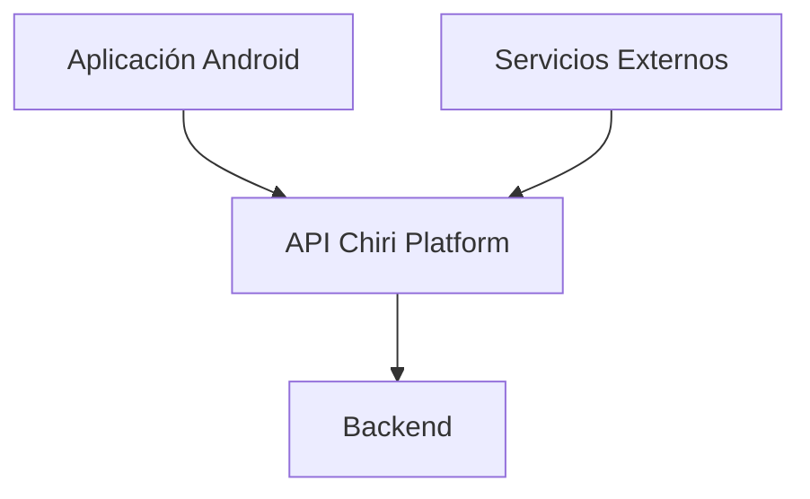
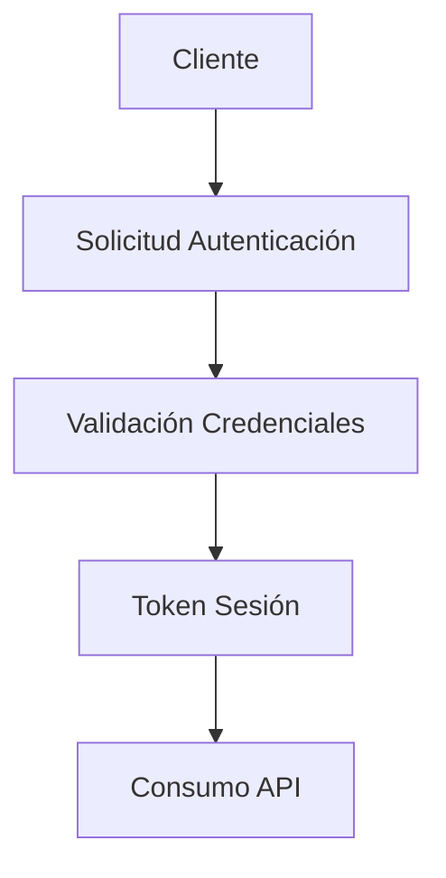
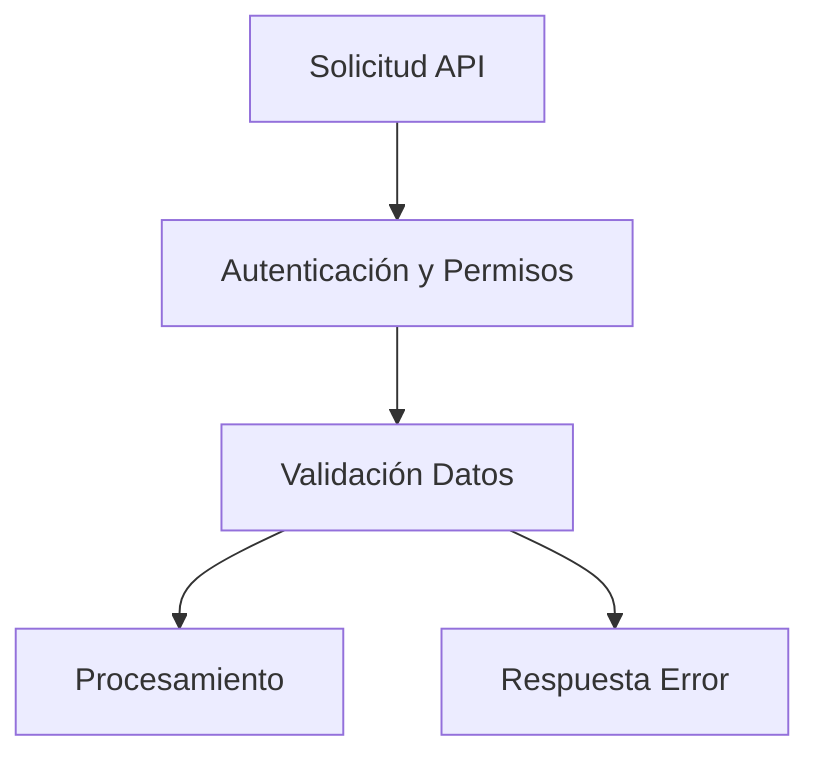
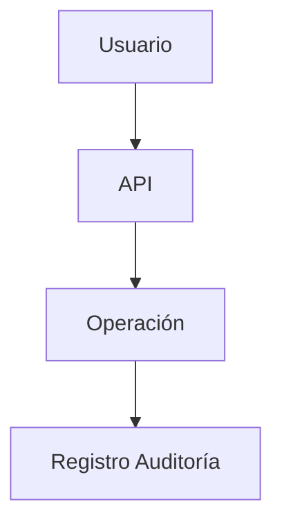

# 140_EspecificacionAPI.md

# Especificación API Chiri Platform v1.0

## 1. Objetivo

Definir el contrato funcional de la API de Chiri Platform v1.0, estableciendo la forma en que los clientes y servicios interactúan con la plataforma.

Este documento define:

* Recursos disponibles.
* Operaciones permitidas.
* Estructura de solicitudes.
* Estructura de respuestas.
* Reglas de comunicación.
* Seguridad de acceso.

---

# 2. Alcance

La API representa la capa de comunicación entre:

* Aplicación Android.
* Servicios externos autorizados.
* Backend Chiri Platform.



---

# 3. Principios de Diseño API

La API debe cumplir:

* Comunicación mediante HTTPS.
* Validación de solicitudes.
* Respuestas consistentes.
* Control de autenticación.
* Control de autorización.
* Versionamiento.

---

# 4. Versionamiento

La API utilizará versionamiento explícito.

Formato:

```text id="x8k1mv"
/api/v1/recurso
```

Ejemplo conceptual:

```text id="7jv4pz"
GET /api/v1/usuarios
```

---

# 5. Autenticación API

La comunicación requiere autenticación mediante token.

Flujo:



---

# 6. Estructura General de Solicitudes

Una solicitud API contiene:

```text id="k2m9vx"
HTTP Method
URL
Headers
Body
Token
```

Ejemplo conceptual:

```text id="4d5w8q"
GET /api/v1/usuarios

Authorization: Bearer TOKEN
```

---

# 7. Estructura General de Respuestas

Todas las respuestas deben mantener estructura consistente.

Respuesta exitosa:

```text id="3c9q1v"
{
  "success": true,
  "data": {}
}
```

Respuesta con error:

```text id="m7x2kp"
{
  "success": false,
  "error": {
     "code": "",
     "message": ""
  }
}
```

---

# 8. Recursos Principales

## 8.1 Usuarios

Recurso:

```text id="f4j8ms"
usuarios
```

Operaciones:

| Método | Acción             |
| ------ | ------------------ |
| GET    | Consultar usuarios |
| POST   | Crear usuario      |
| PUT    | Actualizar usuario |
| DELETE | Desactivar usuario |

---

## 8.2 Roles

Recurso:

```text id="w6r9qn"
roles
```

Operaciones:

* Consultar roles.
* Asignar permisos.
* Modificar permisos.

---

## 8.3 Módulos

Recurso:

```text id="p7x3md"
modulos
```

Operaciones:

* Consultar módulos disponibles.
* Consultar estado.
* Gestionar acceso.

---

## 8.4 Configuración

Recurso:

```text id="d9k5vf"
configuracion
```

Operaciones:

* Consultar parámetros.
* Actualizar configuración autorizada.

---

# 9. Validación de Solicitudes

Toda solicitud debe pasar por:



---

# 10. Códigos de Respuesta

La API utilizará códigos HTTP estándar:

| Código | Significado           |
| ------ | --------------------- |
| 200    | Operación correcta    |
| 201    | Creación correcta     |
| 400    | Solicitud inválida    |
| 401    | No autenticado        |
| 403    | Sin permisos          |
| 404    | Recurso no encontrado |
| 500    | Error interno         |

---

# 11. Manejo de Errores

Los errores deben:

* Tener código interno.
* Ser trazables.
* No exponer información sensible.

Ejemplo:

```text id="h9w4ps"
ERR_AUTH_001
ERR_DATA_001
ERR_INTERNAL_001
```

---

# 12. Auditoría API

Las operaciones críticas deben generar registro:



---

# 13. Evolución API

La API debe permitir:

* Nuevas versiones.
* Nuevos recursos.
* Nuevos módulos.
* Integraciones futuras.

La evolución no debe romper contratos existentes.

---

# 14. Estado del Documento

Documento:

```text id="n8f3cv"
140_EspecificacionAPI.md
```

Versión:

```text id="s2m6qa"
Chiri Platform v1.0
```

Estado:

```text id="d4x8pl"
EN REVISIÓN
```
