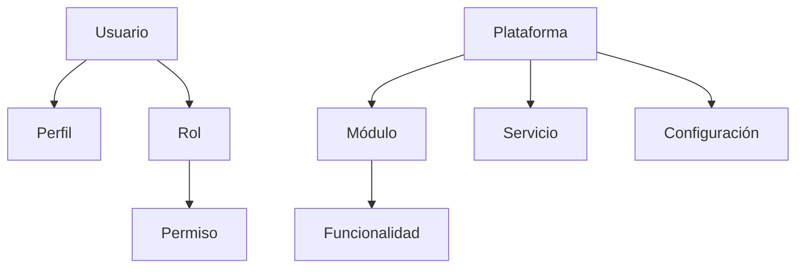
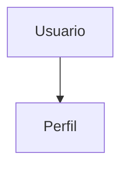
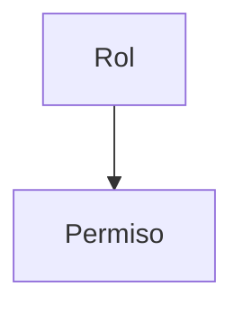
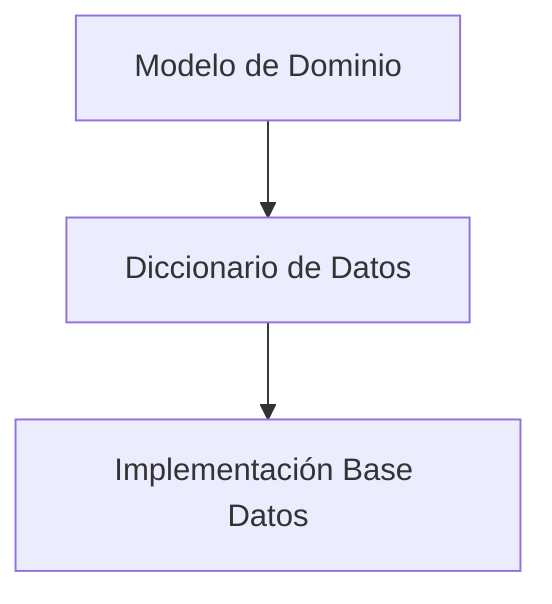

# 150_DiccionarioDatos.md

# Diccionario de Datos Chiri Platform v1.0

## 1. Objetivo

Definir el diccionario conceptual de datos de Chiri Platform v1.0, estableciendo las entidades principales, sus atributos y relaciones.

Este documento sirve como referencia para:

* Diseño de Base de Datos.
* Desarrollo Backend.
* Definición de modelos.
* Validación de información.

---

# 2. Alcance

El diccionario representa las entidades principales del dominio.

Incluye:

* Entidades.
* Atributos conceptuales.
* Relaciones.
* Reglas de integridad.

No incluye:

* Scripts SQL.
* Índices físicos.
* Implementación específica del motor de Base de Datos.

---

# 3. Convenciones de Datos

## 3.1 Identificadores

Toda entidad debe contar con:

```text id="2qv8ma"
ID único
Fecha creación
Fecha actualización
Estado
```

---

## 3.2 Convención de nombres

Conceptualmente:

* Entidades: PascalCase.
* Atributos: camelCase.

Ejemplo:

```text id="6nq4wt"
Entidad:
Usuario

Atributos:
usuarioId
nombre
fechaCreacion
```

---

# 4. Modelo General de Datos



---

# 5. Entidad Usuario

## Descripción

Representa la identidad principal dentro del sistema.

## Atributos conceptuales

| Atributo      | Descripción               |
| ------------- | ------------------------- |
| usuarioId     | Identificador único       |
| nombreUsuario | Nombre de acceso          |
| correo        | Identificador de contacto |
| claveHash     | Credencial protegida      |
| estado        | Estado del usuario        |
| fechaCreacion | Fecha registro            |

---

# 6. Entidad Perfil

## Descripción

Información complementaria del usuario.

## Atributos conceptuales

| Atributo       | Descripción            |
| -------------- | ---------------------- |
| perfilId       | Identificador          |
| usuarioId      | Usuario asociado       |
| nombreCompleto | Nombre mostrado        |
| preferencias   | Configuración personal |

Relación:



---

# 7. Entidad Rol

## Descripción

Define agrupación de permisos.

## Atributos conceptuales

| Atributo    | Descripción    |
| ----------- | -------------- |
| rolId       | Identificador  |
| nombre      | Nombre del rol |
| descripcion | Información    |

---

# 8. Entidad Permiso

## Descripción

Representa una capacidad autorizable.

## Atributos conceptuales

| Atributo    | Descripción    |
| ----------- | -------------- |
| permisoId   | Identificador  |
| codigo      | Código permiso |
| descripcion | Descripción    |

Relación:



---

# 9. Entidad Módulo

## Descripción

Representa una capacidad funcional de Chiri Platform.

## Atributos conceptuales

| Atributo | Descripción   |
| -------- | ------------- |
| moduloId | Identificador |
| nombre   | Nombre módulo |
| estado   | Estado        |

---

# 10. Entidad Funcionalidad

## Descripción

Representa una operación disponible dentro de un módulo.

## Atributos conceptuales

| Atributo        | Descripción     |
| --------------- | --------------- |
| funcionalidadId | Identificador   |
| moduloId        | Módulo asociado |
| nombre          | Nombre          |
| descripcion     | Detalle         |

---

# 11. Entidad Servicio

## Descripción

Representa un servicio integrado.

## Atributos conceptuales

| Atributo   | Descripción    |
| ---------- | -------------- |
| servicioId | Identificador  |
| nombre     | Servicio       |
| tipo       | Clasificación  |
| estado     | Disponibilidad |

---

# 12. Entidad Configuración

## Descripción

Representa parámetros configurables del sistema.

## Atributos conceptuales

| Atributo        | Descripción       |
| --------------- | ----------------- |
| configuracionId | Identificador     |
| clave           | Nombre parámetro  |
| valor           | Valor configurado |
| estado          | Estado            |

---

# 13. Reglas de Integridad

## RI-001

Toda entidad debe tener un identificador único.

---

## RI-002

Toda relación debe mantener referencia válida.

---

## RI-003

La información histórica debe conservar trazabilidad cuando corresponda.

---

## RI-004

Los datos sensibles deben almacenarse protegidos.

---

# 14. Trazabilidad con Modelo de Dominio



---

# 15. Evolución del Modelo

Nuevos módulos deberán:

* Definir sus entidades.
* Documentar atributos.
* Mantener relaciones claras.
* Actualizar el diccionario.

---

# 16. Estado del Documento

Documento:

```text id="h7r2md"
150_DiccionarioDatos.md
```

Versión:

```text id="e5q9kc"
Chiri Platform v1.0
```

Estado:

```text id="u8m4qa"
EN REVISIÓN
```
