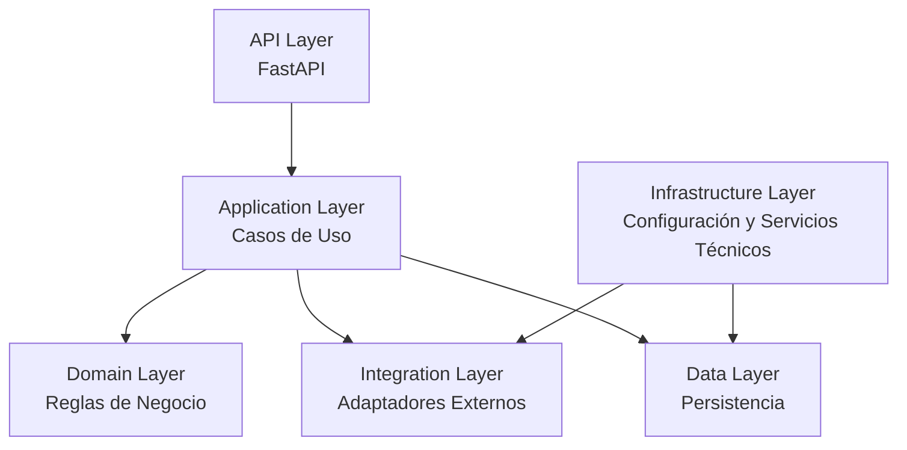
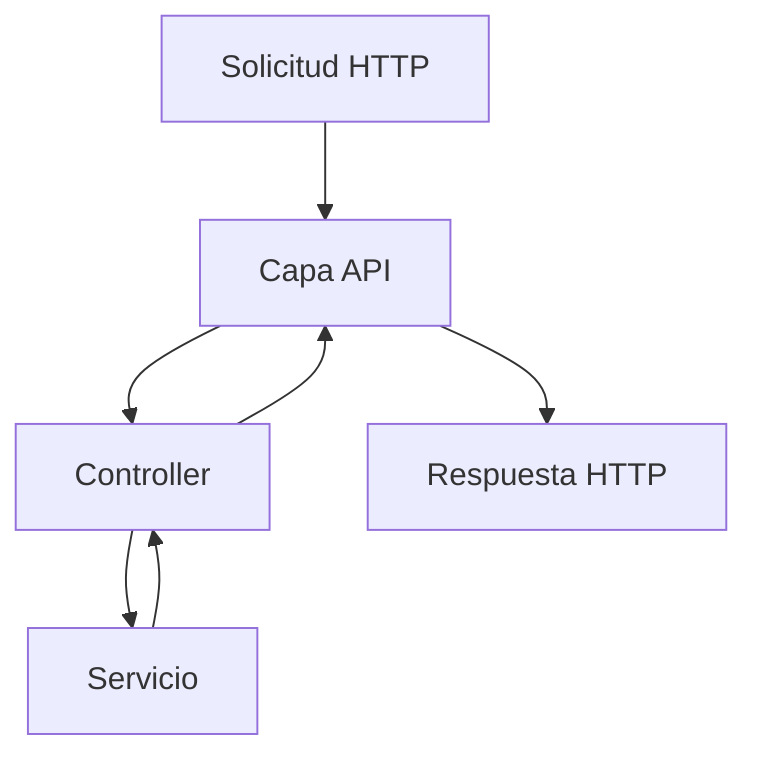
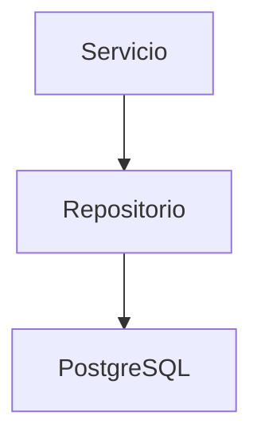
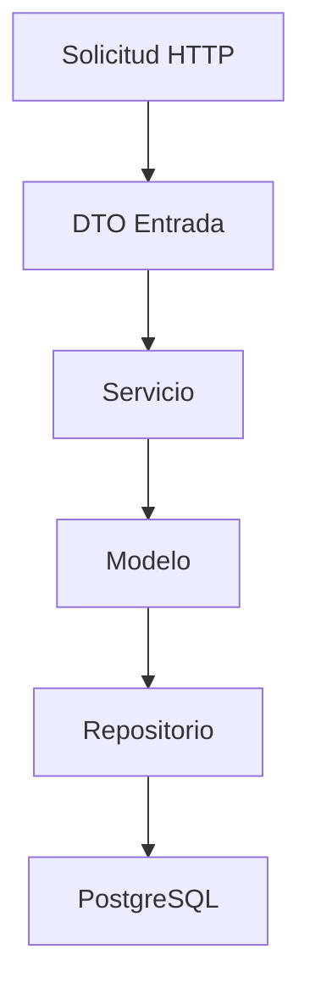
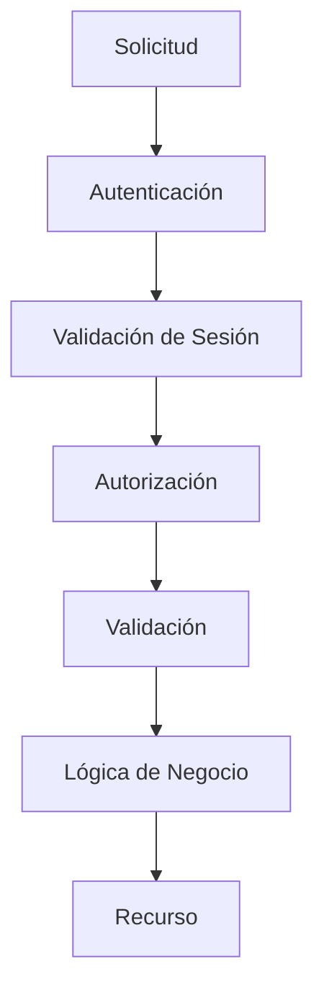

# 200_Backend_Implementacion.md

# Implementación Backend Chiri Platform v1.0

## 1. Objetivo

Definir la estructura técnica para la implementación del Backend de Chiri Platform v1.0.

Este documento transforma la arquitectura definida en:

* Estructura de proyecto.
* Organización de componentes.
* Reglas de desarrollo.
* Flujo interno de ejecución.

La implementación deberá respetar las responsabilidades y límites definidos en `030_Backend.md`.

---

# 2. Alcance

El Backend será responsable de:

* Lógica de negocio.
* Procesamiento de solicitudes.
* Validación de reglas.
* Comunicación con Base de Datos.
* Gestión de seguridad.
* Integración con servicios.

No será responsable de:

* Interfaces visuales.
* Lógica de presentación del cliente.
* Acceso directo de los clientes a servicios internos.
* Implementación de funcionalidades pertenecientes a servicios externos.

---

# 3. Arquitectura de Implementación

La implementación deberá mantener la separación de responsabilidades definida en `030_Backend.md`.

La arquitectura de implementación será:



Cada capa deberá mantener responsabilidades claramente definidas y evitar dependencias innecesarias con detalles de otras capas.

La implementación no deberá introducir una capa `Controller` o `Service` como arquitectura independiente cuando su responsabilidad pueda ser cubierta por las capas `API` y `Application`.

Los componentes denominados `Service` podrán existir como componentes internos de la `Application Layer` cuando representen casos de uso o coordinación de operaciones.

---

# 4. Estructura del Proyecto

La estructura del Backend deberá organizarse de acuerdo con las capas definidas en la arquitectura de implementación.

La estructura base será:

```text
source/server/

├── app/
│   │
│   ├── api/
│   │
│   ├── application/
│   │
│   ├── domain/
│   │
│   ├── integrations/
│   │
│   ├── data/
│   │
│   ├── security/
│   │
│   ├── config/
│   │
│   ├── infrastructure/
│   │
│   └── exceptions/
│
└── tests/
```

La estructura podrá ampliarse conforme se incorporen nuevas funcionalidades, siempre que se mantengan las responsabilidades definidas para cada capa.

Los componentes de seguridad podrán mantenerse agrupados en `security/` cuando correspondan a mecanismos transversales de protección del Backend.

Los componentes técnicos de ejecución y configuración deberán mantenerse separados de la lógica de negocio.

Los componentes de persistencia deberán mantenerse separados de las reglas de negocio.

Los adaptadores de servicios externos deberán mantenerse separados de la lógica propia de Chiri.

La estructura física de directorios podrá evolucionar durante la implementación siempre que no se alteren las responsabilidades arquitectónicas definidas en `030_Backend.md`.

---

# 5. Capa API

La Capa API representa el punto de entrada HTTP del Backend.

Su responsabilidad es recibir solicitudes externas, validar su estructura y dirigirlas hacia los componentes correspondientes.

## Responsabilidades

* Definir endpoints HTTP.
* Recibir solicitudes externas.
* Validar formato y estructura de entrada.
* Gestionar autenticación mediante los mecanismos definidos.
* Gestionar respuestas HTTP.
* Transformar DTOs de entrada y salida cuando corresponda.
* Aplicar dependencias y controles comunes de seguridad.

## No debe contener

* Reglas de negocio.
* Consultas directas a PostgreSQL.
* Acceso directo a repositorios.
* Comunicación directa con servicios externos.
* Decisiones de autorización implementadas únicamente en el cliente.

## Principio

> La Capa API deberá encargarse del transporte HTTP y de los controles de entrada, delegando la lógica de negocio a la Capa Service.

---

# 6. Capa Controller

La Capa Controller coordina la solicitud recibida por la API con el servicio de aplicación correspondiente.

## Responsabilidades

* Recibir los DTO de entrada.
* Invocar los servicios correspondientes.
* Coordinar el flujo de la operación.
* Transformar resultados en respuestas apropiadas.
* Propagar errores controlados hacia la Capa API.

## No debe contener

* Reglas de negocio complejas.
* Consultas directas a PostgreSQL.
* Implementaciones específicas de servicios externos.
* Lógica de persistencia.

## Flujo



# 7. Capa Service

La Capa Service contiene y coordina la lógica de aplicación y las reglas necesarias para ejecutar los casos de uso del Backend.

## Responsabilidades

* Ejecutar casos de uso.
* Aplicar reglas de negocio.
* Coordinar repositorios.
* Coordinar integraciones cuando corresponda.
* Validar condiciones necesarias para ejecutar una operación.
* Coordinar las operaciones relacionadas con seguridad.

## Ejemplo conceptual

```text
UsuarioService

- crearUsuario()
- actualizarUsuario()
- obtenerUsuario()
- validarEstadoUsuario()
```

Los servicios no deberán acceder directamente a PostgreSQL.

Cuando necesiten información persistente deberán utilizar los repositorios correspondientes.

---

# 8. Capa Repository

La Capa Repository encapsula el acceso a los datos persistentes de Chiri Platform.

## Responsabilidades

* Acceso a PostgreSQL.
* Consultas.
* Persistencia.
* Recuperación de entidades.
* Actualización de datos.
* Eliminación de datos cuando corresponda.

## Regla

Los Services no deberán acceder directamente a la Base de Datos.

El acceso deberá realizarse mediante repositorios.



La Capa Repository no deberá contener reglas de negocio.

---

# 9. Modelos y DTOs

Los modelos y DTOs deberán mantener separadas las estructuras internas del Backend de los datos utilizados para comunicación externa.

## 9.1 Modelo

El modelo representa la estructura interna utilizada por el dominio y la persistencia.

Los modelos no deberán exponerse automáticamente como contratos públicos de la API.

## 9.2 DTO

Los DTO representan los datos utilizados para comunicación entre la API y los componentes correspondientes.

Deberán utilizarse para:

* solicitudes;
* respuestas;
* validación de datos;
* transformación de información.

## Flujo conceptual



La separación entre DTO y modelos deberá evitar que los detalles internos de persistencia se conviertan automáticamente en contratos públicos de la API.

---

# 10. Seguridad Backend

La seguridad deberá formar parte del flujo de ejecución del Backend.

El Backend será la autoridad final para:

* autenticación;
* autorización;
* validación de sesión;
* protección de recursos;
* aplicación de reglas de seguridad;
* auditoría cuando corresponda.

El cliente no deberá determinar por sí mismo si una operación protegida está autorizada.

## Flujo conceptual



Una solicitud que no pueda superar correctamente los controles de seguridad deberá ser rechazada.

Los mecanismos de seguridad no deberán depender de información proporcionada únicamente por el cliente.

---

# 11. Manejo de Errores

El Backend deberá gestionar los errores de forma controlada.

Los errores deberán:

* tener una clasificación definida;
* producir respuestas consistentes;
* evitar la exposición de información interna;
* permitir diagnóstico mediante los mecanismos de registro correspondientes.

## Tipos conceptuales

```text
ValidationError
AuthenticationError
AuthorizationError
DatabaseError
InternalError
```

Los errores de autenticación y autorización no deberán revelar información innecesaria sobre usuarios, recursos o mecanismos internos.

Las excepciones no controladas no deberán provocar que el sistema continúe una operación en un estado inseguro.

Los errores internos podrán registrarse para diagnóstico, pero no deberán incluir:

* contraseñas;
* Access Tokens;
* Refresh Tokens;
* secretos;
* claves privadas;
* información sensible innecesaria.

---

# 12. Configuración

La configuración deberá mantenerse separada del código fuente.

Podrá incluir:

* conexiones a servicios;
* configuración de PostgreSQL;
* parámetros de seguridad;
* parámetros de aplicación;
* configuración de servicios externos;
* parámetros de ejecución.

Las credenciales y secretos no deberán incluirse directamente en el código fuente.

Los secretos deberán gestionarse mediante los mecanismos de configuración y almacenamiento seguro definidos para el entorno de ejecución.

---

# 13. Logs y Auditoría

El Backend deberá diferenciar entre registros operativos y registros de auditoría.

## 13.1 Logs operativos

Los logs operativos podrán utilizar los niveles:

```text
DEBUG
INFO
WARN
ERROR
```

Los logs deberán proporcionar información suficiente para diagnóstico y operación.

No deberán registrar:

* contraseñas;
* Access Tokens completos;
* Refresh Tokens completos;
* secretos;
* claves privadas;
* credenciales.

## 13.2 Auditoría

Los eventos relevantes de seguridad deberán registrarse mediante el mecanismo de auditoría definido por Chiri Platform.

La auditoría deberá permitir mantener trazabilidad sin almacenar secretos o información sensible innecesaria.

Los registros de auditoría deberán estar protegidos contra acceso, modificación o eliminación no autorizados.

---

# 14. Pruebas

El Backend deberá incluir pruebas automatizadas correspondientes a los componentes implementados.

## 14.1 Pruebas Unitarias

Deberán validar principalmente:

* reglas de negocio;
* servicios;
* validaciones;
* comportamiento ante errores;
* mecanismos de seguridad cuando corresponda.

## 14.2 Pruebas de Integración

Deberán validar la interacción entre componentes.

Como mínimo, cuando corresponda:

* API;
* Base de Datos;
* autenticación;
* sesiones;
* repositorios;
* integraciones externas.

## 14.3 Pruebas de Seguridad

Las funcionalidades relacionadas con autenticación, sesiones, autorización y protección contra abuso deberán disponer de pruebas específicas antes de considerarse completas.

Las pruebas deberán verificar tanto los casos permitidos como los casos rechazados.

---

# 15. Evolución del Backend

La implementación deberá permitir incorporar nuevas capacidades sin modificar innecesariamente los componentes existentes.

Deberá permitir:

* nuevos módulos;
* nuevos casos de uso;
* nuevos servicios;
* nuevas integraciones;
* nuevos endpoints;
* nuevos mecanismos de seguridad;
* evolución de los contratos de API.

Las nuevas funcionalidades deberán respetar la separación de responsabilidades definida en este documento.

Las modificaciones deberán evitar introducir dependencias innecesarias entre capas.

---

# 16. Estado del Documento

Documento:

```text
200_Backend_Implementacion.md
```

Versión:

```text
Chiri Platform v1.0
```

Estado:

```text
EN REVISIÓN
```
