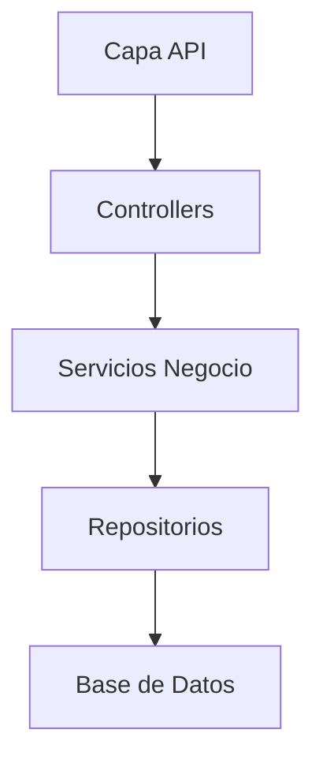
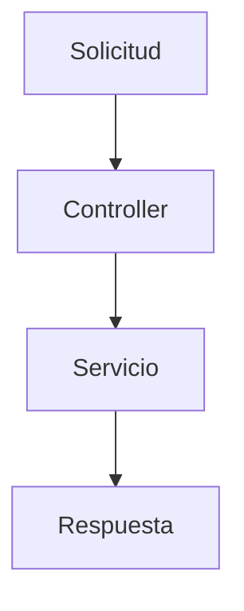
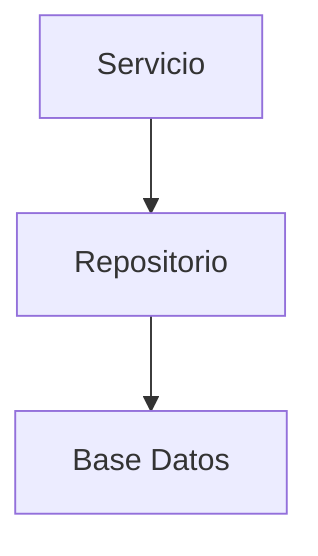
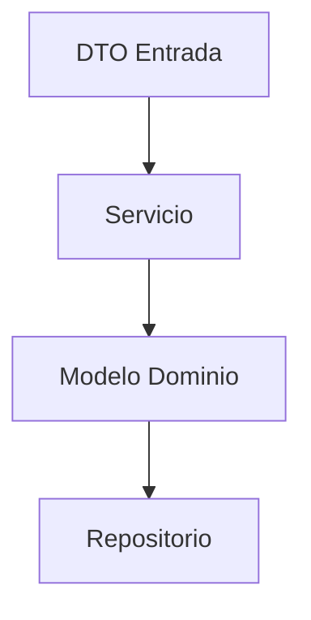
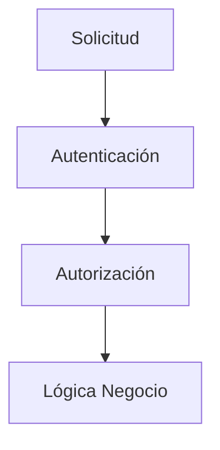

# 200_Backend_Implementacion.md

# Implementación Backend Chiri Platform v1.0

## 1. Objetivo

Definir la estructura técnica para la implementación del Backend de Chiri Platform v1.0.

Este documento transforma la arquitectura definida en:

* Estructura de proyecto.
* Organización de componentes.
* Reglas de desarrollo.
* Flujo interno de ejecución.

---

# 2. Alcance

El Backend será responsable de:

* Lógica de negocio.
* Procesamiento de solicitudes.
* Validación de reglas.
* Comunicación con Base de Datos.
* Gestión de seguridad.
* Integración con servicios.

No será responsable de:

* Interfaces visuales.
* Acceso directo desde clientes.
* Lógica de presentación.

---

# 3. Arquitectura de Implementación

La implementación mantiene la separación definida:



---

# 4. Estructura del Proyecto

Estructura propuesta:

```text id="n7q4mp"
backend-chiri/

├── api/
│
├── controllers/
│
├── services/
│
├── repositories/
│
├── models/
│
├── dto/
│
├── security/
│
├── config/
│
├── exceptions/
│
├── utils/
│
└── tests/
```

---

# 5. Capa API

Responsabilidad:

* Recibir solicitudes externas.
* Validar formato.
* Gestionar respuestas HTTP.
* Comunicar con Controllers.

No debe contener:

* Reglas de negocio.
* Acceso directo a datos.

---

# 6. Capa Controller

Responsabilidad:

* Coordinar solicitudes.
* Recibir DTO.
* Invocar servicios.
* Devolver respuestas.

Flujo:



---

# 7. Capa Service

Responsabilidad:

* Ejecutar reglas de negocio.
* Coordinar operaciones.
* Validar procesos.

Ejemplo conceptual:

```text id="t6m3pz"
UsuarioService

- crearUsuario()
- actualizarUsuario()
- validarPermisos()
```

---

# 8. Capa Repository

Responsabilidad:

* Acceso a datos.
* Consultas.
* Persistencia.

Regla:

Los Services nunca acceden directamente a Base de Datos.



---

# 9. Modelos y DTOs

## Modelo

Representa la estructura interna del dominio.

## DTO

Representa datos de comunicación externa.

Flujo:



---

# 10. Seguridad Backend

El Backend implementará:

* Validación de identidad.
* Control de permisos.
* Protección de datos.
* Auditoría.

Flujo:



---

# 11. Manejo de Errores

Todos los errores deben:

* Tener clasificación.
* Ser controlados.
* Generar respuestas consistentes.

Tipos:

```text id="x4n7mq"
ValidationError
AuthenticationError
AuthorizationError
DatabaseError
InternalError
```

---

# 12. Configuración

La configuración debe estar separada del código.

Incluye:

* Conexiones.
* Seguridad.
* Parámetros del sistema.
* Servicios externos.

---

# 13. Logs

Niveles:

```text id="v6m2qa"
DEBUG
INFO
WARN
ERROR
```

Reglas:

No registrar:

* Contraseñas.
* Tokens.
* Información sensible.

---

# 14. Pruebas

El Backend debe incluir:

## Pruebas Unitarias

Validación de:

* Servicios.
* Reglas de negocio.

## Pruebas Integración

Validación de:

* API.
* Base de Datos.
* Servicios.

---

# 15. Evolución Backend

La implementación debe permitir:

* Nuevos módulos.
* Nuevos servicios.
* Nuevas APIs.
* Escalabilidad futura.

---

# 16. Estado del Documento

Documento:

```text id="s9k3qw"
200_Backend_Implementacion.md
```

Versión:

```text id="z5m8vp"
Chiri Platform v1.0
```

Estado:

```text id="n4x7kc"
EN REVISIÓN
```
