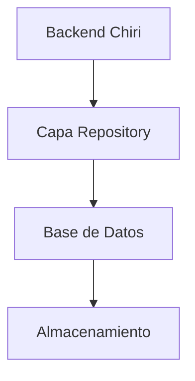
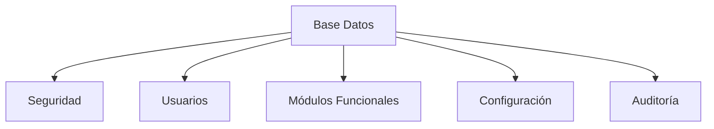
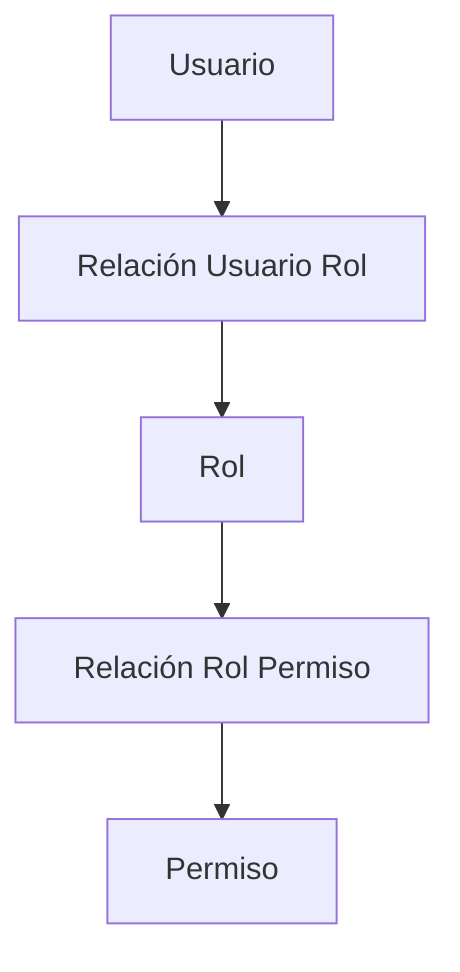
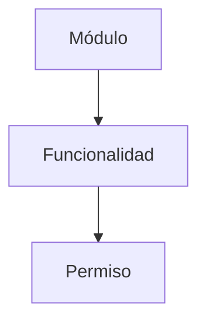
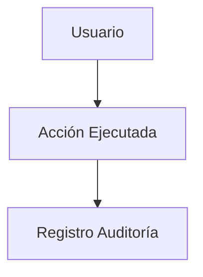
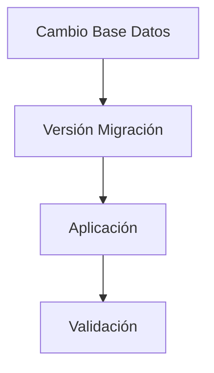

# 210_BaseDatos_Implementacion.md

# Implementación Base de Datos Chiri Platform v1.0

## 1. Objetivo

Definir la implementación técnica de la Base de Datos de Chiri Platform v1.0, tomando como referencia:

* `050_BaseDatos.md`
* `150_DiccionarioDatos.md`
* `110_ModeloDominio.md`

El objetivo es establecer una estructura consistente, segura y preparada para la evolución de la plataforma.

---

# 2. Alcance

La Base de Datos será responsable de:

* Almacenamiento persistente.
* Integridad de información.
* Relaciones entre entidades.
* Historial de operaciones.
* Soporte al Backend.

No será responsable de:

* Reglas de presentación.
* Lógica de interfaz.
* Autorización de clientes.

---

# 3. Modelo de Implementación

La comunicación seguirá:



---

# 4. Organización Conceptual

La Base de Datos se divide en dominios:



---

# 5. Entidades Principales

## 5.1 Usuario

Tabla conceptual:

```text id="q2x7mn"
Usuario
```

Responsabilidad:

* Identidad del sistema.
* Acceso.
* Asociación con permisos.

Atributos principales:

| Campo         | Descripción          |
| ------------- | -------------------- |
| usuarioId     | Identificador        |
| nombreUsuario | Usuario acceso       |
| correo        | Contacto             |
| claveHash     | Credencial protegida |
| estado        | Estado usuario       |
| fechaCreacion | Registro             |

---

# 6. Relaciones de Seguridad

Modelo:



---

# 7. Entidades Funcionales

Modelo:



---

# 8. Configuración del Sistema

Entidad conceptual:

```text id="h5q9rv"
Configuracion
```

Responsabilidad:

* Parámetros del sistema.
* Valores configurables.
* Preferencias generales.

Regla:

La configuración no debe estar mezclada con datos operativos.

---

# 9. Auditoría

Toda operación crítica debe poder registrarse.

Modelo:



Información registrada:

* Usuario ejecutor.
* Fecha.
* Operación.
* Resultado.

---

# 10. Integridad de Datos

Reglas:

## RI-DB-001

Toda tabla debe tener clave primaria.

---

## RI-DB-002

Toda relación debe utilizar referencias válidas.

---

## RI-DB-003

Los datos críticos deben conservar consistencia histórica.

---

## RI-DB-004

Los datos sensibles deben almacenarse protegidos.

---

# 11. Estados de Registros

Las entidades principales utilizarán control de estado.

Ejemplo:

```text id="m8q4vz"
ACTIVO
INACTIVO
ELIMINADO_LOGICO
```

Preferencia:

La eliminación física debe evitarse para información crítica.

---

# 12. Migraciones

Los cambios estructurales deben:

* Estar versionados.
* Ser reversibles cuando sea posible.
* Mantener trazabilidad.

Flujo:



---

# 13. Respaldos

La estrategia debe considerar:

* Copias periódicas.
* Restauración validada.
* Protección de información.

---

# 14. Rendimiento

Consideraciones:

* Consultas optimizadas.
* Relaciones claras.
* Evitar duplicidad innecesaria.
* Preparar crecimiento futuro.

---

# 15. Evolución Base de Datos

Nuevos módulos deberán:

* Definir nuevas entidades.
* Documentar relaciones.
* Actualizar diccionario.
* Mantener compatibilidad.

---

# 16. Estado del Documento

Documento:

```text id="v7k3pm"
210_BaseDatos_Implementacion.md
```

Versión:

```text id="z8q5mc"
Chiri Platform v1.0
```

Estado:

```text id="t4n8qx"
EN REVISIÓN
```
