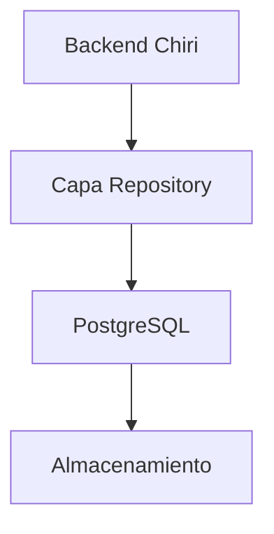
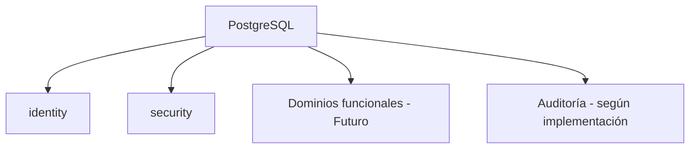
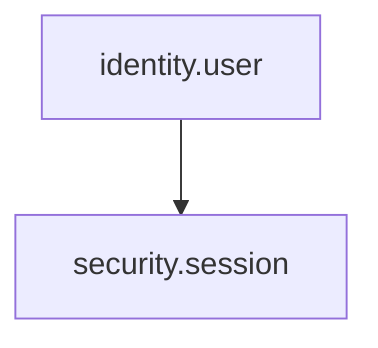
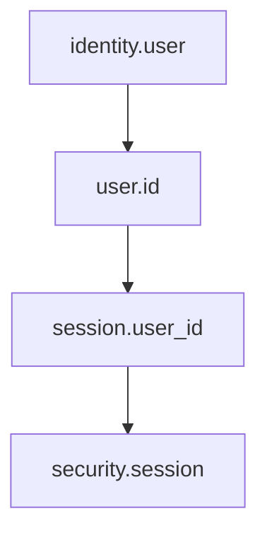
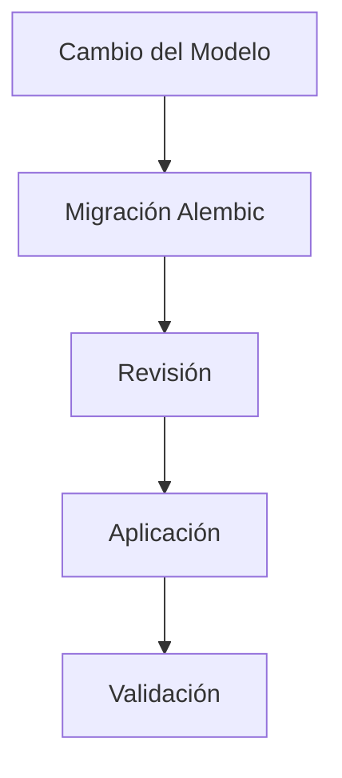

# 210_BaseDatos_Implementacion.md

# Implementación Base de Datos Chiri Platform v1.0

## 1. Objetivo

Definir la implementación técnica de la Base de Datos de Chiri Platform v1.0, tomando como referencia:

* `050_BaseDatos.md`
* `150_DiccionarioDatos.md`
* `110_ModeloDominio.md`
* `030_Backend.md`
* `070_Seguridad.md`
* `100_DecisionesArquitectura.md`

El objetivo es establecer una estructura consistente, segura y preparada para la evolución de Chiri Platform.

La implementación deberá mantener la separación entre los datos de identidad, seguridad y los futuros datos funcionales de la plataforma.

---

# 2. Alcance

La Base de Datos será responsable de:

* almacenamiento persistente;
* integridad de información;
* relaciones entre entidades;
* persistencia de usuarios;
* persistencia de sesiones;
* almacenamiento de información propia de Chiri;
* soporte al Backend;
* conservación de información necesaria para auditoría cuando corresponda.

La Base de Datos no será responsable de:

* reglas de presentación;
* lógica de interfaz;
* decisiones de autorización del cliente;
* lógica propia de servicios externos;
* autenticación ejecutada directamente por clientes.

El Backend será responsable de aplicar las reglas de negocio y utilizar la Base de Datos como mecanismo de persistencia.

---

# 3. Tecnología

La Base de Datos de Chiri Platform utilizará:

```text
PostgreSQL
```

La implementación deberá utilizar las capacidades estándar de PostgreSQL para:

* integridad referencial;
* restricciones;
* claves primarias;
* claves foráneas;
* índices;
* transacciones;
* tipos de datos;
* esquemas;
* control de acceso.

Las modificaciones estructurales deberán gestionarse mediante migraciones versionadas.

---

# 4. Modelo de Implementación

La comunicación con la Base de Datos seguirá:



El acceso a PostgreSQL deberá realizarse mediante la Capa Repository definida para el Backend.

Los Services no deberán acceder directamente a PostgreSQL.

La Base de Datos no deberá exponerse directamente a clientes externos.

---

# 5. Organización mediante Esquemas

La Base de Datos deberá utilizar esquemas para separar responsabilidades.

La organización inicial será:



Los esquemas funcionales adicionales podrán incorporarse conforme se implementen nuevos módulos.

La separación mediante esquemas deberá facilitar:

* organización;
* control de acceso;
* aislamiento lógico;
* evolución;
* mantenimiento.

---

# 6. Esquema Identity

El esquema:

```text
identity
```

contendrá la información relacionada con la identidad de los usuarios.

La entidad principal implementada será:

```text
identity.user
```

## 6.1 Usuario

El usuario representa la identidad principal dentro de Chiri Platform.

Los atributos principales serán:

| Campo         | Descripción                     |
| ------------- | ------------------------------- |
| id            | Identificador único del usuario |
| username      | Nombre de usuario               |
| email         | Dirección de correo             |
| password_hash | Hash de la contraseña           |
| status        | Estado de la cuenta             |
| created_at    | Fecha de creación               |

La contraseña nunca deberá almacenarse en texto plano.

El campo `password_hash` deberá contener únicamente el resultado del mecanismo de hash definido por la política de seguridad.

La implementación actual utiliza:

```text
Argon2id
```

---

# 7. Estado del Usuario

El estado de la identidad deberá utilizar únicamente los valores definidos por la arquitectura:

```text
ACTIVE
INACTIVE
DELETED
```

Estos valores representan el estado persistente de la identidad.

Una restricción temporal derivada de mecanismos de protección contra abuso no deberá crear un nuevo estado de usuario.

Por ejemplo, un bloqueo temporal por fuerza bruta no deberá convertirse en:

```text
BLOCKED
```

El mecanismo de protección deberá mantenerse separado del estado de identidad.

---

# 8. Esquema Security

El esquema:

```text
security
```

contendrá información relacionada con la seguridad de las sesiones.

La entidad implementada inicialmente será:

```text
security.session
```

---

# 9. Session

Una sesión representa la relación de seguridad activa entre un usuario y el Backend.

La sesión deberá estar asociada a un usuario mediante una referencia a:

```text
identity.user.id
```

Los atributos principales serán:

| Campo      | Descripción             |
| ---------- | ----------------------- |
| id         | Identificador de sesión |
| user_id    | Usuario asociado        |
| created_at | Fecha de creación       |
| expires_at | Fecha de expiración     |
| status     | Estado de la sesión     |

La relación conceptual será:



Una sesión no deberá existir asociada a un usuario inexistente.

La relación deberá estar protegida mediante integridad referencial.

---

# 10. Gestión de Sesiones

La persistencia de sesiones permitirá al Backend:

* validar sesiones;
* revocar sesiones;
* controlar expiración;
* asociar tokens con una sesión;
* invalidar sesiones cuando corresponda.

La validez definitiva de una sesión será determinada por el Backend.

Los clientes no deberán consultar directamente la Base de Datos para determinar la validez de una sesión.

---

# 11. Tokens y Base de Datos

Los Access Tokens utilizados por la API no deberán utilizarse como sustituto de la información persistente de sesión.

El Access Token será un mecanismo de autenticación temporal.

La arquitectura establece una duración máxima de:

```text
15 minutos
```

Los Access Tokens no deberán almacenarse permanentemente en PostgreSQL salvo que una futura decisión arquitectónica establezca explícitamente una necesidad.

No deberá implementarse una blacklist persistente de Access Tokens como mecanismo normal de funcionamiento.

La política inicial establece:

```text
Blacklist Access Token: No
```

---

# 12. Refresh Token

El Refresh Token deberá tratarse como una credencial sensible.

La política arquitectónica establece una duración máxima de:

```text
30 días
```

Los Refresh Tokens no deberán almacenarse en texto plano en la Base de Datos si la implementación requiere persistencia del mecanismo.

Cuando se implemente persistencia de Refresh Tokens, deberán utilizarse mecanismos que permitan validar y revocar el mecanismo sin almacenar innecesariamente el secreto original.

La implementación concreta deberá respetar la política de seguridad y rotación definida por el Backend.

---

# 13. Roles y Permisos

Los roles y permisos forman parte de la evolución futura de Chiri Platform.

Actualmente no deberán considerarse entidades implementadas en la Base de Datos v1.0.

Por lo tanto, las siguientes entidades permanecen como modelo futuro:

```text
Rol
Permiso
UsuarioRol
RolPermiso
```

No deberán crearse como parte de la implementación actual únicamente para anticipar funcionalidades futuras.

Su incorporación deberá realizarse mediante una decisión arquitectónica y las correspondientes migraciones cuando la autorización granular vaya a implementarse.

La decisión arquitectónica correspondiente se encuentra definida en:

```text
ADR-011
```

---

# 14. Integridad Referencial

Las relaciones entre entidades deberán utilizar claves foráneas cuando corresponda.

Ejemplo:



No deberá permitirse que una sesión válida quede asociada a un usuario inexistente.

Las restricciones de integridad deberán aplicarse en la Base de Datos y no depender únicamente de validaciones realizadas por el Backend.

---

# 15. Claves Primarias

Toda entidad persistente deberá disponer de una clave primaria.

Las claves primarias deberán:

* identificar de forma única el registro;
* permanecer estables durante la vida útil del registro;
* utilizar el tipo definido por el modelo correspondiente;
* estar protegidas mediante las restricciones de PostgreSQL.

---

# 16. Índices

Los índices deberán crearse cuando sean necesarios para:

* búsquedas frecuentes;
* relaciones;
* validaciones de unicidad;
* consultas utilizadas por operaciones críticas;
* mejora del rendimiento.

No deberán crearse índices innecesarios únicamente por anticipar consultas futuras.

Los índices deberán revisarse conforme evolucionen los patrones de acceso.

---

# 17. Restricciones de Unicidad

Los campos que deban ser únicos deberán disponer de restricciones apropiadas.

En el caso de la identidad, los atributos que requieran unicidad deberán estar protegidos mediante restricciones de Base de Datos.

La unicidad no deberá depender únicamente de una comprobación previa realizada por el Backend.

La Base de Datos deberá actuar como última capa de integridad para evitar duplicados cuando corresponda.

---

# 18. Transacciones

Las operaciones que modifiquen múltiples registros relacionados deberán utilizar transacciones cuando la consistencia de la operación lo requiera.

Una operación no deberá dejar la Base de Datos en un estado parcialmente actualizado cuando técnicamente pueda evitarse.

El Backend deberá utilizar las capacidades transaccionales de PostgreSQL para mantener la integridad de las operaciones.

---

# 19. Auditoría

Las operaciones relacionadas con seguridad deberán poder generar eventos de auditoría de acuerdo con las reglas definidas en:

```text
070_Seguridad.md
```

La auditoría deberá diferenciarse de los datos operativos normales.

Un registro de auditoría podrá contener, cuando corresponda:

```text
event_id
event_type
timestamp
request_id
user_id
username_hash
session_id
resource_type
resource_id
action
result
source
```

No todos los campos serán obligatorios para todos los eventos.

Los registros de auditoría no deberán almacenar:

* contraseñas;
* Access Tokens completos;
* Refresh Tokens completos;
* secretos;
* claves privadas.

La estructura definitiva de persistencia de auditoría podrá evolucionar conforme se implemente el mecanismo correspondiente.

---

# 20. Separación entre Datos y Auditoría

Los datos operativos y los registros de auditoría deberán mantenerse conceptualmente separados.

La auditoría no deberá utilizarse como sustituto de:

* datos de identidad;
* sesiones;
* reglas de negocio;
* controles de autorización.

Del mismo modo, las tablas operativas no deberán utilizarse como mecanismo de auditoría simplemente agregando campos de registro cuando una auditoría formal sea necesaria.

---

# 21. Seguridad de Credenciales

Las credenciales utilizadas para acceder a PostgreSQL deberán mantenerse separadas de las credenciales utilizadas por otros servicios.

El Backend deberá utilizar una identidad de Base de Datos apropiada para su función.

No deberán utilizarse credenciales administrativas de PostgreSQL para operaciones normales de la aplicación.

Los secretos de conexión no deberán:

* almacenarse en el código fuente;
* incluirse en imágenes Docker;
* registrarse en logs;
* exponerse a clientes.

---

# 22. Acceso a PostgreSQL

PostgreSQL deberá permanecer como recurso interno de la plataforma.

El acceso deberá realizarse mediante:

```text
Backend
   ↓
Repository
   ↓
PostgreSQL
```

Los clientes externos no deberán conectarse directamente a PostgreSQL.

Los servicios internos tampoco deberán acceder directamente a PostgreSQL salvo que exista una necesidad arquitectónica explícita.

Cuando un servicio requiera acceso directo deberá disponer de:

* identidad propia;
* credenciales independientes;
* permisos mínimos;
* acceso limitado a los recursos necesarios.

---

# 23. Migraciones

Los cambios estructurales de PostgreSQL deberán gestionarse mediante migraciones versionadas.

La herramienta utilizada por el Backend será:

```text
Alembic
```

El flujo será:



Las migraciones deberán:

* estar versionadas;
* ser reproducibles;
* mantener trazabilidad;
* ejecutarse en un orden definido;
* evitar modificaciones manuales no documentadas.

Cuando sea técnicamente posible deberán contemplar operaciones reversibles.

---

# 24. Versionado del Esquema

La versión del esquema de Base de Datos deberá mantenerse mediante el mecanismo de migraciones.

No deberá considerarse suficiente modificar manualmente la Base de Datos y posteriormente actualizar el código.

Todo cambio estructural deberá poder reproducirse mediante las migraciones correspondientes.

---

# 25. Eliminación de Datos

La eliminación de información deberá realizarse de acuerdo con la naturaleza de cada entidad.

Los datos críticos de seguridad no deberán eliminarse automáticamente sin una política definida.

Cuando sea necesario conservar trazabilidad histórica podrá utilizarse eliminación lógica o mecanismos equivalentes.

La eliminación física de registros deberá estar restringida cuando pueda afectar:

* auditoría;
* trazabilidad;
* integridad referencial;
* investigación de incidentes.

---

# 26. Respaldos

La Base de Datos deberá disponer de una estrategia de respaldo apropiada para la importancia de la información almacenada.

La estrategia deberá considerar:

* frecuencia de respaldo;
* almacenamiento protegido;
* recuperación;
* validación de restauración;
* protección frente a pérdida del sistema principal.

Los respaldos deberán protegerse mediante controles apropiados.

La existencia de respaldos no sustituirá la necesidad de mantener la integridad de la Base de Datos principal.

---

# 27. Restauración

Los respaldos deberán poder utilizarse para restaurar la información cuando sea necesario.

Las restauraciones deberán validarse periódicamente cuando la capacidad operativa lo permita.

Una estrategia de respaldo que nunca haya sido restaurada o validada no deberá considerarse completamente comprobada.

---

# 28. Rendimiento

La implementación deberá considerar:

* consultas eficientes;
* índices apropiados;
* relaciones claras;
* transacciones adecuadas;
* límites razonables de consultas;
* crecimiento futuro.

Las optimizaciones deberán basarse en necesidades reales y no introducir complejidad innecesaria.

La Base de Datos no deberá utilizarse para implementar lógica de negocio que corresponda al Backend.

---

# 29. Seguridad ante Fallos

Los fallos de Base de Datos deberán gestionarse de manera controlada.

La indisponibilidad de PostgreSQL no deberá provocar:

* autorización implícita;
* acceso no validado;
* ejecución de operaciones protegidas sin comprobación.

Cuando una operación requiera información de Base de Datos para determinar si puede ejecutarse y dicha información no esté disponible, la operación deberá rechazarse de forma segura.

Los errores de Base de Datos no deberán exponerse directamente al cliente.

---

# 30. Pruebas

La implementación de Base de Datos deberá validarse mediante pruebas apropiadas.

Deberán comprobarse, cuando corresponda:

* creación de tablas;
* migraciones;
* claves primarias;
* claves foráneas;
* restricciones;
* unicidad;
* relaciones;
* persistencia;
* transacciones;
* comportamiento ante errores.

Las migraciones deberán probarse antes de aplicarse sobre entornos de producción.

---

# 31. Evolución de la Base de Datos

La incorporación de nuevos módulos deberá mantener la organización definida.

Un nuevo módulo deberá:

* identificar sus entidades;
* definir relaciones;
* definir restricciones;
* documentar el modelo;
* actualizar el diccionario de datos;
* crear las migraciones correspondientes.

Los nuevos módulos no deberán modificar arbitrariamente las entidades de identidad o seguridad.

Las modificaciones de estructuras compartidas deberán revisarse por su impacto sobre el resto de la plataforma.

---

# 32. Compatibilidad con el Backend

La estructura de PostgreSQL deberá mantenerse alineada con:

```text
030_Backend.md
200_Backend_Implementacion.md
```

El Backend utilizará repositorios para acceder a los datos.

Las reglas de negocio deberán permanecer en la capa correspondiente del Backend.

La Base de Datos deberá encargarse principalmente de:

```text
Persistencia
Integridad
Relaciones
Restricciones
Transacciones
```

---

# 33. Estado de Implementación

La implementación inicial de Base de Datos de Chiri Platform v1.0 contempla:

```text
PostgreSQL
        ↓
identity
        └── user

security
        └── session
```

Actualmente se encuentran implementados:

* PostgreSQL;
* esquema `identity`;
* entidad `identity.user`;
* esquema `security`;
* entidad `security.session`;
* relaciones entre usuario y sesión;
* migraciones mediante Alembic.

La autorización granular mediante roles y permisos permanece como capacidad futura.

---

# 34. Estado del Documento

Documento:

```text
210_BaseDatos_Implementacion.md
```

Versión:

```text
Chiri Platform v1.0
```

Estado:

```text
EN REVISIÓN
```

### Regla arquitectónica

> **La Base de Datos de Chiri Platform deberá proporcionar persistencia, integridad y aislamiento de la información, manteniendo separados los datos de identidad y seguridad, utilizando PostgreSQL y migraciones versionadas, sin trasladar a la Base de Datos responsabilidades que corresponden al Backend.**
