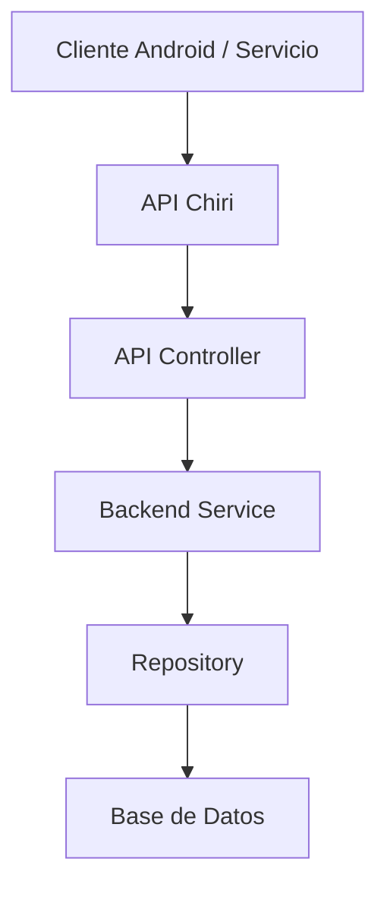
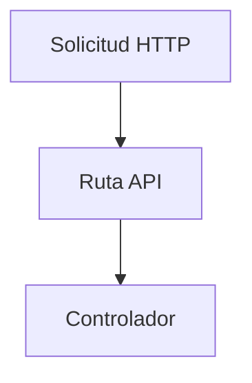
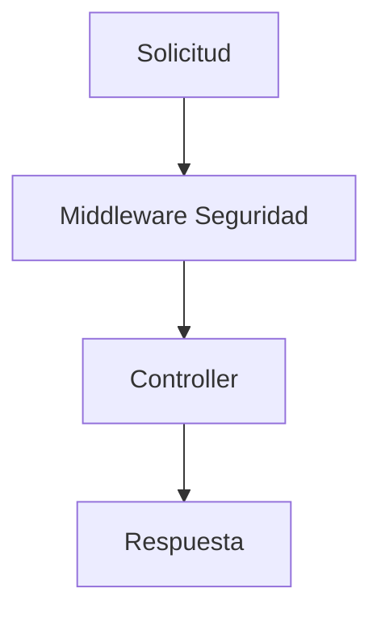
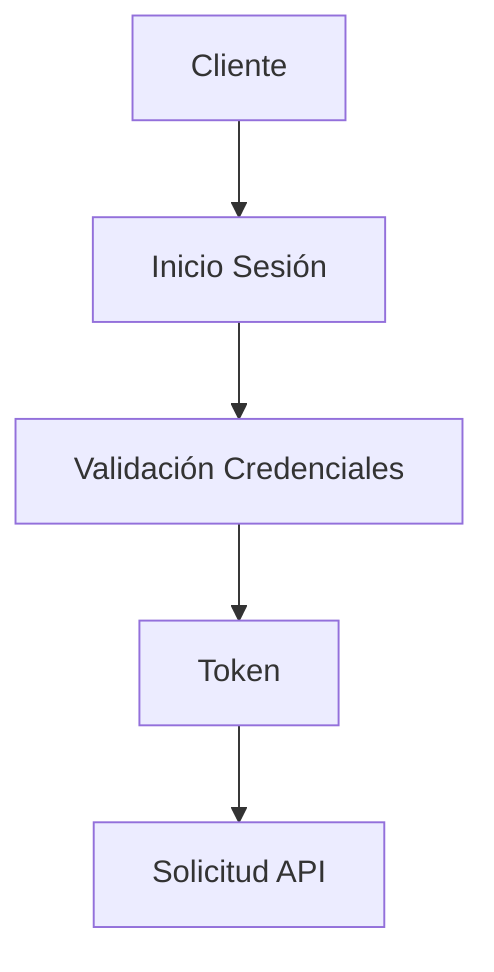
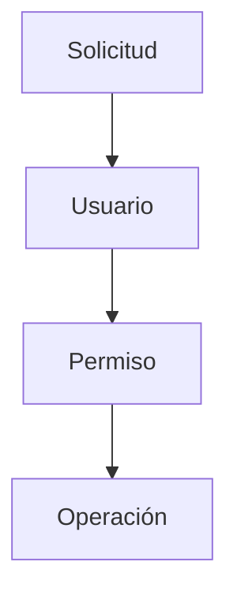
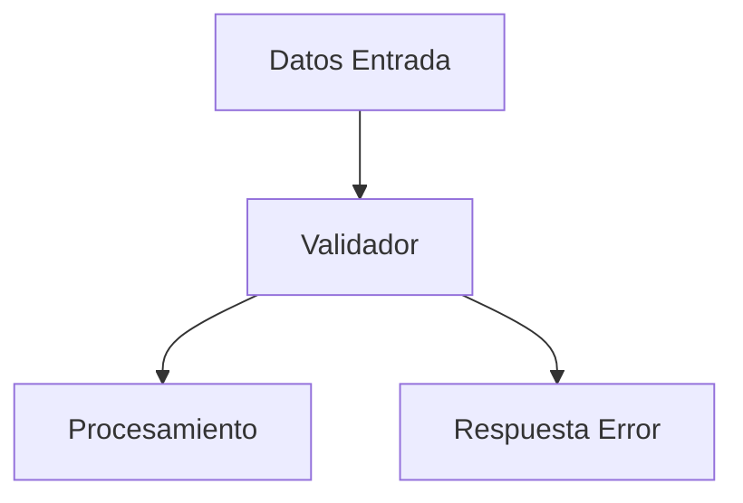

# 220_API_Implementacion.md

# Implementación API Chiri Platform v1.0

## 1. Objetivo

Definir la implementación técnica de la API de Chiri Platform v1.0, estableciendo la estructura necesaria para exponer las capacidades del Backend mediante interfaces controladas.

Este documento se basa en:

* `060_API.md`
* `140_EspecificacionAPI.md`
* `200_Backend_Implementacion.md`

---

# 2. Alcance

La API será responsable de:

* Recibir solicitudes externas.
* Validar acceso.
* Transformar datos.
* Comunicar con Backend.
* Entregar respuestas estandarizadas.

No será responsable de:

* Reglas de negocio.
* Acceso directo a Base de Datos.
* Procesamiento visual.

---

# 3. Arquitectura de Comunicación

Flujo general:



---

# 4. Estructura del Proyecto API

Estructura conceptual:

```text id="m7q2vx"
api-chiri/

├── routes/
│
├── controllers/
│
├── middleware/
│
├── dto/
│
├── validators/
│
├── responses/
│
├── security/
│
├── config/
│
└── tests/
```

---

# 5. Organización de Endpoints

Los endpoints se organizarán por recurso.

Ejemplo:

```text id="n4k8qp"
/api/v1/users
/api/v1/roles
/api/v1/modules
/api/v1/configuration
```

Regla:

Cada recurso debe tener:

* Rutas definidas.
* Validaciones.
* Controlador asociado.
* Respuesta estándar.

---

# 6. Capa Routes

Responsabilidad:

* Definir URLs.
* Asociar métodos HTTP.
* Enviar solicitudes al controlador.

Ejemplo conceptual:



---

# 7. Capa Controller API

Responsabilidad:

* Recibir solicitudes.
* Validar parámetros básicos.
* Llamar servicios.
* Construir respuestas.

No debe contener:

* Reglas de negocio.
* Consultas directas.

---

# 8. Middleware

La API utilizará middleware para:

* Autenticación.
* Autorización.
* Logs.
* Manejo de errores.

Flujo:



---

# 9. Autenticación API

Proceso:



---

# 10. Autorización

Antes de ejecutar una operación:

Debe validar:

* Usuario autenticado.
* Permiso requerido.
* Estado del recurso.

Flujo:



---

# 11. Validación de Datos

Toda entrada debe validarse:

* Tipo de dato.
* Campos obligatorios.
* Formato.
* Restricciones.

Flujo:



---

# 12. Formato de Respuestas

Todas las respuestas utilizarán formato uniforme.

Éxito:

```text id="z7q4mp"
{
 success: true,
 data: {}
}
```

Error:

```text id="s8m2qx"
{
 success: false,
 error: {}
}
```

---

# 13. Manejo de Errores

Clasificación:

```text id="q5v8nx"
AUTH_ERROR
VALIDATION_ERROR
NOT_FOUND_ERROR
BUSINESS_ERROR
INTERNAL_ERROR
```

Reglas:

* No exponer detalles internos.
* Registrar errores críticos.
* Mantener trazabilidad.

---

# 14. Versionamiento

La API mantendrá versiones independientes:

```text id="w9m4kp"
/api/v1/
```

Una nueva versión debe:

* Mantener compatibilidad.
* Documentarse.
* Evaluarse antes de reemplazar.

---

# 15. Pruebas API

Se consideran:

## Pruebas Endpoint

Validación de:

* Solicitud.
* Respuesta.
* Código HTTP.

## Pruebas Seguridad

Validación de:

* Tokens.
* Permisos.
* Accesos.

## Pruebas Integración

Validación:

* API + Backend.
* API + Base Datos.

---

# 16. Evolución API

La API debe permitir:

* Nuevos módulos.
* Nuevos clientes.
* Nuevas integraciones.
* Nuevas versiones.

---

# 17. Estado del Documento

Documento:

```text id="y8q3mv"
220_API_Implementacion.md
```

Versión:

```text id="t6m9kp"
Chiri Platform v1.0
```

Estado:

```text id="c4v7nx"
EN REVISIÓN
```
