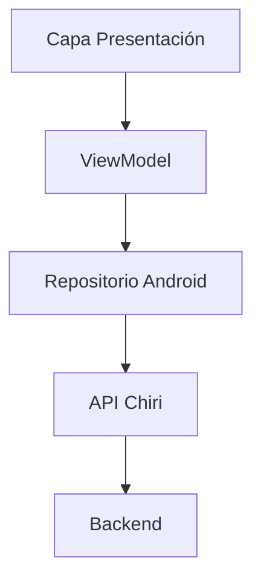
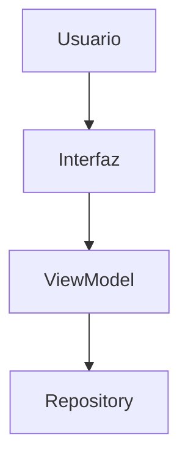
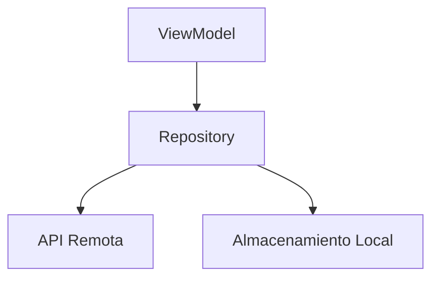
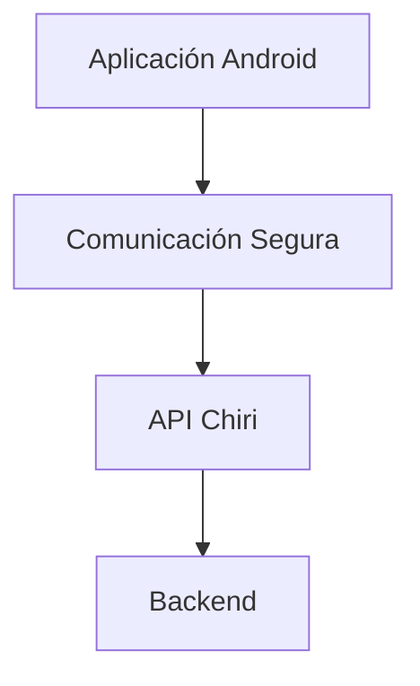
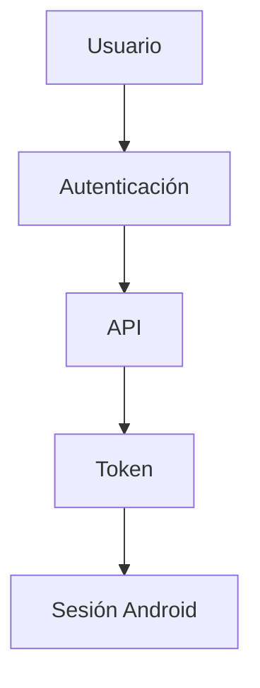
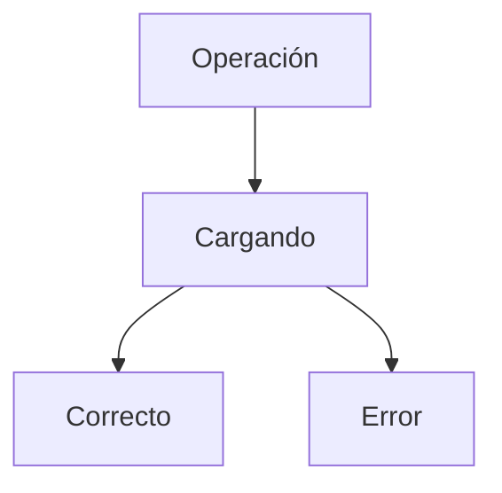

# 230_Android_Implementacion.md

# Implementación Aplicación Android Chiri Platform v1.0

## 1. Objetivo

Definir la implementación técnica de la aplicación Android de Chiri Platform v1.0 como cliente oficial de la plataforma.

Este documento transforma la arquitectura Android definida en:

* Estructura del proyecto.
* Organización interna.
* Comunicación con API.
* Gestión de datos.
* Reglas de desarrollo.

---

# 2. Alcance

La aplicación Android será responsable de:

* Interfaz de usuario.
* Interacción con el usuario.
* Gestión de sesión.
* Consumo de API.
* Presentación de información.

No será responsable de:

* Reglas principales de negocio.
* Acceso directo a Base de Datos.
* Procesos internos del Backend.

---

# 3. Arquitectura Android

La aplicación seguirá una arquitectura por capas:



---

# 4. Estructura del Proyecto

Estructura conceptual:

```text id="n8q5mv"
chiri-android/

├── presentation/
│
├── viewmodel/
│
├── repository/
│
├── data/
│
├── network/
│
├── model/
│
├── security/
│
├── utils/
│
└── tests/
```

---

# 5. Capa Presentation

Responsabilidad:

* Mostrar información.
* Capturar interacción.
* Observar estados.

No debe contener:

* Lógica de negocio.
* Acceso directo a API.

---

# 6. ViewModel

Responsabilidad:

* Gestionar estado de pantalla.
* Coordinar acciones.
* Comunicar con Repository.

Flujo:



---

# 7. Repository Android

Responsabilidad:

* Abstraer fuentes de datos.
* Coordinar API.
* Gestionar información local si aplica.

Modelo:



---

# 8. Comunicación con API

La aplicación utilizará la API definida en:

`140_EspecificacionAPI.md`

Flujo:



---

# 9. Gestión de Sesión

La aplicación debe manejar:

* Inicio de sesión.
* Almacenamiento seguro del token.
* Renovación de sesión.
* Cierre de sesión.

Flujo:



---

# 10. Modelos Android

Los modelos representan:

* Datos recibidos.
* Datos enviados.
* Estados internos.

Separación:

```text id="q9m5vx"
DTO API
    ↓
Modelo Android
    ↓
Estado UI
```

---

# 11. Manejo de Estados

La aplicación debe controlar:

```text id="v3x8mq"
LOADING
SUCCESS
ERROR
EMPTY
```

Ejemplo conceptual:



---

# 12. Seguridad Android

Consideraciones:

* Almacenamiento seguro de credenciales.
* Protección de tokens.
* Comunicación HTTPS.
* Validación de sesión.

No almacenar:

* Contraseñas.
* Secretos de servidor.

---

# 13. Configuración

La configuración debe estar separada del código.

Incluye:

* URL API.
* Ambientes.
* Parámetros de aplicación.

Ambientes:

```text id="x7m4qv"
DESARROLLO
PRUEBAS
PRODUCCION
```

---

# 14. Pruebas Android

Se consideran:

## Pruebas Unitarias

* ViewModels.
* Repositories.
* Validaciones.

## Pruebas Integración

* Comunicación API.
* Gestión sesión.

## Pruebas Funcionales

* Flujos principales usuario.

---

# 15. Evolución Android

La aplicación debe permitir:

* Nuevos módulos.
* Nuevas funcionalidades.
* Nuevos clientes.
* Evolución independiente del Backend.

---

# 16. Estado del Documento

Documento:

```text id="m9k4qp"
230_Android_Implementacion.md
```

Versión:

```text id="b7v5nx"
Chiri Platform v1.0
```

Estado:

```text id="q8m3mv"
EN REVISIÓN
```
