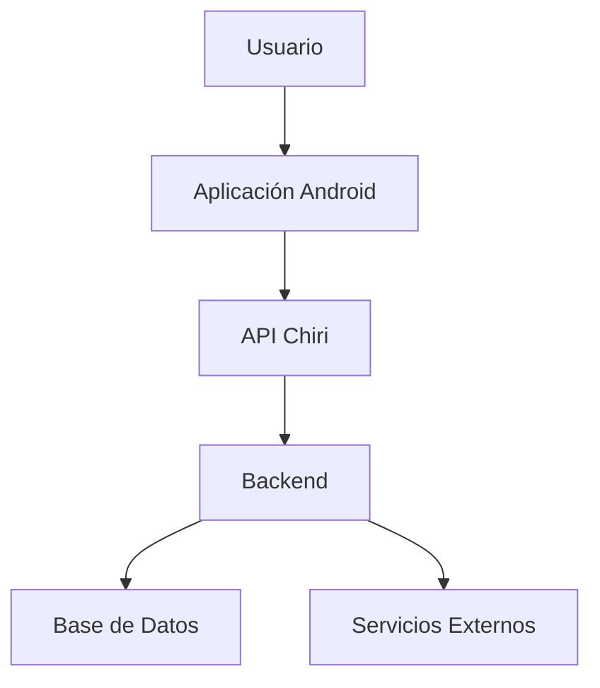
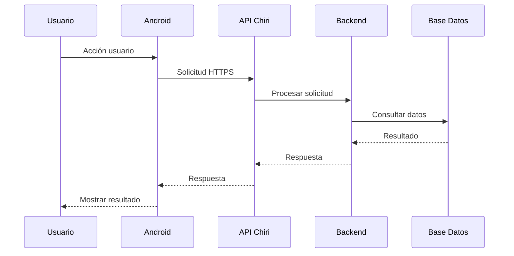
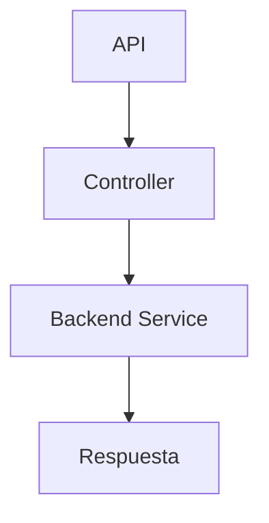
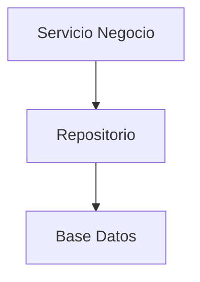
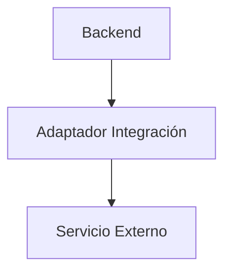
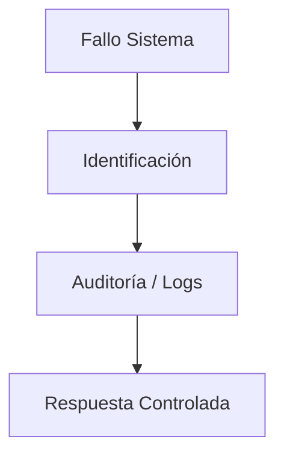

# 240_Integracion_Sistema.md

# Integración del Sistema Chiri Platform v1.0

## 1. Objetivo

Definir la integración entre los componentes principales de Chiri Platform v1.0, estableciendo los flujos de comunicación y dependencias entre sistemas.

Este documento valida que la arquitectura implementada mantiene la separación definida.

---

# 2. Alcance

Incluye la integración de:

* Aplicación Android.
* API Chiri.
* Backend.
* Base de Datos.
* Servicios externos.
* Módulos funcionales.

No incluye:

* Diseño visual.
* Detalles internos de código.
* Configuraciones específicas de infraestructura.

---

# 3. Arquitectura General de Integración



---

# 4. Flujo de Comunicación Principal

## Solicitud de Usuario

Flujo:



---

# 5. Integración Android - API

Responsabilidades:

Android:

* Gestionar interacción.
* Enviar solicitudes.
* Mostrar resultados.

API:

* Validar solicitud.
* Gestionar seguridad.
* Enviar información al Backend.

Comunicación:

```text id="x6q9mv"
Android
   |
 HTTPS
   |
API Chiri
```

---

# 6. Integración API - Backend

Reglas:

* La API no contiene lógica de negocio.
* El Backend procesa reglas.
* La comunicación mantiene contratos definidos.

Flujo:



---

# 7. Integración Backend - Base de Datos

Reglas:

* Solo Repository accede a datos.
* Mantener integridad.
* Controlar transacciones.

Modelo:



---

# 8. Integración con Servicios Externos

Los servicios externos deben:

* Tener interfaz definida.
* Mantener independencia.
* Controlar disponibilidad.

Modelo:



---

# 9. Manejo de Fallos

Los fallos deben controlarse por capa.



Tipos:

* Error comunicación.
* Error autenticación.
* Error datos.
* Error servicio externo.

---

# 10. Disponibilidad del Sistema

La arquitectura debe permitir:

* Reinicio independiente de componentes.
* Diagnóstico por servicio.
* Escalamiento futuro.

---

# 11. Ambientes de Integración

Se consideran:

```text id="q8v5mx"
DESARROLLO

PRUEBAS

PRODUCCIÓN
```

Cada ambiente debe mantener:

* Configuración independiente.
* Datos separados.
* Seguridad adecuada.

---

# 12. Pruebas de Integración

Se deben validar:

## Android - API

* Comunicación.
* Autenticación.
* Respuestas.

## API - Backend

* Contratos.
* Validaciones.

## Backend - Base Datos

* Persistencia.
* Integridad.

## Backend - Servicios Externos

* Disponibilidad.
* Manejo de errores.

---

# 13. Monitoreo y Diagnóstico

El sistema debe permitir:

* Registro de eventos.
* Seguimiento de errores.
* Identificación de fallos.

---

# 14. Evolución de Integraciones

Nuevas integraciones deben:

* Respetar arquitectura.
* Definir contrato.
* Documentarse.
* Mantener seguridad.

---

# 15. Estado del Documento

Documento:

```text id="w4m8qp"
240_Integracion_Sistema.md
```

Versión:

```text id="x7q2nv"
Chiri Platform v1.0
```

Estado:

```text id="j9m5vx"
EN REVISIÓN
```
