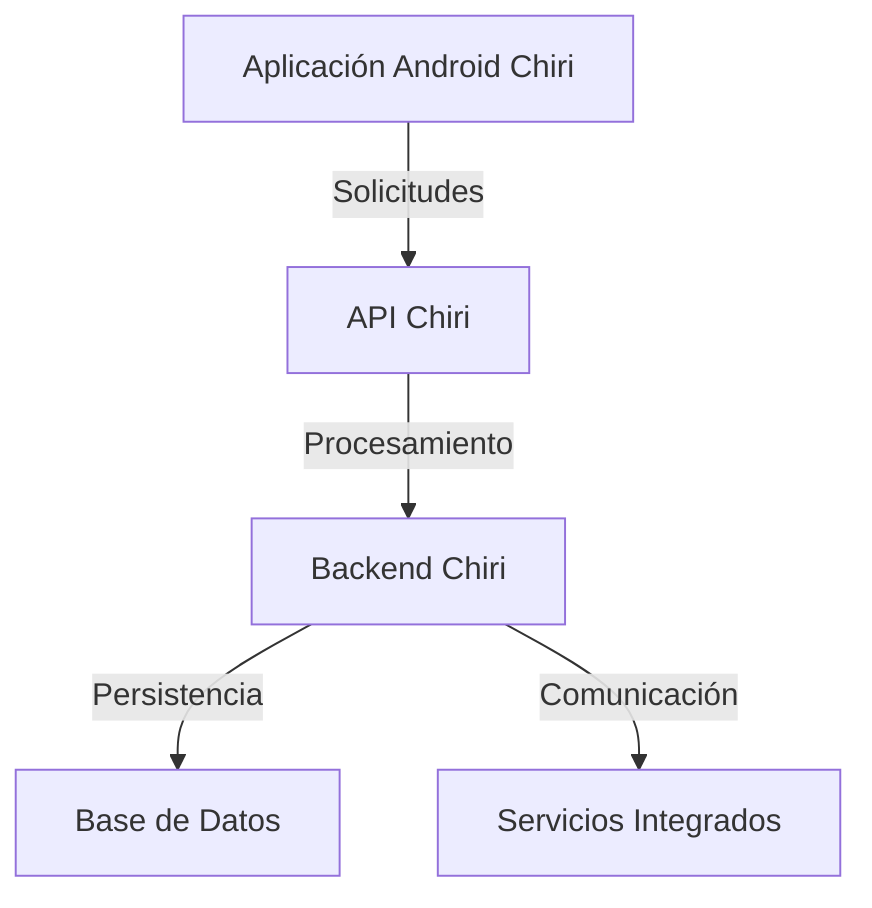
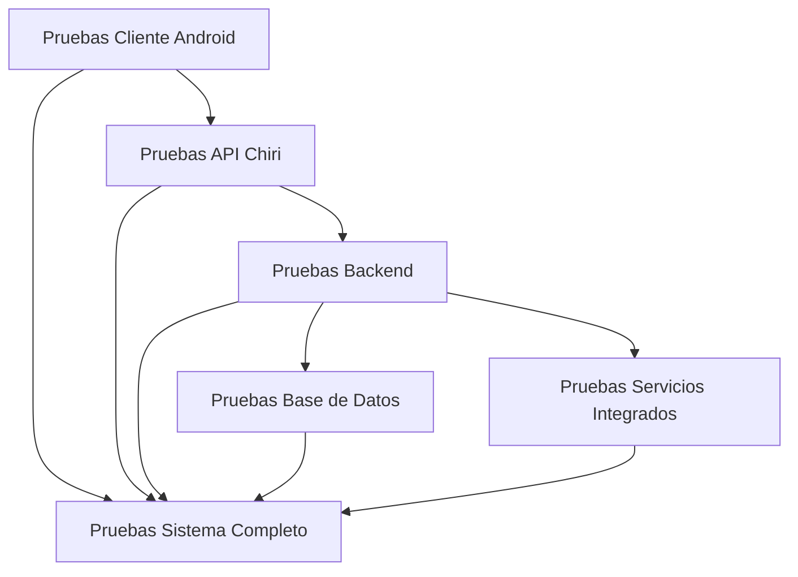
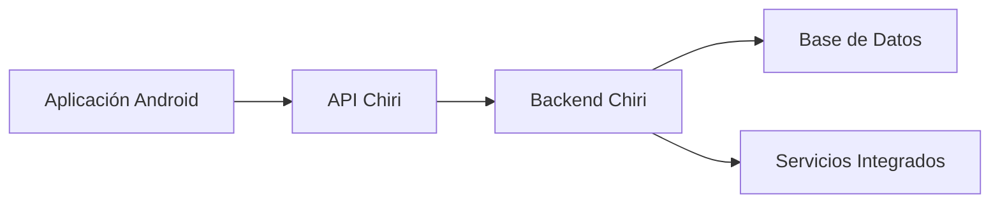
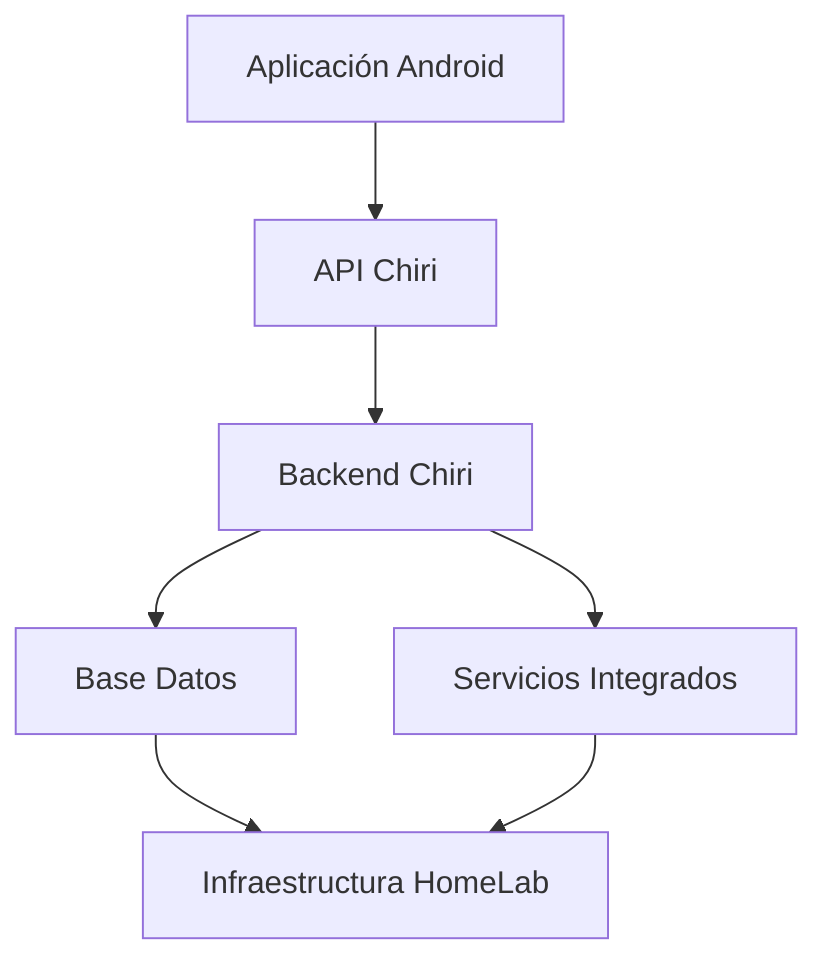
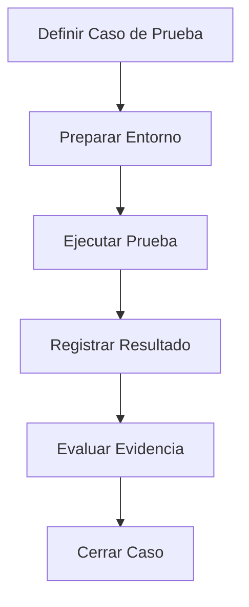
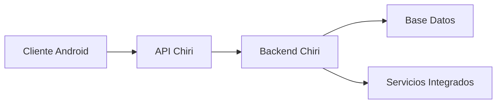
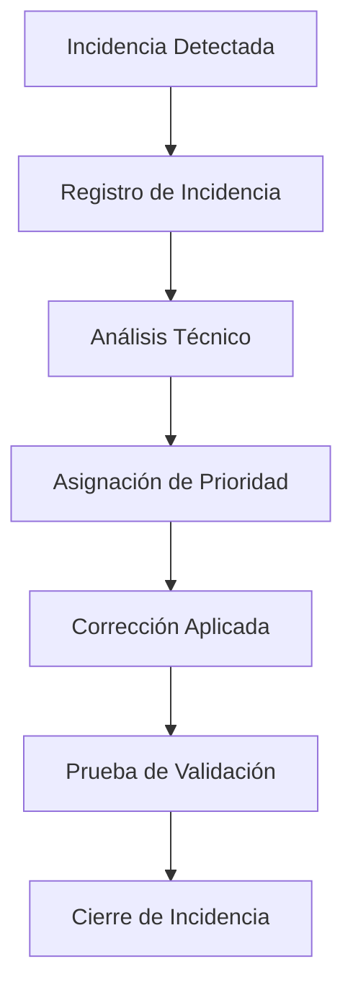
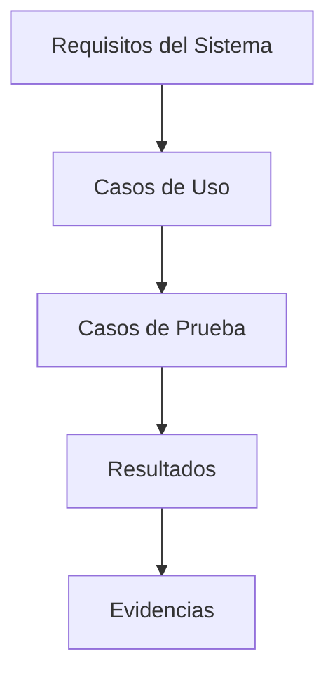
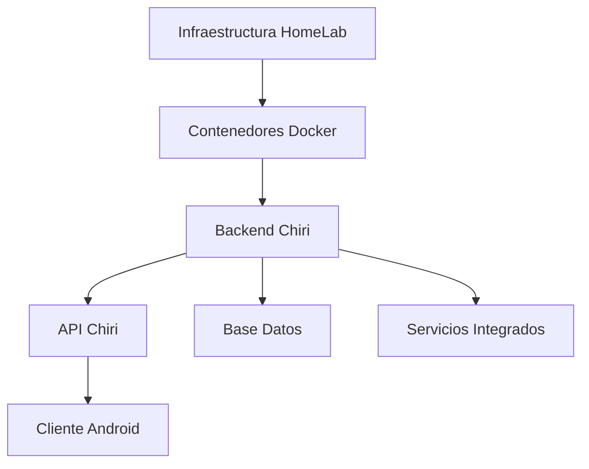
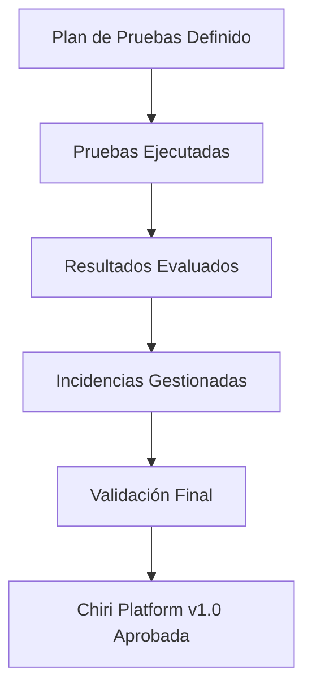

# 300_Pruebas_Sistema.md

# Plan de Pruebas Chiri Platform v1.0

---

# 1. Objetivo

El presente documento establece el Plan de Pruebas de Chiri Platform v1.0, definiendo la estrategia, metodología y criterios necesarios para validar la calidad y funcionamiento correcto de la plataforma.

El objetivo principal es garantizar que todos los componentes desarrollados durante las fases anteriores cumplan con los requisitos funcionales, técnicos y de seguridad establecidos en la arquitectura del sistema.

Este plan permitirá verificar:

* Correcto funcionamiento de los módulos principales de la plataforma.
* Integración adecuada entre las diferentes capas del sistema.
* Cumplimiento de las reglas de negocio definidas.
* Correcta comunicación entre clientes, APIs, servicios internos y almacenamiento de datos.
* Protección de la información mediante los mecanismos de seguridad establecidos.
* Integridad y consistencia de la información almacenada.
* Estabilidad y disponibilidad de los servicios.
* Capacidad de recuperación ante errores o fallos.
* Preparación del sistema para operación real y evolución futura.

Las pruebas definidas en este documento tienen como finalidad asegurar que Chiri Platform v1.0 sea una plataforma confiable, mantenible, segura y preparada para incorporar nuevas funcionalidades.

Este documento será utilizado como referencia para la validación final del sistema antes de su puesta en operación.

# 2. Alcance

El presente Plan de Pruebas cubre la validación integral de Chiri Platform v1.0, considerando todos los componentes definidos durante las fases de arquitectura, especificación e implementación.

El alcance comprende la evaluación de:

## 2.1 Componentes del Sistema

Las pruebas incluyen los siguientes componentes:

* Aplicación cliente Android "Chiri".
* API Chiri como capa de comunicación entre clientes y servicios internos.
* Backend Chiri como núcleo de lógica de negocio.
* Base de datos y modelo de persistencia.
* Servicios internos de la plataforma.
* Integraciones externas definidas para el ecosistema Chiri.
* Mecanismos de seguridad, autenticación y autorización.

## 2.2 Capas de Validación

Las pruebas cubrirán las diferentes capas de la arquitectura:

* Capa de presentación.
* Capa de comunicación API.
* Capa de lógica de negocio.
* Capa de acceso a datos.
* Capa de integración con servicios externos.
* Capa de seguridad y auditoría.

## 2.3 Funcionalidades Incluidas

Se validarán:

* Flujos principales de usuario.
* Casos de uso definidos en la especificación funcional.
* Reglas de negocio implementadas.
* Operaciones de creación, consulta, actualización y eliminación de información.
* Manejo de errores y respuestas del sistema.
* Control de acceso según permisos definidos.
* Registro de eventos y auditoría.

## 2.4 Exclusiones

No forman parte del alcance inicial:

* Pruebas de hardware específico de terceros no administrado por Chiri Platform.
* Validación interna de servicios externos cuya responsabilidad pertenece al proveedor.
* Pruebas de carga masiva propias de plataformas empresariales de gran escala.

Estas exclusiones podrán incorporarse en futuras versiones según la evolución de la plataforma.

## 2.5 Resultado Esperado

Al finalizar la ejecución del plan de pruebas se deberá contar con evidencia suficiente para determinar que Chiri Platform v1.0 cumple los criterios de calidad definidos y se encuentra preparada para operación estable.

# 3. Estrategia General de Pruebas

La estrategia de pruebas de Chiri Platform v1.0 establece el enfoque utilizado para validar la calidad, estabilidad y funcionamiento correcto de la plataforma.

La estrategia está basada en una validación progresiva por capas, iniciando desde los componentes individuales hasta llegar a la validación completa del ecosistema.

El proceso de pruebas seguirá el principio:

**Validar componentes individuales → validar integraciones → validar funcionamiento completo del sistema**

---

## 3.1 Enfoque de Pruebas

Chiri Platform v1.0 utilizará un enfoque basado en niveles de validación:

* Pruebas unitarias para validar componentes individuales.
* Pruebas de integración para comprobar comunicación entre módulos.
* Pruebas funcionales para validar comportamiento esperado.
* Pruebas de seguridad para verificar protección y control de acceso.
* Pruebas de rendimiento para evaluar estabilidad y capacidad operativa.
* Pruebas de sistema para validar el funcionamiento completo de la plataforma.

---

## 3.2 Modelo de Validación

El proceso de pruebas seguirá la arquitectura definida:

Cada nivel será validado de forma independiente y posteriormente como parte del flujo completo del sistema.

---

## 3.3 Principios de Prueba

La ejecución de pruebas seguirá los siguientes principios:

### Cobertura

Garantizar que las funcionalidades críticas tengan escenarios de validación definidos.

### Repetibilidad

Las pruebas deberán poder ejecutarse nuevamente bajo las mismas condiciones.

### Trazabilidad

Cada prueba deberá estar relacionada con un componente, requisito o caso de uso definido.

### Evidencia

Los resultados deberán contar con registros que permitan verificar su ejecución.

### Mejora Continua

Los resultados obtenidos permitirán identificar oportunidades de mejora para futuras versiones.

---

## 3.4 Prioridad de Pruebas

Las pruebas tendrán prioridad según el impacto dentro de la plataforma:

### Alta Prioridad

* Autenticación.
* Autorización.
* Acceso a datos.
* Operaciones críticas del backend.
* Comunicación entre capas.

### Media Prioridad

* Funcionalidades secundarias.
* Integraciones complementarias.
* Configuraciones operativas.

### Baja Prioridad

* Funcionalidades experimentales.
* Componentes preparados para futuras versiones.

---

## 3.5 Resultado Esperado

La estrategia definida permitirá obtener una evaluación completa del estado de Chiri Platform v1.0, reduciendo riesgos antes de su operación y proporcionando una base para el mantenimiento y evolución futura de la plataforma.

# 4. Arquitectura del Proceso de Pruebas

La arquitectura del proceso de pruebas de Chiri Platform v1.0 define la organización de los niveles de validación utilizados para comprobar el correcto funcionamiento de la plataforma.

El proceso está diseñado siguiendo la arquitectura modular de Chiri, permitiendo validar cada componente individualmente y posteriormente verificar la integración completa del sistema.

---

## 4.1 Modelo de Pruebas por Capas

La validación se realizará siguiendo las capas principales de la plataforma:

Cada capa será validada considerando sus responsabilidades específicas.

---

## 4.2 Niveles del Proceso de Pruebas

El proceso estará dividido en los siguientes niveles:

## Nivel 1 - Pruebas Unitarias

Objetivo:

Validar componentes individuales de manera aislada.

Incluye:

* Funciones internas.
* Servicios.
* Clases.
* Métodos.
* Componentes de interfaz.

---

## Nivel 2 - Pruebas de Integración

Objetivo:

Verificar la comunicación correcta entre componentes.

Incluye:

* Cliente Android con API.
* API con Backend.
* Backend con Base de Datos.
* Backend con servicios externos.

---

## Nivel 3 - Pruebas Funcionales

Objetivo:

Validar que el sistema cumple los comportamientos definidos por los casos de uso.

Incluye:

* Flujos principales de usuario.
* Reglas de negocio.
* Validaciones.
* Respuestas esperadas del sistema.

---

## Nivel 4 - Pruebas de Sistema

Objetivo:

Validar la plataforma completa como un conjunto integrado.

Incluye:

* Funcionamiento general.
* Comunicación entre módulos.
* Estabilidad operativa.
* Escenarios completos de uso.

---

## Nivel 5 - Pruebas de Aceptación

Objetivo:

Confirmar que la plataforma cumple los criterios definidos para ser considerada lista para operación.

Incluye:

* Validación final funcional.
* Revisión de requisitos.
* Confirmación de calidad.
* Aprobación de versión.

---

## 4.3 Flujo General de Ejecución

---

## 4.4 Criterio de Avance

Cada nivel de pruebas deberá cumplir los criterios establecidos antes de avanzar al siguiente nivel.

No se considerará aprobada una etapa cuando existan errores críticos pendientes relacionados con:

* Seguridad.
* Integridad de datos.
* Disponibilidad del servicio.
* Funcionamiento de funcionalidades principales.

---

## 4.5 Resultado Esperado

La arquitectura del proceso de pruebas permitirá validar Chiri Platform v1.0 de manera ordenada, controlada y trazable, reduciendo riesgos técnicos antes de la operación definitiva del sistema.

# 5. Tipos de Pruebas

Chiri Platform v1.0 utilizará diferentes tipos de pruebas con el objetivo de validar cada aspecto del sistema, desde componentes individuales hasta el comportamiento completo de la plataforma.

Cada tipo de prueba tendrá un propósito específico dentro del ciclo de validación.

---

# 5.1 Pruebas Unitarias

## Objetivo

Validar el funcionamiento correcto de los componentes individuales de software de manera aislada.

## Alcance

Las pruebas unitarias cubrirán:

* Métodos y funciones del backend.
* Servicios internos.
* Validaciones de lógica de negocio.
* Componentes de la aplicación Android.
* Procesamiento de datos.
* Reglas individuales del sistema.

## Validaciones principales

* Entrada correcta de datos.
* Resultado esperado.
* Manejo de errores.
* Casos límite.
* Excepciones controladas.

---

# 5.2 Pruebas de Integración

## Objetivo

Validar la comunicación y funcionamiento conjunto entre los diferentes módulos de la plataforma.

## Alcance

Se validarán las siguientes integraciones:

## Validaciones principales

* Comunicación correcta entre capas.
* Formato correcto de solicitudes y respuestas.
* Manejo de errores entre servicios.
* Persistencia correcta de información.
* Disponibilidad de servicios dependientes.

---

# 5.3 Pruebas Funcionales

## Objetivo

Validar que la plataforma cumple los comportamientos definidos en los casos de uso y reglas de negocio.

## Alcance

Incluye:

* Flujos principales de usuario.
* Operaciones del sistema.
* Validaciones de información.
* Reglas de negocio.
* Respuestas esperadas.

## Validaciones principales

* Funcionalidad correcta.
* Resultado esperado.
* Cumplimiento de requisitos.
* Experiencia de uso.

---

# 5.4 Pruebas End-to-End

## Objetivo

Validar escenarios completos desde el inicio hasta la finalización del flujo.

## Alcance

Ejemplos:

* Usuario interactúa desde Android.
* Solicitud enviada a la API.
* Procesamiento realizado por Backend.
* Información almacenada o consultada.
* Respuesta entregada al usuario.

## Validaciones principales

* Flujo completo sin interrupciones.
* Integración total de componentes.
* Tiempo de respuesta aceptable.
* Consistencia del resultado final.

---

# 5.5 Pruebas de Seguridad

## Objetivo

Validar que los mecanismos de protección definidos para Chiri Platform funcionan correctamente.

## Alcance

Incluye:

* Autenticación.
* Autorización.
* Roles y permisos.
* Protección de datos.
* Manejo de sesiones.
* Auditoría.

## Validaciones principales

* Acceso autorizado únicamente.
* Bloqueo de accesos incorrectos.
* Protección de información sensible.
* Registro de eventos relevantes.

---

# 5.6 Pruebas de Rendimiento

## Objetivo

Evaluar la capacidad de respuesta y estabilidad del sistema bajo diferentes condiciones de uso.

## Alcance

Incluye:

* Tiempo de respuesta de APIs.
* Uso de recursos del servidor.
* Consumo de memoria.
* Procesamiento de solicitudes.
* Comportamiento de servicios internos.

## Validaciones principales

* Respuesta dentro de tiempos esperados.
* Uso eficiente de recursos.
* Estabilidad prolongada.
* Identificación de puntos críticos.

---

# 5.7 Pruebas de Recuperación

## Objetivo

Validar la capacidad de recuperación de la plataforma ante fallos.

## Alcance

Incluye:

* Reinicio de servicios.
* Recuperación de contenedores.
* Restauración de información.
* Manejo de errores inesperados.

## Validaciones principales

* Recuperación correcta del servicio.
* Conservación de datos.
* Reinicio controlado.
* Continuidad operativa.

---

# 5.8 Resultado Esperado

La combinación de estos tipos de pruebas permitirá validar Chiri Platform v1.0 desde diferentes perspectivas, asegurando que la plataforma sea funcional, segura, estable y preparada para operación continua.

# 6. Plan de Validación por Componentes

El plan de validación por componentes define las pruebas específicas que serán ejecutadas sobre cada elemento principal de Chiri Platform v1.0.

La validación se realizará considerando la responsabilidad de cada componente dentro de la arquitectura general del sistema.

---

# 6.1 Aplicación Android Chiri

## Objetivo

Validar que la aplicación cliente Android funciona correctamente como interfaz principal de interacción del usuario con la plataforma.

## Componentes a validar

* Pantallas y navegación.
* Gestión de sesiones.
* Comunicación con la API.
* Manejo de respuestas.
* Validaciones de entrada.
* Gestión de errores.
* Experiencia de usuario.

## Pruebas principales

| Prueba               | Validación                        |
| -------------------- | --------------------------------- |
| Inicio de aplicación | Carga correcta del cliente        |
| Autenticación        | Acceso con credenciales válidas   |
| Navegación           | Cambio correcto entre módulos     |
| Consumo API          | Comunicación correcta con backend |
| Manejo errores       | Mensajes y estados controlados    |

---

# 6.2 API Chiri

## Objetivo

Validar la capa de comunicación entre clientes y servicios internos.

## Componentes a validar

* Endpoints disponibles.
* Estructura de solicitudes.
* Estructura de respuestas.
* Validación de parámetros.
* Manejo de códigos HTTP.
* Control de acceso.

## Pruebas principales

| Prueba                | Validación               |
| --------------------- | ------------------------ |
| Solicitudes válidas   | Respuesta esperada       |
| Solicitudes inválidas | Rechazo controlado       |
| Seguridad API         | Acceso autorizado        |
| Errores               | Respuestas consistentes  |
| Integración           | Comunicación con backend |

---

# 6.3 Backend Chiri

## Objetivo

Validar el núcleo lógico de la plataforma.

## Componentes a validar

* Servicios internos.
* Lógica de negocio.
* Procesamiento de información.
* Validaciones.
* Manejo de excepciones.
* Integraciones internas.

## Pruebas principales

| Prueba              | Validación              |
| ------------------- | ----------------------- |
| Reglas negocio      | Resultado correcto      |
| Procesamiento datos | Información consistente |
| Errores internos    | Control adecuado        |
| Servicios           | Funcionamiento esperado |
| Auditoría           | Registro correcto       |

---

# 6.4 Base de Datos

## Objetivo

Validar la correcta persistencia, integridad y disponibilidad de la información.

## Componentes a validar

* Modelo de datos.
* Tablas.
* Relaciones.
* Restricciones.
* Índices.
* Auditoría.

## Pruebas principales

| Prueba          | Validación               |
| --------------- | ------------------------ |
| Inserción datos | Registro correcto        |
| Consulta datos  | Información esperada     |
| Actualización   | Integridad conservada    |
| Eliminación     | Reglas aplicadas         |
| Relaciones      | Consistencia referencial |

---

# 6.5 Servicios Integrados

## Objetivo

Validar la comunicación entre Chiri Platform y servicios externos o internos complementarios.

## Componentes a validar

* Servicios multimedia.
* Automatización del hogar.
* Servicios de inteligencia artificial.
* Servicios auxiliares.

## Pruebas principales

| Prueba            | Validación              |
| ----------------- | ----------------------- |
| Conexión servicio | Comunicación correcta   |
| Disponibilidad    | Servicio operativo      |
| Errores externos  | Manejo controlado       |
| Sincronización    | Información consistente |

---

# 6.6 Infraestructura HomeLab

## Objetivo

Validar que la plataforma funciona correctamente dentro del entorno operativo definido.

## Componentes a validar

* Raspberry Pi.
* Contenedores Docker.
* Redes internas.
* Almacenamiento.
* Servicios desplegados.

## Pruebas principales

| Prueba           | Validación              |
| ---------------- | ----------------------- |
| Inicio servicios | Contenedores operativos |
| Reinicio sistema | Recuperación automática |
| Recursos         | Uso adecuado CPU/RAM    |
| Persistencia     | Datos conservados       |

---

# 6.7 Matriz General de Validación

---

# 6.8 Resultado Esperado

La validación por componentes permitirá identificar problemas específicos antes de realizar las pruebas completas del sistema, garantizando que cada elemento de Chiri Platform v1.0 cumpla correctamente su responsabilidad dentro de la arquitectura general.

# 7. Casos de Prueba

Los casos de prueba de Chiri Platform v1.0 definen los escenarios necesarios para validar que cada funcionalidad del sistema cumple con los requisitos establecidos.

Cada caso de prueba deberá permitir comprobar:

* Comportamiento esperado.
* Resultado obtenido.
* Cumplimiento de reglas de negocio.
* Integridad de información.
* Evidencia de ejecución.

Los casos de prueba estarán organizados según los principales módulos y flujos de la plataforma.

---

# 7.1 Estructura de un Caso de Prueba

Cada caso de prueba deberá contener la siguiente información:

| Campo              | Descripción                            |
| ------------------ | -------------------------------------- |
| ID                 | Identificador único del caso de prueba |
| Nombre             | Nombre descriptivo de la prueba        |
| Objetivo           | Propósito de validación                |
| Componente         | Módulo evaluado                        |
| Precondiciones     | Estado requerido antes de ejecutar     |
| Datos de prueba    | Información utilizada                  |
| Pasos              | Acciones necesarias                    |
| Resultado esperado | Comportamiento correcto                |
| Resultado obtenido | Resultado real                         |
| Estado             | Aprobado / Fallido                     |
| Evidencia          | Registro de ejecución                  |

---

# 7.2 Casos de Prueba de Autenticación

## CP-AUTH-001 - Inicio de sesión válido

**Objetivo:**

Validar que un usuario pueda ingresar correctamente a la plataforma utilizando credenciales válidas.

**Precondiciones:**

* Usuario registrado.
* Servicio de autenticación disponible.

**Pasos:**

1. Abrir aplicación Chiri.
2. Ingresar credenciales válidas.
3. Enviar solicitud de autenticación.

**Resultado esperado:**

* Usuario autenticado correctamente.
* Sesión creada.
* Acceso permitido según permisos asignados.

---

## CP-AUTH-002 - Inicio de sesión inválido

**Objetivo:**

Validar el rechazo de credenciales incorrectas.

**Resultado esperado:**

* Acceso bloqueado.
* Mensaje de error controlado.
* Evento registrado en auditoría.

---

# 7.3 Casos de Prueba de Comunicación API

## CP-API-001 - Solicitud válida

**Objetivo:**

Validar la comunicación correcta entre cliente y API.

**Pasos:**

1. Cliente envía solicitud válida.
2. API procesa petición.
3. Backend responde.

**Resultado esperado:**

* Respuesta correcta.
* Código HTTP esperado.
* Datos consistentes.

---

## CP-API-002 - Solicitud incorrecta

**Objetivo:**

Validar manejo de solicitudes inválidas.

**Resultado esperado:**

* Solicitud rechazada.
* Error informado correctamente.
* Sistema mantiene estabilidad.

---

# 7.4 Casos de Prueba de Reglas de Negocio

## CP-BUS-001 - Ejecución de regla válida

**Objetivo:**

Validar que una operación cumpla las reglas definidas.

**Resultado esperado:**

* Regla aplicada correctamente.
* Información procesada correctamente.

---

## CP-BUS-002 - Violación de regla

**Objetivo:**

Validar que el sistema impida operaciones no permitidas.

**Resultado esperado:**

* Operación rechazada.
* Motivo informado.
* Evento registrado.

---

# 7.5 Casos de Prueba de Datos

## CP-DATA-001 - Registro de información

**Objetivo:**

Validar almacenamiento correcto de información.

**Resultado esperado:**

* Datos almacenados correctamente.
* Relaciones conservadas.
* Auditoría generada.

---

## CP-DATA-002 - Consulta de información

**Objetivo:**

Validar recuperación correcta de datos.

**Resultado esperado:**

* Información completa.
* Datos consistentes.
* Tiempo de respuesta aceptable.

---

# 7.6 Casos de Prueba de Seguridad

## CP-SEC-001 - Acceso sin autorización

**Objetivo:**

Validar que usuarios sin permisos no puedan acceder a recursos protegidos.

**Resultado esperado:**

* Acceso denegado.
* Evento registrado.

---

## CP-SEC-002 - Validación de permisos

**Objetivo:**

Confirmar que los permisos asignados sean aplicados correctamente.

**Resultado esperado:**

* Usuario accede únicamente a funcionalidades permitidas.

---

# 7.7 Casos de Prueba de Recuperación

## CP-REC-001 - Reinicio de servicio

**Objetivo:**

Validar recuperación de servicios ante reinicio.

**Resultado esperado:**

* Servicio vuelve a estar operativo.
* Información preservada.

---

## CP-REC-002 - Restauración ante fallo

**Objetivo:**

Validar recuperación después de una interrupción inesperada.

**Resultado esperado:**

* Sistema recuperado.
* Datos consistentes.
* Servicios disponibles.

---

# 7.8 Flujo General de Ejecución de Casos de Prueba

---

# 7.9 Resultado Esperado

Los casos de prueba permitirán validar de manera estructurada el funcionamiento de Chiri Platform v1.0, asegurando trazabilidad entre requisitos, componentes y resultados obtenidos durante el proceso de calidad.

# 8. Criterios de Aceptación

Los criterios de aceptación establecen las condiciones mínimas que debe cumplir Chiri Platform v1.0 para considerar que una prueba ha sido aprobada y que la plataforma se encuentra preparada para operación.

Estos criterios permiten determinar objetivamente si el sistema cumple con los niveles de calidad definidos.

---

# 8.1 Criterios Generales de Aceptación

Chiri Platform v1.0 será considerada aprobada cuando:

* Las funcionalidades principales operen correctamente.
* Los componentes críticos se encuentren integrados correctamente.
* No existan errores críticos pendientes.
* Los datos mantengan integridad y consistencia.
* Los mecanismos de seguridad funcionen según lo definido.
* Los servicios principales se encuentren disponibles.
* La plataforma pueda recuperarse ante fallos controlados.

---

# 8.2 Criterios Funcionales

Se deberá validar:

* Cumplimiento de los casos de uso definidos.
* Ejecución correcta de los flujos principales.
* Aplicación correcta de reglas de negocio.
* Validaciones de información.
* Respuestas esperadas ante operaciones correctas e incorrectas.

Un requisito funcional será aceptado cuando:

* La funcionalidad opere según especificación.
* El resultado obtenido coincida con el esperado.
* Exista evidencia de ejecución.

---

# 8.3 Criterios de Integración

Las integraciones serán aceptadas cuando:

* Los componentes puedan comunicarse correctamente.
* Los formatos de información sean compatibles.
* Los errores entre componentes sean manejados adecuadamente.
* No existan pérdidas o inconsistencias de información.

La integración principal deberá validar:

---

# 8.4 Criterios de Seguridad

La plataforma deberá cumplir:

* Usuarios autenticados correctamente.
* Control de acceso según permisos.
* Protección de información sensible.
* Registro de eventos relevantes.
* Bloqueo de accesos no autorizados.

No se aceptará la versión cuando existan vulnerabilidades críticas pendientes.

---

# 8.5 Criterios de Rendimiento

La plataforma deberá demostrar:

* Tiempo de respuesta aceptable.
* Uso controlado de recursos.
* Estabilidad durante operación continua.
* Ausencia de degradaciones críticas.

---

# 8.6 Clasificación de Resultados

Los resultados de prueba serán clasificados como:

| Estado                     | Descripción                                   |
| -------------------------- | --------------------------------------------- |
| Aprobado                   | Cumple completamente con lo esperado          |
| Aprobado con observaciones | Funciona correctamente con mejoras pendientes |
| Fallido                    | No cumple el resultado esperado               |
| Bloqueado                  | No puede ejecutarse por dependencia externa   |

---

# 8.7 Criterios de Liberación

La versión Chiri Platform v1.0 podrá ser liberada cuando:

* Todas las pruebas críticas estén aprobadas.
* Los errores críticos hayan sido corregidos.
* Los errores menores estén documentados.
* Exista evidencia de validación.
* Se haya realizado la revisión final del sistema.

---

# 8.8 Resultado Esperado

Los criterios de aceptación proporcionan una referencia objetiva para determinar cuándo Chiri Platform v1.0 cumple las condiciones necesarias para pasar de la etapa de validación a la etapa operativa.

# 9. Gestión de Incidencias

La gestión de incidencias define el proceso utilizado para registrar, analizar, corregir y validar los problemas encontrados durante la ejecución de las pruebas de Chiri Platform v1.0.

El objetivo es garantizar que cada problema detectado tenga seguimiento, responsable, solución documentada y validación posterior.

---

# 9.1 Objetivo de la Gestión de Incidencias

La gestión de incidencias permitirá:

* Registrar problemas encontrados durante las pruebas.
* Mantener trazabilidad entre pruebas y errores.
* Priorizar correcciones según impacto.
* Verificar la solución aplicada.
* Evitar la repetición de errores en futuras versiones.

---

# 9.2 Ciclo de Vida de una Incidencia

El ciclo de vida definido para las incidencias será:

---

# 9.3 Registro de Incidencias

Cada incidencia deberá contener como mínimo:

| Campo              | Descripción                    |
| ------------------ | ------------------------------ |
| ID                 | Identificador único            |
| Fecha              | Momento de detección           |
| Módulo             | Componente afectado            |
| Descripción        | Detalle del problema           |
| Pasos reproducción | Acciones para generar el error |
| Severidad          | Impacto del problema           |
| Prioridad          | Orden de atención              |
| Evidencia          | Capturas, logs o registros     |
| Responsable        | Persona encargada              |
| Estado             | Situación actual               |

---

# 9.4 Clasificación por Severidad

Las incidencias serán clasificadas según su impacto:

| Severidad | Descripción                                              |
| --------- | -------------------------------------------------------- |
| Crítica   | Impide funcionamiento del sistema o compromete seguridad |
| Alta      | Afecta funcionalidades principales                       |
| Media     | Afecta funcionalidades secundarias                       |
| Baja      | Problemas menores o mejoras                              |

---

# 9.5 Estados de una Incidencia

Una incidencia podrá tener los siguientes estados:

| Estado        | Descripción                  |
| ------------- | ---------------------------- |
| Nueva         | Incidencia recién registrada |
| Analizando    | En proceso de revisión       |
| En desarrollo | Solución en implementación   |
| Resuelta      | Corrección aplicada          |
| Validando     | Pendiente de comprobación    |
| Cerrada       | Solución confirmada          |

---

# 9.6 Reglas de Atención

Las incidencias deberán atenderse considerando:

## Incidencias Críticas

Requieren atención inmediata antes de continuar con la liberación.

Ejemplos:

* Fallos de seguridad.
* Pérdida de información.
* Caída de servicios principales.

## Incidencias Altas

Deben resolverse antes de considerar la versión estable.

Ejemplos:

* Funcionalidades principales no operativas.
* Errores de integración.

## Incidencias Medias y Bajas

Pueden ser planificadas para futuras iteraciones cuando no afecten la operación.

---

# 9.7 Validación de Correcciones

Toda corrección aplicada deberá pasar por:

* Reproducción del problema original.
* Aplicación de la solución.
* Ejecución nuevamente del caso de prueba.
* Confirmación del resultado esperado.
* Registro de evidencia.

---

# 9.8 Resultado Esperado

La gestión de incidencias permitirá mantener control sobre la calidad de Chiri Platform v1.0, asegurando que los problemas detectados sean tratados de forma ordenada, documentada y verificable antes de la liberación del sistema.

# 10. Evidencias y Trazabilidad

La gestión de evidencias y trazabilidad establece los mecanismos utilizados para demostrar la ejecución de las pruebas realizadas sobre Chiri Platform v1.0 y mantener la relación entre requisitos, componentes, casos de prueba y resultados obtenidos.

El objetivo es garantizar que cada validación realizada pueda ser revisada, comprobada y repetida cuando sea necesario.

---

# 10.1 Objetivo de la Trazabilidad

La trazabilidad permitirá:

* Relacionar requisitos con casos de prueba.
* Identificar qué componentes fueron validados.
* Registrar resultados obtenidos.
* Facilitar análisis de errores.
* Mantener historial de validaciones realizadas.
* Apoyar futuras versiones de la plataforma.

---

# 10.2 Elementos de Trazabilidad

La relación entre elementos será:

Cada requisito deberá contar con validaciones asociadas que permitan confirmar su cumplimiento.

---

# 10.3 Tipos de Evidencia

Durante la ejecución de pruebas podrán generarse diferentes tipos de evidencia:

## Evidencia Funcional

Incluye:

* Capturas de pantalla.
* Resultados esperados.
* Resultados obtenidos.
* Validaciones de usuario.

---

## Evidencia Técnica

Incluye:

* Registros de ejecución.
* Logs de servicios.
* Respuestas de API.
* Información de diagnóstico.
* Estados de componentes.

---

## Evidencia de Seguridad

Incluye:

* Resultados de pruebas de acceso.
* Validaciones de permisos.
* Registros de auditoría.
* Eventos de seguridad.

---

## Evidencia de Infraestructura

Incluye:

* Estado de servicios desplegados.
* Estado de contenedores.
* Uso de recursos.
* Disponibilidad del sistema.

---

# 10.4 Matriz de Trazabilidad

La matriz de trazabilidad permitirá relacionar:

| Elemento       | Relación               |
| -------------- | ---------------------- |
| Requisito      | Funcionalidad esperada |
| Caso de Uso    | Escenario definido     |
| Caso de Prueba | Validación realizada   |
| Resultado      | Estado obtenido        |
| Evidencia      | Prueba documentada     |

---

# 10.5 Gestión de Evidencias

Las evidencias deberán:

* Mantener identificación única.
* Estar relacionadas con su caso de prueba.
* Conservar fecha de ejecución.
* Permitir revisión posterior.
* Mantenerse durante el ciclo de vida de la versión.

---

# 10.6 Revisión de Resultados

Antes de aprobar una versión:

* Se revisarán las evidencias generadas.
* Se verificarán pruebas críticas.
* Se confirmará la trazabilidad completa.
* Se validará que no existan pruebas pendientes.

---

# 10.7 Resultado Esperado

La correcta gestión de evidencias y trazabilidad permitirá demostrar la calidad de Chiri Platform v1.0, proporcionando transparencia sobre las pruebas ejecutadas y facilitando el mantenimiento futuro de la plataforma.

# 11. Validación Pre-Producción

La validación pre-producción define las actividades finales que deberán ejecutarse antes de considerar que Chiri Platform v1.0 está preparada para entrar en operación.

Esta etapa tiene como objetivo confirmar que la plataforma cumple con los criterios técnicos, funcionales y operativos definidos durante el proceso de pruebas.

---

# 11.1 Objetivo de la Validación Pre-Producción

La validación final permitirá confirmar:

* Correcto funcionamiento de todos los componentes.
* Estabilidad del sistema.
* Disponibilidad de servicios necesarios.
* Cumplimiento de requisitos funcionales.
* Correcta configuración del entorno operativo.
* Preparación para mantenimiento y evolución.

---

# 11.2 Lista de Verificación Final

Antes de la liberación se deberá validar:

| Área            | Validación                            |
| --------------- | ------------------------------------- |
| Arquitectura    | Componentes desplegados correctamente |
| Backend         | Servicios operativos                  |
| API             | Endpoints disponibles                 |
| Android         | Aplicación funcional                  |
| Base de Datos   | Integridad y disponibilidad           |
| Seguridad       | Accesos y permisos correctos          |
| Infraestructura | Servicios estables                    |
| Integraciones   | Comunicación correcta                 |

---

# 11.3 Validación del Entorno Operativo

El entorno deberá verificar:

Validaciones:

* Servicios iniciados correctamente.
* Persistencia configurada.
* Redes internas operativas.
* Configuraciones de seguridad aplicadas.
* Copias de respaldo disponibles.

---

# 11.4 Pruebas Finales de Operación

Se ejecutarán escenarios completos:

## Escenario 1 - Usuario Final

Validar:

* Inicio de sesión.
* Navegación.
* Uso de funcionalidades principales.
* Respuesta correcta del sistema.

---

## Escenario 2 - Comunicación Completa

Validar:

* Solicitud desde Android.
* Procesamiento API.
* Ejecución Backend.
* Persistencia de datos.
* Respuesta al usuario.

---

## Escenario 3 - Recuperación

Validar:

* Reinicio de servicios.
* Recuperación automática.
* Conservación de información.

---

# 11.5 Criterios para Liberación

La plataforma podrá pasar a operación cuando:

* Todas las pruebas críticas estén aprobadas.
* No existan incidencias críticas abiertas.
* Los servicios principales estén disponibles.
* La documentación esté actualizada.
* Exista evidencia completa de validación.

---

# 11.6 Aprobación de Versión

La aprobación de Chiri Platform v1.0 deberá considerar:

* Resultado de pruebas.
* Estado de incidencias.
* Evidencias recopiladas.
* Cumplimiento de criterios establecidos.

La versión será considerada lista cuando cumpla las condiciones definidas en este documento.

---

# 11.7 Resultado Esperado

La validación pre-producción garantiza que Chiri Platform v1.0 pueda iniciar su operación con un nivel adecuado de confianza, estabilidad y control, reduciendo riesgos antes de su uso real.

# 12. Cierre y Aprobación

El cierre del Plan de Pruebas de Chiri Platform v1.0 establece la finalización formal del proceso de validación y confirma el cumplimiento de los criterios definidos para la operación de la plataforma.

Esta etapa consolida los resultados obtenidos durante la ejecución de pruebas y determina la aprobación de la versión evaluada.

---

# 12.1 Cierre del Proceso de Pruebas

El proceso de pruebas se considerará cerrado cuando:

* Los casos de prueba definidos hayan sido ejecutados.
* Los resultados hayan sido registrados.
* Las evidencias hayan sido recopiladas.
* Las incidencias detectadas hayan sido gestionadas.
* Los criterios de aceptación hayan sido cumplidos.
* La validación pre-producción haya sido completada.

---

# 12.2 Resultado Final de Validación

El resultado final deberá reflejar:

| Elemento             | Estado         |
| -------------------- | -------------- |
| Pruebas funcionales  | Validado       |
| Pruebas integración  | Validado       |
| Pruebas seguridad    | Validado       |
| Pruebas rendimiento  | Validado       |
| Pruebas recuperación | Validado       |
| Evidencias           | Registradas    |
| Incidencias críticas | Sin pendientes |

---

# 12.3 Aprobación de Chiri Platform v1.0

La aprobación de la versión requiere confirmar:

* Cumplimiento de la arquitectura definida.
* Funcionamiento correcto de los módulos principales.
* Seguridad adecuada de la plataforma.
* Integridad de información.
* Estabilidad operativa.
* Disponibilidad para evolución futura.

---

# 12.4 Estado Final del Documento

---

# 12.5 Cierre Documental

Con la aprobación de este documento queda establecido el proceso de validación de Chiri Platform v1.0.

El presente plan servirá como referencia para:

* Mantenimiento de la plataforma.
* Nuevas versiones.
* Incorporación de módulos futuros.
* Validación de cambios arquitectónicos.

La ejecución de este plan permite garantizar que Chiri Platform v1.0 cumple con los estándares definidos de calidad, seguridad y operación establecidos durante todo su ciclo de desarrollo.

