# 310_Calidad_Codigo.md

# Guía de Calidad de Código Chiri Platform v1.0

---

# 1. Objetivo

El presente documento establece los estándares y lineamientos de calidad de código para Chiri Platform v1.0.

Su objetivo es definir las prácticas, convenciones y criterios que deberán seguirse durante el desarrollo, mantenimiento y evolución de la plataforma, garantizando que el código generado sea consistente, seguro, mantenible y escalable.

La calidad del código permitirá:

* Facilitar el mantenimiento de la plataforma.
* Reducir errores durante el desarrollo.
* Mejorar la comprensión del sistema.
* Garantizar consistencia entre módulos.
* Facilitar la incorporación de nuevos desarrolladores.
* Permitir la evolución futura de Chiri Platform.

---

## 1.1 Alcance del Documento

Los lineamientos definidos aplican a todos los componentes de Chiri Platform v1.0:

* Aplicación Android Chiri.
* API Chiri.
* Backend Chiri.
* Servicios internos.
* Acceso a datos.
* Scripts de soporte.
* Configuraciones del sistema.
* Componentes de integración.

---

## 1.2 Principios de Calidad

La calidad del código de Chiri Platform se basará en los siguientes principios:

### Legibilidad

El código debe ser fácil de entender y mantener.

### Simplicidad

Las soluciones implementadas deben evitar complejidad innecesaria.

### Consistencia

Todos los módulos deberán seguir convenciones comunes.

### Seguridad

El código deberá considerar protección de datos y prevención de errores.

### Mantenibilidad

Las implementaciones deberán facilitar modificaciones futuras.

### Escalabilidad

Las decisiones técnicas deberán permitir crecimiento de la plataforma.

---

## 1.3 Relación con la Arquitectura Chiri

La calidad del código deberá respetar la arquitectura definida:

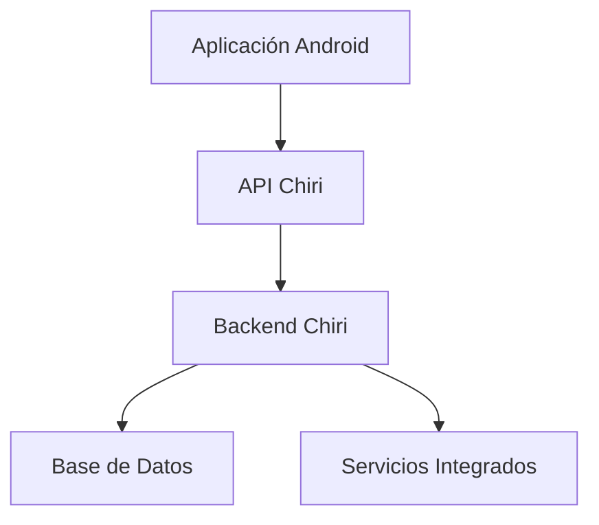

Cada componente deberá mantener responsabilidades claras, evitando acoplamientos innecesarios entre capas.

---

## 1.4 Resultado Esperado

La aplicación de estos estándares permitirá que Chiri Platform v1.0 mantenga una base de código organizada, confiable y preparada para futuras versiones y ampliaciones del sistema.

# 2. Principios de Calidad de Código

Los principios de calidad de código establecen las reglas fundamentales que deberán aplicarse durante el desarrollo y mantenimiento de Chiri Platform v1.0.

Estos principios buscan garantizar que la plataforma mantenga una estructura clara, consistente y preparada para su evolución futura.

---

# 2.1 Separación de Responsabilidades

Cada componente del sistema deberá tener una responsabilidad claramente definida.

La implementación deberá respetar la separación entre capas:

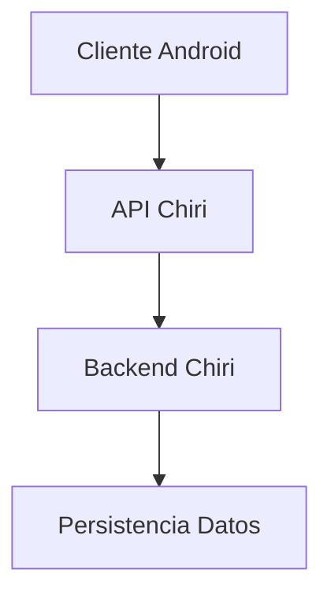

Principios:

* La interfaz de usuario no deberá contener lógica de negocio.
* La API deberá encargarse únicamente de comunicación y validación inicial.
* El Backend deberá contener las reglas de negocio.
* La Base de Datos deberá encargarse de persistencia e integridad.

---

# 2.2 Código Simple y Comprensible

El código deberá priorizar claridad sobre complejidad.

Buenas prácticas:

* Utilizar nombres descriptivos.
* Evitar lógica innecesariamente compleja.
* Dividir funcionalidades grandes en componentes pequeños.
* Mantener funciones con responsabilidades únicas.

Se deberá evitar:

* Código duplicado.
* Métodos excesivamente extensos.
* Soluciones difíciles de mantener.

---

# 2.3 Consistencia Técnica

Todos los módulos de Chiri Platform deberán mantener criterios comunes.

Incluye:

* Convenciones de nombres.
* Estructura de carpetas.
* Organización de archivos.
* Manejo de errores.
* Formato de código.

La consistencia permitirá que cualquier componente pueda ser entendido y mantenido siguiendo patrones conocidos.

---

# 2.4 Principio DRY (Don't Repeat Yourself)

La plataforma deberá evitar duplicación de código.

Cuando una lógica sea utilizada por varios componentes deberá:

* Centralizarse.
* Reutilizarse.
* Mantenerse en un único punto.

Beneficios:

* Menor cantidad de errores.
* Mantenimiento simplificado.
* Mejor evolución del sistema.

---

# 2.5 Principio KISS (Keep It Simple)

Las soluciones implementadas deberán mantenerse simples siempre que sea posible.

Se deberá evitar:

* Sobrearquitectura.
* Complejidad anticipada.
* Dependencias innecesarias.

Las decisiones técnicas deberán responder a necesidades reales de la plataforma.

---

# 2.6 Código Seguro

El desarrollo deberá considerar seguridad desde la implementación.

Buenas prácticas:

* Validación de datos de entrada.
* Protección de información sensible.
* Manejo seguro de credenciales.
* Control de permisos.
* Registro adecuado de eventos.

La seguridad deberá formar parte del diseño del código y no ser agregada posteriormente.

---

# 2.7 Código Preparado para Evolución

El código deberá permitir crecimiento futuro de Chiri Platform.

Se deberá considerar:

* Nuevos módulos.
* Nuevas integraciones.
* Cambios tecnológicos.
* Ampliación de funcionalidades.

Las implementaciones deberán evitar bloquear futuras mejoras.

---

# 2.8 Resultado Esperado

La aplicación de estos principios garantizará que Chiri Platform v1.0 mantenga una base de código organizada, uniforme y sostenible durante todo su ciclo de vida.

# 3. Estándares de Desarrollo

Los estándares de desarrollo definen las reglas técnicas y convenciones que deberán seguirse durante la creación y mantenimiento del código de Chiri Platform v1.0.

El objetivo es mantener uniformidad entre los diferentes módulos, facilitar la colaboración y reducir errores derivados de implementaciones inconsistentes.

---

# 3.1 Organización del Código

Cada componente deberá mantener una estructura organizada y predecible.

La organización general deberá respetar la separación definida por arquitectura:

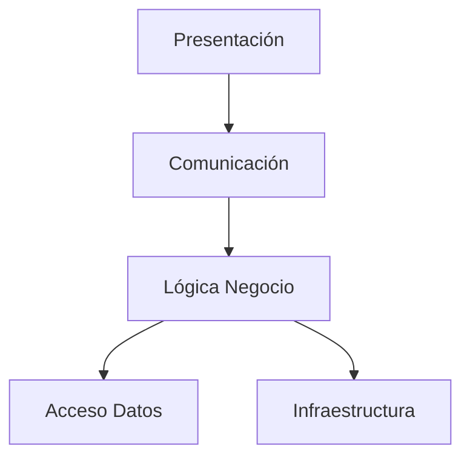

Principios:

* Cada módulo deberá tener una responsabilidad definida.
* Los archivos deberán ubicarse según su función.
* Las dependencias deberán mantenerse controladas.
* La estructura deberá facilitar la navegación del proyecto.

---

# 3.2 Convenciones de Nombres

Los nombres utilizados en el código deberán ser claros y descriptivos.

## Reglas generales

Se deberá utilizar:

* Nombres completos cuando mejoren la comprensión.
* Terminología consistente con el dominio Chiri.
* Evitar abreviaciones ambiguas.

Ejemplos:

Correcto:

```
usuarioActivo
fechaCreacion
obtenerConfiguracionUsuario()
```

Evitar:

```
usrAct
fecCre
getCfg()
```

---

# 3.3 Convenciones por Tecnología

Cada tecnología deberá mantener sus propias convenciones:

## Android

Consideraciones:

* Clases utilizando PascalCase.
* Variables y funciones utilizando camelCase.
* Componentes organizados por responsabilidad.
* Arquitectura separada por capas.

Ejemplo:

```
UsuarioRepository
obtenerUsuarioActual()
usuarioSeleccionado
```

---

## Backend

Consideraciones:

* Servicios separados de controladores.
* Lógica de negocio aislada.
* Modelos independientes.
* Validaciones centralizadas.

Ejemplo:

```
UsuarioController
UsuarioService
UsuarioRepository
```

---

## Base de Datos

Consideraciones:

* Uso de nombres consistentes.
* Separación entre modelo lógico y físico.
* Aplicación de reglas de integridad.

Convención definida:

* Frontend: camelCase.
* Base de Datos: snake_case.

Ejemplo:

Frontend:

```
fechaCreacion
```

Base de Datos:

```
fecha_creacion
```

---

# 3.4 Comentarios y Documentación del Código

Los comentarios deberán utilizarse para explicar decisiones importantes, no para describir código evidente.

Se deberá documentar:

* Lógica compleja.
* Decisiones arquitectónicas.
* Reglas de negocio especiales.
* Integraciones externas.

Se deberá evitar:

* Comentarios redundantes.
* Explicaciones obvias.
* Código comentado sin uso.

---

# 3.5 Manejo de Errores

Todos los componentes deberán implementar manejo adecuado de errores.

Principios:

* Los errores deben ser controlados.
* Los mensajes deben ser claros.
* No se deben exponer datos sensibles.
* Los eventos importantes deben registrarse.

Ejemplo:

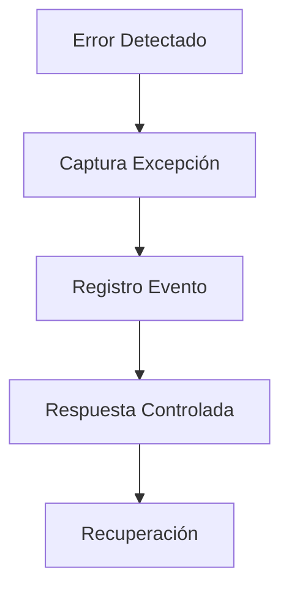

---

# 3.6 Control de Dependencias

Las dependencias externas deberán gestionarse cuidadosamente.

Criterios:

* Utilizar únicamente dependencias necesarias.
* Mantener versiones controladas.
* Evaluar impacto antes de agregar librerías.
* Evitar dependencias abandonadas.

---

# 3.7 Resultado Esperado

La aplicación de estos estándares permitirá que el código de Chiri Platform v1.0 mantenga una estructura uniforme, fácil de comprender y preparada para mantenimiento y crecimiento futuro.

# 4. Control de Versiones y Gestión del Código

El control de versiones establece las prácticas necesarias para administrar los cambios realizados en el código fuente de Chiri Platform v1.0.

Su objetivo es garantizar trazabilidad, seguridad y control sobre la evolución del software durante todo su ciclo de vida.

---

# 4.1 Objetivos del Control de Versiones

El uso de control de versiones permitirá:

* Registrar todos los cambios realizados.
* Mantener historial del desarrollo.
* Recuperar versiones anteriores.
* Facilitar colaboración.
* Controlar liberaciones.
* Reducir riesgos durante modificaciones.

---

# 4.2 Sistema de Control de Versiones

Chiri Platform v1.0 utilizará un sistema de control de versiones basado en Git.

La estructura permitirá administrar:

* Código fuente.
* Configuraciones.
* Documentación técnica.
* Scripts de despliegue.
* Archivos necesarios para construcción del sistema.

---

# 4.3 Organización de Repositorios

La organización deberá mantener separación lógica según responsabilidades.

Ejemplo:

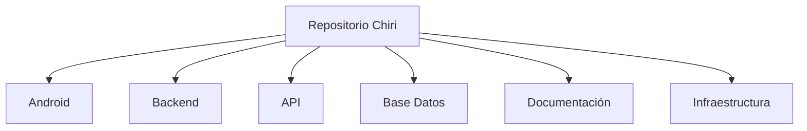

Cada repositorio o módulo deberá mantener:

* Código organizado.
* Documentación asociada.
* Historial independiente.
* Control de cambios.

---

# 4.4 Estrategia de Ramas

La gestión de ramas deberá permitir desarrollo seguro y controlado.

Estructura recomendada:

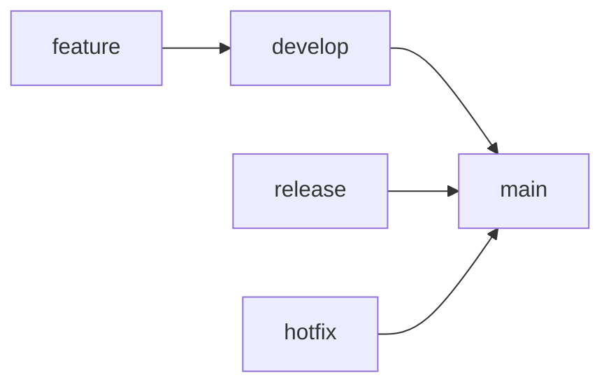

## Rama main

Uso:

* Versiones estables.
* Código listo para operación.

---

## Rama develop

Uso:

* Integración de nuevas funcionalidades.
* Pruebas antes de liberación.

---

## Ramas feature

Uso:

* Desarrollo de funcionalidades específicas.
* Cambios aislados.

Ejemplo:

```text
feature/autenticacion
feature/modulo-musica
feature/notificaciones
```

---

## Rama release

Uso:

* Preparación de nuevas versiones.
* Validación final.

---

## Rama hotfix

Uso:

* Correcciones urgentes sobre versiones liberadas.

---

# 4.5 Mensajes de Commit

Los mensajes de commit deberán ser claros y descriptivos.

Formato recomendado:

```text
tipo: descripción del cambio
```

Ejemplos:

```text
feat: agregar autenticacion usuario

fix: corregir validacion permisos

docs: actualizar arquitectura backend

refactor: mejorar servicio usuarios
```

Tipos principales:

| Tipo     | Uso                 |
| -------- | ------------------- |
| feat     | Nueva funcionalidad |
| fix      | Corrección de error |
| docs     | Documentación       |
| refactor | Mejora interna      |
| test     | Pruebas             |
| chore    | Mantenimiento       |

---

# 4.6 Revisión de Código

Antes de integrar cambios importantes se deberá realizar revisión de código.

La revisión deberá validar:

* Cumplimiento de estándares.
* Calidad de implementación.
* Seguridad.
* Impacto arquitectónico.
* Pruebas asociadas.

---

# 4.7 Protección del Código

Se deberán aplicar medidas para proteger el código fuente:

* Evitar almacenar credenciales.
* Mantener archivos sensibles fuera del repositorio.
* Controlar accesos.
* Revisar dependencias externas.
* Mantener respaldos.

---

# 4.8 Resultado Esperado

El control de versiones permitirá que Chiri Platform v1.0 mantenga una evolución ordenada, segura y trazable, facilitando el mantenimiento y desarrollo de futuras versiones.

# 5. Pruebas y Calidad del Software

La calidad del código de Chiri Platform v1.0 deberá estar respaldada por procesos de validación que permitan verificar el correcto funcionamiento de los componentes desarrollados.

Las pruebas forman parte integral del ciclo de desarrollo y deberán ejecutarse antes de integrar cambios importantes al sistema.

---

# 5.1 Objetivo de las Pruebas de Código

Las pruebas tienen como objetivo:

* Detectar errores tempranamente.
* Validar comportamiento esperado.
* Reducir riesgos en producción.
* Garantizar estabilidad de los módulos.
* Facilitar mantenimiento futuro.

---

# 5.2 Niveles de Prueba

La estrategia de calidad utilizará diferentes niveles de validación:

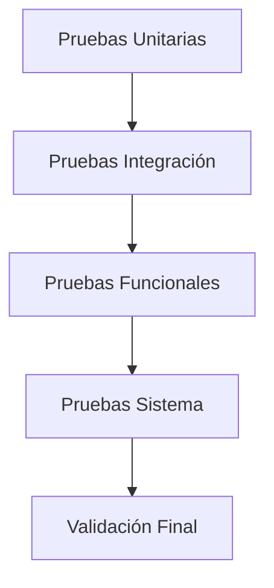

---

# 5.3 Pruebas Unitarias

Las pruebas unitarias deberán validar componentes individuales del código.

Aplicación:

* Funciones.
* Métodos.
* Servicios.
* Componentes independientes.

Objetivos:

* Validar lógica interna.
* Confirmar resultados esperados.
* Detectar errores aislados.

---

# 5.4 Pruebas de Integración

Las pruebas de integración deberán validar la comunicación entre módulos.

Ejemplos:

* Android con API Chiri.
* API con Backend.
* Backend con Base de Datos.
* Backend con servicios externos.

Validaciones:

* Comunicación correcta.
* Formatos compatibles.
* Manejo de errores.
* Consistencia de información.

---

# 5.5 Pruebas Funcionales

Las pruebas funcionales deberán comprobar que las funcionalidades cumplen los requisitos definidos.

Incluyen:

* Casos de uso.
* Reglas de negocio.
* Flujos principales.
* Validaciones de usuario.

Cada funcionalidad deberá tener:

* Escenario definido.
* Resultado esperado.
* Evidencia de ejecución.

---

# 5.6 Calidad del Código Antes de Integración

Antes de incorporar código al proyecto principal se deberá verificar:

* Código compilando correctamente.
* Pruebas asociadas ejecutadas.
* Sin errores críticos.
* Cumplimiento de estándares.
* Documentación actualizada cuando corresponda.

---

# 5.7 Métricas de Calidad

Se podrán utilizar métricas para evaluar el estado del código:

| Métrica              | Objetivo                |
| -------------------- | ----------------------- |
| Cobertura de pruebas | Medir código validado   |
| Complejidad          | Evitar lógica excesiva  |
| Duplicación          | Reducir código repetido |
| Errores detectados   | Mejorar estabilidad     |
| Tiempo resolución    | Mejorar mantenimiento   |

---

# 5.8 Revisión Continua

La calidad del código deberá mantenerse durante toda la evolución de Chiri Platform.

Las revisiones deberán considerar:

* Nuevas funcionalidades.
* Cambios arquitectónicos.
* Nuevas dependencias.
* Correcciones de errores.

---

# 5.9 Resultado Esperado

La aplicación de procesos de prueba y validación permitirá que Chiri Platform v1.0 mantenga un código confiable, estable y preparado para crecimiento continuo.

# 6. Seguridad del Código

La seguridad del código establece los principios y prácticas que deberán aplicarse durante el desarrollo de Chiri Platform v1.0 para reducir riesgos, proteger la información y garantizar un funcionamiento confiable de la plataforma.

La seguridad deberá considerarse como parte integral del desarrollo y no como una actividad posterior.

---

# 6.1 Objetivo de Seguridad del Código

Los objetivos principales son:

* Proteger información sensible.
* Evitar vulnerabilidades comunes.
* Garantizar uso seguro de recursos.
* Mantener control sobre accesos.
* Reducir riesgos durante la evolución del sistema.

---

# 6.2 Principios de Desarrollo Seguro

El desarrollo deberá seguir los siguientes principios:

## Validación de Entrada

Toda información recibida desde usuarios, APIs o servicios externos deberá ser validada.

Incluye:

* Tipos de datos.
* Longitudes.
* Formatos.
* Valores permitidos.

---

## Mínimo Privilegio

Cada componente deberá tener únicamente los permisos necesarios para cumplir su función.

Se deberá evitar:

* Accesos administrativos innecesarios.
* Permisos excesivos.
* Exposición de recursos internos.

---

## Protección de Información Sensible

El código no deberá contener información confidencial.

Ejemplos de datos protegidos:

* Contraseñas.
* Tokens.
* Claves privadas.
* Credenciales externas.
* Información personal.

---

# 6.3 Gestión de Credenciales

Las credenciales deberán gestionarse mediante mecanismos seguros.

Buenas prácticas:

* Utilizar variables de entorno.
* Mantener secretos fuera del código fuente.
* Rotar credenciales cuando sea necesario.
* Restringir acceso a información sensible.

Ejemplo:

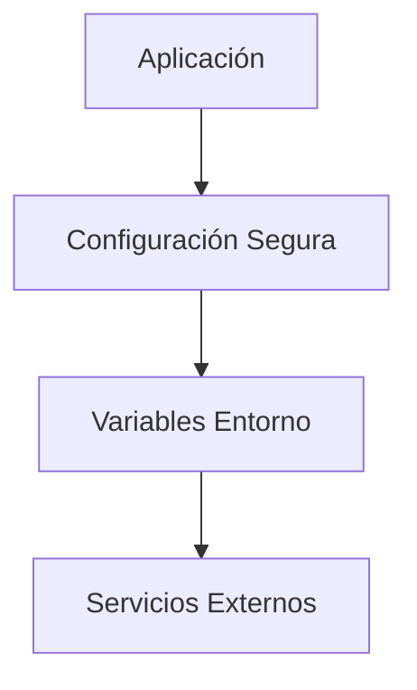

---

# 6.4 Manejo Seguro de Errores

Los errores deberán gestionarse evitando exposición de información interna.

Buenas prácticas:

* Registrar detalles técnicos internamente.
* Mostrar mensajes controlados al usuario.
* Evitar revelar estructura interna del sistema.
* Mantener trazabilidad mediante logs.

---

# 6.5 Seguridad en APIs

Las APIs deberán implementar controles de seguridad:

* Autenticación.
* Autorización.
* Validación de solicitudes.
* Control de permisos.
* Protección contra solicitudes inválidas.

Validación:


---

# 6.6 Dependencias Seguras

Las librerías y componentes externos deberán ser evaluados antes de incorporarse.

Se deberá considerar:

* Actualizaciones disponibles.
* Estado de mantenimiento.
* Vulnerabilidades conocidas.
* Necesidad real dentro del proyecto.

---

# 6.7 Auditoría y Registro

Los eventos relevantes deberán generar registros para análisis posterior.

Ejemplos:

* Inicio de sesión.
* Cambios importantes.
* Errores críticos.
* Accesos rechazados.
* Operaciones sensibles.

---

# 6.8 Revisión de Seguridad

Antes de liberar cambios importantes se deberá validar:

* Ausencia de credenciales expuestas.
* Correcto manejo de permisos.
* Validación de entradas.
* Protección de información.
* Cumplimiento de estándares definidos.

---

# 6.9 Resultado Esperado

La aplicación de prácticas de seguridad en el código permitirá que Chiri Platform v1.0 mantenga una base tecnológica confiable, reduciendo riesgos y protegiendo la información durante todo su ciclo de vida.

# 7. Documentación Técnica del Código

La documentación técnica del código establece las prácticas necesarias para mantener información clara sobre la implementación de Chiri Platform v1.0.

El objetivo es facilitar la comprensión, mantenimiento y evolución del sistema mediante documentación asociada al código y a sus componentes principales.

---

# 7.1 Objetivo de la Documentación

La documentación técnica permitirá:

* Facilitar mantenimiento del código.
* Reducir tiempo de comprensión del sistema.
* Registrar decisiones importantes.
* Mantener conocimiento del proyecto.
* Facilitar incorporación de nuevos colaboradores.

---

# 7.2 Elementos que Deben Documentarse

Deberán documentarse los componentes que tengan impacto en la arquitectura o funcionamiento del sistema.

Incluye:

* Módulos principales.
* Servicios internos.
* APIs.
* Modelos de datos.
* Integraciones externas.
* Configuraciones relevantes.
* Procesos complejos.

---

# 7.3 Documentación de Componentes

Cada componente importante deberá incluir información básica:

| Elemento        | Descripción                   |
| --------------- | ----------------------------- |
| Nombre          | Identificación del componente |
| Objetivo        | Función principal             |
| Responsabilidad | Qué operaciones realiza       |
| Dependencias    | Componentes relacionados      |
| Configuración   | Parámetros necesarios         |
| Uso             | Forma de integración          |

---

# 7.4 Documentación de APIs

Las APIs deberán mantener documentación sobre:

* Endpoint disponible.
* Método HTTP.
* Parámetros requeridos.
* Estructura de respuesta.
* Códigos de error.
* Reglas de autorización.

Ejemplo:

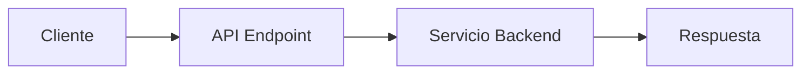

---

# 7.5 Documentación de Código Complejo

Cuando una implementación contenga lógica compleja deberá documentarse:

* Motivo de la implementación.
* Restricciones existentes.
* Decisiones tomadas.
* Consideraciones futuras.

La documentación deberá explicar el "por qué" de una solución, no solamente describir el código.

---

# 7.6 Comentarios Dentro del Código

Los comentarios deberán utilizarse para aportar contexto adicional.

Buenas prácticas:

* Explicar decisiones técnicas.
* Aclarar reglas especiales.
* Documentar comportamiento no evidente.

Evitar:

* Comentarios innecesarios.
* Repetir exactamente lo que hace el código.
* Mantener comentarios desactualizados.

---

# 7.7 Documentación y Arquitectura Chiri

La documentación del código deberá mantenerse alineada con los documentos oficiales de la plataforma:

* Arquitectura.
* Modelo de dominio.
* API.
* Base de datos.
* Implementación.

Cualquier cambio importante deberá actualizar la documentación correspondiente.

---

# 7.8 Resultado Esperado

Una documentación técnica adecuada permitirá que Chiri Platform v1.0 conserve el conocimiento del sistema, facilite el mantenimiento y permita una evolución ordenada durante futuras versiones.

# 8. Mantenimiento y Evolución del Código

El mantenimiento y evolución del código define las prácticas necesarias para conservar la calidad de Chiri Platform v1.0 durante todo su ciclo de vida.

El objetivo es garantizar que las modificaciones futuras mantengan la estabilidad, seguridad y coherencia arquitectónica de la plataforma.

---

# 8.1 Objetivo del Mantenimiento

El mantenimiento del código permitirá:

* Corregir errores detectados.
* Mejorar funcionalidades existentes.
* Optimizar rendimiento.
* Adaptar la plataforma a nuevas necesidades.
* Mantener compatibilidad entre componentes.

---

# 8.2 Tipos de Mantenimiento

Chiri Platform considerará los siguientes tipos de mantenimiento:

## Mantenimiento Correctivo

Objetivo:

Resolver errores encontrados durante operación o pruebas.

Incluye:

* Corrección de fallos.
* Ajustes de lógica.
* Resolución de incidencias.

---

## Mantenimiento Preventivo

Objetivo:

Reducir futuros problemas antes de que ocurran.

Incluye:

* Actualización de dependencias.
* Mejoras de estructura.
* Revisión de código.
* Optimización técnica.

---

## Mantenimiento Evolutivo

Objetivo:

Incorporar nuevas capacidades a la plataforma.

Incluye:

* Nuevos módulos.
* Nuevas integraciones.
* Mejoras funcionales.
* Ampliación de servicios.

---

# 8.3 Flujo de Cambio de Código

Todo cambio importante deberá seguir un proceso controlado:

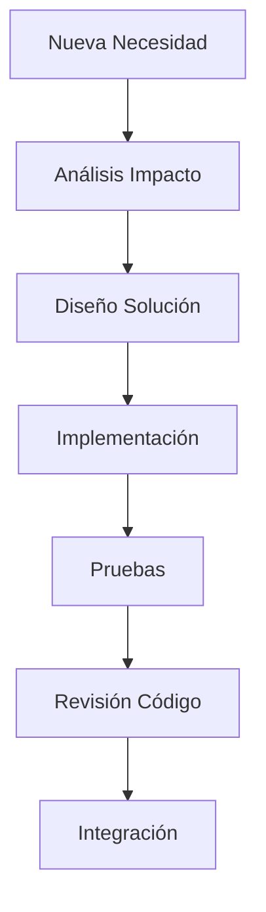

---

# 8.4 Evaluación de Impacto

Antes de realizar cambios importantes deberá analizarse:

* Componentes afectados.
* Dependencias relacionadas.
* Impacto en datos.
* Impacto en seguridad.
* Necesidad de actualización documental.

---

# 8.5 Compatibilidad y Versionamiento

Los cambios deberán considerar:

* Compatibilidad entre versiones.
* Migraciones necesarias.
* Actualización de documentación.
* Comunicación entre componentes.

Las modificaciones que afecten contratos entre módulos deberán ser tratadas como cambios controlados.

---

# 8.6 Refactorización del Código

La refactorización deberá utilizarse para mejorar la calidad interna sin alterar el comportamiento esperado.

Objetivos:

* Reducir complejidad.
* Eliminar duplicación.
* Mejorar legibilidad.
* Optimizar mantenimiento.

La refactorización deberá acompañarse de pruebas que validen que la funcionalidad permanece correcta.

---

# 8.7 Control de Código Obsoleto

El código que deje de utilizarse deberá:

* Ser identificado.
* Documentar motivo de retiro.
* Eliminarse cuando no tenga dependencias.
* Mantener historial mediante control de versiones.

---

# 8.8 Resultado Esperado

Una gestión adecuada del mantenimiento y evolución permitirá que Chiri Platform v1.0 pueda crecer de forma controlada, manteniendo la calidad del código y evitando degradación de la arquitectura con el tiempo.

# 9. Revisión y Aprobación de Código

La revisión y aprobación de código establece el proceso mediante el cual los cambios realizados en Chiri Platform v1.0 son evaluados antes de integrarse a las ramas principales del proyecto.

El objetivo es garantizar que cada modificación cumpla con los estándares definidos de calidad, seguridad y arquitectura.

---

# 9.1 Objetivo de la Revisión de Código

La revisión de código permitirá:

* Detectar errores antes de integración.
* Mantener consistencia técnica.
* Verificar cumplimiento de estándares.
* Identificar riesgos técnicos.
* Mejorar la calidad general del software.

---

# 9.2 Elementos Evaluados

Cada revisión deberá considerar:

| Área          | Validación                              |
| ------------- | --------------------------------------- |
| Funcionalidad | Cumple con el objetivo solicitado       |
| Arquitectura  | Respeta separación de responsabilidades |
| Calidad       | Código claro y mantenible               |
| Seguridad     | No introduce vulnerabilidades           |
| Rendimiento   | Uso adecuado de recursos                |
| Pruebas       | Validaciones incluidas                  |

---

# 9.3 Proceso de Revisión

El flujo de revisión será:

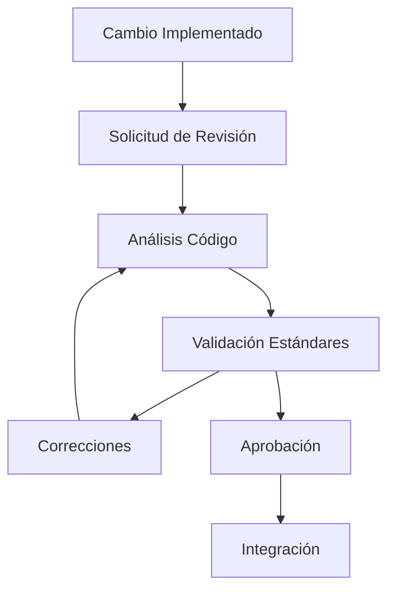

---

# 9.4 Lista de Verificación

Antes de aprobar un cambio se deberá validar:

## Código

* Sigue convenciones definidas.
* Mantiene estructura correcta.
* Evita duplicación innecesaria.
* Tiene nombres claros.

## Arquitectura

* Respeta responsabilidades de cada capa.
* No genera acoplamiento innecesario.
* Mantiene compatibilidad con componentes existentes.

## Seguridad

* No expone información sensible.
* Valida entradas.
* Maneja errores correctamente.
* Respeta permisos establecidos.

## Pruebas

* Incluye pruebas cuando corresponde.
* No rompe funcionalidades existentes.
* Tiene evidencia de validación.

---

# 9.5 Criterios de Aprobación

Un cambio será aprobado cuando:

* Cumpla los estándares de calidad.
* No tenga errores críticos.
* Mantenga compatibilidad con el sistema.
* Tenga pruebas satisfactorias.
* Cuente con documentación necesaria.

---

# 9.6 Cambios Rechazados

Un cambio podrá ser rechazado cuando:

* No cumpla estándares definidos.
* Introduzca riesgos de seguridad.
* Rompa la arquitectura establecida.
* No tenga validaciones suficientes.
* Genere deuda técnica innecesaria.

---

# 9.7 Resultado Esperado

El proceso de revisión y aprobación garantizará que únicamente código validado y de calidad sea integrado a Chiri Platform v1.0, manteniendo estabilidad y consistencia durante toda su evolución.

# 10. Cierre y Estándares Finales

El cierre de la Guía de Calidad de Código de Chiri Platform v1.0 establece los criterios finales que deberán mantenerse durante el desarrollo, mantenimiento y evolución de la plataforma.

Este documento define la base técnica necesaria para conservar un código organizado, seguro y sostenible a largo plazo.

---

# 10.1 Cumplimiento de Estándares

Todo código incorporado a Chiri Platform v1.0 deberá cumplir:

* Principios de arquitectura definidos.
* Convenciones de desarrollo establecidas.
* Reglas de seguridad.
* Prácticas de documentación.
* Procesos de revisión.
* Criterios de pruebas.

---

# 10.2 Responsabilidad Técnica

Cada modificación realizada sobre la plataforma deberá considerar:

* Impacto arquitectónico.
* Calidad de implementación.
* Seguridad.
* Mantenibilidad.
* Compatibilidad futura.

Los cambios deberán mantener la visión modular y escalable definida para Chiri Platform.

---

# 10.3 Evolución de los Estándares

Los estándares de calidad podrán evolucionar junto con la plataforma.

Las actualizaciones deberán considerar:

* Nuevas tecnologías incorporadas.
* Nuevas necesidades funcionales.
* Mejoras de procesos.
* Experiencia obtenida durante operación.

Cualquier cambio relevante deberá quedar documentado.

---

# 10.4 Relación con Otros Documentos Chiri

La calidad del código deberá mantenerse alineada con la documentación oficial:

* `020_Arquitectura.md`
* `030_Backend.md`
* `040_Android.md`
* `050_BaseDatos.md`
* `060_API.md`
* `090_GuiaProgramacion.md`
* `100_DecisionesArquitectura.md`
* `300_Pruebas_Sistema.md`

Estos documentos forman la referencia técnica para mantener coherencia en la plataforma.

---

# 10.5 Estado Final del Documento

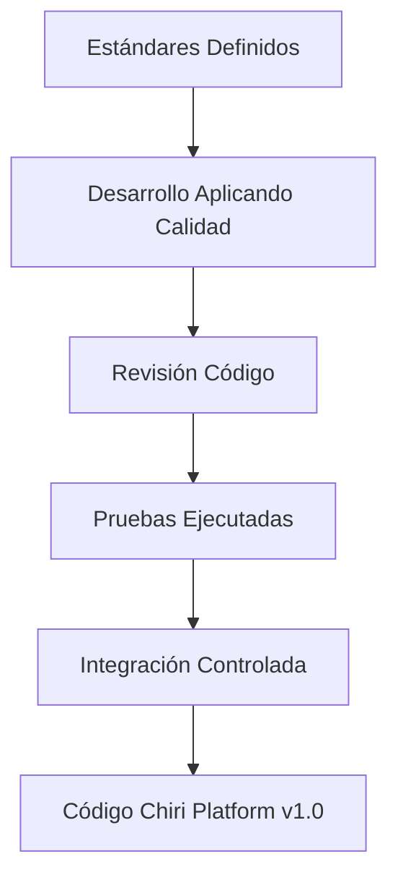

---

# 10.6 Cierre Documental

Con la finalización de este documento queda establecida la Guía de Calidad de Código para Chiri Platform v1.0.

Su aplicación permitirá mantener una base tecnológica:

* Ordenada.
* Segura.
* Comprensible.
* Escalable.
* Preparada para futuras versiones.

Este documento será la referencia para asegurar la calidad técnica durante todo el ciclo de vida de Chiri Platform.

