# 320_Monitoreo_Operacion.md

# Plan de Monitoreo y Operación Chiri Platform v1.0

---

# 1. Objetivo

El presente documento establece el Plan de Monitoreo y Operación de Chiri Platform v1.0.

Su objetivo es definir la estrategia, herramientas y procedimientos necesarios para supervisar el estado de la plataforma, garantizar su disponibilidad y facilitar la detección temprana de problemas durante su operación.

El monitoreo permitirá conocer el comportamiento de los diferentes componentes del sistema y tomar acciones preventivas o correctivas cuando sea necesario.

---

## 1.1 Objetivos Específicos

El plan de monitoreo tiene como objetivos:

* Supervisar el estado general de la plataforma.
* Detectar fallos antes de que afecten al usuario.
* Validar disponibilidad de servicios críticos.
* Controlar consumo de recursos de infraestructura.
* Analizar comportamiento de aplicaciones y servicios.
* Mantener registros para diagnóstico.
* Facilitar mantenimiento y resolución de incidencias.

---

## 1.2 Componentes Bajo Monitoreo

El monitoreo abarcará los componentes principales definidos en la arquitectura Chiri:

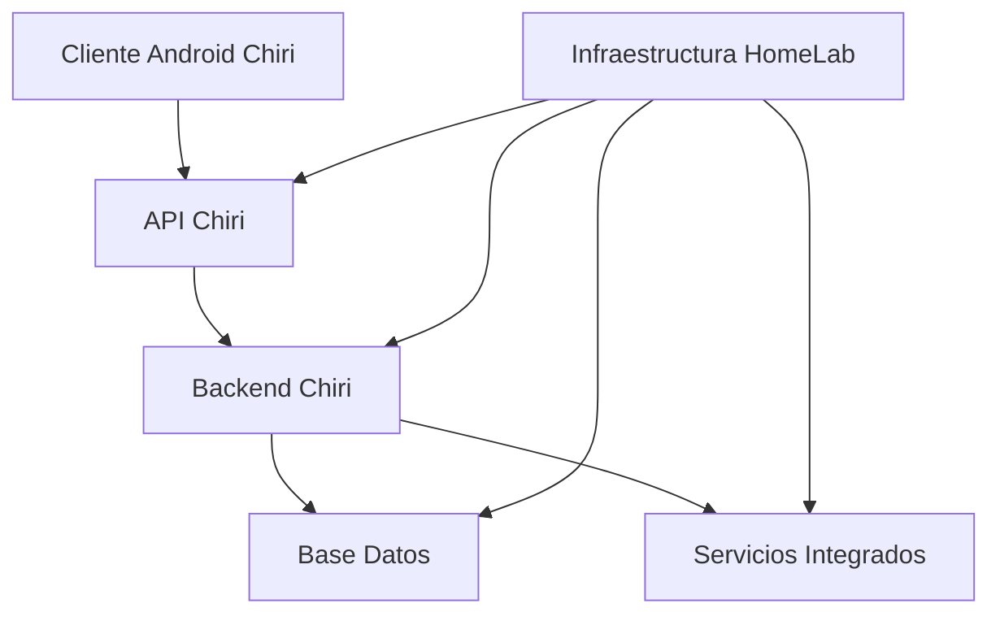

Los componentes serán evaluados considerando:

* Disponibilidad.
* Rendimiento.
* Errores.
* Uso de recursos.
* Estado operativo.

---

## 1.3 Principios de Operación

La operación de Chiri Platform seguirá los siguientes principios:

### Visibilidad

Todos los componentes importantes deberán proporcionar información suficiente sobre su estado.

### Prevención

El monitoreo deberá permitir detectar problemas antes de generar interrupciones.

### Trazabilidad

Los eventos relevantes deberán quedar registrados para análisis posterior.

### Automatización

Siempre que sea posible, las tareas repetitivas deberán ser automatizadas.

### Continuidad

La plataforma deberá mantener capacidad de recuperación ante fallos.

---

## 1.4 Relación con la Arquitectura Chiri

El monitoreo deberá respetar la arquitectura modular definida:

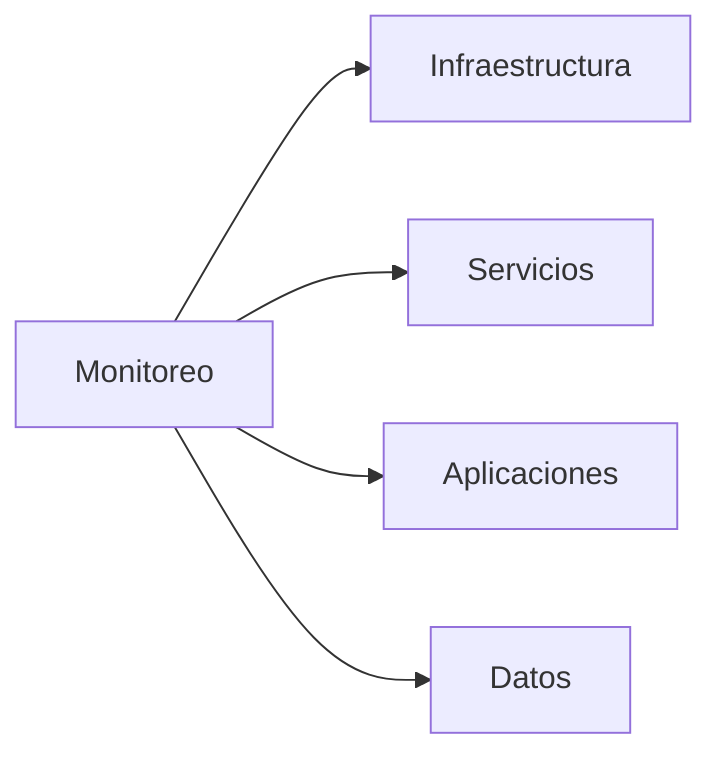

Cada capa deberá proporcionar información necesaria para evaluar su estado operativo.

---

## 1.5 Resultado Esperado

La implementación de este plan permitirá mantener una visión completa del estado de Chiri Platform v1.0, mejorar la estabilidad del sistema y facilitar la operación continua de la plataforma.

# 2. Alcance

El presente Plan de Monitoreo y Operación cubre la supervisión de los componentes principales de Chiri Platform v1.0 y establece los criterios necesarios para mantener una operación estable, controlada y observable.

El alcance incluye infraestructura, servicios, aplicaciones, datos e integraciones que forman parte del ecosistema Chiri.

---

# 2.1 Componentes Incluidos

El monitoreo contempla los siguientes componentes:

## Infraestructura HomeLab

Incluye:

* Raspberry Pi como servidor principal.
* Sistema operativo.
* Recursos físicos.
* Almacenamiento.
* Red interna.
* Disponibilidad del equipo.

---

## Contenedores y Servicios

Incluye:

* Servicios desplegados mediante Docker.
* Estado de contenedores.
* Inicio y reinicio de servicios.
* Consumo de recursos.
* Dependencias entre servicios.

---

## Backend Chiri

Incluye:

* Estado de servicios internos.
* Disponibilidad de procesos.
* Errores de aplicación.
* Tiempo de respuesta.
* Ejecución de operaciones principales.

---

## API Chiri

Incluye:

* Disponibilidad de endpoints.
* Respuestas HTTP.
* Errores de comunicación.
* Tiempo de respuesta.
* Control de acceso.

---

## Aplicación Android Chiri

Incluye:

* Disponibilidad de comunicación.
* Errores de conexión.
* Estado de versiones.
* Comportamiento de funcionalidades principales.

---

## Base de Datos

Incluye:

* Disponibilidad del motor.
* Conexiones activas.
* Uso de almacenamiento.
* Integridad de información.
* Rendimiento de consultas.

---

## Servicios Integrados

Incluye:

* Estado de conexiones externas.
* Disponibilidad de servicios.
* Errores de comunicación.
* Sincronización de información.

---

# 2.2 Capas de Monitoreo

La supervisión se realizará considerando las siguientes capas:

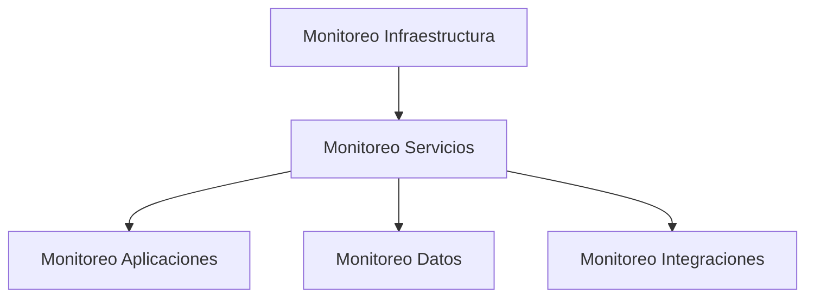

Cada capa proporcionará información específica para evaluar el estado general de la plataforma.

---

# 2.3 Exclusiones

No forman parte del alcance inicial:

* Monitoreo interno de plataformas externas administradas por terceros.
* Análisis avanzado de seguridad empresarial.
* Sistemas de monitoreo de infraestructura corporativa.
* Procesos no relacionados con Chiri Platform.

Estas capacidades podrán incorporarse en futuras versiones según la evolución de la plataforma.

---

# 2.4 Objetivo Operativo

El alcance definido permitirá disponer de una visión completa del estado de Chiri Platform v1.0, facilitando la detección de problemas, mantenimiento preventivo y mejora continua del sistema.

# 3. Estrategia de Monitoreo

La estrategia de monitoreo de Chiri Platform v1.0 define el enfoque utilizado para observar, analizar y mantener el estado operativo de la plataforma.

El objetivo es proporcionar visibilidad continua sobre los componentes críticos, permitiendo identificar comportamientos anómalos y actuar antes de que afecten la disponibilidad del sistema.

---

# 3.1 Enfoque de Monitoreo

El monitoreo de Chiri Platform estará basado en una estrategia por capas:

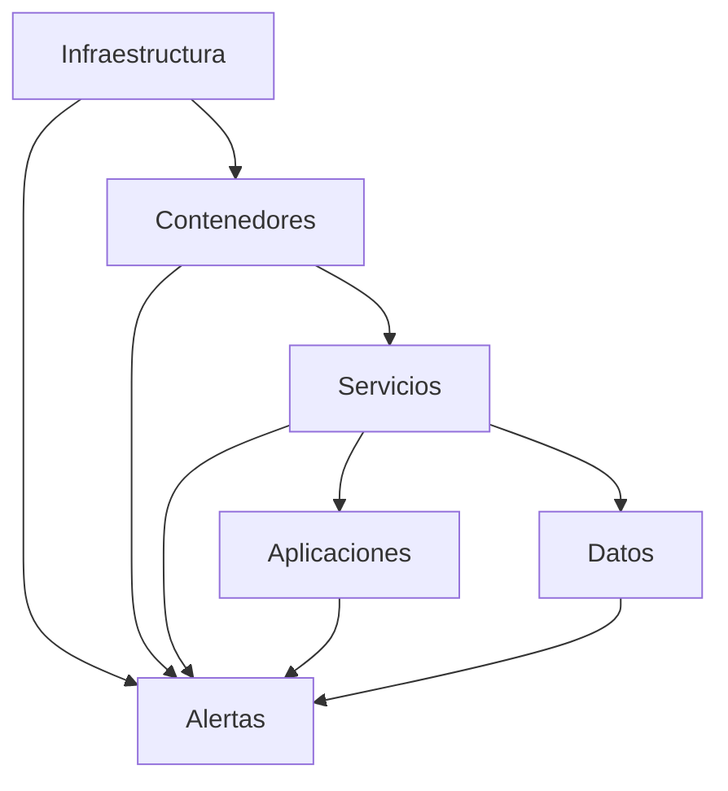

Cada capa proporcionará información necesaria para evaluar el estado general de la plataforma.

---

# 3.2 Tipos de Monitoreo

La plataforma utilizará diferentes tipos de monitoreo:

---

## Monitoreo de Disponibilidad

Objetivo:

Verificar que los componentes principales permanezcan operativos.

Validaciones:

* Servicios activos.
* Puertos disponibles.
* APIs respondiendo.
* Contenedores funcionando.

---

## Monitoreo de Rendimiento

Objetivo:

Evaluar el comportamiento y consumo de recursos.

Validaciones:

* Uso de CPU.
* Uso de memoria.
* Uso de almacenamiento.
* Tiempo de respuesta.
* Carga de servicios.

---

## Monitoreo de Errores

Objetivo:

Detectar fallos que puedan afectar la operación.

Validaciones:

* Errores de aplicación.
* Fallos de integración.
* Excepciones.
* Servicios detenidos.

---

## Monitoreo de Seguridad

Objetivo:

Identificar eventos relacionados con protección y acceso.

Validaciones:

* Intentos de acceso no autorizados.
* Fallos de autenticación.
* Cambios sensibles.
* Eventos de auditoría.

---

# 3.3 Modelo de Observabilidad

La observabilidad de Chiri Platform estará basada en tres elementos principales:

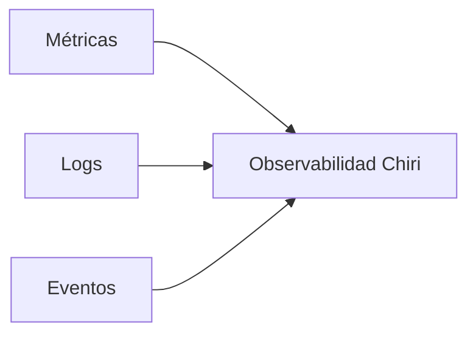

## Métricas

Permiten conocer el comportamiento cuantitativo del sistema.

Ejemplos:

* CPU.
* Memoria.
* Uso de disco.
* Tiempo respuesta.

---

## Logs

Permiten analizar acontecimientos ocurridos dentro de los servicios.

Ejemplos:

* Errores.
* Advertencias.
* Procesos ejecutados.
* Cambios importantes.

---

## Eventos

Permiten registrar acciones relevantes.

Ejemplos:

* Inicio de servicios.
* Fallos críticos.
* Cambios de configuración.

---

# 3.4 Prioridad de Monitoreo

Los componentes tendrán diferentes niveles de prioridad:

| Nivel   | Componentes                      |
| ------- | -------------------------------- |
| Crítico | Backend, API, Base de Datos      |
| Alto    | Servicios integrados principales |
| Medio   | Aplicaciones cliente             |
| Bajo    | Componentes auxiliares           |

---

# 3.5 Monitoreo Preventivo

El monitoreo deberá permitir identificar tendencias antes de generar fallos.

Ejemplos:

* Crecimiento de almacenamiento.
* Incremento de consumo de memoria.
* Aumento de errores.
* Degradación de rendimiento.

---

# 3.6 Resultado Esperado

La estrategia definida permitirá mantener una supervisión continua de Chiri Platform v1.0, proporcionando información suficiente para garantizar estabilidad, disponibilidad y una operación controlada del sistema.

# 4. Arquitectura de Observabilidad

La arquitectura de observabilidad define la estructura mediante la cual Chiri Platform v1.0 recopilará, procesará y analizará información operativa de sus diferentes componentes.

Su objetivo es proporcionar una visión completa del estado del sistema, permitiendo identificar problemas, analizar causas y mejorar la operación de la plataforma.

---

# 4.1 Modelo General de Observabilidad

La observabilidad de Chiri Platform estará basada en la recopilación de información desde todas las capas del sistema:

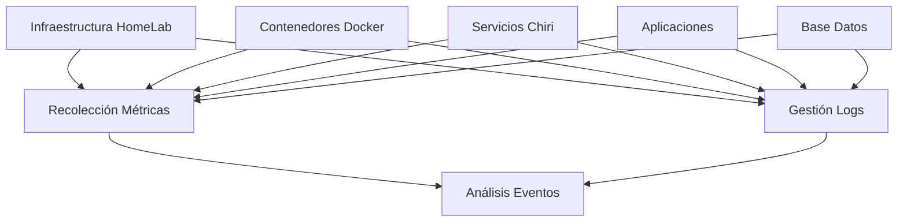

---

# 4.2 Componentes de Observabilidad

La arquitectura estará compuesta por:

---

## Capa de Recolección

Responsable de obtener información del sistema.

Incluye:

* Estado de servicios.
* Uso de recursos.
* Registros de eventos.
* Información de aplicaciones.

---

## Capa de Almacenamiento

Responsable de conservar la información recopilada.

Incluye:

* Historial de métricas.
* Logs.
* Eventos relevantes.
* Datos de diagnóstico.

---

## Capa de Análisis

Responsable de interpretar la información obtenida.

Permite:

* Detectar comportamientos anormales.
* Identificar tendencias.
* Analizar problemas.
* Generar alertas.

---

## Capa de Visualización

Responsable de presentar información operativa.

Permite:

* Consultar estado del sistema.
* Revisar métricas.
* Analizar eventos.
* Evaluar disponibilidad.

---

# 4.3 Flujo de Información Operativa

El flujo general será:

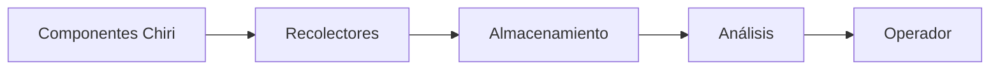

---

# 4.4 Áreas Supervisadas

La observabilidad cubrirá:

## Infraestructura

* Estado del servidor.
* Recursos físicos.
* Disponibilidad.

## Aplicaciones

* Estado de servicios.
* Errores.
* Rendimiento.

## Datos

* Disponibilidad.
* Integridad.
* Operaciones.

## Integraciones

* Comunicación.
* Disponibilidad externa.
* Errores.

---

# 4.5 Principios de Diseño

La arquitectura de observabilidad seguirá:

## Centralización

La información relevante deberá estar disponible desde un punto de consulta.

## Simplicidad

La solución deberá mantenerse acorde al tamaño y objetivos de Chiri Platform.

## Escalabilidad

Debe permitir incorporar nuevos servicios y métricas.

## Trazabilidad

Los eventos importantes deberán poder relacionarse con su origen.

---

# 4.6 Integración con Arquitectura Chiri

La observabilidad deberá complementar la arquitectura existente:

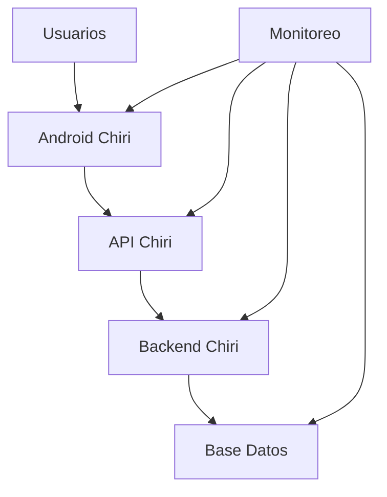

---

# 4.7 Resultado Esperado

La arquitectura de observabilidad permitirá que Chiri Platform v1.0 disponga de una visión operativa completa, facilitando la detección de problemas, análisis técnico y toma de decisiones durante la operación del sistema.

# 5. Monitoreo de Infraestructura

El monitoreo de infraestructura establece los mecanismos para supervisar los recursos físicos y del entorno operativo donde se ejecuta Chiri Platform v1.0.

Su objetivo es garantizar que la plataforma disponga de los recursos necesarios para funcionar correctamente y detectar anticipadamente problemas relacionados con hardware, sistema operativo, red o almacenamiento.

---

# 5.1 Objetivo del Monitoreo de Infraestructura

El monitoreo permitirá:

* Verificar disponibilidad del servidor.
* Controlar uso de recursos.
* Detectar degradación del sistema.
* Identificar problemas de conectividad.
* Prevenir saturación de almacenamiento.
* Mantener estabilidad del entorno HomeLab.

---

# 5.2 Componentes Monitoreados

La infraestructura de Chiri Platform estará compuesta por:

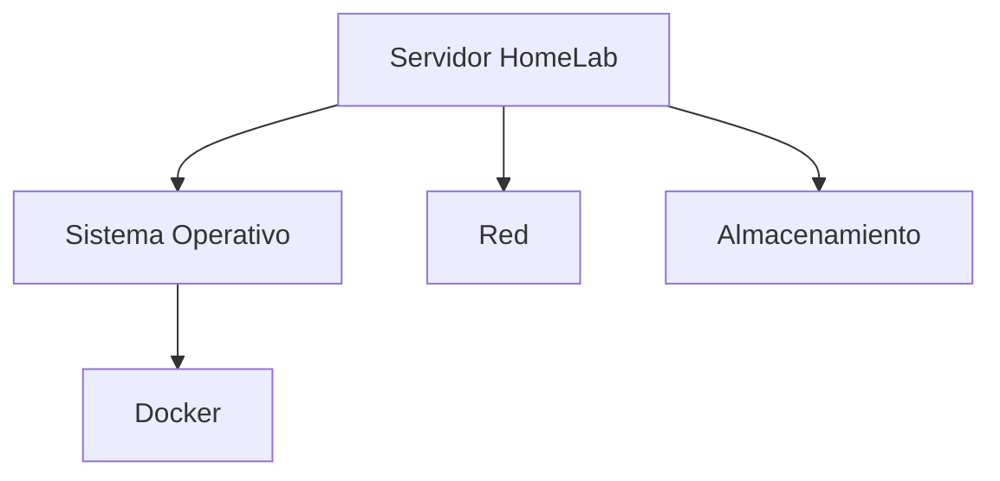

---

# 5.3 Monitoreo del Servidor

Se supervisarán los recursos principales:

## Procesador (CPU)

Validaciones:

* Porcentaje de utilización.
* Cargas prolongadas.
* Procesos con alto consumo.

Objetivo:

Evitar degradación del rendimiento por saturación.

---

## Memoria RAM

Validaciones:

* Uso actual.
* Memoria disponible.
* Consumo de servicios.
* Procesos críticos.

Objetivo:

Detectar falta de memoria y posibles fugas de recursos.

---

## Almacenamiento

Validaciones:

* Espacio disponible.
* Crecimiento de datos.
* Estado de discos.
* Uso de particiones.

Objetivo:

Prevenir interrupciones causadas por falta de espacio.

---

# 5.4 Monitoreo del Sistema Operativo

Se supervisarán:

* Estado general del sistema.
* Servicios activos.
* Procesos críticos.
* Tiempo de actividad.
* Eventos del sistema.

Validaciones:

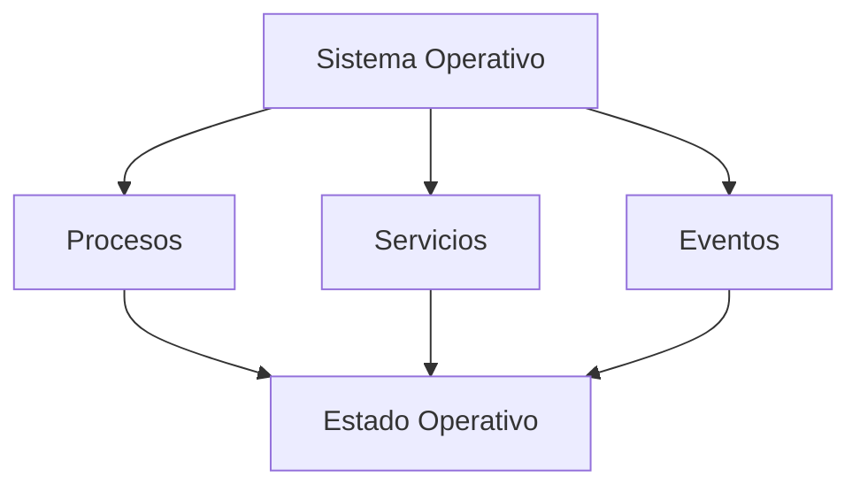

---

# 5.5 Monitoreo de Docker

Como plataforma principal de despliegue, Docker será supervisado considerando:

* Estado de contenedores.
* Reinicios inesperados.
* Uso de recursos.
* Logs de servicios.
* Disponibilidad de aplicaciones.

Validaciones:

| Elemento   | Control             |
| ---------- | ------------------- |
| Contenedor | Estado activo       |
| Servicio   | Disponibilidad      |
| Imagen     | Versión utilizada   |
| Recursos   | Consumo asignado    |
| Logs       | Errores registrados |

---

# 5.6 Monitoreo de Red

Se supervisarán aspectos relacionados con comunicación:

Incluye:

* Disponibilidad de red interna.
* Comunicación entre servicios.
* Resolución de nombres.
* Conectividad externa.
* Estado de conexiones.

Objetivo:

Garantizar comunicación correcta entre componentes Chiri.

---

# 5.7 Indicadores Principales

Los indicadores iniciales serán:

| Indicador            | Objetivo                       |
| -------------------- | ------------------------------ |
| CPU                  | Controlar carga del sistema    |
| RAM                  | Controlar consumo de memoria   |
| Disco                | Controlar capacidad disponible |
| Uptime               | Medir disponibilidad           |
| Contenedores activos | Validar servicios operativos   |
| Red                  | Validar comunicación           |

---

# 5.8 Resultado Esperado

El monitoreo de infraestructura permitirá mantener una base operativa estable para Chiri Platform v1.0, asegurando que los recursos del HomeLab sean suficientes y que los servicios puedan ejecutarse correctamente.

# 6. Monitoreo de Aplicaciones

El monitoreo de aplicaciones establece los mecanismos para supervisar el comportamiento de los componentes de software que forman parte de Chiri Platform v1.0.

Su objetivo es garantizar que las aplicaciones funcionen correctamente, detectar errores de ejecución y mantener una experiencia estable para los usuarios.

---

# 6.1 Objetivo del Monitoreo de Aplicaciones

El monitoreo permitirá:

* Verificar disponibilidad de aplicaciones y servicios.
* Detectar errores funcionales.
* Evaluar tiempos de respuesta.
* Analizar comportamiento operativo.
* Identificar degradación del servicio.
* Facilitar diagnóstico de incidencias.

---

# 6.2 Componentes Aplicativos Monitoreados

Se supervisarán los siguientes componentes:

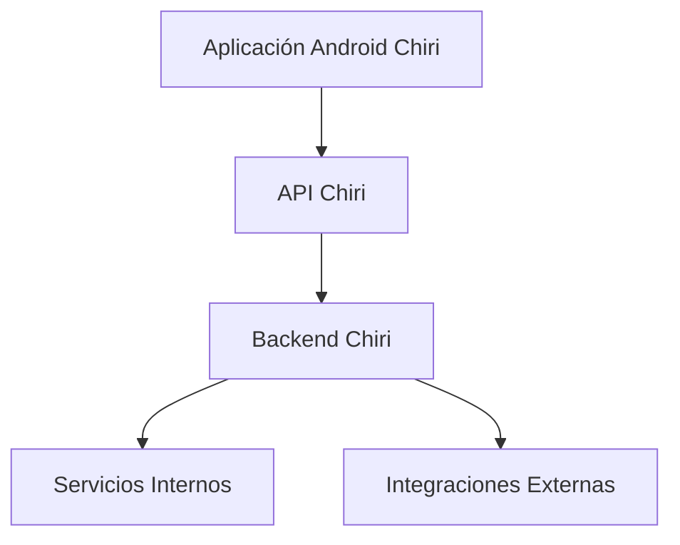

---

# 6.3 Monitoreo de Aplicación Android

El monitoreo del cliente Android deberá considerar:

## Disponibilidad

Validar:

* Inicio correcto de aplicación.
* Comunicación con servicios.
* Acceso a funcionalidades principales.

---

## Errores de Cliente

Registrar:

* Fallos de ejecución.
* Errores de comunicación.
* Problemas de validación.
* Excepciones no controladas.

---

## Rendimiento

Evaluar:

* Tiempo de respuesta.
* Consumo de recursos.
* Fluidez de operación.

---

# 6.4 Monitoreo de API Chiri

La API será monitoreada considerando:

## Disponibilidad de Endpoints

Validar:

* Respuesta correcta.
* Códigos HTTP esperados.
* Tiempo de respuesta.

---

## Errores de Comunicación

Registrar:

* Solicitudes inválidas.
* Fallos de autenticación.
* Errores internos.
* Problemas de conexión.

---

## Seguridad

Supervisar:

* Intentos de acceso.
* Solicitudes rechazadas.
* Eventos relevantes.

---

# 6.5 Monitoreo del Backend Chiri

El Backend será supervisado mediante:

## Estado de Servicios

Validar:

* Procesos activos.
* Disponibilidad.
* Reinicios inesperados.

---

## Ejecución de Lógica de Negocio

Supervisar:

* Errores internos.
* Operaciones fallidas.
* Procesamiento de solicitudes.

---

## Rendimiento

Evaluar:

* Tiempo de ejecución.
* Uso de recursos.
* Capacidad de respuesta.

---

# 6.6 Monitoreo de Integraciones

Las integraciones deberán supervisarse para garantizar comunicación correcta.

Incluye:

* Disponibilidad de servicios externos.
* Respuestas recibidas.
* Errores de conexión.
* Estado de sincronizaciones.

Flujo:


---

# 6.7 Indicadores de Aplicación

Los indicadores principales serán:

| Indicador               | Objetivo               |
| ----------------------- | ---------------------- |
| Disponibilidad servicio | Confirmar operación    |
| Tiempo respuesta        | Medir rendimiento      |
| Errores aplicación      | Detectar fallos        |
| Solicitudes procesadas  | Evaluar actividad      |
| Fallos integración      | Controlar comunicación |

---

# 6.8 Resultado Esperado

El monitoreo de aplicaciones permitirá mantener control sobre el comportamiento de los componentes de software de Chiri Platform v1.0, facilitando la detección de problemas y asegurando una operación estable para los usuarios.

# 7. Gestión de Logs

La gestión de logs establece los criterios para la generación, almacenamiento, análisis y conservación de registros operativos de Chiri Platform v1.0.

Los logs permitirán conocer el comportamiento interno de los componentes, facilitar el diagnóstico de problemas y mantener trazabilidad sobre eventos importantes del sistema.

---

# 7.1 Objetivo de la Gestión de Logs

La gestión de registros permitirá:

* Detectar errores de operación.
* Analizar comportamiento de servicios.
* Investigar incidencias.
* Mantener trazabilidad técnica.
* Facilitar mantenimiento.
* Apoyar auditorías.

---

# 7.2 Fuentes de Logs

Los registros podrán generarse desde diferentes capas:

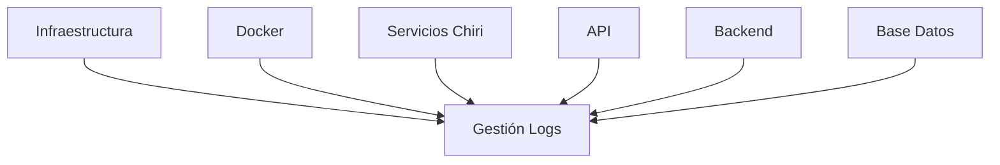

---

# 7.3 Tipos de Logs

Los registros se clasificarán según su propósito:

## Logs de Sistema

Incluyen:

* Eventos del sistema operativo.
* Inicio y apagado de servicios.
* Errores de infraestructura.
* Eventos del servidor.

---

## Logs de Aplicación

Incluyen:

* Ejecución de procesos.
* Errores funcionales.
* Eventos internos.
* Operaciones realizadas.

---

## Logs de Seguridad

Incluyen:

* Autenticaciones.
* Intentos fallidos.
* Cambios sensibles.
* Eventos de autorización.

---

## Logs de Integración

Incluyen:

* Comunicación con servicios externos.
* Solicitudes enviadas.
* Respuestas recibidas.
* Errores de conexión.

---

# 7.4 Niveles de Registro

Los eventos deberán clasificarse según importancia:

| Nivel    | Uso                                      |
| -------- | ---------------------------------------- |
| DEBUG    | Información detallada de desarrollo      |
| INFO     | Eventos normales de operación            |
| WARNING  | Situaciones potencialmente problemáticas |
| ERROR    | Fallos que afectan procesos              |
| CRITICAL | Fallos graves del sistema                |

---

# 7.5 Principios de Registro

Los logs deberán cumplir:

## Claridad

Los mensajes deben permitir comprender el evento ocurrido.

## Consistencia

Todos los servicios deberán utilizar formatos similares.

## Seguridad

No deberán almacenar información sensible.

## Trazabilidad

Los eventos importantes deberán permitir identificar origen y contexto.

---

# 7.6 Almacenamiento de Logs

Los registros deberán mantenerse considerando:

* Capacidad disponible.
* Tiempo de conservación.
* Facilidad de consulta.
* Protección de información.

Se deberá evitar crecimiento indefinido que pueda afectar la operación del sistema.

---

# 7.7 Análisis de Logs

Los logs serán utilizados para:

* Diagnóstico de errores.
* Investigación de incidencias.
* Análisis de rendimiento.
* Detección de comportamientos anómalos.

---

# 7.8 Resultado Esperado

Una correcta gestión de logs permitirá que Chiri Platform v1.0 mantenga trazabilidad operativa, facilite resolución de problemas y proporcione información necesaria para mejorar continuamente la plataforma.

# 8. Alertas y Notificaciones

El sistema de alertas y notificaciones establece los mecanismos necesarios para informar sobre eventos importantes que puedan afectar la disponibilidad, seguridad o funcionamiento de Chiri Platform v1.0.

Su objetivo es permitir una respuesta oportuna ante situaciones anómalas y reducir el impacto de posibles incidencias.

---

# 8.1 Objetivo de las Alertas

Las alertas permitirán:

* Detectar problemas críticos.
* Informar cambios relevantes.
* Reducir tiempos de respuesta.
* Facilitar acciones preventivas.
* Mantener control operativo de la plataforma.

---

# 8.2 Tipos de Alertas

Las alertas estarán clasificadas según su naturaleza:

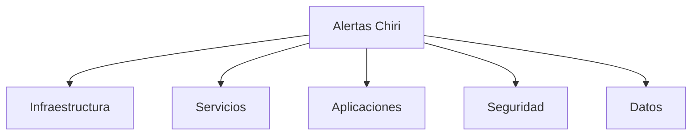

---

# 8.3 Alertas de Infraestructura

Se generarán ante situaciones como:

* Alto consumo de CPU.
* Falta de memoria disponible.
* Poco espacio de almacenamiento.
* Fallos del servidor.
* Problemas de conectividad.

Objetivo:

Mantener estabilidad del entorno HomeLab.

---

# 8.4 Alertas de Servicios

Aplican a componentes desplegados:

* Servicios detenidos.
* Contenedores caídos.
* Reinicios inesperados.
* Fallos de comunicación interna.

Ejemplo:

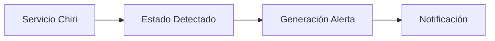

---

# 8.5 Alertas de Aplicaciones

Incluyen:

* Errores frecuentes.
* Tiempo de respuesta elevado.
* Fallos de autenticación.
* Problemas funcionales.

Aplican a:

* Aplicación Android.
* API Chiri.
* Backend Chiri.

---

# 8.6 Alertas de Seguridad

Se generarán ante eventos como:

* Intentos de acceso no autorizados.
* Fallos repetidos de autenticación.
* Cambios sensibles.
* Actividad sospechosa.

Estas alertas deberán mantener relación con los registros de auditoría definidos en la arquitectura de seguridad.

---

# 8.7 Niveles de Prioridad

Las alertas deberán clasificarse:

| Prioridad | Descripción                                             |
| --------- | ------------------------------------------------------- |
| Crítica   | Servicio principal detenido o pérdida de disponibilidad |
| Alta      | Degradación importante del sistema                      |
| Media     | Evento que requiere revisión                            |
| Baja      | Información preventiva                                  |

---

# 8.8 Gestión de Notificaciones

Las notificaciones deberán permitir:

* Informar eventos importantes.
* Evitar exceso de avisos.
* Diferenciar prioridades.
* Mantener historial de eventos.

El mecanismo de notificación podrá evolucionar según las necesidades futuras de Chiri Platform.

---

# 8.9 Flujo de Atención de Alertas

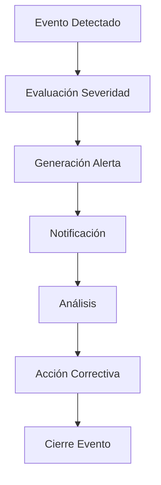

---

# 8.10 Resultado Esperado

El sistema de alertas y notificaciones permitirá mantener una operación preventiva de Chiri Platform v1.0, reduciendo tiempos de respuesta y facilitando la resolución de problemas antes de afectar la continuidad del servicio.

# 9. Métricas Operativas

Las métricas operativas establecen los indicadores utilizados para evaluar el estado, rendimiento y comportamiento de Chiri Platform v1.0 durante su operación.

El objetivo es disponer de información cuantificable que permita tomar decisiones técnicas, detectar tendencias y mejorar continuamente la plataforma.

---

# 9.1 Objetivo de las Métricas

Las métricas permitirán:

* Medir disponibilidad del sistema.
* Evaluar rendimiento.
* Identificar degradación.
* Analizar capacidad de infraestructura.
* Apoyar decisiones de mantenimiento.
* Validar evolución de la plataforma.

---

# 9.2 Categorías de Métricas

Las métricas se organizarán por áreas:

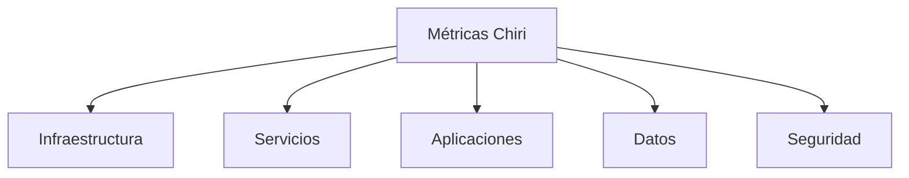

---

# 9.3 Métricas de Infraestructura

Permiten evaluar el estado del entorno HomeLab.

Incluyen:

| Métrica     | Objetivo                            |
| ----------- | ----------------------------------- |
| Uso CPU     | Evaluar carga del procesador        |
| Uso RAM     | Controlar disponibilidad de memoria |
| Uso Disco   | Controlar capacidad disponible      |
| Temperatura | Supervisar estado físico            |
| Uptime      | Medir disponibilidad                |

---

# 9.4 Métricas de Servicios

Permiten evaluar componentes desplegados.

Incluyen:

| Métrica           | Objetivo                  |
| ----------------- | ------------------------- |
| Estado contenedor | Confirmar operación       |
| Reinicios         | Detectar inestabilidad    |
| Uso recursos      | Evaluar consumo           |
| Disponibilidad    | Confirmar servicio activo |
| Errores           | Detectar fallos           |

---

# 9.5 Métricas de Aplicaciones

Aplican a componentes de software:

## API Chiri

Métricas:

* Cantidad de solicitudes.
* Tiempo de respuesta.
* Errores HTTP.
* Solicitudes rechazadas.

---

## Backend Chiri

Métricas:

* Operaciones ejecutadas.
* Errores internos.
* Tiempo de procesamiento.
* Uso de recursos.

---

## Aplicación Android

Métricas:

* Errores de ejecución.
* Fallos de conexión.
* Rendimiento percibido.

---

# 9.6 Métricas de Base de Datos

Permiten evaluar el estado de información.

Incluyen:

* Disponibilidad del motor.
* Tiempo de consultas.
* Conexiones activas.
* Crecimiento de almacenamiento.
* Errores de operación.

---

# 9.7 Métricas de Seguridad

Permiten evaluar eventos relacionados con protección.

Incluyen:

* Intentos de autenticación.
* Accesos rechazados.
* Eventos de auditoría.
* Cambios sensibles.

---

# 9.8 Indicadores de Operación (KPI)

Los principales indicadores operativos serán:

| Indicador        | Objetivo                        |
| ---------------- | ------------------------------- |
| Disponibilidad   | Mantener servicios operativos   |
| Tiempo respuesta | Garantizar rendimiento adecuado |
| Errores críticos | Reducir interrupciones          |
| Uso recursos     | Planificar capacidad            |
| Recuperación     | Evaluar resiliencia             |

---

# 9.9 Seguimiento de Tendencias

Las métricas deberán permitir analizar evolución del sistema:


Ejemplos:

* Incremento de almacenamiento.
* Crecimiento de usuarios.
* Mayor consumo de recursos.
* Necesidad de optimización.

---

# 9.10 Resultado Esperado

La definición de métricas operativas permitirá que Chiri Platform v1.0 mantenga una visión objetiva de su funcionamiento, facilitando la toma de decisiones técnicas y asegurando una operación estable y controlada.

# 10. Revisión Operativa

La revisión operativa establece las actividades periódicas necesarias para evaluar el estado de Chiri Platform v1.0 y garantizar que la plataforma mantenga niveles adecuados de disponibilidad, rendimiento y estabilidad.

Su objetivo es convertir la información obtenida mediante monitoreo, logs y métricas en acciones de mejora y mantenimiento.

---

# 10.1 Objetivo de la Revisión Operativa

La revisión operativa permitirá:

* Evaluar el estado general de la plataforma.
* Identificar problemas recurrentes.
* Revisar tendencias de comportamiento.
* Detectar necesidades de optimización.
* Planificar acciones preventivas.
* Mantener la calidad operacional.

---

# 10.2 Frecuencia de Revisión

Las revisiones podrán realizarse según la importancia del componente:

| Tipo de Revisión              | Frecuencia      |
| ----------------------------- | --------------- |
| Estado de servicios críticos  | Continua        |
| Revisión de alertas           | Periódica       |
| Análisis de logs              | Programada      |
| Revisión de métricas          | Programada      |
| Evaluación general plataforma | Según necesidad |

---

# 10.3 Actividades de Revisión

La revisión operativa deberá considerar:

## Estado de Infraestructura

Validar:

* Disponibilidad del servidor.
* Recursos utilizados.
* Estado de almacenamiento.
* Conectividad.

---

## Estado de Servicios

Validar:

* Contenedores activos.
* Servicios disponibles.
* Reinicios inesperados.
* Errores recientes.

---

## Estado de Aplicaciones

Validar:

* Funcionamiento de Android Chiri.
* Estado de API.
* Operación del Backend.
* Integraciones activas.

---

## Estado de Datos

Validar:

* Disponibilidad de Base de Datos.
* Integridad de información.
* Crecimiento de almacenamiento.
* Operaciones recientes.

---

# 10.4 Análisis de Incidencias

Las incidencias detectadas deberán analizarse considerando:

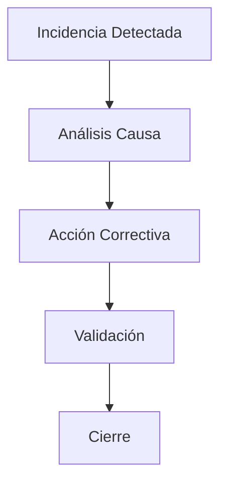

El análisis deberá buscar:

* Causa principal.
* Impacto generado.
* Solución aplicada.
* Prevención futura.

---

# 10.5 Revisión de Capacidad

La operación deberá evaluar si los recursos actuales son suficientes.

Se deberá revisar:

* Crecimiento de almacenamiento.
* Consumo de memoria.
* Carga del procesador.
* Necesidad de ampliación.

---

# 10.6 Revisión Documental

Los cambios importantes deberán reflejarse en la documentación:

* Arquitectura.
* Configuración.
* Procedimientos.
* Decisiones técnicas.

La documentación deberá mantenerse alineada con el estado real de la plataforma.

---

# 10.7 Resultado Esperado

La revisión operativa permitirá mantener Chiri Platform v1.0 bajo control continuo, garantizando una operación estable, identificando oportunidades de mejora y reduciendo riesgos futuros.

# 11. Cierre y Mejora Continua

El cierre del Plan de Monitoreo y Operación de Chiri Platform v1.0 establece los criterios finales para mantener una operación controlada y una evolución continua de la plataforma.

Este documento define la base operativa necesaria para supervisar el sistema, responder ante incidencias y mejorar progresivamente sus capacidades.

---

# 11.1 Cierre del Proceso Operativo

El proceso de monitoreo y operación se considerará establecido cuando:

* Los componentes críticos tengan mecanismos de supervisión definidos.
* Existan métricas operativas disponibles.
* Los eventos importantes sean registrados.
* Las alertas tengan criterios establecidos.
* Los procedimientos de revisión estén definidos.

---

# 11.2 Mejora Continua

La operación de Chiri Platform deberá evolucionar mediante un proceso continuo:

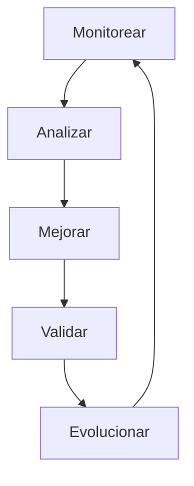

La mejora continua permitirá:

* Optimizar rendimiento.
* Mejorar estabilidad.
* Incorporar nuevas capacidades.
* Reducir incidencias repetitivas.

---

# 11.3 Evolución del Monitoreo

El sistema de monitoreo podrá ampliarse incorporando:

* Nuevas métricas.
* Nuevos servicios.
* Mayor automatización.
* Nuevas herramientas de observabilidad.
* Integraciones adicionales.

Las mejoras deberán mantener coherencia con la arquitectura general de Chiri Platform.

---

# 11.4 Relación con Otros Documentos

El monitoreo y operación deberá mantenerse alineado con:

* `020_Arquitectura.md`
* `030_Backend.md`
* `040_Android.md`
* `050_BaseDatos.md`
* `060_API.md`
* `070_Seguridad.md`
* `080_Despliegue.md`
* `300_Pruebas_Sistema.md`
* `310_Calidad_Codigo.md`

Estos documentos representan la referencia técnica para mantener la operación de la plataforma.

---

# 11.5 Estado Final del Documento

```mermaid id="8r2k6p"
flowchart TD

A[Monitoreo Definido]
B[Métricas Disponibles]
C[Alertas Configuradas]
D[Operación Controlada]
E[Mejora Continua]
F[Chiri Platform v1.0 Operativa]

A --> B
B --> C
C --> D
D --> E
E --> F
```

---

# 11.6 Cierre Documental

Con la finalización de este documento queda establecido el Plan de Monitoreo y Operación de Chiri Platform v1.0.

Su aplicación permitirá mantener una plataforma:

* Observable.
* Estable.
* Controlada.
* Preparada para mantenimiento.
* Lista para evolución futura.

Este documento será la referencia operativa para supervisar y mejorar continuamente Chiri Platform durante todo su ciclo de vida.
