# 330_Mantenimiento.md

# Plan de Mantenimiento Chiri Platform v1.0

---

# 1. Objetivo

El presente documento establece el Plan de Mantenimiento de Chiri Platform v1.0.

Su objetivo es definir las estrategias, procesos y actividades necesarias para conservar la plataforma operativa, segura y preparada para futuras evoluciones.

El mantenimiento permitirá garantizar la continuidad del servicio, corregir problemas detectados y aplicar mejoras controladas durante todo el ciclo de vida de Chiri Platform.

---

## 1.1 Objetivos Específicos

El plan de mantenimiento tiene como objetivos:

* Mantener disponibilidad de los servicios.
* Resolver incidencias detectadas.
* Prevenir fallos futuros.
* Mantener actualizado el entorno tecnológico.
* Proteger la integridad de la información.
* Facilitar evolución de la plataforma.
* Reducir riesgos operativos.

---

## 1.2 Principios de Mantenimiento

El mantenimiento de Chiri Platform seguirá los siguientes principios:

### Estabilidad

Los cambios deberán preservar el funcionamiento existente.

### Control

Toda modificación importante deberá estar registrada y validada.

### Seguridad

Las actividades deberán mantener la protección de datos y servicios.

### Continuidad

Las tareas deberán minimizar interrupciones operativas.

### Evolución

Las mejoras deberán permitir crecimiento futuro de la plataforma.

---

## 1.3 Componentes Bajo Mantenimiento

El mantenimiento abarcará los componentes principales:

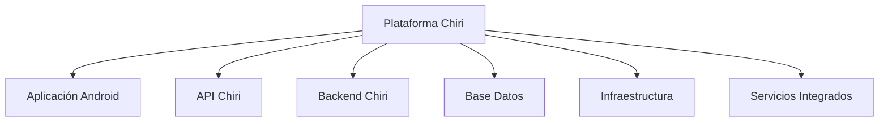

---

## 1.4 Relación con la Arquitectura

Las actividades de mantenimiento deberán respetar la arquitectura modular definida:

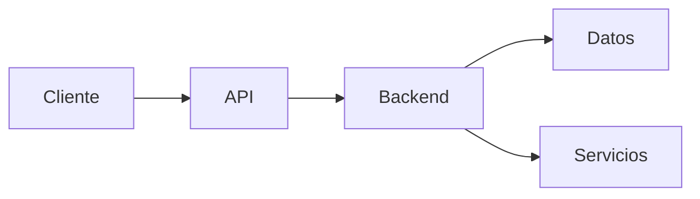

Los cambios deberán mantener:

* Separación de responsabilidades.
* Bajo acoplamiento.
* Integridad de datos.
* Compatibilidad entre componentes.

---

## 1.5 Resultado Esperado

La aplicación de este plan permitirá que Chiri Platform v1.0 mantenga una operación estable, segura y controlada, facilitando la resolución de problemas y la incorporación de mejoras futuras.

# 2. Alcance

El presente Plan de Mantenimiento define las actividades necesarias para conservar Chiri Platform v1.0 operativa durante todo su ciclo de vida.

El alcance contempla los componentes tecnológicos, aplicaciones, servicios y procesos necesarios para mantener la estabilidad y evolución controlada de la plataforma.

---

# 2.1 Componentes Incluidos

El mantenimiento contempla los siguientes componentes:

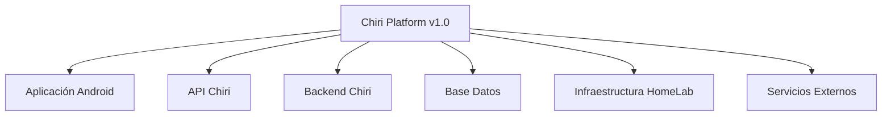

---

# 2.2 Mantenimiento de Aplicaciones

Incluye:

## Aplicación Android Chiri

Actividades:

* Corrección de errores.
* Actualización de dependencias.
* Mejoras funcionales.
* Compatibilidad con nuevas versiones.
* Optimización de rendimiento.

---

## API Chiri

Actividades:

* Corrección de endpoints.
* Mejoras de validación.
* Actualización de contratos.
* Optimización de comunicación.

---

## Backend Chiri

Actividades:

* Corrección de lógica de negocio.
* Optimización de procesos.
* Mejoras internas.
* Actualización de componentes.

---

# 2.3 Mantenimiento de Datos

Incluye:

* Actualización del modelo de datos.
* Optimización de consultas.
* Control de integridad.
* Gestión de crecimiento de información.
* Validación de respaldos.

---

# 2.4 Mantenimiento de Infraestructura

Incluye:

* Sistema operativo.
* Contenedores Docker.
* Servicios desplegados.
* Red interna.
* Almacenamiento.
* Recursos del servidor HomeLab.

---

# 2.5 Mantenimiento de Integraciones

Incluye:

* Comunicación con servicios externos.
* Actualización de configuraciones.
* Validación de conexiones.
* Gestión de cambios externos.

---

# 2.6 Exclusiones Iniciales

No forman parte del alcance inicial:

* Administración de plataformas externas de terceros.
* Soporte sobre hardware no relacionado con Chiri.
* Cambios sin evaluación técnica previa.
* Modificaciones fuera de la arquitectura definida.

Estas actividades podrán incorporarse en futuras versiones.

---

# 2.7 Flujo General de Mantenimiento

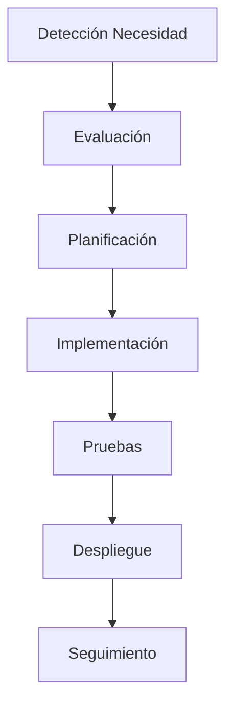

---

# 2.8 Resultado Esperado

El alcance definido permitirá mantener todos los componentes críticos de Chiri Platform v1.0 bajo un esquema organizado, evitando cambios descontrolados y garantizando continuidad operativa.

# 3. Estrategia de Mantenimiento

La estrategia de mantenimiento define la forma en que Chiri Platform v1.0 será administrada durante su operación, estableciendo criterios para prevenir problemas, resolver incidencias y aplicar mejoras de manera controlada.

El objetivo es mantener una plataforma estable, segura y preparada para evolucionar sin afectar su arquitectura base.

---

# 3.1 Enfoque de Mantenimiento

El mantenimiento de Chiri Platform estará basado en un enfoque preventivo, correctivo y evolutivo.

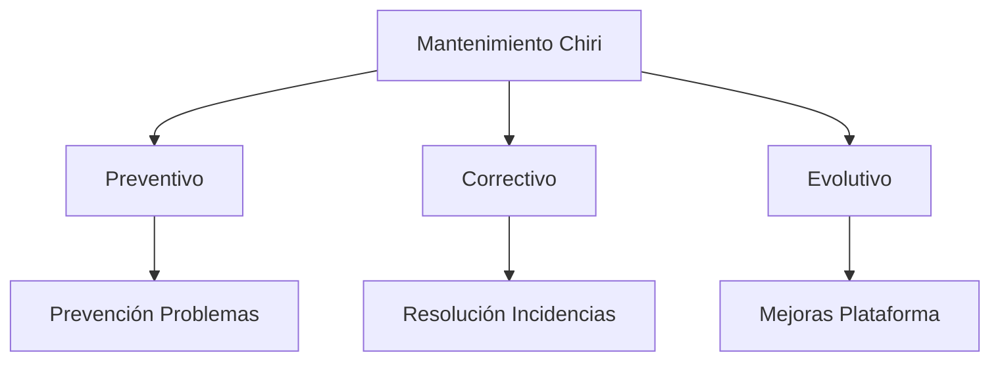

---

# 3.2 Principios de la Estrategia

La estrategia seguirá los siguientes principios:

## Planificación

Las actividades deberán ser evaluadas antes de ejecutarse.

Incluye:

* Análisis de impacto.
* Identificación de componentes afectados.
* Definición de pruebas necesarias.

---

## Control de Cambios

Todo cambio relevante deberá:

* Estar identificado.
* Tener justificación.
* Ser validado.
* Mantener documentación actualizada.

---

## Validación

Antes de aplicar modificaciones en operación se deberá comprobar:

* Funcionamiento correcto.
* Compatibilidad.
* Ausencia de efectos negativos.

---

## Recuperación

Las actividades deberán considerar mecanismos de retorno ante fallos.

Incluye:

* Respaldos.
* Versiones anteriores.
* Procedimientos de restauración.

---

# 3.3 Modelo Operativo de Mantenimiento

El proceso general será:

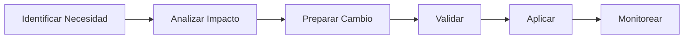

---

# 3.4 Priorización de Actividades

Las actividades serán clasificadas según impacto:

| Prioridad | Descripción                        |
| --------- | ---------------------------------- |
| Crítica   | Afecta disponibilidad o seguridad  |
| Alta      | Afecta funcionalidades importantes |
| Media     | Mejora funcionamiento existente    |
| Baja      | Optimización o mejora futura       |

---

# 3.5 Gestión del Riesgo

Antes de realizar cambios importantes se deberá evaluar:

* Impacto en usuarios.
* Impacto en servicios.
* Riesgo de pérdida de datos.
* Compatibilidad con versiones existentes.
* Necesidad de respaldo.

---

# 3.6 Coordinación con Documentación

Toda modificación importante deberá mantener actualizados los documentos relacionados:

* Arquitectura.
* API.
* Base de Datos.
* Implementación.
* Seguridad.
* Operación.

La documentación deberá representar siempre el estado real de la plataforma.

---

# 3.7 Resultado Esperado

La estrategia de mantenimiento permitirá que Chiri Platform v1.0 pueda recibir correcciones y mejoras de forma ordenada, reduciendo riesgos y manteniendo la estabilidad del sistema durante su evolución.

# 4. Tipos de Mantenimiento

Chiri Platform v1.0 contempla diferentes tipos de mantenimiento para garantizar la continuidad operativa, resolver problemas existentes y permitir la evolución controlada de la plataforma.

Cada tipo de mantenimiento tendrá objetivos y procedimientos específicos según la necesidad identificada.

---

# 4.1 Mantenimiento Correctivo

El mantenimiento correctivo tiene como objetivo solucionar errores o fallos detectados durante la operación de la plataforma.

Incluye:

* Corrección de errores funcionales.
* Resolución de fallos de servicios.
* Corrección de problemas de integración.
* Recuperación ante comportamientos inesperados.

Flujo:

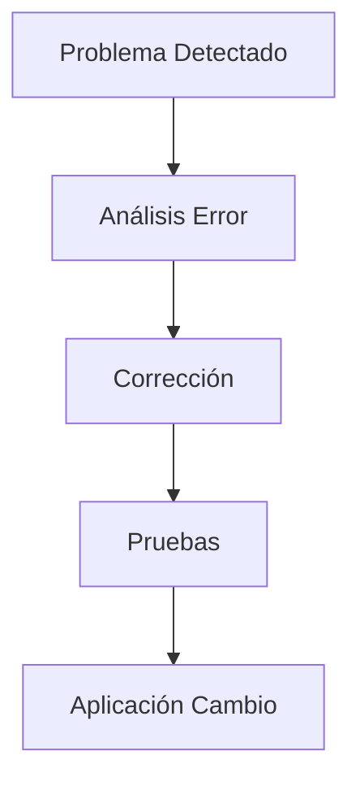

---

# 4.2 Mantenimiento Preventivo

El mantenimiento preventivo tiene como objetivo reducir la probabilidad de fallos futuros mediante acciones planificadas.

Incluye:

* Actualización de componentes.
* Revisión de configuraciones.
* Optimización de recursos.
* Limpieza de información temporal.
* Revisión de seguridad.

Ejemplos:

* Actualización de dependencias.
* Revisión de almacenamiento.
* Análisis de logs.
* Validación de respaldos.

---

# 4.3 Mantenimiento Evolutivo

El mantenimiento evolutivo permite incorporar nuevas capacidades y adaptar la plataforma a nuevas necesidades.

Incluye:

* Nuevos módulos.
* Nuevas funcionalidades.
* Nuevas integraciones.
* Mejoras de experiencia de usuario.

Proceso:

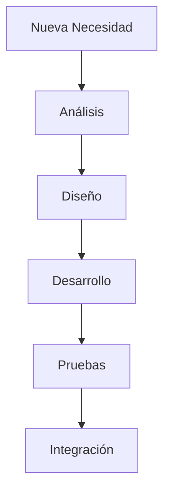

---

# 4.4 Mantenimiento Adaptativo

El mantenimiento adaptativo permite ajustar la plataforma ante cambios del entorno tecnológico.

Incluye:

* Nuevas versiones del sistema operativo.
* Cambios en dependencias.
* Cambios en servicios externos.
* Adaptación de infraestructura.

---

# 4.5 Mantenimiento de Seguridad

El mantenimiento de seguridad tiene como objetivo mantener protegida la plataforma.

Incluye:

* Actualización de componentes vulnerables.
* Revisión de accesos.
* Corrección de configuraciones inseguras.
* Mejora de controles de protección.

---

# 4.6 Clasificación de Actividades

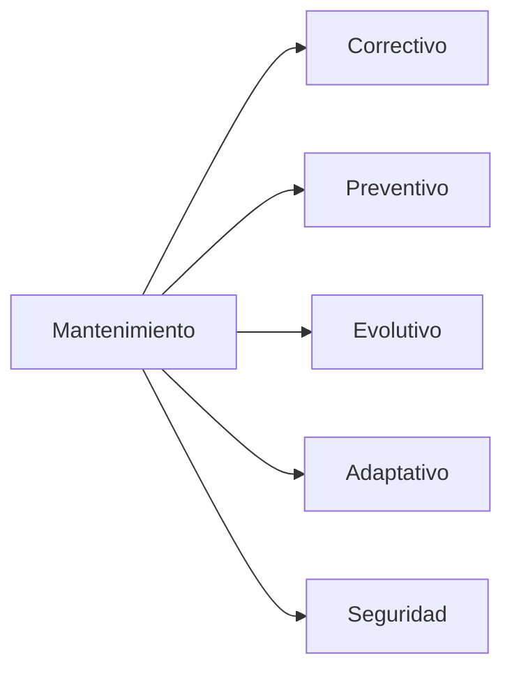

---

# 4.7 Criterios de Selección

El tipo de mantenimiento será determinado considerando:

* Naturaleza del problema.
* Impacto generado.
* Riesgo asociado.
* Necesidad funcional.
* Prioridad operativa.

---

# 4.8 Resultado Esperado

La definición de tipos de mantenimiento permitirá aplicar la estrategia adecuada para cada situación, manteniendo Chiri Platform v1.0 estable, segura y preparada para futuras necesidades.

# 5. Gestión de Incidencias

La gestión de incidencias establece el proceso utilizado para identificar, registrar, analizar y resolver problemas que puedan afectar el funcionamiento de Chiri Platform v1.0.

Su objetivo es reducir el impacto de los problemas, mantener la disponibilidad del sistema y generar conocimiento para prevenir futuras incidencias.

---

# 5.1 Objetivo de la Gestión de Incidencias

La gestión de incidencias permitirá:

* Registrar problemas detectados.
* Priorizar eventos según impacto.
* Resolver fallos de manera organizada.
* Mantener historial técnico.
* Identificar causas recurrentes.
* Mejorar la estabilidad de la plataforma.

---

# 5.2 Ciclo de Vida de una Incidencia

El proceso general será:

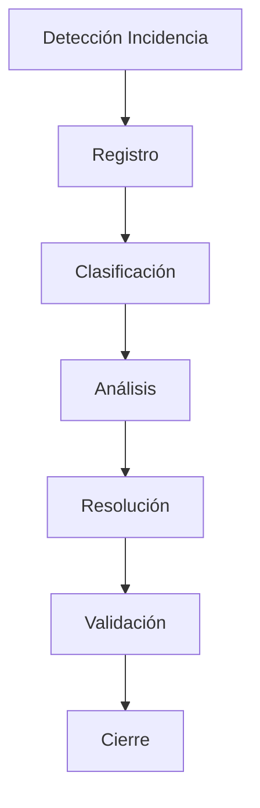

---

# 5.3 Registro de Incidencias

Cada incidencia deberá contener información básica:

| Campo               | Descripción          |
| ------------------- | -------------------- |
| Identificador       | Código único         |
| Fecha               | Momento de detección |
| Descripción         | Problema encontrado  |
| Componente afectado | Servicio involucrado |
| Impacto             | Nivel de afectación  |
| Prioridad           | Orden de atención    |
| Solución            | Acción realizada     |

---

# 5.4 Clasificación de Incidencias

Las incidencias podrán clasificarse:

## Incidencia Crítica

Características:

* Servicio principal no disponible.
* Pérdida de funcionalidad importante.
* Riesgo para información.

Acción:

Atención prioritaria.

---

## Incidencia Alta

Características:

* Funcionalidad importante degradada.
* Impacto significativo.

Acción:

Resolución prioritaria.

---

## Incidencia Media

Características:

* Problema limitado.
* Existe alternativa temporal.

Acción:

Programación de solución.

---

## Incidencia Baja

Características:

* Problema menor.
* Sin impacto operativo importante.

Acción:

Considerar en mantenimiento futuro.

---

# 5.5 Análisis de Causa Raíz

Las incidencias importantes deberán analizarse para determinar:

* Causa principal.
* Componentes involucrados.
* Impacto generado.
* Acción correctiva.
* Medidas preventivas.

Proceso:

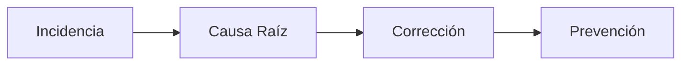

---

# 5.6 Seguimiento de Incidencias

Durante la resolución deberá mantenerse:

* Estado actualizado.
* Evidencia de pruebas.
* Registro de cambios.
* Resultado final.

Estados posibles:

| Estado      | Descripción           |
| ----------- | --------------------- |
| Nueva       | Incidencia registrada |
| Analizando  | En evaluación         |
| En solución | Aplicando corrección  |
| Validando   | Verificando solución  |
| Cerrada     | Solución confirmada   |

---

# 5.7 Relación con Monitoreo y Logs

La gestión de incidencias utilizará información proveniente de:

* Alertas.
* Métricas.
* Logs.
* Reportes de usuarios.

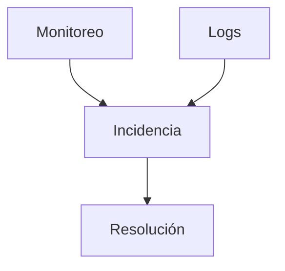

---

# 5.8 Resultado Esperado

Una correcta gestión de incidencias permitirá resolver problemas de manera organizada, mantener trazabilidad técnica y mejorar continuamente la estabilidad de Chiri Platform v1.0.

# 6. Actualización de Componentes

La actualización de componentes establece los criterios y procedimientos para mantener actualizados los elementos tecnológicos que forman parte de Chiri Platform v1.0.

El objetivo es garantizar seguridad, compatibilidad, estabilidad y acceso a mejoras tecnológicas sin afectar la operación de la plataforma.

---

# 6.1 Objetivo de las Actualizaciones

Las actualizaciones permitirán:

* Corregir vulnerabilidades.
* Mantener compatibilidad tecnológica.
* Mejorar rendimiento.
* Incorporar correcciones de fabricantes.
* Evitar obsolescencia de componentes.

---

# 6.2 Componentes Sujetos a Actualización

Los componentes considerados son:

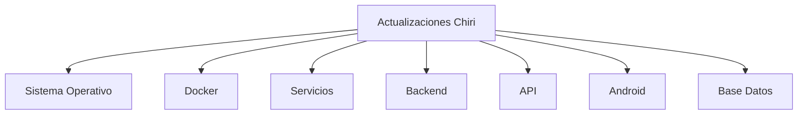

---

# 6.3 Actualización de Infraestructura

Incluye:

## Sistema Operativo

Actividades:

* Aplicación de actualizaciones de seguridad.
* Revisión de compatibilidad.
* Validación posterior.

---

## Docker y Contenedores

Actividades:

* Actualización de imágenes.
* Revisión de cambios.
* Validación de servicios.
* Control de versiones.

---

# 6.4 Actualización de Aplicaciones

Incluye:

## Backend y API

Validaciones:

* Compatibilidad de dependencias.
* Pruebas funcionales.
* Validación de integraciones.

---

## Aplicación Android

Validaciones:

* Compatibilidad con nuevas versiones Android.
* Pruebas de funcionalidades.
* Validación de comunicación con API.

---

# 6.5 Actualización de Base de Datos

Las actualizaciones deberán considerar:

* Cambios estructurales.
* Migraciones.
* Compatibilidad con aplicaciones.
* Respaldo previo.

Proceso:

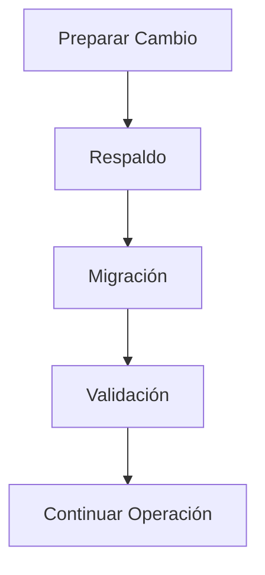

---

# 6.6 Criterios Antes de Actualizar

Antes de aplicar una actualización deberá evaluarse:

* Necesidad del cambio.
* Impacto esperado.
* Compatibilidad.
* Disponibilidad de respaldo.
* Plan de recuperación.

---

# 6.7 Control de Versiones

Las actualizaciones deberán mantener:

* Identificación de versión.
* Fecha de aplicación.
* Cambios realizados.
* Resultado obtenido.

---

# 6.8 Validación Posterior

Después de una actualización se deberá comprobar:

* Inicio correcto de servicios.
* Funcionamiento de aplicaciones.
* Comunicación entre componentes.
* Integridad de datos.
* Ausencia de errores críticos.

---

# 6.9 Resultado Esperado

Una gestión adecuada de actualizaciones permitirá que Chiri Platform v1.0 mantenga sus componentes seguros, compatibles y preparados para incorporar mejoras tecnológicas sin comprometer la estabilidad del sistema.

# 7. Respaldo y Recuperación

El respaldo y recuperación establece las estrategias necesarias para proteger la información y permitir la restauración de Chiri Platform v1.0 ante fallos, pérdida de datos o eventos inesperados.

El objetivo es garantizar la continuidad operativa mediante mecanismos de copia, protección y recuperación controlada.

---

# 7.1 Objetivo del Respaldo

Los respaldos permitirán:

* Proteger información crítica.
* Recuperar datos ante fallos.
* Reducir impacto de incidentes.
* Facilitar mantenimiento seguro.
* Garantizar continuidad de operación.

---

# 7.2 Componentes Incluidos en Respaldo

Los elementos considerados son:

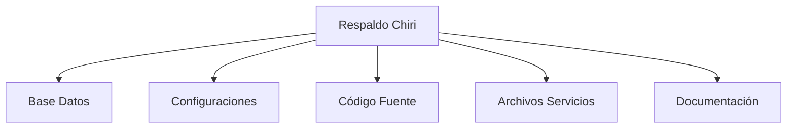

---

# 7.3 Datos Críticos

Se consideran datos críticos:

## Base de Datos

Incluye:

* Información de negocio.
* Configuraciones persistentes.
* Relaciones entre entidades.
* Datos históricos.

---

## Configuraciones

Incluye:

* Variables de entorno.
* Archivos de configuración.
* Parámetros de servicios.
* Configuración Docker.

---

## Código Fuente

Incluye:

* Backend.
* API.
* Aplicación Android.
* Scripts de automatización.

---

# 7.4 Estrategia de Respaldo

La estrategia considera:

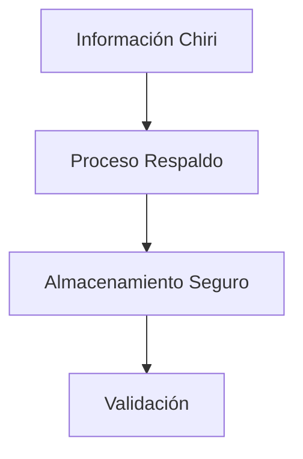

Los respaldos deberán considerar:

* Frecuencia definida.
* Verificación de integridad.
* Protección de acceso.
* Conservación adecuada.

---

# 7.5 Tipos de Respaldo

## Respaldo Completo

Incluye:

* Todos los datos seleccionados.
* Configuraciones.
* Componentes necesarios.

Uso:

Recuperación completa del sistema.

---

## Respaldo Incremental

Incluye:

* Cambios realizados desde el último respaldo.

Uso:

Optimización de espacio y tiempo.

---

## Respaldo Antes de Cambios

Debe realizarse antes de:

* Actualizaciones importantes.
* Migraciones.
* Cambios estructurales.
* Modificaciones críticas.

---

# 7.6 Proceso de Recuperación

El proceso general será:

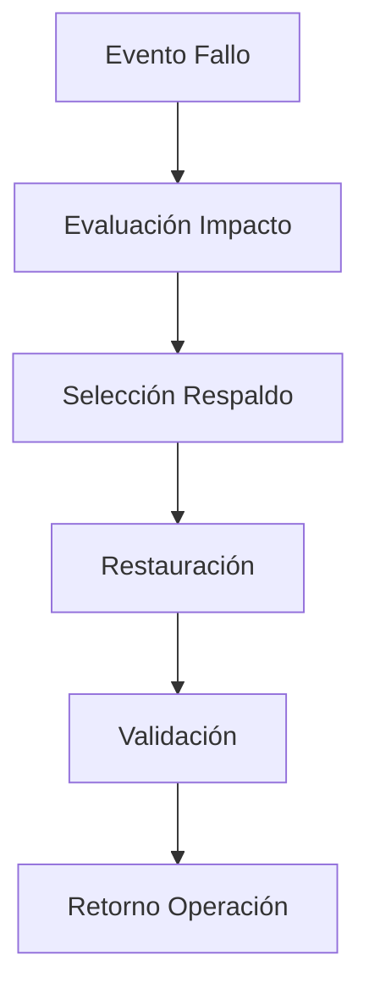

---

# 7.7 Validación de Respaldos

Los respaldos deberán verificarse mediante:

* Confirmación de creación correcta.
* Validación de archivos.
* Pruebas de restauración.
* Revisión periódica.

Un respaldo no validado no deberá considerarse garantía de recuperación.

---

# 7.8 Plan de Recuperación

Ante una falla importante se deberá considerar:

* Identificación del problema.
* Recuperación de información.
* Restauración de servicios.
* Validación funcional.
* Monitoreo posterior.

---

# 7.9 Resultado Esperado

Una estrategia adecuada de respaldo y recuperación permitirá que Chiri Platform v1.0 pueda recuperarse ante eventos inesperados, protegiendo la información y manteniendo la continuidad operativa.

# 8. Control de Cambios

El control de cambios establece el proceso mediante el cual las modificaciones realizadas en Chiri Platform v1.0 son evaluadas, registradas y aplicadas de forma controlada.

Su objetivo es evitar modificaciones no planificadas, reducir riesgos operativos y mantener la estabilidad de la plataforma.

---

# 8.1 Objetivo del Control de Cambios

El control de cambios permitirá:

* Mantener trazabilidad de modificaciones.
* Evaluar impacto antes de aplicar cambios.
* Reducir riesgos técnicos.
* Garantizar validaciones previas.
* Mantener documentación actualizada.

---

# 8.2 Tipos de Cambios

Los cambios podrán clasificarse como:

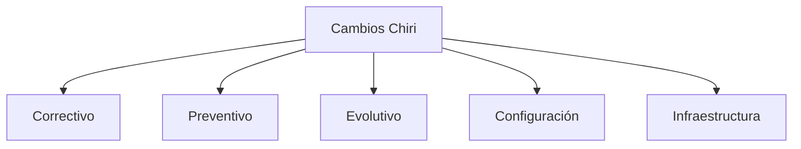

---

# 8.3 Registro de Cambios

Cada cambio importante deberá registrar:

| Campo                 | Descripción                |
| --------------------- | -------------------------- |
| Identificador         | Código del cambio          |
| Fecha                 | Momento de aplicación      |
| Responsable           | Persona o proceso ejecutor |
| Descripción           | Cambio realizado           |
| Motivo                | Razón del cambio           |
| Componentes afectados | Elementos involucrados     |
| Resultado             | Estado posterior           |

---

# 8.4 Evaluación de Impacto

Antes de aplicar un cambio deberá analizarse:

* Servicios afectados.
* Dependencias relacionadas.
* Riesgo de interrupción.
* Impacto en datos.
* Necesidad de respaldo.

Proceso:

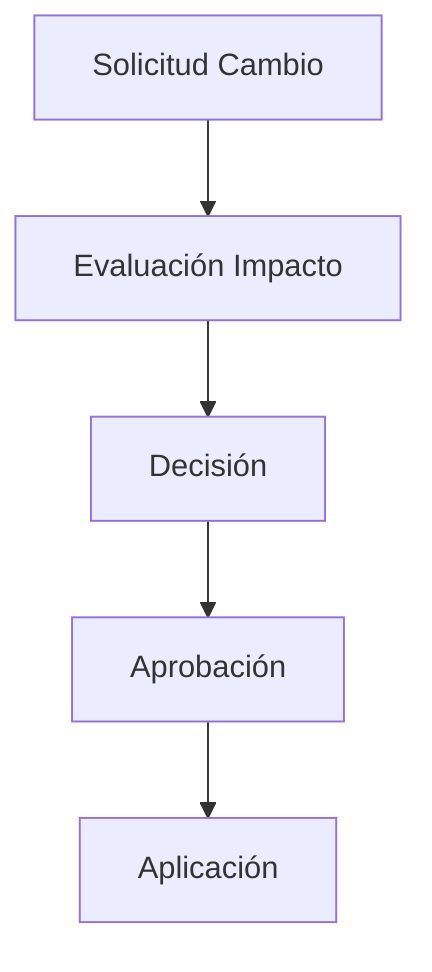

---

# 8.5 Estados de un Cambio

Los cambios podrán tener los siguientes estados:

| Estado    | Descripción            |
| --------- | ---------------------- |
| Propuesto | Cambio identificado    |
| Evaluando | Analizando impacto     |
| Aprobado  | Listo para ejecución   |
| Aplicando | En proceso             |
| Validando | Verificando resultado  |
| Cerrado   | Aplicado correctamente |

---

# 8.6 Control de Versiones

Los cambios deberán mantener:

* Identificación de versión.
* Historial de modificaciones.
* Relación entre componentes.
* Registro de cambios relevantes.

---

# 8.7 Cambios de Emergencia

Los cambios críticos podrán aplicarse con prioridad cuando exista:

* Indisponibilidad del servicio.
* Riesgo de seguridad.
* Pérdida potencial de información.

Posteriormente deberán documentarse:

* Motivo.
* Acción realizada.
* Resultado.
* Medidas preventivas.

---

# 8.8 Relación con Documentación

Todo cambio significativo deberá actualizar la documentación correspondiente:

* Arquitectura.
* Implementación.
* API.
* Base de datos.
* Seguridad.
* Operación.

---

# 8.9 Resultado Esperado

El control de cambios permitirá que Chiri Platform v1.0 evolucione de manera organizada, manteniendo estabilidad, trazabilidad y coherencia con la arquitectura definida.

# 9. Mantenimiento Preventivo

El mantenimiento preventivo establece las actividades planificadas que permiten reducir la probabilidad de fallos y conservar Chiri Platform v1.0 en condiciones óptimas de operación.

Su objetivo es anticiparse a problemas mediante revisiones periódicas, optimización de recursos y aplicación de buenas prácticas técnicas.

---

# 9.1 Objetivo del Mantenimiento Preventivo

El mantenimiento preventivo permitirá:

* Evitar fallos inesperados.
* Mantener estabilidad del sistema.
* Optimizar recursos.
* Detectar riesgos anticipadamente.
* Prolongar la vida útil de los componentes.

---

# 9.2 Actividades Preventivas

Las actividades principales serán:

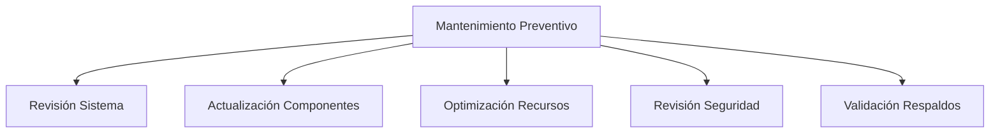

---

# 9.3 Revisión de Infraestructura

Actividades:

* Verificación del estado del servidor.
* Revisión de consumo de CPU y memoria.
* Control de almacenamiento disponible.
* Revisión de temperatura y condiciones operativas.
* Validación de conectividad.

---

# 9.4 Revisión de Servicios

Actividades:

* Confirmar servicios activos.
* Revisar contenedores Docker.
* Analizar reinicios inesperados.
* Revisar logs recientes.
* Validar dependencias.

---

# 9.5 Optimización del Sistema

Incluye:

* Eliminación de archivos temporales.
* Revisión de almacenamiento.
* Optimización de configuraciones.
* Análisis de consumo de recursos.
* Ajustes de rendimiento.

---

# 9.6 Revisión de Seguridad

Actividades:

* Aplicar actualizaciones de seguridad.
* Revisar configuraciones sensibles.
* Validar permisos.
* Revisar eventos de acceso.
* Confirmar controles establecidos.

---

# 9.7 Validación de Respaldos

Se deberá verificar:

* Ejecución correcta de copias.
* Integridad de archivos.
* Disponibilidad de restauración.
* Actualización de procedimientos.

---

# 9.8 Calendario Preventivo

Las actividades podrán organizarse según frecuencia:

| Frecuencia | Actividades                              |
| ---------- | ---------------------------------------- |
| Diaria     | Revisión de alertas y servicios críticos |
| Semanal    | Revisión de logs y recursos              |
| Mensual    | Actualizaciones y validaciones generales |
| Periódica  | Evaluación completa de plataforma        |

---

# 9.9 Resultado Esperado

El mantenimiento preventivo permitirá conservar Chiri Platform v1.0 estable, reducir interrupciones y detectar oportunamente situaciones que puedan afectar la operación futura.

# 10. Mantenimiento Evolutivo

El mantenimiento evolutivo establece el proceso mediante el cual Chiri Platform v1.0 incorporará nuevas capacidades, mejoras funcionales y adaptaciones necesarias para responder a futuras necesidades.

Su objetivo es permitir que la plataforma crezca de manera ordenada, manteniendo la arquitectura modular y evitando degradación técnica.

---

# 10.1 Objetivo del Mantenimiento Evolutivo

El mantenimiento evolutivo permitirá:

* Incorporar nuevas funcionalidades.
* Mejorar servicios existentes.
* Adaptar la plataforma a nuevos escenarios.
* Integrar nuevas tecnologías.
* Incrementar capacidades del sistema.

---

# 10.2 Tipos de Evolución

La evolución de Chiri Platform podrá realizarse en diferentes áreas:

```mermaid id="7m4x9q"
flowchart TD

A[Evolución Chiri]

A --> B[Nuevos Módulos]
A --> C[Mejoras Funcionales]
A --> D[Nuevas Integraciones]
A --> E[Optimización Técnica]
A --> F[Escalabilidad]
```

---

# 10.3 Incorporación de Nuevas Funcionalidades

Las nuevas funcionalidades deberán considerar:

* Requerimiento definido.
* Análisis de impacto.
* Diseño técnico.
* Implementación.
* Pruebas.
* Actualización documental.

---

# 10.4 Evolución Arquitectónica

Los cambios arquitectónicos deberán mantener:

* Separación de responsabilidades.
* Comunicación mediante interfaces definidas.
* Bajo acoplamiento.
* Escalabilidad futura.

Proceso:

```mermaid id="5r8k2n"
flowchart TD

A[Nueva Necesidad]
B[Evaluación Arquitectura]
C[Diseño Solución]
D[Implementación]
E[Validación]

A --> B
B --> C
C --> D
D --> E
```

---

# 10.5 Integración de Nuevos Servicios

La incorporación de servicios deberá evaluar:

* Compatibilidad con arquitectura existente.
* Seguridad.
* Consumo de recursos.
* Mantenimiento requerido.
* Impacto operativo.

---

# 10.6 Gestión de Deuda Técnica

La evolución deberá considerar la reducción de deuda técnica mediante:

* Refactorización.
* Eliminación de componentes obsoletos.
* Mejora de documentación.
* Actualización tecnológica.

---

# 10.7 Control de Evolución

Toda evolución importante deberá registrar:

| Elemento   | Descripción           |
| ---------- | --------------------- |
| Necesidad  | Motivo del cambio     |
| Diseño     | Solución propuesta    |
| Impacto    | Componentes afectados |
| Validación | Pruebas realizadas    |
| Resultado  | Estado final          |

---

# 10.8 Relación con Roadmap

Las evoluciones futuras deberán alinearse con:

* Objetivos de Chiri Platform.
* Capacidad de infraestructura.
* Prioridades funcionales.
* Recursos disponibles.

---

# 10.9 Resultado Esperado

El mantenimiento evolutivo permitirá que Chiri Platform v1.0 pueda crecer de forma controlada, incorporando mejoras y nuevas capacidades sin comprometer la estabilidad, seguridad ni principios arquitectónicos definidos.

# 11. Cierre y Mejora Continua

El cierre del Plan de Mantenimiento establece los criterios finales para garantizar que Chiri Platform v1.0 pueda mantenerse operativa, segura y preparada para su evolución futura.

Este documento define las bases necesarias para gestionar cambios, resolver incidencias y aplicar mejoras durante todo el ciclo de vida de la plataforma.

---

# 11.1 Cierre del Proceso de Mantenimiento

El proceso de mantenimiento se considerará establecido cuando:

* Existan procedimientos definidos para cambios.
* Las incidencias tengan un proceso de atención.
* Los respaldos estén contemplados.
* Las actualizaciones sean controladas.
* La evolución siga criterios arquitectónicos.

---

# 11.2 Mejora Continua

La mejora continua permitirá que la plataforma evolucione mediante un ciclo permanente:

```mermaid id="6x3m8p"
flowchart TD

A[Operar]
B[Analizar]
C[Mejorar]
D[Validar]
E[Evolucionar]

A --> B
B --> C
C --> D
D --> E
E --> A
```

Este proceso permitirá:

* Optimizar funcionamiento.
* Reducir incidencias.
* Mejorar seguridad.
* Incorporar nuevas capacidades.

---

# 11.3 Evaluación Periódica

La plataforma deberá evaluarse considerando:

* Estado de servicios.
* Rendimiento.
* Seguridad.
* Capacidad de infraestructura.
* Necesidades futuras.

---

# 11.4 Actualización del Plan

Este documento podrá evolucionar cuando:

* Cambie la arquitectura.
* Se incorporen nuevos servicios.
* Aparezcan nuevas necesidades operativas.
* Se implementen nuevas tecnologías.

Toda modificación deberá mantener coherencia con la documentación oficial de Chiri Platform.

---

# 11.5 Relación con Otros Documentos

El mantenimiento deberá mantenerse alineado con:

* `020_Arquitectura.md`
* `030_Backend.md`
* `040_Android.md`
* `050_BaseDatos.md`
* `060_API.md`
* `070_Seguridad.md`
* `080_Despliegue.md`
* `090_GuiaProgramacion.md`
* `100_DecisionesArquitectura.md`
* `300_Pruebas_Sistema.md`
* `310_Calidad_Codigo.md`
* `320_Monitoreo_Operacion.md`

---

# 11.6 Estado Final del Documento

```mermaid id="2p7m5q"
flowchart TD

A[Procedimientos Definidos]
B[Mantenimiento Controlado]
C[Operación Estable]
D[Mejora Continua]
E[Chiri Platform v1.0]

A --> B
B --> C
C --> D
D --> E
```

---

# 11.7 Cierre Documental

Con la finalización de este documento queda establecido el Plan de Mantenimiento de Chiri Platform v1.0.

Su aplicación permitirá mantener una plataforma:

* Estable.
* Segura.
* Controlada.
* Mantenible.
* Preparada para evolución futura.

Este documento será la referencia para administrar el ciclo de vida operativo y técnico de Chiri Platform v1.0.

