# 340_Evolucion_Plataforma.md

# Plan de Evolución de Plataforma Chiri Platform v1.0

---

# 1. Objetivo

El presente documento establece el Plan de Evolución de Chiri Platform v1.0.

Su objetivo es definir la estrategia y criterios necesarios para permitir el crecimiento futuro de la plataforma, incorporando nuevas capacidades, tecnologías y servicios sin comprometer la arquitectura, seguridad y estabilidad del sistema.

La evolución de Chiri Platform deberá realizarse de manera progresiva, controlada y alineada con los principios arquitectónicos establecidos.

---

# 1.1 Objetivos Específicos

El plan de evolución tiene como objetivos:

* Definir una dirección tecnológica futura.
* Permitir incorporación de nuevos módulos.
* Mantener arquitectura escalable.
* Facilitar integración de nuevas tecnologías.
* Mejorar capacidades existentes.
* Garantizar sostenibilidad a largo plazo.

---

# 1.2 Alcance de la Evolución

La evolución contempla los principales componentes de la plataforma:

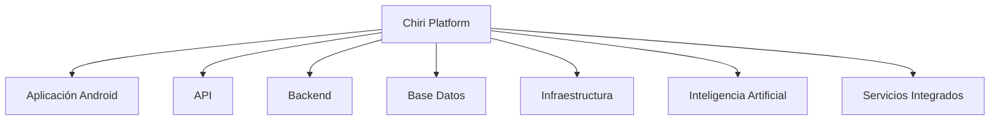

---

# 1.3 Principio de Evolución Controlada

Los cambios futuros deberán considerar:

* Compatibilidad con componentes existentes.
* Evaluación de impacto.
* Validación mediante pruebas.
* Actualización documental.
* Protección de datos.

---

# 1.4 Relación con la Arquitectura Actual

La evolución deberá mantener la arquitectura modular:

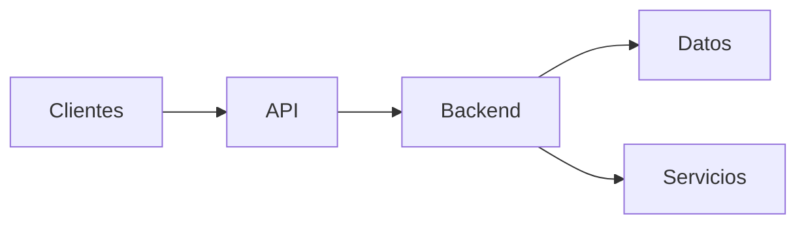

Los nuevos componentes deberán integrarse respetando:

* Separación de responsabilidades.
* Interfaces definidas.
* Bajo acoplamiento.
* Escalabilidad futura.

---

# 1.5 Visión a Largo Plazo

Chiri Platform busca evolucionar como una plataforma personal inteligente capaz de integrar:

* Automatización del hogar.
* Servicios personales.
* Multimedia.
* Inteligencia Artificial.
* Aplicaciones cliente.
* Nuevos servicios digitales.

---

# 1.6 Resultado Esperado

La aplicación de este plan permitirá que Chiri Platform v1.0 pueda evolucionar de forma ordenada, incorporando nuevas capacidades mientras mantiene sus principios de diseño, estabilidad y escalabilidad.

# 2. Visión de Evolución

La visión de evolución define la dirección futura de Chiri Platform v1.0 y establece cómo la plataforma podrá crecer progresivamente incorporando nuevas capacidades, tecnologías y servicios.

La evolución estará orientada a convertir Chiri Platform en un ecosistema personal modular, inteligente y adaptable.

---

# 2.1 Visión General

Chiri Platform evolucionará desde una plataforma inicial basada en servicios integrados hacia un ecosistema capaz de administrar diferentes áreas personales mediante componentes independientes.

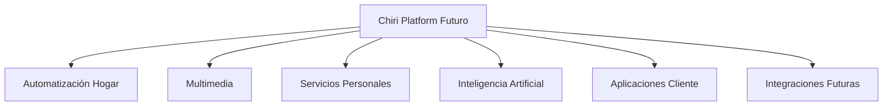

---

# 2.2 Objetivos de Evolución

La evolución de la plataforma buscará:

* Incrementar capacidades funcionales.
* Mejorar experiencia de usuario.
* Automatizar procesos repetitivos.
* Incorporar inteligencia artificial.
* Integrar nuevos dispositivos y servicios.
* Mantener independencia entre módulos.

---

# 2.3 Modelo Evolutivo

La evolución se realizará mediante etapas:


---

# 2.4 Áreas Estratégicas de Evolución

## Plataforma Base

Evolución:

* Mejoras de arquitectura.
* Optimización de servicios.
* Mayor automatización operativa.

---

## Inteligencia Artificial

Evolución:

* Asistentes inteligentes.
* Automatización basada en contexto.
* Análisis de información.
* Interacción natural.

---

## Automatización del Hogar

Evolución:

* Nuevos dispositivos.
* Nuevas reglas automáticas.
* Mayor integración entre servicios.

---

## Multimedia

Evolución:

* Nuevas fuentes de contenido.
* Mejor experiencia de reproducción.
* Integración con nuevos clientes.

---

## Aplicaciones Cliente

Evolución:

* Nuevas plataformas.
* Mejor experiencia móvil.
* Nuevas interfaces.

---

# 2.5 Principios de Crecimiento

El crecimiento de Chiri Platform deberá mantener:

## Modularidad

Cada capacidad nueva deberá integrarse como un componente independiente cuando sea posible.

## Escalabilidad

Los nuevos servicios deberán permitir crecimiento futuro.

## Seguridad

Toda evolución deberá mantener los controles definidos.

## Sostenibilidad

Los cambios deberán ser mantenibles a largo plazo.

---

# 2.6 Ecosistema Futuro

La visión futura puede representarse como:

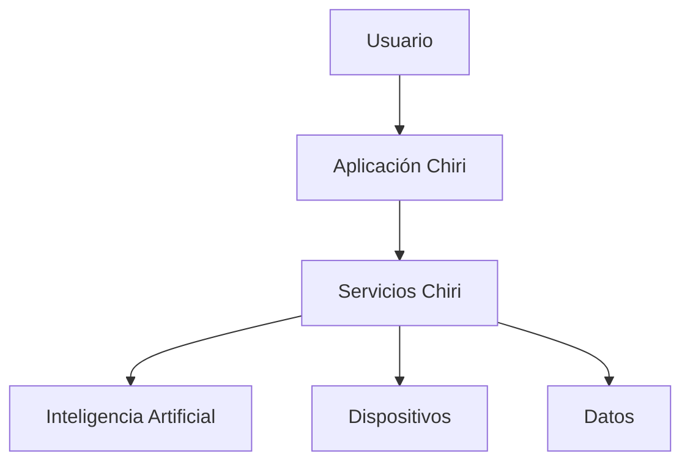

---

# 2.7 Resultado Esperado

La visión de evolución permitirá que Chiri Platform v1.0 se convierta progresivamente en una plataforma personal inteligente, manteniendo una arquitectura organizada y preparada para incorporar nuevas capacidades durante su ciclo de vida.

# 3. Principios de Evolución

Los principios de evolución definen las reglas técnicas y arquitectónicas que deberán guiar el crecimiento futuro de Chiri Platform v1.0.

Estos principios buscan garantizar que la incorporación de nuevas capacidades mantenga la estabilidad, seguridad y sostenibilidad de la plataforma.

---

# 3.1 Evolución Controlada

Toda evolución deberá realizarse mediante un proceso definido:

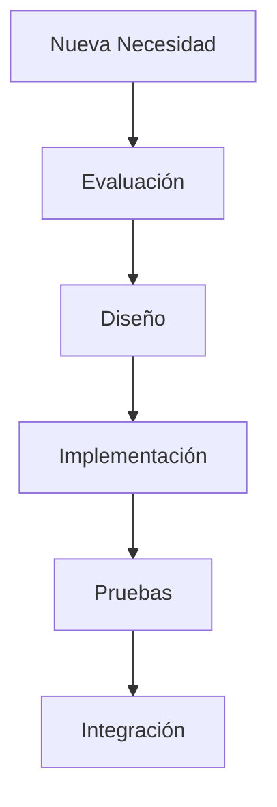

Los cambios deberán considerar:

* Impacto técnico.
* Compatibilidad.
* Recursos necesarios.
* Riesgos asociados.

---

# 3.2 Mantener la Arquitectura Modular

La evolución deberá preservar la separación de componentes:

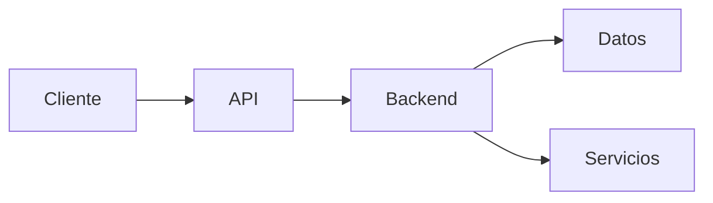

Los nuevos componentes deberán:

* Mantener responsabilidades claras.
* Evitar dependencias innecesarias.
* Facilitar mantenimiento futuro.

---

# 3.3 Compatibilidad Evolutiva

Los cambios deberán considerar:

* Compatibilidad con versiones existentes.
* Migraciones controladas.
* Transiciones progresivas.
* Mantener funcionamiento durante cambios.

---

# 3.4 Seguridad por Diseño

Toda evolución deberá incorporar seguridad desde su diseño.

Consideraciones:

* Autenticación.
* Autorización.
* Protección de datos.
* Auditoría.
* Gestión segura de configuraciones.

---

# 3.5 Automatización como Principio

La plataforma deberá buscar automatizar procesos repetitivos.

Ejemplos:

* Despliegues.
* Mantenimiento.
* Monitoreo.
* Integraciones.
* Tareas operativas.

---

# 3.6 Uso Responsable de Recursos

Las nuevas capacidades deberán considerar:

* Capacidad disponible.
* Consumo energético.
* Rendimiento.
* Complejidad operacional.

---

# 3.7 Documentación Continua

Toda evolución importante deberá actualizar:

* Arquitectura.
* Diseño técnico.
* API.
* Base de datos.
* Guías operativas.

La documentación deberá representar siempre el estado actual de la plataforma.

---

# 3.8 Reutilización de Componentes

Cuando sea posible, las nuevas funcionalidades deberán aprovechar componentes existentes:

* Servicios compartidos.
* APIs existentes.
* Módulos reutilizables.
* Infraestructura disponible.

---

# 3.9 Principio de Simplicidad

Las soluciones futuras deberán evitar complejidad innecesaria.

Se priorizará:

* Soluciones simples.
* Fácil mantenimiento.
* Bajo acoplamiento.
* Evolución gradual.

---

# 3.10 Resultado Esperado

La aplicación de estos principios permitirá que Chiri Platform v1.0 pueda evolucionar de manera ordenada, manteniendo una arquitectura sólida y preparada para incorporar nuevas tecnologías y funcionalidades.

# 4. Evolución Arquitectónica

La evolución arquitectónica define cómo Chiri Platform v1.0 podrá ampliar sus capacidades manteniendo la estructura modular, escalable y sostenible establecida en su arquitectura base.

El objetivo es permitir crecimiento funcional y tecnológico sin comprometer la estabilidad del sistema.

---

# 4.1 Objetivo de la Evolución Arquitectónica

La evolución arquitectónica permitirá:

* Adaptar la plataforma a nuevas necesidades.
* Incorporar nuevos servicios.
* Mejorar escalabilidad.
* Reducir complejidad futura.
* Mantener separación de responsabilidades.

---

# 4.2 Arquitectura Base Evolutiva

La arquitectura actual permitirá crecimiento mediante módulos independientes:

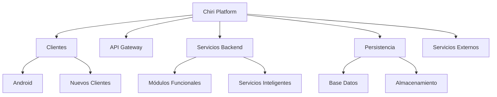

---

# 4.3 Evolución de Componentes

Cada componente podrá evolucionar de forma independiente.

## Clientes

Posibles evoluciones:

* Nuevas aplicaciones móviles.
* Interfaces web.
* Nuevos dispositivos cliente.

---

## API

Posibles evoluciones:

* Nuevos endpoints.
* Versionado de API.
* Nuevas integraciones.

---

## Backend

Posibles evoluciones:

* Nuevos módulos de negocio.
* Servicios especializados.
* Procesamiento inteligente.

---

## Datos

Posibles evoluciones:

* Nuevas entidades.
* Optimización de almacenamiento.
* Nuevos mecanismos de análisis.

---

# 4.4 Arquitectura Orientada a Servicios

La plataforma podrá evolucionar hacia una mayor separación de servicios:

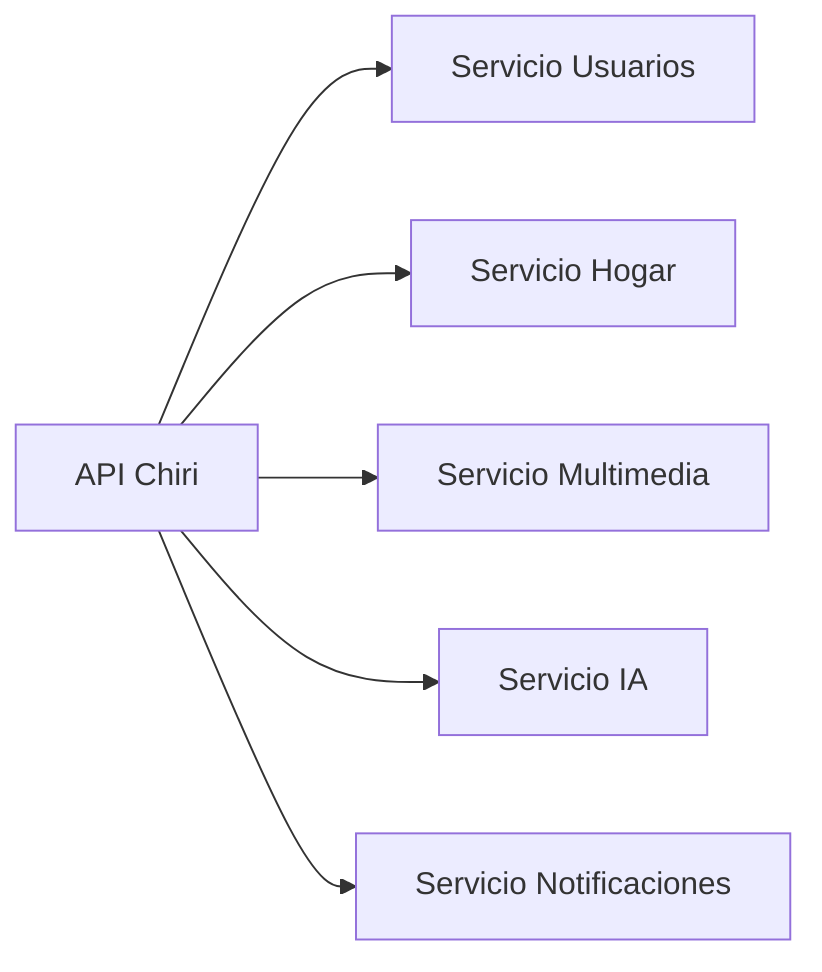

Esta evolución deberá aplicarse únicamente cuando aporte beneficios reales.

---

# 4.5 Evolución hacia Inteligencia Artificial

La incorporación de IA deberá integrarse como un servicio independiente:

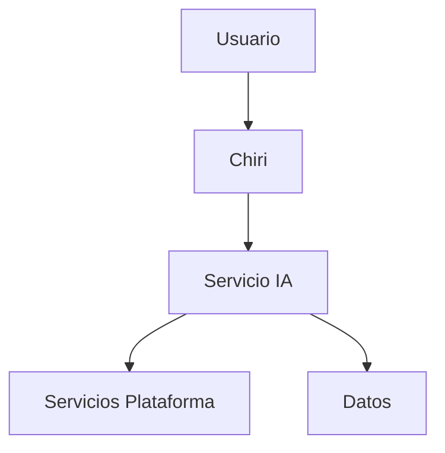

Objetivos:

* Asistencia inteligente.
* Automatización avanzada.
* Análisis contextual.
* Interacción natural.

---

# 4.6 Escalabilidad Arquitectónica

La evolución deberá considerar:

* Separación de cargas.
* Optimización de recursos.
* Distribución de servicios.
* Posible migración futura de componentes.

---

# 4.7 Criterios para Cambios Arquitectónicos

Antes de modificar la arquitectura deberá evaluarse:

* Beneficio esperado.
* Complejidad añadida.
* Impacto operativo.
* Coste de mantenimiento.
* Compatibilidad futura.

---

# 4.8 Resultado Esperado

La evolución arquitectónica permitirá que Chiri Platform v1.0 crezca progresivamente manteniendo sus principios fundamentales: modularidad, seguridad, mantenibilidad y capacidad de adaptación futura.


# 5. Evolución Tecnológica

La evolución tecnológica establece los criterios para incorporar nuevas tecnologías, herramientas y plataformas dentro de Chiri Platform v1.0.

El objetivo es mantener la plataforma actualizada, aprovechando nuevos avances tecnológicos sin comprometer la estabilidad, seguridad y mantenibilidad del sistema.

---

# 5.1 Objetivo de la Evolución Tecnológica

La evolución tecnológica permitirá:

* Mantener componentes actualizados.
* Adoptar nuevas herramientas cuando aporten valor.
* Mejorar rendimiento.
* Incrementar capacidades.
* Reducir dependencia tecnológica obsoleta.

---

# 5.2 Áreas de Evolución Tecnológica

Las principales áreas consideradas son:

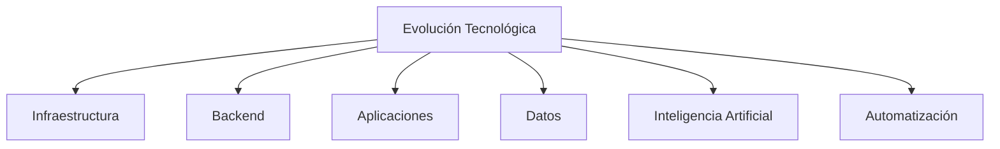

---

# 5.3 Evolución de Infraestructura

La infraestructura podrá evolucionar mediante:

* Mejoras del servidor HomeLab.
* Nuevos recursos de procesamiento.
* Ampliación de almacenamiento.
* Optimización de contenedores.
* Nuevas tecnologías de virtualización.

La evolución deberá considerar:

* Consumo de recursos.
* Costos.
* Complejidad operativa.
* Beneficio obtenido.

---

# 5.4 Evolución del Backend y API

La evolución podrá incluir:

* Nuevos frameworks compatibles.
* Mejoras de rendimiento.
* Nuevas arquitecturas internas.
* Optimización de servicios.

Los cambios deberán mantener:

* Compatibilidad.
* Seguridad.
* Versionamiento.
* Documentación actualizada.

---

# 5.5 Evolución de Aplicaciones Cliente

Las aplicaciones podrán evolucionar mediante:

* Nuevas versiones Android.
* Nuevas plataformas cliente.
* Mejoras de interfaz.
* Nuevas experiencias de usuario.

Proceso:

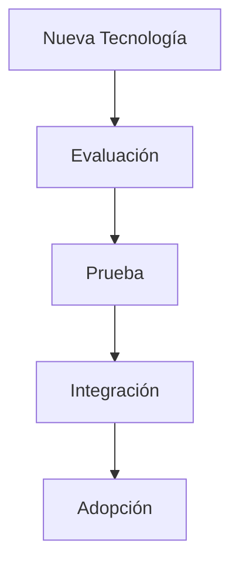

---

# 5.6 Evolución de Base de Datos

La evolución de datos podrá considerar:

* Nuevos motores cuando sea necesario.
* Optimización de consultas.
* Nuevas estrategias de almacenamiento.
* Mayor capacidad analítica.

Los cambios deberán garantizar:

* Integridad.
* Migraciones controladas.
* Compatibilidad.

---

# 5.7 Evolución de Inteligencia Artificial

La incorporación de IA podrá incluir:

* Modelos inteligentes.
* Asistentes personales.
* Automatización avanzada.
* Análisis predictivo.

La IA deberá integrarse respetando:

* Privacidad.
* Seguridad.
* Control de datos.
* Arquitectura modular.

---

# 5.8 Criterios para Adoptar Tecnología

Antes de incorporar una tecnología nueva se deberá evaluar:

| Criterio       | Objetivo                        |
| -------------- | ------------------------------- |
| Madurez        | Validar estabilidad tecnológica |
| Compatibilidad | Integración con Chiri           |
| Seguridad      | Reducir riesgos                 |
| Mantenimiento  | Garantizar sostenibilidad       |
| Beneficio      | Justificar incorporación        |

---

# 5.9 Evitar Obsolescencia

La plataforma deberá realizar revisiones periódicas para identificar:

* Componentes sin soporte.
* Dependencias antiguas.
* Tecnologías reemplazables.
* Riesgos futuros.

---

# 5.10 Resultado Esperado

La evolución tecnológica permitirá que Chiri Platform v1.0 incorpore mejoras tecnológicas de forma responsable, manteniendo una plataforma moderna, segura y preparada para nuevas generaciones de servicios.

# 6. Nuevas Capacidades

La incorporación de nuevas capacidades define la forma en que Chiri Platform v1.0 podrá ampliar sus funcionalidades mediante nuevos módulos, servicios e integraciones.

El objetivo es permitir que la plataforma evolucione desde una base estable hacia un ecosistema personal más completo, inteligente y adaptable.

---

# 6.1 Objetivo de Nuevas Capacidades

La incorporación de nuevas capacidades permitirá:

* Ampliar funcionalidades existentes.
* Crear nuevos servicios.
* Mejorar automatización.
* Integrar nuevos dispositivos.
* Incrementar inteligencia del sistema.

---

# 6.2 Áreas Potenciales de Expansión

Las capacidades futuras podrán organizarse en:

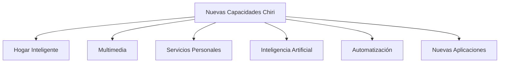

---

# 6.3 Capacidades de Automatización del Hogar

Posibles evoluciones:

* Gestión avanzada de dispositivos.
* Automatizaciones basadas en contexto.
* Escenarios inteligentes.
* Integración de nuevos protocolos.
* Control centralizado.

Ejemplo:


---

# 6.4 Capacidades Multimedia

Posibles evoluciones:

* Gestión avanzada de bibliotecas.
* Nuevos reproductores.
* Control multi-dispositivo.
* Recomendaciones personalizadas.
* Integración con nuevos servicios.

---

# 6.5 Capacidades de Inteligencia Artificial

La plataforma podrá incorporar capacidades como:

* Asistente personal.
* Comprensión de lenguaje natural.
* Automatización inteligente.
* Análisis de información.
* Recomendaciones personalizadas.

Arquitectura conceptual:

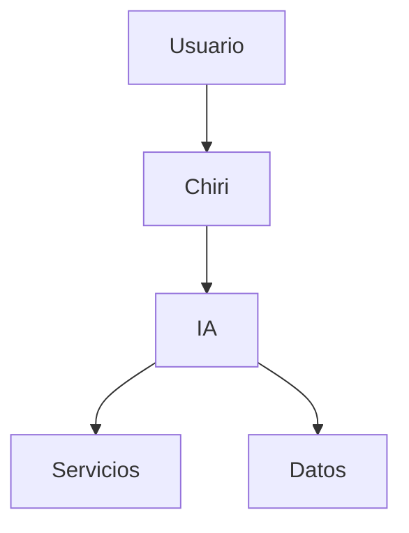

---

# 6.6 Capacidades de Servicios Personales

Posibles módulos futuros:

* Gestión personal.
* Recordatorios.
* Organización de información.
* Seguimiento de actividades.
* Servicios personalizados.

---

# 6.7 Nuevas Aplicaciones Cliente

La plataforma podrá extenderse mediante:

* Aplicaciones móviles adicionales.
* Interfaces web.
* Clientes especializados.
* Integraciones con dispositivos.

---

# 6.8 Criterios para Incorporar Nuevas Capacidades

Toda nueva capacidad deberá evaluar:

| Criterio      | Evaluación          |
| ------------- | ------------------- |
| Utilidad      | Valor aportado      |
| Complejidad   | Esfuerzo requerido  |
| Recursos      | Capacidad necesaria |
| Seguridad     | Riesgos asociados   |
| Mantenimiento | Costo futuro        |

---

# 6.9 Integración con Arquitectura Existente

Las nuevas capacidades deberán incorporarse respetando:

* APIs definidas.
* Módulos independientes.
* Modelo de seguridad.
* Modelo de datos.
* Procesos de operación.

---

# 6.10 Resultado Esperado

La incorporación de nuevas capacidades permitirá que Chiri Platform v1.0 evolucione progresivamente hacia una plataforma personal inteligente, manteniendo una arquitectura organizada y preparada para crecimiento futuro.

# 7. Escalabilidad Futura

La escalabilidad futura define la capacidad de Chiri Platform v1.0 para crecer en funcionalidades, usuarios, dispositivos y servicios manteniendo niveles adecuados de rendimiento, estabilidad y mantenimiento.

El objetivo es preparar la plataforma para una evolución progresiva sin requerir rediseños completos.

---

# 7.1 Objetivo de Escalabilidad

La estrategia de escalabilidad permitirá:

* Incrementar capacidades del sistema.
* Incorporar nuevos servicios.
* Gestionar mayor cantidad de información.
* Soportar nuevos dispositivos.
* Mantener rendimiento operativo.

---

# 7.2 Tipos de Escalabilidad

Chiri Platform considerará diferentes tipos de crecimiento:

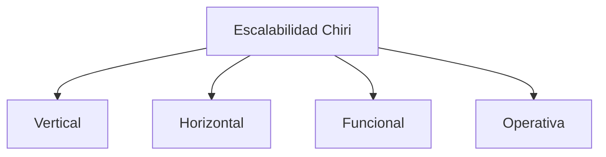

---

# 7.3 Escalabilidad Vertical

Consiste en aumentar capacidades del entorno existente.

Incluye:

* Mayor memoria.
* Mayor almacenamiento.
* Mayor capacidad de procesamiento.
* Mejor infraestructura física.

Ejemplo:


---

# 7.4 Escalabilidad Horizontal

Consiste en distribuir componentes cuando sea necesario.

Puede incluir:

* Separación de servicios.
* Nuevos nodos.
* Distribución de cargas.
* Servicios independientes.

Arquitectura futura:

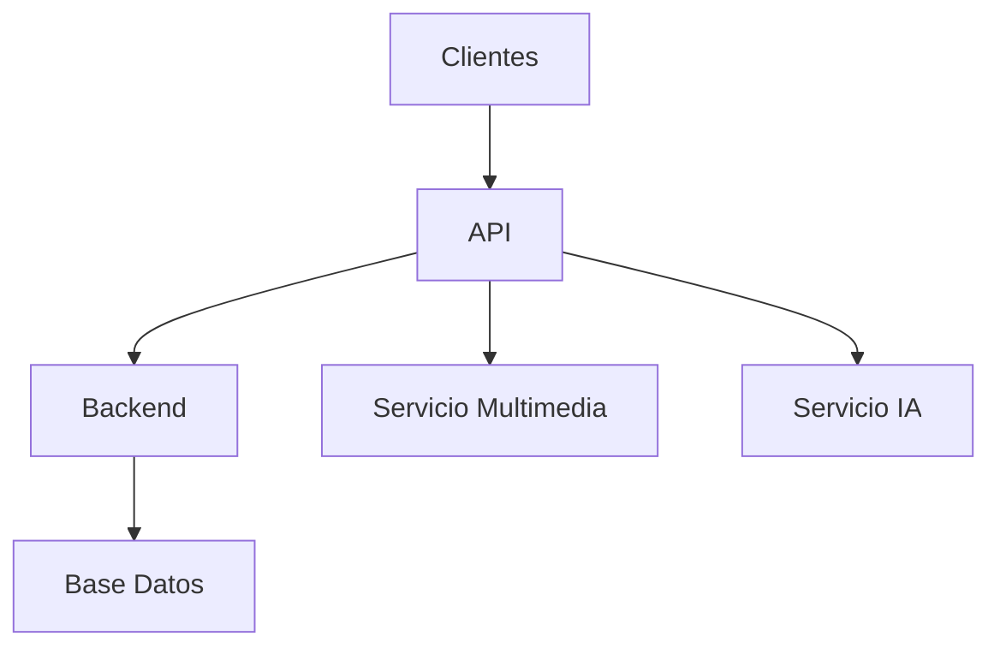

---

# 7.5 Escalabilidad Funcional

Permite ampliar capacidades mediante nuevos módulos.

Ejemplos:

* Nuevas áreas personales.
* Nuevas automatizaciones.
* Nuevas integraciones.
* Nuevos servicios inteligentes.

---

# 7.6 Escalabilidad de Datos

La evolución de datos deberá considerar:

* Crecimiento del volumen de información.
* Optimización de consultas.
* Nuevas estructuras.
* Históricos.
* Procesamiento analítico.

---

# 7.7 Escalabilidad Operativa

La operación deberá evolucionar mediante:

* Mayor automatización.
* Mejor monitoreo.
* Procesos documentados.
* Gestión eficiente de cambios.

---

# 7.8 Criterios para Escalar

Antes de ampliar la plataforma se deberá evaluar:

| Criterio    | Objetivo                 |
| ----------- | ------------------------ |
| Necesidad   | Justificar crecimiento   |
| Rendimiento | Identificar limitaciones |
| Coste       | Evaluar recursos         |
| Complejidad | Mantener simplicidad     |
| Beneficio   | Obtener mejora real      |

---

# 7.9 Evolución del HomeLab

El entorno inicial basado en HomeLab podrá evolucionar mediante:

* Actualización de hardware.
* Ampliación de almacenamiento.
* Nuevos nodos.
* Nuevas capas de virtualización.

La evolución deberá mantener el objetivo original:

Una plataforma personal modular, eficiente y controlable.

---

# 7.10 Resultado Esperado

La estrategia de escalabilidad permitirá que Chiri Platform v1.0 pueda crecer progresivamente, incorporando nuevas capacidades y servicios sin perder estabilidad, seguridad ni facilidad de mantenimiento.

# 8. Gestión de Innovación

La gestión de innovación establece el proceso mediante el cual Chiri Platform v1.0 evaluará, incorporará y aprovechará nuevas tecnologías, ideas y oportunidades de mejora.

Su objetivo es permitir la evolución constante de la plataforma manteniendo un equilibrio entre innovación, estabilidad y sostenibilidad.

---

# 8.1 Objetivo de la Innovación

La gestión de innovación permitirá:

* Identificar nuevas oportunidades tecnológicas.
* Evaluar nuevas herramientas.
* Incorporar mejoras de valor.
* Mantener la plataforma actualizada.
* Fomentar la experimentación controlada.

---

# 8.2 Ciclo de Innovación

La incorporación de nuevas ideas seguirá un proceso definido:

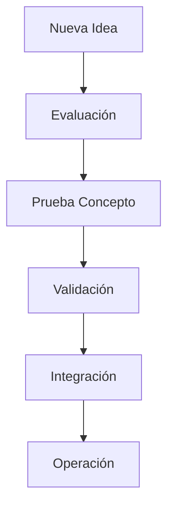

---

# 8.3 Identificación de Oportunidades

Las oportunidades podrán surgir de:

* Nuevas tecnologías.
* Nuevas necesidades personales.
* Mejoras detectadas durante operación.
* Cambios del ecosistema tecnológico.
* Nuevas posibilidades de automatización.

---

# 8.4 Evaluación Tecnológica

Antes de incorporar una tecnología nueva se deberá analizar:

| Criterio       | Objetivo                 |
| -------------- | ------------------------ |
| Valor aportado | Beneficio esperado       |
| Madurez        | Nivel de estabilidad     |
| Integración    | Compatibilidad con Chiri |
| Seguridad      | Riesgos asociados        |
| Mantenimiento  | Complejidad futura       |

---

# 8.5 Experimentación Controlada

Las nuevas tecnologías deberán evaluarse inicialmente mediante:

* Pruebas aisladas.
* Ambientes de validación.
* Prototipos.
* Pruebas de rendimiento.

Proceso:


---

# 8.6 Integración de Innovaciones

Una innovación aprobada deberá:

* Adaptarse a la arquitectura existente.
* Cumplir requisitos de seguridad.
* Tener documentación.
* Contar con pruebas.
* Mantener capacidad de mantenimiento.

---

# 8.7 Innovación en Inteligencia Artificial

La inteligencia artificial representa un área estratégica de evolución.

Posibles aplicaciones:

* Asistentes personales.
* Automatización inteligente.
* Análisis contextual.
* Predicción de necesidades.
* Interacción avanzada.

La incorporación de IA deberá mantener:

* Control de datos.
* Privacidad.
* Transparencia.
* Seguridad.

---

# 8.8 Control de Innovación

No toda tecnología nueva deberá incorporarse.

La decisión deberá considerar:

* Beneficio real.
* Complejidad agregada.
* Impacto operativo.
* Alineación con objetivos de Chiri.

---

# 8.9 Resultado Esperado

La gestión de innovación permitirá que Chiri Platform v1.0 evolucione aprovechando nuevas oportunidades tecnológicas de forma responsable, manteniendo equilibrio entre innovación, estabilidad y sostenibilidad.

# 9. Evaluación de Evolución

La evaluación de evolución establece los criterios utilizados para analizar las mejoras, cambios tecnológicos y nuevas capacidades antes de incorporarlas a Chiri Platform v1.0.

Su objetivo es garantizar que cada evolución aporte valor real y mantenga la coherencia con los principios arquitectónicos definidos.

---

# 9.1 Objetivo de la Evaluación

La evaluación permitirá:

* Determinar viabilidad de nuevas propuestas.
* Analizar impacto técnico.
* Identificar riesgos.
* Priorizar mejoras.
* Validar alineación estratégica.

---

# 9.2 Proceso de Evaluación

Toda evolución deberá seguir un proceso definido:

```mermaid id="8m5q3p"
flowchart TD

A[Propuesta Evolución]
B[Análisis Técnico]
C[Evaluación Impacto]
D[Decisión]
E[Implementación]

A --> B
B --> C
C --> D
D --> E
```

---

# 9.3 Criterios de Evaluación

Las evoluciones deberán analizarse considerando:

| Criterio        | Descripción                |
| --------------- | -------------------------- |
| Valor funcional | Beneficio para el usuario  |
| Impacto técnico | Cambios requeridos         |
| Complejidad     | Esfuerzo de implementación |
| Seguridad       | Riesgos asociados          |
| Recursos        | Capacidad necesaria        |
| Mantenimiento   | Esfuerzo futuro            |

---

# 9.4 Evaluación Arquitectónica

Antes de incorporar un cambio importante se deberá revisar:

* Compatibilidad con arquitectura actual.
* Separación de responsabilidades.
* Impacto en módulos existentes.
* Necesidad de nuevos componentes.

---

# 9.5 Evaluación de Rendimiento

Los cambios deberán considerar:

* Uso de CPU.
* Uso de memoria.
* Consumo de almacenamiento.
* Tiempo de respuesta.
* Capacidad futura.

---

# 9.6 Evaluación de Seguridad

Toda evolución deberá revisar:

* Nuevos accesos.
* Nuevos permisos.
* Protección de información.
* Riesgos introducidos.
* Cumplimiento de controles existentes.

---

# 9.7 Matriz de Decisión

Las propuestas podrán clasificarse:

| Resultado            | Acción                    |
| -------------------- | ------------------------- |
| Aprobada             | Planificar implementación |
| Evaluación adicional | Requiere más análisis     |
| Postergada           | Mantener como futura      |
| Rechazada            | No incorporar             |

---

# 9.8 Validación Posterior

Después de incorporar una evolución deberá verificarse:

* Funcionamiento esperado.
* Impacto real.
* Estabilidad.
* Cumplimiento de objetivos.

Proceso:

```mermaid id="5x7n2m"
flowchart LR

A[Cambio Implementado]
B[Pruebas]
C[Monitoreo]
D[Evaluación Final]

A --> B
B --> C
C --> D
```

---

# 9.9 Resultado Esperado

La evaluación de evolución permitirá que Chiri Platform v1.0 crezca mediante decisiones fundamentadas, evitando cambios innecesarios y asegurando que cada incorporación mejore la plataforma de forma sostenible.

# 10. Cierre y Mejora Continua

El cierre del Plan de Evolución establece los criterios finales para garantizar que Chiri Platform v1.0 pueda crecer de manera ordenada, sostenible y alineada con su arquitectura base.

Este documento define la dirección futura de la plataforma y establece las bases para incorporar nuevas capacidades durante todo su ciclo de vida.

---

# 10.1 Cierre del Proceso Evolutivo

El proceso de evolución se considerará establecido cuando:

* Existan criterios definidos para incorporar cambios.
* Las nuevas capacidades sean evaluadas previamente.
* La arquitectura mantenga su estabilidad.
* Los cambios importantes estén documentados.
* Las mejoras sean validadas antes de operación.

---

# 10.2 Ciclo de Mejora Continua

La evolución de Chiri Platform seguirá un ciclo permanente:

```mermaid id="8k3m6q"
flowchart TD

A[Operación]
B[Análisis]
C[Innovación]
D[Implementación]
E[Validación]
F[Evolución]

A --> B
B --> C
C --> D
D --> E
E --> F
F --> A
```

---

# 10.3 Evolución Basada en Valor

Las futuras mejoras deberán priorizar:

* Beneficio real.
* Mejora de experiencia.
* Optimización de recursos.
* Seguridad.
* Sostenibilidad.

La evolución no deberá enfocarse únicamente en incorporar tecnología nueva, sino en aportar valor a la plataforma.

---

# 10.4 Actualización del Documento

Este documento deberá actualizarse cuando:

* Se incorporen nuevos módulos.
* Cambie la arquitectura.
* Aparezcan nuevas estrategias tecnológicas.
* Se definan nuevas capacidades.

Toda actualización deberá mantener coherencia con la documentación oficial de Chiri Platform.

---

# 10.5 Relación con Otros Documentos

La evolución deberá mantenerse alineada con:

* `020_Arquitectura.md`
* `030_Backend.md`
* `040_Android.md`
* `050_BaseDatos.md`
* `060_API.md`
* `070_Seguridad.md`
* `080_Despliegue.md`
* `090_GuiaProgramacion.md`
* `100_DecisionesArquitectura.md`
* `300_Pruebas_Sistema.md`
* `310_Calidad_Codigo.md`
* `320_Monitoreo_Operacion.md`
* `330_Mantenimiento.md`

---

# 10.6 Estado Final del Documento

```mermaid id="6p4m8x"
flowchart TD

A[Arquitectura Base]
B[Nuevas Capacidades]
C[Evaluación Continua]
D[Innovación Controlada]
E[Chiri Platform Evolucionada]

A --> B
B --> C
C --> D
D --> E
```

---

# 10.7 Cierre Documental

Con la finalización de este documento queda establecido el Plan de Evolución de Chiri Platform v1.0.

Su aplicación permitirá mantener una plataforma:

* Modular.
* Escalable.
* Adaptable.
* Segura.
* Preparada para nuevas tecnologías.

Chiri Platform v1.0 queda definida como una plataforma con capacidad de evolución continua, manteniendo sus principios arquitectónicos y preparada para incorporar futuras generaciones de servicios.


