# 350_Roadmap_Chiri.md

# Roadmap Chiri Platform v1.0

---

# 1. Objetivo

El presente documento establece el Roadmap de evolución de Chiri Platform v1.0.

Su objetivo es definir la planificación estratégica de crecimiento de la plataforma, estableciendo fases, prioridades y objetivos que permitan guiar su evolución de forma ordenada y sostenible.

El Roadmap representa una guía de dirección futura, permitiendo organizar mejoras, nuevas funcionalidades y evoluciones técnicas según las necesidades de la plataforma.

---

# 1.1 Objetivos Específicos

El Roadmap tiene como objetivos:

* Definir una dirección de evolución.
* Organizar prioridades futuras.
* Planificar incorporación de capacidades.
* Coordinar mejoras técnicas.
* Mantener alineación con la arquitectura.
* Facilitar toma de decisiones.

---

# 1.2 Alcance del Roadmap

El Roadmap contempla la evolución de los componentes principales:

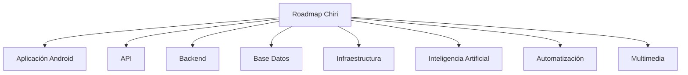

---

# 1.3 Enfoque del Roadmap

El desarrollo futuro estará orientado a:

* Crecimiento progresivo.
* Integración controlada de tecnologías.
* Priorización por valor.
* Mantener estabilidad operativa.
* Evolución modular.

---

# 1.4 Relación con la Arquitectura

El Roadmap deberá respetar los principios definidos en la arquitectura de Chiri Platform:


Toda evolución deberá mantener:

* Modularidad.
* Seguridad.
* Escalabilidad.
* Mantenibilidad.

---

# 1.5 Naturaleza del Roadmap

El Roadmap no representa un calendario rígido, sino una planificación adaptable.

Las prioridades podrán modificarse considerando:

* Nuevas necesidades.
* Cambios tecnológicos.
* Disponibilidad de recursos.
* Beneficio esperado.

---

# 1.6 Resultado Esperado

La definición del Roadmap permitirá que Chiri Platform v1.0 tenga una visión clara de crecimiento, facilitando la incorporación de nuevas capacidades y manteniendo una evolución organizada durante su ciclo de vida.

# 2. Estado Actual

El estado actual de Chiri Platform v1.0 representa la base tecnológica y arquitectónica sobre la cual se desarrollarán las futuras evoluciones de la plataforma.

La versión inicial establece una arquitectura modular, documentada y preparada para incorporar nuevas capacidades de forma progresiva.

---

# 2.1 Estado General de la Plataforma

Chiri Platform v1.0 cuenta con:

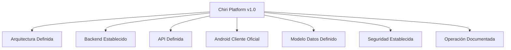

---

# 2.2 Componentes Implementados

La plataforma actualmente contempla:

## Aplicación Android

Estado:

* Cliente oficial definido.
* Comunicación mediante API.
* Arquitectura documentada.

---

## API Chiri

Estado:

* Contratos definidos.
* Comunicación entre componentes establecida.
* Seguridad considerada.

---

## Backend Chiri

Estado:

* Capas definidas.
* Lógica de negocio separada.
* Preparado para crecimiento modular.

---

## Base de Datos

Estado:

* Modelo dominio definido.
* Relaciones establecidas.
* Integridad considerada.

---

## Infraestructura

Estado:

* Entorno HomeLab definido.
* Servicios preparados mediante contenedores.
* Base para despliegue futuro.

---

# 2.3 Documentación Disponible

La plataforma cuenta con documentación completa:

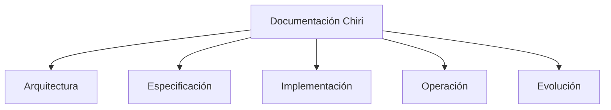

Documentos completados:

* Arquitectura.
* Backend.
* Android.
* Base de Datos.
* API.
* Seguridad.
* Despliegue.
* Implementación.
* Pruebas.
* Calidad.
* Monitoreo.
* Mantenimiento.
* Evolución.

---

# 2.4 Capacidades Actuales

La plataforma dispone de una base preparada para:

* Automatización del hogar.
* Gestión de servicios personales.
* Integración multimedia.
* Incorporación de inteligencia artificial.
* Desarrollo de nuevos módulos.

---

# 2.5 Limitaciones Actuales

Como versión inicial, Chiri Platform puede requerir futuras mejoras en:

* Ampliación de funcionalidades.
* Mayor automatización.
* Nuevas integraciones.
* Optimización de recursos.
* Nuevos clientes de acceso.

Estas limitaciones forman parte del proceso natural de evolución.

---

# 2.6 Posición Actual dentro del Roadmap

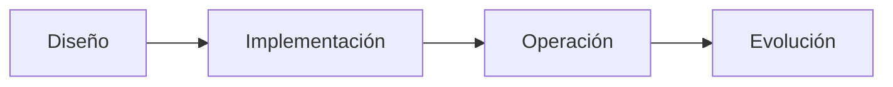

Chiri Platform v1.0 se encuentra en la etapa de plataforma base operativa y preparada para futuras fases de crecimiento.

---

# 2.7 Resultado Esperado

El conocimiento del estado actual permite establecer una referencia clara para definir las siguientes etapas del Roadmap y orientar correctamente las inversiones técnicas y funcionales futuras.

# 3. Visión Futura

La visión futura define el objetivo hacia el cual evolucionará Chiri Platform v1.0, estableciendo una dirección estratégica para transformar la plataforma en un ecosistema personal inteligente, modular y adaptable.

Esta visión busca mantener una evolución progresiva basada en arquitectura sólida, integración tecnológica y mejora continua.

---

# 3.1 Visión General

Chiri Platform evolucionará hacia una plataforma capaz de integrar diferentes servicios personales mediante un ecosistema unificado.

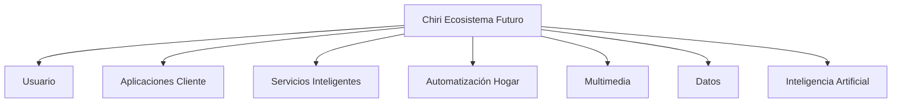

---

# 3.2 Objetivo Estratégico Futuro

La evolución buscará convertir Chiri Platform en:

* Un centro personal de servicios digitales.
* Un sistema inteligente de automatización.
* Una plataforma de integración tecnológica.
* Un entorno adaptable a nuevas necesidades.

---

# 3.3 Evolución por Capas

La visión futura mantendrá la separación arquitectónica:

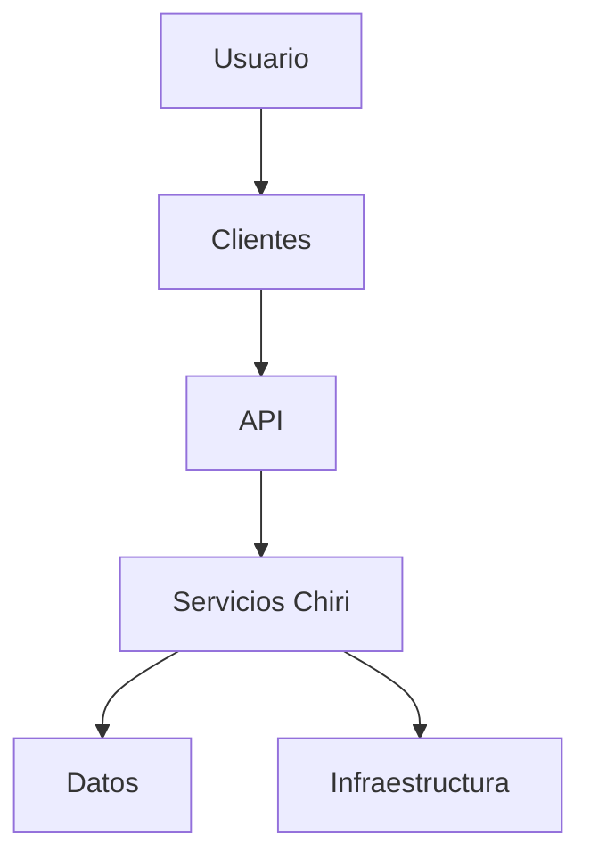

Cada capa podrá evolucionar independientemente.

---

# 3.4 Áreas Estratégicas Futuras

## Inteligencia Artificial

Objetivos:

* Crear interacción más natural.
* Automatizar decisiones.
* Mejorar asistencia personal.
* Analizar información contextual.

---

## Automatización del Hogar

Objetivos:

* Integración de nuevos dispositivos.
* Automatizaciones inteligentes.
* Escenarios personalizados.
* Control centralizado.

---

## Multimedia

Objetivos:

* Experiencia integrada.
* Gestión avanzada de contenido.
* Nuevas fuentes multimedia.
* Control desde diferentes dispositivos.

---

## Servicios Personales

Objetivos:

* Organización personal.
* Gestión de información.
* Automatización de tareas.
* Nuevos módulos personales.

---

# 3.5 Modelo Futuro de Integración

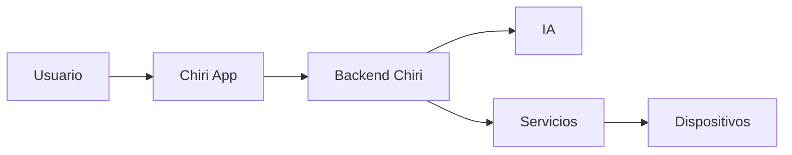

---

# 3.6 Características Esperadas

La plataforma futura deberá ser:

* Modular.
* Inteligente.
* Segura.
* Escalable.
* Fácil de mantener.
* Preparada para nuevas tecnologías.

---

# 3.7 Resultado Esperado

La visión futura permitirá que Chiri Platform evolucione desde una plataforma personal inicial hacia un ecosistema tecnológico completo, manteniendo sus principios fundamentales de arquitectura, seguridad y crecimiento controlado.

# 4. Fases de Evolución

Las fases de evolución definen las etapas progresivas mediante las cuales Chiri Platform v1.0 podrá crecer incorporando mejoras funcionales, técnicas y estratégicas.

El objetivo es organizar el desarrollo futuro mediante una planificación ordenada, evitando cambios descontrolados y manteniendo la estabilidad de la plataforma.

---

# 4.1 Modelo de Evolución

La evolución de Chiri Platform se organizará en fases:

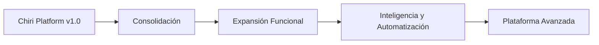

---

# 4.2 Fase 1 - Consolidación de Plataforma

Objetivo:

Fortalecer la base existente y garantizar estabilidad operativa.

Actividades:

* Validación completa de componentes.
* Optimización de servicios.
* Mejora de monitoreo.
* Revisión de seguridad.
* Automatización operativa.

Resultado esperado:

Una plataforma estable y preparada para crecimiento.

---

# 4.3 Fase 2 - Expansión Funcional

Objetivo:

Incorporar nuevos módulos y capacidades.

Actividades:

* Nuevas funcionalidades.
* Nuevos servicios personales.
* Nuevas integraciones.
* Mejoras en experiencia de usuario.

Resultado esperado:

Mayor capacidad funcional manteniendo arquitectura modular.

---

# 4.4 Fase 3 - Inteligencia y Automatización

Objetivo:

Incrementar la capacidad inteligente de la plataforma.

Actividades:

* Integración de inteligencia artificial.
* Automatizaciones avanzadas.
* Procesamiento contextual.
* Asistencia personalizada.

Modelo conceptual:

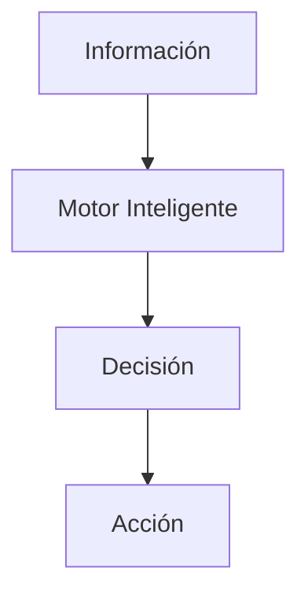

Resultado esperado:

Una plataforma capaz de asistir y automatizar procesos.

---

# 4.5 Fase 4 - Plataforma Avanzada

Objetivo:

Evolucionar hacia un ecosistema personal completo.

Actividades:

* Nuevas plataformas cliente.
* Mayor integración entre servicios.
* Escalabilidad avanzada.
* Nuevas tecnologías.

Resultado esperado:

Una plataforma adaptable a futuras generaciones tecnológicas.

---

# 4.6 Priorización de Fases

Las fases deberán avanzar considerando:

| Criterio    | Descripción                 |
| ----------- | --------------------------- |
| Estabilidad | Mantener operación correcta |
| Valor       | Beneficio aportado          |
| Recursos    | Capacidad disponible        |
| Complejidad | Esfuerzo requerido          |
| Riesgo      | Impacto potencial           |

---

# 4.7 Relación entre Fases

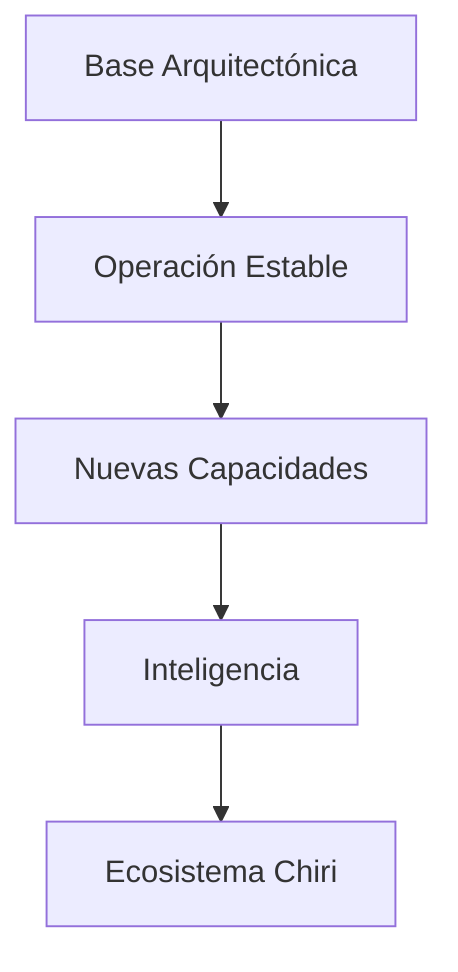

---

# 4.8 Resultado Esperado

Las fases de evolución proporcionan una guía clara para el crecimiento de Chiri Platform v1.0, permitiendo avanzar progresivamente desde una base estable hacia una plataforma personal inteligente y extensible.

# 5. Prioridades Estratégicas

Las prioridades estratégicas establecen los criterios que orientarán la evolución de Chiri Platform v1.0, permitiendo decidir qué mejoras y funcionalidades deberán desarrollarse primero.

El objetivo es asegurar que el crecimiento de la plataforma se realice enfocado en valor, estabilidad y sostenibilidad.

---

# 5.1 Objetivo de las Prioridades Estratégicas

Las prioridades permitirán:

* Ordenar iniciativas futuras.
* Optimizar recursos disponibles.
* Enfocar esfuerzos en mejoras importantes.
* Reducir riesgos.
* Mantener alineación con la visión de Chiri Platform.

---

# 5.2 Modelo de Priorización

Las iniciativas serán evaluadas mediante:

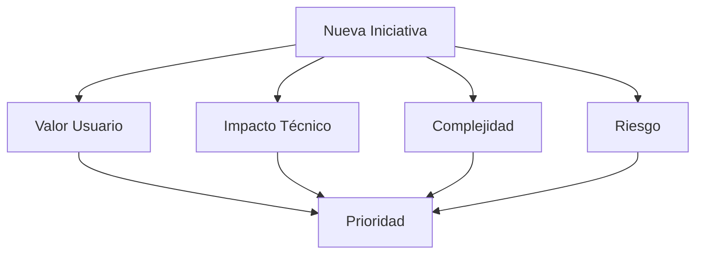

---

# 5.3 Prioridad 1 - Estabilidad de Plataforma

Objetivo:

Garantizar una base sólida antes de incorporar nuevas capacidades.

Incluye:

* Corrección de problemas.
* Optimización de servicios.
* Mejoras de seguridad.
* Mantenimiento preventivo.
* Mejor monitoreo.

---

# 5.4 Prioridad 2 - Experiencia de Usuario

Objetivo:

Mejorar la interacción con la plataforma.

Incluye:

* Mejoras en aplicación Android.
* Nuevas interfaces.
* Mayor facilidad de uso.
* Personalización.

---

# 5.5 Prioridad 3 - Automatización Inteligente

Objetivo:

Incrementar el nivel de automatización.

Incluye:

* Nuevas reglas automáticas.
* Integración con dispositivos.
* Procesamiento basado en contexto.
* Acciones inteligentes.

---

# 5.6 Prioridad 4 - Inteligencia Artificial

Objetivo:

Incorporar capacidades inteligentes de manera controlada.

Incluye:

* Asistencia personalizada.
* Procesamiento de lenguaje natural.
* Recomendaciones.
* Automatización avanzada.

---

# 5.7 Prioridad 5 - Nuevas Integraciones

Objetivo:

Ampliar el ecosistema de servicios.

Incluye:

* Nuevos dispositivos.
* Nuevas plataformas.
* Servicios externos.
* Nuevas fuentes de información.

---

# 5.8 Matriz Estratégica

| Prioridad | Área           | Objetivo                    |
| --------- | -------------- | --------------------------- |
| Alta      | Estabilidad    | Garantizar funcionamiento   |
| Alta      | Seguridad      | Proteger plataforma         |
| Media     | Funcionalidad  | Incorporar mejoras          |
| Media     | Automatización | Incrementar capacidades     |
| Futura    | Innovación     | Explorar nuevas tecnologías |

---

# 5.9 Principio de Decisión

Toda iniciativa futura deberá responder:

* ¿Aporta valor real?
* ¿Mantiene la arquitectura?
* ¿Es sostenible?
* ¿Mejora la plataforma?
* ¿Justifica su complejidad?

---

# 5.10 Resultado Esperado

Las prioridades estratégicas permitirán que Chiri Platform v1.0 evolucione de forma ordenada, enfocando los recursos en mejoras que aporten mayor beneficio y mantengan la calidad de la plataforma.

# 6. Nuevas Funcionalidades

Las nuevas funcionalidades representan las capacidades futuras que podrán incorporarse a Chiri Platform v1.0 para ampliar su utilidad, mejorar la experiencia del usuario y fortalecer su integración como plataforma personal inteligente.

El objetivo es establecer una visión de crecimiento funcional manteniendo los principios de modularidad, seguridad y escalabilidad.

---

# 6.1 Objetivo de Nuevas Funcionalidades

La incorporación de nuevas funcionalidades permitirá:

* Ampliar las capacidades actuales.
* Crear nuevos servicios personales.
* Mejorar automatización.
* Incrementar integración entre componentes.
* Adaptar la plataforma a nuevas necesidades.

---

# 6.2 Clasificación de Funcionalidades Futuras

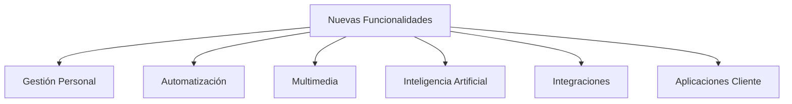

---

# 6.3 Gestión Personal

Posibles funcionalidades:

* Organización personal.
* Recordatorios.
* Gestión de información.
* Seguimiento de actividades.
* Servicios personalizados.

Objetivo:

Convertir Chiri Platform en un asistente personal centralizado.

---

# 6.4 Automatización del Hogar

Posibles funcionalidades:

* Nuevos dispositivos inteligentes.
* Escenarios personalizados.
* Automatizaciones por horarios.
* Automatizaciones basadas en eventos.
* Reglas inteligentes.

Modelo conceptual:


---

# 6.5 Evolución Multimedia

Posibles funcionalidades:

* Gestión centralizada de contenido.
* Mejor integración con reproductores.
* Control multi-dispositivo.
* Recomendaciones personalizadas.
* Automatización de reproducción.

---

# 6.6 Inteligencia Artificial

Posibles funcionalidades:

* Asistente conversacional.
* Comandos naturales.
* Análisis de información.
* Automatización inteligente.
* Recomendaciones basadas en contexto.

Arquitectura conceptual:

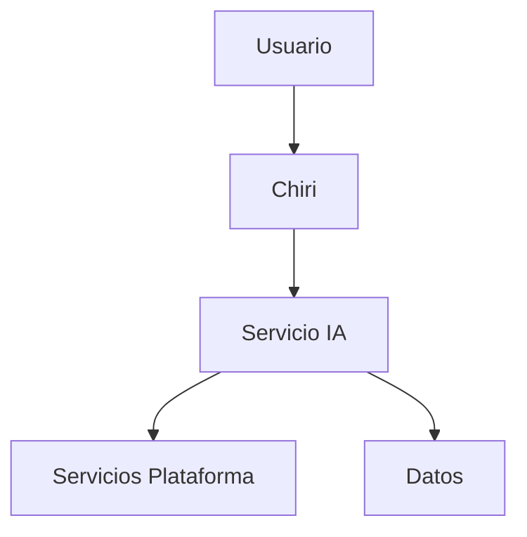

---

# 6.7 Nuevas Aplicaciones Cliente

Posibles extensiones:

* Nuevas aplicaciones móviles.
* Interfaces web.
* Clientes especializados.
* Integraciones con nuevos dispositivos.

---

# 6.8 Integraciones Futuras

La plataforma podrá integrar:

* Nuevos sistemas domóticos.
* Nuevos servicios digitales.
* Nuevas fuentes de información.
* Nuevos protocolos de comunicación.

---

# 6.9 Criterios para Incorporación

Toda nueva funcionalidad deberá evaluar:

| Criterio      | Evaluación         |
| ------------- | ------------------ |
| Utilidad      | Beneficio aportado |
| Complejidad   | Esfuerzo requerido |
| Seguridad     | Riesgos asociados  |
| Integración   | Compatibilidad     |
| Mantenimiento | Sostenibilidad     |

---

# 6.10 Resultado Esperado

La incorporación de nuevas funcionalidades permitirá que Chiri Platform v1.0 evolucione progresivamente hacia un ecosistema personal completo, manteniendo una arquitectura organizada y preparada para futuras necesidades.

# 7. Mejoras Técnicas

Las mejoras técnicas establecen las acciones futuras orientadas a fortalecer la arquitectura, rendimiento, seguridad y mantenibilidad de Chiri Platform v1.0.

El objetivo es garantizar que la plataforma pueda evolucionar tecnológicamente manteniendo una base sólida y preparada para nuevos requerimientos.

---

# 7.1 Objetivo de las Mejoras Técnicas

Las mejoras técnicas permitirán:

* Optimizar el funcionamiento interno.
* Incrementar estabilidad.
* Mejorar seguridad.
* Facilitar mantenimiento.
* Preparar la plataforma para crecimiento futuro.

---

# 7.2 Áreas de Mejora Técnica

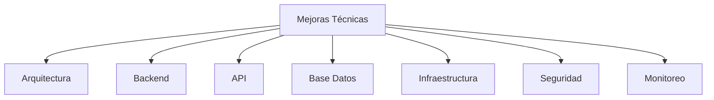

---

# 7.3 Mejoras de Arquitectura

Posibles mejoras:

* Optimización de módulos existentes.
* Mayor separación de responsabilidades.
* Nuevos patrones arquitectónicos.
* Preparación para escalabilidad.

Objetivo:

Mantener una arquitectura flexible y sostenible.

---

# 7.4 Mejoras de Backend

Posibles mejoras:

* Optimización de lógica de negocio.
* Mejora de rendimiento.
* Nuevos servicios internos.
* Refactorización controlada.

Se deberá mantener:

* Código mantenible.
* Bajo acoplamiento.
* Pruebas suficientes.

---

# 7.5 Mejoras de API

Posibles mejoras:

* Versionamiento de API.
* Nuevos endpoints.
* Mejor documentación.
* Optimización de comunicación.

Modelo evolutivo:

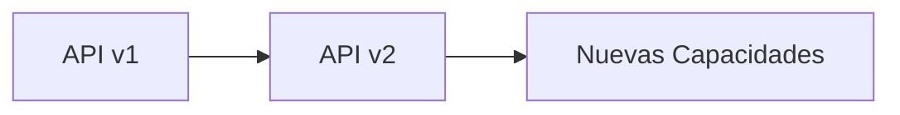

---

# 7.6 Mejoras de Base de Datos

Posibles mejoras:

* Optimización de consultas.
* Nuevos índices.
* Mejor gestión de información.
* Nuevos modelos de datos.

Consideraciones:

* Integridad.
* Migraciones controladas.
* Compatibilidad.

---

# 7.7 Mejoras de Infraestructura

Posibles mejoras:

* Optimización Docker.
* Mejor administración de servicios.
* Automatización de despliegues.
* Ampliación de recursos.

---

# 7.8 Mejoras de Seguridad

Posibles mejoras:

* Nuevos controles de acceso.
* Mejor auditoría.
* Actualización de mecanismos de protección.
* Revisión periódica de riesgos.

---

# 7.9 Mejoras de Monitoreo

Posibles mejoras:

* Nuevas métricas.
* Alertas inteligentes.
* Análisis histórico.
* Mayor observabilidad.

---

# 7.10 Priorización Técnica

Las mejoras deberán priorizarse considerando:

| Criterio | Objetivo               |
| -------- | ---------------------- |
| Impacto  | Beneficio técnico      |
| Riesgo   | Reducción de problemas |
| Esfuerzo | Recursos necesarios    |
| Urgencia | Necesidad actual       |

---

# 7.11 Resultado Esperado

Las mejoras técnicas permitirán que Chiri Platform v1.0 mantenga una base tecnológica moderna, segura y preparada para soportar nuevas funcionalidades durante su evolución.

# 8. Hitos de Desarrollo

Los hitos de desarrollo representan los objetivos principales que marcarán la evolución progresiva de Chiri Platform v1.0.

Su objetivo es establecer puntos de referencia que permitan medir el avance de la plataforma y organizar las futuras etapas de implementación.

---

# 8.1 Objetivo de los Hitos

Los hitos permitirán:

* Medir evolución del proyecto.
* Organizar prioridades.
* Validar avances.
* Controlar cambios.
* Mantener una visión estratégica.

---

# 8.2 Modelo de Hitos

La evolución se organizará mediante etapas:

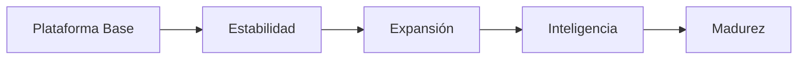

---

# 8.3 Hito 1 - Plataforma Base Consolidada

Objetivo:

Establecer una plataforma funcional y estable.

Incluye:

* Arquitectura definida.
* Componentes documentados.
* Servicios principales establecidos.
* Seguridad base implementada.

Estado:

🔒 Completado en Chiri Platform v1.0.

---

# 8.4 Hito 2 - Operación Estable

Objetivo:

Garantizar operación confiable.

Incluye:

* Pruebas completas.
* Monitoreo.
* Mantenimiento.
* Respaldo y recuperación.

Estado:

🔒 Definido mediante documentación de operación y calidad.

---

# 8.5 Hito 3 - Expansión Funcional

Objetivo:

Incorporar nuevas capacidades de usuario.

Incluye:

* Nuevos módulos.
* Nuevas automatizaciones.
* Nuevos servicios personales.
* Mejoras de experiencia.

Estado:

🟡 Planificado.

---

# 8.6 Hito 4 - Inteligencia y Automatización Avanzada

Objetivo:

Incrementar capacidades inteligentes.

Incluye:

* Integración de IA.
* Automatización contextual.
* Asistencia avanzada.
* Procesamiento inteligente.

Estado:

🟡 Planificado.

---

# 8.7 Hito 5 - Ecosistema Chiri

Objetivo:

Convertir Chiri Platform en un ecosistema personal completo.

Incluye:

* Nuevos clientes.
* Mayor integración.
* Nuevos servicios.
* Escalabilidad avanzada.

Estado:

🟡 Futuro.

---

# 8.8 Seguimiento de Hitos

Cada hito deberá registrar:

| Campo          | Descripción              |
| -------------- | ------------------------ |
| Objetivo       | Resultado esperado       |
| Alcance        | Componentes involucrados |
| Estado         | Situación actual         |
| Validación     | Criterios cumplidos      |
| Próximos pasos | Acciones siguientes      |

---

# 8.9 Criterios de Cumplimiento

Un hito se considerará completado cuando:

* Los objetivos definidos sean alcanzados.
* Las pruebas correspondientes sean satisfactorias.
* La documentación esté actualizada.
* La operación sea estable.

---

# 8.10 Resultado Esperado

Los hitos de desarrollo proporcionan una guía clara para la evolución de Chiri Platform v1.0, permitiendo avanzar progresivamente desde una plataforma base hacia un ecosistema tecnológico personal completo.

# 9. Seguimiento del Roadmap

El seguimiento del Roadmap establece los mecanismos necesarios para revisar, controlar y actualizar la evolución de Chiri Platform v1.0.

Su objetivo es garantizar que la planificación estratégica permanezca alineada con las necesidades reales de la plataforma y permita tomar decisiones basadas en información actualizada.

---

# 9.1 Objetivo del Seguimiento

El seguimiento permitirá:

* Revisar avances alcanzados.
* Detectar desviaciones.
* Actualizar prioridades.
* Evaluar nuevas necesidades.
* Mantener control sobre la evolución.

---

# 9.2 Modelo de Seguimiento

El proceso de seguimiento será continuo:

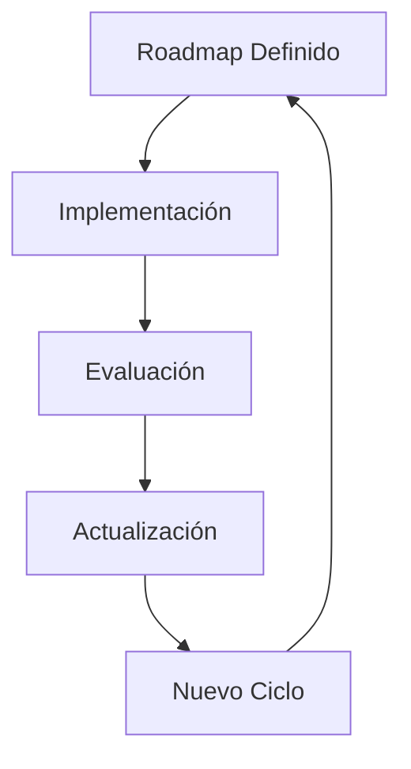

---

# 9.3 Indicadores de Seguimiento

La evolución podrá evaluarse mediante:

| Indicador                   | Objetivo               |
| --------------------------- | ---------------------- |
| Funcionalidades completadas | Medir avance funcional |
| Componentes actualizados    | Control técnico        |
| Incidencias detectadas      | Evaluar estabilidad    |
| Rendimiento                 | Medir capacidad        |
| Seguridad                   | Controlar riesgos      |

---

# 9.4 Revisión Periódica

El Roadmap deberá revisarse considerando:

* Estado actual de la plataforma.
* Nuevas necesidades.
* Cambios tecnológicos.
* Recursos disponibles.
* Prioridades futuras.

---

# 9.5 Gestión de Cambios del Roadmap

Los cambios del Roadmap deberán considerar:


---

# 9.6 Control de Avance

Cada iniciativa deberá registrar:

| Campo        | Descripción                  |
| ------------ | ---------------------------- |
| Nombre       | Identificación de iniciativa |
| Objetivo     | Resultado esperado           |
| Prioridad    | Nivel estratégico            |
| Estado       | Situación actual             |
| Dependencias | Componentes relacionados     |
| Resultado    | Validación final             |

---

# 9.7 Estados del Roadmap

Las iniciativas podrán encontrarse en:

| Estado        | Descripción             |
| ------------- | ----------------------- |
| Propuesta     | Idea identificada       |
| Evaluación    | Analizando viabilidad   |
| Planificada   | Aprobada para ejecución |
| En desarrollo | Implementación activa   |
| Completada    | Finalizada y validada   |
| Cancelada     | No continuará           |

---

# 9.8 Alineación con Documentación

Toda evolución importante deberá actualizar la documentación correspondiente:

* Arquitectura.
* Diseño técnico.
* Implementación.
* Operación.
* Seguridad.
* Decisiones arquitectónicas.

---

# 9.9 Resultado Esperado

El seguimiento del Roadmap permitirá que Chiri Platform v1.0 mantenga una evolución organizada, medible y adaptable, asegurando que cada cambio contribuya al crecimiento sostenible de la plataforma.


# 10. Cierre y Próximos Pasos

El cierre del Roadmap establece la conclusión del proceso de planificación estratégica de Chiri Platform v1.0 y define la orientación para las futuras etapas de evolución.

Este documento representa la guía general para mantener un crecimiento ordenado, sostenible y alineado con los objetivos de la plataforma.

---

# 10.1 Cierre del Roadmap

Con la definición del Roadmap queda establecido:

* La dirección futura de Chiri Platform.
* Las fases principales de evolución.
* Las prioridades estratégicas.
* Los posibles caminos de crecimiento.
* Los criterios para incorporar nuevas capacidades.

---

# 10.2 Modelo de Evolución Continua

La evolución de Chiri Platform seguirá un ciclo permanente:

```mermaid id="9m5q3x"
flowchart TD

A[Operación]
B[Análisis]
C[Planificación]
D[Implementación]
E[Validación]
F[Evolución]

A --> B
B --> C
C --> D
D --> E
E --> F
F --> A
```

---

# 10.3 Próximos Pasos Iniciales

Después de completar la documentación de Chiri Platform v1.0, los siguientes pasos serán:

## Consolidación

* Mantener documentación actualizada.
* Validar arquitectura implementada.
* Revisar estado de componentes.

---

## Desarrollo Incremental

* Implementar mejoras priorizadas.
* Incorporar nuevas funcionalidades.
* Mantener pruebas actualizadas.

---

## Evolución Tecnológica

* Evaluar nuevas tecnologías.
* Incorporar mejoras con beneficio real.
* Mantener plataforma preparada para futuro.

---

# 10.4 Criterios para Futuras Decisiones

Toda nueva iniciativa deberá responder:

* ¿Aporta valor a Chiri Platform?
* ¿Respeta la arquitectura definida?
* ¿Mantiene seguridad y privacidad?
* ¿Es sostenible a largo plazo?
* ¿Cuenta con una estrategia de mantenimiento?

---

# 10.5 Estado Final del Roadmap

```mermaid id="6x4p8m"
flowchart TD

A[Arquitectura]
B[Implementación]
C[Operación]
D[Evolución]
E[Chiri Platform Futuro]

A --> B
B --> C
C --> D
D --> E
```

---

# 10.6 Cierre Documental

Con la finalización de este documento queda establecido el Roadmap de Chiri Platform v1.0.

La plataforma queda definida con:

* Arquitectura documentada.
* Especificación completa.
* Implementación estructurada.
* Operación controlada.
* Evolución planificada.

Chiri Platform v1.0 cuenta con una base sólida para continuar su desarrollo como plataforma personal modular, escalable e inteligente.

---

# Fin del Documento

`350_Roadmap_Chiri.md`

